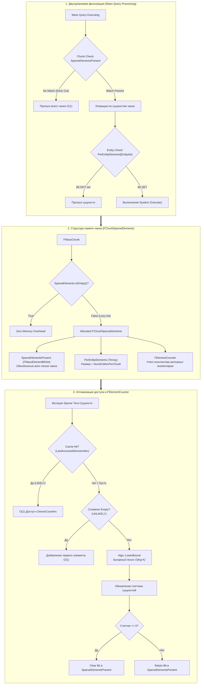

---
tags:
  - unreal-engine
  - mass-ecs
ParentMOC: "[[Mass ECS Architecture]]"
---


![[Обложка MassFramework.png]]


## Оглавление

**Часть I. Фундамент**

1. Что такое Mass и какую проблему он решает ← _эта глава_
2. Словарь Mass: сущность, фрагмент, тег, архетип, чанк (`EntityHandle.h`, `MassElement.h`)
3. Битсеты типов и композиция сущности (`MassEntityTypes.h`)

**Часть II. Хранилище данных**  
4. `FMassArchetypeData`: как данные реально лежат в памяти  
5. Хендлы и коллекции сущностей (`MassArchetypeTypes.h`, `FMassArchetypeEntityCollection`)  
6. `FMassEntityManager`, часть 1: жизненный цикл сущностей  
7. `FMassEntityManager`, часть 2: изменение композиции, shared-фрагменты, наблюдатели  
8. `FMassEntityManager`, часть 3: потокобезопасность, отложенный режим, блокировки

**Часть III. Доступ к данным**  
9. Система требований (`MassRequirements.h`)  
10. `FMassEntityQuery`: устройство, кэш архетипов, фильтры  
11. `FMassExecutionContext`: что доступно внутри цикла обработки

**Часть IV. Логика и расписание**  
12. `UMassProcessor`: анатомия процессора  
13. Порядок выполнения, группы, автоматическое разрешение зависимостей  
14. Фазы кадра: `MassProcessingPhaseManager`  
15. `FMassCommandBuffer`: отложенные структурные изменения

**Часть V. Создание сущностей из контента**  
16. `FMassEntityTemplate` и `FMassEntityTemplateData`  
17. Трейты (`UMassEntityTraitBase`) и `FMassEntityTemplateBuildContext`  
18. Реестр шаблонов, `MassEntityConfig`, спавнеры

**Часть VI. Мост в мир акторов**  
19. `UMassActorSubsystem`: связь сущность ↔ актор  
20. `UMassActorSpawnerSubsystem`: спавн, пулинг, бюджет времени  
21. `UMassRepresentationSubsystem`: ISM, LOD, визуализация толпы

**Часть VII. Практика**  
22. Сквозной пример «с нуля»: свой фрагмент, трейт, процессор, спавн  
23. Отладка и профилирование  
24. Типичные ошибки, антипаттерны и рецепты

---

## Глава 1. Что такое Mass и какую проблему он решает

### 1.1. Проблема, из которой всё выросло

Классическая модель Unreal — это акторы и компоненты. `AActor` — тяжёлый `UObject`: у него есть транзакционность, GC, репликация, `Tick`, иерархия компонентов, `USceneComponent` с трансформом и родителем. Одна сущность в такой модели — это десятки объектов, разбросанных по куче.

Пока на сцене 200 персонажей, это не важно. Когда их 20 000, вы упираетесь не в мощность процессора, а в **память и кэш**. Каждый `Tick` актора — это переход по указателю в случайное место кучи, промах кэша, загрузка целой кэш-линии (64 байта) ради того, чтобы прочитать один `float`. Плюс виртуальный вызов, плюс `TickFunction` в общем списке движка.

Mass — это ответ Epic на этот вопрос: **не «как ускорить актора», а «как вообще не создавать актора там, где он не нужен»**. Толпа, трафик, стая птиц, снаряды, сельское население — всё это не нуждается в блюпринтах, коллизии и репликации на каждом экземпляре. Ему нужен транспорт, положение, скорость и правило поведения.

### 1.2. ECS в двух абзацах

Mass реализует архитектуру **ECS (Entity–Component–System)**, в терминологии Epic — Entity–Fragment–Processor.

- **Entity (сущность)** — это не объект. Это просто число, идентификатор. Посмотрите `EntityHandle.h`: вся сущность — это `int32 Index` и `int32 SerialNumber`, ровно 8 байт, и статический ассерт это гарантирует. Никаких данных, никаких методов поведения, никакого наследования.
- **Fragment (фрагмент)** — блок данных, привязанный к сущности. Голый POD-подобный `USTRUCT` без логики: позиция, скорость, здоровье.
- **Processor (процессор)** — код без состояния, который говорит: «дай мне все сущности, у которых есть фрагменты A и B» — и обрабатывает их пачкой.

Ключевой сдвиг мышления: в ООП вы спрашиваете «что этот объект умеет?». В ECS вы спрашиваете «какие данные лежат рядом и что с ними надо сделать за один проход?». Поведение перестаёт быть свойством объекта и становится свойством _набора данных_.

### 1.3. Почему это быстро

Три причины, и все три вы увидите в коде в главах 4–5.

**Архетипы.** Сущности с одинаковым набором фрагментов и тегов группируются в один _архетип_. Архетип — это фактически таблица: столбцы — типы фрагментов, строки — сущности. Если у вас 20 000 сущностей с фрагментами `Transform + Velocity`, все они лежат в одной таблице, а не в 20 000 разрозненных объектах.

**Чанки.** Внутри архетипа данные нарезаны на блоки фиксированного размера (по умолчанию порядка размера страницы памяти). Каждый чанк держит массивы фрагментов подряд: все `Transform` вплотную, затем все `Velocity` вплотную. Это структура массивов (SoA), а не массив структур. Процессор, читающий только `Velocity`, тянет в кэш **только** байты скоростей — ни одного лишнего.

**Пакетная обработка.** Процессор не вызывается «на каждую сущность». Он получает чанк и крутит по нему плоский цикл `for`. Один виртуальный вызов на несколько сотен сущностей вместо одного на каждую. Плюс такой цикл прекрасно векторизуется компилятором и тривиально распараллеливается — отсюда `ParallelForEachEntityChunk` в `MassEntityQuery.h`.

### 1.4. Из чего состоит Mass

Mass — это не один плагин, а семейство. Ваши файлы покрывают три уровня, и полезно сразу понимать, где проходят границы: почти вся боль новичков в Mass — от попытки использовать средства верхнего уровня, не понимая нижнего.

![[mass_framework_layers_overview.png]]

Слева направо зависимость строго односторонняя: ядро ничего не знает о шаблонах и акторах, шаблоны не знают о представлении. Отсюда практическое правило: **изучать надо слева направо, а отлаживать — справа налево** (симптом видно в мире, причина обычно в ядре).

### 1.5. Как это выглядит в коде

Чтобы у вас был якорь на все следующие главы — вот минимальный полный цикл. Разбирать детали будем позже, сейчас просто посмотрите на форму.

Фрагмент — данные:

cpp

```cpp
USTRUCT()
struct FVelocityFragment : public FMassFragment
{
    GENERATED_BODY()
    FVector Value = FVector::ZeroVector;
};
```

Тег — метка без данных (нужен только чтобы попасть или не попасть в выборку):

cpp

```cpp
USTRUCT()
struct FMovingTag : public FMassTag
{
    GENERATED_BODY()
};
```

Процессор — логика:

cpp

```cpp
UCLASS()
class UMoveProcessor : public UMassProcessor
{
    GENERATED_BODY()
public:
    UMoveProcessor() : EntityQuery(*this) {}

protected:
    virtual void ConfigureQueries(const TSharedRef<FMassEntityManager>& EntityManager) override
    {
        EntityQuery.AddRequirement<FTransformFragment>(EMassFragmentAccess::ReadWrite);
        EntityQuery.AddRequirement<FVelocityFragment>(EMassFragmentAccess::ReadOnly);
        EntityQuery.AddTagRequirement<FMovingTag>(EMassFragmentPresence::All);
    }

    virtual void Execute(FMassEntityManager& EntityManager, FMassExecutionContext& Context) override
    {
        EntityQuery.ForEachEntityChunk(Context, [](FMassExecutionContext& Ctx)
        {
            const TArrayView<FTransformFragment> Transforms = Ctx.GetMutableFragmentView<FTransformFragment>();
            const TConstArrayView<FVelocityFragment> Velocities = Ctx.GetFragmentView<FVelocityFragment>();
            const float Dt = Ctx.GetDeltaTimeSeconds();

            for (int32 i = 0; i < Ctx.GetNumEntities(); ++i)
            {
                Transforms[i].GetMutableTransform().AddToTranslation(Velocities[i].Value * Dt);
            }
        });
    }

    FMassEntityQuery EntityQuery;
};
```

Обратите внимание на три вещи, которые и составляют суть Mass:

1. `AddRequirement` — это _декларация намерения_. Вы не берёте данные, вы описываете, какие данные вам нужны и в каком режиме доступа. Именно из этих деклараций система потом строит граф зависимостей между процессорами и решает, что можно запускать параллельно (глава 13).
2. `ForEachEntityChunk` даёт вам **чанк**, а не сущность. Внутри лямбды вы получаете плоские массивы и крутите обычный `for`. Никаких указателей на «объект сущности» — его не существует.
3. `EMassFragmentAccess::ReadOnly` против `ReadWrite` — не косметика. Это контракт, на основании которого движок разрешает или запрещает параллельное выполнение. Соврать здесь — значит получить гонку данных.

Из-за пункта 3 в `ConfigureQueries` есть неочевидное следствие: `ConfigureQueries` вызывается **один раз** при инициализации, а не каждый кадр. Требования — статическая характеристика процессора.

### 1.6. Что перестаёт работать привычным образом

Если вы приходите из мира акторов, вот главные ломки, к которым стоит подготовиться заранее — каждой посвящена своя глава:

**Нельзя менять состав фрагментов внутри цикла.** Добавление фрагмента меняет архетип сущности, а значит физически переносит её данные в другую таблицу. Сделать это во время итерации — то же самое, что удалять элементы из `TArray` внутри `for` по этому массиву. Решение — командный буфер (`MassCommandBuffer.h`, глава 15), который копит структурные изменения и применяет их в безопасной точке кадра.

**Указатель на фрагмент живёт до ближайшего структурного изменения.** Любой `FTransformFragment*`, взятый из чанка, становится висячим, как только какая-то сущность сменила архетип. Хранить его между кадрами нельзя. Хранить можно только `FMassEntityHandle`.

**Хендл не гарантирует, что сущность жива.** В `EntityHandle.h` прямо написано в комментарии к `IsSet()`: функция только проверяет, что `Index` и `SerialNumber` заполнены, и нет способа узнать, валидна ли сущность, не спросив у менеджера. Отсюда `SerialNumber` — защита от ABA-проблемы: индекс переиспользуется, серийный номер растёт, старый хендл на переиспользованный слот не совпадёт.

**Нет `Tick`, нет `BeginPlay`, нет наследования поведения.** Есть фазы кадра и порядок процессоров внутри фазы.

### 1.7. Карта ваших файлов

Чтобы вы понимали, куда мы движемся, вот весь ваш пакет с указанием главы:

|Файл|Роль|Глава|
|---|---|---|
|`EntityHandle.h`|идентификатор сущности|2|
|`MassElement.h`|классификация типов элементов, битсеты|2–3|
|`MassEntityTypes.h`|базовые типы, композиция, дескрипторы|3|
|`MassArchetypeData.h`|хранилище: чанки, раскладка памяти|4|
|`MassArchetypeTypes.h`|хендлы архетипов, коллекции сущностей|5|
|`MassEntityManager.h/.cpp`|центральный API — создание, удаление, композиция|6–8|
|`MassRequirements.h`|язык описания требований|9|
|`MassEntityQuery.h`|выборка и итерация|10|
|`MassExecutionContext.h`|контекст внутри цикла|11|
|`MassProcessor.h`|процессоры и их конфигурация|12–13|
|`MassProcessingPhaseManager.cpp`|привязка к кадру движка|14|
|`MassCommandBuffer.h`|отложенные операции|15|
|`MassEntityTemplate.h`|описание «типа» сущности|16|
|`MassEntityTraitBase.h`|трейты как кирпичики шаблона|17|
|`MassEntityTemplateRegistry.h`|сборка и хранение шаблонов|17–18|
|`MassActorSubsystem.h`|двусторонняя связь с акторами|19|
|`MassActorSpawnerSubsystem.h`|спавн и пулинг акторов|20|
|`MassRepresentationSubsystem.h`|визуальное представление|21|

Самый большой файл здесь — `MassEntityManager.h` (1781 строка) и `.cpp` (2792 строки). Это сердце системы, и на него уйдёт три главы.

### 1.8. Итог главы

Mass — это хранилище данных, оптимизированное под линейный обход, плюс планировщик, который умеет запускать код над этими данными параллельно и в правильном порядке. Всё остальное — шаблоны, трейты, акторы, ISM — надстройки над этими двумя вещами.

Три идеи, которые надо унести из главы 1: **сущность — это число**, **данные группируются по составу в архетипы и лежат в чанках сплошными массивами**, **логика декларирует, к каким данным и как она обращается**.

---

## Глава 2. Словарь Mass: сущность и пять видов элементов

Эта глава — фундамент. Если вы усвоите разницу между пятью типами элементов и поймёте, как работает `FElementBitSet`, всё остальное в Mass станет читаться почти без усилий. Разбираем `EntityHandle.h` и `MassElement.h`.

---

### 2.1. `FMassEntityHandle` построчно

Начнём с самого простого файла во всём фреймворке — 92 строки.

cpp

```cpp
USTRUCT(BlueprintType)
struct alignas(8) FMassEntityHandle
{
    GENERATED_BODY()

    FMassEntityHandle() = default;
    FMassEntityHandle(const int32 InIndex, const int32 InSerialNumber)
        : Index(InIndex), SerialNumber(InSerialNumber) {}

    UPROPERTY(VisibleAnywhere, Category = "Mass|Debug", Transient)
    int32 Index = 0;

    UPROPERTY(VisibleAnywhere, Category = "Mass|Debug", Transient)
    int32 SerialNumber = 0;
    ...
};
```

Разберём каждое решение — здесь нет ни одной случайной строки.

**`alignas(8)` и два `int32`.** В конце файла стоят два статических ассерта:

cpp

```cpp
static_assert(sizeof(FMassEntityHandle) == sizeof(uint64), ...);
static_assert(alignof(FMassEntityHandle) == sizeof(uint64), ...);
```

Это не эстетика, а требование к работе `AsNumber()`/`FromNumber()`:

cpp

```cpp
uint64 AsNumber() const { return *reinterpret_cast<const uint64*>(this); }

static FMassEntityHandle FromNumber(uint64 Value)
{
    FMassEntityHandle Result;
    *reinterpret_cast<uint64*>(&Result) = Value;
    return Result;
}
```

Хендл можно протащить через любой API, который умеет только `uint64` — через сетевой пакет, через `void*` в чужой системе, через тайминг-событие. Комментарий в коде честно говорит: «Relying on the fact that this struct only stores 2 integers and is aligned correctly» — то есть ассерты стоят именно для того, чтобы никто не добавил в структуру третье поле и не сломал этот трюк молча.

**Почему `Index` и `SerialNumber`, а не один `int64` ID.** `Index` — это позиция в массиве записей внутри `FMassEntityManager`. Он **переиспользуется**: удалили сущность 5000, следующая созданная скорее всего получит индекс 5000. Если бы ID был только индексом, старый хендл, сохранённый где-то в вашей системе ИИ, после переиспользования начал бы указывать на совершенно другую сущность — классическая ABA-проблема. `SerialNumber` растёт при каждом переиспользовании слота, поэтому старый хендл при сравнении не совпадёт.

**`IsSet()` и очень важный комментарий.**

cpp

```cpp
/** Note that this function is merely checking if Index and SerialNumber are set. There's no way
 *  to validate if these indicate a valid entity in an EntitySubsystem without asking the system. */
bool IsSet() const { return Index != 0 && SerialNumber != 0; }

inline bool IsValid() const { return IsSet(); }
```

Запомните это твёрдо: **`Handle.IsValid()` не означает, что сущность существует.** Он означает только «хендл не пустой». Чтобы узнать, жива ли сущность, нужно спросить менеджер: `EntityManager.IsEntityValid(Handle)`. Это источник примерно четверти всех крашей у новичков в Mass.

Заодно обратите внимание: `Index != 0` — значит **индекс 0 зарезервирован** и не выдаётся ни одной сущности. Нулевой хендл всегда невалиден, что позволяет использовать дефолтно-сконструированный `FMassEntityHandle` как «пусто».

**`operator<` с комментарием «Has meaning only for sorting purposes».** Сравнение идёт только по `Index`, без `SerialNumber`. Это не отношение порядка в математическом смысле (два разных хендла с одинаковым индексом окажутся «равны» с точки зрения сортировки), но этого достаточно, чтобы отсортировать массив сущностей по физическому расположению — а это, как мы увидим в главе 5, критично для быстрого построения `FMassArchetypeEntityCollection`.

**`GetTypeHash`** делает хендл ключом `TMap` из коробки — это активно используется, например, в `UMassRepresentationSubsystem` (`TMap<FMassEntityHandle, int32> HandledMassAgents`).

---

### 2.2. Пять видов элементов

Теперь `MassElement.h`. Всё, что можно навесить на сущность, наследуется от `FMassElement` и делится ровно на пять категорий:

cpp

```cpp
enum class EElementType : uint8
{
    Fragment,
    Tag,
    ChunkFragment,
    SharedFragment,
    ConstSharedFragment,
    MAX
};
```

Главное, что нужно понять про эти пять типов, — они отличаются **не назначением, а местом хранения и кратностью**.

![[mass_five_element_types_storage.png]]

Разберём каждый.

#### Фрагмент — `FMassFragment`

Основная рабочая лошадка. Обычные данные, своя копия у каждой сущности, лежат внутри чанка сплошным массивом.

cpp

```cpp
USTRUCT()
struct FVelocityFragment : public FMassFragment
{
    GENERATED_BODY()
    FVector Value = FVector::ZeroVector;
};
```

Правила хорошего фрагмента: маленький, тривиально копируемый, без указателей на `UObject`, без виртуальных функций, без логики. Чем меньше фрагмент, тем больше сущностей помещается в кэш-линию.

Если фрагмент по объективным причинам не тривиально копируемый, Mass требует явного признания этого факта. Пример из вашего `MassActorSubsystem.h`:

cpp

```cpp
template<>
struct TMassFragmentTraits<FMassActorInstanceFragment> final
{
    enum { AuthorAcceptsItsNotTriviallyCopyable = true };
};
```

Название говорящее — «автор согласен, что его тип не тривиально копируемый». Это не разрешение, а расписка: движок хотел бы двигать ваши данные через `memcpy` при смене архетипа, вы подтверждаете, что понимаете последствия.

Обратите внимание там же на `FObjectWrapperFragment` — специальный базовый тип для фрагментов, оборачивающих ссылки на `UObject` (`FMassActorFragment` хранит `TWeakObjectPtr<AActor>`). Отдельная база нужна, чтобы Mass знал: эти фрагменты требуют особого обращения при копировании и участвуют в удержании ссылок.

#### Тег — `FMassTag`

Пустая структура. Никаких полей — их наличие бессмысленно, потому что тег **не хранит никаких данных нигде**.

cpp

```cpp
USTRUCT()
struct FMovingTag : public FMassTag
{
    GENERATED_BODY()
};
```

Зачем тогда нужен? Тег входит в состав архетипа. Сущности с `FMovingTag` и без него лежат в **разных архетипах**, то есть в разных таблицах. Это даёт бесплатную фильтрацию: запрос с требованием `FMovingTag` вообще не заходит в архетипы, где тега нет — не «проверяет и пропускает», а не рассматривает их с самого начала.

Тег — это способ разбить популяцию на подмножества так, чтобы обход подмножества стоил ровно столько же, сколько обход отдельного массива. Цена — смена тега означает физический перенос всех фрагментов сущности в другой архетип. Отсюда правило: **теги для состояний, которые меняются редко** («в бою», «спит», «видим камерой»), а не для флагов, переключающихся каждый кадр.

В `MassEntityTemplateRegistry.h` вы увидите, что теги специально выделены:

cpp

```cpp
template<typename T>
void AddTag()
{
    // Tags can be added by multiple traits, so they do not follow the same rules as fragments
    TemplateData.AddTag<T>();
    TypeAdded(T::StaticStruct());
}
```

Два разных трейта могут добавить один и тот же тег — это не конфликт, потому что складывать нечего. Два трейта, добавляющих один фрагмент, — конфликт, потому что непонятно, чьё значение победит.

#### Чанк-фрагмент — `FMassChunkFragment`

Один экземпляр на чанк. Не на сущность и не на архетип — именно на чанк.

Это механизм кэширования результатов на уровне блока. Классический пример из движка — LOD: процессор считает, что все сущности этого чанка находятся далеко от камеры, пишет это в чанк-фрагмент, и следующий процессор, увидев флаг, пропускает весь чанк целиком одним `if`, не заходя внутрь цикла.

Важная особенность: чанк-фрагмент **не переживает реорганизацию**. Сущности переезжают между чанками, чанки создаются и уничтожаются — считать его надёжным хранилищем нельзя. Это исключительно кэш на один кадр или на один проход.

#### Общие фрагменты — `FMassSharedFragment` и `FMassConstSharedFragment`

Один экземпляр данных на множество сущностей. Сущность хранит не копию, а ссылку.

Типичный случай: 5000 солдат одной фракции используют один и тот же набор параметров — скорость движения, радиус обзора, дистанция атаки. Копировать эти 200 байт 5000 раз бессмысленно.

Разница между двумя вариантами принципиальная:

- **`FMassConstSharedFragment`** — неизменяемые данные, конфигурация. Mass дедуплицирует их по значению: два трейта, создавшие одинаковый конфиг, получат один и тот же экземпляр. Читать можно из любого потока без синхронизации.
- **`FMassSharedFragment`** — изменяемые общие данные. Дедупликации по значению нет — экземпляр создаётся явно и явно раздаётся. Запись в него из параллельного цикла требует вашей собственной синхронизации, и Mass это учитывает при построении графа зависимостей.

Хранятся они не в чанке, а в `FMassArchetypeSharedFragmentValues` — контейнере из `MassEntityTypes.h`, который держит `FConstSharedStruct`/`FSharedStruct` (умные указатели на разделяемые структуры). Разберём его подробно в главе 7; пока отметим сигнатуру, которая многое объясняет:

cpp

```cpp
inline bool ContainsType(const UScriptStruct* FragmentType) const
{
    return (UE::Mass::IsA<FMassSharedFragment>(FragmentType) || UE::Mass::IsA<FMassConstSharedFragment>(FragmentType))
        && StoredElementsBitSet.Contains(FragmentType);
}
```

Сначала проверка «это вообще общий фрагмент?», потом проверка наличия. Тип элемента — первичная характеристика, всё в Mass начинается с неё.

---

### 2.3. Как Mass определяет тип элемента

Ключевая функция — `FElementBitSet::DetermineElementType`:

cpp

```cpp
static EElementType DetermineElementType(const TNotNull<const UStruct*> ElementType)
{
    if (UE::Mass::IsA<FMassFragment>(ElementType))            { return EElementType::Fragment; }
    else if (UE::Mass::IsA<FMassTag>(ElementType))            { return EElementType::Tag; }
    else if (UE::Mass::IsA<FMassSharedFragment>(ElementType)) { return EElementType::SharedFragment; }
    else if (UE::Mass::IsA<FMassConstSharedFragment>(ElementType)) { return EElementType::ConstSharedFragment; }
    else if (UE::Mass::IsA<FMassChunkFragment>(ElementType))  { return EElementType::ChunkFragment; }

    checkf(false, TEXT("%hs: Unhandled element type %s"), __FUNCTION__, *ElementType->GetName())
    return EElementType::MAX;
}
```

Практический вывод: **всегда наследуйтесь ровно от одной из пяти баз**. Забыли наследоваться от `FMassFragment` и написали просто `USTRUCT` — получите `checkf(false)` в рантайме с внятным сообщением. Наследоваться от `FMassElement` напрямую нельзя — функция не найдёт категорию.

Для компайл-тайм проверок есть концепты из `MassEntityConcepts.h`, вы их встретите по всему коду:

cpp

```cpp
template<typename T>
void RequireFragment()
{
    static_assert(UE::Mass::CTag<T> == false, "Given struct type is a valid fragment type.");
    AddDependency(T::StaticStruct());
}

template<typename T>
void RequireTag()
{
    static_assert(UE::Mass::CTag<T>, "Given struct type is not a valid tag type.");
    AddDependency(T::StaticStruct());
}
```

`CTag`, `CSharedFragment`, `CConstSharedFragment` — это C++20-концепты, которые ловят ошибку на этапе компиляции. Хорошая привычка: если пишете свой шаблонный хелпер над Mass, ставьте такой `static_assert` — сообщение об ошибке будет в разы понятнее, чем полотно от инстанцирования шаблона.

---

### 2.4. `FElementBitSet` — как весь состав сущности умещается в несколько слов

Теперь самое интересное. Как Mass отвечает на вопрос «есть ли у этого архетипа фрагменты A, B и тег C, и нет ли тега D» — быстро, для тысяч архетипов, каждый кадр?

Ответ: **битовые множества**. Каждому типу элемента при регистрации выдаётся уникальный индекс, и весь состав архетипа — это битовая маска, где бит N означает «тип с индексом N присутствует».

cpp

```cpp
DECLARE_STRUCTTYPEBITSET_EXPORTED(UE_API, FElementBitSetBase, FMassElement);
```

Этот макрос из `StructUtils/StructTypeBitSet.h` создаёт битсет, привязанный к «трекеру типов» — глобальному реестру, который раздаёт индексы всем наследникам `FMassElement`. Регистрация происходит лениво, при первом обращении к типу:

cpp

```cpp
static void OnTypeRegistered(const TNotNull<const UStruct*> Type, int32 Index);
static void OnModuleInitialized();

static void OnModuleShutdown()
{
    FElementBitSetBaseStructTrackerWrapper::StructTracker.OnTypeRegistered.Remove(OnTypeRegisteredDelegateHandle);
}
```

Когда трекер регистрирует новый тип, Mass подписан на это событие и делает важную вещь: раскладывает тип по категориям.

cpp

```cpp
protected:
    UE_API static TStaticArray<FElementBitSetBase, static_cast<uint8>(EElementType::MAX)> ElementTypeBitArrays;
    UE_API static FElementBitSet AllSharedFragmentsBitSet;
    UE_API static FElementBitSet AllFragmentsAndTagsBitSet;
    UE_API static FElementBitSet AllSparseElementsBitSet;
```

`ElementTypeBitArrays` — это пять «эталонных» масок: маска всех известных фрагментов, маска всех известных тегов, и так далее. Именно из этого вытекает вся элегантность дальнейшего кода.

**Извлечение подмножества — одна операция AND:**

cpp

```cpp
static FElementBitSetBase& GetTypeBitArray(const EElementType ElementType)
{
    return ElementTypeBitArrays[static_cast<uint8>(ElementType)];
}

template<typename TBitSet>
inline TBitSet FElementBitSet::Get() const
{
    return GetTypeBitArray(TBitSetTraits<TBitSet>::ElementType) & *this;
}
```

Хотите получить только фрагменты из общего состава? `Composition.Get<FMassFragmentBitSet>()` — это `маска_всех_фрагментов & состав`. Никаких циклов, никаких проверок типов в рантайме.

**Проверки — тоже маски:**

cpp

```cpp
inline bool FElementBitSet::HasAnySharedElements() const
{
    return FElementBitSetBase::HasAny(GetTypeBitArray(EElementType::SharedFragment))
        || FElementBitSetBase::HasAny(GetTypeBitArray(EElementType::ConstSharedFragment));
}

inline bool FElementBitSet::ContainsOnlyTagsAndFragments() const
{
    return GetFragmentsAndTags().IsEquivalent(*this);
}
```

Последняя особенно красива: «содержит только теги и фрагменты» = «если отфильтровать всё, кроме тегов и фрагментов, останется то же самое».

И два хелпера снаружи структуры, которые прямо документируют, зачем всё это:

cpp

```cpp
/** @return whether BitSet indicates only shared fragment types (both const and mutable) */
inline bool DoesContainOnlySharedFragments(const FElementBitSet& BitSet)
{
    return FElementBitSet::GetAllSharedFragments().HasAll(BitSet);
}

/** @return whether shared fragment type information stored by both bitsets is equivalent */
inline bool DoContainEquivalentSharedFragments(const FElementBitSet& BitSetA, const FElementBitSet& BitSetB)
{
    return BitSetA.IsEquivalentFiltered(BitSetB, FElementBitSet::GetAllSharedFragments());
}
```

`IsEquivalentFiltered` — «равны ли эти два набора, если смотреть только через третью маску». Сравнить составы двух архетипов только по общим фрагментам — одна операция.

**Практический итог:** сопоставление запроса с архетипом (глава 10) — это горстка побитовых операций над несколькими `uint32`. Именно поэтому Mass может позволить себе перебирать сотни архетипов на каждый запрос без заметной стоимости.

---

### 2.5. Типобезопасные обёртки: макрос `DECLARE_NEWTYPEBITSET`

Все битсеты физически одинаковы — это одни и те же биты в одном и том же адресном пространстве индексов. Но смешивать «маску фрагментов» и «маску тегов» в API опасно. Решение — обёртки, порождаемые макросом:

cpp

```cpp
#define DECLARE_NEWTYPEBITSET(ContainerTypeName, BaseType, ElementTypeEnumValue) 
struct ContainerTypeName : public FElementBitSetBase                             
{                                                                                
    using FElementType = BaseType;                                               
    ...                                                                          
    template<typename T>                                                         
    static const FElementBitSetBase& GetTypeBitSet()                             
    {                                                                            
        static_assert(TIsDerivedFrom<typename TRemoveReference<T>::Type, BaseType>::Value, 
            "Type does not match the expected element type for this bitset.");   
        return FElementBitSetBase::GetTypeBitSet<T>();                           
    }                                                                            
};                                                                               
template<> struct TElementTraits<BaseType>  {
	static constexpr EElementType ElementType = ElementTypeEnumValue; }; 
template<> struct TBitSetTraits<ContainerTypeName> {
	static constexpr EElementType ElementType = ElementTypeEnumValue; }
```

Применяется пять раз:

cpp

```cpp
DECLARE_NEWTYPEBITSET(FFragmentBitSet,            FMassFragment,            EElementType::Fragment);
DECLARE_NEWTYPEBITSET(FTagBitSet,                 FMassTag,                 EElementType::Tag);
DECLARE_NEWTYPEBITSET(FChunkFragmentBitSet,       FMassChunkFragment,       EElementType::ChunkFragment);
DECLARE_NEWTYPEBITSET(FSharedFragmentBitSet,      FMassSharedFragment,      EElementType::SharedFragment);
DECLARE_NEWTYPEBITSET(FConstSharedFragmentBitSet, FMassConstSharedFragment, EElementType::ConstSharedFragment);
```

Обратите внимание на два вспомогательных шаблона:

- `TElementTraits<БазовыйТип>` — «по типу элемента узнать категорию»
- `TBitSetTraits<ТипБитсета>` — «по типу битсета узнать категорию»

Именно они делают возможным `Get<FMassFragmentBitSet>()` без единого `if` в рантайме: категория известна на этапе компиляции.

В конце файла — псевдонимы глобального пространства имён, которые вы и будете видеть в реальном коде:

cpp

```cpp
using FMassElementBitSet            = UE::Mass::FElementBitSet;
using FMassFragmentBitSet           = UE::Mass::FFragmentBitSet;
using FMassTagBitSet                = UE::Mass::FTagBitSet;
using FMassChunkFragmentBitSet      = UE::Mass::FChunkFragmentBitSet;
using FMassSharedFragmentBitSet     = UE::Mass::FSharedFragmentBitSet;
using FMassConstSharedFragmentBitSet= UE::Mass::FConstSharedFragmentBitSet;
```

---

### 2.6. Шестой битсет — подсистемы

В самом начале `MassElement.h` есть строка, которая не относится к элементам сущности:

cpp

```cpp
DECLARE_CLASSTYPEBITSET_EXPORTED(UE_API, FMassExternalSubsystemBitSet, USubsystem);
```

Тот же механизм, но для классов `USubsystem`. Процессору мало объявить, какие фрагменты он читает, — ему часто нужен доступ к внешним подсистемам (`UMassActorSubsystem`, `UMassRepresentationSubsystem`). Эти обращения тоже надо учитывать при планировании параллелизма: два процессора, пишущих в одну подсистему, нельзя запускать одновременно.

Как система узнаёт, безопасно ли трогать подсистему из рабочего потока — через трейты. Пример из вашего `MassActorSubsystem.h`:

cpp

```cpp
template<>
struct TMassExternalSubsystemTraits<UMassActorSubsystem> final
{
    enum
    {
        GameThreadOnly = false,
        ThreadSafeWrite = false
    };
};
```

Читать `UMassActorSubsystem` можно из любого потока (`GameThreadOnly = false`), но писать параллельно нельзя (`ThreadSafeWrite = false`). Подробно — в главе 9, когда дойдём до `FMassSubsystemRequirements`.

---

### 2.7. Про «разреженные» элементы

В коде UE 5.8 появились упоминания, которых нет в старых версиях:

cpp

```cpp
FElementBitSet GetSparseElements() const;
static const FElementBitSet& GetAllSparseElements();
```

и в `MassEntityTypes.h`:

cpp

```cpp
enum class EIncludeSparseElements : uint8 { No, Yes };
```

а также `FMassSparseTag` — упоминается в комментариях к сериализации. Это относительно свежий механизм: элементы, которые **не влияют на архетип**. Обычный тег меняет архетип и вызывает перенос данных; разреженный тег хранится сбоку и переключается дёшево. Ровно тот случай, для которого обычные теги плохи — часто меняющиеся флаги.

Механизм на момент 5.8 ещё в развитии, поэтому отдельной главы под него не будет — вернёмся к нему в главе 7, когда разберём, как менеджер меняет композицию сущности.

---

### 2.8. Как выбрать нужный тип: практическая таблица

|Вопрос|Ответ|
|---|---|
|Данные свои у каждой сущности, меняются часто|**Фрагмент**|
|Нужно разделить популяцию на группы, состояние меняется редко|**Тег**|
|Результат вычисления, общий для блока сущностей, живёт один кадр|**Чанк-фрагмент**|
|Конфиг, одинаковый у тысяч сущностей, только чтение|**Const shared фрагмент**|
|Общее изменяемое состояние (счётчик, буфер группы)|**Shared фрагмент**|

И контрольный вопрос, который стоит задавать себе всегда: **как часто меняется эта величина?** Если каждый кадр — фрагмент. Если раз в несколько секунд и делит популяцию — тег. Если никогда — const shared.

---

### 2.9. Подводные камни главы

1. **`IsValid()` на хендле ничего не гарантирует.** Проверка жизни — только через менеджер.
2. **Нельзя добавлять поля в `FMassEntityHandle`.** Сработает `static_assert`, и это правильно.
3. **Тег с полями** компилируется, но поля недоступны — они физически негде не хранятся. Ошибка молчаливая.
4. **Забытое наследование от одной из пяти баз** даёт `checkf(false)` в `DetermineElementType` в рантайме, а не в компиляции. Проверяйте базовый класс первым делом при странном краше на старте.
5. **Тег как часто меняющийся флаг** — самая дорогая ошибка проектирования в Mass. Каждое переключение = перенос всех фрагментов сущности в другой архетип. При 10 000 сущностей, переключающих тег каждый кадр, вы получите производительность хуже, чем на акторах.
6. **Чанк-фрагмент как хранилище состояния между кадрами** — данные пропадут при первой же реорганизации чанков.

---

### 2.10. Итог главы

Сущность — 8 байт: индекс плюс защита от переиспользования. Всё, что к ней прикреплено, делится на пять категорий, различающихся местом хранения и кратностью. Категория определяется базовым классом и вычисляется один раз при регистрации типа. Состав сущности представлен битовой маской, а все вопросы вида «есть ли у неё то и это» сводятся к побитовым операциям над несколькими машинными словами — благодаря пяти заранее подготовленным эталонным маскам.

---

## Глава 3. `MassEntityTypes.h`: состав, общие значения и служебные типы

Это первый по-настоящему большой файл — 1192 строки. Он не содержит «главного класса»: это набор типов-кирпичей, на которых стоит всё хранилище. Разберём его по четырём смысловым блокам: описание состава, хранилище общих значений, категории операций и служебные типы для пакетных операций.

---

### 3.1. `FMassArchetypeCompositionDescriptor` — полный состав сущности

#### Что это

Дескриптор композиции отвечает на вопрос «из чего состоит эта сущность (или этот архетип)». Именно он определяет **идентичность архетипа**: два архетипа с одинаковым дескриптором — это один и тот же архетип.

#### Важнейшая деталь: файл в процессе рефакторинга

Прежде чем разбирать API, обратите внимание на то, что происходит с этой структурой в 5.7–5.8. Исторически она хранила пять отдельных битсетов:

cpp

```cpp
UE_DEPRECATED(5.7, "Direct access to FMassArchetypeCompositionDescriptor's bitsets is deprecated...")
FMassFragmentBitSet Fragments;
UE_DEPRECATED(5.7, ...) FMassTagBitSet Tags;
UE_DEPRECATED(5.7, ...) FMassChunkFragmentBitSet ChunkFragments;
UE_DEPRECATED(5.7, ...) FMassSharedFragmentBitSet SharedFragments;
UE_DEPRECATED(5.7, ...) FMassConstSharedFragmentBitSet ConstSharedFragments;

protected:
    FMassElementBitSet ElementsBitSet;
```

Теперь реальное хранилище — **один** `ElementsBitSet`, а пять старых полей помечены как устаревшие. Более того, в коде прямо написано намерение:

cpp

```cpp
/**
 * Constructor deliberately not marked as explicit to support near-future change where we get rid of
 * FMassArchetypeCompositionDescriptor since it's just a wrapper for FMassElementBitSet now.
 */
FMassArchetypeCompositionDescriptor(const FMassElementBitSet& InElements)
    : ElementsBitSet(InElements) {}
```

Дескриптор в обозримом будущем исчезнет и превратится просто в `FMassElementBitSet`. Из этого следуют два практических вывода:

**Первый.** Не пишите новый код через геттеры подмножеств. Посмотрите на формулировки депрекейшенов:

cpp

```cpp
UE_DEPRECATED(5.8, "Getting a subset of composition's bitsets is slow now. Consider refactoring your code to work directly on FMassElementBitSet")
FMassFragmentBitSet GetFragments() const;
```

«Slow now» — не отговорка. Раньше `GetFragments()` возвращал уже готовое поле. Теперь это операция AND с эталонной маской всех фрагментов плюс копирование результата. Если вы вызываете её в цикле по архетипам, вы платите за это каждый раз.

**Второй.** Для отладки оставлены отдельные функции с честными именами:

cpp

```cpp
FMassFragmentBitSet DebugGetFragments() const;
FMassTagBitSet DebugGetTags() const;
FMassChunkFragmentBitSet DebugGetChunkFragments() const;
FMassSharedFragmentBitSet DebugGetSharedFragments() const;
FMassConstSharedFragmentBitSet DebugGetConstSharedFragments() const;
```

Префикс `Debug` — сигнал: пользуйтесь этим в логах и точках останова, но не в горячем коде.

#### Операции над составом

Основной набор — это алгебра множеств:

cpp

```cpp
void Append(const FMassArchetypeCompositionDescriptor& OtherDescriptor)  // объединение
{
    ElementsBitSet += OtherDescriptor.ElementsBitSet;
}

void Remove(const FMassArchetypeCompositionDescriptor& OtherDescriptor)  // вычитание
{
    ElementsBitSet -= OtherDescriptor.ElementsBitSet;
}

FMassArchetypeCompositionDescriptor CalculateDifference(const FMassArchetypeCompositionDescriptor& OtherDescriptor) const
{
    return FMassArchetypeCompositionDescriptor(ElementsBitSet - OtherDescriptor.ElementsBitSet);
}

bool HasAll(const FMassArchetypeCompositionDescriptor& OtherDescriptor) const
{
    return ElementsBitSet.HasAll(OtherDescriptor.GetElementsBitSet());
}
```

`CalculateDifference` — это ровно то, что нужно менеджеру, когда сущность переезжает из архетипа A в архетип B: «что надо добавить» и «что надо удалить» вычисляются двумя вычитаниями.

#### Два разных сравнения — не путайте

cpp

```cpp
/** Compares contents ..., ignoring the trailing empty bits in the bitsets */
bool IsEquivalent(const FMassArchetypeCompositionDescriptor& OtherDescriptor) const
{
    return ElementsBitSet.IsEquivalent(OtherDescriptor.GetElementsBitSet());
}

/** Checks whether contents ... are identical. */
bool IsIdentical(const FMassArchetypeCompositionDescriptor& OtherDescriptor) const
{
    return ElementsBitSet == OtherDescriptor.GetElementsBitSet();
}
```

Разница тонкая, но существенная. Битсет — это `TArray` машинных слов, которая растёт по мере регистрации новых типов. Два дескриптора могут описывать один и тот же набор типов, но иметь разную длину внутреннего массива (один создали раньше, другой позже, когда типов зарегистрировалось больше). `IsIdentical` сравнивает побайтово и в этом случае вернёт `false`. `IsEquivalent` игнорирует хвостовые нули и вернёт `true`.

**Практическое правило: почти всегда вам нужен `IsEquivalent`.** `IsIdentical` — для случаев, когда вы точно знаете, что оба битсета созданы в один момент времени.

#### Хеш — ключ к поиску архетипа

cpp

```cpp
uint32 CalculateHash() const
{
    return GetTypeHash(ElementsBitSet);
}
```

Когда вы просите менеджер создать сущность с определённым составом, он считает этот хеш и ищет в `TMap` готовый архетип. Отсюда важное свойство: **порядок добавления фрагментов не имеет значения**. `Transform + Velocity` и `Velocity + Transform` — это биты в одном и том же множестве, один и тот же хеш, один и тот же архетип.

#### Универсальный доступ

cpp

```cpp
template<typename TBitSet>
TBitSet Get() const { return ElementsBitSet.Get<TBitSet>(); }

template<typename TElementType>
bool HasAny() const { return ElementsBitSet.HasAny<TElementType>(); }

template<typename TElementType>
bool HasAll() const { return ElementsBitSet.HasAll<TElementType>(); }

int32 CountStoredTypes() const;
void DebugOutputDescription(FOutputDevice& Ar) const;
```

`DebugOutputDescription` — ваш друг при отладке. Она печатает человекочитаемый список всех типов в составе. Вызывайте её из точки останова, когда сущность оказалась не в том архетипе, где вы ожидали.

---

### 3.2. `FMassArchetypeSharedFragmentValues` — где живут общие значения

#### Ключевой комментарий файла

Перед структурой стоит комментарий, который стоит того, чтобы разобрать его отдельно — он объясняет модель, которую иначе пришлось бы выводить из кода:

> Типы общих фрагментов влияют на композицию архетипа (два архетипа с разными наборами типов общих фрагментов различны). Значения общих фрагментов хранятся **по чанкам** — сущности одного архетипа с разными общими значениями помещаются в разные чанки. Выбор чанка использует `IsEquivalent()`, который сравнивает по идентичности указателей (хеш от адресов памяти структур). Когда общие фрагменты получены через `GetOrCreateConstSharedFragment`/`GetOrCreateSharedFragment`, одинаковые значения дедуплицируются (тот же указатель), поэтому `IsEquivalent` фактически работает как сравнение по значению в ожидаемом сценарии использования.

Это одна из самых недопонимаемых вещей в Mass, поэтому разберём её на схеме.

![[shared_fragment_type_vs_value_placement.png]]

Три практических следствия, которые надо запомнить:

1. **Смена типа общего фрагмента = смена архетипа** (дорого, перенос всех данных).
2. **Смена значения общего фрагмента = переезд в другой чанк** (дешевле, но всё равно структурное изменение — в цикле делать нельзя).
3. **Много разных значений одного общего фрагмента фрагментируют чанки.** Если у вас 500 фракций, каждая со своим конфигом, вы получите минимум 500 чанков в одном архетипе, каждый заполненный частично. Это убивает главное преимущество Mass — плотность данных. Общие фрагменты хороши, когда разных значений единицы или десятки, а не сотни.

#### Внутреннее устройство

cpp

```cpp
protected:
    mutable uint32 HashCache = UINT32_MAX;
    mutable bool bSorted = true;

    FMassElementBitSet StoredElementsBitSet;
    TArray<FConstSharedStruct> ConstSharedFragments;
    TArray<FSharedStruct> SharedFragments;

private:
    mutable FTransactionallySafeRWLock HashLock;
```

Два раздельных массива — константные и изменяемые общие фрагменты — плюс битсет типов для быстрых проверок, плюс кэш хеша под блокировкой.

`FConstSharedStruct` и `FSharedStruct` — это типы из `StructUtils`: подсчитываемые ссылки на разделяемые `USTRUCT`. Сама структура здесь владеет не данными, а ссылками; данные живут в менеджере.

#### Механика хеша: три поля, работающие вместе

Хеш этой структуры используется для выбора чанка, то есть считается часто. Поэтому он кэшируется:

cpp

```cpp
inline uint32 CacheHash() const
{
    {
        UE::TReadScopeLock ReadLock{ HashLock };
        if (HashCache != UINT32_MAX)
        {
            return HashCache;
        }
    }
    {
        UE::TWriteScopeLock WriteLock{ HashLock };
        HashCache = CalculateHash();
        return HashCache;
    }
}

friend inline uint32 GetTypeHash(const FMassArchetypeSharedFragmentValues& SharedFragmentValues)
{
    return SharedFragmentValues.CacheHash();
}
```

Классический паттерн двойной блокировки: сначала дешёвая читающая, при промахе — пишущая. `UINT32_MAX` играет роль «значение не вычислено».

Сброс кэша:

cpp

```cpp
inline void DirtyHashCache()
{
    UE::TWriteScopeLock ScopeLock{ HashLock };
    HashCache = UINT32_MAX;
    // we consider a single shared fragment as being "sorted"
    bSorted = (SharedFragments.Num() + ConstSharedFragments.Num() <= 1);
}
```

Здесь появляется `bSorted`, и вот зачем он нужен:

cpp

```cpp
void Sort()
{
    if(!bSorted)
    {
        ConstSharedFragments.Sort(FStructTypeSortOperator());
        SharedFragments.Sort(FStructTypeSortOperator());
        bSorted = true;
    }
}
```

**Хеш должен зависеть от набора, а не от порядка добавления.** Если один код добавил `{Конфиг, Параметры}`, а другой — `{Параметры, Конфиг}`, это одно и то же значение, и оно обязано дать один хеш, иначе сущности разъедутся по разным чанкам без причины. Сортировка по типу перед вычислением хеша решает эту задачу. Оптимизация в `DirtyHashCache` очевидна: коллекция из нуля или одного элемента отсортирована по определению, сортировать нечего.

Обратите внимание на `mutable` у `HashCache`, `bSorted` и `HashLock`: вычисление хеша меняет состояние объекта, но логически он остаётся константным. Это корректное применение `mutable`.

`FTransactionallySafeRWLock` вместо обычного `FRWLock` — требование поддержки транзакционной памяти (AutoRTFM) в UE 5. Внутри транзакции обычные блокировки могут привести к некорректному откату.

#### Добавление: «добавить» на самом деле означает «добавить или вернуть существующее»

cpp

```cpp
/**
 * Adds Fragment to the collection.
 * Method will ensure if a fragment of the given FMassConstSharedFragment subclass has already been added.
 * In that case the method will return the previously added instance if the given type has been added
 * as a CONST shared fragment and if not it will return an empty FConstSharedStruct.
 */
MASSENTITY_API FConstSharedStruct Add_GetRef(const FConstSharedStruct& Fragment);
```

Три поведения в одной функции:

- типа ещё нет → добавляется, возвращается он же;
- тип уже есть как const → **ничего не добавляется**, срабатывает `ensure`, возвращается существующий экземпляр;
- тип уже есть, но в другой «роли» (как изменяемый) → возвращается пустой `FConstSharedStruct`.

Два экземпляра одного типа в одной коллекции невозможны — это прямо сказано в комментарии к структуре. И смена роли типа (был const, стал mutable) не поддерживается — это описано в `Append`:

cpp

```cpp
/**
 * Appends contents of Other to `this` instance. All common fragments will get overridden with values in Other.
 * Note that changing a fragments "role" (being const or non-const) is not supported and the function will fail an
 * ensure when that is attempted.
 * @return number of fragments added or changed
 */
MASSENTITY_API int32 Append(const FMassArchetypeSharedFragmentValues& Other);
```

Пара `Add`/`Add_GetRef` — общий паттерн UE 5.6+: короткая форма без возвращаемого значения и форма с ним. Старые `AddConstSharedFragment`/`AddSharedFragment` помечены как устаревшие с 5.6.

#### Удаление — всегда по типу, никогда по значению

cpp

```cpp
MASSENTITY_API int32 Remove(const FMassElementBitSet& ElementBitSet);

int32 Remove(const FMassSharedFragmentBitSet& SharedFragmentToRemoveBitSet)
{ return Remove(FMassElementBitSet(SharedFragmentToRemoveBitSet)); }

int32 Remove(const FMassArchetypeCompositionDescriptor& InDescriptor)
{ return Remove(InDescriptor.GetAllSharedFragments()); }

int32 Remove(const FMassArchetypeSharedFragmentValues& Other)
{ return Remove(Other.GetBitSet()); }
```

Четыре перегрузки, все сводятся к одной реализации через битсет. Даже когда вы передаёте другой набор _значений_, удаление идёт по типам этих значений — комментарий об этом прямо предупреждает.

#### `CreateCombined` — фабрика для смены композиции

cpp

```cpp
/**
 * @param SharedFragmentValuesModification if provided will be used to override or add values already existing in Original.
 *  Needs to be consistent with NewSharedElementComposition, meaning, not add anything that's not already in the bitset.
 * Also, if NewSharedElementComposition contains elements not in Original, then SharedFragmentValuesModification has to
 * provide a value for it.
 */
MASSENTITY_API static FMassArchetypeSharedFragmentValues CreateCombined(
    const FMassArchetypeSharedFragmentValues& Original,
    const FMassElementBitSet& NewSharedElementComposition,
    const FMassArchetypeSharedFragmentValues* SharedFragmentValuesModification);
```

Это то, что вызывается, когда сущность меняет архетип: берём старые значения, накладываем новую композицию типов, применяем модификации. Контракт строгий: если новая композиция требует тип, которого не было, вы обязаны предоставить для него значение — иначе получится «тип есть, значения нет».

#### Замена значений на месте

cpp

```cpp
template<typename TSharedStruct>
void ReplaceSharedFragments(TArrayView<TSharedStruct> Fragments)
{
    using FDecayedSharedStruct = TDecay<TSharedStruct>::Type;

    DirtyHashCache();
    for (const TSharedStruct& NewFragment : Fragments)
    {
        const UScriptStruct* NewFragScriptStruct = NewFragment.GetScriptStruct();
        check(NewFragScriptStruct);

        bool bEntryFound = false;
        for (FDecayedSharedStruct& MyFragment : GetMutableFragmentsContainer<FDecayedSharedStruct>())
        {
            if (MyFragment.GetScriptStruct() == NewFragScriptStruct)
            {
                MyFragment = NewFragment;
                bEntryFound = true;
                break;
            }
        }
        ensureMsgf(bEntryFound, TEXT("Existing fragment of type %s could not be found"), *GetNameSafe(NewFragScriptStruct));
    }
}
```

Здесь видно сразу три вещи. Во-первых, `DirtyHashCache()` вызывается **первым делом** — любое изменение содержимого обязано инвалидировать хеш. Во-вторых, `GetMutableFragmentsContainer<T>()` — шаблонный диспетчер, который по типу (`FSharedStruct` или `FConstSharedStruct`) выбирает нужный из двух массивов; типовая диспетчеризация на этапе компиляции вместо `if`. В-третьих, замена работает только для уже существующих типов — новые не добавляются, и попытка ловится `ensure`.

---

### 3.3. Категории операций: `EMassObservedOperation`

cpp

```cpp
UENUM()
enum class EMassObservedOperation : uint8
{
    AddElement,    // элемент добавлен существующей сущности
    RemoveElement, // элемент удалён у существующей сущности
    DestroyEntity, // сущность уничтожена — частный случай RemoveElement
    CreateEntity,  // сущность создана — частный случай AddElement
    MAX,
    Add UMETA(Deprecated, ...),
    Remove UMETA(Deprecated, ...)
};
```

Комментарии в коде объясняют логику: уничтожение сущности — это частный случай удаления элементов, потому что у сущности удаляются **все** элементы. Создание — симметрично.

Зачем это нужно: Mass поддерживает **наблюдателей** (observers) — процессоры, которые запускаются не каждый кадр, а в ответ на структурное изменение. «Когда сущности добавили `FMassActorFragment` — выполни инициализацию». Подробно разберём в главе 7.

Рядом — флаговая версия, чтобы подписаться на несколько операций сразу:

cpp

```cpp
enum class EMassObservedOperationFlags : uint8
{
    None = 0,
    AddElement    = 1 << static_cast<uint8>(EMassObservedOperation::AddElement),
    RemoveElement = 1 << static_cast<uint8>(EMassObservedOperation::RemoveElement),
    CreateEntity  = 1 << static_cast<uint8>(EMassObservedOperation::CreateEntity),
    DestroyEntity = 1 << static_cast<uint8>(EMassObservedOperation::DestroyEntity),

    Add    = AddElement | CreateEntity,
    Remove = RemoveElement | DestroyEntity,
    All    = Add | Remove,
};
ENUM_CLASS_FLAGS(EMassObservedOperationFlags);
```

Красивый приём: биты флагов выводятся сдвигом из значений основного перечисления, поэтому два типа не могут рассинхронизироваться при добавлении новой операции. Составные значения `Add`/`Remove` покрывают частый случай «мне всё равно, добавили элемент или создали сущность — реагирую одинаково».

Ещё одно маленькое перечисление:

cpp

```cpp
enum class EMassExecutionContextType : uint8 { Local, Processor, MAX };
```

Контекст выполнения бывает «процессорный» (создан планировщиком, живёт весь кадр) и «локальный» (создан вручную для разового обхода). Разница в том, куда деваются накопленные команды — вернёмся к этому в главе 11.

---

### 3.4. Пакетная передача данных: `FMassGenericPayloadView`

Дальше в файле идёт блок типов, которые нужны исключительно для **пакетных операций** — когда командный буфер применяет тысячу одинаковых команд разом.

cpp

```cpp
/**
 * Note that this is a view and is valid only as long as the source data is valid. Used when flushing mass commands to
 * wrap different kinds of data into a uniform package so that it can be passed over to a common interface.
 */
struct FMassGenericPayloadView
{
    ...
    inline void Swap(const int32 A, const int32 B)
    {
        for (FStructArrayView& View : Content)
        {
            View.Swap(A, B);
        }
    }

    /** Moves NumToMove elements to the back of the viewed collection. */
    void SwapElementsToEnd(int32 StartIndex, int32 NumToMove);

    TArrayView<FStructArrayView> Content;
};
```

Идея такая. Пришла команда «создать 1000 сущностей с фрагментами A, B, C». Данные лежат в трёх разных типизированных массивах: 1000 штук A, 1000 штук B, 1000 штук C. `FMassGenericPayloadView` оборачивает их в единый «слоёный» вид: `Content[0]` — слой A, `Content[1]` — слой B, и так далее.

Ключевая операция — `Swap(A, B)`: она меняет местами элементы **во всех слоях сразу**. Это позволяет сортировать «сущности» целиком, физически переставляя данные во всех массивах синхронно. Зачем сортировать — чтобы сгруппировать сущности, попадающие в один архетип и один чанк, в непрерывный отрезок, и скопировать их одним `memcpy` вместо тысячи присваиваний. `SwapElementsToEnd` — та же логика для отсечения обработанной части.

Далее — срез такого вида:

cpp

```cpp
/**
 * Used to indicate a specific slice of a preexisting FMassGenericPayloadView, it's essentially an access pattern
 * Note: accessing content generates copies of FStructArrayViews stored (still cheap, those are just views).
 */
struct FMassGenericPayloadViewSlice
{
    FStructArrayView operator[](const int32 Index) const
    {
        return Source.Content[Index].Slice(StartIndex, Count);
    }

    /** @return the number of "layers" (i.e. number of original arrays) this payload has been built from */
    int32 Num() const { return Source.Num(); }
    ...
};
```

После сортировки данные нарезаются на срезы «этот кусок идёт в чанк 1, этот — в чанк 2», и каждый срез уходит в архетип целиком.

**Зачем вам это знать как пользователю Mass.** Напрямую вы эти типы трогать не будете. Но именно они объясняют, почему в Mass пакетные API (`BatchCreateEntities`, `BatchChangeTagsForEntities`) в разы быстрее, чем цикл из одиночных вызовов, — и почему стоит их искать и использовать. Разница не в накладных расходах на вызов, а в том, что пакетный путь копирует данные блоками.

---

### 3.5. Списки типов на этапе компиляции: `TMultiTypeList` и `TMultiArray`

cpp

```cpp
/**
 * A statically-typed list of related types. Used mainly to differentiate type collections at compile-type as well as
 * efficiently produce TStructTypeBitSet representing given collection.
 */
template<typename T, typename... TOthers>
struct TMultiTypeList : TMultiTypeList<TOthers...>
{
    using Super = TMultiTypeList<TOthers...>;
    using FType = std::remove_const_t<typename TRemoveReference<T>::Type>;
    enum { Ordinal = Super::Ordinal + 1 };

    template<typename TBitSetType>
    constexpr static void PopulateBitSet(TBitSetType& OutBitSet)
    {
        Super::PopulateBitSet(OutBitSet);
        OutBitSet += TBitSetType::template GetTypeBitSet<FType>();
    }
};
```

Классическая рекурсия по вариативному шаблону: список типов наследуется от списка «всех остальных», база — специализация на одном типе. `Ordinal` считает длину списка на этапе компиляции. `PopulateBitSet` рекурсивно собирает битсет из всех типов списка — и помечен `constexpr`, то есть при удачном стечении обстоятельств компилятор посчитает его целиком.

Практическая польза: когда вы пишете `EntityManager.CreateEntity<FTransformFragment, FVelocityFragment, FMovingTag>()`, именно этот механизм превращает список шаблонных аргументов в готовый битсет композиции без единой операции в рантайме.

Второй тип решает смежную задачу:

cpp

```cpp
/**
 * The type hosts a statically-typed collection of TArrays, where each TArray is strongly-typed (i.e. it contains
 * instances of given structs rather than structs wrapped up in FInstancedStruct). This type lets us do batched
 * fragment values setting by simply copying data rather than setting per-instance.
 */
template<typename T, typename... TOthers>
struct TMultiArray : TMultiArray<TOthers...>
{
    template<typename... TInstances>
    void Add(const FType& Item, TInstances... Rest)
    {
        FragmentInstances.Add(Item);
        Super::Add(Forward<TInstances>(Rest)...);
    }
    ...
};
```

Комментарий объясняет мотивацию прямо: массивы **строго типизированы**, элементы лежат «как есть», а не завёрнутые в `FInstancedStruct`. `FInstancedStruct` — это указатель на тип плюс указатель на данные; массив из тысячи таких — это тысяча отдельных аллокаций и полная потеря локальности. `TMultiArray<A, B, C>` — это три плотных массива, каждый из которых копируется в чанк одним блоком.

Метод `Add` принимает по одному экземпляру каждого типа за вызов и рекурсивно раскладывает их по «своим» массивам. Обратите внимание на две перегрузки — для `const&` и для `&&`, вторая использует `Emplace`. Плюс комментарий, объясняющий неочевидную сигнатуру: «TInstances might be different from TOthers if move semantics were used» — при передаче временных объектов выведенные типы будут rvalue-ссылками, поэтому список типов параметров отделён от списка типов хранения.

В файле есть и «стирающие тип» варианты доступа, упомянутые в комментариях:

cpp

```cpp
/** Like GetAsGenericMultiArray but skips FMassTag-derived types (including FMassSparseTag). */
...
if constexpr (!TIsDerivedFrom<FType, FMassTag>::Value)
```

Логично: у тегов нет данных, копировать нечего, поэтому при превращении типизированного набора в обобщённый теги отсеиваются на этапе компиляции через `if constexpr`.

---

### 3.6. `FMassArchetypeCreationParams` — параметры создания архетипа

cpp

```cpp
struct FMassArchetypeCreationParams
{
    FMassArchetypeCreationParams() = default;
    explicit FMassArchetypeCreationParams(const struct FMassArchetypeData& Archetype);

    /** Created archetype will have chunks of this size. 0 denotes "use default" (see UE::Mass::ChunkSize) */
    int32 ChunkMemorySize = 0;

    /** Name to identify the archetype while debugging*/
    FName DebugName;

#if WITH_MASSENTITY_DEBUG
    FColor DebugColor{0};
#endif
};
```

Маленькая, но полезная структура. Основной параметр — `ChunkMemorySize`. По умолчанию (`0`) используется `UE::Mass::ChunkSize`. Менять его стоит редко и осознанно:

- **больше** чанк → больше сущностей в блоке, меньше накладных расходов на итерацию, но больше потерь на частично заполненных чанках и хуже влезает в L2;
- **меньше** чанк → мельче гранулярность параллелизма (полезно, если чанки обрабатываются неравномерно), но выше относительные накладные расходы.

`DebugName` и `DebugColor` существуют ради визуального отладчика Mass: в игровом отладчике архетипы раскрашиваются, и с осмысленными именами разбираться в том, куда разъехались ваши сущности, на порядок проще. Заполняйте `DebugName` в собственном коде создания архетипов — это дешёвая инвестиция.

Конструктор от существующего `FMassArchetypeData` — «создай новый архетип с такими же настройками, как у этого».

---

### 3.7. Подводные камни главы

1. **`IsIdentical` вместо `IsEquivalent`.** Работает, пока в проекте зарегистрировано фиксированное множество типов, и ломается, как только кто-то добавил новый фрагмент. Симптом — состав вроде совпадает, а архетип создаётся новый.
2. **Использование `GetFragments()`/`GetTags()` в горячем коде.** В 5.8 это уже не геттер поля, а вычисление. Компилятор предупредит депрекейшеном — не заглушайте предупреждение, перепишите на работу с `FMassElementBitSet`.
3. **Прямой доступ к полям `Fragments`, `Tags` и прочим.** Устарели с 5.7. Код с ними компилируется, но эти поля больше не являются источником истины — истина в `ElementsBitSet`. Правки в старые поля вступят в силу только после явного `SetElementsBitSet()`.
4. **Много уникальных значений одного общего фрагмента.** Фрагментация чанков, потеря плотности. Если значений становится больше десятков — это, скорее всего, должен быть обычный фрагмент или индекс в таблицу.
5. **Попытка иметь два экземпляра одного типа общих фрагментов.** Молча не сработает: `Add_GetRef` вернёт существующий и сработает `ensure`.
6. **Изменение содержимого `FMassArchetypeSharedFragmentValues` в обход API.** Забудете `DirtyHashCache()` — получите устаревший хеш и сущности, разложенные не по тем чанкам. Это баг, который будет проявляться как «непонятно почему процессор не видит часть сущностей».

---

### 3.8. Итог главы

`MassEntityTypes.h` даёт три вещи. **Дескриптор композиции** — идентичность архетипа, сведённая к одному битсету и алгебре множеств над ним; структура находится в процессе схлопывания в чистый `FMassElementBitSet`, и новый код стоит писать уже с учётом этого. **Хранилище общих значений** — с двумя раздельными массивами, кэшированным и защищённым блокировкой хешем, обязательной сортировкой ради независимости хеша от порядка, и главным правилом «тип определяет архетип, значение определяет чанк». **Служебные типы для пакетных операций** — слоёные представления и типизированные мультимассивы, которые объясняют, почему пакетные API в Mass существуют и почему ими стоит пользоваться.

---

## Глава 4. `MassArchetypeData.h`: как данные лежат в памяти

Это технически самый плотный файл из ваших — 1062 строки. Здесь заканчиваются абстракции и начинаются байты, `memcpy` и арифметика указателей. Если вы поймёте эту главу, вы будете понимать Mass глубже, чем большинство людей, которые с ним работают.

Файл описывает три уровня вложенности: **архетип** содержит **чанки**, чанк содержит массивы **фрагментов**, а как найти нужный фрагмент внутри чанка — описывает конфиг фрагмента. Пойдём снизу вверх.

---

### 4.1. `FMassArchetypeFragmentConfig` — вся адресация в одной формуле

Самая маленькая структура файла и самая важная для понимания:

cpp

```cpp
// Information for a single fragment type in an archetype
struct FMassArchetypeFragmentConfig
{
    const UScriptStruct* FragmentType = nullptr;
    int32 ArrayOffsetWithinChunk = 0;

    void* GetFragmentData(uint8* ChunkBase, int32 IndexWithinChunk) const
    {
        return ChunkBase + ArrayOffsetWithinChunk + (IndexWithinChunk * FragmentType->GetStructureSize());
    }
};
```

Вот и весь доступ к данным в Mass. Три слагаемых:

- `ChunkBase` — начало сырого буфера чанка;
- `ArrayOffsetWithinChunk` — где внутри буфера начинается массив **этого типа** фрагмента;
- `IndexWithinChunk * размер_структуры` — позиция конкретной сущности внутри этого массива.

Никаких поисков, никаких хеш-таблиц, никаких разыменований указателей на объекты. Сложение и умножение. Именно поэтому Mass быстрый.

Обратите внимание: смещение хранится **на архетип**, а не на чанк. Все чанки одного архетипа имеют идентичную раскладку — это позволяет вычислить смещения один раз при создании архетипа (`ConfigureFragments`) и переиспользовать их для всех чанков.

---

### 4.2. Раскладка чанка

Теперь посмотрим, что представляет собой сырой буфер.

![[mass_chunk_memory_layout_soa.png]]

Секции идут подряд: сначала массив `FMassEntityHandle` длиной `NumEntitiesPerChunk` (по нему процессор узнаёт, какая сущность лежит в позиции `i`), затем по массиву на каждый тип фрагмента, в конце — неиспользуемый хвост, потому что чанк имеет фиксированный размер, а сущностей в него влезает целое число.

Смещение массива хендлов хранится отдельно, в поле архетипа:

cpp

```cpp
int32 NumEntitiesPerChunk;
uint32 TotalBytesPerEntity = 0;
int32 EntityListOffsetWithinChunk;
```

`TotalBytesPerEntity` — сумма размеров всех фрагментов плюс размер хендла. Из него и размера чанка вычисляется `NumEntitiesPerChunk`. Формула, по сути: `NumEntitiesPerChunk ≈ ChunkMemorySize / TotalBytesPerEntity` с поправками на выравнивание каждой секции.

**Практический вывод, который стоит держать в голове при проектировании фрагментов.** Чем больше суммарный размер фрагментов архетипа, тем меньше сущностей влезает в чанк, тем чаще процессор пересекает границу чанка и тем хуже предвыборка. Толстые фрагменты, которые нужны редко, лучше выносить в отдельный архетип (через тег) или в общие фрагменты.

---

### 4.3. `FMassArchetypeChunk` — сам блок

cpp

```cpp
struct FMassArchetypeChunk
{
private:
    uint8* RawMemory = nullptr;
    SIZE_T AllocSize = 0;
    int32 NumInstances = 0;
    int32 SerialModificationNumber = 0;
    TArray<FInstancedStruct> ChunkFragmentData;
    FMassArchetypeSharedFragmentValues SharedFragmentValues;
    TArray<uint16, TInlineAllocator<256>> ElementTypeCounts;
    UE::Mass::FChunkSparseElements SparseElements;
    ...
};
```

Разберём поля.

**`RawMemory` + `AllocSize`.** Обычный `FMemory::Malloc` в конструкторе:

cpp

```cpp
explicit FMassArchetypeChunk(const SIZE_T InAllocSize, TConstArrayView<FInstancedStruct> InChunkFragmentTemplates,
                             const FMassArchetypeSharedFragmentValues& InSharedFragmentValues)
    : AllocSize(InAllocSize)
    , ChunkFragmentData(InChunkFragmentTemplates)
    , SharedFragmentValues(InSharedFragmentValues)
{
    LLM_SCOPE_BYNAME(TEXT("Mass/ArchetypeChunk"));
    RawMemory = static_cast<uint8*>(FMemory::Malloc(AllocSize));
}
```

`LLM_SCOPE_BYNAME` — тег для Low Level Memory Tracker. Если будете смотреть потребление памяти через `stat LLM`, память чанков Mass найдётся под тегом `Mass/ArchetypeChunk`. Полезно знать при оптимизации.

Память **не инициализируется нулями** — это `Malloc`, а не `Calloc`. Данные пишутся при добавлении сущности.

**`NumInstances`** — сколько сущностей реально занято в чанке. Не путать с вместимостью (`NumEntitiesPerChunk` архетипа).

**`SerialModificationNumber`** — счётчик, увеличивающийся при любой структурной модификации чанка. Это ключевой механизм безопасности:

cpp

```cpp
void AddMultipleInstances(uint32 Count)
{
    NumInstances += Count;
    SerialModificationNumber++;
}
```

Зачем — увидим через минуту, в разделе про хендлы внутри чанка.

**`ChunkFragmentData`** — те самые чанк-фрагменты из главы 2, по одному экземпляру на чанк. Хранятся как `TArray<FInstancedStruct>` — здесь производительность не критична, экземпляров единицы.

**`SharedFragmentValues`** — значения общих фрагментов для этого чанка. Ровно то, о чём говорилось в главе 3: значения живут на уровне чанка.

**`ElementTypeCounts`** с `TInlineAllocator<256>` — счётчики, размещаемые прямо в объекте, без выделения кучи, пока не превышен порог.

#### Освобождение памяти при опустошении

cpp

```cpp
void RemoveMultipleInstances(uint32 Count)
{
    NumInstances -= Count;
    check(NumInstances >= 0);
    SerialModificationNumber++;

    // Because we only remove trailing chunks to avoid messing up the absolute indices in the entities map,
    // We are freeing the memory here to save memory
    if (NumInstances == 0)
    {
        FMemory::Free(RawMemory);
        RawMemory = nullptr;
    }
}
```

Комментарий раскрывает важное архитектурное решение. Сам объект `FMassArchetypeChunk` **не удаляется** из массива `Chunks`, когда опустеет — удаляются только хвостовые чанки. Причина: абсолютный индекс сущности вычисляется как `ChunkIndex * NumEntitiesPerChunk + IndexWithinChunk`, и удаление чанка из середины сдвинуло бы все последующие индексы, сломав `EntityMap`.

Компромисс: объект остаётся (несколько десятков байт), а сам большой буфер освобождается. Пустой чанк в середине — это дырка, которую позже переиспользуют:

cpp

```cpp
void Recycle(TConstArrayView<FInstancedStruct> InChunkFragmentsTemplate, const FMassArchetypeSharedFragmentValues& InSharedFragmentValues)
{
    checkf(NumInstances == 0, TEXT("Recycling a chunk that is not empty."));
    SerialModificationNumber++;
    ChunkFragmentData = InChunkFragmentsTemplate;
    SharedFragmentValues = InSharedFragmentValues;

    // If this chunk previously had entity and it does not anymore, we might have to reallocate the memory as it was freed to save memory
    if (RawMemory == nullptr)
    {
        RawMemory = static_cast<uint8*>(FMemory::Malloc(AllocSize));
    }
}
```

Обратите внимание: при переиспользовании чанк может получить **другие** значения общих фрагментов. Пустой чанк не принадлежит никакой группе общих значений.

#### Доступ к массиву хендлов

cpp

```cpp
FMassEntityHandle& GetEntityArrayElementRef(int32 ChunkBase, int32 IndexWithinChunk)
{
    uint8* RawMemoryChunkBase = RawMemory + ChunkBase;
    checkSlow(ChunkBase + IndexWithinChunk * sizeof(FMassEntityHandle) < AllocSize
        && (reinterpret_cast<SIZE_T>(RawMemoryChunkBase) % alignof(FMassEntityHandle)) == 0);
    return reinterpret_cast<FMassEntityHandle*>(RawMemoryChunkBase)[IndexWithinChunk];
}
```

Здесь видно, почему в главе 2 так настаивали на выравнивании `FMassEntityHandle` в 8 байт: `checkSlow` проверяет выравнивание перед `reinterpret_cast`. На платформах вроде ARM невыровненный доступ — это не «медленно», а падение.

`checkSlow` активен только в отладочных сборках — в шипинге проверок нет, остаётся голое приведение типа.

---

### 4.4. `FMassArchetypeData`: поля

cpp

```cpp
struct FMassArchetypeData
{
private:
    FMassElementBitSet CompositionBitSet;
    mutable FMassElementBitSet CachedSparseElementsBitSet;

    TArray<FInstancedStruct> ChunkFragmentsTemplate;
    TArray<FMassArchetypeFragmentConfig, TInlineAllocator<16>> FragmentConfigs;
    TArray<FMassArchetypeChunk> Chunks;

    // Entity ID to index within archetype
    TMap<int32, int32> EntityMap;
    TMap<const UScriptStruct*, int32> FragmentIndexMap;

    UE::Mass::FArchetypeGroups Groups;

    int32 NumEntitiesPerChunk;
    uint32 TotalBytesPerEntity = 0;
    int32 EntityListOffsetWithinChunk;
    ...
};
```

Ключевые моменты:

**`FragmentConfigs` с `TInlineAllocator<16>`.** До 16 типов фрагментов раскладка хранится прямо в объекте архетипа, без выделения кучи. Это подсказка от разработчиков: **типичный архетип имеет меньше 16 типов фрагментов**. Если у вас их 40 — вы, вероятно, делаете что-то не так.

**`EntityMap` — это `TMap<int32, int32>`,** а не `TMap<FMassEntityHandle, int32>`. Ключ — только `Index` хендла, без `SerialNumber`. Логично: внутри архетипа не может одновременно быть двух сущностей с одним индексом, а сравнение `int32` дешевле. Проверка серийного номера — задача менеджера уровнем выше.

**`FragmentIndexMap`** — от типа к позиции в `FragmentConfigs`. Используется, когда тип известен только в рантайме. В горячем пути его избегают: индексы вычисляются один раз при подготовке запроса и дальше используются напрямую (об этом в главе 10).

**`ChunkFragmentsTemplate`** — заготовки чанк-фрагментов, копируемые в каждый новый чанк.

#### Три счётчика версий — и это не дублирование

cpp

```cpp
/**
 * Archetype version at which this archetype was created, useful for query to do incremental archetype matching.
 * Note that it's set once and never changed afterward.
 */
uint32 CreatedArchetypeDataVersion = 0;

/**
 * The current version of this archetype, this value is incremented whenever an entity is added to or removed from this
 * archetype and when any operation modifies the order of hosted entities (e.g compaction).
 */
uint32 ArchetypeVersion = 0;

/**
 * Incremented whenever an operation modifies the order of hosted entities, for example entity removal and compaction.
 * Unlike ArchetypeVersion - this value is only incremented when the order changes...
 * This value is used to validate stored entity ranges, including FMassArchetypeEntityCollection.
 */
uint32 EntityOrderVersion = 0;
```

Разберём, зачем каждая.

`CreatedArchetypeDataVersion` — «когда этот архетип появился на свет». Запрос кэширует список подходящих архетипов; чтобы не пересматривать все архетипы заново, он запоминает версию, на которой в последний раз обновлялся, и рассматривает только те, что созданы позже. Инкрементальное обновление кэша.

`ArchetypeVersion` — «что-нибудь вообще менялось». Растёт при добавлении, удалении и компактификации.

`EntityOrderVersion` — «менялся ли **порядок** сущностей». Это самое тонкое различие. Добавление сущности в конец не меняет позиций существующих, поэтому `ArchetypeVersion` растёт, а `EntityOrderVersion` — нет. Удаление и компактификация двигают сущности, поэтому растут оба.

Зачем это разделение: `FMassArchetypeEntityCollection` (глава 5) хранит сущности как **диапазоны индексов** — «чанк 3, с 10-го по 40-й». Такой диапазон остаётся валидным, пока никто не переставил сущности местами. Если бы проверка шла по `ArchetypeVersion`, любое добавление сущности в конец обесценивало бы все сохранённые коллекции без причины.

---

### 4.5. Адресация: от хендла к байтам

Абсолютный индекс внутри архетипа раскладывается на чанк и позицию делением:

cpp

```cpp
FORCEINLINE const FMassArchetypeSharedFragmentValues& GetSharedFragmentValues(int32 EntityIndex) const
{
    const int32 AbsoluteIndex = EntityMap.FindChecked(EntityIndex);
    const int32 ChunkIndex = AbsoluteIndex / NumEntitiesPerChunk;

    return Chunks[ChunkIndex].GetSharedFragmentValues();
}
```

Полный путь «хендл → адрес фрагмента» состоит из четырёх шагов: `EntityMap` даёт абсолютный индекс, деление даёт номер чанка, остаток даёт позицию внутри чанка, `FragmentConfig` даёт адрес.

#### Два вида «указателя на сущность в чанке»

cpp

```cpp
FORCEINLINE FMassRawEntityInChunkData MakeRawEntityHandle(int32 EntityIndex) const
{
    const int32 AbsoluteIndex = EntityMap.FindChecked(EntityIndex);
    const int32 ChunkIndex = AbsoluteIndex / NumEntitiesPerChunk;

    return FMassRawEntityInChunkData(Chunks[ChunkIndex].GetRawMemory(), AbsoluteIndex - (NumEntitiesPerChunk * ChunkIndex));
}

FORCEINLINE FMassEntityInChunkDataHandle MakeEntityHandle(int32 EntityIndex) const
{
    const int32 AbsoluteIndex = EntityMap.FindChecked(EntityIndex);
    const int32 ChunkIndex = AbsoluteIndex / NumEntitiesPerChunk;
    checkf(Chunks.IsValidIndex(ChunkIndex), TEXT("Provided Entity Index %d is not hosted by this archetype"), EntityIndex);
    const FMassArchetypeChunk& Chunk = Chunks[ChunkIndex];

    return FMassEntityInChunkDataHandle(Chunk.GetRawMemory(), AbsoluteIndex - (NumEntitiesPerChunk * ChunkIndex)
        , ChunkIndex, Chunk.GetSerialModificationNumber());
}
```

Разница в том, что «полный» хендл дополнительно запоминает индекс чанка и его **серийный номер модификации**. И вот ради чего:

cpp

```cpp
FORCEINLINE bool IsValidHandle(const FMassEntityInChunkDataHandle Handle) const
{
    return Handle.IsSet() && Chunks.IsValidIndex(Handle.ChunkIndex)
        && Chunks[Handle.ChunkIndex].GetSerialModificationNumber() == Handle.ChunkSerialNumber;
}

FORCEINLINE void* GetFragmentData(const int32 FragmentIndex, const FMassEntityInChunkDataHandle EntityInChunkHandle) const
{
    checkf(IsValidHandle(EntityInChunkHandle), TEXT("Input FMassRawEntityInChunkData is out of date."));
    return FragmentConfigs[FragmentIndex].GetFragmentData(EntityInChunkHandle.ChunkRawMemory, EntityInChunkHandle.IndexWithinChunk);
}
```

Это прямой ответ на проблему висячих указателей из главы 1. «Сырой» вариант — быстрый, без проверок, для горячих циклов, где вы гарантированно ничего не меняете. «Полный» — с валидацией: если чанк изменился с момента получения хендла, вы получите внятный `checkf` вместо тихой порчи чужих данных.

**Практический совет: в своём коде используйте `FMassEntityInChunkDataHandle`.** Проверка стоит одно сравнение целых, а сэкономленное на отладке время несопоставимо больше.

---

### 4.6. Добавление и удаление

cpp

```cpp
void AddEntity(FMassEntityHandle Entity, const FMassArchetypeSharedFragmentValues& InSharedFragmentValues);
void RemoveEntity(FMassEntityHandle Entity);

private:
    int32 AddEntityInternal(FMassEntityHandle Entity, const FMassArchetypeSharedFragmentValues& InSharedFragmentValues);
    void RemoveEntityInternal(const int32 AbsoluteIndex);
```

Публичная функция принимает хендл, приватная работает с уже вычисленным абсолютным индексом — разделение, позволяющее пакетным операциям не пересчитывать индекс по многу раз.

Поиск места для новой сущности:

cpp

```cpp
FMassArchetypeChunk& GetOrAddChunk(const FMassArchetypeSharedFragmentValues& SharedFragmentValues,int32& OutAbsoluteIndex, int32& OutIndexWithinChunk);
```

Обратите внимание на аргумент: значения общих фрагментов передаются **в момент поиска чанка**. Функция ищет чанк с совпадающими общими значениями и свободным местом; если такого нет — переиспользует пустой или создаёт новый. Это ровно тот механизм, о котором говорилось в главе 3.

#### Почему удаление — это swap-remove

Прямого метода `SwapRemove` в заголовке нет, но вся механика на него указывает: `RemoveMultipleInstances` просто уменьшает счётчик, а `CompactEntities` существует отдельно. Схема стандартна для ECS: удаляемая сущность затирается **последней сущностью чанка**, счётчик уменьшается, `EntityMap` для переехавшей сущности обновляется.

Почему не сдвиг: сдвиг — это O(n) копирований на каждое удаление. Swap-remove — константа. Цена — порядок сущностей внутри чанка не сохраняется.

**Отсюда важнейшее практическое правило Mass: никогда не полагайтесь на порядок обработки сущностей.** Он не гарантирован, меняется при каждом удалении и может отличаться между кадрами и между запусками. Если вашему алгоритму нужен детерминированный порядок — сортируйте явно.

#### Компактификация

cpp

```cpp
/**
 * Compacts entities to fill up chunks as much as possible
 * @return number of entities moved around
 */
int32 CompactEntities(const double TimeAllowed);
```

Со временем чанки становятся дырявыми: в одном 10 сущностей из 200, в другом 30. Обход таких чанков неэффективен — процессор читает кэш-линии ради нескольких элементов. Компактификация переносит сущности из хвостовых чанков в начало.

Параметр `TimeAllowed` — бюджет в секундах. Компактификация амортизируется: за кадр она делает столько работы, сколько успевает, и возвращает число перемещённых сущностей. Это общий приём Mass — вы увидите такой же бюджет в `UMassActorSpawnerSubsystem::ProcessPendingSpawningRequest(MaxTimeSlicePerTick)` в главе 20.

Компактификация двигает сущности, поэтому инкрементирует `EntityOrderVersion` и обесценивает все сохранённые `FMassArchetypeEntityCollection`.

---

### 4.7. Переезд между архетипами

cpp

```cpp
/**
 * Moves the entity from this archetype to another, will only copy all matching fragment types.
 * Uses an internally-cached fragment index mapping for the source->target archetype pair.
 * @param Entity is the entity to move
 * @param NewArchetype the archetype to move to
 * @param SharedFragmentValuesOverride if provided will override all given Entity's shared fragment values
 */
void MoveEntityToAnotherArchetype(FMassEntityHandle Entity, FMassArchetypeData& NewArchetype,const FMassArchetypeSharedFragmentValues* SharedFragmentValuesOverride = nullptr);
```

Ключевые слова — «will only copy all matching fragment types». При переезде копируются только фрагменты, присутствующие **в обоих** архетипах. Фрагменты, которых в новом архетипе нет, теряются. Фрагменты, которых не было в старом, инициализируются значениями по умолчанию.

Это принципиально важно для понимания: **добавление тега стирает данные?** Нет — тег не меняет набор фрагментов, все они есть в обоих архетипах, всё копируется. **Удаление фрагмента и его повторное добавление?** Да, данные будут потеряны, потому что промежуточный архетип этого фрагмента не содержал.

«Uses an internally-cached fragment index mapping for the source→target archetype pair» — сопоставление «фрагмент N в источнике = фрагмент M в цели» кэшируется на пару архетипов. Первый переезд по маршруту дорогой, последующие — дешёвые. Хорошая новость для типичного случая, когда тысячи сущностей ходят по одним и тем же маршрутам.

Само копирование:

cpp

```cpp
struct FTransientChunkLocation
{
    uint8* RawChunkMemory;
    int32 IndexWithinChunk;
};

void MoveFragmentsToAnotherArchetypeInternal(FMassArchetypeData& TargetArchetype, FMassArchetypeChunk& TargetChunk, int32 NewIndexWithinChunk
    , FMassArchetypeChunk& SourceChunk, int32 OriginalIndexWithinChunk, int32 ElementsNum);
void MoveFragmentsToNewLocationInternal(FTransientChunkLocation Target, const FTransientChunkLocation Source, const int32 NumberToMove);
```

Параметр `ElementsNum`/`NumberToMove` — это то самое место, где пакетный переезд окупается: несколько подряд идущих сущностей переезжают одним вызовом на каждый тип фрагмента вместо вызова на каждую сущность.

---

### 4.8. Привязка требований — мост к процессорам

cpp

```cpp
void BindEntityRequirements(FMassExecutionContext& RunContext, const FMassFragmentIndicesMapping& EntityFragmentsMapping,
                            FMassArchetypeChunk& Chunk, const int32 SubchunkStart, const int32 SubchunkLength);
void BindChunkFragmentRequirements(FMassExecutionContext& RunContext, const FMassFragmentIndicesMapping& ChunkFragmentsMapping, FMassArchetypeChunk& Chunk);
void BindConstSharedFragmentRequirements(FMassExecutionContext& RunContext, const FMassArchetypeSharedFragmentValues& SharedFragmentValues, const FMassFragmentIndicesMapping& ChunkFragmentsMapping);
void BindSharedFragmentRequirements(FMassExecutionContext& RunContext, FMassArchetypeSharedFragmentValues& SharedFragmentValues, const FMassFragmentIndicesMapping& ChunkFragmentsMapping);
```

Четыре функции — по одной на каждый вид элемента, имеющего данные (у тегов данных нет, привязывать нечего). Это именно тот момент, когда `Context.GetMutableFragmentView<FTransformFragment>()` внутри вашей лямбды начинает возвращать правильные адреса: перед вызовом вашей функции архетип заполняет контекст указателями на нужные секции текущего чанка.

`FMassFragmentIndicesMapping` — заранее вычисленное соответствие «требование номер K в запросе = фрагмент номер N в этом архетипе». Считается один раз при первом обращении запроса к архетипу, дальше переиспользуется. Именно поэтому запрос в Mass дёшев в рантайме — вся работа по сопоставлению сделана заранее.

Параметры `SubchunkStart`/`SubchunkLength` показывают: обрабатывать можно не весь чанк, а его отрезок. Это основа работы с `FMassArchetypeEntityCollection` — обработать не всех, а конкретный список сущностей, не теряя пакетности.

Три перегрузки выполнения:

cpp

```cpp
void ExecuteFunction(FMassExecutionContext& RunContext, const FMassExecuteFunction& Function, const FMassQueryRequirementIndicesMapping& RequirementMapping
    , FMassArchetypeEntityCollection::FConstEntityRangeArrayView EntityRangeContainer, const FMassChunkConditionFunction& ChunkCondition);
void ExecuteFunction(FMassExecutionContext& RunContext, const FMassExecuteFunction& Function, const FMassQueryRequirementIndicesMapping& RequirementMapping
    , const FMassChunkConditionFunction& ChunkCondition, UE::Mass::FExecutionLimiter* ExecutionLimiter = nullptr);
void ExecutionFunctionForChunk(...);
```

Первая — по заданному набору диапазонов, вторая — по всему архетипу, третья — по одному чанку. Во всех присутствует `FMassChunkConditionFunction` — предикат, вызываемый **перед** входом в чанк. Вернул `false` — весь чанк пропущен целиком, ни одна сущность не тронута. Это и есть механизм, ради которого существуют чанк-фрагменты: один `if` вместо двухсот итераций.

---

### 4.9. Разреженные элементы (новое в 5.8)

Верхняя треть файла занята `UE::Mass::FChunkSparseElements` — механизмом, о котором мы упоминали в главе 2. Идея: хранить принадлежность элемента **сбоку**, не меняя архетип.



### Памятка по применению:

| **Критерий**               | **Стандартные компоненты / Теги**              | **Разрешенные элементы (Sparse Elements)**        |
| -------------------------- | ---------------------------------------------- | ------------------------------------------------- |
| **Частота изменения**      | Низкая (Структурные состояния, инвентарь)      | Высокая (Каждый кадр / раз в несколько кадров)    |
| **Стоимость переключения** | Высокая (Перемещение сущности между чанками)   | Низкая (Мутация бита в локальном битсете чанка)   |
| **Скорость итерации**      | Идеальная (Плотная упаковка в L1-кэш)          | Небольшой оверхед (Дополнительное чтение битсета) |
| **Сетевая репликация**     | Вызывает structural delta (Re-creation entity) | Обрабатывается как легкая мутация свойств         |

cpp

```cpp
struct FChunkSparseElements
{
    ...
private:
    FMassElementBitSet SparseElementsPresent;
    TArray<FMassElementBitSet> PerEntityElements;
    ...
};
```

Два уровня. `PerEntityElements` — по битсету на каждую сущность чанка: что именно есть у неё. `SparseElementsPresent` — объединение всех, то есть «что вообще может быть в этом чанке». Второй уровень позволяет отсечь весь чанк одной проверкой:

cpp

```cpp
bool DoesMatchComposition(const FMassElementBitSet& RequiredAllSparseElements, const FMassElementBitSet& RequiredAnySparseElements) const
{
    if (SparseElements.IsEmpty() == false)
    {
        return (RequiredAllSparseElements.IsEmpty() || SparseElements.GetSparseElementsPresent().HasAll(RequiredAllSparseElements))
            && (RequiredAnySparseElements.IsEmpty() || SparseElements.GetSparseElementsPresent().HasAny(RequiredAnySparseElements));
    }
    return RequiredAllSparseElements.IsEmpty() && RequiredAnySparseElements.IsEmpty();
}
```

Классический двухуровневый фильтр: грубая проверка на уровне чанка, точная — на уровне сущности.

Отдельного внимания заслуживает `FElementCounter` — счётчик экземпляров каждого типа в чанке, нужный чтобы понять, когда сбрасывать бит в `SparseElementsPresent`:

cpp

```cpp
uint16& Get(const int32 TypeIndex)
{
    if (LIKELY(DenseIndexToElementIndex.IsValidIndex(LastAccessedDenseIndex)
        && DenseIndexToElementIndex[LastAccessedDenseIndex] == TypeIndex))
    {
        return DenseCounters[LastAccessedDenseIndex];
    }
    if (UNLIKELY(DenseIndexToElementIndex.IsEmpty()))
    {
        LastAccessedDenseIndex = DenseIndexToElementIndex.Add(static_cast<uint16>(TypeIndex));
        return DenseCounters.Add_GetRef(0);
    }

    const int32 DenseIndex = Algo::LowerBound(DenseIndexToElementIndex, TypeIndex);
    ...
}
```

Три уровня оптимизации в одной функции: кэш последнего обращения (`LastAccessedDenseIndex`) с подсказкой `LIKELY`, потому что подряд идущие операции почти всегда касаются одного типа; отдельная ветка для пустого контейнера с `UNLIKELY`; и в общем случае — бинарный поиск по отсортированному разрежённому массиву вместо `TMap`. Плотное хранение вместо хеш-таблицы, потому что типов мало, а обращений много.

Стоит подчеркнуть цену: `TArray<FMassElementBitSet> PerEntityElements` создаётся **на всю вместимость чанка**:

cpp

```cpp
void Init(const uint32 NumEntitiesPerChunk)
{
    PerEntityElements.AddDefaulted(NumEntitiesPerChunk);
}
```

Поэтому инициализация ленивая:

cpp

```cpp
UE::Mass::FChunkSparseElements& GetSparseElements(const uint32 NumEntitiesPerChunk)
{
    if (SparseElements.IsEmpty())
    {
        SparseElements.Init(NumEntitiesPerChunk);
    }
    return SparseElements;
}
```

Пока в чанке не появился ни один разреженный элемент, накладных расходов нет вообще.

**Практический вывод.** Разреженные элементы — компромисс: смена состояния дёшева (не трогаем архетип), но проверка дороже (не битовая операция над композицией архетипа, а обращение к таблице). Используйте их именно для того, для чего обычные теги плохи: часто переключающиеся флаги.

---

### 4.10. `FMassArchetypeHelper` — сопоставление с требованиями

В конце файла — набор статических функций:

cpp

```cpp
#if WITH_MASSENTITY_DEBUG
MASSENTITY_API static bool DoesArchetypeMatchRequirements(const FMassArchetypeData& Archetype, const FMassFragmentRequirements& Requirements
    , const bool bBailOutOnFirstFail = true, FOutputDevice* OutputDevice = nullptr);
#endif

MASSENTITY_API static bool DoesArchetypeMatchRequirements(const FMassArchetypeData& Archetype, const FMassFragmentRequirements& Requirements);
MASSENTITY_API static bool DoesArchetypeMatchRequirements(const FMassArchetypeCompositionDescriptor& ArchetypeComposition, const FMassFragmentRequirements& Requirements);
MASSENTITY_API static bool DoesArchetypeMatchRequirements(const FMassElementBitSet& ArchetypeCompositionBitSet, const FMassFragmentRequirements& Requirements);
```

Обратите внимание на отладочный вариант и его документацию:

> В случае неудачного сопоставления, при `WITH_MASSENTITY_DEBUG`, функция также залогирует причины (на уровне VeryVerbose). `bBailOutOnFirstFail`: при `true` пропускает оставшиеся проверки, как только обнаружено первое несоответствие. Эта опция используется при поиске подходящих архетипов. Для отладки используйте `false`, чтобы получить список всех несовпадающих элементов.

**Это ваш главный инструмент отладки запросов.** Ситуация «мой процессор не обрабатывает сущности, которые должен» решается так: включаете `LogMass` на уровне VeryVerbose и получаете точный список того, какое требование не сошлось с каким архетипом. Без этого приходится гадать.

Четыре перегрузки различаются степенью «сырости» входа — от полного архетипа до голого битсета. Последняя, работающая прямо с `FMassElementBitSet`, — самая быстрая и используется в горячем пути обновления кэша запроса.

---

### 4.11. Подводные камни главы

1. **Хранение указателя на фрагмент между кадрами.** Указатель, полученный из чанка, становится невалидным при любом структурном изменении: swap-remove соседа, компактификации, переезде архетипа, переаллокации при опустошении чанка. Храните `FMassEntityHandle`.
2. **Ожидание стабильного порядка сущностей.** Swap-remove его не сохраняет. Порядок будет разным между кадрами.
3. **Использование `FMassRawEntityInChunkData` там, где возможны изменения.** Он не проверяет серийный номер чанка. Берите `FMassEntityInChunkDataHandle`.
4. **Толстые фрагменты.** Каждый лишний байт в фрагменте уменьшает `NumEntitiesPerChunk` для всего архетипа. Фрагмент на 256 байт может в разы сократить вместимость чанка.
5. **Много типов фрагментов в одном архетипе.** `TInlineAllocator<16>` — намёк на разумный порог.
6. **Потеря данных при удалении фрагмента.** Удалили фрагмент, потом добавили обратно — данные не восстановятся, будет значение по умолчанию.
7. **Сохранённые `FMassArchetypeEntityCollection` после компактификации.** `EntityOrderVersion` изменится, коллекция станет невалидной. Не кэшируйте её между кадрами.

---

### 4.12. Итог главы

Архетип — это таблица, разбитая на чанки фиксированного размера. Каждый чанк — один `Malloc` с идентичной раскладкой: массив хендлов, затем по массиву на каждый тип фрагмента. Адрес любого фрагмента — три слагаемых: база чанка, смещение массива, индекс на размер структуры. Никаких поисков.

Удаление — swap-remove, поэтому порядок не гарантирован; пустые чанки не удаляются из середины, но освобождают свой буфер и позже переиспользуются. Переезд между архетипами копирует только пересечение наборов фрагментов, используя кэшированное сопоставление индексов. Три счётчика версий разделяют понятия «архетип создан», «архетип изменился» и «порядок сущностей изменился» — последний нужен для валидации сохранённых диапазонов.

Безопасность обеспечивается серийным номером модификации чанка: «полный» хендл его проверяет, «сырой» — нет, и выбор между ними — это выбор между скоростью и защитой от висячих указателей.

---

## Глава 5. `MassArchetypeTypes.h`: хендлы, диапазоны и итераторы

Файл на 539 строк, который решает одну сквозную задачу: **как компактно указать на произвольное подмножество сущностей и как по нему быстро пройти**. Плюс здесь живут типы, связывающие хранилище из главы 4 с процессорами из главы 12.

---

### 5.1. Четыре типа функций — контракт всей системы

Файл открывается четырьмя псевдонимами, и стоит разобрать их сразу, потому что они определяют форму всего пользовательского кода в Mass:

cpp

```cpp
using FMassEntityExecuteFunction = TFunction< void(FMassExecutionContext& /*ExecutionContext*/, int32 /*EntityIndex*/) >;
using FMassExecuteFunction       = TFunction< void(FMassExecutionContext& /*ExecutionContext*/) >;
using FMassChunkConditionFunction= TFunction< bool(const FMassExecutionContext& /*ExecutionContext*/) >;
using FMassQueueChunkFunction    = TFunction< void(FMassChunkProcessingQueueParams&&) >;
```

**`FMassExecuteFunction`** — основная рабочая форма. Именно её вы передаёте в `ForEachEntityChunk`. Принимает только контекст: сущность в сигнатуре не фигурирует, потому что функция получает **чанк целиком** и сама решает, как по нему идти.

**`FMassEntityExecuteFunction`** — вариант с индексом сущности, для случаев, когда обработка идёт поштучно. Используется реже и медленнее: вызов на сущность вместо вызова на чанк.

**`FMassChunkConditionFunction`** — тот самый предикат из главы 4. Возвращает `bool`, принимает **константный** контекст (менять данные в фильтре нельзя по определению).

**`FMassQueueChunkFunction`** — для параллельного исполнения: вместо немедленной обработки чанк ставится в очередь задач. Обратите внимание на `&&` — параметры передаются перемещением, чтобы не копировать на каждый чанк.

---

### 5.2. `FMassArchetypeHandle` — непрозрачная ссылка на архетип

cpp

```cpp
/** An opaque handle to an archetype */
struct FMassArchetypeHandle final
{
    FMassArchetypeHandle() = default;
    bool IsValid() const;
    ...
    MASSENTITY_API const FMassElementBitSet& GetCompositionBitSetChecked() const;

private:
    FMassArchetypeHandle(const TSharedPtr<FMassArchetypeData>& InDataPtr);
    TSharedPtr<FMassArchetypeData> DataPtr;

    friend FMassArchetypeHelper;
    friend FMassEntityManager;
    friend FMassArchetypeVersionedHandle;
};
```

Три архитектурных решения в одной маленькой структуре.

**Конструктор приватный.** Создать хендл может только менеджер (или помощник `FMassArchetypeHelper`). Вы не можете сфабриковать хендл на произвольные данные — только получить его от системы.

**`TSharedPtr`, а не сырой указатель.** Архетип живёт, пока на него есть хотя бы один хендл. Это защищает от ситуации «менеджер удалил архетип, а у вас остался хендл».

**Сравнение по указателю:**

cpp

```cpp
inline bool FMassArchetypeHandle::operator==(const FMassArchetypeHandle& Other) const
{
    return DataPtr == Other.DataPtr;
}
```

Не по составу, а по идентичности объекта. Это корректно именно потому, что менеджер гарантирует уникальность: на один набор типов существует ровно один `FMassArchetypeData` (об этом прямо сказано в комментарии в `MassArchetypeData.h`: «there will only ever be one FMassArchetypeData per unique set of fragment types per entity manager subsystem»).

Единственная содержательная публичная функция — `GetCompositionBitSetChecked()`: доступ к составу без раскрытия внутренностей архетипа.

---

### 5.3. `FMassArchetypeVersionedHandle` — хендл с отметкой времени

cpp

```cpp
struct FMassArchetypeVersionedHandle final
{
    ...
    MASSENTITY_API bool IsUpToDate() const;
    operator FMassArchetypeHandle() const;

private:
    FMassArchetypeHandle ArchetypeHandle;
    /**
     * This value indicates whether the target archetype had its entities moved around since the handle creations.
     * The information is useful in a couple of scenarios (like making sure an entity collection is up to date),
     * but in most cases the users should not concern themselves with this value.
     * Note that the value is not used as part of hash calculation, it's effectively transient.
     */
    uint32 HandleVersion = 0;
};
```

Это обёртка, запоминающая `EntityOrderVersion` архетипа (из главы 4) на момент своего создания. `IsUpToDate()` сравнивает сохранённое значение с текущим и отвечает на вопрос: «переставлялись ли сущности с тех пор?».

Две детали, на которые стоит обратить внимание. Есть неявное преобразование в обычный `FMassArchetypeHandle` — версионный хендл можно передавать всюду, где ждут обычный. И версия **не участвует в хешировании**, хотя участвует в `operator==`. Комментарий называет её «effectively transient»: два хендла на один архетип с разными версиями дадут один хеш, но не будут равны. В `TMap` они лягут в одну корзину — это осознанный компромисс.

---

### 5.4. `FMassArchetypeEntityCollection` — главная структура файла

#### Задача

Представьте: командный буфер накопил «добавить тег X» для 3000 сущностей. Обрабатывать их по одной — потерять всю пакетность. Нужно превратить произвольный список хендлов в набор **непрерывных отрезков внутри чанков**, чтобы каждый отрезок обработать одним проходом.

Комментарий формулирует это точно:

> Структура, преобразующая произвольный массив сущностей заданного архетипа в последовательность непрерывных блоков сущностей. Цель — создать экземпляр один раз и прогнать его через множество систем. Рантайм-код обычно использует `FMassArchetypeChunkIterator` для обхода.

#### Диапазон

cpp

```cpp
struct FArchetypeEntityRange
{
    int32 ChunkIndex = INDEX_NONE;
    /** The index of the first entity within the specified chunk that starts this subchunk. */
    int32 SubchunkStart = 0;
    /**
     * The number of entities in this subchunk.
     * If Length is 0 or negative, it indicates that the range covers all remaining entities
     * in the chunk starting from SubchunkStart.
     */
    int32 Length = 0;
    ...
};
```

Три числа вместо списка хендлов. И критически важное соглашение: **`Length <= 0` означает «все оставшиеся сущности чанка»**. Это позволяет описать «весь чанк целиком» как `{ChunkIndex, 0, 0}` — самый частый случай, когда обрабатывается вся популяция.

Именно это соглашение объясняет вспомогательную функцию из главы 4:

cpp

```cpp
FORCEINLINE static int32 CalculateRangeLength(FMassArchetypeEntityCollection::FArchetypeEntityRange EntityRange, const FMassArchetypeChunk& Chunk)
{
    return EntityRange.Length > 0
        ? EntityRange.Length
        : (Chunk.GetNumInstances() - EntityRange.SubchunkStart);
}
```

Посмотрим, как это выглядит на практике.

![[entity_collection_ranges_compression.png]]

Семь хендлов (56 байт и семь отдельных операций) превращаются в два диапазона (24 байта и два пакетных прохода). На реальных объёмах — тысячи сущностей — выигрыш кратный, и он не столько в памяти, сколько в том, что каждый диапазон обрабатывается как непрерывный блок.

#### Операции над диапазонами

cpp

```cpp
/** Checks if given InRange comes right after this instance */
bool IsAdjacentAfter(const FArchetypeEntityRange& Other) const
{
    return ChunkIndex == Other.ChunkIndex && SubchunkStart + Length == Other.SubchunkStart;
}
```

Это функция склейки: при построении коллекции соседние диапазоны объединяются в один. Именно она превращает семь отдельных индексов в два диапазона.

cpp

```cpp
bool IsOverlapping(const FArchetypeEntityRange& Other) const
{
    return ChunkIndex == Other.ChunkIndex
        && (*this < Other
            // note that Length == 0 means "all the entities starting from SubchunkStart
            ? (SubchunkStart + Length > Other.SubchunkStart || Length == 0)
            : (Other.SubchunkStart + Other.Length > SubchunkStart || Other.Length == 0)
        );
}
```

Логика: сначала определяем, какой диапазон левее (через `operator<`), потом проверяем, не заходит ли он на территорию правого. Особый случай `Length == 0` («до конца чанка») обрабатывается отдельно — такой диапазон пересекается со всем, что правее.

cpp

```cpp
bool operator<(const FArchetypeEntityRange& Other) const
{
    return (ChunkIndex != Other.ChunkIndex)
        ? ChunkIndex < Other.ChunkIndex
        : (SubchunkStart != Other.SubchunkStart
            ? SubchunkStart < Other.SubchunkStart
            : Length < Other.Length);
}
```

Лексикографический порядок по трём полям. Сортировка по этому оператору расставляет диапазоны так, что соседние оказываются рядом — и склейка становится линейным проходом.

#### Два режима создания

cpp

```cpp
enum EDuplicatesHandling
{
    NoDuplicates,   // indicates that the caller guarantees there are no duplicates in the input Entities collection
                    // note that in no-shipping builds a `check` will fail if duplicates are present.
    FoldDuplicates, // indicates that it's possible that Entities contains duplicates. The input Entities collection
                    // will be processed and duplicates will be removed.
};
```

Классический компромисс «скорость против безопасности». `NoDuplicates` — это ваше обещание, и оно проверяется `check` во всех сборках кроме шипинга. `FoldDuplicates` — дополнительный проход по данным.

**Практическое правило:** если данные приходят из вашего же кода и вы контролируете их формирование — `NoDuplicates`. Если это результат сбора из нескольких источников — `FoldDuplicates`, потому что дубликат при `NoDuplicates` в шипинге приведёт к обработке одной сущности дважды, а это баг, который не воспроизводится в редакторе.

cpp

```cpp
enum EInitializationType
{
    GatherAll,  // default behavior, makes given FMassArchetypeEntityCollection instance represent all entities of the given archetype
    DoNothing,  // meant for procedural population by external code (like child classes)
};
```

`GatherAll` — «весь архетип целиком», самый частый случай для процессоров. `DoNothing` — создать пустую оболочку и заполнить вручную.

#### Конструкторы

cpp

```cpp
FMassArchetypeEntityCollection() = default;
UE_API FMassArchetypeEntityCollection(const FMassArchetypeHandle& InArchetype, TConstArrayView<FMassEntityHandle> InEntities, EDuplicatesHandling DuplicatesHandling);
/** optimized, special case for a single-entity */
UE_API FMassArchetypeEntityCollection(const FMassArchetypeHandle& InArchetype, const FMassEntityHandle EntityHandle);
UE_API FMassArchetypeEntityCollection(FMassArchetypeHandle&& InArchetype, const FMassEntityHandle EntityHandle);
UE_API explicit FMassArchetypeEntityCollection(const FMassArchetypeHandle& InArchetypeHandle, const EInitializationType Initialization = EInitializationType::GatherAll);
UE_API explicit FMassArchetypeEntityCollection(TSharedPtr<FMassArchetypeData>& InArchetype, const EInitializationType Initialization = EInitializationType::GatherAll);
FMassArchetypeEntityCollection(const FMassArchetypeHandle& InArchetypeHandle, FEntityRangeArray&& InEntityRanges)
    : Ranges(Forward<FEntityRangeArray>(InEntityRanges)), Archetype(InArchetypeHandle) {}
```

Семь перегрузок. Обратите внимание на выделенный комментарием случай одной сущности — там не нужны ни сортировка, ни склейка, ни поиск дубликатов, поэтому для него сделан отдельный быстрый путь. Одиночные операции над сущностями в Mass встречаются постоянно, и этот случай оптимизирован специально.

#### Построение диапазонов

cpp

```cpp
protected:
    UE_API void BuildEntityRanges(TStridedView<const int32> TrueIndices);
```

Обратите внимание на тип аргумента: `TStridedView<const int32>` — вид на массив с шагом. Это позволяет строить коллекцию, не копируя индексы во временный массив: если у вас есть массив структур, в каждой из которых лежит нужный индекс, вы передаёте вид с соответствующим шагом.

`TrueIndices` — это абсолютные индексы внутри архетипа (те самые, что хранятся в `EntityMap`), уже отсортированные. Функция проходит по ним линейно, разбивая на диапазоны по границам чанков и склеивая соседние.

#### Проверка актуальности

cpp

```cpp
inline bool FMassArchetypeEntityCollection::IsUpToDate() const
{
    return IsEmpty() || Archetype.IsUpToDate();
}

inline bool FMassArchetypeEntityCollection::IsEmpty() const
{
    return Ranges.Num() == 0 && Archetype.IsValid() == false;
}
```

Здесь смыкается всё, что мы разбирали: коллекция хранит **версионный** хендл, версионный хендл помнит `EntityOrderVersion`, а тот растёт при любой перестановке сущностей. Итог: `IsUpToDate()` честно отвечает, можно ли ещё доверять сохранённым индексам.

Обратите внимание на определение пустоты: коллекция пуста, только если **и** диапазонов нет, **и** архетип невалиден. Коллекция с валидным архетипом, но нулём диапазонов, пустой не считается — это осмысленное «ноль сущностей вот этого конкретного архетипа».

#### Слияние и экспорт

cpp

```cpp
/**
 * Appends ranges of the given FMassArchetypeEntityCollection instance. Note that it can be safely done only
 * when both collections host entities of the same archetype, and both were created with the same version
 * of said archetype.
 * Additionally, we don't expect the operation to produce overlapping entity ranges and this assumption is
 * only verified in debug builds...
 */
template<typename T>
requires std::is_same_v<typename TDecay<T>::Type, FMassArchetypeEntityCollection>
void Append(T&& Other);
```

Шаблон с C++20-ограничением `requires` — принимает и копию, и перемещение, но только свой собственный тип. Контракт строгий: одинаковый архетип, одинаковая версия, без пересечений. Последнее проверяется только в отладочных сборках, так что за корректность отвечаете вы.

cpp

```cpp
/**
 * Converts stored entity ranges to FMassEntityHandles and appends them to InOutHandles.
 * Note that the operation is only supported for already created entities (i.e. not "reserved")
 * @return whether any entity handles have been actually exported
 */
UE_API bool ExportEntityHandles(TArray<FMassEntityHandle>& InOutHandles) const;
```

Обратная операция — из диапазонов обратно в список хендлов. Оговорка про «reserved» важна: Mass умеет **резервировать** хендлы до фактического создания сущности (мы разберём это в главе 6). У зарезервированной сущности ещё нет места в чанке, поэтому её нельзя извлечь из диапазона.

Плюс диагностика:

cpp

```cpp
static UE_API bool DoesContainOverlappingRanges(FConstEntityRangeArrayView Ranges);

#if WITH_MASSENTITY_DEBUG
UE_API int32 DebugCountEntities() const;
#endif
```

`DebugCountEntities()` — то, что вы будете вызывать в точке останова, когда «обработалось не столько сущностей, сколько ожидалось».

---

### 5.5. `FMassArchetypeEntityCollectionWithPayload` — коллекция плюс данные

cpp

```cpp
struct FMassArchetypeEntityCollectionWithPayload
{
    ...
    static UE_API void CreateEntityRangesWithPayload(const FMassEntityManager& EntityManager, const TConstArrayView<FMassEntityHandle> Entities
        , const FMassArchetypeEntityCollection::EDuplicatesHandling DuplicatesHandling, FMassGenericPayloadView Payload
        , TArray<FMassArchetypeEntityCollectionWithPayload>& OutEntityCollections);

private:
    FMassArchetypeEntityCollection Entities;
    FMassGenericPayloadViewSlice PayloadSlice;
};
```

Вот здесь становится понятно, зачем в главе 3 разбирались `FMassGenericPayloadView` и его срез.

Ситуация: командный буфер накопил 1000 команд «установить фрагмент `FVelocityFragment` со значением V для сущности E». Сущности разбросаны по разным архетипам. Нужно:

1. Разложить сущности по архетипам.
2. Внутри каждого архетипа отсортировать по абсолютному индексу — **синхронно переставляя данные полезной нагрузки**, чтобы значение осталось со своей сущностью.
3. Построить диапазоны.
4. Для каждого архетипа получить пару «диапазоны + соответствующий им кусок данных».

Именно это делает `CreateEntityRangesWithPayload`: на выходе — массив пар, по одной на затронутый архетип. Синхронная перестановка — это `FMassGenericPayloadView::Swap`, а «кусок данных» — это `FMassGenericPayloadViewSlice`.

Понимание этой конструкции объясняет, почему пакетные команды в Mass настолько эффективнее одиночных: одна сортировка и несколько блочных копирований вместо тысячи поисков по `EntityMap`.

---

### 5.6. `FMassArchetypeChunkIterator` — обход диапазонов

cpp

```cpp
/**
 *  The type used to iterate over given archetype's chunks, be it full, continuous chunks or sparse subchunks. It hides
 *  this details from the rest of the system.
 */
struct FMassArchetypeChunkIterator
{
private:
    FMassArchetypeEntityCollection::FConstEntityRangeArrayView EntityRanges;
    int32 CurrentChunkIndex = 0;

public:
    explicit FMassArchetypeChunkIterator(const FMassArchetypeEntityCollection::FConstEntityRangeArrayView& InEntityRanges)
        : EntityRanges(InEntityRanges), CurrentChunkIndex(0) {}

    operator bool() const
    {
        return EntityRanges.IsValidIndex(CurrentChunkIndex) && EntityRanges[CurrentChunkIndex].IsSet();
    }
    FMassArchetypeChunkIterator& operator++() { ++CurrentChunkIndex; return *this; }

    const FMassArchetypeEntityCollection::FArchetypeEntityRange* operator->() const
    {
        check(bool(*this));
        return &EntityRanges[CurrentChunkIndex];
    }
    const FMassArchetypeEntityCollection::FArchetypeEntityRange& operator*() const
    {
        check(bool(*this));
        return EntityRanges[CurrentChunkIndex];
    }
};
```

Простой итератор в стиле UE (`operator bool` вместо сравнения с `end()`), поэтому пишется так:

cpp

```cpp
for (FMassArchetypeChunkIterator It(Collection.GetRanges()); It; ++It)
{
    // It->ChunkIndex, It->SubchunkStart, It->Length
}
```

Ключевое в комментарии — «it hides this details from the rest of the system». Код, работающий через итератор, не знает и не должен знать, обходит он полные чанки или разрозненные отрезки. Один и тот же путь исполнения обслуживает и «обработать всю популяцию», и «обработать вот эти 17 сущностей».

Итератор хранит **вид**, а не копию. Это дёшево, но означает: пока итератор жив, исходная коллекция должна быть жива тоже.

---

### 5.7. Два «указателя в чанк» и их константность

cpp

```cpp
struct FMassRawEntityInChunkData
{
    FMassRawEntityInChunkData() = default;
    FMassRawEntityInChunkData(uint8* InChunkRawMemory, const int32 InIndexWithinChunk);

    bool IsSet() const;
    bool operator==(const FMassRawEntityInChunkData& Other) const;

    uint8* const ChunkRawMemory = nullptr;
    const int32 IndexWithinChunk = INDEX_NONE;
};
```

Оба поля **константны**. `uint8* const` — константный указатель на изменяемые данные: адрес поменять нельзя, содержимое по адресу — можно. Это ровно та семантика, которая нужна: указатель на сущность в чанке не должен «переезжать» после создания.

Побочный эффект константных полей: компилятор не сгенерирует оператор присваивания. Отсюда явные объявления в наследнике:

cpp

```cpp
/**
 * This is an extension of FMassRawEntityInChunkData that provides additional safety features.
 * It can be used to detect that the underlying data has changed.
 */
struct FMassEntityInChunkDataHandle : FMassRawEntityInChunkData
{
    FMassEntityInChunkDataHandle() = default;
    FMassEntityInChunkDataHandle(FMassEntityInChunkDataHandle&&) = default;
    FMassEntityInChunkDataHandle(const FMassEntityInChunkDataHandle&) = default;
    FMassEntityInChunkDataHandle& operator=(const FMassEntityInChunkDataHandle&);
    FMassEntityInChunkDataHandle& operator=(FMassEntityInChunkDataHandle&&);
    FMassEntityInChunkDataHandle(uint8* InChunkRawMemory, const int32 InIndexWithinChunk, const int32 InChunkIndex, const int32 InChunkSerialNumber);
    FMassEntityInChunkDataHandle(const FMassEntityInChunkDataHandle& Source, const int32 InIndexWithinChunk);

    MASSENTITY_API bool IsValid(const FMassArchetypeData* ArchetypeData) const;
    MASSENTITY_API bool IsValid(const FMassArchetypeHandle& ArchetypeHandle) const;
    bool operator==(const FMassEntityInChunkDataHandle& Other) const;

    int32 GetAbsoluteIndex(const int32 NumEntitiesPerChunk) const;

    const int32 ChunkIndex = INDEX_NONE;
    const int32 ChunkSerialNumber = INDEX_NONE;
};
```

Копирование разрешено, присваивание объявлено вручную (внутри неизбежен `const_cast`). Это осознанный компромисс: константность полей защищает от случайной модификации в обычном коде, а редкая потребность в присваивании обслуживается явно написанным оператором.

Полезные добавления по сравнению с базой:

- **Конструктор `(const FMassEntityInChunkDataHandle& Source, const int32 InIndexWithinChunk)`** — «тот же чанк, другая позиция». Позволяет пройтись по соседям, не пересчитывая всё заново.
- **`GetAbsoluteIndex(NumEntitiesPerChunk)`** — обратное преобразование к абсолютному индексу архетипа.
- **`IsValid()` в двух вариантах** — от сырого указателя на данные архетипа (быстро, для внутреннего кода) и от хендла (безопасно, для внешнего).

Разница между двумя структурами — это, по сути, тот же выбор, что между `TWeakObjectPtr` и сырым `AActor*`. Скорость против безопасности, и в Mass он сделан явным.

---

### 5.8. `FMassQueryRequirementIndicesMapping` — таблица трансляции

cpp

```cpp
using FMassFragmentIndicesMapping = TArray<int32, TInlineAllocator<16>>;

struct FMassQueryRequirementIndicesMapping
{
    FMassQueryRequirementIndicesMapping() = default;

    FMassFragmentIndicesMapping EntityFragments;
    FMassFragmentIndicesMapping ChunkFragments;
    FMassFragmentIndicesMapping ConstSharedFragments;
    FMassFragmentIndicesMapping SharedFragments;

    inline bool IsEmpty() const
    {
        return EntityFragments.Num() == 0 || ChunkFragments.Num() == 0;
    }
};
```

Это то самое кэшированное сопоставление, о котором шла речь в главе 4: «требование номер K в запросе соответствует фрагменту номер N в этом архетипе». Четыре массива — по одному на вид элементов с данными. Снова `TInlineAllocator<16>`: до 16 требований — без выделения кучи.

Механика такая. Запрос объявляет требования в фиксированном порядке. Архетип хранит фрагменты в своём порядке. При первой встрече запроса с архетипом строится массив-переходник: `EntityFragments[K]` = индекс в `FragmentConfigs` архетипа. Дальше в горячем цикле — прямое индексирование, без обращений к `FragmentIndexMap`.

**Обратите внимание на `IsEmpty()`.** Логическое «или» между двумя разными массивами — конструкция, которая выглядит подозрительно: маппинг считается «пустым», если пуст **любой** из двух списков. Читайте это как «маппинг не готов к использованию» (проверка на неинициализированность), а не как «в нём ничего нет». Если будете писать код, опирающийся на эту функцию, — проверяйте нужные вам массивы явно.

---

### 5.9. `FMassChunkProcessingQueueParams` — пакет для параллельного исполнения

cpp

```cpp
struct FMassChunkProcessingQueueParams
{
    FMassExecutionContext* SourceContext = nullptr;
    FMassEntityQuery* SourceQuery = nullptr;
    FMassArchetypeData* Archetype = nullptr;
    const FMassArchetypeEntityCollection::FArchetypeEntityRange EntityRange;
    const FMassExecuteFunction* ExecuteFunction = nullptr;
    const FMassChunkConditionFunction* ChunkCondition = nullptr;
    const FMassQueryRequirementIndicesMapping* RequirementMapping = nullptr;
    bool bParallelExecution = false;
};
```

Всё, что нужно рабочему потоку, чтобы обработать один диапазон: контекст, запрос, архетип, сам диапазон, функция, условие и маппинг. Это аргумент того самого `FMassQueueChunkFunction` из начала главы.

Существенная деталь: указатели, а не значения. Задача **не владеет** ничем — все объекты живут в вызывающем коде и обязаны пережить выполнение задачи. Отсюда правило: результат `ParallelForEachEntityChunk` обязательно дожидается завершения внутри того же вызова; нельзя запустить параллельную обработку и уйти из функции.

`bParallelExecution` передаётся в сам контекст: код внутри вашей лямбды может узнать, выполняется он параллельно или нет, и, например, выбрать способ накопления результатов.

---

### 5.10. Подводные камни главы

1. **Кэширование `FMassArchetypeEntityCollection` между кадрами.** Любое удаление сущности или компактификация обесценивают диапазоны. Всегда проверяйте `IsUpToDate()` перед использованием сохранённой коллекции — или, что надёжнее, стройте её заново.
2. **`NoDuplicates` при неконтролируемом входе.** В редакторе сработает `check`, в шипинге — тихая двойная обработка.
3. **Забыть про соглашение `Length <= 0`.** Собственный код обхода, читающий `Length` напрямую, обработает ноль сущностей вместо всего чанка. Используйте `CalculateRangeLength`.
4. **`Append` коллекций разных версий или с пересечением.** Проверка есть только в отладочных сборках.
5. **Жизнь итератора дольше жизни коллекции.** `FMassArchetypeChunkIterator` хранит вид, а не копию.
6. **`ExportEntityHandles` для зарезервированных сущностей.** Не поддерживается — у них ещё нет места в чанке.
7. **Хранение `FMassChunkProcessingQueueParams` дольше вызова.** Все поля — сырые указатели без владения.

---

### 5.11. Итог главы

Хендл архетипа — непрозрачная разделяемая ссылка, которую может создать только менеджер; сравнивается по идентичности, потому что архетип на набор типов ровно один. Версионный хендл добавляет отметку «порядок сущностей на момент создания» и позволяет спросить `IsUpToDate()`.

`FMassArchetypeEntityCollection` — центральная структура файла: произвольное подмножество сущностей, сжатое в набор непрерывных диапазонов «чанк + старт + длина», с соглашением «длина ноль = до конца чанка». Вариант с полезной нагрузкой синхронно тащит за сущностями их данные, что и делает возможными эффективные пакетные команды.

Итератор скрывает от остального кода разницу между «весь архетип» и «отдельные отрезки». Два вида указателей в чанк дают явный выбор между скоростью и безопасностью. Маппинг индексов требований — предвычисленный переходник, благодаря которому доступ к фрагментам в горячем цикле сводится к прямому индексированию.

---

## Глава 6. `FMassEntityManager`, часть 1: жизненный цикл сущностей

Мы добрались до центрального объекта Mass. Файл `MassEntityManager.h` — 1781 строка, `.cpp` — 2792. Разбирать будем в три главы: сегодня — владение данными, создание архетипов и полный жизненный цикл сущности; в главе 7 — изменение композиции и наблюдатели; в главе 8 — многопоточность и отложенный режим.

---

### 6.1. Что это такое: читаем комментарий класса

cpp

```cpp
/**
 * The type responsible for hosting Entities managing Archetypes.
 * Entities are stored as FEntityData entries in a chunked array.
 * Each valid entity is assigned to an Archetype that stored fragments associated with a given entity at the moment.
 *
 * FMassEntityManager supplies API for entity creation (that can result in archetype creation) and entity manipulation.
 * Even though synchronized manipulation methods are available in most cases the entity operations are performed via a
 * command buffer. The default command buffer can be obtained with a Defer() call. @see FMassCommandBuffer for more details.
 *
 * FMassEntityManager are meant to be stored with a TSharedPtr or TSharedRef...
 * IMPORTANT: if you create your own FMassEntityManager instance remember to call Initialize() before using it.
 */
struct FMassEntityManager : public TSharedFromThis<FMassEntityManager>, public FGCObject
```

Четыре факта из этого комментария, каждый с последствиями.

**Менеджер владеет всем.** Архетипы, таблица сущностей, общие фрагменты, наблюдатели — всё живёт здесь. Он же единственный, кто имеет право создавать `FMassArchetypeHandle` (помните приватный конструктор из главы 5).

**Хранится через `TSharedPtr`.** Наследование от `TSharedFromThis` означает, что из любого места, где у вас есть `FMassEntityManager&`, можно получить разделяемую ссылку через `AsShared()`. Многие API Mass (например, `FMassEntityQuery(const TSharedPtr<FMassEntityManager>&)` из главы 5) требуют именно её.

**Наследование от `FGCObject`.** Менеджер участвует в сборке мусора:

cpp

```cpp
virtual void AddReferencedObjects(FReferenceCollector& Collector) override;
virtual FString GetReferencerName() const override { return TEXT("FMassEntityManager"); }
```

Это то, что удерживает от сборки все `UScriptStruct*`, на которые ссылаются архетипы, и объекты внутри фрагментов-обёрток. Если вы увидите менеджер в отчёте о ссылках при отладке GC — теперь знаете, почему.

**«В большинстве случаев операции выполняются через командный буфер».** Это ключевая рекомендация от авторов: синхронный API есть, но нормальный путь — `Defer()`. Разберём его в главе 15.

Инициализация:

cpp

```cpp
UE_DEPRECATED(5.8, "Single threaded entity storage is being removed. Use Initialize(FMassEntityManagerStorageInitParams) with FMassEntityManager_InitParams_Concurrent instead.")
UE_API void Initialize();
UE_API void Initialize(const FMassEntityManagerStorageInitParams& InitializationParams);
UE_API void PostInitialize();
UE_API void Deinitialize();
```

Обратите внимание на депрекейшен: однопоточное хранилище убирают, конкурентное становится единственным. Если вы создаёте свой экземпляр менеджера (что бывает при написании тестов или изолированных подсистем), используйте версию с параметрами.

---

### 6.2. Хранилище сущностей

cpp

```cpp
using FEntityStorageContainerType = TVariant
    FEmptyVariantState,
    UE::Mass::FSingleThreadedEntityStorage,
    UE::Mass::FConcurrentEntityStorage>;

mutable FEntityStorageContainerType EntityStorage;
```

Хранилище выбирается в рантайме через `TVariant`. Доступ идёт через посетителя:

cpp

```cpp
UE::Mass::FStorageType& GetEntityStorageInterface() const
{
    struct StorageSelector
    {
        UE::Mass::IEntityStorageInterface* operator()(FEmptyVariantState&) const
        {
            checkf(false, TEXT("Attempt to use EntityStorageInterface without initialization"));
            ...
        }
        UE::Mass::IEntityStorageInterface* operator()(FSingleThreadedEntityStorage& Storage) const { ... }
        UE::Mass::IEntityStorageInterface* operator()(FConcurrentEntityStorage& Storage) const { ... }
    };
    UE::Mass::IEntityStorageInterface* Interface = Visit(StorageSelector{}, EntityStorage);
    ...
}
```

`FEmptyVariantState` — состояние «не инициализировано», и попытка использования даёт внятный `checkf` вместо падения. Это ответ на то самое «IMPORTANT: remember to call Initialize()» из комментария класса.

Хранилище — «chunked array»: массив записей о сущностях, растущий блоками. Запись хранит как минимум серийный номер и указатель на архетип:

cpp

```cpp
const int32 SerialNumber = GetEntityStorageInterface().GetSerialNumber(Entity.Index);
FMassArchetypeData* Archetype = GetEntityStorageInterface().GetArchetype(Entity.Index);
```

И самое начало класса:

cpp

```cpp
private:
    // Index 0 is reserved so we can treat that index as an invalid entity handle
    constexpr static int32 NumReservedEntities = 1;
```

Вот откуда `Index != 0` в `FMassEntityHandle::IsSet()` из главы 2. Нулевой слот существует, но никогда не выдаётся.

---

### 6.3. Три состояния сущности

Это то, что новички понимают не сразу, а понимать необходимо.

![[mass_entity_lifecycle_three_states.png]]

Переходы задаются четырьмя функциями:

cpp

```cpp
/**
 * Reserves an entity in the subsystem, the entity is still not ready to be used by the subsystem, need to call BuildEntity()
 * @return FMassEntityHandle id of the reserved entity */
UE_API FMassEntityHandle ReserveEntity();

/**
 * Builds an entity for it to be ready to be used by the subsystem
 * @param EntityHandle identifying the entity to build, which was retrieved with ReserveEntity() method */
UE_API void BuildEntity(FMassEntityHandle EntityHandle, const FMassArchetypeHandle& ArchetypeHandle, const FMassArchetypeSharedFragmentValues& SharedFragmentValues = {});

/*
 * Releases a previously reserved entity handle that was not yet built, otherwise call DestroyEntity */
UE_API void ReleaseReservedEntity(FMassEntityHandle EntityHandle);

/**
 * Destroys a fully built entity, use ReleaseReservedEntity if entity was not yet built. */
UE_API void DestroyEntity(FMassEntityHandle EntityHandle);
```

**Зачем вообще нужно резервирование.** Вы хотите создать сущность, но данные для неё ещё не готовы: ждёте загрузки ассета, ответа сервера, результата спавна актора. Хендл нужен уже сейчас — чтобы положить его в свою структуру, передать в подсистему, отправить по сети. `ReserveEntity()` даёт вам валидный, уникальный, не переиспользуемый хендл мгновенно и без блокировок. Данные подставите позже через `BuildEntity`.

Это же механизм лежит в основе `FMassActorSpawnRequest` из вашего `MassActorSpawnerSubsystem.h`: там `FMassEntityHandle MassAgent` хранится в запросе на спавн задолго до того, как актор реально появится.

Реализация резервирования предельно проста:

cpp

```cpp
FMassEntityHandle FMassEntityManager::ReserveEntity()
{
    FMassEntityHandle Result = GetEntityStorageInterface().AcquireOne();
    return Result;
}
```

Никаких `CHECK_SYNC_API`, никаких блокировок — это и есть причина, по которой резервирование безопасно вызывать откуда угодно, в том числе из параллельного кода.

#### Четыре разных вопроса о состоянии

cpp

```cpp
/**
 * @return whether the given handle represents a valid and built entity
 *  (i.e., the handle is valid and the entity represent has been constructed already) */
UE_API bool IsEntityActive(FMassEntityHandle EntityHandle) const;

/**
 * @return whether the given entity handle is valid, i.e. it points
 *  to a valid spot in the entity storage and the handle's serial number is up to date */
UE_API bool IsEntityValid(FMassEntityHandle EntityHandle) const;

/** whether the entity handle represents an entity that has been fully built (expecting a valid EntityHandle) */
UE_API bool IsEntityBuilt(FMassEntityHandle EntityHandle) const;

/**
 * @return whether the given EntityHandle is valid and the entity it represents is in `Reserved` state
 *  (i.e. it will also fail if the entity has already been `Created`) */
UE_API bool IsEntityReserved(FMassEntityHandle EntityHandle) const;
```

Разберём различия, потому что путаница здесь — источник трудноуловимых багов.

|Функция|Что проверяет|Когда использовать|
|---|---|---|
|`IsEntityValid`|индекс в пределах хранилища **и** серийный номер совпадает|«этот хендл вообще про существующую сущность?»|
|`IsEntityBuilt`|сущность прошла `BuildEntity`. **Ожидает валидный хендл**|когда валидность уже проверена|
|`IsEntityActive`|валидна **и** построена — то есть два предыдущих вместе|самая частая проверка перед работой с данными|
|`IsEntityReserved`|валидна, но **не** построена|«можно ли ещё вызвать `BuildEntity`?»|

Ловушка в `IsEntityBuilt`: оговорка «expecting a valid EntityHandle» означает, что на протухшем хендле её поведение не определено. Всегда предпочитайте `IsEntityActive` — она делает обе проверки.

Плюс две функции-утверждения для внутреннего кода:

cpp

```cpp
/** Asserts that IsEntityValid */
inline void CheckIfEntityIsValid(FMassEntityHandle EntityHandle) const
{
    checkf(IsEntityValid(EntityHandle), TEXT("Invalid entity (ID: %d, SN:%d, %s)"), EntityHandle.Index, EntityHandle.SerialNumber,
           (EntityHandle.Index == 0) ? TEXT("was never initialized") : TEXT("already destroyed"));
}

/** Asserts that IsEntityBuilt */
inline void CheckIfEntityIsActive(FMassEntityHandle EntityHandle) const
{
    checkf(IsEntityBuilt(EntityHandle), TEXT("Entity not yet created(ID: %d, SN:%d)"), EntityHandle.Index, EntityHandle.SerialNumber);
}
```

Отдельно оценим качество диагностики: сообщение различает «хендл никогда не инициализировали» (индекс 0) и «сущность уже уничтожена» (индекс есть, серийный номер устарел). Это два принципиально разных бага — забыли присвоить против использования после удаления — и Mass говорит вам, какой именно из них у вас.

---

### 6.4. `CreateEntity`: разбор реализации

Самый частый способ создания:

cpp

```cpp
FMassEntityHandle FMassEntityManager::CreateEntity(const FMassArchetypeHandle& ArchetypeHandle, const FMassArchetypeSharedFragmentValues& SharedFragmentValues)
{
    CHECK_SYNC_API_RETURN(return {});
    check(ArchetypeHandle.IsValid());

    MASS_BREAKPOINT(UE::Mass::Debug::FBreakpoint::CheckCreateEntityBreakpoints(ArchetypeHandle));

    const FMassEntityHandle Entity = ReserveEntity();
    InternalBuildEntity(Entity
        , GetOrCreateSuitableArchetype(ArchetypeHandle, SharedFragmentValues.GetBitSet())
        , SharedFragmentValues);

    return Entity;
}
```

Пять строк, и каждая содержательна.

**`CHECK_SYNC_API_RETURN`** — проверка «мы не внутри обработки». Синхронное создание сущности во время выполнения процессоров запрещено, потому что оно меняет структуру данных под ногами у итерирующего кода. Макрос опирается на счётчик `ProcessingScopeCount`, о котором ниже. Именно этот макрос вы увидите в тексте краша, если попробуете вызвать `CreateEntity` прямо из `Execute`.

**`MASS_BREAKPOINT`** — точки останова по условию, настраиваемые из консоли. Можно попросить движок остановиться при создании сущности определённого архетипа. Крайне полезно при отладке «откуда взялась эта сущность».

**`ReserveEntity()` + `InternalBuildEntity()`** — создание буквально реализовано через те же два шага, что и ручной путь. Никакого «быстрого пути» в обход резервирования нет.

**`GetOrCreateSuitableArchetype(ArchetypeHandle, SharedFragmentValues.GetBitSet())`** — вот та самая механика из главы 3. Вы передали архетип и значения общих фрагментов; если типы этих значений не входят в состав переданного архетипа, будет найден или создан другой архетип, у которого они есть:

cpp

```cpp
/**
 * A helper function to be used when creating entities with shared fragments provided...
 * @param ArchetypeHandle that's the assumed target archetype. But we'll be making sure its composition matches SharedFragmentsBitSet
 * @param SharedFragmentBitSet indicates which shared fragments we want the target archetype to have. If ArchetypeHandle
 *  doesn't have these a new archetype will be created.
 */
UE_API FMassArchetypeHandle GetOrCreateSuitableArchetype(const FMassArchetypeHandle& ArchetypeHandle
    , const FMassSharedFragmentBitSet& SharedFragmentBitSet
    , const FMassConstSharedFragmentBitSet& ConstSharedFragmentBitSet
    , const FMassArchetypeCreationParams& CreationParams = FMassArchetypeCreationParams());
```

Практическое следствие: **сущность может оказаться не в том архетипе, который вы передали**. Если полагаетесь на конкретный архетип — перепроверьте через `GetArchetypeForEntity`.

#### Вторая перегрузка: создание сразу с данными

cpp

```cpp
FMassEntityHandle FMassEntityManager::CreateEntity(TConstArrayView<FInstancedStruct> FragmentInstanceList, const FMassArchetypeSharedFragmentValues& SharedFragmentValues, const FMassArchetypeCreationParams& CreationParams)
{
    CHECK_SYNC_API_RETURN(return {});
    check(FragmentInstanceList.Num() > 0);

    const FMassArchetypeHandle& ArchetypeHandle = CreateArchetype(FMassArchetypeCompositionDescriptor(FragmentInstanceList,
        FMassTagBitSet(), FMassChunkFragmentBitSet(), FMassSharedFragmentBitSet(), FMassConstSharedFragmentBitSet()), CreationParams);
    check(ArchetypeHandle.IsValid());

    const FMassEntityHandle Entity = ReserveEntity();

    // Using a creation context to prevent InternalBuildEntity from notifying observers before we set fragments data
    const TSharedRef<FEntityCreationContext> CreationContext = ObserverManager.GetOrMakeCreationContext();

    InternalBuildEntity(Entity, ArchetypeHandle, SharedFragmentValues);

    FMassArchetypeData* CurrentArchetype = GetEntityStorageInterface().GetArchetype(Entity.Index);
    check(CurrentArchetype);
    CurrentArchetype->SetFragmentsData(Entity, FragmentInstanceList);

    return Entity;
}
```

Здесь архетип выводится **из самих данных**: список `FInstancedStruct` → дескриптор композиции → архетип (существующий или новый).

И критически важная строка с комментарием: **контекст создания удерживается, чтобы наблюдатели не сработали раньше, чем данные записаны**. Без него `InternalBuildEntity` уведомил бы наблюдателей о новой сущности с фрагментами, заполненными значениями по умолчанию, а данные подставились бы уже после. Контекст живёт до конца функции и уведомляет наблюдателей в деструкторе — когда всё готово.

Это тот приём, который вам придётся повторять в собственном коде, и мы вернёмся к нему в главе 7.

---

### 6.5. Семейство `CreateArchetype`

Шесть перегрузок, различающихся тем, откуда берётся композиция:

cpp

```cpp
/**
 * A special, relaxed but slower version of CreateArchetype functions that allows FragmentAngTagsList to contain
 * both fragments and tags. */
UE_API FMassArchetypeHandle CreateArchetype(TConstArrayView<const UScriptStruct*> FragmentsAndTagsList, const FMassArchetypeCreationParams& CreationParams = {});

/** ... takes an original archetype and copies it layout, then appends any fragments and tags from the provided list */
UE_API FMassArchetypeHandle CreateArchetype(FMassArchetypeHandle SourceArchetype, TConstArrayView<const UScriptStruct*> FragmentsAndTagsList);

UE_API FMassArchetypeHandle CreateArchetype(const FMassArchetypeCompositionDescriptor& Composition, const FMassArchetypeCreationParams& CreationParams = {});
UE_API FMassArchetypeHandle CreateArchetype(const FMassElementBitSet& ElementBitSet, const FMassArchetypeCreationParams& CreationParams = {});
UE_API FMassArchetypeHandle CreateArchetype(const TSharedPtr<FMassArchetypeData>& SourceArchetype, const FMassFragmentBitSet& InFragments);
...
```

Обратите внимание на слова «relaxed but slower» в первой: она принимает смешанный список фрагментов и тегов и сама разбирается, что есть что (через `DetermineElementType` из главы 2). Версии, принимающие битсет или дескриптор, — быстрые, потому что классификация уже сделана.

И строгое предупреждение к варианту «источник плюс фрагменты»:

> Ответственность вызывающего — обеспечить, чтобы `NewFragmentList` не был пуст и содержал только те типы фрагментов, которых у `SourceArchetype` ещё нет. Если вы не можете это гарантировать, рекомендуется использовать семейство функций `AddFragment`.

Прямая рекомендация: не стройте архетипы вручную, если не уверены в составе. Пользуйтесь `AddFragmentToEntity` и родственниками — они сами найдут или создадут нужный архетип.

Название `CreateArchetype` слегка обманывает: это **«найти или создать»**. Хранилище архетипов:

cpp

```cpp
// the "version" number increased every time an archetype gets added
uint32 ArchetypeDataVersion = 0;

// Map of hash of sorted fragment list to archetypes with that hash
TMap<uint32, TArray<TSharedPtr<FMassArchetypeData>>> FragmentHashToArchetypeMap;

// Map to list of archetypes that contain the specified fragment type
TMap<const UScriptStruct*, TArray<TSharedPtr<FMassArchetypeData>>> FragmentTypeToArchetypeMap;

// Contains all archetypes ever created. The array always growing and a given archetypes remains at a given index
// throughout its lifetime, and the index is never reused for another archetype.
TArray<TSharedPtr<FMassArchetypeData>> AllArchetypes;
```

Три структуры на разные задачи. `FragmentHashToArchetypeMap` — поиск по хешу композиции (тот самый `CalculateHash` из главы 3); значение — **массив**, потому что хеши могут коллидировать, и внутри массива идёт точное сравнение. `FragmentTypeToArchetypeMap` — обратный индекс «в каких архетипах встречается этот тип», нужен при построении списка подходящих архетипов для запроса. `AllArchetypes` — вечно растущий список; комментарий явно обещает, что индекс архетипа стабилен и никогда не переиспользуется, — на это опирается инкрементальное обновление кэшей запросов вместе с `ArchetypeDataVersion`.

**Практический вывод:** архетипы никогда не удаляются. Каждая уникальная комбинация фрагментов и тегов, встретившаяся хоть раз, остаётся в памяти до конца жизни менеджера. Это ещё один аргумент против использования тегов как часто меняющихся флагов: комбинаторный взрыв архетипов — реальная проблема, и она необратима.

---

### 6.6. Уничтожение

cpp

```cpp
void FMassEntityManager::DestroyEntity(FMassEntityHandle Entity)
{
    CHECK_SYNC_API();

    CheckIfEntityIsActive(Entity);

    FMassArchetypeData* Archetype = GetEntityStorageInterface().GetArchetype(Entity.Index);

    MASS_BREAKPOINT(UE::Mass::Debug::FBreakpoint::CheckDestroyEntityBreakpoints(Entity));

    if (Archetype)
    {
        ObserverManager.OnPreEntityDestroyed(Archetype->GetCompositionDescriptor(), Entity);
        Archetype->RemoveEntity(Entity);
    }

    UE_TRACE_MASS_ENTITY_DESTROYED(Entity)

    InternalReleaseEntity(Entity);
}
```

Порядок принципиален: **наблюдатели уведомляются до удаления данных** (`OnPreEntityDestroyed`), потому что им может понадобиться прочитать фрагменты уничтожаемой сущности. Например, обработчик, освобождающий связанный актор, должен успеть заглянуть в `FMassActorFragment`.

`UE_TRACE_MASS_ENTITY_DESTROYED` — событие для Unreal Insights. В Mass встроена трассировка жизненного цикла сущностей, и её видно в Insights как отдельный трек.

#### Пакетное уничтожение

cpp

```cpp
void FMassEntityManager::BatchDestroyEntities(TConstArrayView<FMassEntityHandle> InEntities)
{
    CHECK_SYNC_API();
    checkf(ObserverManager.IsLocked() == false, TEXT("%hs: Trying to destroy entities while observers are locked - remove-observers won't get triggered in time to read fragments being removed."), __FUNCTION__);

    TRACE_CPUPROFILER_EVENT_SCOPE(Mass_BatchDestroyEntities);
    ...
    for (const FMassEntityHandle Entity : InEntities)
    {
        if (GetEntityStorageInterface().IsValidIndex(Entity.Index) == false)
        {
            continue;
        }
        const int32 SerialNumber = GetEntityStorageInterface().GetSerialNumber(Entity.Index);
        if (SerialNumber != Entity.SerialNumber)
        {
            continue;
        }
        if (FMassArchetypeData* Archetype = GetEntityStorageInterface().GetArchetype(Entity.Index))
        {
            ObserverManager.OnPreEntityDestroyed(Archetype->GetCompositionDescriptor(), Entity);
            Archetype->RemoveEntity(Entity);
            ValidEntityHandles.Add(Entity);
        }
        // else it's a "reserved" entity so it has not been assigned to an archetype yet, no archetype nor observers to notify
    }
    ...
}
```

Три вещи стоит отметить.

**Невалидные хендлы молча пропускаются.** В отличие от одиночного `DestroyEntity` с его `CheckIfEntityIsActive`, пакетная версия толерантна: устаревшие хендлы просто игнорируются. Это удобно (список сущностей мог устареть за кадр), но означает, что вы не узнаете, если половина списка оказалась мусором.

**Зарезервированные сущности обрабатываются корректно** — комментарий в конце цикла объясняет: архетипа нет, уведомлять некого, просто освобождаем слот. Это соответствует документации метода: «will also gracefully handle entities that have been reserved but not created yet».

**Запрет на уничтожение при заблокированных наблюдателях.** Сообщение объясняет почему: удаляющие наблюдатели не успеют прочитать удаляемые фрагменты. Это ограничение перекликается с предупреждением в документации `GetOrMakeObserversLock`:

> Обратите внимание, что пока наблюдатели заблокированы, мы не можем отправлять уведомления «Remove», поэтому после снятия блокировки и уведомления наблюдателей удаляемые данные будут уже недоступны (это отличие в поведении по сравнению с уведомлениями об удалении при незаблокированных наблюдателях).

И оговорка в документации: «the function doesn't handle duplicates in InEntities» — дубликат в списке приведёт к попытке удалить уже удалённую сущность.

Есть и вариант, работающий сразу с коллекциями из главы 5:

cpp

```cpp
UE_API void BatchDestroyEntityChunks(const FMassArchetypeEntityCollection& Collection);
UE_API void BatchDestroyEntityChunks(TConstArrayView<FMassArchetypeEntityCollection> Collections);
```

Это самый быстрый способ массового удаления: сущности уже сгруппированы по архетипам и диапазонам.

---

### 6.7. Пакетное создание

cpp

```cpp
/**
 * Reserves Count number of entities and appends them to InOutEntities
 * @return a view into InOutEntities containing only the freshly reserved entities */
UE_API TConstArrayView<FMassEntityHandle> BatchReserveEntities(const int32 Count, TArray<FMassEntityHandle>& InOutEntities);

/**
 * Reserves number of entities corresponding to number of entries in the provided array view InOutEntities. */
UE_API int32 BatchReserveEntities(TArrayView<FMassEntityHandle> InOutEntities);
```

Первая **дописывает** в массив и возвращает вид только на новые элементы — обратите внимание, существующее содержимое не затирается. Вторая заполняет уже выделенный буфер. Мелочь, но перепутать их легко.

cpp

```cpp
/**
 * A version of CreateEntity that's creating a number of entities (Count) in one go
 * @param InOutEntities the newly created entities are appended to given array, i.e. the pre-existing content of OutEntities won't be affected by the call
 * @return a creation context that will notify all the interested observers about newly created fragments once the context is released */
UE_API TSharedRef<FEntityCreationContext> BatchCreateEntities(const FMassArchetypeHandle& ArchetypeHandle, const FMassArchetypeSharedFragmentValues& SharedFragmentValues, const int32 Count, TArray<FMassEntityHandle>& InOutEntities);

/** @param ReservedEntities a list of reserved entities that have not yet been assigned to an archetype. */
UE_API TSharedRef<FEntityCreationContext> BatchCreateReservedEntities(const FMassArchetypeHandle& ArchetypeHandle,
    const FMassArchetypeSharedFragmentValues& SharedFragmentValues, TConstArrayView<FMassEntityHandle> ReservedEntities);
```

Оба возвращают `TSharedRef<FEntityCreationContext>` — и это возвращаемое значение **нельзя игнорировать**. Пока контекст жив, наблюдатели молчат. Уничтожили контекст (например, не сохранили результат в переменную — тогда он умрёт в конце выражения) — наблюдатели сработали.

И третья группа — «построить из закодированных коллекций с данными»:

cpp

```cpp
UE_API TSharedRef<FEntityCreationContext> BatchBuildEntities(
    const FMassArchetypeEntityCollectionWithPayload& EncodedEntitiesWithPayload
    , const FMassFragmentBitSet& FragmentsAffected
    , const FMassArchetypeSharedFragmentValues& SharedFragmentValues = {}
    , const FMassArchetypeCreationParams& CreationParams = {});
```

Вот и применение `FMassArchetypeEntityCollectionWithPayload` из главы 5: сущности, разложенные по архетипам и диапазонам, вместе с их данными, построенные одним вызовом. Это путь, которым идёт командный буфер при массовом создании сущностей.

---

### 6.8. Контекст создания и блокировка наблюдателей

cpp

```cpp
using FEntityCreationContext = UE::Mass::ObserverManager::FCreationContext;

/**
 * The main use-case for this function is to create a blank FEntityCreationContext and hold on to it while creating
 * a bunch of entities (with multiple calls to BatchCreate* and/or BatchBuild*) and modifying them (with mutating batched API)
 * while not causing multiple Observers to trigger. All the observers will be triggered at one go, once the FEntityCreationContext
 * instance gets destroyed.
 *
 * !Important note: the "Creation Context" is a specialized wrapper for an "Observers Lock"...
 * As long as the creation context is alive all the operations will be assumed to affect the newly created entities.
 * The consequence of that is operations performed on already existing entities won't be tracked, as long
 * as the creation context is alive.
 */
UE_API TSharedRef<FEntityCreationContext> GetOrMakeCreationContext();

TSharedRef<UE::Mass::ObserverManager::FObserverLock> GetOrMakeObserversLock();
```

Два уровня одного механизма. **Блокировка наблюдателей** — общая: «копи уведомления, разошлёшь потом». **Контекст создания** — специализация: «всё, что сейчас происходит, относится к вновь создаваемым сущностям».

И очень важное предупреждение, выделенное в комментарии: пока контекст создания жив, **операции над уже существующими сущностями не отслеживаются**. То есть если вы держите контекст создания и заодно меняете фрагменты у старых сущностей, наблюдатели об этих изменениях не узнают. Это ловушка, в которую легко попасть при написании сложного кода спавна.

Практический паттерн:

cpp

```cpp
{
    TSharedRef<FMassEntityManager::FEntityCreationContext> Context = EntityManager.GetOrMakeCreationContext();

    EntityManager.BatchCreateEntities(ArchetypeA, 100, Entities);
    EntityManager.BatchCreateEntities(ArchetypeB, 50, Entities);
    // ... настройка фрагментов новых сущностей ...

}   // здесь контекст умирает и наблюдатели срабатывают один раз
```

Без контекста наблюдатели сработали бы дважды, на промежуточных, ещё не настроенных данных.

---

### 6.9. `FScopedProcessing` — счётчик «мы внутри обработки»

cpp

```cpp
struct FScopedProcessing
{
    explicit FScopedProcessing(std::atomic<int32>& InProcessingScopeCount) : ScopedProcessingCount(InProcessingScopeCount)
    {
        UE_AUTORTFM_OPEN
        {
            ScopedProcessingCount.fetch_add(1, std::memory_order_relaxed);
        };
        AutoRTFM::PushOnAbortHandler(this, [this]
            {
                ScopedProcessingCount.fetch_sub(1, std::memory_order_relaxed);
            });
    }
    ~FScopedProcessing()
    {
        UE_AUTORTFM_OPEN
        {
            ScopedProcessingCount.fetch_sub(1, std::memory_order_relaxed);
        };
        AutoRTFM::PopOnAbortHandler(this);
    }
private:
    std::atomic<int32>& ScopedProcessingCount;
};
```

Это RAII-страж, увеличивающий `ProcessingScopeCount` на время выполнения процессоров. Именно его значение проверяет `CHECK_SYNC_API`: если счётчик не ноль, синхронные операции над сущностями запрещены.

Отдельно стоит разобрать возню с AutoRTFM, потому что это новая для UE 5 тема. `UE_AUTORTFM_OPEN` открывает блок, выполняющийся **вне транзакции** — атомарный счётчик не должен участвовать в транзакционном откате обычным способом. Но откат всё равно нужно обработать, поэтому регистрируется `PushOnAbortHandler`: если транзакция откатится, счётчик уменьшится вручную. Деструктор симметрично снимает обработчик.

Вам это писать не придётся, но знать полезно: если увидите `UE_AUTORTFM_OPEN` в коде Mass, это означает «здесь состояние, которое транзакционная память не может откатить автоматически».

---

### 6.10. Дедупликация общих фрагментов

Помните обещание из главы 3 о том, что одинаковые константные общие фрагменты дедуплицируются? Вот реализация:

cpp

```cpp
template<typename TSharedStructType>
struct TSharedFragmentsContainer
{
    TSharedStructType& FindOrAdd(const uint32 Hash, const UScriptStruct* Type, const uint8* Data)
    {
        for (TMultiMap<uint32, int32>::TConstKeyIterator It = HashToInstanceIndexMap.CreateConstKeyIterator(Hash); It; ++It)
        {
            TSharedStructType& Instance = Instances[It.Value()];

            if (Instance.GetScriptStruct() == Type
                && Type->CompareScriptStruct(Instance.GetMemory(), Data, PPF_None))
            {
                return Instance;
            }
        }

        int32 Index = Add(TSharedStructType::Make(Type, Data));
        HashToInstanceIndexMap.Add(Hash, Index);
        return Instances[Index];
    }
    ...
};
```

`TMultiMap` от хеша к индексу, потому что хеши коллидируют; внутри — точное побайтовое сравнение через рефлексию (`CompareScriptStruct`). Если нашли идентичный экземпляр — возвращаем его, и все сущности с таким конфигом будут ссылаться на одну память.

Комментарий к шаблону объясняет мотивацию: «struct wrapping shared fragment management to ensure consistency between how shared and const shared fragment are added and fetched, across all the functions that do that». Один шаблон вместо двух почти одинаковых реализаций для константного и изменяемого случая.

Есть и вариант с конструированием на месте:

cpp

```cpp
template<typename T, typename... TArgs>
TSharedStructType& FindOrAdd(const uint32 Hash, TArgs&&... InArgs)
{
    // Need to actually construct the struct to make proper comparison to possible existing instance
    TSharedStructType TempInstance = TSharedStructType::template Make<T>(Forward<TArgs>(InArgs)...);
    ...
}
```

Комментарий честно объясняет неизбежные накладные расходы: чтобы сравнить с существующими, объект приходится сначала построить. Дедупликация не бесплатна.

---

### 6.11. Подводные камни главы

1. **Синхронные операции внутри `Execute`.** `CHECK_SYNC_API` поймает это в отладке. Правильный путь — `Defer()` и командный буфер.
2. **Игнорирование возвращаемого `TSharedRef<FEntityCreationContext>`.** Контекст умрёт немедленно, наблюдатели сработают раньше, чем вы настроите данные.
3. **`DestroyEntity` на зарезервированной сущности.** Нужен `ReleaseReservedEntity`. Одиночные функции не прощают путаницы, пакетные — прощают.
4. **`IsEntityBuilt` без предварительной проверки валидности.** Используйте `IsEntityActive`.
5. **Предположение, что сущность попала в переданный архетип.** `GetOrCreateSuitableArchetype` может перенаправить её в другой из-за общих фрагментов.
6. **Комбинаторный взрыв архетипов.** Они не удаляются никогда. Каждая уникальная комбинация тегов — навсегда.
7. **Уничтожение сущностей при заблокированных наблюдателях.** Поймается `checkf`, но лучше не доводить: держите блокировку наблюдателей узко.
8. **Дубликаты в `BatchDestroyEntities`.** Не обрабатываются.
9. **Долгоживущий контекст создания.** Пока он жив, изменения существующих сущностей не отслеживаются наблюдателями.

---

### 6.12. Итог главы

Менеджер владеет всем: таблицей сущностей (chunked array с выбираемой в рантайме реализацией), архетипами (три индекса — по хешу, по типу фрагмента и полный список), общими фрагментами (с дедупликацией по значению) и наблюдателями. Участвует в GC, хранится через `TSharedPtr`, требует явной инициализации.

Сущность живёт в трёх состояниях: несуществующая, зарезервированная (есть хендл, нет данных) и активная (данные в архетипе). Резервирование дёшево и безопасно из любого потока — оно позволяет получить валидный хендл раньше, чем готовы данные. Четыре функции проверки отвечают на четыре разных вопроса, и `IsEntityActive` — та, которая нужна почти всегда.

Создание — это всегда «зарезервировать плюс построить», причём целевой архетип может быть подменён на подходящий по общим фрагментам. Уничтожение уведомляет наблюдателей **до** удаления данных. Пакетные варианты возвращают контекст создания, который откладывает уведомления наблюдателей до момента, когда все данные настроены, — и удерживать его нужно осознанно.

---

## Глава 7. `FMassEntityManager`, часть 2: изменение композиции и наблюдатели

Создать сущность — половина дела. Основная жизнь Mass состоит в том, что у сущностей появляются и исчезают фрагменты и теги. Каждое такое изменение — структурная операция: смена архетипа, физический перенос данных, уведомление наблюдателей. Разбираемся, как это устроено и как не сделать себе больно.

---

### 7.1. Три уровня API

Прежде чем нырять в детали, важно увидеть общую картину. Одну и ту же задачу «добавить сущностям тег» в Mass можно решить тремя способами, и они отличаются на порядки по стоимости:

|Уровень|Пример|Когда|
|---|---|---|
|Одиночный|`AddTagToEntity(Entity, Tag)`|вне обработки, единицы сущностей|
|Пакетный|`BatchChangeTagsForEntities(Collections, Add, Remove)`|вне обработки, сотни и тысячи|
|Отложенный|`Context.Defer().AddTag<T>(Entity)`|**внутри** процессора, всегда|

Правило простое: **внутри `Execute` — только отложенный**. Синхронные функции защищены макросом `CHECK_SYNC_API` и упадут. Пакетный уровень — то, чем пользуется сам командный буфер при сбросе накопленных команд.

---

### 7.2. Фрагменты

cpp

```cpp
UE_API void AddFragmentToEntity(FMassEntityHandle EntityHandle, TNotNull<const UScriptStruct*> FragmentType);
UE_API void AddFragmentToEntity(FMassEntityHandle EntityHandle, TNotNull<const UScriptStruct*> FragmentType, const FStructInitializationCallback& Initializer);

/**
 *  Ensures that only unique fragments are added.
 *  @note It's caller's responsibility to ensure EntityHandle's and FragmentList's validity. */
UE_API void AddFragmentListToEntity(FMassEntityHandle EntityHandle, TConstArrayView<const UScriptStruct*> FragmentList);

UE_API void AddFragmentInstanceListToEntity(FMassEntityHandle EntityHandle, TConstArrayView<FInstancedStruct> FragmentInstanceList);
UE_API void RemoveFragmentFromEntity(FMassEntityHandle EntityHandle, const UScriptStruct* FragmentType);
UE_API void RemoveFragmentListFromEntity(FMassEntityHandle EntityHandle, TConstArrayView<const UScriptStruct*> FragmentList);
```

Интересна вторая перегрузка — с колбэком инициализации:

cpp

```cpp
using FStructInitializationCallback = TFunctionRef<void(void* Fragment, const UScriptStruct& FragmentType)>;
```

Она решает проблему «добавить фрагмент и сразу задать значение, не делая два переезда». Без неё пришлось бы добавить фрагмент (переезд архетипа), потом найти его и записать значение. С колбэком значение пишется прямо в момент размещения в новом чанке.

`TFunctionRef`, а не `TFunction` — не владеет замыканием, не аллоцирует, но обязана быть вызвана до выхода из области видимости. Для колбэка, вызываемого немедленно, это правильный выбор.

Разница между `AddFragmentListToEntity` и `AddFragmentInstanceListToEntity`: первая добавляет типы (значения по умолчанию), вторая — типы вместе со значениями. Вторая почти всегда предпочтительнее.

**Ключевое правило производительности:** добавлять список за один вызов, а не по одному фрагменту. Каждый вызов `AddFragmentToEntity` — это отдельный переезд между архетипами с копированием всех данных сущности. Добавить три фрагмента по одному — три переезда, три промежуточных архетипа (которые останутся в памяти навсегда, как мы выяснили в главе 6). Добавить списком — один переезд.

---

### 7.3. Теги

cpp

```cpp
UE_API void AddTagToEntity(FMassEntityHandle EntityHandle, TNotNull<const UScriptStruct*> TagType);
UE_API void RemoveTagFromEntity(FMassEntityHandle EntityHandle, TNotNull<const UScriptStruct*> TagType);
UE_API void SwapTagsForEntity(FMassEntityHandle EntityHandle, TNotNull<const UScriptStruct*> FromFragmentType, TNotNull<const UScriptStruct*> ToFragmentType);
```

`SwapTagsForEntity` заслуживает отдельного внимания. Типичная задача — конечный автомат: сущность была `FIdleTag`, стала `FCombatTag`. Наивно: `RemoveTagFromEntity(Idle)` + `AddTagToEntity(Combat)`. Это два переезда и промежуточный архетип «без обоих тегов», который навсегда осядет в `AllArchetypes`.

`SwapTagsForEntity` делает это одним переездом. Уведомления наблюдателей при этом идут в правильном порядке:

cpp

```cpp
ObserverManager.OnPreCompositionRemoved(Entity, FMassElementBitSet(OldTagType));
...
ObserverManager.OnPostCompositionAdded(Entity, FMassElementBitSet(NewTagType));
```

Сначала «убрали старый», потом «добавили новый» — ровно та семантика, которую ожидает код состояний.

**Если вы моделируете состояния тегами — всегда используйте `SwapTagsForEntity`.**

---

### 7.4. Обобщённый API

cpp

```cpp
/**
 * Adds ElementType to the entity, treating it accordingly based on which element type it represents (i.e. Fragment or Tag).
 * This function handles sparse elements.
 * The function will assert on unhandled types. */
UE_API void AddElementToEntity(FMassEntityHandle Entity, TNotNull<const UScriptStruct*> ElementType);
UE_API void RemoveElementFromEntity(FMassEntityHandle Entity, TNotNull<const UScriptStruct*> ElementType);

UE_API void BatchAddElementToEntities(TConstArrayView<FMassEntityHandle> Entities, TNotNull<const UScriptStruct*> ElementType);
UE_API void BatchRemoveElementFromEntities(TConstArrayView<FMassEntityHandle> Entities, TNotNull<const UScriptStruct*> ElementType);

/** @return whether Entity has an element of ElementType */
UE_API bool DoesEntityHaveElement(FMassEntityHandle Entity, TNotNull<const UScriptStruct*> ElementType) const;

template<UE::Mass::CElement T>
bool DoesEntityHaveElement(FMassEntityHandle Entity) const
{
    return DoesEntityHaveElement(Entity, T::StaticStruct());
}
```

Это фасад для случаев, когда тип известен только в рантайме: приходит `UScriptStruct*`, функция сама определяет категорию через `DetermineElementType` из главы 2 и вызывает нужную специализированную реализацию. Удобно для редакторских инструментов и данных из конфигов; в горячем коде используйте типизированные варианты — они не платят за диспетчеризацию.

Шаблонная версия `DoesEntityHaveElement` ограничена концептом `UE::Mass::CElement`, так что попытка спросить про произвольный `USTRUCT` не скомпилируется.

---

### 7.5. Разреженные элементы

cpp

```cpp
UE_API FStructView AddSparseElementToEntity(FMassEntityHandle EntityHandle, TNotNull<const UScriptStruct*> ElementType);

/**
 * Adds a sparse fragment to the entity and returns a reference to the newly created fragments.
 * This function can only fail if EntityHandle doesn't represent a valid, active entity. */
template<UE::Mass::CFragment T>
requires UE::Mass::CSparse<T>
T& AddSparseElementToEntity(FMassEntityHandle EntityHandle)
{
    CheckIfEntityIsActive(EntityHandle);
    return AddSparseElementToEntity(EntityHandle, T::StaticStruct()).template Get<T>();
}

template<UE::Mass::CTag T>
requires UE::Mass::CSparse<T>
void AddSparseElementToEntity(FMassEntityHandle EntityHandle)
{
    FStructView _ = AddSparseElementToEntity(EntityHandle, T::StaticStruct());
}

UE_API void AddSparseElementsToEntity(FMassEntityHandle EntityHandle, const FMassElementBitSet& ElementsBitset);
UE_API void RemoveSparseElementFromEntity(FMassEntityHandle EntityHandle, TNotNull<const UScriptStruct*> ElementType);
```

Отличная демонстрация C++20-концептов: две перегрузки с одинаковой сигнатурой различаются только ограничениями — `CFragment` возвращает ссылку на данные, `CTag` не возвращает ничего (у тега данных нет). Компилятор выбирает нужную автоматически, а `FStructView _ = ...` в теговой версии явно отбрасывает бессмысленный результат.

Ограничение `requires UE::Mass::CSparse<T>` не даст случайно вызвать разреженный API для обычного типа.

Ключевое отличие от обычных элементов: **эти операции не меняют архетип**. Сущность остаётся на месте, меняется только таблица разреженных элементов сбоку (`FChunkSparseElements` из главы 4). Отсюда и назначение: часто переключающиеся состояния.

---

### 7.6. Общие фрагменты

#### Получение экземпляра

Семейство `GetOrCreate*SharedFragment` — восемь с лишним перегрузок. Базовая:

cpp

```cpp
/**
 * Returns or creates a shared struct associated to a given shared fragment set of values
 * identified internally by a CRC.
 * ...
 *  FIntConstSharedFragment Fragment;
 *  Fragment.Value = 123;
 *  const FConstSharedStruct SharedStruct = EntityManager.GetOrCreateConstSharedFragment(Fragment);
 */
template<typename T>
const FConstSharedStruct& GetOrCreateConstSharedFragment(const T& Fragment)
{
    static_assert(UE::Mass::CConstSharedFragment<T>,
        "Given struct doesn't represent a valid const shared fragment type. Make sure to inherit from FMassConstSharedFragment or one of its child-types.");
    const uint32 Hash = UE::StructUtils::GetStructInstanceCrc32(FConstStructView::Make(Fragment));
    return GetOrCreateConstSharedFragmentByHash(Hash, Fragment);
}
```

Хеш считается как **CRC32 от содержимого структуры** через рефлексию, а дальше работает `TSharedFragmentsContainer::FindOrAdd` из главы 6: поиск по хешу, точное сравнение, возврат существующего экземпляра или создание нового.

Остальные перегрузки покрывают разные способы задать значение: конструирование на месте по аргументам, из `UScriptStruct*` плюс сырая память, из `FConstStructView`, и вариант с отдельной «хеширующей» структурой:

cpp

```cpp
 *  const FConstSharedStruct SharedStruct = EntityManager.GetOrCreateConstSharedFragment<FIntConstSharedFragment>(FConstStructView::Make(Params), Params);
```

Последний нужен, когда идентичность фрагмента определяется не всем его содержимым, а параметрами, из которых он построен, — например, если фрагмент содержит кэшированные производные данные, которые сравнивать бессмысленно.

Есть и явные `*ByHash` версии — для случаев, когда вы считаете хеш сами и хотите избежать повторного обхода структуры.

#### Привязка к сущности — и главное ограничение

cpp

```cpp
/**
 * Adds a new const shared fragment to the given entity. Note that it only works if the given entity doesn't have
 * a shared fragment of the given type. The function will give a soft "pass" if the entity has the shared fragment
 * of the same value. Setting shared fragment value (i.e. changing) is not supported and the function will log
 * a warning if that's attempted.
 * @return whether the entity has the Fragment value assigned to it, regardless of its original state */
UE_API bool AddConstSharedFragmentToEntity(const FMassEntityHandle EntityHandle, const FConstSharedStruct& InConstSharedFragment);

/**
 * Adds a new const shared fragment to the given entity if it doesn't have a shared fragment of the given type,
 * moves it to its new archetype and notify observers.
 * In case a fragment of that type is already present, then it replaces it,
 * moves the entity to its new chunk within the archetype and notifies the observers.
 * @return whether the Fragment value is valid and successfully assigned to the entity (added or replaced) */
UE_API bool SwapConstSharedFragmentForEntity(const FMassEntityHandle EntityHandle, const FConstSharedStruct& InConstSharedFragment);
```

Вот это различие критично, и его легко пропустить.

**`Add...` не меняет значение.** Если у сущности уже есть общий фрагмент этого типа с другим значением — функция **залогирует предупреждение и ничего не сделает**. Не упадёт, не поменяет, просто напишет в лог. Это ровно тот класс багов, который проявляется как «настройки не применились, а ошибок нет».

**`Swap...` меняет.** И обратите внимание на разницу в описании последствий: при добавлении нового типа сущность переезжает **в новый архетип**; при замене значения — **в другой чанк того же архетипа**. Это буквальная иллюстрация правила из главы 3: тип определяет архетип, значение определяет чанк.

Симметричные функции для изменяемых общих фрагментов и удаления:

cpp

```cpp
UE_API bool AddSharedFragmentToEntity(const FMassEntityHandle EntityHandle, const FSharedStruct& InSharedFragment);
UE_API bool RemoveConstSharedFragmentFromEntity(const FMassEntityHandle EntityHandle, TNotNull<const UScriptStruct*> ConstSharedFragmentType);
UE_API bool RemoveSharedFragmentFromEntity(const FMassEntityHandle EntityHandle, TNotNull<const UScriptStruct*> SharedFragmentType);

template<UE::Mass::CConstSharedFragment T>
bool RemoveConstSharedFragmentFromEntity(const FMassEntityHandle EntityHandle)
{
    return RemoveConstSharedFragmentFromEntity(EntityHandle, T::StaticStruct());
}
```

Функции удаления возвращают `bool` и «ничего не делают, если фрагмента не было» — безопасны для вызова вслепую.

Заметьте общий паттерн 5.8: перегрузки, принимавшие `const UScriptStruct&`, помечены устаревшими в пользу `TNotNull<const UScriptStruct*>`. Это движение по всему движку — явно выраженная в типе гарантия ненулевого указателя.

---

### 7.7. Композиция целиком

cpp

```cpp
/**
 * Adds elements indicated by InOutDescriptor to the entity indicated by EntityHandle. The function also figures out which elements
 * in InOutDescriptor are missing from the current composition of the given entity and then returns the resulting
 * delta via InOutDescriptor.
 * If InOutDescriptor indicates shared fragments to be added the caller is required to provide matching values for the indicated
 * shared fragment types, via AddedSharedFragmentValues. */
UE_API void AddCompositionToEntity_GetDelta(FMassEntityHandle EntityHandle, FMassArchetypeCompositionDescriptor& InOutDescriptor, const FMassArchetypeSharedFragmentValues* AddedSharedFragmentValues = nullptr);

UE_API void RemoveCompositionFromEntity(FMassEntityHandle EntityHandle, const FMassArchetypeCompositionDescriptor& InDescriptor);

UE_API FMassArchetypeCompositionDescriptor GetArchetypeComposition(const FMassArchetypeHandle& ArchetypeHandle) const;
```

`AddCompositionToEntity_GetDelta` — самая мощная функция этой группы: добавляет сразу произвольный набор элементов **одним переездом** и через тот же аргумент возвращает дельту — что реально было добавлено (без того, что уже было). Суффикс `_GetDelta` честно предупреждает, что параметр входной **и** выходной.

Именно это и нужно, когда трейт (глава 17) добавляет сущности целый блок фрагментов и тегов разом.

Плюс низкоуровневый переезд:

cpp

```cpp
/**
 * Moves an entity over to a new archetype by copying over fragments common to both archetypes
 * @param EntityHandle indicates the entity to move
 * @param NewArchetypeHandle the handle to the new archetype */
```

Прямое соответствие `MoveEntityToAnotherArchetype` из главы 4, со всеми последствиями: копируется только пересечение наборов фрагментов, остальное теряется.

---

### 7.8. Пакетные изменения композиции

cpp

```cpp
UE_API void BatchChangeCompositionForEntities(
    TConstArrayView<FMassArchetypeEntityCollection> EntityCollections
    , const FMassElementBitSet& ElementsToAdd
    , const FMassElementBitSet& ElementsToRemove);

/**
 * Overload that also adds shared fragment values during the same entity move.
 * ElementsToAdd must include the shared fragment bits from SharedFragmentValuesToAdd.
 * Sparse element types must not appear in ElementsToAdd; use the dedicated sparse element APIs instead. */
UE_API void BatchChangeCompositionForEntities(
    TConstArrayView<FMassArchetypeEntityCollection> EntityCollections,
    const FMassElementBitSet& ElementsToAdd,
    const FMassElementBitSet& ElementsToRemove,
    const FMassArchetypeSharedFragmentValues& SharedFragmentValuesToAdd);

void BatchChangeTagsForEntities(TConstArrayView<FMassArchetypeEntityCollection> EntityCollections, const FMassTagBitSet& TagsToAdd, const FMassTagBitSet& TagsToRemove)
{
    TRACE_CPUPROFILER_EVENT_SCOPE(Mass_BatchChangeTagsForEntities);
    BatchChangeCompositionForEntities(EntityCollections, TagsToAdd, TagsToRemove);
}
```

Обратите внимание: специализированные функции для тегов и фрагментов — это тонкие обёртки над общей, добавляющие только именованную область профилирования. Битсеты всех видов элементов совместимы (глава 2), поэтому одна реализация обслуживает все случаи.

Дальше идёт целое семейство комбинированных операций, и логика их существования одна и та же — **свести всё к одному переезду**:

cpp

```cpp
UE_API void BatchAddFragmentInstancesForEntities(TConstArrayView<FMassArchetypeEntityCollectionWithPayload> EntityCollections, const FMassFragmentBitSet& FragmentsAffected);

/**
 * Adds fragment types with per-entity values AND tags to entities in a single entity move.
 * Tags are included in the composition change but excluded from value payload (tags have zero-size storage). */
UE_API void BatchAddFragmentInstancesForEntities(..., const FMassFragmentBitSet& FragmentsAffected, const FMassTagBitSet& TagsToAdd);

/**
 * Adds fragment types with per-entity values, tags, and shared fragment values — all in a single entity move. */
UE_API void BatchAddFragmentInstancesForEntities(..., const FMassFragmentBitSet& FragmentsAffected, const FMassTagBitSet& TagsToAdd, const FMassArchetypeSharedFragmentValues& SharedFragmentValuesToAdd);
```

Фразы «all in a single entity move» повторяются в документации раз за разом — это главный критерий, по которому Epic добавляет новые перегрузки. Когда будете выбирать функцию, руководствуйтесь тем же: **найдите ту, которая сделает всё нужное за один переезд**.

Обратите внимание и на предупреждение в комментарии ко второй перегрузке: разреженные элементы **не должны** попадать в `ElementsToAdd`, для них есть отдельный API. Разреженные элементы не участвуют в определении архетипа, поэтому смешивать их с обычной сменой композиции нельзя.

---

### 7.9. Группы архетипов

cpp

```cpp
/**
 * Assigns all entities indicated by Collections to a given archetype group.
 * Note that depending on their individual composition each entity can end up in a different archetype.
 * @param GroupHandle indicates the target group. Passing an invalid group handle will get logged as warning and ignored. */
UE_API void BatchGroupEntities(const UE::Mass::FArchetypeGroupHandle GroupHandle, TConstArrayView<FMassArchetypeEntityCollection> Collections);

/**
 * Fetches FArchetypeGroupType instance (copy) associated with the given GroupName. A new group type
 * is created if GroupName has not been used in the past. */
UE_API UE::Mass::FArchetypeGroupType FindOrAddArchetypeGroupType(const FName GroupName);

UE_API const UE::Mass::FArchetypeGroups& GetGroupsForArchetype(const FMassArchetypeHandle& ArchetypeHandle) const;

/**
 * Removes EntityHandle from any-and-all groups of given type - i.e. the entity will be moved to an archetype
 * not in any of the groups of the given type. */
UE_API void RemoveEntityFromGroupType(FMassEntityHandle EntityHandle, UE::Mass::FArchetypeGroupType GroupType);

UE_API UE::Mass::FArchetypeGroupHandle GetGroupForEntity(FMassEntityHandle EntityHandle, UE::Mass::FArchetypeGroupType GroupType) const;
```

Механизм, появившийся в поздних версиях. Группа — это дополнительное измерение разбиения, **параллельное** составу. Два архетипа с одинаковым набором фрагментов, но в разных группах — это разные архетипы (вспомните поле `UE::Mass::FArchetypeGroups Groups;` в `FMassArchetypeData` из главы 4).

Смысл — разделить сущности по признаку, который не выражается фрагментами: принадлежность к уровню, к сетевому клиенту, к зоне мира. Формально того же можно добиться тегами, но группы дают именованное, динамически создаваемое измерение (`FindOrAddArchetypeGroupType(FName)`), не требующее объявления типа в C++.

Обратите внимание на оговорку в документации `BatchGroupEntities`: «depending on their individual composition each entity can end up in a different archetype» — сущности с разным составом, попадая в одну группу, всё равно разъедутся по разным архетипам. Группа — дополнительный ключ, а не замена составу.

---

### 7.10. Система наблюдателей

Наблюдатель — это процессор, запускающийся не по расписанию, а **в ответ на структурное изменение**. Категории операций мы уже видели в главе 3 (`EMassObservedOperation`). Теперь посмотрим, где именно менеджер их дёргает.

![[mass_observer_notification_points.png]]

Асимметрия здесь не случайна и запоминается одним правилом: **уведомление приходит тогда, когда данные ещё (или уже) доступны**.

Добавление: наблюдателю нужно увидеть новый фрагмент — значит, уведомляем **после**, когда он размещён.  
Удаление: наблюдателю нужно прочитать фрагмент, который вот-вот исчезнет (например, чтобы освободить связанный ресурс) — значит, уведомляем **до**.

Именно поэтому в `DestroyEntity` из главы 6 порядок был такой:

cpp

```cpp
ObserverManager.OnPreEntityDestroyed(Archetype->GetCompositionDescriptor(), Entity);
Archetype->RemoveEntity(Entity);
```

Типичное применение: наблюдатель на удаление `FMassActorFragment` уничтожает связанный актор. Если бы уведомление приходило после, фрагмент был бы уже стёрт, и актор остался бы висеть.

#### Блокировка наблюдателей и её последствие

Мы уже видели `GetOrMakeObserversLock()` в главе 6. Теперь понятно, откуда берётся его ограничение:

> Обратите внимание, что пока наблюдатели заблокированы, мы не можем отправлять уведомления «Remove», поэтому после снятия блокировки и уведомления наблюдателей удаляемые данные будут уже недоступны.

Блокировка откладывает уведомления. Для «add» это безвредно — данные никуда не денутся. Для «remove» — фатально: к моменту разблокировки данные уже стёрты, читать нечего. Отсюда и жёсткая проверка в `BatchDestroyEntities`:

cpp

```cpp
checkf(ObserverManager.IsLocked() == false, TEXT("%hs: Trying to destroy entities while observers are locked - remove-observers won't get triggered in time to read fragments being removed."), __FUNCTION__);
```

**Практическое правило: держите блокировку наблюдателей узко и не уничтожайте сущности под ней.**

#### Как писать наблюдателя

Наблюдатель — это `UMassObserverProcessor` (подкласс `UMassProcessor`, разберём в главе 12), у которого объявлены наблюдаемый тип и операция:

cpp

```cpp
UCLASS()
class UActorFragmentDestructor : public UMassObserverProcessor
{
    GENERATED_BODY()
public:
    UActorFragmentDestructor()
    {
        ObservedType = FMassActorFragment::StaticStruct();
        Operation = EMassObservedOperation::Remove;
    }
    ...
};
```

Наблюдатель регистрируется автоматически при инициализации Mass и вызывается менеджером в описанных выше точках.

Доступ к менеджеру наблюдателей есть и напрямую:

cpp

```cpp
FMassObserverManager& GetObserverManager() { return ObserverManager; }
```

— пригодится, если понадобится регистрировать наблюдателей программно.

---

### 7.11. Подводные камни главы

1. **`AddConstSharedFragmentToEntity` для смены значения.** Молча не сработает, только предупреждение в логе. Нужен `SwapConstSharedFragmentForEntity`.
2. **Добавление фрагментов по одному вместо списка.** N переездов вместо одного плюс N промежуточных архетипов, которые останутся навсегда.
3. **`Remove` + `Add` вместо `SwapTagsForEntity`.** То же самое: лишний переезд и лишний архетип.
4. **Уничтожение сущностей при заблокированных наблюдателях.** Remove-наблюдатели не получат данные. Ловится `checkf`.
5. **Разреженные элементы в `ElementsToAdd` пакетной смены композиции.** Прямо запрещено документацией.
6. **Забыть про `_GetDelta`.** Дескриптор, переданный в `AddCompositionToEntity_GetDelta`, будет изменён — не используйте его дальше как исходный.
7. **Ожидание, что общий фрагмент можно менять «на месте».** Значение общего фрагмента разделяется многими сущностями; изменение через `Swap` — это переезд в другой чанк, а не правка памяти.
8. **Тяжёлая логика в наблюдателе.** Наблюдатели вызываются синхронно в момент изменения. Долгий наблюдатель на массовое создание сущностей превратит спавн толпы в фриз.

---

### 7.12. Итог главы

Любое изменение состава сущности — это переезд между архетипами с копированием данных. Отсюда единственное правило оптимизации, которое пронизывает весь этот API: **делайте всё за один переезд**. Для этого существуют списочные варианты, `SwapTagsForEntity`, `AddCompositionToEntity_GetDelta` и целое семейство комбинированных пакетных функций, документация которых раз за разом обещает «in a single entity move».

Общие фрагменты живут в менеджере с дедупликацией по CRC содержимого; добавление типа меняет архетип, замена значения — только чанк. `Add` не умеет менять значение и молча предупреждает — для замены есть `Swap`.

Разреженные элементы и группы архетипов — два новых измерения: первое позволяет менять состояние без смены архетипа, второе даёт именованное разбиение, параллельное составу.

Наблюдатели вызываются синхронно в четырёх точках, и правило их размещения одно: уведомление приходит тогда, когда данные доступны — «после» для добавления, «до» для удаления. Блокировка наблюдателей откладывает уведомления и потому несовместима с удалением сущностей.

---

## Глава 8. `FMassEntityManager`, часть 3: многопоточность и отложенные операции

Завершаем разбор менеджера самой практически важной темой: как Mass не разваливается при параллельной обработке и почему `Defer()` — это не «на всякий случай», а единственный правильный путь.

---

### 8.1. Модель потокобезопасности Mass

Формулировка короткая: **структуру данных меняет только игровой поток и только вне обработки; читать и менять содержимое фрагментов можно параллельно, если запросы объявили непересекающийся доступ.**

Разложим на три уровня:

|Что|Когда безопасно|
|---|---|
|Чтение фрагментов|всегда, если требование объявлено `ReadOnly`|
|Запись в фрагменты|параллельно, если ни один другой процессор не заявил доступ к тому же типу|
|Структурные изменения (состав, создание, удаление)|только игровой поток, только вне обработки|
|Резервирование хендлов|из любого потока|

Третья строка — источник почти всех крашей у новичков, и защищена она двумя механизмами: счётчиком области обработки и детектором конфликтов доступа.

---

### 8.2. `IsProcessing` и `CHECK_SYNC_API`

Механика проста до элегантности.

cpp

```cpp
FScopedProcessing NewProcessingScope()
{
    return FScopedProcessing(ProcessingScopeCount);
}

/**
 * Indicates whether there are processors out there performing operations on this instance of MassEntityManager.
 * Used to ensure that mutating operations (like entity destruction) are not performed while processors are running,
 * which rely on the assumption that the data layout doesn't change during calculations.
 */
bool IsProcessing() const
{
    return ProcessingScopeCount > 0;
}
```

Комментарий формулирует причину прямо: процессоры **опираются на предположение, что раскладка данных не меняется во время вычислений**. Помните из главы 4: указатель на фрагмент — это `база_чанка + смещение + индекс`. Добавьте сущности фрагмент во время итерации — она переедет в другой архетип, чанк реорганизуется, и все вычисленные адреса станут мусором.

Проверка реализована макросами:

cpp

```cpp
#define CHECK_SYNC_API() testableCheckf(IsProcessing() == false, TEXT("Synchronous API function %hs called during mass processing. Use asynchronous API instead."), __FUNCTION__)
#define CHECK_SYNC_API_RETURN(ReturnValue) testableCheckfReturn(IsProcessing() == false, ReturnValue , TEXT("Synchronous API function %hs called during mass processing. Use asynchronous API instead."), __FUNCTION__)
```

Сообщение содержит `__FUNCTION__` — вы сразу увидите, какую именно функцию вызвали не вовремя, и прямую подсказку: используйте асинхронный API.

`testableCheckf` вместо обычного `checkf` — вариант, который в юнит-тестах не роняет процесс, а регистрируется как ожидаемая ошибка. Mass покрыт тестами, в том числе на неправильное использование API.

Рядом живут ещё два макроса, проверяющие категорию типа:

cpp

```cpp
#define CHECK_ELEMENT(ElementType) checkf(UE::Mass::Private::IsElement(ElementType), TEXT("%hs: Only tags and fragments are considered 'elements', type provided: %s"), __FUNCTION__ , *ElementType->GetName())
#define CHECK_SPARSE_ELEMENT(ElementType) checkf(UE::Mass::Private::IsSparseElement(ElementType), TEXT("%hs: Only sparse tags and fragments can be added or removed via this API, type provided: %s"), ...)
```

---

### 8.3. `Defer()` и двойная буферизация

cpp

```cpp
FMassCommandBuffer& Defer() const
{
    return *DeferredCommandBuffers[OpenedCommandBufferIndex].Get();
}
```

Одна строка, но за ней стоит нетривиальная схема:

cpp

```cpp
/**
 * This index will be enough to control which buffer is available for pushing commands since flashing is taking place
 * in the game thread and pushing commands to the buffer fetched by Defer() is only supported also on the game thread
 * (due to checking the cached thread ID).
 * The whole CL aims to support non-mass code trying to push commands while the flushing is going on (as triggered
 * by MassObservers reacting to the commands being flushed currently).
 */
static constexpr int32 NumCommandBuffers = 2;
TStaticArray<TSharedPtr<FMassCommandBuffer>, NumCommandBuffers> DeferredCommandBuffers;
uint8 OpenedCommandBufferIndex = 0;
std::atomic<bool> bCommandBufferFlushingInProgress = false;
```

Проблема, которую это решает: во время сброса команд срабатывают наблюдатели (глава 7), а наблюдатели могут сами добавлять команды. Класть их в тот же буфер, который прямо сейчас обрабатывается, — рецепт катастрофы (изменение контейнера во время итерации).

Решение — два буфера с переключением.

Схема такая: в любой момент один буфер **открыт** — его возвращает `Defer()`, в него пишутся новые команды. Второй **закрыт** и обрабатывается. Перед началом сброса индексы меняются местами, поэтому команды, добавленные наблюдателями во время сброса, попадают в свежий пустой буфер и будут обработаны на следующей итерации.

Вот реализация:

cpp

```cpp
void FMassEntityManager::FlushCommands()
{
    constexpr int32 MaxIterations = 5;

    if (!ensureMsgf(IsInGameThread(), TEXT("Calling %hs is supported only on the Game Tread"), __FUNCTION__))
    {
        return;
    }
    if (!ensureMsgf(IsProcessing() == false, TEXT("Calling %hs is not supported while Mass Processing is active. Call FMassEntityManager::AppendCommands instead."), __FUNCTION__))
    {
        return;
    }

    if (bCommandBufferFlushingInProgress == false && IsProcessing() == false)
    {
        ON_SCOPE_EXIT
        {
            bCommandBufferFlushingInProgress = false;
        };
        bCommandBufferFlushingInProgress = true;

        int32 IterationCount = 0;
        do
        {
            const int32 CommandBufferIndexToFlush = OpenedCommandBufferIndex;

            // buffer swap. Code instigated by observers can still use Defer() to push commands.
            OpenedCommandBufferIndex = (OpenedCommandBufferIndex + 1) % DeferredCommandBuffers.Num();
            ensureMsgf(DeferredCommandBuffers[OpenedCommandBufferIndex]->HasPendingCommands() == false
                , TEXT("The freshly opened command buffer is expected to be empty upon switching"));

            DeferredCommandBuffers[CommandBufferIndexToFlush]->Flush(*this);

            // repeat if there were commands submitted while commands were being flushed (by observers for example)
        } while (DeferredCommandBuffers[OpenedCommandBufferIndex]->HasPendingCommands() && ++IterationCount < MaxIterations);

        UE_CVLOG_UELOG(IterationCount >= MaxIterations, GetOwner(), LogMass, Error, TEXT("Reached loop count limit while flushing commands. Limiting the number of commands pushed during commands flushing could help."));
    }
}
```

Разберём по пунктам.

**Только игровой поток.** `ensureMsgf(IsInGameThread())`, причём `ensure`, а не `check` — не роняет, а логирует и выходит. Обратите внимание на опечатку в оригинальном тексте («Game Tread») — если будете искать это сообщение в логах, ищите именно так.

**Не во время обработки** — с прямым указанием альтернативы: `AppendCommands`.

**Защита от повторного входа** через `bCommandBufferFlushingInProgress` и `ON_SCOPE_EXIT`. Флаг гарантированно сбросится даже при исключении или раннем выходе.

**Цикл `do-while` с лимитом в 5 итераций.** Наблюдатели могут добавлять команды, эти команды снова вызовут наблюдателей, и так далее. Лимит защищает от бесконечного цикла. Превышение — это `Error` в логе с конкретным советом: «Limiting the number of commands pushed during commands flushing could help».

**Практический вывод:** если увидите в логах «Reached loop count limit while flushing commands» — у вас каскад наблюдателей. Ищите наблюдатель, который в ответ на изменение генерирует новое изменение, вызывающее того же наблюдателя.

#### `AppendCommands` — путь для чужих буферов

cpp

```cpp
void FMassEntityManager::AppendCommands(const TSharedPtr<FMassCommandBuffer>& InOutCommandBuffer)
{
    if (!ensureMsgf(Algo::Find(DeferredCommandBuffers, InOutCommandBuffer) == nullptr
        , TEXT("We don't expect AppendCommands to be called with EntityManager's command buffer as the input parameter")))
    {
        return;
    }
    LLM_SCOPE_BYNAME(TEXT("Mass/EntityManager"));
    Defer().MoveAppend(*InOutCommandBuffer.Get());
}
```

Документация предупреждает о побочном эффекте:

> Note that as a consequence of the call InOutCommandBuffer can get its contents emptied due some of the underlying code using Move semantics.

`MoveAppend` **опустошает** исходный буфер. Это не баг, а оптимизация: команды перемещаются, а не копируются. Но если вы держите свой командный буфер и рассчитываете использовать его дальше — учтите, что после `AppendCommands` он пуст.

Это и есть штатный способ, которым процессоры отдают накопленное: у каждого контекста исполнения свой буфер (глава 11), в конце обработки все они вливаются в основной.

#### Состояние инициализации

cpp

```cpp
if (UNLIKELY(InitializationState != EInitializationState::Initialized))
{
    UE_CVLOG_UELOG(InitializationState == EInitializationState::Uninitialized, GetOwner(), LogMass, Warning
        , TEXT("FlushCommands called before Initialize call, which means this FMassEntityManager instance is not ready to process commands and will cancel them."));
    UE_CVLOG_UELOG(InitializationState == EInitializationState::Deinitialized, GetOwner(), LogMass, Log
        , TEXT("FlushCommands called after Deinitialize call, which means this FMassEntityManager instance is going away, can't process commands and will cancel them."));
    InCommandBuffer->CancelCommands();
    return;
}
```

Обратите внимание на разные уровни логирования: сброс **до** инициализации — это `Warning` (вероятно, ошибка порядка инициализации в вашем коде), **после** деинициализации — всего лишь `Log` (нормально при выключении мира). Команды в обоих случаях отменяются, а не выполняются.

`UE_CVLOG_UELOG` пишет и в обычный лог, и в Visual Logger — Mass глубоко интегрирован с визуальным логгером, и это стоит использовать при отладке.

---

### 8.4. Практический паттерн

Сводя всё вместе, канонический код внутри процессора выглядит так:

cpp

```cpp
EntityQuery.ForEachEntityChunk(Context, [](FMassExecutionContext& Ctx)
{
    const TConstArrayView<FHealthFragment> Healths = Ctx.GetFragmentView<FHealthFragment>();

    for (int32 i = 0; i < Ctx.GetNumEntities(); ++i)
    {
        if (Healths[i].Value <= 0.f)
        {
            // НЕЛЬЗЯ: Ctx.GetEntityManagerChecked().DestroyEntity(Ctx.GetEntity(i));
            // МОЖНО:
            Ctx.Defer().DestroyEntity(Ctx.GetEntity(i));
        }
    }
});
```

Команды накопятся, а применятся в безопасной точке кадра — после того, как все процессоры фазы отработали. Кто и когда вызывает `FlushCommands` — тема главы 14.

---

### 8.5. Детектор конфликтов доступа

cpp

```cpp
#if WITH_MASSENTITY_DEBUG
    FMassRequirementAccessDetector RequirementAccessDetector;
    FString DebugName;
    EDebugFeatures EnabledDebugFeatures = EDebugFeatures::All;
#endif // WITH_MASSENTITY_DEBUG

UE_API FMassRequirementAccessDetector& GetRequirementAccessDetector();
```

Детектор существует **только в отладочных сборках** и решает задачу, которую иначе решить почти невозможно: поймать процессор, который читает или пишет фрагмент, не объявив его в требованиях, либо объявил `ReadOnly`, а пишет.

Механика та же, что у `UE_MT_DECLARE_RW_ACCESS_DETECTOR`, который вы видели в `MassActorSubsystem.h`:

cpp

```cpp
TMap<TObjectKey<const AActor>, FMassEntityHandle> ActorHandleMap;
UE_MT_DECLARE_RW_ACCESS_DETECTOR(ActorHandleMapDetector);
```

и используется так:

cpp

```cpp
int32 DebugGetRegisteredActorCount() const
{
    UE_MT_SCOPED_READ_ACCESS(ActorHandleMapDetector);
    return ActorHandleMap.Num();
}
```

Детектор отслеживает, кто и в каком режиме сейчас держит доступ, и срабатывает при несовместимой комбинации (например, чтение во время записи из другого потока).

**Важнейший практический вывод:** гонки данных в Mass **не воспроизводятся в шипинге предсказуемо, но ловятся детекторами в Development**. Никогда не отлаживайте многопоточные проблемы Mass в шипинг-сборке — вы просто не увидите диагностику.

---

### 8.6. Что действительно безопасно из любого потока

Три вещи.

**Резервирование хендлов.** Как мы видели в главе 6:

cpp

```cpp
FMassEntityHandle FMassEntityManager::ReserveEntity()
{
    FMassEntityHandle Result = GetEntityStorageInterface().AcquireOne();
    return Result;
}
```

Ни `CHECK_SYNC_API`, ни блокировок — `FConcurrentEntityStorage` спроектировано под конкурентный захват слотов. Это то, что позволяет спавн-системам получать хендлы из рабочих потоков.

**Добавление команд в буфер.** С оговоркой из комментария к `DeferredCommandBuffers`: буфер, возвращаемый `Defer()`, проверяет идентификатор потока и рассчитан на игровой поток. Для рабочих потоков используется собственный буфер контекста исполнения, который потом вливается через `AppendCommands`. Подробности — глава 15.

**Чтение фрагментов** через запрос, объявивший `ReadOnly`.

Всё остальное — только игровой поток вне обработки.

---

### 8.7. Внешние подсистемы

Процессору часто нужен доступ не только к фрагментам, но и к подсистемам. Планировщик обязан учитывать это при построении графа зависимостей, и для этого существуют трейты. Пример из вашего `MassActorSubsystem.h`:

cpp

```cpp
template<>
struct TMassExternalSubsystemTraits<UMassActorSubsystem> final
{
    enum
    {
        GameThreadOnly = false,
        ThreadSafeWrite = false
    };
};
```

`GameThreadOnly = false` — подсистему можно трогать из рабочих потоков. `ThreadSafeWrite = false` — но параллельно писать нельзя.

Именно это разрешает `FMassActorManager` использовать детектор доступа вместо блокировки: контракт «параллельная запись запрещена» обеспечивается планировщиком, а детектор лишь проверяет, что контракт соблюдается.

**Если вы пишете свою подсистему для использования из процессоров — обязательно объявите для неё `TMassExternalSubsystemTraits`.** Без этого Mass будет считать её потокоопасной и сериализует всё, что к ней обращается, убив параллелизм. Или, что хуже, вы объявите неверные значения и получите гонку.

---

### 8.8. Форк процесса

cpp

```cpp
OnPostForkHandle = FCoreDelegates::OnPostFork.AddSP(AsShared(), &FMassEntityManager::OnPostFork);

/** Called on the child process upon process's forking */
UE_API void OnPostFork(EForkProcessRole Role);
```

и в деинициализации:

cpp

```cpp
FCoreDelegates::OnPostFork.Remove(OnPostForkHandle);
```

Это про выделенные серверы на Linux: родительский процесс загружает уровень и данные, потом форкается на N дочерних процессов, каждый обслуживает свою игровую сессию. Форк копирует память, но **не копирует потоки** — все задачи, блокировки и потоковые кэши в дочернем процессе оказываются в неопределённом состоянии.

`OnPostFork` даёт менеджеру шанс привести себя в порядок; он же пробрасывает уведомление наблюдателям (`ObserverManager.OnPostFork(Role)`).

Вам это важно, только если вы делаете dedicated server с форком. Но знать полезно: если ваша подсистема кэширует что-то потоко-зависимое, подпишитесь на тот же делегат.

`AddSP` вместо `AddRaw` — подписка со слабой ссылкой на разделяемый объект, автоматически отваливающаяся при уничтожении менеджера. Правильный выбор для `TSharedFromThis`.

---

### 8.9. Отладочная инфраструктура

cpp

```cpp
enum class EDebugFeatures
{
    None,
    TraceProcessors = 1 << 0, // Used to track information about processors such as their name.
    All = TraceProcessors
};

UE_API void DebugEnableDebugFeature(EDebugFeatures Features);
UE_API void DebugDisableDebugFeature(EDebugFeatures Features);
UE_API bool DebugHasAllDebugFeatures(EDebugFeatures Features) const;

UE_API bool DebugHasCommandsToFlush() const;
UE_API UE::Mass::FStorageType& DebugGetEntityStorageInterface();
UE_API UE::Mass::FSparseElementsStorage& DebugGetSparseElementsStorage();
UE_API int32 DebugGetEntityCount() const;
```

Всё под `#if WITH_MASSENTITY_DEBUG`. Полезные в повседневной работе:

- **`DebugGetEntityCount()`** — сколько всего сущностей. Первое, что стоит проверить, когда «спавн не работает».
- **`DebugHasCommandsToFlush()`** — есть ли несброшенные команды. Ответ на «почему изменение не применилось».
- **`TraceProcessors`** — включает трассировку имён процессоров для Unreal Insights. Отключается для снижения накладных расходов при профилировании самих данных.

Плюс `DebugName` и уже упоминавшиеся `MASS_BREAKPOINT` — условные точки останова на создание и уничтожение сущностей.

---

### 8.10. Одна деталь инициализации

В `Initialize` есть фрагмент, объясняющий, откуда битсеты знают обо всех типах:

cpp

```cpp
// creating these bitset instances to populate respective bitset types' StructTrackers
FMassFragmentBitSet Fragments;
FMassTagBitSet Tags;
FMassChunkFragmentBitSet ChunkFragments;
FMassSharedFragmentBitSet LocalSharedFragments;
FMassConstSharedFragmentBitSet LocalConstSharedFragments;

for (TObjectIterator<UScriptStruct> StructIt; StructIt; ++StructIt)
{
    if (UE::Mass::IsA<FMassFragment>(*StructIt))
    {
        if (*StructIt != FMassFragment::StaticStruct())
        {
            ...
        }
    }
    ...
}
```

При инициализации менеджер **проходит по всем зарегистрированным `UScriptStruct` в движке** и регистрирует каждый наследник базовых типов Mass в соответствующем трекере. Это тот самый механизм выдачи индексов, о котором шла речь в главе 2.

Два следствия. Первое: индексы типов детерминированы в пределах запуска, но могут отличаться между запусками и между конфигурациями сборки — поэтому битсеты **нельзя сериализовать напрямую**. Второе: типы, объявленные в плагинах, загруженных после инициализации Mass, регистрируются лениво при первом обращении.

---

### 8.11. Подводные камни главы

1. **Синхронный API внутри `Execute`.** `CHECK_SYNC_API` ловит это в отладке, в шипинге — порча памяти.
2. **`FlushCommands` не из игрового потока.** `ensure` в отладке, тихий выход в шипинге — команды просто не применятся.
3. **`FlushCommands` во время обработки.** То же самое; нужен `AppendCommands`.
4. **Использование своего буфера после `AppendCommands`.** Он опустошён move-семантикой.
5. **Каскад наблюдателей.** Лимит 5 итераций, потом `Error` в логе и часть команд не применится.
6. **Отладка многопоточности в шипинге.** Детекторы доступа скомпилированы прочь, диагностики нет.
7. **Своя подсистема без `TMassExternalSubsystemTraits`.** Либо потеря параллелизма, либо гонка данных.
8. **Ложное объявление `ReadOnly` при фактической записи.** Планировщик разрешит параллельный запуск, вы получите гонку. Детектор поймает — если вы работаете в Development.
9. **Сериализация битсетов типов.** Индексы не стабильны между запусками.
10. **Ожидание немедленного эффекта от `Defer()`.** Команда применится только при сбросе. Между вызовом и сбросом сущность живёт по-старому.

---

### 8.12. Итог главы

Безопасность Mass держится на одном инварианте: **раскладка данных не меняется во время обработки**. Его охраняет счётчик `ProcessingScopeCount`, устанавливаемый RAII-стражем `FScopedProcessing` и проверяемый макросом `CHECK_SYNC_API` во всех синхронных функциях.

Легальный способ менять данные во время обработки — командный буфер через `Defer()`. Буферов два, и они переключаются при сбросе: это позволяет наблюдателям, срабатывающим во время сброса, добавлять новые команды, не ломая итерацию. Цикл сброса повторяется, пока не иссякнут команды, но не более пяти раз.

Сброс возможен только из игрового потока и только вне обработки; для остальных случаев есть `AppendCommands`, вливающий чужой буфер в основной с опустошением источника. Команды, поданные до инициализации или после деинициализации, отменяются, а не выполняются.

Корректность объявленного доступа проверяется детектором требований — но только в отладочных сборках. Внешние подсистемы описывают свою потокобезопасность через `TMassExternalSubsystemTraits`, и планировщик строит расписание, опираясь на эти объявления.

На этом разбор `FMassEntityManager` закончен. Мы прошли всё хранилище: от байтов в чанке до правил безопасного доступа.

---

## Глава 9. `MassRequirements.h`: язык описания требований

1238 строк, и это, пожалуй, самый недооценённый файл Mass. Здесь описано, **что** процессору нужно от данных. Из этих деклараций строятся выборки архетипов, вычисляется граф зависимостей между процессорами и решается, что можно запускать параллельно. Ошибка здесь не даст краш — она даст либо потерю сущностей, либо гонку данных.

---

### 9.1. Два измерения требования

Любое требование задаётся двумя независимыми характеристиками.

**Доступ — что вы будете делать с данными:**

cpp

```cpp
UENUM()
enum class EMassFragmentAccess : uint8
{
    /** no binding required */
    None,
    /** We want to read the data from the fragment */
    ReadOnly,
    /** We want to read and write the data for the fragment */
    ReadWrite,
    MAX
};
```

`None` — «привязка не требуется». Это для случая, когда наличие фрагмента важно для отбора сущностей, но читать его вы не собираетесь. Экономит работу: контекст не будет вычислять и хранить указатель на этот массив.

**Присутствие — как фрагмент влияет на отбор:**

cpp

```cpp
UENUM()
enum class EMassFragmentPresence : uint8
{
    /** All the required fragments must be present */
    All,
    /** One of the required fragments must be present */
    Any,
    /** None of the required fragments can be present */
    None,
    /** If fragment is present we'll use it */
    Optional,
    MAX
};
```

Эти два измерения перпендикулярны: можно требовать `ReadWrite` + `Optional` («если фрагмент есть — буду писать в него»), можно `None` + `All` («фрагмент обязан быть, но я его не трогаю»).

Комбинация `EMassFragmentAccess::None` и `EMassFragmentPresence::None` не бессмысленна, а наоборот, самая частая для негативных фильтров: «у сущности не должно быть тега `FDeadTag`».

---

### 9.2. `FMassFragmentRequirementDescription`

cpp

```cpp
struct FMassFragmentRequirementDescription
{
    FMassFragmentRequirementDescription() = default;
    FMassFragmentRequirementDescription(const UScriptStruct* InStruct, const EMassFragmentAccess InAccessMode, const EMassFragmentPresence InPresence);

    bool RequiresBinding() const;
    bool IsOptional() const;

    /** these functions are used for sorting. See FScriptStructSortOperator */
    int32 GetStructureSize() const;
    FName GetFName() const;

    const UScriptStruct* StructType = nullptr;
    EMassFragmentAccess AccessMode = EMassFragmentAccess::None;
    EMassFragmentPresence Presence = EMassFragmentPresence::Optional;
};
```

Три поля — тип, доступ, присутствие. Два предиката:

cpp

```cpp
inline bool FMassFragmentRequirementDescription::RequiresBinding() const
{
    return (AccessMode != EMassFragmentAccess::None);
}

inline bool FMassFragmentRequirementDescription::IsOptional() const
{
    return (Presence == EMassFragmentPresence::Optional || Presence == EMassFragmentPresence::Any);
}
```

`RequiresBinding` определяет, нужно ли вычислять указатель на данные при входе в чанк (помните `BindEntityRequirements` из главы 4). `IsOptional` объединяет `Optional` и `Any` — с точки зрения «может отсутствовать» они ведут себя одинаково.

Значения по умолчанию говорящие: доступ `None`, присутствие `Optional`. Дефолтное требование — самое слабое из возможных, ничего не требует и ничего не привязывает.

---

### 9.3. `FMassSubsystemRequirements` — доступ к подсистемам

cpp

```cpp
/**
 *  FMassSubsystemRequirements is a structure that declares runtime subsystem access type given calculations require.
 */
struct FMassSubsystemRequirements
{
    template<typename T>
    FMassSubsystemRequirements& AddSubsystemRequirement(const EMassFragmentAccess AccessMode)
    {
        check(AccessMode != EMassFragmentAccess::None && AccessMode != EMassFragmentAccess::MAX);

        // Compilation errors here like: 'GameThreadOnly': is not a member of 'TMassExternalSubsystemTraits<USmartObjectSubsystem>
        // indicate that there is a missing header that defines the subsystem's trait or that you need to define one for that subsystem type.
        // @see "Mass/ExternalSubsystemTraits.h" for details

        switch (AccessMode)
        {
        case EMassFragmentAccess::ReadOnly:
            RequiredConstSubsystems.Add<T>();
            bRequiresGameThreadExecution |= TMassExternalSubsystemTraits<T>::GameThreadOnly;
            break;
        case EMassFragmentAccess::ReadWrite:
            RequiredMutableSubsystems.Add<T>();
            bRequiresGameThreadExecution |= TMassExternalSubsystemTraits<T>::GameThreadOnly;
            break;
        default:
            check(false);
        }
        return *this;
    }
    ...
};
```

Здесь замыкается то, что мы видели в главе 8. Трейт `TMassExternalSubsystemTraits<T>::GameThreadOnly` читается **на этапе компиляции**, и если хоть одна требуемая подсистема помечена как «только игровой поток», весь процессор помечается флагом `bRequiresGameThreadExecution` и не будет запущен параллельно.

Обратите внимание на встроенный в код комментарий-подсказку об ошибке компиляции. Epic предвидели, что забытый заголовок с трейтом даст непонятное сообщение, и заранее объяснили, что делать. Если увидите «`GameThreadOnly` is not a member of `TMassExternalSubsystemTraits<...>`» — либо не подключили заголовок с трейтом, либо трейт для вашей подсистемы вообще не написан.

Есть и рантайм-версии, для случая, когда класс подсистемы известен только в рантайме:

cpp

```cpp
FMassSubsystemRequirements& AddSubsystemRequirement(const TSubclassOf<USubsystem> SubsystemClass, const EMassFragmentAccess AccessMode, const bool bGameThreadOnly);
FMassSubsystemRequirements& AddSubsystemRequirement(const TSubclassOf<USubsystem> SubsystemClass, const EMassFragmentAccess AccessMode, const TSharedRef<FMassEntityManager>& EntityManager);

UE_DEPRECATED(5.6, "This flavor of FMassSubsystemRequirements::AddSubsystemRequirement is deprecated. Use one of the other flavors, or call FMassEntityQuery::AddSubsystemRequirement if applicable.")
FMassSubsystemRequirements& AddSubsystemRequirement(const TSubclassOf<USubsystem> SubsystemClass, const EMassFragmentAccess AccessMode)
{
    return AddSubsystemRequirement(SubsystemClass, AccessMode, /*bGameThreadOnly=*/true);
}
```

Устаревшая версия жёстко предполагала `bGameThreadOnly = true` — консервативно и безопасно, но убивает параллелизм. Новые версии либо принимают флаг явно, либо выясняют его через менеджер (`IsGameThreadOnlySubsystem`).

Хранилище — два битсета:

cpp

```cpp
FMassExternalSubsystemBitSet RequiredConstSubsystems;
FMassExternalSubsystemBitSet RequiredMutableSubsystems;
```

Тот самый `DECLARE_CLASSTYPEBITSET_EXPORTED` из главы 2. Проверка конфликта двух процессоров — побитовое пересечение: если изменяемые подсистемы одного пересекаются с любыми подсистемами другого, параллельный запуск запрещён.

---

### 9.4. `FMassFragmentRequirements`: инициализация обязательна

cpp

```cpp
/**
 *  FMassFragmentRequirements is a structure that describes properties required of an archetype that's a subject of calculations.
 */
struct FMassFragmentRequirements
{
    FMassFragmentRequirements() = default;
    MASSENTITY_API explicit FMassFragmentRequirements(const TSharedPtr<FMassEntityManager>& EntityManager);
    MASSENTITY_API explicit FMassFragmentRequirements(const TSharedRef<FMassEntityManager>& EntityManager);

    MASSENTITY_API void Initialize(const TSharedRef<FMassEntityManager>& EntityManager);
    ...
};
```

Практически каждая функция добавления начинается одинаково:

cpp

```cpp
checkf(bInitialized, TEXT("Modifying requirements before initialization is not supported."));
```

Требования привязаны к конкретному менеджеру (`TSharedPtr<FMassEntityManager> CachedEntityManager`) и без него неработоспособны. Это изменение относительно старых версий Mass, где требования были самостоятельны, — теперь им нужен менеджер, чтобы выяснять свойства типов (например, `IsGameThreadOnlySharedFragment`).

**Отсюда практическое правило для процессоров:** настраивайте запросы только внутри `ConfigureQueries(const TSharedRef<FMassEntityManager>&)` — там менеджер уже есть и запрос уже инициализирован. Попытка добавить требование в конструкторе процессора упадёт на этом `checkf`.

---

### 9.5. `AddRequirement` изнутри

cpp

```cpp
FMassFragmentRequirements& AddRequirement(const UScriptStruct* FragmentType, const EMassFragmentAccess AccessMode, const EMassFragmentPresence Presence = EMassFragmentPresence::All)
{
    checkf(bInitialized, TEXT("Modifying requirements before initialization is not supported."));
    check(FragmentType);

    if (UE::Mass::IsSparse(FragmentType))
    {
        AddSparseRequirement(FragmentType, Presence);
    }
    else
    {
        checkf(FragmentRequirements.FindByPredicate([FragmentType](const FMassFragmentRequirementDescription& Item) { return Item.StructType == FragmentType; }) == nullptr
            , TEXT("Duplicated requirements are not supported. %s already present"), *GetNameSafe(FragmentType));

        if (Presence != EMassFragmentPresence::None)
        {
            FragmentRequirements.Emplace(FragmentType, AccessMode, Presence);
        }

        switch (Presence)
        {
        case EMassFragmentPresence::All:      RequiredAllFragments.Add(FragmentType); break;
        case EMassFragmentPresence::Any:      RequiredAnyFragments.Add(FragmentType); break;
        case EMassFragmentPresence::Optional: RequiredOptionalFragments.Add(FragmentType); break;
        case EMassFragmentPresence::None:     RequiredNoneFragments.Add(FragmentType); break;
        }
        // force recaching the next time this query is used or the following CacheArchetypes call.
        IncrementChangeCounter();
    }
    return *this;
}
```

Пять наблюдений.

**Дубликаты запрещены.** Два требования на один тип — ошибка, а не «последнее побеждает». Если вам кажется, что нужно объявить один фрагмент дважды с разными режимами — вам нужны два разных запроса.

**`Presence::None` не создаёт описание требования.** Логично: раз фрагмента нет, привязывать нечего, и в `FragmentRequirements` он не попадает. Он попадает только в битсет `RequiredNoneFragments`, который участвует в отборе архетипов.

**Данные дублируются в двух представлениях.** Массив `FragmentRequirements` (для привязки данных при входе в чанк, порядок важен) и битсеты по категориям присутствия (для быстрого отбора архетипов). Это осознанная избыточность: разные задачи требуют разных структур.

**`IncrementChangeCounter()`** с комментарием «force recaching the next time this query is used». Запрос кэширует список подходящих архетипов; изменение требований обязано этот кэш сбросить.

**Разреженные элементы уходят по отдельной ветке** и, что важно, **не вызывают** `IncrementChangeCounter` — потому что они вообще не участвуют в кэшируемом отборе архетипов. Об этом ниже.

Шаблонная версия делает то же самое, но проверки переезжают на этап компиляции:

cpp

```cpp
template<typename T>
FMassFragmentRequirements& AddRequirement(const EMassFragmentAccess AccessMode, const EMassFragmentPresence Presence = EMassFragmentPresence::All)
{
    ...
    MASS_STATIC_CHECK_FRAGMENT(T);

    if constexpr (UE::Mass::CSparse<T>)
    {
        AddSparseRequirement(T::StaticStruct(), Presence);
    }
    else { ... }
}
```

`if constexpr` вместо рантайм-проверки `IsSparse` — ветка, которой нет в скомпилированном коде. Предпочитайте шаблонные версии, когда тип известен статически.

---

### 9.6. Остальные виды требований

cpp

```cpp
FMassFragmentRequirements& AddElementRequirement(TNotNull<const UScriptStruct*> ElementType, const EMassFragmentAccess AccessMode, const EMassFragmentPresence Presence = EMassFragmentPresence::All)
{
    if (UE::Mass::IsA<FMassFragment>(ElementType))
    {
        return AddRequirement(ElementType, AccessMode, Presence);
    }
    return AddTagRequirement(ElementType, Presence);
}

FMassFragmentRequirements& AddTagRequirement(TNotNull<const UScriptStruct*> TagType, const EMassFragmentPresence Presence);

template<typename T>
FMassFragmentRequirements& AddChunkRequirement(const EMassFragmentAccess AccessMode, const EMassFragmentPresence Presence = EMassFragmentPresence::All);

FMassFragmentRequirements& AddConstSharedRequirement(const EMassFragmentPresence Presence = EMassFragmentPresence::All);
FMassFragmentRequirements& AddSharedRequirement(const EMassFragmentAccess AccessMode, const EMassFragmentPresence Presence = EMassFragmentPresence::All);
```

Обратите внимание на две вещи.

**У тегов нет параметра доступа.** У них нет данных — читать нечего.

**У константных общих фрагментов тоже нет параметра доступа.** Они константны по определению, доступ всегда `ReadOnly`.

И общее ограничение для всех «не-поэлементных» требований:

cpp

```cpp
checkf(Presence != EMassFragmentPresence::Any, TEXT("'Any' is not a valid Presence value for AddChunkRequirement."));
checkf(Presence != EMassFragmentPresence::Any, TEXT("'Any' is not a valid Presence value for AddConstSharedRequirement."));
checkf(Presence != EMassFragmentPresence::Any, TEXT("'Any' is not a valid Presence value for AddSharedRequirement."));
```

`Any` запрещено для чанк-фрагментов и общих фрагментов. Причина в том, что `Any` — это способ выбрать сущности «хоть с одним из перечисленных», а чанк-фрагменты и общие фрагменты не различают сущности внутри чанка. Для них осмысленны только `All`, `None` и `Optional`.

---

### 9.7. Разреженные требования: почему они особенные

cpp

```cpp
/**
 * Sparse elements. These can only be tested at runtime - i.e. the results cannot be cached, since
 * as the entities move between archetypes the individual archetypes may or may not contain entities with
 * given sparse elements
 */
FMassElementBitSet RequiredAllSparseElements;
FMassElementBitSet RequiredAnySparseElements;
FMassElementBitSet RequiredOptionalSparseElements;
FMassElementBitSet RequiredNoneSparseElements;
```

и предупреждение при сопоставлении:

cpp

```cpp
/**
 * Note that DoesArchetypeMatchRequirements functions do not check sparse elements. Sparse elements are not
 * a part of immutable composition of a given archetype and can change at runtime, and as such cannot be used
 * for filtering archetypes when the results of that filtering get cached (like in FMassEntityQuery)
 */
MASSENTITY_API bool DoesArchetypeMatchRequirements(const FMassArchetypeHandle& ArchetypeHandle) const;
```

Вот в чём фундаментальная разница. Обычные фрагменты и теги — **неизменяемая характеристика архетипа**: если архетип содержит `FVelocityFragment`, он содержит его для всех своих сущностей всегда. Поэтому отбор архетипов можно посчитать один раз и закэшировать.

Разреженные элементы — характеристика **отдельной сущности**, меняющаяся в любой момент без смены архетипа. Кэшировать нечего: сегодня в этом архетипе есть сущности с разреженным тегом, через кадр — нет.

Поэтому проверка разреженных требований происходит **на каждой итерации**, в рантайме, на уровне чанка и сущности (`DoesMatchComposition` из главы 4).

И отсюда ограничение, отмеченное в документации `CheckValidity`:

> Note: sparse-elements-only requirements are not valid. Use `FMassSparseElementIterator` instead.

Запрос, состоящий **только** из разреженных требований, невалиден: нечем отбирать архетипы, пришлось бы перебирать все существующие. Для такого случая есть отдельный итератор.

---

### 9.8. Косвенный доступ и связанные сущности

Это относительно новая и очень интересная часть.

cpp

```cpp
/**
 * Adds an access requirement for a fragment on another entity.
 * This is used to enforce access requirements in the dependency solver, not to discover entities/archetypes.
 * Use FMassExecutionContext::GetIndirectFragmentPtr to access fragments indirectly in your processor.
 */
FMassFragmentRequirements& AddIndirectFragmentRequirement(TNotNull<const UScriptStruct*> FragmentType, const EMassFragmentAccess AccessMode);
```

Проблема, которую это решает: ваш процессор обрабатывает сущность A, но по дороге лезет в фрагменты сущности B (например, «цель» из фрагмента-ссылки). Планировщик про это не знает, разрешает параллельный запуск другого процессора, пишущего в тот же тип фрагмента, — и вы получаете гонку.

Косвенное требование ничего не меняет в отборе сущностей. Оно **только сообщает планировщику**: «я буду трогать этот тип фрагмента у каких-то других сущностей, учти это».

cpp

```cpp
/**
 * Fragments that will be accessed on other entities along with this query.
 * These do not affect which entities are discovered by this query, but
 * inform the dependency solver to avoid write contention on these fragments.
 * Used by Linked entity access and Indirect entity access.
 */
FMassFragmentBitSet IndirectReadOnlyFragments;
FMassFragmentBitSet IndirectReadWriteFragments;
```

Более специализированная форма — связанные сущности:

cpp

```cpp
/**
 * Adds an access requirement for a fragment on a linked entity.
 * This is a specialization of Indirect fragment access that requires the target entity be "Linked"
 * To link an entity, add a FMassEntityLinkFragment to the entities you want to link from and set the LinkedEntityHandle to the target entity.
 * FMassEntityLinkFragment can be inherited to support specific link types and multiple linked entities.
 * Linking entities this way will group all entities that link to the target entity in memory for better cache behavior when iterating through query results.
 */
FMassFragmentRequirements& AddLinkedEntityRequirement(TNotNull<const UScriptStruct*> FragmentType, const EMassFragmentAccess AccessMode, TNotNull<const UScriptStruct*> LinkType = FMassEntityLinkFragment::StaticStruct());
```

Тут интересен побочный эффект, упомянутый в конце: связывание **группирует в памяти** все сущности, ссылающиеся на одну цель. Это лечит классическую беду ECS — при обходе «сущность и её цель» доступ к целям идёт вразнобой и убивает кэш. Группировка делает его последовательным.

Реализация показывает ещё одно ограничение:

cpp

```cpp
if (!bHasLinkType)
{
    checkfSlow(ConstSharedFragmentRequirements.ContainsByPredicate([](const FMassFragmentRequirementDescription& Item)
        {
            return Item.StructType->IsChildOf(FMassEntityLinkFragment::StaticStruct());
        }) == false
        , TEXT("A query can not use more than one Entity Link type. Use Indirect Fragment access instead, or separate queries."));

    AddConstSharedRequirement(LinkType);
}
```

**Один запрос — максимум один тип связи.** Тип связи неявно добавляется как требование к константному общему фрагменту — именно так реализуется группировка. Нужно две связи — либо косвенный доступ без группировки, либо два запроса.

---

### 9.9. Кэширование свойств и проверка валидности

cpp

```cpp
private:
    MASSENTITY_API void CacheProperties() const;
    mutable uint16 bPropertiesCached : 1 = false;
    mutable uint16 bHasPositiveRequirements : 1 = false;
    mutable uint16 bHasNegativeRequirements : 1 = false;
    /**
     * Indicates that the requirements specify only optional elements, which means any composition having any one of
     * the optional elements will be accepted. Note that RequiredNone* requirements are handled separately and if specified
     * still need to be satisfied.
     */
    mutable uint16 bHasOptionalRequirements : 1 = false;
    mutable uint16 bHasSparseRequirements : 1 = false;

    uint16 bInitialized : 1 = false;
    uint16 IncrementalChangesCount = 0;
```

Битовые поля с `mutable` — ленивое кэширование производных свойств. `CacheProperties()` пробегает по всем битсетам один раз и выставляет флаги; дальше `HasPositiveRequirements()` и компания отвечают мгновенно.

Особенно важен `bHasOptionalRequirements` и его комментарий. Семантика «всё опционально» такова: если в требованиях **нет ни одного строгого** (`All`/`Any`), а есть только опциональные, то подходит любой архетип, содержащий **хоть один** из опциональных элементов. Негативные требования (`None`) при этом всё равно должны соблюдаться.

Та же мысль повторена у поля тегов:

cpp

```cpp
/**
 * note that optional tags have meaning only if there are no other strict requirements, i.e. everything is optional,
 * so we're looking for anything matching any of the optionals (both tags as well as fragments).
 */
FMassTagBitSet RequiredOptionalTags;
```

Это ловушка для новичков: **если у вас есть хоть одно строгое требование, опциональные перестают влиять на отбор** и означают лишь «привяжи данные, если они есть».

Проверка корректности:

cpp

```cpp
/**
 * The function validates requirements we make for queries. See the FMassFragmentRequirements struct description for details.
 * Even though the code of the function is non-trivial the consecutive calls will be essentially free due to the result
 * being cached (note that the caching gets invalidated if the composition changes).
 * Note: sparse-elements-only requirements are not valid. Use FMassSparseElementIterator instead
 * @return whether this query's requirements follow the rules.
 */
MASSENTITY_API bool CheckValidity() const;
```

Основное правило валидности: у запроса должно быть хоть что-то, по чему можно отобрать архетипы. Запрос из одних только негативных требований («у сущности нет тега X») невалиден — под него подходит вся вселенная. Запрос из одних разреженных — тоже.

---

### 9.10. Сопоставление с архетипом

cpp

```cpp
MASSENTITY_API bool DoesArchetypeMatchRequirements(const FMassArchetypeHandle& ArchetypeHandle) const;
MASSENTITY_API bool DoesArchetypeMatchRequirements(const FMassElementBitSet& ArchetypeCompositionBitSet) const;
bool DoesArchetypeMatchRequirements(const FMassArchetypeCompositionDescriptor& ArchetypeComposition) const
{
    return DoesArchetypeMatchRequirements(ArchetypeComposition.GetElementsBitSet());
}
MASSENTITY_API bool DoesMatchAnyOptionals(const FMassElementBitSet& ArchetypeCompositionBitSet) const;
```

Логика сопоставления, если собрать её из всего разобранного:

1. Все элементы из `RequiredAll*` должны присутствовать (`HasAll`).
2. Хотя бы один из `RequiredAny*` должен присутствовать (`HasAny`), если такие заданы.
3. Ни один из `RequiredNone*` не должен присутствовать.
4. Если строгих требований нет вообще — должен присутствовать хотя бы один из опциональных (`DoesMatchAnyOptionals`).
5. Разреженные не проверяются вовсе — они проверятся позже, в рантайме.

Всё это — побитовые операции над несколькими машинными словами, ровно как обещала глава 2.

---

### 9.11. Сортировка требований

cpp

```cpp
protected:
    MASSENTITY_API void SortRequirements();
```

и в описании структуры:

cpp

```cpp
/** these functions are used for sorting. See FScriptStructSortOperator */
int32 GetStructureSize() const;
FName GetFName() const;
```

Требования сортируются по размеру структуры, а при равенстве — по имени. Зачем: порядок требований определяет порядок, в котором `FMassQueryRequirementIndicesMapping` (глава 5) строит переходники. Детерминированная сортировка гарантирует, что два запроса с одинаковым набором требований, объявленным в разном порядке, дадут одинаковый маппинг и одинаковый хеш:

cpp

```cpp
MASSENTITY_API friend uint32 GetTypeHash(const FMassFragmentRequirements& Instance);
```

Хеш требований позволяет переиспользовать вычисленные выборки между одинаковыми запросами разных процессоров.

Сортировка по размеру, а не по имени в первую очередь — вероятно, ради выравнивания и группировки крупных фрагментов; для нас важно лишь то, что **порядок объявления требований в вашем коде не влияет ни на что**. Объявляйте так, как читается лучше.

---

### 9.12. Экспорт требований планировщику

cpp

```cpp
MASSENTITY_API void ExportRequirements(FMassExecutionRequirements& OutRequirements) const;
bool DoesRequireGameThreadExecution() const;
```

Обе структуры требований — и фрагментов, и подсистем — умеют «выгружать» себя в `FMassExecutionRequirements`. Это агрегат, который собирает требования всех запросов процессора в одно описание: что читаю, что пишу, какие подсистемы трогаю, нужен ли игровой поток.

Именно `FMassExecutionRequirements` — вход для решателя зависимостей, о котором пойдёт речь в главе 13. Пересечение «пишет» одного процессора с «читает или пишет» другого = зависимость = запрет параллельного запуска.

---

### 9.13. `FMassEntityCreationRequirements`

Отдельная структура в конце файла:

cpp

```cpp
/** Add by exact composition */
void AddCreatedArchetype(const FMassElementBitSet& InComposition);

/** Export as "write" access to all fragment types contained in the declared archetypes */
MASSENTITY_API void ExportRequirements(FMassExecutionRequirements& OutRequirements) const;

/** Populates ArchetypeHandles with all created entity archetypes (EntityManager creates those that don't exist) */
MASSENTITY_API void ResolveArchetypes(const FMassEntityManager& EntityManager);
```

Это декларация «мой процессор будет **создавать** сущности вот такого состава». Ключевая строка — комментарий к `ExportRequirements`: создание экспортируется как **запись во все типы фрагментов** объявленных архетипов.

Логично: создавая сущность, вы пишете во все её фрагменты. Значит, процессор-создатель конфликтует с любым процессором, читающим эти типы, и планировщик обязан их развести.

`ResolveArchetypes` заранее создаёт архетипы, чтобы во время исполнения не пришлось делать это на лету (что было бы структурным изменением).

---

### 9.14. Подводные камни главы

1. **Ложное `ReadOnly` при фактической записи.** Планировщик разрешит параллельный запуск. Детектор доступа поймает — только в Development.
2. **Добавление требований вне `ConfigureQueries`.** `checkf(bInitialized)`.
3. **Дублирование требования на один тип.** `checkf`, а не «последнее побеждает».
4. **`Any` для чанк- и общих фрагментов.** Запрещено, ловится `checkf`.
5. **Ожидание, что `Optional` фильтрует.** Если есть хоть одно строгое требование — не фильтрует, только привязывает данные.
6. **Запрос только из негативных или только из разреженных требований.** Невалиден.
7. **Доступ к фрагментам чужих сущностей без косвенного требования.** Планировщик не узнает, гонка обеспечена.
8. **Два типа связи в одном запросе.** Запрещено.
9. **Подсистема без трейта.** Ошибка компиляции с непонятным текстом — смотрите подсказку в комментарии.
10. **Устаревшая перегрузка `AddSubsystemRequirement` без флага потока.** Молча предполагает «только игровой поток» и убивает параллелизм.

---

### 9.15. Итог главы

Требование в Mass — это пара «доступ + присутствие». Доступ определяет, будут ли привязаны данные и как процессор конфликтует с другими. Присутствие определяет отбор архетипов: обязателен, хотя бы один, запрещён, необязателен.

Требования хранятся в двух избыточных представлениях: массивы описаний для привязки данных и битсеты по категориям для быстрого отбора. Отбор архетипов — несколько побитовых операций; разреженные элементы в нём не участвуют принципиально, потому что не являются свойством архетипа.

Требования к подсистемам читают потокобезопасность из трейтов на этапе компиляции и могут пометить весь процессор как «только игровой поток». Косвенные требования и связанные сущности не влияют на отбор, но сообщают планировщику о доступе к данным чужих сущностей — без них параллельное исполнение приведёт к гонке.

Всё это агрегируется в `FMassExecutionRequirements` и уходит решателю зависимостей.

---

## Глава 10. `FMassEntityQuery`: от требований к выборке

450 строк, из которых почти сотня — устаревшие перегрузки. Запрос — это то, с чем вы будете взаимодействовать чаще всего при написании процессоров. Он берёт требования из главы 9, находит подходящие архетипы, кэширует результат и умеет прогнать вашу функцию по всем найденным сущностям — последовательно, параллельно, по частям или по заранее заданной коллекции.

---

### 10.1. Что такое запрос

cpp

```cpp
/**
 *  FMassEntityQuery is a structure that is used to trigger calculations on cached set of valid archetypes as described
 *  by requirements. See the parent classes FMassFragmentRequirements and FMassSubsystemRequirements for setting up the
 *  required fragments and subsystems.
 *
 *  A query to be considered valid needs declared at least one EMassFragmentPresence::All, EMassFragmentPresence::Any
 *  EMassFragmentPresence::Optional fragment requirement.
 */
struct FMassEntityQuery : public FMassFragmentRequirements, public FMassSubsystemRequirements
```

Множественное наследование от обеих структур требований. Запрос **и есть** требования плюс кэш результатов плюс механизмы исполнения.

Условие валидности зафиксировано в комментарии: нужно хотя бы одно требование к фрагменту с присутствием `All`, `Any` или `Optional`. Только негативные требования (`None`) не годятся — под них подходит вся вселенная сущностей.

---

### 10.2. Конструкторы и регистрация

cpp

```cpp
FMassEntityQuery() = default;
UE_API FMassEntityQuery(UMassProcessor& Owner);
UE_API FMassEntityQuery(const TSharedPtr<FMassEntityManager>& EntityManager);
UE_API FMassEntityQuery(const TSharedRef<FMassEntityManager>& EntityManager, std::initializer_list<UScriptStruct*> InitList);
UE_API FMassEntityQuery(const TSharedRef<FMassEntityManager>& EntityManager, TConstArrayView<const UScriptStruct*> InitList);

UE_API void RegisterWithProcessor(UMassProcessor& Owner);
```

Первый содержательный конструктор — от процессора-владельца. Именно его вы видели в примере из главы 1:

cpp

```cpp
UMoveProcessor() : EntityQuery(*this) {}
```

Регистрация делает две вещи: процессор узнаёт о запросе (чтобы собрать его требования при построении графа зависимостей), и запрос узнаёт, что будет исполняться в процессорном контексте:

cpp

```cpp
EMassExecutionContextType ExpectedContextType = EMassExecutionContextType::Local;

#if WITH_MASSENTITY_DEBUG
uint8 bRegistered : 1 = false;
#endif
```

По умолчанию контекст `Local` — то есть запрос предполагает разовое ручное использование. После регистрации — `Processor`. Разница существенна для судьбы накопленных команд, разберём в главе 11.

Флаг `bRegistered` живёт только в отладочных сборках и нужен для проверки: незарегистрированный запрос в процессоре — это ошибка, его требования не попадут в граф зависимостей, и вы получите незамеченную гонку. **Если запрос — член процессора, он обязан быть зарегистрирован.**

---

### 10.3. Кэш архетипов

Сердце эффективности запроса.

cpp

```cpp
/** Will gather all archetypes from InEntityManager matching this->Requirements.
 *  Note that no work will be done if the cached data is up to date (as tracked by EntitySubsystemHash and
 *  ArchetypeDataVersion properties). */
UE_API void CacheArchetypes();

inline void DirtyCachedData()
{
    EntitySubsystemHash = 0;
    LastUpdatedArchetypeDataVersion = 0;
}

private:
    uint32 EntitySubsystemHash = 0;
    uint32 LastUpdatedArchetypeDataVersion = 0;

    TArray<FMassArchetypeHandle> ValidArchetypes;
    TArray<int32> OrderedArchetypeIndices;
    TArray<FMassQueryRequirementIndicesMapping> ArchetypeFragmentMapping;
```

Здесь смыкается всё, что мы разбирали в главах 4–6.

**`EntitySubsystemHash`** — идентификатор менеджера. Защита от использования кэша, посчитанного для другого менеджера (например, при смене мира).

**`LastUpdatedArchetypeDataVersion`** — то самое поле, ради которого в менеджере существует счётчик:

cpp

```cpp
// the "version" number increased every time an archetype gets added
uint32 ArchetypeDataVersion = 0;
```

Механика инкрементального обновления: запрос запоминает, до какой версии он уже просмотрел архетипы. При следующем вызове `CacheArchetypes` он рассматривает **только архетипы, созданные позже** — благодаря `CreatedArchetypeDataVersion` из главы 4 и обещанию, что `AllArchetypes` только растёт, а индексы стабильны.

В менеджере для этого есть специальная перегрузка:

cpp

```cpp
UE_API void GetMatchingArchetypes(const FMassFragmentRequirements& Requirements, TArray<FMassArchetypeHandle>& OutValidArchetypes, const uint32 FromArchetypeDataVersion) const;
```

**Практический вывод:** первое исполнение запроса после появления новых архетипов чуть дороже, все остальные — почти бесплатны. Стоимость `ForEachEntityChunk` в установившемся режиме не зависит от общего числа архетипов в мире, только от числа подходящих.

**`ArchetypeFragmentMapping`** — по одному `FMassQueryRequirementIndicesMapping` (глава 5) на каждый подходящий архетип. Тот самый переходник «требование K → фрагмент N», благодаря которому привязка данных в горячем цикле сводится к индексированию.

cpp

```cpp
/**
 * If ArchetypeHandle is among ValidArchetypes then the function retrieves requirements mapping cached for it,
 * otherwise an empty mapping will be returned (and the requirements binding will be done the slow way).
 */
UE_API const FMassQueryRequirementIndicesMapping& GetRequirementsMappingForArchetype(const FMassArchetypeHandle ArchetypeHandle) const;
```

«The requirements binding will be done the slow way» — медленный путь через `FragmentIndexMap` архетипа существует и работает корректно, просто дороже. Это происходит, например, когда вы прогоняете запрос по коллекции сущностей архетипа, которого нет в `ValidArchetypes`.

Инвалидация кэша происходит через `IncrementChangeCounter()` из главы 9 при любом изменении требований, и вручную через `DirtyCachedData()`.

---

### 10.4. Семейство `ForEachEntityChunk`

Шесть вариантов исполнения. Разберём каждый.

cpp

```cpp
/** Runs ExecuteFunction on all entities matching Requirements */
UE_API void ForEachEntityChunk(FMassExecutionContext& ExecutionContext, const FMassExecuteFunction& ExecuteFunction);
```

Базовый: пройти по всем сущностям всех подходящих архетипов. 90% использований.

cpp

```cpp
/**
 * Executes provided ExecuteFunction for entities in EntityCollection. If EntityCollection's archetype
 * doesn't match the query's requirements then ExecuteFunction won't be executed.
 */
UE_API void ForEachEntityChunk(const FMassArchetypeEntityCollection& EntityCollection
    , FMassExecutionContext& ExecutionContext, const FMassExecuteFunction& ExecuteFunction);

UE_API void ForEachEntityChunk(FMassArchetypeEntityCollection&& EntityCollection
    , FMassExecutionContext& ExecutionContext, const FMassExecuteFunction& ExecuteFunction);
```

По конкретной коллекции (глава 5). Обратите внимание на важное поведение: если архетип коллекции не подходит под требования запроса, функция **просто не выполнится** — без ошибки, без предупреждения. Это осмысленно (коллекция могла быть собрана из разных источников), но означает, что «ничего не произошло» — валидный исход, который надо уметь диагностировать.

Есть перегрузка с `&&` для перемещения — коллекция содержит массивы диапазонов, копировать их незачем.

cpp

```cpp
UE_API void ForEachEntityChunkInCollections(TConstArrayView<FMassArchetypeEntityCollection> EntityCollections
    , FMassExecutionContext& ExecutionContext, const FMassExecuteFunction& ExecuteFunction);
```

По набору коллекций. Именно это использует командный буфер: сущности, затронутые командами, разложены по архетипам, и каждая группа обрабатывается своей коллекцией.

cpp

```cpp
/**
 * Attempts to process every chunk of every affected archetype in parallel.
 */
UE_API void ParallelForEachEntityChunk(FMassExecutionContext& ExecutionContext
    , const FMassExecuteFunction& ExecuteFunction, const EParallelExecutionFlags Flags = EParallelExecutionFlags::Default);

UE_API void ParallelForEachEntityChunkInCollection(TConstArrayView<FMassArchetypeEntityCollection> EntityCollections
    , FMassExecutionContext& ExecutionContext, const FMassExecuteFunction& ExecuteFunction
    , const EParallelExecutionFlags Flags = EParallelExecutionFlags::Default);
```

Параллельные версии. Обратите внимание на слово «attempts» — параллельное исполнение может быть отключено глобально или заблокировано требованиями (`DoesRequireGameThreadExecution`).

---

### 10.5. Бюджетное исполнение

cpp

```cpp
/**
 * Runs ExecuteFunction on entities matching Requirements up to the EntityLimit specified in the ExecutionLimiter.
 * Resumes from last index set in Limiter.
 * Will always complete the current chunk once the limit is reached.
 * Does not account for changes to entity count or organization between iterations (Entities could be skipped).
 * Identical to the unlimited version if the Limit exceeds the number of applicable entities.
 */
UE_API void ForEachEntityChunk(FMassExecutionContext& ExecutionContext, UE::Mass::FExecutionLimiter& Limiter, const FMassExecuteFunction& ExecuteFunction);
```

Механизм для дорогой логики, которую не нужно выполнять для всех сущностей каждый кадр: обработать N сущностей, запомнить позицию, в следующем кадре продолжить.

Три оговорки в документации важны.

**«Will always complete the current chunk»** — лимит соблюдается неточно. Гранулярность — чанк, а не сущность. Просите 100 сущностей — получите 100, округлённые вверх до границы чанка.

**«Does not account for changes to entity count or organization between iterations (Entities could be skipped)»** — лимитер хранит индекс, а не хендлы. Если между кадрами сущности переставились (а они переставляются, см. swap-remove из главы 4), часть может быть пропущена, а часть обработана дважды.

**Практический вывод:** бюджетное исполнение годится для «мягких» задач — обновление дальнего LOD, пересчёт редко нужных кэшей, амортизированная валидация. Оно **не годится** для задач, где каждая сущность обязана быть обработана.

---

### 10.6. Фильтр чанков

cpp

```cpp
/**
 * Sets a chunk filter condition that will be applied to each chunk of all valid archetypes. Note
 * that this condition won't be applied when a specific entity collection is used (via FMassArchetypeEntityCollection )
 * The value returned by InFunction controls whether to allow execution (true) or block it (false).
 */
void SetChunkFilter(const FMassChunkConditionFunction& InFunction);

void ClearChunkFilter() { ChunkCondition.Reset(); }
bool HasChunkFilter() const { return bool(ChunkCondition); }
```

и в приватной части:

cpp

```cpp
/**
 * This function represents a condition that will be called for every chunk to be processed before the actual
 * execution function is called. The chunk fragment requirements are already bound and ready to be used by the time
 * ChunkCondition is executed.
 */
FMassChunkConditionFunction ChunkCondition;
```

Ключевая фраза: **чанк-фрагменты уже привязаны** к моменту вызова условия. Это и есть штатный сценарий использования чанк-фрагментов из главы 2:

cpp

```cpp
EntityQuery.SetChunkFilter([](const FMassExecutionContext& Context)
{
    const FMassLODChunkFragment& LODInfo = Context.GetChunkFragment<FMassLODChunkFragment>();
    return LODInfo.bIsVisible;
});
```

Один вызов вместо нескольких сотен итераций.

Два ограничения. Первое — **фильтр не применяется при работе с коллекциями**; это прямо сказано в документации и логично: коллекция уже задаёт конкретный набор сущностей, дополнительная фильтрация была бы неожиданной.

Второе — установка защищена от перезаписи:

cpp

```cpp
inline void FMassEntityQuery::SetChunkFilter(const FMassChunkConditionFunction& InFunction)
{
    checkf(!HasChunkFilter(), TEXT("Chunk filter needs to be cleared before setting a new one."));
    ChunkCondition = InFunction;
}
```

Хотите заменить — сначала `ClearChunkFilter()`. Это защита от случайной потери фильтра, установленного базовым классом процессора.

---

### 10.7. Параллельное исполнение

cpp

```cpp
enum class EParallelExecutionFlags
{
    // Use whatever the whole system has been configured for.
    Default = 0,
    // Force parallel execution of a processor for each chunk even when parallel execution has been disabled.
    Force = 1 << 0,
    // The default behavior for parallel execution assigns each chunk to a thread before execution. This implicitly assumes all chunks
    // take roughly the same amount of time to process. If chunks vary in the time it takes to process this flag can be used to queue
    // chunks so threads can pick them up as soon as possible. This makes starting the processing of a chunk more expensive but can
    // result in better overall utilization of threads.
    AutoBalance = 1 << 1
};
```

Три режима, и комментарий к `AutoBalance` объясняет ключевой компромисс распараллеливания.

**Статическое распределение** (по умолчанию): чанки раздаются потокам заранее, поровну. Дёшево, но предполагает, что все чанки обрабатываются одинаково долго. Если это так — идеально.

**Динамическая очередь** (`AutoBalance`): чанки складываются в очередь, потоки разбирают их по мере освобождения. Дороже на старте каждого чанка (синхронизация очереди), но не оставляет потоки простаивать.

Когда нужен `AutoBalance`: если стоимость обработки сущности сильно разнится — например, ваша логика делает трассировку луча только для части сущностей, или используется фильтр чанков, отсекающий часть работы неравномерно.

#### Командные буферы в параллельном режиме

cpp

```cpp
/**
 * Controls whether ParallelForEachEntityChunk created dedicated command buffer for each job. This is required
 * to ensure thread safety. Disable by calling SetParallelCommandBufferEnabled(false) if execution function doesn't
 * issue commands. Disabling will save some performance since it will avoid dynamic allocation of command buffers.
 *
 * @Note that disabling parallel commands will result in no command buffer getting passed to execution which in turn
 *  will cause crashes if the underlying code does try to issue commands.
 */
uint8 bAllowParallelCommands : 1 = true;
```

По умолчанию каждой параллельной задаче выдаётся собственный командный буфер — иначе `Defer()` из разных потоков был бы гонкой. Буферы потом сливаются в основной через `AppendCommands` (глава 8).

Оптимизация: если ваша функция гарантированно не выдаёт команд, `SetParallelCommandBufferEnabled(false)` избавит от аллокации буферов. Но предупреждение недвусмысленно: «will cause crashes if the underlying code does try to issue commands». Выигрыш небольшой, риск существенный — **не трогайте этот флаг, пока не упрётесь в аллокации в профайлере**.

#### Когда параллелизм невозможен

cpp

```cpp
bool DoesRequireGameThreadExecution() const
{
    return FMassFragmentRequirements::DoesRequireGameThreadExecution()
        || FMassSubsystemRequirements::DoesRequireGameThreadExecution()
        || bRequiresMutatingWorldAccess;
}

void RequireMutatingWorldAccess()
{
    bRequiresMutatingWorldAccess = true;
}
```

Три причины: требования к фрагментам (например, доступ к общему фрагменту, помеченному как потокоопасный), требования к подсистемам (трейт `GameThreadOnly`), и явное объявление «я меняю мир».

`RequireMutatingWorldAccess()` — ваш инструмент честности. Если процессор спавнит акторы, меняет уровень, трогает физику — объявите это. Иначе Mass запустит его параллельно, и вы получите падение в движковом коде, никак не связанном с Mass.

---

### 10.8. Группировка и порядок обработки архетипов

cpp

```cpp
UE_API void GroupBy(UE::Mass::FArchetypeGroupType GroupType);
UE_API void GroupBy(UE::Mass::FArchetypeGroupType GroupType, const TFunction<bool(const UE::Mass::FArchetypeGroupID, const UE::Mass::FArchetypeGroupID)>& Predicate);
UE_API void ResetGrouping();

bool IsGrouping() const { return !GroupSortingSteps.IsEmpty(); }
```

Продолжение темы групп архетипов из главы 7. Здесь группы используются для **упорядочивания обработки**: сначала все архетипы одной группы, потом другой, с необязательным предикатом сортировки между группами.

cpp

```cpp
private:
    /**
     * Incrementally sorts all ValidArchetypes to fill OrderedArchetypeIndices with the expected order of archetype processing.
     * This function will only ever get called when there are actual sorting steps registered (@see GroupBy)
     */
    void SortArchetypes(const int32 FirstNewArchetypeIndex = 0);
    /**
     * An alternative to SortArchetypes that will get called in the absence of archetype sorting steps to maintain OrderedArchetypeIndices
     * and have it reflect the order of ValidArchetypes.
     */
    void BuildOrderedArchetypeIndices(const int32 FirstNewArchetypeIndex = 0);

    TArray<FArchetypeGroupingStep> GroupSortingSteps;
    TArray<TArray<UE::Mass::FArchetypeGroupID>> CachedGroupIDs;
```

Обратите внимание на `OrderedArchetypeIndices` — отдельный массив индексов вместо переупорядочивания `ValidArchetypes`. Это позволяет менять порядок обработки, не ломая соответствие с `ArchetypeFragmentMapping`, который индексируется параллельно `ValidArchetypes`.

Оба метода принимают `FirstNewArchetypeIndex` — обновление инкрементальное, как и кэширование архетипов.

Зачем нужен порядок: детерминизм (важен для сетевой синхронизации и воспроизводимости), приоритеты (сначала обработать сущности вблизи игрока), и локальность (обработать связанные группы подряд).

---

### 10.9. Переопределение сопоставления

Редакторская функциональность:

cpp

```cpp
#ifndef WITH_ARCHETYPE_MATCH_OVERRIDE
#define WITH_ARCHETYPE_MATCH_OVERRIDE (WITH_EDITOR)
#endif

#if WITH_ARCHETYPE_MATCH_OVERRIDE
template<typename T>
concept TArchetypeMatchOverrideConcept = requires(const FMassArchetypeCompositionDescriptor& Descriptor)
{
    { static_cast<const T*>(nullptr)->Match(Descriptor) } -> std::convertible_to<bool>;
};
#endif
```

Концепт требует от типа метод `Match(const FMassArchetypeCompositionDescriptor&) -> bool`. Реализация — красивый пример стирания типа без аллокаций:

cpp

```cpp
struct FArchetypeMatchOverride
{
    using MatchFunction = bool (*)(const void* /*Context*/, const FMassArchetypeCompositionDescriptor&);

    MatchFunction Match = nullptr;
    TAlignedBytes<ArchetypeMatchOverrideSize, ArchetypeMatchOverrideAlignment> Data;
};

template <typename T> requires TArchetypeMatchOverrideConcept<T>
void FMassEntityQuery::SetArchetypeMatchOverride(const T& Context)
{
    static_assert(sizeof(T) <= sizeof(FArchetypeMatchOverride));
    static_assert(alignof(T) <= alignof(FArchetypeMatchOverride));
    static_assert(std::is_trivially_copyable_v<T>);
    static_assert(std::is_trivially_destructible_v<T>);

    check(!bHasArchetypeMatchOverride);
    bHasArchetypeMatchOverride = true;

    ArchetypeMatchOverride.Match = [](const void* TypeErasedContext, const FMassArchetypeCompositionDescriptor& Descriptor)->bool
    {
        const T* Context = static_cast<const T*>(TypeErasedContext);
        return Context->Match(Descriptor);
    };
    FMemory::Memcpy(&ArchetypeMatchOverride.Data, &Context, sizeof(T));
}
```

Объект копируется побайтово во встроенный буфер фиксированного размера (16 байт по умолчанию), а вызов идёт через указатель на функцию с приведением типа. Четыре `static_assert` гарантируют, что `Memcpy` корректен: помещается, выровнен, тривиально копируем, тривиально разрушим.

Это тот же приём, что в `TFunction` с малым буфером, но без единой аллокации и без виртуальных вызовов.

Применение — редакторские инструменты вроде «показать мне сущности, подходящие вот под такое произвольное условие». В игровых сборках макрос выключен, и весь этот код исчезает.

---

### 10.10. Информационные функции

cpp

```cpp
/**
 * Goes through ValidArchetypes and sums up the number of entities contained in them.
 * Note that the function is not const because calling it can result in re-caching of ValidArchetypes
 * @return the number of entities this given query would process if called "now"
 */
UE_API int32 GetNumMatchingEntities();
UE_API int32 GetNumMatchingEntities(TConstArrayView<FMassArchetypeEntityCollection> EntityCollections);

/**
 * Checks if any of ValidArchetypes has any entities.
 * Note that the function is not const because calling it can result in re-caching of ValidArchetypes
 * @return "true" if any of the ValidArchetypes has any entities, "false" otherwise
 */
UE_API bool HasMatchingEntities();

UE_API TArray<FMassArchetypeEntityCollection> CreateMatchingEntitiesCollection();
UE_API TArray<FMassEntityHandle> GetMatchingEntityHandles();

const TArray<FMassArchetypeHandle>& GetArchetypes() const { return ValidArchetypes; }
```

Обратите внимание, что `GetNumMatchingEntities` и `HasMatchingEntities` **не константны**, и комментарий объясняет почему: вызов может потянуть за собой перекэширование архетипов. Мелочь, но она ловит людей врасплох при попытке вызвать их из константного метода.

`HasMatchingEntities()` дешевле, чем `GetNumMatchingEntities() > 0` — она останавливается на первом непустом архетипе. Используйте её для ранних выходов.

`CreateMatchingEntitiesCollection()` — способ «заморозить» текущую выборку в коллекции (глава 5), чтобы применить к ней несколько операций. С поправкой на то, что коллекция устаревает при первом же структурном изменении.

#### Хеши версий

cpp

```cpp
/**
 * Calculates a hash of the entity order revisions in all archetypes. If returned value ever differs from
 * a previous call it indicates that one or more archetypes associated with this query have been updated
 * by having the entity order changed.
 */
UE_API uint64 CalculateArchetypeEntityOrderHash();

/**
 * Calculates a hash of the version of all archetypes. If returned value ever differs from
 * a previous call it indicates that one or more archetypes associated with this query have been updated
 * by having entities added, removed or re-ordered.
 */
UE_API uint64 CalculateArchetypeVersionHash();
```

Практический инструмент для собственных кэшей. Схема: посчитали что-то дорогое по результатам запроса, запомнили хеш; в следующем кадре хеш тот же — данные не менялись, кэш действителен.

Два хеша соответствуют двум счётчикам версий из главы 4: `EntityOrderVersion` (только перестановки) и `ArchetypeVersion` (любые изменения). Если ваш кэш зависит от состава — берите второй; если от порядка (сохранённые индексы) — первого достаточно.

---

### 10.11. Прочее

cpp

```cpp
void Clear()
{
    FMassFragmentRequirements::Reset();
    FMassSubsystemRequirements::Reset();
    ResetGrouping();
    DirtyCachedData();
}

UE_API void ExportRequirements(FMassExecutionRequirements& OutRequirements) const;

/**
 * Configures the query to support per-entity logging based on their individual UObject "owners",
 * as declared via debug fragments.
 */
UE_API void DebugEnableEntityOwnerLogging();

void AddCreatedArchetype(const FMassElementBitSet& InComposition);
FMassEntityCreationRequirements& GetEntityCreationRequirements();
```

`ExportRequirements` собирает требования обоих родителей в один агрегат для планировщика (глава 9).

`DebugEnableEntityOwnerLogging` — включает привязку логов к «владельцу» сущности. Если сущность создана из актора и хранит на него ссылку в отладочном фрагменте, сообщения Visual Logger пойдут в контекст этого актора. Очень удобно: можно кликнуть по актору в редакторе и увидеть, что происходило с его сущностью.

`AddCreatedArchetype` — декларация «этот запрос будет создавать сущности такого состава» (`FMassEntityCreationRequirements` из главы 9), чтобы планировщик учёл запись во все эти типы.

---

### 10.12. Подводные камни главы

1. **Незарегистрированный запрос в процессоре.** Требования не попадут в граф зависимостей — тихая гонка. В отладке помогает флаг `bRegistered`.
2. **Настройка требований вне `ConfigureQueries`.** `checkf(bInitialized)` из главы 9.
3. **Ожидание точного лимита от `FExecutionLimiter`.** Гранулярность — чанк; сущности могут пропускаться или дублироваться между кадрами.
4. **Расчёт на фильтр чанков при работе с коллекцией.** Он не применяется.
5. **`SetChunkFilter` поверх существующего.** `checkf`; сначала `ClearChunkFilter`.
6. **`SetParallelCommandBufferEnabled(false)` при наличии команд.** Падение.
7. **Отсутствие `RequireMutatingWorldAccess` при работе с миром.** Параллельный запуск, падение в движковом коде.
8. **Тихое ничегонеделание при несовпадении архетипа коллекции.** Ни ошибки, ни лога.
9. **Кэширование `TArray<FMassArchetypeEntityCollection>` от `CreateMatchingEntitiesCollection` между кадрами.** Устаревает при первом структурном изменении; проверяйте `IsUpToDate()`.
10. **`AutoBalance` для однородной нагрузки.** Лишние накладные расходы на синхронизацию очереди без выигрыша.

---

### 10.13. Итог главы

Запрос — это требования плюс кэш подходящих архетипов плюс механизмы исполнения. Кэш обновляется инкрементально: запрос помнит версию, до которой он уже просмотрел архетипы, и рассматривает только новые, — поэтому стоимость запроса в установившемся режиме не зависит от общего числа архетипов в мире. Вместе с архетипами кэшируются переходники индексов требований, благодаря которым привязка данных в горячем цикле сводится к индексированию.

Исполнение бывает шести видов: по всем сущностям, по коллекции, по набору коллекций, с бюджетом и в двух параллельных вариантах. Фильтр чанков позволяет отсечь целый блок одним предикатом — при условии, что вы обходите весь архетип, а не заданную коллекцию.

Параллелизм имеет два режима распределения работы: статический (дёшево, для однородной нагрузки) и очередь (дороже, для неоднородной). Он блокируется, если требования тянут за собой игровой поток; объявлять доступ к миру нужно явно.

Группировка задаёт порядок обхода архетипов через отдельный массив индексов. Хеши версий архетипов дают дешёвый способ построить собственный кэш поверх результатов запроса.

---

## Глава 11. `FMassExecutionContext`: рабочее место процессора

1091 строка. Это объект, который вы получаете внутри лямбды и через который делаете вообще всё: читаете данные, пишете данные, узнаёте, какие сущности перед вами, откладываете команды, лезете в подсистемы. Понимание контекста — это понимание того, как писать код Mass.

---

### 11.1. Что такое контекст

Контекст — это **состояние одного шага обработки**. Перед вызовом вашей функции архетип заполняет его указателями на секции текущего чанка (`BindEntityRequirements` из главы 4), после вызова — переходит к следующему чанку и заполняет заново.

Отсюда главное правило: **всё, что вы получаете из контекста, действительно только на время вызова вашей функции**. Виды на фрагменты, указатели, список хендлов — всё это указывает в текущий чанк.

---

### 11.2. Внутреннее устройство

cpp

```cpp
template< typename ViewType >
struct TFragmentView
{
    FMassFragmentRequirementDescription Requirement;
    ViewType FragmentView;
    ...
    bool operator==(const UScriptStruct* FragmentType) const
    {
        return Requirement.StructType == FragmentType;
    }
};

using FFragmentView = TFragmentView<TArrayView<FMassFragment>>;
TArray<FFragmentView, TInlineAllocator<8>> FragmentViews;

using FChunkFragmentView = TFragmentView<FStructView>;
TArray<FChunkFragmentView, TInlineAllocator<4>> ChunkFragmentViews;

using FConstSharedFragmentView = TFragmentView<FConstStructView>;
TArray<FConstSharedFragmentView, TInlineAllocator<4>> ConstSharedFragmentViews;

using FSharedFragmentView = TFragmentView<FStructView>;
TArray<FSharedFragmentView, TInlineAllocator<4>> SharedFragmentViews;
```

Четыре массива — по одному на вид элементов с данными. Каждый элемент хранит **описание требования** (чтобы проверить режим доступа) и **вид на данные**.

Разница в типах видов информативна: у фрагментов сущностей это `TArrayView` (массив, по элементу на сущность), у чанк- и общих фрагментов — `FStructView` (одна структура). Ровно та кратность, о которой шла речь в главе 2.

`TInlineAllocator<8>` и `<4>` — снова подсказка о разумных пределах: до восьми требований к фрагментам и до четырёх к остальным без выделения кучи.

Остальные поля контекста:

cpp

```cpp
TUniquePtr<FMassSubsystemAccess> SubsystemAccessPtr;
TSharedPtr<FMassCommandBuffer> DeferredCommandBuffer;
TArrayView<FMassEntityHandle> EntityListView;
FMassArchetypeEntityCollection EntityCollection;
FInstancedStruct AuxData;          /** @todo rename to "payload" */
float DeltaTimeSeconds = 0.0f;
FMassElementBitSet CurrentArchetypeCompositionBitSet;
TSharedRef<FMassEntityManager> EntityManager;
```

`EntityListView` — вид на массив хендлов текущего чанка (тот самый, что лежит в начале буфера чанка, глава 4). Именно он даёт `GetEntity(i)`.

---

### 11.3. Три макроса проверок

cpp

```cpp
#define MASS_CHECK_IF_VALID(View, Type) \
    checkf(View \
        , TEXT("Requested fragment type not bound, type %s. Make sure it has been listed as required."), *GetNameSafe(Type))

#define MASS_CHECK_IF_READWRITE(View) \
    checkf(View == nullptr || View->Requirement.AccessMode == EMassFragmentAccess::ReadWrite \
        , TEXT("Requested fragment type not bound for writing, type %s. Make sure it has been listed as required in ReadWrite mode.") \
        , View ? *GetNameSafe(View->Requirement.StructType) : TEXT("[Not found]"))

#define MASS_CHECK_IF_SPARSE_REQUIREMENT(ElementType) \
    checkf(RequestedSparseElementsAccess.Contains(ElementType) \
            , TEXT("%hs: %s not requested as requirement by the query"), __FUNCTION__, *ElementType->GetName())
```

Это ваша страховка от рассогласования между тем, что объявлено в `ConfigureQueries`, и тем, что вы используете в `Execute`. Оба сообщения содержат имя типа и прямую инструкцию, что делать.

**Запомните эти два сообщения** — они самые частые при освоении Mass:

- «Requested fragment type not bound» → забыли `AddRequirement`;
- «not bound for writing» → объявили `ReadOnly`, а вызвали `GetMutableFragmentView`.

Второе особенно важно: проверка стоит именно здесь, а не в момент записи. Не будь её, вы бы получили гонку данных вместо внятной ошибки.

---

### 11.4. Доступ к фрагментам сущностей

cpp

```cpp
template<typename TFragment>
TArrayView<TFragment> GetMutableFragmentView()
{
    const UScriptStruct* FragmentType = TFragment::StaticStruct();
    const FFragmentView* View = FragmentViews.FindByPredicate([FragmentType](const FFragmentView& Element) { return Element.Requirement.StructType == FragmentType; });
    MASS_CHECK_IF_VALID(View, FragmentType);
    MASS_CHECK_IF_READWRITE(View);
    return MakeArrayView<TFragment>(static_cast<TFragment*>(View->FragmentView.GetData()), View->FragmentView.Num());
}

template<typename TFragment>
TConstArrayView<TFragment> GetFragmentView() const
{
    ...
    MASS_CHECK_IF_VALID(View, TFragment::StaticStruct());
    return TConstArrayView<TFragment>(static_cast<const TFragment*>(View->FragmentView.GetData()), View->FragmentView.Num());
}
```

Обратите внимание на реализацию поиска: `FindByPredicate` — **линейный поиск** по массиву из максимум восьми элементов. Это дёшево, но не бесплатно.

**Практическое правило: получайте виды один раз на чанк, до цикла по сущностям.** Это и так естественный стиль, но теперь понятно, почему он важен:

cpp

```cpp
EntityQuery.ForEachEntityChunk(Context, [](FMassExecutionContext& Ctx)
{
    // один раз на чанк — правильно
    const TArrayView<FTransformFragment> Transforms = Ctx.GetMutableFragmentView<FTransformFragment>();
    const TConstArrayView<FVelocityFragment> Velocities = Ctx.GetFragmentView<FVelocityFragment>();

    for (int32 i = 0; i < Ctx.GetNumEntities(); ++i)
    {
        // а не Ctx.GetMutableFragmentView<...>()[i] внутри цикла
        Transforms[i].GetMutableTransform().AddToTranslation(Velocities[i].Value * Ctx.GetDeltaTimeSeconds());
    }
});
```

Есть и нешаблонные перегрузки для рантайм-типов, и вариант с приведением к базовому типу:

cpp

```cpp
template<typename TFragmentBase>
TConstArrayView<TFragmentBase> GetFragmentView(TNotNull<const UScriptStruct*> FragmentType) const
{
    check(FragmentType->IsChildOf(TFragmentBase::StaticStruct()));
    TConstArrayView<FMassFragment> View = GetFragmentView(FragmentType);
    return TConstArrayView<TFragmentBase>(reinterpret_cast<const TFragmentBase*>(View.GetData()), View.Num());
}
```

Последний нужен, когда у вас есть иерархия фрагментов и вы хотите работать с ними через общий базовый тип, зная конкретный только в рантайме. `check` на `IsChildOf` защищает `reinterpret_cast`.

---

### 11.5. Чанк-фрагменты и общие фрагменты

cpp

```cpp
template<typename T>
const T* GetChunkFragmentPtr() const;

template<typename T>
const T& GetChunkFragment() const
{
    const T* ChunkFragment = GetChunkFragmentPtr<T>();
    ...
}

template<typename T>
const T* GetConstSharedFragmentPtr() const;
const void* GetConstSharedFragmentPtr(const UScriptStruct& SharedFragmentType) const;

template<typename T>
T* GetMutableSharedFragmentPtr();
template<typename T>
T& GetMutableSharedFragment();
template<typename T>
const T& GetSharedFragment() const;
```

Устойчивое соглашение по всему Mass: пара «`...Ptr` возвращает `nullptr`, если нет» и «`...` без `Ptr` падает по `check`, если нет». Первое — для опциональных требований, второе — для обязательных.

Заметьте, что у константных общих фрагментов нет мутирующего варианта — они константны по определению (глава 9).

Чанк-фрагменты доступны только для чтения через `const T&` — они уже привязаны к моменту вызова фильтра чанков.

---

### 11.6. Итерация по сущностям

#### Простой способ

cpp

```cpp
TConstArrayView<FMassEntityHandle> GetEntities() const { return EntityListView; }
int32 GetNumEntities() const { return EntityListView.Num(); }
FMassEntityHandle GetEntity(const int32 Index) const { return EntityListView[Index]; }
```

Обычный `for` по индексу — то, что вы видели во всех примерах.

#### `FEntityIterator` — рекомендуемый способ

cpp

```cpp
/**
 * Creates an Entity Iterator for the current chunk.
 * Supports range-based for loop and can be used directly as an entity index for the current chunk.
 */
MASSENTITY_API FEntityIterator CreateEntityIterator();
```

Итератор спроектирован так, чтобы работать и как индекс, и как итератор:

cpp

```cpp
inline operator int32() const { return EntityIndex; }
inline operator bool() const { return SerialNumber && EntityIndex < NumEntities; }
inline FEntityIterator& operator++();

FEntityIterator&& begin() { return MoveTemp(*this); }
FEntityIterator end() const { ... }

FMassEntityHandle GetEntityHandle() const
{
    return bool(*this) ? ExecutionContext.GetEntities()[EntityIndex] : FMassEntityHandle();
}
```

Благодаря неявному преобразованию в `int32` его можно подставлять прямо в индексацию видов:

cpp

```cpp
for (FMassExecutionContext::FEntityIterator It = Context.CreateEntityIterator(); It; ++It)
{
    Transforms[It].GetMutableTransform().AddToTranslation(Velocities[It].Value * Dt);
}
```

Копирование итератора **запрещено намеренно**, с объяснением в коде:

cpp

```cpp
/**
 * Iterator copying is disabled to avoid additional checks to detect if entity chunk being iterated on changed.
 * This decision is to be reconsidered when valid iterator-copying scenarios emerge.
 */
FEntityIterator(const FEntityIterator&) = delete;
```

Плюс отладочная ценность — поддержка точек останова по сущности:

cpp

```cpp
inline FEntityIterator& operator++()
{
    ++EntityIndex;
#if WITH_MASSENTITY_DEBUG
    if (UNLIKELY(QueryRuntime.bCheckProcessorBreaks || QueryRuntime.BreakFragmentsCount != 0)
        && EntityIndex < NumEntities)
    {
        TestBreakpoints();
    }
#endif
    return *this;
}
```

Вот **ключевое практическое отличие** от обычного `for`: итератор проверяет точки останова Mass. Можно попросить движок остановиться, когда обрабатывается конкретная сущность или конкретный тип фрагмента (`FragmentTypesToBreakOn`). В шипинге весь этот код исчезает.

**Рекомендация: используйте `FEntityIterator`.** Стоимость нулевая в шипинге, а отладочные возможности — существенные.

#### Разреженный итератор

cpp

```cpp
/**
 * A flavor of FEntityIterator that skips all the entities that don't match current query's sparse element requirements.
 * This means that if there are no sparse requirements then FSparseEntityIterator will behave like a regular FEntityIterator
 * but less efficiently so.
 */
struct FSparseEntityIterator : FEntityIterator { ... };

MASSENTITY_API FSparseEntityIterator CreateSparseEntityIterator();
```

Отбор по разреженным элементам, который, как мы выяснили в главе 9, невозможно сделать на уровне архетипа. Честное предупреждение в комментарии: **если разреженных требований нет, этот итератор работает как обычный, но медленнее**. Используйте только когда они есть.

---

### 11.7. Отложенные команды

cpp

```cpp
FMassCommandBuffer& Defer() const
{
    checkSlow(DeferredCommandBuffer.IsValid());
    return *DeferredCommandBuffer.Get();
}

TSharedPtr<FMassCommandBuffer> GetSharedDeferredCommandBuffer() const { return DeferredCommandBuffer; }
void SetDeferredCommandBuffer(const TSharedPtr<FMassCommandBuffer>& InDeferredCommandBuffer);

/** Used to control when the context is allowed to flush commands collected in DeferredCommandBuffer. This mechanism
 * is mainly utilized to avoid numerous small flushes in favor of fewer larger ones. */
bool bFlushDeferredCommands = true;

/** Sets bFlushDeferredCommands. Note that setting to True while the system is being executed doesn't result in
 *  immediate commands flushing */
void SetFlushDeferredCommands(const bool bNewFlushDeferredCommands);

MASSENTITY_API void FlushDeferred();
```

`Defer()` контекста — это **не** `Defer()` менеджера. У каждого контекста свой буфер: у последовательного исполнения — общий с процессором, у каждой параллельной задачи — свой (помните `bAllowParallelCommands` из главы 10).

`bFlushDeferredCommands` управляет тем, будет ли контекст сбрасывать накопленное сам, в деструкторе. Комментарий объясняет мотивацию: «to avoid numerous small flushes in favor of fewer larger ones» — лучше один большой сброс в конце фазы, чем сотня мелких.

**Практический вывод:** если вы создаёте локальный контекст вручную и не хотите, чтобы он сбрасывал команды сам (потому что вы в середине чего-то), передайте `bInFlushDeferredCommands = false` в конструктор.

---

### 11.8. Подсистемы

cpp

```cpp
template<typename T, typename = typename TEnableIf<TIsDerivedFrom<T, USubsystem>::IsDerived>::Type>
T* GetMutableSubsystem() { return SubsystemAccessPtr->GetMutableSubsystem<T>(); }

template<typename T, ...>
T& GetMutableSubsystemChecked() { return SubsystemAccessPtr->GetMutableSubsystemChecked<T>(); }

template<typename T, ...>
const T* GetSubsystem() { return SubsystemAccessPtr->GetSubsystem<T>(); }

template<typename T, ...>
const T& GetSubsystemChecked() { return SubsystemAccessPtr->GetSubsystemChecked<T>(); }

// плюс версии, принимающие TSubclassOf<USubsystem>
```

Доступ идёт через `FMassSubsystemAccess`, который держит уже разрешённые указатели — подсистемы находятся один раз при подготовке контекста, а не на каждое обращение.

Опять же пара `Ptr`/`Checked`. И опять же: подсистема должна быть объявлена в требованиях (глава 9), иначе `FMassSubsystemAccess` её просто не содержит.

---

### 11.9. Доступ к чужим сущностям

Здесь реализуется то, ради чего в главе 9 существуют косвенные требования.

cpp

```cpp
/** Binds a linked entity with a specific link type, use this if you already have the link fragment you wish to bind */
MASSENTITY_API void BindLinkedEntity(const FMassEntityLinkFragment& EntityLinkFragment);
/** Binds a linked entity with the link type specified in the current query */
MASSENTITY_API void BindLinkedEntity();

template<typename T>
T* GetLinkedEntityFragmentPtr()
{
    checkf(QueriesStack.Num(), TEXT("There must be an active query to access fragments on the linked entity"));
    checkf(LinkedEntityView.IsValid(), TEXT("No entity has been linked. Add a FMassEntityLinkFragment to entities in this query to access fragments on a linked entity that isn't in this query."));
    checkfSlow(QueriesStack.Last().Query->HasMutableIndirectEntityRequirement<T>()
        , TEXT("Attempting to access a fragment from a linked entity without first adding the LinkedEntityFragment requirement to the query"));

    return LinkedEntityView.GetFragmentDataPtr<T>();
}
```

Три уровня проверок: есть активный запрос, связанная сущность привязана, требование объявлено. Последняя — `checkfSlow`, то есть только в самых подробных сборках, потому что проверка требований дороже остальных.

Произвольный доступ по хендлу:

cpp

```cpp
template<typename T>
T* GetIndirectFragmentPtr(const FMassEntityHandle& FragmentOwner)
{
    checkf(QueriesStack.Num(), TEXT("There must be an active query to access indirect fragments, otherwise just use direct access with a query"));
    checkfSlow(QueriesStack.Last().Query->HasMutableIndirectEntityRequirement<T>()
        , TEXT("Attempting indirect fragment access without first adding and IndirectFragment requirement to the query"));

    if (CachedIndirectEntityView.GetEntity() != FragmentOwner)
    {
        CachedIndirectEntityView = FMassEntityView(EntityManager.Get(), FragmentOwner);
    }

    return CachedIndirectEntityView.GetFragmentDataPtr<T>();
}
```

Обратите внимание на кэш `CachedIndirectEntityView`: если вы несколько раз подряд обращаетесь к фрагментам **одной и той же** чужой сущности, `FMassEntityView` строится один раз. Построение вида — это поиск в `EntityMap` архетипа плюс вычисление адресов, так что экономия реальная.

**Практический вывод:** группируйте обращения к одной чужой сущности подряд. Чередование `GetIndirectFragmentPtr<A>(E1)`, `GetIndirectFragmentPtr<B>(E2)`, `GetIndirectFragmentPtr<C>(E1)` сбрасывает кэш дважды.

И общая оговорка: косвенный доступ **дорог по сравнению с прямым**. Он не пакетный, не кэш-дружелюбный, каждое обращение — прыжок в случайное место памяти. Если вы делаете это для каждой сущности каждый кадр — пересмотрите модель данных.

---

### 11.10. Полезная нагрузка

cpp

```cpp
/** @todo rename to "payload" */
FInstancedStruct AuxData;

const FInstancedStruct& GetAuxData() const { return AuxData; }
FInstancedStruct& GetMutableAuxData() { return AuxData; }

template<typename TFragment>
bool ValidateAuxDataType() const
{
    const UScriptStruct* FragmentType = GetAuxData().GetScriptStruct();
    return FragmentType != nullptr && FragmentType == TFragment::StaticStruct();
}
```

Способ передать процессору произвольные данные извне — параметры спавна, настройки сессии, что угодно. `FInstancedStruct` — типобезопасный контейнер для любого `USTRUCT`.

`ValidateAuxDataType` — проверка перед приведением типа. Правильный паттерн:

cpp

```cpp
if (Context.ValidateAuxDataType<FMySpawnParams>())
{
    const FMySpawnParams& Params = Context.GetAuxData().Get<FMySpawnParams>();
    ...
}
```

Комментарий `@todo rename to "payload"` — Epic сами считают имя неудачным. Имейте в виду при чтении будущих версий.

---

### 11.11. Стек запросов

cpp

```cpp
struct FQueryTransientRuntime
{
    TNotNull<FMassEntityQuery*> Query;
    FMassExternalSubsystemBitSet ConstSubsystemsBitSet;
    FMassExternalSubsystemBitSet MutableSubsystemsBitSet;

    /** used to restore creation requirements on query pop, storing the previous value to easily restore processor creation requirements */
    const FMassEntityCreationRequirements* PreviousEntityCreationRequirements = nullptr;
    ...
};

/** We usually expect the queries to go only a single layer deep, so 2 elements here should suffice most of the time */
TArray<FQueryTransientRuntime, TInlineAllocator<2>> QueriesStack;
```

Контекст поддерживает **вложенные запросы**: внутри обработки одного запроса можно запустить другой. При входе состояние текущего запроса кладётся на стек, при выходе восстанавливается.

Комментарий про «single layer deep» — это ожидание авторов: вложенность глубже двух уровней встречается редко и, вероятно, означает проблемы с проектированием.

Зачем вообще нужна вложенность: типичный случай — обработать сущность и тут же прогнать запрос по связанным с ней сущностям. Работает, но помните: вложенный запрос — это полный обход своих архетипов внутри цикла по сущностям внешнего. Квадратичная сложность возникает мгновенно.

---

### 11.12. Создание сущностей из контекста

cpp

```cpp
/**
* Validates creation request by the active FMassEntityCreationRequirements and creates an entity
* of the declared archetype. Will assert on validation failure.
*/
MASSENTITY_API FMassEntityHandle CreateEntity(const FMassArchetypeHandle& ArchetypeHandle, const FMassArchetypeSharedFragmentValues& SharedFragmentValues = {});
MASSENTITY_API void BuildEntity(const FMassArchetypeHandle& ArchetypeHandle, const FMassEntityHandle& EntityHandle, const FMassArchetypeSharedFragmentValues& SharedFragmentValues = {});

MASSENTITY_API void BatchCreateEntities(const FMassArchetypeHandle& ArchetypeHandle,
    const FMassArchetypeSharedFragmentValues& SharedFragmentValues, const int32 Count, TArray<FMassEntityHandle>& InOutEntities);

/** Active permissions for archetype creation (processor-level when no query is active; query-level otherwise) */
const FMassEntityCreationRequirements* ActiveEntityCreationRequirements = nullptr;
```

Вот и применение `FMassEntityCreationRequirements` из главы 9. Контекст позволяет создавать сущности **прямо во время обработки** — но только тех архетипов, которые процессор заранее объявил через `AddCreatedArchetype`. Попытка создать что-то незадекларированное сработает по `assert`.

Это компромисс: с одной стороны, создание во время обработки — структурная операция; с другой, планировщик знает заранее, во что процессор будет писать, и развёл его с конфликтующими. Декларация — цена за право.

Комментарий к `ActiveEntityCreationRequirements` уточняет область действия: разрешения берутся с уровня запроса, если запрос активен, иначе с уровня процессора.

---

### 11.13. Прочее полезное

cpp

```cpp
float GetDeltaTimeSeconds() const;
MASSENTITY_API UWorld* GetWorld() const;
FMassEntityManager& GetEntityManagerChecked() const;
const TSharedRef<FMassEntityManager>& GetSharedEntityManager();

bool DoesArchetypeHaveElement(TNotNull<const UScriptStruct*> ElementType) const
{
    return CurrentArchetypeCompositionBitSet.Contains(ElementType);
}

const FMassArchetypeEntityCollection& GetEntityCollection() const;

void SetExecutionType(EMassExecutionContextType InExecutionType);
EMassExecutionContextType GetExecutionType() const;
```

`DoesArchetypeHaveElement` — способ проверить наличие **опционального** элемента. Опциональные требования (глава 9) означают «привяжи, если есть», и перед использованием такого фрагмента нужно убедиться, что он есть у текущего архетипа. Одна проверка на чанк, а не на сущность.

`GetEntityManagerChecked()` даёт полный доступ к менеджеру — но помните главу 8: почти все его мутирующие функции упадут на `CHECK_SYNC_API`. Используйте его для чтения и для `Defer()`.

---

### 11.14. Локальный контекст своими руками

Контекст можно создать вручную, вне процессора:

cpp

```cpp
MASSENTITY_API explicit FMassExecutionContext(FMassEntityManager& InEntityManager, const float InDeltaTimeSeconds = 0.f, const bool bInFlushDeferredCommands = true);
```

Типичное применение — разовый обход сущностей из подсистемы или редакторского инструмента:

cpp

```cpp
FMassEntityQuery Query(EntityManager.AsShared());
Query.AddRequirement<FTransformFragment>(EMassFragmentAccess::ReadOnly);

FMassExecutionContext Context(EntityManager, /*DeltaTime=*/0.f);
Query.ForEachEntityChunk(Context, [](FMassExecutionContext& Ctx)
{
    const TConstArrayView<FTransformFragment> Transforms = Ctx.GetFragmentView<FTransformFragment>();
    for (int32 i = 0; i < Ctx.GetNumEntities(); ++i) { /* ... */ }
});
```

Такой контекст имеет `ExecutionType == EMassExecutionContextType::Local` и сбросит накопленные команды сам, в деструкторе (если не отключить). Это безопасно ровно потому, что вы вне области обработки процессоров.

---

### 11.15. Подводные камни главы

1. **Сохранение видов или указателей между вызовами.** Виды действительны только на текущий чанк. Между чанками контекст перепривязывается.
2. **Получение вида внутри цикла по сущностям.** `FindByPredicate` на каждой итерации. Выносите наружу.
3. **`GetMutableFragmentView` при требовании `ReadOnly`.** `checkf` с внятным сообщением — читайте его.
4. **Использование опционального фрагмента без проверки.** Проверяйте `DoesArchetypeHaveElement` или используйте `...Ptr`-вариант.
5. **Синхронные операции через `GetEntityManagerChecked()`.** `CHECK_SYNC_API`. Только `Defer()`.
6. **Косвенный доступ вразнобой.** Кэш `CachedIndirectEntityView` сбрасывается при смене сущности.
7. **Вложенные запросы в цикле по сущностям.** Квадратичная сложность.
8. **`FSparseEntityIterator` без разреженных требований.** Медленнее обычного без всякой пользы.
9. **Создание сущностей без `AddCreatedArchetype`.** Падение на проверке разрешений.
10. **Ожидание, что `AuxData` содержит нужный тип.** Проверяйте `ValidateAuxDataType`.
11. **Копирование `FEntityIterator`.** Запрещено намеренно — не пытайтесь обойти.

---

### 11.16. Итог главы

Контекст — это состояние одного шага обработки: привязанные виды на данные текущего чанка, список хендлов, командный буфер, доступ к подсистемам и полезная нагрузка. Всё, что из него получено, живёт до конца вызова вашей функции.

Доступ к данным строится на паре «`Ptr` или `nullptr`» и «без `Ptr` или падение», а корректность соответствия объявленным требованиям проверяется тремя макросами с внятными сообщениями — это ваша основная страховка от рассогласования `ConfigureQueries` и `Execute`.

Итерировать лучше через `FEntityIterator`: он бесплатен, работает и как индекс, и в range-based for, и поддерживает точки останова Mass. Доступ к чужим сущностям возможен через связи или произвольные хендлы, требует заранее объявленных косвенных требований и обходится существенно дороже прямого.

Контекст умеет создавать сущности во время обработки — но только объявленных архетипов, и это плата за то, что планировщик заранее учёл такую запись.

---

## Глава 12. `UMassProcessor`: анатомия процессора

597 строк. Процессор — это то, что вы будете писать чаще всего. Внешне простой класс с двумя виртуальными функциями, внутри — десяток настроек, каждая из которых влияет на то, как и когда ваш код выполнится.

---

### 12.1. Объявление класса

cpp

```cpp
UCLASS(abstract, EditInlineNew, CollapseCategories, config = Mass, defaultconfig, ConfigDoNotCheckDefaults, MinimalAPI)
class UMassProcessor : public UObject
```

Разберём спецификаторы, потому что они объясняют многое.

**`abstract`** — сам по себе не инстанцируется, только наследники.

**`config = Mass, defaultconfig`** — настройки процессоров читаются из `DefaultMass.ini`. Это значит, что порядок исполнения, фазу и флаги можно менять **без пересборки**, правкой конфига. Очень удобно для настройки на проекте и для отладки.

**`EditInlineNew`** — экземпляры можно создавать прямо в свойствах других объектов в редакторе.

Заметьте: процессор — это `UObject`, а не `AActor` и не компонент. У него нет трансформа, нет тика, нет места в мире. Это чистая логика, живущая в единственном экземпляре (обычно) на весь мир.

---

### 12.2. Жизненный цикл

Порядок вызовов, который важно понимать:

cpp

```cpp
UE_API UMassProcessor();
UE_API explicit UMassProcessor(const FObjectInitializer& ObjectInitializer);

UE_API virtual void PostInitProperties() override;

/** Calls InitializeInternal and handles initialization bookkeeping. */
UE_API void CallInitialize(const TNotNull<UObject*> Owner, const TSharedRef<FMassEntityManager>& EntityManager);

/** Called to initialize the processor's internal state. Override to perform custom steps. */
UE_API virtual void InitializeInternal(UObject& Owner, const TSharedRef<FMassEntityManager>& EntityManager);

/**
 * Called internally during processor's initialization so that child classes configure their owned queries
 * with requirements. This function is called before the processor gets considered by Mass dependency
 * solver, and the requirement information stored in queries is crucial for that process.
 */
UE_API virtual void ConfigureQueries(const TSharedRef<FMassEntityManager>& EntityManager);

UE_API void CallExecute(FMassEntityManager& EntityManager, FMassExecutionContext& Context);

/**
 * Called during the processing phase to which this processor is registered.
 * Default implementation requires that AutoExecuteQuery is populated with a QueryExecutor.
 */
UE_API virtual void Execute(FMassEntityManager& EntityManager, FMassExecutionContext& Context);
```

**В конструкторе** задаются свойства класса: фаза, порядок, флаги. Здесь ещё нет менеджера, здесь нельзя настраивать требования.

**`ConfigureQueries`** — единственное место, где настраиваются требования. Комментарий подчёркивает, почему это критично: функция вызывается **до** того, как процессор попадёт в решатель зависимостей, и информация из требований — основа для построения графа. Настроите требования позже — граф будет построен по неполным данным, и вы получите гонку.

**Пара `Call*` / виртуальная функция** — устойчивый паттерн Mass. `CallInitialize` и `CallExecute` невиртуальны, делают учётную работу (счётчики, профилирование, проверки, обработка `OneShot`) и вызывают виртуальную реализацию. Вы переопределяете `InitializeInternal` и `Execute`, а вызываете `CallInitialize` и `CallExecute`.

Устаревшие версии показывают историю:

cpp

```cpp
UE_DEPRECATED(5.6, "Initialize is deprecated. Override InitializeInternal(UObject&, const TSharedRef<FMassEntityManager>&) instead. If you want to call the function, use CallInitialize.")
UE_API virtual void Initialize(UObject& Owner) final;

UE_DEPRECATED(5.6, "This flavor of ConfigureQueries is deprecated. Override ConfigureQueries(const TSharedRef<FMassEntityManager>&) instead.")
virtual void ConfigureQueries() final {};
```

Обратите внимание на `final` у устаревших версий — это приём, гарантирующий ошибку компиляции, а не тихое игнорирование: если ваш старый код переопределял `ConfigureQueries()` без параметров, он **не соберётся**, и вы точно узнаете о необходимости обновления. Гораздо лучше, чем молча перестать вызываться.

---

### 12.3. Регистрация запросов

cpp

```cpp
/** Adds Query to RegisteredQueries list. Query is required to be a member variable of this processor. Not meeting
 *  this requirement will cause check failure and the query won't be registered. */
UE_API void RegisterQuery(FMassEntityQuery& Query);

private:
    /** Stores processor's queries registered via RegisterQuery.
     *  @note that it's safe to store pointers here since RegisterQuery does verify that a given registered query is
     *  a member variable of a given processor */
    TArray<FMassEntityQuery*> OwnedQueries;
```

Требование «запрос обязан быть членом этого процессора» проверяется в рантайме — сравнением адреса запроса с диапазоном памяти объекта процессора. Это гарантирует, что сырые указатели в `OwnedQueries` не станут висячими: запрос живёт ровно столько же, сколько процессор.

Практически регистрация происходит через конструктор запроса:

cpp

```cpp
UMoveProcessor() : EntityQuery(*this) {}
```

либо явно:

cpp

```cpp
EntityQuery.RegisterWithProcessor(*this);
```

**Забудете зарегистрировать — требования не попадут в граф зависимостей.** Ошибки не будет, всё скомпилируется и запустится, а гонка проявится когда-нибудь потом на другой машине. Это одна из главных ловушек Mass.

---

### 12.4. Требования вне запросов

cpp

```cpp
/** A query representing elements this processor is accessing in Execute function outside of query execution */
FMassSubsystemRequirements ProcessorRequirements;

const FMassSubsystemRequirements& GetProcessorRequirements() const;

/** By default, fetches requirements declared entity queries registered via RegisterQuery. Processors can override
 *  this function to supply additional requirements */
UE_API virtual void ExportRequirements(FMassExecutionRequirements& OutRequirements) const;
```

Ситуация: ваш `Execute` до всяких `ForEachEntityChunk` лезет в подсистему — например, забирает список целей или проверяет состояние мира. Это доступ вне запроса, и его надо объявить отдельно:

cpp

```cpp
virtual void ConfigureQueries(const TSharedRef<FMassEntityManager>& EntityManager) override
{
    EntityQuery.AddRequirement<FTransformFragment>(EMassFragmentAccess::ReadOnly);

    // доступ, который я делаю сам, вне запроса
    ProcessorRequirements.AddSubsystemRequirement<UMassRepresentationSubsystem>(EMassFragmentAccess::ReadWrite);
}
```

`ExportRequirements` по умолчанию собирает требования всех зарегистрированных запросов плюс `ProcessorRequirements`. Переопределяйте, только если у вас совсем экзотический доступ.

---

### 12.5. Настройки: фаза и порядок

cpp

```cpp
USTRUCT()
struct FMassProcessorExecutionOrder
{
    GENERATED_BODY()

    /** Determines which processing group this processor will be placed in. Leaving it empty ("None") means "top-most group for my ProcessingPhase" */
    UPROPERTY(EditAnywhere, Category = Processor, config)
    FName ExecuteInGroup = FName();

    UPROPERTY(EditAnywhere, Category = Processor, config)
    TArray<FName> ExecuteBefore;

    UPROPERTY(EditAnywhere, Category = Processor, config)
    TArray<FName> ExecuteAfter;
};
```

и в самом процессоре:

cpp

```cpp
/** Configures when this given processor can be executed in relation to other processors and processing groups, within its processing phase. */
UPROPERTY(EditDefaultsOnly, Category = Processor, config)
FMassProcessorExecutionOrder ExecutionOrder;

/** Processing phase this processor will be automatically run as part of. Needs to be set before the processor gets
 *  registered with MassProcessingPhaseManager, otherwise it will have no effect. This property is usually read via
 *  a given class's CDO, so it's recommended to set it in the constructor. */
UPROPERTY(EditDefaultsOnly, Category = Processor, config)
EMassProcessingPhase ProcessingPhase = EMassProcessingPhase::PrePhysics;
```

Обратите внимание на подсказку в комментарии: свойство читается через CDO (объект по умолчанию класса), поэтому **устанавливать его нужно в конструкторе**. Установка в `InitializeInternal` опоздает.

Типичный конструктор процессора:

cpp

```cpp
UMoveProcessor::UMoveProcessor()
    : EntityQuery(*this)
{
    ProcessingPhase = EMassProcessingPhase::PrePhysics;
    ExecutionOrder.ExecuteInGroup = UE::Mass::ProcessorGroupNames::Movement;
    ExecutionOrder.ExecuteAfter.Add(UE::Mass::ProcessorGroupNames::Avoidance);
    ExecutionFlags = (int32)EProcessorExecutionFlags::AllNetModes;
}
```

Подробно про фазы — глава 14, про разрешение порядка — глава 13.

---

### 12.6. Сетевые режимы

cpp

```cpp
/** Whether this processor should be executed on StandAlone or Server or Client */
UPROPERTY(EditAnywhere, Category = "Pipeline", meta = (Bitmask, BitmaskEnum = "/Script/MassEntity.EProcessorExecutionFlags"), config)
uint8 ExecutionFlags;

EProcessorExecutionFlags GetExecutionFlags() const;

/** Whether this processor should execute according the CurrentExecutionFlags parameters */
bool ShouldExecute(const EProcessorExecutionFlags CurrentExecutionFlags) const;
```

Битовая маска: standalone, сервер, клиент, редактор. Тот же тип, что вы видели в `MassEntityTraitBase.h`:

cpp

```cpp
/** Configures which configurations are targeted by this trait. Use it to have different configurations for client and server, for example.*/
UPROPERTY(EditAnywhere, Category=Mass)
EProcessorExecutionFlags ValidTargetConfig = EProcessorExecutionFlags::AllNetModes;
```

Это основной механизм разделения серверной и клиентской логики в Mass. Симуляция движения — на сервере, интерполяция и визуализация — на клиенте, и всё описывается одним флагом вместо ветвлений в коде.

---

### 12.7. Активация и режим «один раз»

cpp

```cpp
UENUM()
enum class EActivationState : uint8
{
    Inactive,
    Active,
    OneShot,    // one-shot processor will auto-disable itself after the next CallExecute call
};
```

cpp

```cpp
/**
 * Processors can be activated/deactivated at runtime. Deactivating a running processor will not disrupt the processing
 * graph since the disabled processor's dependencies will get passed down to the subsequent processors depending on this one.
 * Deactivating processor's CDO will result in every instance starting off as disabled. Those will still be considered
 * while building the processor dependency graph and one included in the processing graph will function just as the
 * processor instances disabled at runtime (i.e. won't run, but pass down their dependencies).
 * A special type of activation is "One Shot" mode - it works just like "Active" state, but it will auto-disable itself
 * upon completion of the next CallExecute call.
 */
UPROPERTY(EditDefaultsOnly, Category = Processor, config)
EActivationState ActivationState = EActivationState::Active;

void MakeActive();
void MakeOneShot();
void MakeInactive();
bool IsActive() const;
```

Ключевая фраза: **отключённый процессор передаёт свои зависимости дальше**. Если C зависит от B, а B от A, и вы отключили B, — C будет зависеть от A напрямую. Граф не разваливается, порядок остальных сохраняется.

Это делает включение и выключение процессоров дешёвой и безопасной операцией времени выполнения. Не нужно перестраивать граф.

`OneShot` — процессор выполнится один раз и сам себя отключит. Идеально для инициализации, единовременных миграций данных, отложенных операций «сделай в следующем кадре».

Оговорка про время вступления в силу:

> Marks processor as "Active". If called during Mass processing the call will take effect next phase.

---

### 12.8. Динамические процессоры

cpp

```cpp
/** Configures whether this processor should be automatically included in the global list of processors executed every tick */
UPROPERTY(EditDefaultsOnly, Category = Processor, config)
uint8 bAutoRegisterWithProcessingPhases : 1 = true;

/** Sets bAutoRegisterWithProcessingPhases. Setting it to true will result in this processor class being always
 * instantiated to be automatically evaluated every frame. @see FMassProcessingPhaseManager
 * Note that calling this function is only valid on CDOs. Calling it on a regular instance will fail an ensure and
 * have no other effect, i.e. CDO's value won't change */
UE_API void SetShouldAutoRegisterWithGlobalList(const bool bAutoRegister);

void MarkAsDynamic();
bool IsDynamic() const;
```

cpp

```cpp
/**
 * Gets set to true when an instance of the processor gets added to the phase processing as a "dynamic processor".
 * ...
 * A "dynamic" processor is a one that has bAutoRegisterWithProcessingPhases == false, meaning it's not automatically
 * added to the processing graph. Additionally, making processors dynamic allows one to have multiple instances
 * of processors of the same class.
 */
uint8 bIsDynamic : 1 = false;
```

По умолчанию **любой** класс процессора автоматически попадает в глобальный список и выполняется каждый кадр. Это удобно и опасно одновременно: написали класс — он уже работает.

`bAutoRegisterWithProcessingPhases = false` отключает это. Такой процессор нужно добавлять в обработку явно — и тогда он становится «динамическим», что даёт бонус: **несколько экземпляров одного класса**. Полезно, когда логика одинакова, а параметры разные.

Связанное свойство:

cpp

```cpp
/** Meant as a class property, make sure to set it in subclass' constructor. Controls whether there can be multiple
 *  instances of a given class in a single FMassRuntimePipeline and during dependency solving. */
uint8 bAllowMultipleInstances : 1 = false;

bool ShouldAllowMultipleInstances() const;
```

---

### 12.9. Отсечение по запросам

cpp

```cpp
/**
 * Values determining whether a processor wants to be pruned at runtime. The value is not used when
 * processing graph is generated for project configuration purposes or debug-time graph visualization purposes
 */
UENUM()
enum class EMassQueryBasedPruning : uint8
{
    Prune,      // pruning will always be applied at runtime
    Never,      // pruning will never be applied at runtime
    Default = Prune
};

/**
 * Indicates whether this processor can ever be pruned while considered for a phase processing graph. A processor
 * can get pruned if none of its registered queries interact with archetypes instantiated at the moment of graph
 * building. This can also happen for special processors that don't register any queries - if that's the case override
 * this function to return an appropriate value or use QueryBasedPruning to configure the expected behavior.
 * By default, the processor will be the subject of pruning when bRuntimeMode == true.
 */
UE_API virtual bool ShouldAllowQueryBasedPruning(const bool bRuntimeMode = true) const;
```

Оптимизация: если в мире нет ни одного архетипа, подходящего под требования процессора, процессор **вообще исключается из графа**. Не «выполняется вхолостую», а не рассматривается.

Ловушка обозначена прямо в комментарии: **процессор без зарегистрированных запросов будет отсечён**. Если ваш процессор делает что-то полезное, не обращаясь к сущностям (читает подсистему, шлёт события, обрабатывает очередь), он молча исчезнет из графа. Лечение — `QueryBasedPruning = EMassQueryBasedPruning::Never` в конструкторе или переопределение `ShouldAllowQueryBasedPruning`.

Это очень частая причина вопроса «почему мой процессор не вызывается».

И оговорка про режимы: отсечение применяется только в рантайме, не при построении графа для редактора и отладочной визуализации — иначе в настройках проекта вы бы не видели половину процессоров.

---

### 12.10. Приоритет исполнения

cpp

```cpp
/**
 * Denoted how important it is for this processor to be executed as soon as possible within a processing graph.
 * The larger the number the higher the priority. It's used in two ways:
 * - used when sorting nodes that otherwise seem similar in terms of "which processor to pick for execution next"
 * - affects the priority of the dependencies - if this super-important processor is waiting for processor A and B,
 *      then A and B become super important as well.
 */
UPROPERTY(EditDefaultsOnly, Category = Processor, config)
int16 ExecutionPriority = 0;

int16 GetExecutionPriority() const;

/**
 * Sets new ExecutionPriority for this processor. The change will take effect the next time the processing graph is built
 * Note that at this point this operation does not cause processing graph rebuilding...
 */
void SetExecutionPriority(const int16 NewExecutionPriority);
```

Второй пункт особенно интересен: приоритет **распространяется вверх по зависимостям**. Если критичный процессор ждёт двух других, те автоматически становятся критичными. Это разумно: нет смысла считать приоритетным процессор, который всё равно будет ждать неприоритетных предшественников.

Приоритет — это не порядок (порядок задаётся `ExecuteBefore`/`ExecuteAfter`), а подсказка планировщику при выборе из равных кандидатов.

---

### 12.11. `AutoExecuteQuery` — процессор без `Execute`

cpp

```cpp
/** A QueryExecutor that can optionally be run in lieu of overriding the Execute function. */
TSharedPtr<UE::Mass::FQueryExecutor> AutoExecuteQuery;
```

и в документации `Execute`:

> Default implementation requires that `AutoExecuteQuery` is populated with a `QueryExecutor`.

Альтернативный стиль: вместо переопределения `Execute` вы задаёте объект-исполнитель, который сам знает, какой запрос прогнать и что делать. Реализация по умолчанию просто вызывает его.

Это упрощает типовые процессоры «прогони один запрос и сделай вот это» до объявления данных вместо кода. Механизм относительно новый; в большинстве существующего кода вы увидите классическое переопределение `Execute`.

---

### 12.12. Создание сущностей процессором

cpp

```cpp
/** Archetypes this processor can create when no query is on the stack */
FMassEntityCreationRequirements ProcessorEntityCreationRequirements;

UE_API bool HasEntityCreationRequirements();
UE_API void ExportArchetypesCreated(TArray<FMassArchetypeHandle>& OutArchetypes);

/** Resolves all the created archetype handles and creates the archetypes if they don't exist */
UE_API void ResolveRequestedArchetypes(const FMassEntityManager& EntityManager);

/** Clears the archetypes created cache to force it to rebuild before next use */
UE_API void ClearArchetypesCreatedHandles();
```

Продолжение темы из глав 9 и 11. Процессор объявляет, сущности каких составов он будет создавать; `ResolveRequestedArchetypes` заранее создаёт эти архетипы, чтобы во время исполнения не пришлось делать структурную операцию.

Уровни разрешений два: «на уровне процессора» (когда запрос не активен) и «на уровне запроса» — помните комментарий из главы 11 про `ActiveEntityCreationRequirements`.

---

### 12.13. Диагностика

cpp

```cpp
UE_API void GetArchetypesMatchingOwnedQueries(const FMassEntityManager& EntityManager, TArray<FMassArchetypeHandle>& OutArchetype);
UE_API bool DoesAnyArchetypeMatchOwnedQueries(const FMassEntityManager& EntityManager);
int32 GetOwnedQueriesNum() const;

void DebugOutputDescription(FOutputDevice& Ar) const;
UE_API virtual void DebugOutputDescription(FOutputDevice& Ar, int32 Indent) const;
UE_API virtual FString GetProcessorName() const;

#if CPUPROFILERTRACE_ENABLED
FString StatId;
#endif
```

`DoesAnyArchetypeMatchOwnedQueries` — прямой ответ на «почему мой процессор ничего не делает». Если `false`, то либо ещё нет подходящих сущностей, либо требования не сходятся с реальными архетипами.

`StatId` под `CPUPROFILERTRACE_ENABLED` — процессоры отображаются в Unreal Insights по именам. Вместе с `EDebugFeatures::TraceProcessors` из главы 8 это даёт полную картину времени, потраченного каждым процессором.

---

### 12.14. Полный пример

Соберём всё вместе:

cpp

```cpp
UCLASS()
class UMyMovementProcessor : public UMassProcessor
{
    GENERATED_BODY()

public:
    UMyMovementProcessor()
        : EntityQuery(*this)                                   // регистрация запроса
    {
        ProcessingPhase = EMassProcessingPhase::PrePhysics;     // фаза — в конструкторе
        ExecutionOrder.ExecuteInGroup = TEXT("Movement");
        ExecutionFlags = (int32)(EProcessorExecutionFlags::Server | EProcessorExecutionFlags::Standalone);
        bRequiresGameThreadExecution = false;                   // можно параллельно
    }

protected:
    virtual void ConfigureQueries(const TSharedRef<FMassEntityManager>& EntityManager) override
    {
        EntityQuery.AddRequirement<FTransformFragment>(EMassFragmentAccess::ReadWrite);
        EntityQuery.AddRequirement<FVelocityFragment>(EMassFragmentAccess::ReadOnly);
        EntityQuery.AddTagRequirement<FMovingTag>(EMassFragmentPresence::All);
        EntityQuery.AddTagRequirement<FFrozenTag>(EMassFragmentPresence::None);
    }

    virtual void Execute(FMassEntityManager& EntityManager, FMassExecutionContext& Context) override
    {
        EntityQuery.ForEachEntityChunk(Context, [](FMassExecutionContext& Ctx)
        {
            const TArrayView<FTransformFragment> Transforms = Ctx.GetMutableFragmentView<FTransformFragment>();
            const TConstArrayView<FVelocityFragment> Velocities = Ctx.GetFragmentView<FVelocityFragment>();
            const float Dt = Ctx.GetDeltaTimeSeconds();

            for (FMassExecutionContext::FEntityIterator It = Ctx.CreateEntityIterator(); It; ++It)
            {
                Transforms[It].GetMutableTransform().AddToTranslation(Velocities[It].Value * Dt);
            }
        });
    }

    FMassEntityQuery EntityQuery;
};
```

Всё, что здесь есть, вы уже разобрали: регистрация в конструкторе, свойства класса в конструкторе, требования в `ConfigureQueries`, обработка чанками через итератор.

---

### 12.15. Наблюдатели

Наблюдатели из главы 7 — это подкласс процессора:

cpp

```cpp
UCLASS()
class UMyActorFragmentInitializer : public UMassObserverProcessor
{
    GENERATED_BODY()
public:
    UMyActorFragmentInitializer()
        : EntityQuery(*this)
    {
        ObservedType = FMassActorFragment::StaticStruct();
        Operation = EMassObservedOperation::Add;
    }
    ...
};
```

Всё сказанное в этой главе к ним применимо: те же требования, тот же `ConfigureQueries`, тот же контекст. Отличие одно — они вызываются не по расписанию фазы, а в момент структурного изменения, и потому **не участвуют в графе зависимостей** обычным образом.

Отсюда следует важное: наблюдатель выполняется синхронно и блокирует ту операцию, которая его вызвала. Тяжёлый наблюдатель на массовое создание сущностей превратит спавн толпы в фриз.

---

### 12.16. Подводные камни главы

1. **Незарегистрированный запрос.** Требования не попадут в граф. Ошибки нет.
2. **Настройка требований вне `ConfigureQueries`.** `checkf` из главы 9.
3. **Установка `ProcessingPhase` вне конструктора.** Свойство читается с CDO — не подействует.
4. **Процессор без запросов молча отсекается.** Ставьте `QueryBasedPruning = Never`.
5. **Забыть, что процессор регистрируется автоматически.** Написали класс — он уже выполняется каждый кадр на всех сущностях, подходящих под требования.
6. **Доступ к подсистеме вне запроса без `ProcessorRequirements`.** Планировщик не узнает.
7. **Переопределение устаревшего `ConfigureQueries()` без параметров.** Не соберётся — и это хорошо.
8. **`bRequiresGameThreadExecution = false` при фактическом доступе к миру.** Падение в движковом коде.
9. **Ожидание, что `MakeActive()` подействует немедленно.** Подействует со следующей фазы.
10. **Тяжёлая логика в наблюдателе.** Синхронная блокировка операции, которая его вызвала.

---

### 12.17. Итог главы

Процессор — это `UObject` с настройками, читаемыми из конфига, и двумя точками расширения: `ConfigureQueries` для объявления требований и `Execute` для логики. Порядок вызовов строг: свойства класса задаются в конструкторе, требования — в `ConfigureQueries` до построения графа зависимостей, работа — в `Execute`.

Запросы обязаны быть членами процессора и обязаны быть зарегистрированы — иначе их требования не попадут в граф. Доступ к подсистемам вне запросов объявляется отдельно, через `ProcessorRequirements`.

Настройки покрывают всё: фазу, группу и порядок, сетевые режимы, приоритет, необходимость игрового потока, автоматическую регистрацию, множественность экземпляров и отсечение. Отсечение особенно коварно: процессор без запросов исчезает из графа молча.

Активация меняется в рантайме и не ломает граф — отключённый процессор передаёт свои зависимости дальше по цепочке.

---

## Глава 13. Порядок исполнения: композитные процессоры и решатель зависимостей

У вас есть полсотни процессоров, каждый объявил свои требования и пожелания к порядку. Кто-то должен идти после расчёта LOD, кто-то не может работать параллельно с записью в трансформы, кто-то вообще не нужен в этом мире. Задача — превратить это в расписание, максимально загружающее ядра и не нарушающее ни одного ограничения. Этим занимается связка `UMassCompositeProcessor` + `FMassProcessorDependencySolver`.

---

### 13.1. `UMassCompositeProcessor` — процессор из процессоров

cpp

```cpp
UCLASS(MinimalAPI)
class UMassCompositeProcessor : public UMassProcessor
{
    ...
protected:
    UPROPERTY(VisibleAnywhere, Category=Mass)
    FMassRuntimePipeline ChildPipeline;

    /** Group name that will be used when resolving processor dependencies and grouping */
    UPROPERTY()
    FName GroupName;

    TArray<FDependencyNode> FlatProcessingGraph;
    TArray<FProcessorCompletion> CompletionStatus;
};
```

Композит — это процессор, который сам ничего не считает, а запускает другие процессоры. Классический паттерн «компоновщик»: снаружи он неотличим от обычного процессора (наследуется от `UMassProcessor`, имеет `Execute`), внутри — контейнер.

Каждая фаза кадра представлена одним композитным процессором верхнего уровня. Вот как он создаётся, из `MassProcessingPhaseManager.cpp`:

cpp

```cpp
UMassCompositeProcessor* PhaseProcessor = NewObject<UMassCompositeProcessor>(&InOwner, UMassCompositeProcessor::StaticClass()
    , *FString::Printf(TEXT("ProcessingPhase_%s"), *UEnum::GetDisplayValueAsText(Phase).ToString()));

PhaseProcessor->SetProcessingPhase(Phase);
PhaseProcessor->SetGroupName(FName(FString::Printf(TEXT("%s Group"), *UEnum::GetDisplayValueAsText(Phase).ToString())));
```

Имена вроде `ProcessingPhase_PrePhysics` вы увидите в Insights и в логах — теперь понятно, откуда они берутся.

---

### 13.2. Группы и их иерархия

cpp

```cpp
/** adds SubProcessor to an appropriately named group. If RequestedGroupName == None then SubProcessor
 *  will be added directly to ChildPipeline. If not then the indicated group will be searched for in ChildPipeline
 *  and if it's missing it will be created and AddGroupedProcessor will be called recursively */
UE_API void AddGroupedProcessor(FName RequestedGroupName, UMassProcessor& SubProcessor);

/** RequestedGroupName can indicate a multi-level group name, like so: A.B.C
 *  We need to extract the highest-level group name ('A' in the example), and see if it already exists.
 *  If not, create it.
 *  @param RequestedGroupName name of the group for which we want to find or create the processor.
 *  @param OutRemainingGroupName contains the group name after cutting the high-level group. In the used example it
 *    will contain "B.C". This value is then used to recursively create subgroups */
UE_API UMassCompositeProcessor* FindOrAddGroupProcessor(FName RequestedGroupName, FString* OutRemainingGroupName = nullptr);
```

Группы задаются **точечной нотацией** и создаются автоматически. Написали в процессоре:

cpp

```cpp
ExecutionOrder.ExecuteInGroup = TEXT("Movement.Avoidance");
```

— и Mass создаст композит `Movement`, внутри него композит `Avoidance`, и положит ваш процессор туда. Никакой предварительной регистрации групп не нужно.

Зачем нужны группы. Во-первых, они дают **имя, на которое можно ссылаться** в `ExecuteBefore`/`ExecuteAfter` — вместо перечисления десятка классов вы пишете «после группы Movement». Во-вторых, они структурируют вывод отладочной информации. В-третьих, композит группы сам является узлом графа, поэтому зависимости группы наследуются всеми её членами.

Пустое имя (`None`) означает «прямо в корневую группу моей фазы» — это значение по умолчанию.

---

### 13.3. Декларации порядка

Напомню структуру из главы 12:

cpp

```cpp
USTRUCT()
struct FMassProcessorExecutionOrder
{
    FName ExecuteInGroup = FName();
    TArray<FName> ExecuteBefore;
    TArray<FName> ExecuteAfter;
};
```

В `ExecuteBefore` и `ExecuteAfter` можно указывать **как имена процессоров, так и имена групп**. Имя процессора — это имя его класса.

cpp

```cpp
UMyAvoidanceProcessor::UMyAvoidanceProcessor()
{
    ExecutionOrder.ExecuteInGroup = UE::Mass::ProcessorGroupNames::Avoidance;
    ExecutionOrder.ExecuteAfter.Add(UE::Mass::ProcessorGroupNames::LOD);
    ExecutionOrder.ExecuteBefore.Add(TEXT("MassApplyMovementProcessor"));
}
```

**Ключевое свойство: это декларации, а не порядок.** Вы описываете ограничения, а решатель выстраивает конкретную последовательность. Два процессора без взаимных ограничений могут пойти в любом порядке — или одновременно.

Поскольку эти свойства помечены `config`, порядок можно переопределить в `DefaultMass.ini` без правки кода. Полезно, когда нужно вклиниться между двумя движковыми процессорами.

---

### 13.4. Решатель зависимостей

Вот реальный код построения расписания:

cpp

```cpp
TArray<FMassProcessorOrderInfo> SortedProcessors;
FMassProcessorDependencySolver Solver(TmpPipeline.GetMutableProcessors(), bIsGameRuntime);

Solver.ResolveDependencies(SortedProcessors, EntityManager, &InOutOptionalResult);

PhaseProcessor.UpdateProcessorsCollection(SortedProcessors, InWorldExecutionFlags);
```

Три шага: собрать список кандидатов, разрешить зависимости, обновить состав композита.

Решатель учитывает **два источника зависимостей**.

**Явные** — то, что вы написали в `ExecuteBefore`/`ExecuteAfter`. Они безусловны: если вы сказали «после», процессор пойдёт после.

**Неявные, выведенные из требований.** Здесь работает всё, что мы разбирали в главе 9. Решатель берёт у каждого процессора `FMassExecutionRequirements` (через `ExportRequirements`) и ищет конфликты:

- процессор A пишет в `FTransformFragment`, процессор B читает `FTransformFragment` → конфликт, нужен порядок;
- A и B оба только читают → конфликта нет, можно параллельно;
- A пишет в подсистему, B читает ту же подсистему → конфликт;
- косвенные требования (глава 9) участвуют наравне с прямыми;
- объявленное создание сущностей экспортируется как запись во все фрагменты объявленных архетипов.

Именно поэтому честность в объявлении `ReadOnly`/`ReadWrite` — не формальность. Соврали в одну сторону — получили гонку; соврали в другую — получили ненужную сериализацию и потерю производительности.

Когда порядок между двумя конфликтующими процессорами не задан явно, решатель выбирает его сам, опираясь в том числе на `ExecutionPriority` из главы 12 — с тем самым распространением приоритета вверх по зависимостям.

Дополнительная настройка из главы 12:

cpp

```cpp
/** Combine all query and processor requirements when resolving contention in FProcessingQueue
 *  A value of true is legacy mode, any multi-query processor forces aggregate requirements */
UPROPERTY(EditDefaultsOnly, Category = Processor, config)
uint8 bAggregateRequirements : 1 = true;
```

«Агрегированные требования» означают, что все запросы процессора сливаются в одно описание доступа. Это грубее: процессор с двумя запросами, один из которых пишет в A, а другой читает B, будет выглядеть как «пишу в A и читаю B» одновременно, хотя реально эти доступы разнесены во времени. Отключение даёт более точное разрешение конфликтов, но помечено как не-legacy поведение — то есть новее и менее обкатано.

---

### 13.5. Переиспользование экземпляров

cpp

```cpp
/**
 * Adds processors in InOutOrderedProcessors to ChildPipeline.
 * Note that this operation is non-destructive for the existing processors - the ones of classes found in InOutOrderedProcessors
 * will be retained and used instead of the instances provided via InOutOrderedProcessors. Respective entries in InOutOrderedProcessors
 * will be updated to reflect the reuse.
 * The described behavior however is available only for processors with bAllowMultipleInstances == false.
 */
UE_API void UpdateProcessorsCollection(TArrayView<FMassProcessorOrderInfo> InOutOrderedProcessors, EProcessorExecutionFlags InWorldExecutionFlags = EProcessorExecutionFlags::None);
```

Важная деталь: при перестроении графа **существующие экземпляры процессоров сохраняются**. Если процессор класса X уже был в конвейере, будет переиспользован он, а не свежесозданный.

Практическое следствие: **состояние, которое ваш процессор хранит в своих полях, переживает перестроение графа**. Это хорошая новость (кэши не сбрасываются), но и предупреждение: не рассчитывайте на то, что перестроение графа обнулит ваше состояние.

Исключение — процессоры с `bAllowMultipleInstances == true`: для них переиспользование не работает, потому что непонятно, какой из нескольких экземпляров считать «тем самым».

---

### 13.6. Отсечение и его диагностика

Отсечение (`ShouldAllowQueryBasedPruning` из главы 12) происходит внутри решателя. Отсечённые процессоры не пропадают насовсем — они запоминаются в результате:

cpp

```cpp
TmpPipeline.AppendProcessors(InOutOptionalResult.PrunedProcessors);
```

При следующем перестроении они снова участвуют в отборе: если за это время появились подходящие архетипы, процессор вернётся в граф.

И самое ценное для отладки:

cpp

```cpp
#if WITH_MASSENTITY_DEBUG
for (const FMassProcessorOrderInfo& ProcessorOrderInfo : SortedProcessors)
{
    TmpPipeline.RemoveProcessor(*ProcessorOrderInfo.Processor);
}

if (TmpPipeline.Num())
{
    UE_VLOG_UELOG(&PhaseProcessor, LogMass, Verbose, TEXT("Discarding processors due to not having anything to do (no relevant Archetypes):"));
    for (UMassProcessor* Processor : TmpPipeline.GetProcessors())
    {
        UE_VLOG_UELOG(&PhaseProcessor, LogMass, Verbose, TEXT("\t%s"), *Processor->GetProcessorName());
    }
}
#endif
```

**Вот ваш ответ на «почему мой процессор не вызывается».** Включите `LogMass` на уровне Verbose, и Mass напечатает поимённый список отсечённых процессоров с причиной: «no relevant Archetypes».

Механика проста: из списка кандидатов вычитаются те, кто попал в расписание; остаток — отсечённые.

---

### 13.7. Плоский граф исполнения

cpp

```cpp
struct FDependencyNode
{
    FName Name;
    UMassProcessor* Processor = nullptr;
    TArray<int32> Dependencies;
#if WITH_MASSENTITY_DEBUG
    int32 SequenceIndex = INDEX_NONE;
#endif
};

TArray<FDependencyNode> FlatProcessingGraph;

/**
 * Builds flat processing graph that's being used for multithreading execution of hosted processors.
 */
UE_API virtual void BuildFlatProcessingGraph(TConstArrayView<FMassProcessorOrderInfo> SortedProcessors);
```

Слово «плоский» ключевое: иерархия групп **схлопывается**. На этапе объявления группы удобны людям; на этапе исполнения нужен один массив узлов, где каждый узел ссылается на индексы своих предшественников.

`Dependencies` — это массив индексов узлов, которые должны завершиться раньше. Такая форма позволяет запускать задачи, как только выполнены все их предпосылки, без обхода дерева.

Строится он не всегда:

cpp

```cpp
if (Solver.IsSolvingForSingleThread() == false)
{
    PhaseProcessor.BuildFlatProcessingGraph(SortedProcessors);
}
```

В однопоточном режиме плоский граф не нужен — процессоры просто выполняются последовательно в порядке `SortedProcessors`. Экономия на построении.

---

### 13.8. Запуск задач

cpp

```cpp
enum class EProcessorCompletionStatus : uint8
{
    Invalid,
    Threaded,
    Postponed,
    Done
};

struct FProcessorCompletion
{
    FGraphEventRef CompletionEvent;
    EProcessorCompletionStatus Status = EProcessorCompletionStatus::Invalid;

    bool IsDone() const
    {
        return Status == EProcessorCompletionStatus::Done || (CompletionEvent.IsValid() && CompletionEvent->IsComplete());
    }

    void Wait()
    {
        if (CompletionEvent.IsValid())
        {
            CompletionEvent->Wait();
        }
    }
};
TArray<FProcessorCompletion> CompletionStatus;
```

cpp

```cpp
UE_API virtual FGraphEventRef DispatchProcessorTasks(const TSharedPtr<FMassEntityManager>& EntityManager, FMassExecutionContext& ExecutionContext, const FGraphEventArray& Prerequisites = FGraphEventArray());
```

Mass опирается на движковую систему задач (`TaskGraph`). `FGraphEventRef` — это событие завершения; массив `Prerequisites` — то, чего нужно дождаться перед запуском.

Три содержательных состояния завершения:

- **`Threaded`** — процессор запущен как задача в рабочем потоке; ждать нужно через `CompletionEvent`.
- **`Done`** — выполнен синхронно, ждать нечего.
- **`Postponed`** — отложен. Так помечаются процессоры, требующие игрового потока: их нельзя запустить в задаче, поэтому они собираются и выполняются на игровом потоке, когда до них дойдёт очередь.

Композит рекурсивно вызывает `DispatchProcessorTasks` у детей, связывая события завершения по рёбрам `FlatProcessingGraph`.

Именно `Postponed` объясняет, почему `bRequiresGameThreadExecution` и `GameThreadOnly`-подсистемы так дорого обходятся: такие процессоры выстраиваются в единую последовательную цепочку на игровом потоке, пока остальные ядра могут простаивать.

---

### 13.9. Когда граф перестраивается

cpp

```cpp
if (Owner.IsValid()
    && ensure(Phase.Phase != EMassProcessingPhase::MAX)
    && (ProcessingGraphBuildStates[PhaseAsInt].bNewArchetypes || ProcessingGraphBuildStates[PhaseAsInt].bProcessorsNeedRebuild)
    && ensure(ProcessingPhasesConfig.IsValidIndex(PhaseAsInt)))
{
    TRACE_CPUPROFILER_EVENT_SCOPE_STR("Mass Rebuild Phase Graph");

    FPhaseGraphBuildState& GraphBuildState = ProcessingGraphBuildStates[PhaseAsInt];
    if (GraphBuildState.bInitialized == false
        || ProcessingGraphBuildStates[PhaseAsInt].bProcessorsNeedRebuild
        || FMassProcessorDependencySolver::IsResultUpToDate(GraphBuildState.LastResult, EntityManager) == false)
    {
        ...
    }
}
```

Два триггера: **появились новые архетипы** (значит, отсечение могло измениться — процессор, которому раньше нечего было делать, теперь нужен) и **изменился состав процессоров** (добавили или убрали динамический процессор).

Плюс третья проверка — `IsResultUpToDate`: даже при взведённом флаге новых архетипов решатель может определить, что результат по-прежнему актуален, и пропустить перестроение.

Обратите внимание на область профилирования `"Mass Rebuild Phase Graph"`. Если вы видите её в Insights **регулярно**, а не только на старте, — у вас что-то постоянно создаёт новые архетипы. Это тот самый комбинаторный взрыв из главы 6, и теперь у него есть измеримая цена: перестроение графа каждый кадр.

---

### 13.10. Динамические процессоры в графе

cpp

```cpp
for (UMassProcessor* Processor : DynamicProcessors)
{
    checkf(Processor != nullptr, TEXT("Dynamic processor provided to MASS is null."));
    if (Processor->GetProcessingPhase() == Phase)
    {
        TmpPipeline.AppendUniqueProcessor(*Processor);
    }
}

UObject* Owner = EntityManager->GetOwner();
check(Owner);
// @todo consider doing this only during initial config.
TmpPipeline.AppendUniqueRuntimeProcessorCopies(PhaseConfig.ProcessorCDOs, *Owner, EntityManager);
```

Список кандидатов собирается из трёх источников: уже имеющиеся дети композита, ранее отсечённые, динамические процессоры этой фазы, плюс копии CDO из конфигурации фазы (`PhaseConfig.ProcessorCDOs` — это список классов из настроек проекта).

Удалённые динамические процессоры обрабатываются отдельно, с аккуратной проверкой на то, что они действительно были в конвейере.

---

### 13.11. Практика: как правильно задавать порядок

Несколько правил, вытекающих из всего разобранного.

**Не задавайте порядок там, где его обеспечивают требования.** Если A пишет в `FTransformFragment`, а B его читает, решатель сам поставит A перед B... точнее, поставит их в _каком-то_ порядке, разрешив конфликт. Если вам нужен именно «сначала A» — объявляйте явно. Требования гарантируют отсутствие гонки, но не направление.

**Ссылайтесь на группы, а не на классы.** `ExecuteAfter.Add("Movement")` переживёт рефакторинг, `ExecuteAfter.Add("UMassSpecificMovementProcessor")` — нет.

**Не создавайте длинные цепочки.** Каждое явное ограничение — это потенциально потерянный параллелизм. Цепочка из двадцати процессоров, каждый после предыдущего, выполнится строго последовательно независимо от числа ядер.

**Минимизируйте `bRequiresGameThreadExecution`.** Такие процессоры получают статус `Postponed` и выстраиваются в очередь на игровом потоке.

**Следите за отсечением.** Процессор без запросов исчезнет молча; `QueryBasedPruning = Never` — лекарство.

---

### 13.12. Отладка графа

cpp

```cpp
#if WITH_MASSENTITY_DEBUG
bool bDebugLogNewProcessingGraph = false;
#endif
```

и в инициализации менеджера фаз:

cpp

```cpp
void FMassProcessingPhaseManager::Initialize(UObject& InOwner, TConstArrayView<FMassProcessingPhaseConfig> InProcessingPhasesConfig, const FString& DependencyGraphFileName);
```

Параметр `DependencyGraphFileName` — путь для **экспорта графа зависимостей в файл**. Это, пожалуй, самый мощный инструмент отладки порядка: получаете граф целиком, со всеми узлами и рёбрами, и можете глазами найти, откуда взялась неожиданная зависимость.

Плюс отладочный вывод состава при инициализации:

cpp

```cpp
#if WITH_MASSENTITY_DEBUG
FStringOutputDevice Ar;
PhaseProcessor->DebugOutputDescription(Ar);
UE_VLOG(&InOwner, LogMass, Log, TEXT("Setting new group processor for phase %s:\n%s"), *UEnum::GetValueAsString(Phase), *Ar);
#endif
```

И поле для порядкового номера в графе:

cpp

```cpp
#if WITH_MASSENTITY_DEBUG
int32 SequenceIndex = INDEX_NONE;
#endif
```

---

### 13.13. Подводные камни главы

1. **Расчёт на то, что требования зададут направление порядка.** Они гарантируют отсутствие гонки, но не «кто первый». Нужен конкретный порядок — объявляйте явно.
2. **Ссылки на имена классов вместо групп.** Ломаются при переименовании; ошибки при этом не будет — ограничение просто не найдёт цели.
3. **Циклические зависимости.** A после B, B после A — решатель не сможет построить порядок.
4. **Длинные цепочки `ExecuteAfter`.** Полная потеря параллелизма.
5. **Избыточный `bRequiresGameThreadExecution`.** Статус `Postponed`, очередь на игровом потоке.
6. **Ожидание, что перестроение графа сбросит состояние процессора.** Экземпляры переиспользуются.
7. **Постоянное перестроение графа.** Ищите `"Mass Rebuild Phase Graph"` в Insights; причина — постоянное появление новых архетипов.
8. **Неверные объявления доступа.** Ложный `ReadOnly` — гонка; избыточный `ReadWrite` — потерянный параллелизм.
9. **Игнорирование лога об отсечённых процессорах.** Он прямо отвечает на самый частый вопрос новичка.

---

### 13.14. Итог главы

Композитный процессор — это контейнер, неотличимый снаружи от обычного процессора. Группы задаются точечной нотацией, создаются автоматически и служат именованными точками привязки для деклараций порядка.

Решатель зависимостей строит расписание из двух источников: явных деклараций `ExecuteBefore`/`ExecuteAfter` и неявных конфликтов, выведенных из требований к фрагментам, подсистемам, косвенного доступа и объявленного создания сущностей. Процессоры, чьим запросам не соответствует ни один существующий архетип, отсекаются — с поимённым логом на уровне Verbose.

Результат схлопывается в плоский граф узлов с индексами предшественников и исполняется через движковую систему задач. Процессоры, требующие игрового потока, получают статус «отложен» и выполняются последовательно.

Граф перестраивается при появлении новых архетипов или изменении состава процессоров, с сохранением существующих экземпляров — а значит, и их внутреннего состояния.

---

## Глава 14. `MassProcessingPhaseManager`: Mass внутри кадра Unreal

777 строк реализации, и это единственный файл `.cpp` в вашем наборе, кроме менеджера сущностей. Он отвечает на вопрос «когда именно всё это выполняется» — как Mass цепляется к тику движка, в каком порядке идут фазы, где сбрасываются команды и как подключиться к этим точкам из собственного кода.

---

### 14.1. Шесть фаз и их места в кадре

cpp

```cpp
namespace UE::Mass::Private
{
    ETickingGroup PhaseToTickingGroup[static_cast<int32>(EMassProcessingPhase::MAX)]
    {
        ETickingGroup::TG_PrePhysics,    // EMassProcessingPhase::PrePhysics
        ETickingGroup::TG_StartPhysics,  // EMassProcessingPhase::StartPhysics
        ETickingGroup::TG_DuringPhysics, // EMassProcessingPhase::DuringPhysics
        ETickingGroup::TG_EndPhysics,    // EMassProcessingPhase::EndPhysics
        ETickingGroup::TG_PostPhysics,   // EMassProcessingPhase::PostPhysics
        ETickingGroup::TG_LastDemotable, // EMassProcessingPhase::FrameEnd
    };
}
```

Вся таблица соответствия — шесть строк. Фазы Mass **не изобретают собственное расписание**, они просто садятся в стандартные тик-группы Unreal. Это принципиально: ваши процессоры выполняются в тех же точках кадра, что и обычные акторы соответствующей тик-группы, и подчиняются тем же правилам.

Практическое руководство по выбору фазы:

|Фаза|Что сюда класть|
|---|---|
|**PrePhysics**|основная логика: ИИ, принятие решений, расчёт скоростей. Фаза по умолчанию|
|**StartPhysics**|подготовка к физике|
|**DuringPhysics**|работа, которую можно делать параллельно с физикой|
|**EndPhysics**|реакция на результаты физики|
|**PostPhysics**|всё, что зависит от финальных позиций: визуализация, LOD|
|**FrameEnd**|уборка, статистика, отложенные операции|

`TG_LastDemotable` для `FrameEnd` — специальная группа «в самом конце, но может быть понижена». Логично для завершающих операций.

Напомню из главы 12: фаза задаётся полем `ProcessingPhase` в конструкторе процессора и по умолчанию равна `PrePhysics`.

---

### 14.2. Фаза — это тик-функция

cpp

```cpp
FMassProcessingPhase::FMassProcessingPhase()
{
    bCanEverTick = true;
    bStartWithTickEnabled = false;
    SupportedTickTypes = (1 << LEVELTICK_All) | (1 << LEVELTICK_TimeOnly);
}
```

`FMassProcessingPhase` наследуется от `FTickFunction` — того же типа, что тик актора или компонента. Отсюда всё остальное: регистрация в уровне, приоритеты, предпосылки, интеграция с системой задач движка.

`bStartWithTickEnabled = false` — фазы не тикают, пока менеджер явно не запущен. `SupportedTickTypes` разрешает выполнение при полном тике и при тике «только время» (пауза с продолжающимся временем), но не при `LEVELTICK_ViewportsOnly`.

Регистрация:

cpp

```cpp
void FMassProcessingPhaseManager::EnableTickFunctions(const UWorld& World)
{
    ...
    for (FMassProcessingPhase& Phase : ProcessingPhases)
    {
        if (UE::Mass::Tweakables::bMakePrePhysicsTickFunctionHighPriority && (Phase.Phase == EMassProcessingPhase::PrePhysics))
        {
            constexpr bool bHighPriority = true;
            Phase.SetPriorityIncludingPrerequisites(bHighPriority);
        }

        Phase.RegisterTickFunction(World.PersistentLevel);
        Phase.SetTickFunctionEnable(true);
        ...
    }
}
```

Обратите внимание на особую обработку `PrePhysics`. Соответствующая консольная переменная объясняет мотив:

cpp

```cpp
{TEXT("mass.MakePrePhysicsTickFunctionHighPriority"), bMakePrePhysicsTickFunctionHighPriority, TEXT("Whether to make the PrePhysics tick function high priority - can minimise GameThread waits by starting parallel work as soon as possible")},
```

Логика такая: `PrePhysics` содержит основную массу работы, которая уходит в рабочие потоки. Чем раньше она стартует, тем больше шансов, что к моменту, когда игровому потоку понадобятся результаты, они уже готовы. Высокий приоритет тик-функции — способ запустить параллельную работу как можно раньше в кадре.

---

### 14.3. `ExecuteTick`: что происходит за одну фазу

cpp

```cpp
void FMassProcessingPhase::ExecuteTick(float DeltaTime, ELevelTick TickType, ENamedThreads::Type CurrentThread, const FGraphEventRef& MyCompletionGraphEvent)
{
    if (ShouldTick(TickType) == false)
    {
        return;
    }

    SCOPE_CYCLE_COUNTER(STAT_Mass_PhaseTick);
    SCOPE_CYCLE_COUNTER(STAT_Mass_Total);

    checkf(PhaseManager, TEXT("Manager is null which is not a supported case. Either this FMassProcessingPhase has not been initialized properly or it's been left dangling after the FMassProcessingPhase owner got destroyed."));

    TRACE_CPUPROFILER_EVENT_SCOPE_TEXT(*FString::Printf(TEXT("FMassProcessingPhase::ExecuteTick %s"), *UEnum::GetValueAsString(Phase)));

    PhaseManager->OnPhaseStart(*this);
    {
        LLM_SCOPE_BYNAME(TEXT("Mass/PhaseStartDelegate"));
        OnPhaseStart.Broadcast(DeltaTime);
    }
    ...
}
```

Общая канва одинакова для всех режимов: уведомить менеджер, разослать делегат начала, выполнить процессоры, разослать делегат конца, уведомить менеджер.

Области профилирования именованы по фазам — в Insights вы увидите `FMassProcessingPhase::ExecuteTick EMassProcessingPhase::PrePhysics` и сразу поймёте, куда уходит время.

#### Три режима исполнения

cpp

```cpp
if (UE::Mass::Tweakables::bUseProcessingQueue && PhaseManager->IsPaused() == false)
{
    ObserversLockPtr = EntityManager.GetOrMakeObserversLock().ToSharedPtr();
    FMassProcessingContext Context(EntityManager, DeltaTime);
    auto OnProcessingDone = [this, DeltaTime]() { OnParallelExecutionDone(DeltaTime); };
    auto OnPreCommandFlush = [this]()
        {
            bIsDuringMassProcessing = false;
            ObserversLockPtr = nullptr;
        };
    ProcessingQueue.Execute(MoveTemp(Context), OnProcessingDone, CurrentThread, OnPreCommandFlush);
    ObserversLockPtr = nullptr;
}
else if (bRunInParallelMode && PhaseManager->IsPaused() == false)
{
    ...
    const FGraphEventRef PipelineCompletionEvent = UE::Mass::Executor::TriggerParallelTasks(*PhaseProcessor, MoveTemp(Context),
        OnProcessingDone, CurrentThread, OnPreCommandFlush);
    if (PipelineCompletionEvent.IsValid())
    {
        MyCompletionGraphEvent->DontCompleteUntil(PipelineCompletionEvent);
        bWorkRequested = true;
    }
    ...
}
else
{
    if (PhaseManager->IsPaused() == false)
    {
        ObserversLockPtr = EntityManager.GetOrMakeObserversLock().ToSharedPtr();
        // note that it's important to create the processing context in this scope
        // so that it wraps up its destruction before we call OnPhaseEnd, which in turn will cause
        // the main EntityManager's command buffer to flush
        FMassProcessingContext Context(EntityManager, DeltaTime);
        UE::Mass::Executor::Run(*PhaseProcessor, Context);

        // release the observer lock before the FMassProcessingContext is destroyed and commands are flushed
        ObserversLockPtr = nullptr;
    }
    ...
}
```

**Режим очереди** (`bUseProcessingQueue`, по умолчанию включён) — новейший механизм с динамической балансировкой на уровне процессоров.

**Параллельный режим** — исполнение через плоский граф из главы 13 и систему задач. Ключевая строка:

cpp

```cpp
MyCompletionGraphEvent->DontCompleteUntil(PipelineCompletionEvent);
```

Тик-функция сообщает движку: «не считай меня завершённой, пока не завершится вот это событие». Это штатный способ асинхронного тика в UE — тик-функция возвращает управление немедленно, а движок дожидается завершения задач перед переходом к следующей тик-группе.

**Последовательный режим** — простой вызов `Executor::Run`.

Оба комментария в последней ветке говорят об одном и том же и заслуживают внимания: **порядок разрушения объектов здесь несёт смысл**. Контекст обработки создаётся во вложенной области видимости специально, чтобы разрушиться (и сбросить свои команды) **до** вызова `OnPhaseEnd`, который в свою очередь сбросит основной командный буфер менеджера.

---

### 14.4. Блокировка наблюдателей на всю фазу

Обратите внимание на строку, повторяющуюся во всех трёх ветках:

cpp

```cpp
ObserversLockPtr = EntityManager.GetOrMakeObserversLock().ToSharedPtr();
```

**Наблюдатели заблокированы на всё время исполнения фазы.** Это та самая блокировка из глав 6 и 7. Смысл: за фазу происходит множество структурных изменений, и уведомлять наблюдателей о каждом по отдельности было бы и дорого, и неправильно — они увидели бы промежуточные состояния.

Снимается блокировка в строго определённый момент — перед сбросом команд:

cpp

```cpp
auto OnPreCommandFlush = [this]()
    {
        bIsDuringMassProcessing = false;
        ObserversLockPtr = nullptr;
    };
```

Порядок: закончили обработку → сняли блокировку наблюдателей → сбросили команды → наблюдатели отработали на итоговом состоянии.

И вот теперь становится окончательно понятно ограничение из главы 7: **нельзя уничтожать сущности при заблокированных наблюдателях**. Внутри фазы наблюдатели заблокированы всегда, поэтому синхронное уничтожение сущности из процессора запрещено вдвойне — и `CHECK_SYNC_API`, и невозможность доставить уведомление об удалении вовремя.

---

### 14.5. Делегаты фаз — ваша точка подключения

cpp

```cpp
PhaseManager->OnPhaseStart(*this);
{
    LLM_SCOPE_BYNAME(TEXT("Mass/PhaseStartDelegate"));
    OnPhaseStart.Broadcast(DeltaTime);
}
```

cpp

```cpp
void FMassProcessingPhase::OnParallelExecutionDone(const float DeltaTime)
{
    bIsDuringMassProcessing = false;
    ObserversLockPtr = nullptr;
    {
        LLM_SCOPE_BYNAME(TEXT("Mass/PhaseEndDelegate"));
        OnPhaseEnd.Broadcast(DeltaTime);
    }
    check(PhaseManager);
    PhaseManager->OnPhaseEnd(*this);
}
```

Это официальный способ вклиниться в обработку Mass **из кода, который не является процессором** — например, из подсистемы. Оба ваших файла подсистем этим пользуются.

Из `MassActorSpawnerSubsystem.h`:

cpp

```cpp
/** Called at the start of the PrePhysics mass processing phase and calls ProcessPendingSpawningRequest */
MASSACTORS_API void OnPrePhysicsPhaseStarted(const float DeltaSeconds);

/** Called at the end of the PrePhysics mass processing phase and calls ProcessPendingDestruction */
MASSACTORS_API void OnPrePhysicsPhaseFinished(const float DeltaSeconds);
```

Спавнер акторов обрабатывает очередь спавна в начале `PrePhysics`, а уничтожение — в конце. Идеальная симметрия: акторы появляются до того, как процессоры начнут работать, и уничтожаются после.

Из `MassRepresentationSubsystem.h`:

cpp

```cpp
/** Needed for batching the update of static mesh transform */
MASSREPRESENTATION_API void OnProcessingPhaseStarted(const float DeltaSeconds, const EMassProcessingPhase Phase) const;
```

Подсистема визуализации использует делегат для батчинга обновлений ISM.

**Практический вывод:** если вам нужно что-то сделать «до всех процессоров Mass» или «после всех» — не изобретайте процессор с приоритетом, подпишитесь на делегат фазы. Это надёжнее (не зависит от решателя зависимостей) и работает для кода, не являющегося процессором.

Обратите внимание на `LLM_SCOPE_BYNAME` вокруг рассылки: память, выделенная в ваших обработчиках, будет учтена отдельно под тегом `Mass/PhaseStartDelegate`. Если увидите в отчёте LLM подозрительный рост под этим тегом — ищите свой обработчик.

---

### 14.6. Сброс команд

cpp

```cpp
void FMassProcessingPhaseManager::OnPhaseEnd(FMassProcessingPhase& Phase)
{
    ensure(CurrentPhase == Phase.Phase);
    UE_TRACE_MASS_PHASE_END(static_cast<int32>(CurrentPhase))
    CurrentPhase = EMassProcessingPhase::MAX;

    // The VERY LAST thing we do in FrameEnd is change the Pause state if needed.
    // This way any code that depends on knowing the pause state (if any) gets consistent results.
    if (bIsPauseTogglePending && bIsPaused == false
        && Phase.Phase == EMassProcessingPhase::FrameEnd)
    {
        bIsPaused = true;
        bIsPauseTogglePending = false;
        ...
    }

    if (GetEntityManagerRef().Defer().HasPendingCommands())
    {
        GetEntityManagerRef().FlushCommands();
    }
}
```

**Команды сбрасываются в конце каждой фазы.** Это ответ на вопрос «когда применится мой `Defer()`»: в конце текущей фазы.

Практическое следствие, которое надо держать в голове при проектировании: если процессор A в `PrePhysics` добавил сущности тег через `Defer()`, то процессор B, тоже в `PrePhysics`, **этого тега ещё не увидит** — независимо от того, идёт он до или после A. Увидит только процессор из следующей фазы.

Если вам нужна реакция в том же кадре — либо разнесите процессоры по фазам, либо используйте обычный фрагмент-флаг вместо структурного изменения.

Заодно видно управление паузой: переключение состояния паузы происходит **в самом конце `FrameEnd`**, с явным объяснением почему — чтобы весь кадр видел консистентное состояние.

---

### 14.7. Консольные переменные

cpp

```cpp
namespace UE::Mass::Tweakables
{
    bool bFullyParallel = MASS_DO_PARALLEL;
    bool bMakePrePhysicsTickFunctionHighPriority = true;
    bool bUseProcessingQueue = true;

    FAutoConsoleVariableRef CVars[] = {
        {TEXT("mass.FullyParallel"), bFullyParallel, TEXT("Enables mass processing distribution to all available thread (via the task graph)")},
        {TEXT("mass.MakePrePhysicsTickFunctionHighPriority"), bMakePrePhysicsTickFunctionHighPriority, TEXT("Whether to make the PrePhysics tick function high priority - can minimise GameThread waits by starting parallel work as soon as possible")},
        {TEXT("mass.UseProcessingQueue"), bUseProcessingQueue, TEXT("Enable MassProcessingQueue for executing processing phases.")},
    };
}
```

Три переменные, которые стоит знать наизусть.

**`mass.FullyParallel 0`** — выключить параллелизм. Первое, что нужно сделать при отладке подозрительной гонки: если баг исчезает, проблема в неверно объявленных требованиях.

**`mass.UseProcessingQueue 0`** — переключиться на старый механизм параллельного исполнения. Полезно, если подозреваете проблему в новой очереди.

**`mass.MakePrePhysicsTickFunctionHighPriority 0`** — отключить повышение приоритета. Для экспериментов с профилем кадра.

---

### 14.8. Запуск, остановка, пауза

cpp

```cpp
void FMassProcessingPhaseManager::Start(UWorld& World)
{
    UMassEntitySubsystem* EntitySubsystem = UWorld::GetSubsystem<UMassEntitySubsystem>(&World);

    if (ensure(EntitySubsystem))
    {
        Start(EntitySubsystem->GetMutableEntityManager().AsShared());
    }
    else
    {
        UE_VLOG_UELOG(Owner.Get(), LogMass, Error, TEXT("Called %s while missing the EntitySubsystem"), ANSI_TO_TCHAR(__FUNCTION__));
    }
}

void FMassProcessingPhaseManager::Start(const TSharedRef<FMassEntityManager>& InEntityManager)
{
    EntityManager = InEntityManager;
    ...
    OnNewArchetypeHandle = EntityManager->GetOnNewArchetypeEvent().AddRaw(this, &FMassProcessingPhaseManager::OnNewArchetype);

    if (UWorld* World = EntityManager->GetWorld())
    {
        EnableTickFunctions(*World);
    }

    bIsAllowedToTick = true;
}
```

Подписка на `OnNewArchetypeEvent` — это то, что взводит флаг `bNewArchetypes` из главы 13 и приводит к перестроению графа. Замыкается цепочка: создали сущность нового состава → создался архетип → менеджер фаз узнал → на следующей фазе граф перестроится, и процессоры, которым теперь есть что делать, вернутся из отсечённых.

Точка входа в кадр:

cpp

```cpp
const FGraphEventRef& FMassProcessingPhaseManager::TriggerPhase(const EMassProcessingPhase Phase, const float DeltaTime
    , const FGraphEventRef& MyCompletionGraphEvent, ENamedThreads::Type CurrentThread)
{
    check(Phase != EMassProcessingPhase::MAX);

    if (bIsAllowedToTick)
    {
        ProcessingPhases[static_cast<int32>(Phase)].ExecuteTick(DeltaTime, LEVELTICK_All, CurrentThread, MyCompletionGraphEvent);
    }

    return MyCompletionGraphEvent;
}
```

Обратите внимание на разницу между **паузой** и **`bIsAllowedToTick`**. При паузе (`IsPaused()`) фаза всё равно выполняется: делегаты рассылаются, команды сбрасываются, не выполняются только процессоры. При `bIsAllowedToTick == false` не происходит вообще ничего.

Это важное различие: пауза оставляет систему живой и реагирующей, полная остановка — нет.

Деинициализация аккуратно опустошает очереди:

cpp

```cpp
// manually deque all the queues, since there's no guarantee that this
// FMassProcessingPhaseManager instance is getting destroyed right after this call
FDynamicProcessorOperation DummyElement;
for (TMpscQueue<FDynamicProcessorOperation>& Queue : PendingDynamicProcessors)
{
    while (Queue.Dequeue(DummyElement))
    {
        // empty on purpose
    }
}
```

---

### 14.9. Динамические процессоры

cpp

```cpp
void FMassProcessingPhaseManager::RegisterDynamicProcessor(UMassProcessor& Processor)
{
    if (ensureMsgf(Processor.GetProcessingPhase() != EMassProcessingPhase::MAX
        , TEXT("%hs, Misconfigured processor %s, marked as ProcessingPhase == MAX"), __FUNCTION__, *Processor.GetName()))
    {
        PendingDynamicProcessors[static_cast<int32>(Processor.GetProcessingPhase())].Enqueue(&Processor, EDynamicProcessorOperationType::Add);
    }
}
```

`TMpscQueue` — многопроизводительная односторонняя очередь без блокировок. Регистрация динамического процессора возможна **из любого потока**: операция кладётся в очередь и применяется в безопасной точке.

По одной очереди на фазу — регистрация в одну фазу не мешает другой.

`ensureMsgf` ловит частую ошибку конфигурации: процессор с `ProcessingPhase == MAX` некуда поместить.

---

### 14.10. Отладочные провайдеры

cpp

```cpp
#if WITH_MASSENTITY_DEBUG
FMassDebugger::RegisterProcessorDataProvider(TEXT("Phase-executed processors"), InEntityManager, [WeakThis = AsWeak()](TArray<const UMassProcessor*>& OutProcessors)
{
    if (TSharedPtr<FMassProcessingPhaseManager> SharedThis = WeakThis.Pin())
    {
        for (const FMassProcessingPhase& Phase : SharedThis->ProcessingPhases)
        {
            OutProcessors.Add(Phase.DebugGetPhaseProcessor());
            OutProcessors.Append(Phase.DebugGetPhaseProcessor()->GetChildProcessorsView());
        }
    }
});

FMassDebugger::RegisterProcessorDataProvider(TEXT("Pruned processors"), InEntityManager, [WeakThis = AsWeak()](TArray<const UMassProcessor*>& OutProcessors)
{
    ...
    OutProcessors.Append(ObjectPtrDecay(State.LastResult.PrunedProcessors));
    ...
});
#endif
```

Два провайдера, доступных из отладчика Mass: **список реально исполняемых процессоров** и **список отсечённых**. Вместе они дают исчерпывающий ответ на «почему мой процессор не работает» — он либо есть в первом списке (значит, проблема в требованиях или данных), либо во втором (значит, отсечён).

Использование `WeakThis = AsWeak()` в захвате лямбды корректно: провайдер переживёт менеджер, и слабая ссылка не даст обратиться к разрушенному объекту.

---

### 14.11. Полная картина кадра

Сведём всё воедино. Что происходит за один кадр с точки зрения Mass:

1. Движок доходит до тик-группы `TG_PrePhysics`, вызывает тик-функцию фазы `PrePhysics` (с повышенным приоритетом).
2. При необходимости перестраивается граф обработки фазы (глава 13).
3. Уведомляется менеджер, рассылается делегат `OnPhaseStart` — здесь спавнер акторов обрабатывает очередь спавна.
4. Берётся блокировка наблюдателей.
5. Процессоры фазы выполняются — параллельно или последовательно, по графу зависимостей. Все структурные изменения копятся в командных буферах.
6. Снимается блокировка наблюдателей, разрушаются контексты обработки, их команды вливаются в основной буфер.
7. Рассылается делегат `OnPhaseEnd` — здесь спавнер обрабатывает очередь уничтожения.
8. Сбрасывается основной командный буфер: применяются все накопленные структурные изменения, срабатывают наблюдатели.
9. То же самое повторяется для остальных пяти фаз в своих тик-группах.
10. В конце `FrameEnd` при необходимости переключается состояние паузы.

---

### 14.12. Подводные камни главы

1. **Ожидание, что `Defer()` подействует в той же фазе.** Сброс — в конце фазы. Процессоры этой же фазы изменений не увидят.
2. **Неверный выбор фазы.** Визуализация в `PrePhysics` будет использовать позиции прошлого кадра.
3. **Тяжёлая работа в делегате фазы.** Она выполняется на игровом потоке, вне параллельного исполнения.
4. **Попытка обеспечить порядок «раньше всех» через приоритет процессора.** Надёжнее подписаться на `OnPhaseStart`.
5. **Отладка гонок с включённым параллелизмом.** Начинайте с `mass.FullyParallel 0`.
6. **Путаница паузы и остановки.** При паузе делегаты и сброс команд продолжают работать.
7. **Динамический процессор с `ProcessingPhase == MAX`.** `ensureMsgf` при регистрации.
8. **Постоянное перестроение графа.** Ищите `"Mass Rebuild Phase Graph"` в Insights.
9. **Синхронное уничтожение сущности из процессора.** Внутри фазы наблюдатели заблокированы — запрещено дважды.

---

### 14.13. Итог главы

Mass не изобретает собственное расписание: шесть его фаз садятся в стандартные тик-группы Unreal, а каждая фаза — это обычная `FTickFunction`. Фаза `PrePhysics` получает повышенный приоритет, чтобы раньше отдать работу в рабочие потоки.

Внутри фазы порядок фиксирован: делегат начала, блокировка наблюдателей, исполнение процессоров по графу зависимостей, снятие блокировки, делегат конца, сброс командного буфера. Именно поэтому отложенные изменения становятся видны только со следующей фазы, а наблюдатели срабатывают один раз на итоговом состоянии, а не на каждом промежуточном.

Делегаты `OnPhaseStart`/`OnPhaseEnd` — официальная точка подключения для кода, не являющегося процессором; ими пользуются и спавнер акторов, и подсистема визуализации.

Три консольные переменные позволяют переключать режимы исполнения без пересборки, а два отладочных провайдера дают полный список исполняемых и отсечённых процессоров.

---

## Глава 15. `FMassCommandBuffer`: отложенные операции

462 строки. Последний файл части IV и ключ к правильному написанию процессоров. Мы уже знаем из главы 8, что менять структуру данных во время обработки нельзя, а из главы 14 — что накопленное применяется в конце фазы. Теперь разберём, как именно устроено это накопление и почему оно быстрее прямых вызовов.

---

### 15.1. Главная идея: команда — это пакет

Наивная реализация отложенных операций выглядела бы так: список объектов-команд, каждый описывает одну операцию, при сбросе обходим список и выполняем по очереди. Mass делает иначе.

cpp

```cpp
/**
 * Commands created for this specific command buffer. All commands in the array are unique (by type) and reusable
 * with subsequent PushCommand calls
 */
TArray<TUniquePtr<FMassBatchedCommand>> CommandInstances;
```

**Один экземпляр команды на тип, а не на вызов.** Тысяча вызовов `Defer().AddTag<FDeadTag>(Entity)` создаёт **один** объект команды, который внутри накапливает тысячу хендлов. При сбросе эта команда применяется пакетно — через `FMassArchetypeEntityCollection` и `BatchChangeTagsForEntities` из главы 7.

Отсюда и название базового типа: `FMassBatchedCommand` — «пакетная команда».

Механика хранения:

cpp

```cpp
template<typename T>
T& CreateOrAddCommand()
{
    ASSERT_EXECUTE_DEPRECATION(T);
    static_assert(!UE::Mass::Command::TCommandTraits<T>::RequiresUniqueHandling, "This command type needs to be added via PushUniqueCommand");

    const int32 Index = FMassBatchedCommand::GetCommandIndex<T>();

    if (CommandInstances.IsValidIndex(Index) == false)
    {
        CommandInstances.AddZeroed(Index - CommandInstances.Num() + 1);
    }
    else if (CommandInstances[Index])
    {
        return static_cast<T&>(*CommandInstances[Index].Get());
    }

    CommandInstances[Index] = MakeUnique<T>();
    return static_cast<T&>(*CommandInstances[Index].Get());
}
```

`GetCommandIndex<T>()` — статический индекс типа команды, тот же приём, что и с индексами типов элементов из главы 2. Массив индексируется напрямую, поиска нет. Второй и последующие вызовы для того же типа возвращают уже существующий экземпляр.

**Практически важное следствие:** порядок исполнения команд определяется **индексом типа команды**, а не порядком, в котором вы их добавляли. Все `AddTag` выполнятся вместе, все `DestroyEntity` — вместе, но их взаимный порядок вы не контролируете.

Никогда не рассчитывайте на последовательность вида «сначала добавлю фрагмент, потом в следующей команде запишу в него значение». Для таких случаев есть комбинированные команды — о них ниже.

---

### 15.2. Два хранилища команд

cpp

```cpp
/**
 * Commands appended to this command buffer (via FMassCommandBuffer::MoveAppend). These commands are just naive list
 * of commands, potentially containing duplicates with multiple MoveAppend calls. Once appended these commands are
 * not being reused and consumed, destructively, during flushing
 */
TArray<TUniquePtr<FMassBatchedCommand>> AppendedCommandInstances;
```

Второй массив — для команд, пришедших извне: через `MoveAppend` (слияние буферов из главы 8) и через `PushUniqueCommand`.

Разница принципиальная. `CommandInstances` — уникальны по типу и переиспользуются. `AppendedCommandInstances` — «наивный список», может содержать дубликаты по типу и **потребляется деструктивно** при сбросе.

Почему нельзя слить их в один массив: у двух буферов может быть по экземпляру команды одного типа, каждый со своим набором накопленных сущностей. Объединить их — значит перекладывать данные; проще просто выполнить оба.

---

### 15.3. `PushCommand` и его перегрузки

cpp

```cpp
/** Adds a new entry to a given TCommand batch command instance */
template< template<typename... TArgs> typename TCommand, typename... TArgs >
void PushCommand(const FMassEntityHandle Entity, TArgs&&... InArgs)
{
    COMMAND_PUSHING_CHECK();
    UE::Mass::Debug::CallCheckBreakpointsByInstance<TCommand<TArgs...>>(Entity, Forward<TArgs>(InArgs)...);

    LLM_SCOPE_BYNAME(TEXT("Mass/PushCommand"));
    TCommand<TArgs...>& Instance = CreateOrAddCommand<TCommand<TArgs...>>();
    Instance.Add(Entity, Forward<TArgs>(InArgs)...);
    ++ActiveCommandsCounter;
}
```

Первый параметр — **шаблонный шаблонный параметр** (`template<typename...> typename TCommand`). Это позволяет писать `PushCommand<FMassCommandAddFragmentInstances>(Entity, Value)` и дать компилятору вывести типы аргументов, вместо того чтобы перечислять их вручную.

Четыре перегрузки покрывают все комбинации: с аргументами и без, для одной сущности и для массива:

cpp

```cpp
template<typename TCommand, typename... TArgs>
void PushCommand(TArgs&&... InArgs);

template<typename TCommand>
void PushCommand(const FMassEntityHandle Entity);

template<typename TCommand>
void PushCommand(TConstArrayView<FMassEntityHandle> Entities);
```

Версия с `TConstArrayView` — самая эффективная для массовых операций: один вызов вместо цикла.

`LLM_SCOPE_BYNAME(TEXT("Mass/PushCommand"))` — память команд учитывается отдельным тегом. Если в отчёте LLM растёт `Mass/PushCommand`, значит, команды накапливаются и не сбрасываются.

---

### 15.4. Уникальные команды

cpp

```cpp
/**
 * Ordinary PushCommand calls try to reuse existing command instances (as stored in CommandInstances)
 * based on their type.
 * This command lets callers add a manually configured command instance, that
 * might not be distinguishable from other commands based solely on its type.
 * For example, when you implement a command type that has member properties that
 * control how the given command works or what exactly it does.
 */
FMassBatchedCommand& PushUniqueCommand(TUniquePtr<FMassBatchedCommand>&& CommandInstance)
{
    COMMAND_PUSHING_CHECK();

    LLM_SCOPE_BYNAME(TEXT("Mass/PushCommand"));
    UE::TScopeLock Lock(AppendingCommandsCS);
    UE_MT_SCOPED_WRITE_ACCESS(PendingBatchCommandsDetector);
    AppendedCommandInstances.Add(MoveTemp(CommandInstance));

    ++ActiveCommandsCounter;

    return *AppendedCommandInstances.Last().Get();
}
```

Проблема, которую это решает, объяснена в комментарии. Обычная схема «один экземпляр на тип» ломается, если команда имеет **параметры-члены**. Например, команда «добавить вот эти типы элементов, заданные списком в рантайме»: два таких вызова с разными списками — это две разные команды, хотя тип у них один.

Такие команды помечаются трейтом:

cpp

```cpp
template<typename TCommand, typename... ArgsType>
requires TIsDerivedFrom<UE::Mass::Clean<TCommand>, FMassBatchedCommand>::Value
    && (UE::Mass::Command::TCommandTraits<TCommand>::RequiresUniqueHandling == true)
TCommand& PushUniqueCommand(ArgsType&&... Args)
```

и `CreateOrAddCommand` содержит зеркальную проверку:

cpp

```cpp
static_assert(!UE::Mass::Command::TCommandTraits<T>::RequiresUniqueHandling, "This command type needs to be added via PushUniqueCommand");
```

Ошибка компиляции с прямой инструкцией — перепутать способ добавления невозможно.

Пример использования из самого файла:

cpp

```cpp
/** Adds any mix of non-shared element types to an entity. Types provided at runtime. Uses PushUniqueCommand. */
void AddElements(FMassEntityHandle Entity, TConstArrayView<const UScriptStruct*> ElementTypes)
{
    PushUniqueCommand<FMassCommandAddElementList>(ElementTypes).Add(Entity);
}
```

Обратите внимание на цепочку: `PushUniqueCommand` возвращает ссылку на созданный экземпляр, и к нему тут же добавляется сущность. Экземпляр создаётся с параметрами (список типов), затем наполняется сущностями.

---

### 15.5. Две жёсткие проверки

cpp

```cpp
#define COMMAND_PUSHING_CHECK() \
checkf(IsFlushing() == false, TEXT("Trying to push commands is not supported while the given buffer is being flushed")); \
checkf(OwnerThreadId == FPlatformTLS::GetCurrentThreadId(), TEXT("Commands can be pushed only in the same thread where the command buffer was created."))
```

**Первая** — нельзя добавлять команды в буфер, который сейчас сбрасывается. Это ровно та ситуация, ради которой в главе 8 существует двойная буферизация: наблюдатель, сработавший во время сброса, получит через `Defer()` **другой** буфер — открытый, а не сбрасываемый.

**Вторая** — буфер привязан к потоку создания. Это и есть основание модели «свой буфер на каждую параллельную задачу» из главы 10: не блокировки, а разделение владения.

Аварийный выход:

cpp

```cpp
/**
 * Updates the OwnerThreadId which indicates that the given command buffer instance is being
 * used in a different thread now. Use this with extreme caution, it's not a tool to be used
 * every time we get "Commands can be pushed only in the same thread where the command buffer was created."
 * error. It's meant to be used when there's a possibility the code owning the buffer has been
 * moved to another thread (like in ParallelFor).
 */
void ForceUpdateCurrentThreadID();
```

Формулировка предельно ясная: «не инструмент для случаев, когда вы получили эту ошибку». Легитимный сценарий один — код, владеющий буфером, переехал на другой поток целиком (и старый поток к буферу больше не обращается). Если вы используете это, чтобы заглушить ошибку, — вы создаёте гонку.

Заодно объяснение, почему поле не константное:

cpp

```cpp
/**
 * Identifies the thread where given FMassCommandBuffer instance was created...
 * Note that it could be const since we set it in the constructor, but we need to recache on server forking.
 */
uint32 OwnerThreadId;
```

Форк процесса из главы 8 — идентификаторы потоков в дочернем процессе другие.

---

### 15.6. Готовые команды

Полный набор удобных функций:

cpp

```cpp
template<typename T> void AddFragment(FMassEntityHandle Entity);
template<typename T> void RemoveFragment(FMassEntityHandle Entity);

template<typename T> void AddTag(FMassEntityHandle Entity);
template<typename T> void AddTag(TConstArrayView<FMassEntityHandle> Entities);
template<typename T> void RemoveTag(FMassEntityHandle Entity);
template<typename T> void RemoveTag(TConstArrayView<FMassEntityHandle> Entities);

template<typename TOld, typename TNew> void SwapTags(FMassEntityHandle Entity);

template<typename... TTypes> void AddElements(FMassEntityHandle Entity);
template<typename... TTypes> void AddElements(TConstArrayView<FMassEntityHandle> Entities);
template<typename... TTypes> void RemoveElements(FMassEntityHandle Entity);
template<typename... TTypes> void RemoveElements(TConstArrayView<FMassEntityHandle> Entities);

void AddElements(FMassEntityHandle Entity, TConstArrayView<const UScriptStruct*> ElementTypes);
void RemoveElements(TConstArrayView<FMassEntityHandle> Entities, TConstArrayView<const UScriptStruct*> ElementTypes);

void DestroyEntity(FMassEntityHandle Entity);
void DestroyEntities(TConstArrayView<FMassEntityHandle> InEntitiesToDestroy);
void DestroyEntities(TArray<FMassEntityHandle>&& InEntitiesToDestroy);
```

Все они — тонкие обёртки над `PushCommand`. Комментарии это подчёркивают: «the convenience function equivalent to calling `PushCommand<FMassCommandAddTag<T>>(Entity)`».

Обратите внимание на `AddElements<TTypes...>` — вариативный шаблон, принимающий **любую смесь** фрагментов, тегов и разреженных элементов за один вызов. Это прямое воплощение правила из главы 7: всё за один переезд.

cpp

```cpp
/** Adds any mix of non-shared element types (fragments, tags, sparse) to an entity. Batches via PushCommand. */
```

И `DestroyEntities` с `TArray&&` — перемещение готового массива без копирования.

---

### 15.7. Комбинированные команды

cpp

```cpp
/** Adds non-shared element types AND shared fragment values to an entity. Per-hash grouping for batching. */
template<typename... TTypes>
void AddElementsWithSharedFragments(FMassEntityHandle Entity, FMassArchetypeSharedFragmentValues&& SharedValues)
{
    PushCommand<FMassCommandAddElementsWithSharedFragments<TTypes...>>(Entity, MoveTemp(SharedValues));
}

/** Adds element types with per-entity values AND shared fragment values to an entity in a single move. Per-hash grouping.
 *  TElements accepts FMassFragment types (per-entity values required) and FMassTag types including sparse
 *  (tags participate in composition but are excluded from the value payload due to zero-size storage). */
template<typename... TElements>
void AddFragmentInstancesWithSharedFragments(FMassEntityHandle Entity, FMassArchetypeSharedFragmentValues&& SharedValues, TElements&&... InElements)
{
    PushCommand<FMassCommandAddFragmentInstancesWithSharedFragments<FMassArchetypeSharedFragmentValues, UE::Mass::Clean<TElements>...>>(Entity, MoveTemp(SharedValues), Forward<TElements>(InElements)...);
}
```

Вершина оптимизации: за один переезд добавляются типы элементов, их значения **и** значения общих фрагментов.

«Per-hash grouping for batching» — важная деталь. Помните из главы 3: значения общих фрагментов определяют чанк. Команда группирует сущности по хешу общих значений, чтобы каждая группа поехала в свой чанк одним блоком.

Оговорка про теги («excluded from the value payload due to zero-size storage») — та же логика, что и в `TMultiArray` из главы 3: теги участвуют в композиции, но данных не несут, поэтому из полезной нагрузки отсеиваются на этапе компиляции.

`UE::Mass::Clean<T>` снимает ссылки и `const` с выведенных типов — иначе при передаче временных объектов типы вывелись бы как rvalue-ссылки.

---

### 15.8. Проверки типов: миграция от рантайма к компиляции

В файле хорошо видна эволюция. Современные версии проверяют на этапе компиляции:

cpp

```cpp
template<typename T>
void AddFragment(FMassEntityHandle Entity)
{
    MASS_STATIC_CHECK_FRAGMENT(T);
    PushCommand<FMassCommandAddElements<T>>(Entity);
}

template<typename T>
void AddTag(FMassEntityHandle Entity)
{
    static_assert(UE::Mass::CTag<T>, "Given struct type is not a valid tag type.");
    PushCommand<FMassCommandAddElements<T>>(Entity);
}
```

Старые, помеченные `UE_DEPRECATED(5.8, ...)`, — в рантайме:

cpp

```cpp
template<typename T>
UE_DEPRECATED(5.8, "Use AddFragment instead")
void AddFragment_RuntimeCheck(FMassEntityHandle Entity)
{
    checkf(UE::Mass::IsA<FMassFragment>(T::StaticStruct()), TEXT(MASS_INVALID_FRAGMENT_MSG_F), *T::StaticStruct()->GetName());
    PushCommand<FMassCommandAddElements<T>>(Entity);
}
```

Разница видна и в самих командах:

cpp

```cpp
PushCommand<FMassCommandSwapTagsInternal<EMassCommandCheckTime::CompileTimeCheck, TOld, TNew>>(Entity);
// против
PushCommand<FMassCommandSwapTagsInternal<EMassCommandCheckTime::RuntimeCheck, TOld, TNew>>(Entity);
```

Момент проверки — параметр шаблона команды. Направление развития очевидно: **всё, что можно проверить компилятором, проверяется компилятором**. Не используйте `_RuntimeCheck`-версии в новом коде.

---

### 15.9. Точки останова на командах

cpp

```cpp
namespace UE::Mass::Debug
{
    template<typename TCommand, typename... Args>
    concept HasCheckBreakpoints =
        requires(Args&&... args) {
            { TCommand::CheckBreakpoints(Forward<Args>(args)...) } -> CConvertibleTo<bool>;
    };

    template<typename TCommand, typename... TArgs>
    void CallCheckBreakpoints(TArgs&&... InArgs)
    {
#if WITH_MASSENTITY_DEBUG
        if constexpr (HasCheckBreakpoints<TCommand, TArgs...>)
        {
            if (TCommand::CheckBreakpoints(Forward<TArgs>(InArgs)...))
            {
                UE::Mass::Debug::FBreakpoint::DebugBreak();
            }
        }
#endif //WITH_MASSENTITY_DEBUG
    }
}
```

Красивое применение C++20-концептов: концепт проверяет, **есть ли у типа команды статический метод `CheckBreakpoints`**. Если есть — вызов вставляется, если нет — `if constexpr` убирает код целиком. Ни виртуальных функций, ни проверок в рантайме, ни требования реализовывать метод во всех командах.

Практическая ценность: можно настроить остановку отладчика в момент **добавления** команды для конкретной сущности. Это отвечает на вопрос «кто вообще добавил этой сущности этот тег» — вы получаете стек вызовов в точке добавления, а не в точке применения, где стек уже бесполезен.

Два варианта — с сущностью и без — покрывают команды, привязанные к конкретной сущности, и общие.

---

### 15.10. Приём с депрекейшном виртуальной функции

cpp

```cpp
// The following is a temporary construct to help users update their code after FMassBatchedCommand::Execute deprecation
// @todo remove by 5.9
namespace UE::Mass::Deprecation
{
PRAGMA_DISABLE_DEPRECATION_WARNINGS
    template <typename TCommand>
    constexpr bool IsExecuteOverridden()
    {
        using TResolved = decltype(&TCommand::Execute);
        using TBase = decltype(&FMassBatchedCommand::Execute);
        return !std::is_same_v<TResolved, TBase>;
    }

    template <typename TCommand>
    requires std::is_base_of_v<FMassBatchedCommand, TCommand>
    struct TOverridesExecute : std::bool_constant<IsExecuteOverridden()>
    {
    };
PRAGMA_ENABLE_DEPRECATION_WARNINGS
}

#define ASSERT_EXECUTE_DEPRECATION(CommandType) \
        static_assert(!UE::Mass::Deprecation::TOverridesExecute<CommandType>::value, "Mass Commands: CONST Execute function is deprecated in 5.7 and will be removed by 5.9. Use Run instead.");
```

Стоит разобрать как приём, полезный далеко за пределами Mass. Задача: устаревшая **виртуальная** функция. Обычный `UE_DEPRECATED` на виртуальной функции работает плохо — переопределение в наследнике не всегда даёт предупреждение.

Решение: сравнить тип указателя на метод в производном классе с типом в базовом. Если они различаются, значит, метод переопределён, — и `static_assert` выдаёт **ошибку компиляции с внятным текстом** ровно там, где команда используется.

`ASSERT_EXECUTE_DEPRECATION(T)` стоит первой строкой в `CreateOrAddCommand`, то есть срабатывает при любой попытке использовать устаревшую команду.

---

### 15.11. Управление буфером

cpp

```cpp
MASSENTITY_API SIZE_T GetAllocatedSize() const;

/**
 * Appends the commands from the passed buffer into this one
 * @param InOutOther the source buffer to copy the commands from. Note that after the call the InOutOther will be
 *  emptied due to the function using Move semantics
 */
MASSENTITY_API void MoveAppend(FMassCommandBuffer& InOutOther);

bool HasPendingCommands() const { return ActiveCommandsCounter > 0; }
bool IsFlushing() const { return bIsFlushing; }

/**
 * Removes any pending command instances
 * This could be required for CommandBuffers that are queued to
 * flush their commands on the game thread but the EntityManager is no longer available.
 * In such scenario we need to cancel commands to avoid an ensure for unprocessed commands
 * when the buffer gets destroyed.
 */
void CancelCommands() { CleanUp(); }

bool IsInOwnerThread() const { return OwnerThreadId == FPlatformTLS::GetCurrentThreadId(); }

private:
    bool Flush(FMassEntityManager& EntityManager);
    MASSENTITY_API void CleanUp();
```

Обратите внимание на комментарий к `CancelCommands`: при уничтожении буфера с неприменёнными командами срабатывает `ensure`. Это защита от тихой потери операций — если вы накопили команды и они не применились, вы об этом узнаете.

Легитимный случай отмены — мир выключается, менеджера больше нет. Именно это делает `FlushCommands` из главы 8, когда состояние инициализации не `Initialized`.

`Flush` приватный, доступен через `friend FMassEntityManager` — сбросить буфер может только менеджер, не вы.

`GetAllocatedSize()` полезен для мониторинга: аномально большой буфер означает, что кто-то генерирует команды быстрее, чем они применяются.

---

### 15.12. Как писать свою команду

Собирая всё вместе, порядок такой:

1. Наследуетесь от `FMassBatchedCommand`.
2. Реализуете `Add(...)` — накопление данных (не забывайте, что экземпляр один на все вызовы).
3. Реализуете `Run(...)` — применение накопленного (не `Execute`, он устарел).
4. При необходимости добавляете статический `CheckBreakpoints(...)` — концепт подхватит его автоматически.
5. Если у команды есть параметры-члены — объявляете `TCommandTraits<T>::RequiresUniqueHandling = true` и добавляете через `PushUniqueCommand`.

Главный принцип реализации `Run`: **работайте пакетно**. Всё, что мы разбирали в главах 5 и 7 — `FMassArchetypeEntityCollection`, `BatchChangeCompositionForEntities`, `FMassArchetypeEntityCollectionWithPayload` — существует именно для того, чтобы команда применила накопленное несколькими блочными операциями, а не тысячей одиночных.

---

### 15.13. Практический паттерн

cpp

```cpp
virtual void Execute(FMassEntityManager& EntityManager, FMassExecutionContext& Context) override
{
    EntityQuery.ForEachEntityChunk(Context, [](FMassExecutionContext& Ctx)
    {
        const TConstArrayView<FHealthFragment> Healths = Ctx.GetFragmentView<FHealthFragment>();

        for (FMassExecutionContext::FEntityIterator It = Ctx.CreateEntityIterator(); It; ++It)
        {
            if (Healths[It].Value <= 0.f)
            {
                // одна команда, накапливающая сущности
                Ctx.Defer().SwapTags<FAliveTag, FDeadTag>(It.GetEntityHandle());
            }
        }
    });
}
```

Три вещи здесь правильны. `SwapTags` вместо пары `RemoveTag`+`AddTag` — один переезд (глава 7). Все вызовы попадают в один экземпляр команды и применятся пакетно. Изменение станет видно процессорам следующей фазы (глава 14).

Если бы сущностей было заранее известное множество, ещё эффективнее было бы собрать их в массив и вызвать перегрузку с `TConstArrayView` — один вызов вместо тысячи.

---

### 15.14. Подводные камни главы

1. **Расчёт на порядок между командами разных типов.** Он определяется индексом типа, а не порядком добавления. Нужна последовательность — используйте комбинированную команду.
2. **Ожидание немедленного эффекта.** Команда применится в конце фазы.
3. **Добавление команд из чужого потока.** `checkf` по идентификатору потока.
4. **`ForceUpdateCurrentThreadID` как способ заглушить ошибку.** Гарантированная гонка.
5. **Добавление команд во время сброса того же буфера.** `checkf`; двойная буферизация решает это автоматически, но только для `Defer()` менеджера.
6. **Уничтожение буфера с неприменёнными командами.** `ensure`. Используйте `CancelCommands`, если отмена намеренна.
7. **`_RuntimeCheck`-версии в новом коде.** Устарели с 5.8.
8. **Переопределение `Execute` в своей команде.** Ошибка компиляции с 5.7; используйте `Run`.
9. **Команда с параметрами-членами без `RequiresUniqueHandling`.** Экземпляр переиспользуется, и параметры первого вызова применятся ко всем — `static_assert` защищает, если трейт объявлен верно.
10. **Одиночные вызовы там, где есть перегрузка с массивом.** Работает, но теряет часть выигрыша от пакетности.

---

### 15.15. Итог главы

Командный буфер — не список операций, а набор пакетных команд: один экземпляр на тип, накапливающий сущности, применяемый одним блоком. Индекс типа команды вычисляется статически, так что добавление — это прямое индексирование массива без поиска.

Команды с параметрами-членами не укладываются в схему «один экземпляр на тип» и добавляются отдельным путём, что проверяется на этапе компиляции. Второе хранилище держит такие команды и всё, что пришло от других буферов при слиянии.

Буфер привязан к потоку создания и не принимает команды во время собственного сброса — на этих двух инвариантах держится безопасность параллельного исполнения без единой блокировки на горячем пути.

Набор готовых команд покрывает всё, что мы разбирали в главе 7, включая комбинированные варианты «элементы плюс значения плюс общие фрагменты за один переезд». Проверки типов мигрируют из рантайма в компиляцию, а концепты позволяют командам необязательно поддерживать точки останова — без единой виртуальной функции.

На этом часть IV закончена. Мы прошли полный путь: данные, доступ, логика, расписание, отложенные изменения.

---

## Глава 16. `MassEntityTemplate.h`: описание «типа» сущности

536 строк. Начинается часть V — о том, как сущности создаются из контента, а не из кода. Шаблон отвечает на вопрос «что такое солдат» в терминах Mass: какие у него фрагменты, какие теги, какие начальные значения. Это мост между данными, настраиваемыми в редакторе, и голым хранилищем из части II.

---

### 16.1. Зачем нужен шаблон

Напрямую сущность создаётся так (глава 6):

cpp

```cpp
FMassEntityHandle Entity = EntityManager.CreateEntity(ArchetypeHandle);
// а потом вручную заполнить все фрагменты...
```

Это работает, но не масштабируется на контент. Дизайнер должен иметь возможность собрать «тип» сущности из готовых блоков в редакторе, задать значения, а потом спавнить тысячи экземпляров. Шаблон — это как раз такое переиспользуемое описание.

Аналогия из мира акторов: шаблон сущности — это примерно то же, что Blueprint-класс для актора. Один раз описали, много раз создали.

Ключевое отличие от архетипа: **архетип знает только состав, шаблон знает ещё и начальные значения**. Комментарий в коде выражает это точно:

cpp

```cpp
// Initial fragment values, this is not part of the archetype as it is the spawner job to set them.
TArray<FInstancedStruct> InitialFragmentValues;
```

Архетип — «какие поля есть у таблицы». Шаблон — «какие поля есть и что в них записать при создании строки».

---

### 16.2. `FMassEntityTemplateID` — идентификатор

cpp

```cpp
USTRUCT()
struct FMassEntityTemplateID
{
    GENERATED_BODY()

    FMassEntityTemplateID()
        : FlavorHash(0), TotalHash(InvalidHash)
    {}

private:
    friend FMassEntityTemplateIDFactory;
    // use FMassEntityTemplateIDFactory to access this constructor flavor
    explicit FMassEntityTemplateID(const FGuid& InGuid, const int32 InFlavorHash = 0)
        : ConfigGuid(InGuid), FlavorHash(InFlavorHash)
    {
         const uint64 GuidHash = CityHash64((char*)&ConfigGuid, sizeof(FGuid));
         TotalHash = CityHash128to64({GuidHash, (uint64)InFlavorHash});
    }
    ...
protected:
    UPROPERTY(VisibleAnywhere, Category="Mass")
    FGuid ConfigGuid;

    UPROPERTY()
    uint32 FlavorHash;

    UPROPERTY()
    uint64 TotalHash;

private:
    static constexpr uint64 InvalidHash = 0;
};
```

Идентификатор состоит из двух частей.

**`ConfigGuid`** — GUID ассета конфигурации, из которого шаблон построен. Стабилен между запусками и между машинами, что критично для сетевой игры и для сохранений.

**`FlavorHash`** — «разновидность». Один конфиг может породить несколько шаблонов: для клиента и сервера, для разных уровней детализации, для разных вариантов настройки. Помните `ValidTargetConfig` в `UMassEntityTraitBase`? Разные сетевые режимы дают разный набор трейтов и, значит, разные шаблоны из одного конфига.

Оба хеша сворачиваются в `TotalHash` через CityHash, и именно он используется для сравнения и хеширования. Комментарий честно оговаривает нюанс:

cpp

```cpp
/**
 * Note that since the function is 32-hashing a 64-bit value it's not guaranteed to produce globally unique values.
 * But also note that it's still fine to use FMassEntityTemplateID as a TMap key type, since TMap is using 32bit hash
 * to assign buckets rather than identify individual values.
 */
friend uint32 GetTypeHash(const FMassEntityTemplateID& TemplateID)
```

Сворачивание 64 бит в 32 для `GetTypeHash` даёт коллизии, но `TMap` использует хеш только для выбора корзины, а внутри неё сравнивает по `operator==`, который смотрит на полный 64-битный `TotalHash`.

Конструктор с параметрами **приватный**, доступен только фабрике:

cpp

```cpp
struct FMassEntityTemplateIDFactory
{
    static MASSSPAWNER_API FMassEntityTemplateID Make(const FGuid& ConfigGuid);
    static MASSSPAWNER_API FMassEntityTemplateID MakeFlavor(const FMassEntityTemplateID& SourceTemplateID, const int32 Flavor);
};
```

Тот же приём, что с `FMassArchetypeHandle` из главы 5: сфабриковать идентификатор произвольно нельзя, только получить через контролируемую точку.

`InvalidHash = 0` и дефолтный конструктор дают естественное «пусто»: свежесозданный ID невалиден.

---

### 16.3. `FMassEntityTemplateData` — изменяемое описание

cpp

```cpp
/**
 * Serves as data used to define and build finalized FMassEntityTemplate instances. Describes composition and initial
 * values of fragments for entities created with this data, and lets users modify and extend the data. Once finalized as
 * FMassEntityTemplate the data will become immutable.
 */
USTRUCT()
struct FMassEntityTemplateData
{
    ...
protected:
    FMassArchetypeCompositionDescriptor Composition;
    FMassArchetypeSharedFragmentValues SharedFragmentValues;

    // Initial fragment values, this is not part of the archetype as it is the spawner job to set them.
    TArray<FInstancedStruct> InitialFragmentValues;

    // These functions will be called to initialize entity's UObject-based fragments
    TArray<FObjectFragmentInitializerFunction> ObjectInitializers;

    FMassArchetypeCreationParams CreationParams;

    FString TemplateName;
};
```

Шесть полей, и каждое отвечает за свой аспект.

`Composition` — дескриптор из главы 3, определяет архетип.  
`SharedFragmentValues` — значения общих фрагментов, определяют чанк.  
`InitialFragmentValues` — начальные значения обычных фрагментов, применяются спавнером.  
`ObjectInitializers` — функции для инициализации фрагментов, связанных с `UObject`.  
`CreationParams` — параметры создания архетипа из главы 3 (размер чанка, отладочное имя).  
`TemplateName` — человекочитаемое имя для отладки.

Разделение на «изменяемые данные» и «финализированный шаблон» — центральная идея файла. Данные собираются трейтами (глава 17), потом замораживаются.

---

### 16.4. Добавление элементов

#### Фрагменты — четыре перегрузки

cpp

```cpp
template<typename T>
void AddFragment()
{
    MASS_STATIC_CHECK_FRAGMENT(T);
    Composition.GetElementsBitSet().Add<T>();
}

void AddFragment(TNotNull<const UScriptStruct*> FragmentType)
{
    checkf(UE::Mass::IsA<FMassFragment>(FragmentType), TEXT(MASS_INVALID_FRAGMENT_MSG_F), *FragmentType->GetName());
    Composition.GetElementsBitSet().Add(FragmentType);
}
```

Первые две добавляют только **тип** — начального значения нет, фрагмент получит значение по умолчанию.

Третья добавляет тип **со значением**:

cpp

```cpp
// @todo this function is doing nothing if a given fragment's initial value has already been created. This seems inconsistent with the other AddFragment functions (especially AddFragment_GetRef).
void AddFragment(FConstStructView Fragment)
{
    const UScriptStruct* FragmentType = Fragment.GetScriptStruct();
    checkf(UE::Mass::IsA<FMassFragment>(FragmentType), TEXT(MASS_INVALID_FRAGMENT_MSG_F), *GetNameSafe(FragmentType));

    if (!Composition.GetElementsBitSet().Contains(FragmentType))
    {
        Composition.GetElementsBitSet().Add(FragmentType);
        InitialFragmentValues.Emplace(Fragment);
    }
    else if (!InitialFragmentValues.ContainsByPredicate(FStructTypeEqualOperator(FragmentType)))
    {
        InitialFragmentValues.Emplace(Fragment);
    }
}
```

Обратите внимание на `@todo` от самих разработчиков: если начальное значение для этого типа **уже задано**, функция молча ничего не делает. Второй вызов с другим значением не перезапишет первое.

**Практический вывод:** это реальная ловушка. Два трейта, добавляющих один фрагмент с разными значениями, дадут значение первого — без предупреждения. Именно поэтому система трейтов (глава 17) отдельно отслеживает, кто какой тип добавил, и ругается на дубликаты.

Четвёртая — «добавь и дай мне ссылку для настройки»:

cpp

```cpp
template<typename T>
T& AddFragment_GetRef()
{
    MASS_STATIC_CHECK_FRAGMENT(T);
    if (!Composition.GetElementsBitSet().Contains<T>())
    {
        Composition.GetElementsBitSet().Add<T>();
    }
    else if (FInstancedStruct* Fragment = InitialFragmentValues.FindByPredicate(FStructTypeEqualOperator(T::StaticStruct())))
    {
        return Fragment->template GetMutable<T>();
    }

    // Add a default initial fragment value
    return InitialFragmentValues.Emplace_GetRef(T::StaticStruct()).template GetMutable<T>();
}
```

Здесь поведение последовательное: если значение уже есть — вернуть его для правки, если нет — создать значение по умолчанию и вернуть. **Это самый удобный способ задавать начальные значения в трейтах:**

cpp

```cpp
FVelocityFragment& Velocity = BuildContext.AddFragment_GetRef<FVelocityFragment>();
Velocity.Value = DefaultVelocity;
```

Плюс отдельный доступ к уже добавленному:

cpp

```cpp
template<typename T>
T* GetMutableFragment()
{
    MASS_STATIC_CHECK_FRAGMENT(T);
    FInstancedStruct* Fragment = InitialFragmentValues.FindByPredicate(FStructTypeEqualOperator(T::StaticStruct()));
    return Fragment ? &Fragment->template GetMutable<T>() : (T*)nullptr;
}
```

#### Теги — и возможность удаления

cpp

```cpp
template<typename T> void AddTag();
void AddTag(TNotNull<const UScriptStruct*> TagType);
template<typename T> void RemoveTag();
void RemoveTag(TNotNull<const UScriptStruct*> TagType);

FMassTagBitSet GetTags() const;
FMassElementBitSet& GetMutableTags();
```

У тегов есть `RemoveTag`, а у фрагментов удаления нет. Логика та же, что мы видели в главе 3: теги можно добавлять многократно из разных источников (складывать нечего), а иногда нужно убрать тег, добавленный другим трейтом. Для фрагментов удаление было бы разрушительным — вместе с типом исчезло бы и значение.

Напомню предупреждение из `MassEntityTemplateRegistry.h`:

> WARNING: use with caution and only in cases where you know for certain what the given tag does and which processors rely on it. Using this functionality makes most sense for removing tags that specifically mean that entities having it are to be processed by a given processor.

#### Общие фрагменты — с защитой от конфликтов

cpp

```cpp
void AddConstSharedFragment(const FConstSharedStruct& SharedFragment)
{
    const UScriptStruct* FragmentType = SharedFragment.GetScriptStruct();
    if(ensureMsgf(UE::Mass::IsA<FMassConstSharedFragment>(FragmentType), TEXT("Given struct doesn't represent a valid const shared fragment type...")))
    {
        if (!Composition.GetElementsBitSet().Contains(FragmentType))
        {
            Composition.GetElementsBitSet().Add(FragmentType);
            SharedFragmentValues.Add(SharedFragment);
        }
#if DO_ENSURE
        else
        {
            const FConstSharedStruct* Struct = SharedFragmentValues.GetConstSharedFragments().FindByPredicate(FStructTypeEqualOperator(SharedFragment));
            ensureMsgf(Struct && *Struct == SharedFragment, TEXT("Adding 2 different const shared fragment of the same type is not allowed"));
        }
#endif // DO_ENSURE
    }
}
```

Вот здесь конфликт **обнаруживается**: добавление второго общего фрагмента того же типа с **другим** значением даёт `ensureMsgf`. Добавление с тем же значением проходит молча — это нормальный случай, когда два трейта используют одинаковую конфигурацию.

Сравните с `AddFragment(FConstStructView)`, где такой проверки нет. Разница объяснима: общие фрагменты влияют на всех сущностей шаблона, и молчаливое расхождение здесь дороже.

Проверка обёрнута в `#if DO_ENSURE` — в шипинге поиск по массиву не выполняется вовсе.

#### Чанк-фрагменты

cpp

```cpp
template<typename T>
void AddChunkFragment()
{
    static_assert(UE::Mass::CChunkFragment<T>, "Given struct doesn't represent a valid chunk fragment type...");
    Composition.GetElementsBitSet().Add<T>();
}
```

Только тип, без значения — чанк-фрагменты создаются при создании чанка из шаблона (`ChunkFragmentsTemplate` архетипа из главы 4).

---

### 16.5. Проверки и сравнение

cpp

```cpp
template<UE::Mass::CFragment T> bool HasFragment() const;
bool HasFragment(TNotNull<const UScriptStruct*> ScriptStruct) const;
template<UE::Mass::CTag T> bool HasTag() const;
template<UE::Mass::CConstSharedFragment T> bool HasConstSharedFragment() const;
...

void Sort()
{
    SharedFragmentValues.Sort();
}

/** Compares contents of two archetypes (this and Other). Returns whether both are equivalent.
 *  @Note that the function can be slow, depending on how elaborate the template is. This function is meant for debugging purposes. */
MASSSPAWNER_API bool SlowIsEquivalent(const FMassEntityTemplateData& Other) const;
```

Шаблонные версии ограничены концептами (`CFragment`, `CTag`, `CConstSharedFragment`) — спросить «есть ли у шаблона этот тег», передав фрагмент, не получится.

`Sort()` — это сортировка общих фрагментов из главы 3, нужная для стабильности хеша. Вызывается перед финализацией.

`SlowIsEquivalent` честно назван: медленное сравнение для отладки. Если два шаблона ведут себя одинаково, а вы ожидали разного, — вот чем это проверить.

---

### 16.6. Инициализаторы объектных фрагментов

cpp

```cpp
typedef TFunction<void(UObject& /*Owner*/, FMassEntityView& /*EntityView*/, const EMassTranslationDirection /*CurrentDirection*/)> FObjectFragmentInitializerFunction;

TConstArrayView<FObjectFragmentInitializerFunction> GetObjectFragmentInitializers() const;
TArray<FMassEntityTemplateData::FObjectFragmentInitializerFunction>& GetMutableObjectFragmentInitializers();
```

Особый механизм для случая, когда сущность создаётся **из существующего `UObject`** — типично из актора. Функция получает владельца, вид на сущность и направление переноса данных.

`EMassTranslationDirection` — из системы **трансляторов** (`MassTranslator.h`, подключённый в начале файла). Трансляторы — это процессоры, синхронизирующие данные между акторами и сущностями в обе стороны: «актор → сущность» (например, позиция актора попадает в фрагмент) и «сущность → актор» (результат симуляции применяется к актору).

Инициализатор — это разовый перенос при создании; трансляторы — постоянная синхронизация каждый кадр. Мы вернёмся к ним в главе 19, при разборе `MassActorSubsystem`.

Обратите внимание, что это `TFunction`, а не указатель на функцию: инициализатор может захватывать состояние трейта, из которого он создан.

---

### 16.7. `FMassEntityTemplate` — финализированный шаблон

cpp

```cpp
/**
 * A finalized and const wrapper for FMassEntityTemplateData, associated with a Mass archetype and template ID.
 * Designed to never be changed. If a change is needed a copy of the hosted FMassEntityTemplateData needs to be made and
 * used to create another finalized FMassEntityTemplate (via FMassEntityTemplateManager).
 */
struct FMassEntityTemplate final : public TSharedFromThis<FMassEntityTemplate>
{
    ...
private:
    FMassEntityTemplateData TemplateData;
    FMassArchetypeHandle Archetype;
    FMassEntityTemplateID TemplateID;
};
```

Три отличия от данных: **разрешённый архетип**, **идентификатор** и **неизменяемость**.

Почему неизменяемость важна. Шаблон связан с конкретным архетипом; изменить состав — значит поменять архетип, а на старый уже могут ссылаться созданные сущности. Проще запретить изменение: нужна модификация — скопируйте `TemplateData`, поправьте, создайте новый шаблон с новым ID.

cpp

```cpp
static MASSSPAWNER_API TSharedRef<FMassEntityTemplate> MakeFinalTemplate(FMassEntityManager& EntityManager, FMassEntityTemplateData&& TempTemplateData, FMassEntityTemplateID InTemplateID);

/** InArchetype is expected to be valid. The function will crash-check it. */
MASSSPAWNER_API void SetArchetype(const FMassArchetypeHandle& InArchetype);
const FMassArchetypeHandle& GetArchetype() const;
```

`MakeFinalTemplate` принимает данные **по rvalue-ссылке** — данные перемещаются в шаблон, исходный объект опустошается. Это и есть акт финализации.

`TSharedFromThis` и возврат `TSharedRef` — шаблоны разделяемые, на один шаблон ссылаются реестр, спавнеры и все создаваемые сущности.

И обратный конструктор — «размороженный» шаблон:

cpp

```cpp
MASSSPAWNER_API explicit FMassEntityTemplateData(const FMassEntityTemplate& InFinalizedTemplate);
```

Ровно то, о чём говорит комментарий: скопировать данные готового шаблона, чтобы построить на их основе новый.

Отладка:

cpp

```cpp
MASSSPAWNER_API FString DebugGetDescription(FMassEntityManager* EntityManager = nullptr) const;
MASSSPAWNER_API FString DebugGetArchetypeDescription(FMassEntityManager& EntityManager) const;
```

Первая описывает шаблон, вторая — архетип, в который он разрешился. Незаменимы, когда «сущности спавнятся не с теми фрагментами».

---

### 16.8. `FEntityBuilder` — построитель

cpp

```cpp
MASSSPAWNER_API UE::Mass::FEntityBuilder CreateEntityBuilder(const TSharedRef<FMassEntityManager>& InEntityManager) const;
```

Присутствует и у данных, и у финализированного шаблона. Это современный способ создать сущность из шаблона с возможностью доработки на месте: взять шаблон как основу, добавить или изменить что-то для конкретного экземпляра, создать.

Типичный сценарий: шаблон описывает «солдата», а построитель добавляет конкретную позицию, принадлежность к отряду и уникальные параметры этого экземпляра.

---

### 16.9. Полный жизненный цикл

Сведём воедино путь от ассета до сущности:

1. **Ассет конфигурации** (`UMassEntityConfigAsset`) содержит список трейтов и имеет свой `FGuid`.
2. Из GUID фабрикой создаётся **`FMassEntityTemplateID`**, при необходимости с «разновидностью» под текущий сетевой режим.
3. Создаётся пустая **`FMassEntityTemplateData`** и оборачивается в `FMassEntityTemplateBuildContext` (глава 17).
4. Каждый трейт вызывает `BuildTemplate`, добавляя фрагменты, теги, общие фрагменты и начальные значения.
5. Проводится **валидация**: проверяются зависимости, дубликаты, удалённые типы.
6. Данные сортируются (`Sort`) и финализируются через `MakeFinalTemplate` — создаётся или находится архетип, шаблон становится неизменяемым.
7. Шаблон кладётся в **реестр** под своим ID (глава 17).
8. **Спавнер** берёт шаблон, создаёт нужное количество сущностей в его архетипе и применяет `InitialFragmentValues`.
9. Если сущность связана с `UObject` — вызываются `ObjectInitializers`.
10. Срабатывают **наблюдатели** на создание (глава 7).

---

### 16.10. Подводные камни главы

1. **Два трейта задают начальное значение одного фрагмента.** Победит первый, молча. Единственная защита — учёт типов на уровне контекста сборки (глава 17).
2. **Два трейта задают разные значения одного общего фрагмента.** Здесь `ensureMsgf` сработает — но только при включённом `DO_ENSURE`.
3. **Попытка изменить финализированный шаблон.** Он неизменяем по замыслу; нужна копия `TemplateData`.
4. **Ожидание, что `AddFragment(FConstStructView)` перезапишет значение.** Не перезапишет; используйте `AddFragment_GetRef`.
5. **`RemoveTag` без понимания последствий.** Убранный тег может быть условием отбора для чужого процессора.
6. **Ручное создание `FMassEntityTemplateID`.** Конструктор приватный — и это правильно; используйте фабрику.
7. **Расчёт на глобальную уникальность `GetTypeHash`.** Она 32-битная от 64-битного значения; для `TMap` это нормально, для собственной логики идентификации — нет, сравнивайте через `operator==`.
8. **Забытый `Sort()` перед финализацией.** Хеш общих значений станет зависеть от порядка добавления, и одинаковые по смыслу шаблоны разъедутся по разным чанкам.

---

### 16.11. Итог главы

Шаблон — это переиспользуемое описание «типа» сущности: состав плюс начальные значения. Состав определяет архетип, начальные значения — задача спавнера, а инициализаторы объектных фрагментов покрывают случай создания сущности из `UObject`.

Идентификатор шаблона строится фабрикой из GUID ассета конфигурации и номера «разновидности», что позволяет одному конфигу порождать разные шаблоны для разных сетевых режимов, и сворачивается в 64-битный хеш для сравнения.

Жизнь шаблона делится на две фазы: изменяемые `FMassEntityTemplateData`, которые наполняются трейтами, и неизменяемый `FMassEntityTemplate`, привязанный к конкретному архетипу. Обратный путь возможен только через копирование данных и создание нового шаблона.

Главная скрытая опасность — молчаливое поведение `AddFragment` при повторном задании начального значения; для общих фрагментов аналогичный конфликт хотя бы диагностируется.

---

## Глава 17. Трейты: сборка шаблона из кирпичиков

Разбираем два файла сразу — `MassEntityTraitBase.h` (база для трейтов) и `MassEntityTemplateRegistry.h` (контекст сборки и хранилище готовых шаблонов). Вместе они образуют систему, которая позволяет дизайнеру собрать «тип» сущности в редакторе из готовых блоков, а программисту — писать эти блоки независимо друг от друга.

---

### 17.1. Идея трейта

cpp

```cpp
/**
 * Base class for Mass Entity Traits.
 * An entity trait is a set of fragments that create a logical trait tha makes sense to end use (i.e. replication, visualization).
 * The template building method allows to configure some fragments based on properties or cached values.
 * For example, a fragment can be added based on a referenced asset, or some memory hungry settings can be
 * cached and just and index stored on a fragment.
 */
UCLASS(MinimalAPI, Abstract, BlueprintType, EditInlineNew, CollapseCategories, config = Mass, defaultconfig)
class UMassEntityTraitBase : public UObject
```

Трейт — это **осмысленный для человека набор фрагментов**. Дизайнер не должен думать в терминах «добавь `FTransformFragment`, `FMassVelocityFragment` и тег `FMassMovableTag`» — он думает «эта сущность умеет двигаться». Трейт «Движение» инкапсулирует эту тройку.

Комментарий приводит и второй мотив: трейт умеет **конфигурировать** фрагменты. Классический пример из комментария — «настройки, тяжёлые по памяти, кэшируются, а во фрагменте хранится только индекс». Дизайнер указывает ассет в свойстве трейта, трейт при сборке загружает его, регистрирует в подсистеме и кладёт во фрагмент компактный хендл.

`EditInlineNew` + `CollapseCategories` означают, что трейты редактируются прямо в списке внутри ассета конфигурации, как элементы массива. `config = Mass, defaultconfig` — свойства трейтов можно задавать в `DefaultMass.ini`.

---

### 17.2. Интерфейс трейта

cpp

```cpp
/** Appends items into the entity template required for the trait. */
virtual void BuildTemplate(FMassEntityTemplateBuildContext& BuildContext, const UWorld& World) const PURE_VIRTUAL(UMassEntityTraitBase::BuildTemplate, return; );

virtual void DestroyTemplate(const UWorld& World) const {}
```

`BuildTemplate` — единственная обязательная функция. Обратите внимание, что она **константная**: трейт не должен менять своё состояние при сборке. Это принципиально — из одного экземпляра трейта может строиться несколько шаблонов (для разных сетевых режимов, разных «разновидностей»).

`DestroyTemplate` — освобождение ресурсов, захваченных при сборке. Если ваш трейт зарегистрировал что-то в подсистеме (описание ISM, класс актора), здесь его нужно освободить. Пример — `UMassRepresentationSubsystem::ReleaseTemplate`:

cpp

```cpp
/**
 * Responds to the FMassEntityTemplate getting destroyed, and releases reference to corresponding Actor in TemplateActors
 */
MASSREPRESENTATION_API void ReleaseTemplate(const TSubclassOf<AActor>& ActorClass);
```

Симметрия обязательна: что захватили в `BuildTemplate`, освобождаем в `DestroyTemplate`.

#### Сетевые режимы

cpp

```cpp
/** Configures which configurations are targeted by this trait. Use it to have different configurations for client and server, for example.*/
UPROPERTY(EditAnywhere, Category=Mass)
EProcessorExecutionFlags ValidTargetConfig = EProcessorExecutionFlags::AllNetModes;
```

Тот же тип флагов, что у процессоров (глава 12). Трейт визуализации имеет смысл только на клиенте, трейт серверной симуляции — только на сервере. Именно отсюда берутся разные «разновидности» шаблона из одного конфига (глава 16): набор применённых трейтов различается, значит, различается композиция, значит, нужен свой `FlavorHash`.

---

### 17.3. Валидация трейта

cpp

```cpp
/**
 * Called once all traits have been processed and fragment requirements have been checked. Override this function
 * to perform additional Trait's configuration validation. Returning `false` will indicate that the trait instance
 * is not happy with the validation results - this result will be treated as an error.
 * @param OutTraitRequirements contains requirements declared by this trait and gives ValidateTemplate a chance to add
 *      to the dependencies based on the state of BuildContext, which by this point should contain all the elements
 *      added by all the relevant traits.
 * @return whether the validation was successful
 */
MASSSPAWNER_API virtual bool ValidateTemplate(const FMassEntityTemplateBuildContext& BuildContext, const UWorld& World, FAdditionalTraitRequirements& OutTraitRequirements) const;
```

Ключевые слова: «called **once all traits have been processed**». Это вторая фаза сборки, и она существует ровно для того, чтобы обойти фундаментальное ограничение первой — о нём подробно ниже.

В `BuildTemplate` трейт **не может** смотреть, что добавили другие трейты (порядок произволен). В `ValidateTemplate` — может, потому что все уже отработали. Отсюда возможность добавить зависимости условно: «раз здесь есть трейт визуализации, мне дополнительно нужен вот такой фрагмент».

#### `FAdditionalTraitRequirements` — учебный пример защищённого API

cpp

```cpp
/**
 * This is a type wrapping an existing TArray to limit how users can interact with the contained data.
 * We essentially limit users to just adding elements, no other operations.
 */
struct FAdditionalTraitRequirements
{
    explicit FAdditionalTraitRequirements(TArray<const UStruct*>& InTargetContainer)
        : TargetContainer(InTargetContainer)
    {
    }

    // Copying constructor and assignment deleted to prevent users storing copies of the type,
    // which wouldn't be safe due to this type hosting a reference to an array that can go out of scope.
    FAdditionalTraitRequirements(const FAdditionalTraitRequirements&) = delete;
    FAdditionalTraitRequirements& operator=(const FAdditionalTraitRequirements&) = delete;

    FAdditionalTraitRequirements& Add(const UScriptStruct* RequiredType)
    {
        TargetContainer.Add(RequiredType);
        return *this;
    }

private:
    TArray<const UStruct*>& TargetContainer;
};
```

Обёртка вокруг чужого массива, дающая ровно одну операцию — `Add`. Ни очистить, ни прочитать, ни отсортировать.

Запрет копирования объяснён в комментарии: тип держит ссылку на массив, который может выйти из области видимости. Сохранив копию, вы получили бы висячую ссылку.

`Add` возвращает `*this`, что позволяет цепочку:

cpp

```cpp
OutTraitRequirements.Add(FTransformFragment::StaticStruct())
                    .Add(FMassVelocityFragment::StaticStruct());
```

Приём стоит взять на вооружение: когда нужно дать внешнему коду ограниченный доступ к своим данным, обёртка с минимальным API безопаснее, чем ссылка на контейнер.

---

### 17.4. `FMassEntityTemplateBuildContext` — то, с чем работает трейт

cpp

```cpp
struct FMassEntityTemplateBuildContext
{
    explicit FMassEntityTemplateBuildContext(FMassEntityTemplateData& InTemplate, FMassEntityTemplateID InTemplateID = FMassEntityTemplateID())
        : TemplateData(InTemplate)
        , TemplateID(InTemplateID)
    {}
    ...
protected:
    struct FTraitData
    {
        const UMassEntityTraitBase* Trait = nullptr;
        TArray<const UStruct*> TypesAdded;
        TArray<const UStruct*> TypesRequired;
    };
    TArray<FTraitData> TraitsData;
    TSet<const UMassEntityTraitBase*> TraitsProcessed;
    TSet<const UMassEntityTraitBase*> IgnoredTraits;
    TSet<const UMassEntityTraitBase*> OverriddenTraits;
    ...
    FMassEntityTemplateData& TemplateData;
    FMassEntityTemplateID TemplateID;
};
```

Контекст — это `FMassEntityTemplateData` из главы 16 **плюс учёт того, кто что добавил**. Именно этот учёт делает возможной диагностику конфликтов.

Каждая функция добавления — тонкая обёртка с регистрацией:

cpp

```cpp
template<typename T>
T& AddFragment_GetRef()
{
    TypeAdded(T::StaticStruct());
    return TemplateData.AddFragment_GetRef<T>();
}

template<typename T>
void AddTag()
{
    // Tags can be added by multiple traits, so they do not follow the same rules as fragments
    TemplateData.AddTag<T>();
    TypeAdded(T::StaticStruct());
}
```

а `TypeAdded` записывает тип на счёт **текущего** трейта:

cpp

```cpp
void TypeAdded(TNotNull<const UStruct*> Type)
{
    checkf(TraitsData.Num(), TEXT("Adding elements to the build context before BuildFromTraits or SetTraitBeingProcessed was called is unsupported"));
    TraitsData.Last().TypesAdded.Add(Type);
}
```

Отсюда сообщение об ошибке, которое вы увидите, если попытаетесь использовать контекст вне процесса сборки.

Обратите внимание на комментарий у `AddTag`: теги могут добавляться несколькими трейтами, и это **не считается конфликтом**. Фрагменты — считается (см. `FMassDuplicateElementsMessage` ниже).

---

### 17.5. Главное ограничение: порядок трейтов произволен

cpp

```cpp
#define ENSURE_SUPPORTED_TRAIT_OPERATION() ensureMsgf(bBuildInProgress == false, TEXT("This method is not expected to be called as "\
    "part of trait's BuildTemplate call. Traits are not supposed to add elements based on other traits due to arbitrary trait ordering."));
```

Этот макрос стоит во всех функциях-вопросах:

cpp

```cpp
template<typename T>
bool HasFragment() const
{
    ENSURE_SUPPORTED_TRAIT_OPERATION();
    return TemplateData.HasFragment<T>();
}

template<typename T>
bool HasChunkFragment() const
{
    ENSURE_SUPPORTED_TRAIT_OPERATION();
    return TemplateData.HasChunkFragment<T>();
}

template<typename T>
bool HasSharedFragment() const
{
    ENSURE_SUPPORTED_TRAIT_OPERATION();
    return TemplateData.HasSharedFragment<T>();
}
```

**Это самое важное правило всей главы.** Внутри `BuildTemplate` вы **не можете** спросить «а есть ли уже такой-то фрагмент» и построить логику на ответе. Причина в тексте макроса: порядок обработки трейтов произволен. Ваш трейт может выполниться первым, вторым или последним, и ответ на вопрос будет разным — а значит, результат сборки станет недетерминированным.

Обратите внимание на исключение — `HasTag` **не защищён** макросом:

cpp

```cpp
template<typename T>
bool HasTag() const
{
    return TemplateData.HasTag<T>();
}
```

Симметрично тому, что теги можно добавлять из нескольких трейтов: проверка наличия тега менее опасна, поскольку тег обычно добавляется, а не заменяется. Но и здесь строить логику на порядке было бы ошибкой.

**Что делать, если условная логика действительно нужна:**

1. Перенести её в `ValidateTemplate` — там уже все трейты отработали.
2. Объявить зависимость (`RequireFragment`) и позволить системе сообщить об ошибке, если нужного нет.
3. Сделать поведение безусловным: добавлять всё, что может понадобиться.

Третий вариант отдельно оговорён в документации режима инспекции — см. ниже.

---

### 17.6. Объявление зависимостей

cpp

```cpp
template<typename T>
void RequireFragment()
{
    static_assert(UE::Mass::CTag<T> == false, "Given struct type is a valid fragment type.");
    AddDependency(T::StaticStruct());
}

template<typename T>
void RequireTag()
{
    static_assert(UE::Mass::CTag<T>, "Given struct type is not a valid tag type.");
    AddDependency(T::StaticStruct());
}

void AddDependency(const UStruct* Dependency)
{
    TraitsData.Last().TypesRequired.Add(Dependency);
}
```

Механизм «мне нужно, чтобы кто-то другой это добавил». Трейт движения не добавляет `FTransformFragment` сам (его добавит трейт трансформа), но объявляет, что без него работать не будет.

Проверка происходит после обработки всех трейтов, и при невыполнении генерируется сообщение:

cpp

```cpp
USTRUCT()
struct FMassMissingTraitMessage
{
    GENERATED_BODY()

#if WITH_EDITORONLY_DATA
    explicit FMassMissingTraitMessage(const UMassEntityTraitBase* InRequestingTrait = nullptr, const UStruct* InMissingType = nullptr, const UMassEntityTraitBase* InRemovedByTrait = nullptr)
        : RequestingTrait(InRequestingTrait), MissingType(InMissingType), RemovedByTrait(InRemovedByTrait)
    {}

    const UMassEntityTraitBase* RequestingTrait = nullptr;
    const UStruct* MissingType = nullptr;
    // if set indicates that the missing type has been explicitly removed by given trait.
    const UMassEntityTraitBase* RemovedByTrait = nullptr;
#endif // WITH_EDITORONLY_DATA
};
```

Диагностика продуманная: сообщение указывает не только «кто просил» и «чего не хватает», но и — если применимо — **«кто это удалил»**. Ситуация «трейт A добавил тег, трейт B его удалил, трейт C на него рассчитывал» распознаётся и объясняется.

Второй тип сообщения — про дубликаты:

cpp

```cpp
USTRUCT()
struct FMassDuplicateElementsMessage
{
    GENERATED_BODY()
#if WITH_EDITORONLY_DATA
    const UMassEntityTraitBase* DuplicatingTrait = nullptr;
    const UMassEntityTraitBase* OriginalTrait = nullptr;
    const UStruct* Element = nullptr;
#endif // WITH_EDITORONLY_DATA
};
```

Вот и защита от ловушки из главы 16: два трейта, добавивших один фрагмент, будут названы поимённо. Помните, что `FMassEntityTemplateData::AddFragment(FConstStructView)` молча игнорирует второе значение — этот механизм превращает молчание в внятное сообщение в редакторе.

Оба типа — `USTRUCT` и живут под `WITH_EDITORONLY_DATA`: это сообщения для валидации ассетов в редакторе, отображаемые в панели ошибок.

---

### 17.7. Удаление тегов с учётом авторства

cpp

```cpp
/**
 * Removes given tag from collected data. More precisely: it will store the information and apply upon template creation (an optimization).
 * WARNING: use with caution and only in cases where you know for certain what the given tag does and which processors rely on it.
 *      Using this functionality makes most sense for removing tags that specifically mean that entities having it are to be
 *      processed by a given processor.
 */
void RemoveTag(TNotNull<const UScriptStruct*> TagType)
{
    checkf(UE::Mass::IsA<FMassTag>(TagType), TEXT("Given struct doesn't represent a valid mass tag type..."));
    RemovedTypes.Add({TagType
#if WITH_EDITORONLY_DATA
        , TraitsData.Last().Trait
#endif // WITH_EDITORONLY_DATA
    });
}
```

Удаление **отложенное**: тег не убирается сразу, а записывается в список для применения при создании шаблона. Комментарий называет это оптимизацией, но есть и более глубокая причина — снова порядок. Если бы удаление применялось немедленно, результат зависел бы от того, кто отработал раньше: удаляющий или добавляющий. Отложенное применение делает результат детерминированным: удаление всегда побеждает, независимо от порядка.

Структура записи хранит и автора:

cpp

```cpp
struct FRemovedType
{
    const UStruct* TypeRemoved = nullptr;
#if WITH_EDITOR
    const UMassEntityTraitBase* Remover = nullptr;
#endif // WITH_EDITOR
    bool operator==(const FRemovedType& Other) const
    {
        return TypeRemoved == Other.TypeRemoved;
    }
};
TArray<FRemovedType> RemovedTypes;
```

Именно `Remover` попадает потом в поле `RemovedByTrait` сообщения о недостающем типе. Обратите внимание на `operator==`, сравнивающий только тип: для поиска в массиве автор не важен.

---

### 17.8. Трансляторы

cpp

```cpp
template<typename T>
void AddTranslator()
{
    TypeAdded(T::StaticClass());
    TemplateData.GetMutableTags() += GetDefault<T>()->GetRequiredTags();
}
```

Транслятор — это процессор, синхронизирующий данные между `UObject` и сущностью (мы упоминали их в главе 16). Добавление транслятора к шаблону — это добавление **тегов**, которые он требует: транслятор объявляет, какими тегами должна быть помечена сущность, чтобы попасть в его выборку.

Обратите внимание, что `TypeAdded` получает `T::StaticClass()`, а не `StaticStruct()` — транслятор это `UClass`, а не структура. Поле `TypesAdded` объявлено как `TArray<const UStruct*>`, а `UClass` наследуется от `UStruct`, поэтому всё сходится.

---

### 17.9. Процесс сборки

cpp

```cpp
/**
 * Builds context from a list of traits
 * @param Traits is the list of all the traits to build an entity
 * @param World owning the MassEntitySubsystem for which the entity template is built
 * @return true if there were no validation errors
 */
bool BuildFromTraits(TConstArrayView<UMassEntityTraitBase*> Traits, const UWorld& World);

/**
 * Validate the build context for fragment trait ownership and trait fragment missing dependency
 */
bool ValidateBuildContext(const UWorld& World);

/**
 * Return true if the given trait can be used. The function will fail if a trait instance of the given class has already
 * been processed. The function will also fail the very same trait instance is used multiple times.
 * Note that it's ok for Trait to be nullptr to indicate the subsequent additions to the build context are procedural
 * in nature and are not associated with any traits. In that case it's ok to have multiple SetTraitBeingProcessed(nullptr)
 * calls.
 */
MASSSPAWNER_API bool SetTraitBeingProcessed(const UMassEntityTraitBase* Trait);

void ResetBuildTimeData()
{
    TraitsData.Reset();
    TraitsProcessed.Reset();
    IgnoredTraits.Reset();
    RemovedTypes.Reset();
    bBuildInProgress = false;
}
```

`SetTraitBeingProcessed` — переключатель «сейчас работает вот этот трейт», от которого зависит, на чей счёт запишутся добавленные типы. Два ограничения из документации:

- **один экземпляр класса трейта на шаблон** — нельзя добавить два трейта движения;
- **один и тот же экземпляр нельзя использовать дважды**.

И полезное послабление: `nullptr` означает «дальнейшие добавления процедурные, не связаны с трейтом». Так помечаются элементы, которые добавляет код спавнера или сама система, — и на них не распространяются проверки авторства.

`ResetBuildTimeData` сбрасывает **только временные данные сборки**, не трогая `TemplateData`. Это позволяет пересобрать шаблон из другого набора трейтов, не теряя накопленного.

---

### 17.10. Режим инспекции данных

cpp

```cpp
/**
 * The method that allows to distinguish between regular context use (using traits to build templates) and
 * the "data investigation" mode (used for debugging and authoring purposes). Utilize this function to
 * avoid UWorld-specific operations (like getting subsystems). This method should also be used when a trait
 * contains conditional logic - in that case it's required for the trait to add all the types that are potentially
 * added at runtime (even if seemingly conflicting information will be added).
 *
 * @return whether this context is in data inspection mode.
 */
#if WITH_EDITORONLY_DATA
bool IsInspectingData() const { return bIsInspectingData; }
#else
constexpr bool IsInspectingData() const { return false; }
#endif

#if WITH_EDITORONLY_DATA
void EnableDataInvestigationMode()
{
    checkf(TemplateData.IsEmpty(), TEXT("Marking a FMassEntityTemplateBuildContext as being in 'investigation mode` is only supported before the context is first used."));
    bIsInspectingData = true;
}
#endif
```

Редакторские инструменты должны уметь спросить «что этот конфиг вообще может добавить сущности» — **без реального мира**, без подсистем, без загрузки уровня. Для этого контекст переводится в режим инспекции.

Два требования к трейтам, который поддерживают этот режим:

**Избегать операций, требующих мира.** Если ваш трейт в `BuildTemplate` делает `World.GetSubsystem<...>()`, оберните это проверкой `IsInspectingData()`.

**Добавлять всё, что может быть добавлено.** Это неочевидное требование, и формулировка сильная: «даже если добавляемая информация выглядит противоречивой». В обычном режиме трейт может выбрать один из двух фрагментов в зависимости от настройки; в режиме инспекции он должен добавить оба, потому что инструменту нужно знать полное множество возможностей.

Типичная структура трейта, поддерживающего оба режима:

cpp

```cpp
virtual void BuildTemplate(FMassEntityTemplateBuildContext& BuildContext, const UWorld& World) const override
{
    BuildContext.AddFragment<FMyBaseFragment>();

    if (BuildContext.IsInspectingData())
    {
        // в режиме инспекции — всё, что потенциально возможно
        BuildContext.AddFragment<FVariantAFragment>();
        BuildContext.AddFragment<FVariantBFragment>();
    }
    else
    {
        UMyGameSubsystem* Subsystem = World.GetSubsystem<UMyGameSubsystem>();
        if (bUseVariantA) { BuildContext.AddFragment<FVariantAFragment>(); }
        else             { BuildContext.AddFragment<FVariantBFragment>(); }
    }
}
```

Обратите внимание на `constexpr bool IsInspectingData() const { return false; }` в игровых сборках — компилятор выбросит всю ветку инспекции.

Проверка в `EnableDataInvestigationMode` требует, чтобы контекст был ещё пуст: режим нельзя включить на полпути.

---

### 17.11. Переопределение трейтов

cpp

```cpp
void RegisterOverriddenTrait(TNotNull<UMassEntityTraitBase*> Trait)
{
    OverriddenTraits.Add(Trait);
}
```

и три имени для редакторской диагностики:

cpp

```cpp
#if WITH_EDITORONLY_DATA
namespace UE::Mass::Debug
{
    extern MASSSPAWNER_API const FName TraitFailedValidation;
    extern MASSSPAWNER_API const FName TraitIgnored;
    extern MASSSPAWNER_API const FName TraitOverridden;
}
#endif // WITH_EDITORONLY_DATA
```

Три причины, по которым трейт может не сработать, и каждая имеет собственную метку в редакторе:

- **`TraitFailedValidation`** — `ValidateTemplate` вернул `false`;
- **`TraitIgnored`** — трейт проигнорирован (не подошёл по `ValidTargetConfig`, или его класс уже был обработан);
- **`TraitOverridden`** — переопределён другим трейтом.

Переопределение поддерживает наследование конфигураций: базовый конфиг задаёт трейт визуализации, производный заменяет его своим. Все три множества (`TraitsProcessed`, `IgnoredTraits`, `OverriddenTraits`) хранятся в контексте, чтобы редактор мог показать пользователю точную картину.

---

### 17.12. Реестр шаблонов

cpp

```cpp
/**
 * Represents a repository storing all the FMassEntityTemplate that have been created and registered as part of FMassEntityConfig
 * processing or via custom code (like we do in InstancedActors plugin).
 */
struct FMassEntityTemplateRegistry
{
    // @todo consider TFunction instead
    DECLARE_DELEGATE_ThreeParams(FStructToTemplateBuilderDelegate, const UWorld* /*World*/, const FConstStructView /*InStructInstance*/, FMassEntityTemplateBuildContext& /*BuildContext*/);

    MASSSPAWNER_API explicit FMassEntityTemplateRegistry(UObject* InOwner = nullptr);

    /** Initializes and stores the EntityManager the templates will be associated with. Needs to be called before any template operations.
     *  Note that the function will only let users set the EntityManager once. Once it's set the subsequent calls will
     *  have no effect. If attempting to set a different EntityManaget an ensure will trigger. */
    MASSSPAWNER_API void Initialize(const TSharedPtr<FMassEntityManager>& InEntityManager);

    MASSSPAWNER_API const TSharedRef<FMassEntityTemplate>* FindTemplateFromTemplateID(FMassEntityTemplateID TemplateID) const;
    MASSSPAWNER_API const TSharedRef<FMassEntityTemplate>& FindOrAddTemplate(FMassEntityTemplateID TemplateID, FMassEntityTemplateData&& TemplateData);
    MASSSPAWNER_API void DestroyTemplate(FMassEntityTemplateID TemplateID);
    MASSSPAWNER_API void DebugReset();

protected:
    static MASSSPAWNER_API TMap<const UScriptStruct*, FStructToTemplateBuilderDelegate> StructBasedBuilders;
    TMap<FMassEntityTemplateID, TSharedRef<FMassEntityTemplate>> TemplateIDToTemplateMap;

    /**
     * EntityManager the hosted templates are associated with. Storing instead of fetching at runtime to ensure all
     *  templates are tied to the same EntityManager
     */
    TSharedPtr<FMassEntityManager> EntityManager;

    TWeakObjectPtr<UObject> Owner;
};
```

Простое хранилище: `TMap` от идентификатора к разделяемому шаблону.

Ключевые моменты. **Менеджер сущностей задаётся один раз** и не может быть заменён — комментарий объясняет причину: все шаблоны должны быть привязаны к одному менеджеру, иначе разрешённые архетипы окажутся из разных миров.

**`FindOrAddTemplate` принимает данные по rvalue-ссылке** — это точка финализации из главы 16: данные перемещаются, создаётся неизменяемый шаблон.

**Строители из структур:**

cpp

```cpp
static MASSSPAWNER_API FStructToTemplateBuilderDelegate& FindOrAdd(const UScriptStruct& DataType);
static MASSSPAWNER_API TMap<const UScriptStruct*, FStructToTemplateBuilderDelegate> StructBasedBuilders;
```

Расширяемый механизм: зарегистрировать делегат «как из структуры типа X построить шаблон». Это то, о чём говорит комментарий про плагин InstancedActors — шаблоны можно создавать не только из ассетов конфигурации, но и из произвольных данных.

Карта статическая, то есть общая на процесс. Регистрация обычно происходит при инициализации модуля.

`DebugReset()` очищает все кэшированные шаблоны — инструмент для итерации в редакторе, когда вы правите конфиги и хотите увидеть результат без перезапуска.

---

### 17.13. Как написать свой трейт

Собирая всё вместе:

cpp

```cpp
UCLASS(meta = (DisplayName = "My Movement"))
class UMyMovementTrait : public UMassEntityTraitBase
{
    GENERATED_BODY()

public:
    UPROPERTY(EditAnywhere, Category = "Movement")
    float MaxSpeed = 400.f;

protected:
    virtual void BuildTemplate(FMassEntityTemplateBuildContext& BuildContext, const UWorld& World) const override
    {
        // добавляем свой фрагмент и сразу настраиваем
        FMyMovementParamsFragment& Params = BuildContext.AddFragment_GetRef<FMyMovementParamsFragment>();
        Params.MaxSpeed = MaxSpeed;

        BuildContext.AddFragment<FMassVelocityFragment>();
        BuildContext.AddTag<FMyMovableTag>();

        // трансформ добавит другой трейт — объявляем зависимость
        BuildContext.RequireFragment<FTransformFragment>();
    }

    virtual bool ValidateTemplate(const FMassEntityTemplateBuildContext& BuildContext, const UWorld& World,
                                  FAdditionalTraitRequirements& OutTraitRequirements) const override
    {
        // здесь уже можно смотреть на итоговый состав
        if (MaxSpeed <= 0.f)
        {
            return false;   // будет помечено как TraitFailedValidation
        }
        return Super::ValidateTemplate(BuildContext, World, OutTraitRequirements);
    }
};
```

Четыре правила, которые видны в этом примере:

1. Настраиваемые параметры — `UPROPERTY(EditAnywhere)`, дизайнер правит их в редакторе.
2. Своё добавляем через `AddFragment_GetRef` и сразу заполняем.
3. Чужое **не добавляем**, а объявляем через `RequireFragment` — иначе получим `FMassDuplicateElementsMessage`.
4. Условная логика и проверки — в `ValidateTemplate`, не в `BuildTemplate`.

---

### 17.14. Подводные камни главы

1. **Условная логика в `BuildTemplate`, основанная на `HasFragment`.** Сработает `ensureMsgf`; результат был бы недетерминированным. Переносите в `ValidateTemplate`.
2. **Добавление фрагмента, который добавляет другой трейт.** `FMassDuplicateElementsMessage`; используйте `RequireFragment`.
3. **Два трейта задают разные значения одного фрагмента.** Победит первый (глава 16), реестр сообщит о дубликате — но только в редакторе.
4. **Несимметричные `BuildTemplate`/`DestroyTemplate`.** Захваченные ресурсы (описания ISM, классы акторов) утекут.
5. **Обращение к подсистемам без проверки `IsInspectingData`.** Падение в редакторских инструментах.
6. **Условный трейт, не добавляющий все варианты в режиме инспекции.** Инструменты покажут неполную картину.
7. **Изменение состояния трейта в `BuildTemplate`.** Функция константна не случайно — из одного экземпляра строится несколько шаблонов.
8. **Два трейта одного класса в конфиге.** `SetTraitBeingProcessed` вернёт `false`, второй будет проигнорирован.
9. **`RemoveTag` без понимания последствий.** Прямое предупреждение в документации; удалённый тег ломает выборки чужих процессоров, и об этом узнает только тот трейт, который его требовал.
10. **Сохранение `FAdditionalTraitRequirements`.** Копирование запрещено намеренно; ссылка на массив может протухнуть.

---

### 17.15. Итог главы

Трейт — это осмысленный для дизайнера набор фрагментов, тегов и настроек, добавляемый к шаблону через контекст сборки. Контекст — это данные шаблона плюс учёт авторства: кто какой тип добавил, кто что потребовал, кто что удалил. Этот учёт превращает молчаливые конфликты в поимённые сообщения в редакторе.

Фундаментальное ограничение системы — **произвольный порядок обработки трейтов**. Отсюда запрет на условную логику по составу внутри `BuildTemplate`, отложенное применение удаления тегов и существование второй фазы `ValidateTemplate`, где итоговый состав уже известен.

Режим инспекции данных позволяет редакторским инструментам узнать полное множество возможностей конфига без реального мира — ценой требования к условным трейтам объявлять все варианты сразу.

Реестр хранит готовые шаблоны по идентификатору, привязан к единственному менеджеру сущностей и расширяем через делегаты-строители из произвольных структур.

---

## Глава 18. Спавн: от ассета к живым сущностям

Предупреждение по методу. В присланном вами пакете есть шаблоны, трейты и реестр — то есть всё, что описывает **чем** будет сущность. Но самих спавнеров (`MassSpawner.h`, `MassSpawnerSubsystem.h`, `MassEntityConfigAsset.h`, генераторы точек спавна) в пакете нет. Поэтому в этой главе я чётко разделю два слоя: то, что мы разбираем **по вашим исходникам**, и то, что относится к модулю `MassSpawner` и описано на уровне устройства — конкретные сигнатуры стоит сверить с вашей копией движка (папка `Engine/Plugins/Runtime/MassGameplay/Source/MassSpawner`).

Хорошая новость: нижний слой, который вы прислали, — это тот, где происходит вся содержательная работа. Спавнер поверх него довольно тонкий.

---

### 18.1. Ассет конфигурации

`UMassEntityConfigAsset` — то, что дизайнер создаёт в контент-браузере. Внутри — список экземпляров трейтов (помните, `UMassEntityTraitBase` объявлен как `EditInlineNew, CollapseCategories`, — именно для редактирования прямо в этом списке) и, как правило, ссылка на родительский конфиг для наследования.

С точки зрения того, что вы прислали, важны две вещи.

**У конфига есть `FGuid`.** Именно он идёт в фабрику идентификаторов из главы 16:

cpp

```cpp
struct FMassEntityTemplateIDFactory
{
    static MASSSPAWNER_API FMassEntityTemplateID Make(const FGuid& ConfigGuid);
    static MASSSPAWNER_API FMassEntityTemplateID MakeFlavor(const FMassEntityTemplateID& SourceTemplateID, const int32 Flavor);
};
```

GUID ассета стабилен между запусками и машинами — поэтому и идентификатор шаблона стабилен, что критично для сети и сохранений.

**Наследование конфигов реализуется через переопределение трейтов.** Отсюда в контексте сборки:

cpp

```cpp
void RegisterOverriddenTrait(TNotNull<UMassEntityTraitBase*> Trait)
{
    OverriddenTraits.Add(Trait);
}
```

и метка `UE::Mass::Debug::TraitOverridden` для редакторской диагностики. Производный конфиг заменяет трейт базового своим, и редактор показывает, какой именно трейт был вытеснен.

---

### 18.2. Путь от конфига к шаблону

Здесь мы уже полностью на вашей территории. Последовательность такая:

**Шаг 1. Идентификатор.** Из GUID конфига делается `FMassEntityTemplateID`. Если для текущего сетевого режима набор трейтов отличается (`ValidTargetConfig` из главы 17), делается «разновидность» через `MakeFlavor`.

**Шаг 2. Поиск в реестре.** Если шаблон с таким ID уже построен, работа закончена:

cpp

```cpp
MASSSPAWNER_API const TSharedRef<FMassEntityTemplate>* FindTemplateFromTemplateID(FMassEntityTemplateID TemplateID) const;
```

Шаблоны строятся один раз на конфиг и переиспользуются — сборка не повторяется на каждый спавн.

**Шаг 3. Сборка.** Создаётся пустая `FMassEntityTemplateData`, оборачивается в контекст, и вызывается:

cpp

```cpp
bool BuildFromTraits(TConstArrayView<UMassEntityTraitBase*> Traits, const UWorld& World);
```

Внутри для каждого трейта: `SetTraitBeingProcessed(Trait)`, затем `Trait->BuildTemplate(BuildContext, World)`. Трейты, не подходящие по `ValidTargetConfig`, попадают в `IgnoredTraits`.

**Шаг 4. Валидация.** После всех трейтов — вторая фаза:

cpp

```cpp
bool ValidateBuildContext(const UWorld& World);
```

Здесь вызывается `ValidateTemplate` каждого трейта, проверяются объявленные зависимости (`TypesRequired` против фактического состава) и дубликаты (`TypesAdded` разных трейтов). Ошибки становятся `FMassMissingTraitMessage` и `FMassDuplicateElementsMessage`.

**Шаг 5. Применение удалённых тегов.** Накопленные в `RemovedTypes` теги вычитаются из композиции — отложенно, как мы разбирали, чтобы результат не зависел от порядка трейтов.

**Шаг 6. Финализация.**

cpp

```cpp
MASSSPAWNER_API const TSharedRef<FMassEntityTemplate>& FindOrAddTemplate(FMassEntityTemplateID TemplateID, FMassEntityTemplateData&& TemplateData);
```

Данные перемещаются, вызывается `Sort()` (стабильность хеша общих фрагментов из главы 3), создаётся или находится архетип через менеджер, шаблон становится неизменяемым и кладётся в `TemplateIDToTemplateMap`.

С этого момента у вас есть `FMassEntityTemplate` с разрешённым `FMassArchetypeHandle` и готовым списком `InitialFragmentValues`.

---

### 18.3. Что делает спавнер

Дальше работает модуль `MassSpawner`. Его роль проще, чем кажется: получить шаблон, узнать, сколько сущностей и где, создать их и заполнить начальные значения.

**`UMassSpawnerSubsystem`** — подсистема мира, точка входа для программного спавна. Она держит `FMassEntityTemplateRegistry`, умеет по конфигу получить готовый шаблон и создать по нему N сущностей.

**`AMassSpawner`** — актор, который дизайнер ставит на уровень. Его типичный набор свойств:

- список типов сущностей с **относительными пропорциями** (60% пехоты, 30% лучников, 10% командиров);
- общее количество;
- список **генераторов точек спавна**;
- флаг автоспавна при старте игры.

**Генераторы точек спавна** (`UMassEntitySpawnDataGeneratorBase` и наследники) — отдельная иерархия, отвечающая на вопрос «где». Готовые варианты покрывают типичные случаи: точки по навигационной сетке, в объёме, вдоль сплайна, из списка заданных трансформов, из зоны. Генерация асинхронная: генератор возвращает результат через колбэк, потому что запросы к навигации и world partition могут занять несколько кадров.

Результат генератора — набор структур с трансформами (и, возможно, дополнительными данными), которые спавнер передаёт как «полезную нагрузку» при создании сущностей. Здесь смыкается механизм `AuxData` из главы 11.

---

### 18.4. Что происходит в ядре при спавне

А вот это уже полностью по вашим исходникам, и это самое важное для понимания производительности.

Эффективный спавн выглядит так (глава 6):

cpp

```cpp
{
    // один контекст на весь спавн — наблюдатели сработают один раз, в конце
    TSharedRef<FMassEntityManager::FEntityCreationContext> CreationContext = EntityManager.GetOrMakeCreationContext();

    TArray<FMassEntityHandle> Entities;
    EntityManager.BatchCreateEntities(Template.GetArchetype(), Template.GetSharedFragmentValues(), Count, Entities);

    // применяем начальные значения из шаблона
    // ... и per-entity данные от генератора точек

}   // контекст умирает — наблюдатели уведомлены о полностью настроенных сущностях
```

Три вещи здесь принципиальны.

**Пакетное создание.** `BatchCreateEntities` создаёт N сущностей одной операцией: архетип один раз находит или создаёт нужные чанки, места выделяются блоками.

**Контекст создания удерживается на весь спавн.** Напомню документацию:

cpp

```cpp
/**
 * The main use-case for this function is to create a blank FEntityCreationContext and hold on to it while creating
 * a bunch of entities (with multiple calls to BatchCreate* and/or BatchBuild*) and modifying them (with mutating batched API)
 * while not causing multiple Observers to trigger. All the observers will be triggered at one go, once the FEntityCreationContext
 * instance gets destroyed.
 */
UE_API TSharedRef<FEntityCreationContext> GetOrMakeCreationContext();
```

Без этого наблюдатели сработали бы на каждый пакет, причём на недонастроенных данных. При спавне тысячи сущностей это разница между одним всплеском работы и тысячей.

**Данные применяются пакетно.** Для этого существует путь через коллекцию с полезной нагрузкой:

cpp

```cpp
UE_API TSharedRef<FEntityCreationContext> BatchBuildEntities(
    const FMassArchetypeEntityCollectionWithPayload& EncodedEntitiesWithPayload
    , const FMassFragmentBitSet& FragmentsAffected
    , const FMassArchetypeSharedFragmentValues& SharedFragmentValues = {}
    , const FMassArchetypeCreationParams& CreationParams = {});
```

Вот и применение всего, что мы разбирали в главах 3 и 5: `FMassGenericPayloadView` со слоями данных, синхронная сортировка через `Swap`, нарезка на срезы по чанкам, блочное копирование. Тысяча трансформов копируется несколькими `memcpy`, а не тысячей присваиваний.

Если спавн связан с акторами, дополнительно вызываются инициализаторы из шаблона:

cpp

```cpp
typedef TFunction<void(UObject& /*Owner*/, FMassEntityView& /*EntityView*/, const EMassTranslationDirection /*CurrentDirection*/)> FObjectFragmentInitializerFunction;
```

---

### 18.5. Резервирование как часть спавна

Помните трёхстадийную схему из главы 6? Спавн — её главный потребитель.

cpp

```cpp
UE_API FMassEntityHandle ReserveEntity();
UE_API void BuildEntity(FMassEntityHandle EntityHandle, const FMassArchetypeHandle& ArchetypeHandle, const FMassArchetypeSharedFragmentValues& SharedFragmentValues = {});

UE_API TConstArrayView<FMassEntityHandle> BatchReserveEntities(const int32 Count, TArray<FMassEntityHandle>& InOutEntities);
UE_API TSharedRef<FEntityCreationContext> BatchCreateReservedEntities(const FMassArchetypeHandle& ArchetypeHandle,
    const FMassArchetypeSharedFragmentValues& SharedFragmentValues, TConstArrayView<FMassEntityHandle> ReservedEntities);
```

Сценарий: генератор точек спавна работает асинхронно и вернёт результат через несколько кадров. Хендлы нужны уже сейчас — чтобы положить в структуры, отправить по сети, связать с запросами на спавн акторов. Резервируем сразу, строим когда придут данные.

Это же видно в вашем `MassActorSpawnerSubsystem.h`:

cpp

```cpp
USTRUCT()
struct FMassActorSpawnRequest
{
    GENERATED_BODY()
public:
    /** The actual mass agent handle corresponding to the actor to spawn */
    FMassEntityHandle MassAgent;
    ...
};
```

Запрос на спавн актора хранит хендл сущности **до** того, как актор существует. Работает это только потому, что хендл можно получить заранее.

Напомню различие в уничтожении:

cpp

```cpp
/*
 * Releases a previously reserved entity handle that was not yet built, otherwise call DestroyEntity */
UE_API void ReleaseReservedEntity(FMassEntityHandle EntityHandle);
```

Если спавн отменился до `BuildEntity` — `ReleaseReservedEntity`, не `DestroyEntity`.

---

### 18.6. Пропорции и несколько шаблонов

Когда спавнер создаёт смесь типов (60/30/10), он не создаёт всё одним вызовом. Каждый тип — свой шаблон, свой архетип, свой пакет.

Отсюда практический момент: **общий контекст создания на всю смесь**. `GetOrMakeCreationContext` возвращает существующий контекст, если он уже есть, поэтому вложенные вызовы разных пакетов складываются в один:

cpp

```cpp
{
    TSharedRef<FEntityCreationContext> Context = EntityManager.GetOrMakeCreationContext();

    EntityManager.BatchCreateEntities(InfantryTemplate.GetArchetype(), ..., 600, Entities);
    EntityManager.BatchCreateEntities(ArcherTemplate.GetArchetype(), ..., 300, Entities);
    EntityManager.BatchCreateEntities(CommanderTemplate.GetArchetype(), ..., 100, Entities);

}   // наблюдатели уведомлены один раз о всей тысяче
```

Именно эту схему описывает комментарий к функции — «with multiple calls to BatchCreate* and/or BatchBuild*».

---

### 18.7. Уничтожение

Симметричная операция, и здесь тоже важна пакетность:

cpp

```cpp
UE_API void BatchDestroyEntities(TConstArrayView<FMassEntityHandle> InEntities);
UE_API void BatchDestroyEntityChunks(const FMassArchetypeEntityCollection& Collection);
UE_API void BatchDestroyEntityChunks(TConstArrayView<FMassArchetypeEntityCollection> Collections);
```

Вариант с коллекциями — самый быстрый: сущности уже сгруппированы по архетипам и непрерывным диапазонам.

Два ограничения, которые мы разбирали и которые особенно легко нарушить именно в коде спавнера:

**Дубликаты не обрабатываются.** Если ваш список сущностей собран из нескольких источников — сначала уберите повторы.

**Нельзя уничтожать при заблокированных наблюдателях:**

cpp

```cpp
checkf(ObserverManager.IsLocked() == false, TEXT("%hs: Trying to destroy entities while observers are locked - remove-observers won't get triggered in time to read fragments being removed."), __FUNCTION__);
```

А наблюдатели заблокированы всю фазу обработки (глава 14). Значит, уничтожение из спавнера должно происходить **вне** фазы — например, в делегате `OnPhaseEnd`, ровно как это делает спавнер акторов:

cpp

```cpp
/** Called at the end of the PrePhysics mass processing phase and calls ProcessPendingDestruction */
MASSACTORS_API void OnPrePhysicsPhaseFinished(const float DeltaSeconds);
```

---

### 18.8. Свой код спавна: рецепт

Если вы пишете собственную систему спавна (что нормально — `AMassSpawner` покрывает не все случаи), придерживайтесь такой схемы.

**1. Получить шаблон один раз, закэшировать.**

cpp

```cpp
const TSharedRef<FMassEntityTemplate>* Template = Registry.FindTemplateFromTemplateID(TemplateID);
```

Не пересобирайте шаблон на каждый спавн.

**2. Взять контекст создания на всю операцию.**

cpp

```cpp
TSharedRef<FMassEntityManager::FEntityCreationContext> Context = EntityManager.GetOrMakeCreationContext();
```

Обязательно сохраните в переменную — иначе контекст умрёт в конце выражения.

**3. Создавать пакетами, не поштучно.**

**4. Данные применять через полезную нагрузку**, а не циклом «найти сущность → записать фрагмент».

**5. Спавнить вне фазы обработки** — из делегата фазы или из обычного тика подсистемы. Внутри процессора синхронное создание запрещено (`CHECK_SYNC_API`), а разрешённое создание из контекста (глава 11) требует заранее объявленных архетипов:

cpp

```cpp
/** Archetypes this processor can create when no query is on the stack */
FMassEntityCreationRequirements ProcessorEntityCreationRequirements;
```

**6. Если данные придут позже — резервировать хендлы сразу.**

**7. Симметрично освобождать ресурсы.** Что трейт захватил в `BuildTemplate`, отдаётся в `DestroyTemplate`; что подсистема выдала по шаблону, освобождается при `DestroyTemplate(TemplateID)`.

---

### 18.9. Отладка спавна

Порядок диагностики «сущности не появились» или «появились не такие»:

**Есть ли шаблон.** `FindTemplateFromTemplateID` вернул что-то? Если нет — конфиг не обработан или ID не тот.

**Что в шаблоне.**

cpp

```cpp
MASSSPAWNER_API FString DebugGetDescription(FMassEntityManager* EntityManager = nullptr) const;
MASSSPAWNER_API FString DebugGetArchetypeDescription(FMassEntityManager& EntityManager) const;
```

Первая печатает состав шаблона, вторая — во что он разрешился. Если состав не тот, что вы ожидали, — проблема в трейтах.

**Что сказал редактор про трейты.** Метки `TraitFailedValidation`, `TraitIgnored`, `TraitOverridden` плюс сообщения о недостающих типах и дубликатах.

**Сколько сущностей создалось.**

cpp

```cpp
UE_API int32 DebugGetEntityCount() const;
```

**Видит ли их процессор.**

cpp

```cpp
UE_API bool DoesAnyArchetypeMatchOwnedQueries(const FMassEntityManager& EntityManager);
```

плюс лог отсечённых процессоров из главы 13.

**Применились ли команды.**

cpp

```cpp
UE_API bool DebugHasCommandsToFlush() const;
```

---

### 18.10. Полная картина части V

Сведём воедино всё, что мы прошли за три главы.

Дизайнер создаёт **конфиг** и наполняет его **трейтами**, задавая их свойства в редакторе. У конфига есть стабильный GUID.

При первом обращении конфиг превращается в **шаблон**: создаётся идентификатор (GUID плюс «разновидность» под сетевой режим), контекст сборки, каждый подходящий трейт добавляет свои фрагменты, теги и начальные значения, ведётся учёт авторства. Затем — валидация зависимостей и дубликатов, отложенное удаление тегов, сортировка, финализация в неизменяемый шаблон с разрешённым архетипом. Шаблон кладётся в реестр.

**Спавнер** берёт шаблон, получает точки от генератора (возможно, асинхронно, с предварительным резервированием хендлов), создаёт сущности пакетами под единым контекстом создания и применяет данные блочным копированием через полезную нагрузку.

По разрушении контекста создания **наблюдатели** получают одно уведомление о полностью настроенных сущностях — и начинают свою работу: связывают с акторами, регистрируют в подсистеме визуализации, инициализируют то, что нельзя задать статически.

Со следующей фазы **процессоры** видят новые архетипы, граф обработки при необходимости перестраивается, и сущности начинают жить.

---

### 18.11. Подводные камни главы

1. **Пересборка шаблона на каждый спавн.** Шаблон строится один раз; ищите его в реестре по ID.
2. **Игнорирование возвращаемого контекста создания.** Наблюдатели сработают на недонастроенных данных, и не один раз, а на каждый пакет.
3. **Поштучное создание в цикле.** Теряется вся пакетность: и выделение мест в чанках, и копирование данных.
4. **Заполнение фрагментов циклом «найти сущность → записать».** Каждое обращение — поиск в `EntityMap` архетипа. Используйте путь с полезной нагрузкой.
5. **Спавн или уничтожение внутри фазы обработки.** `CHECK_SYNC_API` для создания, `checkf` про заблокированных наблюдателей для уничтожения. Делайте это в делегатах фаз.
6. **`DestroyEntity` для зарезервированной, но не построенной сущности.** Нужен `ReleaseReservedEntity`.
7. **Дубликаты в списке для `BatchDestroyEntities`.** Не обрабатываются.
8. **Несимметричное освобождение ресурсов шаблона.** Утечки описаний ISM и ссылок на классы акторов.
9. **Ожидание, что асинхронный генератор точек вернёт результат в том же кадре.** Резервируйте хендлы, стройте позже.
10. **Разные `FlavorHash` не учтены.** Клиент и сервер строят разные шаблоны из одного конфига; код, предполагающий один шаблон на конфиг, сломается в сетевой игре.

---

### 18.12. Итог главы

Спавн в Mass — это три независимых слоя. Верхний, контентный: конфиг из трейтов, который дизайнер собирает в редакторе. Средний, организационный: спавнер, который решает, сколько и где, и генераторы точек, работающие асинхронно. Нижний, вычислительный: пакетное создание сущностей в менеджере с единым контекстом создания и блочным копированием данных.

Вся производительность живёт в нижнем слое, и правил там ровно три: пакетами, под одним контекстом создания, с данными через полезную нагрузку. Резервирование хендлов развязывает получение идентификатора и готовность данных, что и делает возможной асинхронную генерацию точек спавна.

Ограничения по времени вызова наследуются из части IV: создание и уничтожение — вне фазы обработки, в делегатах фаз или обычном тике.

---

## Глава 19. `MassActorSubsystem`: мост между сущностями и акторами

Начинается часть VI. Mass существует, чтобы не создавать акторов, — но полностью без них не обойтись: игрок должен взаимодействовать с миром, физика должна работать, часть агентов должна быть полноценными акторами. Этот файл описывает двустороннюю связь между двумя мирами.

---

### 19.1. Задача

Нужно уметь отвечать на два вопроса, оба быстро и из нескольких потоков:

- дан актор — какая сущность ему соответствует?
- дана сущность — какой актор ей соответствует?

Решение асимметрично, и это важно понять сразу. **Сущность → актор** хранится во фрагменте, то есть в чанке, рядом с остальными данными сущности. **Актор → сущность** хранится в карте внутри подсистемы.

Асимметрия оправдана: первое направление нужно процессорам в горячих циклах (и там доступ должен быть локальным), второе — эпизодически, из обычного игрового кода.

---

### 19.2. `FMassActorFragment` — сущность знает свой актор

cpp

```cpp
/**
 * Fragment to save the actor pointer of a mass entity if it exists
 */
USTRUCT()
struct FMassActorFragment : public FObjectWrapperFragment
{
    GENERATED_BODY()
    ...
private:
    // made visible for debugging purposes. It will show up in Mass's gameplay debugger category when viewing fragment details
    UPROPERTY(VisibleAnywhere, Category="Mass", Transient)
    TWeakObjectPtr<AActor> Actor;

    /** Ownership of the actor */
    bool bIsOwnedByMass = false;
};
```

Три решения заслуживают разбора.

**`FObjectWrapperFragment` вместо `FMassFragment`.** Специальная база для фрагментов, оборачивающих ссылки на `UObject`. Такие фрагменты требуют особого обращения: их нельзя просто копировать через `memcpy` при смене архетипа, они участвуют в удержании ссылок. Помните из главы 6, что менеджер наследуется от `FGCObject` — вот часть того, ради чего.

**`TWeakObjectPtr`, а не `TObjectPtr`.** Сущность **не удерживает** актор от сборки мусора. Актор может быть уничтожен независимо, и фрагмент это переживёт — просто ссылка станет невалидной. Обратная схема (сильная ссылка) означала бы, что сущность продлевает жизнь актору, что почти всегда не то, чего вы хотите.

**`UPROPERTY(VisibleAnywhere)` с комментарием.** Поле приватное, но объявлено как свойство — исключительно ради отладчика. В gameplay debugger'е Mass при просмотре фрагментов сущности вы увидите, какой актор к ней привязан. Дешёвый и очень полезный приём.

---

### 19.3. Три режима доступа к актору

cpp

```cpp
enum class EActorAccess
{
    OnlyWhenAlive,      // Only return an actor pointer if the actor is alive. This is the default.
    IncludePendingKill, // Return an actor pointer even if the actor is marked for destruction.
    IncludeUnreachable  // Return an actor pointer even if the actor is unreachable. This implies it's being destroyed.
};
```

cpp

```cpp
/** @return none const pointer to the actor */
inline AActor* GetMutable() { return Actor.Get(); }
UE_API AActor* GetMutable(EActorAccess Access);

/** @return none const pointer to the actor only if owned by mass */
inline AActor* GetOwnedByMassMutable() { return bIsOwnedByMass ? Actor.Get() : nullptr; }

inline const AActor* Get() const { return Actor.Get(); }
UE_API const AActor* Get(EActorAccess Access) const;
```

Градация «насколько мёртвого актора вы готовы принять».

**`OnlyWhenAlive`** — по умолчанию и в 95% случаев то, что нужно. Актор жив и пригоден к использованию.

**`IncludePendingKill`** — актор помечен на уничтожение, но объект ещё существует. Нужно, когда вы обрабатываете уничтожение и хотите прочитать финальное состояние: последнюю позицию, накопленный урон, что-то для записи в лог.

**`IncludeUnreachable`** — актор недостижим для GC, то есть уже фактически уничтожается. Комментарий честно предупреждает: «this implies it's being destroyed». Легитимных случаев мало — в основном отладка и очень аккуратный код освобождения ресурсов.

Обратите внимание на важную деталь: перегрузки **без** параметра — `inline` в заголовке, простой `Actor.Get()`. Перегрузки **с** параметром — `UE_API`, то есть реализация в `.cpp`. Быстрый путь встроен, медленный — нет.

`GetOwnedByMassMutable()` — отдельный вопрос про владение, к нему сейчас.

---

### 19.4. Владение: кто создал актора

cpp

```cpp
/**
 * Set the actor associated to a mass agent, will also keep the map back in MassActorSubsystem up to date.
 * @param MassAgent to associated with the actor
 * @param InActor the actor associated with the mass agent
 * @param bInIsOwnedByMass tell whether the actors was spawned by mass(MassVisualization) or externally(ReplicatedActors)
 */
UE_API void SetAndUpdateHandleMap(const FMassEntityHandle MassAgent, AActor* InActor, const bool bInIsOwnedByMass);

/** @return if the actor is owned by mass */
inline bool IsOwnedByMass() const { return bIsOwnedByMass; }
```

Флаг владения различает два принципиально разных сценария, и комментарий называет оба.

**Актор создан Mass** (`MassVisualization`). Сущность существовала раньше, приблизилась к камере, система представления решила «здесь нужен настоящий актор» и создала его. Когда сущность отдалится — актор будет уничтожен или возвращён в пул. Mass распоряжается его жизнью.

**Актор существует сам по себе** (`ReplicatedActors`). Актор пришёл извне: реплицированный с сервера, поставленный на уровень дизайнером, созданный игровой логикой. Mass лишь связал с ним сущность. Уничтожать такой актор Mass не имеет права.

**Практический вывод: `GetOwnedByMassMutable()` — это ваша защита.** Если ваш код собирается что-то радикальное сделать с актором (уничтожить, переместить, переконфигурировать), спрашивайте через него. Получите `nullptr` — значит, актор чужой, руки прочь.

---

### 19.5. Две пары функций установки и сброса

cpp

```cpp
UE_API void SetAndUpdateHandleMap(const FMassEntityHandle MassAgent, AActor* InActor, const bool bInIsOwnedByMass);

/**
 * Resets the actor pointed by this fragment, will also keep the map back in UMassActorSubsystem up to date
 * @param CachedActorSubsystem if provided will be used directly, otherwise an instance of UMassActorSubsystem will
 *  be deduced from Actor's world (at additional runtime cost)
 */
UE_API void ResetAndUpdateHandleMap(UMassActorSubsystem* CachedActorSubsystem = nullptr);

/**
 * Set the actor associated to a mass agent, will NOT keep map back in MassActorSubsystem up to date.
 * The user needs to do the map update by hand.
 * Useful in multithreaded environment, to queue the update of the map inside a deferred command
 */
UE_API void SetNoHandleMapUpdate(const FMassEntityHandle MassAgent, AActor* InActor, const bool bInIsOwnedByMass);

/** Resets the actor pointed by this fragment, will NOT keep map back in MassActorSubsystem up to date. ... */
UE_API void ResetNoHandleMapUpdate();
```

Две параллельные пары, различающиеся тем, обновляется ли обратная карта.

**Версии с обновлением карты** — для обычного игрового кода. Удобно, безопасно, но требует доступа к подсистеме: карта живёт там.

**Версии без обновления** — для многопоточного кода. Комментарий даёт готовый рецепт: «useful in multithreaded environment, to queue the update of the map inside a deferred command».

То есть в процессоре, выполняющемся параллельно:

cpp

```cpp
// пишем во фрагмент — это данные текущей сущности, безопасно
ActorFragments[It].SetNoHandleMapUpdate(It.GetEntityHandle(), Actor, /*bIsOwnedByMass=*/true);

// а обновление общей карты откладываем
Context.Defer().PushCommand<FMyUpdateActorMapCommand>(It.GetEntityHandle(), Actor);
```

Причина ясна из объявления карты (см. ниже): она защищена детектором доступа, а не блокировкой, и параллельная запись в неё запрещена.

Параметр `CachedActorSubsystem` в `ResetAndUpdateHandleMap` — оптимизация с честным ценником в комментарии: «otherwise an instance of UMassActorSubsystem will be deduced from Actor's world (at additional runtime cost)». Поиск подсистемы через мир актора не бесплатен. Если вы сбрасываете много фрагментов подряд — найдите подсистему один раз и передавайте.

---

### 19.6. `FMassActorManager` — обратная карта

cpp

```cpp
struct FMassActorManager : public TSharedFromThis<FMassActorManager>
{
public:
    UE_API explicit FMassActorManager(const TSharedPtr<FMassEntityManager>& EntityManager, UObject* InOwner = nullptr);

    /** Get mass handle from an actor */
    UE_API FMassEntityHandle GetEntityHandleFromActor(const TObjectKey<const AActor> Actor);

    /** Set the mass handle associated to an actor */
    UE_API void SetHandleForActor(const TObjectKey<const AActor> Actor, const FMassEntityHandle Handle);

    /** Remove entry associated to an actor */
    UE_API void RemoveHandleForActor(const TObjectKey<const AActor> Actor);

    /** Get an actor pointer from a mass handle */
    UE_API AActor* GetActorFromHandle(const FMassEntityHandle Handle,
        FMassActorFragment::EActorAccess Access = FMassActorFragment::EActorAccess::OnlyWhenAlive) const;
    ...
protected:
    TMap<TObjectKey<const AActor>, FMassEntityHandle> ActorHandleMap;
    UE_MT_DECLARE_RW_ACCESS_DETECTOR(ActorHandleMapDetector);

    TSharedPtr<FMassEntityManager> EntityManager;

    /** Points at an UObject hosting this instance of the FMassActorManager. It's fine for this to be null. */
    TWeakObjectPtr<UObject> Owner;
};
```

#### Почему `TObjectKey`, а не указатель

`TObjectKey<const AActor>` — это не указатель, а «слабый ключ»: индекс объекта плюс серийный номер. Ровно та же идея, что в `FMassEntityHandle` из главы 2, и по той же причине — **защита от переиспользования**.

Указатели на `UObject` переиспользуются: объект уничтожен, память освобождена, новый объект получил тот же адрес. Карта, ключом которой был бы `AActor*`, после этого начала бы отвечать про новый объект на запросы про старый. `TObjectKey` сравнивает серийный номер и такого не допускает.

Плюс `TObjectKey` не удерживает объект от GC — это ключ, а не ссылка.

#### Логика классов вместо разделения на подсистему и данные

cpp

```cpp
UCLASS(MinimalAPI)
class UMassActorSubsystem : public UMassSubsystemBase
{
    ...
protected:
    TSharedPtr<FMassActorManager> ActorManager;
};

//----------------------------------------------------------------------//
//  INLINES
//----------------------------------------------------------------------//
FMassEntityHandle UMassActorSubsystem::GetEntityHandleFromActor(const TObjectKey<const AActor> Actor)
{
    return ActorManager->GetEntityHandleFromActor(Actor);
}

void UMassActorSubsystem::SetHandleForActor(const TObjectKey<const AActor> Actor, const FMassEntityHandle Handle)
{
    ActorManager->SetHandleForActor(Actor, Handle);
}
...
```

Подсистема — **чистая обёртка**: все её функции `inline` и просто перенаправляют вызов менеджеру.

Зачем такое разделение — тот же приём, что с `FMassEntityManager` и `UMassEntitySubsystem`. Логика живёт в простой структуре, не привязанной к `UObject` и к миру; подсистема нужна лишь как точка доступа для кода, знающего только про мир. Менеджер можно создать вручную, в тестах, в изолированной среде, привязать к своему менеджеру сущностей.

`Owner` объявлен как `TWeakObjectPtr<UObject>` с комментарием «It's fine for this to be null» — подтверждение: менеджер может жить без владельца-`UObject`.

---

### 19.7. `DisconnectActor` — правильный разрыв связи

cpp

```cpp
/**
 *  Removes the connection between Actor and the given entity. Does all the required book keeping
 *  (as opposed to straight up RemoveHandleForActor call). If the Handle doesn't match Actor no action is taken.
 */
UE_API void DisconnectActor(const TObjectKey<const AActor> Actor, const FMassEntityHandle Handle);
```

Разбор комментария по частям.

**«Does all the required book keeping (as opposed to straight up RemoveHandleForActor call)».** `RemoveHandleForActor` убирает запись только из карты — фрагмент сущности продолжит указывать на актор. Связь станет односторонней и несогласованной. `DisconnectActor` чистит обе стороны.

**«If the Handle doesn't match Actor no action is taken».** Защита от гонки. Представьте: актор был связан с сущностью A, потом переиспользован для сущности B, а до вас доехал устаревший запрос «отвяжи A». Проверка соответствия предотвращает разрыв актуальной связи.

**Практическое правило: для разрыва связи всегда используйте `DisconnectActor`.** `RemoveHandleForActor` — низкоуровневая операция для случаев, когда вы точно знаете, что делаете.

---

### 19.8. Потокобезопасность

cpp

```cpp
UE_MT_DECLARE_RW_ACCESS_DETECTOR(ActorHandleMapDetector);

/** @return The number of actors with their associated entity registered in the manager */
int32 DebugGetRegisteredActorCount() const
{
    UE_MT_SCOPED_READ_ACCESS(ActorHandleMapDetector);
    return ActorHandleMap.Num();
}
```

и трейт, который мы уже видели в главах 8 и 9:

cpp

```cpp
template<>
struct TMassExternalSubsystemTraits<UMassActorSubsystem> final
{
    enum
    {
        GameThreadOnly = false,
        ThreadSafeWrite = false
    };
};
```

Читаем контракт: **читать можно из любого потока, писать параллельно нельзя**.

Обратите внимание, что защита — **детектор**, а не блокировка. Разница принципиальна: блокировка предотвращает гонку ценой синхронизации на каждом обращении; детектор ничего не предотвращает, он только **обнаруживает** нарушение контракта — и то лишь в отладочных сборках.

Такой выбор корректен ровно потому, что контракт обеспечивается уровнем выше: планировщик Mass, прочитав `ThreadSafeWrite = false`, не запустит параллельно два процессора, оба заявивших `ReadWrite` на эту подсистему.

Отсюда цепочка обязанностей, которую надо держать в голове:

1. Процессор объявляет требование к подсистеме в `ConfigureQueries` (глава 9).
2. Решатель зависимостей читает трейты и разводит конфликтующие процессоры (глава 13).
3. Детектор проверяет, что контракт не нарушен (только Development).

**Пропустите шаг 1 — шаг 2 не сработает, и вы получите гонку**, которую заметит только детектор, и только если вы отлаживаетесь в правильной конфигурации сборки.

---

### 19.9. `FMassActorInstanceFragment` — лёгкие инстансы

cpp

```cpp
/**
 * Fragment to store the instanced actor handle of a mass entity if it needs one.
 */
USTRUCT()
struct FMassActorInstanceFragment : public FMassFragment
{
    GENERATED_BODY();

    FMassActorInstanceFragment() = default;
    explicit FMassActorInstanceFragment(const FActorInstanceHandle& InHandle)
        : Handle(InHandle)
    {
    }

    UPROPERTY()
    FActorInstanceHandle Handle;
};

template<>
struct TMassFragmentTraits<FMassActorInstanceFragment> final
{
    enum
    {
        AuthorAcceptsItsNotTriviallyCopyable = true
    };
};
```

`FActorInstanceHandle` — это из системы **Instanced Actors** (UE 5.4+). Идея близка к Mass, но с другой стороны: актор существует «легковесно», как запись в инстанс-менеджере, и материализуется в полноценный `AActor` только при необходимости.

Обратите внимание на две вещи.

**База здесь `FMassFragment`, а не `FObjectWrapperFragment`** — хендл инстанса не является ссылкой на `UObject` в обычном смысле, поэтому специальная обработка не нужна.

**Трейт `AuthorAcceptsItsNotTriviallyCopyable`** из главы 2. `FActorInstanceHandle` содержит нетривиальные члены, и Mass требует явного подтверждения от автора фрагмента, что он понимает последствия.

Связанный сигнал:

cpp

```cpp
namespace UE::Mass::Signals
{
    /** Signal use when the actor instance handle is set or cleared in the associated fragment. */
    const FName ActorInstanceHandleChanged = FName(TEXT("ActorInstanceHandleChanged"));
}
```

**Сигналы** — отдельный механизм Mass (модуль `MassSignals`), альтернатива опросу. Вместо процессора, каждый кадр проверяющего «не изменилось ли», система сигналов позволяет уведомить заинтересованные системы адресно, по конкретным сущностям. Сигнал — это `FName` плюс список сущностей; подписчики получают только тех, кого касается изменение.

Это третий механизм реакции на события в Mass, после наблюдателей (глава 7) и делегатов фаз (глава 14). Разница: наблюдатели реагируют на структурные изменения, делегаты — на границы фаз, сигналы — на произвольные события, которые вы определяете сами.

---

### 19.10. `FMassGuidFragment`

cpp

```cpp
USTRUCT()
struct FMassGuidFragment : public FObjectWrapperFragment
{
    GENERATED_BODY()

    bool operator==(const FMassGuidFragment& Other) const
    {
        return Guid == Other.Guid;
    }

    UPROPERTY()
    FGuid Guid;
};
```

Стабильный идентификатор сущности, переживающий сессию. Помните из главы 2: `FMassEntityHandle` — это индекс плюс серийный номер, оба валидны только в пределах одного запуска одного менеджера. Для сохранений, репликации и связи с внешними системами нужен настоящий стабильный ID.

Тот же `FGuid` фигурирует в вашем `MassActorSpawnerSubsystem.h`:

cpp

```cpp
/** If set, will be used to name the spawned character */
FGuid Guid;
```

— спавнер использует его для детерминированного именования созданных акторов. Это важно для сетевой синхронизации: одинаковые имена на клиенте и сервере упрощают сопоставление.

Наличие `operator==` делает фрагмент сравнимым — что нужно, например, для дедупликации или поиска.

---

### 19.11. Макрос `UE_API`

cpp

```cpp
#define UE_API MASSACTORS_API
...
#undef UE_API
```

Шаблон, который вы видите по всему современному коду UE. Вместо того чтобы писать `MASSACTORS_API` перед каждым методом, файл определяет короткий псевдоним в начале и снимает его в конце.

Практическая польза, если будете писать свой модуль: код становится переносимым между модулями почти без правок — меняется одна строка `#define`. Плюс единообразие: во всех файлах экспорт называется одинаково.

Обязательный `#undef` в конце — макрос не должен протечь в другие файлы через цепочку включений.

---

### 19.12. Типичные сценарии

#### Сущность нашла своего актора

cpp

```cpp
EntityQuery.AddRequirement<FMassActorFragment>(EMassFragmentAccess::ReadOnly);
...
const TConstArrayView<FMassActorFragment> ActorFragments = Ctx.GetFragmentView<FMassActorFragment>();

for (FMassExecutionContext::FEntityIterator It = Ctx.CreateEntityIterator(); It; ++It)
{
    if (const AActor* Actor = ActorFragments[It].Get())
    {
        // актор жив, работаем
    }
}
```

Никаких обращений к подсистеме — данные лежат в чанке. Это и есть смысл асимметрии из начала главы.

#### Актор нашёл свою сущность

cpp

```cpp
if (UMassActorSubsystem* ActorSubsystem = GetWorld()->GetSubsystem<UMassActorSubsystem>())
{
    const FMassEntityHandle Entity = ActorSubsystem->GetEntityHandleFromActor(this);
    if (EntityManager.IsEntityActive(Entity))
    {
        // работаем с сущностью
    }
}
```

Обратите внимание на `IsEntityActive`, а не `IsValid` — напоминание из главы 6: хендл в карте может относиться к уже уничтоженной сущности.

#### Разрыв связи при уничтожении актора

cpp

```cpp
void AMyActor::EndPlay(const EEndPlayReason::Type Reason)
{
    if (UMassActorSubsystem* ActorSubsystem = GetWorld()->GetSubsystem<UMassActorSubsystem>())
    {
        const FMassEntityHandle Entity = ActorSubsystem->GetEntityHandleFromActor(this);
        ActorSubsystem->DisconnectActor(this, Entity);
    }
    Super::EndPlay(Reason);
}
```

`DisconnectActor`, а не `RemoveHandleForActor` — чистятся обе стороны связи.

---

### 19.13. Подводные камни главы

1. **`RemoveHandleForActor` вместо `DisconnectActor`.** Односторонний разрыв: фрагмент продолжит указывать на мёртвый актор.
2. **Обращение к подсистеме из горячего цикла для получения актора.** Данные уже во фрагменте.
3. **Игнорирование `bIsOwnedByMass` перед уничтожением актора.** Уничтожите чужой, реплицированный или расставленный дизайнером.
4. **Использование `UMassActorSubsystem` в процессоре без объявления требования.** Планировщик не узнает, детектор поймает только в Development.
5. **Версии `...AndUpdateHandleMap` из параллельного кода.** Параллельная запись в карту запрещена контрактом `ThreadSafeWrite = false`.
6. **`ResetAndUpdateHandleMap()` без переданной подсистемы в цикле.** Каждый вызов ищет подсистему через мир актора.
7. **Хранение `AActor*` вместо `TObjectKey`.** Переиспользование указателей даст ложные совпадения.
8. **`IsValid()` на хендле из карты вместо `IsEntityActive`.** Хендл может относиться к уничтоженной сущности.
9. **`IncludeUnreachable` без веской причины.** Актор уже уничтожается; почти любая работа с ним — ошибка.
10. **`FMassEntityHandle` как стабильный идентификатор для сохранений.** Для этого есть `FMassGuidFragment`.

---

### 19.14. Итог главы

Связь между сущностями и акторами двусторонняя и намеренно асимметричная: направление «сущность → актор» живёт во фрагменте (быстрый доступ из процессоров, слабая ссылка, не удерживает актор от GC), направление «актор → сущность» — в карте подсистемы с ключом `TObjectKey` (защита от переиспользования указателей).

Фрагмент различает три степени «живости» актора и хранит флаг владения, отвечающий на вопрос, имеет ли Mass право распоряжаться жизнью этого актора. Функции установки и сброса существуют в двух вариантах — с обновлением обратной карты и без, для многопоточного кода, откладывающего обновление командой.

Подсистема — тонкая обёртка над `FMassActorManager`, что позволяет использовать логику связи вне контекста мира. Потокобезопасность обеспечивается не блокировками, а связкой «трейт подсистемы → решатель зависимостей → детектор доступа», и работает она только если процессор честно объявил требование.

Рядом живут два вспомогательных фрагмента: хендл лёгкого инстанс-актора и стабильный GUID сущности, а также сигнал об изменении привязки — представитель третьего механизма событий Mass.

---

## Глава 20. `MassActorSpawnerSubsystem`: спавн акторов с бюджетом

Спавн актора в Unreal — дорогая операция: создание `UObject`, инициализация компонентов, регистрация в мире, `BeginPlay`. Спавн сотни акторов в одном кадре даёт заметный фриз. Эта подсистема решает задачу «создать много акторов, не убив кадр», и делает это тремя способами: очередью с приоритетами, бюджетом времени и пулингом.

---

### 20.1. Запрос на спавн

cpp

```cpp
/**
 * Base class for all spawn request
 */
USTRUCT()
struct FMassActorSpawnRequest
{
    GENERATED_BODY()
public:
    /** The actual mass agent handle corresponding to the actor to spawn */
    FMassEntityHandle MassAgent;

    /** The template BP actor to spawn */
    UPROPERTY(Transient)
    TSubclassOf<AActor> Template;

    /** The location of where to spawn that actor */
    FTransform	Transform;

    /** Priority of this spawn request in comparison with the others, the lower the value is, the higher the priority is */
    float Priority = MAX_FLT;

    /** Delegate that will be called just before the spawning an actor, giving the chance to the processor to prepare it */
    FMassActorPreSpawnDelegate ActorPreSpawnDelegate;

    /**
     * Delegate that will be called once the spawning is done. Note that it will be called regardless of whether
     * the spawning was successful.
     */
    FMassActorPostSpawnDelegate ActorPostSpawnDelegate;

    /** The current status of the spawn request */
    ESpawnRequestStatus SpawnStatus = ESpawnRequestStatus::None;

    /** The pointer to the actor once it is spawned */
    UPROPERTY(Transient)
    TObjectPtr<AActor> SpawnedActor = nullptr;

    /** Internal request serial number (used to cycle through next spawning request) */
    uint32 SerialNumber = 0;

    /** Requested world time seconds */
    double RequestedTime = 0.;

    /** If set, will be used to name the spawned character */
    FGuid Guid;
    ...
};
```

Разберём поля, которые несут неочевидный смысл.

**`MassAgent`** — хендл сущности, для которой создаётся актор. Он известен **до** того, как актор появится, — вот прямое применение резервирования из главы 6.

**`Priority` с семантикой «меньше = важнее»** и значением по умолчанию `MAX_FLT`. Умное решение: запрос без явно заданного приоритета автоматически оказывается в самом конце очереди. Обычно приоритетом служит расстояние до камеры — ближние акторы создаются раньше.

**`SerialNumber`** с комментарием «used to cycle through next spawning request». Механизм честного обхода — чтобы низкоприоритетные запросы не голодали вечно.

**`Guid`** — тот самый стабильный идентификатор из главы 19, здесь используется для детерминированного именования созданного актора.

Важное свойство, объявленное в самом верху:

cpp

```cpp
template< typename T, typename = typename TEnableIf<TIsDerivedFrom<typename TRemoveReference<T>::Type, FMassActorSpawnRequest>::IsDerived, void>::Type >
FMassActorSpawnRequestHandle RequestActorSpawn(const T& InSpawnRequest)
{
    return RequestActorSpawnInternal(FConstStructView::Make(InSpawnRequest));
}
```

**Запрос расширяем наследованием.** Вы можете определить свой тип с дополнительными полями, и он будет храниться в `TArray<FInstancedStruct>`. Шаблонная функция с `TEnableIf` не даст передать что-то не наследующее базовый запрос.

Соответствующие геттеры с приведением типа:

cpp

```cpp
template<typename T>
const T& GetSpawnRequest(const FMassActorSpawnRequestHandle SpawnRequestHandle) const
{
    check(SpawnRequestHandleManager.IsValidHandle(SpawnRequestHandle));
    check(SpawnRequests.IsValidIndex(SpawnRequestHandle.GetIndex()));
    return SpawnRequests[SpawnRequestHandle.GetIndex()].Get<T>();
}

template<typename T>
T& GetMutableSpawnRequest(const FMassActorSpawnRequestHandle SpawnRequestHandle)
{
    ...
    return SpawnRequests[SpawnRequestHandle.GetIndex()].GetMutable<T>();
}
```

Комментарий подсказывает частый случай: «useful to update the transform». Сущность движется, пока её запрос ждёт в очереди, — обновляйте трансформ, чтобы актор появился в актуальной позиции.

---

### 20.2. Хендл запроса

cpp

```cpp
// Handle for an actor spawning request
USTRUCT()
struct FMassActorSpawnRequestHandle : public FIndexedHandleBase
{
    GENERATED_BODY()

    FMassActorSpawnRequestHandle() = default;

    /** @note passing INDEX_NONE as index will make this handle Invalid */
    FMassActorSpawnRequestHandle(const int32 InIndex, const uint32 InSerialNumber) : FIndexedHandleBase(InIndex, InSerialNumber)
    {
    }
};

// Managing class of spawning requests handles
typedef FIndexedHandleManager<FMassActorSpawnRequestHandle, true/*bOptimizeHandleReuse*/> FMassEntityHandleManager_ActorSpawnRequest;
```

Снова схема «индекс плюс серийный номер» — та же, что у `FMassEntityHandle` и `TObjectKey`, и по той же причине. Здесь она реализована через движковую инфраструктуру `FIndexedHandleBase`/`FIndexedHandleManager`.

Параметр `bOptimizeHandleReuse = true` включает переиспользование освободившихся слотов — запросы создаются и уничтожаются постоянно, без переиспользования массив рос бы неограниченно.

Три уровня проверки состояния хендла:

cpp

```cpp
bool IsSpawnRequestHandleValid(const FMassActorSpawnRequestHandle SpawnRequestHandle) const
{
    return SpawnRequestHandleManager.IsValidHandle(SpawnRequestHandle);
}

/**
 * Checks whether the given handle has already been released.
 * Note that the function will return `false` for invalid handles - the function is intended
 * to check whether a given "valid" handle that the caller has access to has already been released.
 */
bool IsHandleReleased(const FMassActorSpawnRequestHandle SpawnRequestHandle) const
{
    return IsSpawnRequestHandleValid(SpawnRequestHandle) == false
        && SpawnRequestHandleManager.GetHandles().IsValidIndex(SpawnRequestHandle.GetIndex())
        && SpawnRequestHandleManager.GetHandles()[SpawnRequestHandle.GetIndex()].IsValid() == false;
}
```

`IsHandleReleased` различает «никогда не существовал» и «существовал, но освобождён» — то же различие, что в сообщении `CheckIfEntityIsValid` из главы 6 («was never initialized» против «already destroyed»). Это разные баги, и Mass последовательно помогает их различать.

---

### 20.3. Состояния запроса

cpp

```cpp
UENUM()
enum class ESpawnRequestStatus : uint8
{
    None,         // Not in the queue to be spawn
    Pending,      // Still in the queue to be spawn
    Processing,   // in the process of spawning the actor
    Succeeded,    // Successfully spawned the actor
    Failed,       // Error while spawning the actor
    RetryPending, // Failed spawn request that are being retried (lower priority)
};

bool IsFinished() const { return SpawnStatus == ESpawnRequestStatus::Failed || SpawnStatus == ESpawnRequestStatus::Succeeded; }
```

Шесть состояний, и особого внимания заслуживает `RetryPending` с пометкой «lower priority».

**Почему спавн вообще может провалиться.** Место занято другим актором, коллизия не позволяет разместить объект, нужная часть мира ещё не загружена (world partition). Это не ошибка программы, а нормальная ситуация в открытом мире.

**Почему повтор идёт с пониженным приоритетом.** Если условие не изменилось, повтор снова провалится. Понижение приоритета не даёт неудачным запросам забить очередь и заблокировать выполнимые.

Условия повтора настраиваются в `UMassRepresentationSubsystem` (глава 21):

cpp

```cpp
/** The time to wait before retrying a to spawn actor that failed */
float RetryMovedDistanceSq = 1000000.0f;

/** The distance a failed spawned actor needs to move before we retry */
float RetryTimeInterval = 10.0f;
```

Обратите внимание: имена переменных и комментарии **перепутаны местами** — `RetryMovedDistanceSq` описан как время, `RetryTimeInterval` как расстояние, хотя значения (10^6 для квадрата расстояния, 10 для секунд) говорят об обратном. Это ошибка в комментариях движка; ориентируйтесь на имена и значения.

Смысл же ясен: повторять либо спустя время, либо когда агент сдвинулся достаточно далеко, чтобы условия изменились.

---

### 20.4. Делегаты до и после спавна

cpp

```cpp
DECLARE_DELEGATE_TwoParams(FMassActorPreSpawnDelegate, const FMassActorSpawnRequestHandle& SpawnRequestHandle, FConstStructView SpawnRequest);

enum class EMassActorSpawnRequestAction : uint8
{
    Keep,   // Will leave spawning request in the queue and it will be users job to call RemoveActorSpawnRequest
    Remove, // Will remove the spawning request from the queue once the callback ends
};

DECLARE_DELEGATE_RetVal_TwoParams(EMassActorSpawnRequestAction, FMassActorPostSpawnDelegate, const FMassActorSpawnRequestHandle& SpawnRequestHandle, FConstStructView SpawnRequest);
```

**Пре-делегат** вызывается непосредственно перед созданием актора — «giving the chance to the processor to prepare it». Здесь обновляют трансформ, подготавливают параметры.

**Пост-делегат** возвращает решение о судьбе запроса, и это важная деталь.

`Remove` — обычный случай: актор создан, запрос больше не нужен.  
`Keep` — запрос остаётся в очереди, и **вы обязаны удалить его сами** через `RemoveActorSpawnRequest`.

Зачем нужен `Keep`: например, вы хотите проанализировать результат позже, или запрос будет переиспользован, или вы реализуете собственную логику повторов.

Ключевое предупреждение в документации:

cpp

```cpp
/** Request an actor to spawn
 * Note: If you do not provide a spawn delegate, the requester is responsible to remove the request by hand.
 * It will be auto removed after the execution of the spawn delegate.
 */
```

**Нет пост-делегата — нет автоудаления.** Запрос останется в очереди навсегда. Это самая частая утечка при работе с этой подсистемой.

И вторая важная оговорка:

cpp

```cpp
/**
 * Delegate that will be called once the spawning is done. Note that it will be called regardless of whether
 * the spawning was successful.
 */
```

Пост-делегат вызывается и при неудаче. Обязательно проверяйте `SpawnStatus`, прежде чем работать с `SpawnedActor` — он может быть `nullptr`.

---

### 20.5. Обработка с бюджетом времени

cpp

```cpp
/** Called at the start of the PrePhysics mass processing phase and calls ProcessPendingSpawningRequest */
MASSACTORS_API void OnPrePhysicsPhaseStarted(const float DeltaSeconds);

/** Called at the end of the PrePhysics mass processing phase and calls ProcessPendingDestruction */
MASSACTORS_API void OnPrePhysicsPhaseFinished(const float DeltaSeconds);

/** Go through the spawning request and spawn them until we reach the budget
 * @param MaxTimeSlicePerTick is the budget in seconds allowed to do spawning */
MASSACTORS_API void ProcessPendingSpawningRequest(const double MaxTimeSlicePerTick);

/** Go through the queued actors to destroy and destroy them until we reach the budget
 * @param MaxTimeSlicePerTick is the budget in seconds allowed to do destruction */
MASSACTORS_API void ProcessPendingDestruction(const double MaxTimeSlicePerTick);
```

Вот и применение делегатов фаз из главы 14. Симметрия идеальна:

**Спавн — в начале `PrePhysics`.** Акторы появляются до того, как процессоры начнут работать, — значит, в этом же кадре сущности уже смогут с ними взаимодействовать.

**Уничтожение — в конце `PrePhysics`.** После того как процессоры отработали и никто больше не обращается к этим акторам.

`MaxTimeSlicePerTick` — тот же приём амортизации, что и `CompactEntities(TimeAllowed)` из главы 4. Обрабатываем запросы, пока не кончится бюджет; остальные подождут следующего кадра. Это и есть механизм, превращающий «спавн тысячи акторов = фриз» в «спавн тысячи акторов = равномерная нагрузка на несколько секунд».

**Практический вывод:** проектируйте систему в расчёте на то, что запрошенный актор появится **не сразу**. Между `RequestActorSpawn` и реальным созданием может пройти много кадров. Сущность должна оставаться работоспособной в это время.

---

### 20.6. Выбор следующего запроса

cpp

```cpp
/**
 *  Retrieve what would be the next best spawning request to spawn, can be overridden to have different logic
 *  Default implementation is the first valid request in the list, no interesting logic yet
 *  @param InOutHandleIndex used to start the search in subsequent locations. Also the index ensures the same handle
 *    won't get returned twice in a row. InOutHandleIndex being INDEX_NONE indicates this is the first run, so all
 *    handles are to be considered. If it's a valid index then we iterate all but one to not even consider the
 *    handle indicated by InOutHandleIndex.
 *  @return the next best handle to spawn.
 */
MASSACTORS_API virtual FMassActorSpawnRequestHandle GetNextRequestToSpawn(int32& InOutHandleIndex) const;
```

Обезоруживающе честный комментарий: «no interesting logic yet». Реализация по умолчанию — первый валидный запрос.

**Это точка расширения, специально оставленная вам.** Виртуальная функция, документированный контракт, поле `StartingHandleIndex` для хранения позиции между вызовами. Если в вашей игре имеет смысл более умный выбор (по приоритету, по видимости, по важности агента) — переопределяйте.

Логика `InOutHandleIndex` — защита от того, чтобы один и тот же проблемный запрос возвращался снова и снова, блокируя очередь.

---

### 20.7. Пулинг

cpp

```cpp
MASSACTORS_API void EnableActorPooling();
MASSACTORS_API void DisableActorPooling();
MASSACTORS_API bool IsActorPoolingEnabled();

/** Try releasing this actor to pool if possible
 * @param Actor to release to the pool
 * @return true if the actor was actually released to the pool */
MASSACTORS_API virtual bool ReleaseActorToPool(AActor* Actor);

protected:
    bool bActorPoolingEnabled = true;
    TMap<FObjectKey, TArray<TObjectPtr<AActor>>> PooledActors;

    mutable int32 NumActorSpawned = 0;
    mutable int32 NumActorPooled = 0;
```

Пул организован как карта «класс актора → список свободных экземпляров». Ключ — `FObjectKey`, снова защита от переиспользования указателей.

Логика проста: вместо уничтожения актор деактивируется и кладётся в пул; вместо создания сначала проверяется пул.

cpp

```cpp
MASSACTORS_API virtual ESpawnRequestStatus SpawnOrRetrieveFromPool(const FSpawnArgs& Args);
```

Само название функции описывает алгоритм: «создать или достать из пула».

Счётчики `NumActorSpawned` и `NumActorPooled` — метрики эффективности пулинга. Если первый растёт, а второй нет, пул не работает: либо классы слишком разнообразны, либо акторы не возвращаются.

`ReleaseActorToPool` виртуальна и возвращает `bool` — не всякий актор можно вернуть в пул. Актор с накопленным состоянием, которое нельзя сбросить, лучше уничтожить.

**Практическое предупреждение о пулинге в целом:** переиспользованный актор помнит своё прошлое. Компоненты, таймеры, состояние анимации, переменные Blueprint — всё это надо явно сбрасывать. Пулинг ускоряет спавн ценой риска получить «призрачное» состояние от предыдущего использования. Если видите странности вроде «новый враг сразу мёртв» — первым делом отключите пулинг (`DisableActorPooling`) и проверьте, исчезла ли проблема.

---

### 20.8. Уничтожение

cpp

```cpp
/**
 * Destroy an actor
 * @param Actor to destroy
 * @param bImmediate to do the destruction immediately, otherwise will be queued up for later
 */
MASSACTORS_API virtual void DestroyActor(AActor* Actor, bool bImmediate = false);

/**
 * Provides consistent way of conditional destroying Actor within World. The actual destruction depends on Actor's state
 * and whether it belongs to World
 */
static MASSACTORS_API void ConditionalDestroyActor(UWorld& World, AActor& ActorToDestroy);

protected:
    UPROPERTY()
    TArray<TObjectPtr<AActor>> ActorsToDestroy;

    UPROPERTY()
    TArray<TObjectPtr<AActor>> DeactivatedActorsToDestroy;
```

По умолчанию уничтожение **отложенное** — попадает в очередь и обрабатывается с бюджетом в конце фазы. `bImmediate = true` для случаев, когда ждать нельзя.

Два списка вместо одного отражают двухстадийность: сначала актор деактивируется (отключается тик, скрывается, отключается коллизия), потом в другом кадре реально уничтожается. Это размазывает стоимость: деактивация дешёвая, полное уничтожение дорогое.

`ConditionalDestroyActor` — статическая функция с говорящим комментарием: «the actual destruction depends on Actor's state and whether it belongs to World». Актор может быть уже помечен на уничтожение, может принадлежать другому миру, может быть в переходном состоянии. Единая точка, обрабатывающая все случаи, лучше, чем `Actor->Destroy()` в десяти местах.

cpp

```cpp
MASSACTORS_API void ReleaseAllResources();
```

Полная очистка — при выключении мира или смене уровня.

---

### 20.9. `FSpawnArgs` и рефакторинг 5.8

cpp

```cpp
struct FSpawnArgs
{
    TNotNull<UWorld*>   World;
    FMassEntityManager& EntityManager;

    FMassActorSpawnRequestHandle RequestHandle;
    FStructView                  RequestView;
    FMassActorSpawnRequest&      Request;
};

[[nodiscard]] MASSACTORS_API ESpawnRequestStatus ProcessSpawnRequestImpl(const FSpawnArgs& Args);
MASSACTORS_API virtual ESpawnRequestStatus SpawnOrRetrieveFromPool(const FSpawnArgs& Args);
MASSACTORS_API virtual ESpawnRequestStatus SpawnActor(const FSpawnArgs& Args, FActorSpawnParameters& InOutSpawnParameters) const;
```

Классический приём: вместо длинных списков параметров — одна структура-контекст. Добавление нового параметра не ломает сигнатуры всех переопределений в производных классах.

Обратите внимание на два способа доступа к запросу: `FStructView RequestView` (обобщённый, для работы с пользовательскими наследниками) и `FMassActorSpawnRequest& Request` (типизированный, для базовых полей).

А вот как оформлен переход со старого API:

cpp

```cpp
UE_DEPRECATED(5.8, "Use the overload that accepts FSpawnArgs. OutSpawnedActor is equivalent to Args.Request.SpawnedActor")
virtual ESpawnRequestStatus SpawnOrRetrieveFromPool(FConstStructView SpawnRequestView, TObjectPtr<AActor>& OutSpawnedActor) final
{
    return ESpawnRequestStatus::Failed;
}
```

Тот же приём, что мы видели в главе 12: **`final` на устаревшей виртуальной функции**. Если ваш старый код её переопределял — он не соберётся, и вы точно узнаете о необходимости обновления. Тело возвращает `Failed`, так что даже случайный вызов ведёт себя предсказуемо.

`[[nodiscard]]` на функциях, возвращающих статус, — компилятор предупредит, если вы проигнорируете результат.

---

### 20.10. Управление запросами

cpp

```cpp
/**
 * Process a valid spawn request indicated by given handle. Can be used to force instant-spawn of an actor provided
 * a valid handle is obtained by calling RequestActorSpawn first.
 * @return indicates the status of processed spawn request, with ESpawnRequestStatus::None indicating that "something
 *  went wrong" and spawning request has not been processed.
 */
[[nodiscard]] MASSACTORS_API ESpawnRequestStatus ProcessSpawnRequest(const FMassActorSpawnRequestHandle SpawnRequestHandle);

/** Retries a failed spawn request */
MASSACTORS_API void RetryActorSpawnRequest(const FMassActorSpawnRequestHandle SpawnRequestHandle);

/**
 * Removes a spawn request
 * The only time a spawn request cannot be removed is when its state is processing
 * Also spawn requests are auto removed if you provided a spawn delegate after it was being executed.
 * @param SpawnRequestHandle [IN/OUT] the spawn request handle to remove
 * @return true if successfully removed the request
 */
MASSACTORS_API bool RemoveActorSpawnRequest(FMassActorSpawnRequestHandle& SpawnRequestHandle);
```

`ProcessSpawnRequest` — «сделай прямо сейчас, в обход очереди и бюджета». Для случаев, когда актор нужен немедленно: игрок в упор посмотрел, произошло событие, требующее мгновенной реакции. Пользуйтесь осознанно — это ровно та операция, от которой бюджет защищает.

`RemoveActorSpawnRequest` принимает хендл по **неконстантной ссылке** — он инвалидируется в процессе. Единственное состояние, из которого нельзя удалить, — `Processing`.

---

### 20.11. Работа с GC

cpp

```cpp
static MASSACTORS_API void AddReferencedObjects(UObject* InThis, FReferenceCollector& Collector);
```

Подсистема держит указатели на акторы в трёх местах: `PooledActors`, `ActorsToDestroy`, `DeactivatedActorsToDestroy`. Часть — под `UPROPERTY`, но карта пула таковой не является (`TMap<FObjectKey, TArray<TObjectPtr<AActor>>>`), поэтому нужен ручной сбор ссылок.

Практический смысл: **акторы в пуле не собираются GC**. Пул удерживает их живыми, что и требуется, но означает, что большой пул — это удерживаемая память. Не забывайте про `ReleaseAllResources` при смене уровня.

---

### 20.12. Типичный сценарий

cpp

```cpp
FMassActorSpawnRequest Request;
Request.MassAgent = EntityHandle;              // хендл получен заранее, актора ещё нет
Request.Template = ActorClass;
Request.Transform = CurrentTransform;
Request.Priority = DistanceToCameraSq;         // меньше = важнее

Request.ActorPreSpawnDelegate.BindLambda(
    [](const FMassActorSpawnRequestHandle& Handle, FConstStructView RequestView)
    {
        // подготовка непосредственно перед созданием
    });

Request.ActorPostSpawnDelegate.BindLambda(
    [](const FMassActorSpawnRequestHandle& Handle, FConstStructView RequestView) -> EMassActorSpawnRequestAction
    {
        const FMassActorSpawnRequest& Req = RequestView.Get<const FMassActorSpawnRequest>();

        // делегат вызывается и при неудаче — проверяем
        if (Req.SpawnStatus == ESpawnRequestStatus::Succeeded && Req.SpawnedActor)
        {
            // связываем актор с сущностью (глава 19)
        }
        return EMassActorSpawnRequestAction::Remove;   // запрос больше не нужен
    });

const FMassActorSpawnRequestHandle Handle = SpawnerSubsystem->RequestActorSpawn(Request);
```

Три момента, которые здесь правильны: приоритет задан явно, пост-делегат проверяет статус перед работой с актором, пост-делегат возвращает `Remove` — запрос удалится автоматически.

---

### 20.13. Подводные камни главы

1. **Запрос без пост-делегата.** Не удалится автоматически; утечка в очереди.
2. **Работа с `SpawnedActor` без проверки `SpawnStatus`.** Делегат вызывается и при неудаче.
3. **Возврат `Keep` без последующего `RemoveActorSpawnRequest`.** То же самое — запрос навсегда в очереди.
4. **Ожидание, что актор появится в том же кадре.** Бюджет времени может отложить создание на много кадров.
5. **`Priority` не задан.** По умолчанию `MAX_FLT` — запрос в самом хвосте.
6. **Устаревший трансформ в долгоживущем запросе.** Обновляйте через `GetMutableSpawnRequest`.
7. **Пулинг без сброса состояния актора.** «Призрачное» состояние от предыдущего использования.
8. **`ProcessSpawnRequest` для массового спавна.** Обход бюджета — обход всей защиты от фризов.
9. **Переопределение устаревших версий `SpawnActor`/`SpawnOrRetrieveFromPool`.** Они `final` — не соберётся, и это правильно.
10. **Забытый `ReleaseAllResources` при смене уровня.** Пул удерживает акторы от сборки мусора.
11. **Ожидание, что `RemoveActorSpawnRequest` сработает всегда.** В состоянии `Processing` не сработает.

---

### 20.14. Итог главы

Спавнер акторов — это очередь запросов, обрабатываемая с бюджетом времени. Запрос хранит хендл сущности, полученный до появления актора, класс, трансформ, приоритет (меньше — важнее) и два делегата: подготовительный и завершающий, причём последний решает судьбу самого запроса и вызывается независимо от успеха.

Обработка встроена в фазу `PrePhysics` симметрично: спавн в начале, уничтожение в конце. Бюджет времени превращает разовый фриз в равномерную нагрузку — ценой того, что актор появляется не тогда, когда запрошен.

Пулинг переиспользует акторы по классам и требует от вас дисциплины в сбросе состояния. Неудачные запросы повторяются с пониженным приоритетом при изменении условий — расстояния или времени.

Точки расширения оставлены сознательно: выбор следующего запроса, спавн, извлечение из пула и возврат в пул — все виртуальны, а структура `FSpawnArgs` позволяет добавлять параметры без ломки переопределений.

---

## Глава 21. `MassRepresentationSubsystem`: визуальное представление

Завершаем часть VI. Двадцать тысяч агентов не могут быть двадцатью тысячами акторов со скелетными мешами — это очевидно. Но и полностью без визуала они бесполезны. Эта подсистема решает, **как именно** каждый агент показывается на экране, и умеет менять это решение по мере того, как агент приближается к камере или удаляется.

---

### 21.1. Идея уровней представления

Mass использует несколько способов показать агента, от самого дешёвого к самому дорогому:

**Никак.** Агент далеко или за пределами видимости. Симуляция идёт, визуала нет вовсе.

**Инстансированный статический меш (ISM).** Тысячи агентов рисуются несколькими вызовами отрисовки. Анимации нет или она сделана через вершинные шейдеры.

**Инстансированный скиннед-меш.** Тот же принцип, но с поддержкой скелетной анимации — относительно новая возможность, отсюда `MassSkinnedMeshRepresentationTypes.h` в списке включений.

**Полноценный актор.** Со всеми компонентами, физикой, Blueprint-логикой. Дорого, поэтому только вблизи и только для важных агентов.

Подсистема хранит **описания** всех этих вариантов и раздаёт компактные хендлы, которые сущности держат во фрагментах. Процессоры LOD решают, какой уровень использовать сейчас, и переключают представление.

Это ровно тот приём, о котором говорилось в комментарии к `UMassEntityTraitBase` (глава 17): «some memory hungry settings can be cached and just an index stored on a fragment». Описание меша живёт в подсистеме в одном экземпляре, во фрагменте — только индекс.

---

### 21.2. Описания статических мешей

cpp

```cpp
/**
 * Get the index of the static mesh visual type, will add a new one if does not exist
 * @param Desc is the information for the static mesh that will be instantiated later via AddStaticMeshInstance()
 * @return The index of the static mesh type
 */
MASSREPRESENTATION_API FStaticMeshInstanceVisualizationDescHandle FindOrAddStaticMeshDesc(const FStaticMeshInstanceVisualizationDesc& Desc);
```

Классическая схема «найти или добавить» с дедупликацией: два трейта, описавших одинаковый меш, получат один хендл, и агенты обоих типов попадут в один пул инстансов.

Функция вызывается из `BuildTemplate` трейта визуализации. Дизайнер указал меш в свойствах трейта — трейт при сборке шаблона регистрирует описание и кладёт полученный хендл в фрагмент.

Дальше — работа с готовыми компонентами:

cpp

```cpp
/**
 * Creates a dedicated visual type described by host Desc and ties ISMComponent to it.
 * @note this is a helper function for a common "single ISMComponent" case. Calls AddVisualDescWithISMComponents under the hood.
 */
MASSREPRESENTATION_API FStaticMeshInstanceVisualizationDescHandle AddVisualDescWithISMComponent(const FStaticMeshInstanceVisualizationDesc& Desc, UInstancedStaticMeshComponent& ISMComponent);

MASSREPRESENTATION_API FStaticMeshInstanceVisualizationDescHandle AddVisualDescWithISMComponents(const FStaticMeshInstanceVisualizationDesc& Desc, TArrayView<TObjectPtr<UInstancedStaticMeshComponent>> ISMComponents);
```

Здесь важно **отличие от `FindOrAdd`**: эти функции всегда создают **новый** тип, потому что привязывают его к конкретным, уже существующим компонентам. Дедупликация была бы неверна — компоненты разные.

Зачем несколько компонентов на одно описание: разные материалы, разные секции меша, разные уровни детализации, или просто разбиение по объёму для culling'а.

Обратная операция с серьёзным предупреждением:

cpp

```cpp
/**
 * Removes all data associated with a given VisualizationIndex. Note that this is safe to do only if there are no
 * entities relying on this index. No entity data patching will take place.
 */
MASSREPRESENTATION_API void RemoveVisualDesc(const FStaticMeshInstanceVisualizationDescHandle VisualizationHandle);
```

«**No entity data patching will take place**» — сущности, хранящие этот хендл во фрагментах, **не будут обновлены**. Их хендлы станут висячими.

Это прямое следствие принципов Mass: массовое обновление фрагментов всех сущностей — дорогая операция, и система не делает её неявно. Ответственность на вас.

---

### 21.3. Доступ к данным инстансов

cpp

```cpp
/**
 * Fetches FMassISMCSharedData indicated by DescriptionIndex, or nullptr if it's not a valid index
 */
MASSREPRESENTATION_API const FMassISMCSharedData* GetISMCSharedDataForDescriptionIndex(const int32 DescriptionIndex) const;

/**
 * Fetches FMassISMCSharedData indicated by an ISMC, or nullptr if the ISMC is not represented by any shared data.
 */
MASSREPRESENTATION_API const FMassISMCSharedData* GetISMCSharedDataForInstancedStaticMesh(const UInstancedStaticMeshComponent* ISMC) const;

/**
 * @return the array of all the static mesh instance component information
 */
MASSREPRESENTATION_API FMassInstancedStaticMeshInfoArrayView GetMutableInstancedStaticMeshInfos();

/** Mark render state of the static mesh instances dirty */
MASSREPRESENTATION_API void DirtyStaticMeshInstances();
```

Поиск в обе стороны — по индексу описания и по самому компоненту. Второй вариант нужен, когда вы получили компонент откуда-то ещё (например, из результата трассировки) и хотите понять, участвует ли он в Mass.

`GetMutableInstancedStaticMeshInfos` возвращает **вид на все** описания. Это то, чем пользуется процессор обновления трансформов: он получает вид один раз и пакетно пишет позиции всех агентов.

`DirtyStaticMeshInstances` — явная пометка «состояние рендера изменилось». Обновление трансформов инстансов не влечёт автоматической перезаливки данных на GPU; это делается один раз за кадр после всех изменений. Отсюда:

cpp

```cpp
/** Needed for batching the update of static mesh transform */
MASSREPRESENTATION_API void OnProcessingPhaseStarted(const float DeltaSeconds, const EMassProcessingPhase Phase) const;
```

Вот и второй пример использования делегатов фаз из главы 14. Комментарий говорит прямо: батчинг. Обновления собираются за фазу, применяются одним пакетом.

Защита от гонок — снова детекторы, а не блокировки:

cpp

```cpp
/** Used for default return value from GetMutableInstancedStaticMeshInfos */
UE_MT_DECLARE_RW_ACCESS_DETECTOR(InstancedStaticMeshInfosDetector);

/** Used for default return value from GetMutableInstancedSkinedMeshInfos */
UE_MT_DECLARE_RW_ACCESS_DETECTOR(InstancedSkinnedMeshInfosDetector);
```

---

### 21.4. Шаблоны акторов со счётчиком ссылок

cpp

```cpp
/**
 * Store the template actor uniquely and return an index to it
 * @param ActorClass is a template actor class we will need to spawn for an agent
 * @return The index of the template actor type
 */
MASSREPRESENTATION_API int16 FindOrAddTemplateActor(const TSubclassOf<AActor>& ActorClass);

MASSREPRESENTATION_API TSubclassOf<AActor> GetTemplateActorClass(const int16 TemplateActorIndex);
```

Классы акторов тоже дедуплицируются и заменяются индексом. Обратите внимание на тип — `int16`. Два байта во фрагменте вместо восьми байт указателя. Помните из главы 4: каждый лишний байт во фрагменте уменьшает вместимость чанка для **всех** сущностей архетипа.

Хранилище:

cpp

```cpp
struct FTemplateActorData
{
    TSubclassOf<AActor> Actor;
    uint32 RefCount{0u};
};

struct FTemplateActorEqualsPredicate
{
    const TSubclassOf<AActor>& ActorClass;

    FTemplateActorEqualsPredicate(const TSubclassOf<AActor>& ActorClass) : ActorClass(ActorClass) {}

    bool operator()(const FTemplateActorData& ActorData) const
    {
        return ActorData.Actor == ActorClass;
    }
};

/** The array of all the template actors */
TSparseArray<FTemplateActorData> TemplateActors;
UE_MT_DECLARE_RW_ACCESS_DETECTOR(TemplateActorsMTAccessDetector);
```

Три детали.

**`RefCount`.** Несколько шаблонов сущностей могут использовать один класс актора. Счётчик отслеживает, сколько из них живо, — и класс освобождается, только когда последний ушёл:

cpp

```cpp
/**
 * Responds to the FMassEntityTemplate getting destroyed, and releases reference to corresponding Actor in TemplateActors
 */
MASSREPRESENTATION_API void ReleaseTemplate(const TSubclassOf<AActor>& ActorClass);
```

Вот и обещанная в главе 17 симметрия: `BuildTemplate` вызывает `FindOrAddTemplateActor` (счётчик +1), `DestroyTemplate` вызывает `ReleaseTemplate` (счётчик −1). Забудете вторую половину — класс останется в памяти навсегда.

**`TSparseArray`.** Освобождённые слоты не сдвигают остальные, и индексы, уже разданные сущностям, остаются валидными. Та же логика, что с чанками архетипа из главы 4.

**Предикат вместо лямбды.** `FTemplateActorEqualsPredicate` — именованная структура, хранящая ссылку на искомый класс. Функционально эквивалентна лямбде, но переиспользуема и лучше читается в местах вызова.

---

### 21.5. Спавн актора для агента

cpp

```cpp
/**
 * Get or spawn an actor from the TemplateActorIndex
 * @param MassAgent is the handle to the associated mass agent
 * @param Transform where to create this actor
 * @param TemplateActorIndex is the index of the type fetched with FindOrAddTemplateActor()
 * @param SpawnRequestHandle [IN/OUT] IN: previously requested spawn OUT: newly requested spawn
 * @param Priority of this spawn request in comparison with the others, lower value means higher priority (optional)
 * @param ActorPreSpawnDelegate is an optional delegate called before the spawning of an actor
 * @param ActorPostSpawnDelegate is an optional delegate called once the actor is spawned
 * @return The spawned actor from the template actor type if ready
 */
MASSREPRESENTATION_API AActor* GetOrRequestSpawnActorFromTemplate(const FMassEntityHandle MassAgent, const FTransform& Transform, const int16 TemplateActorIndex, FMassActorSpawnRequestHandle& InOutSpawnRequestHandle, float Priority = MAX_FLT,
    FMassActorPreSpawnDelegate ActorPreSpawnDelegate = FMassActorPreSpawnDelegate(), FMassActorPostSpawnDelegate ActorPostSpawnDelegate = FMassActorPostSpawnDelegate());
```

Обёртка над спавнером из главы 20, и её сигнатура рассказывает всю историю асинхронного спавна.

**Возвращает `AActor*`, «if ready»** — то есть `nullptr`, если актор ещё не создан. Это нормальный результат, а не ошибка.

**`InOutSpawnRequestHandle` — вход и выход.** На входе — предыдущий запрос (если был), на выходе — новый или тот же. Вызывающий код хранит этот хендл во фрагменте и передаёт при каждой попытке. Механика: первый вызов создаёт запрос и возвращает `nullptr`; последующие вызовы проверяют, готов ли актор; когда готов — возвращают его.

**Переименование, показывающее эволюцию API:**

cpp

```cpp
UE_DEPRECATED(5.8, "Use GetOrRequestSpawnActorFromTemplate instead.")
AActor* GetOrSpawnActorFromTemplate(const FMassEntityHandle MassAgent, const FTransform& Transform, const int16 TemplateActorIndex, FMassActorSpawnRequestHandle& InOutSpawnRequestHandle, float Priority = MAX_FLT,
    FMassActorPreSpawnDelegate ActorPreSpawnDelegate = FMassActorPreSpawnDelegate(), FMassActorPostSpawnDelegate ActorPostSpawnDelegate = FMassActorPostSpawnDelegate())
{
    return GetOrRequestSpawnActorFromTemplate(MassAgent, Transform, TemplateActorIndex, InOutSpawnRequestHandle, Priority, MoveTemp(ActorPreSpawnDelegate), MoveTemp(ActorPostSpawnDelegate));
}
```

Старое имя обещало «получи или создай», новое честно говорит «получи или **закажи** создание». Прекрасный пример того, как имя функции — часть её контракта: старое провоцировало ожидание синхронного результата.

---

### 21.6. Отмена и освобождение

cpp

```cpp
/**
 * Cancel spawning request that is matching the TemplateActorIndex
 * @param SpawnRequestHandle [IN/OUT] previously requested spawn, gets invalidated as a result of this call.
 * @return True if spawning request was canceled
 */
MASSREPRESENTATION_API bool CancelSpawning(const FMassEntityHandle MassAgent, const int16 TemplateActorIndex, FMassActorSpawnRequestHandle& SpawnRequestHandle);

/**
 * Release an actor that is matching the TemplateActorIndex
 * @param ActorToRelease is the actual actor to release if any
 * @param bImmediate means it needs to be done immediately and not queue for later
 * @return True if actor was released
 */
MASSREPRESENTATION_API bool ReleaseTemplateActor(const FMassEntityHandle MassAgent, const int16 TemplateActorIndex, AActor* ActorToRelease, bool bImmediate);

/**
 * Release an actor or cancel its spawning if it is matching the TemplateActorIndex
 * @return True if actor was released or spawning request was canceled
 */
MASSREPRESENTATION_API bool ReleaseTemplateActorOrCancelSpawning(const FMassEntityHandle MassAgent, const int16 TemplateActorIndex, AActor* ActorToRelease, FMassActorSpawnRequestHandle& SpawnRequestHandle, bool bImmediate = false);
```

Три функции, и третья существует потому, что вызывающий код **не знает состояния**. Агент удалился от камеры — надо убрать актора. Но был ли он создан? Или запрос ещё в очереди? Или запрос провалился и ждёт повтора?

`ReleaseTemplateActorOrCancelSpawning` разбирается сама. **Это функция, которую вы будете вызывать в 99% случаев** — остальные две нужны, когда состояние точно известно.

Обратите внимание на повторяющийся параметр `TemplateActorIndex` во всех трёх. Это защита от рассогласования: освобождается актор, только если он **соответствует** ожидаемому типу. Если агент за это время сменил тип представления, случайного освобождения чужого актора не произойдёт.

Плюс проверка соответствия:

cpp

```cpp
/**
 * Compare if an actor matches the registered template actor
 * @param Actor to compare its class against the template
 * @param TemplateActorIndex is the template type of the actor to compare against
 * @return True if actor matches the template
 */
MASSREPRESENTATION_API bool DoesActorMatchTemplate(const AActor& Actor, const int16 TemplateActorIndex) const;
```

---

### 21.7. Интеграция с World Partition

cpp

```cpp
MASSREPRESENTATION_API bool IsCollisionLoaded(const FName TargetGrid, const FTransform& Transform) const;

UPROPERTY(Transient)
TObjectPtr<UWorldPartitionSubsystem> WorldPartitionSubsystem;
```

Проблема открытого мира: агент может находиться в области, которая физически не загружена. Спавн актора там бессмыслен — он провалится сквозь несуществующий пол.

`IsCollisionLoaded` проверяет, загружена ли коллизия в нужной точке заданной сетки. Именно это — одна из главных причин статуса `Failed` и последующего `RetryPending` из главы 20: агент подошёл близко, актор запрошен, но мир ещё стримится.

**Практический вывод для открытых миров:** проектируйте систему так, чтобы отсутствие актора было нормой, а не аварией. Агент должен продолжать существовать и симулироваться как сущность независимо от того, материализовался он или нет.

---

### 21.8. Визуализатор

cpp

```cpp
MASSREPRESENTATION_API bool SpawnVisualizer(TNotNull<UWorld*> World);

/** The component that handles all the static mesh instances */
UPROPERTY(Transient)
TObjectPtr<UMassVisualizationComponent> VisualizationComponent;

/** The actor owning the above visualization component */
UPROPERTY(Transient)
TObjectPtr<AMassVisualizer> Visualizer;

/** Access to the visualization component for animation state readback */
UMassVisualizationComponent* GetVisualizationComponent() const { return VisualizationComponent; }

private:
    UFUNCTION()
    MASSREPRESENTATION_API void HandleVisualizerEndPlay(AActor* Actor, const EEndPlayReason::Type EndPlayReason);
```

`AMassVisualizer` — один служебный актор на мир, хозяин всех ISM-компонентов. Компоненты обязаны кому-то принадлежать, и вместо того чтобы плодить акторов, Mass создаёт ровно одного.

Комментарий к геттеру раскрывает интересную деталь: «for **animation state readback**». Данные ходят не только от Mass к рендеру, но и обратно — например, чтобы узнать текущий кадр анимации инстанса и синхронизировать с ним логику.

`HandleVisualizerEndPlay` под `UFUNCTION()` — обязательное требование для привязки к динамическому делегату Unreal. Подсистема отслеживает уничтожение визуализатора (смена уровня, выключение мира) и корректно на это реагирует.

---

### 21.9. Скиннед-меши

cpp

```cpp
public:
    /**
     * @return the array of all the skinned mesh instance component information
     */
    MASSREPRESENTATION_API FMassInstancedSkinnedMeshInfoArrayView GetMutableInstancedSkinnedMeshInfos();

    /**
     * Get the index of the skinned mesh visual type, will add a new one if does not exist
     * @param Desc is the information for the mesh that will be instantiated later when adding a skinned mesh instance
     * @return The index of the mesh type
     */
    MASSREPRESENTATION_API FSkinnedMeshInstanceVisualizationDescHandle FindOrAddSkinnedMeshVisualizationDesc(const FSkinnedMeshInstanceVisualizationDesc& Desc);
```

API полностью зеркалит статические меши. Обратите внимание, что эти две функции вставлены в середину `protected`-секции отдельным блоком `public:` — характерный признак относительно позднего добавления функциональности.

Инстансированные скиннед-меши — это способ рисовать анимированную толпу без `USkeletalMeshComponent` на каждого агента: анимация вычисляется на GPU из текстуры поз, инстансы группируются в общие вызовы отрисовки. Промежуточный уровень между статическим мешем и полноценным актором.

---

### 21.10. Отслеживание агентов и связь с компонентами

cpp

```cpp
/** Keeping track of all the mass agent this subsystem is responsible for spawning actors */
TMap<FMassEntityHandle, int32> HandledMassAgents;

MASSREPRESENTATION_API void OnMassAgentComponentEntityAssociated(const UMassAgentComponent& AgentComponent);
MASSREPRESENTATION_API void OnMassAgentComponentEntityDetaching(const UMassAgentComponent& AgentComponent);
```

`UMassAgentComponent` — компонент, который вешается на **существующего актора**, чтобы связать его с сущностью Mass. Это направление, обратное спавну: не «сущность материализовалась в актора», а «актор обзавёлся сущностью».

Типичное применение — персонаж игрока или важный NPC, который должен участвовать в общей симуляции толпы (избегание, восприятие), оставаясь полноценным актором.

Два колбэка отслеживают жизненный цикл этой связи: подсистема должна знать, что для данного агента актор уже есть и создавать его не нужно.

Здесь же смыкание с главой 19: `UMassActorSubsystem` хранит связь, `UMassRepresentationSubsystem` решает, нужна ли она.

---

### 21.11. Полная картина представления

Соберём, как это работает в динамике на примере одного агента.

**Далеко.** Сущность существует, симулируется процессорами. Фрагмент представления говорит «уровень: нет визуала». Никаких инстансов, никакого актора.

**Приблизился.** Процессор LOD вычислил новое расстояние, решил переключиться на ISM. Через `Defer()` меняется фрагмент представления. Процессор обновления инстансов начинает писать трансформ агента в ISM-компонент по хендлу описания из фрагмента.

**Ещё ближе.** Нужен актор. Вызывается `GetOrRequestSpawnActorFromTemplate` — возвращает `nullptr`, запрос встал в очередь с приоритетом по расстоянию. Агент продолжает рисоваться как инстанс.

**Спустя несколько кадров.** Спавнер акторов в начале `PrePhysics` дошёл до этого запроса в рамках бюджета, создал актор (или достал из пула). Пост-делегат связывает актор с сущностью через `UMassActorSubsystem`. Следующий вызов `GetOrRequestSpawnActorFromTemplate` возвращает готового актора; инстанс убирается.

**Удалился.** `ReleaseTemplateActorOrCancelSpawning` — актор возвращается в пул или уничтожается (отложенно, в конце `PrePhysics`), либо отменяется ещё не выполненный запрос. Агент снова рисуется инстансом, потом исчезает вовсе.

**При всём этом сущность не менялась.** Она всё это время жила в том же архетипе, симулировалась теми же процессорами. Менялись только значения фрагментов представления. Это и есть главная идея: **визуальное представление — свойство, а не природа агента**.

---

### 21.12. Подводные камни главы

1. **`RemoveVisualDesc` при живых сущностях.** Прямо сказано: патчинга данных не будет, хендлы во фрагментах станут висячими.
2. **`FindOrAddTemplateActor` без парного `ReleaseTemplate`.** Счётчик ссылок не обнулится, класс останется в памяти.
3. **Ожидание, что `GetOrRequestSpawnActorFromTemplate` вернёт актора сразу.** Возвращает `nullptr`, пока спавнер не дойдёт до запроса.
4. **Потеря `InOutSpawnRequestHandle` между кадрами.** Запрос осиротеет, актор появится без владельца.
5. **`ReleaseTemplateActor` без учёта возможного незавершённого запроса.** Используйте `ReleaseTemplateActorOrCancelSpawning`.
6. **Игнорирование `IsCollisionLoaded` в открытом мире.** Гарантированные провалы спавна и бесконечные повторы.
7. **Расчёт на то, что актор всегда есть.** В открытом мире с бюджетом спавна — не всегда.
8. **Запись в `GetMutableInstancedStaticMeshInfos` из параллельного кода без объявленного требования.** Детектор поймает, но только в Development.
9. **Забытый `DirtyStaticMeshInstances`.** Изменения трансформов не доедут до GPU.
10. **Толстый фрагмент представления.** Обратите внимание, что здесь всё сведено к `int16` и компактным хендлам — берите пример.

---

### 21.13. Итог главы

Подсистема представления — это реестр описаний визуала (статические меши, скиннед-меши, классы акторов) плюс фасад над спавнером акторов. Все тяжёлые данные живут в подсистеме в одном экземпляре, а сущности хранят компактные индексы — прямое воплощение принципа «во фрагменте только то, что маленькое».

Классы акторов защищены счётчиком ссылок, что требует симметрии между `BuildTemplate` и `DestroyTemplate` трейта. Описания мешей хранятся в разрежённом массиве, чтобы освобождение слота не сдвигало уже выданные индексы, а удаление описания при живых сущностях — операция на вашей ответственности.

Спавн актора асинхронен, и это отражено и в возвращаемом типе, и в переименовании функции в 5.8. Единая функция освобождения-или-отмены существует потому, что вызывающий код не обязан знать, на какой стадии находится процесс.

Батчинг обновлений реализован через делегат фазы, потокобезопасность — через детекторы доступа в связке с объявленными требованиями процессоров, а интеграция с world partition даёт честный ответ на вопрос, есть ли вообще куда ставить актора.

Главный вывод: **уровень представления — это значение фрагмента, а не тип сущности**. Переключение визуала не меняет архетип, не перемещает данные и не требует пересоздания сущности.

---

## Глава 22. Сквозной пример: собираем систему с нуля

Двадцать одна глава теории. Теперь соберём работающую систему целиком и на каждом шаге будем отмечать, откуда взялось то или иное решение.

**Что строим:** толпа блуждающих агентов. Агент стоит некоторое время, выбирает случайную точку в радиусе, идёт к ней, по прибытии снова стоит. Тысячи агентов, никаких акторов, вся логика на процессорах.

Задача намеренно простая — сложность здесь не в алгоритме, а в правильном применении Mass.

---

### 22.1. Подготовка модуля

В `.Build.cs` вашего игрового модуля:

csharp

```csharp
PublicDependencyModuleNames.AddRange(new string[]
{
    "Core", "CoreUObject", "Engine",
    "MassEntity",       // ядро: менеджер, процессоры, запросы
    "MassCommon",       // FTransformFragment и прочие общие фрагменты
    "MassSpawner",      // шаблоны, трейты, спавнеры
});
```

Если понадобятся акторы и визуализация — добавите `MassActors`, `MassRepresentation`, `MassMovement`. Точный список зависимостей стоит сверить с вашей версией движка: в 5.5+ часть типов `StructUtils` переехала в `CoreUObject`.

---

### 22.2. Шаг 1: фрагменты

cpp

```cpp
// WanderFragments.h
#pragma once

#include "MassEntityTypes.h"
#include "WanderFragments.generated.h"

/** Скорость агента. Отдельный фрагмент, потому что его читают и пишут разные системы. */
USTRUCT()
struct FWanderVelocityFragment : public FMassFragment
{
    GENERATED_BODY()

    FVector Value = FVector::ZeroVector;
};

/** Текущая цель блуждания и остаток времени простоя. */
USTRUCT()
struct FWanderTargetFragment : public FMassFragment
{
    GENERATED_BODY()

    FVector TargetLocation = FVector::ZeroVector;
    float IdleTimeRemaining = 0.f;
};
```

**Почему два фрагмента, а не три или один.**

Разделение по признаку «кто с этим работает». Скорость пишет процессор движения и потенциально читают другие системы (избегание, анимация). Цель и таймер — внутреннее состояние логики блуждания, их трогает только эта пара процессоров.

Объединять всё в один фрагмент было бы хуже: любой процессор, которому нужна только скорость, тянул бы в кэш и цель, и таймер (глава 4 — каждый лишний байт уменьшает `NumEntitiesPerChunk`).

Дробить на три — тоже хуже: цель и таймер всегда используются вместе, разделение дало бы два обращения к памяти вместо одного.

**Размеры.** `FWanderVelocityFragment` — 24 байта, `FWanderTargetFragment` — 28 (с выравниванием 32). Вместе с `FTransformFragment` это уже под сотню байт на агента. Держите это в голове: при чанке в несколько килобайт вместимость получается в районе сотни агентов.

---

### 22.3. Шаг 2: теги состояния

cpp

```cpp
/** Агент стоит и ждёт, когда выбрать новую цель. */
USTRUCT()
struct FWanderIdleTag : public FMassTag
{
    GENERATED_BODY()
};

/** Агент движется к цели. */
USTRUCT()
struct FWanderingTag : public FMassTag
{
    GENERATED_BODY()
};
```

**Почему теги, а не поле-состояние во фрагменте.**

Из главы 2: теги разбивают популяцию на архетипы, и процессор, требующий тег, вообще не заходит в архетипы без него. Процессор движения обрабатывает только идущих агентов — не «проверяет флаг и пропускает», а физически не рассматривает стоящих.

Из главы 2 же — критерий применимости: **теги для редко меняющихся состояний**. Здесь смена происходит раз в несколько секунд на агента. Это подходит.

Если бы состояние менялось каждый кадр, теги были бы катастрофой: каждое переключение — переезд между архетипами с копированием всех фрагментов агента (глава 7). В таком случае правильным выбором было бы поле во фрагменте или разреженный тег (глава 4).

---

### 22.4. Шаг 3: общие параметры

cpp

```cpp
/** Настройки блуждания. Одни и те же для тысяч агентов — значит, общий фрагмент. */
USTRUCT()
struct FWanderParamsFragment : public FMassConstSharedFragment
{
    GENERATED_BODY()

    UPROPERTY(EditAnywhere, Category = "Wander")
    float Speed = 200.f;

    UPROPERTY(EditAnywhere, Category = "Wander")
    float WanderRadius = 2000.f;

    UPROPERTY(EditAnywhere, Category = "Wander")
    float MinIdleTime = 1.f;

    UPROPERTY(EditAnywhere, Category = "Wander")
    float MaxIdleTime = 4.f;

    UPROPERTY(EditAnywhere, Category = "Wander")
    float AcceptanceRadius = 50.f;
};
```

**Почему `FMassConstSharedFragment`, а не обычный фрагмент.**

Из главы 2: пять параметров по 4 байта — это 20 байт на агента. При десяти тысячах агентов — 200 килобайт совершенно одинаковых данных, которые вытесняют из кэша полезное. Общий фрагмент хранится в одном экземпляре, сущность держит ссылку.

**Почему `Const`, а не изменяемый.** Параметры настраиваются дизайнером и не меняются в рантайме. Константные общие фрагменты дедуплицируются по CRC содержимого (глава 7), читаются из любого потока без синхронизации и не создают конфликтов при построении графа зависимостей.

**Ограничение, о котором помним.** Из главы 3: значение общего фрагмента определяет чанк. Если у вас пять пресетов блуждания — получите минимум пять чанков в архетипе, каждый частично заполненный. Пять — нормально. Пятьсот — проблема, тогда лучше обычный фрагмент или индекс в таблицу.

---

### 22.5. Шаг 4: трейт

cpp

```cpp
// WanderTrait.h
#pragma once

#include "MassEntityTraitBase.h"
#include "WanderFragments.h"
#include "WanderTrait.generated.h"

UCLASS(meta = (DisplayName = "Wander"))
class UWanderTrait : public UMassEntityTraitBase
{
    GENERATED_BODY()

public:
    UPROPERTY(EditAnywhere, Category = "Wander")
    FWanderParamsFragment Params;

protected:
    virtual void BuildTemplate(FMassEntityTemplateBuildContext& BuildContext, const UWorld& World) const override;
};
```

cpp

```cpp
// WanderTrait.cpp
#include "WanderTrait.h"
#include "MassEntityTemplateRegistry.h"
#include "MassEntityUtils.h"
#include "MassCommonFragments.h"

void UWanderTrait::BuildTemplate(FMassEntityTemplateBuildContext& BuildContext, const UWorld& World) const
{
    // Свои фрагменты — добавляем сами
    BuildContext.AddFragment<FWanderVelocityFragment>();
    BuildContext.AddFragment<FWanderTargetFragment>();

    // Стартовое состояние — стоим
    BuildContext.AddTag<FWanderIdleTag>();

    // Трансформ добавит другой трейт — объявляем зависимость, а не добавляем сами
    BuildContext.RequireFragment<FTransformFragment>();

    // Общие параметры. Обращение к менеджеру требует настоящего мира —
    // в режиме инспекции данных его нет.
    if (BuildContext.IsInspectingData() == false)
    {
        FMassEntityManager& EntityManager = UE::Mass::Utils::GetEntityManagerChecked(World);
        const FConstSharedStruct ParamsFragment = EntityManager.GetOrCreateConstSharedFragment(Params);
        BuildContext.AddConstSharedFragment(ParamsFragment);
    }
}
```

Четыре решения, каждое из главы 17.

**`RequireFragment<FTransformFragment>()` вместо `AddFragment`.** Трансформ — не наша ответственность, его добавляет базовый трейт. Добавь мы его сами — получили бы `FMassDuplicateElementsMessage` в редакторе. Объявление зависимости даёт внятную ошибку, если базового трейта в конфиге нет.

**Никаких `HasFragment` в `BuildTemplate`.** Порядок трейтов произволен, и `ENSURE_SUPPORTED_TRAIT_OPERATION` сработает. Если бы понадобилась условная логика — она пошла бы в `ValidateTemplate`.

**Проверка `IsInspectingData()`.** Обращение к подсистемам требует настоящего мира; редакторские инструменты вызывают `BuildTemplate` без него.

**`Params` как `UPROPERTY` прямо в трейте.** Дизайнер редактирует настройки в списке трейтов конфига, а `GetOrCreateConstSharedFragment` дедуплицирует одинаковые наборы по CRC — два конфига с одними настройками разделят один экземпляр.

---

### 22.6. Шаг 5: процессор выбора цели

cpp

```cpp
// WanderProcessors.h
#pragma once

#include "MassProcessor.h"
#include "MassEntityQuery.h"
#include "WanderProcessors.generated.h"

UCLASS()
class UWanderTargetSelectionProcessor : public UMassProcessor
{
    GENERATED_BODY()

public:
    UWanderTargetSelectionProcessor();

protected:
    virtual void ConfigureQueries(const TSharedRef<FMassEntityManager>& EntityManager) override;
    virtual void Execute(FMassEntityManager& EntityManager, FMassExecutionContext& Context) override;

    FMassEntityQuery EntityQuery;
};
```

cpp

```cpp
// WanderProcessors.cpp
UWanderTargetSelectionProcessor::UWanderTargetSelectionProcessor()
    : EntityQuery(*this)                                    // регистрация запроса — глава 12
{
    ProcessingPhase = EMassProcessingPhase::PrePhysics;     // свойства класса — в конструкторе
    ExecutionFlags = (int32)EProcessorExecutionFlags::All;
    ExecutionOrder.ExecuteInGroup = TEXT("Wander");
    bRequiresGameThreadExecution = false;                   // работаем только со своими данными
}

void UWanderTargetSelectionProcessor::ConfigureQueries(const TSharedRef<FMassEntityManager>& EntityManager)
{
    EntityQuery.AddRequirement<FTransformFragment>(EMassFragmentAccess::ReadOnly);
    EntityQuery.AddRequirement<FWanderTargetFragment>(EMassFragmentAccess::ReadWrite);
    EntityQuery.AddConstSharedRequirement<FWanderParamsFragment>(EMassFragmentPresence::All);
    EntityQuery.AddTagRequirement<FWanderIdleTag>(EMassFragmentPresence::All);
}

void UWanderTargetSelectionProcessor::Execute(FMassEntityManager& EntityManager, FMassExecutionContext& Context)
{
    EntityQuery.ForEachEntityChunk(Context, [](FMassExecutionContext& Ctx)
    {
        // Виды получаем ОДИН РАЗ на чанк — глава 11
        const TConstArrayView<FTransformFragment> Transforms = Ctx.GetFragmentView<FTransformFragment>();
        const TArrayView<FWanderTargetFragment> Targets = Ctx.GetMutableFragmentView<FWanderTargetFragment>();
        const FWanderParamsFragment& Params = Ctx.GetConstSharedFragment<FWanderParamsFragment>();
        const float Dt = Ctx.GetDeltaTimeSeconds();

        for (FMassExecutionContext::FEntityIterator It = Ctx.CreateEntityIterator(); It; ++It)
        {
            FWanderTargetFragment& Target = Targets[It];
            Target.IdleTimeRemaining -= Dt;

            if (Target.IdleTimeRemaining > 0.f)
            {
                continue;
            }

            const FVector Origin = Transforms[It].GetTransform().GetLocation();
            const float Angle = FMath::FRandRange(0.f, 2.f * PI);
            const float Distance = FMath::FRandRange(Params.WanderRadius * 0.25f, Params.WanderRadius);

            Target.TargetLocation = Origin + FVector(FMath::Cos(Angle) * Distance,
                                                     FMath::Sin(Angle) * Distance,
                                                     0.f);

            // Структурное изменение — только отложенно, глава 8
            Ctx.Defer().SwapTags<FWanderIdleTag, FWanderingTag>(It.GetEntityHandle());
        }
    });
}
```

Разбор решений.

**`ReadOnly` для трансформа, `ReadWrite` для цели.** Честное объявление — основа графа зависимостей (глава 13) и защита от гонок. Соврать здесь — значит либо получить гонку, либо потерять параллелизм.

**Параметры получаем один раз на чанк.** Общий фрагмент один на весь чанк (глава 3), извлекать его в цикле бессмысленно.

**`SwapTags`, а не `RemoveTag` + `AddTag`.** Один переезд между архетипами вместо двух и без создания промежуточного архетипа, который остался бы в памяти навсегда (главы 6 и 7).

**`FEntityIterator` вместо обычного `for`.** Бесплатно в шипинге, поддерживает точки останова Mass в отладке (глава 11).

**`bRequiresGameThreadExecution = false`.** Мы не трогаем мир, не спавним акторов, не обращаемся к потокоопасным подсистемам. Значит, процессор может выполняться параллельно (глава 12).

---

### 22.7. Шаг 6: процессор движения

cpp

```cpp
UWanderMovementProcessor::UWanderMovementProcessor()
    : EntityQuery(*this)
{
    ProcessingPhase = EMassProcessingPhase::PrePhysics;
    ExecutionFlags = (int32)EProcessorExecutionFlags::All;
    ExecutionOrder.ExecuteInGroup = TEXT("Wander");
    ExecutionOrder.ExecuteAfter.Add(TEXT("WanderTargetSelectionProcessor"));
    bRequiresGameThreadExecution = false;
}

void UWanderMovementProcessor::ConfigureQueries(const TSharedRef<FMassEntityManager>& EntityManager)
{
    EntityQuery.AddRequirement<FTransformFragment>(EMassFragmentAccess::ReadWrite);
    EntityQuery.AddRequirement<FWanderVelocityFragment>(EMassFragmentAccess::ReadWrite);
    EntityQuery.AddRequirement<FWanderTargetFragment>(EMassFragmentAccess::ReadWrite);
    EntityQuery.AddConstSharedRequirement<FWanderParamsFragment>(EMassFragmentPresence::All);
    EntityQuery.AddTagRequirement<FWanderingTag>(EMassFragmentPresence::All);
}

void UWanderMovementProcessor::Execute(FMassEntityManager& EntityManager, FMassExecutionContext& Context)
{
    EntityQuery.ForEachEntityChunk(Context, [](FMassExecutionContext& Ctx)
    {
        const TArrayView<FTransformFragment> Transforms = Ctx.GetMutableFragmentView<FTransformFragment>();
        const TArrayView<FWanderVelocityFragment> Velocities = Ctx.GetMutableFragmentView<FWanderVelocityFragment>();
        const TArrayView<FWanderTargetFragment> Targets = Ctx.GetMutableFragmentView<FWanderTargetFragment>();
        const FWanderParamsFragment& Params = Ctx.GetConstSharedFragment<FWanderParamsFragment>();
        const float Dt = Ctx.GetDeltaTimeSeconds();

        const float AcceptanceSq = FMath::Square(Params.AcceptanceRadius);

        for (FMassExecutionContext::FEntityIterator It = Ctx.CreateEntityIterator(); It; ++It)
        {
            FTransform& Transform = Transforms[It].GetMutableTransform();
            const FVector Location = Transform.GetLocation();
            const FVector ToTarget = Targets[It].TargetLocation - Location;

            if (ToTarget.SizeSquared() <= AcceptanceSq)
            {
                Velocities[It].Value = FVector::ZeroVector;
                Targets[It].IdleTimeRemaining = FMath::FRandRange(Params.MinIdleTime, Params.MaxIdleTime);

                Ctx.Defer().SwapTags<FWanderingTag, FWanderIdleTag>(It.GetEntityHandle());
                continue;
            }

            const FVector Direction = ToTarget.GetSafeNormal();
            Velocities[It].Value = Direction * Params.Speed;
            Transform.SetLocation(Location + Velocities[It].Value * Dt);
            Transform.SetRotation(Direction.ToOrientationQuat());
        }
    });
}
```

**Почему два процессора, а не один.**

Первый читает трансформ, второй пишет. Первый работает с `FWanderIdleTag`, второй — с `FWanderingTag`. Это **разные архетипы**, разные наборы данных, разные режимы доступа.

Слив их в один, мы получили бы запрос без тегового требования, обрабатывающий обе группы, с ветвлением внутри цикла — то есть ровно то, чего архитектура Mass позволяет избежать. Разделение даёт два плотных цикла без единого `if` по состоянию.

**`ExecuteAfter` при том, что конфликт и так есть.** Требования пересекаются (один читает трансформ, другой пишет), поэтому решатель зависимостей развёл бы их в любом случае — но **направление** он выбирает сам (глава 13). Явное объявление фиксирует направление.

**`AcceptanceSq` вынесен из цикла.** Квадрат считается один раз на чанк; сравнение квадратов вместо длин избавляет от корня на каждой итерации.

---

### 22.8. Шаг 7: наблюдатель инициализации

cpp

```cpp
UCLASS()
class UWanderInitializer : public UMassObserverProcessor
{
    GENERATED_BODY()

public:
    UWanderInitializer();

protected:
    virtual void ConfigureQueries(const TSharedRef<FMassEntityManager>& EntityManager) override;
    virtual void Execute(FMassEntityManager& EntityManager, FMassExecutionContext& Context) override;

    FMassEntityQuery EntityQuery;
};
```

cpp

```cpp
UWanderInitializer::UWanderInitializer()
    : EntityQuery(*this)
{
    ObservedType = FWanderTargetFragment::StaticStruct();
    Operation = EMassObservedOperation::Add;
    ExecutionFlags = (int32)EProcessorExecutionFlags::All;
}

void UWanderInitializer::ConfigureQueries(const TSharedRef<FMassEntityManager>& EntityManager)
{
    EntityQuery.AddRequirement<FWanderTargetFragment>(EMassFragmentAccess::ReadWrite);
    EntityQuery.AddConstSharedRequirement<FWanderParamsFragment>(EMassFragmentPresence::All);
}

void UWanderInitializer::Execute(FMassEntityManager& EntityManager, FMassExecutionContext& Context)
{
    EntityQuery.ForEachEntityChunk(Context, [](FMassExecutionContext& Ctx)
    {
        const TArrayView<FWanderTargetFragment> Targets = Ctx.GetMutableFragmentView<FWanderTargetFragment>();
        const FWanderParamsFragment& Params = Ctx.GetConstSharedFragment<FWanderParamsFragment>();

        for (FMassExecutionContext::FEntityIterator It = Ctx.CreateEntityIterator(); It; ++It)
        {
            // Разброс стартовых таймеров: иначе вся толпа выберет цели в одном кадре
            Targets[It].IdleTimeRemaining = FMath::FRandRange(0.f, Params.MaxIdleTime);
        }
    });
}
```

**Зачем нужен наблюдатель.** Трейт задаёт статические начальные значения. Здесь же нужно **случайное** значение на каждого агента — этого шаблон дать не может.

**Что здесь важнее всего — разброс таймеров.** Без него тысяча агентов, созданных одним спавном, получила бы `IdleTimeRemaining = 0` и в первом же кадре одновременно выбрала цели и одновременно сменила теги. Это тысяча структурных изменений в одном кадре: массовый переезд между архетипами, всплеск работы командного буфера, и дальше синхронные волны каждые несколько секунд.

Разброс превращает это в равномерный поток. Тот же принцип, что за бюджетом спавна акторов из главы 20.

**Наблюдатель должен быть лёгким.** Из главы 7: он вызывается синхронно и блокирует операцию, которая его вызвала. При спавне десяти тысяч агентов тяжёлый наблюдатель даст тот самый фриз, ради избежания которого всё и затевалось. Здесь — одно присваивание на агента.

---

### 22.9. Шаг 8: конфиг и спавн

Дальше — работа в редакторе, без кода.

1. Создать `MassEntityConfigAsset` (Content Browser → Mass → Mass Entity Config).
2. Добавить в него базовый трейт трансформа и наш `Wander`.
3. Настроить параметры блуждания в свойствах трейта.
4. Поставить на уровень `AMassSpawner`, указать конфиг, количество и генератор точек спавна.

**Что при этом произойдёт под капотом** — вся глава 18:

- из GUID конфига фабрикой создастся `FMassEntityTemplateID`;
- соберётся `FMassEntityTemplateData`: наши трейты добавят фрагменты, теги, общие параметры;
- пройдёт валидация — если базового трейта трансформа нет, `RequireFragment<FTransformFragment>()` даст `FMassMissingTraitMessage` прямо в редакторе;
- шаблон финализируется, создастся или найдётся архетип;
- спавнер получит точки от генератора, зарезервирует хендлы, создаст сущности пакетом под единым контекстом создания;
- по разрушении контекста сработает наш наблюдатель.

---

### 22.10. Что происходит в кадре

Проследим один кадр целиком, применяя главу 14.

**Тик-группа `TG_PrePhysics`, тик-функция фазы `PrePhysics`.**

Если появились новые архетипы (первый спавн), перестраивается граф обработки: решатель видит наши процессоры, обнаруживает конфликт по `FTransformFragment`, учитывает `ExecuteAfter`, ставит выбор цели перед движением.

Рассылается `OnPhaseStart`. Берётся блокировка наблюдателей.

**Выполняется `UWanderTargetSelectionProcessor`.** Обходит только архетипы с `FWanderIdleTag`. Уменьшает таймеры; для тех, у кого он истёк, выбирает цель и кладёт команду `SwapTags` в буфер.

**Выполняется `UWanderMovementProcessor`.** Обходит только архетипы с `FWanderingTag`. Двигает агентов; прибывших переводит обратно командой.

Обратите внимание: агенты, переключённые первым процессором **в этом кадре**, вторым процессором не обработаются. Команды ещё в буфере, теги не изменились, архетип прежний. Задержка в один кадр — и это нормально.

Снимается блокировка наблюдателей. Рассылается `OnPhaseEnd`.

**Сбрасывается командный буфер.** Все накопленные `SwapTags` применяются пакетно: сущности группируются по архетипам в `FMassArchetypeEntityCollection`, для каждой группы вызывается `BatchChangeCompositionForEntities` — один переезд на группу, а не на агента (главы 5, 7, 15).

Срабатывают наблюдатели, если они есть на затронутые типы.

**Остальные фазы кадра** нашей системы не касаются.

---

### 22.11. Чек-лист самопроверки

Прежде чем запускать, проверьте по списку — это концентрат подводных камней из всех глав:

**Фрагменты и теги**

- [ ]  каждый наследуется ровно от одной из пяти баз Mass;
- [ ]  фрагменты маленькие и тривиально копируемые;
- [ ]  теги пустые;
- [ ]  теги описывают редко меняющиеся состояния.

**Трейт**

- [ ]  чужие фрагменты объявлены через `RequireFragment`, а не добавлены;
- [ ]  нет условной логики по `HasFragment` внутри `BuildTemplate`;
- [ ]  обращения к подсистемам защищены `IsInspectingData()`;
- [ ]  если что-то захвачено — есть парный `DestroyTemplate`.

**Процессор**

- [ ]  запрос — член класса и зарегистрирован (`EntityQuery(*this)`);
- [ ]  требования настраиваются только в `ConfigureQueries`;
- [ ]  `ProcessingPhase` и порядок заданы в конструкторе;
- [ ]  режимы доступа объявлены честно;
- [ ]  `bRequiresGameThreadExecution` стоит только если действительно нужен;
- [ ]  если процессор не обращается к сущностям — `QueryBasedPruning = Never`.

**Тело `Execute`**

- [ ]  виды получены один раз на чанк, до цикла;
- [ ]  общий фрагмент получен один раз на чанк;
- [ ]  все структурные изменения — через `Defer()`;
- [ ]  `SwapTags` вместо пары `Remove`+`Add`;
- [ ]  никаких сохранённых указателей на фрагменты.

**Спавн**

- [ ]  контекст создания сохранён в переменную;
- [ ]  создание пакетами;
- [ ]  наблюдатели лёгкие;
- [ ]  стартовые таймеры разбросаны.

---

### 22.12. Если не работает

Порядок диагностики, собранный из глав 12–18:

**Сущности не создались.** `EntityManager.DebugGetEntityCount()`. Ноль — проблема в спавнере или конфиге.

**Сущности есть, но не те.** `Template->DebugGetDescription()` и `DebugGetArchetypeDescription()` — что реально в шаблоне и в какой архетип он разрешился. Плюс сообщения о трейтах в редакторе.

**Процессор не вызывается.** Включите `LogMass` на уровне Verbose и ищите список отсечённых процессоров с формулировкой «no relevant Archetypes». Плюс `DoesAnyArchetypeMatchOwnedQueries`.

**Процессор вызывается, но не видит сущностей.** `EntityQuery.GetNumMatchingEntities()`. Ноль при существующих сущностях — требования не сходятся с архетипом. Отладочный вариант `FMassArchetypeHelper::DoesArchetypeMatchRequirements` с `bBailOutOnFirstFail = false` напечатает **все** несовпадения.

**Изменения не применяются.** `EntityManager.DebugHasCommandsToFlush()`.

**Странное поведение при многопоточности.** `mass.FullyParallel 0`. Пропало — значит, где-то неверно объявлен доступ. Отлаживайте только в Development: детекторы в шипинге отсутствуют.

**Постоянные тормоза.** Ищите в Insights область `"Mass Rebuild Phase Graph"`. Если она появляется каждый кадр — что-то непрерывно создаёт новые архетипы.

---

### 22.13. Куда расширять

Система работает. Естественные следующие шаги — и куда за ними идти:

**Визуализация.** Добавить в конфиг трейт представления, чтобы агенты рисовались через ISM (глава 21). Переключение уровней представления по расстоянию делает готовый процессор LOD из `MassRepresentation`.

**Избегание.** Отдельный процессор между выбором цели и движением, корректирующий `FWanderVelocityFragment`. Обратите внимание, что скорость лежит в отдельном фрагменте именно ради этого — движение потребляет то, что записали другие.

**Разные пресеты.** Несколько конфигов с разными `FWanderParamsFragment`. Дедупликация по CRC сработает автоматически; следите, чтобы пресетов не стало слишком много (фрагментация чанков).

**Акторы вблизи.** Трейт из `MassActors`, связь через `UMassActorSubsystem` (глава 19), спавн с бюджетом (глава 20).

**Клиент и сервер.** `ValidTargetConfig` у трейтов и `ExecutionFlags` у процессоров: симуляция на сервере, визуализация на клиенте.

---

### 22.14. Итог главы

Мы прошли путь от пустого модуля до работающей толпы, и все решения на этом пути выводятся из разобранной теории.

Фрагменты разделены по признаку «кто с ними работает», а не по смысловым группам. Состояния выражены тегами, потому что меняются редко и разбивают популяцию — что превращает фильтрацию в отсутствие обхода. Параметры вынесены в константный общий фрагмент, потому что одинаковы для тысяч агентов. Логика разделена на два процессора, потому что они работают с разными архетипами и разными режимами доступа. Все структурные изменения отложены, потому что менять раскладку данных во время обработки нельзя. Начальные значения разбросаны наблюдателем, чтобы не получить синхронную волну переездов.

Ни одно из этих решений не является произвольным. Это и есть главный навык работы с Mass: не запоминать API, а выводить структуру данных из того, как она будет обходиться.

---

## Глава 23. Отладка и профилирование

Отладочный инструментарий Mass разбросан по всем файлам, которые мы прошли, и во многом невидим: он скрыт за макросами конфигурации сборки и не документирован отдельно. Эта глава собирает его в одном месте — как справочник, к которому можно возвращаться.

---

### 23.1. Три макроса, определяющие, что вам доступно

Прежде всего: **большая часть инструментов существует только в неигровых сборках**.

**`WITH_MASSENTITY_DEBUG`** — основной макрос Mass. Под ним живут почти все функции с префиксом `Debug`, детектор требований, провайдеры данных отладчика, точки останова, счётчики.

**`WITH_EDITORONLY_DATA`** — сообщения валидации трейтов, режим инспекции данных, поля авторства в структурах контекста сборки.

**`DO_ENSURE`** — проверки на конфликты в шаблонах (например, разные значения одного общего фрагмента).

**Практическое следствие, которое стоит принять как правило:** отлаживайте Mass в конфигурации **Development**. В Shipping вы теряете детекторы гонок, диагностику несовпадения требований, точки останова и почти все счётчики. Проблема, которую в Development видно как внятное сообщение, в Shipping проявится как случайная порча памяти через полчаса игры.

---

### 23.2. Логи: первый и главный инструмент

Категория одна — `LogMass`. Уровни используются осмысленно, и это стоит знать.

**`Error`** — реальные проблемы. Например, из главы 8:

cpp

```cpp
UE_CVLOG_UELOG(IterationCount >= MaxIterations, GetOwner(), LogMass, Error, TEXT("Reached loop count limit while flushing commands. Limiting the number of commands pushed during commands flushing could help."));
```

**`Warning`** — подозрительное, но не фатальное. Сброс команд до инициализации менеджера.

**`Log`** — штатные события. Сброс команд после деинициализации (нормально при выключении мира), смена состояния паузы.

**`Verbose`** — вот здесь начинается самое ценное. Список отсечённых процессоров (глава 13):

cpp

```cpp
UE_VLOG_UELOG(&PhaseProcessor, LogMass, Verbose, TEXT("Discarding processors due to not having anything to do (no relevant Archetypes):"));
for (UMassProcessor* Processor : TmpPipeline.GetProcessors())
{
    UE_VLOG_UELOG(&PhaseProcessor, LogMass, Verbose, TEXT("\t%s"), *Processor->GetProcessorName());
}
```

**`VeryVerbose`** — детальная диагностика несовпадения требований с архетипами (глава 4).

Включение:

```
Log LogMass VeryVerbose
```

или в `DefaultEngine.ini`:

ini

```ini
[Core.Log]
LogMass=VeryVerbose
```

**Совет по методике:** начинайте с `Verbose`. Он отвечает на самый частый вопрос — «почему мой процессор не работает» — и не топит лог. `VeryVerbose` включайте адресно, когда уже знаете, какой процессор смотреть.

Обратите внимание на форму макросов: `UE_VLOG_UELOG` и `UE_CVLOG_UELOG` пишут **и в обычный лог, и в Visual Logger** одновременно. Mass глубоко интегрирован с визуальным логгером, и это стоит использовать.

---

### 23.3. Консольные переменные

Три переменные из главы 14, которые надо знать наизусть:

```
mass.FullyParallel 0
```

Отключить параллельное исполнение. **Первое действие при любом подозрении на гонку.** Если баг исчез — где-то неверно объявлены требования доступа.

```
mass.UseProcessingQueue 0
```

Переключиться со схемы очереди на старый механизм параллельного исполнения. Полезно, чтобы локализовать проблему в новом планировщике.

```
mass.MakePrePhysicsTickFunctionHighPriority 0
```

Убрать повышенный приоритет тик-функции `PrePhysics`. Для экспериментов с профилем кадра.

Плюс отладочные возможности, включаемые программно (глава 8):

cpp

```cpp
enum class EDebugFeatures
{
    None,
    TraceProcessors = 1 << 0, // Used to track information about processors such as their name.
    All = TraceProcessors
};

UE_API void DebugEnableDebugFeature(EDebugFeatures Features);
UE_API void DebugDisableDebugFeature(EDebugFeatures Features);
UE_API bool DebugHasAllDebugFeatures(EDebugFeatures Features) const;
```

`TraceProcessors` включает трассировку имён процессоров для Insights. Отключается, когда сама трассировка начинает искажать замеры.

---

### 23.4. Точки останова Mass

Механизм, о котором мало кто знает, и который решает вопросы, недоступные обычному отладчику.

#### На создание и уничтожение сущности

Из глав 6:

cpp

```cpp
MASS_BREAKPOINT(UE::Mass::Debug::FBreakpoint::CheckCreateEntityBreakpoints(ArchetypeHandle));
...
MASS_BREAKPOINT(UE::Mass::Debug::FBreakpoint::CheckDestroyEntityBreakpoints(Entity));
```

Можно попросить движок остановиться при создании сущности определённого архетипа или при уничтожении конкретной сущности. Обычная точка останова в `CreateEntity` бесполезна — она сработает тысячи раз; условная по архетипу или хендлу — именно то, что нужно.

#### На обработку сущности

Из главы 11, внутри итератора:

cpp

```cpp
inline FEntityIterator& operator++()
{
    ++EntityIndex;
#if WITH_MASSENTITY_DEBUG
    if (UNLIKELY(QueryRuntime.bCheckProcessorBreaks || QueryRuntime.BreakFragmentsCount != 0)
        && EntityIndex < NumEntities)
    {
        TestBreakpoints();
    }
#endif
    return *this;
}
```

Два условия: остановка на конкретном процессоре (`bCheckProcessorBreaks`) и остановка на конкретных типах фрагментов (`BreakFragmentsCount`, `FragmentTypesToBreakOn`).

**Это главный аргумент за использование `FEntityIterator` вместо обычного `for`.** Написали цикл по индексу — потеряли эту возможность.

#### На добавление команды

Из главы 15:

cpp

```cpp
template<typename TCommand, typename... Args>
concept HasCheckBreakpoints =
    requires(Args&&... args) {
        { TCommand::CheckBreakpoints(Forward<Args>(args)...) } -> CConvertibleTo<bool>;
};
```

Остановка в момент **добавления** команды, а не её применения. Отвечает на вопрос «кто вообще добавил этой сущности этот тег»: вы получаете стек вызовов в точке добавления. В момент применения стек уже бесполезен — там только код сброса буфера.

---

### 23.5. Справочник отладочных функций

Сведём в таблицу всё, что можно спросить у системы. Вызывать удобнее всего из окна Watch/Immediate отладчика.

|Что нужно узнать|Вызов|Глава|
|---|---|---|
|Сколько всего сущностей|`EntityManager.DebugGetEntityCount()`|8|
|Есть ли несброшенные команды|`EntityManager.DebugHasCommandsToFlush()`|8|
|Состав сущности человеческим языком|`Composition.DebugOutputDescription(Ar)`|3|
|Только фрагменты / теги / общие|`Composition.DebugGetFragments()` и родственники|3|
|Сколько сущностей в коллекции|`Collection.DebugCountEntities()`|5|
|Нет ли пересечений в диапазонах|`FMassArchetypeEntityCollection::DoesContainOverlappingRanges(Ranges)`|5|
|Сколько сущностей увидит запрос|`Query.GetNumMatchingEntities()`|10|
|Есть ли вообще хоть одна|`Query.HasMatchingEntities()`|10|
|Какие архетипы подходят запросу|`Query.GetArchetypes()`|10|
|Видит ли процессор хоть что-то|`Processor.DoesAnyArchetypeMatchOwnedQueries(EntityManager)`|12|
|Какие архетипы видит процессор|`Processor.GetArchetypesMatchingOwnedQueries(...)`|12|
|Сколько у процессора запросов|`Processor.GetOwnedQueriesNum()`|12|
|Описание процессора или композита|`Processor.DebugOutputDescription(Ar)`|12|
|Что в шаблоне|`Template.DebugGetDescription()`|16|
|В какой архетип разрешился шаблон|`Template.DebugGetArchetypeDescription(EntityManager)`|16|
|Эквивалентны ли два шаблона|`TemplateData.SlowIsEquivalent(Other)`|16|
|Сколько акторов связано с сущностями|`ActorSubsystem.DebugGetRegisteredActorCount()`|19|

Плюс два хеша для построения собственных кэшей (глава 10):

cpp

```cpp
UE_API uint64 CalculateArchetypeEntityOrderHash();
UE_API uint64 CalculateArchetypeVersionHash();
```

---

### 23.6. Диагностика запросов: главный инструмент

Самая частая проблема Mass — «процессор не видит сущностей, которые должен». Для неё существует специальная функция (глава 4):

cpp

```cpp
#if WITH_MASSENTITY_DEBUG
MASSENTITY_API static bool DoesArchetypeMatchRequirements(const FMassArchetypeData& Archetype, const FMassFragmentRequirements& Requirements
    , const bool bBailOutOnFirstFail = true, FOutputDevice* OutputDevice = nullptr);
#endif
```

Ключевое — параметр `bBailOutOnFirstFail`. В рабочем режиме он `true`: как только обнаружено первое несовпадение, дальнейшие проверки пропускаются (быстро). Для отладки передавайте `false` — получите **полный список** несовпавших требований, а не первое попавшееся.

Плюс `OutputDevice` для перенаправления вывода куда вам удобно.

Порядок применения:

1. `Query.GetNumMatchingEntities()` — если ноль, проблема в отборе архетипов.
2. Найти архетип, в котором сущности реально лежат: `EntityManager.GetArchetypeForEntity(Handle)`.
3. Вызвать `DoesArchetypeMatchRequirements(Archetype, Query, /*bBailOutOnFirstFail=*/false, &Ar)`.
4. Прочитать, какое именно требование не сошлось.

Девять из десяти случаев — забытый или лишний тег, либо `EMassFragmentPresence::All` там, где нужен `Optional`.

---

### 23.7. Диагностика графа процессоров

**Список исполняемых и отсечённых** — через провайдеры данных отладчика (глава 14):

cpp

```cpp
FMassDebugger::RegisterProcessorDataProvider(TEXT("Phase-executed processors"), ...);
FMassDebugger::RegisterProcessorDataProvider(TEXT("Pruned processors"), ...);
```

Два списка вместе исчерпывающе отвечают на «почему мой процессор не работает»: он либо в первом (проблема в требованиях), либо во втором (отсечён).

**Экспорт графа зависимостей в файл** (глава 13):

cpp

```cpp
void FMassProcessingPhaseManager::Initialize(UObject& InOwner, TConstArrayView<FMassProcessingPhaseConfig> InProcessingPhasesConfig, const FString& DependencyGraphFileName);
```

Самый мощный инструмент для разбора неожиданного порядка исполнения. Получаете граф целиком — узлы, рёбра, — и находите глазами, откуда взялась лишняя зависимость.

**Логирование нового графа:**

cpp

```cpp
#if WITH_MASSENTITY_DEBUG
bool bDebugLogNewProcessingGraph = false;
#endif
```

---

### 23.8. Диагностика шаблонов и трейтов

Три метки для редактора (глава 17):

cpp

```cpp
namespace UE::Mass::Debug
{
    extern MASSSPAWNER_API const FName TraitFailedValidation;
    extern MASSSPAWNER_API const FName TraitIgnored;
    extern MASSSPAWNER_API const FName TraitOverridden;
}
```

и два типа сообщений:

cpp

```cpp
USTRUCT()
struct FMassMissingTraitMessage
{
    const UMassEntityTraitBase* RequestingTrait = nullptr;
    const UStruct* MissingType = nullptr;
    // if set indicates that the missing type has been explicitly removed by given trait.
    const UMassEntityTraitBase* RemovedByTrait = nullptr;
};

USTRUCT()
struct FMassDuplicateElementsMessage
{
    const UMassEntityTraitBase* DuplicatingTrait = nullptr;
    const UMassEntityTraitBase* OriginalTrait = nullptr;
    const UStruct* Element = nullptr;
};
```

Всё это отображается в редакторе при валидации ассета конфигурации. **Не игнорируйте эти сообщения** — они называют конкретные трейты поимённо и покрывают самые неприятные случаи: молчаливое поглощение начального значения фрагмента и удаление тега, на который кто-то рассчитывал.

---

### 23.9. Unreal Insights

Mass трассируется на трёх уровнях.

**Области CPU-профилирования.** Именованные, с полезной детализацией:

cpp

```cpp
TRACE_CPUPROFILER_EVENT_SCOPE_TEXT(*FString::Printf(TEXT("FMassProcessingPhase::ExecuteTick %s"), *UEnum::GetValueAsString(Phase)));
TRACE_CPUPROFILER_EVENT_SCOPE_STR("Mass Rebuild Phase Graph");
TRACE_CPUPROFILER_EVENT_SCOPE(Mass_BatchDestroyEntities);
TRACE_CPUPROFILER_EVENT_SCOPE(Mass_BatchChangeTagsForEntities);
```

Отдельно отметьте, что специализированные пакетные функции вроде `BatchChangeTagsForEntities` — это тонкие обёртки над общей, добавляющие **именно** свою область профилирования. Epic сделали это специально, чтобы в Insights было видно, какого рода изменения происходят.

**Собственные события Mass:**

cpp

```cpp
UE_TRACE_MASS_ENTITY_DESTROYED(Entity)
UE_TRACE_MASS_PHASE_BEGIN(PhaseAsInt)
UE_TRACE_MASS_PHASE_END(static_cast<int32>(CurrentPhase))
UE_TRACE_MASS_SET_RECORDING_TIME(FObjectTrace::GetWorldElapsedTime(EntityManager->GetWorld()))
```

Жизненный цикл сущностей и границы фаз видны в Insights отдельным треком.

**Что искать в первую очередь при тормозах:**

- `"Mass Rebuild Phase Graph"` каждый кадр → что-то постоянно создаёт новые архетипы (глава 13);
- длинные области конкретных процессоров → понятно, кого оптимизировать;
- `Mass_BatchDestroyEntities` с большой длительностью → массовое уничтожение без амортизации;
- игровой поток простаивает, пока работают процессоры → слишком много `bRequiresGameThreadExecution`, процессоры получают статус `Postponed` (глава 13).

---

### 23.10. Память: LLM

Mass размечает свои аллокации именованными тегами:

|Тег|Что учитывает|Глава|
|---|---|---|
|`Mass/ArchetypeChunk`|буферы чанков — основная память сущностей|4|
|`Mass/EntityManager`|служебные структуры менеджера|8|
|`Mass/PushCommand`|накопленные команды|15|
|`Mass/PhaseStartDelegate`|аллокации в ваших обработчиках начала фазы|14|
|`Mass/PhaseEndDelegate`|то же для конца фазы|14|

Включается через `stat LLM` или трассировку в Insights.

**Как читать:**

Рост `Mass/ArchetypeChunk` пропорционально числу сущностей — норма. Рост при постоянном числе сущностей — фрагментация чанков: слишком много уникальных значений общих фрагментов или комбинаторный взрыв архетипов.

Рост `Mass/PushCommand` — команды накапливаются быстрее, чем применяются. Проверьте `DebugHasCommandsToFlush` и не забыт ли где-то сброс.

Рост под тегами делегатов — ваш собственный код в обработчиках фаз аллоцирует память каждый кадр.

---

### 23.11. Stat-группа

cpp

```cpp
DECLARE_CYCLE_STAT(TEXT("Mass Phase Tick"), STAT_Mass_PhaseTick, STATGROUP_Mass);
DECLARE_CYCLE_STAT(TEXT("Mass Phase Configure Pipeline Creation"), STAT_Mass_PhaseConfigurePipelineCreation, STATGROUP_Mass);
```

Включается командой `stat Mass`. Даёт быстрый обзор без запуска Insights — полезно для беглой проверки «не выросло ли что-то на порядок».

`STAT_Mass_Total` агрегирует всё время Mass за кадр.

---

### 23.12. Visual Logger

Помимо повсеместных `UE_VLOG_UELOG`, есть перенаправление объектов:

cpp

```cpp
REDIRECT_OBJECT_TO_VLOG(PhaseProcessor, &InOwner);
```

и включение привязки логов к владельцам сущностей (глава 10):

cpp

```cpp
/**
 * Configures the query to support per-entity logging based on their individual UObject "owners",
 * as declared via debug fragments.
 */
UE_API void DebugEnableEntityOwnerLogging();
```

Последнее особенно ценно для смешанных систем. Если сущность создана из актора и хранит на него ссылку в отладочном фрагменте, все сообщения Visual Logger пойдут в контекст этого актора. В редакторе вы кликаете по актору и видите историю его сущности — что происходило, какие процессоры её трогали, какие решения принимались.

---

### 23.13. Gameplay Debugger

Mass регистрирует свою категорию в игровом отладчике. Именно ради него в коде встречаются приёмы вроде такого (глава 19):

cpp

```cpp
// made visible for debugging purposes. It will show up in Mass's gameplay debugger category when viewing fragment details
UPROPERTY(VisibleAnywhere, Category="Mass", Transient)
TWeakObjectPtr<AActor> Actor;
```

Приватное поле объявлено как свойство исключительно для того, чтобы отладчик мог его показать. Берите приём на вооружение: пометьте важные поля своих фрагментов как `UPROPERTY(VisibleAnywhere)` — и увидите их значения прямо в игре, без отладчика и точек останова.

Отладочная раскраска архетипов (глава 3):

cpp

```cpp
struct FMassArchetypeCreationParams
{
    int32 ChunkMemorySize = 0;
    FName DebugName;
#if WITH_MASSENTITY_DEBUG
    FColor DebugColor{0};
#endif
};
```

Заполняйте `DebugName` в собственном коде создания архетипов — дешёвая инвестиция, которая многократно окупится, когда придётся разбираться, куда разъехались сущности.

---

### 23.14. Детекторы доступа

Два родственных механизма (главы 8 и 19):

cpp

```cpp
#if WITH_MASSENTITY_DEBUG
    FMassRequirementAccessDetector RequirementAccessDetector;
#endif
```

cpp

```cpp
TMap<TObjectKey<const AActor>, FMassEntityHandle> ActorHandleMap;
UE_MT_DECLARE_RW_ACCESS_DETECTOR(ActorHandleMapDetector);
...
UE_MT_SCOPED_READ_ACCESS(ActorHandleMapDetector);
```

Детектор **не предотвращает** гонку — он её **обнаруживает**. Если два потока обратились к защищённым данным несовместимым образом, срабатывает проверка.

**Это единственный практический способ поймать неверно объявленные требования.** Соврали `ReadOnly` вместо `ReadWrite` — планировщик разрешил параллельный запуск, детектор поймал. Без него вы получили бы редкую невоспроизводимую порчу данных.

**Правило:** любая многопоточная проблема в Mass отлаживается **только** в Development. В Shipping детекторов нет.

---

### 23.15. Методики: типовые проблемы

Сведём диагностику в порядок действий по симптомам.

#### «Процессор не вызывается вообще»

1. Проверить список отсечённых процессоров (`LogMass` Verbose, «no relevant Archetypes»).
2. Если процессор не обращается к сущностям — он **будет** отсечён; поставить `QueryBasedPruning = EMassQueryBasedPruning::Never` (глава 12).
3. Проверить `ExecutionFlags` — не исключён ли процессор для текущего сетевого режима.
4. Проверить `ActivationState` — не `Inactive` ли.
5. Проверить `ProcessingPhase` — задан ли в конструкторе (свойство читается с CDO).

#### «Процессор вызывается, но не видит сущностей»

1. `Query.GetNumMatchingEntities()`.
2. `DoesArchetypeMatchRequirements(..., bBailOutOnFirstFail=false, &Ar)` — полный список несовпадений.
3. Проверить, не `Optional`-ли требования при отсутствии строгих (глава 9: тогда подходит любой архетип с любым из опциональных).
4. Проверить наличие лишнего `EMassFragmentPresence::None`.

#### «Изменения не применяются»

1. `EntityManager.DebugHasCommandsToFlush()`.
2. Вспомнить, что сброс происходит **в конце фазы** — процессоры той же фазы изменений не увидят (глава 14).
3. Проверить, не пришли ли команды до инициализации или после деинициализации менеджера — они отменяются с записью в лог (глава 8).

#### «Падает при обращении к фрагменту»

1. Прочитать сообщение: «Requested fragment type not bound» → забыт `AddRequirement`; «not bound for writing» → объявлен `ReadOnly` (глава 11).
2. Проверить, не сохранён ли указатель на фрагмент между кадрами.
3. Проверить, не используется ли `FMassRawEntityInChunkData` там, где нужен проверяющий `FMassEntityInChunkDataHandle` (глава 4).

#### «Странности при многопоточности»

1. `mass.FullyParallel 0` — если ушло, проблема в объявлениях доступа.
2. Проверить честность `ReadOnly`/`ReadWrite` во всех запросах процессора.
3. Проверить, объявлены ли требования к подсистемам (`ProcessorRequirements`).
4. Проверить наличие `TMassExternalSubsystemTraits` для своих подсистем.
5. Проверить косвенный доступ: обращение к фрагментам чужих сущностей требует `AddIndirectFragmentRequirement` (глава 9).

#### «Постоянные тормоза без видимой причины»

1. Insights: искать `"Mass Rebuild Phase Graph"` — если каждый кадр, идёт постоянное создание архетипов.
2. Проверить, не используются ли теги как часто меняющиеся флаги (глава 2) — каждое переключение это переезд между архетипами.
3. Проверить количество уникальных значений общих фрагментов — фрагментация чанков (глава 3).
4. LLM: рост `Mass/ArchetypeChunk` при неизменном числе сущностей подтверждает фрагментацию.

#### «Спавн даёт фриз»

1. Проверить, что используется пакетное создание, а не цикл (глава 18).
2. Проверить, что контекст создания удерживается на весь спавн (глава 6).
3. Проверить вес наблюдателей на создание — они выполняются синхронно (глава 7).
4. Проверить разброс стартовых значений — не выбирает ли вся толпа цели в одном кадре (глава 22).

#### «Утечка памяти»

1. LLM по тегам Mass.
2. Проверить симметрию `BuildTemplate` / `DestroyTemplate` в трейтах — счётчики ссылок на классы акторов и описания мешей (глава 21).
3. Проверить запросы на спавн акторов без пост-делегата — они не удаляются автоматически (глава 20).
4. Проверить пул акторов — он удерживает акторы от сборки мусора; нужен `ReleaseAllResources` при смене уровня.

---

### 23.16. Что стоит завести у себя в проекте

Несколько дешёвых вложений, которые окупаются многократно.

**Заполняйте `DebugName` архетипов.** Одна строка при создании, а в отладчике вместо безымянных архетипов вы видите осмысленные названия.

**Помечайте важные поля фрагментов как `UPROPERTY(VisibleAnywhere)`.** Они появятся в gameplay debugger'е.

**Используйте `FEntityIterator`.** Бесплатно в шипинге, даёт точки останова в отладке.

**Заведите отладочную команду**, печатающую сводку: число сущностей, число архетипов, списки исполняемых и отсечённых процессоров. Пять минут работы, и «почему не работает» решается за секунды вместо получаса.

**Включите `LogMass Verbose` в конфигурации разработки** по умолчанию. Список отсечённых процессоров стоит видеть постоянно — он ловит проблемы раньше, чем вы их заметите в игре.

---

### 23.17. Итог главы

Mass снабжён обширным отладочным инструментарием, но почти весь он спрятан за макросами конфигурации сборки и не собран в одном месте. Ключевое правило: **отлаживайте в Development** — в Shipping вы теряете детекторы гонок, диагностику требований, точки останова и счётчики.

Первый рубеж — логи, где `Verbose` отвечает на самый частый вопрос («почему процессор не работает»), а `VeryVerbose` даёт детальный разбор несовпадения требований с архетипами.

Уникальные возможности, которых нет у обычного отладчика: остановка на создании сущности конкретного архетипа, на обработке конкретной сущности внутри процессора и на **добавлении** команды — последнее даёт стек в точке, где команда была порождена, а не где применена.

Insights показывает фазы, процессоры и события жизненного цикла сущностей; LLM разбивает память по осмысленным тегам; провайдеры данных отладчика дают исчерпывающие списки исполняемых и отсечённых процессоров; экспорт графа зависимостей в файл разбирает любой неожиданный порядок.

---

## Глава 24. Антипаттерны, рецепты и итоги

Заключительная глава — свод. Здесь собрано то, что было разбросано по двадцати трём главам как «подводные камни», но переорганизовано: не по файлам, а по темам, в которых вы будете принимать решения. Пользуйтесь как справочником.

---

### 24.1. Проектирование данных

#### Правило 1. Размер фрагмента — общая плата всего архетипа

Каждый байт во фрагменте уменьшает `NumEntitiesPerChunk` для **всех** сущностей архетипа, даже тех процессоров, которые этот фрагмент не читают.

**Антипаттерн:** «фрагмент-бог» на 300 байт, содержащий всё про агента.  
**Рецепт:** разделяйте по признаку «кто с этим работает». Данные, используемые вместе, — в одном фрагменте; используемые разными системами — в разных. Тяжёлое и редко нужное — в отдельный архетип через тег или в общий фрагмент.

#### Правило 2. Тег — для редко меняющихся состояний

Смена тега — переезд между архетипами с копированием **всех** фрагментов сущности.

**Антипаттерн:** тег `FIsVisibleTag`, переключаемый каждый кадр процессором видимости. При десяти тысячах агентов это хуже, чем акторы.  
**Рецепт:** каждый кадр → поле во фрагменте. Раз в секунды и делит популяцию → тег. Часто, но без пересчёта архетипа → разреженный тег.

#### Правило 3. Смена состояния — всегда `SwapTags`

**Антипаттерн:**

cpp

```cpp
Defer().RemoveTag<FIdleTag>(Entity);
Defer().AddTag<FCombatTag>(Entity);
```

Два переезда плюс промежуточный архетип «без обоих тегов», который останется в памяти навсегда (архетипы не удаляются).

**Рецепт:** `Defer().SwapTags<FIdleTag, FCombatTag>(Entity)`.

#### Правило 4. Общий фрагмент — когда значений единицы или десятки

Значение общего фрагмента определяет чанк. Пятьсот пресетов = минимум пятьсот частично заполненных чанков в одном архетипе.

**Антипаттерн:** общий фрагмент с уникальными настройками на каждый отряд из сотен.  
**Рецепт:** мало значений → общий фрагмент. Много → обычный фрагмент или индекс в таблицу подсистемы.

#### Правило 5. Комбинаторный взрыв необратим

Каждая уникальная комбинация фрагментов и тегов создаёт архетип, который **никогда не удаляется**. Плюс каждое появление нового архетипа взводит флаг перестроения графа процессоров.

**Симптом:** `"Mass Rebuild Phase Graph"` в Insights каждый кадр; рост `Mass/ArchetypeChunk` при неизменном числе сущностей.  
**Рецепт:** считайте теги. Десять независимых булевых тегов — это до 1024 архетипов.

#### Правило 6. Стабильный идентификатор — не хендл

`FMassEntityHandle` валиден только в пределах одного запуска одного менеджера.

**Антипаттерн:** сохранение хендла в файл сохранения или отправка по сети как идентификатора.  
**Рецепт:** `FMassGuidFragment`.

---

### 24.2. Проектирование логики

#### Правило 7. Один процессор — один набор данных

**Антипаттерн:** процессор без теговых требований, обрабатывающий все состояния с `switch` внутри цикла.  
**Рецепт:** несколько процессоров, каждый со своим теговым требованием. Плотные циклы без ветвлений — вместо одного цикла с ветвлением. Плюс планировщик сможет запустить их параллельно, если требования не конфликтуют.

#### Правило 8. Требования объявляются честно

Соврали `ReadOnly` при фактической записи → планировщик разрешил параллельный запуск → гонка. Указали `ReadWrite` без нужды → потеряли параллелизм.

**Ловится:** только детектором требований и только в Development.

#### Правило 9. Доступ к чужим сущностям надо объявлять

Планировщик не знает, что ваш процессор лезет в фрагменты сущности, на которую ссылается обрабатываемая.

**Рецепт:** `AddIndirectFragmentRequirement` или `AddLinkedEntityRequirement`. И помните, что косвенный доступ дорог: каждое обращение — прыжок в случайное место памяти.

#### Правило 10. Процессор без запросов исчезает молча

Отсечение по запросам убирает из графа процессоры, которым нечего делать. Процессор, вообще не регистрирующий запросы (обрабатывает очередь, шлёт события), попадает под это правило.

**Симптом:** процессор не вызывается, ошибок нет.  
**Рецепт:** `QueryBasedPruning = EMassQueryBasedPruning::Never` в конструкторе.

#### Правило 11. Порядок задают декларации, а не совпадение

Требования гарантируют **отсутствие гонки**, но не направление. Нужен конкретный порядок — объявляйте `ExecuteBefore`/`ExecuteAfter`, и ссылайтесь на **группы**, а не на имена классов: последние ломаются при переименовании без единой ошибки.

#### Правило 12. Свойства класса задаются в конструкторе

`ProcessingPhase`, `ExecutionOrder`, `ExecutionFlags` читаются через CDO. Установка в `InitializeInternal` не подействует.

---

### 24.3. Работа во время обработки

#### Правило 13. Внутри `Execute` — только `Defer()`

**Абсолютное правило.** Любое структурное изменение (состав, создание, уничтожение) во время обработки ломает инвариант «раскладка данных не меняется».

Ловится `CHECK_SYNC_API` в Development; в Shipping — порча памяти.

Исключение одно: создание сущностей через контекст, для **заранее объявленных** архетипов (`AddCreatedArchetype`).

#### Правило 14. Изменения видны со следующей фазы

Командный буфер сбрасывается в конце фазы. Процессоры той же фазы изменений не увидят — независимо от порядка.

**Антипаттерн:** процессор A добавляет тег, процессор B в той же фазе рассчитывает его увидеть.  
**Рецепт:** разнести по фазам, либо использовать поле во фрагменте вместо структурного изменения.

#### Правило 15. Порядок между командами разных типов не определён

Команды группируются по типу; выполняются в порядке индекса типа, а не порядка добавления.

**Антипаттерн:** «сначала добавлю фрагмент командой, потом другой командой запишу в него значение».  
**Рецепт:** комбинированные команды (`AddFragmentInstancesWithSharedFragments` и родственные) — всё за один переезд.

#### Правило 16. Указатели на фрагменты живут до первого структурного изменения

Swap-remove соседа, компактификация, переезд архетипа, переаллокация чанка — всё делает указатель висячим.

**Рецепт:** храните `FMassEntityHandle`. Внутри цикла используйте `FMassEntityInChunkDataHandle`, а не `FMassRawEntityInChunkData` — он проверяет серийный номер модификации чанка.

#### Правило 17. Виды получаются один раз на чанк

`GetFragmentView` делает линейный поиск по массиву требований.

**Антипаттерн:** `Ctx.GetMutableFragmentView<T>()[i]` внутри цикла по сущностям.  
**Рецепт:** все виды до цикла. Общие фрагменты — тоже.

#### Правило 18. Порядок сущностей не гарантирован

Удаление — swap-remove, компактификация переставляет. Порядок разный между кадрами и запусками.

**Рецепт:** если алгоритму нужен детерминированный порядок — сортируйте явно.

---

### 24.4. Многопоточность

#### Правило 19. Отлаживайте в Development

Детекторы доступа, `CHECK_SYNC_API`, диагностика требований — всё под `WITH_MASSENTITY_DEBUG`. В Shipping гонка проявится как редкая невоспроизводимая порча.

**Первое действие при подозрении:** `mass.FullyParallel 0`. Ушло — проблема в объявлениях доступа.

#### Правило 20. Своя подсистема требует трейта

Без `TMassExternalSubsystemTraits` вы получите либо ошибку компиляции (что хорошо), либо, объявив неверные значения, гонку.

cpp

```cpp
template<>
struct TMassExternalSubsystemTraits<UMySubsystem> final
{
    enum { GameThreadOnly = false, ThreadSafeWrite = false };
};
```

#### Правило 21. `bRequiresGameThreadExecution` дорог

Такие процессоры получают статус `Postponed` и выстраиваются в последовательную цепочку на игровом потоке, пока остальные ядра простаивают.

Ставьте только когда действительно трогаете мир — и тогда обязательно ставьте (`RequireMutatingWorldAccess`).

#### Правило 22. Из параллельного кода — только «без обновления карты»

Функции вида `SetAndUpdateHandleMap` пишут в общие структуры подсистем. В параллельном процессоре используйте `SetNoHandleMapUpdate` и откладывайте обновление командой.

#### Правило 23. `ForceUpdateCurrentThreadID` — не глушитель ошибки

Документация прямо предупреждает. Легитимный случай один: код, владеющий буфером, целиком переехал на другой поток. Использование для обхода `checkf` создаёт гонку.

---

### 24.5. Шаблоны и трейты

#### Правило 24. Порядок трейтов произволен

**Антипаттерн:** условная логика в `BuildTemplate` на основе `HasFragment`. Ловится `ENSURE_SUPPORTED_TRAIT_OPERATION`.  
**Рецепт:** условная логика — в `ValidateTemplate`, где все трейты уже отработали. Или безусловное поведение.

#### Правило 25. Чужое — не добавлять, а требовать

**Антипаттерн:** трейт добавляет `FTransformFragment`, который добавляет и базовый трейт → `FMassDuplicateElementsMessage`, и молчаливая потеря одного из начальных значений.  
**Рецепт:** `RequireFragment<T>()`.

#### Правило 26. `AddFragment(FConstStructView)` не перезаписывает значение

Если начальное значение уже задано, функция молча ничего не делает — это отмечено `@todo` в самом движке.

**Рецепт:** `AddFragment_GetRef<T>()` — последовательное поведение: вернёт существующее для правки или создаст новое.

#### Правило 27. Захватили — освободите

`FindOrAddTemplateActor` увеличивает счётчик ссылок; `FindOrAddStaticMeshDesc` регистрирует описание. Без парного `DestroyTemplate` они остаются навсегда.

#### Правило 28. Режим инспекции — без мира

Редакторские инструменты вызывают `BuildTemplate` без настоящего мира. Обращения к подсистемам защищайте `IsInspectingData()`, а условные трейты в этом режиме должны добавлять **все** потенциальные варианты.

#### Правило 29. `RemoveVisualDesc` не патчит сущности

Прямо сказано в документации: «No entity data patching will take place». Хендлы во фрагментах станут висячими.

---

### 24.6. Спавн и акторы

#### Правило 30. Пакетами, под одним контекстом создания

**Антипаттерн:**

cpp

```cpp
for (int32 i = 0; i < 1000; ++i)
{
    EntityManager.CreateEntity(Archetype);   // 1000 отдельных операций
}
```

**Рецепт:**

cpp

```cpp
TSharedRef<FEntityCreationContext> Context = EntityManager.GetOrMakeCreationContext();
EntityManager.BatchCreateEntities(Archetype, SharedValues, 1000, Entities);
```

Контекст **обязательно сохранить в переменную** — иначе он умрёт в конце выражения, и наблюдатели сработают на недонастроенных данных.

#### Правило 31. Данные — через полезную нагрузку

**Антипаттерн:** цикл «найти сущность в `EntityMap` → записать фрагмент».  
**Рецепт:** `BatchBuildEntities` с `FMassArchetypeEntityCollectionWithPayload` — блочное копирование вместо тысячи поисков.

#### Правило 32. Разбрасывайте стартовые значения

Тысяча агентов с нулевым таймером примет решение в одном кадре — тысяча структурных изменений разом, и дальше синхронные волны.

**Рецепт:** случайный разброс в наблюдателе на создание.

#### Правило 33. Наблюдатель должен быть лёгким

Он выполняется синхронно и блокирует операцию, которая его вызвала. Тяжёлый наблюдатель на создание превращает спавн толпы во фриз.

#### Правило 34. Актор появляется не сразу

Спавн акторов идёт с бюджетом времени. Между `RequestActorSpawn` и реальным созданием могут пройти десятки кадров, а в открытом мире спавн может провалиться из-за незагруженной области.

**Рецепт:** проектируйте так, чтобы отсутствие актора было нормой. Сущность должна оставаться работоспособной.

#### Правило 35. Запрос на спавн без пост-делегата не удаляется

Прямо сказано в документации. Утечка в очереди запросов.

#### Правило 36. Проверяйте владение перед уничтожением актора

`GetOwnedByMassMutable()` вернёт `nullptr`, если актор пришёл извне (реплицирован, расставлен дизайнером). Уничтожать такой Mass не имеет права.

#### Правило 37. Разрыв связи — `DisconnectActor`

`RemoveHandleForActor` чистит только карту; фрагмент продолжит указывать на мёртвый актор.

---

### 24.7. Рецепты: частые задачи

**Нужно отреагировать на появление фрагмента.**  
Наблюдатель: `UMassObserverProcessor` с `ObservedType` и `Operation = Add`. Уведомление приходит **после** размещения данных.

**Нужно прочитать данные перед их удалением.**  
Наблюдатель с `Operation = Remove`. Уведомление приходит **до** удаления. Не держите блокировку наблюдателей в это время.

**Нужно что-то сделать до всех процессоров Mass или после.**  
Подписка на `OnPhaseStart`/`OnPhaseEnd` фазы. Надёжнее, чем процессор с приоритетом, и работает для кода, не являющегося процессором.

**Нужно отсечь целый блок сущностей одной проверкой.**  
Чанк-фрагмент плюс `SetChunkFilter`. Один `if` вместо сотен итераций. Не работает при обходе по коллекции.

**Дорогая логика, не нужная каждому агенту каждый кадр.**  
`FExecutionLimiter` — бюджетное исполнение с продолжением. Помните: гранулярность — чанк, и сущности могут пропускаться между кадрами.

**Нагрузка на чанки неравномерная.**  
`ParallelForEachEntityChunk` с флагом `AutoBalance` — динамическая очередь вместо статического распределения.

**Нужен кэш поверх результатов запроса.**  
`CalculateArchetypeVersionHash()` — если хеш не изменился, кэш действителен.

**Нужно применить несколько операций к одному набору сущностей.**  
`CreateMatchingEntitiesCollection()` — но проверяйте `IsUpToDate()` и не кэшируйте между кадрами.

**Нужно добавить сущности сразу много всего.**  
Ищите функцию, которая делает это «in a single entity move»: `AddCompositionToEntity_GetDelta`, `AddElements<TTypes...>`, `AddFragmentInstancesWithSharedFragments`.

**Нужны разные наборы логики на клиенте и сервере.**  
`ValidTargetConfig` у трейтов и `ExecutionFlags` у процессоров. Никаких ветвлений в коде.

**Нужно несколько экземпляров одного процессора с разными параметрами.**  
`bAutoRegisterWithProcessingPhases = false` плюс регистрация как динамического; `bAllowMultipleInstances = true`.

**Нужно выполнить процессор один раз.**  
`ActivationState = EActivationState::OneShot` — выполнится и сам себя отключит.

---

### 24.8. Когда Mass не нужен

Честный раздел, потому что применение Mass не к месту — самый дорогой антипаттерн.

**Мало объектов.** До нескольких сотен акторы работают нормально и обходятся дешевле в разработке. Mass — это инвестиция в архитектуру, которая окупается на масштабе.

**Каждый объект уникален.** Если у каждой сущности своя логика, свой набор данных и свои связи, вы получите архетип на объект и потеряете весь смысл группировки.

**Логика существенно завязана на движковые подсистемы.** Если ваш агент постоянно трогает физику, анимацию с монтажами, Blueprint-события и UI, — он проведёт всё время на игровом потоке через `bRequiresGameThreadExecution`, и параллелизма не будет.

**Состояние меняется каждый кадр непредсказуемо.** Mass оптимизирован под «много данных, однородная обработка». Постоянные структурные изменения — самая дорогая операция в системе.

**Команда не готова.** Mass требует иного мышления: не «что умеет объект», а «какие данные лежат рядом и что с ними сделать за проход». Половинчатое освоение даёт код, который медленнее акторов и труднее в отладке.

Разумный подход — гибридный: Mass для массового и однородного (толпа, трафик, снаряды, растительность), акторы для уникального и интерактивного, `UMassAgentComponent` для тех, кому нужно и то и другое.

---

### 24.9. Что осталось за рамками книги

Ваш пакет покрывал ядро и мост к акторам. Логичные следующие шаги, каждый со ссылкой на уже разобранный фундамент:

**`MassMovement`, `MassNavigation`, `MassAvoidance`** — готовые системы движения, поиска пути и избегания. Строятся на фрагментах и процессорах ровно так, как мы разбирали.

**`MassLOD`** — процессоры, вычисляющие уровни детализации. Главный потребитель чанк-фрагментов и фильтров чанков (глава 10).

**`MassSignals`** — механизм адресных событий, о котором мы упоминали в главе 19. Третий способ реагировать на изменения, после наблюдателей и делегатов фаз.

**`MassStateTree`** — интеграция с деревьями состояний для декларативного описания поведения.

**`MassReplication`** — сетевая репликация сущностей. Здесь становится критичным всё сказанное про стабильные идентификаторы и `ExecutionFlags`.

**`MassCrowd`, `MassTraffic`** — готовые решения для толпы и трафика; хорошие примеры того, как всё складывается вместе на реальном масштабе.

**`MassEntityTestSuite`** — тесты ядра. Недооценённый источник знаний: там показано, как правильно создавать менеджер вручную, строить локальные контексты и проверять поведение API.

---

### 24.10. Итог книги

Мы прошли Mass от восьми байт хендла до полной картины кадра. Если оставить от двадцати четырёх глав самое главное, получится следующее.

**Mass — это способ раскладывать данные так, чтобы их обход был линейным.** Сущность — не объект, а число. Данные группируются по составу в архетипы, внутри архетипа нарезаются на чанки, внутри чанка лежат сплошными массивами по типам. Адрес любого фрагмента — три слагаемых: база чанка, смещение массива, индекс на размер структуры. Никаких поисков, никаких разыменований, никаких промахов кэша на пустом месте.

**Всё остальное — следствия этой раскладки.** Теги существуют потому, что разбиение на архетипы даёт бесплатную фильтрацию. Общие фрагменты — потому что дублировать одинаковые данные на тысячи сущностей глупо. Битсеты типов — потому что сопоставление запроса с архетипом должно стоить несколько побитовых операций. Командный буфер — потому что менять раскладку во время обхода нельзя. Пакетные операции — потому что блочное копирование в разы дешевле поэлементного.

**Декларативность — цена параллелизма.** Процессор не берёт данные, он **объявляет**, какие данные и в каком режиме ему нужны. Из этих объявлений строится граф зависимостей, из графа — расписание, загружающее ядра. Честность объявлений — не формальность, а условие корректности: соврали в одну сторону — гонка, в другую — потерянная производительность.

**Отложенность — цена безопасности.** Инвариант «раскладка не меняется во время обработки» охраняется счётчиком области обработки и проверяется в каждой мутирующей функции. Единственный легальный путь изменений изнутри — командный буфер, применяемый в безопасной точке кадра, пакетно, с одним уведомлением наблюдателей на итоговое состояние.

**Контент отделён от кода трейтами.** Дизайнер собирает «тип» сущности из осмысленных блоков; каждый блок независим, потому что порядок их применения произволен, — и это ограничение честно проверяется в рантайме. Шаблон замораживается в неизменяемый объект с разрешённым архетипом и переиспользуется для всех спавнов.

**Визуальное представление — свойство, а не природа.** Агент может не иметь визуала, быть инстансом меша или полноценным актором, и переключение между этими состояниями не меняет ни его архетип, ни его симуляцию.

Главный навык, который стоит унести: **не запоминать API, а выводить структуру данных из того, как она будет обходиться.** Каждое решение в примере из главы 22 — какой фрагмент, тег или общий фрагмент, один процессор или два, синхронно или отложенно — выводится из принципов, а не из справочника. Справочник нужен для сигнатур; принципы — для проектирования.

---

## Бонус. Углублённый пример: восприятие и паника в толпе

Пример из главы 22 был честным, но простым: два процессора, два тега, один общий фрагмент. Здесь возьмём задачу, которая требует почти всей машинерии из части III и IV — чанк-фрагменты с фильтром, изменяемый общий фрагмент, связанные сущности, бюджетное исполнение, параллелизм с балансировкой и собственную пакетную команду.

**Оговорка о точности.** Часть механизмов, которые здесь нужны, в вашем пакете исходников присутствует в виде объявлений, но без реализаций (`FMassBatchedCommand`, `FMassEntityLinkFragment`, разреженные элементы). Сигнатуры я привожу по тому, что видно в заголовках; их стоит сверить с вашей копией движка. Архитектурные решения от этого не зависят — а именно они здесь главное.

---

### Б.1. Задача

Толпа из десятков тысяч агентов. Требуется:

1. Агенты замечают «угрозы» (игрок, взрывы, хищники) в радиусе восприятия.
2. Заметив, переходят из спокойного состояния в настороженное, затем в бегство.
3. Паника заразна: чем больше членов отряда напуганы, тем ниже порог для остальных.
4. Бегущие убегают **от конкретной угрозы**, то есть должны читать её позицию.
5. Проверка прямой видимости — дорогая, её нельзя делать всем каждый кадр.
6. Далёкие от камеры агенты обрабатываются грубо или не обрабатываются вовсе.
7. Всё это должно параллелиться.

Каждое требование тянет за собой конкретный механизм Mass. Разберём соответствие, прежде чем писать код.

---

### Б.2. Карта решения

|Требование|Механизм|Глава|
|---|---|---|
|Состояния «спокоен / насторожен / бежит»|теги + `SwapTags`|2, 7|
|Заразность паники в отряде|**изменяемый** общий фрагмент|3, 7|
|Чтение позиции угрозы|связанные сущности|9, 11|
|Дорогая проверка видимости|`FExecutionLimiter`|10|
|Грубая обработка далёких|чанк-фрагмент + `SetChunkFilter`|4, 10|
|«Недавно получил урон» — флаг, меняется часто|разреженный тег|4, 7|
|Поиск соседей|подсистема с сеткой + трейты потокобезопасности|8, 9|
|Атомарная смена состояния с данными|своя пакетная команда|15|
|Разброс нагрузки|`ParallelForEachEntityChunk` + `AutoBalance`|10|

---

### Б.3. Данные и обоснование каждого решения

cpp

```cpp
// PerceptionFragments.h

/** Результат восприятия: что нашли и когда проверяли. */
USTRUCT()
struct FThreatSenseFragment : public FMassFragment
{
    GENERATED_BODY()

    /** Дистанция до ближайшей угрозы (квадрат). MAX_FLT = ничего не найдено. */
    float ClosestThreatDistSq = MAX_FLT;

    /** Накопленный уровень тревоги, 0..1. */
    float AlarmLevel = 0.f;

    /** Остаток времени до следующей проверки. */
    float TimeToNextCheck = 0.f;
};
```

**Почему `float`, а не `double`.** Три `float` — 12 байт против 24. При десяти тысячах агентов это 120 килобайт разницы, и, что важнее, вдвое больше агентов в кэш-линии. Точность здесь избыточна.

**Почему квадрат дистанции.** Корень не нужен ни для сравнения, ни для порогов. Экономия — одна инструкция на агента на кадр, но бесплатная.

cpp

```cpp
/** Связь агента с обнаруженной угрозой. */
USTRUCT()
struct FThreatLinkFragment : public FMassEntityLinkFragment
{
    GENERATED_BODY()
};
```

**Почему наследуемся от `FMassEntityLinkFragment`, а не храним хендл в обычном фрагменте.** Из главы 9:

> Linking entities this way will group all entities that link to the target entity in memory for better cache behavior when iterating through query results.

Это принципиально. Если бы мы хранили `FMassEntityHandle Threat` в обычном фрагменте, то процессор бегства, читая позиции угроз, прыгал бы по памяти в случайном порядке — классическая беда ECS при связях. Механизм связей **группирует** агентов, ссылающихся на одну угрозу, поэтому доступ становится почти последовательным.

Цена: один запрос — максимум один тип связи (`checkfSlow` в `AddLinkedEntityRequirement`).

cpp

```cpp
/** Уровень детализации восприятия на уровне чанка. */
USTRUCT()
struct FPerceptionLODChunkFragment : public FMassChunkFragment
{
    GENERATED_BODY()

    enum class ELevel : uint8 { Off, Coarse, Full };

    ELevel Level = ELevel::Full;

    /** Минимальная дистанция от чанка до наблюдателя, посчитанная в прошлом проходе. */
    float MinDistSq = 0.f;
};
```

**Почему чанк-фрагмент.** Из главы 2: один экземпляр на чанк, кэш результата на уровне блока. Из главы 4 и 10: фильтр чанков вызывается **до** входа в чанк, и `false` пропускает весь блок целиком — сотню агентов одним `if`.

Это единственный механизм в Mass, который даёт отсечение работы **без** обхода сущностей. Ни тег, ни поле во фрагменте так не умеют.

**Ограничение, о котором помним.** Чанк-фрагмент не переживает реорганизацию: сущности переезжают между чанками, чанки переиспользуются. Это кэш на кадр, не хранилище. Поэтому `Level` пересчитывается каждый кадр отдельным процессором.

cpp

```cpp
/** Настройки восприятия. Одинаковы для тысяч — константный общий. */
USTRUCT()
struct FPerceptionParamsFragment : public FMassConstSharedFragment
{
    GENERATED_BODY()

    UPROPERTY(EditAnywhere, Category = "Perception")
    float SenseRadius = 1500.f;

    UPROPERTY(EditAnywhere, Category = "Perception")
    float AlertThreshold = 0.3f;

    UPROPERTY(EditAnywhere, Category = "Perception")
    float FleeThreshold = 0.7f;

    UPROPERTY(EditAnywhere, Category = "Perception")
    float CheckIntervalFull = 0.1f;

    UPROPERTY(EditAnywhere, Category = "Perception")
    float CheckIntervalCoarse = 0.5f;

    UPROPERTY(EditAnywhere, Category = "Perception")
    float ContagionWeight = 0.4f;
};
```

cpp

```cpp
/** Состояние морали отряда. ИЗМЕНЯЕМЫЙ общий фрагмент. */
USTRUCT()
struct FSquadMoraleFragment : public FMassSharedFragment
{
    GENERATED_BODY()

    /** Доля напуганных в отряде, 0..1. Обновляется раз в кадр. */
    float PanicRatio = 0.f;

    /** Счётчики текущего кадра. */
    int32 AlarmedCount = 0;
    int32 TotalCount = 0;
};
```

**Вот это — самое интересное решение в примере, и самое опасное.**

Из главы 2: `FMassSharedFragment` (в отличие от `FMassConstSharedFragment`) — изменяемое общее состояние, **без дедупликации по значению**, и запись в него требует вашей собственной синхронизации.

Из главы 9: требование `AddSharedRequirement(EMassFragmentAccess::ReadWrite)` заставляет решатель зависимостей **сериализовать** все процессоры, пишущие в этот тип. Параллелизма на нём не будет.

**Почему мы всё равно это делаем.** Заразность паники по своей природе — агрегат по группе. Альтернативы хуже: собирать данные в подсистему через командный буфер (лишний уровень косвенности плюс задержка), или считать в отдельном последовательном процессоре, читающем всех (то же самое, но без выигрыша от группировки по отряду).

**Как мы минимизируем цену.** Агрегация вынесена в отдельный маленький процессор, который делает только её. Он последователен, но обрабатывает мало данных. Основная тяжёлая работа — детекция — читает `PanicRatio` в режиме `ReadOnly` и потому параллелится свободно.

Это общий приём: **изолируйте последовательное узкое место в минимальном процессоре**, вместо того чтобы тащить `ReadWrite` в большой.

cpp

```cpp
/** Теги состояния. Меняются раз в секунды — подходят для тегов. */
USTRUCT() struct FCalmTag     : public FMassTag { GENERATED_BODY() };
USTRUCT() struct FAlertTag    : public FMassTag { GENERATED_BODY() };
USTRUCT() struct FFleeingTag  : public FMassTag { GENERATED_BODY() };
```

cpp

```cpp
/** «Недавно получил урон» — переключается часто, поэтому РАЗРЕЖЕННЫЙ. */
USTRUCT()
struct FRecentlyDamagedTag : public FMassSparseTag
{
    GENERATED_BODY()
};
```

**Почему разреженный, а не обычный тег.** Из главы 2 и 4: обычный тег меняет архетип, то есть переезд с копированием всех фрагментов. Флаг «недавно получил урон» живёт секунду и переключается по событиям — на большой толпе это постоянный поток переездов.

Разреженный элемент хранится сбоку, в `FChunkSparseElements`, и его переключение архетип не трогает. Цена — проверка дороже: не побитовая операция над композицией архетипа, а двухуровневый фильтр (маска чанка, затем битсет сущности), и результаты **нельзя кэшировать** в выборке архетипов.

Отсюда ограничение из главы 9: запрос **только** из разреженных требований невалиден. У нас разреженное требование всегда идёт вместе с обычными — нормально.

---

### Б.4. Подсистема пространственного поиска

cpp

```cpp
UCLASS(MinimalAPI)
class UThreatGridSubsystem : public UMassSubsystemBase
{
    GENERATED_BODY()

public:
    struct FThreatEntry
    {
        FMassEntityHandle Entity;
        FVector Location;
        float Radius;
    };

    /** Заполняется раз в кадр отдельным процессором; читается многими параллельно. */
    void RebuildGrid(TConstArrayView<FThreatEntry> Threats);

    /** Потокобезопасное чтение: возвращает угрозы в ячейках вокруг точки. */
    void QueryNearby(const FVector& Location, float RadiusSq, TArray<FThreatEntry, TInlineAllocator<8>>& OutResults) const;

protected:
    TArray<FThreatEntry> Entries;
    TMap<int64, TArray<int32, TInlineAllocator<4>>> CellToEntries;

    UE_MT_DECLARE_RW_ACCESS_DETECTOR(GridDetector);
};

template<>
struct TMassExternalSubsystemTraits<UThreatGridSubsystem> final
{
    enum
    {
        GameThreadOnly = false,     // читать можно из рабочих потоков
        ThreadSafeWrite = false     // писать параллельно — нельзя
    };
};
```

**Разбор трейта — это главное в подсистеме.**

`GameThreadOnly = false` — без этого любой процессор, объявивший требование к подсистеме, получил бы `bRequiresGameThreadExecution` и статус `Postponed` (глава 13). Вся толпа обрабатывалась бы последовательно на игровом потоке.

`ThreadSafeWrite = false` — честное признание: сетка не потокобезопасна на запись. Решатель зависимостей не запустит параллельно процессор, объявивший `ReadWrite` на неё, с любым другим, её касающимся.

Отсюда схема использования: **один** процессор перестраивает сетку (`ReadWrite`, последовательно, дёшево), **много** процессоров её читают (`ReadOnly`, параллельно).

`UE_MT_DECLARE_RW_ACCESS_DETECTOR` — как в `FMassActorManager` из главы 19: не блокировка, а детектор. Он не предотвращает гонку, а обнаруживает её в Development, если контракт нарушен. Корректность обеспечивается уровнем выше — планировщиком.

`TInlineAllocator<8>` в результате запроса — типичный агент видит единицы угроз, аллокация не нужна.

**Забудете трейт** — получите ошибку компиляции с сообщением, о котором предупреждает комментарий в `MassRequirements.h` (глава 9): «`GameThreadOnly`: is not a member of `TMassExternalSubsystemTraits<...>`».

---

### Б.5. Трейт

cpp

```cpp
void UPerceptionTrait::BuildTemplate(FMassEntityTemplateBuildContext& BuildContext, const UWorld& World) const
{
    BuildContext.AddFragment<FThreatSenseFragment>();
    BuildContext.AddFragment<FThreatLinkFragment>();

    // чанк-фрагмент: значение создаётся при создании чанка, начального значения не задаём
    BuildContext.AddChunkFragment<FPerceptionLODChunkFragment>();

    BuildContext.AddTag<FCalmTag>();

    BuildContext.RequireFragment<FTransformFragment>();

    if (BuildContext.IsInspectingData() == false)
    {
        FMassEntityManager& EntityManager = UE::Mass::Utils::GetEntityManagerChecked(World);

        // Константные параметры дедуплицируются по CRC содержимого
        BuildContext.AddConstSharedFragment(EntityManager.GetOrCreateConstSharedFragment(Params));

        // Мораль отряда — ИЗМЕНЯЕМЫЙ общий, создаём явно и НЕ дедуплицируем по значению
        const FSharedStruct MoraleFragment = EntityManager.GetOrCreateSharedFragment<FSquadMoraleFragment>(SquadId);
        BuildContext.AddSharedFragment(MoraleFragment);
    }
}
```

**Ключевое отличие двух общих фрагментов в одном трейте.**

Константный получается через `GetOrCreateConstSharedFragment(Params)` — хеш считается по **содержимому** структуры (CRC32 через рефлексию, глава 7), поэтому два конфига с одинаковыми настройками разделят один экземпляр.

Изменяемый получается через версию с явным ключом (`SquadId`). Дедупликация по значению здесь была бы катастрофой: два отряда с временно одинаковой моралью склеились бы в один экземпляр и начали влиять друг на друга.

**Практическое следствие для чанков.** Из главы 3: значение общего фрагмента определяет чанк. Значит, агенты **разных отрядов не смешиваются в одном чанке**, даже находясь в одном архетипе. Это одновременно и плюс (агрегация по отряду становится обходом целых чанков), и минус (при пятистах мелких отрядах получим пятьсот полупустых чанков).

**Правило проектирования:** размер отряда должен быть сопоставим с вместимостью чанка или больше. Отряды по три агента — антипаттерн.

---

### Б.6. Процессор 1: чанк-LOD

cpp

```cpp
UPerceptionLODProcessor::UPerceptionLODProcessor()
    : EntityQuery(*this)
{
    ProcessingPhase = EMassProcessingPhase::PrePhysics;
    ExecutionOrder.ExecuteInGroup = TEXT("Perception");
    bRequiresGameThreadExecution = false;
}

void UPerceptionLODProcessor::ConfigureQueries(const TSharedRef<FMassEntityManager>& EntityManager)
{
    EntityQuery.AddRequirement<FTransformFragment>(EMassFragmentAccess::ReadOnly);
    EntityQuery.AddChunkRequirement<FPerceptionLODChunkFragment>(EMassFragmentAccess::ReadWrite);
    EntityQuery.AddConstSharedRequirement<FPerceptionParamsFragment>(EMassFragmentPresence::All);

    ProcessorRequirements.AddSubsystemRequirement<UThreatGridSubsystem>(EMassFragmentAccess::ReadOnly);
}

void UPerceptionLODProcessor::Execute(FMassEntityManager& EntityManager, FMassExecutionContext& Context)
{
    const FVector ViewerLocation = CachedViewerLocation;   // обновляется в делегате начала фазы

    EntityQuery.ParallelForEachEntityChunk(Context,
        [&ViewerLocation](FMassExecutionContext& Ctx)
        {
            const TConstArrayView<FTransformFragment> Transforms = Ctx.GetFragmentView<FTransformFragment>();
            FPerceptionLODChunkFragment& LOD = Ctx.GetMutableChunkFragment<FPerceptionLODChunkFragment>();

            float MinDistSq = MAX_FLT;
            for (FMassExecutionContext::FEntityIterator It = Ctx.CreateEntityIterator(); It; ++It)
            {
                MinDistSq = FMath::Min(MinDistSq,
                    FVector::DistSquared(Transforms[It].GetTransform().GetLocation(), ViewerLocation));
            }

            LOD.MinDistSq = MinDistSq;
            LOD.Level = MinDistSq < FMath::Square(5000.f)  ? FPerceptionLODChunkFragment::ELevel::Full
                      : MinDistSq < FMath::Square(15000.f) ? FPerceptionLODChunkFragment::ELevel::Coarse
                      :                                      FPerceptionLODChunkFragment::ELevel::Off;
        },
        EParallelExecutionFlags::Default);
}
```

Разбор.

**Полный обход ради дешёвой операции.** Этот процессор проходит **всех** агентов, включая тех, кого потом отсечёт фильтр. Одно вычитание векторов и сравнение на агента — это ничто по сравнению с проверкой видимости, которую фильтр сэкономит.

**`EParallelExecutionFlags::Default`, а не `AutoBalance`.** Из главы 10: статическое распределение предполагает, что все чанки обрабатываются одинаково долго. Здесь это ровно так — фиксированная работа на агента, чанки одинаковой вместимости. Динамическая очередь дала бы только накладные расходы на синхронизацию.

**Почему это работает как оптимизация.** Чанк агрегирует пространственную близость: агенты в чанке — это те, кто попал в одну группу при создании и не разъехался. В толпе, спавнящейся локально, это коррелирует с положением в мире. Идеальной локальности нет, но её достаточно, чтобы далёкие чанки отсекались целиком.

**Ограничение, которое надо знать.** Если ваши агенты активно перемешиваются по миру, чанк перестанет быть пространственно связным, и `MinDistSq` в каждом чанке окажется маленьким. Тогда чанк-LOD не работает, и нужна пространственная сортировка сущностей — либо группами архетипов (глава 7), либо по зонам через теги.

---

### Б.7. Процессор 2: детекция с фильтром, бюджетом и балансировкой

cpp

```cpp
UThreatDetectionProcessor::UThreatDetectionProcessor()
    : EntityQuery(*this)
{
    ProcessingPhase = EMassProcessingPhase::PrePhysics;
    ExecutionOrder.ExecuteInGroup = TEXT("Perception");
    ExecutionOrder.ExecuteAfter.Add(TEXT("PerceptionLODProcessor"));
    bRequiresGameThreadExecution = false;
}

void UThreatDetectionProcessor::ConfigureQueries(const TSharedRef<FMassEntityManager>& EntityManager)
{
    EntityQuery.AddRequirement<FTransformFragment>(EMassFragmentAccess::ReadOnly);
    EntityQuery.AddRequirement<FThreatSenseFragment>(EMassFragmentAccess::ReadWrite);
    EntityQuery.AddRequirement<FThreatLinkFragment>(EMassFragmentAccess::ReadWrite);

    EntityQuery.AddChunkRequirement<FPerceptionLODChunkFragment>(EMassFragmentAccess::ReadOnly);
    EntityQuery.AddConstSharedRequirement<FPerceptionParamsFragment>(EMassFragmentPresence::All);

    // Мораль отряда — только чтение, чтобы не сериализовать этот тяжёлый процессор
    EntityQuery.AddSharedRequirement<FSquadMoraleFragment>(EMassFragmentAccess::ReadOnly);

    // Бегущих не проверяем — они уже всё решили
    EntityQuery.AddTagRequirement<FFleeingTag>(EMassFragmentPresence::None);

    EntityQuery.AddSubsystemRequirement<UThreatGridSubsystem>(EMassFragmentAccess::ReadOnly);

    // Отсечение целых чанков по уровню детализации
    EntityQuery.SetChunkFilter([](const FMassExecutionContext& Ctx)
    {
        return Ctx.GetChunkFragment<FPerceptionLODChunkFragment>().Level
            != FPerceptionLODChunkFragment::ELevel::Off;
    });
}
```

Четыре решения в одной функции требований.

**`AddSharedRequirement<FSquadMoraleFragment>(ReadOnly)`.** Мы читаем `PanicRatio`, но не пишем — и это позволяет процессору параллелиться. Если бы мы захотели инкрементировать счётчики здесь же, решатель сериализовал бы весь тяжёлый процессор.

**`AddTagRequirement<FFleeingTag>(None)`.** Негативное требование: бегущие агенты лежат в других архетипах, и мы в них не заходим. Не «проверяем и пропускаем» — не рассматриваем.

**Фильтр чанков установлен в `ConfigureQueries`, а не в `Execute`.** Он часть конфигурации запроса. Плюс `SetChunkFilter` защищён от перезаписи (`checkf(!HasChunkFilter())`) — установка каждый кадр упала бы.

**Чанк-фрагмент объявлен `ReadOnly`.** Пишет его предыдущий процессор, мы только читаем — конфликт по нему решатель уже учёл, вместе с явным `ExecuteAfter`.

Теперь исполнение:

cpp

```cpp
void UThreatDetectionProcessor::Execute(FMassEntityManager& EntityManager, FMassExecutionContext& Context)
{
    const UThreatGridSubsystem& Grid = Context.GetSubsystemChecked<UThreatGridSubsystem>();

    // Бюджет: продолжаем с места, где остановились в прошлом кадре
    ExecutionLimiter.SetEntityLimit(8000);

    EntityQuery.ForEachEntityChunk(Context, ExecutionLimiter,
        [&Grid](FMassExecutionContext& Ctx)
        {
            const TConstArrayView<FTransformFragment> Transforms = Ctx.GetFragmentView<FTransformFragment>();
            const TArrayView<FThreatSenseFragment> Senses = Ctx.GetMutableFragmentView<FThreatSenseFragment>();
            const TArrayView<FThreatLinkFragment> Links = Ctx.GetMutableFragmentView<FThreatLinkFragment>();

            const FPerceptionParamsFragment& Params = Ctx.GetConstSharedFragment<FPerceptionParamsFragment>();
            const FSquadMoraleFragment& Morale = Ctx.GetSharedFragment<FSquadMoraleFragment>();
            const FPerceptionLODChunkFragment& LOD = Ctx.GetChunkFragment<FPerceptionLODChunkFragment>();

            const float Dt = Ctx.GetDeltaTimeSeconds();
            const float Interval = (LOD.Level == FPerceptionLODChunkFragment::ELevel::Full)
                                 ? Params.CheckIntervalFull
                                 : Params.CheckIntervalCoarse;
            const float RadiusSq = FMath::Square(Params.SenseRadius);

            // Заражение паникой: порог снижается пропорционально панике отряда
            const float EffectiveAlertThreshold = Params.AlertThreshold * (1.f - Morale.PanicRatio * Params.ContagionWeight);
            const float EffectiveFleeThreshold  = Params.FleeThreshold  * (1.f - Morale.PanicRatio * Params.ContagionWeight);

            TArray<UThreatGridSubsystem::FThreatEntry, TInlineAllocator<8>> Nearby;

            for (FMassExecutionContext::FEntityIterator It = Ctx.CreateEntityIterator(); It; ++It)
            {
                FThreatSenseFragment& Sense = Senses[It];

                Sense.TimeToNextCheck -= Dt;
                if (Sense.TimeToNextCheck > 0.f)
                {
                    continue;
                }
                Sense.TimeToNextCheck = Interval;

                const FVector Location = Transforms[It].GetTransform().GetLocation();

                Nearby.Reset();
                Grid.QueryNearby(Location, RadiusSq, Nearby);

                float BestDistSq = MAX_FLT;
                FMassEntityHandle BestThreat;
                for (const UThreatGridSubsystem::FThreatEntry& Entry : Nearby)
                {
                    const float DistSq = FVector::DistSquared(Location, Entry.Location);
                    if (DistSq < BestDistSq)
                    {
                        BestDistSq = DistSq;
                        BestThreat = Entry.Entity;
                    }
                }

                Sense.ClosestThreatDistSq = BestDistSq;

                if (BestThreat.IsSet())
                {
                    Links[It].LinkedEntityHandle = BestThreat;
                    Sense.AlarmLevel = FMath::Min(1.f, Sense.AlarmLevel + Interval * 2.f);
                }
                else
                {
                    Sense.AlarmLevel = FMath::Max(0.f, Sense.AlarmLevel - Interval);
                }

                // Смена состояния — одной командой, с данными
                if (Sense.AlarmLevel >= EffectiveFleeThreshold)
                {
                    Ctx.Defer().PushCommand<FCommandPromoteToFleeing>(It.GetEntityHandle(), BestThreat);
                }
                else if (Sense.AlarmLevel >= EffectiveAlertThreshold)
                {
                    Ctx.Defer().SwapTags<FCalmTag, FAlertTag>(It.GetEntityHandle());
                }
            }
        });
}
```

Разбор нетривиальных мест.

**`ForEachEntityChunk` с лимитером, а не `ParallelForEachEntityChunk`.** Это осознанный компромисс, и стоит объяснить. Бюджетное исполнение хранит **позицию продолжения** — оно по своей природе последовательно. Параллельное исполнение с бюджетом дало бы недетерминированную выборку.

Практическое решение зависит от того, что важнее. Если проверка настолько дорога, что нужен бюджет — бюджет. Если её удалось сделать достаточно дешёвой — параллелизм.

**Оговорки лимитера, которые нельзя забывать** (глава 10): гранулярность — чанк, а не сущность; между кадрами сущности переставляются, поэтому часть может быть пропущена, часть обработана дважды. Для восприятия это допустимо — агент проверится на кадр позже. Для критичной логики бюджет не подходит.

**Второй уровень отсечения — `TimeToNextCheck`.** Фильтр чанков отсёк далёкие блоки; интервал отсекает индивидуально. Интервал берётся **из чанк-фрагмента**: грубый LOD проверяется в пять раз реже. Три уровня отсечения — чанк, интервал, бюджет — накладываются друг на друга.

**Заражение паникой считается один раз на чанк.** Мораль общая для чанка (значение общего фрагмента определяет чанк), поэтому эффективные пороги — константы внутри цикла. Вычислять их на агента было бы бессмысленной работой.

**`Nearby.Reset()`, а не пересоздание массива.** `TInlineAllocator<8>` держит память в объекте; `Reset` сохраняет ёмкость. В цикле на тысячи итераций это существенно.

**Разные ветви — разные команды.** Переход в тревогу — простой `SwapTags`. Переход в бегство — своя команда, потому что нужно сменить тег **и** записать данные одной операцией.

---

### Б.8. Своя пакетная команда

Зачем она нужна. Из главы 15: порядок между командами разных типов не определён — он задаётся индексом типа команды, а не порядком добавления. Значит, схема «командой сменить тег, другой командой записать во фрагмент» ненадёжна. И даже если бы порядок был определён, это два переезда вместо одного.

cpp

```cpp
/**
 * Переводит агента в состояние бегства: меняет теги и записывает хендл угрозы —
 * всё за один переезд между архетипами.
 */
struct FCommandPromoteToFleeing : public FMassBatchedCommand
{
    void Add(FMassEntityHandle Entity, FMassEntityHandle Threat)
    {
        TargetEntities.Add(Entity);
        Threats.Add(Threat);
    }

    virtual void Run(FMassEntityManager& EntityManager) override
    {
        if (TargetEntities.IsEmpty())
        {
            return;
        }

        // 1. Группируем сущности по архетипам и непрерывным диапазонам,
        //    синхронно переставляя полезную нагрузку.
        TArray<FMassArchetypeEntityCollectionWithPayload> Collections;
        FMassArchetypeEntityCollectionWithPayload::CreateEntityRangesWithPayload(
            EntityManager,
            TargetEntities,
            FMassArchetypeEntityCollection::FoldDuplicates,   // агент мог сработать дважды
            MakePayloadView(),
            Collections);

        // 2. Один переезд на группу: смена тегов + запись значений.
        for (const FMassArchetypeEntityCollectionWithPayload& Collection : Collections)
        {
            EntityManager.BatchAddFragmentInstancesForEntities(
                MakeArrayView(&Collection, 1),
                FMassFragmentBitSet(*FThreatLinkFragment::StaticStruct()),
                FMassTagBitSet(*FFleeingTag::StaticStruct()));
        }

        // 3. Снимаем прежние теги — тоже пакетно.
        TArray<FMassArchetypeEntityCollection> PlainCollections;
        // ... построение коллекций без нагрузки ...
        EntityManager.BatchChangeTagsForEntities(
            PlainCollections,
            FMassTagBitSet(),
            FMassTagBitSet(*FCalmTag::StaticStruct()) + FMassTagBitSet(*FAlertTag::StaticStruct()));
    }

    virtual void Reset() override
    {
        TargetEntities.Reset();
        Threats.Reset();
    }

    static bool CheckBreakpoints(FMassEntityHandle Entity, FMassEntityHandle Threat)
    {
        return UE::Mass::Debug::FBreakpoint::ShouldBreakOnEntity(Entity);
    }

private:
    TArray<FMassEntityHandle> TargetEntities;
    TArray<FMassEntityHandle> Threats;
};
```

Разбор — здесь сходится половина книги.

**Один экземпляр команды на все вызовы.** Из главы 15: `CreateOrAddCommand<T>()` возвращает существующий экземпляр по статическому индексу типа. Тысяча вызовов `PushCommand<FCommandPromoteToFleeing>` наполняет **один** объект, который потом применяется пакетно.

**`Run`, а не `Execute`.** Последний устарел в 5.7, и попытка его переопределить даст ошибку компиляции через приём с `TOverridesExecute` (глава 15).

**`FoldDuplicates`, а не `NoDuplicates`.** Из главы 5: агент теоретически может попасть в список дважды (например, если процессор был вызван для него повторно после реорганизации). `NoDuplicates` — обещание, проверяемое `check` во всех сборках кроме шипинга; в шипинге дубликат привёл бы к двойной обработке. Здесь входные данные не под полным контролем — берём безопасный вариант.

**`CreateEntityRangesWithPayload`.** Вот применение всей машинерии из глав 3 и 5: сущности раскладываются по архетипам, внутри архетипа сортируются по абсолютному индексу — **синхронно переставляя** массив угроз через `FMassGenericPayloadView::Swap`, — и нарезаются на срезы. На выходе пары «диапазоны плюс соответствующий им кусок данных».

**`BatchAddFragmentInstancesForEntities` с тегами.** Из главы 7: перегрузка, которая добавляет значения фрагментов **и** теги «in a single entity move». Именно та формулировка, которую Epic повторяет в документации раз за разом.

**Статический `CheckBreakpoints`.** Из главы 15: концепт `HasCheckBreakpoints` обнаружит метод и вставит вызов; если метода нет — `if constexpr` уберёт код. Ни виртуальных функций, ни обязательств. Практическая польза огромна: точка останова срабатывает в момент **добавления** команды, и вы получаете стек вызовов там, где решение было принято, а не в коде сброса буфера.

**Что здесь всё же неидеально.** Шаг 3 — отдельный вызов для снятия старых тегов — это второй переезд. Правильнее было бы собрать полную дельту композиции (добавить `FFleeingTag`, убрать `FCalmTag` и `FAlertTag`, добавить значение фрагмента) и применить `BatchChangeCompositionForEntities` с нагрузкой одним вызовом. Я оставил разделение, чтобы показать оба API, но в продакшене стремитесь к одному переезду.

---

### Б.9. Процессор 3: агрегация морали

cpp

```cpp
UGroupMoraleProcessor::UGroupMoraleProcessor()
    : AlarmedQuery(*this)
    , TotalQuery(*this)
{
    ProcessingPhase = EMassProcessingPhase::PrePhysics;
    ExecutionOrder.ExecuteInGroup = TEXT("Perception");
    ExecutionOrder.ExecuteAfter.Add(TEXT("ThreatDetectionProcessor"));
    bRequiresGameThreadExecution = false;

    // Точное разрешение конфликтов вместо слияния требований всех запросов
    bAggregateRequirements = false;
}

void UGroupMoraleProcessor::ConfigureQueries(const TSharedRef<FMassEntityManager>& EntityManager)
{
    // Запрос 1: считаем всех членов отряда
    TotalQuery.AddSharedRequirement<FSquadMoraleFragment>(EMassFragmentAccess::ReadWrite);
    TotalQuery.AddRequirement<FThreatSenseFragment>(EMassFragmentAccess::ReadOnly);

    // Запрос 2: считаем встревоженных
    AlarmedQuery.AddSharedRequirement<FSquadMoraleFragment>(EMassFragmentAccess::ReadWrite);
    AlarmedQuery.AddRequirement<FThreatSenseFragment>(EMassFragmentAccess::ReadOnly);
    AlarmedQuery.AddTagRequirement<FCalmTag>(EMassFragmentPresence::None);
}

void UGroupMoraleProcessor::Execute(FMassEntityManager& EntityManager, FMassExecutionContext& Context)
{
    // Сброс счётчиков и подсчёт общего числа
    TotalQuery.ForEachEntityChunk(Context, [](FMassExecutionContext& Ctx)
    {
        FSquadMoraleFragment& Morale = Ctx.GetMutableSharedFragment<FSquadMoraleFragment>();
        // Первый чанк отряда обнуляет; последующие накапливают.
        // Работает, потому что процессор последователен по построению.
        Morale.TotalCount += Ctx.GetNumEntities();
    });

    AlarmedQuery.ForEachEntityChunk(Context, [](FMassExecutionContext& Ctx)
    {
        FSquadMoraleFragment& Morale = Ctx.GetMutableSharedFragment<FSquadMoraleFragment>();
        Morale.AlarmedCount += Ctx.GetNumEntities();
    });

    // Финализация — обходим уникальные экземпляры общего фрагмента
    // (в реальном коде удобнее держать их список в подсистеме)
}
```

Разбор — здесь несколько тонких моментов.

**`bAggregateRequirements = false`.** Из главы 12: по умолчанию требования всех запросов процессора **сливаются** в одно описание доступа. Процессор с двумя запросами выглядел бы как «читаю всё из обоих одновременно», хотя реально доступы разнесены во времени. Отключение даёт решателю точную картину — но помечено как не-legacy поведение, то есть новее и менее обкатано.

**`ReadWrite` на общем фрагменте делает процессор последовательным.** Это цена, о которой мы говорили в Б.3, и она заплачена осознанно: процессор маленький, делает только счёт.

**Тонкость с обнулением счётчиков.** Приведённый код накапливает, не обнуляя, — и это баг, оставленный намеренно как учебный. Общий фрагмент разделяется многими чанками, и «обнулить в первом чанке» ненадёжно: порядок обхода чанков не гарантирован, а количество чанков отряда меняется.

**Правильные варианты:**

1. Держать список активных экземпляров `FSquadMoraleFragment` в подсистеме и обнулять их отдельным проходом до подсчёта (в делегате `OnPhaseStart`).
2. Считать в локальные переменные процессора (`TMap<SquadId, FCounters>`), а в общий фрагмент писать один раз готовый результат.

Второй вариант лучше: он превращает «много записей в разделяемую память» в «одну запись на отряд», что и с точки зрения кэша, и с точки зрения будущего параллелизма правильнее.

**Общий вывод, который важнее самого кода:** агрегация по группе — это место, где ECS сопротивляется. Данные по определению не локальны, запись по определению разделяемая. Держите такие места минимальными и изолированными, а результат публикуйте один раз за кадр в форме, удобной для параллельного чтения.

---

### Б.10. Процессор 4: бегство со связанными сущностями

cpp

```cpp
UFleeMovementProcessor::UFleeMovementProcessor()
    : EntityQuery(*this)
{
    ProcessingPhase = EMassProcessingPhase::PrePhysics;
    ExecutionOrder.ExecuteInGroup = TEXT("Movement");
    ExecutionOrder.ExecuteAfter.Add(TEXT("Perception"));
    bRequiresGameThreadExecution = false;
}

void UFleeMovementProcessor::ConfigureQueries(const TSharedRef<FMassEntityManager>& EntityManager)
{
    EntityQuery.AddRequirement<FTransformFragment>(EMassFragmentAccess::ReadWrite);
    EntityQuery.AddRequirement<FThreatSenseFragment>(EMassFragmentAccess::ReadOnly);
    EntityQuery.AddConstSharedRequirement<FPerceptionParamsFragment>(EMassFragmentPresence::All);
    EntityQuery.AddTagRequirement<FFleeingTag>(EMassFragmentPresence::All);

    // Мы будем читать трансформ ЧУЖОЙ сущности — угрозы.
    // Без этого объявления планировщик не узнает и разрешит гонку.
    EntityQuery.AddLinkedEntityRequirement(
        FTransformFragment::StaticStruct(),
        EMassFragmentAccess::ReadOnly,
        FThreatLinkFragment::StaticStruct());
}

void UFleeMovementProcessor::Execute(FMassEntityManager& EntityManager, FMassExecutionContext& Context)
{
    EntityQuery.ForEachEntityChunk(Context, [](FMassExecutionContext& Ctx)
    {
        const TArrayView<FTransformFragment> Transforms = Ctx.GetMutableFragmentView<FTransformFragment>();
        const FPerceptionParamsFragment& Params = Ctx.GetConstSharedFragment<FPerceptionParamsFragment>();
        const float Dt = Ctx.GetDeltaTimeSeconds();

        for (FMassExecutionContext::FEntityIterator It = Ctx.CreateEntityIterator(); It; ++It)
        {
            // Привязываем связанную сущность текущего агента
            Ctx.BindLinkedEntity();

            const FTransformFragment* ThreatTransform = Ctx.GetLinkedEntityFragmentPtr<const FTransformFragment>();
            if (ThreatTransform == nullptr)
            {
                continue;   // угроза исчезла — этот кадр пропускаем
            }

            FTransform& Transform = Transforms[It].GetMutableTransform();
            const FVector Away = (Transform.GetLocation() - ThreatTransform->GetTransform().GetLocation()).GetSafeNormal2D();

            Transform.SetLocation(Transform.GetLocation() + Away * 500.f * Dt);
            Transform.SetRotation(Away.ToOrientationQuat());
        }
    });
}
```

Разбор.

**`AddLinkedEntityRequirement` — не про отбор, а про безопасность.** Из главы 9:

> These do not affect which entities are discovered by this query, but inform the dependency solver to avoid write contention on these fragments.

Мы читаем `FTransformFragment` чужой сущности. Одновременно другой процессор может писать в `FTransformFragment` — включая нашу же угрозу. Без объявления решатель этого не знает, разрешает параллельный запуск, и вы получаете гонку, которую поймает только детектор и только в Development.

**Побочный эффект связей — группировка в памяти.** Именно поэтому мы наследовали `FThreatLinkFragment` от `FMassEntityLinkFragment`, а не хранили хендл в обычном фрагменте. Агенты, бегущие от одной угрозы, лежат рядом, и чтение позиции угрозы попадает в кэш.

**Один тип связи на запрос.** Из главы 9, `checkfSlow`: «A query can not use more than one Entity Link type. Use Indirect Fragment access instead, or separate queries». Если бы агенту нужно было читать данные двух разных сущностей (угрозы и лидера отряда), пришлось бы использовать `AddIndirectFragmentRequirement` для второй — без группировки, но с корректным объявлением доступа.

**`nullptr` — нормальный результат.** Угроза могла быть уничтожена между кадрами. Проверка обязательна; хендл во фрагменте не гарантирует существования сущности (глава 2).

**Три уровня проверок внутри `GetLinkedEntityFragmentPtr`** (глава 11): активный запрос, привязанная связь, объявленное требование. Последняя — `checkfSlow`, то есть в обычных отладочных сборках её нет; не полагайтесь на неё как на страховку.

---

### Б.11. Наблюдатели

cpp

```cpp
/** Разброс стартовых таймеров проверки. */
UThreatSenseInitializer::UThreatSenseInitializer()
    : EntityQuery(*this)
{
    ObservedType = FThreatSenseFragment::StaticStruct();
    Operation = EMassObservedOperation::Add;
}

void UThreatSenseInitializer::Execute(FMassEntityManager& EntityManager, FMassExecutionContext& Context)
{
    EntityQuery.ForEachEntityChunk(Context, [](FMassExecutionContext& Ctx)
    {
        const TArrayView<FThreatSenseFragment> Senses = Ctx.GetMutableFragmentView<FThreatSenseFragment>();
        const FPerceptionParamsFragment& Params = Ctx.GetConstSharedFragment<FPerceptionParamsFragment>();

        for (FMassExecutionContext::FEntityIterator It = Ctx.CreateEntityIterator(); It; ++It)
        {
            Senses[It].TimeToNextCheck = FMath::FRandRange(0.f, Params.CheckIntervalFull);
        }
    });
}
```

Тот же приём, что в главе 22, но здесь его важность выше. Без разброса десять тысяч агентов сделали бы **десять тысяч пространственных запросов в одном кадре**, а потом синхронно каждые 100 миллисекунд. Разброс превращает пилу в ровную линию.

Второй наблюдатель — на снятие связи:

cpp

```cpp
/** Уведомляем систему сигналов, когда агент перестаёт бежать. */
UFleeingEndObserver::UFleeingEndObserver()
    : EntityQuery(*this)
{
    ObservedType = FFleeingTag::StaticStruct();
    Operation = EMassObservedOperation::Remove;
}
```

**Почему `Remove`, а не `Add`.** Из главы 7: уведомление об удалении приходит **до** фактического удаления, когда данные ещё доступны. Если бы нам нужно было прочитать, от кого агент убегал, — это единственный момент, когда фрагмент связи ещё на месте.

**Наблюдатель должен быть лёгким.** Он выполняется синхронно, внутри сброса командного буфера. Наша команда `FCommandPromoteToFleeing` при массовой панике переведёт тысячи агентов разом — и тяжёлый наблюдатель на `FFleeingTag` превратит это в фриз. Здесь — только отправка сигнала, никакой логики.

---

### Б.12. Разреженный тег в деле

Флаг «недавно получил урон» ставится из внешнего кода (обработчик урона) и снимается по таймеру:

cpp

```cpp
// Постановка — из любого места, где обрабатывается урон
EntityManager.Defer().PushCommand<FMassCommandAddSparseElement<FRecentlyDamagedTag>>(Entity);
```

Использование в процессоре — как модификатор порога:

cpp

```cpp
void UThreatDetectionProcessor::ConfigureQueries(const TSharedRef<FMassEntityManager>& EntityManager)
{
    ...
    // Разреженное требование: не влияет на отбор архетипов,
    // проверяется в рантайме на уровне чанка и сущности
    EntityQuery.AddTagRequirement<FRecentlyDamagedTag>(EMassFragmentPresence::Optional);
}
```

**Почему разреженный, а не обычный.** Обычный тег вызвал бы переезд между архетипами при каждой постановке и снятии. При активном бое это поток структурных изменений, каждое с копированием всех фрагментов агента.

**Цена, которую мы платим.** Из главы 9: разреженные требования **не участвуют в кэшируемом отборе архетипов**, потому что не являются свойством архетипа. Проверка идёт каждую итерацию: двухуровневый фильтр (маска чанка, потом битсет сущности). Дороже, чем побитовая операция над композицией.

**Ограничение, о котором надо помнить.** Запрос **только** из разреженных требований невалиден — нечем отбирать архетипы, пришлось бы перебирать все. У нас разреженное требование идёт вместе с обычными, и это единственный корректный способ его использовать (иначе — `FMassSparseElementIterator`).

**И ещё одно, из главы 7:** разреженные элементы **нельзя** класть в `ElementsToAdd` пакетной смены композиции. Для них отдельный API.

---

### Б.13. Полная картина кадра

Соберём, что происходит за один кадр.

**Делегат `OnPhaseStart` фазы `PrePhysics`.** Кэшируется позиция наблюдателя. Обнуляются агрегаты морали (правильный вариант из Б.9). Перестраивается пространственная сетка угроз — последовательно, `ReadWrite` на подсистему, дёшево (угроз десятки, не десятки тысяч).

Берётся блокировка наблюдателей.

**Группа `Perception`.**

`UPerceptionLODProcessor` — параллельно по всем чанкам, статическое распределение. Считает `MinDistSq`, выставляет `Level` в чанк-фрагменте.

`UThreatDetectionProcessor` — последовательно с бюджетом 8000 сущностей. Фильтр чанков отсекает `Level == Off` целиком. Внутри выживших чанков `TimeToNextCheck` отсекает индивидуально; интервал зависит от `Level`. Для прошедших отбор — запрос к сетке, обновление тревоги, чтение `PanicRatio` для заражения. Смены состояния уходят в буфер: простые через `SwapTags`, переход в бегство через свою команду с полезной нагрузкой.

`UGroupMoraleProcessor` — последовательно (`ReadWrite` на общий фрагмент). Считает и публикует `PanicRatio`.

**Группа `Movement`.**

`UFleeMovementProcessor` — параллельно. Обходит только архетипы с `FFleeingTag`. Через связи читает трансформы угроз — сгруппированные в памяти. Двигает агентов.

Снимается блокировка наблюдателей. Разрушаются контексты обработки, их буферы вливаются в основной.

**Делегат `OnPhaseEnd`, затем сброс командного буфера.**

`FCommandPromoteToFleeing` применяется: сущности группируются по архетипам, полезная нагрузка синхронно переставляется, для каждой группы — один переезд с записью значений и сменой тегов. `FMassCommandSwapTags` применяется отдельным пакетом.

Срабатывают наблюдатели: инициализатор — для новых сущностей, наблюдатель конца бегства — для тех, кто вернулся в спокойное состояние.

**Обратите внимание на задержку в один кадр.** Агент, переведённый в бегство командой, начнёт убегать только в следующем кадре — теги изменятся после сброса буфера, а процессор движения этой фазы уже отработал. Это фундаментальное свойство отложенности (глава 14), и с ним надо жить: либо принять кадр задержки, либо разнести процессоры по фазам.

---

### Б.14. Где здесь дорого

Честный разбор узких мест — с указанием, чем мерить.

**Последовательный `UThreatDetectionProcessor`.** Самое тяжёлое место, и оно не параллелится из-за бюджета. В Insights видно как длинная область на игровом потоке.

_Что делать:_ если пространственный запрос удалось сделать дешёвым — убрать бюджет и перейти на `ParallelForEachEntityChunk` с `AutoBalance` (нагрузка неоднородна: часть чанков отсечена интервалами, часть нет — ровно случай для динамической очереди).

**`ReadWrite` на `FSquadMoraleFragment`.** Сериализует `UGroupMoraleProcessor` относительно всех, кто трогает мораль.

_Что делать:_ считать в локальные структуры процессора, публиковать одной записью на отряд.

**Фрагментация чанков из-за отрядов.** Значение изменяемого общего фрагмента определяет чанк, поэтому отряды не смешиваются. Мелкие отряды → полупустые чанки.

_Чем мерить:_ LLM, тег `Mass/ArchetypeChunk` — рост при неизменном числе сущностей.

**Разреженные проверки в горячем цикле.** Дороже битовых операций над композицией.

_Что делать:_ если флаг перестал меняться часто — вернуть обычный тег.

**Косвенный доступ через связи.** Даже с группировкой это обращение к чужому чанку.

_Чем мерить:_ профиль `UFleeMovementProcessor`; сравнить с той же логикой на закэшированной в свой фрагмент позиции угрозы (ценой устаревания на кадр).

**Чанк-LOD ломается при перемешивании агентов.** Если чанк перестал быть пространственно связным, `MinDistSq` везде мал, фильтр не отсекает.

_Чем мерить:_ добавить счётчик отсечённых чанков и вывести в `stat`. Если близок к нулю — механизм не работает.

---

### Б.15. Чего мы сознательно не сделали

Не менее полезный раздел, чем предыдущий.

**Не стали хранить позицию угрозы в своём фрагменте.** Это избавило бы от косвенного доступа целиком, ценой устаревания на кадр и +24 байта на каждого агента, включая спокойных. Для восприятия свежесть не критична — так что в реальном проекте это, возможно, лучший вариант. Мы пошли через связи, чтобы показать механизм.

**Не стали делать бегство отдельным архетипом через удаление фрагментов восприятия.** Бегущим `FThreatSenseFragment` не нужен, и его удаление уменьшило бы их чанки. Но это дополнительный переезд при каждой смене состояния, а фрагмент понадобится снова при возврате в спокойное состояние — с потерей данных (глава 4: удалённый и заново добавленный фрагмент теряет значение).

**Не стали использовать `AutoExecuteQuery`** (глава 12) — механизм новый, а классическое переопределение `Execute` понятнее для примера.

**Не стали переопределять `GetNextRequestToSpawn`** и прочие точки расширения — здесь нет спавна акторов.

**Не стали группировать архетипы** через `GroupBy` (главы 7, 10). Для пространственной сортировки чанков это могло бы дать больше, чем текущий чанк-LOD: сущности одной зоны мира — в одной группе, значит, в отдельных архетипах, значит, чанки гарантированно пространственно связны. Это правильный следующий шаг, если чанк-LOD в вашем случае не работает.

---

### Б.16. Итог бонусной главы

Этот пример показывает то, чего не показал простой: **в Mass почти каждое решение — это компромисс между локальностью данных и стоимостью изменений**, и все механизмы фреймворка существуют, чтобы дать вам выбор в этом компромиссе.

Нужна фильтрация без обхода — чанк-фрагмент с фильтром. Нужно состояние без переезда архетипа — разреженный элемент. Нужен доступ к чужим данным без потери кэша — связанные сущности. Нужна атомарная смена состояния с данными — своя пакетная команда. Нужно ограничить дорогую работу — бюджетное исполнение. Нужна неоднородная параллельная нагрузка — динамическая очередь.

И два правила, которые в простом примере не видны, а здесь становятся главными.

**Первое: изолируйте последовательное.** Любой `ReadWrite` на общем фрагменте, любой `GameThreadOnly`, любое бюджетное исполнение сериализует процессор. Выносите такие места в минимальные процессоры, делающие только это, и публикуйте результат в форме, удобной для параллельного чтения. Большой процессор с одним `ReadWrite` на общем фрагменте — потерянный параллелизм всей системы.

**Второе: отсечение накладывается слоями.** Чанк-фильтр убирает блоки, негативные теговые требования убирают архетипы, интервалы убирают отдельные сущности, бюджет ограничивает общий объём. Каждый слой дешевле того, что он экономит, и вместе они дают несколько порядков — что и делает возможной толпу в десятки тысяч агентов на одном ядре.