---
tags:
  - unreal-engine
  - mass-ecs
  - phase-note
ParentMOC: "[[Mass ECS Architecture]]"
Status: 🔴 Not Started
---
![[SmartObjectsBook.png|641]]

## 📌 SmartObjects
### План книги

**Часть I. SmartObjects как самостоятельная технология**

1. **Что такое SmartObjects и зачем они нужны** — концепция, архитектура, словарь терминов _(эта глава)_
2. **Фундаментальные типы** — `SmartObjectTypes.h`: хендлы, политики тегов, валидация, события
3. **`USmartObjectDefinition`** — ассет-описание объекта, слоты, параметры, привязки
4. **Поведения (Behavior Definitions)** — механизм полиморфных реализаций
5. **`USmartObjectComponent`** — мост между актёром и подсистемой, жизненный цикл регистрации
6. **Runtime-данные** — `FSmartObjectRuntime`, `FSmartObjectRuntimeSlot`, `FSmartObjectClaimHandle`
7. **Views** — `FConstSmartObjectView`, `FSmartObjectSlotView` и безопасный доступ к данным
8. **`USmartObjectSubsystem`** — центральный API: поиск, claim, release, события
9. **Пространственный поиск** — `SmartObjectOctree`, `USmartObjectSpacePartition`
10. **Коллекции и стриминг** — `ASmartObjectPersistentCollection`, World Partition
11. **Blueprint API и настройки проекта** — `USmartObjectBlueprintFunctionLibrary`, `USmartObjectSettings`
12. **Интеграция с GameplayBehavior** — использование SmartObject обычными актёрами/AI Controller

**Часть II. SmartObjects + Mass Framework**

13. **Мини-ликбез по Mass** — фрагменты, теги, процессоры, `FMassExecutionContext` (в объёме, нужном для темы)
14. **Архитектура модуля `MassSmartObjects`** — как «толпа» использует SmartObjects
15. **Фрагменты и асинхронные запросы** — `MassSmartObjectFragments.h`, `MassSmartObjectRequest.h`
16. **Процессоры** — `UMassSmartObjectCandidatesFinderProcessor`, `UMassSmartObjectTimedBehaviorProcessor`, MRU
17. **`FMassSmartObjectHandler`** — медиатор между Mass и подсистемой, разбор всех методов
18. **`USmartObjectMassBehaviorDefinition`** — поведение для Mass-сущностей
19. **StateTree-задача `FMassUseSmartObjectTask`** — полный жизненный цикл взаимодействия
20. **Сквозной практический пример** — от ассета до работающей толпы
21. **Отладка, производительность, подводные камни**

---

## Глава 1. Что такое SmartObjects и зачем они нужны

### 1.1. Проблема, которую решает технология

Представьте задачу: в городе стоит скамейка, и вы хотите, чтобы NPC на неё садились. Наивное решение — научить AI распознавать скамейки, знать, с какой стороны подходить, куда ставить ноги, какую анимацию проигрывать и сколько сидеть. Вся эта информация оказывается зашита в **AI**.

Теперь добавьте торговый автомат, фонтан, костёр, поручень, банкомат, качели. AI разрастается до монстра, который «знает всё обо всём». Добавление нового объекта в мир требует правки логики персонажа. Это классическая ошибка проектирования — **знание находится не там, где ему место**.

SmartObjects переворачивает эту схему. Знание о том, _как с объектом взаимодействовать_, хранится **в самом объекте**. Скамейка сама говорит: «у меня три посадочных места, вот их точные трансформы, вот теги, описывающие мою активность (`Activity.Sit.Rest`), вот условия, при которых мной можно пользоваться, и вот поведение, которое нужно запустить, когда мной воспользуются».

AI при этом становится примитивно простым. Он умеет ровно две вещи:

1. Спросить у мира: «где рядом есть что-нибудь, чем я могу воспользоваться, что соответствует моему намерению _отдохнуть_?»
2. Забронировать найденное место, дойти до него и запустить поведение, которое ему выдал объект.

Персонаж не знает, что такое скамейка. Он знает только про абстрактный «слот с активностью Rest». Добавление гамака в игру не требует ни строчки изменений в AI.

Эта идея не изобретена Epic — она известна с _The Sims_ и была формализована в GDC-докладах как «Smart Objects» / «Affordances». Unreal предоставляет промышленную реализацию с поддержкой стриминга, пространственного поиска, репликации и масштабирования на десятки тысяч агентов.

### 1.2. Три уровня, из которых состоит система

Ключ к пониманию всей технологии — **разделение на три слоя**. Почти каждое непонимание при изучении SmartObjects происходит от того, что человек путает эти слои между собой.

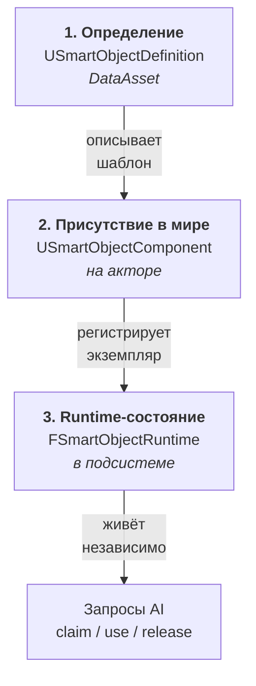
```mermaid
graph TD

    A["<b>1. Определение</b><br/>USmartObjectDefinition<br/><i>DataAsset</i>"]

    B["<b>2. Присутствие в мире</b><br/>USmartObjectComponent<br/><i>на акторе</i>"]

    C["<b>3. Runtime-состояние</b><br/>FSmartObjectRuntime<br/><i>в подсистеме</i>"]

    A -->|"описывает<br/>шаблон"| B

    B -->|"регистрирует<br/>экземпляр"| C

    C -->|"живёт<br/>независимо"| D["Запросы AI<br/>claim / use / release"]
```

**Слой 1. Определение (`USmartObjectDefinition`)** — это ассет в Content Browser. Чистые данные, никакого состояния. «Скамейка вообще»: три слота, их локальные трансформы относительно объекта, теги, условия, список поведений. Один ассет переиспользуется тысячей скамеек на уровне. Разбирается в главе 3.

**Слой 2. Присутствие в мире (`USmartObjectComponent`)** — компонент, который вешается на актора и говорит: «вот этот конкретный экземпляр скамейки стоит здесь, использует вон то определение». Компонент — это, по сути, **точка регистрации**: он появляется при загрузке актора, регистрируется в подсистеме, при выгрузке — отписывается. Разбирается в главе 5.

**Слой 3. Runtime-состояние (`FSmartObjectRuntime`)** — живёт внутри `USmartObjectSubsystem`, а не в акторе. Здесь хранится, кто именно занял слот №2, включён ли объект, какие теги на него навешаны прямо сейчас. Разбирается в главе 6.

Почему runtime-состояние отделено от компонента? Из-за **стриминга**. Скамейка на другом конце города может быть выгружена (актора в памяти нет), но AI, стоящий далеко, должен иметь возможность узнать о её существовании, забронировать её и пойти к ней. Пока он идёт, актор подгрузится. За это отвечают **коллекции** (`ASmartObjectPersistentCollection`) — они сохраняют «слепок» объектов уровня, доступный даже без загруженных акторов. Это и есть смысл поля `bCanBePartOfCollection` в компоненте, которое вы уже видели в исходниках, и enum'а `ESmartObjectRegistrationType` с его вариантом `BindToExistingInstance`.

### 1.3. Словарь терминов

Термины стоит зафиксировать сразу — дальше они используются постоянно.

|Термин|Что это|
|---|---|
|**Smart Object**|Объект мира, предоставляющий возможности взаимодействия|
|**Slot (слот)**|Конкретное место взаимодействия внутри объекта. Скамейка = 1 объект, 3 слота|
|**User (пользователь)**|Тот, кто взаимодействует: актор, AI или Mass-сущность|
|**Definition**|Ассет-шаблон, описывающий объект и его слоты|
|**Behavior Definition**|Описание того, _что произойдёт_, когда слот будет использован|
|**Claim (бронирование)**|Резервирование слота за пользователем до того, как он до него дошёл|
|**Handle (хендл)**|Лёгкий идентификатор объекта/слота/пользователя вместо сырого указателя|
|**Activity Tags**|Теги, описывающие, _что можно делать_ с объектом (`Activity.Sit`)|
|**User Tags**|Теги, описывающие _самого пользователя_ (`NPC.Type.Civilian`)|
|**Collection**|Персистентное хранилище объектов уровня, переживающее выгрузку акторов|
|**Space Partition**|Пространственная структура (по умолчанию octree) для быстрого поиска «что рядом»|

### 1.4. Слоты — центральное понятие

Слот стоит осмыслить отдельно, потому что новички часто считают, что взаимодействие происходит «с объектом». Нет: **взаимодействие всегда происходит со слотом**.

Костёр — один объект, но вокруг него шесть мест, где можно сидеть. Каждое место — слот со своим трансформом. Шесть NPC могут пользоваться костром одновременно, и это шесть независимых бронирований. Это отражено даже в типах: `FSmartObjectSlotHandle` состоит из хендла объекта плюс индекса слота:

cpp

```cpp
FSmartObjectHandle SmartObjectHandle;
int32 SlotIndex = INDEX_NONE;
```

Слот несёт в себе:

- **трансформ** (локальный относительно объекта) — куда встать/сесть;
- **теги активности** — что здесь можно делать;
- **фильтры** — кому это разрешено;
- **условия (World Conditions)** — при каких обстоятельствах слот доступен;
- **набор поведений** — что запустить при использовании;
- **произвольные пользовательские данные** — через наследников `FSmartObjectDefinitionData`.

Ключевое свойство: слот может быть **занят (claimed)**, но при этом ещё не **используется (occupied)**. Между «я забронировал место на скамейке» и «я на неё сел» проходит время, пока NPC идёт. Всё это время слот держится за ним — иначе десять NPC ломанулись бы к одной скамейке. Именно поэтому в enum'е `ESmartObjectChangeReason` есть отдельные `OnClaimed` и `OnOccupied`.

### 1.5. Поведения: почему их несколько типов

Самая элегантная часть архитектуры. Определение слота хранит не одно поведение, а **список** объектов класса `USmartObjectBehaviorDefinition`. Это абстрактный базовый класс, у которого есть наследники под разные системы:

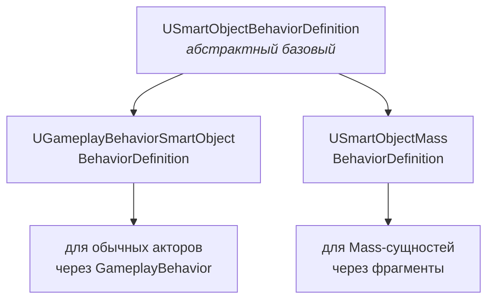
```mermaid

graph TD

    Base["USmartObjectBehaviorDefinition<br/><i>абстрактный базовый</i>"]

    GB["UGameplayBehaviorSmartObject<br/>BehaviorDefinition"]

    MB["USmartObjectMass<br/>BehaviorDefinition"]

    Base --> GB

    Base --> MB

    GB --> GBD["для обычных акторов<br/>через GameplayBehavior"]

    MB --> MBD["для Mass-сущностей<br/>через фрагменты"]

```

Смысл в следующем. Одна и та же скамейка должна работать и для полноценного NPC-актора со скелетной анимацией и Gameplay Ability System, и для «дешёвой» Mass-сущности из толпы, у которой вообще нет актора. Это принципиально разные механизмы исполнения.

Вместо того чтобы плодить два ассета скамейки, определение хранит **оба поведения одновременно**. А запрашивающая сторона при поиске указывает, поведение какого класса ей нужно. Mass-агент ищет слоты, содержащие `USmartObjectMassBehaviorDefinition`; актор-NPC ищет слоты с `UGameplayBehaviorSmartObjectBehaviorDefinition`. Один и тот же объект отвечает обоим — каждому на его языке.

Это же означает, что вы можете добавить свою систему исполнения (например, под собственный кастомный AI), унаследовавшись от `USmartObjectBehaviorDefinition`, не трогая ни строчки в ядре SmartObjects.

### 1.6. Модули и плагины

Чтобы не путаться, где что лежит:

|Модуль|Плагин|Содержимое|
|---|---|---|
|`SmartObjectsModule`|SmartObjects|Ядро: типы, определения, компонент, подсистема, octree, коллекции|
|`GameplayBehaviorsModule`|GameplayBehaviors|Фреймворк `UGameplayBehavior`|
|`GameplayBehaviorSmartObjectsModule`|GameplayBehaviors|Мост между SmartObjects и GameplayBehavior|
|`MassSmartObjects`|MassAI|Мост между SmartObjects и Mass|
|`MassAIBehavior`|MassAI|StateTree-задачи для Mass, включая `FMassUseSmartObjectTask`|

Обратите внимание на макросы в загруженных вами файлах — `SMARTOBJECTSMODULE_API`, `MASSSMARTOBJECTS_API`, `MASSAIBEHAVIOR_API`, `GAMEPLAYBEHAVIORSMODULE_API`. По ним всегда можно определить, к какому модулю относится тип. Ядро SmartObjects **не зависит** от Mass — зависимость идёт только в одну сторону, и это важно: SmartObjects прекрасно работают в проекте без Mass вообще.

### 1.7. Полный цикл взаимодействия — обзор

Чтобы у вас была карта местности, вот весь путь от «NPC захотел отдохнуть» до «NPC встал со скамейки». Каждый шаг будет детально разобран в своей главе.

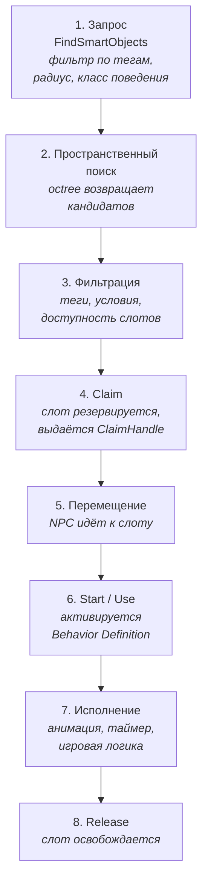
```mermaid

graph TD

    S1["1. Запрос<br/>FindSmartObjects<br/><i>фильтр по тегам,<br/>радиус, класс поведения</i>"]

    S2["2. Пространственный поиск<br/><i>octree возвращает<br/>кандидатов</i>"]

    S3["3. Фильтрация<br/><i>теги, условия,<br/>доступность слотов</i>"]

    S4["4. Claim<br/><i>слот резервируется,<br/>выдаётся ClaimHandle</i>"]

    S5["5. Перемещение<br/><i>NPC идёт к слоту</i>"]

    S6["6. Start / Use<br/><i>активируется<br/>Behavior Definition</i>"]

    S7["7. Исполнение<br/><i>анимация, таймер,<br/>игровая логика</i>"]

    S8["8. Release<br/><i>слот освобождается</i>"]

    S1 --> S2 --> S3 --> S4 --> S5 --> S6 --> S7 --> S8

```

Три момента, которые стоит отметить заранее.

**Claim отделён от Use.** Между шагами 4 и 6 может пройти много секунд. Всё это время слот занят, но поведение ещё не запущено. `FSmartObjectClaimHandle` — это «билет», который NPC носит с собой и предъявляет на шаге 6.

**Поиск может быть асинхронным.** В Mass-варианте шаги 1–3 не выполняются мгновенно: сущность добавляет себе фрагмент-запрос, а процессор `UMassSmartObjectCandidatesFinderProcessor` обрабатывает все накопившиеся запросы разом, батчем. Сущность потом опрашивает результат. Именно это отражено в названии `FindCandidatesAsync` и в `FMassSmartObjectRequestID`.

**Release обязателен и может произойти в любой момент.** Объект может быть выключен, разрушен, выгружен или перехвачен пользователем с более высоким приоритетом (`ESmartObjectClaimPriority`) — во всех этих случаях бронь аннулируется, и пользователь должен об этом узнать. Механизм оповещения через `FSmartObjectEventData` и делегаты — тема главы 6.

### 1.8. Что даёт эта архитектура на практике

Прежде чем нырять в код, зафиксируем выгоды — они объясняют, почему многие места устроены сложнее, чем «казалось бы, можно проще».

- **Дизайнер добавляет контент без программиста.** Новый интерактивный объект = новый DataAsset + компонент на акторе.
- **Естественная масштабируемость.** Пространственный поиск через octree и батчевая обработка запросов позволяют обслуживать тысячи агентов — что и продемонстрировано в CitySample.
- **Работа со стримингом из коробки.** Коллекции позволяют рассуждать об объектах, которых физически нет в памяти.
- **Единый источник истины о занятости.** Невозможна ситуация, когда два NPC одновременно решили, что скамейка свободна: `Claim` атомарен на уровне подсистемы.
- **Расширяемость по всем осям.** Свои типы данных слота, свои поведения, свою пространственную структуру, свою схему условий — всё подключается наследованием.

---

В следующей главе разбираем `SmartObjectTypes.h` целиком: все хендлы и почему они устроены именно так, политики слияния и фильтрации тегов, систему валидации навигационных точек (`FSmartObjectSlotValidationParams`, `FSmartObjectTraceParams`, капсулы пользователя), структуру событий и фабрику хендлов.

---

## Глава 2. Фундаментальные типы: разбор `SmartObjectTypes.h`

Этот файл — фундамент всего модуля. Здесь нет логики, только «алфавит»: идентификаторы, перечисления, параметры и структуры данных, на которых строится всё остальное. Разберём его целиком, сверху вниз, объясняя не только _что_ объявлено, но и _почему именно так_.

---

### 2.1. Служебная преамбула файла

#### Макрос отладки

cpp

```cpp
#define WITH_SMARTOBJECT_DEBUG (!(UE_BUILD_SHIPPING || UE_BUILD_SHIPPING_WITH_EDITOR) && 1)
```

Стандартный для Unreal приём: отладочные средства SmartObjects (визуализация слотов, дебаг-имена, отрисовка octree) компилируются во всех конфигурациях, **кроме** Shipping. В своём коде, если пишете расширения с отладочной отрисовкой, оборачивайте её этим же макросом — так вы гарантированно не потащите отладку в релиз.

#### Категория логирования

cpp

```cpp
SMARTOBJECTSMODULE_API DECLARE_LOG_CATEGORY_EXTERN(LogSmartObject, Warning, All);
```

Категория `LogSmartObject`. Уровень по умолчанию — `Warning`, максимально доступный — `All`. Практический вывод: чтобы увидеть подробности работы системы, в консоли выполните

```
Log LogSmartObject Verbose
```

Это первое, что стоит сделать, когда «NPC почему-то не садится на скамейку». Система довольно словоохотлива на уровне `Verbose`/`VeryVerbose` и обычно прямо сообщает, на каком этапе фильтрации кандидат отвалился.

#### Глобальный делегат событий

cpp

```cpp
DECLARE_MULTICAST_DELEGATE_OneParam(FOnSmartObjectEvent, const FSmartObjectEventData& /*Event*/);
```

Мультикаст-делегат с одним параметром. Это **основная шина оповещений** всей системы. Подписавшись на него, вы узнаёте обо всех изменениях объекта или слота: бронирование, освобождение, включение/выключение, добавление тега. Именно через него `USmartObjectComponent` получает `OnRuntimeEventReceived` и транслирует событие дальше в Blueprint (вы видели это в главе про компонент — поле `EventDelegateHandle`).

Заметьте, что делегат объявлен здесь, а структура `FSmartObjectEventData` описана в самом конце файла. Это обычная для UE практика — forward-объявление через `USTRUCT`-генерацию.

#### Именованные константы

cpp

```cpp
namespace UE::SmartObject
{
#if WITH_EDITORONLY_DATA
    inline const FName WithSmartObjectTag = FName("WithSmartObject");
#endif
}

namespace UE::SmartObject::EnabledReason
{
SMARTOBJECTSMODULE_API extern FGameplayTag Gameplay;
}
```

**`WithSmartObjectTag`** — редакторный тег для дескрипторов акторов (Actor Descriptors) в World Partition. Он позволяет системе быстро находить в незагруженном мире акторы, у которых есть SmartObject-компонент, не подгружая их. Вы видели его использование в `USmartObjectComponent::GetActorDescProperties` — компонент помечает своего актора этим тегом.

**`EnabledReason::Gameplay`** — тег «причины по умолчанию» для включения/выключения объекта. Это важная деталь дизайна: объект можно выключить **по разным причинам одновременно**. Например, квестовая логика выключила скамейку (`Reason.Quest`), а параллельно её выключила система погоды (`Reason.Weather`). Объект включится обратно только когда **все** причины будут сняты. Если вы вызываете `SetSmartObjectEnabled(false)` без указания причины — используется именно `Gameplay`.

Практический вывод: **не смешивайте системы**. Если разные подсистемы вашей игры управляют доступностью одного объекта, каждая должна использовать свой тег причины, иначе они будут затирать состояние друг друга.

---

### 2.2. Политики работы с тегами

Два перечисления, которые управляют тем, как теги объекта и его слотов взаимодействуют при поиске. Это одно из самых частых мест непонимания, поэтому разберём подробно.

Сначала важное различие. В системе есть **две разные вещи**, обе основанные на GameplayTags:

- **Теги (Tags)** — то, что объект/слот _имеет_. Набор фактов о себе.
- **Запросы тегов (TagQueries)** — то, что объект/слот _требует_ от других. Условие.

И теги, и запросы могут быть заданы **и на уровне объекта, и на уровне каждого слота**. Возникает вопрос: как их комбинировать? На него отвечают две политики.

#### `ESmartObjectTagMergingPolicy` — как объединять теги

cpp

```cpp
enum class ESmartObjectTagMergingPolicy : uint8
{
    Combine,
    Override
};
```

Применяется к **Activity Tags** — тегам, описывающим, что можно делать с объектом.

|Значение|Поведение|
|---|---|
|`Combine`|Теги объекта и слота складываются в общий набор|
|`Override`|Теги слота **заменяют** теги объекта. Пустой набор на слоте = нет замены, используются теги объекта|

Пример. Объект «бар» имеет тег `Activity.Social`. Слот «барный стул» имеет тег `Activity.Sit`.

- При `Combine` слот получает `{Activity.Social, Activity.Sit}` — на него откликнется и AI, ищущий общения, и AI, ищущий, где присесть.
- При `Override` слот получает только `{Activity.Sit}` — AI, ищущий общения, этот слот не найдёт.

#### `ESmartObjectTagFilteringPolicy` — как применять запросы

cpp

```cpp
enum class ESmartObjectTagFilteringPolicy : uint8
{
    NoFilter,
    Combine,
    Override
};
```

Применяется к **User Tags** — точнее, к запросам, которые объект и слот предъявляют к тегам _запрашивающего_.

|Значение|Поведение|
|---|---|
|`NoFilter`|Фреймворк **вообще не фильтрует**. Запросы доступны через API, но применять их — забота вызывающего кода|
|`Combine`|Проверяются оба запроса: и объекта, и слота. Оба должны пройти|
|`Override`|Запрос слота заменяет запрос объекта. Пустой запрос на слоте = нет замены|

Режим `NoFilter` существует для проектов, где логика допуска слишком специфична, чтобы выражаться через `FGameplayTagQuery`. Вы получаете сырые данные и решаете сами. Ценой этого становится то, что фильтрация не происходит в батче внутри подсистемы — а значит, работает медленнее.

#### Где эти политики задаются

Значения по умолчанию для **новых** ассетов определений лежат в настройках проекта — это ровно то, что вы видели в `SmartObjectSettings.h`:

cpp

```cpp
ESmartObjectTagFilteringPolicy DefaultUserTagsFilteringPolicy 
    = ESmartObjectTagFilteringPolicy::Override;

ESmartObjectTagMergingPolicy DefaultActivityTagsMergingPolicy 
    = ESmartObjectTagMergingPolicy::Override;
```

Обратите внимание: по умолчанию в обоих случаях — `Override`. Это осознанное решение Epic: «слот главнее объекта». Логика в том, что слот — более конкретная сущность, и если дизайнер потрудился прописать на нём теги, он, скорее всего, имел в виду именно их, а не добавку к общим.

Важно: настройки применяются **только при создании нового ассета**. Изменение настроек проекта не переписывает уже существующие определения.

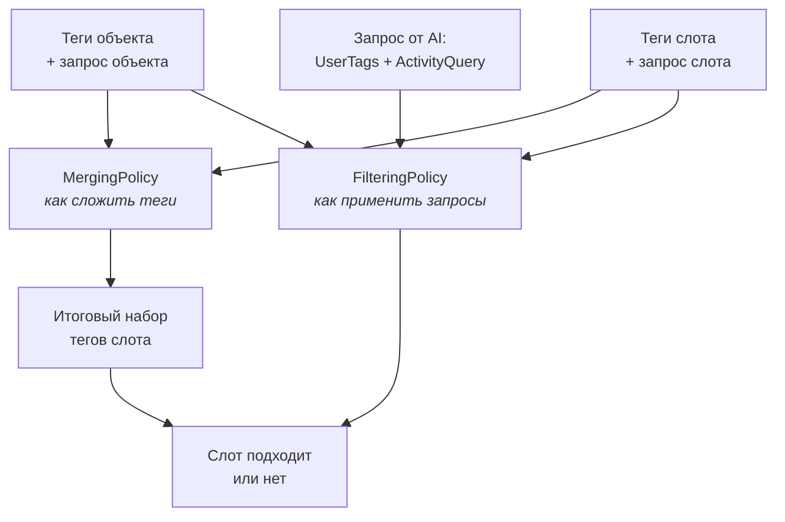
```mermaid
%%{init: {"flowchart": {"useMaxWidth": true, "htmlLabels": true}, "themeVariables": {"fontSize": "13px"}}}%%
graph TD

    R["Запрос от AI:<br/>UserTags + ActivityQuery"]

    O["Теги объекта<br/>+ запрос объекта"]

    S["Теги слота<br/>+ запрос слота"]

    M["MergingPolicy<br/><i>как сложить теги</i>"]

    F["FilteringPolicy<br/><i>как применить запросы</i>"]

    O --> M

    S --> M

    M --> RES["Итоговый набор<br/>тегов слота"]

    R --> F

    O --> F

    S --> F

    RES --> OK["Слот подходит<br/>или нет"]

    F --> OK

```

### 2.3. Прочие перечисления

#### `ESmartObjectSlotNavigationLocationType`

cpp

```cpp
enum class ESmartObjectSlotNavigationLocationType : uint8
{
    Entry,
    Exit,
};
```

Указывает, ищем ли мы точку **входа** в слот или **выхода** из него. Кажется избыточным — но нет. Классический пример из комментария в исходниках: NPC нельзя _входить_ в слот, стоя в воде, но _выйти_ через воду вполне допустимо. Разные критерии валидации для входа и выхода позволяют не строить искусственно жёсткие правила.

Это перечисление используется как ключ выбора набора параметров в `USmartObjectSlotValidationFilter` (см. ниже).

#### `ESmartObjectClaimPriority`

cpp

```cpp
enum class ESmartObjectClaimPriority : uint8
{
    None UMETA(Hidden),
    Low,
    BelowNormal,
    Normal,
    AboveNormal,
    High,
    MIN = None UMETA(Hidden),
    MAX = High UMETA(Hidden)
};
```

Приоритет бронирования. Пять рабочих уровней плюс `None` (скрыт в редакторе, служит невалидным значением) и пара `MIN`/`MAX` для проверок диапазона.

Семантика, зафиксированная в комментариях к `FMassSmartObjectHandler::ClaimCandidate`: **слот, забронированный с меньшим приоритетом, может быть перехвачен более высоким — но только если он ещё не используется**. То есть:

- Слот забронирован (`Claimed`) на `Low` → пришёл агент с `High` → перехват произошёл, первый агент получает событие об аннулировании брони.
- Слот уже используется (`Occupied`) → перехвата **не будет** независимо от приоритета.

Это разумный компромисс: перехватывать идущего к скамейке NPC можно, а выдёргивать уже сидящего из середины анимации — нет.

Практическое применение: сюжетный персонаж, которому обязательно нужно занять конкретное место в катсцене, бронирует с `High`; фоновая толпа — с `Low` или `Normal`.

---

### 2.4. Хендлы: система идентификации

Три структуры-идентификатора. Все построены по одному шаблону, поэтому разберём общий принцип, а затем отличия.

**Зачем вообще хендлы, а не указатели?** Причины стандартные для ECS-подобных систем:

1. Runtime-данные живут в контейнерах подсистемы и могут **переезжать в памяти** при перевыделении массивов. Указатель протухнет, хендл — нет.
2. Хендл можно **безопасно хранить долго**. Он не удерживает объект от удаления и не создаёт висячих ссылок.
3. Хендл **сериализуем и реплицируем**. Указатель — нет.
4. Хендл **компактен**, его дёшево копировать.

Расплата: хендл нужно **валидировать перед использованием**. Метод `IsValid()` у всех хендлов проверяет лишь то, что значение было корректно присвоено, а не то, что объект жив. Это прямо написано в комментариях Epic:

> Наличие корректно присвоенного хендла не гарантирует, что связанный объект по-прежнему доступен — для этого нужен вызов `USmartObjectSubsystem::IsObjectValid`.

Запомните это правило — оно источник значительной части багов у новичков.

#### `FSmartObjectUserHandle` — идентификатор пользователя

cpp

```cpp
USTRUCT()
struct FSmartObjectUserHandle
{
    bool IsValid() const;
    void Invalidate();
    bool operator==(const FSmartObjectUserHandle& Other) const;
    bool operator!=(const FSmartObjectUserHandle& Other) const;
    friend FString LexToString(const FSmartObjectUserHandle& UserHandle);

private:
    friend class USmartObjectSubsystem;
    explicit FSmartObjectUserHandle(const uint32 InID);

    UPROPERTY(VisibleAnywhere, Category = SmartObject)
    uint32 ID = INDEX_NONE;

public:
    static SMARTOBJECTSMODULE_API const FSmartObjectUserHandle Invalid;
};
```

Внутри — простой `uint32`. Разбор членов:

- **`IsValid()`** — сравнение с константой `Invalid`, а не с `INDEX_NONE` напрямую. Приём типичный: единая точка истины о том, что значит «невалидный».
- **`Invalidate()`** — присваивает себе `Invalid`. Не «обнуляет поле», а именно приводит к каноническому невалидному состоянию.
- **`operator==` / `operator!=`** — сравнение по ID.
- **`LexToString`** — свободная функция-друг, позволяющая писать `UE_LOG(..., *LexToString(Handle))`. Соглашение UE для отладочного вывода.
- **Приватный конструктор + `friend class USmartObjectSubsystem`** — ключевая деталь. **Создать валидный хендл пользователя может только подсистема.** Вы физически не можете сфабриковать хендл в пользовательском коде. Это защита инварианта: любой валидный хендл гарантированно был выдан системой.
- **`static const Invalid`** — определён в .cpp, доступен как `FSmartObjectUserHandle::Invalid`.

#### `FSmartObjectHandle` — идентификатор объекта

cpp

```cpp
USTRUCT(BlueprintType)
struct FSmartObjectHandle
{
    bool IsValid() const;
    void Invalidate();
    friend FString LexToString(const FSmartObjectHandle Handle);
    bool operator==(const FSmartObjectHandle& Other) const = default;
    bool operator!=(const FSmartObjectHandle& Other) const = default;
    bool operator<(const FSmartObjectHandle& Other) const;
    friend uint32 GetTypeHash(const FSmartObjectHandle Handle);

private:
    friend struct FSmartObjectHandleFactory;
    explicit FSmartObjectHandle(const FGuid InID);

    UPROPERTY(VisibleAnywhere, Category = SmartObject)
    FGuid Guid = InvalidID;

    static constexpr FGuid InvalidID = FGuid();

public:
    static SMARTOBJECTSMODULE_API const FSmartObjectHandle Invalid;
};
```

Здесь внутри не число, а **`FGuid`**. Это принципиальное отличие, и оно объясняется стримингом и сетью.

Индекс в массиве годится, пока всё живёт в одном процессе и порядок регистрации детерминирован. Но SmartObjects должны работать в World Partition, где объекты появляются и исчезают в произвольном порядке, и в мультиплеере, где сервер и клиент должны сойтись на одном и том же идентификаторе. GUID решает обе задачи: он стабилен между сессиями и уникален глобально.

Откуда берётся GUID — видно из `FSmartObjectHandleFactory` (разбор ниже) и из `USmartObjectComponent`, где есть поле:

cpp

```cpp
/** Unique ID used, along with the owner's ActorGuid to generate a SmartObjectHandle */
UPROPERTY(VisibleAnywhere, Category = SmartObject)
FGuid ComponentGuid;
```

То есть хендл объекта детерминированно выводится из GUID актора **и** GUID компонента. Актор с двумя SmartObject-компонентами даёт два разных хендла; один и тот же актор при перезагрузке уровня даёт тот же хендл.

Разбор членов, отличающихся от предыдущего хендла:

- **`operator==` / `!=` через `= default`** — C++20-стиль, компилятор генерирует почленное сравнение.
- **`operator<`** — написан вручную с комментарием, что нужен **только для сортировки**. Причина в комментарии Epic: у `FGuid` нет defaulted-версии оператора сравнения на «меньше». Смысловой упорядоченности здесь нет — это чисто технический оператор для `TArray::Sort` и `TSortedMap`.
- **`GetTypeHash`** — хеширует сырые байты GUID через `CityHash32`. Нужен, чтобы хендл можно было класть ключом в `TMap`/`TSet`. Это используется массово — например, в `FSmartObjectContainer::HandleToComponentMappings`.
- **`friend struct FSmartObjectHandleFactory`** — здесь другом является не подсистема, а специальная фабрика.

#### `FSmartObjectSlotHandle` — идентификатор слота

cpp

```cpp
USTRUCT(BlueprintType)
struct FSmartObjectSlotHandle
{
    bool IsValid() const;
    void Invalidate();
    bool operator==(const FSmartObjectSlotHandle Other) const;
    bool operator!=(const FSmartObjectSlotHandle Other) const;
    bool operator<(const FSmartObjectSlotHandle Other) const;
    friend uint32 GetTypeHash(const FSmartObjectSlotHandle SlotHandle);
    friend FString LexToString(const FSmartObjectSlotHandle SlotHandle);

    FSmartObjectHandle GetSmartObjectHandle() const;
    int32 GetSlotIndex() const;

protected:
    friend class USmartObjectSubsystem;
    friend struct FSmartObjectSlotView;

    FSmartObjectSlotHandle(const FSmartObjectHandle InSmartObjectHandle, const int32 SlotIndex);

    UPROPERTY(VisibleAnywhere, Category = SmartObject, transient)
    FSmartObjectHandle SmartObjectHandle;

    UPROPERTY(VisibleAnywhere, Category = SmartObject, transient)
    int32 SlotIndex = INDEX_NONE;
};
```

Составной хендл: GUID объекта + индекс слота внутри него. Это прямое отражение того, что мы обсуждали в главе 1 — слот не существует сам по себе, он всегда принадлежит объекту.

Детали:

- **`IsValid()` проверяет только `SmartObjectHandle.IsValid()`**, не индекс. Логика: если объект валиден, индекс слота считается корректным по построению (хендл могла создать только подсистема, а она не создаёт хендлы на несуществующие слоты).
- **`Invalidate()`** сбрасывает и объект (`= {}`), и индекс (`INDEX_NONE`).
- **`operator<`** — лексикографический: сначала по объекту, при равенстве — по индексу слота. Снова только для сортировки.
- **`GetTypeHash`** — `HashCombineFast` от хеша объекта и хеша индекса.
- **`LexToString`** даёт формат `{GUID}:Index` — очень удобно при чтении логов.
- **`GetSmartObjectHandle()` / `GetSlotIndex()`** — публичные геттеры. В отличие от предыдущих хендлов, здесь внутренности частично доступны: получить хендл родительского объекта из хендла слота — законная и частая операция.
- **Секция `protected` вместо `private`** и комментарий Epic: _не выставлять EntityHandle никуда, кроме SlotView и подсистемы_. Друзьями объявлены `USmartObjectSubsystem` и `FSmartObjectSlotView` — то есть создавать хендлы слотов могут только они.
- **`transient`** на обоих полях — хендлы слотов **не сериализуются**. Они пересоздаются каждый запуск, потому что относятся к runtime-состоянию.

---

### 2.5. Базовые структуры для расширения

Три пустые структуры, единственное назначение которых — быть базой для наследования. Это точки расширения системы.

cpp

```cpp
/** База для хранения пользовательских данных внутри определения слота */
USTRUCT(BlueprintType, meta=(Hidden))
struct FSmartObjectDefinitionData
{
    GENERATED_BODY()
    virtual ~FSmartObjectDefinitionData() = default;
};

/** База для хранения состояния, связанного со слотом */
USTRUCT(meta=(Hidden))
struct FSmartObjectSlotStateData
{
    GENERATED_BODY()
};

/** База для данных, связанных с записью в пространственной структуре */
USTRUCT()
struct FSmartObjectSpatialEntryData
{
    GENERATED_BODY()
};
```

Разница между первыми двумя — критична для понимания:

| **Характеристика**           | **FSmartObjectDefinitionData**                  | **FSmartObjectSlotStateData**                                |
| ---------------------------- | ----------------------------------------------- | ------------------------------------------------------------ |
| **Где живёт**                | В ассете определения (`USmartObjectDefinition`) | В runtime-менеджере (`USmartObjectSubsystem`)                |
| **Изменяется во время игры** | **Нет** (Immutable / Read-Only)                 | **Да** (Mutable / Dynamic State)                             |
| **Область видимости**        | **Общая** для всех экземпляров данного типа     | **Индивидуальная** (у каждого слота на сцене своя)           |
| **Паттерн**                  | **Flyweight (Приспосабливатель)**               | **Instance State / Context**                                 |
| **Пример данных**            | Offset анимации, теги слота, условия входа      | Статус доступа (`Claimed`), счетчик вызовов, `ClaimerHandle` |

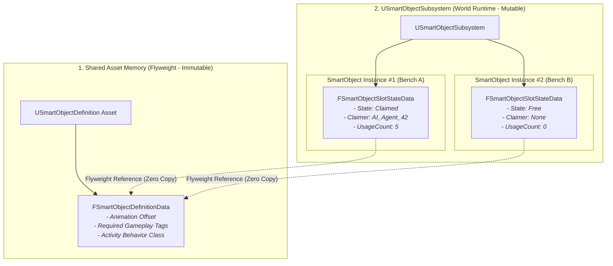
```mermaid
%%{init: {"flowchart": {"useMaxWidth": true, "htmlLabels": true}, "themeVariables": {"fontSize": "13px"}}}%%
flowchart TD
    subgraph SharedAsset ["1. Shared Asset Memory (Flyweight - Immutable)"]
        direction TB
        SOAsset["USmartObjectDefinition Asset"]
        DefData["FSmartObjectDefinitionData<br/><i>- Animation Offset<br/>- Required Gameplay Tags<br/>- Activity Behavior Class</i>"]
        SOAsset --> DefData
    end

    subgraph RuntimeSubsystem ["2. USmartObjectSubsystem (World Runtime - Mutable)"]
        direction TB
        Subsystem["USmartObjectSubsystem"]
        
        subgraph Instance1 ["SmartObject Instance #1 (Bench A)"]
            Slot1State["FSmartObjectSlotStateData<br/><i>- State: Claimed<br/>- Claimer: AI_Agent_42<br/>- UsageCount: 5</i>"]
        end

        subgraph Instance2 ["SmartObject Instance #2 (Bench B)"]
            Slot2State["FSmartObjectSlotStateData<br/><i>- State: Free<br/>- Claimer: None<br/>- UsageCount: 0</i>"]
        end

        Subsystem --> Slot1State
        Subsystem --> Slot2State
    end

    Slot1State -. "Flyweight Reference (Zero Copy)" .-> DefData
    Slot2State -. "Flyweight Reference (Zero Copy)" .-> DefData
```

`FSmartObjectDefinitionData` имеет **виртуальный деструктор** — значит, она предназначена для полиморфного хранения (в `FInstancedStruct`), и наследники могут иметь нетривиальные члены. У `FSmartObjectSlotStateData` виртуального деструктора нет — эти данные хранятся плотно и предполагаются простыми.

`FSmartObjectSpatialEntryData` — база для того, что пространственная структура хочет запомнить о своей записи. Единственный наследник в движке — `FSmartObjectOctreeEntryData`, который хранит `FSmartObjectOctreeIDSharedRef`. Смысл: подсистема хранит эти данные, не зная их конкретного типа, а конкретная реализация space partition получает их обратно при удалении элемента.

---

### 2.6. `USmartObjectSpacePartition` — абстракция пространственного поиска

cpp

```cpp
UCLASS(MinimalAPI, Abstract)
class USmartObjectSpacePartition : public UObject
{
public:
    virtual void SetBounds(const FBox& Bounds) {}
    virtual void Add(const FSmartObjectHandle Handle, const FBox& Bounds, FInstancedStruct& OutHandle) {}
    virtual void Remove(const FSmartObjectHandle Handle, FStructView EntryData) {}
    virtual void Find(const FBox& QueryBox, TArray<FSmartObjectHandle>& OutResults) {}

#if UE_ENABLE_DEBUG_DRAWING
    virtual void Draw(FDebugRenderSceneProxy* DebugProxy) {}
#endif
};
```

Абстрактный базовый класс для структуры пространственного индексирования. Подсистема **не знает**, что внутри — octree, grid, BVH или что-то ваше. Она работает только через этот интерфейс.

Разбор методов:

- **`SetBounds(Bounds)`** — задать общие границы мира. Вызывается при инициализации, до добавления элементов. Octree, например, использует это для выбора корневого узла.
- **`Add(Handle, Bounds, OutHandle)`** — добавить объект с указанным AABB. Обратите внимание на третий параметр: он **выходной**, типа `FInstancedStruct&`. Реализация кладёт туда свои внутренние данные (наследника `FSmartObjectSpatialEntryData`). Подсистема сохраняет этот блоб, не заглядывая внутрь.
- **`Remove(Handle, EntryData)`** — удалить объект. Сюда передаётся тот самый блоб, что был получен при `Add`, но уже как `FStructView` — нетипизированный вид на структуру. Реализация приводит его к своему типу и использует. Такой дизайн позволяет удалять за O(1) вместо поиска по всей структуре.
- **`Find(QueryBox, OutResults)`** — основной поисковый метод. Прямоугольный запрос, результат — массив хендлов. Заметьте, что это грубая фаза: результат содержит всё, что пересекает бокс, дальнейшая фильтрация по тегам и условиям происходит выше.
- **`Draw(DebugProxy)`** — отладочная отрисовка, под макросом `UE_ENABLE_DEBUG_DRAWING`.

Все методы имеют **пустые тела по умолчанию**, а не `= 0`. Класс помечен `Abstract` на уровне UCLASS, но не является абстрактным на уровне C++. Причина в том, что UObject-система требует возможности создать CDO. Пустые реализации — безопасный no-op.

Подробно единственную встроенную реализацию (`USmartObjectOctree`) разберём в главе 9.

---

### 2.7. Ссылки на слоты

#### `FSmartObjectSlotIndex` — устаревший тип

cpp

```cpp
USTRUCT(BlueprintType)
struct UE_DEPRECATED(all, "This type is deprecated and no longer being used.") 
    SMARTOBJECTSMODULE_API FSmartObjectSlotIndex
```

Обёртка над `int32`, помеченная `UE_DEPRECATED(all, ...)` — то есть устаревшей во **всех** версиях, не с какой-то конкретной. Использовать не нужно; упоминаю только потому, что вы встретите её в старых туториалах и в коде проектов, мигрировавших с ранних версий 5.x. Заменена на `FSmartObjectSlotHandle` и `FSmartObjectSlotReference`.

#### `FSmartObjectSlotReference` — ссылка внутри определения

cpp

```cpp
USTRUCT()
struct FSmartObjectSlotReference
{
    static constexpr uint8 InvalidValue = 0xff;

    bool IsValid() const;
    int32 GetIndex() const;
    void SetIndex(const int32 InIndex);

#if WITH_EDITORONLY_DATA
    const FGuid& GetSlotID() const;
#endif

private:
    UPROPERTY()
    uint8 Index = InvalidValue;

#if WITH_EDITORONLY_DATA
    UPROPERTY()
    FGuid SlotID;
#endif

    friend class FSmartObjectSlotReferenceDetails;
};
```

Это **не** runtime-хендл. Это способ одному слоту определения сослаться на другой слот того же определения. Пример использования: слот «выход из машины» ссылается на слот «место водителя», чтобы система знала их связь.

Ключевая деталь дизайна — **двойное хранение**:

- **`Index` (uint8)** — то, что реально используется в рантайме. Один байт, максимум 254 слота (значение `0xff` зарезервировано под невалидное). Быстро, компактно.
- **`SlotID` (FGuid, только в редакторе)** — стабильный идентификатор слота.

Зачем два? Потому что индексы **ломаются при редактировании**. Если дизайнер удалит второй слот из пяти, все индексы после него сдвинутся, и все ссылки станут указывать не туда. GUID же не меняется никогда.

Отсюда комментарий Epic к структуре: _индекс автоматически разрешается при изменении, при загрузке и при сохранении_. То есть в редакторе истиной является `SlotID`, а `Index` — производный кеш, который пересчитывается по GUID при каждом значимом событии. В собранной игре редакторных данных нет, остаётся только уже корректный индекс.

`SetIndex` содержит защиту диапазона: значение вне `[0, 254]` превращается в `InvalidValue`.

`friend class FSmartObjectSlotReferenceDetails` — кастомизация отображения в редакторе (выпадающий список слотов вместо голого числа).

---

### 2.8. Система валидации: трассировки и капсулы

Дальше идёт блок из четырёх типов, решающих одну задачу: **проверить, что пользователь физически может встать в слот и добраться до него**. Это неочевидно сложная задача — слот, размещённый дизайнером, может оказаться в стене, над обрывом или недостижимым с навигационной сетки.

#### `ESmartObjectTraceType` и `FSmartObjectTraceParams`

cpp

```cpp
enum class ESmartObjectTraceType : uint8
{
    ByChannel,
    ByProfile,
    ByObjectTypes,
};
```

Три способа задать, с чем сталкиваться при трассировке — ровно те же три, что есть в обычном API коллизий Unreal.

cpp

```cpp
USTRUCT()
struct FSmartObjectTraceParams
{
    FSmartObjectTraceParams() = default;
    explicit FSmartObjectTraceParams(const ETraceTypeQuery InTraceChanel);
    explicit FSmartObjectTraceParams(TConstArrayView<EObjectTypeQuery> InObjectTypes);
    explicit FSmartObjectTraceParams(const FCollisionProfileName InCollisionProfileName);

    ESmartObjectTraceType Type = ESmartObjectTraceType::ByChannel;
    TEnumAsByte<ETraceTypeQuery> TraceChannel = ETraceTypeQuery::TraceTypeQuery1;
    TArray<TEnumAsByte<EObjectTypeQuery>> ObjectTypes;
    FCollisionProfileName CollisionProfile;
    bool bTraceComplex = false;
};
```

Классический «тегированный union», реализованный через поле `Type` плюс три взаимоисключающих набора данных. Все три конструктора помечены `explicit` и каждый сам выставляет корректный `Type` — то есть создать несогласованное состояние через конструктор нельзя.

В редакторе поля скрываются условно:

cpp

```cpp
meta = (EditCondition = "Type == ESmartObjectTraceType::ByChannel", EditConditionHides)
```

`EditConditionHides` означает, что неактуальные поля не просто блокируются, а полностью пропадают из панели деталей. Дизайнер видит только релевантные настройки.

`bTraceComplex` — использовать ли точную (per-poly) геометрию вместо упрощённой. Дорого; включайте только если простая коллизия даёт ложные срабатывания.

#### `FSmartObjectAnnotationCollider`

cpp

```cpp
struct FSmartObjectAnnotationCollider
{
    FVector Location = FVector::ZeroVector;
    FQuat Rotation = FQuat::Identity;
    FCollisionShape CollisionShape;
};
```

Обычная C++-структура (не `USTRUCT`!) — коллайдер в мировом пространстве. Позиция, поворот, форма. Используется как промежуточное представление при проверках: «поместится ли пользователь вот сюда».

То, что она не `USTRUCT`, говорит о её назначении: она никогда не сериализуется и не показывается в редакторе, живёт только на стеке во время проверок.

#### `FSmartObjectUserCapsuleParams`

cpp

```cpp
USTRUCT(BlueprintType)
struct FSmartObjectUserCapsuleParams
{
    FSmartObjectUserCapsuleParams() = default;
    FSmartObjectUserCapsuleParams(const float InRadius, const float InHeight, const float InStepHeight);

    static SMARTOBJECTSMODULE_API const FSmartObjectUserCapsuleParams Invalid;

    bool IsValid() const;
    SMARTOBJECTSMODULE_API FSmartObjectAnnotationCollider GetAsCollider(
        const FVector& Location, const FQuat& Rotation) const;

    float Radius = 35.0f;
    float Height = 180.0f;
    float StepHeight = 50.0f;
};
```

Габариты пользователя, аппроксимированные капсулой. Значения по умолчанию — примерно стандартный персонаж UE (радиус 35, высота 180).

- **`IsValid()`** — все три параметра должны быть строго положительными.
- **`GetAsCollider(Location, Rotation)`** — превращает параметры в коллайдер, размещённый в мире. Из комментария Epic важны два момента: капсула размещается так, что **ось Z поворота считается «вверх»**, и **значения приводятся к корректному диапазону**, поэтому итоговый коллайдер может отличаться от заданных полей.
- **`StepHeight`** — самое интересное поле. Это высота, которую персонаж может переступить, и **эта зона игнорируется при проверке коллизий**. Без неё любой бордюр, ступенька или порог перед слотом делали бы его недоступным, хотя персонаж спокойно бы туда зашёл.

#### `FSmartObjectSlotValidationParams`

Полный набор настроек валидации. Все поля `protected`, доступ — через геттеры. Это осознанная инкапсуляция: часть геттеров содержит нетривиальную логику.

cpp

```cpp
USTRUCT()
struct FSmartObjectSlotValidationParams
{
public:
    TSubclassOf<UNavigationQueryFilter> GetNavigationFilter() const;
    FVector GetSearchExtents() const;
    const FSmartObjectTraceParams& GetGroundTraceParameters() const;
    const FSmartObjectTraceParams& GetTransitionTraceParameters() const;
    const FSmartObjectUserCapsuleParams& GetUserCapsule() const;

    const FSmartObjectUserCapsuleParams& GetUserCapsule(
        const FSmartObjectUserCapsuleParams& NavigationCapsule) const;
    bool GetUserCapsuleForActor(const AActor& UserActor, 
        FSmartObjectUserCapsuleParams& OutCapsule) const;
    bool GetPreviewUserCapsule(const UWorld& World, 
        FSmartObjectUserCapsuleParams& OutCapsule) const;

protected:
    TSubclassOf<UNavigationQueryFilter> NavigationFilter;
    FVector SearchExtents = FVector(5.0f, 5.0f, 40.0f);
    FSmartObjectTraceParams GroundTraceParameters;
    FSmartObjectTraceParams TransitionTraceParameters;
    bool bUseNavigationCapsuleSize = false;
    FSmartObjectUserCapsuleParams UserCapsule;
};
```

**Поля:**

- **`NavigationFilter`** — фильтр навигационных запросов. Позволяет учитывать области с разной стоимостью/запретом при проверке, достижим ли слот.
- **`SearchExtents`** (по умолчанию `5, 5, 40`) — насколько далеко валидации разрешено _сдвинуть_ точку. Обратите внимание на асимметрию: по горизонтали всего 5 см, по вертикали 40. Логика в том, что дизайнер обычно точен в плане, но может промахнуться по высоте относительно навмеша.
- **`GroundTraceParameters`** — трассировка вниз для поиска земли.
- **`TransitionTraceParameters`** — трассировка для проверки, что путь от навигационной точки до собственно слота не заблокирован. Это отдельная проверка: точка на навмеше может быть валидна, слот может быть валиден, но между ними — перила.
- **`bUseNavigationCapsuleSize`** — брать габариты не из `UserCapsule`, а у самого пользователя через `INavAgentInterface`.
- **`UserCapsule`** — габариты по умолчанию.

**Методы, требующие пояснения:**

- **`GetUserCapsule(NavigationCapsule)`** — перегрузка-селектор. Возвращает либо переданную навигационную капсулу, либо собственную, в зависимости от `bUseNavigationCapsuleSize`. Вызывающий код не пишет `if` — логика выбора спрятана здесь.
- **`GetUserCapsuleForActor(UserActor, OutCapsule)`** — возвращает `bool`, потому что **может провалиться**: если запрошены навигационные габариты, а у актора не удалось получить `INavAgentInterface`. Обратите внимание на паттерн — `bool` + выходной параметр, стандартный для UE способ сообщить о возможной неудаче без исключений.
- **`GetPreviewUserCapsule(World, OutCapsule)`** — то же, но для редакторного превью, когда пользователь ещё неизвестен. Берёт настройки навигации из мира.

#### `USmartObjectSlotValidationFilter`

cpp

```cpp
UCLASS(MinimalAPI, Blueprintable, Abstract)
class USmartObjectSlotValidationFilter : public UObject
{
public:
    const FSmartObjectSlotValidationParams& GetValidationParams(
        const ESmartObjectSlotNavigationLocationType LocationType) const;
    const FSmartObjectSlotValidationParams& GetEntryValidationParams() const;
    const FSmartObjectSlotValidationParams& GetExitValidationParams() const;

protected:
    FSmartObjectSlotValidationParams EntryParameters;
    bool bUseEntryParametersForExit = true;
    FSmartObjectSlotValidationParams ExitParameters;
};
```

Оболочка, объединяющая два набора параметров — для входа и для выхода. Здесь замыкается всё, что мы обсуждали:

- **`GetValidationParams(LocationType)`** — диспетчер по `Entry`/`Exit`.
- **`GetEntryValidationParams()`** — просто возвращает `EntryParameters`.
- **`GetExitValidationParams()`** — содержит логику: если `bUseEntryParametersForExit` (значение по умолчанию — `true`), возвращает **входные** параметры. То есть по умолчанию вход и выход валидируются одинаково, и отдельная настройка выхода — осознанное действие дизайнера.

Критически важная деталь из комментария Epic: **используются значения CDO, пользователи должны наследоваться от этого класса для создания собственных настроек**. То есть это не ассет, который вы создаёте и настраиваете как экземпляр — это **класс**, который вы наследуете (в C++ или Blueprint), задаёте значения по умолчанию, и дальше в определениях слотов указываете сам класс. Система читает настройки прямо из Class Default Object.

Класс помечен `Abstract` — использовать напрямую нельзя, только через наследника.

---

### 2.9. События

#### `ESmartObjectChangeReason`

cpp

```cpp
UENUM(BlueprintType)
enum class ESmartObjectChangeReason : uint8
{
    None,
    OnEvent,
    OnTagAdded,
    OnTagRemoved,
    OnClaimed,
    OnOccupied,
    OnReleased,
    OnSlotEnabled,
    OnSlotDisabled,
    OnObjectEnabled,
    OnObjectDisabled,
    OnComponentBound,
    OnComponentUnbound,
};
```

Полный перечень того, о чём система может сообщить. Разложим по группам:

|Группа|Значения|Смысл|
|---|---|---|
|Служебное|`None`|Изменений нет / невалидное значение|
|Внешнее|`OnEvent`|Событие послано вручную через API (`SendSlotEvent`)|
|Теги|`OnTagAdded`, `OnTagRemoved`|Runtime-теги объекта или слота изменились|
|Жизненный цикл брони|`OnClaimed`, `OnOccupied`, `OnReleased`|Забронирован → занят → освобождён|
|Доступность слота|`OnSlotEnabled`, `OnSlotDisabled`|Конкретный слот включён/выключен|
|Доступность объекта|`OnObjectEnabled`, `OnObjectDisabled`|Весь объект включён/выключен|
|Связь с актором|`OnComponentBound`, `OnComponentUnbound`|Компонент привязан к симуляции / отвязан|

Именно здесь видно то различие «claimed vs occupied», о котором говорилось в главе 1: это два отдельных, последовательных события.

Пара `OnComponentBound` / `OnComponentUnbound` — про стриминг. Runtime-данные объекта живут всегда, но актор может быть выгружен. Эти события сообщают, что физическое представление появилось или исчезло. Если ваш NPC шёл к скамейке и получил `OnComponentUnbound` — актора больше нет, и логику надо адаптировать.

#### `FSmartObjectEventData`

cpp

```cpp
USTRUCT(BlueprintType)
struct FSmartObjectEventData
{
    FSmartObjectHandle SmartObjectHandle;
    FSmartObjectSlotHandle SlotHandle;
    ESmartObjectChangeReason Reason = ESmartObjectChangeReason::None;
    FGameplayTag Tag;
    FConstStructView EventPayload;
};
```

Универсальный пакет события. Все поля, кроме `EventPayload`, помечены `Transient, BlueprintReadOnly` — доступны в Blueprint только на чтение, не сериализуются.

- **`SmartObjectHandle`** — какого объекта касается событие.
- **`SlotHandle`** — какого слота. **Если невалиден — событие относится к объекту целиком**, а не к слоту. Это соглашение прямо зафиксировано в комментарии Epic и его надо помнить при написании обработчиков.
- **`Reason`** — что произошло.
- **`Tag`** — добавленный/удалённый тег для `OnTagAdded`/`OnTagRemoved`, либо тег события для `OnEvent`. Для остальных причин не заполняется.
- **`EventPayload`** — типа `FConstStructView`, то есть **нетипизированный константный вид на произвольную структуру**. Это механизм передачи произвольных данных. Семантика зависит от причины:
    - для внешних событий (`SendSlotEvent`) полезную нагрузку задаёт вызывающий;
    - для внутренних событий (`OnClaimed`, `OnReleased` и т.д.) туда попадают **пользовательские данные, переданные при бронировании**.

Обратите внимание, что `EventPayload` — единственное поле **без** `UPROPERTY`. `FConstStructView` не владеет данными, он только на них смотрит. Отсюда важнейшее правило: **payload действителен только на время вызова обработчика**. Хотите сохранить — копируйте в `FInstancedStruct`.

---

### 2.10. Пользовательские данные

#### `FSmartObjectActorUserData`

cpp

```cpp
USTRUCT()
struct FSmartObjectActorUserData
{
    FSmartObjectActorUserData() = default;
    SMARTOBJECTSMODULE_API explicit FSmartObjectActorUserData(const AActor* InUserActor);

    UPROPERTY()
    TWeakObjectPtr<const AActor> UserActor = nullptr;
};
```

Простейшая реализация «данных пользователя» — просто слабый указатель на актора. Используется в двух сценариях, оба показаны в комментариях Epic:

cpp

```cpp
// 1. Как контекст при фильтрации
FilterSlotsBySelectionConditions(SlotHandles, 
    FConstStructView::Make(FSmartObjectActorUserData(Pawn)));

// 2. Как данные, прикрепляемые к слоту при бронировании
Claim(SlotHandle, FConstStructView::Make(FSmartObjectActorUserData(Pawn)));
```

Первый случай — самый важный концептуально. Условия (World Conditions) в определении объекта могут спрашивать: «а кто, собственно, спрашивает?». Например, условие «слот доступен только если у пользователя есть ключ» требует доступа к пользователю. Схема условий (`USmartObjectWorldConditionSchema`) описывает, какие данные ей нужны, а эта структура их поставляет.

`TWeakObjectPtr` выбран сознательно: данные могут пережить актора, и слабый указатель не помешает сборке мусора.

**Расширение.** В комментарии подробно расписан рецепт: наследуетесь от `USmartObjectWorldConditionSchema`, в конструкторе регистрируете дополнительные контекстные данные через `AddContextDataDesc`, наследуетесь от `FSmartObjectActorUserData` и добавляете соответствующие поля. Так вы можете передавать в условия что угодно — второго актора, состояние квеста, что угодно.

#### `FSmartObjectActorOwnerData`

cpp

```cpp
USTRUCT()
struct FSmartObjectActorOwnerData
{
    FSmartObjectActorOwnerData() = default;
    explicit FSmartObjectActorOwnerData(AActor* Actor);
    explicit FSmartObjectActorOwnerData(const FActorInstanceHandle& Handle);

    UPROPERTY()
    FActorInstanceHandle Handle;
};
```

Данные о **владельце** объекта — том, кому SmartObject принадлежит. Хранит не `AActor*`, а `FActorInstanceHandle`.

Это существенно. `FActorInstanceHandle` — часть системы Light Weight Instances: он может указывать как на полноценного актора, так и на **облегчённое представление**, у которого actor'а в памяти вообще нет. Тысяча одинаковых лавочек в парке может существовать как lightweight-инстансы, материализуясь в настоящих акторов только при приближении игрока. SmartObject должен работать с ними одинаково.

---

### 2.11. Фабрики и внутренние хендлы

#### `FSmartObjectHandleFactory`

cpp

```cpp
struct FSmartObjectHandleFactory
{
    static FSmartObjectHandle CreateHandleFromGuid(const FGuid Guid);
    static FSmartObjectHandle CreateHandleForDynamicObject();
    static FSmartObjectHandle CreateHandleFromComponent(
        const TNotNull<const USmartObjectComponent*> Component);
    static SMARTOBJECTSMODULE_API FGuid CreateHandleGuidFromComponent(
        TNotNull<const USmartObjectComponent*> Component);
};
```

Единственная сущность, которой разрешено конструировать `FSmartObjectHandle`. Реализует паттерн «дружественная фабрика»: приватный конструктор хендла плюс `friend struct FSmartObjectHandleFactory`.

- **`CreateHandleFromGuid(Guid)`** — прямая обёртка. Используется при десериализации коллекций, когда GUID уже известен.
- **`CreateHandleForDynamicObject()`** — генерирует **новый случайный** GUID через `FGuid::NewGuid()`. Для объектов, создаваемых в рантайме и не имеющих представления в редакторе. Такой хендл не переживёт перезапуск — и не должен.
- **`CreateHandleFromComponent(Component)`** — детерминированно выводит хендл из компонента, вызывая следующий метод.
- **`CreateHandleGuidFromComponent(Component)`** — единственный метод, реализованный в .cpp (остальные — inline). Именно он комбинирует `ComponentGuid` компонента с `ActorGuid` владельца. Детерминированность здесь — гарантия того, что хендл одинаков между запусками, между сервером и клиентом, и до/после стриминга.

Обратите внимание на `TNotNull<...>` — это обёртка UE, статически выражающая «указатель гарантированно не null». Она снимает необходимость проверок внутри и документирует контракт в сигнатуре.

#### `FSmartObjectDefinitionDataHandle`

Последняя структура файла, и самая хитрая. Это **внутренний** адресатор данных внутри `USmartObjectDefinition`.

cpp

```cpp
USTRUCT()
struct FSmartObjectDefinitionDataHandle
{
    static const FSmartObjectDefinitionDataHandle Invalid;
    static const FSmartObjectDefinitionDataHandle Root;
    static const FSmartObjectDefinitionDataHandle Parameters;

    FSmartObjectDefinitionDataHandle() = default;
    explicit FSmartObjectDefinitionDataHandle(const int32 InSlotIndex, 
    const int32 InDataIndex = INDEX_NONE);
    
    FSmartObjectDefinitionDataHandle& operator=(const FSmartObjectDefinitionDataHandle& Other);
    
    bool operator==(const FSmartObjectDefinitionDataHandle& Other) const;
    bool operator!=(const FSmartObjectDefinitionDataHandle& Other) const;

    bool IsSlotValid() const;
    bool IsDataValid() const;
    bool IsRoot() const;
    bool IsParameters() const;
    int32 GetSlotIndex() const;
    int32 GetDataIndex() const;
    int32 GetIndex() const;

protected:
    static constexpr uint16 InvalidIndex   = MAX_uint16;
    static constexpr uint16 RootIndex      = MAX_uint16 - 1;
    static constexpr uint16 ParametersIndex = MAX_uint16 - 2;

    UPROPERTY(VisibleAnywhere, Category = "SmartObject")
    uint16 SlotIndex = InvalidIndex;

    UPROPERTY(VisibleAnywhere, Category = "SmartObject")
    uint16 DataIndex = InvalidIndex;
};
```

**Идея.** Определение — это не плоский список слотов. Это дерево данных: само определение (корень), его структура параметров, каждый слот, и произвольные данные внутри каждого слота. Системе привязок свойств (property binding) нужен способ адресовать _любой_ узел этого дерева единообразно.

Решение — два `uint16` с **зарезервированными верхними значениями**:

|Значение `SlotIndex`|Что адресуется|
|---|---|
|`MAX_uint16` (65535)|Невалидно|
|`MAX_uint16 - 1` (65534)|Корень — само определение|
|`MAX_uint16 - 2` (65533)|Структура параметров определения|
|`0 … 65532`|Конкретный слот по индексу|

`DataIndex` при этом указывает на конкретный элемент данных внутри выбранного узла (или `InvalidIndex`, если адресуется сам узел).

**Разбор методов:**

- **Конструктор `(InSlotIndex, InDataIndex)`** — содержит `check()`, запрещающие передавать индексы, попадающие в зарезервированную зону. `INDEX_NONE` (-1) конвертируется в `InvalidIndex`. То есть внешний мир работает с привычными `int32` и `INDEX_NONE`, а внутри всё упаковано в `uint16`.
- **`operator=`** — определён явно, хотя по умолчанию сгенерировался бы такой же. Обычно так делают ради явности контракта.
- **`IsSlotValid()` / `IsDataValid()`** — проверки на `InvalidIndex` для каждой половины независимо.
- **`IsRoot()` / `IsParameters()`** — сравнение с зарезервированными значениями. Именно эти методы делают «магические числа» безопасными: пользовательский код никогда не сравнивает вручную.
- **`GetSlotIndex()` / `GetDataIndex()`** — обратное преобразование в `int32` с возвратом `INDEX_NONE` для невалидных значений.
- **`GetIndex()`** — упаковывает оба поля в один `int32`: `SlotIndex << 16 | DataIndex`. Даёт плоский уникальный ключ для хеш-таблиц и сравнений.

Почему такая экономия на байтах? Потому что этих хендлов в сложном определении могут быть сотни (по одному на каждую привязку свойства), и они лежат в сериализуемых массивах. Четыре байта вместо восьми — заметная разница на большом проекте.

Полностью смысл этой структуры раскроется в главе 3, когда будем разбирать `USmartObjectDefinition` и её систему параметров и привязок.

---

### 2.12. Итоги главы

Что стоит унести из этого файла:

1. **Хендлы — не указатели.** `IsValid()` проверяет только корректность присвоения; живость объекта проверяется отдельно, через подсистему.
2. **Создание хендлов закрыто.** Валидные хендлы выдаёт только подсистема или фабрика — это гарантия инвариантов.
3. **Хендл объекта построен на GUID**, детерминированно выводимом из GUID актора и компонента. Отсюда стабильность при стриминге и в сети.
4. **Хендл слота = хендл объекта + индекс.** Слот не существует отдельно.
5. **Две политики тегов** решают разные задачи: merging — как складывать теги, filtering — как применять запросы. По умолчанию обе в режиме `Override` («слот главнее»).
6. **Приоритеты бронирования** позволяют перехватывать _забронированные_, но не _используемые_ слоты.
7. **Валидация — отдельная развитая подсистема**: трассировка земли, трассировка перехода, капсула пользователя с `StepHeight`, раздельные наборы для входа и выхода. Настраивается через наследование `USmartObjectSlotValidationFilter` и живёт в CDO.
8. **События универсальны**: одна структура, различаемая по `Reason`. Невалидный `SlotHandle` = событие про объект целиком. `EventPayload` живёт только внутри обработчика.
9. **Три точки расширения** для собственных данных: `FSmartObjectDefinitionData` (статические), `FSmartObjectSlotStateData` (динамические), `FSmartObjectSpatialEntryData` (для своей пространственной структуры).

---

В следующей главе — `USmartObjectDefinition`: полный разбор ассета-определения. `FSmartObjectSlotDefinition` со всеми полями, `FSmartObjectDefinitionDataProxy`, система параметров и привязок свойств, `FSmartObjectDefinitionPreviewData`, механизм вариаций определения и валидация ассета.

---

## Глава 3. `USmartObjectDefinition` — ассет-определение

Это самый большой и, пожалуй, самый концептуально насыщенный класс модуля. Он отвечает на вопрос «что представляет собой этот тип объекта» и служит источником данных для всего остального. Разберём файл `SmartObjectDefinition.h` целиком.

---

### 3.1. Место определения в архитектуре

Напомню разделение из главы 1: определение — **чистые данные без состояния**. Это `UDataAsset`, который вы создаёте в Content Browser один раз и переиспользуете во всех экземплярах.

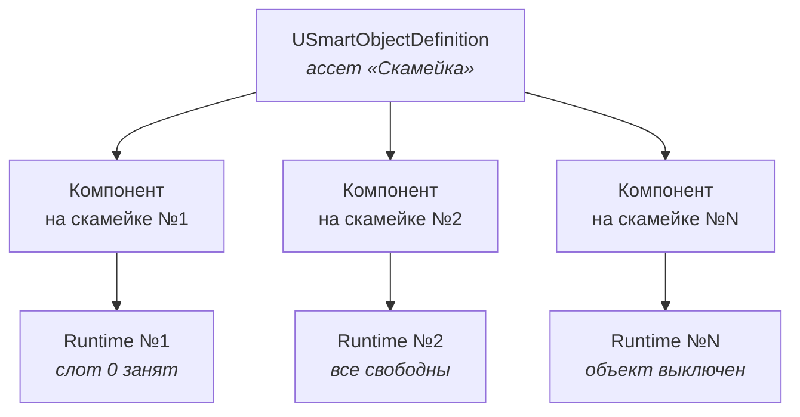
```mermaid

graph TD

    D["USmartObjectDefinition<br/><i>ассет «Скамейка»</i>"]

    C1["Компонент<br/>на скамейке №1"]

    C2["Компонент<br/>на скамейке №2"]

    C3["Компонент<br/>на скамейке №N"]

    D --> C1

    D --> C2

    D --> C3

    R1["Runtime №1<br/><i>слот 0 занят</i>"]

    R2["Runtime №2<br/><i>все свободны</i>"]

    R3["Runtime №N<br/><i>объект выключен</i>"]

    C1 --> R1

    C2 --> R2

    C3 --> R3

```

Одно определение → много компонентов → много независимых runtime-состояний. Определение при этом не знает ни о компонентах, ни о состояниях — связь односторонняя.

Из этого следует практическое правило: **никогда не пишите в определение во время игры**. Модификация ассета затронет все объекты сразу и, что хуже, может сохраниться в редакторе. Все мутирующие геттеры (`GetMutableSlot`, `SetActivityTags`) существуют для редакторных инструментов и процедурной генерации на этапе загрузки, а не для игровой логики.

---

### 3.2. Редакторные делегаты

Файл открывается блоком делегатов, полностью обёрнутым в `#if WITH_EDITOR`:

cpp

```cpp
namespace UE::SmartObject::Delegates
{
#if WITH_EDITOR

    DECLARE_MULTICAST_DELEGATE_OneParam(FOnParametersChanged, const USmartObjectDefinition&);
    extern SMARTOBJECTSMODULE_API FOnParametersChanged OnParametersChanged;

    DECLARE_DELEGATE_TwoParams(FOnGetAssetRegistryTags, const USmartObjectDefinition&, FAssetRegistryTagsContext);
    extern SMARTOBJECTSMODULE_API FOnGetAssetRegistryTags OnGetAssetRegistryTags;

    DECLARE_DELEGATE_TwoParams(FOnSlotDefinitionCreated, USmartObjectDefinition&, FSmartObjectSlotDefinition&);
    extern SMARTOBJECTSMODULE_API FOnSlotDefinitionCreated OnSlotDefinitionCreated;

    DECLARE_MULTICAST_DELEGATE_OneParam(FOnSavingDefinition, const USmartObjectDefinition&);
    extern SMARTOBJECTSMODULE_API FOnSavingDefinition OnSavingDefinition;

#endif
}
```

Четыре точки подключения для редакторных расширений. Обратите внимание на разницу в типах:

|Делегат|Тип|Смысл|
|---|---|---|
|`OnParametersChanged`|Multicast|Параметры определения изменились. Слушателей может быть много|
|`OnGetAssetRegistryTags`|**Single**|Проект дополняет теги ассета для фильтрации в Content Browser. Владелец один|
|`OnSlotDefinitionCreated`|**Single**|Создан **новый** слот. Позволяет проекту задать свои значения по умолчанию|
|`OnSavingDefinition`|Multicast|Определение сохраняется. Момент для финальной валидации/дополнения|

Одиночные (не мультикаст) делегаты здесь — сознательное ограничение: логика «какие теги регистра ассетов выдать» и «как инициализировать новый слот» должна иметь единственного владельца, иначе получится конфликт.

Критическая деталь в комментарии к `OnSlotDefinitionCreated`: **не вызывается при дублировании существующего слота**. Если дизайнер копирует слот, ваша инициализация не сработает — предполагается, что он хотел получить копию, а не свежие дефолты.

`OnSavingDefinition` вы уже встречали в `USmartObjectComponent`:

cpp

```cpp
FDelegateHandle OnSavingDefinitionDelegateHandle;
```

Компонент подписывается на сохранение определения, чтобы вовремя обновить свои кешированные данные в редакторе.

---

### 3.3. `ESmartObjectSlotShape`

cpp

```cpp
UENUM()
enum class ESmartObjectSlotShape : uint8
{
    Circle,
    Rectangle
};
```

Форма отрисовки слота в редакторе. Обратите внимание: комментарий над этим enum'ом скопирован от политик тегов и не соответствует содержимому — мелкая опечатка в исходниках Epic. Это **чисто визуальная** настройка, к коллизиям и валидации отношения не имеет.

---

### 3.4. `USmartObjectBehaviorDefinition` — базовый класс поведений

cpp

```cpp
UCLASS(MinimalAPI, Abstract, NotBlueprintable, EditInlineNew, CollapseCategories, HideDropdown)
class USmartObjectBehaviorDefinition : public UObject
{
    GENERATED_BODY()
};
```

Пустой абстрактный класс — и это правильно. Он не задаёт **никакого** интерфейса, потому что разные фреймворки исполнения имеют принципиально разные контракты. Единственная его функция — быть общим предком, по которому можно фильтровать: «дай мне поведение класса X».

Разберём спецификаторы, они здесь информативны:

- **`Abstract`** — нельзя инстанцировать напрямую.
- **`NotBlueprintable`** — нельзя наследовать в Blueprint. Наследники создаются в C++, потому что каждый наследник требует поддержки в соответствующем фреймворке исполнения.
- **`EditInlineNew`** — экземпляры создаются **внутри** владельца, а не как отдельные ассеты. Именно поэтому массивы поведений помечены `Instanced`.
- **`CollapseCategories`** — в панели деталей категории не группируются, свойства идут плоским списком. Удобно для маленьких объектов.
- **`HideDropdown`** — сам базовый класс не появляется в выпадающих списках выбора класса.

Подробно наследников (`USmartObjectMassBehaviorDefinition`, `UGameplayBehaviorSmartObjectBehaviorDefinition`) разберём в главе 4.

---

### 3.5. `FSmartObjectDefinitionDataProxy` — обёртка для пользовательских данных

cpp

```cpp
USTRUCT()
struct FSmartObjectDefinitionDataProxy
{
    FSmartObjectDefinitionDataProxy() = default;

    template<typename T, typename = std::enable_if_t<std::is_base_of_v<FSmartObjectDefinitionData, std::decay_t<T>>>>
    static FSmartObjectDefinitionDataProxy Make(const T& Struct)
    {
        FSmartObjectDefinitionDataProxy NewProxy;
        NewProxy.Data.InitializeAsScriptStruct(TBaseStructure<T>::Get(), reinterpret_cast<const uint8*>(&Struct));
#if WITH_EDITORONLY_DATA
        NewProxy.ID = FGuid::NewGuid();
#endif
        return NewProxy;
    }

    UPROPERTY(EditDefaultsOnly, Category = "Slot", meta = (ExcludeBaseStruct))
    TInstancedStruct<FSmartObjectDefinitionData> Data;

#if WITH_EDITORONLY_DATA
    UPROPERTY(EditDefaultsOnly, Category = "Slot", meta = (Hidden))
    FGuid ID;
#endif
};
```

Помните `FSmartObjectDefinitionData` из главы 2 — пустую базу для пользовательских данных? Вот обёртка, в которой она хранится.

**Зачем обёртка, а не просто `TInstancedStruct` в массиве?** Ответ в комментарии Epic: _позволяет идентифицировать элементы по GUID в редакторе, даже пустые_. Проблема та же, что со `FSmartObjectSlotReference`: индекс в массиве ломается при вставке/удалении, а система привязок свойств должна ссылаться на конкретный элемент данных стабильно. GUID решает это.

Разбор:

- **`Data`** типа `TInstancedStruct<FSmartObjectDefinitionData>` — типобезопасная версия `FInstancedStruct`, ограниченная наследниками указанного типа. Хранит произвольную структуру полиморфно.
- **`meta = (ExcludeBaseStruct)`** — в выпадающем списке выбора типа сам `FSmartObjectDefinitionData` не показывается, только наследники. Логично: базовая структура пуста и бесполезна.
- **`ID`** — только в редакторе, помечен `Hidden` (дизайнер его не видит).
- **`Make<T>(Struct)`** — статическая фабрика с SFINAE-ограничением через `std::enable_if_t<std::is_base_of_v<...>>`. Попытка передать структуру, не наследующую `FSmartObjectDefinitionData`, не скомпилируется. Метод инициализирует `Data` копией переданной структуры и генерирует новый GUID.

Обратите внимание на смешение стилей: здесь `std::enable_if_t` (стандартная библиотека), а в шаблонных геттерах ниже — `TIsDerivedFrom` (UE). Оба работают, просто написаны в разное время.

---

### 3.6. `FSmartObjectSlotDefinition` — определение слота

Центральная структура главы. Описывает один слот в определении.

#### Конструкторы и защита от deprecation

cpp

```cpp
PRAGMA_DISABLE_DEPRECATION_WARNINGS
FSmartObjectSlotDefinition() = default;
FSmartObjectSlotDefinition(const FSmartObjectSlotDefinition&) = default;
FSmartObjectSlotDefinition(FSmartObjectSlotDefinition&&) = default;
FSmartObjectSlotDefinition& operator=(const FSmartObjectSlotDefinition&) = default;
FSmartObjectSlotDefinition& operator=(FSmartObjectSlotDefinition&&) = default;
PRAGMA_ENABLE_DEPRECATION_WARNINGS
```

Все пять специальных функций объявлены явно как `= default` и обёрнуты в подавление предупреждений. Причина в комментарии: структура содержит устаревшее поле `Data_DEPRECATED`, и автоматически сгенерированные копирующие операции трогали бы его, вызывая варнинги при каждой компиляции. Это стандартный приём переходного периода — увидите его во многих местах UE.

#### Шаблонные геттеры пользовательских данных

cpp

```cpp
template<typename T>
const T& GetDefinitionData() const
{
    static_assert(TIsDerivedFrom<T, FSmartObjectDefinitionData>::IsDerived, "...");

    for (const FSmartObjectDefinitionDataProxy& DataProxy : DefinitionData)
    {
        if (DataProxy.Data.GetScriptStruct()
            && DataProxy.Data.GetScriptStruct()->IsChildOf(T::StaticStruct()))
        {
            return DataProxy.Data.Get<T>();
        }
    }
    checkf(false, TEXT("Failed to find slot definition data"));
    return nullptr;
}

template<typename T>
const T* GetDefinitionDataPtr() const
{
    // ... то же самое, но возвращает nullptr вместо check
}
```

Классическая пара «жёсткий/мягкий доступ»:

- **`GetDefinitionData<T>()`** — уверенный доступ. Если данных нет — `checkf` роняет билд. Используйте, когда наличие данных гарантировано контрактом.
- **`GetDefinitionDataPtr<T>()`** — проверяющий доступ. Возвращает `nullptr`, если не нашлось.

Механика поиска: линейный проход по массиву с проверкой `IsChildOf`. Обратите внимание — **`IsChildOf`, а не точное сравнение типов**. То есть запрос базового типа найдёт наследника. Возвращается **первое** совпадение.

Отсюда практическое правило: **не кладите в один слот две структуры, одна из которых наследует другую** — вы получите непредсказуемый результат в зависимости от порядка в массиве.

`static_assert` даёт человекочитаемую ошибку компиляции вместо простыни шаблонных сообщений, если вы передали не тот тип.

Небольшая техническая странность в исходниках Epic: `GetDefinitionData` возвращает `const T&`, но в недостижимой ветке после `checkf(false, ...)` стоит `return nullptr;`. Компилируется это только потому, что ветка формально недостижима после `check`. Код рабочий, но стилистически неаккуратный.

#### Редакторные поля

cpp

```cpp
#if WITH_EDITORONLY_DATA
    UPROPERTY(EditDefaultsOnly, Category = "Slot")
    FName Name;

    UPROPERTY(EditAnywhere, Category = "Slot", meta = (DisplayName = "Color"))
    FColor DEBUG_DrawColor = FColor::Yellow;

    UPROPERTY(EditAnywhere, Category = "Slot", meta = (DisplayName = "Shape"))
    ESmartObjectSlotShape DEBUG_DrawShape = ESmartObjectSlotShape::Circle;

    UPROPERTY(EditAnywhere, Category = "Slot", meta = (DisplayName = "Size"))
    float DEBUG_DrawSize = 40.0f;

    UPROPERTY(EditAnywhere, Category = "Slot", meta = (Hidden))
    FGuid ID;
#endif
```

- **`Name`** — человекочитаемое имя слота («Левое сиденье»). Только в редакторе, в рантайме слоты адресуются индексом.
- **`DEBUG_DrawColor` / `DEBUG_DrawShape` / `DEBUG_DrawSize`** — параметры отрисовки. Префикс `DEBUG_` в имени переменной, но `DisplayName` убирает его в UI — дизайнер видит просто «Color», «Shape», «Size». Разные цвета для разных типов слотов сильно упрощают чтение сложных объектов в вьюпорте.
- **`ID`** — стабильный GUID слота. Именно на него ссылается `FSmartObjectSlotReference::SlotID` из главы 2, и именно он позволяет привязкам переживать перестановку слотов.

#### Пространственные параметры

cpp

```cpp
/** Offset relative to the parent object where the slot is located. */
UPROPERTY(BlueprintReadOnly, EditDefaultsOnly, Category = "Slot")
FVector3f Offset = FVector3f::ZeroVector;

/** Rotation relative to the parent object. */
UPROPERTY(BlueprintReadOnly, EditDefaultsOnly, Category = "Slot")
FRotator3f Rotation = FRotator3f::ZeroRotator;
```

Локальный трансформ слота относительно объекта. Два момента заслуживают внимания.

**Только Offset и Rotation, без Scale.** Слот — это точка с ориентацией, а не объём. Масштабировать нечего.

**`FVector3f` / `FRotator3f`, а не `FVector` / `FRotator`.** Это **float-версии** (одинарная точность), тогда как обычные `FVector`/`FRotator` в UE5 — double. Экономия вдвое. Оправдано тем, что это **локальные** координаты относительно объекта: их величина мала (метры), и точности float с запасом хватает. В мировых координатах double необходим из-за Large World Coordinates, но здесь — нет.

Практическое следствие: при работе с этими полями в коде вам понадобятся явные конверсии, например `FVector(SlotDef.Offset)`.

#### Начальное состояние и фильтрация

cpp

```cpp
/** Whether the slot is enable initially. */
UPROPERTY(BlueprintReadOnly, EditDefaultsOnly, Category = "Slot")
bool bEnabled = true;

/** This slot is available only for users matching this query. */
UPROPERTY(BlueprintReadOnly, EditDefaultsOnly, Category = "Slot")
FGameplayTagQuery UserTagFilter;

/** Tags identifying this slot's use case. */
UPROPERTY(BlueprintReadOnly, EditDefaultsOnly, Category = "Slot")
FGameplayTagContainer ActivityTags;

/** Initial runtime tags. */
UPROPERTY(BlueprintReadOnly, EditDefaultsOnly, Category = "Slot")
FGameplayTagContainer RuntimeTags;
```

- **`bEnabled`** — **начальное** состояние. В рантайме меняется независимо и обратно в ассет не пишется. Отключённый по умолчанию слот полезен для условного контента: включается скриптом при выполнении условий.
- **`UserTagFilter`** — запрос к тегам **пользователя**. Это то самое «требование», к которому применяется `ESmartObjectTagFilteringPolicy` из главы 2.
- **`ActivityTags`** — теги активности слота. Это «факты о себе», к которым применяется `ESmartObjectTagMergingPolicy`. Комментарий Epic прямо напоминает: в зависимости от политики они либо перекроют теги объекта, либо сложатся с ними.
- **`RuntimeTags`** — а вот это принципиально другое. Это **начальное значение изменяемого набора тегов** runtime-состояния. Различие критично:

| **Характеристика**                  | **ActivityTags**                     | **RuntimeTags**                          |
| ----------------------------------- | ------------------------------------ | ---------------------------------------- |
| **Назначение**                      | Классификация «что тут можно делать» | Динамическое состояние объекта / слота   |
| **Меняется в игре**                 | **Нет** (Статический конфиг)         | **Да** (Динамически в Runtime)           |
| **Пример**                          | `Activity.Sit`                       | `State.Dirty`, `State.Occupied.ByPlayer` |
| **Порождает событие при изменении** | —                                    | `OnTagAdded` / `OnTagRemoved`            |
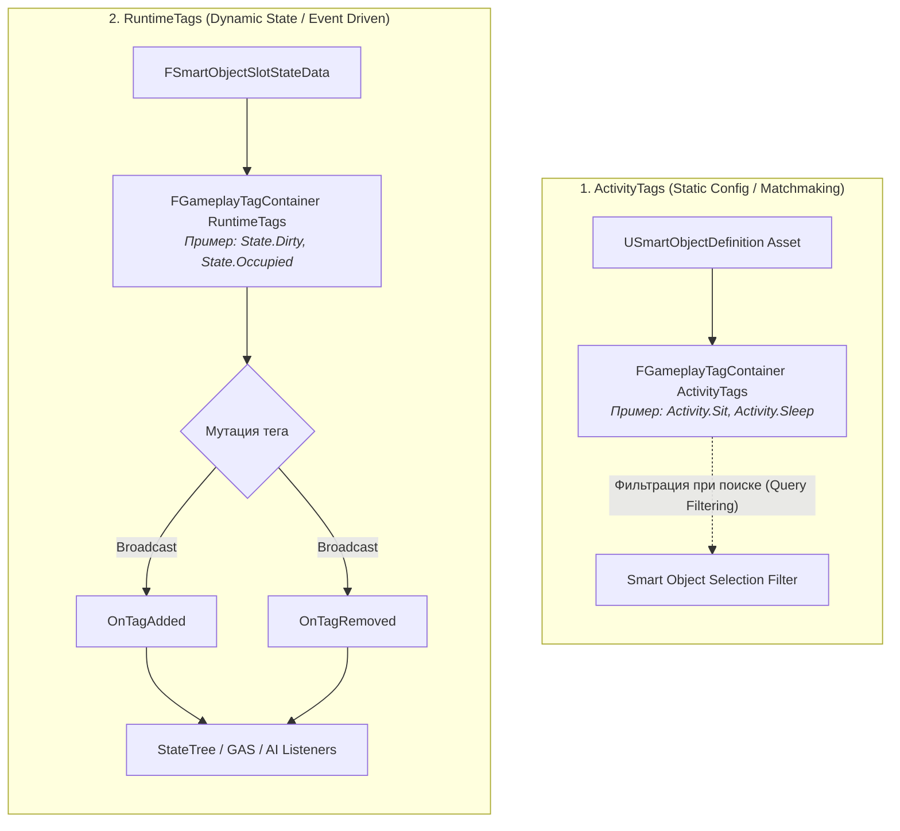
```mermaid
%%{init: {"flowchart": {"useMaxWidth": true, "htmlLabels": true}, "themeVariables": {"fontSize": "13px"}}}%%
flowchart TD
    subgraph ActivityTagsGroup ["1. ActivityTags (Static Config / Matchmaking)"]
        direction TB
        SOAsset["USmartObjectDefinition Asset"]
        ActTags["FGameplayTagContainer ActivityTags<br/><i>Пример: Activity.Sit, Activity.Sleep</i>"]
        SOAsset --> ActTags
        ActTags -. "Фильтрация при поиске (Query Filtering)" .-> Matchmaking["Smart Object Selection Filter"]
    end

    subgraph RuntimeTagsGroup ["2. RuntimeTags (Dynamic State / Event Driven)"]
        direction TB
        SlotState["FSmartObjectSlotStateData"]
        RunTags["FGameplayTagContainer RuntimeTags<br/><i>Пример: State.Dirty, State.Occupied</i>"]
        SlotState --> RunTags
        RunTags --> Events{"Мутация тега"}
        Events -- "Broadcast" --> OnAdded["OnTagAdded"]
        Events -- "Broadcast" --> OnRemoved["OnTagRemoved"]
        OnAdded --> Observers["StateTree / GAS / AI Listeners"]
        OnRemoved --> Observers
    end
```


`RuntimeTags` — ваш основной механизм для игровой логики поверх SmartObjects. Скамейка стала грязной → добавили тег → условие «слот доступен, если нет тега `State.Dirty`» перестало проходить → NPC перестали садиться. Никакого кода в AI.

#### Условия и поведения

cpp

```cpp
/** Preconditions that must pass for the slot to be selected. */
UPROPERTY(EditDefaultsOnly, Category = "Slot")
FWorldConditionQueryDefinition SelectionPreconditions;

/**
 * All available definitions associated to this slot.
 * This allows multiple frameworks to provide their specific behavior definition to the slot.
 * Note that there should be only one definition of each type since the first one will be selected.
 */
UPROPERTY(BlueprintReadOnly, EditDefaultsOnly, Category = "Slot", Instanced)
TArray<TObjectPtr<USmartObjectBehaviorDefinition>> BehaviorDefinitions;
```

**`SelectionPreconditions`** — условия из системы World Conditions. Это гораздо мощнее тегов: условия могут спрашивать о состоянии мира, времени суток, о самом пользователе (через `FSmartObjectActorUserData` из главы 2), о чём угодно, для чего написан условный тип. Условия проверяются в фазе фильтрации, после грубого отбора по тегам.

**`BehaviorDefinitions`** — реализация полиморфизма из главы 1. Массив поведений разных типов. Комментарий Epic содержит важнейшее правило: **должно быть не более одного определения каждого типа, потому что выбирается первое найденное**. Два `USmartObjectMassBehaviorDefinition` в одном слоте — ошибка проектирования, второй просто никогда не сработает.

Спецификатор `Instanced` означает, что объекты поведений принадлежат этому слоту, сериализуются вместе с ассетом и копируются при дублировании.

#### Пользовательские данные слота

cpp

```cpp
UPROPERTY(EditDefaultsOnly, Category = "Slot")
TArray<FSmartObjectDefinitionDataProxy> DefinitionData;

#if WITH_EDITORONLY_DATA
    UE_DEPRECATED(all, "Use DefinitionData instead.")
    UPROPERTY()
    TArray<FInstancedStruct> Data_DEPRECATED;
#endif
```

То, что читают шаблонные геттеры выше. Устаревшее поле `Data_DEPRECATED` — прежняя версия без GUID-идентификации; оставлено для миграции старых ассетов.

Комментарий Epic указывает главное применение: доступ через `FSmartObjectSlotView`. То есть код взаимодействия, получив вид на слот, может достать оттуда произвольные проектные данные — «какую анимацию проигрывать», «сколько стоит использование», «какой звук». Views разберём в главе 7.

---

### 3.7. `FSmartObjectDefinitionPreviewData`

cpp

```cpp
USTRUCT(BlueprintType)
struct FSmartObjectDefinitionPreviewData
{
    UPROPERTY(EditDefaultsOnly, BlueprintReadWrite, Category = "Object Preview")
    TSoftClassPtr<AActor> ObjectActorClass;

    UPROPERTY(EditDefaultsOnly, BlueprintReadWrite, Category = "Object Preview", 
              meta = (AllowedClasses = "/Script/Engine.StaticMesh"))
    FSoftObjectPath ObjectMeshPath;

    UPROPERTY(EditDefaultsOnly, BlueprintReadWrite, Category = "User Preview")
    TSoftClassPtr<AActor> UserActorClass;

    UPROPERTY(EditDefaultsOnly, BlueprintReadWrite, Category = "User Preview")
    TSoftClassPtr<USmartObjectSlotValidationFilter> UserValidationFilterClass;
};
```

Настройки превью в редакторе определений. Полностью редакторная структура, на игру не влияет, но на практику дизайнера — очень.

Две группы:

**Object Preview** — как выглядит сам объект. Можно указать либо класс актора (`ObjectActorClass`), либо просто статик-меш (`ObjectMeshPath`). Меш проще, если объект — просто модель; класс актора нужен, когда геометрия собирается из нескольких компонентов.

**User Preview** — как выглядит пользователь. `UserActorClass` даёт визуальное представление персонажа в слоте: сразу видно, не проваливается ли он в геометрию, правильно ли ориентирован.

`UserValidationFilterClass` — тот самый `USmartObjectSlotValidationFilter` из главы 2. В превью редактор использует его настройки, чтобы показывать результаты валидации: достижима ли точка, помещается ли капсула. Дизайнер видит проблемы **до** запуска игры.

Все ссылки — **soft** (`TSoftClassPtr`, `FSoftObjectPath`). Это существенно: превью-ассеты не должны тянуться в память при загрузке определения в игре. Мягкие ссылки грузятся только по требованию, в редакторе.

---

### 3.8. `USmartObjectDefinition`: объявление класса

cpp

```cpp
UCLASS(MinimalAPI, BlueprintType, Blueprintable, CollapseCategories)
class USmartObjectDefinition : public UDataAsset, public IPropertyBindingBindingCollectionOwner
```

- **`UDataAsset`** — ассет-контейнер данных. Создаётся в Content Browser, не имеет представления в мире.
- **`IPropertyBindingBindingCollectionOwner`** — интерфейс владельца коллекции привязок свойств. Это то, что делает возможной параметризацию (раздел 3.12).
- **`Blueprintable`** — в отличие от базового класса поведений, определения **можно** наследовать в Blueprint. Полезно для проектных базовых определений с предзаданными настройками.

---

### 3.9. Работа со слотами

#### Доступ к слотам

cpp

```cpp
/** @return a view on all the slot definitions */
TConstArrayView<FSmartObjectSlotDefinition> GetSlots() const { return Slots; }

/** @return slot definition stored at a given index */
const FSmartObjectSlotDefinition& GetSlot(const int32 Index) const { return Slots[Index]; }

UFUNCTION(BlueprintCallable, BlueprintPure, Category="SmartObject")
FSmartObjectSlotDefinition& GetMutableSlot(const int32 Index) { return Slots[Index]; }

UFUNCTION(BlueprintCallable, BlueprintPure, Category="SmartObject")
bool IsValidSlotIndex(const int32 SlotIndex) const { return Slots.IsValidIndex(SlotIndex); }

UFUNCTION(BlueprintCallable, BlueprintPure, Category="SmartObject", 
          meta=(DisplayName="Get Smart Object Slot Definitions"))
const TArray<FSmartObjectSlotDefinition>& K2_GetSlots() const { return Slots; }

#if WITH_EDITOR
TArrayView<FSmartObjectSlotDefinition> GetMutableSlots() { return Slots; }
#endif
```

- **`GetSlots()`** возвращает `TConstArrayView` — невладеющий константный вид. Ни копирования, ни возможности изменить размер массива.
- **`GetSlot(Index)`** — **без проверки границ**. Обращение по невалидному индексу — UB. Обязательно проверяйте через `IsValidSlotIndex` перед вызовом.
- **`GetMutableSlot(Index)`** — изменяемая ссылка, доступна и в Blueprint. Используйте только на этапе конструирования, не в игровой логике.
- **`K2_GetSlots()`** — Blueprint-версия. Возвращает `const TArray&` вместо `TConstArrayView`, потому что Blueprint-система не умеет работать с view-типами. Префикс `K2_` — соглашение UE для Blueprint-обёрток нативных методов.
- **`GetMutableSlots()`** (только в редакторе) — изменяемый вид на весь массив. Обратите внимание: `TArrayView`, а не `TArray&` — размер менять нельзя, только содержимое.

#### Мировой трансформ слота

cpp

```cpp
UFUNCTION(BlueprintCallable, BlueprintPure, Category="SmartObject")
UE_API FTransform GetSlotWorldTransform(const int32 SlotIndex, const FTransform& OwnerTransform) const;
```

Ключевой метод для практического использования. Берёт локальные `Offset`/`Rotation` слота и трансформ владельца, возвращает мировой трансформ слота.

Обратите внимание на дизайн: определение **не знает** о владельце и получает его трансформ параметром. Это сохраняет определение stateless.

Из комментария: при невалидном индексе возвращается `OwnerTransform` и срабатывает `ensure`. То есть метод не падает, но в логе появится сообщение и коллстек — поведение «безопасная деградация с диагностикой».

#### Границы

cpp

```cpp
UFUNCTION(BlueprintCallable, Category="SmartObject")
UE_API FBox GetBounds() const;
```

Возвращает AABB, охватывающий все слоты, **в локальном пространстве**. Используется при регистрации объекта в пространственной структуре (`USmartObjectSpacePartition::Add`) и в `USmartObjectComponent::GetSmartObjectBounds`.

#### Вспомогательное

cpp

```cpp
FSmartObjectSlotDefinition& DebugAddSlot() { return Slots.AddDefaulted_GetRef(); }
```

Явно помечено как «для тестов». Добавляет слот со значениями по умолчанию и возвращает ссылку на него. В продакшн-коде не используйте.

---

### 3.10. Поиск поведений

cpp

```cpp
UE_API const USmartObjectBehaviorDefinition* GetBehaviorDefinition(
    const int32 SlotIndex, 
    const TSubclassOf<USmartObjectBehaviorDefinition>& DefinitionClass) const;
```

Один из важнейших методов класса. Реализует **двухуровневый поиск с наследованием умолчаний**:

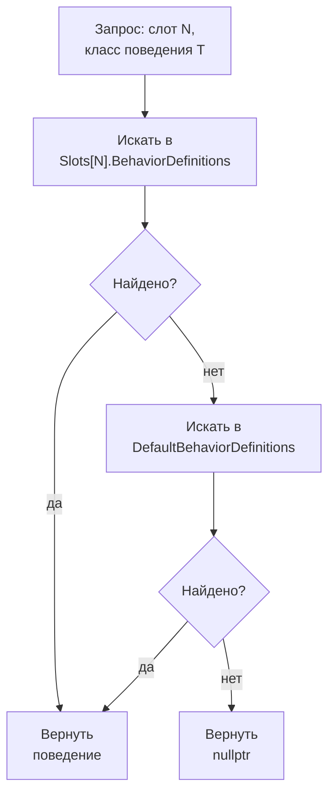
```mermaid

graph TD

    Q["Запрос: слот N,<br/>класс поведения T"]

    S["Искать в<br/>Slots[N].BehaviorDefinitions"]

    F1{"Найдено?"}

    D["Искать в<br/>DefaultBehaviorDefinitions"]

    F2{"Найдено?"}

    OK["Вернуть<br/>поведение"]

    NO["Вернуть<br/>nullptr"]

    Q --> S --> F1

    F1 -->|да| OK

    F1 -->|нет| D --> F2

    F2 -->|да| OK

    F2 -->|нет| NO

```

Из комментария Epic: если слот не предоставляет поведение нужного типа **или индекс невалиден**, поиск идёт в умолчаниях объекта.

Практическая ценность огромна. Представьте объект с десятью одинаковыми слотами. Вы задаёте поведение **один раз** в `DefaultBehaviorDefinitions`, и все слоты его наследуют. А если один слот особенный — переопределяете только его.

Реализация опирается на приватный хелпер:

cpp

```cpp
static const USmartObjectBehaviorDefinition* GetBehaviorDefinitionByType(
    const TArray<USmartObjectBehaviorDefinition*>& BehaviorDefinitions, 
    const TSubclassOf<USmartObjectBehaviorDefinition>& DefinitionClass);
```

Линейный поиск первого элемента нужного класса. Отсюда и требование «не более одного поведения каждого типа на слот».

---

### 3.11. Теги и политики: API

cpp

```cpp
UFUNCTION(BlueprintCallable, BlueprintPure, Category="SmartObject", 
          meta = (DisplayName="Get Slot Activity Tags (By Index)", ...))
UE_API void GetSlotActivityTags(const int32 SlotIndex, FGameplayTagContainer& OutActivityTags) const;

UE_API void GetSlotActivityTags(const FSmartObjectSlotDefinition& SlotDefinition, 
                                FGameplayTagContainer& OutActivityTags) const;
```

Две перегрузки — по индексу и по ссылке на определение слота. Вторая быстрее, если определение уже на руках.

**Это не простые геттеры.** Они **применяют политику слияния**: смотрят на `ActivityTagsMergingPolicy` и либо складывают теги объекта и слота, либо берут только слотовые. Всегда используйте эти методы вместо прямого чтения `SlotDefinition.ActivityTags` — иначе получите неверный результат в режиме `Combine`.

Результат отдаётся через выходной параметр, а не возвратом — чтобы вызывающий мог переиспользовать буфер и не платить за аллокацию в горячем цикле поиска.

Далее — блок геттеров/сеттеров, доступных и в Blueprint:

cpp

```cpp
const FGameplayTagQuery& GetUserTagFilter() const;
void SetUserTagFilter(const FGameplayTagQuery& InUserTagFilter);

const FGameplayTagContainer& GetActivityTags() const;
void SetActivityTags(const FGameplayTagContainer& InActivityTags);

ESmartObjectTagFilteringPolicy GetUserTagsFilteringPolicy() const;
void SetUserTagsFilteringPolicy(const ESmartObjectTagFilteringPolicy InUserTagsFilteringPolicy);

ESmartObjectTagMergingPolicy GetActivityTagsMergingPolicy() const;
void SetActivityTagsMergingPolicy(const ESmartObjectTagMergingPolicy InActivityTagsMergingPolicy);
```

Обратите внимание на асимметрию `UFUNCTION`: **геттеры доступны в Blueprint, сеттеры — нет** (кроме `SetUserTagFilter`). Epic намеренно затрудняет модификацию ассета из Blueprint-скриптов. Сеттеры существуют для процедурной генерации в C++.

Отдельно:

cpp

```cpp
const USmartObjectWorldConditionSchema* GetWorldConditionSchema() const 
{ 
    return WorldConditionSchemaClass.GetDefaultObject(); 
}
const TSubclassOf<USmartObjectWorldConditionSchema>& GetWorldConditionSchemaClass() const;
```

Схема условий возвращается как **CDO**, не как экземпляр. Схема — это описание доступных данных, чистая метаинформация, экземпляр ей не нужен. Класс схемы берётся по умолчанию из `USmartObjectSettings::DefaultWorldConditionSchemaClass` (см. главу 2).

---

### 3.12. Параметры и вариации ассета

Самая продвинутая часть класса. Решает задачу: **как сделать один ассет настраиваемым для разных экземпляров, не создавая копию ассета на каждый случай**.

#### Проблема

У вас есть определение «Дверь». Дверей в игре сто, и они отличаются шириной, направлением открывания, требуемым уровнем доступа. Плохое решение — сто ассетов. Другое плохое решение — сто полей в компоненте, которые он передаёт в логику.

#### Решение: параметры + привязки

cpp

```cpp
/** Parameters for the SmartObject definition */
UPROPERTY(EditDefaultsOnly, Category = "SmartObject", meta = (NoBinding))
FInstancedPropertyBag Parameters;

/** Binding ID for the parameters. */
UPROPERTY()
FGuid ParametersID;

/** Binding ID for the whole asset. */
UPROPERTY()
FGuid RootID;

/** Property bindings. */
UPROPERTY(VisibleAnywhere, Category = "SmartObject", AdvancedDisplay)
FSmartObjectBindingCollection BindingCollection;
```

**`Parameters`** типа `FInstancedPropertyBag` — «мешок свойств», динамически определяемый набор именованных значений. Дизайнер прямо в редакторе добавляет параметры: `DoorWidth : float`, `RequiredAccess : GameplayTag`. Никакого C++.

**`BindingCollection`** — набор привязок вида «свойство X слота 2 берёт значение из параметра `DoorWidth`». Именно здесь используются `FSmartObjectDefinitionDataHandle` (глава 2) и GUID'ы слотов/данных: привязка адресует источник и приёмник стабильными идентификаторами.

**`ParametersID` и `RootID`** — GUID'ы для адресации мешка параметров и корня ассета в системе привязок. Соответствуют зарезервированным значениям `FSmartObjectDefinitionDataHandle::Parameters` и `::Root`.

`meta = (NoBinding)` на самих `Parameters` — параметры являются **источником** привязок, привязывать их самих некуда.

#### Механизм вариаций

cpp

```cpp
/** @return reference to definition default parameters. */
const FInstancedPropertyBag& GetDefaultParameters() const { return Parameters; }

/**
 * Returns a variation of this asset with specified parameters applied.
 * The variations are cached, and if a variation with same parameters is already in use,
 * the existing asset is returned.
 */
USmartObjectDefinition* GetAssetVariation(const FInstancedPropertyBag& Parameters, UWorld* World);

static UE_API uint64 GetVariationParametersHash(const FInstancedPropertyBag& Parameters);
```

Внутреннее хранилище:

cpp

```cpp
struct FSmartObjectDefinitionAssetVariation
{
    /** Stored as weak pointer, so that we can prune variations which are not used anymore. */
    TWeakObjectPtr<USmartObjectDefinition> DefinitionAsset = nullptr;
    uint64 ParametersHash = 0;
};

TArray<FSmartObjectDefinitionAssetVariation> Variations;
```

Как это работает:

1. Компонент просит определение с конкретными параметрами.
2. Считается хеш параметров через `GetVariationParametersHash`.
3. Ищется вариация с таким хешем в `Variations`.
4. Если найдена — возвращается **уже существующий** объект.
5. Если нет — создаётся дубликат ассета, к нему применяются параметры (`ApplyParameters()`), результат кешируется.

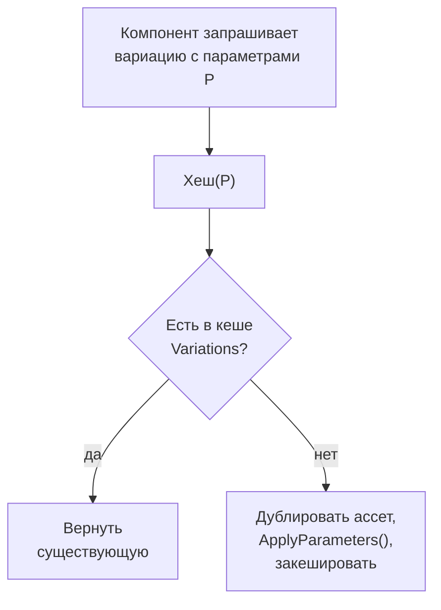
```mermaid

graph TD

    A["Компонент запрашивает<br/>вариацию с параметрами P"]

    H["Хеш(P)"]

    C{"Есть в кеше<br/>Variations?"}

    R["Вернуть<br/>существующую"]

    N["Дублировать ассет,<br/>ApplyParameters(),<br/>закешировать"]

    A --> H --> C

    C -->|да| R

    C -->|нет| N

```
Ключевая деталь — **`TWeakObjectPtr`** для хранения вариации. Слабая ссылка не удерживает объект от сборки мусора. Когда последний компонент, использующий вариацию, исчезает, вариация уничтожается GC, а запись в массиве становится невалидной и подчищается. Комментарий Epic это прямо подтверждает: _хранится как слабый указатель, чтобы можно было удалять неиспользуемые вариации_.

Итог: сто дверей с десятью уникальными комбинациями параметров дадут **десять** объектов-вариаций, а не сто.

Именно на это указывает поле в компоненте, которое вы видели:

cpp

```cpp
UPROPERTY(Transient, ..., meta = (DisplayName="Definition Asset"))
mutable TObjectPtr<USmartObjectDefinition> CachedDefinitionAssetVariation = nullptr;
```

И различие двух методов компонента:

cpp

```cpp
/** @return Smart Object Definition with parameters applied. */
const USmartObjectDefinition* GetDefinition() const;

/** @return Smart Object Definition without applied parameters. */
const USmartObjectDefinition* GetBaseDefinition() const;
```

`GetDefinition()` даёт вариацию, `GetBaseDefinition()` — исходный ассет.

#### Интерфейс `IPropertyBindingBindingCollectionOwner`

Реализация интерфейса — большой блок методов, почти целиком редакторный:

cpp

```cpp
//~ Begin IPropertyBindingBindingCollectionOwner interface
UE_API virtual bool GetBindingDataView(const FPropertyBindingBinding& InBinding, 
                                       EBindingSide InSide, 
                                       FPropertyBindingDataView& OutDataView) override;

#if WITH_EDITOR
UE_API virtual bool GetBindingDataViewByID(const FGuid InStructID, FPropertyBindingDataView& OutDataView) const override;
UE_API virtual bool GetBindableStructByID(const FGuid InStructID, TInstancedStruct<FPropertyBindingBindableStructDescriptor>& OutDesc) const override;
UE_API virtual void GetBindableStructs(const FGuid InTargetStructID, TArray<TInstancedStruct<FPropertyBindingBindableStructDescriptor>>& OutStructDescs) const override;
UE_API virtual void CreateParametersForStruct(const FGuid InStructID, TArrayView<UE::PropertyBinding::FPropertyCreationDescriptor> InOutCreationDescs) override;
UE_API virtual void OnPropertyBindingChanged(const FPropertyBindingPath& InSourcePath, const FPropertyBindingPath& InTargetPath) override;
UE_API virtual FPropertyBindingBindingCollection* GetEditorPropertyBindings() override;
UE_API virtual const FPropertyBindingBindingCollection* GetEditorPropertyBindings() const override;
UE_API virtual FGuid GetFallbackStructID() const override;
//~ End IPropertyBindingBindingCollectionOwner interface
#endif
```

Обратите внимание: **только `GetBindingDataView` работает в рантайме**, остальное — под `WITH_EDITOR`. Логика такая: в редакторе система привязок должна уметь перечислять доступные структуры, показывать их дизайнеру, создавать параметры, реагировать на изменения. В рантайме нужно только одно — получить доступ к данным по уже готовой привязке.

Кратко о назначении:

- **`GetBindingDataView(Binding, Side, OutDataView)`** — по привязке и стороне (источник/приёмник) вернуть вид на данные. Ядро исполнения привязок.
- **`GetBindingDataViewByID` / `GetBindableStructByID`** — то же по GUID.
- **`GetBindableStructs(TargetStructID, OutDescs)`** — перечислить всё, к чему можно привязаться. Заполняет выпадающий список в редакторе.
- **`CreateParametersForStruct`** — автоматически создать параметры под структуру. Функция «сделать это свойство параметром» одним кликом.
- **`OnPropertyBindingChanged`** — реакция на изменение привязки.
- **`GetEditorPropertyBindings()`** — доступ к коллекции (две перегрузки, const и не-const).
- **`GetFallbackStructID()`** — резервный ID, когда конкретный не определён.

Вспомогательные редакторные методы:

cpp

```cpp
UE_API void UpdateSlotReferences();
UE_API void UpdateBindingPaths();
UE_API bool UpdateAndValidatePath(FPropertyBindingPath& Path) const;
UE_API FSmartObjectDefinitionDataHandle GetDataHandleByID(const FGuid StructID);
```

- **`UpdateSlotReferences()`** — тот самый механизм из главы 2: пересчитать `Index` в `FSmartObjectSlotReference` по стабильному `SlotID`. Вызывается при изменениях, загрузке, сохранении.
- **`UpdateBindingPaths()`** — обновить пути всех привязок и **удалить невалидные**. Дизайнер удалил свойство → привязка к нему выбрасывается.
- **`UpdateAndValidatePath(Path)`** — то же для одного пути, возвращает валидность.
- **`GetDataHandleByID(StructID)`** — мост между GUID и `FSmartObjectDefinitionDataHandle`.

Приватные:

cpp

```cpp
void ApplyParameters();
bool GetDataView(const FSmartObjectDefinitionDataHandle DataHandle, FPropertyBindingDataView& OutDataView);

#if WITH_EDITOR
void EnsureValidGuids();
void UpdatePropertyBindings();
#endif
```

`ApplyParameters()` — сердце механизма вариаций: проходит по всем привязкам и копирует значения из мешка параметров в целевые свойства. `EnsureValidGuids()` — гарантирует, что у всех слотов и элементов данных есть GUID (для миграции старых ассетов).

---

### 3.13. Поиск по GUID (редактор)

cpp

```cpp
#if WITH_EDITOR
UE_API int32 FindSlotByID(const FGuid ID) const;

UE_API bool FindSlotAndDefinitionDataIndexByID(const FGuid ID, 
                                               int32& OutSlotIndex, 
                                               int32& OutDefinitionDataIndex) const;
#endif
```

- **`FindSlotByID`** — индекс слота по его GUID, либо `INDEX_NONE`.
- **`FindSlotAndDefinitionDataIndexByID`** — более общий: GUID может принадлежать как слоту, так и элементу данных внутри слота. Метод определяет, что именно, и заполняет оба индекса. Если `OutDefinitionDataIndex == INDEX_NONE`, GUID указывал на сам слот.

Это обратное преобразование к `GetDataHandleByID` и основа всей редакторной работы с привязками.

---

### 3.14. Валидация

cpp

```cpp
UE_API bool Validate(TArray<TPair<EMessageSeverity::Type, FText>>* ErrorsToReport = nullptr) const;

bool HasBeenValidated() const { return bValid.IsSet(); }
bool IsDefinitionValid() const { return bValid.Get(false); }

mutable TOptional<bool> bValid;
```

Продуманная система с важным нюансом.

**`Validate(ErrorsToReport)`** — проверяет корректность определения. Два режима, различаемые параметром:

- **`nullptr`** (по умолчанию) — **выход на первой же ошибке**. Быстро. Используется в рантайме при регистрации.
- **непустой указатель** — проход по всем проверкам со сбором всех сообщений. Медленно, но информативно. Используется при сохранении ассета, чтобы показать дизайнеру полный список проблем.

Каждое сообщение — пара «серьёзность + текст»: часть проблем могут быть предупреждениями, а не ошибками.

Из комментария Epic — **критическое следствие**: _объект, использующий невалидное определение, не будет зарегистрирован в симуляции_. Это первое, что нужно проверять, когда SmartObject «не работает и не находится».

**Трёхзначная логика через `TOptional<bool>`.** Вот главный нюанс. `bValid` может быть в трёх состояниях:

|Состояние|`HasBeenValidated()`|`IsDefinitionValid()`|Смысл|
|---|---|---|---|
|Не установлен|`false`|`false`|Валидация **не проводилась**|
|`false`|`true`|`false`|Определение **невалидно**|
|`true`|`true`|`true`|Определение валидно|

Обратите внимание: `IsDefinitionValid()` возвращает `false` и в первом, и во втором случае. Поэтому комментарий Epic настойчиво требует **сначала вызывать `HasBeenValidated()`**, иначе вы не отличите «сломано» от «ещё не проверялось».

`mutable` на поле позволяет `Validate()` быть `const`-методом при том, что он кеширует результат — классический паттерн «логическая константность».

**`LexToString`** для отладки:

cpp

```cpp
friend FString LexToString(const USmartObjectDefinition& Definition)
{
    return FString::Printf(TEXT("NumSlots=%d NumDefs=%d HasUserFilter=%s HasPreConditions=%s"), ...);
}
```

Компактная сводка: число слотов, число умолчательных поведений, наличие фильтра пользователей и предусловий.

---

### 3.15. Остальные поля класса

Соберём то, что ещё не разобрано:

cpp

```cpp
/**
 * Where SmartObject's user needs to stay to be able to activate it.
 * Locations are relative to object's location.
 */
UPROPERTY(EditDefaultsOnly, Category = "SmartObject")
TArray<FSmartObjectSlotDefinition> Slots;

/** List of behavior definitions of different types provided to SO's user if the slot does not provide one. */
UPROPERTY(EditDefaultsOnly, Category = "SmartObject", Instanced)
TArray<TObjectPtr<USmartObjectBehaviorDefinition>> DefaultBehaviorDefinitions;

/** This object is available if user tags match this query; always available if query is empty. */
UPROPERTY(EditDefaultsOnly, Category = "SmartObject")
FGameplayTagQuery UserTagFilter;

/** Preconditions that must pass for the object to be found/used. */
UPROPERTY(EditDefaultsOnly, Category = "SmartObject", meta = (NoBinding))
FWorldConditionQueryDefinition Preconditions;

/** Tags identifying this Smart Object's use case. */
UPROPERTY(EditDefaultsOnly, Category = "SmartObject")
FGameplayTagContainer ActivityTags;

/** Custom definition data items for the whole Smart Object. */
UPROPERTY(EditDefaultsOnly, Category = "SmartObject", 
          meta=(DisallowedStructs="/Script/SmartObjectsModule.SmartObjectSlotAnnotation"))
TArray<FSmartObjectDefinitionDataProxy> DefinitionData;

UPROPERTY(EditDefaultsOnly, Category = "SmartObject", AdvancedDisplay, meta = (NoBinding))
TSubclassOf<USmartObjectWorldConditionSchema> WorldConditionSchemaClass;

UPROPERTY(EditAnywhere, Category = "SmartObject", AdvancedDisplay, meta = (NoBinding))
ESmartObjectTagMergingPolicy ActivityTagsMergingPolicy;

UPROPERTY(EditAnywhere, Category = "SmartObject", AdvancedDisplay, meta = (NoBinding))
ESmartObjectTagFilteringPolicy UserTagsFilteringPolicy;
```

Заметьте **симметрию** между объектом и слотом: у обоих есть `ActivityTags`, `UserTagFilter`, предусловия, `DefinitionData`, поведения. Именно эта симметрия и порождает необходимость политик слияния — иначе непонятно, чьи данные важнее.

Отличие: у слота предусловия называются `SelectionPreconditions` (условия **выбора** слота), у объекта — `Preconditions` (условия **обнаружения и использования** объекта). Объектные проверяются раньше и отсекают весь объект целиком.

Интересная метка: `DisallowedStructs="/Script/SmartObjectsModule.SmartObjectSlotAnnotation"` на объектном `DefinitionData`. Аннотации слотов — это специальный вид данных определения, имеющий смысл только на уровне слота; редактор запрещает добавить их на уровень объекта.

`AdvancedDisplay` на политиках и схеме условий — они спрятаны под стрелочкой «Advanced». Дизайнер трогает их редко, значения по умолчанию берутся из настроек проекта.

#### Устаревшие поля

cpp

```cpp
#if WITH_EDITORONLY_DATA
    UE_DEPRECATED(all, "Use BindingCollection instead.")
    TArray<FSmartObjectDefinitionPropertyBinding> PropertyBindings_DEPRECATED;

    UE_DEPRECATED(all, "FWorldCondition_SmartObjectActorTagQuery or FSmartObjectWorldConditionObjectTagQuery used in Preconditions instead.")
    FGameplayTagQuery ObjectTagFilter;

    UE_DEPRECATED(all, "Use ObjectActorClass in PreviewData instead.")
    TSoftClassPtr<AActor> PreviewClass_DEPRECATED;

    UE_DEPRECATED(all, "Use ObjectMeshPath in PreviewData instead.")
    FSoftObjectPath PreviewMeshPath_DEPRECATED;
#endif
```

История эволюции класса: привязки переехали в отдельную коллекцию, фильтр по тегам объекта заменён на полноценные World Conditions, настройки превью собраны в структуру.

Устаревание `ObjectTagFilter` показательно: раньше был отдельный простой механизм фильтрации по тегам объекта, теперь он поглощён более общей системой условий.

---

### 3.16. Переопределённые методы `UObject`

cpp

```cpp
#if WITH_EDITOR
UE_API virtual void GetPreloadDependencies(TArray<UObject*>& OutDeps) override;
UE_API virtual void PostEditChangeChainProperty(FPropertyChangedChainEvent& PropertyChangedEvent) override;
UE_API virtual void PreSave(FObjectPreSaveContext SaveContext) override;
UE_API virtual void CollectSaveOverrides(FObjectCollectSaveOverridesContext SaveContext) override;
UE_API virtual EDataValidationResult IsDataValid(class FDataValidationContext& Context) const override;
UE_API virtual void GetAssetRegistryTags(FAssetRegistryTagsContext Context) const override;
#endif

UE_API virtual void PostInitProperties() override;
UE_API virtual void Serialize(FArchive& Ar) override;
UE_API virtual void PostLoad() override;
UE_API virtual void PostDuplicate(EDuplicateMode::Type DuplicateMode) override;
```

Что здесь важно понимать:

- **`GetPreloadDependencies`** — сообщает системе загрузки, какие объекты нужно загрузить **до** этого ассета. Критично для `Instanced`-поведений: они должны существовать к моменту завершения загрузки определения.
- **`PostEditChangeChainProperty`** — не просто `PostEditChangeProperty`, а **chain**-версия. Она получает полную цепочку изменённого свойства, включая вложенность («слот 2 → данные 1 → поле X»). Необходимо для корректного обновления привязок и ссылок на слоты.
- **`PreSave`** — здесь вызывается `Validate` с полным сбором ошибок и рассылается делегат `OnSavingDefinition`.
- **`CollectSaveOverrides`** — вот это интересно. Механизм исключения данных при сохранении для конкретных платформ. Именно он реализует настройку из `SmartObjectSettings`:

cpp

```cpp
/**
 * Indicates whether or not the pre-conditions should be excluded from serializing
 * SmartObjectDefinitions for client builds.
 */
bool bShouldExcludePreConditionsOnDedicatedClient = false;
```

Смысл: предусловия часто зависят от серверных плагинов, которых на клиенте нет. Опция позволяет клиенту читать структуру определения (слоты, трансформы, теги), а логику проверок оставить только на сервере. Экономит память и убирает зависимости.

- **`IsDataValid`** — интеграция с редакторной системой валидации ассетов (кнопка «Validate Assets» в Content Browser).
- **`Serialize`** — переопределён для миграции устаревших полей и работы с вариациями.
- **`PostDuplicate`** — единственный **не** редакторный из этой группы. Вызывается при создании вариации ассета: нужно сгенерировать новые GUID, чтобы вариация не конфликтовала с оригиналом.

#### Дружественные классы

cpp

```cpp
friend FSmartObjectBindingCollection;
friend class FSmartObjectSlotReferenceDetails;
friend class FSmartObjectViewModel;
friend class FSmartObjectAssetToolkit;
friend class FSmartObjectDefinitionDetails;
```

Все, кроме первого, — редакторные классы:

- **`FSmartObjectBindingCollection`** — коллекция привязок, ей нужен доступ к приватным данным для исполнения.
- **`FSmartObjectSlotReferenceDetails`** — кастомизация отображения `FSmartObjectSlotReference` (выпадающий список слотов).
- **`FSmartObjectViewModel`** — модель представления редактора определений.
- **`FSmartObjectAssetToolkit`** — сам редактор ассета.
- **`FSmartObjectDefinitionDetails`** — кастомизация панели деталей.

Список показывает, насколько развит редакторный инструментарий вокруг этого класса.

---

### 3.17. Итоги главы

1. **Определение — stateless-ассет.** Не изменяйте его в игровой логике.
2. **Симметрия объект/слот** во всех аспектах (теги, условия, поведения, данные) — отсюда необходимость политик слияния.
3. **Двухуровневый поиск поведений**: слот → умолчания объекта. Задавайте общее поведение один раз в `DefaultBehaviorDefinitions`.
4. **Не более одного поведения каждого типа** на слот — выбирается первое.
5. **`ActivityTags` ≠ `RuntimeTags`.** Первые — статическая классификация, вторые — начальное значение изменяемого состояния и ваш главный инструмент игровой логики.
6. **Локальные координаты в `float`** (`FVector3f`), не `double`. Требуют явной конверсии.
7. **Всегда используйте `GetSlotActivityTags`**, а не прямое чтение поля — только метод применяет политику слияния.
8. **Параметры + привязки + вариации** дают настраиваемость без размножения ассетов. Вариации кешируются по хешу и удерживаются слабыми ссылками.
9. **GUID везде**, где данные могут переупорядочиться: слоты, элементы данных, параметры. Индексы — производный кеш.
10. **Невалидное определение = объект не зарегистрируется.** При отладке начинайте с `Validate()` и различайте «невалидно» и «не проверялось» через `HasBeenValidated()`.

---

В следующей главе разбираем поведения: `USmartObjectBehaviorDefinition` и его наследников. `UGameplayBehaviorSmartObjectBehaviorDefinition` и весь фреймворк `UGameplayBehavior` — как объект передаёт актору инструкцию «что делать», жизненный цикл `Trigger`/`EndBehavior`, политики инстанцирования и интеграция с Gameplay Tasks.

---

## Глава 4. Поведения: механизм полиморфной реализации

В предыдущей главе мы видели, что определение хранит массивы `USmartObjectBehaviorDefinition`, но сам базовый класс пуст. Теперь разберём, как из этой пустоты получается работающая система, и подробно рассмотрим первого наследника — интеграцию с фреймворком GameplayBehavior.

---

### 4.1. Проблема, которую решают поведения

Вернёмся к скамейке. Объект должен сказать пользователю: «сядь и сиди». Но что означает «сядь»?

- Для **полноценного NPC-актора** это: проиграть монтаж анимации, отключить движение, возможно, применить GameplayEffect, дождаться окончания, встать.
- Для **Mass-сущности** из толпы: добавить фрагмент с таймером, изменить состояние анимации в VAT-системе, через N секунд убрать фрагмент.
- Для **игрока** (если вы решите использовать SmartObjects для игрока): показать промпт, дождаться нажатия, включить камеру от третьего лица в специальном режиме.

Три совершенно разных механизма. Ни один общий интерфейс их не покроет: у Mass-сущности нет `AActor*`, у актора нет `FMassEntityHandle`, у игрока есть контроллер ввода, которого нет у остальных.

Вывод, к которому пришли Epic: **не пытаться унифицировать исполнение**. Вместо этого — унифицировать только **хранение и поиск**.

---

### 4.2. Архитектурный приём: маркерный базовый класс

cpp

```cpp
UCLASS(MinimalAPI, Abstract, NotBlueprintable, EditInlineNew, CollapseCategories, HideDropdown)
class USmartObjectBehaviorDefinition : public UObject
{
    GENERATED_BODY()
};
```

Этот класс не объявляет ни одного метода. Он существует ради **одной** операции — поиска по типу:

cpp

```cpp
const USmartObjectBehaviorDefinition* GetBehaviorDefinition(
    const int32 SlotIndex, 
    const TSubclassOf<USmartObjectBehaviorDefinition>& DefinitionClass) const;
```

Контракт получается такой:

1. **Определение** (ассет) хранит разнородные поведения в одном массиве.
2. **Запрашивающая сторона** знает, какой конкретный класс ей нужен, и просит именно его.
3. **Полученный указатель** приводится к конкретному типу — и дальше работа идёт по контракту этого типа, а не базового.

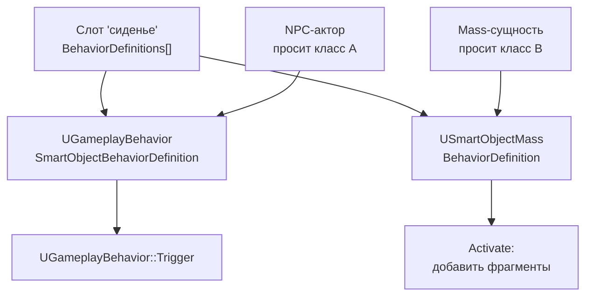
```mermaid
%%{init: {"flowchart": {"useMaxWidth": true, "htmlLabels": true}, "themeVariables": {"fontSize": "13px"}}}%%
graph TD

    Slot["Слот 'сиденье'<br/>BehaviorDefinitions[]"]

    B1["UGameplayBehavior<br/>SmartObjectBehaviorDefinition"]

    B2["USmartObjectMass<br/>BehaviorDefinition"]

    Slot --> B1

    Slot --> B2

    Q1["NPC-актор<br/>просит класс A"] --> B1

    Q2["Mass-сущность<br/>просит класс B"] --> B2

    B1 --> E1["UGameplayBehavior::Trigger"]

    B2 --> E2["Activate:<br/>добавить фрагменты"]

```

Обратите внимание: **приведение типа безопасно по построению**. Мы просили класс `X`, поиск вернул объект класса `X` (или наследника) — `Cast` не может провалиться. Это не «слабая типизация», а сознательное перенесение проверки типа из точки использования в точку поиска.

**Расширение системы.** Чтобы подключить собственный фреймворк исполнения, вы:

1. Наследуетесь от `USmartObjectBehaviorDefinition`, добавляете нужные вашему фреймворку поля.
2. Пишете код, который при взаимодействии запрашивает ваш класс через `GetBehaviorDefinition`.
3. Всё. Ядро SmartObjects трогать не нужно.

Спецификатор `NotBlueprintable` на базовом классе означает, что этот шаг делается в C++. Однако **конкретные наследники** могут снять это ограничение — и `UGameplayBehaviorSmartObjectBehaviorDefinition` фактически даёт Blueprint-путь через конфиг.

---

### 4.3. `UGameplayBehaviorSmartObjectBehaviorDefinition`

Первый наследник — мост к фреймворку GameplayBehavior.

cpp

```cpp
UCLASS(MinimalAPI)
class UGameplayBehaviorSmartObjectBehaviorDefinition : public USmartObjectBehaviorDefinition
{
    GENERATED_BODY()

public:
    UPROPERTY(EditDefaultsOnly, Category = SmartObject, Instanced)
    TObjectPtr<UGameplayBehaviorConfig> GameplayBehaviorConfig;

public:
#if WITH_EDITOR
    UE_API virtual void GetPreloadDependencies(TArray<UObject*>& OutDeps) override;
#endif
};
```

Тридцать строк — весь файл. Класс содержит **ровно одно поле** и один переопределённый метод.

#### Почему всего одно поле

Это чистый адаптер. Вся конфигурация уже описана в `UGameplayBehaviorConfig` — типе из фреймворка GameplayBehaviors, который существует независимо от SmartObjects и используется в других контекстах. Дублировать её здесь было бы ошибкой.

Класс отвечает только на вопрос: «когда этот слот используют через GameplayBehavior — какой конфиг применить?»

#### `Instanced`

cpp

```cpp
UPROPERTY(EditDefaultsOnly, Category = SmartObject, Instanced)
TObjectPtr<UGameplayBehaviorConfig> GameplayBehaviorConfig;
```

Конфиг создаётся **внутри** этого определения, а не ссылается на внешний ассет. Дизайнер в панели деталей слота выбирает класс конфига из выпадающего списка, и объект создаётся тут же, встроенным. Настройки хранятся в ассете определения.

Цепочка вложенности получается такая:

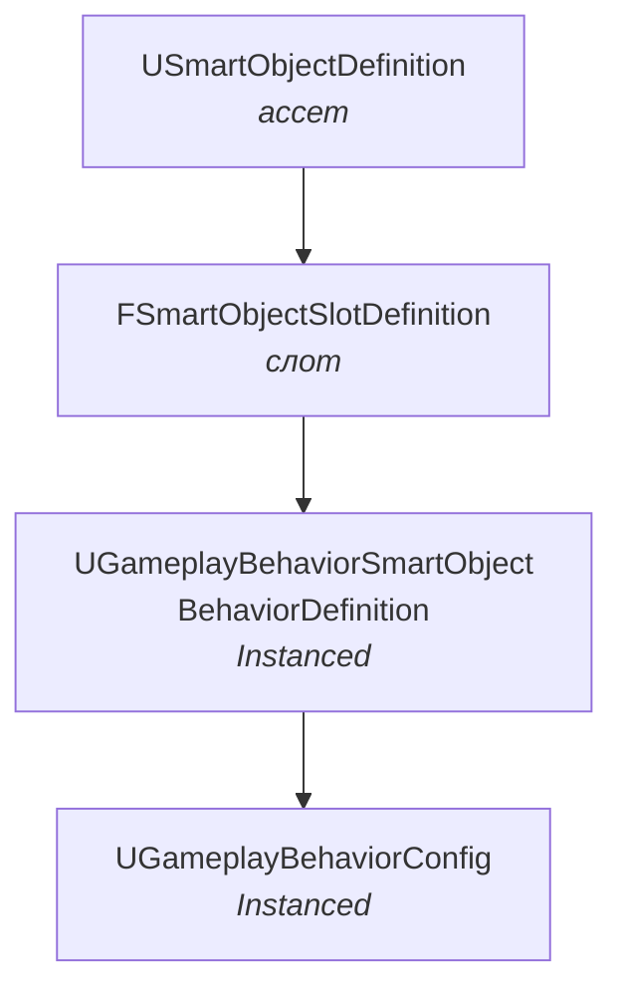
```mermaid

graph TD

    A["USmartObjectDefinition<br/><i>ассет</i>"]

    B["FSmartObjectSlotDefinition<br/><i>слот</i>"]

    C["UGameplayBehaviorSmartObject<br/>BehaviorDefinition<br/><i>Instanced</i>"]

    D["UGameplayBehaviorConfig<br/><i>Instanced</i>"]

    A --> B --> C --> D

```

Два уровня `Instanced` подряд. Это работает, но требует внимания к загрузке — отсюда следующий метод.

#### `GetPreloadDependencies`

cpp

```cpp
#if WITH_EDITOR
UE_API virtual void GetPreloadDependencies(TArray<UObject*>& OutDeps) override;
#endif
```

Сообщает системе загрузки, что должно быть загружено **до** завершения загрузки этого объекта. Здесь — конфиг и всё, на что он ссылается.

Зачем это нужно: `UGameplayBehaviorConfig` может ссылаться на класс `UGameplayBehavior`, анимационные монтажи, ability-классы. Если они не загружены к моменту первого использования, произойдёт синхронная загрузка в середине геймплея — микрофриз. Предзагрузка переносит эту стоимость на этап загрузки уровня.

Под `WITH_EDITOR`, потому что в cooked-билде граф зависимостей уже записан в пакет на этапе кука; метод нужен как раз для того, чтобы кукер этот граф построил правильно.

---

### 4.4. `UGameplayBehaviorConfig` — конфигурация

Файл этого класса не входит в загруженный вами пакет, но без понимания его роли картина неполна. Разберём концептуально.

Фреймворк GameplayBehaviors построен на разделении:

- **`UGameplayBehavior`** — _что делать_ (логика, код).
- **`UGameplayBehaviorConfig`** — _с какими настройками_ (данные, параметры).

Конфиг знает класс поведения, которое нужно запустить, и хранит параметры для этого запуска. Его основная задача — по запросу выдать экземпляр поведения (или CDO, если инстанцирование не требуется — см. раздел 4.7).

Практический смысл разделения: один класс поведения «проиграть монтаж и подождать» обслуживает сотни слотов, отличаясь только тем, какой монтаж указан в конфиге. Логика пишется один раз программистом, конфигурируется многократно дизайнером.

---

### 4.5. `UGameplayBehavior` — фреймворк исполнения

Теперь главное. Разберём `GameplayBehavior.h` целиком.

cpp

```cpp
UCLASS(MinimalAPI, Abstract, Blueprintable, BlueprintType)
class UGameplayBehavior : public UObject, public IGameplayTaskOwnerInterface
```

Ключевое здесь — **`Blueprintable`**. В отличие от `USmartObjectBehaviorDefinition`, поведения **можно и нужно** создавать в Blueprint. Это и есть путь дизайнера: наследуемся от `UGameplayBehavior` в Blueprint, реализуем событие `OnTriggered`, готово.

Второе — **`IGameplayTaskOwnerInterface`**. Поведение может владеть Gameplay Tasks — асинхронными задачами из системы GAS (проиграть монтаж, дождаться события, переместиться к точке). Это даёт мощный инструментарий из коробки.

#### Преамбула файла

cpp

```cpp
GAMEPLAYBEHAVIORSMODULE_API DECLARE_LOG_CATEGORY_EXTERN(LogGameplayBehavior, Warning, All);

DECLARE_MULTICAST_DELEGATE_ThreeParams(FOnGameplayBehaviorFinished, 
    UGameplayBehavior& /*Behavior*/, AActor& /*Avatar*/, const bool /*bInterrupted*/)
```

Отдельная категория логирования — `LogGameplayBehavior`. При отладке взаимодействий включайте её вместе с `LogSmartObject`.

Делегат завершения несёт три параметра, и третий — `bInterrupted` — критически важен. Он различает:

- **Нормальное завершение** — NPC посидел положенное время и встал.
- **Прерывание** — объект выключили, слот перехватили, NPC атаковали.

Реакция на эти два случая должна быть разной. При прерывании обычно нужно аварийно выйти из анимации, снять эффекты, возможно, не выдавать награду.

---

### 4.6. Жизненный цикл поведения

Три метода образуют полный цикл:

cpp

```cpp
UE_API virtual bool Trigger(AActor& Avatar, 
                            const UGameplayBehaviorConfig* Config = nullptr, 
                            AActor* SmartObjectOwner = nullptr);

UE_API virtual void EndBehavior(AActor& Avatar, const bool bInterrupted = false);

void AbortBehavior(AActor& Avatar) { EndBehavior(Avatar, /*bInterrupted=*/true); }
```

#### `Trigger` — запуск

Три параметра:

- **`Avatar`** — актор, **на котором** исполняется поведение. Это NPC, который садится. Передаётся по ссылке — он обязателен.
- **`Config`** — параметры. Тот самый объект из `UGameplayBehaviorSmartObjectBehaviorDefinition`.
- **`SmartObjectOwner`** — актор, **которому принадлежит** SmartObject. Скамейка. Может быть `nullptr`, потому что GameplayBehavior используется не только со SmartObjects.

Разделение `Avatar` / `SmartObjectOwner` существенно. Поведение «сесть» должно знать и кто садится, и на что — например, чтобы вычислить точную позицию или проиграть анимацию на самом объекте (крышка сундука открывается).

**Возвращаемое значение — самая важная деталь метода.** Из комментария Epic:

> Возвращает `true`, если поведение было запущено и вызывающий должен подписаться на `OnBehaviorFinished`, чтобы узнать о завершении.

То есть `bool` здесь означает не «успех/неудача», а **«асинхронно/синхронно»**:

|Значение|Смысл|Что делать вызывающему|
|---|---|---|
|`true`|Поведение запущено и **продолжается**|Подписаться на `OnBehaviorFinished`|
|`false`|Поведение **уже завершилось** внутри `Trigger` (или не запустилось)|Ничего не ждать, продолжать|

Мгновенное поведение (например, «мгновенно выдать предмет») выполнит работу прямо в `Trigger` и вернёт `false`. Длительное («сидеть 10 секунд») вернёт `true`.

Ошибка на этом месте — классический источник зависаний AI: подписались на делегат, который никогда не сработает, и NPC навечно застрял в состоянии «использую объект».

#### `EndBehavior` — завершение

cpp

```cpp
UE_API virtual void EndBehavior(AActor& Avatar, const bool bInterrupted = false);
```

Завершает поведение. Параметр `bInterrupted` по умолчанию `false` — то есть нормальное завершение.

#### `AbortBehavior` — прерывание

cpp

```cpp
void AbortBehavior(AActor& Avatar) { EndBehavior(Avatar, /*bInterrupted=*/true); }
```

Не виртуальный, не отдельная логика — просто удобная обёртка над `EndBehavior` с `bInterrupted = true`. Наличие именованного метода вместо голого вызова с `true` делает код читаемее и защищает от опечатки в булевом аргументе.

Комментарий-аргумент `/*bInterrupted=*/` прямо в вызове — хорошая практика UE, стоит перенять.

#### Диспетчеризация в Blueprint

Из комментария к `Trigger` — реализация по умолчанию выбирает событие по приоритету:

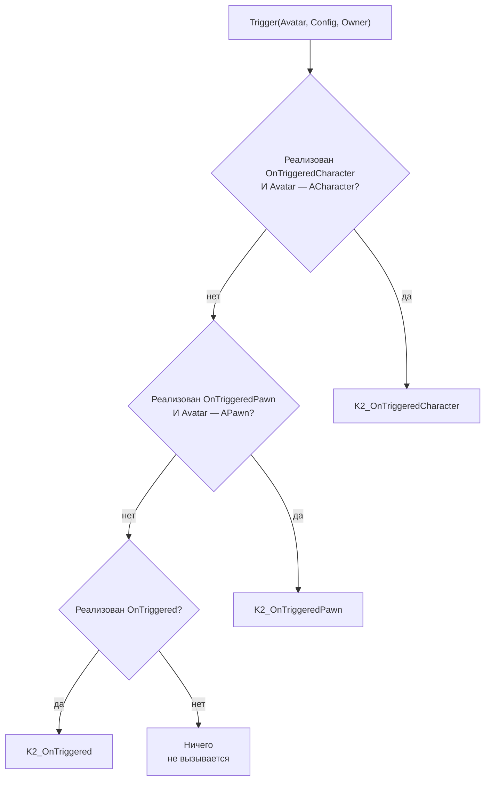
```mermaid
%%{init: {"flowchart": {"useMaxWidth": true, "htmlLabels": true}, "themeVariables": {"fontSize": "13px"}}}%%
graph TD

    T["Trigger(Avatar, Config, Owner)"]

    C1{"Реализован OnTriggeredCharacter<br/>И Avatar — ACharacter?"}

    C2{"Реализован OnTriggeredPawn<br/>И Avatar — APawn?"}

    C3{"Реализован OnTriggered?"}

    E1["K2_OnTriggeredCharacter"]

    E2["K2_OnTriggeredPawn"]

    E3["K2_OnTriggered"]

    N["Ничего<br/>не вызывается"]

    T --> C1

    C1 -->|да| E1

    C1 -->|нет| C2

    C2 -->|да| E2

    C2 -->|нет| C3

    C3 -->|да| E3

    C3 -->|нет| N

```

Приоритет от частного к общему: `ACharacter` → `APawn` → `AActor`. Это избавляет дизайнера от ручного приведения типов: если поведение имеет смысл только для персонажей, он реализует `OnTriggeredCharacter` и сразу получает типизированный `ACharacter*`.

Комментарий Epic отдельно отмечает, что подклассы могут переопределить `Trigger` целиком и управлять всем потоком сами — Blueprint-диспетчеризация лишь реализация по умолчанию.

---

### 4.7. Политика инстанцирования

Одна из самых важных для производительности частей класса.

cpp

```cpp
UENUM()
enum class EGameplayBehaviorInstantiationPolicy : uint8
{
    Instantiate,
    ConditionallyInstantiate,
    DontInstantiate,
};
```

cpp

```cpp
bool IsInstanced(const UGameplayBehaviorConfig* Config) const
{
    return (HasAnyFlags(RF_ClassDefaultObject) == false)
        || InstantiationPolicy == EGameplayBehaviorInstantiationPolicy::Instantiate
        || (InstantiationPolicy == EGameplayBehaviorInstantiationPolicy::ConditionallyInstantiate
            && NeedsInstance(Config));
}

protected:
    virtual bool NeedsInstance(const UGameplayBehaviorConfig* Config) const { return false; }
```

#### Проблема

Тысяча NPC одновременно используют объекты. Создавать тысячу `UObject`-экземпляров поведения — это тысяча аллокаций, нагрузка на GC, лишняя память. Но если поведение хранит состояние (таймер, ссылку на текущую задачу), без экземпляра не обойтись.

#### Решение

Поведение может исполняться **прямо на CDO** (Class Default Object) — одном объекте, существующем на класс. Это работает, если поведение **не хранит состояния** между вызовами.

Разбор условий `IsInstanced`:

|Условие|Смысл|
|---|---|
|`HasAnyFlags(RF_ClassDefaultObject) == false`|Мы уже не CDO — значит, экземпляр|
|`InstantiationPolicy == Instantiate`|Всегда создавать экземпляр|
|`ConditionallyInstantiate && NeedsInstance(Config)`|Решение зависит от конфига|

`NeedsInstance` — виртуальный хук, по умолчанию возвращающий `false`. Наследник переопределяет его, чтобы сказать: «с этим конфигом мне нужен экземпляр, а с тем — нет». Например, поведение с монтажом требует экземпляра (нужно хранить дескриптор проигрывания), а поведение «выдать предмет» — нет.

#### Практическое правило

**Проектируйте поведения без состояния везде, где возможно.** Если состояние необходимо — либо `Instantiate`, либо `ConditionallyInstantiate` с корректной реализацией `NeedsInstance`.

Комментарий Epic к `TransientAvatar` содержит прямое предупреждение об опасности:

> Используется как world context для `IGameplayTaskOwnerInterface`. **Осторожно при работе с CDO.**

Запись в поле объекта, исполняющегося как CDO, затронет **все** одновременные использования этого поведения. Это классический источник трудноуловимых багов.

---

### 4.8. Транзиентное состояние

cpp

```cpp
protected:
    union
    {
        struct
        {
            uint32 bTriggerGeneric : 1;
            uint32 bTriggerPawn : 1;
            uint32 bTriggerCharacter : 1;
            uint32 bFinishedGeneric : 1;
            uint32 bFinishedPawn : 1;
            uint32 bFinishedCharacter : 1;
        };

        uint32 TransientProps;
    };

    uint32 bTransientIsTriggering : 1;
    uint32 bTransientIsActive : 1;
    uint32 bTransientIsEnding : 1;
```

#### Union с битовыми полями

Шесть флагов — это кеш ответа на вопрос «какие Blueprint-события реализованы в этом классе». Вычисляются один раз в `PostInitProperties` (дорогая операция рефлексии) и потом используются при каждой диспетчеризации.

`union` с полем `TransientProps` даёт возможность сбросить все шесть флагов одним присваиванием `TransientProps = 0` вместо шести операций. Микрооптимизация, но показательная для стиля кода UE.

Соответствие флагов Blueprint-событиям очевидно из имён: три на триггер (`Generic`/`Pawn`/`Character`) и три на завершение.

#### Флаги состояния

cpp

```cpp
uint32 bTransientIsTriggering : 1;
uint32 bTransientIsActive : 1;
uint32 bTransientIsEnding : 1;
```

Защита от реентрантности. Сценарий, от которого они спасают: поведение внутри `Trigger` мгновенно завершается и вызывает `EndBehavior`, который рассылает делегат, а подписчик пытается запустить новое поведение — рекурсия.

Три отдельных флага, а не enum, потому что состояния могут накладываться: `bTransientIsTriggering` и `bTransientIsEnding` истинны одновременно, если поведение завершилось внутри `Trigger`.

Префикс `bTransient` явно маркирует: не сериализуется, живёт только в рантайме.

---

### 4.9. Поля класса

cpp

```cpp
EGameplayBehaviorInstantiationPolicy InstantiationPolicy;

/** Tag identifying behavior this class represents */
UPROPERTY(EditDefaultsOnly, Category = GameplayBehavior)
FGameplayTag ActionTag;

/** Note that it's not going to be called if the behavior finishes as part of Trigger call */
FOnGameplayBehaviorFinished OnBehaviorFinished;

/**
 * It's up to the behavior implementation to decide how to use these actors.
 * Can be used as patrol points, investigation location, etc.
 */
UPROPERTY(EditAnywhere, BlueprintReadWrite, Category = GameplayBehavior)
TArray<TObjectPtr<AActor>> RelevantActors;

/* SmartObject Actor Owner, can be null */
UPROPERTY(Transient)
TObjectPtr<AActor> TransientSmartObjectOwner = nullptr;

UPROPERTY()
TObjectPtr<AActor> TransientAvatar = nullptr;

private:
    /** List of currently active tasks, do not modify directly */
    UPROPERTY()
    TArray<TObjectPtr<UGameplayTask>> ActiveTasks;
```

#### `ActionTag`

Тег, идентифицирующий тип поведения. Позволяет другим системам понимать, что сейчас делает персонаж, не зная конкретного класса: «этот NPC выполняет `Behavior.Sit`». Полезно для реакций, прерываний по приоритету, отладочного отображения.

#### `OnBehaviorFinished`

Делегат завершения. **Критическое замечание в комментарии Epic:**

> Не будет вызван, если поведение завершается как часть вызова `Trigger`.

Это прямое следствие семантики возвращаемого значения `Trigger`. Если поведение синхронное — `Trigger` вернул `false`, и подписываться не на что; делегат не сработает. Порядок действий строго такой:

cpp

```cpp
if (Behavior->Trigger(Avatar, Config, SmartObjectOwner))
{
    // Только теперь имеет смысл подписываться
    Behavior->GetOnBehaviorFinishedDelegate().AddUObject(this, &ThisClass::OnFinished);
}
else
{
    // Поведение уже отработало — обрабатываем завершение сразу
}
```

Подписка **до** вызова `Trigger` тоже допустима, но тогда для синхронного поведения делегат не придёт, и логика должна это учитывать.

#### `RelevantActors`

cpp

```cpp
void SetRelevantActors(const TArray<AActor*>& InRelevantActors) { RelevantActors = InRelevantActors; }
```

Произвольный набор акторов, интерпретация которого целиком на совести реализации поведения. Комментарий Epic приводит примеры: точки патрулирования, место для расследования.

Связанный Blueprint-метод:

cpp

```cpp
UFUNCTION(BlueprintCallable, Category = GameplayBehavior, 
          meta = (DisplayName = "GetNextActorIndexInSequence"))
UE_API int32 K2_GetNextActorIndexInSequence(int32 CurrentIndex = 0) const;
```

Из комментария: возвращает `None`, если акторов нет или валиден только тот, что под `CurrentIndex`. Метод для последовательного обхода списка с пропуском невалидных (уничтоженных) акторов — типичный сценарий патрулирования.

#### `TransientAvatar` и `TransientSmartObjectOwner`

Кешированные участники текущего исполнения. Заполняются в `Trigger`.

Тонкая деталь: `TransientSmartObjectOwner` помечен `UPROPERTY(Transient)`, а `TransientAvatar` — просто `UPROPERTY()`, без `Transient`. Учитывая имя переменной, это выглядит как недосмотр Epic. Практического вреда нет: поведения-экземпляры не сохраняются в ассеты, а на CDO поле должно быть пустым.

cpp

```cpp
AActor* GetAvatar() const { return TransientAvatar; }
```

Геттер для аватара. Для владельца SmartObject аналогичного публичного геттера нет — поле доступно только наследникам.

#### `ActiveTasks`

Список активных Gameplay Tasks с явным комментарием **«не изменять напрямую»**. Управляется через методы интерфейса `IGameplayTaskOwnerInterface`.

---

### 4.10. Интеграция с Gameplay Tasks

cpp

```cpp
// BEGIN IGameplayTaskOwnerInterface
UE_API virtual UGameplayTasksComponent* GetGameplayTasksComponent(const UGameplayTask& Task) const override;
UE_API virtual AActor* GetGameplayTaskOwner(const UGameplayTask* Task) const override;
UE_API virtual AActor* GetGameplayTaskAvatar(const UGameplayTask* Task) const override;
virtual uint8 GetGameplayTaskDefaultPriority() const override { return FGameplayTasks::ScriptedPriority; }
UE_API virtual void OnGameplayTaskActivated(UGameplayTask& Task) override;
UE_API virtual void OnGameplayTaskDeactivated(UGameplayTask& Task) override;
// END IGameplayTaskOwnerInterface
```

Реализация интерфейса владельца задач. Что это даёт: поведение может запускать асинхронные задачи из библиотеки GAS — `PlayMontageAndWait`, `MoveTo`, `WaitGameplayEvent`, `WaitDelay` — и получать колбэки по их завершении.

Разбор:

- **`GetGameplayTasksComponent(Task)`** — возвращает компонент, который будет выполнять задачу. Обычно берётся с аватара.
- **`GetGameplayTaskOwner(Task)`** / **`GetGameplayTaskAvatar(Task)`** — владелец и аватар для задачи. В контексте поведения оба обычно указывают на `TransientAvatar`.
- **`GetGameplayTaskDefaultPriority()`** — единственный **не** виртуально-вынесенный, реализован прямо в заголовке. Возвращает `FGameplayTasks::ScriptedPriority` — приоритет «скриптовых» задач. Это средний уровень: выше фоновых, ниже критических системных. Задачи с более высоким приоритетом могут вытеснить задачи поведения при конфликте за ресурс (например, за управление движением).
- **`OnGameplayTaskActivated` / `OnGameplayTaskDeactivated`** — колбэки, поддерживающие актуальность массива `ActiveTasks`.

Практический смысл: типичное поведение «сесть на скамейку» в Blueprint выглядит как «запустить `PlayMontageAndWait`, по завершении вызвать `EndBehavior`». Вся асинхронность обеспечивается фреймворком задач.

---

### 4.11. Blueprint API

cpp

```cpp
// @NOTE on trigger functions - we'll trigger the most specific one that given behavior implements

UFUNCTION(BlueprintImplementableEvent, Category = GameplayBehavior, 
          meta = (AdvancedDisplay="TagPayload", DisplayName="OnTriggered"))
UE_API void K2_OnTriggered(AActor* Avatar, const UGameplayBehaviorConfig* Config = nullptr, 
                           AActor* SmartObjectOwner = nullptr);

UFUNCTION(BlueprintImplementableEvent, ..., DisplayName="OnTriggeredPawn")
UE_API void K2_OnTriggeredPawn(APawn* Avatar, ...);

UFUNCTION(BlueprintImplementableEvent, ..., DisplayName="OnTriggeredCharacter")
UE_API void K2_OnTriggeredCharacter(ACharacter* Avatar, ...);

UFUNCTION(BlueprintImplementableEvent, ..., DisplayName="OnFinished")
UE_API void K2_OnFinished(AActor* Avatar, bool bWasInterrupted);

UFUNCTION(BlueprintImplementableEvent, ..., DisplayName="OnFinishedPawn")
UE_API void K2_OnFinishedPawn(APawn* Avatar, bool bWasInterrupted);

UFUNCTION(BlueprintImplementableEvent, ..., DisplayName="OnFinishedCharacter")
UE_API void K2_OnFinishedCharacter(ACharacter* Avatar, bool bWasInterrupted);
```

Шесть **событий** (`BlueprintImplementableEvent` — реализуются в Blueprint, вызываются из C++). Три пары «триггер/завершение» для трёх уровней специфичности типа аватара.

События завершения получают `bWasInterrupted` — то самое различие нормального завершения и прерывания.

Далее — **вызываемые** функции (`BlueprintCallable` — реализованы в C++, вызываются из Blueprint):

cpp

```cpp
UFUNCTION(BlueprintCallable, ..., DisplayName = "EndBehavior")
UE_API void K2_EndBehavior(AActor* Avatar);

UFUNCTION(BlueprintCallable, ..., DisplayName = "AbortBehavior")
UE_API void K2_AbortBehavior(AActor* Avatar);

UFUNCTION(BlueprintCallable, ..., DisplayName = "TriggerBehavior")
UE_API void K2_TriggerBehavior(AActor* Avatar, UGameplayBehaviorConfig* Config = nullptr, 
                               AActor* SmartObjectOwner = nullptr);

UFUNCTION(BlueprintCallable, ..., DisplayName = "GetNextActorIndexInSequence")
UE_API int32 K2_GetNextActorIndexInSequence(int32 CurrentIndex = 0) const;
```

Обратите внимание на несимметричность: `K2_TriggerBehavior` возвращает `void`, тогда как нативный `Trigger` возвращает `bool`. Blueprint-версия скрывает семантику «синхронно/асинхронно» — для дизайнера, запускающего поведение из скрипта, эта деталь обычно не нужна.

`meta = (AdvancedDisplay="TagPayload")` присутствует на всех событиях, хотя параметра с таким именем в текущих сигнатурах нет — остаток от предыдущей версии API.

**Типичный Blueprint-поток:**

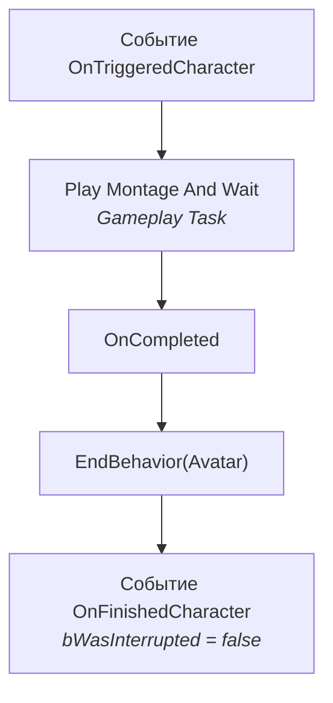
```mermaid

graph TD

    A["Событие OnTriggeredCharacter"]

    B["Play Montage And Wait<br/><i>Gameplay Task</i>"]

    C["OnCompleted"]

    D["EndBehavior(Avatar)"]

    E["Событие OnFinishedCharacter<br/><i>bWasInterrupted = false</i>"]

    A --> B --> C --> D --> E

```

### 4.12. Служебные методы `UObject`

cpp

```cpp
UE_API UGameplayBehavior(const FObjectInitializer& ObjectInitializer = FObjectInitializer::Get());

UE_API virtual void PostInitProperties() override;
UE_API virtual void BeginDestroy() override;
UE_API virtual UWorld* GetWorld() const override;

UE_API virtual TOptional<FVector> GetDynamicLocation(
    const AActor* InAvatar = nullptr, 
    const UGameplayBehaviorConfig* InConfig = nullptr, 
    const AActor* InSmartObjectOwner = nullptr) const;
```

- **`PostInitProperties`** — здесь вычисляются те самые битовые флаги «какие Blueprint-события реализованы». Рефлексия выполняется один раз на класс.
- **`BeginDestroy`** — очистка: прерывание активных задач, отписка от делегатов.
- **`GetWorld()`** — переопределён, потому что `UGameplayBehavior` — не актор и не компонент; мир достаётся через `TransientAvatar`. Без этого не работали бы таймеры, задачи и Blueprint-ноды, требующие world context.

#### `GetDynamicLocation`

cpp

```cpp
/** Can return (it's optional) a dynamic location to use this gameplay behavior */
UE_API virtual TOptional<FVector> GetDynamicLocation(...) const;
```

Интересный и неочевидный метод. Возвращает `TOptional<FVector>` — то есть «возможно, есть локация, а возможно, нет».

Смысл: обычно точка взаимодействия задана статически в слоте определения. Но иногда она должна вычисляться динамически — например, поведение «встать в очередь» должно поставить NPC за последним в очереди, а не в фиксированную точку.

`TOptional` здесь идеально выражает семантику: реализация по умолчанию возвращает пустое значение («используйте статическую точку слота»), а переопределение может вернуть вычисленную позицию.

Все три параметра опциональны и константны — метод чисто вычислительный, ничего не меняет.

---

### 4.13. Сравнение двух наследников

Забегая вперёд, сопоставим GameplayBehavior-путь с Mass-путём (детально — в главе 18):

| **Характеристика**              | **UGameplayBehaviorSmart ObjectBehaviorDefinition** | **USmartObjectMassBehavior Definition**     |
| ------------------------------- | --------------------------------------------------- | ------------------------------------------- |
| **Кому предназначено**          | Акторы (NPC, игрок)                                 | Mass-сущности                               |
| **Механизм исполнения**         | `UGameplayBehavior::TriggerActivate / Deactivate`   | Добавление / удаление Mass Fragments & Tags |
| **Что происходит**              | Запускается объект-поведение с Gameplay Tasks       | Добавляются/удаляются фрагменты сущности    |
| **Состояние**                   | В экземпляре поведения (или CDO)                    | Во фрагментах сущности (`FMassChunk`)       |
| **Стоимость на пользователя**   | `UObject` + Gameplay Tasks (высокая)                | Несколько байт фрагмента (минимальная)      |
| **Конфигурируется в Blueprint** | **Да**                                              | **Нет** (C++)                               |
| **Асинхронность**               | Через Gameplay Tasks                                | Через Mass Processors                       |

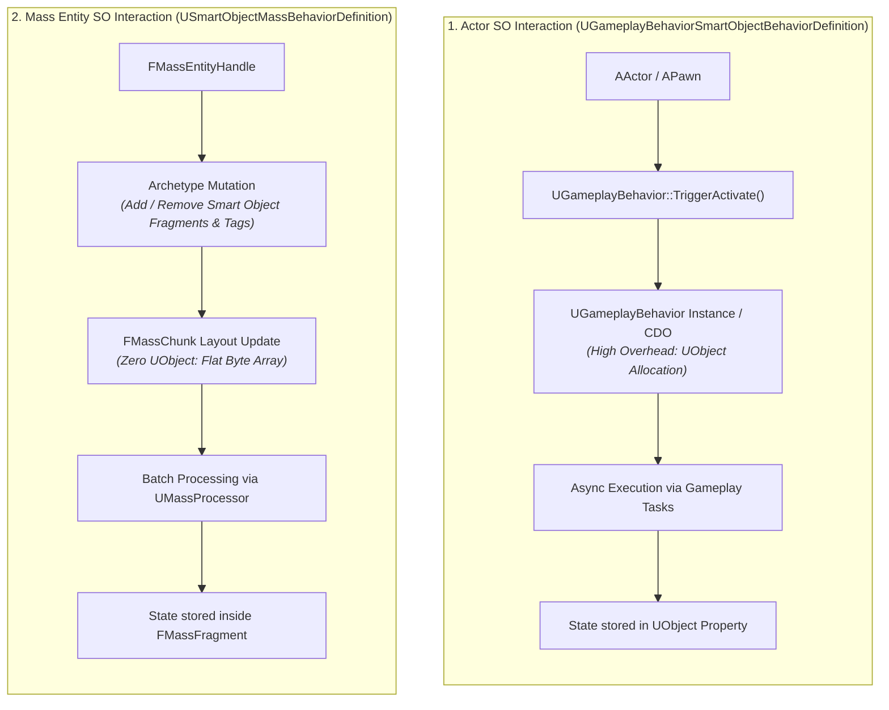
```mermaid
%%{init: {"flowchart": {"useMaxWidth": true, "htmlLabels": true}, "themeVariables": {"fontSize": "13px"}}}%%
flowchart TD
    subgraph ActorSO ["1. Actor SO Interaction (UGameplayBehaviorSmartObjectBehaviorDefinition)"]
        direction TB
        Actor["AActor / APawn"] --> Trigger["UGameplayBehavior::TriggerActivate()"]
        Trigger --> BehaviorInst["UGameplayBehavior Instance / CDO<br/><i>(High Overhead: UObject Allocation)</i>"]
        BehaviorInst --> GPTask["Async Execution via Gameplay Tasks"]
        GPTask --> ActorState["State stored in UObject Property"]
    end

    subgraph MassSO ["2. Mass Entity SO Interaction (USmartObjectMassBehaviorDefinition)"]
        direction TB
        Entity["FMassEntityHandle"] --> MassMutate["Archetype Mutation<br/><i>(Add / Remove Smart Object Fragments & Tags)</i>"]
        MassMutate --> ChunkMem["FMassChunk Layout Update<br/><i>(Zero UObject: Flat Byte Array)</i>"]
        ChunkMem --> Processor["Batch Processing via UMassProcessor"]
        Processor --> EntityState["State stored inside FMassFragment"]
    end
```

Интерфейс второго класса для сравнения:

cpp

```cpp
UE_API virtual void Activate(FMassCommandBuffer& CommandBuffer, 
                             const FMassBehaviorEntityContext& EntityContext) const;

UE_API virtual void Deactivate(FMassCommandBuffer& CommandBuffer, 
                               const FMassBehaviorEntityContext& EntityContext) const;
```

Заметьте `const` на методах — Mass-поведение **не может** хранить состояние в себе принципиально, оно только выдаёт команды. Это ещё жёстче, чем `DontInstantiate` в GameplayBehavior.

Один и тот же слот скамейки может содержать оба определения. Полноценный NPC получит анимацию и Gameplay Tasks; сущность из толпы — фрагмент с таймером и смену состояния в VAT. Дизайнер настраивает оба в одном месте.

---

### 4.14. Итоги главы

1. **Базовый класс поведения пуст намеренно.** Унифицируется хранение и поиск, а не исполнение — контракты фреймворков слишком разные.
2. **Поиск по типу безопасен по построению.** Просим класс `X` — получаем `X` или его наследника.
3. **`UGameplayBehaviorSmartObjectBehaviorDefinition` — чистый адаптер** с единственным полем-конфигом. Вся конфигурация делегирована фреймворку GameplayBehaviors.
4. **`Trigger` возвращает «асинхронно ли»**, а не «успешно ли». `false` означает, что поведение уже завершилось и `OnBehaviorFinished` не придёт.
5. **`bInterrupted` — не деталь**, а основное различие сценариев завершения. Обрабатывайте прерывание отдельно.
6. **Политика инстанцирования влияет на производительность.** Поведения без состояния исполняются на CDO. Запись в поля объекта, работающего как CDO, — источник трудноуловимых багов.
7. **Диспетчеризация Character → Pawn → Actor** избавляет дизайнера от приведения типов.
8. **Gameplay Tasks — встроенный инструментарий асинхронности.** Приоритет по умолчанию — `ScriptedPriority`.
9. **`GetDynamicLocation`** позволяет вычислять точку взаимодействия в рантайме вместо статической точки слота.
10. **Один слот — несколько поведений разных типов.** Это и есть механизм, позволяющий одному объекту обслуживать и акторов, и толпу.

---

В следующей главе — `USmartObjectComponent`: как объект попадает в симуляцию. Типы регистрации (`ESmartObjectRegistrationType`) и их влияние на время жизни, `ESmartObjectUnregistrationType`, полный жизненный цикл от `OnRegister` до `EndPlay`, привязка/отвязка runtime-данных, система событий компонента, включение/выключение по причинам, репликация, `FSmartObjectComponentInstanceData` и переживание construction scripts.

---

## Глава 5. `USmartObjectComponent` — вход в симуляцию

Определение описывает «что это за объект вообще». Компонент отвечает на вопрос «где именно в мире стоит конкретный экземпляр и как он попадает в симуляцию». Это точка сшивки между миром акторов и подсистемой SmartObjects.

---

### 5.1. Объявление класса

cpp

```cpp
UCLASS(MinimalAPI, Blueprintable, ClassGroup = Gameplay, 
       meta = (BlueprintSpawnableComponent), config = Game, 
       HideCategories = (Activation, AssetUserData, Collision, Cooking, HLOD, Lighting, 
                         LOD, Mobile, Mobility, Navigation, Physics, RayTracing, 
                         Rendering, Tags, TextureStreaming))
class USmartObjectComponent : public USceneComponent
```

Несколько содержательных деталей в спецификаторах.

**`USceneComponent`, а не `UActorComponent`.** Компонент имеет трансформ, и это принципиально: слоты определены в **локальных** координатах относительно компонента, а не актора. Значит, вы можете сдвинуть или повернуть компонент внутри актора, и все слоты поедут вместе с ним. На одном акторе может быть несколько SmartObject-компонентов в разных местах — например, стойка бара с двумя группами мест.

**`config = Game`** — класс читает настройки из ini-файлов. Используется для `bCanBePartOfCollection` (раздел 5.7).

**Огромный `HideCategories`** — скрыто четырнадцать категорий: рендеринг, физика, коллизии, LOD, освещение и прочее. Компонент невизуальный и нефизический; всё это унаследовано от `USceneComponent` и только мешало бы дизайнеру. Из наследия остаётся, по сути, только трансформ.

**`BlueprintSpawnableComponent`** — компонент можно добавлять к акторам в Blueprint-редакторе и создавать в рантайме.

---

### 5.2. Типы регистрации — ключ к пониманию времени жизни

Прежде чем разбирать методы, нужно разобраться с двумя перечислениями, объявленными перед классом. Именно они определяют самую нетривиальную часть поведения компонента.

cpp

```cpp
enum class ESmartObjectRegistrationType : uint8
{
    /** Not registered yet */
    NotRegistered,

    /**
     * Registered and bound to a SmartObject already created from a persistent collection entry
     * or from method CreateSmartObject.
     * Lifetime of the SmartObject is not bound to the component unregistration but by method
     * UnregisterCollection in the case of a collection entry or by method DestroySmartObject
     * when CreateSmartObject was used.
     */
    BindToExistingInstance,

    /**
     * Component is registered and bound to a newly created SmartObject.
     * The lifetime of the SmartObject is bound to the component unregistration
     * will be unbound/destroyed by UnregisterSmartObject/RemoveSmartObject.
     */
    Dynamic
};
```

Вспомним разделение слоёв из главы 1: компонент и runtime-данные — **разные сущности с разным временем жизни**. Это перечисление описывает, как именно они связаны в конкретном случае.

#### `NotRegistered`

Начальное состояние. Компонент существует, но подсистема о нём не знает. Объект не найдётся ни одним запросом.

#### `Dynamic` — данные принадлежат компоненту

Компонент зарегистрировался и **создал** для себя новые runtime-данные. Связь жёсткая:

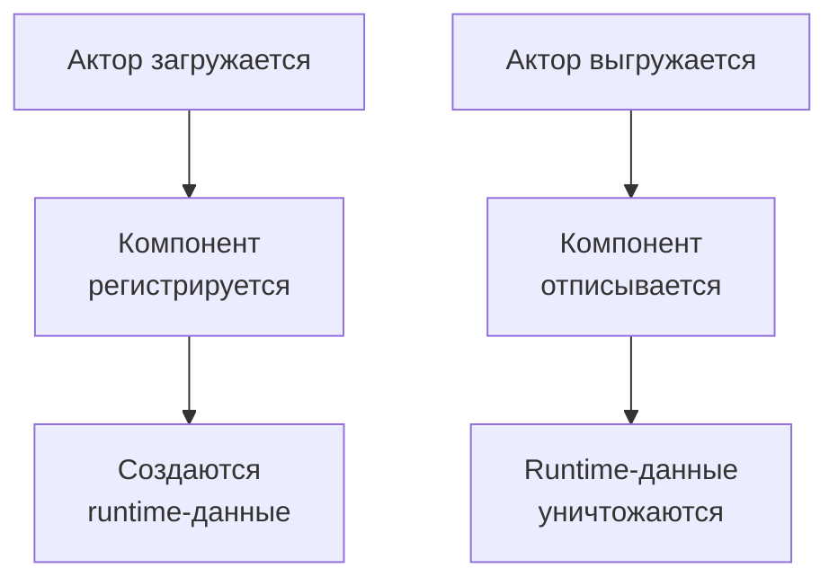
```mermaid

graph TD

    A["Актор загружается"]

    B["Компонент<br/>регистрируется"]

    C["Создаются<br/>runtime-данные"]

    D["Актор выгружается"]

    E["Компонент<br/>отписывается"]

    F["Runtime-данные<br/>уничтожаются"]

    A --> B --> C

    D --> E --> F

```

Пока актор загружен — объект существует в симуляции. Актор выгрузился — объект исчез. Это поведение по умолчанию и оно интуитивно.

#### `BindToExistingInstance` — данные живут отдельно

Runtime-данные **уже существовали** до появления компонента, и компонент лишь **привязался** к ним. Данные могли появиться двумя путями:

- из записи в персистентной коллекции (`ASmartObjectPersistentCollection`);
- через явный вызов `CreateSmartObject`.

Здесь связь односторонняя:

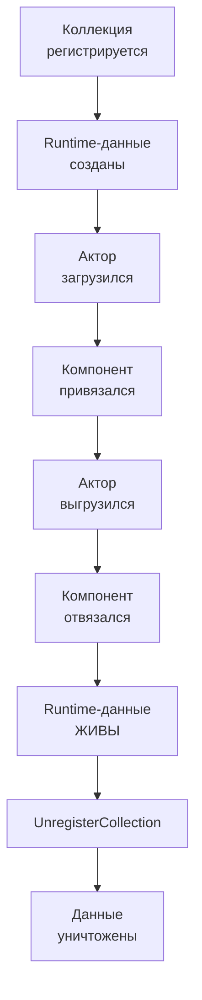
```mermaid

graph TD

    C1["Коллекция<br/>регистрируется"]

    C2["Runtime-данные<br/>созданы"]

    A1["Актор<br/>загрузился"]

    A2["Компонент<br/>привязался"]

    A3["Актор<br/>выгрузился"]

    A4["Компонент<br/>отвязался"]

    A5["Runtime-данные<br/>ЖИВЫ"]

    C3["UnregisterCollection"]

    C4["Данные<br/>уничтожены"]

    C1 --> C2 --> A1 --> A2 --> A3 --> A4 --> A5

    A5 --> C3 --> C4

```

Актор может грузиться и выгружаться сколько угодно раз — runtime-данные переживут всё это. Уничтожатся они только при разрегистрации коллекции (или явным `DestroySmartObject`).

#### Зачем это нужно

Ровно ради того сценария, который обсуждался в главе 1. NPC стоит в центре города и ищет, где поесть. Кафе на окраине выгружено — актора нет. Но объект есть в коллекции, значит:

1. Запрос находит слот кафе.
2. NPC бронирует его.
3. NPC идёт через полгорода.
4. По дороге чанк с кафе подгружается, актор появляется, его компонент **привязывается к тем же самым runtime-данным**, в которых уже записана бронь NPC.
5. NPC приходит и садится.

Без разделения времён жизни это было бы невозможно — бронь исчезла бы вместе с актором.

Именно поэтому в `ESmartObjectChangeReason` (глава 2) есть события `OnComponentBound` и `OnComponentUnbound`: они сообщают заинтересованным сторонам, что физическое представление объекта появилось или исчезло, при том что сам объект никуда не девался.

#### `ESmartObjectUnregistrationType`

cpp

```cpp
enum class ESmartObjectUnregistrationType : uint8
{
    /**
     * Component bound to an existing instance (BindToExistingInstance) will be unbound
     * from the simulation but its associated runtime data will persist.
     * Otherwise (Dynamic), runtime data will also be destroyed.
     */
    RegularProcess,
    /** Component will be unbound from the simulation and its runtime data will be destroyed
        regardless of the registration type */
    ForceRemove
};
```

Два режима отписки:

|Режим|`Dynamic`|`BindToExistingInstance`|
|---|---|---|
|`RegularProcess`|Данные уничтожаются|Данные **сохраняются**|
|`ForceRemove`|Данные уничтожаются|Данные **уничтожаются**|

`RegularProcess` — обычная отписка, уважающая тип регистрации. Используется при штатной выгрузке.

`ForceRemove` — принудительное уничтожение независимо от типа. Нужно, когда объект должен исчезнуть насовсем: скамейку взорвали, здание снесли. Без этого режима объект из коллекции остался бы «призраком» — NPC продолжали бы к нему ходить.

---

### 5.3. Делегаты компонента

cpp

```cpp
DECLARE_DYNAMIC_MULTICAST_DELEGATE_TwoParams(FSmartObjectComponentEventSignature, 
    const FSmartObjectEventData&, EventData, const AActor*, Interactor);

DECLARE_MULTICAST_DELEGATE_TwoParams(FSmartObjectComponentEventNativeSignature, 
    const FSmartObjectEventData& EventData, const AActor* Interactor);
```

Две версии одного делегата — это стандартный паттерн UE:

|**Характеристика**|**Dynamic**|**Native**|
|---|---|---|
|**Видимость в Blueprint**|**Да**|**Нет**|
|**Скорость вызова**|Медленнее (через рефлексию)|Быстрая (прямой вызов)|
|**Синтаксис объявления**|Именованные параметры через запятую|Обычные C++-параметры|

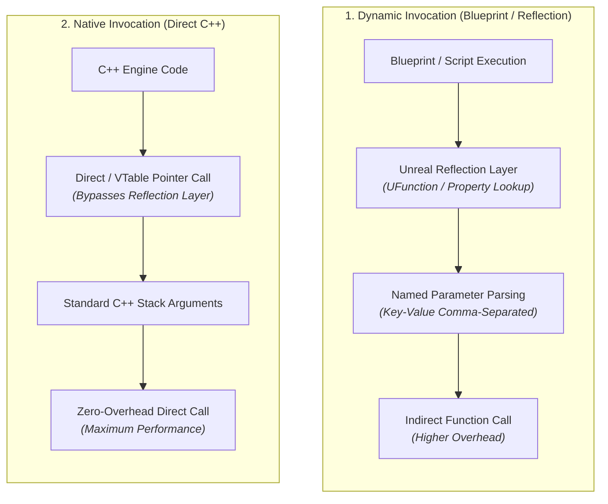
```mermaid
%%{init: {"flowchart": {"useMaxWidth": true, "htmlLabels": true}, "themeVariables": {"fontSize": "13px"}}}%%
flowchart TD
    subgraph DynamicFlow ["1. Dynamic Invocation (Blueprint / Reflection)"]
        direction TB
        BPCall["Blueprint / Script Execution"] --> Reflection["Unreal Reflection Layer<br/><i>(UFunction / Property Lookup)</i>"]
        Reflection --> NamedParams["Named Parameter Parsing<br/><i>(Key-Value Comma-Separated)</i>"]
        NamedParams --> DynamicExec["Indirect Function Call<br/><i>(Higher Overhead)</i>"]
    end

    subgraph NativeFlow ["2. Native Invocation (Direct C++)"]
        direction TB
        CPPCall["C++ Engine Code"] --> DirectCall["Direct / VTable Pointer Call<br/><i>(Bypasses Reflection Layer)</i>"]
        DirectCall --> CPPParams["Standard C++ Stack Arguments"]
        CPPParams --> NativeExec["Zero-Overhead Direct Call<br/><i>(Maximum Performance)</i>"]
    end
```

Соответствующие поля и геттер:

cpp

```cpp
UPROPERTY(BlueprintAssignable, Category = SmartObject, meta=(DisplayName = "OnSmartObjectEvent"))
FSmartObjectComponentEventSignature OnSmartObjectEvent;

/** Native version of OnSmartObjectEvent. */
FSmartObjectComponentEventNativeSignature OnSmartObjectEventNative;

FSmartObjectComponentEventNativeSignature& GetOnSmartObjectEventNative()
{
    return OnSmartObjectEventNative;
}
```

Правило простое: **из C++ подписывайтесь на нативную версию**, динамическая нужна только Blueprint.

Обратите внимание на второй параметр — `const AActor* Interactor`. Это удобство: событие из `FSmartObjectEventData` содержит только хендлы, а компонент дополнительно резолвит актора-инициатора, если он известен. Blueprint-логике почти всегда нужен именно актор.

Ещё одно Blueprint-событие:

cpp

```cpp
UFUNCTION(BlueprintImplementableEvent, Category = SmartObject, 
          meta=(DisplayName = "OnSmartObjectEventReceived"))
UE_API void ReceiveOnEvent(const FSmartObjectEventData& EventData, const AActor* Interactor);
```

Разница с `OnSmartObjectEvent`: делегат предназначен для **внешних** подписчиков (другой актор хочет знать о событиях этой скамейки), а `ReceiveOnEvent` — для **наследника** компонента в Blueprint (я — скамейка, и хочу отреагировать на то, что на меня сели).

И обработчик, куда всё приходит:

cpp

```cpp
UE_API void OnRuntimeEventReceived(const FSmartObjectEventData& Event);
```

Полная цепочка:

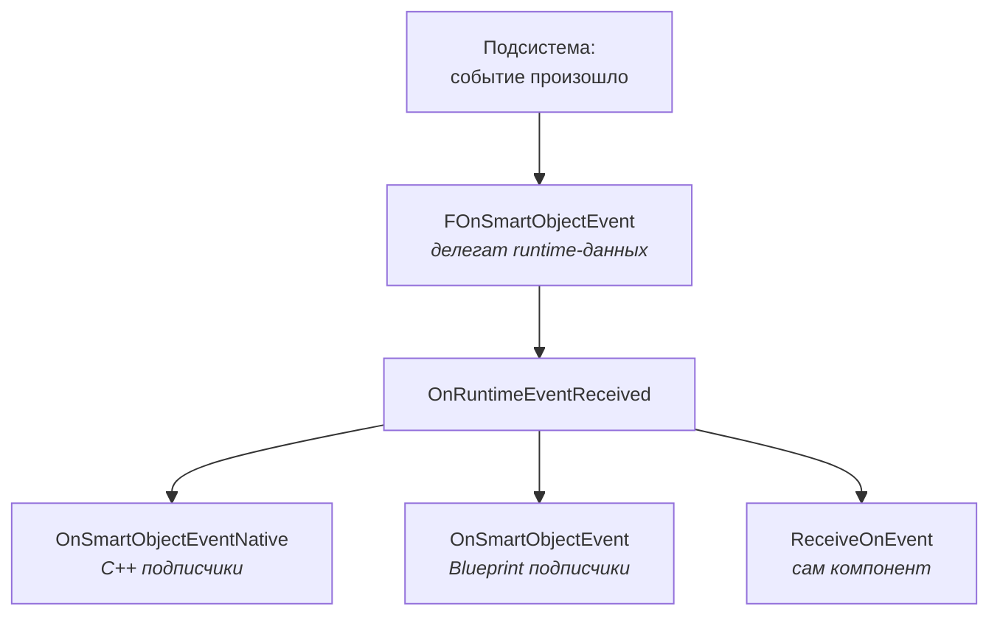
```mermaid
%%{init: {"flowchart": {"useMaxWidth": true, "htmlLabels": true}, "themeVariables": {"fontSize": "13px"}}}%%
graph TD

    S["Подсистема:<br/>событие произошло"]

    D["FOnSmartObjectEvent<br/><i>делегат runtime-данных</i>"]

    H["OnRuntimeEventReceived"]

    N["OnSmartObjectEventNative<br/><i>C++ подписчики</i>"]

    B["OnSmartObjectEvent<br/><i>Blueprint подписчики</i>"]

    R["ReceiveOnEvent<br/><i>сам компонент</i>"]

    S --> D --> H

    H --> N

    H --> B

    H --> R

```

Связь с runtime-данными держится через:

cpp

```cpp
FDelegateHandle EventDelegateHandle;
```

И на нём же построена проверка привязки:

cpp

```cpp
UFUNCTION(BlueprintCallable, Category = "SmartObject")
bool IsBoundToSimulation() const
{
    return EventDelegateHandle.IsValid();
}
```

Комментарий Epic здесь важен:

> Возвращает true, если компонент зарегистрирован в подсистеме. В зависимости от порядка обновления иногда возможно, что подсистема включается **после** компонента.

То есть регистрация не гарантирована сразу после `BeginPlay`. Если ваш код в `BeginPlay` актора обращается к SmartObject-функциональности, проверяйте `IsBoundToSimulation()`, а не полагайтесь на порядок инициализации.

---

### 5.4. Работа с определением

cpp

```cpp
/** @return Smart Object Definition with parameters applied. */
UFUNCTION(BlueprintGetter)
UE_API const USmartObjectDefinition* GetDefinition() const;

/** @return Smart Object Definition without applied parameters. */
UE_API const USmartObjectDefinition* GetBaseDefinition() const;

/** Sets the Smart Object Definition. */
UFUNCTION(BlueprintSetter)
UE_API void SetDefinition(USmartObjectDefinition* DefinitionAsset);
```

Три метода, реализующие механизм вариаций из главы 3.

- **`GetBaseDefinition()`** — исходный ассет, как он лежит в Content Browser.
- **`GetDefinition()`** — **вариация** с применёнными параметрами этого экземпляра. Именно её нужно использовать в игровой логике.
- **`SetDefinition(Asset)`** — установка определения.

Хранилища:

cpp

```cpp
/** Reference to Smart Object Definition Asset with parameters. */
UPROPERTY(EditAnywhere, Category = SmartObject, Replicated, meta = (DisplayName="Definition"))
FSmartObjectDefinitionReference DefinitionRef;

//~ Do not use directly from native code, use GetDefinition() / SetDefinition() instead.
UPROPERTY(Transient, Category = SmartObject, BlueprintSetter = SetDefinition, 
          BlueprintGetter = GetDefinition, meta = (DisplayName="Definition Asset"))
mutable TObjectPtr<USmartObjectDefinition> CachedDefinitionAssetVariation = nullptr;
```

**`DefinitionRef`** типа `FSmartObjectDefinitionReference` — это не просто указатель на ассет, а **ссылка плюс параметры**. Именно здесь дизайнер задаёт значения тех параметров, которые определение объявило в своём `FInstancedPropertyBag`. Реплицируется, потому что клиент должен знать, каким объектом он пользуется.

**`CachedDefinitionAssetVariation`** — кеш вариации:

- `Transient` — не сохраняется, вычисляется заново;
- `mutable` — чтобы `GetDefinition() const` мог лениво заполнить кеш при первом обращении;
- прямой комментарий Epic: **не использовать напрямую из нативного кода**.

Доступ к ссылке:

cpp

```cpp
const FSmartObjectDefinitionReference& GetDefinitionReference() const
{
    return DefinitionRef;
}

#if WITH_EDITOR
FSmartObjectDefinitionReference& GetMutableDefinitionReference()
{
    return DefinitionRef;
}
#endif
```

Изменяемый доступ — только в редакторе. В рантайме менять определение через ссылку нельзя, только через `SetDefinition`, которая корректно сбросит кеш.

#### Границы

cpp

```cpp
UE_API FBox GetSmartObjectBounds() const;
```

Мировой AABB объекта. Вычисляется из `USmartObjectDefinition::GetBounds()` (локальные границы всех слотов) и трансформа компонента. Используется при добавлении объекта в пространственную структуру.

---

### 5.5. Хендл и связь с runtime-данными

cpp

```cpp
FSmartObjectHandle GetRegisteredHandle() const
{
    return RegisteredHandle;
}

UE_API void SetRegisteredHandle(const FSmartObjectHandle Value, 
                                const ESmartObjectRegistrationType InRegistrationType);
UE_API void InvalidateRegisteredHandle();

ESmartObjectRegistrationType GetRegistrationType() const
{
    return RegistrationType;
}
```

Поля:

cpp

```cpp
/** RegisteredHandle != FSmartObjectHandle::Invalid when registered into a collection by SmartObjectSubsystem */
UPROPERTY(Transient, VisibleAnywhere, Category = SmartObject, BlueprintReadOnly, Replicated)
FSmartObjectHandle RegisteredHandle;

ESmartObjectRegistrationType RegistrationType = ESmartObjectRegistrationType::NotRegistered;
```

**`RegisteredHandle`** — хендл, под которым объект известен подсистеме. Его свойства:

- `Transient` — не сериализуется; вычисляется при регистрации;
- `Replicated` — клиент получает тот же хендл, что и на сервере. Это работает благодаря детерминированности `FSmartObjectHandleFactory::CreateHandleGuidFromComponent` из главы 2;
- `BlueprintReadOnly` — читать можно, писать нельзя.

**`SetRegisteredHandle(Value, Type)`** принимает **оба** параметра одновременно — хендл и тип регистрации. Это не случайно: они образуют неразрывную пару, разделять установку было бы источником рассогласования.

**`InvalidateRegisteredHandle()`** — сброс при отписке.

#### Привязка и отвязка

cpp

```cpp
UE_API void OnRuntimeInstanceBound(FSmartObjectRuntime& RuntimeInstance);
UE_API void OnRuntimeInstanceUnbound(FSmartObjectRuntime& RuntimeInstance);
```

Колбэки момента связывания компонента с runtime-данными. Здесь происходит:

- подписка на делегат событий (`EventDelegateHandle` заполняется) и отписка;
- обновление трансформа в runtime-данных, если компонент переместился;
- рассылка `OnComponentBound` / `OnComponentUnbound`.

Именно эта пара делает возможным сценарий стриминга из раздела 5.2: данные ждут, компонент приходит и уходит.

#### Регистрация в подсистеме

cpp

```cpp
protected:
    UE_API void RegisterToSubsystem();
    UE_API void UnregisterFromSubsystem(const ESmartObjectUnregistrationType UnregistrationType);
```

`protected`, потому что вызываются из методов жизненного цикла компонента, а не извне. Наследник может их вызвать, если реализует нестандартную логику регистрации.

---

### 5.6. Включение и выключение

Блок из шести методов, четыре из которых существуют в двух версиях из-за deprecation.

#### Deprecated-версии

cpp

```cpp
UE_DEPRECATED(5.8, "Use other version that is not blueprint pure.")
UFUNCTION(BlueprintCallable, Category = "SmartObject", 
          meta=(DisplayName="Set SmartObject Enabled (default reason: Gameplay)", 
                ReturnDisplayName="Status changed", DeprecatedFunction="Note", 
                DeprecationMessage="Use version that is not blueprint pure"))
UE_API bool SetSmartObjectEnabled(const bool bEnable) const;

UE_DEPRECATED(5.8, "Use other version that is not blueprint pure.")
UFUNCTION(BlueprintCallable, ...)
UE_API bool SetSmartObjectEnabledForReason(FGameplayTag ReasonTag, const bool bEnabled) const;
```

Причина устаревания поучительна. Эти функции были **blueprint pure** — то есть отображались в Blueprint как ноды без пинов исполнения. Проблема: pure-ноды в Blueprint **вычисляются заново при каждом обращении к выходу**, и порядок вызова неочевиден. Для функции с побочным эффектом (изменение состояния объекта!) это катастрофа: она могла вызваться несколько раз или не вызваться вовсе.

Устаревание в UE 5.8 — исправление этой ошибки дизайна API.

#### Актуальные версии

cpp

```cpp
UFUNCTION(BlueprintCallable, Category = "SmartObject", BlueprintPure=false, 
          meta=(DisplayName="Set SmartObject Enabled (default reason: Gameplay)", 
                ReturnDisplayName="Status changed"))
UE_API virtual bool K2_SetSmartObjectEnabled(const bool bEnable) const;

UFUNCTION(BlueprintCallable, Category = "SmartObject", BlueprintPure=false, 
          meta=(DisplayName="Set SmartObject Enabled (specific reason)", 
                ReturnDisplayName="Status changed"))
UE_API bool K2_SetSmartObjectEnabledForReason(FGameplayTag ReasonTag, const bool bEnabled) const;
```

Явное `BlueprintPure=false` — ноды теперь имеют пины исполнения и вызываются ровно один раз в заданной точке.

Обратите внимание: `K2_SetSmartObjectEnabled` объявлен **virtual**, второй — нет. Наследник может переопределить общее включение (например, добавить визуальный эффект), но не версию с причиной.

Возвращаемое значение (`ReturnDisplayName="Status changed"`) — **изменилось ли состояние**. Из комментария: `false`, если сменить состояние не удалось — объект не зарегистрирован или подсистемы нет.

#### Запросы состояния

cpp

```cpp
UFUNCTION(BlueprintCallable, Category = "SmartObject", 
          meta=(DisplayName="Is SmartObject Enabled (for any reason)", ReturnDisplayName="Enabled"))
UE_API bool IsSmartObjectEnabled() const;

UFUNCTION(BlueprintCallable, Category = "SmartObject", 
          meta=(DisplayName="Is SmartObject Enabled (for specific reason)", ReturnDisplayName="Enabled"))
UE_API bool IsSmartObjectEnabledForReason(FGameplayTag ReasonTag) const;
```

- **`IsSmartObjectEnabled()`** — включён ли объект **вообще**, независимо от причин. Возвращает `true`, только если ни одна причина не держит его выключенным.
- **`IsSmartObjectEnabledForReason(Tag)`** — не заблокирован ли по конкретной причине.

#### Система причин на практике

Механика, о которой шла речь в главе 2. Иллюстрация:

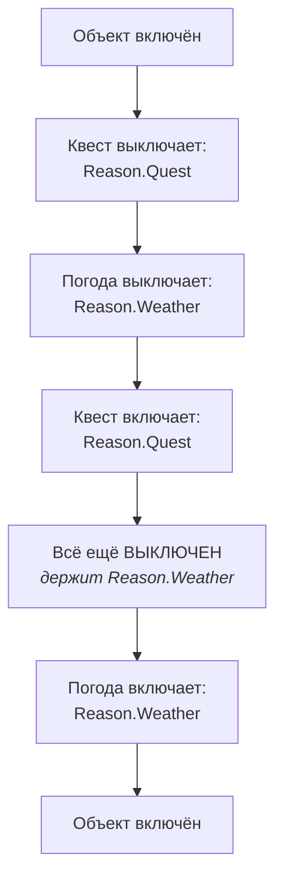
```mermaid

graph TD

    A["Объект включён"]

    B["Квест выключает:<br/>Reason.Quest"]

    C["Погода выключает:<br/>Reason.Weather"]

    D["Квест включает:<br/>Reason.Quest"]

    E["Всё ещё ВЫКЛЮЧЕН<br/><i>держит Reason.Weather</i>"]

    F["Погода включает:<br/>Reason.Weather"]

    G["Объект включён"]

    A --> B --> C --> D --> E --> F --> G

```

Каждый метод с параметром `ReasonTag` **ensure'ит на невалидном теге** (`None`) — это прямо сказано в комментариях. Передавать пустой тег нельзя; для «причины по умолчанию» есть отдельные перегрузки без параметра, использующие `UE::SmartObject::EnabledReason::Gameplay`.

Все четыре сеттера — **`const`**-методы, хотя меняют состояние. Это логично: состояние живёт не в компоненте, а в runtime-данных подсистемы. Компонент здесь лишь посредник, сам он не меняется.

---

### 5.7. Коллекции

cpp

```cpp
bool GetCanBePartOfCollection() const
{
    return bCanBePartOfCollection;
}

/** 
 * Controls whether a given SmartObject can be aggregated in SmartObjectPersistentCollections.
 * SOs in collections can be queried and reasoned about even while the actual Actor and its
 * components are not streamed in.
 * By default SmartObjects are not placed in collections and are active only as long as
 * the owner-actor remains loaded and active (i.e. not streamed out).
 */
UPROPERTY(config, EditAnywhere, Category = SmartObject, AdvancedDisplay)
bool bCanBePartOfCollection = false;
```

Тот самый флаг, определяющий, попадёт ли объект в персистентную коллекцию — и тем самым, будет ли он `BindToExistingInstance` или `Dynamic`.

**По умолчанию `false`.** Это осознанный выбор Epic, и стоит понять причину: коллекции стоят памяти. Данные каждого объекта в коллекции резидентны всегда, независимо от стриминга. Для тысяч мелких интерактивных объектов это ощутимо.

Правило: включайте флаг только там, где нужна «дальнобойность» — объекты, к которым AI ходит издалека (кафе, точки работы, места отдыха). Для объектов, с которыми взаимодействуют только вблизи (дверная ручка, выключатель), оставляйте `false`.

Спецификатор **`config`** позволяет задать значение по умолчанию для всего проекта в ini-файле — удобно, если ваш проект в основном использует один режим.

`AdvancedDisplay` — свойство спрятано под «Advanced», трогать его нужно нечасто.

---

### 5.8. GUID компонента

cpp

```cpp
/** Returns this component Guid */
[[nodiscard]] FGuid GetComponentGuid() const
{
    return ComponentGuid;
}

/** Unique ID used, along with the owner's ActorGuid to generate a SmartObjectHandle */
UPROPERTY(VisibleAnywhere, Category = SmartObject)
FGuid ComponentGuid;

private:
    /** Conditionally updates the GUID if it was never set */
    void ValidateGUID();

    /** Assigns a new GUID to the component */
    UE_API void UpdateGUID();

#if WITH_EDITORONLY_DATA
    /** Conditionally updates the GUID if it was never set. Used for collection deprecation only. */
    void ValidateGUIDForDeprecation()
    {
        ValidateGUID();
    }
#endif
```

Замыкает механику из главы 2: хендл объекта = функция(ActorGuid, ComponentGuid).

- **`ValidateGUID()`** — присваивает GUID, **только если он ещё не задан**. Идемпотентна, безопасна для многократного вызова.
- **`UpdateGUID()`** — присваивает **новый** GUID безусловно. Вызывается при дублировании актора: копия должна получить свой идентификатор, иначе два объекта столкнутся хендлами.
- **`ValidateGUIDForDeprecation()`** — публичная обёртка над `ValidateGUID` для миграции старых коллекций. Комментарий явно ограничивает область применения.

Атрибут `[[nodiscard]]` на геттере — предупреждение компилятора, если результат вызова проигнорирован.

`VisibleAnywhere` (не `EditAnywhere`) — дизайнер видит GUID, но не может его изменить.

---

### 5.9. Полный жизненный цикл

Теперь соберём переопределённые методы `UObject` / `UActorComponent` в единую картину.

cpp

```cpp
UE_API virtual void OnRegister() override;
UE_API virtual void BeginPlay() override;
UE_API virtual void EndPlay(const EEndPlayReason::Type EndPlayReason) override;
UE_API virtual void Serialize(FArchive& Ar) override;
UE_API virtual void PostDuplicate(EDuplicateMode::Type DuplicateMode) override;
UE_API virtual void GetLifetimeReplicatedProps(TArray<FLifetimeProperty>& OutLifetimeProps) const override;
UE_API virtual TStructOnScope<FActorComponentInstanceData> GetComponentInstanceData() const override;

#if WITH_EDITOR
UE_API virtual void OnUnregister() override;
UE_API virtual void PostEditImport() override;
UE_API virtual void PostEditUndo() override;
UE_API virtual void PostEditChangeProperty(FPropertyChangedEvent& PropertyChangedEvent) override;
UE_API virtual void PreSave(FObjectPreSaveContext SaveContext) override;
UE_API virtual void GetActorDescProperties(FPropertyPairsMap& PropertyPairsMap) const override;
#endif
```

#### Рантайм-цикл

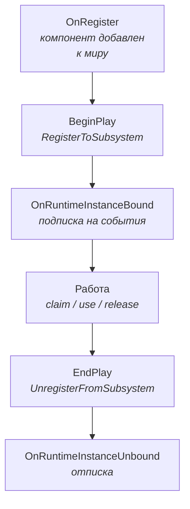
```mermaid

graph TD

    A["OnRegister<br/><i>компонент добавлен<br/>к миру</i>"]

    B["BeginPlay<br/><i>RegisterToSubsystem</i>"]

    C["OnRuntimeInstanceBound<br/><i>подписка на события</i>"]

    D["Работа<br/><i>claim / use / release</i>"]

    E["EndPlay<br/><i>UnregisterFromSubsystem</i>"]

    F["OnRuntimeInstanceUnbound<br/><i>отписка</i>"]

    A --> B --> C --> D --> E --> F

```

- **`OnRegister`** — компонент зарегистрирован в мире. Здесь происходит подготовка: валидация GUID, разрешение определения. Полноценная регистрация в подсистеме здесь **не** делается — подсистема может быть ещё не готова.
- **`BeginPlay`** — вот здесь `RegisterToSubsystem()`. Именно после этого объект становится доступен запросам.
- **`EndPlay`** — `UnregisterFromSubsystem()`. Параметр `EndPlayReason` важен: он различает выгрузку стриминга (`RemovedFromWorld`) и настоящее уничтожение (`Destroyed`), а от этого зависит выбор между `RegularProcess` и `ForceRemove`.

Асимметрия `OnRegister` / `OnUnregister`: первый переопределён всегда, второй — **только под `WITH_EDITOR`**. В рантайме отписка идёт через `EndPlay`, потому что `OnUnregister` может вызываться в ситуациях, где отписка нежелательна.

#### Редакторные методы

- **`PostEditImport`** — компонент импортирован (вставлен из буфера обмена). Нужен новый GUID.
- **`PostEditUndo`** — откат операции. Состояние могло измениться произвольно, требуется пересинхронизация.
- **`PostEditChangeProperty`** — свойство изменено. Смена определения требует сброса кеша вариации и уведомления коллекции.
- **`PreSave`** — перед сохранением. Финальная валидация GUID.
- **`PostDuplicate`** — **не** редакторный. Дублирование происходит и в рантайме; здесь вызывается `UpdateGUID()`.
- **`Serialize`** — миграция устаревших полей.

#### `GetActorDescProperties`

cpp

```cpp
#if WITH_EDITOR
UE_API virtual void GetActorDescProperties(FPropertyPairsMap& PropertyPairsMap) const override;
#endif
```

Здесь на актора вешается тег `UE::SmartObject::WithSmartObjectTag` (глава 2). Это метаданные в **дескрипторе актора** World Partition — данные, доступные **без загрузки самого актора**.

Практический эффект: система может при построении коллекции найти все акторы со SmartObject-компонентами, не загружая гигабайты уровня. Просто пройти по дескрипторам.

---

### 5.10. Репликация

cpp

```cpp
UE_API virtual void GetLifetimeReplicatedProps(TArray<FLifetimeProperty>& OutLifetimeProps) const override;
```

Реплицируются два свойства:

cpp

```cpp
UPROPERTY(EditAnywhere, Category = SmartObject, Replicated, meta = (DisplayName="Definition"))
FSmartObjectDefinitionReference DefinitionRef;

UPROPERTY(Transient, VisibleAnywhere, Category = SmartObject, BlueprintReadOnly, Replicated)
FSmartObjectHandle RegisteredHandle;
```

Модель сети здесь такая: **симуляция авторитетна на сервере**. Клиент не выполняет claim/release, не проверяет условия, не рассылает события. Ему нужно ровно две вещи:

- **`DefinitionRef`** — понимать, что это за объект (для визуализации, для UI-промптов);
- **`RegisteredHandle`** — уметь сопоставить локальный компонент с серверным объектом, чтобы корректно интерпретировать реплицированную информацию о взаимодействиях.

Обратите внимание, что состояние занятости слотов **не реплицируется на этом уровне**. Оно передаётся через игровые механизмы более высокого уровня (репликация анимации, состояния персонажа), а не через SmartObjects.

Именно на репликацию рассчитана настройка из `SmartObjectSettings`:

cpp

```cpp
bool bShouldExcludePreConditionsOnDedicatedClient = false;
```

Клиенту не нужна логика предусловий — только структура объекта.

---

### 5.11. `FSmartObjectComponentInstanceData`

Последняя структура файла, решающая специфическую редакторную проблему.

cpp

```cpp
/** Used to store SmartObjectComponent data during RerunConstructionScripts */
USTRUCT()
struct FSmartObjectComponentInstanceData : public FActorComponentInstanceData
{
public:
    FSmartObjectComponentInstanceData() = default;

    explicit FSmartObjectComponentInstanceData(const TNotNull<const USmartObjectComponent*> SourceComponent)
        : FActorComponentInstanceData(SourceComponent)
        , SmartObjectDefinitionRef(SourceComponent->DefinitionRef)
        , OriginalGuid(SourceComponent->ComponentGuid)
    {
    }

    const FSmartObjectDefinitionReference& GetSmartObjectDefinitionReference() const
    {
        return SmartObjectDefinitionRef;
    }

protected:
    virtual bool ContainsData() const override;
    virtual void ApplyToComponent(UActorComponent* Component, const ECacheApplyPhase CacheApplyPhase) override;

    UPROPERTY()
    FSmartObjectDefinitionReference SmartObjectDefinitionRef;

    UPROPERTY()
    FGuid OriginalGuid;
};
```

#### Проблема

`RerunConstructionScripts` — механизм редактора: при любом изменении свойства актора его construction script запускается заново, и **все компоненты, созданные скриптом, пересоздаются с нуля**. Всё, что было настроено в рантайме или изменено программно, теряется.

Для SmartObject-компонента потеря `ComponentGuid` фатальна: новый GUID → новый хендл → объект считается другим → все ссылки на него в коллекции ломаются.

#### Решение

Механизм `FActorComponentInstanceData`: перед пересозданием движок просит компонент сохранить важные данные, после пересоздания — применяет их к новому экземпляру.

```mermaid

graph TD

    A["Дизайнер меняет<br/>свойство актора"]

    B["GetComponentInstanceData()<br/><i>сохранить</i>"]

    C["Компоненты<br/>уничтожаются"]

    D["Construction script<br/>создаёт новые"]

    E["ApplyToComponent()<br/><i>восстановить</i>"]

    A --> B --> C --> D --> E

```

Сохраняются два поля:

- **`OriginalGuid`** — критично, объясняется выше;
- **`SmartObjectDefinitionRef`** — ссылка на определение с параметрами.

Разбор членов:

- **Конструктор от `TNotNull<const USmartObjectComponent*>`** — копирует оба поля из исходного компонента. Работает благодаря `friend FSmartObjectComponentInstanceData` в компоненте (поля-то защищённые).
- **`ContainsData()`** — есть ли что восстанавливать. Если нет, движок пропустит применение.
- **`ApplyToComponent(Component, Phase)`** — восстановление. Параметр `CacheApplyPhase` указывает фазу применения (движок вызывает метод несколько раз в разных фазах).

Со стороны компонента:

cpp

```cpp
protected:
    friend FSmartObjectComponentInstanceData;
    UE_API virtual TStructOnScope<FActorComponentInstanceData> GetComponentInstanceData() const override;
```

Возвращаемый тип `TStructOnScope<...>` — полиморфное владение структурой с автоматическим временем жизни.

**Практическое следствие:** если вы наследуетесь от `USmartObjectComponent` и добавляете свои поля, которые должны переживать construction scripts, — наследуйте и эту структуру, добавляя в неё свои данные. Иначе ваши поля будут сбрасываться при каждом изменении актора в редакторе.

---

### 5.12. Итоги главы

1. **`USceneComponent`, а не `UActorComponent`** — у компонента есть трансформ, слоты локальны относительно него, на акторе может быть несколько компонентов.
2. **Тип регистрации определяет время жизни runtime-данных.** `Dynamic` — данные умирают с компонентом; `BindToExistingInstance` — переживают его.
3. **`bCanBePartOfCollection` по умолчанию `false`.** Включайте только для объектов, к которым AI ходит издалека — коллекции стоят памяти.
4. **`ForceRemove` нужен для настоящего уничтожения** объекта из коллекции; `RegularProcess` уважает тип регистрации.
5. **Из C++ подписывайтесь на нативный делегат**, динамический — для Blueprint.
6. **`IsBoundToSimulation()` вместо предположений о порядке инициализации.** Подсистема может подняться позже компонента.
7. **Устаревшие blueprint pure сеттеры не используйте** — они могли вызываться непредсказуемое число раз. Актуальные версии с префиксом `K2_`.
8. **Выключение по причинам накапливается.** Объект включится, только когда сняты все причины. Каждая система должна использовать свой тег.
9. **`GetDefinition()` — вариация с параметрами, `GetBaseDefinition()` — исходный ассет.** В игровой логике нужна первая.
10. **GUID компонента священен.** Он порождает хендл; при дублировании обновляется, при пересборке в редакторе — сохраняется через `FSmartObjectComponentInstanceData`.
11. **Реплицируются только `DefinitionRef` и `RegisteredHandle`.** Симуляция авторитетна на сервере.

---

В следующей главе — runtime-слой: `SmartObjectRuntime.h`. Разберём `FSmartObjectClaimHandle` («билет» пользователя), `FSmartObjectRuntimeSlot` со всеми полями состояния, `FSmartObjectRuntime` — центральную структуру состояния объекта, перечисления состояний слота, а также механику claim → occupied → released во всех деталях.

---

## Глава 6. Runtime-слой: состояние объекта в симуляции

Мы разобрали, «что это за объект» (определение) и «где он стоит» (компонент). Теперь — самое интересное: **что с объектом происходит прямо сейчас**. Кто занял слот, включён ли объект, какие теги на нём висят. Файл `SmartObjectRuntime.h`, первая его половина.

---

### 6.1. Где живут эти данные

Важно с самого начала: структуры этой главы **не хранятся ни в акторе, ни в компоненте**. Они живут внутри `USmartObjectSubsystem`, в её внутренних контейнерах. Компонент лишь ссылается на них через `RegisteredHandle`.

```mermaid
%%{init: {"flowchart": {"useMaxWidth": true, "htmlLabels": true}, "themeVariables": {"fontSize": "13px"}}}%%
graph TD

    S["USmartObjectSubsystem"]

    R1["FSmartObjectRuntime<br/><i>объект A</i>"]

    R2["FSmartObjectRuntime<br/><i>объект B</i>"]

    SL1["FSmartObjectRuntimeSlot [0]"]

    SL2["FSmartObjectRuntimeSlot [1]"]

    SL3["FSmartObjectRuntimeSlot [2]"]

    S --> R1

    S --> R2

    R1 --> SL1

    R1 --> SL2

    R1 --> SL3

```

Отсюда — почти всё, что вы увидите дальше: приватные/защищённые поля, `friend class USmartObjectSubsystem`, отсутствие публичных мутаторов. Прямое изменение runtime-состояния мимо подсистемы нарушило бы инварианты (например, объект остался бы в старом узле octree после перемещения).

Ещё одно следствие: почти всё помечено `Transient`. Runtime-состояние **не сериализуется** — оно строится заново при каждом запуске из определения и коллекций.

---

### 6.2. Вспомогательная функция масок

cpp

```cpp
namespace UE::SmartObject
{
uint16 GetMaskForEnabledReasonTag(const FGameplayTag Tag);
}
```

Преобразует тег причины в битовую маску. Это ключ к пониманию того, как реализована система «выключено по нескольким причинам» из глав 2 и 5.

Реализация системы такова: каждому зарегистрированному тегу причины соответствует **один бит** в 16-битном поле. Функция отображает тег на бит.

Отсюда жёсткое ограничение, зафиксированное в самом классе:

cpp

```cpp
static constexpr int32 MaxNumDisableFlags = sizeof(DisableFlags) * 8;
```

**Максимум 16 различных причин выключения на весь проект.** Это не «на объект» — это глобальный лимит числа различимых тегов причин. Планируйте их состав заранее; шестнадцать — довольно щедро, но не бесконечно.

---

### 6.3. `ESmartObjectSlotState` — состояние слота

cpp

```cpp
UENUM()
enum class ESmartObjectSlotState : uint8
{
    Invalid,
    /** Slot is available */
    Free,
    /** Slot is claimed but interaction is not active yet */
    Claimed,
    /** Slot is claimed and interaction is active */
    Occupied,
    Disabled UE_DEPRECATED(all, "Use IsEnabled() instead."),
};
```

Здесь формализовано то различие, о котором говорилось с главы 1.

|Состояние|Смысл|
|---|---|
|`Invalid`|Невалидное значение (слот не существует)|
|`Free`|Свободен, можно бронировать|
|`Claimed`|Забронирован, но **взаимодействие ещё не началось**|
|`Occupied`|Забронирован **и** взаимодействие активно|
|`Disabled`|**Устарело**, см. ниже|

#### Почему `Disabled` устарел

Раньше «выключен» было одним из состояний слота. Это создавало логическую проблему: что происходит, если выключить занятый слот? Состояние-то одно. Приходилось либо запоминать предыдущее, либо терять информацию.

Решение — **вынести доступность в отдельное измерение**:

cpp

```cpp
bool IsEnabled() const { return bSlotEnabled && bObjectEnabled; }
```

Теперь слот может быть одновременно `Occupied` и выключенным — сидящий NPC доигрывает, но новых броней не будет. Два независимых свойства вместо одного смешанного.

Это хороший пример того, как ортогонализация состояний упрощает систему. Запомните приём — он полезен далеко за пределами SmartObjects.

Полный жизненный цикл:

```mermaid

graph TD

    F["Free"]

    C["Claimed"]

    O["Occupied"]

    F -->|"Claim()"| C

    C -->|"StartUsing"| O

    C -->|"Release / перехват"| F

    O -->|"Release / прерывание"| F

```

### 6.4. `ETrySpawnActorIfDehydrated`

cpp

```cpp
/**
 * Indicates if the subsystem should try to spawn the actor associated to the smartobject
 * if it is currently owned by an instanced actor.
 */
UENUM()
enum class ETrySpawnActorIfDehydrated : uint8
{
    No,
    Yes
};
```

Двузначный enum вместо `bool` — приём, который стоит перенять. Сравните:

cpp

```cpp
GetOwnerActor(true);                                    // что означает true?
GetOwnerActor(ETrySpawnActorIfDehydrated::Yes);         // понятно без документации
```

По существу: **«dehydrated»** — объект, существующий как lightweight instance (помните `FActorInstanceHandle` из главы 2?). Настоящего актора в памяти нет, есть только запись в системе инстансов.

Параметр отвечает на вопрос: если актора нет, стоит ли его **создать прямо сейчас**? Это дорогая операция — спавн актора со всеми компонентами. Значение по умолчанию везде `No`: сначала попробуйте обойтись без актора, и только если он действительно нужен — запрашивайте `Yes`.

---

### 6.5. `FSmartObjectClaimHandle` — билет пользователя

cpp

```cpp
USTRUCT(BlueprintType)
struct FSmartObjectClaimHandle
{
    FSmartObjectClaimHandle(const FSmartObjectHandle InSmartObjectHandle, 
                            const FSmartObjectSlotHandle InSlotHandle, 
                            const FSmartObjectUserHandle& InUser)
        : SmartObjectHandle(InSmartObjectHandle), SlotHandle(InSlotHandle), UserHandle(InUser)
    {}

    FSmartObjectClaimHandle() {}

    bool operator==(const FSmartObjectClaimHandle& Other) const;
    bool operator!=(const FSmartObjectClaimHandle& Other) const;
    friend FString LexToString(const FSmartObjectClaimHandle& Handle);
    void Invalidate() { *this = InvalidHandle; }
    bool IsValid() const;

    static UE_API const FSmartObjectClaimHandle InvalidHandle;

    UPROPERTY(BlueprintReadOnly, EditAnywhere, Transient, Category="Default")
    FSmartObjectHandle SmartObjectHandle;

    UPROPERTY(BlueprintReadOnly, EditAnywhere, Transient, Category="Default")
    FSmartObjectSlotHandle SlotHandle;

    UPROPERTY(EditAnywhere, Transient, Category="Default")
    FSmartObjectUserHandle UserHandle;
};
```

Структура, описывающая **резервирование**: связку «объект + слот + пользователь». Это тот самый «билет», который AI получает при бронировании и предъявляет при использовании.

#### Отличие от других хендлов

В отличие от `FSmartObjectHandle` и компании (глава 2), здесь **публичный конструктор и публичные поля**. Никаких friend-ограничений. Почему?

Потому что это не идентификатор, выдаваемый системой, а **композиция уже существующих идентификаторов**. Собрать её из валидных частей не значит создать валидную бронь — бронь создаётся операцией `Claim` в подсистеме. Структура лишь описывает результат.

#### Избыточность, которая не избыточность

Заметьте: `SlotHandle` уже содержит внутри себя `FSmartObjectHandle` (глава 2). Зачем дублировать его в `SmartObjectHandle`?

Ради удобства и производительности доступа. Код, работающий с бронью, постоянно нуждается в хендле объекта — чтобы найти runtime-данные, чтобы получить актора, чтобы проверить включённость. Писать `Handle.SlotHandle.GetSmartObjectHandle()` каждый раз утомительно, а лишние 16 байт погоды не делают.

#### Разбор членов

- **Конструктор с тремя аргументами** — прямая инициализация всех полей.
- **Пустой конструктор** — создаёт невалидный хендл (все поля по умолчанию невалидны).
- **`operator==`** — сравнение по всем трём полям. Две брони равны, только если совпадают объект, слот **и** пользователь.
- **`LexToString`** — формат `Object:{GUID} Slot:{GUID}:{Index} User:{ID}`. Читаемо в логах.
- **`Invalidate()`** — присвоение канонической невалидной константы.
- **`IsValid()`** — все три хендла должны быть валидны.

Комментарий Epic к `IsValid()` повторяет то же предупреждение, что и для остальных хендлов, но с уточнением:

> Указывает, что хендл был корректно присвоен вызовом `Claim`, но не гарантирует, что объект и слот всё ещё зарегистрированы в симуляции. Для этого нужен вызов `USmartObjectSubsystem::IsClaimedObjectValid`.

Это **критично**. Между бронированием и использованием может пройти много секунд, за которые объект успеет выгрузиться, быть уничтоженным или выключенным. `IsValid()` этого не заметит — он проверяет только структурную корректность.

Правило: **перед использованием брони всегда вызывайте `IsClaimedObjectValid`**.

#### Blueprint-доступность

Обратите внимание на асимметрию:

cpp

```cpp
UPROPERTY(BlueprintReadOnly, ...) FSmartObjectHandle SmartObjectHandle;
UPROPERTY(BlueprintReadOnly, ...) FSmartObjectSlotHandle SlotHandle;
UPROPERTY(EditAnywhere, Transient, ...) FSmartObjectUserHandle UserHandle;  // без BlueprintReadOnly
```

Хендл пользователя **не доступен в Blueprint**. Он внутренний, выдаётся подсистемой и не должен фигурировать в скриптовой логике.

---

### 6.6. Устаревшая `FSmartObjectSlotTransform`

cpp

```cpp
USTRUCT()
struct UE_DEPRECATED(all, "Transform is moved to FSmartObjectRuntimeSlot.") 
    SMARTOBJECTSMODULE_API FSmartObjectSlotTransform : public FSmartObjectSlotStateData
{
    const FTransform& GetTransform() const { return Transform; }
    FTransform& GetMutableTransform() { return Transform; }
    void SetTransform(const FTransform& InTransform) { Transform = InTransform; }

protected:
    UPROPERTY(Transient)
    FTransform Transform;
};
```

Раньше трансформ слота хранился как один из элементов `StateData` — наследник `FSmartObjectSlotStateData`. То есть чтобы узнать, где находится слот, нужно было искать нужную структуру в контейнере полиморфных данных.

Это работало, но было медленно: поиск по типу при каждом обращении к позиции слота — а обращения происходят постоянно. Трансформ перенесли в сам `FSmartObjectRuntimeSlot` прямыми полями (`Offset`, `Rotation`).

Полезный урок проектирования: **выносите горячие данные из полиморфных контейнеров в прямые поля**.

---

### 6.7. Делегат инвалидации слота

cpp

```cpp
/** Delegate to notify when a given slot gets invalidated and the interaction must be aborted */
DECLARE_DELEGATE_TwoParams(FOnSlotInvalidated, const FSmartObjectClaimHandle&, 
                           ESmartObjectSlotState /* Current State */);
```

Механизм экстренного оповещения. Ситуации, когда он срабатывает:

- слот перехвачен пользователем с более высоким приоритетом;
- объект или слот выключен;
- объект уничтожен;
- условия перестали выполняться.

Обратите внимание: это **`DECLARE_DELEGATE`**, не `MULTICAST`. У слота один пользователь — значит, один слушатель. Это соответствует полю:

cpp

```cpp
FOnSlotInvalidated OnSlotInvalidatedDelegate;
```

Второй параметр — текущее состояние на момент инвалидации. Позволяет пользователю понять, на каком этапе его прервали: если было `Claimed` — он ещё шёл, достаточно просто отменить намерение; если `Occupied` — нужно аварийно выйти из анимации.

Регистрация упомянута в комментарии к полю: `RegisterSlotInvalidationCallback` — метод подсистемы (разберём в главе 8).

Именно поэтому в Mass-модуле существует отдельный процессор-деинициализатор:

cpp

```cpp
/** Deinitializer processor to unregister slot invalidation callback when SmartObjectUser fragment gets removed */
UCLASS(MinimalAPI)
class UMassSmartObjectUserFragmentDeinitializer : public UMassObserverProcessor
```

Забыть отписаться — значит оставить висячий делегат на удалённый объект.

---

### 6.8. `FSmartObjectRuntimeSlot` — состояние слота

Центральная структура состояния. Разберём подробно.

#### Конструктор

cpp

```cpp
/* Provide default constructor to be able to compile template instantiation 'UScriptStruct::TCppStructOps<FSmartObjectSlotState>' */
/* Also public to pass void 'UScriptStruct::TCppStructOps<FSmartObjectSlotState>::ConstructForTests(void *)' */
FSmartObjectRuntimeSlot() : bSlotEnabled(true), bObjectEnabled(true) {}
```

Комментарий объясняет, почему конструктор публичный, хотя структура задумана как внутренняя: система рефлексии UE требует возможности сконструировать любой `USTRUCT`. Обходного пути нет.

Обратите внимание — инициализируются только два битовых поля. Битовые поля (`uint8 x : 1`) не могут иметь инициализатор по умолчанию в объявлении, их нужно задавать в списке инициализации.

Название в комментарии (`FSmartObjectSlotState`) — старое имя структуры; переименовали, комментарий не обновили.

#### Пространственные геттеры

cpp

```cpp
FVector3f GetSlotOffset() const { return Offset; }

FRotator3f GetSlotRotation() const { return Rotation; }

FTransform GetSlotLocalTransform() const
{
    return FTransform(FRotator(Rotation), FVector(Offset));
}

FTransform GetSlotWorldTransform(const FTransform& OwnerTransform) const
{
    return FTransform(FRotator(Rotation), FVector(Offset)) * OwnerTransform;
}
```

Обратите внимание: хранятся **float-версии** (`FVector3f`, `FRotator3f`) — те же, что в определении слота (глава 3). Конверсия в double происходит в момент построения `FTransform`.

`GetSlotWorldTransform` умножает локальный трансформ на трансформ владельца. Порядок множителей (`Local * Owner`) — стандартный для UE: сначала применяется локальное преобразование, затем родительское.

Зачем дублировать трансформ, если он уже есть в определении? Потому что **runtime-слот может двигаться**. Определение задаёт начальное положение, а в игре слот может быть смещён — например, если это слот на движущейся платформе или если поведение динамически подстраивает позицию.

#### Состояние и возможность бронирования

cpp

```cpp
/** @return Current claim state of the slot. */
ESmartObjectSlotState GetState() const { return State; }

bool CanBeClaimed(ESmartObjectClaimPriority ClaimPriority) const
{
    return IsEnabled()
        && (State == ESmartObjectSlotState::Free
            || (State == ESmartObjectSlotState::Claimed
                && ClaimedPriority < ClaimPriority));
}
```

`CanBeClaimed` — вот она, формализация правила приоритетов из главы 2. Читаем условие:

1. **`IsEnabled()`** — слот и объект включены. Выключенный слот не бронируется никогда, ни с каким приоритетом.
2. **`State == Free`** — свободен, берём.
3. **или** `State == Claimed` **и** `ClaimedPriority < ClaimPriority` — забронирован, но нашим приоритетом **строго выше**.

Ключевое: **`Occupied` отсутствует в условии**. Занятый слот не перехватывается никогда. Именно то поведение, которое обсуждалось: выдёргивать сидящего NPC из середины анимации нельзя.

Строгое неравенство `<` означает, что равный приоритет **не** перехватывает. Первый пришёл — первый занял.

Комментарий над методом («Sets the slot claimed») скопирован от соседнего метода и не соответствует — метод ничего не устанавливает, только проверяет.

#### Доступность

cpp

```cpp
/** @return true if both the slot and its parent smart object are enabled. */
bool IsEnabled() const { return bSlotEnabled && bObjectEnabled; }
```

cpp

```cpp
/** True if the slot is enabled */
UPROPERTY(Transient, VisibleAnywhere, Category=SmartObjects)
uint8 bSlotEnabled : 1;

/** True if the parent smart object is enabled */
UPROPERTY(Transient, VisibleAnywhere, Category=SmartObjects)
uint8 bObjectEnabled : 1;
```

Два флага вместо одного — это **кеш**. Слот мог бы каждый раз спрашивать родительский объект о его состоянии, но это лишняя индирекция в горячем пути (проверка доступности выполняется для сотен слотов при каждом поиске).

Вместо этого объект при изменении своего состояния **пробрасывает** его во все свои слоты. Читать становится дёшево, писать — чуть дороже, но записи редки.

Обратите внимание на асимметрию с объектом: у слота простой булев флаг, у объекта — 16-битная маска причин. Слот выключается «просто так», без градации причин. Это упрощение оправдано: причины обычно относятся к объекту целиком.

#### Теги и данные

cpp

```cpp
/** @return the runtime gameplay tags of the slot. */
const FGameplayTagContainer& GetTags() const { return Tags; }

/** @return User data struct that can be associated to the slot when claimed or used. */
FConstStructView GetUserData() const { return UserData; }

FInstancedStructContainer& GetMutableStateData() { return StateData; }
const FInstancedStructContainer& GetStateData() const { return StateData; }
```

Соответствующие поля:

cpp

```cpp
/** Runtime tags associated with this slot. */
UPROPERTY(Transient, VisibleAnywhere, Category=SmartObjects)
FGameplayTagContainer Tags;

/** Struct used to store contextual data of the user when claiming or using a slot. */
FInstancedStruct UserData;

/** Slot state data that can be added at runtime. */
FInstancedStructContainer StateData;
```

**`Tags`** — те самые runtime-теги, инициализированные из `FSmartObjectSlotDefinition::RuntimeTags` (глава 3) и изменяемые в игре. Изменение порождает события `OnTagAdded` / `OnTagRemoved`.

**`UserData`** — контекстные данные пользователя, переданные при бронировании. Здесь оседает то, что вы передали в `Claim(SlotHandle, FConstStructView::Make(FSmartObjectActorUserData(Pawn)))` (глава 2). Тип `FInstancedStruct` — владеющее полиморфное хранилище; геттер возвращает `FConstStructView` — невладеющий константный вид.

**`StateData`** — контейнер произвольных структур состояния (наследников `FSmartObjectSlotStateData`). Тип `FInstancedStructContainer` хранит **несколько** структур плотно, в одном блоке памяти. Это ваша точка расширения: проектная логика может добавить слоту свои данные времени выполнения.

Обратите внимание: `GetMutableStateData()` — единственный публичный **мутирующий** геттер во всей структуре. Логика: содержимое `StateData` принадлежит проекту, а не системе, и система не претендует на контроль над ним.

`UserData` и `StateData` **не помечены `UPROPERTY`** — они не сериализуются и не участвуют в рефлексии. Для транзиентного состояния это допустимо и экономит накладные расходы.

#### Условия

cpp

```cpp
/** Indicates if preconditions were successfully initialized. */
bool ArePreconditionsInitialized() const
{
    return PreconditionState.IsInitialized();
}

/** World condition runtime state. */
UPROPERTY(Transient)
mutable FWorldConditionQueryState PreconditionState;
```

Состояние выполнения World Conditions для этого слота. Определение хранит **описание** условий (`SelectionPreconditions`), а здесь — их **runtime-состояние**: кешированные результаты, подписки на события, внутренние данные.

`mutable` позволяет обновлять состояние из const-методов проверки — условия могут кешировать результаты, оставаясь логически константными.

`ArePreconditionsInitialized()` — важная диагностическая проверка. Если условия не инициализировались (ошибка в схеме, отсутствующий контекст), слот работать не будет. Первое, что стоит проверить при отладке «слот не выбирается».

#### Приватный API

cpp

```cpp
protected:
    /** Struct could have been nested inside the subsystem but not possible with USTRUCT */
    friend class USmartObjectSubsystem;
    friend struct FSmartObjectRuntime;

    UE_API bool Claim(const FSmartObjectUserHandle& InUser, ESmartObjectClaimPriority ClaimPriority);
    UE_API bool Release(const FSmartObjectClaimHandle& ClaimHandle, const bool bAborted);
```

Комментарий Epic объясняет структуру доступа: структуру логично было бы объявить внутри подсистемы, но `USTRUCT` не может быть вложенным. Поэтому — friend-декларации.

**`Claim(User, Priority)`** — собственно бронирование. Возвращает успех. Внутри: проверка `CanBeClaimed`, установка `State = Claimed`, `User`, `ClaimedPriority`, а при перехвате — вызов делегата инвалидации у предыдущего пользователя.

**`Release(ClaimHandle, bAborted)`** — освобождение. Параметр `bAborted` различает нормальное освобождение и аварийное прерывание — та же семантика, что у `bInterrupted` в GameplayBehavior (глава 4).

Приём `ClaimHandle` целиком, а не только хендла пользователя, — защита: слот проверит, что освобождает именно тот, кто бронировал.

#### Отладка

cpp

```cpp
friend FString LexToString(const FSmartObjectRuntimeSlot& Slot)
{
    return FString::Printf(TEXT("User:%s State:%s"), 
        *LexToString(Slot.User), *UEnum::GetValueAsString(Slot.State));
}
```

Компактный вывод: кто и в каком состоянии. `UEnum::GetValueAsString` даёт читаемое имя элемента перечисления вместо числа.

#### Оставшиеся поля

cpp

```cpp
/** Handle to the user that reserves or uses the slot */
UPROPERTY(Transient, VisibleAnywhere, Category=SmartObjects)
FSmartObjectUserHandle User;

/** Current availability state of the slot */
UPROPERTY(Transient, VisibleAnywhere, Category=SmartObjects)
ESmartObjectSlotState State = ESmartObjectSlotState::Free;

UPROPERTY(Transient, VisibleAnywhere, Category=SmartObjects)
ESmartObjectClaimPriority ClaimedPriority = ESmartObjectClaimPriority::None;
```

Один пользователь на слот — не массив. Это фундаментальное ограничение модели: слот эксклюзивен. Нужно место для двоих (скамейка на двоих в романтической сцене)? Делайте два слота и связывайте их через `FSmartObjectSlotReference`.

`ClaimedPriority` по умолчанию `None` — значение ниже любого рабочего, что корректно для свободного слота.

---

### 6.9. `FSmartObjectRuntime` — состояние объекта

Верхнеуровневая структура. Владеет слотами и общим состоянием.

#### Конструкторы: почему они написаны вручную

cpp

```cpp
FSmartObjectRuntime() {}

FSmartObjectRuntime(const FSmartObjectRuntime& Other) = default;
FSmartObjectRuntime& operator=(const FSmartObjectRuntime& Other) = default;

FSmartObjectRuntime(FSmartObjectRuntime&& Other)
    : PreconditionState(MoveTemp(Other.PreconditionState))
    , Slots(MoveTemp(Other.Slots))
    , Definition(MoveTemp(Other.Definition))
    , OwnerComponent(MoveTemp(Other.OwnerComponent))
    , OwnerData(MoveTemp(Other.OwnerData))
    , Transform(MoveTemp(Other.Transform))
    , Tags(MoveTemp(Other.Tags))
    , OnEvent(MoveTemp(Other.OnEvent))
    , RegisteredHandle(MoveTemp(Other.RegisteredHandle))
    , SpatialEntryData(MoveTemp(Other.SpatialEntryData))
#if UE_ENABLE_DEBUG_DRAWING
    , Bounds(MoveTemp(Other.Bounds))
#endif
    , DisableFlags(Other.DisableFlags)
{
}

FSmartObjectRuntime& operator=(FSmartObjectRuntime&& Other)
{
    if (this == &Other) { return *this; }
    // ... то же самое присваиваниями
}
```

Move-конструктор и move-присваивание выписаны **вручную, поле за полем**, тогда как копирующие — `= default`. Почему?

Причина в условной компиляции: поле `Bounds` существует только при `UE_ENABLE_DEBUG_DRAWING`. Компилятор не умеет генерировать `= default` с `#if` внутри списка инициализации, поэтому список пришлось выписать явно.

Практический вывод для вас: **при добавлении поля в эту структуру не забудьте про оба move-метода**. Забыли — поле молча потеряется при перемещении. Это, кстати, реальный источник багов в подобных структурах.

Проверка `if (this == &Other)` в move-присваивании — защита от самоприсваивания. Без неё `MoveTemp` из себя в себя даст мусор.

Зачем вообще move-семантика? Runtime-данные хранятся в контейнерах подсистемы, и при их росте/перекомпоновке элементы перемещаются. Копирование `TArray<FSmartObjectRuntimeSlot>` было бы дорого.

#### Приватный основной конструктор

cpp

```cpp
private:
    friend class USmartObjectSubsystem;
    UE_API explicit FSmartObjectRuntime(const USmartObjectDefinition& Definition);
```

Настоящее создание runtime-данных — только из определения и только подсистемой. Публичный пустой конструктор существует лишь ради рефлексии.

#### Основные геттеры

cpp

```cpp
FSmartObjectHandle GetRegisteredHandle() const { return RegisteredHandle; }

const FTransform& GetTransform() const { return Transform; }

const USmartObjectDefinition& GetDefinition() const
{
    checkf(Definition != nullptr, TEXT("Initialized from a valid reference from the constructor"));
    return *Definition;
}

const FGameplayTagContainer& GetTags() const { return Tags; }
```

`GetDefinition()` возвращает **ссылку**, не указатель, с `checkf` внутри. Контракт жёсткий: runtime-данные без определения существовать не могут, они создаются из него. Проверка — страховка от нарушения инварианта, а не от нормального сценария.

#### Делегат событий

cpp

```cpp
const FOnSmartObjectEvent& GetEventDelegate() const { return OnEvent; }
FOnSmartObjectEvent& GetMutableEventDelegate() { return OnEvent; }

/** Delegate that is fired when the Smart Object changes. */
FOnSmartObjectEvent OnEvent;
```

Тот самый делегат из главы 2, на который подписывается компонент (`EventDelegateHandle` из главы 5). Все события объекта и его слотов проходят здесь.

Две версии геттера: const для проверки состояния делегата, mutable — для подписки/отписки.

#### Включённость

cpp

```cpp
bool IsEnabled() const
{
    return DisableFlags == 0;
}

UE_API bool IsEnabledForReason(FGameplayTag ReasonTag) const;

UE_API void SetEnabled(FGameplayTag ReasonTag, bool bEnabled);

private:
    UE_API void SetEnabled(bool bEnabled, uint16 ReasonMask);
```

cpp

```cpp
/** 
 * Each slot has its own enabled state but the parent instance also have a more high level state
 * that could be split into different reasons.
 * Note: The enabled state is stored as disable bits to make it easier to check for
 * "is the object disabled for a given or any reason".
 */
UPROPERTY(Transient, VisibleAnywhere, Category=SmartObjects)
uint16 DisableFlags = 0;

public:
    static constexpr int32 MaxNumDisableFlags = sizeof(DisableFlags) * 8;
```

Вот и реализация системы причин. Комментарий Epic объясняет ключевое решение: хранятся **биты выключения**, а не включения.

Почему это удобно? Сравните:

cpp

```cpp
// С битами выключения:
bool IsEnabled() const { return DisableFlags == 0; }              // одно сравнение

// С битами включения было бы:
bool IsEnabled() const { return EnableFlags == AllRegisteredMask; } // нужна маска всех
```

Нулевое значение — естественное состояние «включено», и оно же — состояние по умолчанию при инициализации. Никакой дополнительной информации о том, сколько причин зарегистрировано, не требуется.

Иллюстрация:

```mermaid

graph TD

    A["DisableFlags = 0000<br/>ВКЛЮЧЕН"]

    B["Quest выключает<br/>бит 0"]

    C["DisableFlags = 0001<br/>выключен"]

    D["Weather выключает<br/>бит 1"]

    E["DisableFlags = 0011<br/>выключен"]

    F["Quest включает<br/>бит 0"]

    G["DisableFlags = 0010<br/>ВСЁ ЕЩЁ выключен"]

    A --> B --> C --> D --> E --> F --> G

```

Две перегрузки `SetEnabled`:

- **публичная, с `FGameplayTag`** — удобный API. Внутри вызывает `GetMaskForEnabledReasonTag` и делегирует;
- **приватная, с `uint16 ReasonMask`** — быстрый путь для внутреннего кода, у которого маска уже на руках.

Отладочный помощник:

cpp

```cpp
#if WITH_SMARTOBJECT_DEBUG
UE_API FString DebugGetDisableFlagsString() const;
#endif
```

Расшифровывает битовую маску в читаемый список причин. При отладке «почему объект не находится» — незаменимо.

#### Работа со слотами

cpp

```cpp
const FSmartObjectRuntimeSlot& GetSlot(const int32 Index) const { return Slots[Index]; }
FSmartObjectRuntimeSlot& GetMutableSlot(const int32 Index) { return Slots[Index]; }
TConstArrayView<FSmartObjectRuntimeSlot> GetSlots() const { return Slots; }

/** Runtime slots */
UPROPERTY(Transient)
TArray<FSmartObjectRuntimeSlot> Slots;
```

Массив слотов создаётся при инициализации по числу слотов в определении. **Индексы runtime-слотов взаимно однозначно соответствуют индексам слотов определения** — это фундаментальный инвариант, на котором держится вся адресация (`FSmartObjectSlotHandle` = объект + индекс).

Как и в определении, `GetSlot(Index)` **не проверяет границы**.

Комментарий над геттером («@return handle of the specified slot») неточен — возвращается не хендл, а сам слот. Ещё один скопированный комментарий.

#### Владелец объекта

cpp

```cpp
UE_API AActor* GetOwnerActor(
    ETrySpawnActorIfDehydrated TrySpawnActorIfDehydrated = ETrySpawnActorIfDehydrated::No) const;

UE_API USmartObjectComponent* GetOwnerComponent(
    ETrySpawnActorIfDehydrated TrySpawnActorIfDehydrated = ETrySpawnActorIfDehydrated::No) const;

private:
    /**
     * Creates full actor from instanced actor owner, if any.
     * That actor will register its SmartObjectComponents that will then update OwnerComponent.
     */
    UE_API bool ResolveOwnerActor() const;
```

cpp

```cpp
/** Component that owns the Smart Object. May be empty if the parent Actor is not loaded. */
UPROPERTY()
TWeakObjectPtr<USmartObjectComponent> OwnerComponent;

/** Struct used to store contextual data of the owner of that SmartObject. */
FInstancedStruct OwnerData;
```

Здесь сходятся все нити стриминга.

**`OwnerComponent` — слабый указатель**, и комментарий прямо говорит: **может быть пустым, если родительский актор не загружен**. Это норма, а не ошибка. Именно ради этого сценария существует разделение времён жизни (глава 5).

**`OwnerData`** — данные владельца, обычно `FSmartObjectActorOwnerData` с `FActorInstanceHandle` внутри (глава 2). Работает даже когда актора нет — хендл инстанса не требует загруженного актора.

**`ResolveOwnerActor()`** — механизм «гидратации». Комментарий описывает цепочку:

```mermaid

graph TD

    A["GetOwnerActor(Yes)"]

    B["OwnerComponent<br/>пуст?"]

    C["ResolveOwnerActor()"]

    D["Спавн актора<br/>из инстанса"]

    E["Актор регистрирует<br/>свои компоненты"]

    F["OwnerComponent<br/>обновляется"]

    G["Вернуть актора"]

    A --> B -->|да| C --> D --> E --> F --> G

    B -->|нет| G

```

Косвенность существенна: `ResolveOwnerActor` **не заполняет `OwnerComponent` напрямую**. Он спавнит актора, тот в `BeginPlay` регистрирует свои компоненты (глава 5), и уже регистрация обновляет `OwnerComponent`. Единый путь для всех сценариев появления компонента.

Метод `const`, но `OwnerComponent` меняется — это работает, потому что `TWeakObjectPtr` обновляется извне, а сам метод логически константен («получить актора»).

#### Оставшиеся поля

cpp

```cpp
/** Instance specific transform */
UPROPERTY(Transient, VisibleAnywhere, Category=SmartObjects)
FTransform Transform;

/** Tags applied to the current instance */
UPROPERTY(Transient, VisibleAnywhere, Category=SmartObjects)
FGameplayTagContainer Tags;

/** RegisteredHandle != FSmartObjectHandle::Invalid when registered with SmartObjectSubsystem */
UPROPERTY(Transient, VisibleAnywhere, Category=SmartObjects)
FSmartObjectHandle RegisteredHandle;

/** Spatial representation data associated to the current instance */
UPROPERTY(EditDefaultsOnly, Category = "SmartObject", 
          meta = (BaseStruct = "/Script/SmartObjectsModule.SmartObjectSpatialEntryData", ExcludeBaseStruct))
FInstancedStruct SpatialEntryData;

#if UE_ENABLE_DEBUG_DRAWING
FBox Bounds = FBox(EForceInit::ForceInit);
#endif
```

**`Transform`** — мировой трансформ объекта. **Собственная копия**, а не обращение к компоненту, потому что компонента может не быть. При наличии компонента синхронизируется при привязке (`OnRuntimeInstanceBound`, глава 5).

**`Tags`** — runtime-теги объекта, аналог слотовых, но на уровне объекта.

**`SpatialEntryData`** — вот оно, замыкание механизма из главы 2. Помните `USmartObjectSpacePartition::Add` с выходным параметром `FInstancedStruct& OutHandle`? Результат оседает здесь. Метаданные ограничивают тип наследниками `FSmartObjectSpatialEntryData` и исключают саму базу.

При удалении из пространственной структуры это поле передаётся обратно в `Remove` как `FStructView` — реализация приводит его к своему типу (`FSmartObjectOctreeEntryData`) и удаляет элемент за O(1).

**`Bounds`** — только для отладочной отрисовки, поэтому под `UE_ENABLE_DEBUG_DRAWING` и без `UPROPERTY`.

#### Приватные сеттеры

cpp

```cpp
void SetTransform(const FTransform& Value) { Transform = Value; }
void SetRegisteredHandle(const FSmartObjectHandle Value) { RegisteredHandle = Value; }
```

Оба приватные, доступны только подсистеме. Изменение трансформа требует обновления пространственной структуры — делать это в обход подсистемы нельзя.

---

### 6.10. Сводная картина слоёв

Соберём всё, что разобрано за шесть глав:

```mermaid
%%{init: {"flowchart": {"useMaxWidth": true, "htmlLabels": true}, "themeVariables": {"fontSize": "13px"}}}%%
graph TD

    subgraph Ассет

    D["USmartObjectDefinition"]

    DS["FSmartObjectSlotDefinition[]"]

    D --> DS

    end

    subgraph Мир

    C["USmartObjectComponent"]

    end

    subgraph Подсистема

    R["FSmartObjectRuntime"]

    RS["FSmartObjectRuntimeSlot[]"]

    R --> RS

    end

    D -.->|"шаблон"| R

    DS -.->|"индекс↔индекс"| RS

    C -->|"RegisteredHandle"| R

    R -.->|"OwnerComponent<br/>(weak)"| C

```

Соответствие полей определения и runtime:

|Определение (статика)|Runtime (динамика)|
|---|---|
|`Offset`, `Rotation`|`Offset`, `Rotation` (могут меняться)|
|`bEnabled`|`bSlotEnabled` (+ `bObjectEnabled` от объекта)|
|`RuntimeTags`|`Tags` (изменяемые)|
|`SelectionPreconditions`|`PreconditionState`|
|`ActivityTags`, `UserTagFilter`|— (только в определении)|
|`BehaviorDefinitions`|— (только в определении)|
|`DefinitionData`|`StateData` (разные вещи!)|
|—|`State`, `User`, `ClaimedPriority`, `UserData`|

Последняя строка — то, чего в определении нет принципиально: собственно состояние взаимодействия.

---

### 6.11. Итоги главы

1. **Runtime-данные живут в подсистеме**, не в акторе. Поэтому почти всё приватно и `Transient`.
2. **`Claimed` ≠ `Occupied`.** Бронь и активное взаимодействие — разные состояния, между ними проходит время движения к объекту.
3. **`Disabled` вынесен из состояния слота** в отдельные флаги. Слот может быть занят и выключен одновременно.
4. **Перехватывается только `Claimed`, никогда `Occupied`.** Строгое неравенство приоритетов: равный не перехватывает.
5. **`FSmartObjectClaimHandle::IsValid()` не проверяет живость объекта.** Перед использованием брони вызывайте `IsClaimedObjectValid`.
6. **Максимум 16 причин выключения на проект** — размер `uint16 DisableFlags`. Планируйте состав тегов.
7. **Хранятся биты выключения, не включения.** `IsEnabled()` = `DisableFlags == 0`.
8. **`bObjectEnabled` в слоте — кеш**, пробрасываемый объектом. Нужен ради скорости проверки в горячем пути поиска.
9. **`OwnerComponent` — слабый указатель и может быть пуст.** Это нормальное состояние при выгруженном стриминге.
10. **`ETrySpawnActorIfDehydrated::Yes` — дорогая операция.** По умолчанию везде `No`.
11. **Индексы runtime-слотов совпадают с индексами слотов определения.** На этом держится вся адресация.
12. **При добавлении поля в `FSmartObjectRuntime` правьте оба move-метода** — они написаны вручную из-за условной компиляции `Bounds`.

---

В следующей главе — вторая половина `SmartObjectRuntime.h`: система Views. `FConstSmartObjectView`, `FConstSmartObjectSlotView` и `FSmartObjectSlotView` — безопасный типизированный доступ к runtime-данным без прямых указателей, разбор всех методов доступа к тегам, состоянию, данным определения и состояния, а также правила времени жизни видов.

---

## Глава 7. Views — безопасный доступ к runtime-данным

В предыдущей главе мы видели, что `FSmartObjectRuntime` и `FSmartObjectRuntimeSlot` почти полностью закрыты: приватные поля, `friend class USmartObjectSubsystem`, никаких публичных мутаторов. Возникает вопрос: как тогда игровой код вообще читает состояние объекта?

Ответ — через **виды** (views). Вторая половина `SmartObjectRuntime.h`.

---

### 7.1. Зачем нужны виды

Наивное решение — отдавать наружу `const FSmartObjectRuntime*`. Оно плохо по трём причинам.

**Указатель протухает.** Runtime-данные хранятся в контейнерах подсистемы. Регистрация нового объекта может вызвать перевыделение массива, и все ранее выданные указатели станут висячими. Причём молча — падение произойдёт позже и в другом месте.

**Указатель не несёт контекста.** Получив `const FSmartObjectRuntimeSlot*`, вы знаете состояние слота, но не знаете, какому объекту он принадлежит и какой у него индекс. А для доступа к определению нужно и то, и другое.

**Указатель даёт слишком много.** Даже const-указатель открывает все поля, включая те, которые проектному коду видеть незачем.

Вид решает всё три задачи:

```mermaid
%%{init: {"flowchart": {"useMaxWidth": true, "htmlLabels": true}, "themeVariables": {"fontSize": "13px"}}}%%
flowchart TD
    V["FConstSmartObjectSlotView"]

    subgraph InternalState ["1. Состав структуры (Pointers & Handles)"]
        direction TB
        H["SlotHandle<br/><i>контекст: объект + индекс</i>"]
        R["Runtime*<br/><i>доступ к объекту</i>"]
        S["Slot*<br/><i>доступ к слоту</i>"]
        H --> R --> S
    end

    subgraph BehavioralFeatures ["2. Гарантии и Поведение (Features)"]
        direction TB
        A["Валидация при каждом обращении"]
        B["Отобранный набор методов"]
        C["Автоматическая сборка данных"]
        A --> B --> C
    end

    V ==> InternalState ==> BehavioralFeatures
```

### 7.2. Правило времени жизни

Прежде чем разбирать методы — самое важное правило, которое нужно усвоить до всего остального.

**Вид действителен только в пределах текущего кадра и текущей области видимости. Никогда не сохраняйте вид в поле класса.**

Внутри вида лежат сырые указатели:

cpp

```cpp
const FSmartObjectRuntime* Runtime = nullptr;
const FSmartObjectRuntimeSlot* Slot = nullptr;
```

Они не слабые, не подсчитываемые — обычные указатели. Метод `IsValid()` проверяет, что они **не nullptr**, а не что они указывают на живые данные. Если объект разрегистрировался, а вид остался — `IsValid()` вернёт `true`, и вы прочитаете мусор.

Правильный паттерн:

cpp

```cpp
// Хранить хендл
FSmartObjectSlotHandle MySlotHandle;  // в поле класса — можно

// Получать вид на месте использования
void DoSomething()
{
    FConstSmartObjectSlotView View = Subsystem->GetSlotView(MySlotHandle);
    if (View.IsValid())
    {
        // использовать здесь и сейчас
    }
}
```

**Хендлы хранят, виды получают.** Это фундаментальное разделение обязанностей: хендл — долгоживущий идентификатор, вид — краткоживущий доступ.

---

### 7.3. `FConstSmartObjectView` — вид на объект

Самый простой из трёх. Дает доступ к состоянию объекта целиком.

cpp

```cpp
USTRUCT()
struct FConstSmartObjectView
{
public:
    FConstSmartObjectView() = default;

    bool IsValid() const
    {
        return Handle.IsValid() && Runtime;
    }

    const USmartObjectDefinition& GetSmartObjectDefinition() const;
    bool IsEnabled() const;
    const FGameplayTagContainer& GetTags() const;
    FTransform GetWorldTransform() const;

protected:
    friend class USmartObjectSubsystem;

    FConstSmartObjectView(const FSmartObjectHandle& InHandle, const FSmartObjectRuntime& InRuntime)
        : Handle(InHandle)
        , Runtime(&InRuntime)
    {}

    FSmartObjectHandle Handle;
    const FSmartObjectRuntime* Runtime = nullptr;
};
```

#### Конструкторы

Два конструктора с разной доступностью — приём, который вы увидите во всех трёх видах:

- **публичный по умолчанию** — создаёт невалидный вид. Нужен для рефлексии (`USTRUCT` обязан быть конструируемым по умолчанию) и для объявления переменной до присваивания.
- **защищённый с параметрами** + `friend class USmartObjectSubsystem` — **создать валидный вид может только подсистема**.

Тот же приём, что с хендлами (глава 2): инвариант «валидный вид указывает на реальные данные» защищён на уровне языка.

Обратите внимание: конструктор принимает `const FSmartObjectRuntime&` (ссылку), а хранит `const FSmartObjectRuntime*` (указатель). Ссылка в сигнатуре гарантирует, что nullptr передать нельзя; указатель в поле нужен, чтобы структура оставалась присваиваемой (ссылки нельзя переприсвоить).

#### Валидация

cpp

```cpp
bool IsValid() const
{
    return Handle.IsValid() && Runtime;
}
```

Два условия: хендл валиден **и** указатель не пуст. Оба нужны, потому что вид, созданный по умолчанию, имеет невалидный хендл и нулевой указатель.

#### Методы доступа

Все четыре построены по одинаковой схеме:

cpp

```cpp
const FGameplayTagContainer& GetTags() const
{
    checkf(IsValid(), TEXT("Tags can only be accessed through a valid SmartObjectView"));
    return Runtime->GetTags();
}
```

**`checkf` + делегирование.** Проверка при каждом обращении, затем прямой вызов метода runtime-данных.

Это выбор в пользу **раннего и громкого падения**. Альтернатива — возвращать пустой контейнер при невалидном виде — привела бы к молчаливым багам: логика работала бы «как будто тегов нет», и вы искали бы причину часами. `check` падает сразу в точке ошибки.

Практический вывод: **всегда проверяйте `IsValid()` перед использованием вида**. Методы вида не прощают невалидности.

Обратите внимание на интересный комментарий Epic к `GetSmartObjectDefinition`:

> Фрагмент определения всегда создаётся и присваивается при создании сущности, связанной с экземпляром, поэтому валидный вид гарантированно способен его предоставить.

Слова «фрагмент» и «сущность» здесь — след прошлого. Раньше SmartObjects были реализованы поверх Mass Entity: каждый объект был сущностью, а его данные — фрагментами. Позже от этого отказались в пользу простых структур в подсистеме. Комментарии остались как археологический слой.

Знать это полезно: если встретите в документации или старых обсуждениях упоминания «SmartObject как Mass entity» — речь о legacy-архитектуре.

#### Что доступно

Четыре метода — минимум, нужный для принятия решений об объекте целиком:

|Метод|Возвращает|
|---|---|
|`GetSmartObjectDefinition()`|Определение (ссылка)|
|`IsEnabled()`|Включён ли объект|
|`GetTags()`|Runtime-теги объекта|
|`GetWorldTransform()`|Мировой трансформ|

Чего **нет**: доступа к слотам, к владельцу-актору, к делегату событий. Для слотов есть отдельный вид, остальное идёт через подсистему. Вид намеренно узок.

Заметьте также, что изменяемой версии этого вида **не существует** — нет `FSmartObjectView`. Всё, что меняет состояние объекта (включение, теги), проходит через API подсистемы, потому что требует рассылки событий и, возможно, обновления пространственных структур.

---

### 7.4. `FConstSmartObjectSlotView` — вид на слот

Основной рабочий инструмент. Именно его вы будете использовать чаще всего.

cpp

```cpp
USTRUCT()
struct FConstSmartObjectSlotView
{
public:
    FConstSmartObjectSlotView() = default;

    bool IsValid() const
    {
        return SlotHandle.IsValid() && Runtime && Slot;
    }

    FSmartObjectSlotHandle GetSlotHandle() const { return SlotHandle; }
    // ... методы разбираются ниже

protected:
    friend class USmartObjectSubsystem;

    FConstSmartObjectSlotView(const FSmartObjectSlotHandle& InSlotHandle, 
                              const FSmartObjectRuntime& InRuntime, 
                              const FSmartObjectRuntimeSlot& InSlot)
        : SlotHandle(InSlotHandle)
        , Runtime(&InRuntime)
        , Slot(&InSlot)
    {}

    FSmartObjectSlotHandle SlotHandle;
    const FSmartObjectRuntime* Runtime = nullptr;
    const FSmartObjectRuntimeSlot* Slot = nullptr;
};
```

Три поля вместо двух: хендл слота, указатель на объект **и** указатель на слот. Указатель на объект нужен, потому что многие данные слота требуют контекста родителя — определение, мировой трансформ.

`IsValid()` соответственно проверяет три условия.

#### Доступ к определениям — два уровня

cpp

```cpp
/** Returns a reference to the definition of the slot's parent object. */
const USmartObjectDefinition& GetSmartObjectDefinition() const
{
    checkf(IsValid(), TEXT("Definition can only be accessed through a valid SlotView"));
    return Runtime->GetDefinition();
}

/** Returns a reference to the main definition of the slot. */
const FSmartObjectSlotDefinition& GetDefinition() const
{
    checkf(IsValid(), TEXT("Definition can only be accessed through a valid SlotView"));
    return Runtime->GetDefinition().GetSlot(SlotHandle.GetSlotIndex());
}
```

Здесь виден смысл хранения индекса в хендле. `GetDefinition()` выполняет цепочку:

```mermaid

graph TD

    A["FConstSmartObjectSlotView"]

    B["Runtime->GetDefinition()<br/><i>USmartObjectDefinition</i>"]

    C["SlotHandle.GetSlotIndex()<br/><i>индекс слота</i>"]

    D["Definition.GetSlot(Index)<br/><i>FSmartObjectSlotDefinition</i>"]

    A --> B

    A --> C

    B --> D

    C --> D

```

Без вида пришлось бы вручную: взять хендл объекта из хендла слота, попросить у подсистемы runtime-данные, взять определение, взять индекс, обратиться к массиву слотов. Вид сжимает это в один вызов.

Именование, к сожалению, неудачное: `GetSmartObjectDefinition()` даёт определение **объекта**, а `GetDefinition()` — определение **слота**. Легко перепутать. Запомните: без префикса — про слот, потому что вид сам про слот.

#### Теги активности

cpp

```cpp
void GetActivityTags(FGameplayTagContainer& OutActivityTags) const
{
    GetSmartObjectDefinition().GetSlotActivityTags(GetDefinition(), OutActivityTags);
}
```

Обратите внимание: метод **не содержит собственного `checkf`** — он полагается на проверки внутри вызываемых методов. Единственное исключение в структуре.

По существу это удобная обёртка: берёт определение объекта, берёт определение слота, вызывает `GetSlotActivityTags` (глава 3), который применяет **политику слияния тегов**.

Помните правило из главы 3: никогда не читайте `SlotDefinition.ActivityTags` напрямую. Вид даёт правильный путь в одну строку.

Комментарий Epic здесь содержит неточность — говорит о «политике фильтрации», хотя применяется политика слияния (`ESmartObjectTagMergingPolicy`). Мелочь, но при чтении исходников такие вещи сбивают.

#### Данные определения

cpp

```cpp
template<typename T>
const T& GetDefinitionData() const
{
    const FSmartObjectSlotDefinition& SlotDefinition = GetDefinition();
    return SlotDefinition.GetDefinitionData<T>();
}

template<typename T>
const T* GetDefinitionDataPtr() const
{
    const FSmartObjectSlotDefinition& SlotDefinition = GetDefinition();
    return SlotDefinition.GetDefinitionDataPtr<T>();
}
```

Прямое делегирование к шаблонным методам определения слота из главы 3. Вид просто избавляет от необходимости добывать определение вручную.

Это тот самый сценарий, о котором говорилось в главе 3: код взаимодействия получает вид на слот и достаёт оттуда проектные данные — какую анимацию проиграть, какой звук, сколько это стоит.

#### Данные состояния

cpp

```cpp
template<typename T>
const T& GetStateData() const
{
    static_assert(TIsDerivedFrom<T, FSmartObjectSlotStateData>::IsDerived,
        "Given struct doesn't represent a valid runtime data type. "
        "Make sure to inherit from FSmartObjectSlotStateData or one of its child-types.");

    checkf(IsValid(), TEXT("StateData can only be accessed through a valid SlotView"));

    const T* Item = nullptr;
    for (FConstStructView Data : Slot->GetStateData())
    {
        Item = Data.GetPtr<const T>();
        if (Item != nullptr)
        {
            break;
        }
    }
    check(Item);
    return *Item;
}

template<typename T>
const T* GetStateDataPtr() const
{
    // ... аналогично, но return nullptr вместо check
}
```

Здесь, в отличие от данных определения, поиск реализован **прямо в виде**, а не делегирован. Причина в том, что `FSmartObjectRuntimeSlot::GetStateData()` возвращает сырой `FInstancedStructContainer` без шаблонного API.

Механика: итерация по контейнеру, попытка привести каждый элемент к типу `T` через `FConstStructView::GetPtr<const T>()`, возврат первого удавшегося.

Сравните с поиском в данных определения (глава 3):

| **Характеристика**           | **GetDefinitionData<T> (Определение)** | **GetStateData<T> (Состояние)**    |
| ---------------------------- | -------------------------------------- | ---------------------------------- |
| **Механизм проверки**        | `IsChildOf(T::StaticStruct())`         | `Data.GetPtr<const T>()`           |
| **Находит наследников**      | **Да**                                 | **Зависит от реализации `GetPtr`** |
| **База для `static_assert`** | `FSmartObjectDefinitionData`           | `FSmartObjectSlotStateData`        |

```mermaid
%%{init: {"flowchart": {"useMaxWidth": true, "htmlLabels": true}, "themeVariables": {"fontSize": "13px"}}}%%
flowchart TD
    subgraph DefData ["1. GetDefinitionData<T> (Polymorphic Static Structs)"]
        direction TB
        DefCheck["Механизм: IsChildOf(T::StaticStruct())"]
        DefInherit["Поиск наследников: Да (Иерархическая валидация)"]
        DefAssert["static_assert: FSmartObjectDefinitionData"]
        DefCheck --> DefInherit --> DefAssert
    end

    subgraph StateData ["2. GetStateData<T> (Exact Instance State)"]
        direction TB
        StateCheck["Механизм: Data.GetPtr<const T>()"]
        StateInherit["Поиск наследников: Зависит от реализации GetPtr"]
        StateAssert["static_assert: FSmartObjectSlotStateData"]
        StateCheck --> StateInherit --> StateAssert
    end

    DefData ==> StateData
```

Разные базовые типы — это принципиально. Помните таблицу из главы 2: данные определения статичны и общие для всех экземпляров, данные состояния динамичны и уникальны для каждого. Компилятор не даст их перепутать.

Пара «жёсткий/мягкий» доступ та же, что везде: `GetStateData<T>()` падает по `check`, `GetStateDataPtr<T>()` возвращает `nullptr`.

Мелкая неаккуратность в реализации `GetStateData`: переменная `Item` присваивается на каждой итерации, включая неудачные, что перезаписывает её `nullptr`. Работает корректно только благодаря `break` при успехе. В `GetStateDataPtr` написано чище — через объявление внутри `if`.

#### Состояние слота

cpp

```cpp
/** @return the claim state of the slot. */
ESmartObjectSlotState GetState() const
{
    checkf(IsValid(), ...);
    return Slot->GetState();
}

/** @return true of the slot can be claimed. */
bool CanBeClaimed(ESmartObjectClaimPriority ClaimPriority) const
{
    checkf(IsValid(), ...);
    return Slot->CanBeClaimed(ClaimPriority);
}

/** @return true if the slot and the object is enabled. */
bool IsEnabled() const
{
    checkf(IsValid(), ...);
    return Slot->IsEnabled();
}

/** @return runtime gameplay tags of the slot. */
const FGameplayTagContainer& GetTags() const
{
    checkf(IsValid(), ...);
    return Slot->GetTags();
}
```

Прямые прокси к методам `FSmartObjectRuntimeSlot` из главы 6.

`CanBeClaimed(Priority)` — практически самый полезный метод для AI-логики. Один вызов отвечает на вопрос «могу ли я это забронировать с моим приоритетом», учитывая и включённость, и текущее состояние, и приоритет текущего владельца.

#### Контекст и данные пользователя

cpp

```cpp
/** @return handle to the owning Smart Object. */
FSmartObjectHandle GetOwnerRuntimeObject() const
{
    return SlotHandle.GetSmartObjectHandle();
}

FConstStructView GetUserData() const
{
    checkf(IsValid(), TEXT("UserData can only be accessed through a valid SlotView"));
    return Slot->GetUserData();
}
```

**`GetOwnerRuntimeObject()`** — единственный метод **без** `checkf`. Он не обращается к указателям, только к хендлу, который безопасен всегда. Название неточно: возвращается хендл, а не runtime-объект.

**`GetUserData()`** — те самые контекстные данные, переданные при бронировании (главы 2 и 6). Возвращается `FConstStructView` — невладеющий вид.

**Важно:** `FConstStructView` действителен, пока живы данные в слоте. Хотите сохранить — копируйте в `FInstancedStruct`. Это то же правило времени жизни, что и для самого вида, только на уровень глубже.

Типичное использование:

cpp

```cpp
FConstStructView UserData = SlotView.GetUserData();
if (const FSmartObjectActorUserData* ActorData = UserData.GetPtr<const FSmartObjectActorUserData>())
{
    const AActor* User = ActorData->UserActor.Get();
    // ...
}
```

#### Мировой трансформ

cpp

```cpp
FTransform GetWorldTransform() const
{
    checkf(IsValid(), TEXT("WorldTransform can only be accessed through a valid SlotView"));
    return Slot->GetSlotWorldTransform(Runtime->GetTransform());
}
```

Вот ради чего вид хранит указатель на объект. Метод собирает мировой трансформ из локального трансформа слота и мирового трансформа объекта — то самое умножение из главы 6.

Без вида пришлось бы отдельно доставать трансформ объекта. Это одна из самых частых операций (AI нужно знать, куда идти), и вид делает её однострочной.

---

### 7.5. `FSmartObjectSlotView` — изменяемый вид

cpp

```cpp
USTRUCT()
struct FSmartObjectSlotView : public FConstSmartObjectSlotView
{
    GENERATED_BODY()

    using FConstSmartObjectSlotView::FConstSmartObjectSlotView;

    template<typename T>
    T& GetMutableStateData() const
    {
        static_assert(TIsDerivedFrom<T, FSmartObjectSlotStateData>::IsDerived, "...");
        checkf(Slot, TEXT("StateData can only be accessed through a valid SlotView"));

        T* Item = nullptr;
        for (FStructView Data : const_cast<FSmartObjectRuntimeSlot*>(Slot)->GetMutableStateData())
        {
            Item = Data.GetPtr<T>();
            if (Item != nullptr)
            {
                break;
            }
        }
        check(Item);
        return *Item;
    }

    template<typename T>
    T* GetMutableStateDataPtr() const
    {
        // ... аналогично, но возвращает nullptr
    }
};
```

Наследник, добавляющий **ровно два метода** — изменяемый доступ к данным состояния. Всё остальное наследуется.

#### `using` для конструкторов

cpp

```cpp
using FConstSmartObjectSlotView::FConstSmartObjectSlotView;
```

C++11-синтаксис наследования конструкторов. Без него пришлось бы переписывать оба конструктора базы вручную. Важное следствие: **friend-декларация базы продолжает действовать** — создавать изменяемые виды по-прежнему может только подсистема.

#### Что можно менять, а что нельзя

Обратите внимание, чего **нет** в изменяемом виде:

- нельзя менять состояние слота (`Claimed` → `Free`);
- нельзя менять теги;
- нельзя бронировать или освобождать;
- нельзя менять трансформ.

Всё это проходит через подсистему, потому что требует рассылки событий, проверки инвариантов, возможно — обновления структур.

**Изменяемым является только `StateData`** — контейнер проектных данных состояния. Логика та же, что в главе 6: содержимое `StateData` принадлежит проекту, система за него не отвечает и не мешает его менять.

Это разумная граница: ваша логика взаимодействия может хранить в слоте свой счётчик, свой таймер, своё промежуточное состояние — и менять его напрямую, без обращения к подсистеме.

#### `const_cast` и `const`-методы

Две детали, которые выглядят подозрительно, но обоснованы.

**Методы объявлены `const`, хотя дают изменяемый доступ:**

cpp

```cpp
template<typename T>
T& GetMutableStateData() const   // const-метод возвращает T&
```

Это логическая константность: сам вид не меняется, меняются данные, на которые он указывает. Аналогия — `const` указатель на неконстантные данные. Приём позволяет вызывать метод на константном виде, что удобно при передаче вида по константной ссылке.

**`const_cast` внутри:**

cpp

```cpp
const_cast<FSmartObjectRuntimeSlot*>(Slot)->GetMutableStateData()
```

Поле `Slot` унаследовано от константного вида и объявлено как `const FSmartObjectRuntimeSlot*`. Чтобы вызвать неконстантный `GetMutableStateData()`, приходится снимать константность.

Это не UB: исходный объект не является настоящим `const` — он лежит в неконстантном массиве подсистемы. `const_cast` здесь снимает искусственную константность, а не нарушает реальную.

Альтернативой было бы дублировать поля с неконстантным типом в наследнике — но тогда потерялось бы всё наследование методов. Epic выбрали `const_cast` как меньшее зло, что для внутренней структуры движка приемлемо.

**`checkf(Slot, ...)` вместо `checkf(IsValid(), ...)`** — здесь проверяется только указатель на слот. Более слабая проверка, чем в константном виде. Скорее всего, недосмотр: логичнее было бы использовать `IsValid()` для единообразия.

---

### 7.6. Иерархия видов

```mermaid

graph TD

    A["FConstSmartObjectView<br/><i>вид на объект</i>"]

    B["FConstSmartObjectSlotView<br/><i>вид на слот, только чтение</i>"]

    C["FSmartObjectSlotView<br/><i>вид на слот, + StateData</i>"]

    B --> C

    A -.->|"нет наследования"| B

```

`FConstSmartObjectView` **не является** базой для слотовых видов — это независимая структура. Логично: слот не «расширяет» объект, он его часть.

Изменяемого вида на объект (`FSmartObjectView`) не существует вовсе.

Сводная таблица возможностей:

| Возможность                   | `FConstSmart ObjectView` | `FConstSmart ObjectSlotView` | `FSmartObject SlotView` |
| ----------------------------- | ------------------------ | ---------------------------- | ----------------------- |
| Определение объекта           | ✓                        | ✓                            | ✓                       |
| Определение слота             | —                        | ✓                            | ✓                       |
| Данные определения слота      | —                        | ✓                            | ✓                       |
| Теги объекта                  | ✓                        | —                            | —                       |
| Теги слота                    | —                        | ✓                            | ✓                       |
| Теги активности (с политикой) | —                        | ✓                            | ✓                       |
| Включённость                  | ✓                        | ✓                            | ✓                       |
| Состояние брони               | —                        | ✓                            | ✓                       |
| `CanBeClaimed`                | —                        | ✓                            | ✓                       |
| Данные пользователя           | —                        | ✓                            | ✓                       |
| Мировой трансформ             | ✓                        | ✓                            | ✓                       |
| Чтение `StateData`            | —                        | ✓                            | ✓                       |
| **Запись `StateData`**        | —                        | —                            | **✓**                   |

---

### 7.7. Практический шаблон использования

Соберём всё в типичный сценарий: поведение, которое при использовании слота проигрывает анимацию из проектных данных и ведёт счётчик использований.

**Определяем свои типы данных:**

cpp

```cpp
// Статические данные — в определении слота
USTRUCT()
struct FMyAnimationSlotData : public FSmartObjectDefinitionData
{
    GENERATED_BODY()

    UPROPERTY(EditAnywhere, Category = "Default")
    TObjectPtr<UAnimMontage> Montage;
};

// Динамические данные — в состоянии слота
USTRUCT()
struct FMyUsageCounterData : public FSmartObjectSlotStateData
{
    GENERATED_BODY()

    int32 UsageCount = 0;
};
```

**Читаем и пишем через вид:**

cpp

```cpp
void UMyBehavior::OnSlotUsed(const FSmartObjectSlotHandle SlotHandle)
{
    // Вид получаем здесь, не храним
    FSmartObjectSlotView SlotView = Subsystem->GetMutableSlotView(SlotHandle);
    if (!SlotView.IsValid())
    {
        return;
    }

    // Статические данные — только чтение
    if (const FMyAnimationSlotData* AnimData = SlotView.GetDefinitionDataPtr<FMyAnimationSlotData>())
    {
        PlayMontage(AnimData->Montage);
    }

    // Динамические данные — можно менять
    if (FMyUsageCounterData* Counter = SlotView.GetMutableStateDataPtr<FMyUsageCounterData>())
    {
        Counter->UsageCount++;
    }

    // Позиция для перемещения
    const FTransform SlotTransform = SlotView.GetWorldTransform();
}
```

Ключевые моменты этого шаблона:

1. Вид получается локально, в момент использования.
2. Сразу проверяется `IsValid()`.
3. Для необязательных данных используются `Ptr`-версии.
4. Статические и динамические данные разведены по типам — компилятор не даст перепутать.

---

### 7.8. Итоги главы

1. **Виды — краткоживущий безопасный доступ.** Хендлы хранят, виды получают на месте.
2. **Никогда не сохраняйте вид в поле класса.** Внутри — сырые указатели, `IsValid()` их живость не проверяет.
3. **Создавать валидные виды может только подсистема** — публичный конструктор даёт невалидный вид.
4. **Методы вида падают по `check` на невалидности.** Проверяйте `IsValid()` перед использованием — это не паранойя, а требование контракта.
5. **`GetSmartObjectDefinition()` — про объект, `GetDefinition()` — про слот.** Именование неудачное, но запомнить надо.
6. **`GetActivityTags()` применяет политику слияния** — используйте его, а не прямое чтение поля.
7. **Данные определения ≠ данные состояния.** Разные базовые типы, разные методы доступа, разная изменяемость.
8. **Изменяемым является только `StateData`.** Всё остальное меняется через подсистему, потому что требует событий и проверок.
9. **`CanBeClaimed(Priority)` — самый полезный метод для AI**: один вызов учитывает включённость, состояние и приоритеты.
10. **Упоминания «фрагментов» и «сущностей» в комментариях** — след прежней реализации SmartObjects поверх Mass Entity. Сейчас это обычные структуры в подсистеме.

---

В следующей главе — `USmartObjectSubsystem`, центральный API системы. Исходника этого класса в вашем пакете нет, но мы восстановим его интерфейс по всем следам, оставленным в разобранных файлах: friend-декларациям, комментариям с именами методов (`IsObjectValid`, `IsSlotValid`, `IsClaimedObjectValid`, `RegisterSlotInvalidationCallback`, `CreateSmartObject`, `DestroySmartObject`, `UnregisterCollection`, `FilterSlotsBySelectionConditions`, `SendSlotEvent`), сигнатурам `FMassSmartObjectHandler` и структурам запросов. Разберём полный цикл поиска, бронирования и использования.

---

## Глава 8. `USmartObjectSubsystem` — центральный API

Мы дошли до класса, который связывает всё разобранное воедино. Подсистема владеет runtime-данными, выполняет поиск, управляет бронированием, рассылает события и держит пространственную структуру.

**Важное предупреждение.** Заголовка `SmartObjectSubsystem.h` в вашем пакете нет. Поэтому в этой главе я разделяю материал на два уровня достоверности:

- **Подтверждённое** — сигнатуры и семантика, которые видны в загруженных файлах (Blueprint-библиотека, `MassSmartObjectHandler`, комментарии в `SmartObjectRuntime.h` и других).
- **Реконструкция** — интерфейс, восстановленный по следам: friend-декларациям, упоминаниям методов в комментариях Epic, требованиям вызывающего кода. Такие места я отмечаю явно.

Когда доберётесь до реального заголовка, сверьтесь — детали сигнатур могут отличаться. Логика работы описана точно, она восстанавливается однозначно.

---

### 8.1. Что такое подсистема мира

`USmartObjectSubsystem` — это `UWorldSubsystem`: объект, существующий **в единственном экземпляре на мир** и живущий столько же, сколько мир. Не актор, не компонент, в аутлайнере не виден.

Доступ из C++:

cpp

```cpp
USmartObjectSubsystem* Subsystem = UWorld::GetSubsystem<USmartObjectSubsystem>(World);
```

Или, если есть актор:

cpp

```cpp
USmartObjectSubsystem* Subsystem = GetWorld()->GetSubsystem<USmartObjectSubsystem>();
```

Ключевое следствие: **проверяйте результат на nullptr**. Подсистема может отсутствовать, если плагин выключен, а в редакторских/превью-мирах — не быть инициализированной. Помните комментарий из главы 5:

> В зависимости от порядка обновления иногда возможно, что подсистема включается **после** компонента.

Это касается всех, кто обращается к ней в ранних фазах инициализации.

---

### 8.2. Что подсистема хранит

Восстанавливается по friend-декларациям и полям, разобранным в предыдущих главах.

```mermaid
%%{init: {"flowchart": {"useMaxWidth": true, "htmlLabels": true}, "themeVariables": {"fontSize": "13px"}}}%%
graph TD

    S["USmartObjectSubsystem"]

    R["Runtime-объекты<br/><i>Handle → FSmartObjectRuntime</i>"]

    SP["USmartObjectSpacePartition<br/><i>octree</i>"]

    C["Зарегистрированные<br/>коллекции"]

    U["Счётчик<br/>пользователей"]

    S --> R

    S --> SP

    S --> C

    S --> U

```

**Реестр runtime-данных.** Отображение `FSmartObjectHandle → FSmartObjectRuntime`. Именно поэтому `FSmartObjectRuntime` объявляет `friend class USmartObjectSubsystem` и имеет приватный конструктор от определения.

**Пространственная структура.** Экземпляр наследника `USmartObjectSpacePartition` (глава 2), по умолчанию — `USmartObjectOctree`. Подсистема добавляет туда объекты при регистрации и удаляет при разрегистрации, сохраняя выданный блоб в `FSmartObjectRuntime::SpatialEntryData`.

**Коллекции.** `ASmartObjectPersistentCollection` объявляет `friend class USmartObjectSubsystem` и имеет методы `RegisterWithSubsystem` / `UnregisterWithSubsystem` — подсистема ведёт список зарегистрированных коллекций.

**Генератор пользовательских хендлов.** `FSmartObjectUserHandle` имеет приватный конструктор от `uint32` и `friend class USmartObjectSubsystem` (глава 2). Значит, подсистема раздаёт последовательные ID пользователям.

---

### 8.3. Регистрация объектов

#### Со стороны компонента

Подтверждено кодом компонента (глава 5):

cpp

```cpp
UE_API void RegisterToSubsystem();
UE_API void UnregisterFromSubsystem(const ESmartObjectUnregistrationType UnregistrationType);

UE_API void SetRegisteredHandle(const FSmartObjectHandle Value, 
                                const ESmartObjectRegistrationType InRegistrationType);
UE_API void InvalidateRegisteredHandle();

UE_API void OnRuntimeInstanceBound(FSmartObjectRuntime& RuntimeInstance);
UE_API void OnRuntimeInstanceUnbound(FSmartObjectRuntime& RuntimeInstance);
```

Из этого однозначно восстанавливается протокол регистрации:

```mermaid

graph TD

    A["Компонент: BeginPlay"]

    B["RegisterToSubsystem()"]

    C{"Есть данные<br/>в коллекции?"}

    D["BindToExistingInstance:<br/>привязка к существующим"]

    E["Dynamic:<br/>создание новых"]

    F["SetRegisteredHandle(<br/>Handle, Type)"]

    G["OnRuntimeInstanceBound()"]

    H["Подписка на OnEvent,<br/>синхронизация трансформа"]

    A --> B --> C

    C -->|да| D

    C -->|нет| E

    D --> F

    E --> F

    F --> G --> H

```


Ключевой шаг — решение подсистемы, какой тип регистрации применить. Оно зависит от того, найдены ли уже созданные runtime-данные с тем же хендлом (что возможно только для объектов из коллекций, помните `bCanBePartOfCollection`).

#### Явное создание и уничтожение

Из комментария к `ESmartObjectRegistrationType` (глава 5) следуют ещё два метода:

> Время жизни SmartObject управляется методом `UnregisterCollection` в случае записи коллекции или методом `DestroySmartObject`, если использовался `CreateSmartObject`.

**Реконструкция.** Пара методов вида:

cpp

```cpp
FSmartObjectHandle CreateSmartObject(/* определение, трансформ, данные владельца */);
bool DestroySmartObject(const FSmartObjectHandle Handle);
```

Назначение: создать SmartObject **без актора вообще**. Полезно для процедурного контента, для объектов, представленных lightweight-инстансами, для чисто логических точек интереса.

Созданные так объекты получают хендл через `FSmartObjectHandleFactory::CreateHandleForDynamicObject()` — случайный GUID (глава 2), потому что выводить его не из чего.

#### Blueprint-обёртки

Здесь мы на твёрдой почве — вот подтверждённые сигнатуры из библиотеки:

cpp

```cpp
static bool AddOrRemoveSmartObject(AActor* SmartObject, const bool bEnabled);
static bool AddOrRemoveMultipleSmartObjects(const TArray<AActor*>& SmartObjectActors, const bool bAdd);
static bool AddSmartObject(AActor* SmartObjectActor);
static bool AddMultipleSmartObjects(const TArray<AActor*>& SmartObjectActors);
static bool RemoveSmartObject(AActor* SmartObjectActor);
static bool RemoveMultipleSmartObjects(const TArray<AActor*>& SmartObjectActors);
```

Все работают **с актором**, а не с компонентом: обрабатывают **все** SmartObject-компоненты на акторе. Это удобно для дизайнера, который мыслит акторами.

Обратите внимание на несогласованность именования параметров в первой функции: объявлен как `SmartObject`/`bEnabled`, но через `UPARAM(DisplayName = ...)` отображается как `SmartObjectActor`/`bAdd`. В Blueprint видно правильное имя, в C++ — старое.

---

### 8.4. Критическое различие: Remove против Disable

Это самая важная практическая часть главы, и она **полностью подтверждена** комментариями Epic в Blueprint-библиотеке.

Комментарий к `RemoveSmartObject`:

> Удаление smart object из симуляции **прервёт все активные взаимодействия**. Если нужно просто сделать объект недоступным для запросов, рассмотрите функции `SetSmartObjectEnabled`, чтобы активные взаимодействия могли завершиться корректно.

Комментарий к `SetSmartObjectEnabled`:

> Выключение smart object **не прервёт активные взаимодействия**, оно просто пометит объект недоступным для новых запросов и разошлёт событие, которое взаимодействующий агент может обработать, чтобы завершиться раньше. Если объект больше не должен считаться пригодным и взаимодействия должны быть прерваны — используйте функции `Add`/`RemoveSmartObject`.

Сведём в таблицу:

| **Характеристика**               | **Remove (Удаление)**  | **Disable (Отключение)**   |
| -------------------------------- | ---------------------- | -------------------------- |
| **Новые запросы находят объект** | **Нет**                | **Нет**                    |
| **Активные взаимодействия**      | Прерываются немедленно | Продолжаются до завершения |
| **Событие агенту**               | Инвалидация слота      | `OnObjectDisabled`         |
| **Runtime-данные**               | Уничтожаются           | Сохраняются в памяти       |
| **Обратимость**                  | Нужен повторный `Add`  | `SetEnabled(true)`         |

```mermaid
%%{init: {"flowchart": {"useMaxWidth": true, "htmlLabels": true}, "themeVariables": {"fontSize": "13px"}}}%%
flowchart TD
    subgraph RemoveFlow ["1. Remove (Полное удаление из подсистемы)"]
        direction TB
        R1["Вызов Remove / Unregister"]
        R2["Активные взаимодействия: Прерываются немедленно"]
        R3["Событие агенту: Инвалидация слота"]
        R4["Runtime-данные: Полностью уничтожаются"]
        R5["Обратимость: Требуется повторный AddSmartObject"]
        R1 --> R2 --> R3 --> R4 --> R5
    end

    subgraph DisableFlow ["2. Disable (Временная деактивация слотов)"]
        direction TB
        D1["Вызов SetEnabled(false)"]
        D2["Активные взаимодействия: Продолжаются без сброса"]
        D3["Событие агенту: OnObjectDisabled"]
        D4["Runtime-данные: Сохраняются в памяти"]
        D5["Обратимость: Легкий вызов SetEnabled(true)"]
        D1 --> D2 --> D3 --> D4 --> D5
    end

    RemoveFlow ==> DisableFlow
```


**Правило выбора:**

- Скамейку **сломали/взорвали** → `Remove`. Сидеть больше не на чем, все должны немедленно встать.
- Кафе **закрылось на ночь** → `Disable`. Кто уже сидит — доедает, новые не заходят.

Ошибка здесь даёт очень заметные баги: NPC, телепортирующиеся из анимации, или NPC, продолжающие сидеть на несуществующем объекте.

Подтверждённые сигнатуры включения:

cpp

```cpp
static bool SetSmartObjectEnabled(AActor* SmartObjectActor, const bool bEnabled);
static bool SetMultipleSmartObjectsEnabled(const TArray<AActor*>& SmartObjectActors, const bool bEnabled);
```

Версии с указанием причины (`FGameplayTag`) есть на компоненте (глава 5) и в `FSmartObjectRuntime::SetEnabled` (глава 6) — подсистема, очевидно, предоставляет соответствующий API по хендлу.

---

### 8.5. Поиск: фильтр и результат

#### `FSmartObjectRequestFilter` и `FSmartObjectRequestResult`

Оба типа объявлены в `SmartObjectRequestTypes.h`, которого в пакете нет, но они **используются в подтверждённых сигнатурах**:

cpp

```cpp
static bool FindSmartObjectsInComponent(const FSmartObjectRequestFilter& Filter, 
                                        USmartObjectComponent* SmartObjectComponent, 
                                        TArray<FSmartObjectRequestResult>& OutResults, 
                                        const AActor* UserActor = nullptr);
```

**`FSmartObjectRequestFilter`** — критерии поиска. По комментариям Epic («параметры, определяющие область поиска и критерии») и по тому, что фильтрация должна уметь делать, в него входят:

- запрос активности (`FGameplayTagQuery ActivityRequirements`);
- теги пользователя (`FGameplayTagContainer UserTags`);
- класс требуемого поведения (`TSubclassOf<USmartObjectBehaviorDefinition>`);
- приоритет бронирования;
- флаги — учитывать ли занятые слоты, проверять ли условия.

Косвенное подтверждение состава даёт Mass-структура запроса, которая точно известна:

cpp

```cpp
// MassSmartObjectRequest.h — подтверждено
struct FFindCandidatesParameters
{
    UPROPERTY(Transient) FGameplayTagContainer UserTags;
    UPROPERTY(Transient) FGameplayTagQuery ActivityRequirements;
    UPROPERTY(Transient) FZoneGraphCompactLaneLocation LaneLocation;
    UPROPERTY(Transient) FVector Location = FVector::ZeroVector;
    UPROPERTY(Transient) FMRUSlots MRUSlots;
};
```

Первые два поля — ровно те, что ожидаются в фильтре.

**`FSmartObjectRequestResult`** — одно найденное совпадение. Из `MassSmartObjectRequest.h`:

cpp

```cpp
// подтверждено
struct FSmartObjectCandidateSlot
{
    UPROPERTY(VisibleAnywhere, Category = SmartObject, transient)
    FSmartObjectRequestResult Result;

    UPROPERTY(VisibleAnywhere, Category = SmartObject, transient)
    float Cost = 0.f;
};
```

То есть результат — это идентификация найденного слота (хендл объекта + хендл слота), а стоимость навешивается сверху уже потребителем.

#### Параметр `UserActor`

Присутствует во всех поисковых функциях с комментарием:

> Используется для создания дополнительных данных, которые могут быть переданы для привязки значений в контексте вычисления условий.

Это прямое замыкание механизма из главы 2: из `UserActor` строится `FSmartObjectActorUserData`, которая передаётся в схему World Conditions. Условия вида «слот доступен только пользователям с ключом» получают доступ к пользователю именно так.

Параметр опционален (`= nullptr`). Без него условия, требующие пользователя, не смогут вычислиться корректно.

---

### 8.6. Пять способов найти объект

Подтверждённая часть API — четыре функции поиска в библиотеке плюс основной пространственный поиск подсистемы.

cpp

```cpp
// Подтверждено
static bool FindSmartObjectsInComponent(const FSmartObjectRequestFilter& Filter, 
    USmartObjectComponent* SmartObjectComponent, TArray<FSmartObjectRequestResult>& OutResults, 
    const AActor* UserActor = nullptr);

static bool FindSmartObjectsInActor(const FSmartObjectRequestFilter& Filter, 
    AActor* SearchActor, TArray<FSmartObjectRequestResult>& OutResults, 
    const AActor* UserActor = nullptr);

static bool FindSmartObjectsInList(UObject* WorldContextObject, const FSmartObjectRequestFilter& Filter, 
    const TArray<AActor*>& ActorList, TArray<FSmartObjectRequestResult>& OutResults, 
    const AActor* UserActor = nullptr);

static bool FindSmartObjectsInTargetingRequest(UObject* WorldContextObject, 
    const FSmartObjectRequestFilter& Filter, const FTargetingRequestHandle TargetingHandle, 
    TArray<FSmartObjectRequestResult>& OutResults, const AActor* UserActor = nullptr);
```

Плюс пространственный поиск подсистемы (**реконструкция**, но его существование гарантировано наличием `USmartObjectSpacePartition::Find` и его использованием в Mass-процессоре).

Сравнение областей применения:

|Способ|Область поиска|Когда использовать|
|---|---|---|
|Пространственный (radius/box)|Весь мир через octree|AI ищет «что-нибудь рядом»|
|`InComponent`|Один компонент|Известен конкретный объект|
|`InActor`|Все компоненты актора|Известен конкретный актор|
|`InList`|Заданный список акторов|После физического запроса|
|`InTargetingRequest`|Результат Targeting System|Интеграция с системой прицеливания|

Комментарий к `InList` уточняет: список «часто из физического запроса». Типичный поток — сделать `OverlapMulti`, отфильтровать акторы, скормить их сюда. Это позволяет использовать сложные физические формы вместо AABB октодерева.

`FindSmartObjectsInTargetingRequest` — интеграция с Targeting System (плагин `TargetingSystem`). Она умеет строить сложные наборы целей с сортировкой и фильтрацией; SmartObjects просто подхватывает её результат.

Обратите внимание: все четыре помечены `BlueprintPure = False` — у них есть пины исполнения. Правильно: поиск дорогой, и вызывать его неявно много раз недопустимо (та же ошибка, за которую устарели pure-сеттеры в компоненте, глава 5).

#### Фильтрация по условиям

Из комментария в `SmartObjectTypes.h` (глава 2) известно имя ещё одного метода:

cpp

```cpp
// упомянуто в комментарии Epic
FilterSlotsBySelectionConditions(SlotHandles, FConstStructView::Make(FSmartObjectActorUserData(Pawn)));
```

Отдельный этап фильтрации: взять список слотов-кандидатов и отсеять те, чьи `SelectionPreconditions` не проходят с данным контекстом пользователя.

Вынесен отдельно, потому что вычисление World Conditions дорого. Сначала дешёвые фильтры (пространство, теги, состояние), потом дорогие (условия) — и только для выживших кандидатов.

#### Полный конвейер поиска

```mermaid

graph TD

    A["Запрос: локация,<br/>радиус, фильтр"]

    B["SpacePartition::Find<br/><i>AABB-запрос</i>"]

    C["Кандидаты-объекты"]

    D["Фильтр: объект включён?"]

    E["Фильтр: UserTagFilter<br/>объекта"]

    F["Фильтр: Preconditions<br/>объекта"]

    G["Перебор слотов"]

    H["Фильтр: слот включён,<br/>CanBeClaimed"]

    I["Фильтр: ActivityTags<br/>с политикой слияния"]

    J["Фильтр: UserTagFilter<br/>слота с политикой"]

    K["Фильтр: есть поведение<br/>нужного класса"]

    L["Фильтр: Selection<br/>Preconditions слота"]

    M["FSmartObjectRequestResult[]"]

    A --> B --> C --> D --> E --> F --> G --> H --> I --> J --> K --> L --> M

```

Порядок неслучаен: **от дешёвого к дорогому**. Пространственный запрос отсекает 99% мира, битовая проверка включённости — почти бесплатна, теги — быстро, условия — дорого и в самом конце.

Помните это при проектировании: если ваши условия тяжёлые, старайтесь, чтобы до них доходило как можно меньше кандидатов — используйте теги для грубого отбора.

---

### 8.7. Бронирование и использование

Здесь Blueprint-библиотека даёт **точные** сигнатуры, и они прямо отражают API подсистемы.

#### Claim

cpp

```cpp
// Подтверждено
static FSmartObjectClaimHandle MarkSmartObjectSlotAsClaimed(
    UObject* WorldContextObject, 
    const FSmartObjectSlotHandle SlotHandle, 
    const AActor* UserActor = nullptr, 
    ESmartObjectClaimPriority ClaimPriority = ESmartObjectClaimPriority::Normal);
```

Возвращает `FSmartObjectClaimHandle` — тот самый «билет» из главы 6. При неудаче возвращается невалидный хендл, проверяйте через `IsValid()`.

`UserActor` здесь превращается в `FSmartObjectActorUserData` и оседает в `FSmartObjectRuntimeSlot::UserData` — это подтверждается комментарием из главы 2:

cpp

```cpp
Claim(SlotHandle, FConstStructView::Make(FSmartObjectActorUserData(Pawn)));
```

Приоритет по умолчанию — `Normal`, середина шкалы.

Внутри вызывается `FSmartObjectRuntimeSlot::Claim` (глава 6), который проверяет `CanBeClaimed`, и при перехвате уведомляет прежнего владельца через `FOnSlotInvalidated`.

#### Use

cpp

```cpp
// Подтверждено
static const USmartObjectBehaviorDefinition* MarkSmartObjectSlotAsOccupied(
    UObject* WorldContextObject, 
    const FSmartObjectClaimHandle ClaimHandle, 
    TSubclassOf<USmartObjectBehaviorDefinition> DefinitionClass);
```

Вот где замыкается вся система поведений из главы 4. Метод:

1. Переводит слот `Claimed` → `Occupied`.
2. Ищет поведение указанного класса через `USmartObjectDefinition::GetBehaviorDefinition` (слот → умолчания объекта).
3. **Возвращает найденное поведение** вызывающему.

Обратите внимание: подсистема **не исполняет** поведение. Она его находит и отдаёт. Исполнение — забота вызывающей стороны, которая знает свой фреймворк.

Это и есть та развилка, которую мы обсуждали:

cpp

```cpp
// Актор-путь
const USmartObjectBehaviorDefinition* Def = MarkSmartObjectSlotAsOccupied(
    this, ClaimHandle, UGameplayBehaviorSmartObjectBehaviorDefinition::StaticClass());

if (const auto* GBDef = Cast<const UGameplayBehaviorSmartObjectBehaviorDefinition>(Def))
{
    // запустить UGameplayBehavior через конфиг
}
```

Mass-путь делает то же, но запрашивает `USmartObjectMassBehaviorDefinition` — увидим это в главе 17.

Возврат `nullptr` означает, что слот не предоставляет поведения нужного типа. Проверять обязательно.

#### Release

cpp

```cpp
// Подтверждено
static bool MarkSmartObjectSlotAsFree(UObject* WorldContextObject, 
                                      const FSmartObjectClaimHandle ClaimHandle);
```

Освобождает слот из состояния `Claimed` **или** `Occupied` — оба варианта, что видно из комментария Epic. Возвращает успех.

Внутри — `FSmartObjectRuntimeSlot::Release(ClaimHandle, bAborted)` (глава 6). Blueprint-версия, судя по отсутствию параметра, использует `bAborted = false`.

#### Полный цикл

```mermaid

graph TD

    A["Find*<br/><i>получить кандидатов</i>"]

    B["MarkSmartObjectSlotAsClaimed<br/><i>→ ClaimHandle</i>"]

    C["Движение к слоту<br/><i>слот держится</i>"]

    D["IsClaimedObjectValid?"]

    E["MarkSmartObjectSlotAsOccupied<br/><i>→ BehaviorDefinition</i>"]

    F["Исполнение поведения"]

    G["MarkSmartObjectSlotAsFree"]

    A --> B --> C --> D --> E --> F --> G

    D -->|невалиден| H["Отмена,<br/>искать заново"]

```

### 8.8. Валидация: три метода

Три раза в комментариях Epic встречаются имена методов проверки. Все три — **подтверждённые упоминания**, хотя точные сигнатуры не видны.

Из `SmartObjectTypes.h` (глава 2), комментарий к `FSmartObjectHandle::IsValid`:

> Это требует вызова `USmartObjectSubsystem::IsObjectValid` с использованием хендла.

Из того же файла, комментарий к `FSmartObjectSlotHandle::IsValid`:

> Это требует вызова `USmartObjectSubsystem::IsSlotValid` с использованием хендла.

Из `SmartObjectRuntime.h` (глава 6), комментарий к `FSmartObjectClaimHandle::IsValid`:

> Это требует вызова `USmartObjectSubsystem::IsClaimedObjectValid` с использованием хендла.

cpp

```cpp
// Реконструкция сигнатур
bool IsObjectValid(const FSmartObjectHandle Handle) const;
bool IsSlotValid(const FSmartObjectSlotHandle SlotHandle) const;
bool IsClaimedObjectValid(const FSmartObjectClaimHandle& ClaimHandle) const;
```

**Это принципиальная часть API.** Повторю правило, звучавшее в главах 2 и 6:

|Проверка|Что проверяет|
|---|---|
|`Handle.IsValid()`|Хендл был **корректно присвоен**|
|`Subsystem->IsObjectValid(Handle)`|Объект **действительно существует** сейчас|

Первая — структурная, дешёвая, локальная. Вторая — фактическая, требует обращения к подсистеме.

Практическое правило: **`IsValid()` для быстрого отсева заведомого мусора, `Is*Valid` подсистемы — перед реальным использованием**, особенно если хендл хранился какое-то время.

---

### 8.9. Доступ к данным: получение видов

Виды из главы 7 имеют защищённые конструкторы с `friend class USmartObjectSubsystem`. Значит, подсистема их выдаёт.

cpp

```cpp
// Реконструкция
FConstSmartObjectView GetSmartObjectView(const FSmartObjectHandle Handle) const;
FConstSmartObjectSlotView GetSlotView(const FSmartObjectSlotHandle SlotHandle) const;
FSmartObjectSlotView GetMutableSlotView(const FSmartObjectSlotHandle SlotHandle);
```

Точные имена могут отличаться, но набор именно такой — три вида, три способа их получить.

Напомню правило времени жизни из главы 7: **вид получают на месте использования, хранят только хендл**.

---

### 8.10. События

#### Подписка компонента

Подтверждено кодом компонента (глава 5): при привязке к runtime-данным компонент подписывается на `FSmartObjectRuntime::OnEvent`, сохраняя `FDelegateHandle EventDelegateHandle`.

Из главы 6 известно, что доступ к делегату даёт `GetMutableEventDelegate()`.

#### Отправка внешних событий

Из комментария к `FSmartObjectEventData::EventPayload` (глава 2):

> Для внешнего события (т.е. `SendSlotEvent`) полезная нагрузка предоставляется вызывающим.

cpp

```cpp
// Реконструкция
void SendSlotEvent(const FSmartObjectSlotHandle SlotHandle, 
                   const FGameplayTag EventTag, 
                   FConstStructView Payload = FConstStructView());
```

Механизм для проектной коммуникации: послать слоту произвольное событие с произвольными данными. Получатели увидят `ESmartObjectChangeReason::OnEvent`, тег в поле `Tag` и данные в `EventPayload`.

Помните ограничение из главы 2: **`EventPayload` действителен только внутри обработчика**. Копируйте, если нужно сохранить.

#### Инвалидация слота

Из комментария в `SmartObjectRuntime.h` (глава 6) к полю `OnSlotInvalidatedDelegate`:

> Делегат, используемый для оповещения об инвалидации слота. См. `RegisterSlotInvalidationCallback`

cpp

```cpp
// Реконструкция
void RegisterSlotInvalidationCallback(const FSmartObjectClaimHandle& ClaimHandle, 
                                      const FOnSlotInvalidated& Callback);
void UnregisterSlotInvalidationCallback(const FSmartObjectClaimHandle& ClaimHandle);
```

Существование парного метода отписки подтверждается наличием специального процессора в Mass:

cpp

```cpp
// Подтверждено, MassSmartObjectProcessor.h
/** Deinitializer processor to unregister slot invalidation callback when SmartObjectUser fragment gets removed */
UCLASS(MinimalAPI)
class UMassSmartObjectUserFragmentDeinitializer : public UMassObserverProcessor
```

Целый процессор существует ради того, чтобы вовремя отписаться. **Отписка обязательна** — иначе делегат останется висеть на удалённого пользователя.

Это, пожалуй, самая частая ошибка при интеграции: подписались на инвалидацию, пользователь исчез, слот пытается его уведомить — падение.

#### Две шины событий

Важно не путать:

| **Характеристика**         | **FOnSmartObjectEvent**              | **FOnSlotInvalidated**                      |
| -------------------------- | ------------------------------------ | ------------------------------------------- |
| **Тип**                    | Multicast                            | Single                                      |
| **Кому**                   | Всем заинтересованным наблюдателям   | Только текущему пользователю слота          |
| **О чём**                  | Любые изменения объекта или слота    | «Твоя бронь аннулирована»                   |
| **Обязательность реакции** | **Нет** (Информационное уведомление) | **Да** — взаимодействие необходимо прервать |

```mermaid
%%{init: {"flowchart": {"useMaxWidth": true, "htmlLabels": true}, "themeVariables": {"fontSize": "13px"}}}%%
flowchart TD
    subgraph BroadcastEvent ["1. FOnSmartObjectEvent (Multicast / Global Observer)"]
        direction TB
        E1["Тип: Multicast Delegate"]
        E2["Получатели: Все подпищики (World / Systems / Debugger)"]
        E3["Контекст: Любые глобальные изменения состояния"]
        E4["Реакция: Необязательная (Passive Observer)"]
        E1 --> E2 --> E3 --> E4
    end

    subgraph InvalidationEvent ["2. FOnSlotInvalidated (Single / Direct Target)"]
        direction TB
        I1["Тип: Single Delegate (Targeted Handle)"]
        I2["Получатели: Только текущий Claimer слота"]
        I3["Контекст: Бронь аннулирована / Слот недоступен"]
        I4["Реакция: Обязательное прерывание выполнения"]
        I1 --> I2 --> I3 --> I4
    end

    BroadcastEvent ==> InvalidationEvent
```


---

### 8.11. Коллекции

Подтверждено кодом `SmartObjectPersistentCollection.h`:

cpp

```cpp
friend class USmartObjectSubsystem;

UE_API virtual bool RegisterWithSubsystem(const FString& Context);
UE_API virtual bool UnregisterWithSubsystem(const FString& Context);

UE_API void OnRegistered();
bool IsRegistered() const { return bRegistered; }
UE_API void OnUnregistered();
```

И упоминание в комментарии к `ESmartObjectRegistrationType`: `UnregisterCollection`.

Протокол: коллекция при `PreRegisterAllComponents` регистрируется в подсистеме, та создаёт runtime-данные для каждой записи. При выгрузке — обратный процесс.

Параметр `const FString& Context` — строка для диагностики, попадающая в логи. Приём, упрощающий отладку: по логу видно, кто и почему инициировал регистрацию.

Подробно коллекции разберём в главе 10.

---

### 8.12. Blueprint-утилиты

Библиотека содержит блок вспомогательных функций, который стоит знать.

#### Работа с Blackboard

cpp

```cpp
// Подтверждено
static FSmartObjectClaimHandle GetValueAsSOClaimHandle(UBlackboardComponent* BlackboardComponent, const FName& KeyName);

static void SetValueAsSOClaimHandle(UBlackboardComponent* BlackboardComponent, 
const FName& KeyName, FSmartObjectClaimHandle Value);

static void SetBlackboardValueAsSOClaimHandle(UBTNode* NodeOwner, 
const FBlackboardKeySelector& Key,const FSmartObjectClaimHandle& Value);

static FSmartObjectClaimHandle GetBlackboardValueAsSOClaimHandle(UBTNode* NodeOwner, const FBlackboardKeySelector& Key);
```

Интеграция с Behavior Tree: claim-хендл хранится в Blackboard между узлами дерева. Один узел находит и бронирует, другой ведёт к объекту, третий использует.

Две пары функций: по имени ключа (`FName`) — для общего Blueprint-кода, и по селектору (`FBlackboardKeySelector`) — для узлов BT, где селектор даёт выпадающий список ключей.

Метаданные `HidePin = "NodeOwner", DefaultToSelf = "NodeOwner"` в BT-версиях означают, что пин владельца скрыт и автоматически подставляется — дизайнеру не нужно его подключать.

#### Операторы и конвертация

cpp

```cpp
// Подтверждено
static bool IsValidSmartObjectClaimHandle(const FSmartObjectClaimHandle Handle);
static FSmartObjectClaimHandle SmartObjectClaimHandle_Invalid();

static bool Equal_SmartObjectHandleSmartObjectHandle(const FSmartObjectHandle& A, const FSmartObjectHandle& B);
static bool NotEqual_SmartObjectHandleSmartObjectHandle(const FSmartObjectHandle& A, const FSmartObjectHandle& B);
static bool IsValidSmartObjectHandle(const FSmartObjectHandle& Handle);
// ... аналогично для FSmartObjectSlotHandle

static FString Conv_SmartObjectClaimHandleToString(const FSmartObjectClaimHandle& Result);
static FString Conv_SmartObjectRequestResultToString(const FSmartObjectRequestResult& Result);
static FString Conv_SmartObjectDefinitionToString(const USmartObjectDefinition* Definition);
static FString Conv_SmartObjectHandleToString(const FSmartObjectHandle& Handle);
static FString Conv_SmartObjectSlotHandleToString(const FSmartObjectSlotHandle& Handle);
```

Обратите внимание на метаданные:

- **`CompactNodeTitle = "=="`** — нода в Blueprint отображается компактно, только символом.
- **`BlueprintAutocast`** — автоматическое приведение при подключении к строковому пину. Перетащили claim-хендл в `Print String` — конвертация подставится сама.
- **`ScriptOperator = "=="`** — для скриптовых языков (Python) генерируется настоящий оператор.

Функции `Conv_*` реализованы через `LexToString` соответствующих структур (главы 2, 6) — отсюда единообразие формата логов между C++ и Blueprint.

#### Работа с входами (Entrances)

cpp

```cpp
// Подтверждено
static int32 GetNumSlotEntrances(const USmartObjectDefinition* Definition, int32 SlotIndex);

static bool GetSlotEntranceOffsetAndRotation(const USmartObjectDefinition* Definition, 
    int32 SlotIndex, int32 EntranceIndex, FVector& OutOffset, FRotator& OutRotation);

static bool GetSlotEntranceTransform(const USmartObjectDefinition* Definition, 
    int32 SlotIndex, int32 EntranceIndex, FTransform& OutTransform);
```

Здесь появляется концепция, которую мы ещё не разбирали: **аннотации входов**.

Помните метаданные в `USmartObjectDefinition` (глава 3)?

cpp

```cpp
meta=(DisallowedStructs="/Script/SmartObjectsModule.SmartObjectSlotAnnotation")
```

`FSmartObjectSlotAnnotation` — специальный вид данных определения, живущий только на слотах. Одна из её реализаций описывает **точку входа**: откуда пользователь подходит к слоту.

Зачем это отдельно от трансформа слота? Слот — это конечная позиция (место на скамейке). Вход — позиция, с которой к нему подходят (перед скамейкой). У одного слота может быть **несколько** входов: к скамейке можно подойти слева или справа.

Отсюда трёхуровневая адресация: определение → слот → индекс входа. Ключевые слова в метаданных подтверждают назначение: `entrance entry offset rotation approach navigation`.

Именно с входами работает система валидации из главы 2 — `ESmartObjectSlotNavigationLocationType::Entry`/`Exit` и весь механизм `USmartObjectSlotValidationFilter`.

#### Типизированный доступ к данным определения

cpp

```cpp
// Подтверждено
UFUNCTION(BlueprintCallable, CustomThunk, Category = "SmartObject", 
          meta = (ArrayParm = "OutDefinitionData", DisplayName = "Get Slot Definition Data By Type", ...))
static bool GetSlotDefinitionDataByType(const USmartObjectDefinition* Definition, 
int32 SlotIndex, TArray<int32>& OutDefinitionData);

DECLARE_FUNCTION(execGetSlotDefinitionDataByType);
```

Blueprint-аналог шаблонного `GetDefinitionData<T>` из главы 3.

Технически это **wildcard-функция**: `TArray<int32>` в сигнатуре — заглушка. `CustomThunk` + `DECLARE_FUNCTION` означают, что вызов обрабатывается вручную написанным кодом, который определяет реальный тип по подключённому пину.

Комментарий Epic содержит важное предупреждение:

> Если выходной тип — базовый класс, а фактические данные — производный, будут скопированы **только поля базового класса** (срезка структуры). Используйте максимально конкретный тип.

Классическая object slicing. В C++ шаблонная версия возвращает ссылку и срезки не происходит; Blueprint работает с копиями, и срезка возможна.

---

### 8.13. Практический пример: полный цикл в C++

Соберём всё в рабочий фрагмент. Части, помеченные комментарием, — реконструкция; остальное подтверждено.

cpp

```cpp
void AMyNPC::TryUseNearbySmartObject()
{
    USmartObjectSubsystem* Subsystem = UWorld::GetSubsystem<USmartObjectSubsystem>(GetWorld());
    if (!Subsystem)
    {
        return;
    }

    // 1. Поиск (реконструкция сигнатуры пространственного поиска)
    FSmartObjectRequestFilter Filter;
    Filter.ActivityRequirements = FGameplayTagQuery::BuildQuery(/* Activity.Sit */);
    Filter.BehaviorDefinitionClass = UGameplayBehaviorSmartObjectBehaviorDefinition::StaticClass();

    TArray<FSmartObjectRequestResult> Results;
    Subsystem->FindSmartObjects(/* область поиска */, Filter, Results, this);

    if (Results.IsEmpty())
    {
        return;
    }

    // 2. Бронирование (подтверждено)
    ClaimHandle = USmartObjectBlueprintFunctionLibrary::MarkSmartObjectSlotAsClaimed(
        this, Results[0].SlotHandle, this, ESmartObjectClaimPriority::Normal);

    if (!ClaimHandle.IsValid())
    {
        return;
    }

    // 3. Подписка на инвалидацию (реконструкция)
    FOnSlotInvalidated Callback;
    Callback.BindUObject(this, &AMyNPC::OnSlotInvalidated);
    Subsystem->RegisterSlotInvalidationCallback(ClaimHandle, Callback);

    // 4. Куда идти (подтверждено — через вид из главы 7)
    FConstSmartObjectSlotView SlotView = Subsystem->GetSlotView(ClaimHandle.SlotHandle);
    if (SlotView.IsValid())
    {
        MoveToLocation(SlotView.GetWorldTransform().GetLocation());
    }
}

void AMyNPC::OnReachedSmartObject()
{
    USmartObjectSubsystem* Subsystem = UWorld::GetSubsystem<USmartObjectSubsystem>(GetWorld());
    if (!Subsystem || !Subsystem->IsClaimedObjectValid(ClaimHandle))   // реконструкция имени
    {
        AbortInteraction();
        return;
    }

    // 5. Начало использования (подтверждено)
    const USmartObjectBehaviorDefinition* BehaviorDef = 
        USmartObjectBlueprintFunctionLibrary::MarkSmartObjectSlotAsOccupied(
            this, ClaimHandle, UGameplayBehaviorSmartObjectBehaviorDefinition::StaticClass());

    const auto* GBDef = Cast<const UGameplayBehaviorSmartObjectBehaviorDefinition>(BehaviorDef);
    if (!GBDef || !GBDef->GameplayBehaviorConfig)
    {
        ReleaseInteraction();
        return;
    }

    // 6. Запуск поведения (глава 4)
    UGameplayBehavior* Behavior = /* получить из конфига */;
    if (Behavior->Trigger(*this, GBDef->GameplayBehaviorConfig, /* владелец объекта */))
    {
        // Асинхронно — ждём завершения
        Behavior->GetOnBehaviorFinishedDelegate().AddUObject(this, &AMyNPC::OnBehaviorFinished);
    }
    else
    {
        // Синхронно — уже завершилось
        ReleaseInteraction();
    }
}

void AMyNPC::ReleaseInteraction()
{
    USmartObjectSubsystem* Subsystem = UWorld::GetSubsystem<USmartObjectSubsystem>(GetWorld());
    if (Subsystem && ClaimHandle.IsValid())
    {
        Subsystem->UnregisterSlotInvalidationCallback(ClaimHandle);   // реконструкция
        USmartObjectBlueprintFunctionLibrary::MarkSmartObjectSlotAsFree(this, ClaimHandle);
    }
    ClaimHandle.Invalidate();
}
```

Что здесь принципиально:

1. Проверка подсистемы на `nullptr`.
2. Проверка результата бронирования.
3. Подписка на инвалидацию **и парная отписка**.
4. Проверка `IsClaimedObjectValid` **перед** использованием, а не только `IsValid()`.
5. Корректная обработка обоих исходов `Trigger`.
6. Освобождение слота на **всех** путях выхода.

---

### 8.14. Итоги главы

1. **Подсистема — единственный владелец runtime-состояния.** Все мутации проходят через неё.
2. **Проверяйте её на `nullptr`** и не полагайтесь на порядок инициализации относительно компонентов.
3. **`Remove` прерывает взаимодействия, `Disable` — нет.** Это главное практическое различие в главе. Выбирайте осознанно.
4. **Конвейер фильтрации идёт от дешёвого к дорогому**: пространство → включённость → теги → поведения → условия.
5. **`MarkSmartObjectSlotAsOccupied` возвращает поведение, но не исполняет его.** Исполнение — забота вызывающего фреймворка. Здесь развилка «актор vs Mass».
6. **`Handle.IsValid()` ≠ `Subsystem->Is*Valid(Handle)`.** Первое — структурная проверка, второе — фактическая. Перед использованием нужно второе.
7. **Виды получают у подсистемы и не хранят.**
8. **Две шины событий**: multicast `FOnSmartObjectEvent` для всех и single `FOnSlotInvalidated` для текущего пользователя. На вторую **обязательно** отписываться.
9. **Пять способов поиска** под разные сценарии: пространственный, по компоненту, по актору, по списку, по Targeting-запросу.
10. **Входы (entrances) — отдельная сущность**, не совпадающая с трансформом слота. Их может быть несколько на слот.
11. **`UserActor` в запросах — это контекст для World Conditions**, а не просто идентификация.

---

В следующей главе — пространственный поиск: `SmartObjectOctree.h` целиком. `FSmartObjectOctreeID` и почему он shared, `FSmartObjectOctreeElement`, семантика `FSmartObjectOctreeSemantics` со всеми константами и их влиянием на производительность, `FSmartObjectOctree` и три его операции, `USmartObjectOctree` как реализация абстракции `USmartObjectSpacePartition`, а также как написать собственную пространственную структуру.

---

## Глава 9. Пространственный поиск: `SmartObjectOctree`

Первый этап любого поиска — «что вообще есть рядом». От скорости этого этапа зависит вся производительность системы: если тысяча агентов раз в секунду спрашивает «что в радиусе 50 метров», линейный перебор всех объектов мира недопустим.

Разберём `SmartObjectOctree.h` целиком и заодно поймём, как подключить собственную пространственную структуру.

---

### 9.1. Зачем нужно пространственное индексирование

Задача: есть N объектов в мире, есть запрос «дай всё внутри этого бокса». Наивно — перебрать все N и проверить пересечение. Сложность O(N).

При N = 50 000 объектов и 1000 запросов в секунду это 50 миллионов проверок в секунду. Неприемлемо.

**Octree** (октодерево) делит пространство рекурсивно на восемь частей. Запрос спускается по дереву, отсекая целые ветви, которые не пересекают область поиска. Сложность падает до примерно O(log N + K), где K — число найденных элементов.

```mermaid

graph TD

    R["Корень<br/><i>весь мир</i>"]

    A["Октант 1"]

    B["Октант 2<br/><i>пересекает запрос</i>"]

    C["Октант 3-8<br/><i>отсечены</i>"]

    B1["Подоктант 2.1<br/><i>отсечён</i>"]

    B2["Подоктант 2.2<br/><i>пересекает</i>"]

    L["Листья:<br/>элементы"]

    R --> A

    R --> B

    R --> C

    B --> B1

    B --> B2

    B2 --> L

```

Unreal предоставляет обобщённую реализацию `TOctree2<ElementType, Semantics>` — шаблон, который нужно параметризовать типом элемента и «семантикой» (набором правил работы с ним). Именно это и делает SmartObjects.

---

### 9.2. `FSmartObjectOctreeID` — идентификатор элемента

cpp

```cpp
typedef TSharedRef<struct FSmartObjectOctreeID, ESPMode::ThreadSafe> FSmartObjectOctreeIDSharedRef;

struct FSmartObjectOctreeID : public TSharedFromThis<FSmartObjectOctreeID, ESPMode::ThreadSafe>
{
    FOctreeElementId2 ID;
};
```

Крохотная структура вокруг одного поля. Разберём, почему она устроена именно так — здесь несколько неочевидных решений.

#### Проблема нестабильных идентификаторов

`FOctreeElementId2` — внутренний идентификатор элемента в дереве. Проблема в том, что он **меняется** при реорганизации дерева. Когда узел переполняется и разделяется, элементы переезжают, и их ID обновляются.

Если бы мы хранили `FOctreeElementId2` напрямую в `FSmartObjectRuntime`, после любой реорганизации он бы протух.

#### Решение: разделяемая косвенность

```mermaid

graph TD

    R["FSmartObjectRuntime<br/>SpatialEntryData"]

    S["FSmartObjectOctreeID<br/><i>shared</i>"]

    O["Октодерево<br/><i>элемент</i>"]

    ID["FOctreeElementId2"]

    R -->|"держит ref"| S

    O -->|"держит ref"| S

    S --> ID

```

Обе стороны — и runtime-данные объекта, и элемент внутри дерева — держат **ссылку на один и тот же** `FSmartObjectOctreeID`. Когда дерево реорганизуется, оно обновляет `ID` через свою ссылку, и владелец автоматически видит новое значение.

Классическая косвенность: вместо того чтобы синхронизировать копии, все смотрят на один экземпляр.

#### `TSharedRef`, а не `TSharedPtr`

cpp

```cpp
typedef TSharedRef<struct FSmartObjectOctreeID, ESPMode::ThreadSafe> FSmartObjectOctreeIDSharedRef;
```

`TSharedRef` **не может быть null** — это гарантия на уровне типа. Если объект зарегистрирован в дереве, его ID существует. Никаких проверок на nullptr в горячем коде.

Разница с `TSharedPtr` принципиальна: `TSharedPtr` может быть пустым и требует проверки при каждом разыменовании; `TSharedRef` — нет.

#### `ESPMode::ThreadSafe`

Счётчик ссылок атомарный. Это дороже обычного, и Epic не ставили бы его без причины.

Причина в том, что пространственные запросы — очевидный кандидат на параллелизацию. Mass-процессор `UMassSmartObjectCandidatesFinderProcessor` обрабатывает батч запросов, и эта работа может идти в нескольких потоках. Атомарный счётчик делает такое безопасным.

#### `TSharedFromThis`

cpp

```cpp
struct FSmartObjectOctreeID : public TSharedFromThis<FSmartObjectOctreeID, ESPMode::ThreadSafe>
```

Позволяет получить `TSharedRef` на себя изнутри собственных методов (`AsShared()`). Здесь методов нет, но наследование оставляет возможность на будущее и обеспечивает корректность, если ссылка понадобится в процессе.

---

### 9.3. `FSmartObjectOctreeElement` — элемент дерева

cpp

```cpp
struct FSmartObjectOctreeElement
{
    FBoxCenterAndExtent Bounds;
    FSmartObjectHandle SmartObjectHandle;
    FSmartObjectOctreeIDSharedRef SharedOctreeID;

    UE_API FSmartObjectOctreeElement(const FBoxCenterAndExtent& Bounds, 
    const FSmartObjectHandle SmartObjectHandle, 
    const FSmartObjectOctreeIDSharedRef& SharedOctreeID);
};
```

То, что физически лежит в узлах дерева. Три поля:

**`Bounds`** типа `FBoxCenterAndExtent` — а не привычный `FBox`. Различие существенно:

| **Характеристика**       | **FBox**                           | **FBoxCenterAndExtent** |
| ------------------------ | ---------------------------------- | ----------------------- |
| **Хранит**               | `Min`, `Max`                       | `Center`, `Extent`      |
| **Тест пересечения**     | Скалярные покомпонентные сравнения | Векторные операции      |
| **Оптимизация под SIMD** | **Хуже**                           | **Лучше**               |

```mermaid
%%{init: {"flowchart": {"useMaxWidth": true, "htmlLabels": true}, "themeVariables": {"fontSize": "13px"}}}%%
flowchart TD
    subgraph StandardBox ["1. FBox (Min / Max Representation)"]
        direction TB
        B1["Хранение: Min, Max (FVector)"]
        B2["Тест пересечения: Скалярные сравнения граней"]
        B3["SIMD-векторизация: Низкая (требуются накладные конвертации)"]
        B1 --> B2 --> B3
    end

    subgraph SIMDBox ["2. FBoxCenterAndExtent (Center / Extent Representation)"]
        direction TB
        C1["Хранение: Center, Extent (FVector)"]
        C2["Тест пересечения: Прямые векторные операции (VectorRegister)"]
        C3["SIMD-векторизация: Максимальная (оптимизировано под SSE / Neon)"]
        C1 --> C2 --> C3
    end

    StandardBox ==> SIMDBox
```

Проверка пересечения через центр и полуразмер сводится к вычитанию и сравнению по компонентам, что хорошо ложится на векторные инструкции. При миллионах проверок в секунду это заметно.

**`SmartObjectHandle`** — что, собственно, найдено. Дерево возвращает хендлы, а не данные.

**`SharedOctreeID`** — та самая разделяемая ссылка. Обратите внимание: `TSharedRef` без значения по умолчанию, поэтому структура **не имеет конструктора по умолчанию** — только объявленный конструктор с тремя аргументами. Создать элемент без корректного ID невозможно.

Заметьте, что элемент **не содержит указателя на runtime-данные**. Только хендл. Это осознанно: дерево живёт независимо от того, где хранятся данные, и не рискует висячими указателями.

---

### 9.4. `FSmartObjectOctreeSemantics` — правила работы

cpp

```cpp
struct FSmartObjectOctreeSemantics
{
    enum { MaxElementsPerLeaf = 16 };
    enum { MinInclusiveElementsPerNode = 7 };
    enum { MaxNodeDepth = 12 };

    typedef TInlineAllocator<MaxElementsPerLeaf> ElementAllocator;

    inline static const FBoxCenterAndExtent& GetBoundingBox(const FSmartObjectOctreeElement& Element)
    {
        return Element.Bounds;
    }

    inline static bool AreElementsEqual(const FSmartObjectOctreeElement& A, 
                                        const FSmartObjectOctreeElement& B)
    {
        return A.SmartObjectHandle == B.SmartObjectHandle;
    }

    static void SetElementId(const FSmartObjectOctreeElement& Element, FOctreeElementId2 Id);
};
```

Шаблон `TOctree2` — обобщённый; он не знает ничего о ваших элементах. Семантика — это «политика», через которую вы объясняете дереву, как с элементами обращаться. Приём известен как policy-based design.

#### Константы настройки

Три числа определяют форму дерева и его производительность.

**`MaxElementsPerLeaf = 16`** — сколько элементов может лежать в листе до его разделения. Компромисс:

- Меньше → дерево глубже, точнее отсечение, но больше узлов и больше переходов при спуске.
- Больше → дерево мельче, но в листе приходится перебирать много элементов линейно.

16 — эмпирически подобранное значение, хорошо работающее для типичных плотностей SmartObjects.

**`MinInclusiveElementsPerNode = 7`** — порог **схлопывания**. Если после удалений в поддереве осталось меньше 7 элементов, оно сливается обратно в один узел. Без этого дерево деградировало бы: после массовых удалений остался бы скелет из пустых узлов, по которому пришлось бы ходить впустую.

Значение меньше `MaxElementsPerLeaf` — это гистерезис. Если бы пороги совпадали, элементы на границе вызывали бы постоянное разделение-слияние при каждом добавлении и удалении.

**`MaxNodeDepth = 12`** — ограничение глубины. Защита от вырождения: если сто объектов стоят в одной точке, разделение пространства их не разнесёт, и дерево росло бы бесконечно. На двенадцатом уровне разделение прекращается, и лист просто хранит больше элементов, чем `MaxElementsPerLeaf`.

Прикидка масштаба: 8¹² ≈ 6.9×10¹⁰ потенциальных ячеек. Для мира в 100 км при равномерном делении это ячейки размером порядка сантиметров. С запасом.

#### Аллокатор

cpp

```cpp
typedef TInlineAllocator<MaxElementsPerLeaf> ElementAllocator;
```

`TInlineAllocator<16>` означает: первые 16 элементов хранятся **прямо в объекте узла**, без обращения к куче. Только при превышении происходит выделение памяти.

Поскольку `MaxElementsPerLeaf` тоже 16, при нормальной работе **аллокаций из кучи не происходит вообще**. Куча задействуется только в вырожденном случае (превышение `MaxNodeDepth`).

Это существенно для производительности: динамические структуры обычно тормозят именно на аллокациях и промахах кеша, а inline-хранение решает обе проблемы.

#### Методы политики

**`GetBoundingBox(Element)`** — как достать AABB из элемента. Дерево вызывает это постоянно.

`inline static` + возврат по константной ссылке — ноль накладных расходов, компилятор встроит доступ к полю.

**`AreElementsEqual(A, B)`** — критерий тождества.

Ключевая деталь: **сравниваются только хендлы**, не границы. То есть два элемента с одинаковым хендлом, но разными боксами считаются **одним и тем же элементом**.

Это ровно то, что нужно для реализации обновления позиции. Смотрите:

cpp

```cpp
void FSmartObjectOctree::UpdateNode(const FOctreeElementId2& Id, const FBox& NewBounds);
```

Комментарий Epic к методу: _обновляет границы элемента операцией remove/add_. Дерево не умеет двигать элементы — оно удаляет и добавляет заново. При удалении оно ищет элемент по равенству, и равенство по хендлу позволяет найти его независимо от того, какой бокс был раньше.

**`SetElementId(Element, Id)`** — самый интересный метод.

cpp

```cpp
static void SetElementId(const FSmartObjectOctreeElement& Element, FOctreeElementId2 Id);
```

Дерево вызывает его каждый раз, когда идентификатор элемента меняется — при добавлении и при любой реорганизации. Реализация (в .cpp) записывает новое значение в разделяемый `FSmartObjectOctreeID`:

cpp

```cpp
// концептуально
Element.SharedOctreeID->ID = Id;
```

Вот и замыкается механизм из раздела 9.2. Владелец элемента ничего не делает — его копия ID обновляется автоматически.

Обратите внимание: `Element` передаётся по **константной** ссылке, но модификация происходит. Это законно, потому что меняется не сам элемент, а объект по разделяемой ссылке внутри него. Константность указателя не означает константности того, на что он указывает.

Единственный метод политики, объявленный без `inline` и реализованный в .cpp — потому что содержит нетривиальную логику.

---

### 9.5. `FSmartObjectOctree` — само дерево

cpp

```cpp
struct FSmartObjectOctree : TOctree2<FSmartObjectOctreeElement, FSmartObjectOctreeSemantics>
{
public:
    FSmartObjectOctree();
    FSmartObjectOctree(const FVector& Origin, FVector::FReal Radius);
    virtual ~FSmartObjectOctree();

    /** Add new node and initialize using SmartObject runtime data */
    void AddNode(const FBoxCenterAndExtent& Bounds, const FSmartObjectHandle SmartObjectHandle, 
                 const FSmartObjectOctreeIDSharedRef& SharedOctreeID);
    
    /** Updates element bounds remove/add operation */
    void UpdateNode(const FOctreeElementId2& Id, const FBox& NewBounds);

    /** Remove node */
    void RemoveNode(const FOctreeElementId2& Id);
};
```

Тонкая обёртка над шаблоном. Наследование публичное — весь API `TOctree2` (в частности, итераторы обхода для запросов) остаётся доступным.

#### Конструкторы

**По умолчанию** — создаёт дерево с некоторыми базовыми границами. Реальные границы задаются позже через `SetBounds`.

**С параметрами `(Origin, Radius)`** — обратите внимание: **центр и радиус**, а не бокс. Октодерево по своей природе кубическое: корневой узел — куб, который делится на восемь равных кубов. Задавать его прямоугольным боксом бессмысленно.

`FVector::FReal` — псевдоним для базового скалярного типа `FVector`, то есть `double` в UE5. Использование псевдонима вместо конкретного типа — правильная практика: код не сломается, если Epic изменит точность.

**Виртуальный деструктор** — на случай наследования. Сам `TOctree2` виртуальным деструктором не обладает.

#### Три операции

**`AddNode(Bounds, Handle, SharedOctreeID)`** — добавление. Все три компонента элемента передаются явно; конструирование `FSmartObjectOctreeElement` происходит внутри.

**`UpdateNode(Id, NewBounds)`** — перемещение элемента. Комментарий честно говорит: _операцией remove/add_. Никакой магии — элемент удаляется и вставляется заново.

Отсюда практический вывод: **обновление позиции SmartObject не бесплатно**. Если у вас движущиеся SmartObjects (на платформе, на транспорте), обновление их позиции в дереве каждый кадр может стать узким местом. Рассмотрите обновление с пониженной частотой или увеличенные границы, покрывающие область движения.

**`RemoveNode(Id)`** — удаление по идентификатору. За O(1), потому что ID известен — и известен он благодаря `SpatialEntryData` в runtime-данных.

Обратите внимание: **нет метода поиска**. Поиск выполняется через унаследованные от `TOctree2` итераторы, например `FindElementsWithBoundsTest`. Обёртка добавляет только модифицирующие операции.

---

### 9.6. `FSmartObjectOctreeEntryData` — связь с runtime-данными

cpp

```cpp
USTRUCT()
struct FSmartObjectOctreeEntryData : public FSmartObjectSpatialEntryData
{
    GENERATED_BODY()

    FSmartObjectOctreeEntryData() : SharedOctreeID(MakeShareable(new FSmartObjectOctreeID())) {}

    FSmartObjectOctreeIDSharedRef SharedOctreeID;
};
```

Тот самый наследник `FSmartObjectSpatialEntryData` из главы 2, который оседает в `FSmartObjectRuntime::SpatialEntryData`.

Хранит ровно одно — разделяемую ссылку на ID. Больше подсистеме от octree ничего не нужно.

**Конструктор создаёт новый `FSmartObjectOctreeID` немедленно.** Это следствие того, что `TSharedRef` не может быть пустым: структура обязана быть валидной с момента создания, даже до того, как элемент попал в дерево.

Соединяем всё вместе:

```mermaid

graph TD

    A["USmartObjectOctree::Add()"]

    B["Создать FSmartObjectOctreeEntryData<br/><i>внутри новый SharedOctreeID</i>"]

    C["FSmartObjectOctree::AddNode()<br/><i>с этим SharedOctreeID</i>"]

    D["SetElementId()<br/><i>записывает реальный ID</i>"]

    E["OutHandle = EntryData<br/><i>отдаётся подсистеме</i>"]

    F["FSmartObjectRuntime::<br/>SpatialEntryData"]

    A --> B --> C --> D

    B --> E --> F

```

При удалении подсистема передаёт `SpatialEntryData` обратно как `FStructView`, реализация приводит его к `FSmartObjectOctreeEntryData`, достаёт `SharedOctreeID->ID` и вызывает `RemoveNode`. Всё за O(1).

---

### 9.7. `USmartObjectOctree` — реализация абстракции

cpp

```cpp
UCLASS(MinimalAPI)
class USmartObjectOctree : public USmartObjectSpacePartition
{
    GENERATED_BODY()

protected:
    UE_API virtual void Add(const FSmartObjectHandle Handle, const FBox& Bounds, 
                            FInstancedStruct& OutHandle) override;
    UE_API virtual void Remove(const FSmartObjectHandle Handle, FStructView EntryData) override;
    UE_API virtual void Find(const FBox& QueryBox, TArray<FSmartObjectHandle>& OutResults) override;
    UE_API virtual void SetBounds(const FBox& Bounds) override;

private:
    FSmartObjectOctree SmartObjectOctree;
};
```

Мост между абстрактным интерфейсом `USmartObjectSpacePartition` (глава 2) и конкретной реализацией octree.

#### Все методы `protected`

Публичного API у класса нет вообще. Вызывать его методы может только подсистема через базовый указатель `USmartObjectSpacePartition*`.

Это чистая реализация паттерна «Стратегия»: подсистема знает интерфейс, не знает реализацию, и подменить реализацию можно без изменений в подсистеме.

#### Разбор методов

**`SetBounds(Bounds)`** — задать границы мира. Внутри, очевидно, вычисляется центр и радиус из бокса и пересоздаётся дерево. Вызывается один раз при инициализации.

Практическая важность: если границы заданы слишком мало, объекты вне них попадут в корневой узел без возможности разделения — производительность деградирует. Слишком большие границы дают лишние уровни дерева. Обычно границы берутся из размеров уровня.

**`Add(Handle, Bounds, OutHandle)`** — конвертирует `FBox` в `FBoxCenterAndExtent`, создаёт `FSmartObjectOctreeEntryData`, вызывает `AddNode`, кладёт данные в `OutHandle`.

**`Remove(Handle, EntryData)`** — достаёт ID из `EntryData` и вызывает `RemoveNode`. Параметр `Handle` здесь, судя по всему, для диагностики — сам поиск идёт по ID.

Обратите внимание на типы: `Add` принимает `FInstancedStruct&` (владеющий, выходной), `Remove` — `FStructView` (невладеющий, входной). Асимметрия отражает направление передачи данных.

**`Find(QueryBox, OutResults)`** — итерация по дереву с тестом пересечения, сбор хендлов в выходной массив.

Обратите внимание: **прямоугольный запрос**, не сферический. Если AI ищет в радиусе R, подсистема строит охватывающий куб со стороной 2R, а точную проверку расстояния делает уже потом. Это стандартный подход: грубая фаза дешёвая и неточная, точная фаза применяется к малому числу кандидатов.

**Метод `Draw` не переопределён.** Базовый класс объявляет:

cpp

```cpp
#if UE_ENABLE_DEBUG_DRAWING
    virtual void Draw(FDebugRenderSceneProxy* DebugProxy) {}
#endif
```

`USmartObjectOctree` его не реализует, значит, отрисовки структуры дерева нет. Отладочная визуализация SmartObjects работает через другие механизмы.

---

### 9.8. Собственная пространственная структура

Архитектура прямо предполагает замену. Разберём, как это делается и когда имеет смысл.

#### Когда стоит

- **Плоский мир.** Octree делит по трём осям, но если весь контент на одной высоте, деление по Z бесполезно. Quadtree (четыре части) будет эффективнее.
- **Много движущихся объектов.** Octree плохо переносит частые обновления (remove/add). Uniform grid обновляется дешевле.
- **Очень неравномерная плотность.** Все объекты в паре районов, остальной мир пуст — возможно, лучше подойдёт хеш-сетка.
- **Интеграция с существующей структурой.** У вас уже есть пространственный индекс для другой системы — переиспользуйте его.

#### Как

cpp

```cpp
UCLASS()
class UMyGridPartition : public USmartObjectSpacePartition
{
    GENERATED_BODY()

protected:
    virtual void SetBounds(const FBox& Bounds) override
    {
        WorldBounds = Bounds;
        // разбить на ячейки
    }

    virtual void Add(const FSmartObjectHandle Handle, const FBox& Bounds, 
                     FInstancedStruct& OutHandle) override
    {
        const int32 CellIndex = ComputeCell(Bounds.GetCenter());
        Cells[CellIndex].Add(Handle);

        // Вернуть данные, нужные для быстрого удаления
        OutHandle.InitializeAs<FMyGridEntryData>();
        OutHandle.GetMutable<FMyGridEntryData>().CellIndex = CellIndex;
    }

    virtual void Remove(const FSmartObjectHandle Handle, FStructView EntryData) override
    {
        if (const FMyGridEntryData* Data = EntryData.GetPtr<const FMyGridEntryData>())
        {
            Cells[Data->CellIndex].Remove(Handle);
        }
    }

    virtual void Find(const FBox& QueryBox, TArray<FSmartObjectHandle>& OutResults) override
    {
        for (int32 CellIndex : GetOverlappingCells(QueryBox))
        {
            OutResults.Append(Cells[CellIndex]);
        }
    }

private:
    FBox WorldBounds;
    TArray<TArray<FSmartObjectHandle>> Cells;
};

// Данные записи — наследник базы из главы 2
USTRUCT()
struct FMyGridEntryData : public FSmartObjectSpatialEntryData
{
    GENERATED_BODY()
    int32 CellIndex = INDEX_NONE;
};
```

Контракт, который надо соблюсти:

1. **`Add` обязан заполнить `OutHandle`** тем, что понадобится в `Remove`. Подсистема сохранит это и вернёт без изменений.
2. **`Remove` должен корректно обрабатывать `EntryData` неожиданного типа** — проверяйте через `GetPtr`, не приводите слепо.
3. **`Find` может возвращать лишнее** (ложные срабатывания), но **не должен пропускать** реально пересекающиеся объекты. Точная фильтрация происходит выше.
4. **`SetBounds` вызывается до добавления элементов.**

Пункт 3 важен: грубая фаза имеет право быть неточной в сторону избытка. Возвращать всю ячейку сетки, часть которой не пересекает запрос, — нормально.

#### Где указать класс

Механизм выбора реализации в загруженных файлах не виден — вероятно, это настройка в `USmartObjectSettings` или переопределяемый метод подсистемы. При работе с реальным движком поищите в `SmartObjectSubsystem.h` создание экземпляра `USmartObjectSpacePartition`.

---

### 9.9. Практические соображения по производительности

Соберём выводы, полезные при оптимизации.

#### Размер границ объекта

Границы объекта в дереве вычисляются из `USmartObjectComponent::GetSmartObjectBounds()`, которые в свою очередь берутся из `USmartObjectDefinition::GetBounds()` — AABB всех слотов (главы 3, 5).

Большие границы → объект попадает в больше узлов → больше ложных срабатываний при поиске. Если у вас определение с разбросанными на 50 метров слотами, оно будет находиться почти всегда.

**Рекомендация:** не делайте определения с географически разнесёнными слотами. Лучше несколько объектов, чем один растянутый.

#### Движущиеся объекты

Как разобрано, `UpdateNode` = remove + add. Для объекта, движущегося каждый кадр, это две перестройки дерева в кадр.

**Варианты решения:**

- Обновлять позицию с пониженной частотой (раз в N кадров).
- Задать границы с запасом, покрывающие область движения, и не обновлять вовсе, пока объект внутри.
- Для очень динамичных случаев — вынести такие объекты в отдельную структуру.

#### Частота запросов

Пространственный запрос дешевле линейного перебора, но не бесплатен. Если тысяча Mass-агентов запрашивает поиск каждый кадр, это заметная нагрузка.

Именно поэтому Mass-версия работает **асинхронно и батчами** — процессор `UMassSmartObjectCandidatesFinderProcessor` собирает все запросы и обрабатывает разом. Плюс есть механизм кулдауна:

cpp

```cpp
// MassSmartObjectFragments.h — подтверждено
/**
 * World time in seconds before which the user is considered in cooldown and
 * won't look for new interactions (value of 0 indicates no cooldown).
 */
UPROPERTY(Transient)
double InteractionCooldownEndTime = 0.;
```

Агент, только что завершивший взаимодействие, не бросается искать новое немедленно. Это и естественнее по поведению, и дешевле.

#### Радиус поиска

Параметр Mass-процессора:

cpp

```cpp
// MassSmartObjectProcessor.h — подтверждено
/** Extents used to perform the spatial query in the octree for world location queries. */
UPROPERTY(EditDefaultsOnly, Category = SmartObject, config)
float SearchExtents = 5000.f;
```

По умолчанию 50 метров. Помечен `config` — настраивается через ini без пересборки.

Квадратичная зависимость: удвоение радиуса даёт вчетверо больше площади и, при равномерной плотности, вчетверо больше кандидатов, каждый из которых пройдёт всю цепочку фильтрации из главы 8.

**Подбирайте радиус по реальным нуждам.** Если ваши NPC всё равно не ходят дальше 20 метров, 5000 — расточительство.

---

### 9.10. Итоги главы

1. **Octree превращает O(N) в примерно O(log N + K)** — без него система не масштабировалась бы.
2. **`FSmartObjectOctreeID` разделяется** между деревом и владельцем, поэтому ID автоматически остаётся актуальным при реорганизациях.
3. **`TSharedRef` вместо `TSharedPtr`** — гарантия непустоты на уровне типа; `ThreadSafe` — задел на параллельные запросы.
4. **Семантика — это policy-based design.** Три константы и три метода полностью описывают, как дерево работает с элементами.
5. **`AreElementsEqual` сравнивает только хендлы**, что и делает возможным обновление через remove/add.
6. **`TInlineAllocator<16>` = нулевые аллокации** при нормальной работе.
7. **`MinInclusiveElementsPerNode < MaxElementsPerLeaf`** — гистерезис против дребезга разделения/слияния.
8. **`UpdateNode` = remove + add.** Движущиеся SmartObjects стоят дорого; планируйте это.
9. **`Find` возвращает грубый результат** с ложными срабатываниями. Точная фильтрация — в подсистеме.
10. **Замена структуры не требует правок в подсистеме** — достаточно наследника `USmartObjectSpacePartition` с четырьмя методами.
11. **Не делайте определений с разнесёнными слотами** — раздутый AABB даёт ложные срабатывания.

---

В следующей главе — коллекции и стриминг: `SmartObjectPersistentCollection.h` целиком. `FSmartObjectCollectionEntry` со всеми полями, `FSmartObjectContainer` и его API добавления/удаления/слияния, `ASmartObjectPersistentCollection` как актор уровня, редакторные операции `RebuildCollection`/`ClearCollection`, работа с World Partition и полный разбор того, как объект существует в симуляции без загруженного актора.

---

## Глава 10. Коллекции и стриминг

Мы неоднократно упоминали сценарий: NPC бронирует кафе на другом конце города, идёт к нему, и всё это время актора кафе не существует в памяти. Пора разобрать механизм, который это обеспечивает.

Файл `SmartObjectPersistentCollection.h` целиком.

---

### 10.1. Проблема стриминга

Современный открытый мир не помещается в память. World Partition делит уровень на ячейки и подгружает только те, что рядом с игроком. Всё остальное — не существует: акторов нет, компонентов нет, `BeginPlay` не вызывался.

Для декораций это прекрасно. Для AI-логики — катастрофа.

```mermaid

graph TD

    A["NPC в центре города<br/>хочет поесть"]

    B["Кафе на окраине<br/><i>чанк выгружен</i>"]

    C["Запрос: где поесть?"]

    D["Актора нет →<br/>компонента нет →<br/>объект не зарегистрирован"]

    E["Ничего не найдено"]

    A --> C --> D --> E

    B -.->|"не участвует"| D

```

NPC либо не найдёт ничего, либо найдёт только ближайшее — и весь мир превратится в набор изолированных пузырей радиусом в один чанк. Дальние цели станут недостижимы, а поведение агентов — неестественно локальным.

Нужен способ **знать об объекте, не имея его актора**.

---

### 10.2. Идея коллекции

Коллекция — это «слепок» SmartObjects уровня, сохранённый **отдельно от акторов** и загружаемый **всегда**.

```mermaid
%%{init: {"flowchart": {"useMaxWidth": true, "htmlLabels": true}, "themeVariables": {"fontSize": "13px"}}}%%
graph TD

    C["ASmartObjectPersistentCollection<br/><i>всегда загружен</i>"]

    E1["Запись: кафе<br/>хендл, трансформ,<br/>границы, теги"]

    E2["Запись: скамейка"]

    E3["Запись: N"]

    C --> E1

    C --> E2

    C --> E3

    R["Runtime-данные<br/>создаются из записей"]

    E1 --> R

    A["Актор кафе<br/><i>подгружается позже</i>"]

    A -.->|"привязывается<br/>к тем же данным"| R

```

В коллекции хранится ровно то, что нужно для **поиска и бронирования**:

- хендл объекта;
- трансформ;
- границы (для octree);
- теги активности;
- индекс определения.

Чего в ней **нет**: меша, физики, логики, анимации. Всё это появится, когда актор подгрузится.

Отсюда компромисс, о котором говорилось в главе 5: коллекция стоит памяти постоянно. Поэтому `bCanBePartOfCollection` по умолчанию `false` — включайте только там, где нужна дальнобойность.

---

### 10.3. `FSmartObjectCollectionEntry` — запись коллекции

cpp

```cpp
USTRUCT()
struct FSmartObjectCollectionEntry
{
PRAGMA_DISABLE_DEPRECATION_WARNINGS
    FSmartObjectCollectionEntry() = default;
    FSmartObjectCollectionEntry(const FSmartObjectCollectionEntry& Other) = default;
    FSmartObjectCollectionEntry(FSmartObjectCollectionEntry&& Other) = default;
    FSmartObjectCollectionEntry& operator=(const FSmartObjectCollectionEntry& Other) = default;
    FSmartObjectCollectionEntry& operator=(FSmartObjectCollectionEntry&& Other) = default;
    UE_API FSmartObjectCollectionEntry(const FSmartObjectHandle SmartObjectHandle, 
                                       TNotNull<USmartObjectComponent*> SmartObjectComponent, 
                                       const uint32 DefinitionIndex);
PRAGMA_ENABLE_DEPRECATION_WARNINGS
    // ...
};
```

Тот же приём подавления предупреждений, что в `FSmartObjectSlotDefinition` (глава 3) — структура содержит устаревшее поле `Path_DEPRECATED`, и автогенерируемые операции его трогают.

Основной конструктор принимает три вещи: хендл, компонент и индекс определения. Из компонента извлекается всё остальное.

#### Геттеры

cpp

```cpp
const FSmartObjectHandle& GetHandle() const { return Handle; }

USmartObjectComponent* GetComponent() const;

FTransform GetTransform() const { return Transform; }

const FBox& GetBounds() const { return Bounds; }

FBox GetWorldBounds() const
{
    return Bounds.MoveTo(Transform.GetLocation());
}

uint32 GetDefinitionIndex() const { return DefinitionIdx; }

const FGameplayTagContainer& GetTags() const { return Tags; }

friend FString LexToString(const FSmartObjectCollectionEntry& CollectionEntry);
```

Обратите внимание на пару `GetBounds` / `GetWorldBounds`:

- **`GetBounds()`** — **локальные** границы, относительно объекта. Это то же самое, что даёт `USmartObjectDefinition::GetBounds()` (глава 3).
- **`GetWorldBounds()`** — мировые, полученные сдвигом локальных в позицию объекта.

Реализация `GetWorldBounds` использует `MoveTo`, то есть **только перенос, без учёта поворота**. Это упрощение: границы для octree всё равно AABB, и точный поворот дал бы более плотный, но более дорогой в вычислении бокс. Для грубой фазы поиска (глава 9) избыточность допустима.

`GetComponent()` — единственный геттер, реализованный в .cpp, потому что работает со слабым указателем и требует проверки.

#### Поля

cpp

```cpp
protected:
    friend FSmartObjectContainer;

#if WITH_EDITORONLY_DATA
    void SetDefinitionIndex(const uint32 InDefinitionIndex) { DefinitionIdx = InDefinitionIndex; }

    UE_DEPRECATED(all, "Use Component weak pointer instead.")
    UPROPERTY()
    FSoftObjectPath Path_DEPRECATED;
#endif

    UPROPERTY(VisibleAnywhere, Category = SmartObject)
    FGameplayTagContainer Tags;

    TWeakObjectPtr<USmartObjectComponent> Component;

    UPROPERTY()
    FTransform Transform;

    UPROPERTY()
    FBox Bounds = FBox(ForceInitToZero);

    UPROPERTY(VisibleAnywhere, Category = SmartObject, meta = (ShowOnlyInnerProperties))
    FSmartObjectHandle Handle;

    UPROPERTY(VisibleAnywhere, Category = SmartObject)
    uint32 DefinitionIdx = INDEX_NONE;
```

Разберём нетривиальное.

**`Component` — слабый указатель без `UPROPERTY`.** Это ключевое поле для понимания всей механики.

Слабый — потому что компонент может отсутствовать (чанк выгружен). Это норма, а не ошибка.

Без `UPROPERTY` — потому что **не сериализуется**. Запись коллекции сохраняется в ассете уровня без ссылки на компонент; связь устанавливается в рантайме, когда компонент регистрируется.

Комментарий Epic к friend-декларации объясняет закрытость:

> Только коллекция может обращаться к пути, поскольку способ, которым мы ссылаемся на компонент, может измениться для лучшей поддержки стриминга — поэтому держим это максимально инкапсулированным.

Устаревшее поле `Path_DEPRECATED` типа `FSoftObjectPath` показывает, как было раньше: компонент адресовался мягкой ссылкой по пути. Заменили на слабый указатель — быстрее и не требует резолва пути.

**`Tags`** — теги активности объекта, продублированные в записи. Зачем дублировать, если они есть в определении?

Ради скорости фильтрации. Проверить теги можно прямо по записи, не загружая ассет определения и не обращаясь к runtime-данным. При тысячах объектов это заметная экономия.

**`DefinitionIdx`** — не ссылка на определение, а **индекс** в массиве определений контейнера:

cpp

```cpp
UPROPERTY(VisibleAnywhere, Category = SmartObject)
TArray<FSmartObjectDefinitionReference> DefinitionReferences;
```

Тысяча скамеек, использующих одно определение, хранят одну ссылку и тысячу индексов по 4 байта, а не тысячу ссылок. Классическая нормализация данных.

**`meta = (ShowOnlyInnerProperties)`** на `Handle` — в панели деталей показываются поля внутри структуры без лишнего уровня вложенности. Косметика для редактора.

---

### 10.4. `FSmartObjectContainer` — контейнер записей

Основная рабочая структура. Обратите внимание: она **отделена от актора**. Это позволяет переиспользовать её и внутри подсистемы, и внутри актора-коллекции.

cpp

```cpp
USTRUCT()
struct FSmartObjectContainer
{
    UE_API explicit FSmartObjectContainer(UObject* InOwner = nullptr);
    UE_API ~FSmartObjectContainer();

    UE_API FSmartObjectContainer& operator=(const FSmartObjectContainer& Other);
    UE_API FSmartObjectContainer& operator=(FSmartObjectContainer&& Other);
    // ...
};
```

Конструктор принимает владельца — используется только для диагностики (см. `GetFullName` ниже).

Операторы присваивания объявлены явно и реализованы в .cpp — контейнер содержит взаимосвязанные структуры (записи + мапа + массив определений), их копирование требует согласованности.

#### Добавление и удаление

cpp

```cpp
/**
 * Creates a new entry for a given component.
 * @param SOComponent SmartObject Component for which a new entry must be created
 * @param bOutAlreadyInCollection Output parameter to indicate if an existing entry was returned
 *        instead of a newly created one.
 * @return Pointer to the created or existing entry. A nullptr value indicates a registration error.
 */
UE_API FSmartObjectCollectionEntry* AddSmartObject(TNotNull<USmartObjectComponent*> SOComponent, 
bool& bOutAlreadyInCollection);

UE_API bool RemoveSmartObject(TNotNull<USmartObjectComponent*> SOComponent);
```

`AddSmartObject` имеет **три различимых исхода**, и это стоит отметить как хороший приём проектирования API:

|Возврат|`bOutAlreadyInCollection`|Смысл|
|---|---|---|
|Валидный указатель|`false`|Создана новая запись|
|Валидный указатель|`true`|Запись уже была, возвращена существующая|
|`nullptr`|—|Ошибка регистрации|

Идемпотентность (повторное добавление не создаёт дубликат) важна, потому что регистрация может произойти несколько раз — при перезагрузке чанка, при откате в редакторе, при пересборке коллекции.

`TNotNull<USmartObjectComponent*>` — статическая гарантия ненулевого указателя (уже встречали в главах 2 и 5).

#### Редакторное обновление

cpp

```cpp
#if WITH_EDITORONLY_DATA
/** 
 * If SOComponent is already contained by this FSmartObjectContainer instance then data relating
 * to it will get updated 
 * @return whether this container instance contains SOComponent
 */
UE_API bool UpdateSmartObject(TNotNull<const USmartObjectComponent*> SOComponent);
#endif
```

Дизайнер подвинул скамейку → надо обновить трансформ и границы в записи. Метод возвращает, содержится ли компонент в этом контейнере, — вызывающий код перебирает все коллекции уровня, пока не найдёт нужную.

Только в редакторе: в рантайме записи не меняются.

#### Доступ

cpp

```cpp
UE_API USmartObjectComponent* GetSmartObjectComponent(const FSmartObjectHandle SmartObjectHandle) const;

UE_API const USmartObjectDefinition* GetDefinitionForEntry(const FSmartObjectCollectionEntry& Entry, TNotNull<UWorld*> World) const;

TConstArrayView<FSmartObjectCollectionEntry> GetEntries() const { return CollectionEntries; }
```

**`GetSmartObjectComponent(Handle)`** — обратный поиск: по хендлу найти компонент. Реализован через мапу:

cpp

```cpp
UPROPERTY()
TMap<FSmartObjectHandle, TObjectPtr<USmartObjectComponent>> HandleToComponentMappings;
```

Обратите внимание на несогласованность: в записи компонент хранится **слабым** указателем, а в мапе — **сильным** (`TObjectPtr` с `UPROPERTY`). Сильная ссылка удерживает компонент от сборки мусора.

Это выглядит противоречиво, но объясняется тем, что мапа заполняется только для **загруженных** компонентов, а при выгрузке чанка запись из неё удаляется. То есть мапа — это кеш живых компонентов, а не долговременное хранилище.

**`GetDefinitionForEntry(Entry, World)`** — разрешает `DefinitionIdx` в реальное определение. Требует `World`, потому что определение может быть **вариацией** с применёнными параметрами (глава 3), а вариации кешируются в контексте мира.

#### Границы и состояние

cpp

```cpp
void SetBounds(const FBox& InBounds) { Bounds = InBounds; }
const FBox& GetBounds() const { return Bounds; }
bool IsEmpty() const { return CollectionEntries.Num() == 0; }
```

`Bounds` контейнера — охватывающий бокс всех записей. Используется для инициализации пространственной структуры (глава 9, `SetBounds`).

#### Слияние контейнеров

cpp

```cpp
UE_API void Append(const FSmartObjectContainer& Other);
UE_API int32 Remove(const FSmartObjectContainer& Other);
```

Объединение и вычитание контейнеров целиком. `Remove` возвращает число фактически удалённых записей.

Зачем? Потому что коллекций на уровне может быть **несколько**. Подсистема при загрузке каждой коллекции делает `Append` в свой сводный контейнер, при выгрузке — `Remove`.

Это и есть механизм, который поддерживает стриминг самих коллекций: если мир огромен, даже коллекции можно разбить по регионам и грузить частями.

#### Валидация

cpp

```cpp
UE_API void ValidateDefinitions();
```

Проверяет, что все `DefinitionReferences` разрешаются в валидные определения. Помните из главы 3: **объект с невалидным определением не будет зарегистрирован**. Валидация коллекции ловит это заранее.

#### Хеш

cpp

```cpp
/** Note that this implementation is only expected to be used in the editor - it's pretty slow */
friend SMARTOBJECTSMODULE_API uint32 GetTypeHash(const FSmartObjectContainer& Instance);
```

Честный комментарий Epic: медленно, только для редактора. Хеш контейнера нужен, чтобы определить, изменилась ли коллекция и требуется ли пометить уровень как грязный.

#### Защищённые члены

cpp

```cpp
protected:
    friend USmartObjectSubsystem;
    friend ASmartObjectPersistentCollection;

    // assumes SOComponent to not be part of the collection yet
    UE_API FSmartObjectCollectionEntry* AddSmartObjectInternal(const FSmartObjectHandle Handle, TNotNull<USmartObjectComponent*> SOComponent);

    UPROPERTY(VisibleAnywhere, Category = SmartObject)
    FBox Bounds = FBox(ForceInitToZero);

    UPROPERTY(VisibleAnywhere, Category = SmartObject)
    TArray<FSmartObjectCollectionEntry> CollectionEntries;

    UPROPERTY()
    TMap<FSmartObjectHandle, TObjectPtr<USmartObjectComponent>> HandleToComponentMappings;

    UPROPERTY(VisibleAnywhere, Category = SmartObject)
    TArray<FSmartObjectDefinitionReference> DefinitionReferences;

    // used for reporting and debugging
    UPROPERTY()
    TObjectPtr<const UObject> Owner;
```

**`AddSmartObjectInternal`** — версия без проверки на дубликат, с явным комментарием-предусловием. Быстрый путь для случаев, когда отсутствие дубликата гарантировано вызывающим кодом.

**`Owner`** — только для диагностики, что подтверждает комментарий и метод:

cpp

```cpp
#if WITH_EDITORONLY_DATA
FString GetFullName() const
{
    return Owner ? Owner->GetFullName() : TEXT("None");
}
#endif
```

В логах видно, какой именно контейнер сообщает об ошибке.

#### Миграция

cpp

```cpp
#if WITH_EDITORONLY_DATA
    UE_DEPRECATED(all, "Use HandleToComponentMappings instead.")
    UPROPERTY()
    TMap<FSmartObjectHandle, FSoftObjectPath> RegisteredIdToObjectMap_DEPRECATED;

    UE_API void ConvertDeprecatedDefinitionsToReferences();
    UE_API void ConvertDeprecatedEntries();

    UE_DEPRECATED(all, "Use DefinitionReferences instead.")
    UPROPERTY()
    TArray<TObjectPtr<const USmartObjectDefinition>> Definitions_DEPRECATED;
#endif
```

Два направления миграции, оба показательны:

- **`Definitions_DEPRECATED` → `DefinitionReferences`**: раньше хранились прямые указатели на определения, теперь — `FSmartObjectDefinitionReference` (ссылка + параметры). Это следствие появления механизма вариаций из главы 3.
- **`RegisteredIdToObjectMap_DEPRECATED` → `HandleToComponentMappings`**: раньше мягкие пути, теперь прямые указатели.

Обе конвертации выполняются при загрузке старых ассетов.

---

### 10.5. `ASmartObjectPersistentCollection` — актор-коллекция

cpp

```cpp
UCLASS(MinimalAPI, NotBlueprintable, 
       hidecategories = (Rendering, Replication, Collision, Input, HLOD, Actor, LOD, Cooking, WorldPartition))
class ASmartObjectPersistentCollection : public AActor
```

Актор-обёртка вокруг контейнера. Существует, чтобы контейнер сохранялся вместе с уровнем и участвовал в жизненном цикле мира.

`NotBlueprintable` — наследование в Blueprint запрещено; это чисто служебный актор.

`hidecategories` включает **`WorldPartition`** — параметры стриминга скрыты. Логично: коллекция должна быть всегда загружена, настраивать её стриминг незачем.

#### Публичный интерфейс

cpp

```cpp
public:
    const TArray<FSmartObjectCollectionEntry>& GetEntries() const
    {
        return SmartObjectContainer.CollectionEntries;
    }

    void SetBounds(const FBox& InBounds) { SmartObjectContainer.Bounds = InBounds; }
    const FBox& GetBounds() const { return SmartObjectContainer.Bounds; }

    const FSmartObjectContainer& GetSmartObjectContainer() const { return SmartObjectContainer; }
    FSmartObjectContainer& GetMutableSmartObjectContainer() { return SmartObjectContainer; }

    bool IsEmpty() const { return SmartObjectContainer.IsEmpty(); }
```

Почти всё — тонкие обёртки над контейнером. Обратите внимание: актор обращается к **защищённым** полям контейнера (`CollectionEntries`, `Bounds`) — это работает благодаря `friend ASmartObjectPersistentCollection` в контейнере.

Мелкая небрежность в исходниках: после `GetSmartObjectContainer()` и `GetMutableSmartObjectContainer()` стоят лишние точки с запятой (`};`). Безвредно, но глаз цепляется.

#### Жизненный цикл

cpp

```cpp
protected:
    friend class USmartObjectSubsystem;

    UE_API explicit ASmartObjectPersistentCollection(const FObjectInitializer& ObjectInitializer = FObjectInitializer::Get());

    UE_API virtual void PostLoad() override;
    UE_API virtual void PostActorCreated() override;
    UE_API virtual void Destroyed() override;
    UE_API virtual void EndPlay(const EEndPlayReason::Type EndPlayReason) override;
    UE_API virtual void PreRegisterAllComponents() override;
    UE_API virtual void PostUnregisterAllComponents() override;
```

**Конструктор `protected`** — создавать коллекцию напрямую нельзя, только через редактор или подсистему.

Ключевая пара — **`PreRegisterAllComponents`** и **`PostUnregisterAllComponents`**. Именно здесь происходит регистрация в подсистеме, и выбор этих точек не случаен.

`PreRegisterAllComponents` вызывается **до** регистрации компонентов актора. Значит, коллекция зарегистрируется в подсистеме **раньше**, чем любой SmartObject-компонент этого уровня. Это критично: когда компонент придёт регистрироваться, runtime-данные из коллекции уже должны существовать, чтобы компонент мог к ним привязаться (`BindToExistingInstance`, глава 5).

```mermaid

graph TD

    A["Загрузка уровня"]

    B["PreRegisterAllComponents<br/>коллекции"]

    C["Runtime-данные созданы<br/>из всех записей"]

    D["Компоненты акторов<br/>регистрируются"]

    E["Находят существующие данные →<br/>BindToExistingInstance"]

    A --> B --> C --> D --> E

```

Симметрично, `PostUnregisterAllComponents` — **после** отписки компонентов. Порядок обратный: сначала уходят компоненты, потом коллекция.

#### Регистрация в подсистеме

cpp

```cpp
UE_API virtual bool RegisterWithSubsystem(const FString& Context);
UE_API virtual bool UnregisterWithSubsystem(const FString& Context);

UE_API void OnRegistered();
bool IsRegistered() const { return bRegistered; }
UE_API void OnUnregistered();

protected:
    bool bRegistered = false;
```

Разделение на две пары методов:

- **`RegisterWithSubsystem` / `UnregisterWithSubsystem`** — **действие**: найти подсистему и попросить о регистрации. Виртуальные, возвращают успех.
- **`OnRegistered` / `OnUnregistered`** — **уведомление**: подсистема сообщает, что регистрация состоялась. Здесь выставляется `bRegistered`.

Параметр `const FString& Context` — диагностическая строка, попадающая в логи. Приём, о котором говорилось в главе 8: по логу видно, кто инициировал операцию.

#### Редакторные операции

cpp

```cpp
#if WITH_EDITOR
    UE_API virtual void PostEditUndo() override;
    
    /** Removes all entries from the collection. */
    UFUNCTION(CallInEditor, Category = SmartObject)
    UE_API void ClearCollection();

    /** Rebuild entries in the collection using all the SmartObjectComponents currently loaded in the level. */
    UFUNCTION(CallInEditor, Category = SmartObject)
    UE_API void RebuildCollection();

    /** Adds contents of InComponents to the stored SmartObjectContainer. Note that function does not
     *  clear out the existing contents of SmartObjectContainer. Call ClearCollection or 
     *  RebuildCollection if that is required. */
    UE_API void AppendToCollection(const TConstArrayView<USmartObjectComponent*> InComponents);

    UE_API void OnSmartObjectComponentChanged(TNotNull<const USmartObjectComponent*> Instance);
#endif
```

**`CallInEditor`** — кнопки прямо в панели деталей актора. Дизайнер нажимает и получает результат.

**`RebuildCollection()` — и здесь главная практическая ловушка всей главы.**

Комментарий Epic: _перестроить записи, используя все SmartObjectComponents, **загруженные в данный момент** на уровне_.

Читайте это внимательно. Если половина мира выгружена (а в World Partition это норма при работе с большим уровнем), пересборка коллекции **потеряет все объекты из выгруженных регионов**.

**Правило: перед `RebuildCollection` загружайте весь уровень целиком.** Иначе вы молча получите неполную коллекцию, и часть мира станет невидимой для дальнего поиска. Симптом — «NPC не ходят в определённый район».

**`AppendToCollection`** имеет явное предупреждение в комментарии: **не очищает** существующее содержимое. Это низкоуровневый метод для аккуратного добавления; для полной пересборки есть `RebuildCollection`.

**`OnSmartObjectComponentChanged`** — обработчик делегата из компонента (глава 5):

cpp

```cpp
// SmartObjectComponent.h
DECLARE_MULTICAST_DELEGATE_OneParam(FOnSmartObjectComponentChanged, 
TNotNull<const USmartObjectComponent*> /*Instance*/);

static FOnSmartObjectComponentChanged& GetOnSmartObjectComponentChanged();
```

Подписка хранится в:

cpp

```cpp
private:
    FDelegateHandle OnSmartObjectChangedDelegateHandle;
```

и управляется флагом:

cpp

```cpp
UPROPERTY(EditAnywhere, Category = SmartObject, AdvancedDisplay)
bool bUpdateCollectionOnSmartObjectsChange = true;
```

По умолчанию включено: подвинули скамейку в редакторе → коллекция обновилась автоматически. Выключать имеет смысл при массовых операциях, когда автообновление тормозит редактор.

#### Визуализация

cpp

```cpp
#if WITH_EDITORONLY_DATA
    UE_API void ResetCollection(const int32 ExpectedNumElements = 0);
    bool ShouldDebugDraw() const { return bEnableDebugDrawing; }

    UPROPERTY(transient)
    TObjectPtr<UBillboardComponent> SpriteComponent;

    UPROPERTY(transient)
    TObjectPtr<USmartObjectContainerRenderingComponent> RenderingComponent;

    UPROPERTY(EditAnywhere, Category = SmartObject, AdvancedDisplay)
    bool bEnableDebugDrawing = true;
#endif
```

- **`SpriteComponent`** — иконка в вьюпорте, чтобы актор-коллекцию можно было найти и выделить (сам по себе он невидим).
- **`RenderingComponent`** — отрисовка содержимого коллекции: границы, позиции записей. Полезно, чтобы визуально убедиться, что коллекция покрывает нужную область.
- **`ResetCollection(ExpectedNumElements)`** — очистка с преаллокацией. Параметр позволяет зарезервировать память под известное число элементов, избегая многократных перевыделений при последующем заполнении.

Оба компонента `transient` — не сохраняются, создаются при загрузке.

---

### 10.6. Полный сценарий стриминга

Соберём всё в связную картину — тот самый сценарий, ради которого всё это существует.

#### Этап 1. Редактор

```mermaid

graph TD

    A["Дизайнер ставит кафе<br/>с SmartObjectComponent"]

    B["bCanBePartOfCollection = true"]

    C["OnSmartObjectComponentChanged"]

    D["Коллекция добавляет запись:<br/>хендл, трансформ, границы, теги"]

    E["Уровень сохраняется"]

    A --> B --> C --> D --> E

```

Хендл вычисляется детерминированно из `ActorGuid` + `ComponentGuid` (глава 2) — и потому будет тем же самым при следующей загрузке.

#### Этап 2. Загрузка игры

```mermaid

graph TD

    A["Уровень загружается"]

    B["Коллекция загружена<br/><i>всегда, вне стриминга</i>"]

    C["PreRegisterAllComponents"]

    D["RegisterWithSubsystem"]

    E["Подсистема создаёт<br/>FSmartObjectRuntime<br/>для каждой записи"]

    F["Объекты добавлены<br/>в octree"]

    A --> B --> C --> D --> E --> F

```

С этого момента кафе **существует в симуляции**, хотя его актора нет нигде.

#### Этап 3. Поиск и бронирование

```mermaid

graph TD

    A["NPC: где поесть?"]

    B["Octree находит кафе<br/><i>границы из записи</i>"]

    C["Фильтрация по тегам<br/><i>теги из записи</i>"]

    D["Claim слота"]

    E["OwnerComponent = nullptr<br/><i>это нормально</i>"]

    F["NPC идёт к трансформу<br/>из runtime-данных"]

    A --> B --> C --> D --> E --> F

```

Ключевой момент: `FSmartObjectRuntime::OwnerComponent` пуст (глава 6), но это не мешает ни поиску, ни бронированию. Всё нужное — трансформ, границы, состояние слотов — есть в runtime-данных.

#### Этап 4. Подгрузка

```mermaid

graph TD

    A["NPC приближается,<br/>чанк подгружается"]

    B["Актор кафе создаётся"]

    C["Компонент: BeginPlay →<br/>RegisterToSubsystem"]

    D["Подсистема: данные с этим<br/>хендлом уже есть!"]

    E["ESmartObjectRegistrationType::<br/>BindToExistingInstance"]

    F["OnRuntimeInstanceBound"]

    G["OwnerComponent заполнен,<br/>событие OnComponentBound"]

    A --> B --> C --> D --> E --> F --> G

```

Бронь NPC, сделанная десять секунд назад, **всё это время оставалась в runtime-данных**. Компонент просто привязался к уже существующему состоянию.

#### Этап 5. Использование

NPC приходит, вызывает `MarkSmartObjectSlotAsOccupied`, получает поведение, запускает анимацию — теперь актор есть, и всё работает как с обычным объектом.

#### Этап 6. Обратная выгрузка

Если NPC ушёл и чанк снова выгрузился:

```mermaid

graph TD

    A["Чанк выгружается"]

    B["Компонент: EndPlay →<br/>UnregisterFromSubsystem<br/><i>RegularProcess</i>"]

    C["Тип = BindToExistingInstance →<br/>данные НЕ уничтожаются"]

    D["OnRuntimeInstanceUnbound,<br/>событие OnComponentUnbound"]

    E["Объект по-прежнему<br/>в симуляции"]

    A --> B --> C --> D --> E

```

Вот где работает различие `RegularProcess` / `ForceRemove` из главы 5. При обычной выгрузке данные переживают компонент. Если бы кафе было **разрушено**, использовался бы `ForceRemove`, и данные ушли бы вместе с ним.

---

### 10.7. Практические рекомендации

#### Что класть в коллекцию

**Да:**

- Точки интереса, к которым AI ходит издалека: кафе, места работы, точки отдыха, зоны сбора.
- Объекты, участвующие в планировании поведения на длинной дистанции.
- Всё, что должно быть видно системе «глобально».

**Нет:**

- Объекты локального взаимодействия: дверные ручки, выключатели, кнопки.
- Временные объекты, создаваемые в рантайме.
- Объекты, которых очень много и которые взаимозаменяемы (тысяча одинаковых урн — достаточно, чтобы находились ближайшие).

Критерий простой: **нужно ли, чтобы объект нашёлся, когда его актора нет в памяти?**

#### Организация коллекций

Одна коллекция на уровень работает, но для больших миров рассмотрите разбиение по регионам — методы `Append` / `Remove` контейнера прямо на это рассчитаны. Тогда даже коллекции можно стримить крупными блоками.

#### Диагностика проблем

|Симптом|Вероятная причина|
|---|---|
|Объект не находится издалека|`bCanBePartOfCollection = false` или его нет в коллекции|
|Часть района «невидима» для AI|`RebuildCollection` выполнен при частично загруженном мире|
|Объект находится, но взаимодействие падает|Обращение к `GetOwnerActor()` без проверки на nullptr|
|Бронь теряется при подгрузке чанка|Использован `ForceRemove` вместо `RegularProcess`|
|Дубликаты объектов после пересборки|GUID компонента изменился (дублирование актора без `UpdateGUID`)|

#### Работа с отсутствующим актором

Ключевое правило кода взаимодействия: **не предполагайте наличия актора**.

cpp

```cpp
// Плохо
AActor* Owner = Runtime.GetOwnerActor();
Owner->DoSomething();   // упадёт при выгруженном чанке

// Хорошо
if (AActor* Owner = Runtime.GetOwnerActor())
{
    Owner->DoSomething();
}

// Если актор действительно необходим прямо сейчас
AActor* Owner = Runtime.GetOwnerActor(ETrySpawnActorIfDehydrated::Yes);
```

Помните из главы 6: `ETrySpawnActorIfDehydrated::Yes` **дорого** — это спавн актора со всеми компонентами. Используйте только когда без актора действительно не обойтись, и не в цикле.

---

### 10.8. Итоги главы

1. **Коллекция — слепок SmartObjects, живущий вне стриминга.** Хранит только то, что нужно для поиска и бронирования.
2. **Коллекция стоит памяти постоянно.** Отсюда `bCanBePartOfCollection = false` по умолчанию.
3. **`Component` в записи — слабый указатель без `UPROPERTY`.** Не сериализуется, связь устанавливается в рантайме.
4. **Теги и границы продублированы в записи** ради быстрой фильтрации без загрузки определения.
5. **Определения нормализованы**: массив ссылок + индексы в записях.
6. **`AddSmartObject` идемпотентен** и различает три исхода через возврат + выходной параметр.
7. **`PreRegisterAllComponents` — не случайная точка.** Коллекция обязана зарегистрироваться раньше компонентов, иначе привязка не сработает.
8. **`RebuildCollection` работает только с загруженными компонентами.** Перед пересборкой загружайте весь уровень — иначе молча потеряете часть мира.
9. **`AppendToCollection` не очищает контейнер** — читайте комментарий Epic.
10. **Детерминированный хендл — фундамент всего механизма.** Без стабильности хендла между сессиями привязка к записям коллекции была бы невозможна.
11. **Код взаимодействия обязан переживать отсутствие актора.** Проверяйте `GetOwnerActor()` на nullptr.

---

Часть I подходит к концу. В следующей главе завершим её: `USmartObjectSettings` в деталях, оставшаяся часть Blueprint-библиотеки, интеграция с Behavior Tree через Blackboard, аннотации входов (entrances) и подход к отладке SmartObjects — консольные команды, логирование, визуализация. После этого перейдём к части II — связке с Mass Framework.

---

## Глава 11. Настройки, Blueprint-интеграция и отладка

Завершающая глава первой части. Соберём то, что осталось за кадром: настройки проекта, интеграцию с Behavior Tree, механизм входов и практические приёмы отладки.

---

### 11.1. `USmartObjectSettings` — настройки проекта

cpp

```cpp
UCLASS(MinimalAPI, config = SmartObjects, defaultconfig, 
       DisplayName = "SmartObject", AutoExpandCategories = "SmartObject")
class USmartObjectSettings : public UDeveloperSettings
```

Четыре настройки на весь модуль — предельно лаконично. Разберём и объявление, и содержимое.

**`UDeveloperSettings`** — базовый класс настроек, автоматически появляющихся в Project Settings. Никакого дополнительного кода регистрации не требуется.

**`config = SmartObjects`** — значения пишутся в `DefaultSmartObjects.ini`, отдельный файл, а не общий `DefaultEngine.ini`. Удобно для контроля версий: изменения настроек SmartObjects не конфликтуют с чужими правками.

**`defaultconfig`** — сохранение идёт в `Config/DefaultSmartObjects.ini` проекта, а не в пользовательский `Saved/`. То есть настройки общие для команды и попадают в репозиторий.

**`AutoExpandCategories = "SmartObject"`** — категория раскрыта сразу, не нужно кликать по стрелке.

#### Политики тегов по умолчанию

cpp

```cpp
/**
 * Default filtering policy to use for TagQueries applied on User Tags in newly created
 * SmartObjectDefinitions.
 */
UPROPERTY(EditAnywhere, config, Category = "SmartObject")
ESmartObjectTagFilteringPolicy DefaultUserTagsFilteringPolicy = ESmartObjectTagFilteringPolicy::Override;

/**
 * Default merging policy to use for Activity Tags in newly created SmartObjectDefinitions.
 */
UPROPERTY(EditAnywhere, config, Category = "SmartObject")
ESmartObjectTagMergingPolicy DefaultActivityTagsMergingPolicy = ESmartObjectTagMergingPolicy::Override;
```

Разобраны в главе 2. Напомню главное, потому что это частый источник недоумения:

**Настройки применяются только к вновь создаваемым определениям.** Изменение здесь не трогает существующие ассеты. Если вы поменяли политику на середине проекта, старые определения сохранят прежнее поведение — и это правильно, иначе одно изменение настройки сломало бы весь готовый контент.

Оба значения по умолчанию — `Override` («слот главнее объекта»).

#### Схема условий

cpp

```cpp
/** Base world condition class for all new Smart Object definitions. */
UPROPERTY(EditAnywhere, config, Category = "SmartObject")
TSubclassOf<USmartObjectWorldConditionSchema> DefaultWorldConditionSchemaClass 
    = USmartObjectWorldConditionSchema::StaticClass();
```

Класс схемы, подставляемый в поле `WorldConditionSchemaClass` новых определений (глава 3).

**Это первая настройка, которую стоит поменять в реальном проекте.** Схема определяет, какие данные доступны условиям. Стандартная схема даёт минимум; ваш проект почти наверняка захочет добавить контекст — состояние квестов, время суток, фракцию пользователя.

Рецепт из комментария в `SmartObjectTypes.h` (глава 2):

cpp

```cpp
UCLASS()
class UMyWorldConditionSchema : public USmartObjectWorldConditionSchema
{
    GENERATED_BODY()

    UMyWorldConditionSchema(const FObjectInitializer& ObjectInitializer) : Super(ObjectInitializer)
    {
	    OtherActorRef = AddContextDataDesc(TEXT("OtherActor"), AActor::StaticClass(),EWorldConditionContextDataType::Dynamic);
    }

    FWorldConditionContextDataRef OtherActorRef;
};

USTRUCT()
struct FMyActorUserData : public FSmartObjectActorUserData
{
    GENERATED_BODY()

    UPROPERTY()
    TWeakObjectPtr<const AActor> OtherActor = nullptr;
};
```

Прописав свою схему в настройках, вы получите её во всех новых определениях автоматически.

#### Исключение предусловий на клиенте

cpp

```cpp
/**
 * Indicates whether or not the pre-conditions should be excluded from serializing
 * SmartObjectDefinitions for client builds.
 * This can be useful for example if the preconditions are server only plugins.
 * This allows to access the definition data on clients, while the logic is only handled on servers.
 */
UPROPERTY(EditAnywhere, config, Category = "SmartObject")
bool bShouldExcludePreConditionsOnDedicatedClient = false;
```

Упоминалась в главах 3 и 5. Реализуется через `USmartObjectDefinition::CollectSaveOverrides`.

Смысл, по комментарию Epic: предусловия могут зависеть от серверных плагинов, которых в клиентской сборке нет. Включение опции позволяет клиенту читать структуру определения (слоты, трансформы, теги — всё, что нужно для визуализации и UI), не таща за собой логику проверок.

**Когда включать:**

- Проект сетевой с выделенным сервером.
- Условия используют серверные системы (база данных, серверная экономика, античит).
- Хотите уменьшить размер клиентской сборки и убрать лишние зависимости.

**Когда не трогать:**

- Однопользовательская игра.
- Listen-server (клиент и сервер в одном процессе).

---

### 11.2. Аннотации входов

В главе 8 мы наткнулись на группу функций, работающих с «входами». Разберём концепцию подробнее — она важна для качества навигации.

#### Слот и вход — разные точки

```mermaid

graph TD

    S["Слот<br/><i>место на скамейке</i>"]

    E1["Вход 1<br/><i>подход слева</i>"]

    E2["Вход 2<br/><i>подход справа</i>"]

    E1 -->|"подойти"| S

    E2 -->|"подойти"| S

```

Трансформ слота — это **где будет находиться пользователь во время взаимодействия**. Сидящий на скамейке человек находится в позе сидя, на определённой высоте, повёрнутый определённым образом.

Но AI не может телепортироваться в эту позу. Ему нужна **точка на навмеше**, откуда можно начать переход в слот. Это и есть вход.

Различие принципиально для случаев, когда слот физически недостижим напрямую: место в кабине транспорта, позиция на выступе, точка внутри препятствия.

#### Хранение

Входы — это данные определения слота, наследники `FSmartObjectSlotAnnotation`. Помните ограничение из главы 3?

cpp

```cpp
UPROPERTY(EditDefaultsOnly, Category = "SmartObject", 
meta=(DisallowedStructs="/Script/SmartObjectsModule.SmartObjectSlotAnnotation"))
TArray<FSmartObjectDefinitionDataProxy> DefinitionData;
```

Аннотации **запрещены** на уровне объекта — они имеют смысл только применительно к конкретному слоту.

Соответственно, в C++ доступ идёт через общий механизм данных определения (глава 3):

cpp

```cpp
const FSmartObjectSlotEntranceAnnotation* Entrance = 
    SlotDefinition.GetDefinitionDataPtr<FSmartObjectSlotEntranceAnnotation>();
```

Правда, шаблонный метод возвращает **первый** найденный элемент, а входов может быть несколько. Для перебора нужен прямой доступ к массиву `DefinitionData` — или Blueprint-функции ниже.

#### Blueprint API

Подтверждённые сигнатуры из библиотеки:

cpp

```cpp
static int32 GetNumSlotEntrances(const USmartObjectDefinition* Definition, int32 SlotIndex);

static bool GetSlotEntranceOffsetAndRotation(const USmartObjectDefinition* Definition, 
    int32 SlotIndex, int32 EntranceIndex, FVector& OutOffset, FRotator& OutRotation);

static bool GetSlotEntranceTransform(const USmartObjectDefinition* Definition, 
    int32 SlotIndex, int32 EntranceIndex, FTransform& OutTransform);
```

Классический паттерн перебора: сначала количество, потом обращение по индексу.

Две версии получения данных — раздельно (offset + rotation) и объединённо (transform). Комментарий Epic уточняет, что вторая эквивалентна первой, но возвращает `FTransform` с единичным масштабом.

**Все три работают с определением, а не с runtime-данными.** Возвращаются **локальные** координаты. Чтобы получить мировые, умножьте на трансформ объекта.

Типичное использование:

```
// Blueprint, псевдокод
NumEntrances = GetNumSlotEntrances(Definition, SlotIndex)
BestEntrance = None
BestDistance = MAX

for i in 0..NumEntrances:
    GetSlotEntranceTransform(Definition, SlotIndex, i, LocalTransform)
    WorldTransform = LocalTransform * ObjectWorldTransform
    Distance = Distance(NPCLocation, WorldTransform.Location)
    if Distance < BestDistance:
        BestDistance = Distance
        BestEntrance = WorldTransform

MoveTo(BestEntrance.Location)
```

Выбор ближайшего входа — самый простой критерий. В реальном проекте стоит учитывать ещё и достижимость по навмешу: ближайший по прямой вход может быть за стеной.

#### Связь с валидацией

Здесь замыкается вся система из главы 2. `ESmartObjectSlotNavigationLocationType`:

cpp

```cpp
enum class ESmartObjectSlotNavigationLocationType : uint8
{
    Entry,
    Exit,
};
```

и `USmartObjectSlotValidationFilter` с раздельными наборами параметров.

Полный процесс валидации входа:

```mermaid

graph TD

    A["Аннотация входа<br/><i>локальный трансформ</i>"]

    B["Мировая позиция"]

    C["Ground trace<br/><i>найти землю</i>"]

    D["Проекция на навмеш<br/><i>в пределах SearchExtents</i>"]

    E["Тест капсулы<br/><i>помещается ли пользователь</i>"]

    F["Transition trace<br/><i>путь вход → слот свободен?</i>"]

    G["Вход валиден"]

    A --> B --> C --> D --> E --> F --> G

```

Каждый шаг может провалиться, и тогда вход отбрасывается. Если все входы слота невалидны — слот недостижим и не должен предлагаться AI.

Помните асимметрию `SearchExtents = (5, 5, 40)` из главы 2: по горизонтали допуск маленький, по вертикали большой. Дизайнер обычно точен в плане, но может промахнуться по высоте относительно навмеша.

---

### 11.3. Интеграция с Behavior Tree

Blueprint-библиотека содержит четыре функции для работы с Blackboard. Разберём, как строится взаимодействие через BT.

#### Функции

cpp

```cpp
// Общие — по имени ключа
static FSmartObjectClaimHandle GetValueAsSOClaimHandle(UBlackboardComponent* BlackboardComponent, const FName& KeyName);

static void SetValueAsSOClaimHandle(UBlackboardComponent* BlackboardComponent, 
const FName& KeyName, FSmartObjectClaimHandle Value);

// Для узлов BT — по селектору
UFUNCTION(BlueprintCallable, Category = "AI|BehaviorTree", 
          meta = (HidePin = "NodeOwner", DefaultToSelf = "NodeOwner", ...))
static void SetBlackboardValueAsSOClaimHandle(UBTNode* NodeOwner, 
const FBlackboardKeySelector& Key, const FSmartObjectClaimHandle& Value);

UFUNCTION(BlueprintPure, Category = "AI|BehaviorTree", meta = (...))
static FSmartObjectClaimHandle GetBlackboardValueAsSOClaimHandle(UBTNode* NodeOwner, const FBlackboardKeySelector& Key);
```

Две пары под разные контексты:

|**Характеристика**|**FName**|**FBlackboardKeySelector**|
|---|---|---|
|**Где использовать**|Любой Blueprint|Внутри узлов Behavior Tree|
|**Указание ключа**|Строка вручную|Выпадающий список|
|**Проверка типа**|**Нет**|**Есть** (селектор фильтрует по типу)|
|**Опечатки**|Возможны|Невозможны|

```mermaid
%%{init: {"flowchart": {"useMaxWidth": true, "htmlLabels": true}, "themeVariables": {"fontSize": "13px"}}}%%
flowchart TD
    subgraph FNameFlow ["1. FName (Manual String Reference)"]
        direction TB
        N1["Контекст: Любой Blueprint / C++ Code"]
        N2["Указание ключа: Ввод строки вручную"]
        N3["Проверка типа: Отсутствует (Runtime Risk)"]
        N4["Риск опечаток: Высокий (Hardcoded String)"]
        N1 --> N2 --> N3 --> N4
    end

    subgraph KeySelectorFlow ["2. FBlackboardKeySelector (BT Node Context)"]
        direction TB
        S1["Контекст: Узлы Behavior Tree (Tasks, Decorators, Services)"]
        S2["Указание ключа: Выпадающий список (UI Selector)"]
        S3["Проверка типа: Автоматическая фильтрация типов"]
        S4["Риск опечаток: Исключен (Safe Binding)"]
        S1 --> S2 --> S3 --> S4
    end

    FNameFlow ==> KeySelectorFlow
```


Селекторная версия предпочтительнее там, где доступна: она даёт валидацию на этапе редактирования.

**`HidePin = "NodeOwner", DefaultToSelf = "NodeOwner"`** — пин владельца скрыт и подставляется автоматически. Дизайнер видит ноду с двумя пинами (Key, Value) вместо трёх.

#### Архитектура взаимодействия через BT

Claim-хендл — это состояние, которое должно жить между узлами дерева. Blackboard для этого и предназначен.

```mermaid

graph TD

    A["Task: Find Smart Object<br/><i>поиск + Claim</i>"]

    B["Blackboard:<br/>ClaimHandle"]

    C["Task: Move To Slot<br/><i>читает хендл</i>"]

    D["Task: Use Smart Object<br/><i>Occupied + поведение</i>"]

    E["Task: Release<br/><i>освобождение</i>"]

    A -->|"пишет"| B

    B -->|"читает"| C

    C --> D --> E

    E -->|"очищает"| B

```

#### Что обязательно предусмотреть

**Освобождение на всех путях.** Дерево может прерваться в любой момент: сменился приоритет, сработал декоратор, персонаж получил урон. Если бронь не освободить, слот останется занят навсегда — утечка.

Решение — либо `Service`/`Decorator`, отслеживающий выход из ветки, либо реализация `OnTaskFinished`/`AbortTask` в каждой задаче с освобождением.

**Реакция на инвалидацию.** Помните `FOnSlotInvalidated` из главы 6 — бронь может быть аннулирована извне. Задача движения должна подписаться на инвалидацию и прерваться, если слот отобрали.

**Проверка валидности перед использованием.** Между узлами прошло время; `IsClaimedObjectValid` обязателен (глава 8).

#### Behavior Tree или StateTree?

Стоит сказать прямо: **встроенных BT-узлов для SmartObjects Epic не предоставляет**. Библиотека даёт только примитивы работы с Blackboard — узлы вы пишете сами.

Полноценная готовая интеграция существует для **StateTree**, и именно её мы разберём в главе 19 (`FMassUseSmartObjectTask`). Если вы начинаете проект с нуля и планируете использовать SmartObjects интенсивно, StateTree — более проторённый путь.

BT-функции в библиотеке — скорее поддержка для проектов, уже построенных на Behavior Tree.

---

### 11.4. Отладка

Практический раздел. Соберём приёмы, которые понадобятся, когда «не работает».

#### Логирование

Две категории (главы 2 и 4):

```
Log LogSmartObject Verbose
Log LogGameplayBehavior Verbose
```

Для совсем подробного вывода — `VeryVerbose`. Система довольно словоохотлива и обычно прямо сообщает, на каком этапе фильтрации кандидат отвалился.

Формат сообщений использует `LexToString` разобранных структур, поэтому в логе вы увидите:

```
Object:{A1B2C3...} Slot:{A1B2C3...}:2 User:42
```

Читаемо и однозначно сопоставимо с состоянием в редакторе.

#### Диагностические методы

Собраны из разобранных файлов:

cpp

```cpp
// FSmartObjectRuntime, глава 6
#if WITH_SMARTOBJECT_DEBUG
FString DebugGetDisableFlagsString() const;
#endif
```

Расшифровывает 16-битную маску причин выключения в читаемый список. Незаменимо при «объект есть, но не находится».

cpp

```cpp
// USmartObjectDefinition, глава 3
bool Validate(TArray<TPair<EMessageSeverity::Type, FText>>* ErrorsToReport = nullptr) const;
bool HasBeenValidated() const;
bool IsDefinitionValid() const;
```

Помните трёхзначную логику: `IsDefinitionValid()` возвращает `false` и для сломанного, и для непроверенного определения. Сначала `HasBeenValidated()`.

cpp

```cpp
// USmartObjectComponent, глава 5
bool IsBoundToSimulation() const;
```

Первая проверка при «компонент есть, объект не работает».

#### Дерево диагностики

Самая частая проблема — «SmartObject не находится». Проверяйте по порядку:

```mermaid
%%{init: {"flowchart": {"useMaxWidth": true, "htmlLabels": true}, "themeVariables": {"fontSize": "13px"}}}%%
graph TD

    A["Объект не находится"]

    B{"IsBoundToSimulation()?"}

    C["Компонент не зарегистрирован:<br/>подсистема не готова<br/>или BeginPlay не прошёл"]

    D{"Определение валидно?<br/>Validate()"}

    E["Ошибка в ассете:<br/>объект не регистрируется"]

    F{"IsEnabled()?"}

    G["Выключен — смотреть<br/>DebugGetDisableFlagsString()"]

    H{"Есть поведение<br/>нужного класса?"}

    I["Слот не предоставляет<br/>запрошенный тип"]

    J{"Теги проходят фильтр?"}

    K["Проверить политики<br/>слияния и фильтрации"]

    L{"Preconditions проходят?"}

    M["Условия не выполняются<br/>или не инициализированы"]

    N["Проверить радиус поиска<br/>и границы octree"]

    A --> B

    B -->|нет| C

    B -->|да| D

    D -->|нет| E

    D -->|да| F

    F -->|нет| G

    F -->|да| H

    H -->|нет| I

    H -->|да| J

    J -->|нет| K

    J -->|да| L

    L -->|нет| M

    L -->|да| N

```

Порядок соответствует конвейеру фильтрации из главы 8 — проверяйте в том же порядке, в каком отсеивает система.

#### Типичные ошибки и их симптомы

Сведём весь опыт первой части в одну таблицу.

|Симптом|Причина|Где разобрано|
|---|---|---|
|Объект не находится издалека|`bCanBePartOfCollection = false`|Глава 5, 10|
|Район «невидим» для AI|`RebuildCollection` при частично загруженном мире|Глава 10|
|NPC зависает «использую объект»|Проигнорирован возврат `Trigger` — подписались на делегат, который не придёт|Глава 4|
|Слот занят навсегда|Не освободили бронь на пути прерывания|Глава 8, 11|
|Падение при уничтожении пользователя|Не отписались от `FOnSlotInvalidated`|Глава 6, 8|
|Падение при обращении к владельцу|`GetOwnerActor()` без проверки на nullptr|Глава 6, 10|
|Теги «не работают»|Прямое чтение `SlotDefinition.ActivityTags` вместо `GetSlotActivityTags`|Глава 3, 7|
|Объект включается «через раз»|Разные системы используют один тег причины|Глава 2, 6|
|Дубликаты после копирования актора|GUID компонента не обновился|Глава 5|
|Настройки в сброшенном состоянии после правки актора|Не учтён `FSmartObjectComponentInstanceData` в наследнике|Глава 5|
|Чтение мусора из вида|Вид сохранён в поле класса|Глава 7|
|Просадка производительности при движении объектов|`UpdateNode` = remove + add каждый кадр|Глава 9|
|Много ложных срабатываний поиска|Определение с географически разнесёнными слотами|Глава 9|
|Blueprint-функция вызывается непредсказуемо|Использована устаревшая pure-версия сеттера|Глава 5|

#### Визуализация

Средства, доступные из разобранного:

**Отрисовка слотов** — настраивается в определении (глава 3):

cpp

```cpp
FColor DEBUG_DrawColor = FColor::Yellow;
ESmartObjectSlotShape DEBUG_DrawShape = ESmartObjectSlotShape::Circle;
float DEBUG_DrawSize = 40.0f;
```

Практический приём: **кодируйте типы слотов цветом**. Сидячие места — жёлтые, рабочие — синие, декоративные — серые. На сложном уровне это экономит часы.

**Превью в редакторе определений** (глава 3):

cpp

```cpp
FSmartObjectDefinitionPreviewData PreviewData;
// ObjectActorClass / ObjectMeshPath — как выглядит объект
// UserActorClass — как выглядит пользователь
// UserValidationFilterClass — параметры валидации
```

Обязательно заполняйте `UserActorClass`. Без него вы настраиваете слоты вслепую и узнаёте о том, что NPC проваливается в геометрию, только в игре.

**Отрисовка коллекции** (глава 10):

cpp

```cpp
UPROPERTY(EditAnywhere, Category = SmartObject, AdvancedDisplay)
bool bEnableDebugDrawing = true;

UPROPERTY(transient)
TObjectPtr<USmartObjectContainerRenderingComponent> RenderingComponent;
```

Показывает границы коллекции и позиции записей. Быстрый способ убедиться, что коллекция покрывает нужную область и не потеряла объекты после пересборки.

**Отрисовка octree** — отсутствует. Метод `USmartObjectSpacePartition::Draw` существует, но `USmartObjectOctree` его не переопределяет (глава 9).

---

### 11.5. Чек-лист внедрения

Практическая сводка первой части — порядок действий при добавлении SmartObjects в проект.

#### Настройка проекта

1. Включить плагин **SmartObjects**.
2. Для интеграции с акторами — плагин **GameplayBehaviors**.
3. Спроектировать иерархию тегов активности: `Activity.Sit.Rest`, `Activity.Work.Craft` и т.д.
4. Спроектировать теги причин выключения — **не более 16 различных** на проект.
5. Создать свою `USmartObjectWorldConditionSchema`, если условиям нужен проектный контекст, и прописать её в настройках.
6. Определиться с политиками тегов; при необходимости изменить умолчания **до** создания контента.

#### Создание объекта

1. Создать `USmartObjectDefinition` в Content Browser.
2. Добавить слоты, задать `Offset` / `Rotation`.
3. Заполнить `PreviewData` — обязательно `UserActorClass`.
4. Задать `ActivityTags` на объекте и/или слотах с учётом политики слияния.
5. Добавить поведения: `UGameplayBehaviorSmartObjectBehaviorDefinition` для акторов, `USmartObjectMassBehaviorDefinition` для толпы. Общие — в `DefaultBehaviorDefinitions`.
6. Добавить аннотации входов, если слот недостижим напрямую.
7. Задать `SelectionPreconditions`, если нужны условия.
8. Проверить `Validate` — определение обязано быть валидным.
9. Настроить цвета и формы слотов для отладки.

#### Размещение в мире

1. Добавить `USmartObjectComponent` на актор.
2. Указать определение через `DefinitionRef`, задать параметры вариации, если они есть.
3. Решить вопрос с `bCanBePartOfCollection` — нужна ли дальнобойность.
4. Если да — создать `ASmartObjectPersistentCollection` на уровне.
5. Перед `RebuildCollection` — **загрузить весь уровень**.

#### Код взаимодействия

1. Получить подсистему, проверить на `nullptr`.
2. Поиск с корректным фильтром и `UserActor` для условий.
3. `Claim` с осмысленным приоритетом.
4. Подписка на `FOnSlotInvalidated`.
5. Движение к входу (не к слоту напрямую).
6. `IsClaimedObjectValid` перед использованием.
7. `MarkSmartObjectSlotAsOccupied`, проверка возврата на `nullptr`.
8. Запуск поведения с корректной обработкой обоих исходов `Trigger`.
9. **Освобождение и отписка на всех путях выхода**, включая аварийные.

---

### 11.6. Итоги части I

Соберём картину целиком. Что мы разобрали:

**Три слоя архитектуры:**

```mermaid
%%{init: {"flowchart": {"useMaxWidth": true, "htmlLabels": true}, "themeVariables": {"fontSize": "13px"}}}%%
graph TD

    D["USmartObjectDefinition<br/><i>ассет: что это за объект</i>"]

    C["USmartObjectComponent<br/><i>мир: где стоит экземпляр</i>"]

    R["FSmartObjectRuntime<br/><i>подсистема: что происходит</i>"]

    D --> C --> R

    S["USmartObjectSubsystem<br/><i>владеет всем состоянием</i>"]

    S --> R

    O["USmartObjectSpacePartition<br/><i>пространственный индекс</i>"]

    S --> O

    K["ASmartObjectPersistentCollection<br/><i>переживает стриминг</i>"]

    K --> R

```

**Ключевые механизмы:**

|Механизм|Суть|
|---|---|
|Хендлы|Стабильные идентификаторы вместо указателей; GUID для стриминга и сети|
|Слоты|Взаимодействие всегда со слотом, не с объектом|
|Поведения|Полиморфизм через маркерный базовый класс; один объект обслуживает разные фреймворки|
|Claim / Occupied|Бронь отделена от использования; приоритеты перехвата|
|Причины выключения|Битовая маска; включится, когда сняты все|
|Политики тегов|Слияние тегов + фильтрация запросов на двух уровнях|
|Виды|Краткоживущий безопасный доступ; хендлы хранят, виды получают|
|Коллекции|Runtime-данные переживают выгрузку актора|
|Пространственный индекс|Заменяемая абстракция; по умолчанию octree|

**Главные правила, которые стоит запомнить:**

1. Определение — stateless; не пишите в него в игре.
2. `IsValid()` хендла ≠ живость объекта; используйте `Is*Valid` подсистемы.
3. `Remove` прерывает взаимодействия, `Disable` — нет.
4. Виды не хранят.
5. Освобождайте бронь на всех путях; отписывайтесь от инвалидации.
6. Код взаимодействия обязан переживать отсутствие актора.
7. `Trigger` возвращает «асинхронно ли», а не «успешно ли».
8. Фильтрация идёт от дешёвого к дорогому — проектируйте теги так, чтобы до условий доходило мало кандидатов.

---

На этом первая часть завершена. Вы знаете SmartObjects как самостоятельную технологию: как устроены данные, как объект попадает в симуляцию, как его находят, бронируют и используют, как это переживает стриминг.

Часть II посвящена связке с Mass Framework — тому, как всё это масштабируется с сотен акторов до десятков тысяч сущностей. Начнём с главы 12: краткий, но точный ликбез по Mass в объёме, необходимом для темы. Фрагменты, теги, архетипы, процессоры, `FMassExecutionContext` и командный буфер — по загруженным `MassEntityTypes.h` и `MassExecutionContext.h`. Если вы уже разбирали Mass раньше, эта глава будет повторением с акцентом на то, что понадобится дальше.

---

## Глава 12. Mass Framework: ликбез под задачу

Вторая часть книги посвящена тому, как SmartObjects работают с толпой из десятков тысяч агентов. Прежде чем разбирать модуль `MassSmartObjects`, нужно договориться о терминах Mass.

Эта глава — не полное руководство по Mass, а отбор того, что понадобится дальше. Разбираем по загруженным `MassEntityTypes.h` и `MassExecutionContext.h`.

---

### 12.1. Почему толпе не подходят акторы

Актор в Unreal — тяжёлый объект. `UObject` с рефлексией, сборкой мусора, репликацией, компонентами, тиком. Тысяча акторов — уже заметная нагрузка; пятьдесят тысяч — невозможно.

Mass решает это через **ECS-архитектуру** (Entity-Component-System):

| **Характеристика**      | **Акторы (ООП)**                | **Mass (ECS)**                                        |
| ----------------------- | ------------------------------- | ----------------------------------------------------- |
| **Сущность**            | Объект с данными и методами     | Только идентификатор (`FMassEntityHandle`)            |
| **Данные**              | Поля внутри объекта (`UObject`) | Отдельные структуры-фрагменты (`FMassFragment`)       |
| **Логика**              | Методы объекта                  | Процессоры (`UMassProcessor`), обрабатывающие массивы |
| **Размещение в памяти** | Разбросано по куче (Heap)       | Плотные однородные массивы (`FMassChunk`)             |
| **Обработка**           | По одному объекту (Per-Object)  | Батчами / Пакетно (Batch Processing)                  |

```mermaid
%%{init: {"flowchart": {"useMaxWidth": true, "htmlLabels": true}, "themeVariables": {"fontSize": "13px"}}}%%
flowchart TD
    subgraph OOPFlow ["1. Акторы (ООП / Monolithic Actor Pattern)"]
        direction TB
        ActorObj["AActor Object<br/><i>(Сущность = Данные + Методы)</i>"]
        ActorData["Данные: Поля внутри UObject<br/><i>(Разбросаны в памяти / Heap Cache Misses)</i>"]
        ActorLogic["Логика: Методы объекта"]
        ActorExec["Обработка: Итерация по одному объекту"]
        ActorObj --> ActorData --> ActorLogic --> ActorExec
    end

    subgraph ECSFlow ["2. Mass (ECS / Data-Oriented Pattern)"]
        direction TB
        ECSEntity["FMassEntityHandle<br/><i>(Сущность = Только 64-битный ID)</i>"]
        ECSData["Данные: Отдельные FMassFragment<br/><i>(Плотные массивы FMassChunk / L1-L2 Cache Friendly)</i>"]
        ECSLogic["Логика: UMassProcessor"]
        ECSExec["Обработка: Батчами (ParallelFor / SIMD)"]
        ECSEntity --> ECSData --> ECSLogic --> ECSExec
    end

    OOPFlow --> ECSFlow
```

Выигрыш даёт не столько «меньше памяти», сколько **локальность данных**. Процессор, обрабатывающий трансформы десяти тысяч сущностей, читает один непрерывный массив `FTransformFragment` — кеш процессора работает идеально. Тот же обход десяти тысяч акторов дал бы промах кеша на каждом.

---

### 12.2. Сущность — это просто число

cpp

```cpp
FMassEntityHandle Entity;
```

Сущность в Mass **не содержит данных**. Это идентификатор (индекс + серийный номер), по которому находятся её фрагменты.

Тот же принцип, что у `FSmartObjectHandle` (глава 2): хендл стабилен, данные могут переезжать.

Вы уже видели этот тип в загруженных файлах:

cpp

```cpp
// MassSmartObjectRequest.h
struct FMassSmartObjectRequestID
{
    explicit FMassSmartObjectRequestID(const FMassEntityHandle InEntity) : Entity(InEntity) {}

    bool IsSet() const { return Entity.IsSet(); }
    void Reset() { Entity.Reset(); }

    explicit operator FMassEntityHandle() const { return Entity; }

private:
    UPROPERTY(Transient)
    FMassEntityHandle Entity;
};
```

Комментарий Epic к этой структуре объясняет приём:

> Идентификатор, связанный с запросом на кандидатов SmartObject. Мы используем соответствие 1:1 с `FMassEntityHandle`, поскольку все запросы батчатся вместе с помощью EntitySubsystem.

То есть **запрос сам является сущностью**. Это очень характерный для Mass ход, и мы вернёмся к нему в главе 15.

---

### 12.3. Пять видов элементов

Mass различает несколько типов данных, которые можно прикрепить к сущности. Все они видны в `FMassArchetypeCompositionDescriptor`:

cpp

```cpp
template<typename T>
auto FMassArchetypeCompositionDescriptor::GetContainer() const
{
    if constexpr (std::is_same_v<FMassFragment, T>)
    {
        return ElementsBitSet.Get<FMassFragmentBitSet>();
    }
    else if constexpr (std::is_same_v<FMassTag, T>)
    {
        return ElementsBitSet.Get<FMassTagBitSet>();
    }
    else if constexpr (std::is_same_v<FMassChunkFragment, T>)
    {
        return ElementsBitSet.Get<FMassChunkFragmentBitSet>();
    }
    else if constexpr (std::is_same_v<FMassSharedFragment, T>)
    {
        return ElementsBitSet.Get<FMassSharedFragmentBitSet>();
    }
    else if constexpr (std::is_same_v<FMassConstSharedFragment, T>)
    {
        return ElementsBitSet.Get<FMassConstSharedFragmentBitSet>();
    }
    else
    {
        static_assert(UE::Mass::TAlwaysFalse<T>, "Unknown element type passed to GetContainer.");
    }
}
```

Обратите внимание на приём: `if constexpr` по типу плюс `static_assert` с `TAlwaysFalse<T>` в ветке `else`. Последнее — стандартный трюк, чтобы `static_assert(false)` не срабатывал при инстанцировании шаблона, а только при выборе недопустимой ветки.

| Тип                     | Данные            | Кому принадлежит     | Пример из SmartObjects                 |
| ----------------------- | ----------------- | -------------------- | -------------------------------------- |
| **Fragment**            | Есть              | Каждой сущности своё | `FMassSmartObjectUserFragment`         |
| **Tag**                 | Нет               | Просто метка         | `FMassSmartObjectCompleted RequestTag` |
| **ChunkFragment**       | Есть              | Одно на чанк         | —                                      |
| **SharedFragment**      | Есть, изменяемые  | Одно на группу       | —                                      |
| **ConstSharedFragment** | Есть, константные | Одно на группу       | —                                      |

В модуле `MassSmartObjects` используются только фрагменты и теги — этого достаточно для нашей темы.

#### Фрагмент

Структура-наследник `FMassFragment` с данными:

cpp

```cpp
// MassSmartObjectFragments.h — подтверждено
USTRUCT()
struct FMassSmartObjectUserFragment : public FMassFragment
{
    GENERATED_BODY()

    UPROPERTY(Transient)
    FGameplayTagContainer UserTags;

    UPROPERTY(Transient)
    FSmartObjectClaimHandle InteractionHandle;

    UPROPERTY(Transient)
    EMassSmartObjectInteractionStatus InteractionStatus = EMassSmartObjectInteractionStatus::Unset;

    UPROPERTY(Transient)
    double InteractionCooldownEndTime = 0.;
};
```

Это данные, которые есть у каждой сущности-пользователя SmartObjects. Хранятся плотным массивом.

#### Тег

Пустая структура-наследник `FMassTag`:

cpp

```cpp
// MassSmartObjectRequest.h — подтверждено
/**
 * Special tag to mark processed requests
 */
USTRUCT()
struct FMassSmartObjectCompletedRequestTag : public FMassTag
{
    GENERATED_BODY()
};
```

Тег **не занимает памяти на сущность**. Он выражается одним битом в описании архетипа. Наличие или отсутствие тега — критерий отбора в запросах.

Приём «пометить обработанное тегом» — типовой для Mass: вместо булева поля во фрагменте (которое пришлось бы проверять для каждой сущности) используется тег, и запрос просто не выбирает помеченные сущности вообще.

---

### 12.4. Требование тривиальной копируемости

Важная деталь, которая напрямую влияет на то, как вы пишете фрагменты. В загруженных файлах она встречается трижды:

cpp

```cpp
// MassSmartObjectFragments.h
template<>
struct TMassFragmentTraits<FMassSmartObjectUserFragment> final
{
    enum
    {
        AuthorAcceptsItsNotTriviallyCopyable = true
    };
};
```

cpp

```cpp
// MassSmartObjectRequest.h — то же для двух фрагментов запросов
template<>
struct TMassFragmentTraits<FMassSmartObjectWorldLocationRequestFragment> final
{
    enum { AuthorAcceptsItsNotTriviallyCopyable = true };
};

template<>
struct TMassFragmentTraits<FMassSmartObjectLaneLocationRequestFragment> final
{
    enum { AuthorAcceptsItsNotTriviallyCopyable = true };
};
```

**Что происходит.** Mass предпочитает, чтобы фрагменты были тривиально копируемыми (`memcpy`-совместимыми). Это позволяет перемещать сущности между архетипами и уплотнять чанки простым копированием памяти — максимально быстро.

`FGameplayTagContainer` и `FGameplayTagQuery` тривиально копируемыми **не являются** — внутри у них динамические массивы. Поэтому Mass выдаёт предупреждение на этапе компиляции.

Специализация трейта — это способ сказать: «автор в курсе, так и задумано». Явное подтверждение вместо молчаливого игнорирования.

**Практический вывод для вас:** если ваш фрагмент содержит `TArray`, `FString`, `FGameplayTagContainer` или что-то ещё нетривиальное — вам понадобится такая же специализация. И стоит подумать, нельзя ли обойтись без этого: тривиально копируемые фрагменты работают быстрее.

---

### 12.5. Архетип — группировка по составу

Сущности с **одинаковым набором** фрагментов и тегов образуют **архетип**. Данные хранятся по архетипам, чанками.

```mermaid
%%{init: {"flowchart": {"useMaxWidth": true, "htmlLabels": true}, "themeVariables": {"fontSize": "13px"}}}%%
graph TD

    A["Архетип 1:<br/>Transform + Velocity"]

    A1["Chunk: 128 сущностей"]

    A2["Chunk: 128 сущностей"]

    B["Архетип 2:<br/>Transform + Velocity<br/>+ SmartObjectUser"]

    B1["Chunk: 128 сущностей"]

    A --> A1

    A --> A2

    B --> B1

```

Внутри чанка данные лежат «по столбцам»: сначала массив всех `FTransformFragment`, потом массив всех `FVelocityFragment`. Процессор, читающий только трансформы, идёт по непрерывной памяти.

`FMassArchetypeCompositionDescriptor` описывает состав через битсеты:

cpp

```cpp
template<typename T>
bool FMassArchetypeCompositionDescriptor::Contains() const
{
    return ElementsBitSet.Contains(T::StaticStruct());
}

template<typename T>
void FMassArchetypeCompositionDescriptor::Add()
{
    return ElementsBitSet.Add(T::StaticStruct());
}

template<typename T>
void FMassArchetypeCompositionDescriptor::Remove()
{
    return ElementsBitSet.Remove(T::StaticStruct());
}
```

Битсеты позволяют сравнивать составы и проверять соответствие запросу побитовыми операциями — очень быстро.

#### Критическое следствие: смена архетипа дорога

**Добавление или удаление фрагмента меняет архетип сущности**, а значит — требует физического переноса всех её данных в другой чанк.

Это ключ к пониманию многих решений в `MassSmartObjects`. Например, вот этот фрагмент:

cpp

```cpp
// MassSmartObjectFragments.h — подтверждено
/** Fragment used to process time based smartobject interactions */
USTRUCT()
struct FMassSmartObjectTimedBehaviorFragment : public FMassFragment
{
    GENERATED_BODY()

    UPROPERTY(Transient)
    float UseTime = 0.f;
};
```

Он **добавляется** сущности при начале взаимодействия и **удаляется** при завершении. Каждое добавление/удаление — смена архетипа.

Почему так, а не поле в постоянном фрагменте? Потому что процессор таймера:

cpp

```cpp
// MassSmartObjectProcessor.h — подтверждено
/** Processor for time based user's behavior that waits x seconds then releases its claim on the object */
UCLASS(MinimalAPI)
class UMassSmartObjectTimedBehaviorProcessor : public UMassProcessor
```

обрабатывает **только** сущности с этим фрагментом. Если бы поле лежало в общем фрагменте, процессор перебирал бы все пятьдесят тысяч сущностей, проверяя «а взаимодействует ли эта». С отдельным фрагментом он трогает только те несколько сотен, которые реально взаимодействуют.

Компромисс: платим за смену архетипа дважды за взаимодействие, экономим на каждом кадре между ними.

---

### 12.6. Процессор — носитель логики

cpp

```cpp
// MassSmartObjectProcessor.h — подтверждено
UCLASS(MinimalAPI)
class UMassSmartObjectCandidatesFinderProcessor : public UMassProcessor
{
public:
    UE_API UMassSmartObjectCandidatesFinderProcessor();

protected:
    UE_API virtual void ConfigureQueries(const TSharedRef<FMassEntityManager>& EntityManager) override;
    UE_API virtual void Execute(FMassEntityManager& EntityManager, FMassExecutionContext& Context) override;

    UPROPERTY(EditDefaultsOnly, Category = SmartObject, config)
    float SearchExtents = 5000.f;

    FMassEntityQuery WorldRequestQuery;
    FMassEntityQuery LaneRequestQuery;
};
```

Два обязательных метода:

**`ConfigureQueries(EntityManager)`** — вызывается один раз при инициализации. Здесь описывается, какие фрагменты нужны процессору и с каким доступом (чтение/запись).

**`Execute(EntityManager, Context)`** — вызывается каждый кадр (или по сигналу). Здесь работа.

Заметьте: процессор может иметь **несколько запросов**. Здесь их два — для поиска по мировой позиции и по лейну ZoneGraph. Разные фрагменты запроса, разная логика, один процессор.

`SearchExtents` помечен `config` — настраивается через ini без пересборки, как обсуждалось в главе 9.

#### Разновидности процессоров

В том же файле видны три вида:

cpp

```cpp
// Обычный — выполняется каждый кадр
class UMassSmartObjectCandidatesFinderProcessor : public UMassProcessor

// Observer — реагирует на событие с фрагментом
class UMassSmartObjectUserFragmentDeinitializer : public UMassObserverProcessor
```

`UMassObserverProcessor` — особый вид: он срабатывает не по расписанию, а когда с фрагментом что-то происходит. События описаны перечислением:

cpp

```cpp
// MassEntityTypes.h — подтверждено
UENUM()
enum class EMassObservedOperation : uint8
{
    AddElement,     // элемент добавлен существующей сущности
    RemoveElement,  // элемент удалён у существующей сущности
    DestroyEntity,  // сущность уничтожена (частный случай RemoveElement — удаляются все элементы)
    CreateEntity,   // сущность создана (частный случай AddElement)
    MAX,
};
```

Обратите внимание на комментарии Epic: уничтожение сущности — **частный случай** удаления элементов, создание — частный случай добавления. Это унифицирует обработку: наблюдатель на `RemoveElement` сработает и при уничтожении сущности.

Именно поэтому деинициализатор из главы 8 работает корректно:

cpp

```cpp
/** Deinitializer processor to unregister slot invalidation callback when SmartObjectUser fragment gets removed */
class UMassSmartObjectUserFragmentDeinitializer : public UMassObserverProcessor
```

Он подписан на удаление `FMassSmartObjectUserFragment` — и отработает как при явном удалении фрагмента, так и при уничтожении всей сущности. Отписка от `FOnSlotInvalidated` произойдёт в обоих случаях.

---

### 12.7. `FMassExecutionContext` — рабочий контекст

Объект, через который процессор получает всё необходимое во время выполнения. Разберём ключевые методы по загруженному заголовку.

#### Доступ к сущностям чанка

cpp

```cpp
int32 GetNumEntities() const;
FMassEntityHandle GetEntity(const int32 Index) const;
```

Процессор работает **чанками**: `Execute` вызывается для каждого чанка подходящего архетипа, и контекст представляет текущий чанк.

#### Доступ к фрагментам

cpp

```cpp
template<typename TFragment>
TArrayView<TFragment> GetMutableFragmentView();

template<typename TFragment>
TConstArrayView<TFragment> GetFragmentView() const;
```

Возвращается **вид на массив**, а не отдельный элемент. Это суть подхода: вы получаете все фрагменты чанка разом и обходите их в цикле.

Две версии — константная и изменяемая. Выбор должен соответствовать тому, что вы объявили в `ConfigureQueries`: если запросили доступ только на чтение, вызов `GetMutableFragmentView` некорректен.

Есть и версии, принимающие `UScriptStruct*` для случаев, когда тип известен только в рантайме:

cpp

```cpp
TConstArrayView<FMassFragment> GetFragmentView(const UScriptStruct* FragmentType) const;
TArrayView<FMassFragment> GetMutableFragmentView(const UScriptStruct* FragmentType);
```

#### Итератор сущностей

cpp

```cpp
/**
 * Creates an Entity Iterator for the current chunk.
 * Supports range-based for loop and can be used directly as an entity index for the current chunk.
 */
MASSENTITY_API FEntityIterator CreateEntityIterator();
```

Современный способ обхода. Итератор поддерживает range-based for и одновременно приводится к индексу:

cpp

```cpp
for (FMassExecutionContext::FEntityIterator It = Context.CreateEntityIterator(); It; ++It)
{
    Fragments[It].SomeField = ...;   // It работает как индекс
    FMassEntityHandle Entity = It.GetEntityHandle();
}
```

Интересные детали реализации:

cpp

```cpp
FEntityIterator& operator=(const FEntityIterator&) = delete;
FEntityIterator& operator=(FEntityIterator&&) = delete;

/**
 * Iterator copying is disabled to avoid additional checks to detect if entity chunk being iterated on changed.
 * This decision is to be reconsidered when valid iterator-copying scenarios emerge. 
 */
FEntityIterator(const FEntityIterator&) = delete;
```

Копирование итератора **запрещено**. Комментарий объясняет: копия могла бы пережить смену чанка, и для безопасности пришлось бы добавлять проверки в горячий цикл. Epic предпочли запретить сценарий, которого пока никто не требовал.

Отладочная поддержка:

cpp

```cpp
inline FEntityIterator& operator++()
{
    ++EntityIndex;
#if WITH_MASSENTITY_DEBUG
    if (UNLIKELY(QueryRuntime.bCheckProcessorBreaks || QueryRuntime.BreakFragmentsCount != 0) 
        && EntityIndex < NumEntities)
    {
        TestBreakpoints();
    }
#endif
    return *this;
}
```

В отладочных сборках итератор поддерживает **точки останова на конкретных сущностях** — можно остановиться, когда обрабатывается интересующая вас сущность. Макрос `UNLIKELY` подсказывает компилятору, что ветка редкая.

Есть и вариант с фильтрацией:

cpp

```cpp
/**
 * A flavor of FEntityIterator that skips all the entities that don't match current query's sparse element requirements.
 */
struct FSparseEntityIterator : FEntityIterator
```

#### Отложенные команды

cpp

```cpp
FMassCommandBuffer& Defer() const
{
    checkSlow(DeferredCommandBuffer.IsValid());
    return *DeferredCommandBuffer.Get();
}
```

**Самый важный механизм для нашей темы.**

Проблема: процессор не может добавить или удалить фрагмент во время выполнения. Это изменило бы архетип, перенесло сущность в другой чанк — и разрушило бы массив, который процессор прямо сейчас обходит. Плюс это сломало бы многопоточность.

Решение — **командный буфер**. Процессор не выполняет структурные изменения, а **записывает команды**, которые применяются позже, в безопасный момент.

```mermaid

graph TD

    A["Процессор выполняется"]

    B["Нужно добавить фрагмент"]

    C["Context.Defer()<br/>.AddFragment(...)"]

    D["Команда записана,<br/>ничего не изменилось"]

    E["Процессор закончил"]

    F["Буфер применяется"]

    G["Архетипы изменены"]

    A --> B --> C --> D --> E --> F --> G

```

Именно поэтому у Mass-поведения такая сигнатура:

cpp

```cpp
// MassSmartObjectBehaviorDefinition.h — подтверждено
UE_API virtual void Activate(FMassCommandBuffer& CommandBuffer, 
const FMassBehaviorEntityContext& EntityContext) const;

UE_API virtual void Deactivate(FMassCommandBuffer& CommandBuffer, 
const FMassBehaviorEntityContext& EntityContext) const;
```

Поведение получает **буфер команд**, а не менеджер сущностей. Оно физически не может изменить состояние немедленно — только запланировать изменение.

Плюс методы `const` — поведение вообще не имеет состояния (глава 4).

Управление сбросом буфера:

cpp

```cpp
/** Sets bFlushDeferredCommands. Note that setting to True while the system is being executed doesn't result in
    ... */
void SetFlushDeferredCommands(const bool bNewFlushDeferredCommands);
void SetDeferredCommandBuffer(const TSharedPtr<FMassCommandBuffer>& InDeferredCommandBuffer);

TSharedPtr<FMassCommandBuffer> GetSharedDeferredCommandBuffer() const;
```

Позволяет управлять моментом применения команд и подменять буфер — полезно для вложенных вызовов.

#### Доступ к подсистемам

cpp

```cpp
template<typename T>
const T* GetSubsystem();

template<typename T>
const T& GetSubsystemChecked();

template<typename T>
const T* GetSubsystem(const TSubclassOf<USubsystem> SubsystemClass);

template<typename T>
const T& GetSubsystemChecked(const TSubclassOf<USubsystem> SubsystemClass);
```

Через это процессоры получают `USmartObjectSubsystem` и `UMassSignalSubsystem`.

Важно: доступ к подсистемам **тоже декларируется в `ConfigureQueries`** — Mass должен знать зависимости заранее, чтобы корректно планировать параллельное выполнение. Отсюда метод:

cpp

```cpp
void GetSubsystemRequirementBits(FMassExternalSubsystemBitSet& OutConstSubsystemsBitSet, 
FMassExternalSubsystemBitSet& OutMutableSubsystemsBitSet);
```

Пара `GetSubsystem` / `GetSubsystemChecked` — знакомый паттерн «мягкий/жёсткий» доступ.

#### Прочее

cpp

```cpp
float GetDeltaTimeSeconds() const;
MASSENTITY_API UWorld* GetWorld() const;
FMassEntityManager& GetEntityManagerChecked() const;
```

`GetDeltaTimeSeconds()` понадобится процессору таймера взаимодействий.

---

### 12.8. `FMassEntityView` — доступ к одной сущности

В `MassSmartObjectBehaviorDefinition.h` встречается:

cpp

```cpp
// подтверждено
struct FMassBehaviorEntityContext
{
    FMassBehaviorEntityContext() = delete;

    FMassBehaviorEntityContext(FMassEntityView&& InEntityView, USmartObjectSubsystem& InSubsystem)
        : EntityView(MoveTemp(InEntityView))
        , SmartObjectSubsystem(InSubsystem)
    {}

    const FMassEntityView EntityView;
    USmartObjectSubsystem& SmartObjectSubsystem;
};
```

`FMassEntityView` — доступ к фрагментам **одной конкретной** сущности, в отличие от `FMassExecutionContext`, работающего с чанком.

Нужен там, где обработка неизбежно поштучная. Активация поведения — как раз такой случай: каждая сущность взаимодействует со своим объектом, батчить нечего.

Обратите внимание на комментарий Epic к контексту:

> Контекст должен создаваться на стеке и не сохраняться, поскольку валидность `EntityView` не гарантирована.

**То же правило времени жизни, что у видов SmartObjects** (глава 7). Причина та же: внутри — доступ к данным, которые могут переехать.

`FMassBehaviorEntityContext() = delete` — конструктор по умолчанию удалён. Контекст без сущности бессмыслен.

---

### 12.9. Сигналы

В сигнатурах постоянно фигурирует `UMassSignalSubsystem`:

cpp

```cpp
// MassSmartObjectHandler.h — подтверждено
FMassSmartObjectHandler(FMassExecutionContext& InExecutionContext, 
                        USmartObjectSubsystem& InSmartObjectSubsystem, 
                        UMassSignalSubsystem& InSignalSubsystem)
```

С комментарием в конструкторе:

> `InSignalSubsystem` — mass signal subsystem, используемая для отправки сигналов затронутым сущностям.

**Проблема, которую решают сигналы.** Процессор, работающий каждый кадр, — это дорого. Если сущность просто ждёт события (например, результата асинхронного поиска), опрашивать её каждый кадр расточительно.

Сигнал — способ **разбудить** конкретную сущность:

```mermaid

graph TD

    A["Сущность запросила поиск"]

    B["Ждёт, не обрабатывается"]

    C["Процессор нашёл результат"]

    D["SignalSubsystem:<br/>сигнал этой сущности"]

    E["StateTree сущности<br/>реагирует"]

    A --> B

    C --> D --> E

```


Особенно важно для StateTree-задач: дерево состояний не тикает каждый кадр для каждой сущности, оно реагирует на сигналы. `FMassUseSmartObjectTask` использует это (глава 19).

---

### 12.10. Как всё соединяется

Соберём картину применительно к SmartObjects:

```mermaid
%%{init: {"flowchart": {"useMaxWidth": true, "htmlLabels": true}, "themeVariables": {"fontSize": "13px"}}}%%
flowchart TD
    subgraph EntityGroup ["1. Сущность и Фрагменты (Mass Memory Layout)"]
        direction TB
        E["Сущность<br/><i>FMassEntityHandle</i>"]
        F1["FMassSmartObjectUserFragment<br/><i>состояние пользователя</i>"]
        F2["FTransformFragment<br/><i>где находится</i>"]
        F3["FMassSmartObjectTimedBehaviorFragment<br/><i>добавляется на время взаимодействия</i>"]

        E --> F1
        E --> F2
        E -. "временно" .-> F3
    end

    subgraph ProcessorsGroup ["2. Логика и Обработка (Mass Processors)"]
        direction TB
        P1["CandidatesFinderProcessor<br/><i>ищет объекты</i>"]
        P2["TimedBehaviorProcessor<br/><i>считает время</i>"]
        P3["UserFragmentDeinitializer<br/><i>убирает за собой</i>"]

        P1 --> P2 --> P3
    end

    subgraph SystemGroup ["3. Интеграция (Subsystem Bridge)"]
        direction TB
        H["FMassSmartObjectHandler<br/><i>медиатор</i>"]
        S["USmartObjectSubsystem"]

        H --> S
    end

    %% Вертикальная цепочка блоков
    EntityGroup ==> ProcessorsGroup
    ProcessorsGroup ==> SystemGroup

    %% Связи процессоров с фрагментами и подсистемой
    P1 -. "Обработка" .-> F1
    P2 -. "Обработка" .-> F3
    P3 -. "Очистка" .-> F1
    P1 --> H
```

Три роли:

- **Фрагменты** хранят состояние взаимодействия у сущности.
- **Процессоры** двигают это состояние вперёд, батчами.
- **`FMassSmartObjectHandler`** переводит между миром Mass и миром SmartObjects.

---

### 12.11. Итоги главы

1. **Сущность — только идентификатор**, данные лежат во фрагментах.
2. **Фрагмент несёт данные, тег — только факт наличия** и не занимает памяти на сущность.
3. **Архетип — группировка по составу.** Смена состава = перенос данных, это дорого.
4. **Временный фрагмент — осознанный компромисс**: платим за две смены архетипа, экономим на каждом кадре между ними.
5. **Нетривиально копируемые фрагменты требуют `TMassFragmentTraits`** с `AuthorAcceptsItsNotTriviallyCopyable`. По возможности избегайте таких фрагментов.
6. **Процессор работает чанками**, получая виды на массивы фрагментов.
7. **Структурные изменения только через `Context.Defer()`** — командный буфер применяется в безопасный момент.
8. **`UMassObserverProcessor` реагирует на события с фрагментом**; уничтожение сущности — частный случай удаления элементов.
9. **`FMassEntityView` — для поштучного доступа**, живёт на стеке, не сохраняется.
10. **Сигналы будят сущности** вместо ежекадрового опроса.
11. **Правило времени жизни повторяется**: и виды SmartObjects, и `FMassEntityView` действительны только в текущей области видимости.

---

В следующей главе — архитектура модуля `MassSmartObjects` целиком: какие файлы за что отвечают, как выглядит полный поток взаимодействия Mass-сущности со SmartObject от запроса до освобождения, чем он отличается от акторного пути, и почему поиск сделан асинхронным. Это карта, по которой мы пойдём в главах 15–19.

---

## Глава 13. Архитектура модуля `MassSmartObjects`

Прежде чем разбирать файлы по отдельности, нужна карта. Эта глава отвечает на вопрос «как это устроено в целом» — чтобы следующие главы читались как детализация уже понятной схемы, а не как набор разрозненных фактов.

---

### 13.1. Состав модуля

Модуль `MassSmartObjects` живёт в плагине **MassAI**. Плюс одна StateTree-задача в соседнем модуле `MassAIBehavior`.

|Файл|Роль|
|---|---|
|`MassSmartObjectTypes.h`|Базовые типы модуля (в пакете отсутствует)|
|`MassSmartObjectFragments.h`|Фрагменты состояния пользователя|
|`MassSmartObjectRequest.h`|Фрагменты и типы асинхронных запросов|
|`MassSmartObjectProcessor.h`|Четыре процессора|
|`MassSmartObjectHandler.h`|Медиатор Mass ↔ SmartObjects|
|`MassSmartObjectBehaviorDefinition.h`|Поведение для Mass-сущностей|
|`MassUseSmartObjectTask.h`|StateTree-задача (модуль `MassAIBehavior`)|

Ключевое наблюдение: **зависимость односторонняя**. `MassSmartObjects` знает и о Mass, и о SmartObjects; ни ядро SmartObjects, ни ядро Mass не знают о существовании этого модуля.

```mermaid

graph TD

    SO["SmartObjectsModule<br/><i>ядро</i>"]

    ME["MassEntity<br/><i>ядро</i>"]

    MSO["MassSmartObjects<br/><i>мост</i>"]

    MAB["MassAIBehavior<br/><i>StateTree-задачи</i>"]

    MSO --> SO

    MSO --> ME

    MAB --> MSO

```

Это ровно та расширяемость, о которой говорилось в главе 4: новый фреймворк исполнения подключается наследованием `USmartObjectBehaviorDefinition`, без правок в ядре.

---

### 13.2. Что меняется по сравнению с акторным путём

Сопоставим два пути на одной схеме. Слева — то, что разобрано в части I, справа — Mass.

| Этап                | Актор                                             | Mass-сущность                                        |
| ------------------- | ------------------------------------------------- | ---------------------------------------------------- |
| Кто инициирует      | AI Controller / Behavior Tree                     | StateTree-задача сущности                            |
| Поиск               | Синхронный вызов `Find*`                          | **Асинхронный** запрос через фрагмент                |
| Где состояние брони | Поле в акторе / Blackboard                        | `FMassSmartObjectUserFragment`                       |
| Класс поведения     | `UGameplayBehaviorSmartObject BehaviorDefinition` | `USmartObjectMassBehaviorDefinition`                 |
| Исполнение          | `UGameplayBehavior::Trigger` + Gameplay Tasks     | Добавление фрагментов через командный буфер          |
| Отсчёт времени      | Gameplay Task / таймер актора                     | Процессор по `FMassSmartObjectTimedBehaviorFragment` |
| Оповещение          | Делегаты                                          | Сигналы `UMassSignalSubsystem`                       |
| Уборка              | `EndPlay` / деструктор                            | `UMassObserverProcessor` на удаление фрагмента       |

Неизменной остаётся **вся серединная часть**: поиск идёт через ту же подсистему, бронирование через тот же `Claim`, приоритеты те же, слоты те же. Один и тот же объект в мире одновременно обслуживает и NPC-актора, и сущность из толпы.

---

### 13.3. Почему поиск асинхронный

Самое существенное архитектурное отличие. Разберём причину подробно — от неё зависит понимание глав 15–17.

#### Проблема синхронного поиска

Актор вызывает `FindSmartObjects` и получает результат немедленно. Для одного актора это нормально: один пространственный запрос, немного фильтрации.

Для десяти тысяч сущностей — нет. Даже если каждая ищет раз в несколько секунд, в среднем это тысячи запросов в кадр. Каждый запрос — обход octree, фильтрация кандидатов, вычисление условий.

Хуже того, синхронный вызов из процессора **блокирует параллелизм**. Mass планирует процессоры так, чтобы независимые выполнялись в разных потоках; синхронное обращение к подсистеме в середине обхода это ломает.

#### Решение: запрос как сущность

Помните структуру из главы 12?

cpp

```cpp
// MassSmartObjectRequest.h — подтверждено
/**
 * Identifier associated to a request for smart object candidates. We use a 1:1 match
 * with an FMassEntityHandle since all requests are batched together using the EntitySubsystem.
 */
USTRUCT()
struct FMassSmartObjectRequestID
{
    explicit FMassSmartObjectRequestID(const FMassEntityHandle InEntity) : Entity(InEntity) {}

    bool IsSet() const { return Entity.IsSet(); }
    void Reset() { Entity.Reset(); }

    explicit operator FMassEntityHandle() const { return Entity; }

private:
    UPROPERTY(Transient)
    FMassEntityHandle Entity;
};
```

Комментарий Epic говорит прямо: **соответствие 1:1 с `FMassEntityHandle`, потому что все запросы батчатся вместе**.

Схема такая:

```mermaid

graph TD

    A["Сущность-агент<br/>хочет искать"]

    B["Создаётся<br/>сущность-ЗАПРОС"]

    C["На ней фрагмент<br/>с параметрами поиска"]

    D["Агент получает<br/>FMassSmartObjectRequestID"]

    E["Кадр N: процессор<br/>обрабатывает ВСЕ запросы разом"]

    F["Результат пишется<br/>в фрагмент запроса"]

    G["Агент опрашивает<br/>по ID"]

    H["Забирает результат,<br/>удаляет запрос"]

    A --> B --> C --> D

    C --> E --> F

    D --> G --> F

    G --> H

```

**Запрос — это отдельная сущность Mass.** Не структура в очереди, не задача в пуле — полноценная сущность со своими фрагментами.

Зачем такая экзотика? Потому что тогда обработка запросов становится обычной работой обычного процессора: запрос по архетипу «сущности с фрагментом запроса», обход чанков, батчевая обработка. Вся инфраструктура Mass — планирование, параллелизм, профилирование — работает бесплатно.

#### Что это даёт

- **Батчинг.** Тысяча запросов обрабатывается в одном проходе, с общими накладными расходами.
- **Параллелизм.** Процессор запросов может выполняться в отдельном потоке.
- **Контроль нагрузки.** Можно ограничить число обрабатываемых за кадр запросов, размазав пик.
- **Единообразие.** Никакого отдельного механизма очередей — всё через Mass.

#### Цена

- **Задержка.** Результат приходит не мгновенно, а через кадр или несколько. Для AI-решений это приемлемо.
- **Опрос.** Агент должен периодически проверять готовность. Отсюда метод:

cpp

```cpp
// MassSmartObjectHandler.h — подтверждено
/**
 * Provides the result of a previously created request from FindCandidatesAsync to indicate if it has been processed
 * and the results can be used by ClaimCandidate.
 * @param RequestID A valid request identifier (method will ensure otherwise)
 * @return The current request's result, nullptr if request not ready yet.
 */
[[nodiscard]] UE_API const FMassSmartObjectCandidateSlots* GetRequestCandidates(
    const FMassSmartObjectRequestID& RequestID) const;
```

Возврат `nullptr` означает «ещё не готово», а не «ничего не найдено». Различать обязательно.

- **Обязательная уборка.** Сущность-запрос надо удалить:

cpp

```cpp
/**
 * Deletes the request associated to the specified identifier
 * @param RequestID A valid request identifier (method will ensure otherwise)
 */
UE_API void RemoveRequest(const FMassSmartObjectRequestID& RequestID) const;
```

Забыли — утечка сущностей. Каждый несделанный `RemoveRequest` оставляет мусорную сущность навсегда.

---

### 13.4. Полный поток взаимодействия

Теперь соберём весь путь Mass-сущности. Это карта для глав 15–19.

```mermaid

graph TD

    A["StateTree: пора найти объект"]

    B["FindCandidatesAsync<br/><i>создаётся сущность-запрос</i>"]

    C["Ожидание"]

    D["CandidatesFinderProcessor:<br/>батчевая обработка"]

    E["GetRequestCandidates<br/><i>результат готов?</i>"]

    F["ClaimCandidate<br/><i>бронирование</i>"]

    G["RemoveRequest<br/><i>уборка</i>"]

    H["Движение к слоту"]

    I["StartUsingSmartObject"]

    J["Behavior::Activate →<br/>добавление фрагментов"]

    K["TimedBehaviorProcessor<br/><i>отсчёт времени</i>"]

    L["StopUsingSmartObject"]

    M["Behavior::Deactivate →<br/>удаление фрагментов"]

    N["ReleaseSmartObject"]

    A --> B --> C --> E

    D --> E

    E -->|"nullptr"| C

    E -->|"готово"| F --> G --> H --> I --> J --> K --> L --> M --> N

```

Разберём каждый этап по ответственным сущностям.

#### Этап 1–2: запрос

Инициирует StateTree-задача. Через `FMassSmartObjectHandler::FindCandidatesAsync` создаётся сущность-запрос с фрагментом:

cpp

```cpp
// MassSmartObjectRequest.h — подтверждено
USTRUCT()
struct FMassSmartObjectWorldLocationRequestFragment : public FMassFragment
{
    UPROPERTY(Transient) FVector SearchOrigin = FVector::ZeroVector;
    UPROPERTY(Transient) FMassEntityHandle RequestingEntity;
    UPROPERTY(Transient) FGameplayTagContainer UserTags;
    UPROPERTY(Transient) FGameplayTagQuery ActivityRequirements;
};
```

Обратите внимание на `RequestingEntity` — запрос помнит, кто его создал. Это нужно, чтобы послать сигнал по готовности.

#### Этап 3–4: обработка

`UMassSmartObjectCandidatesFinderProcessor` каждый кадр обходит все сущности-запросы, выполняет пространственный поиск через `USmartObjectSubsystem`, фильтрует, ранжирует и пишет результат:

cpp

```cpp
// подтверждено
USTRUCT()
struct FMassSmartObjectRequestResultFragment : public FMassFragment
{
    UPROPERTY(Transient) FMassSmartObjectCandidateSlots Candidates;
    UPROPERTY(Transient) bool bProcessed = false;
};
```

И помечает запрос тегом:

cpp

```cpp
USTRUCT()
struct FMassSmartObjectCompletedRequestTag : public FMassTag { };
```

Тег гарантирует, что запрос не будет обработан повторно — процессор исключает помеченные из выборки (глава 12).

#### Этап 5–7: бронирование

Агент опрашивает результат, выбирает кандидата и бронирует через `ClaimCandidate`. Дальше — обычный `Claim` подсистемы SmartObjects со всеми правилами приоритетов из части I.

Результат записывается в фрагмент пользователя:

cpp

```cpp
// подтверждено
UPROPERTY(Transient)
FSmartObjectClaimHandle InteractionHandle;

UPROPERTY(Transient)
EMassSmartObjectInteractionStatus InteractionStatus = EMassSmartObjectInteractionStatus::Unset;
```

#### Этап 8–10: использование

Агент доходит до слота, вызывает `StartUsingSmartObject`. Тот запрашивает у подсистемы поведение класса `USmartObjectMassBehaviorDefinition` и вызывает:

cpp

```cpp
// MassSmartObjectBehaviorDefinition.h — подтверждено
virtual void Activate(FMassCommandBuffer& CommandBuffer, 
const FMassBehaviorEntityContext& EntityContext) const;
```

Поведение записывает в командный буфер добавление нужных фрагментов — например, `FMassSmartObjectTimedBehaviorFragment` с временем из:

cpp

```cpp
UPROPERTY(EditDefaultsOnly, Category = SmartObject)
float UseTime;
```

#### Этап 11: отсчёт

`UMassSmartObjectTimedBehaviorProcessor` каждый кадр уменьшает `UseTime` у всех сущностей с этим фрагментом. Когда время вышло — сигнализирует о завершении.

Комментарий Epic описывает его исчерпывающе:

> Процессор для поведения пользователя, основанного на времени, который ждёт x секунд, затем освобождает свою бронь на объект.

#### Этап 12–13: завершение

`StopUsingSmartObject` → `Deactivate` убирает фрагменты → `ReleaseSmartObject` освобождает слот.

---

### 13.5. Состояние взаимодействия

Всё состояние Mass-агента как пользователя SmartObjects умещается в один фрагмент:

cpp

```cpp
// MassSmartObjectFragments.h — подтверждено
USTRUCT()
struct FMassSmartObjectUserFragment : public FMassFragment
{
    /** Tags describing the smart object user. */
    UPROPERTY(Transient)
    FGameplayTagContainer UserTags;

    /** Claim handle for the currently active smart object interaction. */
    UPROPERTY(Transient)
    FSmartObjectClaimHandle InteractionHandle;

    /** Status of the current active smart object interaction. */
    UPROPERTY(Transient)
    EMassSmartObjectInteractionStatus InteractionStatus = EMassSmartObjectInteractionStatus::Unset;

    /**
     * World time in seconds before which the user is considered in cooldown and
     * won't look for new interactions (value of 0 indicates no cooldown).
     */
    UPROPERTY(Transient)
    double InteractionCooldownEndTime = 0.;
};
```

Четыре поля покрывают весь цикл:

- **`UserTags`** — кто я, для фильтрации при поиске;
- **`InteractionHandle`** — «билет» из главы 6;
- **`InteractionStatus`** — на каком этапе нахожусь;
- **`InteractionCooldownEndTime`** — когда можно искать снова.

Про кулдаун стоит сказать отдельно. Комментарий Epic уточняет: значение 0 означает отсутствие кулдауна. Механизм решает две задачи — избавляет от бессмысленных повторных поисков сразу после неудачи и делает поведение агентов естественнее (человек не бросается искать новую скамейку через полсекунды после того, как встал).

`EMassSmartObjectInteractionStatus` объявлен в `MassSmartObjectTypes.h`, которого в пакете нет. Из использования в `StopUsingSmartObject` видно, что он передаётся как «причина деактивации»:

cpp

```cpp
/**
 * Deactivates the mass gameplay behavior started using StartUsingSmartObject.
 * @param NewStatus Reason of the deactivation.
 */
UE_API void StopUsingSmartObject(const FMassEntityHandle Entity, FMassSmartObjectUserFragment& User, 
const EMassSmartObjectInteractionStatus NewStatus) const;
```

То есть перечисление покрывает и этапы (`Unset`, `Claimed`, `InUse`), и исходы (успешное завершение, прерывание).

---

### 13.6. Четыре процессора

cpp

```cpp
// MassSmartObjectProcessor.h — подтверждено
class UMassSmartObjectCandidatesFinderProcessor : public UMassProcessor
class UMassSmartObjectTimedBehaviorProcessor : public UMassProcessor
class UMassSmartObjectUserFragmentDeinitializer : public UMassObserverProcessor

namespace UE::Mass::SmartObject
{
    class UMRUSlotsProcessor : public UMassProcessor
}
```

Роли:

|Процессор|Что делает|Триггер|
|---|---|---|
|`CandidatesFinderProcessor`|Обрабатывает запросы поиска|Каждый кадр|
|`TimedBehaviorProcessor`|Отсчитывает время взаимодействия|Каждый кадр|
|`UserFragmentDeinitializer`|Отписывается от инвалидации|Удаление фрагмента|
|`UMRUSlotsProcessor`|Затухание списка недавних слотов|Каждый кадр|

Первые два — очевидная рабочая логика. Третий — уборка, разобранная в главах 8 и 12. Четвёртый требует пояснения.

#### MRU-слоты

Механизм, появившийся в поздних версиях. Виден в трёх местах:

cpp

```cpp
// MassSmartObjectFragments.h — подтверждено
namespace UE::Mass::SmartObject
{
/** Fragment used to track most recently used slots for a given smart object user */
USTRUCT()
struct FMRUSlotsFragment : public FMassFragment
{
    UPROPERTY(Transient)
    FMRUSlots Slots;
};
}
```

cpp

```cpp
// MassSmartObjectRequest.h — подтверждено, в параметрах поиска
UPROPERTY(Transient)
FMRUSlots MRUSlots;
```

cpp

```cpp
// MassSmartObjectProcessor.h — подтверждено
/** Processor to decay smart object MRU slots */
class UMRUSlotsProcessor : public UMassProcessor
```

MRU = Most Recently Used. Агент помнит, какими слотами недавно пользовался, и передаёт этот список в параметры поиска.

**Зачем.** Без такого механизма толпа выглядит неестественно: агент, освободивший скамейку, тут же находит её снова как ближайшую подходящую и садится обратно. Или несколько агентов циклически занимают одни и те же несколько слотов, игнорируя остальные.

Список недавних слотов позволяет поиску понижать их приоритет или исключать. Процессор `UMRUSlotsProcessor` реализует **затухание** — со временем слоты забываются, и агент снова готов их использовать.

Обратите внимание на пространство имён `UE::Mass::SmartObject` — новые типы Epic складывает в него, тогда как старые лежат в глобальном. Признак постепенной модернизации модуля.

---

### 13.7. Два вида поиска

В файлах видны два параллельных набора типов:

cpp

```cpp
// подтверждено
struct FMassSmartObjectWorldLocationRequestFragment : public FMassFragment
{
    UPROPERTY(Transient) FVector SearchOrigin = FVector::ZeroVector;
    // ...
};

struct FMassSmartObjectLaneLocationRequestFragment : public FMassFragment
{
    FZoneGraphCompactLaneLocation CompactLaneLocation;
    // ...
};
```

И, соответственно, два запроса в процессоре:

cpp

```cpp
/** Query to fetch and process requests to find smart objects using spacial query around a given world location. */
FMassEntityQuery WorldRequestQuery;

/** Query to fetch and process requests to find smart objects on zone graph lanes. */
FMassEntityQuery LaneRequestQuery;
```

**Мировой поиск** — то, что мы разбирали: точка плюс радиус, octree.

**Поиск по лейну** — специфика ZoneGraph. ZoneGraph — система навигации Mass, представляющая мир как сеть полос движения (lanes). Агенты толпы движутся по ним.

Для агента на лейне вопрос «что рядом» осмысленнее формулировать как «что вдоль моего пути», а не «что в сфере вокруг». Скамейка в двух метрах, но за рекой, физически близка и практически недостижима; скамейка в тридцати метрах вдоль тротуара — то, что нужно.

`FZoneGraphCompactLaneLocation` — компактное представление позиции на лейне (идентификатор полосы + расстояние вдоль неё).

Обратите внимание: в лейн-фрагменте поле `CompactLaneLocation` объявлено **без `UPROPERTY`**, в отличие от остальных. Вероятно, потому что тип не поддерживает рефлексию в нужном виде; на работу это не влияет, но означает, что поле не сериализуется и не видно в отладчике Mass.

Оба варианта параметров объединены в одной структуре:

cpp

```cpp
// подтверждено
namespace UE::Mass::SmartObject
{
USTRUCT()
struct FFindCandidatesParameters
{
    UPROPERTY(Transient) FGameplayTagContainer UserTags;
    UPROPERTY(Transient) FGameplayTagQuery ActivityRequirements;
    UPROPERTY(Transient) FZoneGraphCompactLaneLocation LaneLocation;
    UPROPERTY(Transient) FVector Location = FVector::ZeroVector;
    UPROPERTY(Transient) FMRUSlots MRUSlots;
};
}
```

Одна структура на оба случая — какой поиск выполнять, определяется тем, какие поля заполнены. Это результат рефакторинга: раньше были две отдельные перегрузки `FindCandidatesAsync`, теперь они устарели:

cpp

```cpp
UE_DEPRECATED(5.7, "Use the overload taking FFindCandidatesParameters instead")
[[nodiscard]] UE_API FMassSmartObjectRequestID FindCandidatesAsync(
    const FMassEntityHandle RequestingEntity, const FGameplayTagContainer& UserTags, 
    const FGameplayTagQuery& ActivityRequirements, const FVector& Location) const;

UE_DEPRECATED(5.7, "Use the overload taking FFindCandidatesParameters instead")
[[nodiscard]] UE_API FMassSmartObjectRequestID FindCandidatesAsync(
    const FMassEntityHandle RequestingEntity, const FGameplayTagContainer& UserTags, 
    const FGameplayTagQuery& ActivityRequirements, const FZoneGraphCompactLaneLocation& LaneLocation) const;
```

Причина устаревания понятна: с добавлением MRU-слотов сигнатуры пришлось бы расширять, и каждое новое поле ломало бы совместимость. Структура параметров решает это раз и навсегда — типичный рефакторинг «много аргументов → параметр-объект».

---

### 13.8. Ограничение на число кандидатов

cpp

```cpp
// подтверждено
USTRUCT(BlueprintType)
struct FMassSmartObjectCandidateSlots
{
    void Reset() { NumSlots = 0; }

    bool ExportTextItem(FString& ValueStr, const FMassSmartObjectCandidateSlots& DefaultValue, UObject* Parent, int32 PortFlags, UObject* ExportRootScope) const;

    static constexpr uint32 MaxNumCandidates = 4;
    TStaticArray<FSmartObjectCandidateSlot, MaxNumCandidates> Slots;

    UPROPERTY(Transient, VisibleAnywhere, Category = SmartObject)
    uint8 NumSlots = 0;
};
```

**Максимум четыре кандидата.** Не «первые четыре из найденных» — четыре лучших по стоимости.

Почему так жёстко? Потому что результат хранится **во фрагменте**, то есть в памяти каждой сущности-запроса. `TStaticArray` фиксированного размера означает отсутствие динамических аллокаций — критично для Mass.

Сравните с акторным путём, где `FindSmartObjects` возвращает `TArray<FSmartObjectRequestResult>` неограниченного размера.

Четырёх достаточно, потому что агенту нужен не полный список, а несколько вариантов на случай, если первый окажется занят к моменту бронирования. Именно это и делает `ClaimCandidate`:

cpp

```cpp
/**
 * Claims the first available smart object from the provided candidates.
 */
[[nodiscard]] UE_API FSmartObjectClaimHandle ClaimCandidate(
    const FMassEntityHandle Entity, FMassSmartObjectUserFragment& User, 
    const FMassSmartObjectCandidateSlots& Candidates, 
    ESmartObjectClaimPriority ClaimPriority = ESmartObjectClaimPriority::Normal) const;
```

**Первый доступный** из кандидатов. Между поиском и бронированием прошло время, и первый вариант мог быть занят — тогда берётся второй, третий, четвёртый.

`Reset()` не очищает массив, а просто обнуляет `NumSlots` — данные остаются, но считаются невалидными. Дёшево и достаточно.

#### `ExportTextItem`

cpp

```cpp
inline bool FMassSmartObjectCandidateSlots::ExportTextItem(FString& ValueStr, 
    const FMassSmartObjectCandidateSlots& DefaultValue, UObject* Parent, 
    const int32 PortFlags, UObject* ExportRootScope) const
{
    for (int32 SlotIndex = 0; SlotIndex < NumSlots; SlotIndex++)
    {
        const FSmartObjectCandidateSlot& Slot = Slots[SlotIndex];
        FSmartObjectCandidateSlot::StaticStruct()->ExportText(ValueStr, &Slot, &Slot, Parent, PortFlags, ExportRootScope);
    }

    constexpr bool bSkipGenericExport = false;
    return bSkipGenericExport;
}

template<>
struct TStructOpsTypeTraits<FMassSmartObjectCandidateSlots> 
    : TStructOpsTypeTraitsBase2<FMassSmartObjectCandidateSlots>
{
    enum { WithExportTextItem = true };
};
```

Кастомная текстовая сериализация. Нужна, потому что `TStaticArray` **не является `UPROPERTY`** — система рефлексии его не видит и сама сериализовать не может.

Метод экспортирует только первые `NumSlots` элементов, игнорируя мусор в хвосте.

Возврат `false` (через именованную константу `bSkipGenericExport`) означает: «выполни ещё и стандартный экспорт». То есть кастомный код **дополняет** стандартный, а не заменяет его — благодаря чему поле `NumSlots`, которое является `UPROPERTY`, тоже попадёт в вывод.

Практическая ценность: без этого в отладчике Mass и в логах кандидаты выглядели бы пустыми.

---

### 13.9. Медиатор как точка входа

cpp

```cpp
// MassSmartObjectHandler.h — подтверждено
/**
 * Mediator struct that encapsulates communication between SmartObjectSubsystem and Mass.
 * This object is meant to be created and used in method scope to guarantee subsystems validity.
 */
struct FMassSmartObjectHandler
{
    FMassSmartObjectHandler(FMassExecutionContext& InExecutionContext, 
                            USmartObjectSubsystem& InSmartObjectSubsystem, 
                            UMassSignalSubsystem& InSignalSubsystem)
        : ExecutionContext(InExecutionContext)
        , SmartObjectSubsystem(InSmartObjectSubsystem)
        , SignalSubsystem(InSignalSubsystem)
    {}

private:
    FMassExecutionContext& ExecutionContext;
    USmartObjectSubsystem& SmartObjectSubsystem;
    UMassSignalSubsystem& SignalSubsystem;
};
```

Обратите внимание на комментарий Epic:

> Объект предназначен для создания и использования в области видимости метода, чтобы гарантировать валидность подсистем.

Все три поля — **ссылки**, не указатели. Структура не владеет ничем и не может пережить свои зависимости, если использовать её по назначению.

**Это третий раз в книге, когда встречается одно и то же правило:**

|Тип|Глава|Правило|
|---|---|---|
|`FConstSmartObjectSlotView`|7|Не сохранять, получать на месте|
|`FMassBehaviorEntityContext`|12|Создавать на стеке, не сохранять|
|`FMassSmartObjectHandler`|13|Использовать в области видимости метода|

Общий принцип: **всё, что даёт доступ к чужим данным, живёт на стеке**. Долговременно хранятся только идентификаторы.

Класс объединяет три мира:

```mermaid
%%{init: {"flowchart": {"useMaxWidth": true, "htmlLabels": true}, "themeVariables": {"fontSize": "13px"}}}%%
graph TD

    H["FMassSmartObjectHandler"]

    E["FMassExecutionContext<br/><i>командный буфер,<br/>доступ к фрагментам</i>"]

    S["USmartObjectSubsystem<br/><i>поиск, claim, поведения</i>"]

    G["UMassSignalSubsystem<br/><i>оповещение сущностей</i>"]

    H --> E

    H --> S

    H --> G

```

Детальный разбор всех восьми методов — в главе 17.

---

### 13.10. Что осталось за кадром

Два файла модуля в пакет не вошли, но их содержимое частично восстанавливается.

**`MassSmartObjectTypes.h`** — по использованию известно, что там объявлены:

- `EMassSmartObjectInteractionStatus` — статус взаимодействия;
- `FMRUSlots` — контейнер недавно использованных слотов;
- вероятно, сигналы (`UE::Mass::Signals::SmartObject*`) и константы модуля.

**`.cpp`-файлы** — реализации процессоров, где находится вся содержательная логика фильтрации и ранжирования кандидатов. Заголовки дают контракт, но алгоритм выбора лучшего слота и формула стоимости (`FSmartObjectCandidateSlot::Cost`) видны только там.

Если будете разбираться с ранжированием, ищите в `MassSmartObjectProcessor.cpp` — там вычисляется `Cost` для каждого кандидата.

---

### 13.11. Итоги главы

1. **Зависимость односторонняя.** `MassSmartObjects` — мост; ядра SmartObjects и Mass о нём не знают.
2. **Серединная часть общая.** Поиск, бронирование, приоритеты, слоты — те же самые. Один объект обслуживает и акторов, и толпу.
3. **Поиск асинхронный, и запрос — это сущность.** Приём позволяет батчить, параллелить и переиспользовать всю инфраструктуру Mass.
4. **`GetRequestCandidates` возвращает `nullptr` при неготовности**, а не при отсутствии результата. Различайте.
5. **`RemoveRequest` обязателен** — иначе утечка сущностей.
6. **Максимум четыре кандидата** из-за фиксированного `TStaticArray` во фрагменте. `ClaimCandidate` берёт первый доступный.
7. **Всё состояние агента — в одном фрагменте** из четырёх полей.
8. **Временный фрагмент таймера** позволяет процессору обрабатывать только реально взаимодействующих.
9. **Два вида поиска**: по мировой позиции (octree) и по лейну ZoneGraph. Второй уместнее для агентов толпы.
10. **MRU-слоты предотвращают повторное использование** только что освобождённых объектов — толпа выглядит естественнее.
11. **Правило «доступ живёт на стеке» повторяется третий раз.** Виды, контексты, медиаторы — всё локально; хранятся только хендлы.

---

В следующей главе — детальный разбор `MassSmartObjectFragments.h`: `FMassSmartObjectUserFragment` поле за полем, `FMassSmartObjectTimedBehaviorFragment` и его жизненный цикл, `FMRUSlotsFragment`, вопросы тривиальной копируемости и то, как эти фрагменты попадают на сущность через трейты Mass.

---

## Глава 14. Фрагменты состояния: `MassSmartObjectFragments.h`

Небольшой файл — три структуры и одна специализация трейта. Но именно здесь живёт всё состояние Mass-агента как пользователя SmartObjects, и каждое решение в нём стоит разобрать.

---

### 14.1. Заголовок файла

cpp

```cpp
#include "MassEntityTypes.h"
#include "MassSmartObjectTypes.h"
#if UE_ENABLE_INCLUDE_ORDER_DEPRECATED_IN_5_6
#include "MassSmartObjectRequest.h"
#endif // UE_ENABLE_INCLUDE_ORDER_DEPRECATED_IN_5_6
#include "SmartObjectRuntime.h"
#include "MassSmartObjectFragments.generated.h"
```

Обратите внимание на условный `#include`. `UE_ENABLE_INCLUDE_ORDER_DEPRECATED_IN_5_6` — механизм постепенной чистки зависимостей.

Раньше `MassSmartObjectFragments.h` подтягивал `MassSmartObjectRequest.h`, и код, включавший первый, получал второй бесплатно. Epic убрали эту зависимость (она не нужна — фрагменты состояния не зависят от типов запроса), но оставили возможность вернуть старое поведение флагом сборки.

**Практический вывод:** если ваш проект компилировался, а после обновления движка перестал с ошибками «неизвестный тип `FMassSmartObjectRequestID`» — добавьте явный `#include "MassSmartObjectRequest.h"`. Полагаться на транзитивные включения не стоит: они уходят от версии к версии.

Тот же паттерн встречается в `MassSmartObjectRequest.h` и `MassUseSmartObjectTask.h` — Epk системно вычищают включения по всему модулю.

---

### 14.2. `FMassSmartObjectUserFragment` — состояние пользователя

cpp

```cpp
/** Fragment used by an entity to be able to interact with smart objects */
USTRUCT()
struct FMassSmartObjectUserFragment : public FMassFragment
{
    GENERATED_BODY()

    /** Tags describing the smart object user. */
    UPROPERTY(Transient)
    FGameplayTagContainer UserTags;

    /** Claim handle for the currently active smart object interaction. */
    UPROPERTY(Transient)
    FSmartObjectClaimHandle InteractionHandle;

    /** Status of the current active smart object interaction. */
    UPROPERTY(Transient)
    EMassSmartObjectInteractionStatus InteractionStatus = EMassSmartObjectInteractionStatus::Unset;

    /**
     * World time in seconds before which the user is considered in cooldown and
     * won't look for new interactions (value of 0 indicates no cooldown).
     */
    UPROPERTY(Transient)
    double InteractionCooldownEndTime = 0.;
};
```

Комментарий Epic формулирует назначение точно: **фрагмент, дающий сущности способность взаимодействовать со SmartObjects**.

Это ключевая мысль в духе ECS. Способность выражается не наследованием, не интерфейсом, а **наличием фрагмента**. Сущность с этим фрагментом — пользователь SmartObjects; без него — нет. Добавили фрагмент в рантайме — сущность стала пользователем.

Отсюда и то, как процессоры отбирают работу: не «проверить у каждой сущности флаг», а «взять архетипы, содержащие этот фрагмент». Сущности без него в обработку вообще не попадают.

#### `UserTags` — кто я

cpp

```cpp
/** Tags describing the smart object user. */
UPROPERTY(Transient)
FGameplayTagContainer UserTags;
```

Теги, описывающие самого агента: `NPC.Faction.Guard`, `NPC.Age.Elder`, `NPC.Profession.Merchant`.

Против них работают фильтры из части I:

- `USmartObjectDefinition::UserTagFilter` — на уровне объекта;
- `FSmartObjectSlotDefinition::UserTagFilter` — на уровне слота;
- комбинируются по `ESmartObjectTagFilteringPolicy` (глава 2).

Отсюда эти теги попадают в параметры поиска:

cpp

```cpp
// MassSmartObjectRequest.h — подтверждено
struct FFindCandidatesParameters
{
    UPROPERTY(Transient)
    FGameplayTagContainer UserTags;
    // ...
};
```

**Практический момент:** теги хранятся **в каждом фрагменте**, то есть у каждой сущности своя копия контейнера. При десяти тысячах агентов это десять тысяч контейнеров.

Если у вас теги одинаковы для больших групп агентов (вся охрана имеет один набор), стоит рассмотреть перенос их в `FMassSharedFragment` — тогда группа делит одну копию. Epic этого не сделали, потому что общий случай допускает индивидуальные теги, но для конкретного проекта оптимизация может быть уместной.

#### `InteractionHandle` — билет

cpp

```cpp
/** Claim handle for the currently active smart object interaction. */
UPROPERTY(Transient)
FSmartObjectClaimHandle InteractionHandle;
```

Тот самый `FSmartObjectClaimHandle` из главы 6: объект + слот + пользователь.

Здесь замыкается связь двух миров. Внутри хендла лежит `FSmartObjectUserHandle` — идентификатор, выданный подсистемой SmartObjects. То есть Mass-сущность зарегистрирована в подсистеме как обычный пользователь, наравне с акторами.

Единственное число — **одно взаимодействие за раз**. Агент не может одновременно сидеть на скамейке и работать за верстаком. Если вашему проекту нужны параллельные взаимодействия, понадобится либо массив (с потерей тривиальной копируемости), либо отдельные фрагменты под разные категории.

Напомню правило из главы 6: `InteractionHandle.IsValid()` **не гарантирует**, что объект жив. Перед использованием нужен `USmartObjectSubsystem::IsClaimedObjectValid`.

#### `InteractionStatus` — этап

cpp

```cpp
/** Status of the current active smart object interaction. */
UPROPERTY(Transient)
EMassSmartObjectInteractionStatus InteractionStatus = EMassSmartObjectInteractionStatus::Unset;
```

Перечисление объявлено в `MassSmartObjectTypes.h`, которого в пакете нет. Но его роль восстанавливается из использования.

Значение по умолчанию — `Unset`, то есть «взаимодействия нет».

Из сигнатуры `StopUsingSmartObject` видно, что статус передаётся как **причина деактивации**:

cpp

```cpp
// MassSmartObjectHandler.h — подтверждено
/**
 * Deactivates the mass gameplay behavior started using StartUsingSmartObject.
 * @param NewStatus Reason of the deactivation.
 */
UE_API void StopUsingSmartObject(const FMassEntityHandle Entity, FMassSmartObjectUserFragment& User, 
const EMassSmartObjectInteractionStatus NewStatus) const;
```

Значит, перечисление покрывает и этапы жизненного цикла, и исходы завершения. Вероятная структура — что-то вроде `Unset`, `Claimed`, `InUse`, `BehaviorCompleted`, `Aborted`.

Косвенное подтверждение даёт `MassSmartObjectHandler.h`, где тип объявлен вперёд вместе с состоянием слота:

cpp

```cpp
enum class ESmartObjectSlotState : uint8;
```

Два параллельных перечисления состояния:

|**Характеристика**|**ESmartObjectSlotState**|**EMassSmartObjectInteractionStatus**|
|---|---|---|
|**Где живёт**|В слоте (`USmartObjectSubsystem`)|В фрагменте (`FMassSmartObjectUserFragment`)|
|**Точка зрения**|**Объекта:** «Занят ли мой слот»|**Агента:** «Что я делаю с объектом»|
|**Значения**|`Free`, `Claimed`, `Occupied`|Этапы и исходы взаимодействия (`Search`, `MovingTo`, `Interacting`, `Completed`, `Failed`)|

```mermaid
%%{init: {"flowchart": {"useMaxWidth": true, "htmlLabels": true}, "themeVariables": {"fontSize": "13px"}}}%%
flowchart TD
    subgraph SlotSide ["1. ESmartObjectSlotState (Object Perspective)"]
        direction TB
        S1["Контекст: USmartObjectSubsystem Slot"]
        S2["Вопрос: 'Свободен ли данный слот?'"]
        S3["Состояния:<br/>• Free<br/>• Claimed<br/>• Occupied"]
        S1 --> S2 --> S3
    end

    subgraph AgentSide ["2. EMassSmartObjectInteractionStatus (Agent Perspective)"]
        direction TB
        A1["Контекст: Mass Entity Fragment"]
        A2["Вопрос: 'На какой стадии взаимодействие?'"]
        A3["Состояния / Этапы:<br/>• Search / Selection<br/>• MovingToSlot<br/>• Interacting<br/>• Completed / Failed"]
        A1 --> A2 --> A3
    end

    SlotSide ==> AgentSide
    S3 -. "Синхронизация состояния" .-> A3
```

Они соответствуют друг другу, но не совпадают. Слот знает только «занят/используется»; агенту нужно больше — например, отличить «завершил нормально» от «прервали», чтобы StateTree выбрал правильный переход.

#### `InteractionCooldownEndTime` — кулдаун

cpp

```cpp
/**
 * World time in seconds before which the user is considered in cooldown and
 * won't look for new interactions (value of 0 indicates no cooldown).
 */
UPROPERTY(Transient)
double InteractionCooldownEndTime = 0.;
```

Разберём точную семантику по комментарию Epic.

Это **момент окончания** кулдауна в мировом времени, не длительность. Проверка выглядит как:

cpp

```cpp
if (World->GetTimeSeconds() >= User.InteractionCooldownEndTime)
{
    // можно искать
}
```

Ноль означает отсутствие кулдауна — и это работает корректно, потому что мировое время всегда положительно и всегда больше нуля.

**Почему момент, а не оставшееся время?** Потому что оставшееся время пришлось бы уменьшать каждый кадр — то есть заводить процессор, обходящий все десять тысяч сущностей ради вычитания дельты. Хранение абсолютного момента превращает это в одно сравнение при попытке поиска. Ноль работы между взаимодействиями.

Приём стоит запомнить: **храните дедлайн, а не таймер**, если только вам не нужно наблюдать за обратным отсчётом.

**Тип `double`, не `float`.** Мировое время в UE — `double`, и на длинных сессиях (часы игры) точности float уже не хватает: при значении порядка 10⁵ секунд шаг float составляет доли секунды. Для сравнения дедлайнов это критично.

Сравните с `FMassSmartObjectTimedBehaviorFragment::UseTime` ниже — там `float`, потому что это **длительность** порядка секунд, а не абсолютное время.

**Зачем кулдаун вообще.** Две причины:

1. **Производительность.** Агент, которому не удалось найти или забронировать объект, без кулдауна пытался бы снова каждый кадр. При тысяче таких агентов это тысяча бесполезных запросов в кадр.
2. **Правдоподобие.** Человек, встав со скамейки, не садится обратно через полсекунды. Кулдаун даёт естественную паузу.

Вторую задачу дополняет механизм MRU-слотов (раздел 14.4): кулдаун запрещает искать **что угодно** какое-то время, MRU понижает приоритет **конкретных** недавно использованных слотов.

---

### 14.3. Специализация трейта

cpp

```cpp
template<>
struct TMassFragmentTraits<FMassSmartObjectUserFragment> final
{
    enum
    {
        AuthorAcceptsItsNotTriviallyCopyable = true
    };
};
```

Механизм разобран в главе 12. Здесь — конкретика: какое именно поле нарушает тривиальную копируемость.

Разберём фрагмент по полям:

|Поле|Тривиально копируемо|
|---|---|
|`FGameplayTagContainer UserTags`|**Нет** — внутри `TArray`|
|`FSmartObjectClaimHandle InteractionHandle`|Да — три хендла из POD-полей|
|`EMassSmartObjectInteractionStatus InteractionStatus`|Да — `uint8`|
|`double InteractionCooldownEndTime`|Да|

Виновник один — `UserTags`. Три остальных поля идеальны.

`FGameplayTagContainer` содержит `TArray<FGameplayTag>` и, в отладочных сборках, дополнительные данные. `memcpy` такой структуры дал бы два объекта, указывающих на один буфер, — двойное освобождение при уничтожении.

**Что означает специализация на практике.** Mass не сможет перемещать эти фрагменты через `memcpy`. Каждый перенос сущности между архетипами (глава 12) будет вызывать конструктор перемещения и деструктор для каждого фрагмента. Медленнее, но корректно.

Ключевое слово `final` запрещает дальнейшее наследование от специализации — защита от случайного переопределения.

**Рекомендация для вашего кода.** Если пишете свой фрагмент:

1. Сначала попробуйте обойтись POD-полями. Тривиально копируемый фрагмент — это бесплатные перемещения.
2. Если нужен контейнер — подумайте, нельзя ли заменить его фиксированным массивом (`TStaticArray`) или битовой маской.
3. Если нельзя — добавьте специализацию трейта, иначе получите предупреждение при компиляции.

Пример замены: вместо `FGameplayTagContainer UserTags` можно хранить индекс в глобальной таблице предопределённых наборов тегов. Один `uint16` вместо контейнера. Работает, если наборы тегов заранее известны — что в большинстве проектов так и есть.

---

### 14.4. `FMassSmartObjectTimedBehaviorFragment` — таймер

cpp

```cpp
/** Fragment used to process time based smartobject interactions */
USTRUCT()
struct FMassSmartObjectTimedBehaviorFragment : public FMassFragment
{
    GENERATED_BODY()

    UPROPERTY(Transient)
    float UseTime = 0.f;
};
```

Одно поле `float`. Тривиально копируем — специализация трейта не нужна.

#### Жизненный цикл

Этот фрагмент — учебный пример временного фрагмента из главы 12.

```mermaid

graph TD

    A["Агент начинает<br/>взаимодействие"]

    B["StartUsingSmartObject"]

    C["Behavior::Activate<br/><i>через командный буфер</i>"]

    D["Фрагмент ДОБАВЛЕН<br/>UseTime = из определения"]

    E["TimedBehaviorProcessor:<br/>UseTime -= DeltaTime"]

    F{"UseTime <= 0?"}

    G["Сигнал завершения"]

    H["Behavior::Deactivate"]

    I["Фрагмент УДАЛЁН"]

    A --> B --> C --> D --> E --> F

    F -->|нет| E

    F -->|да| G --> H --> I

```

Начальное значение приходит из определения поведения:

cpp

```cpp
// MassSmartObjectBehaviorDefinition.h — подтверждено
/**
 * Indicates the amount of time the Massentity
 * will execute its behavior when reaching the smart object.
 */
UPROPERTY(EditDefaultsOnly, Category = SmartObject)
float UseTime;
```

Дизайнер задаёт «сидеть 8 секунд» в ассете, значение копируется во фрагмент при активации.

Обратите внимание: в определении поведения `UseTime` **не имеет инициализатора** — это неаккуратность Epic, поле будет нулём по умолчанию, но явнее было бы написать `= 0.f`.

#### Почему отдельный фрагмент

Разбирали в главе 12, но здесь стоит закрепить на конкретных числах.

Допустим, в мире 50 000 агентов, из них 500 в данный момент взаимодействуют с объектами.

**Вариант А — поле в `FMassSmartObjectUserFragment`:**

cpp

```cpp
// гипотетически
float RemainingUseTime = 0.f;  // 0 = не взаимодействует
```

Процессор обходит все 50 000 сущностей, для каждой читает поле, сравнивает с нулём, для 49 500 ничего не делает. Плюс 4 лишних байта на каждую из 50 000 сущностей.

**Вариант Б — отдельный фрагмент (как сделано):**

Процессор обходит только архетипы, содержащие `FMassSmartObjectTimedBehaviorFragment` — то есть 500 сущностей. В сто раз меньше работы.

Цена: две смены архетипа за взаимодействие (добавление и удаление фрагмента), то есть перенос данных сущности между чанками.

**Когда вариант Б выигрывает:** когда доля активных мала, а взаимодействия длятся долго. Оба условия здесь выполняются: сидят единицы процентов агентов, и сидят секундами. Пятьсот переносов на старте против миллионов лишних проверок каждый кадр — выбор очевиден.

**Когда выиграл бы вариант А:** если бы взаимодействовали почти все агенты, или если бы взаимодействия длились доли секунды (тогда переносы происходили бы постоянно).

Это общий принцип проектирования в Mass, и его стоит применять к своим системам: **редкое и длительное состояние — отдельный фрагмент; частое или мгновенное — поле в постоянном фрагменте**.

#### Не всякое поведение — по времени

Название файла-комментария точное: _фрагмент для обработки **основанных на времени** взаимодействий_.

Если ваше поведение завершается не по таймеру, а по событию (дошёл до конца анимации, получил предмет, выполнил условие), этот фрагмент вам не нужен — ваш наследник `USmartObjectMassBehaviorDefinition` просто не будет его добавлять, а добавит свой.

Именно так расширяется система: `Activate` добавляет те фрагменты, которые нужны вашей логике, и вы пишете свой процессор для них.

---

### 14.5. `FMRUSlotsFragment` — недавно использованные слоты

cpp

```cpp
namespace UE::Mass::SmartObject
{

/** Fragment used to track most recently used slots for a given smart object user */
USTRUCT()
struct FMRUSlotsFragment : public FMassFragment
{
    GENERATED_BODY()

    UPROPERTY(Transient)
    FMRUSlots Slots;
};

} //  UE::Mass::SmartObject
```

Обёртка над `FMRUSlots` — типом из `MassSmartObjectTypes.h`, отсутствующего в пакете.

#### Пространство имён

Обратите внимание: фрагмент лежит в `UE::Mass::SmartObject`, тогда как два предыдущих — в глобальном пространстве.

Это маркер возраста кода. Ранние типы модуля Epic писали без пространств имён (общая практика UE до недавнего времени), новые — с ними. Тот же водораздел виден в других файлах:

cpp

```cpp
// MassSmartObjectRequest.h
namespace UE::Mass::SmartObject
{
    struct FFindCandidatesParameters { /* новое */ };
}
// а FMassSmartObjectRequestID, FMassSmartObjectCandidateSlots — глобальные, старые

// MassSmartObjectProcessor.h
namespace UE::Mass::SmartObject
{
    class UMRUSlotsProcessor { /* новое */ };
}
// а три остальных процессора — глобальные, старые
```

Практический вывод: **при написании собственных типов используйте пространства имён**. Глобальные имена в старом коде Epic — наследие, а не образец.

#### Зачем нужен механизм

Проблема без MRU выглядит так:

```mermaid

graph TD

    A["Агент встал<br/>со скамейки"]

    B["Кулдаун истёк"]

    C["Ищет 'где присесть'"]

    D["Ближайшая подходящая —<br/>та же скамейка"]

    E["Садится обратно"]

    A --> B --> C --> D --> E --> A

```

Агент зациклился. Кулдаун лишь замедляет цикл, но не разрывает его.

Хуже в групповом случае: пять агентов и пять скамеек рядом — они будут циклически пересаживаться между одними и теми же местами, тогда как скамейки в тридцати метрах никто не займёт.

MRU решает это, передавая список недавних слотов в поиск:

cpp

```cpp
// MassSmartObjectRequest.h — подтверждено
struct FFindCandidatesParameters
{
    UPROPERTY(Transient) FGameplayTagContainer UserTags;
    UPROPERTY(Transient) FGameplayTagQuery ActivityRequirements;
    UPROPERTY(Transient) FZoneGraphCompactLaneLocation LaneLocation;
    UPROPERTY(Transient) FVector Location = FVector::ZeroVector;
    UPROPERTY(Transient) FMRUSlots MRUSlots;   // ← здесь
};
```

Процессор поиска либо исключает эти слоты из кандидатов, либо повышает их стоимость (`FSmartObjectCandidateSlot::Cost`), отодвигая в конец списка. Точная реализация — в `.cpp`, но обе стратегии дают нужный эффект.

#### Затухание

cpp

```cpp
// MassSmartObjectProcessor.h — подтверждено
namespace UE::Mass::SmartObject
{
/** Processor to decay smart object MRU slots */
UCLASS(MinimalAPI)
class UMRUSlotsProcessor : public UMassProcessor
{
public:
    UE_API UMRUSlotsProcessor();

protected:
    UE_API virtual void Execute(FMassEntityManager& EntityManager, FMassExecutionContext& Context) override;
    UE_API virtual void ConfigureQueries(const TSharedRef<FMassEntityManager>& EntityManager) override;

    FMassEntityQuery EntityQuery;
};
}
```

Слово **decay** в комментарии — ключевое. Список не просто заполняется и вытесняется по размеру; записи в нём **со временем теряют вес и исчезают**.

Это правильно: агент, который час назад сидел на скамейке, вполне может сесть на неё снова. Постоянный запрет был бы неестественным и, при большом числе агентов, привёл бы к тому, что подходящих слотов не осталось бы вовсе.

#### Фрагмент опционален

Обратите внимание: `FMRUSlotsFragment` — **отдельный фрагмент**, а не поле в `FMassSmartObjectUserFragment`.

Значит, механизм можно не использовать: не добавляете фрагмент — MRU не работает, процессор эту сущность не трогает, память не тратится.

Логично для системы, добавленной позже: старые проекты продолжают работать без изменений, новые получают улучшение по желанию.

---

### 14.6. Сводная картина фрагментов

```mermaid
%%{init: {"flowchart": {"useMaxWidth": true, "htmlLabels": true}, "themeVariables": {"fontSize": "13px"}}}%%
graph TD

    E["Mass-сущность<br/>(агент толпы)"]

    F1["FMassSmartObjectUserFragment<br/><i>постоянный</i>"]

    F2["FMRUSlotsFragment<br/><i>постоянный, опциональный</i>"]

    F3["FMassSmartObjectTimedBehaviorFragment<br/><i>временный</i>"]

    E --> F1

    E -.->|"если нужен MRU"| F2

    E -.->|"только во время<br/>взаимодействия"| F3

    P1["UserFragmentDeinitializer"]

    P2["UMRUSlotsProcessor"]

    P3["TimedBehaviorProcessor"]

    F1 -.->|"на удаление"| P1

    F2 --> P2

    F3 --> P3

```


Три фрагмента, три процессора, три разных режима работы:

|Фрагмент|Присутствие|Процессор|Частота работы|
|---|---|---|---|
|`UserFragment`|Всегда у пользователей SO|Деинициализатор|Только при удалении|
|`MRUSlotsFragment`|Опционально|`UMRUSlotsProcessor`|Каждый кадр (затухание)|
|`TimedBehaviorFragment`|Только при взаимодействии|`TimedBehaviorProcessor`|Каждый кадр, но мало сущностей|

---

### 14.7. Как фрагменты попадают на сущность

В файлах пакета этого не видно, но вопрос закономерный: кто добавляет `FMassSmartObjectUserFragment` агенту?

Ответ — **трейты Mass** (`UMassEntityTraitBase`). Трейт — это конфигурируемый блок, описывающий набор фрагментов и тегов, который добавляется сущности при создании. Дизайнер собирает архетип агента из трейтов в ассете `UMassEntityConfigAsset`.

В плагине MassAI существует трейт для SmartObjects (по конвенции именования — `UMassSmartObjectUserTrait` или подобный, в файле `MassSmartObjectTrait.h`, которого в пакете нет). Он добавляет:

- `FMassSmartObjectUserFragment`;
- вероятно, `FMRUSlotsFragment`;
- настройки — например, длительность кулдауна и теги пользователя.

Логика та же, что у `USmartObjectComponent` для акторов (глава 5): дизайнер добавляет блок к конфигурации, и агент становится способным взаимодействовать со SmartObjects.

Соответствие двух миров:

|Акторы|Mass|
|---|---|
|Добавить `USmartObjectComponent` на актора|Добавить трейт в `UMassEntityConfigAsset`|
|Настроить свойства компонента|Настроить свойства трейта|
|Компонент регистрируется в `BeginPlay`|Фрагменты добавляются при создании сущности|

---

### 14.8. Расширение под свой проект

Разберём, как добавить собственное состояние взаимодействия.

#### Задача

Допустим, вам нужно, чтобы взаимодействие завершалось не по таймеру, а когда агент проиграет полный цикл анимации, и чтобы вы могли отслеживать число повторов.

#### Решение

**1. Свой фрагмент состояния:**

cpp

```cpp
USTRUCT()
struct FMyAnimatedInteractionFragment : public FMassFragment
{
    GENERATED_BODY()

    UPROPERTY(Transient)
    int32 RemainingLoops = 0;

    UPROPERTY(Transient)
    float CurrentLoopTime = 0.f;
};
```

Все поля POD — тривиально копируем, специализация трейта не нужна.

**2. Своё поведение:**

cpp

```cpp
UCLASS()
class UMyAnimatedBehaviorDefinition : public USmartObjectMassBehaviorDefinition
{
    GENERATED_BODY()

public:
    virtual void Activate(FMassCommandBuffer& CommandBuffer, 
    const FMassBehaviorEntityContext& EntityContext) const override
    {
        FMyAnimatedInteractionFragment Fragment;
        Fragment.RemainingLoops = NumLoops;

        CommandBuffer.PushCommand<FMassCommandAddFragmentInstances>(
            EntityContext.EntityView.GetEntity(), Fragment);
    }

    virtual void Deactivate(FMassCommandBuffer& CommandBuffer, 
    const FMassBehaviorEntityContext& EntityContext) const override
    {
        CommandBuffer.PushCommand<FMassCommandRemoveFragments<FMyAnimatedInteractionFragment>>(
            EntityContext.EntityView.GetEntity());
    }

    UPROPERTY(EditDefaultsOnly, Category = SmartObject)
    int32 NumLoops = 3;
};
```

Обратите внимание: **через командный буфер**, никаких прямых изменений (глава 12).

**3. Свой процессор:**

cpp

```cpp
UCLASS()
class UMyAnimatedInteractionProcessor : public UMassProcessor
{
    GENERATED_BODY()

protected:
    virtual void ConfigureQueries(const TSharedRef<FMassEntityManager>& EntityManager) override
    {
        EntityQuery.AddRequirement<FMyAnimatedInteractionFragment>(EMassFragmentAccess::ReadWrite);
        EntityQuery.AddRequirement<FMassSmartObjectUserFragment>(EMassFragmentAccess::ReadWrite);
        // ...
    }

    virtual void Execute(FMassEntityManager& EntityManager, FMassExecutionContext& Context) override
    {
        // обход, уменьшение счётчиков, сигнал по завершении
    }

    FMassEntityQuery EntityQuery;
};
```

Заметьте: ваш процессор запрашивает **и свой фрагмент, и штатный `FMassSmartObjectUserFragment`** — чтобы иметь доступ к `InteractionHandle` для освобождения слота.

**4. Настроить в определении.** Добавить `UMyAnimatedBehaviorDefinition` в слот вместо (или вместе с) стандартного Mass-поведения.

Готово. Ядро SmartObjects, модуль `MassSmartObjects` и ядро Mass не изменялись.

---

### 14.9. Итоги главы

1. **Способность выражается наличием фрагмента.** Есть `FMassSmartObjectUserFragment` — сущность пользователь SmartObjects; нет — не пользователь.
2. **Четыре поля покрывают весь цикл**: кто я, что забронировал, на каком этапе, когда снова можно искать.
3. **`FGameplayTagContainer` ломает тривиальную копируемость** — отсюда специализация трейта. В своих фрагментах предпочитайте POD-поля.
4. **Кулдаун хранится как момент, а не как остаток.** Ноль работы между взаимодействиями, одно сравнение при попытке поиска. Приём стоит перенять.
5. **`double` для мирового времени, `float` для длительности.** На длинных сессиях точности float для абсолютного времени не хватает.
6. **Временный фрагмент таймера** сокращает работу процессора на два порядка ценой двух смен архетипа за взаимодействие.
7. **Правило выбора:** редкое и длительное состояние — отдельный фрагмент; частое или мгновенное — поле в постоянном.
8. **MRU-слоты разрывают цикл «встал — сел обратно»** и дополняют кулдаун: тот запрещает искать вообще, MRU понижает приоритет конкретных слотов.
9. **Затухание MRU обязательно** — иначе агент навсегда потеряет доступ к обжитым местам.
10. **Фрагменты опциональны.** Не добавили MRU — механизм не работает и ничего не стоит.
11. **Пространства имён — маркер возраста кода.** В своём коде используйте `UE::YourProject::`.
12. **Расширение не требует правок в движке**: свой фрагмент + своё поведение + свой процессор.

---

В следующей главе — `MassSmartObjectRequest.h` целиком: механика асинхронного запроса. `FMassSmartObjectRequestID` и приём «запрос как сущность», два фрагмента запроса (мировой и лейновый), `FMassSmartObjectRequestResultFragment`, `FMassSmartObjectCandidateSlots` с фиксированным массивом и кастомной сериализацией, тег завершения и полный жизненный цикл сущности-запроса от создания до удаления.

---

## Глава 15. Асинхронные запросы: `MassSmartObjectRequest.h`

Файл, реализующий самое необычное архитектурное решение модуля — представление запроса на поиск в виде отдельной сущности Mass. Разберём его целиком.

---

### 15.1. Включения

cpp

```cpp
#if UE_ENABLE_INCLUDE_ORDER_DEPRECATED_IN_5_6
#include "SmartObjectSubsystem.h"
#endif // UE_ENABLE_INCLUDE_ORDER_DEPRECATED_IN_5_6
#include "Containers/StaticArray.h"
#include "Mass/EntityHandle.h"
#include "MassEntityTypes.h"
#include "MassSmartObjectTypes.h"
#include "SmartObjectRequestTypes.h"
#include "ZoneGraphTypes.h"
#include "MassSmartObjectRequest.generated.h"
```

Тот же механизм постепенной чистки, что в главе 14: `SmartObjectSubsystem.h` больше не подтягивается автоматически. Логично — файл описывает данные запроса, а не работу с подсистемой.

Обратите внимание на **`Mass/EntityHandle.h`** отдельно от `MassEntityTypes.h`. Epic вынесли `FMassEntityHandle` в отдельный лёгкий заголовок, чтобы код, которому нужен только хендл, не тащил всю систему типов Mass. Полезный приём для собственных модулей.

`ZoneGraphTypes.h` — ради `FZoneGraphCompactLaneLocation` (раздел 15.5).

---

### 15.2. `FSmartObjectCandidateSlot` — кандидат со стоимостью

cpp

```cpp
/**
 * Structure that represents a potential smart object slot for a MassEntity during the search
 */
USTRUCT()
struct FSmartObjectCandidateSlot
{
    GENERATED_BODY()

    FSmartObjectCandidateSlot() = default;
    FSmartObjectCandidateSlot(const FSmartObjectRequestResult InResult, const float InCost) : Result(InResult), Cost(InCost) {}

    UPROPERTY(VisibleAnywhere, Category = SmartObject, transient)
    FSmartObjectRequestResult Result;

    UPROPERTY(VisibleAnywhere, Category = SmartObject, transient)
    float Cost = 0.f;
};
```

Пара «что нашли» + «насколько это хорошо».

**`Result`** типа `FSmartObjectRequestResult` — стандартный результат поиска из ядра SmartObjects (глава 8). Идентифицирует конкретный слот конкретного объекта.

**`Cost`** — стоимость выбора. Меньше — лучше. Классическое соглашение из алгоритмов поиска пути: не «оценка качества», где больше лучше, а именно стоимость.

Что входит в стоимость, из заголовков не видно — формула в `MassSmartObjectProcessor.cpp`. По назначению системы разумно ожидать вклад от:

- расстояния (по прямой или вдоль лейна);
- присутствия слота в MRU-списке (глава 14) — недавно использованные дороже;
- возможно, приоритета или статуса занятости.

Именно наличие стоимости делает список кандидатов **упорядоченным**, и это то, на чём работает `ClaimCandidate` — берёт первый доступный, то есть самый дешёвый из свободных.

`transient` на обоих полях: результат поиска живёт один кадр, сериализовать нечего.

`VisibleAnywhere` — поля видны в отладчике Mass, но не редактируются. Полезно при разборе «почему агент выбрал именно этот слот».

---

### 15.3. `FMassSmartObjectRequestID` — запрос как сущность

cpp

```cpp
/**
 * Identifier associated to a request for smart object candidates. We use a 1:1 match
 * with an FMassEntityHandle since all requests are batched together using the EntitySubsystem.
 */
USTRUCT()
struct FMassSmartObjectRequestID
{
    GENERATED_BODY()

    FMassSmartObjectRequestID() = default;
    explicit FMassSmartObjectRequestID(const FMassEntityHandle InEntity) : Entity(InEntity) {}

    bool IsSet() const { return Entity.IsSet(); }
    void Reset() { Entity.Reset(); }

    explicit operator FMassEntityHandle() const { return Entity; }

private:
    UPROPERTY(Transient)
    FMassEntityHandle Entity;
};
```

Главная структура файла с точки зрения архитектуры.

#### Зачем обёртка

Технически это `FMassEntityHandle` и ничего больше. Зачем не использовать хендл напрямую?

**Типобезопасность.** Хендлов сущностей в системе много: сама сущность-агент, сущности других агентов, служебные сущности. Отдельный тип делает невозможной ошибку «передал хендл агента туда, где ждали хендл запроса» — компилятор поймает.

Тот же приём, что с `FSmartObjectHandle` и `FSmartObjectSlotHandle` в части I: за каждой сущностью предметной области — свой тип.

#### `explicit` в двух местах

cpp

```cpp
explicit FMassSmartObjectRequestID(const FMassEntityHandle InEntity);
explicit operator FMassEntityHandle() const;
```

Оба преобразования — и в обе стороны — **явные**. Это осознанное решение: неявные конверсии свели бы на нет всю типобезопасность, ради которой обёртка и создана.

Чтобы получить хендл сущности из ID, придётся написать:

cpp

```cpp
FMassEntityHandle RequestEntity = static_cast<FMassEntityHandle>(RequestID);
```

Многословно, но однозначно.

#### `IsSet` / `Reset`, а не `IsValid` / `Invalidate`

Обратите внимание на именование. В части I у всех хендлов SmartObjects были `IsValid()` и `Invalidate()`; здесь — `IsSet()` и `Reset()`.

Это следование соглашениям Mass: `FMassEntityHandle` использует именно `IsSet`/`Reset`, и обёртка делегирует ему.

Смысловой оттенок тот же, что обсуждался в главе 2: **проверяется факт присвоения, а не живость**. Запрос мог быть обработан и удалён, а ID остаться установленным.

---

### 15.4. `FMassSmartObjectCandidateSlots` — контейнер результата

cpp

```cpp
/**
 * Struct that holds status and results of a candidate finder request
 */
USTRUCT(BlueprintType)
struct FMassSmartObjectCandidateSlots
{
    GENERATED_BODY()

    void Reset()
    {
        NumSlots = 0;
    }

    //~ For StructOpsTypeTraits
    bool ExportTextItem(FString& ValueStr, const FMassSmartObjectCandidateSlots& DefaultValue, UObject* Parent, int32 PortFlags, UObject* ExportRootScope) const;

    static constexpr uint32 MaxNumCandidates = 4;
    TStaticArray<FSmartObjectCandidateSlot, MaxNumCandidates> Slots;

    UPROPERTY(Transient, VisibleAnywhere, Category = SmartObject)
    uint8 NumSlots = 0;
};
```

Разбирали вкратце в главе 13; теперь детально.

#### Фиксированный размер

cpp

```cpp
static constexpr uint32 MaxNumCandidates = 4;
TStaticArray<FSmartObjectCandidateSlot, MaxNumCandidates> Slots;
```

`TStaticArray` — массив фиксированного размера, хранящийся **по значению**, без указателей и аллокаций.

Это принципиально для Mass. Динамический `TArray` означал бы:

- аллокацию при каждом запросе;
- потерю тривиальной копируемости фрагмента;
- разброс данных по памяти вместо плотного хранения в чанке.

Четыре элемента лежат прямо в чанке рядом с остальными фрагментами.

#### Почему именно четыре

Число выбрано из практики. Логика такая:

- Одного кандидата мало: между поиском и бронированием слот могут занять.
- Двух-трёх обычно достаточно.
- Больше четырёх редко помогает: если четыре ближайших подходящих слота заняты, разумнее повторить поиск с новой позиции, чем брать пятый вариант, который наверняка далеко.

Плюс размер: `FSmartObjectCandidateSlot` содержит `FSmartObjectRequestResult` (два хендла с GUID внутри) и `float`. Четыре штуки — уже несколько десятков байт на сущность-запрос.

**Если вам нужно больше** — придётся форкать модуль. Константа `constexpr`, менять её без пересборки нельзя.

#### `NumSlots` типа `uint8`

Счётчик занятых элементов. Один байт при максимуме четыре — с огромным запасом, но выравнивание всё равно съест остальное.

`Reset()` не трогает содержимое массива, только обнуляет счётчик. Данные остаются в памяти как мусор, но считаются невалидными. Дёшево и правильно: обнулять четыре структуры незачем, если всё равно перезапишем.

**Важно для вашего кода:** всегда итерируйте до `NumSlots`, а не до `MaxNumCandidates`. За счётчиком лежат данные предыдущего запроса.

cpp

```cpp
// Правильно
for (int32 i = 0; i < Candidates.NumSlots; ++i)
{
    const FSmartObjectCandidateSlot& Slot = Candidates.Slots[i];
    // ...
}

// Неправильно — прочитаете мусор
for (const FSmartObjectCandidateSlot& Slot : Candidates.Slots)
{
    // ...
}
```

#### Кастомная текстовая сериализация

cpp

```cpp
inline bool FMassSmartObjectCandidateSlots::ExportTextItem(FString& ValueStr, 
    const FMassSmartObjectCandidateSlots& DefaultValue, UObject* Parent, 
    const int32 PortFlags, UObject* ExportRootScope) const
{
    for (int32 SlotIndex = 0; SlotIndex < NumSlots; SlotIndex++)
    {
        const FSmartObjectCandidateSlot& Slot = Slots[SlotIndex];
        FSmartObjectCandidateSlot::StaticStruct()->ExportText(ValueStr, &Slot, &Slot, Parent, PortFlags, ExportRootScope);
    }

    constexpr bool bSkipGenericExport = false;
    return bSkipGenericExport;
}

template<>
struct TStructOpsTypeTraits<FMassSmartObjectCandidateSlots> 
    : TStructOpsTypeTraitsBase2<FMassSmartObjectCandidateSlots>
{
    enum
    {
        WithExportTextItem = true,
    };
};
```

**Зачем нужно.** `Slots` не помечен `UPROPERTY` — система рефлексии его не видит. `TStaticArray` не поддерживается напрямую как UPROPERTY-тип. Без кастомного экспорта в отладчике и логах кандидаты были бы невидимы.

**Как работает.** Метод вручную обходит первые `NumSlots` элементов и для каждого вызывает стандартный `ExportText` его типа. Результат накапливается в `ValueStr`.

Обратите внимание на аргументы `ExportText`: `&Slot` передаётся **дважды** — как значение и как «значение по умолчанию» для сравнения. Экспорт с одинаковыми значениями означает, что дельта-сжатие не применяется, выводится всё.

**Возврат `false`.** Названная константа делает намерение явным:

cpp

```cpp
constexpr bool bSkipGenericExport = false;
return bSkipGenericExport;
```

Контракт `ExportTextItem` таков: `true` означает «я всё сделал, стандартный экспорт не нужен», `false` — «продолжи стандартную обработку». Здесь `false`, потому что поле `NumSlots` является `UPROPERTY` и должно быть экспортировано штатным механизмом.

То есть кастомный код **дополняет**, а не заменяет.

Приём стоит запомнить: если ваша структура содержит поля вне системы рефлексии, но вы хотите видеть их в отладчике — специализируйте `TStructOpsTypeTraits` с `WithExportTextItem`.

**`BlueprintType`** на структуре означает, что она доступна в Blueprint — вероятно, для StateTree-задач и отладочных виджетов.

---

### 15.5. Фрагменты запроса

Два параллельных фрагмента для двух видов поиска.

#### Мировой поиск

cpp

```cpp
/**
 * Fragment used to build a list potential smart objects to use. Once added to an entity
 * this will be processed by the candidates finder processor to fill a SmartObjectCandidates
 * fragment that could then be processed by the reservation processor
 */
USTRUCT()
struct FMassSmartObjectWorldLocationRequestFragment : public FMassFragment
{
    GENERATED_BODY()

    UPROPERTY(Transient)
    FVector SearchOrigin = FVector::ZeroVector;

    UPROPERTY(Transient)
    FMassEntityHandle RequestingEntity;

    UPROPERTY(Transient)
    FGameplayTagContainer UserTags;

    UPROPERTY(Transient)
    FGameplayTagQuery ActivityRequirements;
};
```

Комментарий Epic описывает весь механизм в трёх строках: **фрагмент добавляется сущности, процессор поиска его обрабатывает и заполняет фрагмент кандидатов**.

Разбор полей:

**`SearchOrigin`** — центр поиска. Радиус здесь не хранится: он берётся из настройки процессора:

cpp

```cpp
// MassSmartObjectProcessor.h — подтверждено
/** Extents used to perform the spatial query in the octree for world location queries. */
UPROPERTY(EditDefaultsOnly, Category = SmartObject, config)
float SearchExtents = 5000.f;
```

То есть радиус **общий для всех запросов** и настраивается глобально. Индивидуальный радиус на запрос не предусмотрен — если он вам нужен, придётся расширять фрагмент и процессор.

**`RequestingEntity`** — кто запросил. Критически важное поле: запрос — отдельная сущность, и без этой ссылки процессор не знал бы, кому послать сигнал о готовности.

**`UserTags`** и **`ActivityRequirements`** — копии критериев из фрагмента пользователя. Именно копии: запрос самодостаточен и не обращается к сущности-агенту во время обработки. Это позволяет обрабатывать запросы параллельно, не синхронизируясь с данными агентов.

#### Лейновый поиск

cpp

```cpp
USTRUCT()
struct FMassSmartObjectLaneLocationRequestFragment : public FMassFragment
{
    GENERATED_BODY()

    FZoneGraphCompactLaneLocation CompactLaneLocation;

    UPROPERTY(Transient)
    FMassEntityHandle RequestingEntity;

    UPROPERTY(Transient)
    FGameplayTagContainer UserTags;

    UPROPERTY(Transient)
    FGameplayTagQuery ActivityRequirements;
};
```

Три последних поля идентичны; отличается первое.

**`FZoneGraphCompactLaneLocation`** — позиция на полосе ZoneGraph: идентификатор лейна плюс расстояние вдоль него.

Разница подходов принципиальна:

```mermaid

graph TD

    A["Агент на тротуаре"]

    B["Мировой поиск:<br/>сфера радиусом R"]

    C["Находит объекты<br/>за рекой, за стеной,<br/>на другом этаже"]

    D["Лейновый поиск:<br/>вдоль полос движения"]

    E["Находит только<br/>достижимое по пути"]

    A --> B --> C

    A --> D --> E

```

Для агента толпы, движущегося по сети лейнов, второй вариант и точнее, и дешевле: не нужно потом проверять достижимость навигацией.

**`CompactLaneLocation` объявлен без `UPROPERTY`.** Единственное поле в обоих фрагментах, лишённое макроса. Скорее всего, тип не полностью поддерживает рефлексию в нужном виде.

Практические следствия: поле не сериализуется (для транзиентного запроса неважно) и не отображается в отладчике Mass (неудобно при разборе проблем с лейновым поиском).

#### Специализации трейтов

cpp

```cpp
template<>
struct TMassFragmentTraits<FMassSmartObjectWorldLocationRequestFragment> final
{
    enum { AuthorAcceptsItsNotTriviallyCopyable = true };
};

template<>
struct TMassFragmentTraits<FMassSmartObjectLaneLocationRequestFragment> final
{
    enum { AuthorAcceptsItsNotTriviallyCopyable = true };
};
```

Причина та же, что в главе 14: `FGameplayTagContainer` и `FGameplayTagQuery` содержат динамические массивы.

Здесь это особенно заметно по стоимости: каждый запрос — это создание сущности с копированием контейнера тегов и запроса тегов. При интенсивном поиске у большой толпы это ощутимые аллокации.

**Направление оптимизации для больших проектов:** если наборы критериев поиска у вас предопределены (а обычно это так — «ищу где поесть», «ищу где поработать»), можно заменить контейнеры на индекс в таблице предопределённых критериев. Фрагмент станет тривиально копируемым, а создание запроса — почти бесплатным.

---

### 15.6. `FMassSmartObjectRequestResultFragment` — результат

cpp

```cpp
/**
 * Fragment that holds the result of a request to find candidates.
 */
USTRUCT()
struct FMassSmartObjectRequestResultFragment : public FMassFragment
{
    GENERATED_BODY()

    UPROPERTY(Transient)
    FMassSmartObjectCandidateSlots Candidates;

    UPROPERTY(Transient)
    bool bProcessed = false;
};
```

Фрагмент, куда процессор пишет результат.

**`bProcessed`** — флаг готовности. Именно его проверяет метод медиатора:

cpp

```cpp
// MassSmartObjectHandler.h — подтверждено
/**
 * Provides the result of a previously created request from FindCandidatesAsync to indicate if it has been processed
 * and the results can be used by ClaimCandidate.
 * @return The current request's result, nullptr if request not ready yet.
 */
[[nodiscard]] UE_API const FMassSmartObjectCandidateSlots* GetRequestCandidates(
    const FMassSmartObjectRequestID& RequestID) const;
```

Возврат `nullptr` = `bProcessed == false`.

**Важнейшее различие, о котором говорилось в главе 13:**

|Ситуация|`GetRequestCandidates`|`Candidates.NumSlots`|
|---|---|---|
|Ещё не обработано|`nullptr`|—|
|Обработано, ничего не найдено|Валидный указатель|`0`|
|Обработано, найдено N|Валидный указатель|`N`|

Путать эти случаи нельзя. `nullptr` означает «жди дальше», нулевой `NumSlots` — «здесь ничего нет, ищи в другом месте или иди заниматься другим».

#### Зачем и флаг, и тег

Возникает вопрос: есть `bProcessed` во фрагменте и есть тег `FMassSmartObjectCompletedRequestTag`. Не дублирование ли?

Нет, у них разные роли:

|**Характеристика**|**bProcessed (Флаг)**|**FMassSmartObjectCompletedRequestTag (Тег)**|
|---|---|---|
|**Кто читает**|Агент, опрашивающий результат (Polling)|Процессор поиска (`UMassProcessor`)|
|**Зачем**|Узнать, готов ли результат обработки|Исключить сущность из повторной обработки процессором|
|**Стоимость проверки**|Чтение поля во фрагменте + ветвление в цикле|**Бесплатно** (фильтрация на уровне архетипов `FMassChunkQuery`)|

```mermaid
%%{init: {"flowchart": {"useMaxWidth": true, "htmlLabels": true}, "themeVariables": {"fontSize": "13px"}}}%%
flowchart TD
    subgraph FlagFlow ["1. bProcessed (Data Flag / Polling Model)"]
        direction TB
        F1["Контекст: Поле во фрагменте сущности"]
        F2["Кто читает: Агент / Внешний код"]
        F3["Назначение: Проверка готовности ответа"]
        F4["Стоимость: Чтение памяти + Ветвление в цикле"]
        F1 --> F2 --> F3 --> F4
    end

    subgraph TagFlow ["2. FMassSmartObjectCompletedRequestTag (Mass Archetype Tag)"]
        direction TB
        T1["Контекст: Тэг-фрагмент структуры (Mass Tag)"]
        T2["Кто читает: UMassProcessor Query Filter"]
        T3["Назначение: Полный отсечения сущности из выборки"]
        T4["Стоимость: Zero Per-Entity Cost (Исключение на уровне Chunks)"]
        T1 --> T2 --> T3 --> T4
    end

    FlagFlow ==> TagFlow
```

Процессор **не может** использовать флаг для отбора: чтобы прочитать поле, надо уже включить сущность в выборку. Тег же исключает её из выборки на уровне архетипа — процессор физически не увидит обработанные запросы.

Это опять тот же принцип из главы 12: **тег для отбора, поле для данных**.

---

### 15.7. Тег завершения

cpp

```cpp
/**
 * Special tag to mark processed requests
 */
USTRUCT()
struct FMassSmartObjectCompletedRequestTag : public FMassTag
{
    GENERATED_BODY()
};
```

Пустая структура, не занимающая памяти на сущность.

Процессор поиска в `ConfigureQueries` объявляет что-то вроде:

cpp

```cpp
WorldRequestQuery.AddRequirement<FMassSmartObjectWorldLocationRequestFragment>(...);
WorldRequestQuery.AddTagRequirement<FMassSmartObjectCompletedRequestTag>(EMassFragmentPresence::None);
```

Последняя строка — «сущности с этим тегом исключить». После обработки процессор добавляет тег через командный буфер, и запрос выпадает из выборки навсегда.

Обратите внимание: добавление тега — это **смена архетипа** (глава 12), то есть перенос сущности. Для запроса это приемлемо: он живёт считанные кадры и содержит мало данных.

---

### 15.8. `FFindCandidatesParameters` — параметры запроса

cpp

```cpp
namespace UE::Mass::SmartObject
{

/**
 * Struct used to store parameters for FindCandidatesAsync requests
 */
USTRUCT()
struct FFindCandidatesParameters
{
    GENERATED_BODY()

    UPROPERTY(Transient)
    FGameplayTagContainer UserTags;

    UPROPERTY(Transient)
    FGameplayTagQuery ActivityRequirements;

    UPROPERTY(Transient)
    FZoneGraphCompactLaneLocation LaneLocation;

    UPROPERTY(Transient)
    FVector Location = FVector::ZeroVector;

    UPROPERTY(Transient)
    FMRUSlots MRUSlots;
};

} // UE::Mass::SmartObject
```

Единая структура параметров для обоих видов поиска. Пространство имён `UE::Mass::SmartObject` — маркер нового кода (глава 14).

#### Зачем понадобилась

История видна по устаревшим методам:

cpp

```cpp
// MassSmartObjectHandler.h — подтверждено
UE_DEPRECATED(5.7, "Use the overload taking FFindCandidatesParameters instead")
[[nodiscard]] UE_API FMassSmartObjectRequestID FindCandidatesAsync(
    const FMassEntityHandle RequestingEntity, const FGameplayTagContainer& UserTags, 
    const FGameplayTagQuery& ActivityRequirements, const FVector& Location) const;

UE_DEPRECATED(5.7, "Use the overload taking FFindCandidatesParameters instead")
[[nodiscard]] UE_API FMassSmartObjectRequestID FindCandidatesAsync(
    const FMassEntityHandle RequestingEntity, const FGameplayTagContainer& UserTags, 
    const FGameplayTagQuery& ActivityRequirements, const FZoneGraphCompactLaneLocation& LaneLocation) const;

// актуальный
[[nodiscard]] UE_API FMassSmartObjectRequestID FindCandidatesAsync(
    const FMassEntityHandle RequestingEntity, 
    UE::Mass::SmartObject::FFindCandidatesParameters&& Parameters) const;
```

Было две перегрузки, различающиеся только последним параметром. Добавление MRU-слотов потребовало бы правки обеих, а следующее расширение — снова обеих.

Классический рефакторинг **«много параметров → объект параметров»**. Теперь добавление нового критерия поиска не меняет сигнатуру и не ломает существующий код.

#### Взаимоисключающие поля

cpp

```cpp
FZoneGraphCompactLaneLocation LaneLocation;
FVector Location = FVector::ZeroVector;
```

Структура содержит **оба** способа задания позиции. Какой поиск выполнять, определяется тем, какое поле заполнено — валидность `LaneLocation` служит признаком.

Это чуть менее строго, чем тегированный union с явным полем `Type` (сравните с `FSmartObjectTraceParams` из главы 2, где такое поле есть). Но здесь достаточно: `FZoneGraphCompactLaneLocation` имеет собственное понятие валидности.

#### Передача по rvalue-ссылке

cpp

```cpp
FindCandidatesAsync(const FMassEntityHandle RequestingEntity, 
UE::Mass::SmartObject::FFindCandidatesParameters&& Parameters) const;
```

Параметры принимаются по **`&&`**, то есть вызывающий обязан отдать их владение:

cpp

```cpp
UE::Mass::SmartObject::FFindCandidatesParameters Params;
Params.UserTags = User.UserTags;
Params.ActivityRequirements = ...;
Params.Location = TransformFragment.GetTransform().GetLocation();

const FMassSmartObjectRequestID RequestID = 
    Handler.FindCandidatesAsync(Entity, MoveTemp(Params));
```

`MoveTemp` обязателен. Смысл: параметры содержат `FGameplayTagContainer` и `FGameplayTagQuery` с динамическими массивами внутри. Перемещение переносит буферы без копирования — метод всё равно кладёт их во фрагмент запроса.

Копирование здесь было бы чистой потерей: вызывающий обычно строит параметры на месте и больше к ним не обращается.

#### `MRUSlots` в параметрах

cpp

```cpp
UPROPERTY(Transient)
FMRUSlots MRUSlots;
```

Список недавно использованных слотов (глава 14) передаётся **в каждый запрос**. Процессор учитывает его при вычислении стоимости кандидатов.

Обратите внимание: во фрагментах запроса (`FMassSmartObjectWorldLocationRequestFragment` и лейновом) поля для MRU **нет**. Значит, одно из двух: либо MRU учитывается на этапе создания запроса, либо фрагменты в актуальной версии движка содержат дополнительное поле, не попавшее в ваш срез исходников.

Это стоит проверить по реальному коду вашей версии — расхождение между структурой параметров и фрагментами запроса выглядит как след незавершённого рефакторинга.

---

### 15.9. Полный жизненный цикл сущности-запроса

Соберём всё воедино.

```mermaid
%%{init: {"flowchart": {"useMaxWidth": true, "htmlLabels": true}, "themeVariables": {"fontSize": "13px"}}}%%
graph TD

    A["Агент: нужен объект"]

    B["Собрать FFindCandidatesParameters"]

    C["FindCandidatesAsync(Entity, MoveTemp(Params))"]

    D["Создаётся сущность-ЗАПРОС<br/>+ RequestFragment<br/>+ ResultFragment"]

    E["Агент получает<br/>FMassSmartObjectRequestID"]

    F["Кадр N: CandidatesFinderProcessor"]

    G["Пространственный поиск<br/>+ фильтрация + стоимость"]

    H["ResultFragment.Candidates заполнен<br/>bProcessed = true"]

    I["Добавлен CompletedRequestTag"]

    J["Сигнал RequestingEntity"]

    K["Агент: GetRequestCandidates(ID)"]

    L{"nullptr?"}

    M["Ждать"]

    N["ClaimCandidate(Candidates)"]

    O["RemoveRequest(ID)<br/><i>сущность уничтожена</i>"]

    A --> B --> C --> D --> E

    D --> F --> G --> H --> I

    H --> J

    E --> K --> L

    L -->|да| M --> K

    L -->|нет| N --> O

```

#### Состав сущности-запроса

На разных этапах архетип запроса меняется:

|Этап|Фрагменты и теги|
|---|---|
|Создан|`WorldLocationRequestFragment` (или лейновый) + `RequestResultFragment`|
|Обработан|То же + `CompletedRequestTag`|
|Удалён|—|

Одна смена архетипа за жизнь запроса — при добавлении тега.

#### Кто за что отвечает

|Действие|Кто выполняет|Метод|
|---|---|---|
|Создание запроса|Агент через медиатор|`FindCandidatesAsync`|
|Обработка|Процессор|`Execute`|
|Оповещение|Процессор через сигналы|`UMassSignalSubsystem`|
|Опрос результата|Агент через медиатор|`GetRequestCandidates`|
|Бронирование|Агент через медиатор|`ClaimCandidate`|
|Уборка|**Агент** через медиатор|`RemoveRequest`|

Последняя строка — самая важная с точки зрения корректности. **Процессор не удаляет запрос сам.**

Почему? Потому что процессор не знает, забрал ли агент результат. Удали он запрос сразу после обработки — агент, опросивший на кадр позже, получил бы обращение к несуществующей сущности.

Отсюда правило: **`RemoveRequest` — обязанность того, кто создал запрос**. Пропустили — сущность-запрос останется в мире навсегда.

#### Утечка запросов

Самая вероятная ошибка при работе с этим механизмом. Сценарии:

- Агент уничтожен, пока ждал результата.
- StateTree перешёл в другое состояние, не убрав запрос.
- Ветка кода с ранним возвратом обходит вызов `RemoveRequest`.

Симптомы: постепенный рост числа сущностей, падение производительности процессора поиска (он обходит всё больше запросов, хотя помеченные тегом и исключаются — но память они занимают).

**Диагностика:** отладчик Mass (`mass.debug` команды) показывает количество сущностей по архетипам. Растущее число сущностей с `FMassSmartObjectWorldLocationRequestFragment` — прямой признак утечки.

**Профилактика:** удаление запроса должно быть в том же месте, что и обработка выхода из состояния. В StateTree — в `ExitState`, а не только в `Tick`. Именно так поступает `FMassUseSmartObjectTask` (глава 19).

---

### 15.10. Ограничения механизма

Сведём то, что стоит знать при проектировании.

**Задержка минимум один кадр.** Между `FindCandidatesAsync` и готовностью результата проходит как минимум один запуск процессора. Если процессор работает не каждый кадр (а он может быть настроен на пониженную частоту) — больше.

Для AI это нормально. Но не стройте на этом механизме что-то, требующее мгновенной реакции.

**Радиус общий.** `SearchExtents` — настройка процессора, а не запроса. Индивидуальный радиус потребует расширения фрагмента.

**Максимум четыре кандидата.** Константа `MaxNumCandidates = 4`, изменение требует пересборки.

**Один запрос за раз на агента.** Явно это не ограничено, но `FMassSmartObjectUserFragment` не хранит ID запроса — его хранит вызывающая логика (StateTree-задача). Практически это означает один активный запрос.

**Критерии копируются.** Каждый запрос несёт свою копию тегов и запроса тегов. При интенсивном поиске — заметные аллокации.

---

### 15.11. Итоги главы

1. **Запрос — это сущность Mass.** Приём даёт батчинг, параллелизм и переиспользование всей инфраструктуры Mass бесплатно.
2. **`FMassSmartObjectRequestID` — типобезопасная обёртка** над `FMassEntityHandle`; оба преобразования `explicit`.
3. **`IsSet`/`Reset` вместо `IsValid`/`Invalidate`** — следование соглашениям Mass.
4. **`TStaticArray` фиксированного размера** вместо `TArray` — ради отсутствия аллокаций и плотного хранения.
5. **Итерируйте до `NumSlots`, не до `MaxNumCandidates`.** За счётчиком — мусор от предыдущего запроса.
6. **`ExportTextItem` возвращает `false`** = «дополни стандартным экспортом». Приём для структур с полями вне рефлексии.
7. **`nullptr` от `GetRequestCandidates` ≠ пустой результат.** Первое — «жди», второе — «ничего нет».
8. **Флаг `bProcessed` и тег завершения не дублируют друг друга**: тег отбирает архетипы, флаг сообщает данные.
9. **Критерии копируются в запрос** — он самодостаточен, что и позволяет обрабатывать запросы параллельно.
10. **`FFindCandidatesParameters` — рефакторинг «много параметров → объект»**, чтобы новые критерии не ломали сигнатуру.
11. **Передача по `&&` требует `MoveTemp`** — перемещение контейнеров вместо копирования.
12. **`RemoveRequest` обязателен и лежит на агенте.** Процессор не убирает за вами. Забыли — утечка сущностей.

---

В следующей главе — процессоры: `MassSmartObjectProcessor.h` целиком. `UMassSmartObjectCandidatesFinderProcessor` с двумя запросами и настройкой радиуса, `UMassSmartObjectTimedBehaviorProcessor` и механика отсчёта, `UMassSmartObjectUserFragmentDeinitializer` как пример обязательной уборки, `UMRUSlotsProcessor` и затухание. Плюс общие вопросы: порядок выполнения процессоров, группы, параллелизм.

---

## Глава 16. Процессоры: `MassSmartObjectProcessor.h`

Четыре процессора модуля. Заголовок компактный — вся содержательная логика в `.cpp`, — но контракт, объявленный здесь, позволяет восстановить механику работы и понять принятые решения.

---

### 16.1. Включения и общая структура

cpp

```cpp
#include "MassObserverProcessor.h"
#include "MassProcessor.h"
#include "MassEntityQuery.h"
#include "MassSmartObjectProcessor.generated.h"

#define UE_API MASSSMARTOBJECTS_API

class UMassSignalSubsystem;
class UZoneGraphAnnotationSubsystem;
```

Два forward-объявления заслуживают внимания.

**`UMassSignalSubsystem`** — ожидаемо: процессоры оповещают агентов о готовности результатов.

**`UZoneGraphAnnotationSubsystem`** — а вот это интереснее. Класс не упоминается больше нигде в заголовке. Значит, он используется в `.cpp` — скорее всего, процессором поиска при работе с лейнами.

Аннотации ZoneGraph — это метки на полосах движения: «здесь опасно», «здесь закрыто», «здесь высокая плотность». Логично, что поиск объектов вдоль лейнов учитывает их: искать скамейку на полосе, помеченной как заблокированная, бессмысленно.

Forward-объявление в заголовке при использовании только в `.cpp` — обычная небрежность; на работу не влияет.

---

### 16.2. `UMassSmartObjectCandidatesFinderProcessor`

cpp

```cpp
/** Processor that builds a list of candidates objects for each users. */
UCLASS(MinimalAPI)
class UMassSmartObjectCandidatesFinderProcessor : public UMassProcessor
{
    GENERATED_BODY()

public:
    UE_API UMassSmartObjectCandidatesFinderProcessor();

protected:
    UE_API virtual void ConfigureQueries(const TSharedRef<FMassEntityManager>& EntityManager) override;
    UE_API virtual void Execute(FMassEntityManager& EntityManager, FMassExecutionContext& Context) override;

    /** Extents used to perform the spatial query in the octree for world location queries. */
    UPROPERTY(EditDefaultsOnly, Category = SmartObject, config)
    float SearchExtents = 5000.f;

    /** Query to fetch and process requests to find smart objects using spacial query around a given world location. */
    FMassEntityQuery WorldRequestQuery;

    /** Query to fetch and process requests to find smart objects on zone graph lanes. */
    FMassEntityQuery LaneRequestQuery;
};
```

Центральный процессор модуля. Обрабатывает сущности-запросы из главы 15.

#### Два запроса в одном процессоре

cpp

```cpp
FMassEntityQuery WorldRequestQuery;
FMassEntityQuery LaneRequestQuery;
```

Почему не два процессора?

Потому что запросы работают с **разными архетипами**. Сущность с `FMassSmartObjectWorldLocationRequestFragment` и сущность с `FMassSmartObjectLaneLocationRequestFragment` — это разные архетипы, и один `FMassEntityQuery` не может выбрать оба (у него фиксированный набор требований).

Объединение в одном процессоре даёт:

- **общие зависимости** — обе ветки нуждаются в `USmartObjectSubsystem` и `UMassSignalSubsystem`, объявляются они один раз;
- **общее место в графе выполнения** — планировщику Mass проще, порядок предсказуем;
- **общий код** — фильтрация кандидатов и вычисление стоимости одинаковы, различается только способ получения исходного набора.

В `Execute` это выглядит как два последовательных прохода:

cpp

```cpp
// концептуально
void UMassSmartObjectCandidatesFinderProcessor::Execute(FMassEntityManager& EntityManager, FMassExecutionContext& Context)
{
    WorldRequestQuery.ForEachEntityChunk(Context, [&](FMassExecutionContext& Context) { /* ... */ });
    LaneRequestQuery.ForEachEntityChunk(Context, [&](FMassExecutionContext& Context) { /* ... */ });
}
```

#### `SearchExtents`

cpp

```cpp
/** Extents used to perform the spatial query in the octree for world location queries. */
UPROPERTY(EditDefaultsOnly, Category = SmartObject, config)
float SearchExtents = 5000.f;
```

Обратите внимание на формулировку: **extents**, не radius. Extents — это полуразмер бокса. То есть запрос к octree строится как куб со стороной 10000 единиц (100 метров) вокруг точки поиска.

Это соответствует тому, что мы разбирали в главе 9: `USmartObjectSpacePartition::Find` принимает `FBox`, а не сферу.

Три следствия:

**Настройка глобальная.** Все агенты ищут в одном радиусе. Индивидуальный радиус потребует расширения фрагмента запроса и правки процессора.

**`config`** — значение читается из ini, менять можно без пересборки. Удобно для подбора в процессе разработки: правите `DefaultGame.ini`, перезапускаете PIE.

**Комментарий уточняет: только для world location queries.** Лейновый поиск использует другую метрику — расстояние вдоль полос, а не пространственный бокс.

#### Стоимость радиуса

Помните из главы 9: зависимость квадратичная по площади (кубическая по объёму). Удвоение `SearchExtents` даёт восьмикратный рост объёма и, при равномерной плотности, восьмикратный рост числа кандидатов — каждый из которых проходит полную цепочку фильтрации из главы 8.

При тысяче запросов в кадр это очень заметно. **50 метров по умолчанию — уже щедро**; если ваши агенты не ходят дальше 20, уменьшайте.

#### Что делает процессор

Восстанавливается из контракта и того, что мы знаем о системе:

```mermaid

graph TD

    A["Для каждого чанка<br/>сущностей-запросов"]

    B["Прочитать SearchOrigin,<br/>UserTags, ActivityRequirements"]

    C["Построить бокс<br/>SearchExtents вокруг точки"]

    D["USmartObjectSubsystem:<br/>поиск + фильтрация"]

    E["Вычислить Cost<br/>для каждого кандидата"]

    F["Отсортировать,<br/>взять 4 лучших"]

    G["Записать в<br/>RequestResultFragment"]

    H["bProcessed = true"]

    I["Defer(): добавить<br/>CompletedRequestTag"]

    J["Сигнал RequestingEntity"]

    A --> B --> C --> D --> E --> F --> G --> H --> I --> J

```

Два момента:

**Тег добавляется через `Defer()`**, а не напрямую — это структурное изменение, менять архетип во время обхода нельзя (глава 12).

**Сигнал шлётся по `RequestingEntity`** — полю, ради которого оно и хранится во фрагменте запроса.

---

### 16.3. `UMassSmartObjectTimedBehaviorProcessor`

cpp

```cpp
/** Processor for time based user's behavior that waits x seconds then releases its claim on the object */
UCLASS(MinimalAPI)
class UMassSmartObjectTimedBehaviorProcessor : public UMassProcessor
{
    GENERATED_BODY()
public:
    UE_API UMassSmartObjectTimedBehaviorProcessor();

protected:
    UE_API virtual void Execute(FMassEntityManager& EntityManager, FMassExecutionContext& Context) override;
    UE_API virtual void ConfigureQueries(const TSharedRef<FMassEntityManager>& EntityManager) override;

    FMassEntityQuery EntityQuery;
};
```

Простейший из четырёх. Комментарий Epic описывает его полностью: **ждёт x секунд, затем освобождает бронь на объект**.

#### Механика

```mermaid

graph TD

    A["Чанк сущностей с<br/>TimedBehaviorFragment"]

    B["UseTime -= DeltaTime"]

    C{"UseTime <= 0?"}

    D["Оставить как есть"]

    E["Сигнал завершения<br/>взаимодействия"]

    F["StateTree / логика агента<br/>вызывает StopUsing + Release"]

    A --> B --> C

    C -->|нет| D

    C -->|да| E --> F

```

Дельта берётся из контекста:

cpp

```cpp
// FMassExecutionContext — подтверждено, глава 12
float GetDeltaTimeSeconds() const;
```

#### Кто на самом деле освобождает слот

Комментарий говорит «затем освобождает свою бронь», но это упрощение. Процессор не может корректно выполнить полный цикл освобождения — для этого нужно вызвать `Deactivate` поведения, снять фрагменты, обновить статус.

Правильнее: процессор **сигнализирует о завершении**, а освобождение выполняет логика агента — обычно StateTree-задача `FMassUseSmartObjectTask` (глава 19), которая в ответ на сигнал завершает своё состояние и в `ExitState` вызывает `StopUsingSmartObject` и `ReleaseSmartObject`.

Разделение правильное: процессор отвечает за время, а не за политику завершения.

#### Почему это дёшево

Ключ — во временном фрагменте (глава 14). Запрос процессора требует `FMassSmartObjectTimedBehaviorFragment`, который есть только у активно взаимодействующих сущностей.

При 50 000 агентов и 500 активных процессор обходит 500 сущностей вместо 50 000 — работа на два порядка меньше.

Плюс сама работа тривиальна: вычитание и сравнение. Данные лежат плотно (один `float` на сущность в чанке) — идеальный случай для кеша.

#### Один запрос

В отличие от процессора поиска, здесь `FMassEntityQuery EntityQuery` в единственном числе. Логика одна для всех, разделять нечего.

Обратите внимание на порядок объявления методов: здесь `Execute` объявлен **перед** `ConfigureQueries`, тогда как в процессоре поиска — наоборот. Косметическая непоследовательность Epic, ни на что не влияющая.

---

### 16.4. `UMassSmartObjectUserFragmentDeinitializer`

cpp

```cpp
/** Deinitializer processor to unregister slot invalidation callback when SmartObjectUser fragment gets removed */
UCLASS(MinimalAPI)
class UMassSmartObjectUserFragmentDeinitializer : public UMassObserverProcessor
{
    GENERATED_BODY()

    UMassSmartObjectUserFragmentDeinitializer();

protected:
    UE_API virtual void ConfigureQueries(const TSharedRef<FMassEntityManager>& EntityManager) override;
    UE_API virtual void Execute(FMassEntityManager& EntityManager, FMassExecutionContext& Context) override;

    FMassEntityQuery EntityQuery;
};
```

Единственный наблюдатель (`UMassObserverProcessor`) в модуле. Существует ради одной задачи — **отписки от `FOnSlotInvalidated`**.

#### Проблема, которую он решает

Вернёмся к главе 6:

cpp

```cpp
// SmartObjectRuntime.h — подтверждено
/** Delegate to notify when a given slot gets invalidated and the interaction must be aborted */
DECLARE_DELEGATE_TwoParams(FOnSlotInvalidated, const FSmartObjectClaimHandle&, 
ESmartObjectSlotState /* Current State */);
```

Когда Mass-агент бронирует слот, он подписывается на этот делегат, чтобы узнать о перехвате или выключении объекта.

Если агент исчезает (сущность уничтожена, фрагмент удалён), а подписка остаётся — слот при следующей инвалидации попытается вызвать делегат, привязанный к несуществующим данным. Падение или порча памяти.

#### Почему нужен именно наблюдатель

Обычный процессор здесь не поможет: он работает по расписанию и не знает, что сущность вот-вот исчезнет. К моменту его следующего запуска фрагмента уже нет.

Наблюдатель срабатывает **в момент** операции. Из главы 12:

cpp

```cpp
// MassEntityTypes.h — подтверждено
UENUM()
enum class EMassObservedOperation : uint8
{
    AddElement,     // элемент добавлен существующей сущности
    RemoveElement,  // элемент удалён у существующей сущности
    DestroyEntity,  // сущность уничтожена (частный случай RemoveElement)
    CreateEntity,   // сущность создана (частный случай AddElement)
    MAX,
};
```

Деинициализатор подписан на `RemoveElement` для `FMassSmartObjectUserFragment`. Благодаря тому, что **уничтожение сущности — частный случай удаления элементов**, он корректно отработает в обоих сценариях:

```mermaid

graph TD

    A1["Фрагмент удалён<br/>явно"]

    A2["Сущность<br/>уничтожена"]

    B["RemoveElement<br/>для UserFragment"]

    C["Deinitializer::Execute"]

    D["UnregisterSlotInvalidation<br/>Callback"]

    A1 --> B

    A2 --> B

    B --> C --> D

```

Это как раз тот случай, ради которого Epic сделали уничтожение частным случаем удаления — один наблюдатель покрывает оба пути.

#### Конструктор без `UE_API`

cpp

```cpp
UCLASS(MinimalAPI)
class UMassSmartObjectUserFragmentDeinitializer : public UMassObserverProcessor
{
    GENERATED_BODY()

    UMassSmartObjectUserFragmentDeinitializer();   // ← нет UE_API, нет public:

protected:
    UE_API virtual void ConfigureQueries(...) override;
    UE_API virtual void Execute(...) override;
```

Два отличия от соседей: конструктор не экспортируется (`UE_API` отсутствует) и находится в неявной секции — для `class` это `private`.

Сравните с процессором поиска:

cpp

```cpp
public:
    UE_API UMassSmartObjectCandidatesFinderProcessor();
```

Скорее всего, это недосмотр Epic. Практическое следствие: класс нельзя инстанцировать из другого модуля напрямую. Впрочем, наблюдатели создаются самим Mass через рефлексию, так что проблемы не возникает.

Отмечаю не для того, чтобы придраться, а потому что при чтении чужого кода такие несоответствия — сигнал: либо здесь есть неочевидное намерение, либо это опечатка. Здесь — второе.

#### Урок для вашего кода

Наблюдатели-деинициализаторы — **обязательный паттерн**, когда фрагмент владеет чем-то за пределами Mass:

- подписка на делегат;
- запись в реестре внешней системы;
- захваченный ресурс.

Если такое есть — пишите наблюдателя на `RemoveElement`. Полагаться на «сущности живут долго и удаляются аккуратно» нельзя: Mass уничтожает сущности пачками, и без наблюдателя утечка гарантирована.

---

### 16.5. `UMRUSlotsProcessor`

cpp

```cpp
namespace UE::Mass::SmartObject
{

/** Processor to decay smart object MRU slots */
UCLASS(MinimalAPI)
class UMRUSlotsProcessor : public UMassProcessor
{
    GENERATED_BODY()

public:
    UE_API UMRUSlotsProcessor();

protected:
    UE_API virtual void Execute(FMassEntityManager& EntityManager, FMassExecutionContext& Context) override;
    UE_API virtual void ConfigureQueries(const TSharedRef<FMassEntityManager>& EntityManager) override;

    FMassEntityQuery EntityQuery;
};

} // UE::Mass::SmartObject
```

Работает с `FMRUSlotsFragment` (глава 14). Ключевое слово в комментарии — **decay**, затухание.

#### Что такое затухание

Список недавно использованных слотов не может быть постоянным: агент, час назад посидевший на скамейке, должен снова считать её приемлемой. Иначе со временем у каждого агента накопится запрет на все окрестные объекты.

Затухание — постепенное «забывание». Реализация может быть двух видов:

**По весу.** Каждая запись имеет вес, уменьшающийся со временем. Запись с нулевым весом удаляется. Стоимость кандидата увеличивается пропорционально весу.

**По времени.** Каждая запись имеет момент истечения. Истёкшие удаляются.

Первый вариант даёт плавный переход (слот постепенно становится привлекательнее), второй — резкий. Судя по слову «decay», реализован скорее первый; точно можно узнать только из `FMRUSlots` в `MassSmartObjectTypes.h`.

#### Стоимость

Единственный из четырёх процессоров, который работает **каждый кадр со всеми агентами**, имеющими MRU-фрагмент. Ни временного фрагмента, ни тега-фильтра — обход полный.

Это осознанная цена. Работа на сущность минимальна (уменьшить несколько весов), данные плотные.

Тем не менее, при очень большой толпе стоит помнить: **MRU не бесплатен**. Если ваши агенты редко взаимодействуют с объектами или проблема зацикливания не стоит — просто не добавляйте `FMRUSlotsFragment` в конфигурацию агента, и процессор не найдёт ни одной сущности.

Возможная оптимизация для вашего проекта: перевести затухание на пониженную частоту (раз в N кадров). Точность MRU некритична — разница между забыванием через 30 и 31 секунду незаметна.

---

### 16.6. Сводная таблица процессоров

|Процессор|Тип|Триггер|Что обходит|Стоимость|
|---|---|---|---|---|
|`CandidatesFinderProcessor`|`UMassProcessor`|Каждый кадр|Сущности-запросы (обычно единицы-десятки)|**Высокая** — пространственный поиск и фильтрация|
|`TimedBehaviorProcessor`|`UMassProcessor`|Каждый кадр|Активно взаимодействующие (сотни)|Очень низкая|
|`UserFragmentDeinitializer`|`UMassObserverProcessor`|Удаление фрагмента|Только удаляемые|Нулевая в покое|
|`UMRUSlotsProcessor`|`UMassProcessor`|Каждый кадр|Все агенты с MRU (тысячи)|Низкая, но на всех|

Обратите внимание на распределение: самый дорогой процессор обходит меньше всего сущностей, самый дешёвый — больше всего. Это результат осознанного проектирования, а не совпадение.

---

### 16.7. Порядок выполнения

В заголовке порядка не видно — он задаётся в конструкторах, в `.cpp`. Но восстановить логику можно из зависимостей по данным.

```mermaid
%%{init: {"flowchart": {"useMaxWidth": true, "htmlLabels": true}, "themeVariables": {"fontSize": "13px"}}}%%
graph TD

    A["Логика агента<br/>(StateTree)"]

    B["CandidatesFinderProcessor<br/><i>обрабатывает запросы</i>"]

    C["TimedBehaviorProcessor<br/><i>отсчитывает время</i>"]

    D["UMRUSlotsProcessor<br/><i>затухание</i>"]

    A -->|"создаёт запросы"| B

    B -->|"сигналы"| A

    A -->|"добавляет<br/>таймер-фрагмент"| C

    C -->|"сигналы"| A

    A -->|"обновляет MRU"| D

    D -.->|"независим"| A

```

`UMRUSlotsProcessor` практически независим — затухание можно выполнять когда угодно.

Два остальных связаны с логикой агента через сигналы, а не через прямой порядок: процессор посылает сигнал, StateTree обрабатывает его в свою фазу. Это развязывает порядок выполнения.

#### Механизм групп

В Mass процессоры распределяются по **фазам** (`EMassProcessingPhase`: PrePhysics, DuringPhysics, PostPhysics и т.д.) и **группам** внутри фазы, а зависимости объявляются в конструкторе через `ExecutionOrder`.

Типичный конструктор процессора выглядит примерно так:

cpp

```cpp
// концептуально
UMassSmartObjectCandidatesFinderProcessor::UMassSmartObjectCandidatesFinderProcessor()
{
    ExecutionFlags = (int32)EProcessorExecutionFlags::All;
    ProcessingPhase = EMassProcessingPhase::PrePhysics;
    ExecutionOrder.ExecuteInGroup = UE::Mass::ProcessorGroupNames::Behavior;
    // ExecutionOrder.ExecuteAfter / ExecuteBefore при необходимости
}
```

Точные значения — в `.cpp` вашей версии движка. Если будете писать свои процессоры, взаимодействующие со SmartObjects, там же смотрите, к какой группе привязаться.

---

### 16.8. Параллелизм

Mass умеет выполнять процессоры и даже отдельные чанки параллельно. Насколько это применимо здесь?

**`TimedBehaviorProcessor`** — идеальный кандидат. Чистое вычисление над независимыми фрагментами, никаких внешних обращений.

**`UMRUSlotsProcessor`** — то же самое.

**`CandidatesFinderProcessor`** — сложнее. Он обращается к `USmartObjectSubsystem`, а подсистема — общий разделяемый ресурс. Параллельное чтение octree безопасно (структура не меняется во время поиска), но фильтрация может затрагивать состояние слотов.

Именно поэтому в Mass доступ к подсистемам декларируется отдельно (глава 12):

cpp

```cpp
// FMassExecutionContext — подтверждено
void GetSubsystemRequirementBits(FMassExternalSubsystemBitSet& OutConstSubsystemsBitSet,FMassExternalSubsystemBitSet& OutMutableSubsystemsBitSet);
```

Разделение на **константный** и **изменяемый** доступ. Процессоры, читающие подсистему, могут работать параллельно друг с другом; процессор, изменяющий её, — эксклюзивно.

Косвенный признак того, что доступ здесь константный: вспомним объявление медиатора (глава 13) — все его методы, кроме мутирующих фрагмент пользователя, помечены `const`:

cpp

```cpp
// MassSmartObjectHandler.h — подтверждено
[[nodiscard]] UE_API FMassSmartObjectRequestID FindCandidatesAsync(...) const;
[[nodiscard]] UE_API const FMassSmartObjectCandidateSlots* GetRequestCandidates(...) const;
UE_API void RemoveRequest(...) const;
[[nodiscard]] UE_API FSmartObjectClaimHandle ClaimCandidate(...) const;
UE_API bool StartUsingSmartObject(...) const;
UE_API void StopUsingSmartObject(...) const;
UE_API void ReleaseSmartObject(...) const;
```

**Все** методы `const`. Медиатор ничего не меняет в себе — он только транслирует вызовы. Мутируемые данные передаются явно, ссылкой (`FMassSmartObjectUserFragment& User`).

Обратите внимание на `[[nodiscard]]` на методах, возвращающих значимый результат: игнорировать возвращённый `FMassSmartObjectRequestID` или `FSmartObjectClaimHandle` — почти наверняка ошибка (утечка запроса или потерянная бронь). Компилятор предупредит.

---

### 16.9. Как написать свой процессор

Соберём практический шаблон на примере из главы 14 — поведение, завершающееся по числу циклов анимации.

cpp

```cpp
UCLASS()
class UMyAnimatedInteractionProcessor : public UMassProcessor
{
    GENERATED_BODY()

public:
    UMyAnimatedInteractionProcessor()
    {
        ExecutionFlags = (int32)EProcessorExecutionFlags::All;
        ProcessingPhase = EMassProcessingPhase::PrePhysics;
        // привязка к группе — по образцу штатных процессоров
    }

protected:
    virtual void ConfigureQueries(const TSharedRef<FMassEntityManager>& EntityManager) override
    {
        // Свой фрагмент — читаем и пишем
        EntityQuery.AddRequirement<FMyAnimatedInteractionFragment>(EMassFragmentAccess::ReadWrite);

        // Штатный фрагмент — нужен ClaimHandle для освобождения
        EntityQuery.AddRequirement<FMassSmartObjectUserFragment>(EMassFragmentAccess::ReadWrite);

        // Подсистемы
        EntityQuery.AddSubsystemRequirement<UMassSignalSubsystem>(EMassFragmentAccess::ReadWrite);

        EntityQuery.RegisterWithProcessor(*this);
    }

    virtual void Execute(FMassEntityManager& EntityManager, FMassExecutionContext& Context) override
    {
        EntityQuery.ForEachEntityChunk(Context, [this](FMassExecutionContext& Context)
        {
            const float DeltaTime = Context.GetDeltaTimeSeconds();

            const TArrayView<FMyAnimatedInteractionFragment> MyFragments = 
                Context.GetMutableFragmentView<FMyAnimatedInteractionFragment>();

            for (FMassExecutionContext::FEntityIterator It = Context.CreateEntityIterator(); It; ++It)
            {
                FMyAnimatedInteractionFragment& Fragment = MyFragments[It];

                Fragment.CurrentLoopTime += DeltaTime;
                if (Fragment.CurrentLoopTime >= LoopDuration)
                {
                    Fragment.CurrentLoopTime = 0.f;
                    --Fragment.RemainingLoops;

                    if (Fragment.RemainingLoops <= 0)
                    {
                        // Сигнал агенту — освобождение выполнит его логика
                        SignalSubsystem->SignalEntity(MySignals::InteractionDone, It.GetEntityHandle());
                    }
                }
            }
        });
    }

    FMassEntityQuery EntityQuery;
};
```

Что здесь принципиально:

1. **Требования объявлены в `ConfigureQueries`** — и фрагменты, и подсистемы. Без этого Mass не сможет спланировать выполнение.
2. **Виды на массивы, а не поэлементный доступ.** `GetMutableFragmentView` один раз на чанк.
3. **Итератор как индекс** — `MyFragments[It]` работает благодаря приведению итератора к индексу (глава 12).
4. **Структурных изменений нет.** Мы не удаляем фрагмент здесь — только сигнализируем. Удаление сделает `Deactivate` поведения, через командный буфер.
5. **Освобождение слота не наше дело.** Мы отвечаем за счётчик циклов, политику завершения определяет логика агента.

Пункты 4 и 5 — прямое следование образцу `UMassSmartObjectTimedBehaviorProcessor`. Разделение ответственности: процессор двигает состояние, решения принимает StateTree.

---

### 16.10. Итоги главы

1. **Два запроса в одном процессоре поиска** — потому что мировые и лейновые запросы дают разные архетипы, но общий код фильтрации и общие зависимости.
2. **`SearchExtents` — полуразмер бокса, не радиус.** 5000 по умолчанию означает куб 100×100×100 метров.
3. **Радиус глобальный.** Индивидуальный на запрос потребует правки фрагмента и процессора.
4. **Стоимость радиуса кубическая по объёму.** Уменьшайте, если агенты не ходят далеко.
5. **Процессор таймера дёшев благодаря временному фрагменту** — обходит сотни сущностей вместо десятков тысяч.
6. **Процессор сигнализирует, а не освобождает.** Политику завершения определяет логика агента.
7. **Наблюдатель-деинициализатор обязателен**, когда фрагмент владеет чем-то вне Mass. Уничтожение сущности — частный случай удаления элементов, один наблюдатель покрывает оба пути.
8. **`UMRUSlotsProcessor` — единственный, обходящий всех агентов каждый кадр.** Не нужен MRU — не добавляйте фрагмент, и процессор не найдёт работы.
9. **Распределение нагрузки продумано:** самый дорогой процессор обходит меньше всего сущностей.
10. **Все методы медиатора `const`, ключевые помечены `[[nodiscard]]`** — игнорировать возвращённый ID запроса или claim-хендл почти всегда ошибка.
11. **Порядок развязан сигналами**, а не жёсткими зависимостями между процессорами.

---

В следующей главе — `FMassSmartObjectHandler` целиком: разбор всех восьми методов медиатора, их сигнатур, возвращаемых значений и контрактов. Полный цикл от `FindCandidatesAsync` до `ReleaseSmartObject` в коде, устаревшие перегрузки и причины их устаревания, а также правила безопасного использования.

---

## Глава 17. Медиатор: `FMassSmartObjectHandler`

Единственная точка, через которую Mass-код общается со SmartObjects. Восемь методов, покрывающих весь цикл взаимодействия. Разберём каждый.

---

### 17.1. Назначение и устройство

cpp

```cpp
/**
 * Mediator struct that encapsulates communication between SmartObjectSubsystem and Mass.
 * This object is meant to be created and used in method scope to guarantee subsystems validity.
 */
struct FMassSmartObjectHandler
{
    FMassSmartObjectHandler(FMassExecutionContext& InExecutionContext, 
                            USmartObjectSubsystem& InSmartObjectSubsystem, 
                            UMassSignalSubsystem& InSignalSubsystem)
        : ExecutionContext(InExecutionContext)
        , SmartObjectSubsystem(InSmartObjectSubsystem)
        , SignalSubsystem(InSignalSubsystem)
    {
    }

private:
    FMassExecutionContext& ExecutionContext;
    USmartObjectSubsystem& SmartObjectSubsystem;
    UMassSignalSubsystem& SignalSubsystem;
};
```

Обратите внимание: это **не** `USTRUCT`. Обычная C++-структура, не участвующая в рефлексии. Ей это не нужно — она не сериализуется, не отображается в редакторе, живёт секунды на стеке.

#### Три ссылки

Все поля — ссылки, а не указатели. Следствия:

- структуру **нельзя** сконструировать по умолчанию;
- её **нельзя** переприсвоить;
- она **не может** содержать невалидные зависимости.

Комментарий Epic объясняет замысел:

> Объект предназначен для создания и использования в области видимости метода, чтобы гарантировать валидность подсистем.

То есть: вы получили подсистемы (уже проверенные), создали медиатор, поработали, медиатор умер. Никаких проверок на nullptr внутри — они выполнены до создания.

Это третье появление правила «доступ живёт на стеке» (главы 7, 12, 13). К этому моменту оно должно быть рефлексом.

#### Зачем ExecutionContext

cpp

```cpp
FMassExecutionContext& ExecutionContext;
```

Нужен для двух вещей:

**Командный буфер** — `ExecutionContext.Defer()` для структурных изменений (добавление/удаление фрагментов). Это то, что передаётся в `Activate`/`Deactivate` поведения.

**Создание и удаление сущностей** — сущности-запросы из главы 15.

Именно поэтому медиатор нельзя создать вне процессора: `FMassExecutionContext` существует только во время выполнения.

#### Устаревший конструктор

cpp

```cpp
UE_DEPRECATED(5.6, "Use the other constructor that doesn't require MassEntityManager")
FMassSmartObjectHandler(FMassEntityManager& InEntityManager, FMassExecutionContext& InExecutionContext, 
                        USmartObjectSubsystem& InSmartObjectSubsystem, UMassSignalSubsystem& InSignalSubsystem)
    : FMassSmartObjectHandler(InExecutionContext, InSmartObjectSubsystem, InSignalSubsystem)
{
}
```

Раньше требовался ещё и `FMassEntityManager`. Устарел в 5.6, потому что менеджер доступен через контекст:

cpp

```cpp
// FMassExecutionContext — подтверждено, глава 12
FMassEntityManager& GetEntityManagerChecked() const;
```

Параметр стал избыточным. Устаревшая версия делегирует новой и просто игнорирует лишний аргумент — типичный способ сохранить совместимость.

---

### 17.2. Обзор восьми методов

cpp

```cpp
// Поиск
[[nodiscard]] FMassSmartObjectRequestID FindCandidatesAsync(EntityHandle, FFindCandidatesParameters&&) const;
[[nodiscard]] const FMassSmartObjectCandidateSlots* GetRequestCandidates(const FMassSmartObjectRequestID&) const;
void RemoveRequest(const FMassSmartObjectRequestID&) const;

// Бронирование
[[nodiscard]] FSmartObjectClaimHandle ClaimCandidate(EntityHandle, User&, const Candidates&, Priority) const;
[[nodiscard]] FSmartObjectClaimHandle ClaimSmartObject(EntityHandle, User&, const RequestResult&, Priority) const;

// Использование
bool StartUsingSmartObject(EntityHandle, User&, ClaimHandle) const;
void StopUsingSmartObject(EntityHandle, User&, EMassSmartObjectInteractionStatus) const;
void ReleaseSmartObject(EntityHandle, User&, ClaimHandle) const;
```

Наблюдения, справедливые для всей группы:

**Все `const`.** Медиатор не имеет изменяемого состояния — он транслятор. Всё, что нужно изменить, передаётся явно.

**Почти все принимают пару `(Entity, User&)`.** Хендл сущности и ссылка на её фрагмент. Хендл нужен для сигналов и командного буфера, фрагмент — для чтения и записи состояния.

Почему не получать фрагмент по хендлу внутри? Потому что вызывающий код (процессор или StateTree-задача) уже имеет фрагмент на руках — он получил его через `Context.GetMutableFragmentView` или `FMassEntityView`. Повторный поиск был бы лишней работой.

**`[[nodiscard]]` на всём, что возвращает значимый результат.** Игнорировать `FMassSmartObjectRequestID` — утечка сущности; игнорировать `FSmartObjectClaimHandle` — потерянная бронь. Компилятор предупредит.

---

### 17.3. `FindCandidatesAsync` — создание запроса

#### Актуальная версия

cpp

```cpp
/**
 * Creates an async request to build a list of compatible smart objects
 * using the provided set of parameters. The caller must poll using the request id
 * to know when the reservation can be done.
 * @param RequestingEntity Entity requesting the candidates list
 * @param Parameters All parameters of the query
 * @return Request identifier that can be used to try claiming a result once available
 */
[[nodiscard]] UE_API FMassSmartObjectRequestID FindCandidatesAsync(
    const FMassEntityHandle RequestingEntity, 
    UE::Mass::SmartObject::FFindCandidatesParameters&& Parameters) const;
```

Комментарий содержит ключевую фразу: **вызывающий должен опрашивать по идентификатору**, чтобы узнать, когда можно бронировать.

Это явное указание на модель «создал — жди — опроси», разобранную в главе 15.

Что происходит внутри (реконструкция по контракту):

```mermaid

graph TD

    A["FindCandidatesAsync"]

    B["Создать сущность<br/>через ExecutionContext"]

    C["Добавить фрагмент запроса<br/>из Parameters"]

    D["Добавить<br/>RequestResultFragment"]

    E["Записать<br/>RequestingEntity"]

    F["Вернуть ID"]

    A --> B --> C --> D --> E --> F

```

Какой именно фрагмент запроса добавляется — мировой или лейновый — определяется по заполненности полей `Parameters` (глава 15).

**Передача по `&&`** обязывает вызывающего использовать `MoveTemp`:

cpp

```cpp
UE::Mass::SmartObject::FFindCandidatesParameters Params;
Params.UserTags = User.UserTags;
Params.ActivityRequirements = ActivityQuery;
Params.Location = Transform.GetLocation();
Params.MRUSlots = MRUFragment.Slots;

const FMassSmartObjectRequestID RequestID = 
    Handler.FindCandidatesAsync(Entity, MoveTemp(Params));
```

Смысл — перенести буферы контейнеров тегов вместо копирования (глава 15).

#### Устаревшие перегрузки

cpp

```cpp
UE_DEPRECATED(5.7, "Use the overload taking FFindCandidatesParameters instead")
[[nodiscard]] UE_API FMassSmartObjectRequestID FindCandidatesAsync(
    const FMassEntityHandle RequestingEntity, const FGameplayTagContainer& UserTags, 
    const FGameplayTagQuery& ActivityRequirements, const FVector& Location) const;

UE_DEPRECATED(5.7, "Use the overload taking FFindCandidatesParameters instead")
[[nodiscard]] UE_API FMassSmartObjectRequestID FindCandidatesAsync(
    const FMassEntityHandle RequestingEntity, const FGameplayTagContainer& UserTags, 
    const FGameplayTagQuery& ActivityRequirements, const FZoneGraphCompactLaneLocation& LaneLocation) const;
```

Обратите внимание на комментарии к ним — они содержательные и объясняют разницу:

> Создаёт асинхронный запрос на построение списка совместимых smart objects **вокруг предоставленной локации**.

> Создаёт асинхронный запрос... **вокруг предоставленной локации на лейне**.

Причина устаревания разобрана в главе 15: две почти идентичные перегрузки, которые пришлось бы править при каждом новом критерии поиска. Появление MRU-слотов стало последней каплей.

Важная деталь: устаревшие версии принимают контейнеры по **константной ссылке**, актуальная — по `&&`. Это не только про совместимость, но и про производительность: старые версии копировали теги внутрь, новая перемещает.

---

### 17.4. `GetRequestCandidates` — опрос результата

cpp

```cpp
/**
 * Provides the result of a previously created request from FindCandidatesAsync to indicate if it has been processed
 * and the results can be used by ClaimCandidate.
 * @param RequestID A valid request identifier (method will ensure otherwise)
 * @return The current request's result, nullptr if request not ready yet.
 */
[[nodiscard]] UE_API const FMassSmartObjectCandidateSlots* GetRequestCandidates(
    const FMassSmartObjectRequestID& RequestID) const;
```

Два момента, оба критичны.

#### `ensure` на невалидном ID

> A valid request identifier (**method will ensure otherwise**)

Передача невалидного ID вызовет `ensure` — сообщение в логе с коллстеком, но не падение. Проверяйте `RequestID.IsSet()` перед вызовом, если есть сомнения.

Та же формулировка встречается у `RemoveRequest` — оба метода требуют валидного ID.

#### `nullptr` ≠ пусто

> The current request's result, **nullptr if request not ready yet**.

Повторю таблицу из главы 15, потому что это самая частая ошибка при работе с механизмом:

|Возврат|`NumSlots`|Что делать|
|---|---|---|
|`nullptr`|—|**Ждать.** Результат не готов|
|указатель|`0`|Ничего не найдено. Искать в другом месте или заняться другим|
|указатель|`> 0`|Бронировать|

Типичный код опроса:

cpp

```cpp
const FMassSmartObjectCandidateSlots* Candidates = Handler.GetRequestCandidates(RequestID);
if (Candidates == nullptr)
{
    return EStateTreeRunStatus::Running;   // ждём дальше
}

if (Candidates->NumSlots == 0)
{
    Handler.RemoveRequest(RequestID);
    return EStateTreeRunStatus::Failed;    // ничего не нашлось
}

// есть кандидаты — бронируем
```

Обратите внимание: `RemoveRequest` вызывается **и в случае пустого результата**. Запрос обработан, он больше не нужен.

#### Возврат указателя, не копии

`const FMassSmartObjectCandidateSlots*` — указатель на данные во фрагменте сущности-запроса.

Отсюда правило времени жизни, знакомое по главам 7 и 12: **указатель действителен до удаления запроса**. Порядок операций имеет значение:

cpp

```cpp
// Правильно
const FSmartObjectClaimHandle Claim = Handler.ClaimCandidate(Entity, User, *Candidates, Priority);
Handler.RemoveRequest(RequestID);

// Неправильно — используем указатель на удалённые данные
Handler.RemoveRequest(RequestID);
const FSmartObjectClaimHandle Claim = Handler.ClaimCandidate(Entity, User, *Candidates, Priority);
```

Формально удаление сущности идёт через командный буфер и применится позже, так что второй вариант может даже сработать. Но полагаться на это нельзя.

---

### 17.5. `RemoveRequest` — уборка

cpp

```cpp
/**
 * Deletes the request associated to the specified identifier
 * @param RequestID A valid request identifier (method will ensure otherwise)
 */
UE_API void RemoveRequest(const FMassSmartObjectRequestID& RequestID) const;
```

Три строки, но по важности — один из ключевых методов модуля.

**Процессор не убирает за вами** (глава 15). Он не может: не знает, забрал ли агент результат.

Все пути выхода, требующие вызова:

```mermaid
%%{init: {"flowchart": {"useMaxWidth": true, "htmlLabels": true}, "themeVariables": {"fontSize": "13px"}}}%%
flowchart TD
    Req["FindCandidatesAsync<br/><i>(Создание запроса)</i>"]

    subgraph Outcomes ["Сценарии завершения / Отмены"]
        direction TB
        O1["1. Результат получен,<br/>бронь сделана"]
        O2["2. Результат получен,<br/>кандидатов нет"]
        O3["3. Бронирование<br/>не удалось"]
        O4["4. Агент передумал /<br/>StateTree сменил<br/>состояние"]
        O5["5. Агент уничтожен"]

        %% Невидимая цепочка для принудительного вертикального стекинга в Obsidian
        O1 ~~~ O2 ~~~ O3 ~~~ O4 ~~~ O5
    end

    Rem["RemoveRequest<br/><i>(Очистка запроса)</i>"]

    Req --> O1
    Req --> O2
    Req --> O3
    Req --> O4
    Req --> O5

    O1 --> Rem
    O2 --> Rem
    O3 --> Rem
    O4 --> Rem
    O5 --> Rem
```

Последний случай — самый коварный. Сущность-агент уничтожается, а её запрос остаётся. Здесь помогает наблюдатель на удаление фрагмента (глава 16) — если ваша логика хранит `RequestID` во фрагменте, деинициализатор может его убрать.

Штатная StateTree-задача решает это в `ExitState`, который вызывается при любом выходе из состояния (глава 19).

**Диагностика утечки:** через отладчик Mass посмотрите число сущностей с `FMassSmartObjectWorldLocationRequestFragment`. В нормальной работе оно колеблется в районе единиц-десятков; постоянный рост — утечка.

---

### 17.6. `ClaimCandidate` — бронирование из списка

cpp

```cpp
/**
 * Claims the first available smart object from the provided candidates.
 * @param Entity MassEntity associated to the user fragment
 * @param User Fragment of the user claiming
 * @param Candidates Candidate slots to choose from.
 * @param ClaimPriority Claim priority, a slot claimed at lower priority can be claimed by higher priority
 *        (unless already in use).
 * @return Whether the slot has been successfully claimed or not
 */
[[nodiscard]] UE_API FSmartObjectClaimHandle ClaimCandidate(
    const FMassEntityHandle Entity, FMassSmartObjectUserFragment& User, 
    const FMassSmartObjectCandidateSlots& Candidates, 
    ESmartObjectClaimPriority ClaimPriority = ESmartObjectClaimPriority::Normal) const;
```

#### «Первый доступный»

Ключевая фраза комментария: **claims the first available**.

Кандидаты упорядочены по стоимости (глава 15), поэтому первый — лучший. Но между поиском и бронированием прошло время, и лучший мог быть занят. Метод перебирает список по порядку, пока не найдёт свободный:

```mermaid

graph TD

    A["Кандидаты:<br/>0, 1, 2, 3<br/>по возрастанию стоимости"]

    B{"Слот 0<br/>CanBeClaimed?"}

    C["Claim слота 0"]

    D{"Слот 1<br/>CanBeClaimed?"}

    E["Claim слота 1"]

    F["... и так далее"]

    G["Все заняты →<br/>невалидный хендл"]

    A --> B

    B -->|да| C

    B -->|нет| D

    D -->|да| E

    D -->|нет| F --> G

```

Ровно ради этого перебора и хранятся четыре кандидата, а не один.

#### Приоритет

Комментарий повторяет правило из главы 2 дословно: **слот, забронированный с меньшим приоритетом, может быть перехвачен более высоким — если только он уже не используется**.

Реализуется через `FSmartObjectRuntimeSlot::CanBeClaimed` (глава 6):

cpp

```cpp
bool CanBeClaimed(ESmartObjectClaimPriority ClaimPriority) const
{
    return IsEnabled()
        && (State == ESmartObjectSlotState::Free
            || (State == ESmartObjectSlotState::Claimed && ClaimedPriority < ClaimPriority));
}
```

Значение по умолчанию `Normal` — середина шкалы, оставляющая место и выше, и ниже.

Практика для толпы: фоновым агентам давайте `Low` или `BelowNormal`, чтобы сюжетные персонажи могли их перехватывать. Иначе главный герой квеста не сможет занять нужное место, потому что случайный прохожий забронировал его первым.

#### Расхождение комментария и сигнатуры

cpp

```cpp
* @return Whether the slot has been successfully claimed or not
```

Комментарий обещает `bool`, а метод возвращает `FSmartObjectClaimHandle`. Наследие более ранней версии API.

Фактически: **валидный хендл = успех, невалидный = неудача**. Проверять через `IsValid()`.

Такие расхождения встречаются в модуле неоднократно (мы отмечали их в главах 3, 6). Правило чтения чужого кода: **сигнатура авторитетнее комментария**.

#### Побочный эффект на фрагменте

Параметр `FMassSmartObjectUserFragment& User` передаётся по неконстантной ссылке — значит, метод его меняет. Записывается как минимум:

- `InteractionHandle` — полученный claim-хендл;
- `InteractionStatus` — переход в состояние «забронировано».

То есть возвращаемое значение дублирует то, что уже записано во фрагмент. Удобство: не нужно лезть во фрагмент, чтобы проверить успех.

---

### 17.7. `ClaimSmartObject` — бронирование конкретного объекта

cpp

```cpp
/**
 * Claims the first available slot holding any type of USmartObjectMassBehaviorDefinition in the smart object
 * associated to the provided identifier.
 * @param Entity MassEntity associated to the user fragment
 * @param User Fragment of the user claiming
 * @param RequestResult A valid smart object request result (method will ensure otherwise)
 * @param ClaimPriority Claim priority...
 * @return Whether the slot has been successfully claimed or not
 */
[[nodiscard]] UE_API FSmartObjectClaimHandle ClaimSmartObject(
    const FMassEntityHandle Entity, FMassSmartObjectUserFragment& User, 
    const FSmartObjectRequestResult& RequestResult, 
    ESmartObjectClaimPriority ClaimPriority = ESmartObjectClaimPriority::Normal) const;
```

Альтернативный путь бронирования — **в обход асинхронного поиска**.

#### Отличие от `ClaimCandidate`

|**Характеристика**|**ClaimCandidate**|**ClaimSmartObject**|
|---|---|---|
|**Вход**|Список из нескольких кандидатов (например, Top-4)|Один результат поиска / Конкретный Handle|
|**Откуда результат**|Асинхронный запрос Mass (`FMassSmartObjectRequestResult`)|Любой источник (Direct reference, Sync Query)|
|**Перебор**|Итеративный перебор по списку до первой удачной брони|Попытка бронирования внутри одного указанного объекта|

```mermaid
%%{init: {"flowchart": {"useMaxWidth": true, "htmlLabels": true}, "themeVariables": {"fontSize": "13px"}}}%%
flowchart TD
    subgraph CandidateFlow ["1. ClaimCandidate (Batch / Candidate Array)"]
        direction TB
        C1["Вход: Список кандидатов<br/><i>(Массив результатов)</i>"]
        C2["Источник: Асинхронный запрос Mass"]
        C3["Логика: Итеративный перебор по списку<br/>до успешной захвата"]
        C1 --> C2 --> C3
    end

    subgraph DirectFlow ["2. ClaimSmartObject (Single Target)"]
        direction TB
        D1["Вход: Один результат поиска"]
        D2["Источник: Любой источник<br/><i>(Прямая ссылка / Синхронный запрос)</i>"]
        D3["Логика: Точечная попытка бронирования<br/>внутри одного объекта"]
        D1 --> D2 --> D3
    end

    CandidateFlow ==> DirectFlow
```

Ключевая фраза комментария: **первый доступный слот, содержащий любой тип `USmartObjectMassBehaviorDefinition`, в объекте, связанном с переданным идентификатором**.

То есть метод перебирает не кандидатов, а **слоты внутри одного объекта**, отбирая те, что предоставляют Mass-поведение.

#### Когда применять

Сценарии, где объект известен заранее:

- **Скриптовое взаимодействие.** Квест говорит: «этот агент должен сесть вот на эту скамейку».
- **Синхронный поиск.** Вы выполнили `FindSmartObjectsInActor` (глава 8) и получили `FSmartObjectRequestResult` напрямую.
- **Реакция на событие.** Агент увидел объект, и нужно взаимодействовать именно с ним.
- **Отладка и тесты.** Прямое бронирование без ожидания асинхронного цикла.

Во всех этих случаях создавать сущность-запрос и ждать кадр было бы избыточно.

#### Фильтр по типу поведения

Обратите внимание: метод сам отбирает слоты с `USmartObjectMassBehaviorDefinition`. Слот, предоставляющий только `UGameplayBehaviorSmartObjectBehaviorDefinition` (для акторов), будет пропущен.

Это то самое разделение из главы 4: один объект обслуживает оба мира, и каждый запрашивает своё.

---

### 17.8. `StartUsingSmartObject` — активация поведения

cpp

```cpp
/**
 * Activates the mass gameplay behavior associated to the previously claimed smart object.
 * @param Entity MassEntity associated to the user fragment
 * @param User Fragment of the user claiming
 * @param ClaimHandle claimed smart object slot to use.
 * @param Transform Fragment holding the transform of the user claiming
 * @return Whether the slot has been successfully claimed or not
 */
UE_API bool StartUsingSmartObject(const FMassEntityHandle Entity, FMassSmartObjectUserFragment& User, const FSmartObjectClaimHandle ClaimHandle) const;
```

Момент, когда абстрактная бронь превращается в реальное поведение.

#### Устаревший параметр в комментарии

cpp

```cpp
* @param Transform Fragment holding the transform of the user claiving
```

Параметра `Transform` в сигнатуре **нет**. Раньше был — трансформ передавался явно; теперь, видимо, поведение получает его через `FMassEntityView` в контексте.

Ещё одно подтверждение правила: сигнатура авторитетнее комментария.

Возвращаемое значение тоже описано неточно («забронирован ли слот») — на деле это успех **активации поведения**.

#### Что происходит

```mermaid

graph TD

    A["StartUsingSmartObject"]

    B["Подсистема:<br/>слот Claimed → Occupied"]

    C["GetBehaviorDefinition<br/>класса USmartObjectMass<br/>BehaviorDefinition"]

    D{"Найдено?"}

    E["Вернуть false"]

    F["Собрать FMassBehaviorEntityContext"]

    G["Behavior->Activate(<br/>CommandBuffer, Context)"]

    H["Команды: добавить<br/>фрагменты"]

    I["User.InteractionStatus<br/>= InUse"]

    A --> B --> C --> D

    D -->|нет| E

    D -->|да| F --> G --> H --> I

```

Шаг с поиском поведения — это `MarkSmartObjectSlotAsOccupied` из главы 8, вызываемый с классом `USmartObjectMassBehaviorDefinition`.

Собирается контекст:

cpp

```cpp
// MassSmartObjectBehaviorDefinition.h — подтверждено
struct FMassBehaviorEntityContext
{
    FMassBehaviorEntityContext(FMassEntityView&& InEntityView, USmartObjectSubsystem& InSubsystem)
        : EntityView(MoveTemp(InEntityView))
        , SmartObjectSubsystem(InSubsystem)
    {}

    const FMassEntityView EntityView;
    USmartObjectSubsystem& SmartObjectSubsystem;
};
```

И вызывается активация:

cpp

```cpp
virtual void Activate(FMassCommandBuffer& CommandBuffer, 
                      const FMassBehaviorEntityContext& EntityContext) const;
```

Командный буфер берётся из `ExecutionContext.Defer()` — вот зачем медиатору контекст.

#### Возврат `false`

Причины:

- слот не предоставляет `USmartObjectMassBehaviorDefinition`;
- claim-хендл протух (объект уничтожен, слот перехвачен);
- слот выключен между бронированием и использованием.

**Обрабатывать обязательно.** Если вернулся `false`, а вы продолжили как ни в чём не бывало, агент застрянет в состоянии «использую» без реального поведения.

Правильная реакция: освободить бронь и вернуться к поиску или к другому занятию.

---

### 17.9. `StopUsingSmartObject` — деактивация

cpp

```cpp
/**
 * Deactivates the mass gameplay behavior started using StartUsingSmartObject.
 * @param Entity MassEntity associated to the user fragment
 * @param User Fragment of the user claiming
 * @param NewStatus Reason of the deactivation.
 */
UE_API void StopUsingSmartObject(const FMassEntityHandle Entity, FMassSmartObjectUserFragment& User, 
const EMassSmartObjectInteractionStatus NewStatus) const;
```

Парный к предыдущему. Вызывает `Deactivate` поведения:

cpp

```cpp
virtual void Deactivate(FMassCommandBuffer& CommandBuffer, 
const FMassBehaviorEntityContext& EntityContext) const;
```

которое через командный буфер убирает добавленные фрагменты.

#### Параметр `NewStatus`

**Причина деактивации.** Это Mass-аналог параметра `bInterrupted` в `UGameplayBehavior::EndBehavior` (глава 4), только богаче — не булев флаг, а перечисление.

Зачем нужен:

- **Поведение** может по-разному сворачиваться: нормальное завершение проигрывает выход из анимации, прерывание — резкий сброс.
- **StateTree** выбирает переход: успех ведёт в одну ветку, прерывание — в другую.
- **Статус записывается во фрагмент** и остаётся доступным после завершения.

Точный состав `EMassSmartObjectInteractionStatus` в пакете не виден (объявлен в `MassSmartObjectTypes.h`), но по назначению там должны быть значения вида «завершено успешно», «прервано», возможно, «объект стал недоступен».

#### Не освобождает слот

Важно: `StopUsingSmartObject` **деактивирует поведение**, но не освобождает бронь. Для этого есть отдельный метод.

Разделение позволяет сценарий «прекратить поведение, но остаться забронированным» — например, агент временно отвлёкся, но собирается вернуться. На практике оба вызова обычно идут подряд.

---

### 17.10. `ReleaseSmartObject` — освобождение

cpp

```cpp
/**
 * Releases a claimed/in-use smart object and update user fragment.
 * @param Entity MassEntity associated to the user fragment
 * @param User Fragment of the user claiming
 * @param ClaimHandle claimed smart object slot to release.
 */
UE_API void ReleaseSmartObject(const FMassEntityHandle Entity, FMassSmartObjectUserFragment& User, 
const FSmartObjectClaimHandle ClaimHandle) const;
```

Финальный шаг. Комментарий уточняет: работает и с **claimed**, и с **in-use** — то есть можно освободить как просто бронь, так и активное взаимодействие.

Это соответствует `MarkSmartObjectSlotAsFree` из главы 8, которая тоже принимает оба состояния.

Что делает:

1. Освобождает слот в подсистеме (`Free`).
2. Отписывается от `FOnSlotInvalidated`.
3. Сбрасывает `InteractionHandle` во фрагменте.
4. Обновляет `InteractionStatus`.
5. Вероятно, устанавливает `InteractionCooldownEndTime`.

Последний пункт — предположение, но логичное: кулдаун начинается именно после завершения взаимодействия. Впрочем, его может выставлять и вызывающая логика.

Фраза комментария **«and update user fragment»** подтверждает, что метод приводит фрагмент в согласованное состояние.

---

### 17.11. Полный цикл в коде

Соберём всё вместе. Пример — процессор, ведущий агента через весь цикл (в реальности эту роль обычно играет StateTree-задача, см. главу 19).

cpp

```cpp
void UMyInteractionProcessor::Execute(FMassEntityManager& EntityManager, FMassExecutionContext& Context)
{
    USmartObjectSubsystem* SOSubsystem = Context.GetMutableSubsystem<USmartObjectSubsystem>();
    UMassSignalSubsystem* SignalSubsystem = Context.GetMutableSubsystem<UMassSignalSubsystem>();
    if (!SOSubsystem || !SignalSubsystem)
    {
        return;
    }

    // Медиатор создаётся на стеке, живёт в пределах Execute
    FMassSmartObjectHandler Handler(Context, *SOSubsystem, *SignalSubsystem);

    EntityQuery.ForEachEntityChunk(Context, [&](FMassExecutionContext& Context)
    {
        const TArrayView<FMassSmartObjectUserFragment> Users = 
            Context.GetMutableFragmentView<FMassSmartObjectUserFragment>();
        const TConstArrayView<FTransformFragment> Transforms = 
            Context.GetFragmentView<FTransformFragment>();
        const TArrayView<FMyStateFragment> States = 
            Context.GetMutableFragmentView<FMyStateFragment>();

        for (FMassExecutionContext::FEntityIterator It = Context.CreateEntityIterator(); It; ++It)
        {
            const FMassEntityHandle Entity = It.GetEntityHandle();
            FMassSmartObjectUserFragment& User = Users[It];
            FMyStateFragment& State = States[It];

            switch (State.Phase)
            {
            case EMyPhase::Idle:
            {
                // Кулдаун
                if (Context.GetWorld()->GetTimeSeconds() < User.InteractionCooldownEndTime)
                {
                    break;
                }

                UE::Mass::SmartObject::FFindCandidatesParameters Params;
                Params.UserTags = User.UserTags;
                Params.ActivityRequirements = State.DesiredActivity;
                Params.Location = Transforms[It].GetTransform().GetLocation();

                State.RequestID = Handler.FindCandidatesAsync(Entity, MoveTemp(Params));
                State.Phase = EMyPhase::WaitingForCandidates;
                break;
            }

            case EMyPhase::WaitingForCandidates:
            {
                const FMassSmartObjectCandidateSlots* Candidates = 
                    Handler.GetRequestCandidates(State.RequestID);

                if (Candidates == nullptr)
                {
                    break;   // ещё не готово
                }

                if (Candidates->NumSlots > 0)
                {
                    const FSmartObjectClaimHandle Claim = Handler.ClaimCandidate(
                        Entity, User, *Candidates, ESmartObjectClaimPriority::Low);

                    State.Phase = Claim.IsValid() ? EMyPhase::MovingToSlot : EMyPhase::Idle;
                }
                else
                {
                    State.Phase = EMyPhase::Idle;
                }

                // Уборка — на всех путях
                Handler.RemoveRequest(State.RequestID);
                State.RequestID.Reset();
                break;
            }

            case EMyPhase::MovingToSlot:
            {
                if (!HasArrivedAtSlot(It))
                {
                    break;
                }

                if (Handler.StartUsingSmartObject(Entity, User, User.InteractionHandle))
                {
                    State.Phase = EMyPhase::Using;
                }
                else
                {
                    // Активация не удалась — освобождаем
                    Handler.ReleaseSmartObject(Entity, User, User.InteractionHandle);
                    State.Phase = EMyPhase::Idle;
                }
                break;
            }

            case EMyPhase::Using:
            {
                if (State.bInteractionFinished)
                {
                    Handler.StopUsingSmartObject(Entity, User, 
                        EMassSmartObjectInteractionStatus::BehaviorCompleted);
                    Handler.ReleaseSmartObject(Entity, User, User.InteractionHandle);
                    State.Phase = EMyPhase::Idle;
                }
                break;
            }
            }
        }
    });
}
```

Обратите внимание на ключевые моменты:

1. **Медиатор создаётся один раз на `Execute`**, не на сущность. Он лёгкий, но незачем плодить.
2. **`RemoveRequest` вызывается на всех путях** выхода из фазы ожидания — и при успехе, и при неудаче, и при пустом результате.
3. **Результат `StartUsingSmartObject` проверяется**, при `false` бронь освобождается.
4. **`StopUsingSmartObject` перед `ReleaseSmartObject`** — сначала свернуть поведение, потом отдать слот.
5. **Кулдаун проверяется перед поиском**, а не после.
6. **Приоритет `Low`** для фоновой толпы.

Чего в примере нет и что нужно в реальном коде:

- обработка инвалидации слота (подписка на `FOnSlotInvalidated`);
- уборка при уничтожении сущности (наблюдатель);
- проверка `IsClaimedObjectValid` перед `StartUsingSmartObject`.

Штатная StateTree-задача решает всё это — разберём её в главе 19.

---

### 17.12. Итоги главы

1. **Медиатор — не `USTRUCT`**, а обычная структура из трёх ссылок. Живёт на стеке, не проверяет зависимости.
2. **Все методы `const`** — медиатор транслятор без состояния. Изменяемые данные передаются явно.
3. **`ExecutionContext` нужен ради командного буфера** и создания сущностей-запросов. Поэтому медиатор нельзя создать вне процессора.
4. **`[[nodiscard]]` не декоративен**: игнорирование ID запроса — утечка сущности, игнорирование claim-хендла — потерянная бронь.
5. **`FindCandidatesAsync` требует `MoveTemp`** — параметры передаются по `&&` ради перемещения контейнеров тегов.
6. **`GetRequestCandidates`: `nullptr` = «жди», `NumSlots == 0` = «ничего нет».** Разные ситуации, разные реакции.
7. **`RemoveRequest` — на всех путях выхода.** Процессор не убирает за вами.
8. **`ClaimCandidate` берёт первый доступный из четырёх** — ради этого перебора кандидатов и хранят несколько.
9. **`ClaimSmartObject` — обход асинхронного цикла** для случаев, когда объект известен заранее.
10. **`StartUsingSmartObject` возвращает `bool`, и его надо проверять.** `false` = поведение не активировалось, бронь надо освободить.
11. **`StopUsingSmartObject` не освобождает слот** — это делает `ReleaseSmartObject`. Обычно вызываются подряд.
12. **Комментарии местами расходятся с сигнатурами** (устаревший параметр `Transform`, обещанный `bool` вместо хендла). Сигнатура авторитетнее.

---

В следующей главе — `USmartObjectMassBehaviorDefinition`: поведение для Mass-сущностей. `FMassBehaviorEntityContext` и его правила времени жизни, методы `Activate` и `Deactivate`, почему они `const` и почему принимают командный буфер, поле `UseTime`, сравнение с акторным поведением из главы 4 и подробный разбор того, как написать своё Mass-поведение.

---

## Глава 18. `USmartObjectMassBehaviorDefinition` — поведение для толпы

Файл `MassSmartObjectBehaviorDefinition.h` — сорок строк, две сущности. Но именно здесь замыкается вся конструкция: объект в мире передаёт Mass-сущности инструкцию «что делать».

---

### 18.1. Включения

cpp

```cpp
#include "MassEntityTypes.h"
#include "MassEntityView.h"
#include "SmartObjectDefinition.h"
#include "MassSmartObjectBehaviorDefinition.generated.h"

#define UE_API MASSSMARTOBJECTS_API

struct FMassEntityManager;
class USmartObjectSubsystem;
struct FMassExecutionContext;
struct FTransformFragment;
struct FMassSmartObjectUserFragment;
```

**`MassEntityView.h`** включён полностью, не forward-объявлен. Причина — `FMassBehaviorEntityContext` хранит `FMassEntityView` **по значению**, а для этого нужен полный тип.

Пять forward-объявлений, из которых в заголовке используется только `USmartObjectSubsystem`. Остальные четыре — задел для реализаций в наследниках и `.cpp`. Особенно показательны `FTransformFragment` и `FMassSmartObjectUserFragment`: это подсказка, к каким фрагментам чаще всего обращаются поведения.

**`SmartObjectDefinition.h`** — ради базового класса `USmartObjectBehaviorDefinition` (глава 4).

---

### 18.2. `FMassBehaviorEntityContext` — контекст активации

cpp

```cpp
/**
 * Struct to pass around the required set of information to activate a mass behavior definition on a given entity.
 * Context must be created on stack and not kept around since EntityView validity is not guaranteed.
 */
struct FMassBehaviorEntityContext
{
    FMassBehaviorEntityContext() = delete;

    FMassBehaviorEntityContext(FMassEntityView&& InEntityView, USmartObjectSubsystem& InSubsystem)
        : EntityView(MoveTemp(InEntityView))
        , SmartObjectSubsystem(InSubsystem)
    {}

    const FMassEntityView EntityView;
    USmartObjectSubsystem& SmartObjectSubsystem;
};
```

Два поля — доступ к сущности и доступ к подсистеме SmartObjects.

#### Правило времени жизни — в четвёртый раз

Комментарий Epic звучит уже знакомо:

> Контекст должен создаваться **на стеке** и не сохраняться, поскольку валидность `EntityView` не гарантирована.

Соберём все четыре случая, встреченные в книге:

|Тип|Глава|Формулировка правила|
|---|---|---|
|`FConstSmartObjectSlotView`|7|Хендлы хранят, виды получают|
|`FMassSmartObjectHandler`|13, 17|Использовать в области видимости метода|
|`FMassEntityView`|12|Доступ к одной сущности, живёт на стеке|
|`FMassBehaviorEntityContext`|18|Создавать на стеке, не сохранять|

Один и тот же принцип, повторённый Epic в комментариях четырежды. Причина одна: **всё это — обёртки над сырыми указателями на данные, которые могут переехать**.

В случае `FMassEntityView` переезд происходит при смене архетипа сущности — а именно это и делает `Activate` через командный буфер. То есть контекст может протухнуть в результате действий самого поведения.

#### `= delete` на конструкторе по умолчанию

cpp

```cpp
FMassBehaviorEntityContext() = delete;
```

Контекст без сущности бессмыслен — конструирование по умолчанию запрещено на уровне языка.

Приём, который стоит применять и в своём коде: если объект не имеет осмысленного «пустого» состояния, не позволяйте его создать.

#### `FMassEntityView&&` — передача по rvalue

cpp

```cpp
FMassBehaviorEntityContext(FMassEntityView&& InEntityView, USmartObjectSubsystem& InSubsystem)
    : EntityView(MoveTemp(InEntityView))
```

Вид передаётся с передачей владения. Вызывающий обязан использовать `MoveTemp`:

cpp

```cpp
FMassBehaviorEntityContext Context(FMassEntityView(EntityManager, Entity), SmartObjectSubsystem);
```

Здесь временный объект — уже rvalue, `MoveTemp` не нужен. Если вид лежит в переменной — нужен.

Смысл: `FMassEntityView` содержит кешированные указатели на чанк и данные; копирование дублировало бы их, а перемещение просто переносит.

#### `const` на поле вида

cpp

```cpp
const FMassEntityView EntityView;
```

Сам вид константен — переприсвоить его нельзя. Но это **не** значит, что данные через него доступны только на чтение: `FMassEntityView` может возвращать изменяемые ссылки на фрагменты и будучи константным (та же логическая константность, что в главе 7).

Впрочем, изменять фрагменты напрямую из `Activate` — плохая идея. Структурные изменения идут через командный буфер, а значения полей корректнее выставлять при добавлении фрагмента.

#### Ссылка на подсистему

cpp

```cpp
USmartObjectSubsystem& SmartObjectSubsystem;
```

Ссылка, не указатель — гарантия валидности. Поведение может обратиться к подсистеме, если ему нужны данные объекта: трансформ слота, теги, пользовательские данные определения.

Типичное применение — получить вид на слот и достать оттуда проектные данные:

cpp

```cpp
// внутри Activate
const FConstSmartObjectSlotView SlotView = 
    EntityContext.SmartObjectSubsystem.GetSlotView(User.InteractionHandle.SlotHandle);

if (const FMyAnimationSlotData* AnimData = SlotView.GetDefinitionDataPtr<FMyAnimationSlotData>())
{
    // использовать AnimData->Montage
}
```

Всё, что разобрано в главе 7, применимо здесь напрямую.

---

### 18.3. Класс поведения

cpp

```cpp
/**
 * Base class for MassAIBehavior definitions. This is the type of definitions that MassEntity queries will look for.
 * Definition subclass can parameterized its associated behavior by overriding method Activate.
 */
UCLASS(MinimalAPI, EditInlineNew)
class USmartObjectMassBehaviorDefinition : public USmartObjectBehaviorDefinition
{
    GENERATED_BODY()

public:
    /** This virtual method allows subclasses to configure the MassEntity based on their parameters (e.g. Add fragments) */
    UE_API virtual void Activate(FMassCommandBuffer& CommandBuffer, 
    const FMassBehaviorEntityContext& EntityContext) const;

    /** This virtual method allows subclasses to update the MassEntity on interaction deactivation (e.g. Remove fragments) */
    UE_API virtual void Deactivate(FMassCommandBuffer& CommandBuffer, 
    const FMassBehaviorEntityContext& EntityContext) const;

    /**
     * Indicates the amount of time the Massentity
     * will execute its behavior when reaching the smart object.
     */
    UPROPERTY(EditDefaultsOnly, Category = SmartObject)
    float UseTime;
};
```

#### Спецификаторы класса

cpp

```cpp
UCLASS(MinimalAPI, EditInlineNew)
```

Сравните с базовым классом (глава 4):

cpp

```cpp
UCLASS(MinimalAPI, Abstract, NotBlueprintable, EditInlineNew, CollapseCategories, HideDropdown)
class USmartObjectBehaviorDefinition : public UObject
```

Что изменилось:

|Спецификатор|База|Mass-поведение|Смысл|
|---|---|---|---|
|`Abstract`|Есть|**Нет**|Класс можно использовать напрямую|
|`NotBlueprintable`|Есть|**Нет**|Формально снято...|
|`HideDropdown`|Есть|**Нет**|Появляется в списках выбора|
|`EditInlineNew`|Есть|Есть|Создаётся внутри слота|

**Класс не абстрактный** — это существенно. Его можно добавить в слот определения как есть, без наследования. Базовая реализация `Activate` (в `.cpp`) добавляет `FMassSmartObjectTimedBehaviorFragment` с временем из `UseTime`, `Deactivate` его убирает.

То есть **простое взаимодействие «постоять N секунд» настраивается дизайнером без единой строки кода**: добавить это поведение в слот, выставить `UseTime`, готово.

**`NotBlueprintable` снято**, но практической пользы от этого мало: методы `Activate`/`Deactivate` не помечены `BlueprintNativeEvent`, переопределить их в Blueprint нельзя. Blueprint-наследник смог бы только изменить `UseTime` — что проще сделать прямо в слоте.

#### Комментарий с опечаткой

cpp

```cpp
/**
 * Base class for MassAIBehavior definitions. ...
 */
```

Модуль называется `MassSmartObjects`, а `MassAIBehavior` — соседний, где лежит StateTree-задача. Мелкая неточность Epic.

Полезная часть комментария: **это тип определений, который будут искать запросы MassEntity**. Прямое указание на механизм из главы 4 — поиск поведения по классу.

---

### 18.4. `Activate` — начало взаимодействия

cpp

```cpp
/** This virtual method allows subclasses to configure the MassEntity based on their parameters (e.g. Add fragments) */
UE_API virtual void Activate(FMassCommandBuffer& CommandBuffer, 
const FMassBehaviorEntityContext& EntityContext) const;
```

Разберём каждую деталь сигнатуры — она очень информативна.

#### `FMassCommandBuffer&`, не `FMassEntityManager&`

Поведение получает **только буфер команд**. Оно физически не может изменить состояние немедленно.

Причина разобрана в главе 12: структурные изменения во время выполнения процессора разрушили бы обходимые массивы и сломали параллелизм.

Но здесь есть и второй, более тонкий смысл: **буфер — это ограничение полномочий**. Даже если бы менеджер был доступен, соблазн сделать что-то немедленно был бы велик. Передача только буфера делает неправильный путь недоступным.

Приём проектирования API, который стоит перенять: **давайте ровно тот инструмент, который нужен, и не больше**.

#### `const` на методе

cpp

```cpp
virtual void Activate(...) const;
```

Поведение **не может иметь изменяемого состояния**. Оно, как и все `USmartObjectBehaviorDefinition`, живёт в ассете определения и разделяется между всеми экземплярами объектов и всеми пользователями.

Сравните с акторным путём (глава 4), где эта проблема решалась гораздо сложнее:

cpp

```cpp
// UGameplayBehavior
enum class EGameplayBehaviorInstantiationPolicy : uint8
{
    Instantiate,
    ConditionallyInstantiate,
    DontInstantiate,
};

bool IsInstanced(const UGameplayBehaviorConfig* Config) const;
virtual bool NeedsInstance(const UGameplayBehaviorConfig* Config) const;
```

Там пришлось вводить политики инстанцирования, потому что некоторые поведения состояние хранить обязаны (дескриптор проигрываемого монтажа, ссылку на активную задачу).

В Mass этой проблемы нет **по построению**: всё состояние живёт во фрагментах сущности, а не в объекте поведения. Поведение только говорит, какие фрагменты добавить.

Это отличная иллюстрация того, как ECS-архитектура устраняет целые классы проблем. Не «решает лучше», а делает невозможными.

|**Характеристика**|**GameplayBehavior**|**Mass Behavior**|
|---|---|---|
|**Где хранится состояние**|В экземпляре поведения (или нигде, если используется CDO)|Во фрагментах сущности (`FMassFragment`)|
|**Нужны ли экземпляры (`UObject`)**|Иногда (в зависимости от политики)|**Никогда** (Data-Oriented / Stateless)|
|**Политики инстанцирования**|Три варианта (включая `NeedsInstance`)|Не требуются|
|**Риск записи в CDO**|Есть (опасность Race Condition при модификации CDO)|**Исключен** (`const` аргументы / Data-Driven изоляция)|
|**Стоимость на пользователя**|Выделение `UObject` (GC overhead) или риск гонок|Несколько байт во фрагменте (`FMassChunk`)|

```mermaid
%%{init: {"flowchart": {"useMaxWidth": true, "htmlLabels": true}, "themeVariables": {"fontSize": "13px"}}}%%
flowchart TD
    subgraph GBFlow ["1. GameplayBehavior (OOP / UObject Instancing)"]
        direction TB
        G1["Состояние: В UObject-экземпляре<br/>или отсутствует (CDO Execution)"]
        G2["Инстанцирование: Политика NeedsInstance<br/><i>(Создание UObject под каждого пользователя)</i>"]
        G3["Риски: Мутация CDO -> Race Condition / Нагрузка на GC"]
        G4["Стоимость: Высокая (Алокация UObject, сборка мусора)"]
        G1 --> G2 --> G3 --> G4
    end

    subgraph MassFlow ["2. Mass Behavior (DOD / Entity-Driven)"]
        direction TB
        M1["Состояние: FMassFragment<br/><i>(Хранится в контексте сущности)</i>"]
        M2["Инстанцирование: Не требуется<br/><i>(Stateless UMassProcessor)</i>"]
        M3["Безопасность: Изоляция данных на уровне потоков<br/><i>(Lock-free / Const Execution)</i>"]
        M4["Стоимость: Минимальная (Несколько байт в FMassChunk)"]
        M1 --> M2 --> M3 --> M4
    end

    GBFlow ==> MassFlow
```

#### `virtual` без `= 0`

Метод виртуальный, но не чисто виртуальный — есть базовая реализация. Она и обеспечивает работоспособность класса без наследования (раздел 18.3).

#### Что делает базовая реализация

Реконструкция по контракту и по наличию `UseTime`:

cpp

```cpp
// концептуально, реализация в .cpp
void USmartObjectMassBehaviorDefinition::Activate(FMassCommandBuffer& CommandBuffer, const FMassBehaviorEntityContext& EntityContext) const
{
    FMassSmartObjectTimedBehaviorFragment TimedFragment;
    TimedFragment.UseTime = UseTime;

    CommandBuffer.PushCommand<FMassCommandAddFragmentInstances>(
        EntityContext.EntityView.GetEntity(), TimedFragment);
}
```

Одна команда: добавить фрагмент таймера со значением из ассета.

Дальше работает `UMassSmartObjectTimedBehaviorProcessor` (глава 16), уменьшая `UseTime` каждый кадр.

---

### 18.5. `Deactivate` — завершение

cpp

```cpp
/** This virtual method allows subclasses to update the MassEntity on interaction deactivation (e.g. Remove fragments) */
UE_API virtual void Deactivate(FMassCommandBuffer& CommandBuffer, 
const FMassBehaviorEntityContext& EntityContext) const;
```

Зеркальный метод. Та же сигнатура, та же константность.

Базовая реализация убирает добавленный фрагмент:

cpp

```cpp
// концептуально
void USmartObjectMassBehaviorDefinition::Deactivate(FMassCommandBuffer& CommandBuffer, const FMassBehaviorEntityContext& EntityContext) const
{
    CommandBuffer.PushCommand<FMassCommandRemoveFragments<FMassSmartObjectTimedBehaviorFragment>>(
        EntityContext.EntityView.GetEntity());
}
```

#### Симметрия обязательна

**Что добавили в `Activate` — уберите в `Deactivate`.** Нарушение симметрии даёт две проблемы:

**Забыли убрать фрагмент.** Сущность остаётся в архетипе с фрагментом взаимодействия. Процессор продолжает её обрабатывать, таймер уходит в минус, поведение может сработать повторно. Плюс лишняя память.

**Убираете то, что не добавляли.** Команда удаления несуществующего фрагмента обычно безвредна, но если фрагмент добавила другая система — вы её сломаете.

#### Отсутствие параметра статуса

Обратите внимание: `Deactivate` **не получает** причину деактивации, хотя `StopUsingSmartObject` её принимает:

cpp

```cpp
// MassSmartObjectHandler.h — подтверждено
UE_API void StopUsingSmartObject(const FMassEntityHandle Entity, FMassSmartObjectUserFragment& User, 
const EMassSmartObjectInteractionStatus NewStatus) const;
```

Значит, статус записывается во фрагмент пользователя **до** вызова `Deactivate`, и поведение может прочитать его оттуда через `EntityContext.EntityView`.

Это чуть менее удобно, чем явный параметр, но работает. Если вашему поведению нужно по-разному сворачиваться при нормальном завершении и прерывании:

cpp

```cpp
void UMyBehavior::Deactivate(FMassCommandBuffer& CommandBuffer, 
const FMassBehaviorEntityContext& EntityContext) const
{
    const FMassSmartObjectUserFragment& User = 
        EntityContext.EntityView.GetFragmentData<FMassSmartObjectUserFragment>();

    if (User.InteractionStatus == EMassSmartObjectInteractionStatus::Aborted)
    {
        // резкий сброс
    }
    else
    {
        // плавное завершение
    }

    CommandBuffer.PushCommand<FMassCommandRemoveFragments<FMyFragment>>(
        EntityContext.EntityView.GetEntity());
}
```

Сравните с акторным путём, где причина передавалась явно:

cpp

```cpp
// UGameplayBehavior — глава 4
virtual void EndBehavior(AActor& Avatar, const bool bInterrupted = false);
```

---

### 18.6. `UseTime`

cpp

```cpp
/**
 * Indicates the amount of time the Massentity
 * will execute its behavior when reaching the smart object.
 */
UPROPERTY(EditDefaultsOnly, Category = SmartObject)
float UseTime;
```

Единственное поле класса. Длительность взаимодействия в секундах.

#### Отсутствие инициализатора

cpp

```cpp
float UseTime;   // нет = 0.f
```

Поле не инициализировано в объявлении. Для `UPROPERTY` это не даёт неопределённого поведения (система рефлексии обнулит память при создании объекта), но явный инициализатор был бы правильнее.

Сравните с соседним фрагментом, где инициализатор есть:

cpp

```cpp
// MassSmartObjectFragments.h
UPROPERTY(Transient)
float UseTime = 0.f;
```

Мелочь, но при чтении кода такие расхождения стоит замечать: они говорят, что файлы писались в разное время и разными людьми.

#### Опечатка в комментарии

«Massentity» вместо «Mass entity». Третья мелкая неточность в сорокастрочном файле (первая — `MassAIBehavior` вместо `MassSmartObjects`, вторая — отсутствие инициализатора). Не критично, но показательно: даже в коде Epic комментарии — не документация, а заметки.

#### `EditDefaultsOnly`

Редактируется в редакторе определений при настройке слота. `Instanced`-объект поведения живёт внутри ассета, дизайнер выставляет значение там.

Один и тот же класс поведения с разными `UseTime` в разных слотах — нормальная ситуация: посидеть на скамейке 30 секунд, постоять у витрины 5 секунд.

---

### 18.7. Сравнение двух путей

Сведём воедино то, что разбиралось в главах 4 и 18.

```mermaid

graph TD

    S["Слот определения<br/>BehaviorDefinitions[]"]

    A["UGameplayBehaviorSmartObject<br/>BehaviorDefinition"]

    B["USmartObjectMass<br/>BehaviorDefinition"]

    S --> A

    S --> B

    A --> A1["UGameplayBehaviorConfig"]

    A1 --> A2["UGameplayBehavior::Trigger"]

    A2 --> A3["Gameplay Tasks,<br/>анимация, GAS"]

    B --> B1["Activate(CommandBuffer)"]

    B1 --> B2["Добавление фрагментов"]

    B2 --> B3["Процессоры Mass"]

```

| Аспект                    | GameplayBehavior                                   | Mass Behavior                         |
| ------------------------- | -------------------------------------------------- | ------------------------------------- |
| Файл                      | `GameplayBehaviorSmartObject BehaviorDefinition.h` | `MassSmartObjectBehaviorDefinition.h` |
| Полей в определении       | 1 (`GameplayBehaviorConfig`)                       | 1 (`UseTime`)                         |
| Абстрактный               | Нет                                                | Нет                                   |
| Как исполняется           | `Trigger` объекта-поведения                        | Добавление фрагментов                 |
| Состояние                 | В экземпляре или CDO                               | Во фрагментах сущности                |
| Асинхронность             | Gameplay Tasks                                     | Процессоры                            |
| Завершение                | `EndBehavior(bInterrupted)`                        | `Deactivate` + статус во фрагменте    |
| Расширение                | Blueprint или C++                                  | Только C++                            |
| Стоимость на пользователя | UObject + задачи                                   | Байты фрагмента                       |
| Немедленные действия      | Возможны                                           | **Невозможны** (только буфер)         |

Ключевое наблюдение: **оба определения хранятся в одном слоте одновременно**. Дизайнер настраивает и то, и другое; система сама выбирает нужное по классу запроса.

Скамейка, настроенная один раз, обслуживает и главного героя с полноценной анимацией через GAS, и тысячу фоновых прохожих через фрагменты. Это и есть та развязка, ради которой в главе 4 базовый класс сделан пустым маркером.

---

### 18.8. Написание своего Mass-поведения

Разберём полный пример. Задача: агент, использующий торговый автомат, должен получить предмет и постоять с анимацией переменное время в зависимости от типа напитка.

#### Шаг 1: фрагмент состояния

cpp

```cpp
USTRUCT()
struct FMyVendingInteractionFragment : public FMassFragment
{
    GENERATED_BODY()

    UPROPERTY(Transient)
    float RemainingTime = 0.f;

    UPROPERTY(Transient)
    uint8 DrinkTypeIndex = 0;

    UPROPERTY(Transient)
    bool bItemDispensed = false;
};
```

Все поля POD — фрагмент тривиально копируем, специализация `TMassFragmentTraits` не нужна (глава 14).

#### Шаг 2: данные определения слота

Параметры, которые дизайнер настраивает на слоте:

cpp

```cpp
USTRUCT()
struct FMyVendingSlotData : public FSmartObjectDefinitionData
{
    GENERATED_BODY()

    UPROPERTY(EditAnywhere, Category = "Default")
    uint8 DrinkType = 0;

    UPROPERTY(EditAnywhere, Category = "Default")
    float DispenseDelay = 2.0f;
};
```

Наследник `FSmartObjectDefinitionData` (глава 2) — статические данные, лежащие в ассете.

#### Шаг 3: поведение

cpp

```cpp
UCLASS(EditInlineNew)
class UMyVendingBehaviorDefinition : public USmartObjectMassBehaviorDefinition
{
    GENERATED_BODY()

public:
    virtual void Activate(FMassCommandBuffer& CommandBuffer, 
    const FMassBehaviorEntityContext& EntityContext) const override
    {
        const FMassEntityHandle Entity = EntityContext.EntityView.GetEntity();

        // Достаём claim-хендл, чтобы добраться до слота
        const FMassSmartObjectUserFragment& User = 
            EntityContext.EntityView.GetFragmentData<FMassSmartObjectUserFragment>();

        FMyVendingInteractionFragment Fragment;
        Fragment.RemainingTime = UseTime;   // базовое значение из родителя

        // Читаем данные слота через вид (глава 7)
        const FConstSmartObjectSlotView SlotView = 
            EntityContext.SmartObjectSubsystem.GetSlotView(User.InteractionHandle.SlotHandle);

        if (SlotView.IsValid())
        {
            if (const FMyVendingSlotData* SlotData = 
                    SlotView.GetDefinitionDataPtr<FMyVendingSlotData>())
            {
                Fragment.DrinkTypeIndex = SlotData->DrinkType;
                Fragment.RemainingTime += SlotData->DispenseDelay;
            }
        }

        CommandBuffer.PushCommand<FMassCommandAddFragmentInstances>(Entity, Fragment);
    }

    virtual void Deactivate(FMassCommandBuffer& CommandBuffer, 
    const FMassBehaviorEntityContext& EntityContext) const override
    {
        CommandBuffer.PushCommand<FMassCommandRemoveFragments<FMyVendingInteractionFragment>>(
            EntityContext.EntityView.GetEntity());
    }
};
```

Что здесь важно:

1. **Наследуемся от `USmartObjectMassBehaviorDefinition`**, а не от базового `USmartObjectBehaviorDefinition` — так система найдёт нас при поиске по классу.
2. **`UseTime` доступен из родителя** — переиспользуем.
3. **Вид на слот получаем и используем на месте**, не сохраняем (глава 7).
4. **`GetDefinitionDataPtr` с проверкой** — данных может не быть.
5. **Всё через командный буфер.**
6. **`Deactivate` убирает ровно то, что добавил `Activate`.**

#### Шаг 4: процессор

cpp

```cpp
UCLASS()
class UMyVendingProcessor : public UMassProcessor
{
    GENERATED_BODY()

protected:
    virtual void ConfigureQueries(const TSharedRef<FMassEntityManager>& EntityManager) override
    {
        EntityQuery.AddRequirement<FMyVendingInteractionFragment>(EMassFragmentAccess::ReadWrite);
        EntityQuery.AddSubsystemRequirement<UMassSignalSubsystem>(EMassFragmentAccess::ReadWrite);
        EntityQuery.RegisterWithProcessor(*this);
    }

    virtual void Execute(FMassEntityManager& EntityManager, FMassExecutionContext& Context) override
    {
        UMassSignalSubsystem* SignalSubsystem = Context.GetMutableSubsystem<UMassSignalSubsystem>();

        EntityQuery.ForEachEntityChunk(Context, [&](FMassExecutionContext& Context)
        {
            const float DeltaTime = Context.GetDeltaTimeSeconds();
            const TArrayView<FMyVendingInteractionFragment> Fragments = 
                Context.GetMutableFragmentView<FMyVendingInteractionFragment>();

            for (FMassExecutionContext::FEntityIterator It = Context.CreateEntityIterator(); It; ++It)
            {
                FMyVendingInteractionFragment& Fragment = Fragments[It];

                Fragment.RemainingTime -= DeltaTime;

                if (!Fragment.bItemDispensed && Fragment.RemainingTime < 1.0f)
                {
                    Fragment.bItemDispensed = true;
                    // выдать предмет
                }

                if (Fragment.RemainingTime <= 0.f)
                {
                    SignalSubsystem->SignalEntity(MySignals::VendingDone, It.GetEntityHandle());
                }
            }
        });
    }

    FMassEntityQuery EntityQuery;
};
```

Процессор **сигнализирует**, а не освобождает слот — следуя образцу `UMassSmartObjectTimedBehaviorProcessor` (глава 16).

#### Шаг 5: настройка в редакторе

1. Открыть определение торгового автомата.
2. В нужном слоте добавить `UMyVendingBehaviorDefinition` в `BehaviorDefinitions`.
3. Выставить `UseTime`.
4. В `DefinitionData` слота добавить `FMyVendingSlotData`, настроить тип напитка и задержку.

Ни строчки в ядре SmartObjects, ни строчки в модуле `MassSmartObjects`.

---

### 18.9. Типичные ошибки

Собранные из логики системы и разобранных ограничений.

|Ошибка|Последствие|
|---|---|
|Наследование от `USmartObjectBehaviorDefinition` вместо `USmartObjectMassBehaviorDefinition`|Поиск по классу не найдёт поведение, `StartUsingSmartObject` вернёт `false`|
|Прямое изменение сущности вместо командного буфера|Порча данных, гонки, падения|
|Хранение состояния в полях поведения|Гонка между всеми пользователями объекта; методы `const` не дадут скомпилировать|
|Сохранение `FMassBehaviorEntityContext`|Обращение к переехавшим данным|
|Асимметрия `Activate`/`Deactivate`|Осиротевшие фрагменты, повторные срабатывания|
|Отсутствие проверки `SlotView.IsValid()`|`check` внутри методов вида (глава 7)|
|Два поведения одного типа в слоте|Второе никогда не сработает (глава 3)|
|Забыт вызов `Super::Activate` при наследовании с расширением|Не добавится штатный таймер-фрагмент|

Последний пункт заслуживает пояснения. Если ваше поведение **дополняет** штатное, вызывайте родителя:

cpp

```cpp
virtual void Activate(FMassCommandBuffer& CommandBuffer, 
const FMassBehaviorEntityContext& EntityContext) const override
{
    Super::Activate(CommandBuffer, EntityContext);   // добавит FMassSmartObjectTimedBehaviorFragment
    // ... и свои фрагменты
}
```

Если **заменяет** — не вызывайте, как в примере с торговым автоматом (там своё управление временем).

Симметрично для `Deactivate`: вызвали родителя в одном — вызывайте и в другом.

---

### 18.10. Итоги главы

1. **Класс не абстрактный** — простое взаимодействие «постоять N секунд» настраивается дизайнером без кода.
2. **`FMassBehaviorEntityContext` живёт на стеке** — четвёртое появление правила времени жизни в книге.
3. **`= delete` на конструкторе по умолчанию** — объект без сущности не имеет смысла.
4. **Поведение получает только командный буфер**, не менеджер. Ограничение полномочий как приём проектирования API.
5. **Методы `const` — состояние невозможно по построению.** ECS устраняет проблему инстанцирования, над которой в GameplayBehavior пришлось работать отдельно.
6. **Причина деактивации приходит через фрагмент**, а не параметром — читайте `User.InteractionStatus` в `Deactivate`.
7. **Симметрия `Activate`/`Deactivate` обязательна.** Что добавили — уберите.
8. **Данные слота читаются через `FConstSmartObjectSlotView`** из подсистемы в контексте — весь аппарат главы 7 применим напрямую.
9. **Оба поведения живут в одном слоте.** Один настроенный объект обслуживает и акторов, и толпу.
10. **Расширение только в C++** — Blueprint формально разрешён, но методы переопределить нельзя.
11. **`Super::Activate` вызывайте, если дополняете, не вызывайте, если заменяете.** Симметрично для `Deactivate`.

---

В следующей главе — `FMassUseSmartObjectTask`: штатная StateTree-задача, связывающая всё воедино. Полный жизненный цикл `EnterState` → `Tick` → `ExitState` → `StateCompleted`, механизм внешних данных `TStateTreeExternalDataHandle`, `Link` и `GetDependencies`, интеграция с `FMassMoveTargetFragment` для движения, обработка сигналов и то, как задача решает проблемы уборки, которые мы отмечали в главах 15 и 17.

---

## Глава 19. StateTree-задача `FMassUseSmartObjectTask`

Финальный элемент конструкции. Задача из модуля `MassAIBehavior`, связывающая всё разобранное в работающее поведение агента.

---

### 19.1. Место задачи в системе

Во всех предыдущих главах мы говорили «логика агента вызывает `ClaimCandidate`», «StateTree решает, когда освободить слот». Пора увидеть, кто это «логика агента».

```mermaid

graph TD

    ST["StateTree агента"]

    S1["Состояние: Idle"]

    S2["Состояние: FindObject<br/><i>задача поиска</i>"]

    S3["Состояние: MoveToSlot<br/><i>задача движения</i>"]

    S4["Состояние: UseObject<br/><i>FMassUseSmartObjectTask</i>"]

    ST --> S1 --> S2 --> S3 --> S4 --> S1

```

Важное уточнение с самого начала: **`FMassUseSmartObjectTask` не ищет и не бронирует объект**. Её входные данные — уже готовый claim-хендл:

cpp

```cpp
USTRUCT()
struct FMassUseSmartObjectTaskInstanceData
{
    GENERATED_BODY()

    UPROPERTY(VisibleAnywhere, Category = Input)
    FSmartObjectClaimHandle ClaimedSlot;
};
```

Категория **`Input`** говорит прямо: это вход, который кто-то предоставляет. Поиск и бронирование выполняет другая задача (в модуле есть `FMassClaimSmartObjectTask` или аналог, в ваш пакет не вошедший), а эта отвечает за использование.

Разделение правильное: поиск — асинхронный процесс с ожиданием, использование — активная фаза с движением и поведением. Разные состояния StateTree, разные задачи.

---

### 19.2. Включения и объявления

cpp

```cpp
#if UE_ENABLE_INCLUDE_ORDER_DEPRECATED_IN_5_6
#include "MassSmartObjectRequest.h"
#endif // UE_ENABLE_INCLUDE_ORDER_DEPRECATED_IN_5_6
#include "MassStateTreeTypes.h"
#include "SmartObjectRuntime.h"
#include "MassUseSmartObjectTask.generated.h"

struct FStateTreeExecutionContext;
struct FMassSmartObjectUserFragment;
class USmartObjectSubsystem;
class UMassSignalSubsystem;
struct FTransformFragment;
struct FMassMoveTargetFragment;
namespace UE::MassBehavior
{
    struct FStateTreeDependencyBuilder;
};
```

Тот же механизм чистки включений, что в главах 14–15.

**`SmartObjectRuntime.h`** нужен ради `FSmartObjectClaimHandle` в данных экземпляра.

**`FMassMoveTargetFragment`** в forward-объявлениях — самое информативное. Задача не просто ждёт таймер: она **управляет движением агента**. Разберём это в разделе 19.6.

**`UE::MassBehavior::FStateTreeDependencyBuilder`** — механизм объявления зависимостей, специфичный для Mass-варианта StateTree.

Обратите внимание на лишнюю точку с запятой после закрывающей скобки пространства имён — та же мелкая небрежность, что мы отмечали в главе 10.

---

### 19.3. Данные экземпляра

cpp

```cpp
/**
 * Task to tell an entity to start using a claimed smart object.
 */
USTRUCT()
struct FMassUseSmartObjectTaskInstanceData
{
    GENERATED_BODY()

    UPROPERTY(VisibleAnywhere, Category = Input)
    FSmartObjectClaimHandle ClaimedSlot;
};
```

#### Что такое instance data в StateTree

StateTree разделяет **описание** задачи и её **данные**:

- Структура задачи (`FMassUseSmartObjectTask`) — это как ассет: одна на весь StateTree, содержит настройки и хендлы внешних данных.
- Instance data — данные конкретного исполнения: у каждой сущности свои.

Аналогия с тем, что мы разбирали: определение SmartObject (общее) против runtime-данных (на экземпляр).

Связывается это через:

cpp

```cpp
using FInstanceDataType = FMassUseSmartObjectTaskInstanceData;

virtual const UStruct* GetInstanceDataType() const override 
{ 
    return FInstanceDataType::StaticStruct(); 
}
```

Псевдоним `FInstanceDataType` — соглашение StateTree, по нему шаблонный код находит тип данных. `GetInstanceDataType()` — рантайм-версия того же, через рефлексию.

#### `VisibleAnywhere` + `Category = Input`

cpp

```cpp
UPROPERTY(VisibleAnywhere, Category = Input)
FSmartObjectClaimHandle ClaimedSlot;
```

**`VisibleAnywhere`**, не `EditAnywhere` — дизайнер не вводит хендл вручную. Он **привязывает** его к выходу другой задачи или к параметру состояния через систему привязок StateTree.

**`Category = Input`** — в редакторе StateTree свойство попадает в секцию входов, где и настраивается привязка.

Схема выглядит так:

```mermaid

graph TD

    A["Задача поиска<br/>Output: ClaimHandle"]

    B["Параметр состояния<br/>или переменная дерева"]

    C["FMassUseSmartObjectTask<br/>Input: ClaimedSlot"]

    A -->|"привязка"| B -->|"привязка"| C

```

Это тот же механизм привязок свойств, что мы видели в `USmartObjectDefinition` (глава 3), только на уровне StateTree.

#### Одно поле

Всё остальное состояние задача берёт из фрагментов сущности — они доступны через внешние данные (раздел 19.4). Дублировать `InteractionStatus` или `InteractionHandle` в instance data незачем: они уже есть в `FMassSmartObjectUserFragment`.

Instance data содержит ровно то, что **не принадлежит** сущности, а является настройкой конкретного исполнения задачи.

---

### 19.4. Объявление задачи

cpp

```cpp
USTRUCT(meta = (DisplayName = "Mass Use SmartObject Task"))
struct FMassUseSmartObjectTask : public FMassStateTreeTaskBase
{
    GENERATED_BODY()
    
    using FInstanceDataType = FMassUseSmartObjectTaskInstanceData;

    MASSAIBEHAVIOR_API FMassUseSmartObjectTask();

protected:
    MASSAIBEHAVIOR_API virtual bool Link(FStateTreeLinker& Linker) override;
    virtual const UStruct* GetInstanceDataType() const override { return FInstanceDataType::StaticStruct(); }
    MASSAIBEHAVIOR_API virtual EStateTreeRunStatus EnterState(FStateTreeExecutionContext& Context, 
const FStateTreeTransitionResult& Transition) const override;

    MASSAIBEHAVIOR_API virtual void ExitState(FStateTreeExecutionContext& Context, 
    const FStateTreeTransitionResult& Transition) const override;
    
    MASSAIBEHAVIOR_API virtual void StateCompleted(FStateTreeExecutionContext& Context, const EStateTreeRunStatus CompletionStatus, 
const FStateTreeActiveStates& CompletedActiveStates) const override;

    MASSAIBEHAVIOR_API virtual EStateTreeRunStatus Tick(FStateTreeExecutionContext& Context, const float DeltaTime) const override;
    
    MASSAIBEHAVIOR_API virtual void GetDependencies(UE::MassBehavior::FStateTreeDependencyBuilder& Builder) const override;

    TStateTreeExternalDataHandle<USmartObjectSubsystem> SmartObjectSubsystemHandle;
    TStateTreeExternalDataHandle<UMassSignalSubsystem> MassSignalSubsystemHandle;
    TStateTreeExternalDataHandle<FMassSmartObjectUserFragment> SmartObjectUserHandle;
    TStateTreeExternalDataHandle<FMassMoveTargetFragment> MoveTargetHandle;
};
```

#### `USTRUCT`, а не `UCLASS`

Задачи StateTree — **структуры**. Это принципиально для производительности: задача не является `UObject`, не участвует в сборке мусора, хранится по значению в массиве узлов дерева.

`meta = (DisplayName = "Mass Use SmartObject Task")` — имя в редакторе.

#### Все методы `const`

Пятый раз в книге мы встречаем это ограничение, и снова по той же причине: **структура задачи разделяется между всеми сущностями**, исполняющими это дерево. Собственное состояние невозможно.

Всё изменяемое — в instance data и фрагментах.

Обратите внимание на цепочку:

|Уровень|Где состояние|Почему `const`|
|---|---|---|
|`USmartObjectMassBehaviorDefinition`|Во фрагментах|Определение общее для всех объектов|
|`FMassUseSmartObjectTask`|В instance data и фрагментах|Задача общая для всех сущностей|
|`FMassSmartObjectHandler`|Нигде (транслятор)|Медиатор без состояния|

Три разных класса, один принцип.

#### Все методы `protected`

Задача вызывается только фреймворком StateTree через базовый класс. Публичного API нет.

---

### 19.5. Внешние данные

cpp

```cpp
TStateTreeExternalDataHandle<USmartObjectSubsystem> SmartObjectSubsystemHandle;
TStateTreeExternalDataHandle<UMassSignalSubsystem> MassSignalSubsystemHandle;
TStateTreeExternalDataHandle<FMassSmartObjectUserFragment> SmartObjectUserHandle;
TStateTreeExternalDataHandle<FMassMoveTargetFragment> MoveTargetHandle;
```

Механизм доступа задачи к данным вне StateTree.

#### Как работает

Четыре хендла — не сами данные, а **индексы для доступа**. Заполняются в `Link`, используются в методах через контекст:

cpp

```cpp
// использование
USmartObjectSubsystem& Subsystem = Context.GetExternalData(SmartObjectSubsystemHandle);
FMassSmartObjectUserFragment& User = Context.GetExternalData(SmartObjectUserHandle);
```

Хендлы — часть **структуры задачи**, то есть общие для всех сущностей. А вот данные, которые они адресуют, — свои у каждой сущности. Индекс один, данные разные.

#### Два вида внешних данных

|Хендл|Тип|Откуда берётся|
|---|---|---|
|`SmartObjectSubsystemHandle`|Подсистема мира|Одна на весь мир|
|`MassSignalSubsystemHandle`|Подсистема мира|Одна на весь мир|
|`SmartObjectUserHandle`|Фрагмент|Свой у каждой сущности|
|`MoveTargetHandle`|Фрагмент|Свой у каждой сущности|

Механизм единый, источники разные — за разрешение отвечает `FMassStateTreeExecutionContext`, который знает и о мире, и о текущей сущности.

#### `Link` — регистрация

cpp

```cpp
MASSAIBEHAVIOR_API virtual bool Link(FStateTreeLinker& Linker) override;
```

Вызывается один раз при компиляции/загрузке дерева. Реализация примерно такая:

cpp

```cpp
// концептуально
bool FMassUseSmartObjectTask::Link(FStateTreeLinker& Linker)
{
    Linker.LinkExternalData(SmartObjectSubsystemHandle);
    Linker.LinkExternalData(MassSignalSubsystemHandle);
    Linker.LinkExternalData(SmartObjectUserHandle);
    Linker.LinkExternalData(MoveTargetHandle);
    return true;
}
```

Возврат `false` означает, что связывание не удалось — обычно из-за несовместимой схемы (например, дерево настроено на актора, а задача требует Mass-фрагментов). Дерево тогда не скомпилируется, и дизайнер увидит ошибку в редакторе, а не в рантайме.

Это и есть роль **схемы StateTree**: она объявляет, какие внешние данные доступны. Задача, требующая `FMassMoveTargetFragment`, не может быть использована в дереве с акторной схемой.

#### `GetDependencies` — планирование

cpp

```cpp
MASSAIBEHAVIOR_API virtual void GetDependencies(UE::MassBehavior::FStateTreeDependencyBuilder& Builder) const override;
```

Специфичный для Mass метод. Сообщает системе, к каким фрагментам и подсистемам обращается задача и с каким доступом.

Зачем отдельно от `Link`? Потому что решают разные задачи:

|**Характеристика**|**Link (StateTree)**|**GetDependencies (Mass Framework)**|
|---|---|---|
|**Когда**|При компиляции / инициализации дерева StateTree|При настройке фаз и построении графа планировщика Mass|
|**Зачем**|Получить и закэшировать хендлы доступа к внешним данным (`FStateTreeExternalDataHandle`)|Объявить порядковые требования для графа выполнения (`UMassCompositeProcessor`)|
|**Аналог**|Резолв ссылок / Binding кэширование|`ConfigureQueries` процессора / Граф зависимостей Task Graph|

```mermaid
%%{init: {"flowchart": {"useMaxWidth": true, "htmlLabels": true}, "themeVariables": {"fontSize": "13px"}}}%%
flowchart TD
    subgraph LinkFlow ["1. Link (StateTree Static Data Binding)"]
        direction TB
        L1["Этап: Компиляция / Link StateTree Asset"]
        L2["Назначение: Разрешение внешних зависимостей"]
        L3["Результат: Регистрация FStateTreeExternalDataHandle"]
        L4["Профит: Zero-Lookup во время выполнения Task/Evaluator"]
        L1 --> L2 --> L3 --> L4
    end

    subgraph DepFlow ["2. GetDependencies (Mass Execution Scheduler)"]
        direction TB
        D1["Этап: Инициализация UMassPhaseManager"]
        D2["Назначение: Построение Directed Acyclic Graph (DAG)"]
        D3["Результат: Определение порядка выполнения UMassProcessor"]
        D4["Профит: Безопасный ParallelFor без Race Conditions"]
        D1 --> D2 --> D3 --> D4
    end

    LinkFlow ==> DepFlow
```


Помните из глав 12 и 16: Mass должен знать зависимости заранее, чтобы корректно планировать параллельное выполнение. StateTree-задача выполняется внутри процессора, и этот процессор обязан объявить все фрагменты, к которым обратятся его задачи.

`FStateTreeDependencyBuilder` собирает требования со всех задач дерева и передаёт их процессору.

---

### 19.6. `FMassMoveTargetFragment` — задача управляет движением

Самое неочевидное в этой задаче. Разберём отдельно.

Наличие `MoveTargetHandle` означает: задача не просто «начать использование и ждать», она **влияет на движение агента**.

Зачем это нужно:

**Остановка при взаимодействии.** Агент, дошедший до слота, должен прекратить движение. Без явного вмешательства система движения продолжила бы вести его к цели или он начал бы дрейфовать.

**Точное позиционирование.** Слот имеет конкретный трансформ. Агент должен встать точно в него, а не «примерно рядом», иначе анимация будет выглядеть неправильно.

**Ориентация.** Сидящий на скамейке должен смотреть в правильную сторону — трансформ слота задаёт и поворот.

**Возобновление движения.** По завершении взаимодействия агент должен снова стать управляемым системой движения.

```mermaid

graph TD

    A["EnterState"]

    B["Прочитать трансформ слота<br/>через SlotView"]

    C["MoveTarget:<br/>цель = позиция слота,<br/>режим = Stand"]

    D["Агент останавливается<br/>в слоте"]

    E["Взаимодействие идёт"]

    F["ExitState"]

    G["MoveTarget:<br/>вернуть управление<br/>системе движения"]

    A --> B --> C --> D --> E --> F --> G

```

Это объясняет, почему в задаче нет `TStateTreeExternalDataHandle<FTransformFragment>`, хотя `FTransformFragment` объявлен вперёд в заголовке: позиция слота берётся из подсистемы SmartObjects (через вид), а собственная позиция агента задаче не нужна — ей нужно только выставить цель движения.

Forward-объявление `FTransformFragment` при этом остаётся — вероятно, наследие более ранней версии, где трансформ использовался напрямую (вспомните устаревший параметр `Transform` в комментарии к `StartUsingSmartObject`, глава 17).

---

### 19.7. Жизненный цикл

Четыре метода образуют полный цикл. Разберём каждый.

#### `EnterState` — вход в состояние

cpp

```cpp
MASSAIBEHAVIOR_API virtual EStateTreeRunStatus EnterState(
FStateTreeExecutionContext& Context, 
const FStateTreeTransitionResult& Transition) const override;
```

Вызывается при переходе в состояние. Возвращает статус:

|Статус|Смысл|
|---|---|
|`Running`|Задача начала работу, продолжайте тикать|
|`Succeeded`|Задача завершилась немедленно и успешно|
|`Failed`|Задача не смогла начаться|

Реконструкция реализации:

cpp

```cpp
// концептуально
EStateTreeRunStatus FMassUseSmartObjectTask::EnterState(FStateTreeExecutionContext& Context, 
const FStateTreeTransitionResult& Transition) const
{
    FInstanceDataType& InstanceData = Context.GetInstanceData(*this);
    USmartObjectSubsystem& SOSubsystem = Context.GetExternalData(SmartObjectSubsystemHandle);
    UMassSignalSubsystem& SignalSubsystem = Context.GetExternalData(MassSignalSubsystemHandle);
    FMassSmartObjectUserFragment& User = Context.GetExternalData(SmartObjectUserHandle);
    FMassMoveTargetFragment& MoveTarget = Context.GetExternalData(MoveTargetHandle);

    // Проверка входных данных
    if (!InstanceData.ClaimedSlot.IsValid() || !SOSubsystem.IsClaimedObjectValid(InstanceData.ClaimedSlot))
    {
        return EStateTreeRunStatus::Failed;
    }

    // Медиатор — на стеке
    FMassStateTreeExecutionContext& MassContext = static_cast<FMassStateTreeExecutionContext&>(Context);
    FMassSmartObjectHandler Handler(MassContext.GetEntitySubsystemExecutionContext(), 
SOSubsystem, SignalSubsystem);

    if (!Handler.StartUsingSmartObject(MassContext.GetEntity(), User, InstanceData.ClaimedSlot))
    {
        return EStateTreeRunStatus::Failed;
    }

    // Настроить движение: встать в слот
    const FConstSmartObjectSlotView SlotView = SOSubsystem.GetSlotView(InstanceData.ClaimedSlot.SlotHandle);
    if (SlotView.IsValid())
    {
        SetupMoveTargetForSlot(MoveTarget, SlotView.GetWorldTransform());
    }

    return EStateTreeRunStatus::Running;
}
```

Ключевые моменты, соответствующие правилам из предыдущих глав:

1. **Проверка `IsClaimedObjectValid`**, а не только `IsValid()` (главы 6, 8).
2. **Проверка результата `StartUsingSmartObject`** (глава 17).
3. **Медиатор на стеке** (главы 13, 17).
4. **Вид на слот получается и используется тут же** (глава 7).
5. **Возврат `Failed` при любой проблеме** — StateTree перейдёт по ветке неудачи.

#### `Tick` — ожидание

cpp

```cpp
MASSAIBEHAVIOR_API virtual EStateTreeRunStatus Tick(FStateTreeExecutionContext& Context, const float DeltaTime) const override;
```

Вызывается каждое обновление, пока задача возвращает `Running`.

Что здесь **не** происходит: отсчёт времени. Этим занимается `UMassSmartObjectTimedBehaviorProcessor` (глава 16), работающий с фрагментом таймера.

Что происходит: проверка статуса во фрагменте пользователя.

cpp

```cpp
// концептуально
EStateTreeRunStatus FMassUseSmartObjectTask::Tick(FStateTreeExecutionContext& Context, const float DeltaTime) const
{
    const FMassSmartObjectUserFragment& User = Context.GetExternalData(SmartObjectUserHandle);

    switch (User.InteractionStatus)
    {
    case EMassSmartObjectInteractionStatus::BehaviorCompleted:
        return EStateTreeRunStatus::Succeeded;

    case EMassSmartObjectInteractionStatus::Aborted:
        return EStateTreeRunStatus::Failed;

    default:
        return EStateTreeRunStatus::Running;
    }
}
```

Здесь видно, зачем `EMassSmartObjectInteractionStatus` богаче, чем `bool`: задача различает успешное завершение и прерывание и возвращает разные статусы, а дерево уходит по разным веткам.

#### Роль сигналов

Задача **не тикает каждый кадр для каждой сущности**. Mass-вариант StateTree работает по сигналам: дерево обновляется, когда сущность получила сигнал.

```mermaid

graph TD

    A["TimedBehaviorProcessor:<br/>время вышло"]

    B["SignalSubsystem:<br/>сигнал сущности"]

    C["StateTree-процессор<br/>обновляет дерево"]

    D["Tick задачи"]

    E["Читает InteractionStatus"]

    F["Возвращает Succeeded"]

    A --> B --> C --> D --> E --> F

```

Отсюда `MassSignalSubsystemHandle` во внешних данных: задача может и **отправлять** сигналы — например, разбудить себя по таймауту, если взаимодействие затянулось.

Это ключевая оптимизация для толпы: десять тысяч агентов не тикают деревья каждый кадр, они спят до сигнала.

#### `ExitState` — выход

cpp

```cpp
MASSAIBEHAVIOR_API virtual void ExitState(FStateTreeExecutionContext& Context, 
const FStateTreeTransitionResult& Transition) const override;
```

**Самый важный метод с точки зрения корректности.**

Вызывается при **любом** выходе из состояния:

- задача завершилась успешно;
- задача провалилась;
- сработал переход по приоритету из другого состояния;
- дерево остановлено;
- сущность уничтожается.

Это ровно тот механизм, отсутствие которого мы отмечали как источник ошибок в главах 15 и 17: «освобождайте бронь на всех путях выхода».

cpp

```cpp
// концептуально
void FMassUseSmartObjectTask::ExitState(FStateTreeExecutionContext& Context, 
const FStateTreeTransitionResult& Transition) const
{
    FInstanceDataType& InstanceData = Context.GetInstanceData(*this);
    FMassSmartObjectUserFragment& User = Context.GetExternalData(SmartObjectUserHandle);
    FMassMoveTargetFragment& MoveTarget = Context.GetExternalData(MoveTargetHandle);
    // ... получить подсистемы, создать Handler

    if (User.InteractionHandle.IsValid())
    {
        Handler.StopUsingSmartObject(Entity, User, DetermineStatus(Transition));
        Handler.ReleaseSmartObject(Entity, User, User.InteractionHandle);
    }

    RestoreMoveTarget(MoveTarget);
    InstanceData.ClaimedSlot.Invalidate();
}
```

Три обязательных действия:

1. **Свернуть поведение** (`StopUsingSmartObject`) — уберутся фрагменты через `Deactivate`.
2. **Освободить слот** (`ReleaseSmartObject`) — иначе он останется занят навсегда.
3. **Вернуть управление движением.**

Порядок важен: сначала деактивация поведения, потом освобождение слота (глава 17).

**Именно `ExitState` — правильное место для уборки.** Не `Tick`, не `StateCompleted`. Только он гарантированно вызывается при любом сценарии выхода.

#### `StateCompleted` — уведомление

cpp

```cpp
MASSAIBEHAVIOR_API virtual void StateCompleted(FStateTreeExecutionContext& Context, const EStateTreeRunStatus CompletionStatus, 
const FStateTreeActiveStates& CompletedActiveStates) const override;
```

Вызывается, когда состояние завершилось **естественным образом** (задачи вернули `Succeeded` или `Failed`), но **до** `ExitState`.

Отличие от `ExitState`:

|**Характеристика**|**StateCompleted**|**ExitState**|
|---|---|---|
|**При естественном завершении**|**Да**|**Да**|
|**При прерывании извне**|**Нет**|**Да** (Вызывается всегда)|
|**Порядок выполнения**|Раньше (до деактивации состояния)|Позже (при непосредственном выходе)|
|**Назначение**|Реакция на исход (обработка успеха/завершения)|Гарантированная уборка ресурсов (Cleanup / Teardown)|

```mermaid
%%{init: {"flowchart": {"useMaxWidth": true, "htmlLabels": true}, "themeVariables": {"fontSize": "13px"}}}%%
flowchart TD
    subgraph StandardFlow ["1. Естественное завершение (Normal Completion)"]
        direction TB
        N1["Логика состояния завершена<br/><i>(EStateTreeRunStatus::Succeeded)</i>"]
        N2["<b>1. StateCompleted()</b><br/><i>(Реакция на исход / Фиксация успеха)</i>"]
        N3["<b>2. ExitState()</b><br/><i>(Уборка ресурсов и отписка)</i>"]
        N1 --> N2 --> N3
    end

    subgraph AbortFlow ["2. Прерывание извне (External Abort / Transition)"]
        direction TB
        A1["Принудительный переход / Отмена<br/><i>(External Interruption)</i>"]
        A2["<b>StateCompleted() ПРОПУЩЕН</b><br/><i>(Логика успеха не срабатывает)</i>"]
        A3["<b>ExitState()</b><br/><i>(Гарантированный деструктор состояния)</i>"]
        A1 --> A2 --> A3
    end

    StandardFlow ==> AbortFlow
```

Параметры дают контекст: `CompletionStatus` — с каким исходом, `CompletedActiveStates` — какие состояния завершились (полезно для вложенных состояний).

Типичное применение — обновить кулдаун или записать статистику:

cpp

```cpp
// концептуально
void FMassUseSmartObjectTask::StateCompleted(FStateTreeExecutionContext& Context, 
const EStateTreeRunStatus CompletionStatus, const FStateTreeActiveStates& CompletedActiveStates) const
{
    FMassSmartObjectUserFragment& User = Context.GetExternalData(SmartObjectUserHandle);

    if (CompletionStatus == EStateTreeRunStatus::Succeeded)
    {
        User.InteractionCooldownEndTime = Context.GetWorld()->GetTimeSeconds() + CooldownDuration;
    }
}
```

**Правило:** уборка ресурсов — в `ExitState`, реакция на исход — в `StateCompleted`.

---

### 19.8. Полная последовательность

Соберём все главы книги в одну диаграмму.

```mermaid

graph TD

    A["Задача поиска:<br/>FindCandidatesAsync"]

    B["CandidatesFinderProcessor<br/><i>глава 16</i>"]

    C["ClaimCandidate<br/><i>глава 17</i>"]

    D["Переход в состояние Use"]

    E["EnterState:<br/>StartUsingSmartObject"]

    F["Подсистема:<br/>Claimed → Occupied<br/><i>глава 6</i>"]

    G["GetBehaviorDefinition<br/><i>глава 3, 4</i>"]

    H["Behavior::Activate<br/><i>глава 18</i>"]

    I["CommandBuffer:<br/>+ TimedBehaviorFragment"]

    J["MoveTarget:<br/>встать в слот"]

    K["TimedBehaviorProcessor:<br/>UseTime -= dt"]

    L["Сигнал сущности"]

    M["Tick: читает<br/>InteractionStatus"]

    N["Succeeded"]

    O["StateCompleted:<br/>кулдаун"]

    P["ExitState:<br/>StopUsing + Release"]

    Q["Behavior::Deactivate<br/>- TimedBehaviorFragment"]

    R["Слот Free"]

    A --> B --> C --> D --> E --> F --> G --> H --> I

    E --> J

    I --> K --> L --> M --> N --> O --> P --> Q --> R

```

Каждый блок здесь разобран в своей главе. Задача StateTree — дирижёр, связывающий их.

---

### 19.9. Как это выглядит для дизайнера

Стоит показать, что вся эта машинерия скрыта от того, кто настраивает поведение.

Дизайнер в редакторе StateTree:

1. Создаёт состояние «Использовать объект».
2. Добавляет в него `Mass Use SmartObject Task`.
3. Привязывает вход `ClaimedSlot` к выходу предыдущей задачи.
4. Настраивает переходы: `Succeeded` → вернуться к рутине, `Failed` → искать другое занятие.

Всё. Ни строчки кода, никакого знания о фрагментах, процессорах и командных буферах.

Аналогично на стороне объекта: дизайнер добавляет `USmartObjectMassBehaviorDefinition` в слот и выставляет `UseTime`.

Это и есть цель всей архитектуры, заявленная в главе 1: **знание о взаимодействии живёт в объекте, AI остаётся простым, контент добавляется без программиста**.

---

### 19.10. Написание своей StateTree-задачи

Шаблон для собственной задачи, работающей со SmartObjects.

cpp

```cpp
USTRUCT()
struct FMyCustomInteractionTaskInstanceData
{
    GENERATED_BODY()

    UPROPERTY(VisibleAnywhere, Category = Input)
    FSmartObjectClaimHandle ClaimedSlot;

    UPROPERTY(EditAnywhere, Category = Parameter)
    float TimeoutSeconds = 30.f;

    UPROPERTY()
    double StartTime = 0.;
};

USTRUCT(meta = (DisplayName = "My Custom Interaction Task"))
struct FMyCustomInteractionTask : public FMassStateTreeTaskBase
{
    GENERATED_BODY()

    using FInstanceDataType = FMyCustomInteractionTaskInstanceData;

    FMyCustomInteractionTask();

protected:
    virtual bool Link(FStateTreeLinker& Linker) override
    {
        Linker.LinkExternalData(SmartObjectSubsystemHandle);
        Linker.LinkExternalData(MassSignalSubsystemHandle);
        Linker.LinkExternalData(SmartObjectUserHandle);
        return true;
    }

    virtual const UStruct* GetInstanceDataType() const override 
    { 
        return FInstanceDataType::StaticStruct(); 
    }

    virtual void GetDependencies(UE::MassBehavior::FStateTreeDependencyBuilder& Builder) const override
    {
        Builder.AddReadWrite(SmartObjectUserHandle);
        Builder.AddReadWrite<USmartObjectSubsystem>();
        Builder.AddReadWrite<UMassSignalSubsystem>();
    }

    virtual EStateTreeRunStatus EnterState(FStateTreeExecutionContext& Context, 
    const FStateTreeTransitionResult& Transition) const override;
    
    virtual EStateTreeRunStatus Tick(FStateTreeExecutionContext& Context, 
    const float DeltaTime) const override;
    
    virtual void ExitState(FStateTreeExecutionContext& Context, 
    const FStateTreeTransitionResult& Transition) const override;

    TStateTreeExternalDataHandle<USmartObjectSubsystem> SmartObjectSubsystemHandle;
    TStateTreeExternalDataHandle<UMassSignalSubsystem> MassSignalSubsystemHandle;
    TStateTreeExternalDataHandle<FMassSmartObjectUserFragment> SmartObjectUserHandle;
};
```

Обратите внимание на instance data: три поля вместо одного.

- `ClaimedSlot` — `Input`, привязывается;
- `TimeoutSeconds` — `Parameter`, настраивается дизайнером (`EditAnywhere`);
- `StartTime` — внутреннее состояние, без категории.

Instance data — правильное место для состояния задачи, потому что оно своё у каждой сущности.

Обязательные правила при реализации:

1. **Все методы `const`** — состояние только в instance data и фрагментах.
2. **Уборка в `ExitState`**, безусловно и на всех путях.
3. **Проверка `IsClaimedObjectValid`** перед использованием брони.
4. **Медиатор на стеке**, в пределах метода.
5. **`GetDependencies` объявляет всё**, к чему обращаетесь.
6. **`Link` возвращает `false`** при несовместимости — лучше ошибка компиляции дерева, чем падение в рантайме.

---

### 19.11. Итоги главы

1. **Задача не ищет и не бронирует** — она получает готовый claim-хендл как `Input` и отвечает за использование.
2. **Instance data — данные на сущность**, структура задачи — общая. Отсюда `const` на всех методах.
3. **Четыре внешних данных**: две подсистемы и два фрагмента. Хендлы общие, данные разные.
4. **`Link` даёт хендлы, `GetDependencies` объявляет требования планировщику Mass.** Разные задачи, оба обязательны.
5. **`FMassMoveTargetFragment` — задача управляет движением**: останавливает агента в слоте и возвращает управление на выходе.
6. **Отсчёт времени не в `Tick`, а в процессоре.** Задача читает результат через `InteractionStatus`.
7. **Сигналы вместо ежекадрового тика** — десять тысяч деревьев спят до события.
8. **`ExitState` — единственное правильное место для уборки.** Вызывается при любом сценарии выхода, включая прерывание извне.
9. **`StateCompleted` — для реакции на исход**, не для освобождения ресурсов.
10. **`EMassSmartObjectInteractionStatus` богаче `bool`** именно ради разных веток дерева при успехе и прерывании.
11. **Для дизайнера всё сводится к четырём действиям в редакторе** — вся машинерия скрыта.

---

Часть II завершена. В следующей, предпоследней главе — сквозной практический пример: соберём с нуля работающий сценарий «толпа отдыхает на скамейках в парке». От создания определения и настройки слотов до конфигурации агентов, StateTree и проверки в игре. Со всеми решениями, которые нужно принять, и типичными местами, где что-то идёт не так.

---

## Глава 20. Сквозной пример: толпа в парке

Соберём всё разобранное в один работающий сценарий. Задача: в парке стоят скамейки и фонтан; агенты толпы, проходя мимо, иногда останавливаются отдохнуть или посмотреть на воду.

Пойдём по шагам, отмечая решения, которые нужно принять, и места, где обычно что-то ломается.

---

### 20.1. Постановка задачи

Что должно получиться:

- Скамейки на три места каждая, фонтан с шестью точками обзора.
- Агенты толпы (Mass) садятся на скамейки и стоят у фонтана.
- Полноценные NPC-акторы могут использовать те же объекты с полноценной анимацией.
- Объекты находятся издалека — агент может целенаправленно идти в парк.
- Пожилые агенты не садятся на скамейки, помеченные как «мокрые после дождя».

Последний пункт добавлен намеренно: он потребует и тегов пользователя, и runtime-тегов, и условий.

---

### 20.2. Шаг 1: теги проекта

Начинать всегда с тегов. Переделывать иерархию посреди проекта дорого.

**Теги активности** — что можно делать с объектом:

```
Activity.Rest.Sit
Activity.Rest.Lean
Activity.Observe.Scenery
Activity.Observe.Water
```

**Теги пользователя** — кто такой агент:

```
User.Age.Adult
User.Age.Elder
User.Age.Child
User.Mobility.Impaired
```

**Runtime-теги объектов** — динамическое состояние:

```
SO.State.Wet
SO.State.Damaged
SO.State.Reserved
```

**Теги причин выключения** — помните ограничение в 16 штук на проект (глава 6):

```
SO.Disable.Gameplay      (штатный, UE::SmartObject::EnabledReason::Gameplay)
SO.Disable.Quest
SO.Disable.Weather
SO.Disable.Construction
```

Четыре из шестнадцати — запас есть.

**Решение, которое надо принять сразу:** политики тегов. Значения по умолчанию из `USmartObjectSettings` (глава 11) — `Override` в обоих случаях.

Для нашего парка это подходит: скамейка имеет `Activity.Rest.Sit` на слотах, а на объекте теги активности не задаём вовсе — тогда `Override` с пустым набором на объекте означает, что теги слота используются как есть.

---

### 20.3. Шаг 2: схема условий

Нам нужно условие «слот доступен, если он не мокрый или пользователь не пожилой». Runtime-теги слота проверяются штатными условиями, но пользователя надо передать в контекст.

Штатная `FSmartObjectActorUserData` (глава 2) содержит только актора — для Mass-сущности этого мало. Создаём свою схему:

cpp

```cpp
UCLASS()
class UParkWorldConditionSchema : public USmartObjectWorldConditionSchema
{
    GENERATED_BODY()

public:
    UParkWorldConditionSchema(const FObjectInitializer& ObjectInitializer)
        : Super(ObjectInitializer)
    {
        UserTagsRef = AddContextDataDesc(TEXT("UserTags"), 
        FGameplayTagContainer::StaticStruct(), 
        EWorldConditionContextDataType::Dynamic);
    }

    FWorldConditionContextDataRef UserTagsRef;
};

USTRUCT()
struct FParkUserData : public FSmartObjectActorUserData
{
    GENERATED_BODY()

    UPROPERTY()
    FGameplayTagContainer UserTags;
};
```

Прописываем схему в Project Settings → SmartObject → `DefaultWorldConditionSchemaClass`.

**Важно** (глава 11): настройка применяется только к **новым** определениям. Меняем её до создания контента.

---

### 20.4. Шаг 3: определение скамейки

Создаём `USmartObjectDefinition` в Content Browser — `SOD_ParkBench`.

#### Слоты

Три слота, по одному на посадочное место:

|Слот|`Offset`|`Rotation`|`Name`|
|---|---|---|---|
|0|`(-60, 0, 45)`|`(0, 0, 0)`|Left Seat|
|1|`(0, 0, 45)`|`(0, 0, 0)`|Center Seat|
|2|`(60, 0, 45)`|`(0, 0, 0)`|Right Seat|

Помните из главы 3: координаты **локальные, во `float`** (`FVector3f`), высота 45 — примерная высота сиденья.

#### Теги

На каждом слоте:

```
ActivityTags: Activity.Rest.Sit
```

На объекте `ActivityTags` оставляем пустым — при политике `Override` теги слота используются как есть.

#### Условия слота

`SelectionPreconditions` — условие «не (слот имеет `SO.State.Wet` И пользователь имеет `User.Age.Elder`)».

Используем комбинацию штатного условия на runtime-теги слота и своего условия, читающего `UserTags` из контекста через нашу схему.

#### Отладочная отрисовка

```
DEBUG_DrawColor: Yellow
DEBUG_DrawShape: Circle
DEBUG_DrawSize: 40
```

Цветовое кодирование (глава 11): жёлтый — сидячие места, синий будет для точек обзора.

#### Превью

```
PreviewData.ObjectMeshPath: SM_ParkBench
PreviewData.UserActorClass: BP_PreviewCharacter
PreviewData.UserValidationFilterClass: ParkValidationFilter
```

**Обязательно заполните `UserActorClass`** — иначе настраиваете слоты вслепую и узнаете о том, что персонаж проваливается в геометрию, только в игре.

#### Аннотации входов

К скамейке подходят спереди. Добавляем на каждый слот аннотацию входа со смещением `(0, -80, -45)` относительно слота — то есть на 80 см вперёд и на уровень земли.

Без этого агент попытается идти прямо в позицию сидя, которая находится над скамейкой и вне навмеша (глава 11).

#### Поведения

Здесь ключевой момент главы 4 — **два поведения в одном слоте**.

**Для акторов**, в `DefaultBehaviorDefinitions` объекта (общее для всех слотов):

```
UGameplayBehaviorSmartObjectBehaviorDefinition
  GameplayBehaviorConfig: BP_SitBehaviorConfig
```

**Для Mass**, там же:

```
UParkSitBehaviorDefinition (наш наследник)
  UseTime: 20.0
```

Задавать в `DefaultBehaviorDefinitions`, а не в каждом слоте, — потому что все три слота ведут себя одинаково (глава 3, двухуровневый поиск).

#### Валидация

Проверяем `Validate` — определение должно быть валидным, иначе объект не зарегистрируется (глава 3).

---

### 20.5. Шаг 4: Mass-поведение

Наследуем от `USmartObjectMassBehaviorDefinition`, добавляя данные для анимации.

**Данные слота** (статические, в ассете):

cpp

```cpp
USTRUCT()
struct FParkSitSlotData : public FSmartObjectDefinitionData
{
    GENERATED_BODY()

    UPROPERTY(EditAnywhere, Category = "Default")
    uint8 SitAnimationIndex = 0;
};
```

**Фрагмент состояния** (динамический, на сущности):

cpp

```cpp
USTRUCT()
struct FParkSitFragment : public FMassFragment
{
    GENERATED_BODY()

    UPROPERTY(Transient)
    uint8 AnimationIndex = 0;
};
```

Все поля POD — тривиально копируем, специализация трейта не нужна (глава 14).

**Поведение:**

cpp

```cpp
UCLASS(EditInlineNew)
class UParkSitBehaviorDefinition : public USmartObjectMassBehaviorDefinition
{
    GENERATED_BODY()

public:
    virtual void Activate(FMassCommandBuffer& CommandBuffer, 
    const FMassBehaviorEntityContext& EntityContext) const override
    {
        // Штатный таймер-фрагмент с UseTime
        Super::Activate(CommandBuffer, EntityContext);

        const FMassEntityHandle Entity = EntityContext.EntityView.GetEntity();
        const FMassSmartObjectUserFragment& User = 
            EntityContext.EntityView.GetFragmentData<FMassSmartObjectUserFragment>();

        FParkSitFragment SitFragment;

        const FConstSmartObjectSlotView SlotView = 
            EntityContext.SmartObjectSubsystem.GetSlotView(User.InteractionHandle.SlotHandle);

        if (SlotView.IsValid())
        {
            if (const FParkSitSlotData* Data = SlotView.GetDefinitionDataPtr<FParkSitSlotData>())
            {
                SitFragment.AnimationIndex = Data->SitAnimationIndex;
            }
        }

        CommandBuffer.PushCommand<FMassCommandAddFragmentInstances>(Entity, SitFragment);
    }

    virtual void Deactivate(FMassCommandBuffer& CommandBuffer, 
    const FMassBehaviorEntityContext& EntityContext) const override
    {
        Super::Deactivate(CommandBuffer, EntityContext);
        CommandBuffer.PushCommand<FMassCommandRemoveFragments<FParkSitFragment>>(
            EntityContext.EntityView.GetEntity());
    }
};
```

Симметрия соблюдена (глава 18): `Super` вызывается в обоих методах, свой фрагмент добавляется и убирается.

---

### 20.6. Шаг 5: размещение в мире

На акторе скамейки:

1. Добавить `USmartObjectComponent`.
2. `DefinitionRef` → `SOD_ParkBench`.
3. **`bCanBePartOfCollection` = true** — по условию задачи агенты должны находить парк издалека.

Помните из главы 5: по умолчанию `false`, и это правильно для большинства объектов. Здесь включаем осознанно.

Позиционирование компонента: слоты локальны относительно **компонента**, а не актора. Если меш скамейки смещён внутри актора, двигайте компонент, а не пересчитывайте offset слотов.

---

### 20.7. Шаг 6: коллекция

1. Разместить на уровне `ASmartObjectPersistentCollection`.
2. **Загрузить весь уровень целиком.**
3. Нажать `RebuildCollection`.

Второй пункт — самая частая ошибка (глава 10). `RebuildCollection` работает только с **загруженными** компонентами; при частично выгруженном World Partition вы молча потеряете часть парка.

Проверка: включить `bEnableDebugDrawing` на коллекции и убедиться, что отрисованные записи покрывают весь парк.

---

### 20.8. Шаг 7: конфигурация агента Mass

В `UMassEntityConfigAsset` агента толпы добавляем трейты:

- трейт SmartObject-пользователя (даёт `FMassSmartObjectUserFragment`);
- трейт MRU-слотов, если нужен (глава 14);
- трейт StateTree с нашим деревом.

В настройках трейта SmartObject задаём `UserTags` — например, `User.Age.Adult`.

**Решение:** для пожилых агентов нужна отдельная конфигурация с `User.Age.Elder`. Разные конфигурации → разные архетипы → всё работает через фильтрацию по тегам без дополнительного кода.

---

### 20.9. Шаг 8: StateTree агента

Структура дерева:

```mermaid

graph TD

    R["Root"]

    W["Wander<br/><i>обычное блуждание</i>"]

    S["SeekRest"]

    S1["FindObject<br/><i>задача поиска + claim</i>"]

    S2["MoveToSlot<br/><i>движение ко входу</i>"]

    S3["UseObject<br/><i>FMassUseSmartObjectTask</i>"]

    R --> W

    R --> S

    S --> S1 --> S2 --> S3

```

Переход `Wander → SeekRest` — по условию: прошло достаточно времени, кулдаун истёк, агент «устал».

В `FindObject` настраиваем:

- `ActivityRequirements`: запрос на `Activity.Rest.Sit`;
- приоритет claim: **`Low`** — фоновая толпа, чтобы сюжетные персонажи могли перехватывать (глава 17).

Выход `FindObject` (claim-хендл) привязываем ко входу `UseObject` через параметр состояния (глава 19).

Переходы из `UseObject`:

- `Succeeded` → `Wander`;
- `Failed` → `Wander` (и, возможно, увеличенный кулдаун).

---

### 20.10. Проверка: что должно работать

Запускаем и проверяем по порядку.

**Объекты зарегистрированы.** Консоль:

```
Log LogSmartObject Verbose
```

Должны быть сообщения о регистрации компонентов. Если нет — проверяем `IsBoundToSimulation()` и валидность определения.

**Агенты находят объекты.** Если нет — идём по дереву диагностики из главы 11.

**Слоты бронируются эксклюзивно.** Три агента на скамейку, четвёртый идёт дальше. Если садятся друг на друга — где-то не вызывается `Claim` или используется неверный хендл.

**Агенты встают по таймеру.** 20 секунд из `UseTime`.

**Слоты освобождаются.** Ключевая проверка: после нескольких циклов скамейки должны снова заполняться. Если со временем все места «залипли» — не вызывается `ReleaseSmartObject` на каком-то пути.

**Кулдаун работает.** Встав, агент не садится обратно немедленно.

**MRU работает.** Агент не возвращается на ту же скамейку сразу после кулдауна.

---

### 20.11. Добавляем динамику: дождь

Проверим механизм runtime-тегов и причин выключения.

**Дождь начался** — скамейки становятся мокрыми:

cpp

```cpp
// для каждой скамейки
Subsystem->AddTagToSlot(SlotHandle, ParkTags::SO_State_Wet);
```

Условие слота теперь отсеивает пожилых агентов. Обычные продолжают садиться.

**Гроза** — парк закрывается совсем:

cpp

```cpp
Component->K2_SetSmartObjectEnabledForReason(ParkTags::SO_Disable_Weather, false);
```

Обратите внимание: используем **версию с причиной** и тег `SO.Disable.Weather`, а не общий `Gameplay`. Если параллельно квестовая система выключит те же скамейки своим тегом, системы не будут затирать друг друга (главы 2, 5, 6).

**Что произойдёт с сидящими агентами:** выключение **не прерывает** активные взаимодействия (глава 8). Сидящие досидят до конца, новые не сядут. Это правильное поведение для погоды.

Если бы скамейки **сломали** — нужен `RemoveSmartObject`, который прерывает всё немедленно.

**Дождь кончился:**

cpp

```cpp
Component->K2_SetSmartObjectEnabledForReason(ParkTags::SO_Disable_Weather, true);
Subsystem->RemoveTagFromSlot(SlotHandle, ParkTags::SO_State_Wet);
```

Скамейки снова доступны — но только если квестовая система не держит свою причину выключения.

---

### 20.12. Смешивание акторов и толпы

Проверим главное обещание архитектуры.

Ставим на уровень полноценного NPC-актора с AI Controller и Behavior Tree. Он использует **те же самые скамейки**, но:

- ищет через синхронный `FindSmartObjectsInActor` или пространственный поиск;
- бронирует с приоритетом `High`;
- запрашивает `UGameplayBehaviorSmartObjectBehaviorDefinition`;
- получает полноценную анимацию через Gameplay Tasks.

**Что произойдёт при конфликте:** актор с `High` придёт к скамейке, где все три места забронированы фоновыми агентами с `Low`. Он перехватит одно место — но только у того агента, который ещё **идёт** (`Claimed`), не у сидящего (`Occupied`) (главы 2, 6).

Перехваченный агент получит `FOnSlotInvalidated`, его StateTree-задача вернёт `Failed`, он уйдёт искать другое место.

Это работает **без единой строчки кода, связывающей два мира**. Оба используют одну подсистему, одни слоты, одни правила приоритетов.

---

### 20.13. Второй объект: фонтан

Быстро, чтобы показать вариативность.

Определение `SOD_Fountain`:

- шесть слотов по окружности, все смотрят к центру;
- `ActivityTags: Activity.Observe.Water` на слотах;
- отладочный цвет — синий;
- поведение Mass: штатный `USmartObjectMassBehaviorDefinition` с `UseTime = 12`, без наследования — стоять и смотреть, никакой специфики.

Последнее — иллюстрация к главе 18: **простое взаимодействие настраивается без кода**, потому что базовый класс не абстрактный.

Агентам добавляем второе состояние в StateTree — `SeekView` с запросом на `Activity.Observe.Water`. Или, проще, делаем один запрос на `Activity.Rest` ИЛИ `Activity.Observe` и позволяем агенту выбирать то, что ближе.

---

### 20.14. Параметризация: вариации скамейки

Допустим, скамейки бывают трёх размеров: на двоих, троих и пятерых. Плодить три ассета не хочется.

Используем механизм параметров (глава 3):

1. В `SOD_ParkBench` добавляем параметр `SeatSpacing : float`.
2. Привязываем `Offset.X` слотов к вычислениям от параметра.
3. На каждом компоненте в `DefinitionRef` задаём своё значение.

Система создаст **вариации** — по одной на уникальное значение параметра, а не на каждую скамейку. Три значения → три вариации на сотню скамеек.

Кешируются они слабыми ссылками, освобождаются автоматически (глава 3).

---

### 20.15. Где обычно ломается

Сводка проблем этого конкретного сценария, со ссылками на разбор.

|Симптом|Причина|Глава|
|---|---|---|
|Агенты не находят парк издалека|`bCanBePartOfCollection = false`|5, 10|
|Часть парка «невидима»|`RebuildCollection` при выгруженном уровне|10|
|Агент идёт «в скамейку», застревает|Не заданы аннотации входов|11|
|Агент садится, но не встаёт|`UseTime = 0` (нет инициализатора в поле)|18|
|Слоты залипают навсегда|Нет `ReleaseSmartObject` в `ExitState`|19|
|Агент садится обратно сразу|Не настроен кулдаун или MRU|14|
|Пожилые садятся на мокрые|Условие не получает `UserTags` — схема не прописана|11|
|Скамейки не включаются после дождя|Другая система держит свою причину выключения|6|
|Актор не может перехватить место|Приоритеты одинаковые (нужно строгое `>`)|6|
|Mass-агент падает при использовании|Слот не содержит `USmartObjectMassBehaviorDefinition`|17|
|Рост числа сущностей со временем|Нет `RemoveRequest` на каком-то пути|15, 17|
|Просадка при большой толпе|`SearchExtents` слишком велик|9, 16|
|Анимация не подхватывается|Данные слота не добавлены в `DefinitionData`|3, 7|

---

### 20.16. Настройка производительности

Когда сценарий заработал, стоит пройтись по параметрам.

**`SearchExtents`** (глава 16). По умолчанию 5000 — куб 100×100 метров. Если парк небольшой и агенты ищут только рядом, уменьшайте до 2000–3000. Стоимость растёт кубически по объёму.

Настраивается через ini без пересборки:

ini

```ini
[/Script/MassSmartObjects.MassSmartObjectCandidatesFinderProcessor]
SearchExtents=2500.0
```

**Кулдаун.** Чем длиннее, тем меньше запросов. Для фоновой толпы 30–60 секунд разумно.

**MRU.** Если проблема зацикливания не стоит (объектов много, агентов мало), не добавляйте `FMRUSlotsFragment` — процессор затухания не найдёт работы (глава 16).

**Границы определений** (глава 9). Не делайте определений с географически разнесёнными слотами: раздутый AABB даёт ложные срабатывания в octree. Фонтан радиусом 3 метра — нормально; «весь парк как один объект» — плохо.

**Коллекции.** Каждый объект в коллекции резидентен всегда. Скамейки в парке — да; каждая урна на улице — нет.

**Условия.** Вычисляются последними и стоят дорого (глава 8). Если условие можно выразить тегом — выражайте тегом.

---

### 20.17. Что получилось

Соберём итог по слоям.

```mermaid
%%{init: {"flowchart": {"useMaxWidth": true, "htmlLabels": true}, "themeVariables": {"fontSize": "13px"}}}%%
graph TD

    D["SOD_ParkBench<br/><i>ассет</i>"]

    D1["3 слота, теги,<br/>условия, входы"]

    D2["2 поведения:<br/>Actor + Mass"]

    C["USmartObjectComponent<br/><i>на каждой скамейке</i>"]

    K["Коллекция<br/><i>переживает стриминг</i>"]

    R["Runtime-данные<br/><i>в подсистеме</i>"]

    M["Mass-агенты<br/><i>StateTree</i>"]

    A["NPC-акторы<br/><i>Behavior Tree</i>"]

    D --> D1

    D --> D2

    D --> C --> K --> R

    M --> R

    A --> R

```

Один ассет, настроенный дизайнером. Один компонент на объект. Одна коллекция на уровень. И две совершенно разные системы AI, работающие с этим единообразно.

Добавление нового типа объекта — гамака, качелей, торгового автомата — не требует правок ни в AI, ни в коде взаимодействия. Только новый ассет и, если нужна специфика, новый наследник поведения.

Это и есть цель, заявленная в главе 1.

---

### 20.18. Итоги главы

1. **Теги проектируются первыми.** Переделка иерархии посреди проекта дорога.
2. **Схема условий — вторая по важности настройка проекта.** Меняйте до создания контента, она применяется только к новым определениям.
3. **Аннотации входов обязательны**, если слот недостижим напрямую. Без них агент упрётся в геометрию.
4. **`UserActorClass` в превью экономит часы** отладки позиционирования.
5. **Загружайте уровень целиком перед `RebuildCollection`.**
6. **Два поведения в одном слоте** — актор и толпа обслуживаются одним ассетом.
7. **Простое взаимодействие не требует кода** — базовый `USmartObjectMassBehaviorDefinition` не абстрактный.
8. **Disable для погоды, Remove для разрушения.** Первое даёт досидеть, второе прерывает.
9. **Каждая система выключения — свой тег причины.** Иначе затирают друг друга.
10. **Приоритеты: `Low` для толпы, `High` для сюжетных.** Перехват работает только для `Claimed`, не для `Occupied`.
11. **Параметры и вариации** избавляют от размножения ассетов.
12. **Первое, что стоит настроить для производительности** — `SearchExtents` и кулдаун.

---

В заключительной главе — систематизация всего материала: сводные схемы обеих частей, полный справочник типов с указанием главы разбора, чек-листы для типовых задач, каталог ошибок с диагностикой, а также направления для дальнейшего изучения — что осталось за пределами загруженного пакета исходников и где это искать.

---

## Глава 21. Справочник и итоги

Завершающая глава — не пересказ, а рабочий инструмент. Здесь собраны схемы, индексы типов, чек-листы и каталог ошибок, к которым удобно возвращаться.

---

### 21.1. Архитектура целиком

```mermaid
%%{init: {"flowchart": {"useMaxWidth": true, "htmlLabels": true}, "themeVariables": {"fontSize": "13px"}}}%%
flowchart TD
    subgraph Group1 ["1. Данные (Asset Definitions)"]
        direction TB
        D["USmartObjectDefinition<br/><i>(Ассет-шаблон)</i>"]
        DS["FSmartObjectSlotDefinition[]<br/><i>(Определение слотов)</i>"]
        B1["Behavior: Actor"]
        B2["Behavior: Mass"]

        D --> DS
        DS --> B1
        B1 --> B2
    end

    subgraph Group2 ["2. Источники в мире (World Placement)"]
        direction TB
        C["USmartObjectComponent"]
        K["ASmartObjectPersistentCollection"]
        C ~~~ K
    end

    subgraph Group3 ["3. Рантайм-подсистема (Subsystem Core)"]
        direction TB
        S["USmartObjectSubsystem"]
        O["USmartObjectSpacePartition<br/><i>(Пространственный индекс)</i>"]
        R["FSmartObjectRuntime<br/><i>(Рантайм-состояние)</i>"]
        RS["FSmartObjectRuntimeSlot[]<br/><i>(Массив слотов)</i>"]

        S --> O
        S --> R
        R --> RS
    end

    subgraph Group4 ["4. Потребители (Clients / Agents)"]
        direction TB
        A["AI-акторы<br/><i>(GameplayBehavior)</i>"]
        M["Mass-агенты<br/><i>(StateTree)</i>"]
        A ~~~ M
    end

    %% Логические связи
    D -. "Шаблон" .-> R
    C -- "Регистрация" --> S
    K -- "Регистрация" --> S
    A -- "Запрос / Захват" --> S
    M -- "Запрос / Захват" --> S
```

Три слоя данных, одна подсистема, два потребителя. Вся книга — детализация этой схемы.

---

### 21.2. Индекс типов

#### Часть I: ядро SmartObjects

| Тип                                            | Файл                           | Глава | Роль                             |
| ---------------------------------------------- | ------------------------------ | ----- | -------------------------------- |
| `FSmartObjectHandle`                           | SmartObjectTypes.h             | 2     | Идентификатор объекта (GUID)     |
| `FSmartObjectSlotHandle`                       | SmartObjectTypes.h             | 2     | Объект + индекс слота            |
| `FSmartObjectUserHandle`                       | SmartObjectTypes.h             | 2     | Идентификатор пользователя       |
| `FSmartObjectHandleFactory`                    | SmartObjectTypes.h             | 2     | Единственный создатель хендлов   |
| `ESmartObjectTag          MergingPolicy`       | SmartObjectTypes.h             | 2     | Как складывать теги активности   |
| `ESmartObjectTag          FilteringPolicy`     | SmartObjectTypes.h             | 2     | Как применять запросы к тегам    |
| `ESmartObjectClaim            Priority`        | SmartObjectTypes.h             | 2     | Пять уровней приоритета брони    |
| `FSmartObjectSlot       ValidationParams`      | SmartObjectTypes.h             | 2     | Трассировки, капсула, навфильтр  |
| `USmartObjectSlot      ValidationFilter`       | SmartObjectTypes.h             | 2     | Наборы для входа/выхода, в CDO   |
| `FSmartObjectEventData`                        | SmartObjectTypes.h             | 2     | Универсальный пакет события      |
| `ESmartObjectChangeReason`                     | SmartObjectTypes.h             | 2     | 13 причин события                |
| `USmartObjectSpacePartition`                   | SmartObjectTypes.h             | 2, 9  | Абстракция простр. индекса       |
| `FSmartObject DefinitionDataHandle`            | SmartObjectTypes.h             | 2     | Адресация внутри определения     |
| `USmartObjectDefinition`                       | SmartObjectDefinition.h        | 3     | Ассет-описание объекта           |
| `FSmartObjectSlotDefinition`                   | SmartObjectDefinition.h        | 3     | Описание одного слота            |
| `FSmartObject          DefinitionDataProxy`    | SmartObjectDefinition.h        | 3     | Обёртка польз. данных с GUID     |
| `FSmartObject           DefinitionPreviewData` | SmartObjectDefinition.h        | 3     | Настройки превью в редакторе     |
| `USmartObject        BehaviorDefinition`       | SmartObjectDefinition.h        | 3, 4  | Маркерная база поведений         |
| `UGameplayBehavior        SmartObject...`      | GameplayBehaviorSmartObject... | 4     | Мост к GameplayBehavior          |
| `UGameplayBehavior`                            | GameplayBehavior.h             | 4     | Фреймворк исполнения для акторов |
| `USmartObjectComponent`                        | SmartObjectComponent.h         | 5     | Присутствие объекта в мире       |
| `ESmartObjectRegistrationType`                 | SmartObjectComponent.h         | 5     | Dynamic / BindToExistingInstance |
| `ESmartObject   UnregistrationType`            | SmartObjectComponent.h         | 5     | RegularProcess / ForceRemove     |
| `FSmartObject        ComponentInstanceData`    | SmartObjectComponent.h         | 5     | Переживание construction scripts |
| `FSmartObjectClaimHandle`                      | SmartObjectRuntime.h           | 6     | «Билет»: объект + слот + юзер    |
| `FSmartObjectRuntime`                          | SmartObjectRuntime.h           | 6     | Состояние объекта                |
| `FSmartObjectRuntimeSlot`                      | SmartObjectRuntime.h           | 6     | Состояние слота                  |
| `ESmartObjectSlotState`                        | SmartObjectRuntime.h           | 6     | Free / Claimed / Occupied        |
| `FOnSlotInvalidated`                           | SmartObjectRuntime.h           | 6     | Оповещение об аннулировании      |
| `FConstSmartObjectView`                        | SmartObjectRuntime.h           | 7     | Вид на объект                    |
| `FConstSmartObjectSlotView`                    | SmartObjectRuntime.h           | 7     | Вид на слот (чтение)             |
| `FSmartObjectSlotView`                         | SmartObjectRuntime.h           | 7     | Вид на слот (+ StateData)        |
| `USmartObjectSubsystem`                        | (не в пакете)                  | 8     | Центральный API                  |
| `USmartObjectBlueprint  FunctionLibrary`       | SmartObjectBlueprint...        | 8, 11 | Blueprint-обёртки                |
| `FSmartObjectOctree`                           | SmartObjectOctree.h            | 9     | Реализация индекса               |
| `FSmartObjectOctreeSemantics`                  | SmartObjectOctree.h            | 9     | Политика для TOctree2            |
| `USmartObjectOctree`                           | SmartObjectOctree.h            | 9     | Наследник SpacePartition         |
| `FSmartObjectCollectionEntry`                  | SmartObjectPersistent...       | 10    | Запись коллекции                 |
| `FSmartObjectContainer`                        | SmartObjectPersistent...       | 10    | Контейнер записей                |
| `ASmartObject   PersistentCollection`          | SmartObjectPersistent...       | 10    | Актор-коллекция                  |
| `USmartObjectSettings`                         | SmartObjectSettings.h          | 11    | Настройки проекта                |

#### Часть II: Mass

| Тип                                      | Файл                       | Глава | Роль                         |
| ---------------------------------------- | -------------------------- | ----- | ---------------------------- |
| `FMassEntityHandle`                      | Mass/EntityHandle.h        | 12    | Идентификатор сущности       |
| `FMassExecutionContext`                  | MassExecutionContext.h     | 12    | Контекст процессора          |
| `FMassEntityView`                        | MassEntityView.h           | 12    | Доступ к одной сущности      |
| `EMassObservedOperation`                 | MassEntityTypes.h          | 12    | События для наблюдателей     |
| `FMassSmartObjectUserFragment`           | MassSmartObjectFragments.h | 14    | Состояние пользователя       |
| `FMassSmartObjectTimedBehavior...`       | MassSmartObjectFragments.h | 14    | Временный таймер             |
| `FMRUSlotsFragment`                      | MassSmartObjectFragments.h | 14    | Недавно использованные слоты |
| `FMassSmartObjectRequestID`              | MassSmartObjectRequest.h   | 15    | ID сущности-запроса          |
| `FMassSmartObjectCandidateSlots`         | MassSmartObjectRequest.h   | 15    | До 4 кандидатов              |
| `FSmartObjectCandidateSlot`              | MassSmartObjectRequest.h   | 15    | Результат + стоимость        |
| `FMassSmartObjectWorldLocation...`       | MassSmartObjectRequest.h   | 15    | Запрос по позиции            |
| `FMassSmartObjectLaneLocation...`        | MassSmartObjectRequest.h   | 15    | Запрос по лейну              |
| `FMassSmartObjectRequestResult...`       | MassSmartObjectRequest.h   | 15    | Результат + bProcessed       |
| `FMassSmartObject   CompletedRequestTag` | MassSmartObjectRequest.h   | 15    | Метка обработанного          |
| `FFindCandidatesParameters`              | MassSmartObjectRequest.h   | 15    | Параметры поиска             |
| `UMassSmartObject  CandidatesFinder...`  | MassSmartObjectProcessor.h | 16    | Обработка запросов           |
| `UMassSmartObject    TimedBehavior...`   | MassSmartObjectProcessor.h | 16    | Отсчёт времени               |
| `UMassSmartObject    UserFragment...`    | MassSmartObjectProcessor.h | 16    | Отписка от инвалидации       |
| `UMRUSlotsProcessor`                     | MassSmartObjectProcessor.h | 16    | Затухание MRU                |
| `FMassSmartObjectHandler`                | MassSmartObjectHandler.h   | 17    | Медиатор Mass ↔ SO           |
| `FMassBehaviorEntityContext`             | MassSmartObjectBehavior... | 18    | Контекст активации           |
| `USmartObjectMass BehaviorDefinition`    | MassSmartObjectBehavior... | 18    | Поведение для Mass           |
| `FMassUseSmartObjectTask`                | MassUseSmartObjectTask.h   | 19    | StateTree-задача             |

---

### 21.3. Сквозные принципы

Семь идей, повторяющихся во всей системе. Если запомнить только это — материал усвоен.

#### 1. Хендлы вместо указателей

Данные переезжают в памяти, живут в контейнерах подсистемы, переживают выгрузку акторов. Указатель протухает, хендл — нет.

**Следствие:** `IsValid()` проверяет присвоение, а не живость. Перед использованием — `IsObjectValid` / `IsSlotValid` / `IsClaimedObjectValid` у подсистемы.

#### 2. Доступ живёт на стеке

Правило, встреченное четырежды: `FConstSmartObjectSlotView` (гл. 7), `FMassSmartObjectHandler` (гл. 13, 17), `FMassEntityView` (гл. 12), `FMassBehaviorEntityContext` (гл. 18).

**Хендлы хранят, доступ получают на месте.**

#### 3. Полиморфизм через маркерную базу

`USmartObjectBehaviorDefinition` пуст намеренно. Унифицируются хранение и поиск, а не исполнение — потому что контракты фреймворков несовместимы.

**Следствие:** новый фреймворк подключается наследованием, без правок в ядре.

#### 4. Состояние — вне того, кто его использует

Определение stateless, поведения `const`, задачи StateTree `const`, медиатор без состояния. Состояние живёт в runtime-данных подсистемы и во фрагментах сущностей.

**Следствие:** один ассет, одно определение, одна задача обслуживают тысячи экземпляров без гонок.

#### 5. Разделение времён жизни

Компонент, runtime-данные и актор живут независимо. Именно это делает возможным стриминг: бронь переживает выгрузку кафе.

**Следствие:** код взаимодействия обязан переживать отсутствие актора.

#### 6. Фильтрация от дешёвого к дорогому

Пространственный индекс → битовая проверка включённости → теги → класс поведения → World Conditions.

**Следствие:** выражайте что можно тегами; условия оставляйте для того, что иначе не выразить.

#### 7. Ортогонализация состояний

`Disabled` вынесен из `ESmartObjectSlotState` в отдельные флаги. `Claimed` отделён от `Occupied`. Причины выключения — битовая маска, а не флаг.

**Следствие:** слот может быть занят и выключен одновременно; выключение по одной причине не снимает другую.

---

### 21.4. Чек-листы

#### Внедрение в проект

- [ ]  Включить плагины SmartObjects, GameplayBehaviors (акторы), MassAI (толпа)
- [ ]  Спроектировать иерархию тегов активности
- [ ]  Спроектировать теги пользователя
- [ ]  Спроектировать теги причин выключения — **максимум 16**
- [ ]  Создать свою `USmartObjectWorldConditionSchema`, прописать в настройках
- [ ]  Определиться с политиками тегов **до** создания контента
- [ ]  Решить, нужен ли `bShouldExcludePreConditionsOnDedicatedClient`
- [ ]  Настроить `SearchExtents` под масштаб мира

#### Создание определения

- [ ]  Слоты с `Offset` / `Rotation` (локальные, `float`)
- [ ]  `PreviewData.UserActorClass` — обязательно
- [ ]  `ActivityTags` с учётом политики слияния
- [ ]  `UserTagFilter` с учётом политики фильтрации
- [ ]  Аннотации входов, если слот недостижим напрямую
- [ ]  Поведение для акторов и/или для Mass
- [ ]  Общие поведения — в `DefaultBehaviorDefinitions`
- [ ]  Не более одного поведения каждого типа на слот
- [ ]  `SelectionPreconditions`, если нужны условия
- [ ]  Отладочные цвета слотов
- [ ]  `Validate()` проходит

#### Размещение

- [ ]  `USmartObjectComponent` на акторе
- [ ]  `DefinitionRef` + параметры вариации
- [ ]  `bCanBePartOfCollection` — осознанное решение
- [ ]  Коллекция на уровне, если нужна дальнобойность
- [ ]  **Уровень загружен целиком** перед `RebuildCollection`

#### Код взаимодействия (акторы)

- [ ]  Подсистема проверена на `nullptr`
- [ ]  Поиск с `UserActor` для контекста условий
- [ ]  `Claim` с осмысленным приоритетом
- [ ]  Подписка на `FOnSlotInvalidated`
- [ ]  Движение ко **входу**, не к слоту
- [ ]  `IsClaimedObjectValid` перед использованием
- [ ]  Проверка `MarkSmartObjectSlotAsOccupied` на `nullptr`
- [ ]  Корректная обработка **обоих** исходов `Trigger`
- [ ]  Освобождение и отписка на **всех** путях выхода

#### Код взаимодействия (Mass)

- [ ]  Трейт SmartObject в конфигурации агента
- [ ]  `RemoveRequest` на всех путях выхода
- [ ]  Различение `nullptr` и `NumSlots == 0`
- [ ]  Проверка результата `StartUsingSmartObject`
- [ ]  `StopUsingSmartObject` **перед** `ReleaseSmartObject`
- [ ]  Уборка в `ExitState`, не в `Tick`
- [ ]  Наблюдатель-деинициализатор, если фрагмент владеет внешним

#### Своё Mass-поведение

- [ ]  Наследование от `USmartObjectMassBehaviorDefinition`
- [ ]  Только командный буфер, никаких прямых изменений
- [ ]  Симметрия `Activate` / `Deactivate`
- [ ]  `Super::` вызван (или осознанно не вызван) в обоих
- [ ]  Виды получаются на месте, не сохраняются
- [ ]  Фрагменты по возможности тривиально копируемые

---

### 21.5. Каталог ошибок

Сводная таблица всех проблем, отмеченных в книге.

|Симптом|Причина|Гл.|
|---|---|---|
|Объект не регистрируется|Невалидное определение|3|
|Объект не находится издалека|`bCanBePartOfCollection = false`|5, 10|
|Район «невидим» для AI|`RebuildCollection` при выгруженном уровне|10|
|Объект не находится вообще|Идти по дереву диагностики|11|
|Теги «не работают»|Прямое чтение `ActivityTags` вместо `GetSlotActivityTags`|3, 7|
|Объект включается «через раз»|Разные системы используют один тег причины|2, 6|
|Условия не срабатывают|Схема не прописана / контекст не передан|8, 11|
|Агент идёт «в объект», застревает|Нет аннотаций входов|11|
|NPC зависает «использую объект»|Проигнорирован возврат `Trigger`|4|
|Слот занят навсегда|Нет освобождения на пути прерывания|8, 19|
|Падение при уничтожении пользователя|Нет отписки от `FOnSlotInvalidated`|6, 8, 16|
|Падение при обращении к владельцу|`GetOwnerActor()` без проверки на nullptr|6, 10|
|Чтение мусора из вида|Вид сохранён в поле класса|7|
|Дубликаты после копирования актора|GUID компонента не обновился|5|
|Настройки сбрасываются в редакторе|Не учтён `FSmartObjectComponentInstanceData`|5|
|Blueprint-функция вызывается непредсказуемо|Устаревшая pure-версия сеттера|5|
|Просадка при движении объектов|`UpdateNode` = remove + add каждый кадр|9|
|Много ложных срабатываний поиска|Разнесённые слоты раздувают AABB|9|
|Сидящие телепортируются при выключении|Использован `Remove` вместо `Disable`|8|
|Объект-«призрак» после разрушения|Использован `RegularProcess` вместо `ForceRemove`|5|
|Mass: рост числа сущностей|Нет `RemoveRequest`|15, 17|
|Mass: `StartUsingSmartObject` = false|Слот не даёт `USmartObjectMassBehaviorDefinition`|17|
|Mass: агент садится, не встаёт|`UseTime = 0`|18|
|Mass: агент садится обратно сразу|Нет кулдауна / MRU|14|
|Mass: осиротевшие фрагменты|Асимметрия `Activate` / `Deactivate`|18|
|Mass: поведение не находится|Наследование от базы вместо Mass-класса|18|
|Актор не может перехватить место|Равные приоритеты (нужно строгое `>`)|6|
|Просадка при большой толпе|`SearchExtents` слишком велик|9, 16|

---

### 21.6. Инструменты диагностики

```
Log LogSmartObject Verbose
Log LogGameplayBehavior Verbose
```

|Инструмент|Что даёт|Гл.|
|---|---|---|
|`USmartObjectComponent::IsBoundToSimulation()`|Зарегистрирован ли компонент|5|
|`USmartObjectDefinition::Validate(&Errors)`|Полный список проблем ассета|3|
|`HasBeenValidated()` + `IsDefinitionValid()`|Различить «сломано» и «не проверялось»|3|
|`FSmartObjectRuntime::DebugGetDisableFlagsString()`|Расшифровка причин выключения|6|
|`LexToString(...)` у всех хендлов|Читаемые логи|2, 6|
|`bEnableDebugDrawing` на коллекции|Покрытие коллекции|10|
|`DEBUG_DrawColor` на слотах|Цветовое кодирование типов|3, 11|
|Отладчик Mass|Число сущностей по архетипам (утечки запросов)|15|

---

### 21.7. Что осталось за пределами пакета

Файлы, которых не было в загруженных исходниках, но которые понадобятся.

|Файл|Что там|Зачем смотреть|
|---|---|---|
|`SmartObjectSubsystem.h/.cpp`|Реализация всего API|Точные сигнатуры методов главы 8|
|`SmartObjectRequestTypes.h`|`FSmartObjectRequestFilter`, `FSmartObjectRequestResult`|Полный состав фильтра поиска|
|`SmartObjectDefinitionReference.h`|Ссылка + параметры вариации|Механизм параметризации|
|`WorldConditions/SmartObjectWorldConditionSchema.h`|База схем условий|Написание своей схемы|
|`SmartObjectAnnotation.h` (или аналог)|`FSmartObjectSlotAnnotation`, входы|Работа с entrances|
|`MassSmartObjectTypes.h`|`EMassSmartObjectInteractionStatus`, `FMRUSlots`, сигналы|Точные значения статусов|
|`MassSmartObjectProcessor.cpp`|Формула `Cost`, алгоритм фильтрации|Ранжирование кандидатов|
|`MassSmartObjectTrait.h`|Трейт пользователя SmartObjects|Настройка агентов|
|`MassClaimSmartObjectTask.h` (или аналог)|Задача поиска и бронирования|Парная к `FMassUseSmartObjectTask`|
|`MassStateTreeTypes.h`, `MassStateTreeSchema.h`|База Mass-задач StateTree|Написание своих задач|

Про последние два у вас уже есть отдельное пособие по StateTree + Mass — материал главы 19 стыкуется с ним напрямую.

---

### 21.8. Направления для углубления

**Формула стоимости кандидатов.** В `MassSmartObjectProcessor.cpp`. Понимание того, как ранжируются кандидаты, позволяет настраивать поведение толпы без правок кода — через расположение объектов и параметры поиска.

**World Conditions.** Отдельная система, которая в книге затронута только по касательной. Своя схема с проектным контекстом — самый мощный инструмент кастомизации доступности объектов.

**Своя пространственная структура.** Раздел 9.8 даёт контракт; для плоских миров quadtree или uniform grid может дать заметный выигрыш.

**Репликация взаимодействий.** В книге разобрано, что реплицируются только `DefinitionRef` и `RegisteredHandle` (глава 5), а состояние взаимодействия передаётся игровыми механизмами. Как именно — зависит от проекта и требует отдельной проработки.

**Профилирование.** Unreal Insights с включёнными каналами Mass покажет реальную стоимость процессоров поиска. Начинать оптимизацию стоит с измерения, а не с догадок.

**Lightweight Instances.** `FActorInstanceHandle` в `FSmartObjectActorOwnerData` (глава 2) и `ETrySpawnActorIfDehydrated` (глава 6) — вход в тему объектов без акторов. Для очень больших миров это существенно.

---

### 21.9. Заключение

Двадцать одна глава свелась к одной идее, сформулированной в самом начале: **знание о том, как с объектом взаимодействовать, хранится в объекте, а не в AI**.

Всё остальное — инженерия вокруг этой идеи:

- хендлы и GUID — чтобы объект переживал стриминг и сеть;
- слоты — чтобы взаимодействий было несколько на объект;
- claim и приоритеты — чтобы не было конфликтов;
- маркерная база поведений — чтобы один объект обслуживал разные фреймворки;
- виды и правила времени жизни — чтобы доступ был безопасным;
- коллекции — чтобы объект существовал без актора;
- octree — чтобы поиск масштабировался;
- асинхронные запросы и фрагменты — чтобы это работало для десятков тысяч агентов.

Проверка того, что материал усвоен, простая. Если вы можете:

- объяснить, почему `Claimed` и `Occupied` — разные состояния;
- сказать, что произойдёт с сидящим NPC при `Disable` и при `Remove`;
- назвать три причины, по которым вид нельзя сохранить в поле;
- добавить новый тип интерактивного объекта, не трогая AI;

— то дальше можно работать с реальным кодом движка, а не с пособием.

Удачи с проектом.