---
tags:
  - unreal-engine
  - mass-ecs
  - phase-note
ParentMOC: "[[Mass ECS Architecture]]"
Status: 🔴 Not Started
---
![[StateTreeBook.png|637]]
## 📌 State Tree

### Оглавление книги

**Часть I. Ориентация**

1. Что такое StateTree: идея, происхождение, сравнение с Behavior Tree и FSM. Архитектура целиком. Словарь терминов. ← _эта глава_
2. Быстрый практический старт: компонент на акторе, схема, первый ассет, первый Task на C++ — чтобы дальше читать не в вакууме.

**Часть II. Модель данных**  
3. `StateTreeTypes.h` — фундамент: `FStateTreeStateHandle`, `FStateTreeDataHandle`, `EStateTreeDataSourceType`, `FCompactStateTreeState/Frame/Transition`, `FStateTreeDataView`, `FStateTreeStructRef`, `FStateTreeStateLink`, макросы `UE_STATETREE_*_INSTANCEDATA`.  
4. `UStateTree` — скомпилированный ассет: массивы узлов, шаблоны instance data, shared instance data, внешние данные, `IsReadyToRun()`, версионирование.  
5. `StateTreeExecutionTypes.h` — рантайм-типы: `EStateTreeRunStatus`, `EStateTreeUpdatePhase`, `FStateTreeActiveStates`, `FStateTreeExecutionFrame`, `FStateTreeExecutionState`, `FStateTreeTransitionResult/Request`, `FStateTreeScheduledTick`.  
6. `StateTreeInstanceData.h` — где живёт состояние: `FStateTreeInstanceStorage`, `FStateTreeInstanceData`, временные данные, очередь событий, GC и сериализация.

**Часть III. Узлы**  
7. `FStateTreeNodeBase` — общий контракт: instance data vs execution runtime data, `Link()`, `Compile()`, редакторские хуки, `BindingsBatch`.  
8. Задачи: `FStateTreeTaskBase` — `EnterState/ExitState/Tick/StateCompleted/TriggerTransitions`, все флаги поведения, завершение задач.  
9. Условия и Considerations: `FStateTreeConditionBase`, логические выражения (`Operand`, `DeltaIndent`), режимы оценки, полный разбор `StateTreeCommonConditions.h`.  
10. Оценщики: `FStateTreeEvaluatorBase`, `TreeStart/TreeStop/Tick`, когда evaluator, а когда global task.

**Часть IV. Данные и связи**  
11. Property Bindings: `FStateTreePropertyBindings`, батчи копирования, входные и выходные биндинги, property functions.  
12. `FStateTreePropertyRef` — ссылки на чужие свойства, включая Blueprint-вариант.  
13. Внешние данные и `FStateTreeLinker`: `TStateTreeExternalDataHandle`, требования Required/Optional, роль схемы.

**Часть V. Исполнение**  
14. `FStateTreeExecutionContext` целиком: `Start/Tick/Stop`, выбор состояния, обработка переходов, весь API, доступный узлам. Плюс `FStateTreeReadOnlyExecutionContext` и `FStateTreeMinimalExecutionContext`.  
15. События (`StateTreeEvents.h`) и делегаты: очередь, scope, переходы по событиям, task completion delegates.  
16. Асинхронность: `FStateTreeWeakExecutionContext`, `TStateTreeStrongExecutionContext<bWithWriteAccess>`, `FinishTask`, правила потокобезопасности.  
17. Scheduled tick и сон дерева: `FStateTreeScheduledTick`, `FStateTreeExecutionExtension`, экономия производительности.

**Часть VI. Интеграция и практика**  
18. Схемы: `UStateTreeSchema`, `UStateTreeComponentSchema`, написание своей схемы.  
19. `UStateTreeComponent` — построчный разбор, связь с `UBrainComponent`, overrides, отладка.  
20. Составные деревья: subtree, linked state, linked asset, `FStateTreeReference` и overrides.  
21. Отладка, трейсинг, Gameplay Debugger, производительность, типичные ошибки.  
22. Практикум: свои Task/Condition/Evaluator/Schema от нуля до рабочего кода; миграция с Behavior Tree.
---

## Глава 1. Что такое StateTree

### 1.1. Проблема, которую он решает

До StateTree в Unreal для игровой логики поведения было два основных инструмента, и оба с известными болями.

**Behavior Tree** (BT) — дерево, которое каждый тик обходится от корня. Логика «когда переключиться» живёт в декораторах, разбросанных по ветвям; чтобы понять, почему AI прервал атаку, нужно мысленно прогнать обход дерева. BT прекрасно выражает «попробуй так, не вышло — попробуй иначе», но плохо выражает «я сейчас в состоянии _Бой_, и из него есть три выхода».

**Конечный автомат** (FSM, руками или через плагин) — наоборот: состояния явные и читаемые, но переходов растёт квадратично, а иерархии и переиспользования нет.

**StateTree — это гибрид**: иерархический конечный автомат, в котором **выбор состояния** работает по логике, близкой к behavior tree. То есть:

- Как у FSM: в любой момент есть **активный путь состояний** (`Root → Combat → Melee`), и он не пересобирается каждый тик. Переходы объявлены явно и локально.
- Как у BT: когда происходит переход, движок **спускается** по дереву от целевого состояния, проверяя условия входа (`Enter Conditions`) и правила выбора детей, и может отступить назад, если ветка не подошла.

Ключевое следствие для производительности: если ничего не изменилось, StateTree не обходит дерево. Он тикает только задачи активных состояний — а при включённом scheduled tick может вообще уснуть на N секунд (глава 17).

### 1.2. StateTree — не только про AI

Это важно понять сразу, потому что мешает интуиция от Behavior Tree.

StateTree живёт в двух плагинах:

- **StateTree** (модуль `StateTreeModule`) — ядро. Оно **ничего не знает** ни об акторах, ни об AI, ни о навигации. Только состояния, узлы, данные, исполнение. Все файлы с `#define UE_API STATETREEMODULE_API` из вашего пакета — это ядро.
- **GameplayStateTree** (модуль `GameplayStateTreeModule`) — уровень интеграции с геймплеем: `UStateTreeComponent`, `UStateTreeComponentSchema` (у них в файлах `GAMEPLAYSTATETREEMODULE_API`), а также AI-варианты компонента.

Поэтому StateTree используется в движке и вне AI: в MassEntity (`MassStateTreeProcessor`), в Smart Objects, в Gameplay Behaviors, в кастомных подсистемах. Механизм, который решает, какая логика активна и какие данные ей нужны, — универсален. То, _что_ именно разрешено засунуть в дерево, определяет **схема** (глава 18).

### 1.3. Три слоя: ассет, скомпилированные данные, экземпляр

Это главная архитектурная идея всей технологии. Если вы усвоите только один абзац из главы — пусть будет этот.

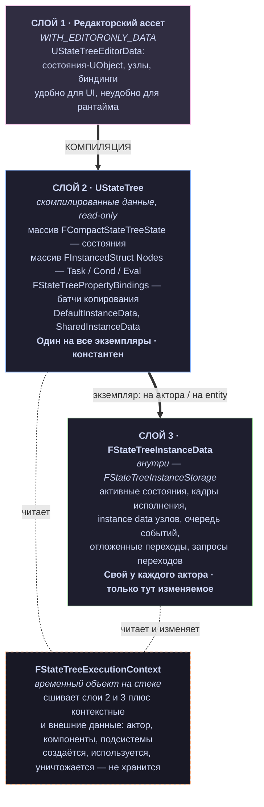

Из этой схемы вытекают почти все правила работы с StateTree, которые новичок нарушает:

**Правило 1. Узел константен.** Ваш `FMyTask` — это `USTRUCT`, лежащий в массиве `Nodes` внутри `UStateTree`. Он один на всех акторов. Поэтому все методы узлов помечены `const`:

cpp

```cpp
virtual EStateTreeRunStatus Tick(FStateTreeExecutionContext& Context, const float DeltaTime) const
```

Хранить состояние в полях узла — ошибка, приводящая к тому, что сотня NPC пишет в одну память. Изменяемое состояние объявляется отдельным типом `FInstanceDataType` (глава 7).

**Правило 2. Контекст исполнения — временный.** `FStateTreeExecutionContext` создаётся на стеке, живёт один вызов `Tick()`/`Start()`/`Stop()` и умирает. Он держит ссылки на владельца, ассет и instance data. Сохранить его в поле нельзя. Для «сохранить и обратиться позже/из другого потока» существует отдельная пара типов — `FStateTreeWeakExecutionContext` и `TStateTreeStrongExecutionContext` (глава 16). В `StateTreeAsyncExecutionContext.h` это сказано прямым текстом: _«It should only be allocated on the stack»_.

**Правило 3. Данные к узлу не «приходят», их копируют.** Узел не ходит за данными по указателям. В редакторе вы биндите свойство узла к чужому свойству; компилятор превращает биндинг в **батч копирования**; рантайм копирует значения в instance data узла **перед** `Tick()`/`EnterState()`. Отсюда флаги вроде `bShouldCopyBoundPropertiesOnTick` в `FStateTreeTaskBase` — вы можете отключить копирование ради производительности (глава 11).

### 1.4. Что такое «состояние» в StateTree

Состояние (`FCompactStateTreeState` в скомпилированном виде) — это узел иерархии, у которого есть:

|Часть|Роль|
|---|---|
|**Тип** (`EStateTreeStateType`)|обычное состояние, группа, subtree, linked state, linked asset|
|**Enter Conditions**|условия, при которых в состояние можно войти; проверяются при выборе|
|**Considerations**|утилитарные оценки — числовой «вес» состояния, если выбор идёт по utility|
|**Tasks**|что делать, пока состояние активно|
|**Transitions**|куда уходить и по какому триггеру|
|**Selection Behavior**|как выбирать, куда спускаться дальше (по порядку, случайно, по utility, следуя переходам…)|
|**Parameters**|входные параметры состояния, к которым биндятся задачи|
|**Дети**|вложенные состояния|

Активен всегда **путь**, а не одно состояние: `Root → Patrol → MoveToPoint`. Задачи всех состояний пути тикают, от корня к листу. Это даёт естественное переиспользование: задача «удерживать блокировку ресурса» ставится на родителя, а конкретные действия — на детей.

### 1.5. Четыре вида узлов

Все они наследуют `FStateTreeNodeBase` и различаются только контрактом вызова:

- **Task** (`FStateTreeTaskBase`) — действие. Живёт между `EnterState()` и `ExitState()`, может тикать, возвращает `Running/Succeeded/Failed`. Возврат не-`Running` завершает состояние.
- **Condition** (`FStateTreeConditionBase`) — булев тест, `TestCondition()`. Используется в enter conditions и в условиях переходов. Instance data условий **разделяется** между всеми использованиями ассета — в комментариях к `EnterState` условия это подчёркнуто отдельно.
- **Consideration** — утилитарная оценка, возвращает вес. В вашем пакете базового класса нет, но `EStateTreeBindableStructSource::Consideration` и `AllowUtilityConsiderations()` в схеме на них ссылаются.
- **Evaluator** (`FStateTreeEvaluatorBase`) — вычисляет и **публикует данные** для принятия решений. Работает глобально: `TreeStart()`, `Tick()` каждый кадр, `TreeStop()`. Не привязан к состоянию.

### 1.6. Словарь терминов

Он вам понадобится: в StateTree очень много почти-одинаковых слов, и путаница между ними — главный источник ошибок.

|Термин|Что это на самом деле|
|---|---|
|**Node (узел)**|Task / Condition / Consideration / Evaluator. НЕ состояние.|
|**State (состояние)**|элемент иерархии. Индексируется `FStateTreeStateHandle`.|
|**Frame (кадр)**|`FStateTreeExecutionFrame` — область исполнения одного ассета. Linked asset создаёт новый кадр. Кадры образуют стек.|
|**Instance Data**|изменяемые данные _узла_ на конкретном экземпляре.|
|**Execution Runtime Data**|вторые, «долгоживущие» данные узла: валидны от `Start()` до `Stop()` даже если узел не активен.|
|**Instance Storage**|`FStateTreeInstanceStorage` — всё изменяемое состояние экземпляра дерева.|
|**Data Handle**|`FStateTreeDataHandle` — «адрес» блока данных: откуда брать (источник) + индекс. Разрешается в `FStateTreeDataView`.|
|**Data View**|`FStateTreeDataView` — пара (тип, указатель на память). Type-erased доступ.|
|**Context Data**|данные, которые обязана предоставить схема при запуске (например, актор-владелец).|
|**External Data**|данные, которые запросил узел через `Link()` (подсистема, компонент).|
|**Schema**|`UStateTreeSchema` — что разрешено в дереве и какие context data требуются.|
|**Linker**|`FStateTreeLinker` — разрешает запросы внешних данных при загрузке ассета.|
|**Binding**|скомпилированное правило копирования значения из A в B.|
|**PropertyRef**|ссылка на _чужое_ свойство без копирования — для чтения/записи по месту.|
|**Scheduled Tick**|механизм сна дерева: «разбуди меня через X секунд» или «не буди вообще».|

### 1.7. Жизненный цикл: что происходит, если посмотреть сверху

Полный разбор — в главе 14, но каркас полезно держать в голове с самого начала.

1. **Загрузка ассета.** `UStateTree::Link()` проходит по всем узлам, вызывая их `Link(FStateTreeLinker&)`. Узлы регистрируют требования к внешним данным. Если что-то не сходится — ассет не готов к запуску (`IsReadyToRun()` вернёт false, дерево не запустится).
2. **Создание экземпляра.** Владелец (например, `UStateTreeComponent`) держит `FStateTreeInstanceData`. Пока дерево не запущено — она пустая.
3. **`Start()`.** Схема поставляет context data (`SetContextRequirements`), собираются external data (`CollectExternalData`), instance storage инициализируется из шаблонов ассета, вызываются `TreeStart()` у evaluators, затем происходит **первый выбор состояния** от корня.
4. **`Tick(DeltaTime)`.** Порядок фаз (`EStateTreeUpdatePhase` в `StateTreeExecutionTypes.h` перечисляет их явно): тик глобальных evaluators и global tasks → тик задач активных состояний → обработка переходов (запросы, события, завершения, delayed transitions) → при необходимости выбор нового состояния с вызовом `ExitState`/`EnterState`.
5. **`Stop()`.** `ExitState` в обратном порядке, `TreeStop()` у evaluators, storage сбрасывается.

### 1.8. Как читать этот пакет файлов

Ваши 18 файлов раскладываются по слоям так:


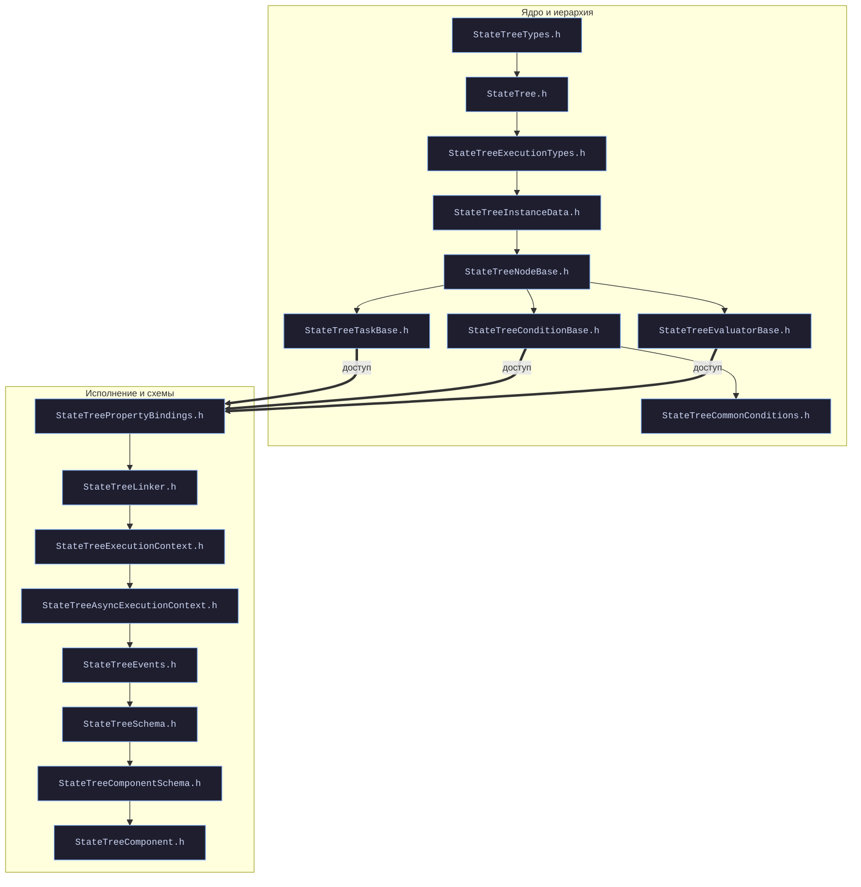


Заметьте, чего в пакете **нет** — я буду отмечать это по ходу, чтобы вы не искали в пустоте: компилятора и редакторских типов (`UStateTreeEditorData`, `UStateTreeState`, `FStateTreeCompiler`), `StateTreeReference.h`, базы Considerations, Blueprint-обёрток (`StateTreeTaskBlueprintBase.h`), AI-компонента (`UStateTreeAIComponent`), трейсинга. По ним я буду опираться на знание движка и явно это оговаривать.

---

## Глава 2. Практический старт

Цель главы — чтобы к её концу у вас на акторе бегало живое дерево с вашей собственной задачей на C++. Абстракции из главы 1 сразу получат опору. Детали каждого упомянутого типа будут разобраны в следующих главах — здесь только рабочий каркас.

### 2.1. Что подключить

**Плагины** (Edit → Plugins, затем перезапуск):

- **StateTree** — ядро. Обязательно.
- **Gameplay StateTree** — даёт `UStateTreeComponent` и `UStateTreeComponentSchema`. Нужен, если хотите вешать дерево на актора.

**Модули в `.Build.cs`** вашего игрового модуля:

csharp

```csharp
PublicDependencyModuleNames.AddRange(new string[]
{
    "Core", "CoreUObject", "Engine",
    "StateTreeModule",          // ядро: узлы, контекст, типы
    "GameplayStateTreeModule",  // UStateTreeComponent, ComponentSchema
    "GameplayTags",             // события StateTree — это FGameplayTag
});
```

Возможные добавки в зависимости от версии и того, что вы используете:

- `"PropertyBindingUtils"` — в UE 5.7+ система биндингов StateTree вынесена в общий фреймворк (в вашем `StateTreePropertyBindings.h` видно наследование от `FPropertyBindingBindingCollection` и инклюды `PropertyBinding*.h`). Если линкер ругается на эти символы — добавляйте.
- `"AIModule"` — если работаете с `UBrainComponent`-специфичным API или AI-вариантом компонента.
- `"StructUtils"` — в UE ≤ 5.4 отдельный модуль; с 5.5 его содержимое (`FInstancedStruct`, `FStructView`) переехало в `CoreUObject`, отдельная зависимость не нужна.

### 2.2. Три способа запустить дерево

Важно понять сразу, что «StateTree = компонент на акторе» — это лишь один из вариантов, и он не привилегированный.

|Способ|Кто владеет instance data|Кто тикает|Когда применять|
|---|---|---|---|
|**`UStateTreeComponent`**|компонент|`TickComponent`|обычный актор, NPC, интерактивный объект|
|**Свой владелец**|ваш `UObject`/`UActorComponent`/подсистема|вы вручную|своя система (инвентарь, квесты, режимы игры)|
|**Mass / batched**|фрагмент энтити|процессор|толпы, тысячи агентов|

Начнём с первого, потом сразу разберём второй — потому что второй показывает механику честнее.

### 2.3. Дерево на акторе за пять шагов

**Шаг 1. Создать ассет.** Content Browser → Artificial Intelligence → **State Tree**. Диалог спросит **схему** — выберите `StateTree Component`. Это класс `UStateTreeComponentSchema`, у него в `UCLASS` стоит `meta = (DisplayName = "StateTree Component", CommonSchema)` — именно `DisplayName` вы видите в списке.

Схема выбирается **один раз при создании** и записывается в теги ассет-даты. Именно поэтому в `UStateTreeComponent` свойство описано так:

cpp

```cpp
UPROPERTY(EditAnywhere, Category = AI, DisplayName = "State Tree",
    meta=(Schema="/Script/GameplayStateTreeModule.StateTreeComponentSchema", SchemaCanBeOverriden))
FStateTreeReference StateTreeRef;
```

Метадата `Schema` фильтрует выпадающий список: в этот слот нельзя положить дерево, скомпилированное с чужой схемой. Это первая линия защиты от «дерево ждёт актора, а получило entity».

**Шаг 2. Настроить схему.** Откройте ассет, в панели схемы есть `ContextActorClass`:

cpp

```cpp
/** Actor class the StateTree is expected to run on. Allows to bind to specific Actor class' properties. */
UPROPERTY(EditAnywhere, Category="Defaults", NoClear)
TSubclassOf<AActor> ContextActorClass;
```

Поставьте свой класс (например, `AMyNPCCharacter`) — и в редакторе биндингов появится возможность тянуть данные прямо из его свойств. Оставите `AActor` — получите только общие свойства. Это чистая выгода, задавайте класс всегда.

Рядом лежит `ScheduledTickPolicy` (`Default`/`Allowed`/`Denied`) — разрешение дереву «спать». Разбор в главе 17; по умолчанию значение берётся из cvar `StateTree.Component.DefaultScheduledTickAllowed`.

**Шаг 3. Собрать простое дерево.** В редакторе: корневое состояние, у него два ребёнка — `Idle` и `Alerted`. На `Idle` повесьте задачу «Debug Text» (стандартная задача из ядра), на `Alerted` — другую. На `Idle` добавьте переход `On Event` с тегом `StateTree.Event.Alert` → цель `Alerted`. **Скомпилируйте** (кнопка Compile). Некомпилированное дерево не запустится: `UStateTree::IsReadyToRun()` вернёт false.

**Шаг 4. Компонент на акторе.** В Blueprint актора: Add Component → **StateTree**. В слот `State Tree` положите ваш ассет. Свойство `bStartLogicAutomatically` по умолчанию `true`:

cpp

```cpp
/** If true, the StateTree logic is started on begin play. Otherwise, StartLogic() needs to be called. */
UPROPERTY(EditAnywhere, Category = AI)
bool bStartLogicAutomatically = true;
```

То есть дерево заведётся само на `BeginPlay`. Если нужен контроль — снимите галку и вызывайте `StartLogic()`. Из C++ есть и сеттер, специально для construction scripts: `SetStartLogicAutomatically(bool)`.

**Шаг 5. Пнуть событием.** Компонент даёт готовый Blueprint-API:

cpp

```cpp
UFUNCTION(BlueprintCallable, Category = "Gameplay|StateTree")
void SendStateTreeEvent(const FStateTreeEvent& Event);

// C++-перегрузка, удобнее — без создания структуры
void SendStateTreeEvent(const FGameplayTag Tag,
                        const FConstStructView Payload = FConstStructView(),
                        const FName Origin = FName());

UFUNCTION(BlueprintPure, Category = "Gameplay|StateTree")
EStateTreeRunStatus GetStateTreeRunStatus() const;
```

Плюс делегат `OnStateTreeRunStatusChanged` (`BlueprintAssignable`), в который прилетает `EStateTreeRunStatus` — удобно вешать реакцию на завершение дерева.

Полный набор управляющих методов компонент наследует от `UBrainComponent`: `StartLogic()`, `RestartLogic()`, `StopLogic(Reason)`, `Cleanup()`, `PauseLogic(Reason)`, `ResumeLogic(Reason)`, `IsRunning()`, `IsPaused()`. Разбор их реального поведения — глава 19.

### 2.4. Первая своя задача на C++

Вот полный, самодостаточный пример. Разбор — сразу после кода.

**`MyStateTreeTasks.h`**

cpp

```cpp
#pragma once

#include "StateTreeTaskBase.h"
#include "StateTreeExecutionTypes.h"
#include "MyStateTreeTasks.generated.h"

class UWorld;

/** Изменяемые данные задачи — по одному экземпляру на каждого владельца дерева. */
USTRUCT()
struct FMyWaitTaskInstanceData
{
    GENERATED_BODY()

    /** Входной параметр: сколько ждать. Можно забиндить в редакторе. */
    UPROPERTY(EditAnywhere, Category = "Parameter")
    float Duration = 1.0f;

    /** Выходное значение: сколько прошло. Можно читать другими узлами. */
    UPROPERTY(EditAnywhere, Category = "Output")
    float ElapsedTime = 0.0f;
};
UE_STATETREE_ZEROED_TRIVIALLY_COPIED_NO_DESTRUCTOR_INSTANCEDATA(FMyWaitTaskInstanceData);

/**
 * Задача: подождать Duration секунд, затем завершиться успехом.
 */
USTRUCT(meta = (DisplayName = "My Wait", Category = "Common"))
struct FMyWaitTask : public FStateTreeTaskCommonBase
{
    GENERATED_BODY()

    using FInstanceDataType = FMyWaitTaskInstanceData;

    FMyWaitTask()
    {
        // Тик нам нужен, а копировать биндинги каждый тик — нет:
        // Duration читается один раз в EnterState.
        bShouldCallTick = true;
        bShouldCopyBoundPropertiesOnTick = false;
    }

    virtual const UStruct* GetInstanceDataType() const override
    {
        return FInstanceDataType::StaticStruct();
    }

    virtual bool Link(FStateTreeLinker& Linker) override;

    virtual EStateTreeRunStatus EnterState(FStateTreeExecutionContext& Context,
                                           const FStateTreeTransitionResult& Transition) const override;

    virtual EStateTreeRunStatus Tick(FStateTreeExecutionContext& Context,
                                     const float DeltaTime) const override;

    virtual void ExitState(FStateTreeExecutionContext& Context,
                           const FStateTreeTransitionResult& Transition) const override;

#if WITH_EDITOR
    virtual FText GetDescription(const FGuid& ID, FStateTreeDataView InstanceDataView,
                                 const IStateTreeBindingLookup& BindingLookup,
                                 EStateTreeNodeFormatting Formatting = EStateTreeNodeFormatting::Text) const override;

    virtual FName GetIconName() const override { return FName("StateTreeEditorStyle|Node.Time"); }
#endif

    /** Пример внешних данных: мир нам нужен, чтобы взять время. */
    TStateTreeExternalDataHandle<UWorld> WorldHandle;
};
```

**`MyStateTreeTasks.cpp`**

cpp

```cpp
#include "MyStateTreeTasks.h"
#include "StateTreeExecutionContext.h"
#include "StateTreeLinker.h"
#include "Engine/World.h"

bool FMyWaitTask::Link(FStateTreeLinker& Linker)
{
    Linker.LinkExternalData(WorldHandle);
    return true;
}

EStateTreeRunStatus FMyWaitTask::EnterState(FStateTreeExecutionContext& Context,
                                            const FStateTreeTransitionResult& Transition) const
{
    FInstanceDataType& Data = Context.GetInstanceData(*this);
    Data.ElapsedTime = 0.0f;

    if (Data.Duration <= 0.0f)
    {
        // Мгновенное завершение: состояние закончится, не дожив до тика.
        return EStateTreeRunStatus::Succeeded;
    }
    return EStateTreeRunStatus::Running;
}

EStateTreeRunStatus FMyWaitTask::Tick(FStateTreeExecutionContext& Context, const float DeltaTime) const
{
    FInstanceDataType& Data = Context.GetInstanceData(*this);
    Data.ElapsedTime += DeltaTime;

    SET_NODE_CUSTOM_TRACE_TEXT(Context, Override, TEXT("%.2f / %.2f"), Data.ElapsedTime, Data.Duration);

    return Data.ElapsedTime >= Data.Duration
        ? EStateTreeRunStatus::Succeeded
        : EStateTreeRunStatus::Running;
}

void FMyWaitTask::ExitState(FStateTreeExecutionContext& Context,
                            const FStateTreeTransitionResult& Transition) const
{
    // Здесь освобождают ресурсы, снимают подписки, останавливают монтажи.
    // Вызывается всегда, если EnterState был вызван.
}

#if WITH_EDITOR
FText FMyWaitTask::GetDescription(const FGuid& ID, FStateTreeDataView InstanceDataView,
                                  const IStateTreeBindingLookup& BindingLookup,
                                  EStateTreeNodeFormatting Formatting) const
{
    const FInstanceDataType* Data = InstanceDataView.GetPtr<FInstanceDataType>();
    const bool bRich = (Formatting == EStateTreeNodeFormatting::RichText);

    return FText::Format(
        bRich ? FText::FromString(TEXT("<b>Wait</> {0}s")) : FText::FromString(TEXT("Wait {0}s")),
        FText::AsNumber(Data ? Data->Duration : 0.0f));
}
#endif
```

#### Что здесь важно построчно

**Никакой регистрации не требуется.** Вы не наследуете класс, не пишете фабрику, не добавляете в реестр. `USTRUCT`, унаследованный от `FStateTreeTaskCommonBase`, автоматически появится в редакторе — при условии, что схема его разрешает. `UStateTreeComponentSchema::IsStructAllowed()` пускает узлы, унаследованные от `*CommonBase`-классов. Именно для этого в ядре есть три «пространства имён»:

cpp

```cpp
struct FStateTreeTaskCommonBase      : public FStateTreeTaskBase {};
struct FStateTreeConditionCommonBase : public FStateTreeConditionBase {};
struct FStateTreeEvaluatorCommonBase : public FStateTreeEvaluatorBase {};
```

Комментарий в исходнике объясняет смысл прямо: _«Base class (namespace) for all common Tasks that are generally applicable. This allows schemas to safely include all conditions child of this struct»_. Наследуетесь от `CommonBase` — узел виден во всех обычных схемах. Наследуетесь напрямую от `FStateTreeTaskBase` — узел виден только в тех схемах, которые его явно пустили. Это ваш инструмент разграничения: задачи для AI не должны предлагаться в дереве меню.

**Два обязательных элемента для instance data.** `using FInstanceDataType = ...;` — для шаблонных хелперов (`Context.GetInstanceData(*this)` выводит тип отсюда), и `GetInstanceDataType()` — для рантайма и компилятора. Комментарий в `FStateTreeNodeBase` требует, чтобы они совпадали:

cpp

```cpp
/** The instance data type. The implementation node should set its type.
 *  The type should match GetInstanceDataType(). */
using FInstanceDataType = FNoInstanceDataType;
```

Расхождение между ними — крашится не сразу, а на первом обращении к данным. Проверяйте.

**Макрос `UE_STATETREE_ZEROED_TRIVIALLY_COPIED_NO_DESTRUCTOR_INSTANCEDATA`** — оптимизация. Он объявляет тип POD-подобным, чтобы StateTree мог не вызывать конструкторы/деструкторы и просто занулять память. Есть второй вариант, `UE_STATETREE_CONSTRUCTED_TRIVIALLY_COPIED_NO_DESTRUCTOR_INSTANCEDATA` — для структур с ненулевыми значениями по умолчанию. Разница из комментариев исходника:

|Макрос|Условие применимости|
|---|---|
|`..._ZEROED_...`|все поля инициализируются нулём: `int32 A = 0;`|
|`..._CONSTRUCTED_...`|есть ненулевые дефолты: `int32 A = 3;`|

И явное «нельзя»: тип с `TObjectPtr`, `FString`, `TArray`, `FFrameRate` — ни под один макрос не подходит, у них нетривиальные конструкторы/деструкторы. Просто не ставьте макрос, всё будет работать (чуть медленнее). Старый `STATETREE_POD_INSTANCEDATA` объявлен устаревшим в 5.8.

Мой пример с `float Duration = 1.0f` формально требует `..._CONSTRUCTED_...`, а не `..._ZEROED_...` — я поставил `ZEROED` намеренно, как ловушку: обратили внимание? Если поле имеет ненулевой дефолт, а вы объявили `WithZeroConstructor`, значение по умолчанию потеряется. Это классическая ошибка. В настоящем коде тут должен быть `CONSTRUCTED`-вариант.

**`Context.GetInstanceData(*this)`** — единственно верный способ добраться до своих данных. Обратите внимна `check` внутри:

cpp

```cpp
template <typename T>
typename T::FInstanceDataType& GetInstanceData(const T& Node) const
{
    static_assert(TIsDerivedFrom<T, FStateTreeNodeBase>::IsDerived, ...);
    check(CurrentNodeDataHandle == Node.InstanceDataHandle);
    return CurrentNodeInstanceData.template GetMutable<typename T::FInstanceDataType>();
}
```

Контекст помнит, **какой узел он сейчас обрабатывает**. Запросить instance data чужого узла нельзя — сработает `check`. Это не бюрократия, а следствие архитектуры из главы 1: данные доступны только «изнутри своего вызова». Хотите данные соседа — используйте биндинги (глава 11) или `PropertyRef` (глава 12).

**`Link()` и внешние данные.** `TStateTreeExternalDataHandle<UWorld>` — это «я хочу мир». В `Link()` вы это регистрируете, дальше в рантайме получаете:

cpp

```cpp
UWorld& World = Context.GetExternalData(WorldHandle);
```

Кто именно подставит `UWorld*`? Владелец дерева через `CollectExternalData` — у компонента это `UStateTreeComponentSchema::CollectExternalData`. Требование по умолчанию `Required`: если данные не предоставлены, дерево не запустится. Для необязательных пишите `TStateTreeExternalDataHandle<UMySubsystem, EStateTreeExternalDataRequirement::Optional>` и обращайтесь через `GetExternalDataPtr()` — в `GetExternalData()` стоит `check` именно против Optional.

**Ловушка с сигнатурами.** В комментарии к `TStateTreeExternalDataHandle` внутри `StateTreeExecutionTypes.h` приведён пример:

cpp

```cpp
EStateTreeRunStatus EnterState(FStateTreeExecutionContext& Context,
    const EStateTreeStateChangeType ChangeType, const FStateTreeTransitionResult& Transition)
```

**Это устаревшая сигнатура**, оставшаяся в документирующем комментарии с UE 5.0. Актуальная — двухпараметрическая, а `ChangeType` теперь поле внутри `FStateTreeTransitionResult`:

cpp

```cpp
/** If the change type is Sustained, then the CurrentState was reselected,
 *  or if Changed then the state was just activated. */
EStateTreeStateChangeType ChangeType = EStateTreeStateChangeType::Changed;
```

Мораль, которая пригодится вам во всей этой книге: **источник истины — объявление в базовом классе, а не пример в комментарии**. Комментарии в StateTree местами отстают на несколько версий. Если ваш `override` молча не вызывается — почти всегда вы переопределили не тот метод.

**Флаги в конструкторе.** `bShouldCallTick`, `bShouldCopyBoundPropertiesOnTick` и остальные — не UPROPERTY, они задаются кодом в конструкторе узла. Полная таблица из девяти флагов с последствиями каждого — глава 8. Пока запомните главное: `bShouldCallTick = false` для задач, которым тик не нужен (например, «выстрелить один раз в EnterState»), — это буквально бесплатная производительность на толпе.

**`SET_NODE_CUSTOM_TRACE_TEXT`** — макрос из `StateTreeNodeBase.h`. Под `WITH_STATETREE_TRACE` он пишет произвольный текст в трейс-отладчик StateTree; иначе разворачивается в ничто. Дешёвый способ увидеть внутреннее состояние задачи в дебаггере (глава 21).

### 2.5. Первое своё условие

Условие устроено проще: один метод, нет жизненного цикла.

cpp

```cpp
USTRUCT()
struct FMyHealthConditionInstanceData
{
    GENERATED_BODY()

    UPROPERTY(EditAnywhere, Category = "Input")
    float Health = 0.0f;

    UPROPERTY(EditAnywhere, Category = "Parameter")
    float Threshold = 0.5f;
};
UE_STATETREE_CONSTRUCTED_TRIVIALLY_COPIED_NO_DESTRUCTOR_INSTANCEDATA(FMyHealthConditionInstanceData);

USTRUCT(DisplayName = "Health Below")
struct FMyHealthCondition : public FStateTreeConditionCommonBase
{
    GENERATED_BODY()

    using FInstanceDataType = FMyHealthConditionInstanceData;

    virtual const UStruct* GetInstanceDataType() const override
    { return FInstanceDataType::StaticStruct(); }

    virtual bool TestCondition(FStateTreeExecutionContext& Context) const override
    {
        const FInstanceDataType& Data = Context.GetInstanceData(*this);
        return Data.Health < Data.Threshold;
    }
};
```

Заметьте разделение категорий: `"Input"` для того, что будет забиндено извне, `"Parameter"` для того, что настраивается в редакторе вручную. Это не косметика — категория читается системой биндингов (`UE::StateTree::GetUsageFromMetaData`) и определяет, как свойство ведёт себя в UI. Ровно этот приём использован во всех стандартных условиях в `StateTreeCommonConditions.h`: `Left` всегда `Input`, `Right` всегда `Parameter`.

И критично важное предупреждение из исходника, к которому мы вернёмся в главе 9. Instance data условий **разделяется между всеми использованиями ассета**:

> _«The condition instance data is shared between all the uses a State Tree asset. You should not modify the instance data in this callback.»_

То есть в отличие от задачи, условие **не имеет** приватных данных на экземпляр. Не храните в них состояние между вызовами.

### 2.6. Запуск без компонента: механика без обёрток

Теперь то же самое, но руками — так видно, что делает компонент. Каркас взят из документирующего блока над `FStateTreeExecutionContext`.

cpp

```cpp
// В вашем UObject/компоненте:
UPROPERTY(EditAnywhere)
FStateTreeReference StateTreeRef;

UPROPERTY(Transient)
FStateTreeInstanceData InstanceData;   // Слой 3 из главы 1. Живёт столько же, сколько владелец.
```

cpp

```cpp
void UMyThing::Start()
{
    const UStateTree* StateTree = StateTreeRef.GetStateTree();
    if (!StateTree || !StateTree->IsReadyToRun())
    {
        return;
    }

    FStateTreeExecutionContext Context(*this, *StateTree, InstanceData);
    if (SetContextRequirements(Context))
    {
        Context.Start();
    }
}

void UMyThing::TickMe(float DeltaTime)
{
    FStateTreeExecutionContext Context(*this, *StateTreeRef.GetStateTree(), InstanceData);
    if (SetContextRequirements(Context))
    {
        Context.Tick(DeltaTime);
    }
}

bool UMyThing::SetContextRequirements(FStateTreeExecutionContext& Context)
{
    if (!Context.IsValid())
    {
        return false;
    }

    // 1) Контекстные данные, которые требует схема (по имени из GetContextDataDescs).
    Context.SetContextDataByName(TEXT("Actor"), FStateTreeDataView(GetOwnerActor()));

    // 2) Колбэк для внешних данных, запрошенных узлами через Link().
    Context.SetCollectExternalDataCallback(
        FOnCollectStateTreeExternalData::CreateUObject(this, &UMyThing::CollectExternalData));

    return Context.AreContextDataViewsValid();
}

bool UMyThing::CollectExternalData(const FStateTreeExecutionContext& Context,
                                  const UStateTree* StateTree,
                                  TArrayView<const FStateTreeExternalDataDesc> Descs,
                                  TArrayView<FStateTreeDataView> OutDataViews)
{
    for (int32 Index = 0; Index < Descs.Num(); ++Index)
    {
        const FStateTreeExternalDataDesc& Desc = Descs[Index];
        if (Desc.Struct == UWorld::StaticClass())
        {
            OutDataViews[Index] = FStateTreeDataView(GetWorld());
        }
        // ...подсистемы, компоненты и т.д.
    }
    return true;
}
```

Три вывода, которые стоят целой главы:

1. **Контекст создаётся заново на каждый вызов.** Не поле, а локальная переменная. `Start`, `Tick`, `Stop` — каждый со своим контекстом. Instance data при этом одна и живёт долго.
2. **Context data и external data — разные вещи.** Первые перечислены схемой и заполняются по имени (`SetContextDataByName`); вторые запрошены узлами через `Link()` и заполняются колбэком по типу. Первые видны в редакторе биндингов, вторые нет.
3. **`CollectExternalData` может вызываться несколько раз за один запуск** — по разу на каждый связанный (linked) ассет, о чём прямо сказано в комментарии. Не делайте там тяжёлой работы и не полагайтесь на однократность.

### 2.7. Чек-лист «почему не работает»

Восемь ошибок первого дня, все встречаются массово:

|Симптом|Причина|
|---|---|
|Дерево не запускается вообще|ассет не скомпилирован (`IsReadyToRun() == false`)|
|Мой узел не виден в редакторе|наследовались от `FStateTreeTaskBase`, а не от `FStateTreeTaskCommonBase`, и схема его не пускает|
|Не могу выбрать ассет в слоте компонента|ассет создан с другой схемой|
|`Tick()` не вызывается|`bShouldCallTick = false` (или включён `bShouldCallTickOnlyOnEvents`)|
|Мой `override` игнорируется|сигнатура из устаревшего комментария, не совпадает с базовым классом|
|Забинденные значения — нули|отключено копирование (`bShouldCopyBoundPropertiesOnTick = false`), а вы читаете в `Tick`|
|Крашится в `GetInstanceData`|обращаетесь к данным чужого узла или `FInstanceDataType` ≠ `GetInstanceDataType()`|
|Значения по умолчанию сбрасываются в 0|поставлен `..._ZEROED_...` на структуру с ненулевыми дефолтами|
|Дерево не запустилось, в логе про external data|узел запросил `Required` данные, владелец их не отдал в `CollectExternalData`|

---

Каркас есть. Дальше начинается системный разбор — с самого низа.

---

## Глава 3. `StateTreeTypes.h` — фундамент

Это самый низкий слой. Здесь нет ни исполнения, ни узлов — только типы, которыми описывается **скомпилированное** дерево. Файл на 1388 строк, и практически каждая структура в нём — «плоское» представление того, что в редакторе было объектом.

Читать эту главу стоит с установкой: _«я смотрю на дерево так, как его видит рантайм»_. Многие странности API (`check`'и, ограничения на `uint8`, деление данных на источники) объясняются именно тем, что вы здесь увидите.

### 3.1. Инфраструктура файла

Начинается всё с категории логирования и макроса отладки:

cpp

```cpp
STATETREEMODULE_API DECLARE_LOG_CATEGORY_EXTERN(LogStateTree, Warning, All);

#ifndef WITH_STATETREE_DEBUG
#define WITH_STATETREE_DEBUG (!(UE_BUILD_SHIPPING || UE_BUILD_SHIPPING_WITH_EDITOR || UE_BUILD_TEST) && 1)
#endif
```

`LogStateTree` — ваш основной канал диагностики. `Log LogStateTree Verbose` в консоли даст много полезного при отладке запуска дерева. `WITH_STATETREE_DEBUG` включён во всех сборках кроме Shipping/Test — под ним живут дополнительные проверки и `FStateTreeInstanceDebugId`.

Далее — константы и утилиты в `UE::StateTree`:

cpp

```cpp
inline constexpr int32 MaxExpressionIndent = 4;
inline const FName SchemaTag(TEXT("Schema"));
inline const FName SchemaCanBeOverridenTag(TEXT("SchemaCanBeOverriden"));
```

- **`MaxExpressionIndent = 4`** — жёсткий лимит вложенности скобок в логических выражениях условий. Больше четырёх уровней «(A и (B или (C и (D или E))))» вы не построите. Это не произвол: отступ хранится как `int8 DeltaIndent` в условии, а вычисление выражения идёт по стеку фиксированного размера (глава 9).
- **`SchemaTag` / `SchemaCanBeOverridenTag`** — те самые имена метадаты, которые мы видели в главе 2 в `UPROPERTY(meta=(Schema=..., SchemaCanBeOverriden))`. Здесь они объявлены как константы, чтобы редактор и рантайм пользовались одной строкой.

**Палитра цветов** — двадцать констант `UE::StateTree::Colors` (Grey/DarkGrey/Red/.../Bronze/DarkBronze). Их использует `FStateTreeNodeBase::GetIconColor()`. Практический смысл: не выдумывайте свои `FColor` для иконок узлов — берите из этого набора, и ваши узлы будут выглядеть родными.

cpp

```cpp
UENUM()
enum class EComparisonOperator : uint8
{
    Less, LessOrEqual, Equal, NotEqual, GreaterOrEqual, Greater,
};
```

`UE::StateTree::EComparisonOperator` — новый (5.8) перечислитель сравнений. Он заменил `EGenericAICheck` из AIModule: это часть работы по отвязке StateTree от AI-модуля. В `StateTreeCommonConditions.h` вы видите обе версии одновременно — конструкторы с `EGenericAICheck` помечены `UE_DEPRECATED(5.8)`.

### 3.2. `FStateTreeStateHandle` — адрес состояния

Первая по-настоящему важная структура. Внутри — один `uint16`:

cpp

```cpp
UPROPERTY()
uint16 Index = InvalidIndex;
```

И четыре зарезервированных значения:

cpp

```cpp
static constexpr uint16 InvalidIndex   = uint16(-1);  // 65535
static constexpr uint16 SucceededIndex = uint16(-2);  // 65534
static constexpr uint16 FailedIndex    = uint16(-3);  // 65533
static constexpr uint16 StoppedIndex   = uint16(-4);  // 65532
```

Это ключевой архитектурный трюк, который надо понять: **завершение — это тоже «состояние»**. Когда переход ведёт «в успех», он не помечается специальным флагом — его целью становится `FStateTreeStateHandle::Succeeded`, псевдо-состояние с индексом 65534. Один и тот же код обработки переходов обслуживает и «перейти в Combat», и «завершить дерево успехом».

Отсюда методы:

cpp

```cpp
bool IsCompletionState() const
{
    return Index == SucceededIndex || Index == FailedIndex || Index == StoppedIndex;
}
EStateTreeRunStatus ToCompletionStatus() const;
static FStateTreeStateHandle FromCompletionStatus(const EStateTreeRunStatus Status);
```

Пара `ToCompletionStatus`/`FromCompletionStatus` конвертирует между двумя представлениями одного и того же: handle ↔ `EStateTreeRunStatus`. Вы будете встречать их постоянно.

Пять статических констант: `Invalid`, `Succeeded`, `Failed`, `Stopped`, **`Root`**. Последняя — просто индекс 0: корневое состояние всегда первое в массиве. Это гарантия компилятора, на неё можно опираться.

**Практический предел: 65531 состояние на ассет.** Проверка `IsValidIndex(Index)` требует `Index < MAX_uint16`. В реальности вы упрётесь в другие лимиты гораздо раньше (см. ниже про `uint8`), но знать полезно.

Есть `GetTypeHash` — значит handle можно кластьв `TMap`/`TSet`. И `Describe()` — человекочитаемая строка для логов, единственный правильный способ напечатать handle.

### 3.3. Плоское дерево: `FCompactStateTreeState`

Вот сердце главы. Одно состояние после компиляции — это **одна запись в массиве** `TArray<FCompactStateTreeState>` внутри `UStateTree`. Никаких указателей на детей, никаких `TArray` внутри. Разберём по группам.

#### Группа 1. Иерархия

cpp

```cpp
FStateTreeStateHandle Parent = FStateTreeStateHandle::Invalid;
uint16 ChildrenBegin = 0;
uint16 ChildrenEnd = 0;        // индекс за последним ребёнком
uint8  Depth = 0;              // расстояние до корня
```

Дети лежат в том же массиве **непрерывным диапазоном** `[ChildrenBegin, ChildrenEnd)`. Отсюда два элегантных инлайн-метода:

cpp

```cpp
uint16 GetNextSibling() const { return ChildrenEnd; }
bool HasChildren() const { return ChildrenEnd > ChildrenBegin; }
```

Задумайтесь над первым: **индекс следующего брата равен индексу за последним ребёнком**. Это работает потому, что компилятор раскладывает дерево в порядке обхода в глубину:

```
Индекс:  0      1        2         3        4         5
        Root  Combat  Melee   Ranged   Patrol   Idle
                │       │        │        │        │
Parent:   -      0       1        1        0        0
Children: 1..5   2..4    -        -        -        -
```

`Combat` (индекс 1) имеет детей `[2, 4)` = Melee, Ranged. `GetNextSibling()` вернёт 4 — это `Patrol`. Обход дерева получается без рекурсии и без единого разыменования указателя: чистая работа с индексами по кэш-дружественному массиву.

#### Группа 2. Узлы состояния — схема «Begin + Num»

cpp

```cpp
uint16 EnterConditionsBegin = 0;       uint8 EnterConditionsNum = 0;
uint16 UtilityConsiderationsBegin = 0; uint8 UtilityConsiderationsNum = 0;
uint16 TransitionsBegin = 0;           uint8 TransitionsNum = 0;
uint16 TasksBegin = 0;                 uint8 TasksNum = 0;
uint8  EnabledTasksNum = 0;
uint8  InstanceDataNum = 0;
```

Все узлы всех состояний лежат в **одном общем массиве** `UStateTree::Nodes`. Состояние хранит только «с какого индекса и сколько». Та же схема для переходов (общий массив `FCompactStateTransition`).

Обратите внимание на типы: **`Begin` — это `uint16`, а `Num` — `uint8`**. Следствие, которое важно знать до того, как вы напишете гигантское состояние:

> **На одно состояние — максимум 255 задач, 255 условий входа, 255 переходов, 255 considerations.**

На практике это недостижимо, но это объясняет, почему компилятор может ругаться на монструозные состояния. И даёт понять философию: состояние должно быть маленьким, композиция достигается иерархией.

`EnabledTasksNum` отдельно от `TasksNum` — с честным комментарием в исходнике: _«todo: this should be removed once we finished only compiling enabled elements for StateTree Compiler»_. То есть отключённые в редакторе задачи пока всё равно попадают в скомпилированные данные, и рантайм их пропускает по счётчику. Признак, что эта область движка ещё в работе.

#### Группа 3. Кэшированные флаги — почему StateTree быстрый

Это самая поучительная часть структуры. Тринадцать битовых полей, каждое — предвычисленный на компиляции ответ на вопрос «нужно ли что-то делать»:

cpp

```cpp
uint8 bHasTickTasks : 1;                  // есть задачи с bShouldCallTick
uint8 bHasTickTasksOnlyOnEvents : 1;      // есть задачи с bShouldCallTickOnlyOnEvents
uint8 bCachedRequestTick : 1;             // задачи требуют тика каждый кадр
uint8 bCachedRequestTickOnlyOnEvents : 1;
uint8 bHasTickTriggerTransitions : 1;     // есть переходы OnTick
uint8 bHasEventTriggerTransitions : 1;    // есть переходы OnEvent
uint8 bHasDelegateTriggerTransitions : 1; // есть переходы OnDelegate
uint8 bHasCompletedTriggerTransitions : 1;
uint8 bHasSucceededTriggerTransitions : 1;
uint8 bHasFailedTriggerTransitions : 1;
uint8 bHasTransitionTasks : 1;            // есть задачи с bShouldAffectTransitions
uint8 bHasStateChangeConditions : 1;      // есть условия с bHasShouldCallStateChangeEvents
```

И четыре предиката, которые их читают:

cpp

```cpp
bool ShouldTickTasks(bool bHasEvent) const
{
    return bHasTickTasks || (bHasEvent && bHasTickTasksOnlyOnEvents);
}

bool ShouldTickTransitions(bool bHasEvent, bool bHasBroadcastedDelegates) const
{
    return bHasTickTriggerTransitions
        || (bHasEvent && bHasEventTriggerTransitions)
        || (bHasBroadcastedDelegates && bHasDelegateTriggerTransitions);
}

bool ShouldTickCompletionTransitions(bool bSucceeded, bool bFailed) const
{
    return bHasCompletedTriggerTransitions
        || (bHasSucceededTriggerTransitions && bSucceeded)
        || (bHasFailedTriggerTransitions && bFailed);
}

bool DoesRequestTickTasks(bool bHasEvent) const
{
    return bCachedRequestTick || (bHasEvent && bCachedRequestTickOnlyOnEvents);
}
```

Вот в чём разница с Behavior Tree на уровне механики. BT каждый тик обходит структуру, спрашивая узлы. StateTree проверяет **один бит**, посчитанный на компиляции, и, если бит нулевой, не заходит в состояние вообще. Дерево из сотни состояний, где активны три и ни у одного нет тикающих задач, стоит почти ноль.

Отсюда практический вывод, который мы уже упоминали в главе 2 и который теперь виден в механике: `bShouldCallTick = false` на вашей задаче — это не «сэкономить один вызов». Это может обнулить `bHasTickTasks` для всего состояния и вывести его из тикающих целиком.

Обратите внимание: `bHasTickTasks`, `bHasTickTasksOnlyOnEvents`, `bCachedRequestTick`, `bCachedRequestTickOnlyOnEvents` **не помечены `UPROPERTY()`** в отличие от соседей. Они вычисляются при загрузке/линковке, а не сериализуются. Разница между «Has» и «CachedRequest» — первое про сам тик задач, второе про потребность разбудить дерево из scheduled-tick сна (глава 17).

#### Группа 4. Идентификация и события

cpp

```cpp
FName Name;                          // имя состояния
FGameplayTag Tag;                    // тег состояния
FCompactEventDesc RequiredEventToEnter;
uint8 bConsumeEventOnSelect : 1 = true;
uint8 bCheckPrerequisitesWhenActivatingChildDirectly : 1 = false;
FStateTreeIndex16 EventDataIndex = FStateTreeIndex16::Invalid;
```

`Tag` — это то, по чему работают overrides связанных деревьев (`GetLinkedStateTreeOverrideForTag` из главы 2) и `FStartParameters::SelectStateOverrideArgs`. Тегируйте важные состояния — это единственный способ адресовать состояние извне по имени, не завися от индексов.

`RequiredEventToEnter` — состояние может требовать события для входа. `bConsumeEventOnSelect` (по умолчанию `true`) определяет, «съест» ли выбор состояния это событие, лишив последующие состояния возможности на него отреагировать.

`bCheckPrerequisitesWhenActivatingChildDirectly` — тонкость, добавленная версией `AddedCheckingParentsPrerequisites` (см. список версий в `StateTree.h`). Если переход ведёт напрямую в ребёнка, проверять ли условия входа родителя? Исторически — нет; теперь можно включить. Классический источник загадочных багов «состояние активировалось, хотя его родитель не должен был пускать».

#### Группа 5. Utility (utility-based выбор)

cpp

```cpp
uint16 UtilityConsiderationsBegin; uint8 UtilityConsiderationsNum;
float Weight = 1.f;   // масштаб нормализованного итогового скора
```

Considerations вычисляют оценку, `Weight` её масштабирует. Работает только если родитель имеет `SelectionBehavior` из utility-семейства — для этого и существует хелпер:

cpp

```cpp
static bool IsSelectionBehaviorUsingUtility(const EStateTreeStateSelectionBehavior Value)
{
    switch(Value)
    {
        case TrySelectChildrenWithHighestUtility:
        case TrySelectChildrenAtRandomWeightedByUtility:
            return true;
        default: return false;
    }
}
```

Частая ошибка: навесить considerations на детей, но забыть переключить `SelectionBehavior` родителя — оценки просто игнорируются, без предупреждений.

#### Группа 6. Завершение состояния: битовые маски задач

cpp

```cpp
uint32 CompletionTasksMask = 0;
uint8  CompletionTasksMaskBufferIndex = 0;
uint8  CompletionTasksMaskBitsOffset = 0;
EStateTreeTaskCompletionType CompletionTasksControl = EStateTreeTaskCompletionType::Any;
```

Это относительно свежий и очень «дата-ориентированный» механизм. Вопрос, который он решает: _состояние с пятью задачами — когда оно считается завершённым?_ Раньше ответ был жёсткий («любая задача вернула не-Running»). Теперь настраивается: `Any` / `All` (тип `EStateTreeTaskCompletionType` живёт в `StateTreeTasksStatus.h`, которого у нас нет — уточните по своей версии, там же лежит `ETaskCompletionCondition`, встречающийся в `StateTreePropertyBindings.h`).

Статусы всех задач хранятся как **битовые маски по 32 бита**. `CompletionTasksMask` — какие задачи вообще участвуют в подсчёте завершения. Формулы прямо в комментариях исходника:

```
CompletionTasksMaskBufferIndex = (Final Task Bit) / 32
CompletionTasksMaskBitsOffset  = (Final Task Bit) % 32
```

То есть состояние знает, в каком 32-битном слове общего буфера и с каким сдвигом лежат биты его задач. Сам буфер живёт в instance data, а его размер посчитан в `FCompactStateTreeFrame::NumberOfTasksStatusMasks` — «худший случай по всем возможным комбинациям активных состояний кадра, включая глобальные задачи».

Практический смысл для вас: у задачи есть редакторский флаг `bConsideredForCompletion` (в `FStateTreeTaskBase`, под `WITH_EDITORONLY_DATA`), которым вы выводите фоновую задачу из подсчёта. «Играть idle-анимацию» не должна завершать состояние, когда анимация кончилась.

#### Группа 7. Тип, поведение выбора, тик

cpp

```cpp
EStateTreeStateType Type = EStateTreeStateType::State;
EStateTreeStateSelectionBehavior SelectionBehavior = TrySelectChildrenInOrder;
float CustomTickRate = 0.f;
uint8 bHasCustomTickRate : 1 = false;
uint8 bEnabled : 1 = true;
uint8 bCopyParameterBindingsOnTick : 1 = false;
TObjectPtr<UStateTree> LinkedAsset = nullptr;
FStateTreeStateHandle LinkedState = FStateTreeStateHandle::Invalid;
uint8 bCanOverrideLinkedAssetAtRuntime : 1 = true;
```

`CustomTickRate` — тик состояния в секундах, с важным комментарием: _«If set the state cannot sleep»_. Указали 0.5 — состояние будет тикать дважды в секунду и заблокирует засыпание дерева.

`bCopyParameterBindingsOnTick` — по умолчанию `false`, с уточнением: _«Parameters bindings are always copied on state enter and state exit»_. То есть параметры состояния копируются на входе и выходе всегда, а каждый тик — только если явно попросили. Ещё один источник «почему у меня старое значение».

### 3.4. Типы состояний

cpp

```cpp
enum class EStateTreeStateType : uint8
{
    State,        // задачи + возможные дети
    Group,        // только дети, задач нет
    Linked,       // ссылка на другое состояние в этом же дереве
    LinkedAsset,  // ссылка на корень другого ассета
    Subtree,      // поддерево, на которое можно ссылаться
};
```

Пара `Subtree` + `Linked` — механизм переиспользования **внутри** одного ассета: выносите общую логику в subtree, ссылаетесь на неё из нескольких мест. `LinkedAsset` — переиспользование **между** ассетами, и именно он создаёт новый `FStateTreeExecutionFrame` (глава 5) и вызывает повторный `CollectExternalData`.

`Group` от `State` отличается только тем, что не может содержать задач. Организационный контейнер.

### 3.5. Поведение выбора: `EStateTreeStateSelectionBehavior`

Семь значений — это, по сути, «дух behavior tree» внутри StateTree:

|Значение|Что делает при рассмотрении состояния|
|---|---|
|`None`|состояние нельзя выбрать напрямую|
|`TryEnterState`|войти в него самого, **даже если есть дети**|
|`TrySelectChildrenInOrder`|пробовать детей по порядку (по умолчанию)|
|`TrySelectChildrenAtRandom`|перемешать детей, взять первого подходящего|
|`TrySelectChildrenWithHighestUtility`|ребёнок с наибольшим utility; при равенстве — по порядку|
|`TrySelectChildrenAtRandomWeightedByUtility`|случайно, вероятность ∝ нормализованному utility|
|`TryFollowTransitions`|вместо выбора детей попытаться сработать переходами|

`TrySelectChildrenInOrder` + enter conditions на детях = ровно поведение BT-селектора: идём слева направо, берём первую подходящую ветку.

`TryFollowTransitions` — самое хитрое: состояние, которое не «содержит» логику, а «перебрасывает» дальше. Работает как маршрутизатор.

Обратите внимание на конец перечисления:

cpp

```cpp
TrySelectChildrenAtUniformRandom UE_DEPRECATED(all, "Use TrySelectChildrenAtRandom Instead") = TrySelectChildrenAtRandom UMETA(Hidden),
TrySelectChildrenBasedOnRelativeUtility UE_DEPRECATED(all, ...) = TrySelectChildrenAtRandomWeightedByUtility UMETA(Hidden)
```

С комментарием: _«Olds names that needs to be kept forever to ensure asset serialization to work correctly when UENUM() switched from serializing int to names»_. Ценный урок про UE в целом: `UENUM` теперь сериализуется по имени, поэтому переименование значения ломает уже сохранённые ассеты. Старые имена приходится держать как алиасы вечно.

### 3.6. Переходы

#### Тип перехода (редакторское понятие)

cpp

```cpp
enum class EStateTreeTransitionType : uint8
{
    None, Succeeded, Failed, GotoState, Parent,
    NextState, NextSelectableState, NextParent, NextSelectableParent,
    NotSet UE_DEPRECATED(all, "Use None instead."),
};
```

Это то, что вы выбираете в редакторе. `Next*`-варианты вычисляются на компиляции в конкретный handle — поэтому в рантайме (`FCompactStateTransition`) этого перечисления **уже нет**, там только `FStateTreeStateHandle State`. Разница между `NextState` и `NextSelectableState`: первый берёт следующего брата вслепую, второй — следующего, чьи условия входа проходят.

#### Триггер — это битовая маска

cpp

```cpp
enum class EStateTreeTransitionTrigger : uint8
{
    None             = 0,
    OnStateCompleted = 0x1 | 0x2,   // = 0x3
    OnStateSucceeded = 0x1,
    OnStateFailed    = 0x2,
    OnTick           = 0x4,
    OnEvent          = 0x8,
    OnDelegate       = 0x10,
    MAX
};
ENUM_CLASS_FLAGS(EStateTreeTransitionTrigger)
```

Заметьте: `OnStateCompleted` — это **не отдельное значение**, а `Succeeded | Failed`. Значит проверять надо через флаги (`EnumHasAnyFlags`), а не через `==`. Если напишете `Trigger == OnStateSucceeded` для перехода, настроенного на «любое завершение», сравнение провалится: `0x3 != 0x1`.

`OnDelegate` — относительно новый триггер: переход, ждущий broadcast'а делегата. Про них — глава 15.

#### Приоритет

cpp

```cpp
enum class EStateTreeTransitionPriority : uint8
{
    None UMETA(Hidden), Low, Normal, Medium, High, Critical,
};
```

С комментарием: _«When multiple transitions trigger at the same time, the first transition of highest priority is selected»_ — то есть сначала по приоритету, при равенстве по порядку объявления. Ниже в файле определены все шесть операторов сравнения через `static_cast<uint8>` — приоритеты честно упорядочены, можно писать `if (A > B)`.

#### `FCompactStateTransition` — рантайм-переход

cpp

```cpp
FCompactEventDesc RequiredEvent;                     // требуемое событие
FStateTreeDelegateDispatcher RequiredDelegateDispatcher;  // требуемый делегат
FEvaluationScopeMemoryRequirement ConditionEvaluationScopeMemoryRequirement;
uint16 ConditionsBegin = 0;                          // условия перехода
FStateTreeStateHandle State;                         // цель
FStateTreeRandomTimeDuration Delay;                  // задержка
EStateTreeTransitionTrigger Trigger;
EStateTreeTransitionPriority Priority = Normal;
EStateTreeSelectionFallback Fallback = None;
uint8 ConditionsNum = 0;
EStateTreeTransitionChangeTypeRules ChangeTypeTargetStateRule = Default;
uint8 bTransitionEnabled : 1 = true;
uint8 bConsumeEventOnSelect : 1 = true;
```

Плюс:

cpp

```cpp
bool HasDelay() const { return !Delay.IsEmpty(); }
```

**`EStateTreeSelectionFallback`** — что делать, если выбор целевого состояния не удался (условия входа не прошли):

cpp

```cpp
enum class EStateTreeSelectionFallback : uint8
{
    None,                  // переход просто не срабатывает
    NextSelectableSibling, // взять следующего подходящего брата цели
};
```

**`EStateTreeTransitionChangeTypeRules`** — то, что дизайнеру в UI показывается как «Reactivation»:

cpp

```cpp
enum class EStateTreeTransitionChangeTypeRules : uint8
{
    ForceChanged,    // всегда считать состояние заново активированным
    ForceSustained,  // всегда считать сохранённым
    Default,
};
```

Реализация правила прямо здесь, инлайном:

cpp

```cpp
EStateTreeStateSelectionRules GetStateSelectionRulesForTransition(EStateTreeStateSelectionRules ModifiedStateSelectionRules) const
{
    switch (ChangeTypeTargetStateRule)
    {
    case ForceChanged:
        return ModifiedStateSelectionRules | ReselectedStateCreatesNewStates;
    case ForceSustained:
        return ModifiedStateSelectionRules & ~ReselectedStateCreatesNewStates;
    default:
        return ModifiedStateSelectionRules;
    }
}
```

Практический сценарий: переход `Combat → Combat` (перезапуск боя). При `ForceChanged` задачи получат `ExitState`/`EnterState` заново (анимация перезапустится), при `ForceSustained` — не получат (продолжится). Это же управляется флагом `bShouldStateChangeOnReselect` на стороне задачи; здесь — со стороны перехода.

#### `FStateTreeRandomTimeDuration` — квантованное время

Отдельная маленькая структура, показательная для стиля StateTree:

cpp

```cpp
static constexpr float Scale = 100.0f;

UPROPERTY(EditDefaultsOnly, Category = Default) uint16 Duration = 0;
UPROPERTY(EditDefaultsOnly, Category = Default) uint16 RandomVariance = 0;

uint16 Quantize(const float Value) const
{
    return (uint16)FMath::Clamp(FMath::RoundToInt32(Value * Scale), 0, (int32)MAX_uint16);
}

float GetRandomDuration(const FRandomStream& RandomStream) const
{
    const int32 MinVal = FMath::Max(0, static_cast<int32>(Duration) - static_cast<int32>(RandomVariance));
    const int32 MaxVal = static_cast<int32>(Duration) + static_cast<int32>(RandomVariance);
    return static_cast<decltype(Scale)>(RandomStream.RandRange(MinVal, MaxVal)) / Scale;
}
```

Два `uint16` вместо двух `float` — четыре байта вместо восьми. Цена: **шаг 0.01 с и максимум ~655 секунд** (комментарий говорит «about 650 seconds»). Разброс симметричный: `Duration ± RandomVariance`, с отсечкой по нулю снизу.

Зачем такая экономия? Потому что задержка есть у каждого перехода, а переходов в большом дереве — тысячи, и они лежат в массиве, который хочется держать в кэше. Если вам нужна задержка в 20 минут — StateTree не даст, делайте таймер задачей.

Обратите внимание, что `GetRandomDuration` принимает `FRandomStream` извне. Свой стрим есть у каждого экземпляра дерева и его seed можно задать при старте (`FStartParameters::RandomSeed`) — это делает поведение воспроизводимым для тестов и реплеев.

### 3.7. `EStateTreeStateSelectionRules` — тихая, но важная штука

cpp

```cpp
enum class EStateTreeStateSelectionRules : uint32
{
    None = 0,   // «Previous (UE 5.6) rules»
    CompletedTransitionStatesCreateNewStates = 1 << 0,
    CompletedStateBeforeTransitionSourceFailsTransition = 1 << 1,
    ReselectedStateCreatesNewStates = 1 << 2,

    Default = CompletedTransitionStatesCreateNewStates
            | CompletedStateBeforeTransitionSourceFailsTransition,
};
ENUM_CLASS_FLAGS(EStateTreeStateSelectionRules);
```

Это **переключатель версий поведения движка**. `None` описан как «правила UE 5.6», а `Default` включает два исправления. Из комментариев к флагам:

- `CompletedTransitionStatesCreateNewStates`: без этого правила завершённое состояние остаётся активным и _«might never trigger a complete transition»_ — то есть застрявшее состояние, классический баг.
- `CompletedStateBeforeTransitionSourceFailsTransition`: без него _«a transition that triggers on completion might take an extra tick to execute»_ — переход на завершении опаздывает на кадр.
- `ReselectedStateCreatesNewStates`: не входит в `Default`; включается точечно через `ForceChanged` на переходе (мы только что видели, как).

Правила отдаёт схема — `UStateTreeSchema::GetStateSelectionRules()`. Практический вывод: если вы переносите проект с 5.6 и поведение переходов «внезапно исправилось» или наоборот сломалось — смотрите сюда. И если пишете свою схему, знайте, что этим рычагом вы управляете семантикой переходов всего дерева.

### 3.8. `FCompactEventDesc` — как матчатся события

cpp

```cpp
TObjectPtr<const UScriptStruct> PayloadStruct = nullptr;
FGameplayTag Tag;

bool IsValid() const { return Tag.IsValid() || PayloadStruct; }
bool DoesEventMatchDesc(const FStateTreeEvent& Event) const;   // в .cpp

bool IsSubsetOfAnotherDesc(const FCompactEventDesc& Desc) const
{
    if (Tag.IsValid() && Desc.Tag.IsValid())
    {
        if (!Desc.Tag.MatchesTag(Tag) || !Tag.MatchesTag(Desc.Tag)) return false;
    }
    if (PayloadStruct && Desc.PayloadStruct)
    {
        return PayloadStruct->IsChildOf(Desc.PayloadStruct);
    }
    return true;
}
```

Описание события состоит из двух независимых частей: тег и тип payload'а. **Достаточно любой одной** — можно ждать «любое событие с этим тегом» или «любое событие с этим payload-типом».

В `IsSubsetOfAnotherDesc` тонкость: двойная проверка `MatchesTag` в обе стороны — это проверка на **равенство** тегов в терминах иерархии GameplayTag, а не на вложенность. Метод используется редактором/компилятором для проверки, что биндинг на payload события корректен. Само сопоставление события с описанием (`DoesEventMatchDesc`) реализовано в `.cpp` — у нас его нет, но по контракту оно проверяет тег через `MatchesTag` (иерархически) и тип payload через `IsChildOf`.

### 3.9. `FStateTreeDataHandle` и все источники данных

Вторая по важности структура файла. Это универсальный «адрес» любого блока данных в StateTree — три поля:

cpp

```cpp
UPROPERTY() EStateTreeDataSourceType Source = None;
UPROPERTY() uint16 Index = InvalidIndex;
UPROPERTY() FStateTreeStateHandle StateHandle = Invalid;
```

Всё приватно, доступ через `GetSource()`, `GetIndex()`, `GetState()`. И девятнадцать источников:

|Источник|Что там лежит|Живёт|
|---|---|---|
|`GlobalInstanceData` (+`Object`)|данные глобальных задач и evaluators|Start → Stop|
|`ActiveInstanceData` (+`Object`)|данные задач активного состояния|пока состояние активно|
|`SharedInstanceData` (+`Object`)|данные условий, considerations, property-функций|общие на весь ассет|
|`EvaluationScopeInstanceData` (+`Object`)|временные данные, создаются и сразу уничтожаются|один вызов|
|`ExecutionRuntimeData` (+`Object`, +`Any`)|«долгие» данные узла|Start → Stop|
|`ContextData`|контекстные данные и параметры дерева|предоставляются владельцем|
|`ExternalData`|внешние данные, запрошенные через `Link()`|предоставляются владельцем|
|`GlobalParameterData`|глобальные параметры дерева|в instance storage|
|`ExternalGlobalParameterData`|глобальные параметры, поставляемые снаружи|у владельца|
|`SubtreeParameterData`|параметры поддерева (могут разрешиться в параметры linked-состояния)|—|
|`StateParameterData`|параметры обычного/linked состояния|—|
|`TransitionEvent`|событие, вызвавшее переход|время перехода|
|`StateEvent`|событие, использованное при выборе состояния|время выбора|

Три наблюдения, которые стоят таблицы:

**1. Почти каждый источник имеет `...Object`-двойник.** Потому что instance data узла может быть как `USTRUCT`, так и `UObject` (Blueprint-узлы — объекты). Отсюда служебные методы:

cpp

```cpp
bool IsObjectSource() const;
FStateTreeDataHandle ToObjectSource() const;
FStateTreeDataHandle ToStructSource() const;
```

`ExecutionRuntimeDataAny` — особый случай с комментарием _«Discover at runtime if it's a struct or an object»_: тип выясняется в рантайме.

**2. `SharedInstanceData` объясняет ограничение на условия.** Помните предупреждение из главы 2 — «не пишите в instance data условия»? Вот причина: их данные лежат в shared-хранилище, физически одном для всех экземпляров дерева. Это не соглашение, это устройство памяти.

**3. `check`'и в конструкторе фиксируют инварианты:**

cpp

```cpp
check(Source != ActiveInstanceData || (Source == ActiveInstanceData && StateHandle.IsValid()));
check(Source == GlobalParameterData || Source == ExternalGlobalParameterData || IsValidIndex(InIndex));
```

Первый: для данных активного состояния **обязателен** валидный `StateHandle` — иначе адрес неполный, у разных состояний свои блоки. Второй: индекс обязателен для всех, кроме глобальных параметров (они одни, индексировать нечего).

Есть `GetTypeHash`, комбинирующий все три поля, — handle можно использовать как ключ.

Рядом лежит маленький мостик между двумя перечислениями:

cpp

```cpp
enum class EStateTreeParameterDataType : uint8 { GlobalParameterData, ExternalGlobalParameterData };

static EStateTreeDataSourceType CastToDataSourceType(EStateTreeParameterDataType Value);
```

Схема отвечает `GetGlobalParameterDataType()` — где хранить глобальные параметры: внутри instance data или снаружи (тогда владелец подставляет память через `FExternalGlobalParameters`, который мы видели в `FStateTreeExecutionContext`).

### 3.10. `FStateTreeDataView` — что происходит с адресом дальше

cpp

```cpp
struct FStateTreeDataView : public FPropertyBindingDataView
{
    using FPropertyBindingDataView::FPropertyBindingDataView;
};
```

И честный комментарий: _«Helper struct to facilitate transition to FPropertyBindingDataView in the StateTree module»_.

Раньше это была собственная структура StateTree. В 5.7 систему биндингов вынесли в общий фреймворк `PropertyBindingUtils` (тот же, что теперь обслуживает Smart Objects и другие подсистемы), и `FStateTreeDataView` превратился в пустой псевдоним для совместимости. Функциональность — в `FPropertyBindingDataView`: пара (`UStruct*` тип, `uint8*` память) плюс типизированные геттеры `Get<T>()`, `GetPtr<T>()`, `GetMutable<T>()`, `GetMutablePtr<T>()`, `IsValid()`, `GetStruct()`, `GetMemory()`.

Логика доступа к данным целиком: **`FStateTreeDataHandle` (адрес) → разрешается контекстом → `FStateTreeDataView` (тип + указатель) → `Get<T>()` (типизированная ссылка)**. Разрешение адреса в вид делает `UE::StateTree::InstanceData::GetDataView` (глава 6).

### 3.11. `FStateTreeStructRef` — ссылка вместо копии

cpp

```cpp
USTRUCT(BlueprintType)
struct FStateTreeStructRef
{
    bool IsValid() const;
    void Set(FStructView NewData);              // вызывается системой копирования
    template <typename T> const T& Get() const;
    template <typename T> const T* GetPtr() const;
    template <typename T> T& GetMutable();
    template <typename T> T* GetMutablePtr();
    const UScriptStruct* GetScriptStruct() const;
protected:
    FStructView Data;
};
```

Мотивация из комментария: _«useful for referencing larger properties to avoid copies of the data, or to be able to write to a bounds property»_. То есть два случая: большая структура (копировать дорого) и нужда **писать** в источник биндинга.

Использование требует метадаты `BaseStruct` с полным путём типа:

cpp

```cpp
USTRUCT()
struct FAwesomeTaskInstanceData
{
    GENERATED_BODY()

    UPROPERTY(VisibleAnywhere, Category = Input,
              meta = (BaseStruct = "/Script/AwesomeModule.AwesomeData"))
    FStateTreeStructRef Data;
};

// ...
if (const FAwesomeData* Awesome = InstanceData.Data.GetPtr<FAwesomeData>())
{
    // ...
}
```

Обратите внимание на `VisibleAnywhere`, а не `EditAnywhere`: значение нельзя ввести руками, только забиндить. И на `ExportTextItem` в конце структуры — он экспортирует не сам ref, а данные, на которые тот указывает, что нужно для корректного отображения в UI.

Дальний родственник — `FStateTreePropertyRef` (глава 12): тот ссылается на конкретное **свойство**, а этот — на **структуру целиком**.

### 3.12. `FStateTreeStateLink` — ссылка на состояние

cpp

```cpp
#if WITH_EDITORONLY_DATA
    FName Name;                        // имя на момент линковки, для сообщений об ошибках
    FGuid ID;                          // GUID состояния
    EStateTreeTransitionType LinkType; // NextState / Parent / GotoState...
#endif
    FStateTreeStateHandle StateHandle;                 // <- всё, что остаётся в рантайме
    EStateTreeSelectionFallback Fallback = None;
```

Идеальная иллюстрация компиляции: в редакторе — GUID, имя и «тип» перехода; в рантайме — один `uint16`. `WithStructuredSerializer` и `WithPostSerialize` в трейтах — для миграции старых ассетов (`PostSerialize` восстанавливает данные после смены формата).

### 3.13. `FCompactStateTreeParameters` — два вида параметров

cpp

```cpp
FConstStructView GetValue() const;
FStructView GetMutableValue();

private:
    UE_DEPRECATED_FORGAME(5.8, "Direct access to Parameter is not valid...")
    UPROPERTY() FInstancedPropertyBag Parameters;      // property bag для внутренних параметров
    UPROPERTY() FInstancedStruct InstancedParameters;  // USTRUCT для linked-ассета
```

Два поля для двух сценариев. `FInstancedPropertyBag` — динамический набор свойств, который вы правите в редакторе (обычные параметры состояния). `FInstancedStruct` — готовый тип, когда параметры приходят от связанного ассета. `GetValue()` выбирает первое, если оно валидно, иначе второе.

Урок стиля: `UE_DEPRECATED_FORGAME(5.8)` на приватном поле и требование ходить через геттеры — именно чтобы это ветвление было в одном месте.

### 3.14. `FCompactStateTreeFrame`

cpp

```cpp
FStateTreeStateHandle RootState = Invalid;
uint8 NumberOfTasksStatusMasks = 0;
```

Всего два поля, но второе — с длинным комментарием: _«The max number of masks needed by the frame. It is the worst case of all the possible active state combinations for the frame. It includes the global tasks.»_

Компилятор перебирает все возможные комбинации активных состояний внутри кадра, находит максимум по количеству одновременно активных задач и резервирует под их битовые статусы столько 32-битных слов, сколько нужно в худшем случае. Это позволяет выделить буфер статусов **один раз**, без аллокаций во время исполнения.

### 3.15. Карты Guid → индекс

Три однотипные структуры:

cpp

```cpp
struct FStateTreeStateIdToHandle      { FGuid Id; FStateTreeStateHandle Handle; };
struct FStateTreeNodeIdToIndex        { FGuid Id; FStateTreeIndex16 Index; };
struct FStateTreeTransitionIdToIndex  { FGuid Id; FStateTreeIndex16 Index; };
```

Зачем они нужны, если рантайм работает с индексами? Потому что **индексы меняются при каждой перекомпиляции**, а GUID редакторской сущности — нет. Эти карты — мост между стабильной редакторской идентичностью и нестабильными рантайм-индексами. Ими живут: отладчик (подсветить в редакторе состояние, активное в игре), трейсинг, разрешение биндингов, отчёты об ошибках компиляции.

Практический вывод: **никогда не сохраняйте `FStateTreeStateHandle` в ассетах или сейвах**. Он валиден только для конкретной сборки конкретного дерева. Сохраняйте `FGameplayTag` состояния или его GUID.

### 3.16. Два маленьких перечисления

cpp

```cpp
enum class EStateTreeExternalDataRequirement : uint8
{
    Required,   // StateTree cannot be executed if the data is not present.
    Optional,   // Data is optional for StateTree execution.
};

enum class EStateTreePropertyUsage : uint8
{
    Invalid, Context, Input, Parameter, Output,
};
```

`EStateTreePropertyUsage` — то, о чём мы говорили в главе 2 про категории `"Input"`/`"Parameter"`/`"Output"`. Категория `UPROPERTY` конвертируется в это значение функцией `UE::StateTree::GetUsageFromMetaData` (объявлена в `StateTreePropertyBindings.h`), и от результата зависит поведение свойства в UI биндингов:

|Usage|Смысл|Поведение в редакторе|
|---|---|---|
|`Context`|данные из контекста|заполняется автоматически|
|`Input`|значение приходит извне|**обязано** быть забиндено|
|`Parameter`|настраивается|можно ввести руками или забиндить|
|`Output`|узел публикует наружу|нельзя биндить как цель; можно читать|

Категория — не косметика. Отметьте свойство как `Input`, и компилятор потребует биндинг; отметьте как `Output`, и другие узлы смогут читать его результат.

### 3.17. Макросы instance data

Их мы разобрали в главе 2 — `UE_STATETREE_ZEROED_TRIVIALLY_COPIED_NO_DESTRUCTOR_INSTANCEDATA` и `..._CONSTRUCTED_...`, плюс устаревший с 5.8 `STATETREE_POD_INSTANCEDATA`. Здесь только отмечу, где они физически находятся — в самом конце `StateTreeTypes.h`, — и повторю различие ещё раз, потому что путают его постоянно:

- **`ZEROED`** → `WithZeroConstructor` + `WithNoDestructor`. Память просто занулят. Все поля должны быть `= 0`.
- **`CONSTRUCTED`** → только `WithNoDestructor`. Конструктор вызовут, деструктор нет. Годится для ненулевых дефолтов.
- Оба ставят `TIsPODType<Type> = true`. Оба **нельзя** для `TObjectPtr`, `FString`, `TArray`, `FInstancedStruct` и любого типа с нетривиальным копированием.

### 3.18. Итог: как дерево выглядит в памяти

Соберём картину. Вот дерево из редактора:

```
Root  (Group, TrySelectChildrenInOrder)
├── Combat  (State, TryEnterState)
│   ├── enter condition: HasEnemy
│   ├── task: FaceTarget
│   └── transition: OnStateCompleted → Patrol
└── Patrol  (State)
    ├── task: MoveToRandomPoint
    └── transition: OnEvent(Alert) → Combat
```

После компиляции внутри `UStateTree` это выглядит примерно так:

```
States: [
  0: { Name=Root,   Type=Group, Parent=Invalid, Children=[1,3), Depth=0,
       TasksBegin=0, TasksNum=0, Transitions=[0,0) }
  1: { Name=Combat, Type=State, Parent=0, Children=[0,0), Depth=1,
       EnterConditionsBegin=0, EnterConditionsNum=1,
       TasksBegin=0, TasksNum=1,
       TransitionsBegin=0, TransitionsNum=1,
       bHasTickTasks=1, bHasCompletedTriggerTransitions=1,
       SelectionBehavior=TryEnterState }
  2: { Name=Patrol, Type=State, Parent=0, Children=[0,0), Depth=1,
       TasksBegin=1, TasksNum=1,
       TransitionsBegin=1, TransitionsNum=1,
       bHasTickTasks=1, bHasEventTriggerTransitions=1 }
]

Nodes: [ 0: FHasEnemyCondition, 1: FFaceTargetTask, 2: FMoveToRandomPointTask ]
       ↑ условия и задачи в одном массиве, состояния ссылаются диапазонами

Transitions: [
  0: { State=Handle(2), Trigger=OnStateCompleted, Priority=Normal }
  1: { State=Handle(1), Trigger=OnEvent, RequiredEvent={Tag=Alert}, Priority=Normal }
]

Frames: [ 0: { RootState=Handle(0), NumberOfTasksStatusMasks=1 } ]
```

Ни одного указателя внутрь структуры. Всё — индексы в плоских массивах. Обход, поиск, проверка «надо ли тикать» — линейная работа с памятью.

Именно из этой картины растут все ограничения, с которыми вы будете сталкиваться: почему узел константен (он в общем массиве), почему `Num`-поля `uint8` (экономия на размере записи), почему нельзя хранить handle между компиляциями (индексы переезжают), почему условия делят instance data (они в shared-хранилище).

---

## Глава 4. `UStateTree` — скомпилированный ассет

`UStateTree` — это `UDataAsset`, и это единственный `UObject` во всей рантайм-части StateTree, который вы регулярно держите в руках. Формулировка из комментария в исходнике исчерпывающая:

> _«StateTree asset. Contains the StateTree definition in both editor and runtime (baked) formats.»_

Один объект — два представления. Редакторское лежит в `EditorData` (под `WITH_EDITORONLY_DATA`), скомпилированное — во всём остальном. В шиппинг-сборке от редакторской половины не остаётся ничего.

### 4.1. Полная карта содержимого

Начнём с того, что внутри. Все поля приватные; я группирую их по назначению и указываю, на каком этапе они появляются.

#### Создаётся компиляцией

|Поле|Тип|Назначение|
|---|---|---|
|`Schema`|`TObjectPtr<UStateTreeSchema>` (`Instanced`)|схема, с которой компилировали|
|`Frames`|`TArray<FCompactStateTreeFrame>`|кадры исполнения|
|`States`|`TArray<FCompactStateTreeState>`|состояния, корень в индексе 0|
|`Transitions`|`TArray<FCompactStateTransition>`|все переходы дерева|
|`Nodes`|`FInstancedStructContainer`|evaluators, задачи, условия, considerations|
|`DefaultInstanceData`|`FStateTreeInstanceData`|шаблоны instance data узлов|
|`DefaultEvaluationScopeInstanceData`|`FInstanceContainer`|шаблоны для evaluation-scope данных|
|`DefaultExecutionRuntimeData`|`FInstanceContainer`|шаблоны execution runtime data|
|`SharedInstanceData`|`FStateTreeInstanceData`|данные условий/considerations, общие|
|`ContextDataDescs`|`TArray<FStateTreeExternalDataDesc>`|контекстные данные, требуемые схемой|
|`PropertyBindings`|`FStateTreePropertyBindings`|скомпилированные биндинги|
|`TaskCompletionDispatchers`|`TArray<FTaskCompletionDispatcher>`|диспетчеры завершения задач|
|`Extensions`|`TArray<TObjectPtr<UStateTreeExtension>>`|расширения ассета (для плагинов)|
|`IDToStateMappings`|`TArray<FStateTreeStateIdToHandle>`|GUID → handle состояния|
|`IDToNodeMappings`|`TArray<FStateTreeNodeIdToIndex>`|GUID → индекс узла|
|`IDToTransitionMappings`|`TArray<FStateTreeTransitionIdToIndex>`|GUID → индекс перехода|
|`Parameters`|`FInstancedPropertyBag`|глобальные параметры дерева (дефолты)|
|`NumContextData`, `NumGlobalInstanceData`|`uint16`|размеры блоков|
|`EvaluatorsBegin/Num`, `GlobalTasksBegin/Num`|`uint16`|диапазоны в `Nodes`|
|`CompletionGlobalTasksMask`|`uint32`|маска завершения глобальных задач|
|`CompletionGlobalTasksControl`|`EStateTreeTaskCompletionType`|Any / All для глобальных задач|
|`ParameterDataType`|`EStateTreeParameterDataType`|где живут глобальные параметры|
|`LastCompiledEditorDataHash`|`uint32`|хеш редакторских данных на момент компиляции|

#### Создаётся линковкой

|Поле|Особенность|
|---|---|
|`ExternalDataDescs`|**`UPROPERTY(Transient)`** — не сериализуется, пересобирается каждую загрузку|
|`StateSelectionRules`|кэш `UStateTreeSchema::GetStateSelectionRules()`|
|`bScheduledTickAllowed`|кэш `UStateTreeSchema::IsScheduledTickAllowed()`|
|`bHasGlobalTickTasks`, `bHasGlobalTickTasksOnlyOnEvents`, `bCachedRequestGlobalTick`, `bCachedRequestGlobalTickOnlyOnEvents`, `bHasGlobalTransitionTasks`|те же кэш-флаги, что в `FCompactStateTreeState`, но для глобального уровня|
|`PropertyFunctionEvaluationScopeMemoryRequirements`|требования к памяти для property-функций|

`Transient` на `ExternalDataDescs` — это принципиально. Внешние данные объявляют **узлы**, в своих `Link()`. Узел — это код; код меняется от сборки к сборке. Сохранять его требования в ассет было бы приглашением к рассинхрону, поэтому они собираются заново при каждой загрузке.

### 4.2. `Nodes` — один массив на всё

cpp

```cpp
/** Evaluators, Tasks, Condition and Consideration nodes. */
UPROPERTY()
FInstancedStructContainer Nodes;
```

Все узлы дерева — в одном `FInstancedStructContainer`. Это не `TArray<FInstancedStruct>`: контейнер хранит разнотипные структуры **в непрерывном блоке памяти** с таблицей смещений, без отдельной аллокации на каждый элемент. Ещё один шаг в сторону кэш-дружественности.

Раскладка внутри массива не случайна:

```
Nodes: [ ...глобальные evaluators... | ...глобальные задачи... | ...узлы состояний... ]
          ↑EvaluatorsBegin             ↑GlobalTasksBegin
          EvaluatorsNum                GlobalTasksNum
```

Геттеры (обратите внимание на курьёз — `const uint16` как возвращаемый тип, `const` там бессмысленен, но так в исходнике):

cpp

```cpp
const uint16 GetGlobalEvaluatorsBegin() const;
const uint16 GetGlobalEvaluatorsNum() const;
const uint16 GetGlobalTasksBegin() const;
const uint16 GetGlobalTasksNum() const;
const FInstancedStructContainer& GetNodes() const;
FConstStructView GetNode(const int32 NodeIndex) const;
```

Узлы состояний адресуются через `TasksBegin`/`EnterConditionsBegin`/... из `FCompactStateTreeState` (глава 3) — в этот же массив.

**Почему evaluators и глобальные задачи вынесены вперёд:** они активны всегда, от `Start()` до `Stop()`, независимо от активного пути состояний. Их обработка — это проход по непрерывному диапазону в начале массива, без обращения к состояниям вообще.

Отсюда же **глобальные флаги тика**, полностью симметричные тем, что мы разбирали для состояния:

cpp

```cpp
bool DoesRequestTickGlobalTasks(bool bHasEvents) const
{
    return bCachedRequestGlobalTick || (bHasEvents && bCachedRequestGlobalTickOnlyOnEvents);
}

bool ShouldTickGlobalTasks(bool bHasEvents) const
{
    return bHasGlobalTickTasks || (bHasEvents && bHasGlobalTickTasksOnlyOnEvents);
}
```

### 4.3. Четыре контейнера данных — самое важное в этой главе

Здесь новички путаются чаще всего. Внутри ассета лежат **четыре разных хранилища данных**, и у каждого своя семантика:

cpp

```cpp
UPROPERTY() FStateTreeInstanceData DefaultInstanceData;
UPROPERTY() UE::StateTree::InstanceData::FInstanceContainer DefaultEvaluationScopeInstanceData;
UPROPERTY() UE::StateTree::InstanceData::FInstanceContainer DefaultExecutionRuntimeData;
UPROPERTY() FStateTreeInstanceData SharedInstanceData;
```

|Контейнер|Для кого|Роль|Кто пишет в рантайме|
|---|---|---|---|
|`DefaultInstanceData`|задачи, evaluators|**шаблон**, с которого копируется instance data при запуске экземпляра|никто (только читается)|
|`DefaultEvaluationScopeInstanceData`|условия, considerations, property-функции|шаблон для короткоживущих данных, создаваемых и уничтожаемых на месте|никто|
|`DefaultExecutionRuntimeData`|узлы с `FExecutionRuntimeDataType`|шаблон «долгих» данных узла|никто|
|`SharedInstanceData`|условия, considerations|**живые данные**, общие на все экземпляры|все экземпляры (!)|

Разница между «Default» и «Shared» — фундаментальная. Первые три — это **штампы**: при `Start()` из них копируется память в `FStateTreeInstanceData` конкретного экземпляра. Четвёртый — это **реальная память**, к которой обращаются все экземпляры одновременно.

Теперь вспомните предупреждение из `StateTreeConditionBase.h`, которое мы дважды цитировали:

> _«The condition instance data is shared between all the uses a State Tree asset. You should not modify the instance data in this callback.»_

Вот оно, физически. Условия не получают приватной копии, потому что их данных нет в шаблонах — они в `SharedInstanceData`.

Публичный доступ:

cpp

```cpp
const FStateTreeInstanceData& GetDefaultInstanceData() const;
const FInstanceContainer& GetDefaultEvaluationScopeInstanceData() const;
const FInstanceContainer& GetDefaultExecutionRuntimeData() const;
TSharedPtr<FStateTreeInstanceData> GetSharedInstanceData() const;   // ← не по ссылке!
```

### 4.4. `GetSharedInstanceData()` и потокобезопасность

Заметили, что `GetSharedInstanceData()` возвращает `TSharedPtr`, а не `const&`, как остальные? Причина — в двух приватных полях:

cpp

```cpp
mutable FTransactionallySafeRWLock PerThreadSharedInstanceDataLock;
mutable TArray<TSharedPtr<FStateTreeInstanceData>> PerThreadSharedInstanceData;
```

Разделяемые данные условий — **по одной копии на поток**. Реализация (в `.cpp`, у нас его нет, но механика читается однозначно из этих полей) под RW-локом ищет копию для текущего потока, при необходимости создаёт её из `SharedInstanceData` и возвращает shared-указатель.

Зачем? StateTree умеет исполняться параллельно — в Mass-процессорах тысячи агентов обновляются в нескольких потоках одновременно. Если бы все они писали в одну память условий, это была бы гонка. Per-thread-копии решают проблему без синхронизации на каждом обращении.

`FTransactionallySafeRWLock` (из `Misc/TransactionallySafeRWLock.h`) — это лок, корректно работающий внутри транзакционных механизмов UE (в частности, при использовании AutoRTFM). `mutable` на обоих полях — потому что `GetSharedInstanceData()` объявлен `const`: логически он не меняет ассет, физически может создать копию.

**Практический вывод:** не пытайтесь протащить состояние между вызовами условия через shared instance data. Оно не только общее, но ещё и разное в разных потоках.

### 4.5. Параметры дерева

cpp

```cpp
/**
 * Parameters that could be used for bindings within the Tree.
 * Default values are stored within the asset but StateTreeReference can be used to parameterized the tree.
 * @see FStateTreeReference
 */
UPROPERTY()
FInstancedPropertyBag Parameters;

const FInstancedPropertyBag& GetDefaultParameters() const;
```

Это глобальные параметры дерева — то, что делает один ассет переиспользуемым. Дефолты лежат здесь, а конкретный `FStateTreeReference` (в компоненте, например) их переопределяет. Дальше можно переопределить ещё раз, уже в рантайме, через `FStartParameters::InitialGlobalParameters`.

Итого три уровня: **ассет → reference → старт**. Классический паттерн «одно дерево, разные настройки на разных акторах».

`ParameterDataType` определяет, **где** параметры живут в рантайме:

cpp

```cpp
enum class EStateTreeParameterDataType : uint8
{
    GlobalParameterData,          // внутри instance storage дерева
    ExternalGlobalParameterData,  // память поставляет владелец
};
```

Второй вариант — для случаев, когда параметры уже существуют где-то ещё (фрагмент Mass, компонент) и копировать их не хочется. Тогда владелец регистрирует память через `FStateTreeExecutionContext::FExternalGlobalParameters::Add()`, а биндинги пишут прямо в неё. Выбор делает схема (`GetGlobalParameterDataType()`).

### 4.6. Контекстные и внешние данные

Два массива, которые легко спутать:

cpp

```cpp
/** List of names external data enforced by the schema, created at compilation. */
UPROPERTY() TArray<FStateTreeExternalDataDesc> ContextDataDescs;

/** List of external data required by the state tree, created during linking. */
UPROPERTY(Transient) TArray<FStateTreeExternalDataDesc> ExternalDataDescs;
```

||`ContextDataDescs`|`ExternalDataDescs`|
|---|---|---|
|Кто объявляет|**схема** (`GetContextDataDescs()`)|**узлы** (`Link()`)|
|Когда создаётся|компиляция|линковка|
|Сериализуется|да|нет (`Transient`)|
|Как заполняется|по имени (`SetContextDataByName`)|по типу (`CollectExternalData`)|
|Видно в биндингах|да|нет|

Плюс счётчик и проверка совместимости:

cpp

```cpp
/** @return Number of context data views required for StateTree execution (Tree params, context data, External data). */
int32 GetNumContextDataViews() const { return NumContextData; }

bool HasCompatibleContextData(const UStateTree& Other) const;
bool HasCompatibleContextData(TNotNull<const UStateTree*> Other) const;
```

`HasCompatibleContextData` — вот где это критично: когда одно дерево ссылается на другое ассетом (`LinkedAsset`) или когда вы подменяете дерево через override. Подставить можно только дерево, ожидающее совместимый контекст. Именно эту проверку делает `UStateTreeComponent::SetLinkedStateTreeOverrides` — из его комментария: _«The overrides won't be set if they do not use the StateTreeComponentSchema schema»_.

### 4.7. Готовность к запуску: `IsReadyToRun()` и `Link()`

cpp

```cpp
/**
 * @return true if the tree asset can be used at runtime.
 * @note the asset can be in the compilation queue. This will make sure it is up to date.
 */
[[nodiscard]] bool IsReadyToRun() const;
```

Обратите внимание на примечание: метод **не пассивный**. Если ассет стоит в очереди компилятора, вызов дождётся/протолкнёт компиляцию. Это единственная правильная проверка перед `Start()` — не `Schema != nullptr`, не `States.Num() > 0`, а именно `IsReadyToRun()`.

Готовность определяется полем `CompileStatus`:

cpp

```cpp
enum class ECompileStatus : uint8
{
    Public,      // нужно скомпилировать экспортируемые зависимости
    Internal,    // публичное готово, нужны внутренние зависимости
    Link,        // скомпилировано, но не слинковано
    Executable,  // скомпилировано и готово к использованию
};
ECompileStatus CompileStatus = ECompileStatus::Link;
```

Только `Executable` означает «можно запускать». Значение по умолчанию — `Link`, то есть свежезагруженный ассет ещё не готов, пока не пройдёт линковку.

Сама линковка:

cpp

```cpp
/**
 * Resolves references between data in the StateTree.
 * @return true if all references to internal and external data are resolved properly, false otherwise.
 */
[[nodiscard]] bool Link();
```

И четыре приватных метода, которые составляют её содержание:

cpp

```cpp
void ResetLinked();          // сбросить данные линковки → IsReadyToRun() станет false
bool ValidateInstanceData(); // сверить типы instance data узлов с шаблонами
void UpdateRuntimeFlags();   // посчитать флаги, которые нельзя знать на компиляции
bool PatchBindings();        // доработать биндинги
```

`ValidateInstanceData` с комментарием _«@return true if all the source instance data types match with the node's instance data types»_ — это и есть та проверка, которая ловит рассинхрон между `FInstanceDataType` и `GetInstanceDataType()`, о котором я предупреждал в главе 2. Если вы изменили тип instance data в коде, а ассет остался скомпилированным со старым, линковка провалится и дерево не запустится. **Перекомпилируйте ассеты после изменения C++-узлов.**

`UpdateRuntimeFlags` — здесь заполняются `bScheduledTickAllowed`, `StateSelectionRules` (из схемы) и кэш-флаги глобального тика. Схема может измениться (это `UObject` с редактируемыми свойствами), поэтому её ответы кэшируются при линковке, а не сохраняются в ассет.

`ResetLinked` вызывается ещё в одном важном случае — из комментария: _«or to invalidate the linked data when data version is old (requires recompile)»_. Ассет, сохранённый старой версией движка, автоматически объявляется незапускаемым.

### 4.8. Состояние редакторских данных

Под `WITH_EDITORONLY_DATA` живёт второй, более тонкий статус:

cpp

```cpp
enum class EDirtyStatus : uint8
{
    Public,    // изменились публично экспортируемые зависимости
    Internal,  // изменились внутренние узлы/свойства
    Link,      // изменились внутренние зависимости, у которых есть биндинг
    None       // ничего не изменилось с последней компиляции
};
EDirtyStatus EditorDataDirtyStatus = EDirtyStatus::None;
bool bCompilationPending = false;
```

Комментарии к значениям — редкий случай, когда исходник объясняет прямо на примерах:

- новая задача = модификация;
- изменённое значение свойства задачи = модификация;
- BP-задача, **добавившая** свойство, = **не** модификация (не влияет на результат компиляции);
- BP-задача, **удалившая** свойство, у которого **был биндинг**, = не модификация уровня `Link`.

Это градация нужна для инкрементальной компиляции: не всякое изменение требует полной перекомпиляции всего графа зависимостей.

API вокруг:

cpp

```cpp
void ResetCompiled();                          // обнулить скомпилированные данные
void MarkAsModified(bool bPubliclyModified);   // помечает грязным; флаг — затрагивать ли зависящие ассеты
[[nodiscard]] bool IsEditorDataDirty() const;
void CompileIfChanged();                       // компиляция, если что-то менялось
```

Плюс версионирование сохранения:

cpp

```cpp
/** The expected result of GetAssetSavedVersion. If the values do not match, the UI will suggest saving the asset. */
static const int32 LatestCustomAssetSavedVersion;
int32 GetAssetSavedVersion() const;            // возвращает CustomAssetSavedVersion
```

Механизм «мягкой» миграции: ассет продолжает работать, но редактор предлагает его пересохранить, чтобы данные переехали в актуальный формат. Если у вас в проекте сотни State Tree и после апгрейда движка редактор просит их сохранить — это оно.

И `LastCompiledEditorDataHash` с любопытной двойной ролью: _«Hash of the editor data from last compile. Also used to detect mismatching events from recorded traces»_ — по нему трейс-отладчик понимает, что записанный трейс относится к другой версии дерева и его нельзя корректно показать на текущем графе.

### 4.9. Расширения ассета

cpp

```cpp
UPROPERTY() TArray<TObjectPtr<UStateTreeExtension>> Extensions;

TConstArrayView<UStateTreeExtension*> GetExtensions() const;

template<typename ExtensionType>
const ExtensionType* GetExtension() const
{
    return CastChecked<const ExtensionType>(K2_GetExtension(ExtensionType::StaticClass()), ECastCheckedType::NullAllowed);
}

UFUNCTION(BlueprintCallable, Category = "StateTree|Extension",
          Meta = (DisplayName="Get Extension", DeterminesOutputType = "ExtensionType"))
const UStateTreeExtension* K2_GetExtension(TSubclassOf<UStateTreeExtension> ExtensionType) const;
```

С комментарием: _«The asset extensions. A place to add extra information for plugins»_.

Это официальная точка расширения: если вашей системе нужно повесить на State Tree дополнительные данные (метаданные для инструментов, настройки интеграции, кэш), вы наследуете `UStateTreeExtension` и получаете доступ через типизированный `GetExtension<T>()`. `ECastCheckedType::NullAllowed` в реализации означает: не нашли — вернётся `nullptr`, без ассерта.

Рядом:

cpp

```cpp
UPROPERTY() TArray<UE::StateTree::FTaskCompletionDispatcher> TaskCompletionDispatchers;
TConstArrayView<UE::StateTree::FTaskCompletionDispatcher> GetTaskCompletionDispatchers() const;
```

Диспетчеры завершения задач — часть механизма делегатов (`bHasTaskCompletionDelegateDispatcher` в `FStateTreeTaskBase`, `ETaskCompletionCondition` в биндингах). Тип `FTaskCompletionDispatcher` объявлен в `StateTreeTasksStatus.h`, которого у нас нет; вернёмся к нему в главе 15.

### 4.10. Полный публичный API навигации

Всё, чем вы можете исследовать дерево извне:

|Метод|Возвращает|
|---|---|
|`GetSchema()`|`const UStateTreeSchema*`|
|`IsReadyToRun()`|готовность к запуску|
|`GetStates()`|`TConstArrayView<FCompactStateTreeState>`|
|`GetStateFromHandle(Handle)`|`const FCompactStateTreeState*` или `nullptr`|
|`GetFrameFromHandle(Handle)`|`const FCompactStateTreeFrame*` или `nullptr`|
|`GetStateHandleFromId(FGuid)`|handle или invalid|
|`GetStateIdFromHandle(Handle)`|`FGuid` или invalid|
|`GetStateHandleFromGameplayTag(Tag, Method)`|handle по тегу|
|`GetNodes()`|`const FInstancedStructContainer&`|
|`GetNode(int32)`|`FConstStructView`|
|`GetNodeIndexFromId(FGuid)` / `GetNodeIdFromIndex(Index)`|взаимная конвертация|
|`GetGlobalEvaluatorsBegin/Num()`, `GetGlobalTasksBegin/Num()`|диапазоны в `Nodes`|
|`GetTransitionFromIndex(Index)`|`const FCompactStateTransition*`|
|`GetTransitionIndexFromId(FGuid)` / `GetTransitionIdFromIndex(Index)`|конвертация|
|`GetPropertyBindings()`|`const FStateTreePropertyBindings&`|
|`GetDefaultInstanceData()`, `GetSharedInstanceData()`, `GetDefaultEvaluationScopeInstanceData()`, `GetDefaultExecutionRuntimeData()`|контейнеры данных|
|`GetExternalDataDescs()`, `GetContextDataDescs()`, `GetNumContextDataViews()`|требования к данным|
|`HasCompatibleContextData(...)`|совместимость с другим деревом|
|`GetDefaultParameters()`|`const FInstancedPropertyBag&`|
|`GetExtensions()`, `GetExtension<T>()`, `K2_GetExtension(...)`|расширения|
|`GetTaskCompletionDispatchers()`|диспетчеры завершения|
|`DoesRequestTickGlobalTasks(bool)`, `ShouldTickGlobalTasks(bool)`|нужен ли глобальный тик|
|`IsScheduledTickAllowed()`|разрешён ли сон|
|`GetStateSelectionRules()`|правила выбора состояний|

Отдельно стоит разобрать поиск по тегу, потому что им вы будете пользоваться:

cpp

```cpp
enum class EStateGameplayTagQueryMethod
{
    // Foo matches both Foo and Foo.Bar. Foo.Bar does not match Foo.
    Includes,
    // Foo only matches Foo. Foo does not match Foo.Bar. Foo.Bar does not match Foo
    MatchesExact
};

/** States with same tag are searched in breadth first order. */
FStateTreeStateHandle GetStateHandleFromGameplayTag(const FGameplayTag Tag,
                                                    EStateGameplayTagQueryMethod QueryMethod) const;
```

Два момента:

1. **Обход в ширину.** Если несколько состояний имеют один тег, вы получите то, что ближе к корню. Не «первое сверху в редакторе», а именно ближайшее по глубине.
2. **`Includes` иерархичен** в одну сторону: запрос `Combat` найдёт состояние с тегом `Combat.Melee`, но не наоборот.

Именно этот метод стоит за `FStartParameters::SelectStateOverrideArgs` из главы 2 — «запустить дерево не с корня, а с состояния с таким тегом».

### 4.11. Отладочный вывод — обязательно попробуйте

cpp

```cpp
#if WITH_EDITOR || WITH_STATETREE_DEBUG
/** @return the internal content of the state tree compiled asset. */
[[nodiscard]] FString DebugInternalLayoutAsString() const;
#endif
```

Это тот самый инструмент, который делает главу 3 наглядной. Он печатает всю внутреннюю раскладку: массивы состояний с их диапазонами, узлы, биндинги, размеры данных. Вызовите его на своём дереве и сравните с моим примером в конце главы 3 — вы увидите реальную картину для своего ассета.

Рядом — редакторский подсчёт памяти:

cpp

```cpp
struct FStateTreeMemoryUsage
{
    FStateTreeMemoryUsage() = default;
    FStateTreeMemoryUsage(const FString InName, const FStateTreeStateHandle InHandle = Invalid);

    void AddUsage(FConstStructView View);
    void AddUsage(const UObject* Object);

    FString Name;
    FStateTreeStateHandle Handle;
    int32 NodeCount = 0;
    int32 EstimatedMemoryUsage = 0;
    int32 ChildNodeCount = 0;
    int32 EstimatedChildMemoryUsage = 0;
};

TArray<FStateTreeMemoryUsage> CalculateEstimatedMemoryUsage() const;
```

Обратите внимание на разделение «свой» и «дочерний» расход (`EstimatedMemoryUsage` vs `EstimatedChildMemoryUsage`) — можно увидеть, какая ветка дерева стоит дорого. Это цена **экземпляра**: сколько памяти займёт instance data на каждом акторе. При тысяче NPC разница между 200 и 2000 байт — это 200 КБ против 2 МБ.

### 4.12. Переопределения `UObject`

Полный список, с пояснением зачем:

cpp

```cpp
virtual void PostLoad() override;                        // запуск линковки после загрузки
virtual void Serialize(FStructuredArchiveRecord Record) override;
static void AddReferencedObjects(UObject* InThis, FReferenceCollector& Collector);

#if WITH_EDITOR
virtual void PreSave(FObjectPreSaveContext Context) override;
virtual void PostDuplicate(EDuplicateMode::Type DuplicateMode) override;
virtual void GetAssetRegistryTags(FAssetRegistryTagsContext Context) const override;
void BeginCacheForCookedPlatformData(const ITargetPlatform* TargetPlatform) override;
virtual void ThreadedPostLoadAssetRegistryTagsOverride(FPostLoadAssetRegistryTagsContext&) const override;
virtual EDataValidationResult IsDataValid(FDataValidationContext& Context) const override;
static void DeclareConstructClasses(TArray<FTopLevelAssetPath>& OutConstructClasses, const UClass* SpecificSubclass);
static void AppendToClassSchema(FAppendToClassSchemaContext& Context);
#endif

#if WITH_STATETREE_DEBUG
virtual void BeginDestroy() override;
virtual void PostInitProperties() override;
#endif
```

Три из них стоит отметить:

**`GetAssetRegistryTags`** — сюда записывается имя схемы под ключом `UE::StateTree::SchemaTag`. Именно поэтому фильтрация ассетов по схеме работает **без загрузки ассетов**: редактор читает тег из реестра. Это же делает возможным `meta=(RequiredAssetDataTags="Schema=...")`, пример которого приведён в комментарии к `UStateTreeSchema`.

**`AddReferencedObjects`** — instance data может содержать `UObject`-ы (Blueprint-узлы), и они должны быть видны сборщику мусора.

**`IsDataValid`** — интеграция с системой валидации данных UE: ошибки компиляции дерева попадут в общий отчёт валидации проекта, в том числе в CI.

### 4.13. Отладка GC под `WITH_STATETREE_DEBUG`

cpp

```cpp
struct FDebugInstanceData
{
    FWeakObjectPtr Object;
    int32 InstanceDataStructIndex = INDEX_NONE;
    int32 SharedInstanceDataIndex = INDEX_NONE;
    enum class EContainer : uint8 { DefaultInstance, SharedInstance };
    EContainer Container = EContainer::DefaultInstance;
    enum class EObjectType : uint8 { ObjectInstance, Struct };
    EObjectType Type = EObjectType::ObjectInstance;
};
TArray<FDebugInstanceData> GCObjectDatas;
FDelegateHandle PreGCHandle, PostGCHandle;

void HandleRuntimeValidationPreGC();
void HandleRuntimeValidationPostGC();
```

Механизм: перед сборкой мусора записать все `UObject`-ы, на которые ссылаются шаблоны instance data (через `FWeakObjectPtr`), после сборки проверить, что ничего не пропало. Ловит классический баг — объект, на который держится ссылка из instance data, но который забыли зарегистрировать в `AddReferencedObjects`. В Shipping этого кода нет.

### 4.14. `friend`-список как карта доступа

Полезно посмотреть, кому разрешено копаться в приватных данных ассета:

cpp

```cpp
friend struct FStateTreeInstance;
friend struct FStateTreeExecutionContext;
friend struct FStateTreeTasksCompletionStatus;
friend struct FStateTreeMinimalExecutionContext;
friend struct FStateTreeReadOnlyExecutionContext;
friend struct FStateTreeWeakExecutionContext;
friend TStateTreeStrongExecutionContext<true>;
#if WITH_EDITOR
friend struct FStateTreeCompiler;
friend class UE::StateTree::Compiler::Private::FCompilerManagerImpl;
#endif
```

Это исчерпывающий список того, что вообще имеет право работать с внутренностями дерева: четыре разновидности контекста исполнения, статус задач, и в редакторе — компилятор. Больше никто, включая ваш код. Всё, что вам доступно — публичные геттеры из таблицы выше.

### 4.15. История версий как хроника технологии

В начале файла лежит перечисление, помеченное целиком устаревшим:

cpp

```cpp
struct UE_DEPRECATED(all, "Use a stream custom version. Data made with a custom version for feature do not merge between streams.")
FStateTreeCustomVersion
```

Причина deprecation поучительна сама по себе: если каждая фича получает свою версию в общем счётчике, то две ветки разработки, добавившие фичи параллельно, дадут конфликтующие номера, которые не сольются при merge. Отсюда переход на «stream custom version».

А сам список — это компактная история StateTree, по которой можно понять, что менялось и почему в API так много артефактов:

|Версия|Что изменилось|
|---|---|
|`SharedInstanceData`|условия вынесены в разделяемые данные|
|`GlobalEvaluators`|evaluators стали глобальными (раньше были на состояниях)|
|`InstanceDataArrays`|instance data переехала в массивы|
|`IndexTypes`|введены типизированные индексы (`FStateTreeIndex16`)|
|`AddedEvents`|появились события|
|`AddedFoo`|_«Testing mishap»_ — честно оставленная в исходнике опечатка, номер нельзя переиспользовать|
|`TransitionDelay`|изменён формат задержки переходов|
|`AddedExternalTransitions`|внешние переходы|
|`ChangedBindingsRepresentation`|переделано представление биндингов|
|`AddedTransitionIds`|GUID у переходов|
|`AddedDataHandlesIds`|введены `FStateTreeDataHandle`|
|`AddedLinkedAssetState`|тип состояния `LinkedAsset`|
|`ChangedExternalDataAccess`|изменён доступ к внешним данным|
|`OverridableParameters` / `OverridableStateParameters`|переопределяемые параметры|
|`StoringGlobalParametersInInstanceStorage`|глобальные параметры переехали в instance storage|
|`AddedBindingToEvents`|биндинг на payload события|
|`AddedCheckingParentsPrerequisites`|проверка условий родителя при прямом входе в ребёнка|
|`TickParameterBindings`|биндинги параметров на тике (`bCopyParameterBindingsOnTick`)|

Из этого списка видно направление эволюции: **от объектной модели к плоским данным** (`InstanceDataArrays`, `IndexTypes`, `AddedDataHandlesIds`), **от локального к глобальному** (`GlobalEvaluators`), **к большей выразительности переходов и событий**. Понимая это, вы легче будете читать чужой код на StateTree: почти все «странности» — следы этих переходов.

Ещё одна редакторская утилита, объявленная в этом же файле:

cpp

```cpp
namespace UE::StateTree::Compiler
{
    /**
     * Helper method to correctly rename a no longer needed object.
     * @param ObjectToRename - Object to be renamed, will have flags updated & export invalidated
     * @param Name - New name of the object. Null by default which means it will only get moved to transient outer.
     */
    void RenameObjectToTransientPackage(TNotNull<UObject*> ObjectToRename, FStringView Name = nullptr);
}
```

Нужна компилятору, чтобы «выбрасывать» устаревшие объекты при перекомпиляции: их нельзя просто удалить (кто-то может держать ссылку), поэтому их переименовывают и переносят в transient-пакет, чтобы они не попали в сохранение.

### 4.16. Что из этой главы вам реально понадобится

Ассет — объект, с которым вы взаимодействуете чаще всего, но пишете в него никогда. Практический минимум:

cpp

```cpp
// Перед запуском — всегда:
if (StateTree && StateTree->IsReadyToRun()) { /* ... */ }

// Адресация состояний извне — по тегу, не по индексу:
const FStateTreeStateHandle Handle = StateTree->GetStateHandleFromGameplayTag(
    MyTag, UStateTree::EStateGameplayTagQueryMethod::MatchesExact);

// Совместимость перед подменой дерева:
if (NewTree->HasCompatibleContextData(*CurrentTree)) { /* ... */ }

// Отладка раскладки:
UE_LOG(LogStateTree, Log, TEXT("%s"), *StateTree->DebugInternalLayoutAsString());

// Расход памяти на экземпляр (в редакторе):
for (const FStateTreeMemoryUsage& Usage : StateTree->CalculateEstimatedMemoryUsage())
{
    UE_LOG(LogStateTree, Log, TEXT("%s: %d bytes, %d nodes"),
        *Usage.Name, Usage.EstimatedMemoryUsage, Usage.NodeCount);
}
```

И три правила, которые стоит запомнить:

1. **После изменения C++-узлов перекомпилируйте ассеты.** `ValidateInstanceData()` при линковке сверяет типы, и рассинхрон делает дерево незапускаемым.
2. **`SharedInstanceData` — не ваше хранилище.** Оно общее и per-thread. Состояние условия хранить негде — это by design.
3. **Индексы и handle'ы не сохраняйте.** Только теги и GUID.

---

## Глава 5. `StateTreeExecutionTypes.h` — рантайм-состояние

Глава 3 описывала дерево «в покое» — как оно лежит в ассете. Эта глава — про дерево «в работе»: что именно хранится, пока оно исполняется, и в каком порядке происходят события внутри `Tick()`.

Файл на 1516 строк, и он же — самый информативный источник о механике StateTree, потому что многие вещи в нём проговорены комментариями там, где реализация скрыта в `.cpp`.

### 5.1. `EStateTreeRunStatus` — пять состояний исполнения

cpp

```cpp
UENUM(BlueprintType)
enum class EStateTreeRunStatus : uint8
{
    Running,    // дерево работает
    Stopped,    // остановлено без явного успеха/провала
    Succeeded,  // остановлено с успехом
    Failed,     // остановлено с провалом
    Unset,      // статус не установлен
};
```

Разница между `Stopped` и `Failed` важна и её путают. `Stopped` — это «нас попросили остановиться» (внешний `Stop()`, `StopLogic()`, уничтожение актора). `Failed` — это «логика пришла к провалу». Реакция геймплея должна быть разной: провал боевого дерева может означать «отступить», а остановка — «нас выключили, ничего не делать».

`Unset` — статус до первого `Start()`. Это значение по умолчанию `TreeRunStatus` в `FStateTreeExecutionState`.

Три из пяти статусов имеют парные псевдо-состояния (`FStateTreeStateHandle::Succeeded/Failed/Stopped`) — та самая связка из главы 3, конвертируемая через `ToCompletionStatus()`/`FromCompletionStatus()`.

### 5.2. `EStateTreeUpdatePhase` — карта того, что происходит в тике

Девятнадцать значений с комментарием _«This is used as context information when tracing debug events»_. Это перечисление формально нужно отладчику, но фактически это **самая точная документация порядка исполнения**, какая есть в headers.

cpp

```cpp
enum class EStateTreeUpdatePhase : uint8
{
    Unset = 0,
    StartTree,                     // "Start Tree"
    StopTree,                      // "Stop Tree"
    StartGlobalTasks,              // "Start Global Tasks & Evaluators"
    StartGlobalTasksForSelection,  // "...for selection"
    StopGlobalTasks,
    StopGlobalTasksForSelection,
    TickStateTree,                 // "Tick State Tree"
    ApplyTransitions,              // "Transition"
    TickTransitions,               // "Tick Transitions"
    TriggerTransitions,            // "Trigger Transitions"
    TickingGlobalTasks,            // "Tick Global Tasks & Evaluators"
    TickingTasks,                  // "Tick Tasks"
    TransitionConditions,          // "Transition conditions"
    StateSelection,                // "Try Enter"
    TrySelectBehavior,             // "Try Select Behavior"
    EnterConditions,               // "Enter conditions"
    EnterStates,                   // "Enter States"
    ExitStates,                    // "Exit States"
    StateCompleted,                // "State(s) Completed"
    EvaluateUtility,               // "Evaluate Utility"
};
```

Разложим по группам — и заодно получим каркас того, что глава 14 разберёт по реализации.

**Запуск/остановка:** `StartTree` → `StartGlobalTasks` → (выбор состояния) → `EnterStates`. И зеркально: `StopTree` → `ExitStates` → `StopGlobalTasks`.

**Обычный тик:** `TickStateTree` → `TickingGlobalTasks` → `TickingTasks` → `TickTransitions`/`TriggerTransitions` → при необходимости `ApplyTransitions`.

**Выбор состояния** (внутри перехода): `StateSelection` («Try Enter») → `EnterConditions` → `TrySelectBehavior` → возможно `EvaluateUtility` → `ExitStates` старых → `EnterStates` новых.

Обратите внимание на пары `StartGlobalTasks` / `StartGlobalTasksForSelection` и `StopGlobalTasks` / `StopGlobalTasksForSelection`. Это следствие механики связанных ассетов: чтобы **проверить**, можно ли выбрать состояние в связанном дереве, иногда нужно запустить его глобальные задачи и evaluators — а потом, если выбор не удался, остановить обратно. Отдельные фазы существуют, чтобы это спекулятивное включение/выключение отличалось в трейсе от настоящего.

Ещё важное: `StateCompleted` («State(s) Completed») — отдельная фаза **между** завершением состояния и выбором нового. Именно в ней вызывается `FStateTreeTaskBase::StateCompleted()`. И именно поэтому в комментарии к этому методу сказано, что он не вызывается, если состояние сменилось условным переходом — та смена идёт через другие фазы.

Поле `CurrentPhase` в `FStateTreeExecutionState` хранит текущую фазу с комментарием: _«used to validate reentrant calls to the main entry points of the execution context (i.e. Start, Stop, Tick)»_. То есть фаза служит защитой от рекурсивных вызовов: если вы из задачи попробуете вызвать `Context.Tick()`, это будет обнаружено.

### 5.3. Три вспомогательных перечисления

cpp

```cpp
enum class EStateTreeFinishTaskType : uint8 { Failed, Succeeded };

enum class EStateTreeStateChangeType : uint8
{
    None,       // не активация
    Changed,    // состояние активировалось или деактивировалось
    Sustained,  // состояние — родитель нового активного и сохранило прежнюю активность
};

enum class EStateTreeConditionEvaluationMode : uint8
{
    Evaluated,    // нормальное поведение
    ForcedTrue,   // не вычислять, считать true
    ForcedFalse,  // не вычислять, считать false
};
```

`EStateTreeStateChangeType` — то самое поле в `FStateTreeTransitionResult`, о котором мы говорили в главе 2. Сценарий `Sustained`: активен путь `Root → Combat → Melee`, переходим `Melee → Ranged`. Для `Melee` и `Ranged` change type — `Changed`, а для `Combat` — `Sustained`: он остался активным, но участвует в переходе. Задачи `Combat` не должны перезапускаться — и они не перезапускаются, если не выставлен `bShouldStateChangeOnReselect`.

`EStateTreeConditionEvaluationMode` — редакторский инструмент отладки: «закоротить» условие на true/false, не удаляя его. Живёт в `FStateTreeConditionBase::EvaluationMode`.

### 5.4. Внешние данные: handle, шаблон, дескриптор

cpp

```cpp
USTRUCT()
struct FStateTreeExternalDataHandle
{
    static const FStateTreeExternalDataHandle Invalid;
    bool IsValid() const { return DataHandle.IsValid(); }

    UPROPERTY()
    FStateTreeDataHandle DataHandle = FStateTreeDataHandle::Invalid;
};

template<typename T, EStateTreeExternalDataRequirement Req = EStateTreeExternalDataRequirement::Required>
struct TStateTreeExternalDataHandle : FStateTreeExternalDataHandle
{
    typedef T DataType;
    static constexpr EStateTreeExternalDataRequirement DataRequirement = Req;
};
```

Шаблонная версия не добавляет **ни одного байта данных** — только `typedef` и `constexpr`. Тип нужен исключительно на этапе компиляции C++: по нему `FStateTreeLinker` понимает, что искать, а `Context.GetExternalData()` — во что кастовать. Классический паттерн «фантомный тип».

Дескриптор описывает требование с точки зрения ассета:

cpp

```cpp
USTRUCT()
struct FStateTreeExternalDataDesc
{
    bool IsCompatibleWith(const FStateTreeDataView& DataView) const
    {
        if (DataView.GetStruct()->IsChildOf(Struct))
        {
            return true;
        }
        if (const UClass* DataDescClass = Cast<UClass>(Struct))
        {
            if (const UClass* DataViewClass = Cast<UClass>(DataView.GetStruct()))
            {
                return DataViewClass->ImplementsInterface(DataDescClass);
            }
        }
        return false;
    }

    UPROPERTY() TObjectPtr<const UStruct> Struct = nullptr;
    UPROPERTY(VisibleAnywhere, Category = Common) FName Name;
    UPROPERTY() FStateTreeExternalDataHandle Handle;
    UPROPERTY() EStateTreeExternalDataRequirement Requirement = Required;
#if WITH_EDITORONLY_DATA
    UPROPERTY() FGuid ID;
#endif
};
```

Два момента, которые легко пропустить:

**1. Поддержка интерфейсов.** Второй блок `IsCompatibleWith` проверяет `ImplementsInterface`. То есть узел может требовать не конкретный класс, а `IInterface` — и подойдёт любой объект, его реализующий. В `FStateTreeLinker` для этого есть отдельная перегрузка:

cpp

```cpp
template <typename T>
typename TEnableIf<TIsIInterface<typename T::DataType>::Value, void>::Type LinkExternalData(T& Handle)
{
    LinkExternalData(Handle, T::DataType::UClassType::StaticClass(), T::DataRequirement);
}
```

Мощный приём для развязки: задача требует `IMyAbilityProvider`, а не `UMyAbilityComponent`.

**2. Роль `Name`.** Комментарий объясняет асимметрию: _«Used only for bindable external data (enforced by the schema). External data linked explicitly by the nodes (i.e. LinkExternalData) are identified only by their type since they are used for unique instance of a given type.»_

То есть контекстные данные схемы адресуются **по имени** (`SetContextDataByName("Actor", ...)`), а внешние данные узлов — **по типу**, потому что предполагается один экземпляр каждого типа. Если вашей задаче нужны два объекта одного класса — механизм external data не подойдёт, используйте биндинги или контекстные данные схемы.

### 5.5. `FStateTreeActiveStates` — и лимит, о котором надо знать

cpp

```cpp
USTRUCT(BlueprintType)
struct FStateTreeActiveStates
{
    /** Max number of active states. */
    static constexpr uint8 MaxStates = 8;
    // ...
    UE::StateTree::FActiveStateID StateIDs[MaxStates];
    UPROPERTY(VisibleDefaultsOnly, Category = Default) FStateTreeStateHandle States[MaxStates];
    UPROPERTY(VisibleDefaultsOnly, Category = Default) uint8 NumStates = 0;
};
```

**Это самое практически значимое число во всей главе.** Активный путь состояний внутри одного кадра ограничен восемью элементами. Не восемью состояниями в дереве — восемью **одновременно активными по вертикали**.

```
Root → Combat → Melee → Attacking → WindUp → Strike → Recover → Cooldown
 1       2        3         4          5        6        7          8      ← предел
```

Девятый уровень вложенности активного пути **не поместится**, и, что хуже, отказ тихий:

cpp

```cpp
bool Push(const FStateTreeStateHandle StateHandle, UE::StateTree::FActiveStateID StateID)
{
    if ((NumStates + 1) > MaxStates)
    {
        return false;      // ← просто false
    }
    States[NumStates] = StateHandle;
    StateIDs[NumStates] = StateID;
    ++NumStates;
    return true;
}
```

Возвращает `false`, никаких `ensure` и логов на этом уровне. Реализация выше по стеку это, скорее всего, обрабатывает (в `.cpp`, которого у нас нет), но проектировать глубокие иерархии не стоит. Практическое правило: **держите активную вложенность в пределах 5–6**, оставляя запас. Группирующие состояния тоже считаются.

Почему фиксированный массив вместо `TArray`? Потому что `FStateTreeActiveStates` встроен в `FStateTreeExecutionFrame`, который лежит в instance data **каждого** экземпляра дерева. `TArray` означал бы аллокацию на каждый актор при каждом переходе. Фиксированный массив — 8 handle'ов (16 байт) + 8 ID + счётчик, всё inline.

#### Два параллельных массива: handle и ID

Это важное различие, введённое в 5.6. `States[]` хранит **где** в дереве находится состояние, `StateIDs[]` — **какая это конкретная активация**.

Зачем второе? Представьте: состояние `Patrol` было активно, вышли, вернулись. Handle тот же — индекс в дереве не изменился. Но это **другая активация**, с новой instance data. Асинхронный колбэк, взявший ссылку на первую активацию, не должен попадать во вторую.

Отсюда типы `UE::StateTree::FActiveStateID` и `FActiveFrameID` (объявлены в `StateTreeIndexTypes.h`, которого в нашем пакете нет — но семантика полностью читается из использования: это уникальные счётчики-идентификаторы активаций). Ими работают асинхронные контексты (глава 16): `FStateTreeWeakExecutionContext` запоминает `FrameID` и `StateID`, и при попытке использования проверяет, живы ли они ещё.

#### Полный API

|Метод|Что делает|
|---|---|
|`Reset()`|`NumStates = 0`|
|`Push(Handle, StateID)`|добавить в конец; `false` если нет места|
|`PushFront(Handle, StateID)`|добавить в начало (со сдвигом всех); `false` если нет места|
|`Pop()`|снять с конца, вернуть handle (или invalid)|
|`SetNum(int32)`|задать размер; новые элементы — invalid|
|`FindStateHandle(StateID)`|ID → handle, поиск с конца|
|`FindStateID(Handle)`|handle → ID, поиск с конца|
|`IndexOfReverse(Handle)` / `IndexOfReverse(StateID)`|индекс в пути, поиск с конца|
|`Contains(Handle)`|есть ли состояние|
|`Contains(Handle, MaxNumStatesToCheck)`|есть ли в первых N|
|`Contains(StateID)`|есть ли активация|
|`Last()`|последнее (листовое) состояние|
|`Num()`, `IsEmpty()`, `IsValidIndex(int32)`|размерные запросы|
|`operator[](int32)`|доступ с `check` границ|
|`GetStateSafe(int32)`|доступ без `check`, invalid при выходе|
|`operator TArrayView<>` / `TConstArrayView<>`|неявная конверсия в view|
|`begin()`/`end()`|поддержка range-based for|

Обратите внимание на систематический **поиск с конца** (`IndexOfReverse`, `FindStateHandle`, `FindStateID`). Это не случайность: в путях состояний чаще всего интересует лист или ближайшее к нему, а путь короткий. Плюс при повторных активациях одного handle в разных местах пути (что возможно через linked states) с конца находится актуальная.

Полезная деталь: `Contains(Handle, MaxNumStatesToCheck)` — проверка «есть ли состояние в первых N элементах пути». Используется, когда надо узнать, находится ли состояние **выше** заданной глубины.

Устаревшие однопараметрические `Push`/`PushFront`/конструктор (без `StateID`) помечены `UE_DEPRECATED(5.6)` — при работе с ними ID останется `Invalid`, и асинхронные механизмы перестанут работать корректно. Не используйте.

### 5.6. `FStateTreeExecutionFrame` — кадр исполнения

Кадр — это «область исполнения одного ассета». Комментарий: _«Describes an active branch of a State Tree»_. Новый кадр появляется, когда исполнение переходит в связанный ассет (`LinkedAsset`) или в некоторых случаях в subtree. Кадры образуют стек — `FStateTreeExecutionState::ActiveFrames`.

#### Идентификация

cpp

```cpp
UPROPERTY() TObjectPtr<const UStateTree> StateTree = nullptr;
UPROPERTY() FStateTreeStateHandle RootState = FStateTreeStateHandle::Root;
UE::StateTree::FActiveFrameID FrameID;
```

Пара (ассет + корневое состояние) идентифицирует кадр «структурно», `FrameID` — «по активации». Отсюда три предиката:

cpp

```cpp
bool HasSameRoot(const FStateTreeExecutionFrame& OtherFrame) const;
bool HasRoot(const UE::StateTree::FExecutionFrameHandle& FrameHandle) const;
bool HasRoot(TNotNull<const UStateTree*> InStateTree, FStateTreeStateHandle InRootState) const;
```

(Старый `IsSameFrame` помечен `UE_DEPRECATED(5.7)` — переименован в `HasSameRoot`, потому что «тот же корень» ≠ «тот же кадр».)

Рядом объявлен вспомогательный тип:

cpp

```cpp
namespace UE::StateTree
{
    /** Helper that identifies an execution frame with the root state and its tree asset. */
    USTRUCT()
    struct FExecutionFrameHandle
    {
        FExecutionFrameHandle(TNotNull<const UStateTree*> InStateTree, FStateTreeStateHandle InRootState);
        bool IsValid() const;
        const UStateTree* GetStateTree() const;
        FStateTreeStateHandle GetRootState() const;
    private:
        UPROPERTY() TObjectPtr<const UStateTree> StateTree;
        UPROPERTY() FStateTreeStateHandle RootState;
    };
}
```

#### Содержимое кадра

cpp

```cpp
UPROPERTY() FStateTreeActiveStates ActiveStates;
UPROPERTY(Transient) FStateTreeTasksCompletionStatus ActiveTasksStatus;
```

`ActiveTasksStatus` — те битовые маски статусов задач, под которые компилятор считал `NumberOfTasksStatusMasks` (глава 3). `Transient`: статусы задач не сериализуются, они пересобираются при запуске.

#### Индексные базы — как разрешаются `FStateTreeDataHandle`

Шесть полей, все — «с какого индекса в instance data начинается блок этого кадра»:

cpp

```cpp
UPROPERTY() FStateTreeIndex16 ExternalDataBaseIndex;        // внешние данные
UPROPERTY() FStateTreeIndex16 GlobalInstanceIndexBase;     // глобальные задачи/evaluators
UPROPERTY() FStateTreeIndex16 GlobalParameterIndexBase;    // глобальные параметры
UPROPERTY() FStateTreeIndex16 StateParameterIndexBase;     // параметры корневого состояния
UPROPERTY() FStateTreeIndex16 ActiveInstanceIndexBase;     // данные задач активных состояний
UPROPERTY() FStateTreeIndex16 ExecutionRuntimeIndexBase;   // execution runtime data
```

Вот теперь становится понятен механизм из главы 3. `FStateTreeDataHandle` хранит источник и индекс **относительно кадра**. Разрешение адреса — это `BaseIndex[источник] + Handle.GetIndex()`. Ровно это видно в реализации доступа к внешним данным:

cpp

```cpp
return ContextAndExternalDataViews[CurrentlyProcessedFrame->ExternalDataBaseIndex.Get() + Handle.DataHandle.GetIndex()]
    .template GetMutable<typename T::DataType>();
```

Именно поэтому `Context.GetExternalData()` содержит `check(CurrentlyProcessedFrame)`: без кадра адрес разрешить нельзя.

#### Data handles с наследованием от родительского кадра

cpp

```cpp
/**
 * Handle to the root state parameter data.
 * Exists in parent frame if this frame is entered by a linked state,
 * Otherwise it exists in the current frame.
 */
UPROPERTY() FStateTreeDataHandle StateParameterDataHandle;

/**
 * Handle to the global parameter data,
 * Exists in parent frame if it is a state parameter.
 * Exists in root frame if it is the root global parameter.
 */
UPROPERTY() FStateTreeDataHandle GlobalParameterDataHandle;

UE::StateTree::FActiveFrameID GlobalInstanceDataFrameID;
UE::StateTree::FActiveFrameID GlobalParameterDataFrameID;
UE::StateTree::FActiveFrameID StateParameterDataFrameID;
```

Три `...FrameID` отвечают на вопрос «в каком кадре физически лежат данные, к которым у меня есть доступ». Механика связанных деревьев: вложенный ассет получает параметры **из родительского кадра** — тот, кто его подключил, задал ему параметры. Поэтому handle указывает в чужой кадр, и надо знать, в какой именно.

Это тот случай, когда я обозначу границу: точная логика разрешения этих связей лежит в `.cpp` контекста. Из headers ясна структура и намерение, но детали (когда именно handle указывает в родителя, а когда в себя) видны только в реализации `SelectState`/`EnterState`.

#### Два флага и один индекс, объясняющие поведение при сбоях

cpp

```cpp
/** If true, the global tasks of the State Tree should be handle in this frame. */
UPROPERTY() uint8 bIsGlobalFrame : 1 = false;

/**
 * If true, the global tasks/evaluator received the "EnterState".
 * Can be sustained or added via a linked state.
 * Only call StateEnter when the state didn't previously receive a state enter.
 */
UPROPERTY() uint8 bHaveEntered : 1 = false;

/**
 * The evaluator or task node index that was "entered".
 * Used during the Enter and Exit phase. A node can fail EnterState.
 * Nodes after ActiveNodeIndex do not receive ExitState, because they didn't receive EnterState.
 */
FStateTreeIndex16 ActiveNodeIndex = FStateTreeIndex16::Invalid;
```

`ActiveNodeIndex` — ответ на вопрос, который задаёт каждый, кто пишет задачи с ресурсами: **«гарантирован ли `ExitState`, если `EnterState` вернул Failed?»**

Ответ по комментарию: `ExitState` получат все узлы **до** упавшего включительно, а те, что после, — не получат, потому что они и `EnterState` не получали. Логично и симметрично.

Практический вывод для вашего кода: **`ExitState` симметричен `EnterState`, но не безусловен**. Если в `EnterState` вы захватили ресурс и потом вернули `Failed`, освобождать надо самому — ваш `ExitState` вызовется (вы же получили `EnterState`), но полагаться на «меня позовут, даже если я упал» стоит только зная это правило. Идиома:

cpp

```cpp
EStateTreeRunStatus FMyTask::EnterState(FStateTreeExecutionContext& Context,
                                        const FStateTreeTransitionResult& Transition) const
{
    FInstanceDataType& Data = Context.GetInstanceData(*this);

    Data.Resource = AcquireResource();
    if (!Data.Resource)
    {
        return EStateTreeRunStatus::Failed;   // ExitState придёт — освободим там
    }
    return EStateTreeRunStatus::Running;
}

void FMyTask::ExitState(FStateTreeExecutionContext& Context,
                        const FStateTreeTransitionResult& Transition) const
{
    FInstanceDataType& Data = Context.GetInstanceData(*this);
    if (Data.Resource)          // ← проверка обязательна: могли не дойти до захвата
    {
        ReleaseResource(Data.Resource);
        Data.Resource = nullptr;
    }
}
```

### 5.7. `FStateTreeExecutionState` — всё состояние экземпляра

Корневая структура рантайма. Она лежит в instance storage и содержит абсолютно всё, что нужно знать о текущем исполнении.

#### Публичные данные

cpp

```cpp
UPROPERTY() TArray<FStateTreeExecutionFrame> ActiveFrames;         // стек кадров
UPROPERTY() TArray<FStateTreeTransitionDelayedState> DelayedTransitions;
UPROPERTY() FRandomStream RandomStream;
FStateTreeDelegateActiveListeners DelegateActiveListeners;
UPROPERTY(Transient) TInstancedStruct<FStateTreeExecutionExtension> ExecutionExtension;
```

`RandomStream` — свой на экземпляр, seed настраивается при старте. Им работают `TrySelectChildrenAtRandom`, `FStateTreeRandomCondition` и `FStateTreeRandomTimeDuration::GetRandomDuration()`.

`ExecutionExtension` — точка подключения владельца (`FStateTreeComponentExecutionExtension` из `StateTreeComponent.h` — ровно это). Через неё дерево сообщает владельцу «разбуди меня тогда-то». Разбор в главе 17.

#### Статусы

cpp

```cpp
UPROPERTY() EStateTreeRunStatus LastTickStatus = EStateTreeRunStatus::Failed;
UPROPERTY() EStateTreeRunStatus TreeRunStatus = EStateTreeRunStatus::Unset;
UPROPERTY() EStateTreeRunStatus RequestedStop = EStateTreeRunStatus::Unset;
UPROPERTY() EStateTreeUpdatePhase CurrentPhase = EStateTreeUpdatePhase::Unset;
UPROPERTY() uint16 StateChangeCount = 0;
UPROPERTY() bool bHasPendingCompletedState = false;
```

`RequestedStop` — с говорящим комментарием: _«Completion status stored if Stop was called during the Tick and needed to be deferred»_. То есть **`Stop()`, вызванный из задачи, не останавливает дерево немедленно** — он запоминается и применяется после завершения текущего тика. Иначе структуры бы разрушились под ногами исполняющегося кода. Важно понимать при написании задач: после вызова остановки ваш код продолжит выполняться.

`StateChangeCount` — счётчик смен состояний. Дешёвый способ определить «а состояние менялось с прошлого раза?». Обратите внимание на `uint16` — переполнится через 65536 смен, так что сравнивать надо на неравенство, а не на «больше».

#### Навигация и scheduled tick

cpp

```cpp
UE::StateTree::FActiveStatePath GetActiveStatePath() const;

const FStateTreeExecutionFrame* FindActiveFrame(UE::StateTree::FActiveFrameID FrameID) const;
FStateTreeExecutionFrame* FindActiveFrame(UE::StateTree::FActiveFrameID FrameID);
int32 IndexOfActiveFrame(UE::StateTree::FActiveFrameID FrameID) const;

bool HasScheduledTickRequests() const;
FStateTreeScheduledTick GetScheduledTickRequest() const;   // "best/smallest" из всех
UE::StateTree::FScheduledTickHandle AddScheduledTickRequest(FStateTreeScheduledTick);
bool UpdateScheduledTickRequest(UE::StateTree::FScheduledTickHandle, FStateTreeScheduledTick);
bool RemoveScheduledTickRequest(UE::StateTree::FScheduledTickHandle);
private:
    void CacheScheduledTickRequest();
```

`GetActiveStatePath()` возвращает `UE::StateTree::FActiveStatePath` (тип из `StateTreeStatePath.h`, у нас его нет) — _«unique path of all the active states of all the active execution frames»_, то есть склеенный путь через все кадры. Это то, что вы хотите для логов и отладки при работе со связанными деревьями.

Запросы scheduled tick хранятся списком с кэшированным результатом:

cpp

```cpp
struct FScheduledTickRequest
{
    UE::StateTree::FScheduledTickHandle Handle;
    FStateTreeScheduledTick ScheduledTick;
};
TArray<FScheduledTickRequest> ScheduledTickRequests;
FStateTreeScheduledTick CachedScheduledTickRequest;   // валиден, только если список не пуст
```

`CacheScheduledTickRequest()` пересчитывает агрегат при изменениях, чтобы `GetScheduledTickRequest()` был дешёвым.

#### Отладка

cpp

```cpp
#if WITH_STATETREE_TRACE
mutable FStateTreeInstanceDebugId InstanceDebugId;
#endif
```

Сам ID — пара 32-битных чисел, упаковываемая в `uint64`:

cpp

```cpp
struct FStateTreeInstanceDebugId
{
    uint32 Id = INDEX_NONE;
    uint32 SerialNumber = INDEX_NONE;

    uint64 ToUint64() const { return (static_cast<uint64>(Id) << 32) | static_cast<uint64>(SerialNumber); }
    friend FString LexToString(const FStateTreeInstanceDebugId InstanceDebugId)
    {
        return FString::Printf(TEXT("0x%llx"), InstanceDebugId.ToUint64());
    }
    static const FStateTreeInstanceDebugId Invalid;
};
```

`Id` идентифицирует экземпляр, `SerialNumber` — его «поколение» (переиспользование слота). Есть `GetTypeHash` и `LexToString` — в трейсах вы увидите шестнадцатеричное `0x...`, и по нему можно связать события одного экземпляра.

#### Устаревшее — как след истории

Под `WITH_EDITORONLY_DATA` лежит целая коллекция помеченных `UE_DEPRECATED` полей: `FinishedTasks`, `CompletedFrameIndex`, `CompletedStateHandle`, `CurrentExecutionContext`, `EnterStateFailedFrameIndex`, `EnterStateFailedTaskIndex`, `LastExitedNodeIndex`. Все они заменены на: `FStateTreeTasksCompletionStatus` (битовые маски вместо списка завершённых задач), `FrameID`/`StateID` (вместо указателя на контекст) и `FStateTreeExecutionFrame::ActiveNodeIndex` (вместо трёх отдельных индексов сбоя).

Направление рефакторинга видно однозначно: **от указателей и списков — к идентификаторам и битовым маскам**. Если вы читаете код на StateTree, написанный до 5.6, ожидайте эти имена.

### 5.8. Запрос перехода vs результат перехода

Две структуры, которые путают:

cpp

```cpp
USTRUCT(BlueprintType)
struct FStateTreeTransitionRequest
{
    explicit FStateTreeTransitionRequest(const FStateTreeStateLink& InStateLink);
    explicit FStateTreeTransitionRequest(
        const FStateTreeStateHandle InTargetState,
        const EStateTreeTransitionPriority InPriority = EStateTreeTransitionPriority::Normal,
        const EStateTreeSelectionFallback InFallback = EStateTreeSelectionFallback::None);

    UPROPERTY() FStateTreeStateHandle TargetState;
    UPROPERTY() EStateTreeTransitionPriority Priority = Normal;
    UPROPERTY() EStateTreeSelectionFallback Fallback = None;

    /** Filled in by the StateTree execution context. */
    UE::StateTree::FActiveFrameID SourceFrameID;
    UE::StateTree::FActiveStateID SourceStateID;
};
```

||`FStateTreeTransitionRequest`|`FStateTreeTransitionResult`|
|---|---|---|
|Смысл|«хочу перейти туда»|«переход произошёл, вот детали»|
|Кто создаёт|ваш код (`RequestTransition`)|контекст исполнения|
|Куда попадает|буфер запросов в instance storage|параметр `EnterState`/`ExitState`/`StateCompleted`|
|Есть `CurrentState`|нет|да — «состояние задачи, которой мы это передаём»|
|Есть `ChangeType`|нет|да|

Комментарий к `FStateTreeTransitionResult` объясняет, почему полей три, а не два:

> _«Source is the state where the transition started, Target describes the state where the transition pointed at, and Next describes the selected state. The reason Transition and Next are different is that Transition state can be a selector state, in which case the children will be visited until a leaf state is found, which will be the next state.»_

То есть: вы просили перейти в `Combat` (target), а фактически исполнение оказалось в `Combat.Melee.WindUp` (next) — потому что `Combat` был селектором и спустился до листа.

`CurrentState` — важное поле для вас: _«On enter/exit callbacks this is the state of the task»_. Ваша задача в `EnterState` через `Transition.CurrentState` узнаёт, в каком именно состоянии она находится (напомню, один узел может быть частью многих состояний).

Поля `NextActiveFrames` и `NextActiveFrameEvents` в `FStateTreeTransitionResult` помечены `UE_DEPRECATED(5.7)` — переехали в `StateTreeExecutionContext.RequestTransitionResult.Selection`.

### 5.9. Источник перехода и отложенные переходы

cpp

```cpp
enum class EStateTreeTransitionSourceType : uint8 { Unset, Asset, ExternalRequest, Internal };

USTRUCT()
struct FStateTreeTransitionSource
{
    TWeakObjectPtr<const UStateTree> Asset;
    EStateTreeTransitionSourceType SourceType = Unset;
    FStateTreeIndex16 TransitionIndex;    // валиден только для Asset
    FStateTreeStateHandle TargetState = Invalid;
    EStateTreeTransitionPriority Priority = None;
    void Reset() { *this = {}; }
};
```

Три источника: `Asset` — переход, объявленный в дереве (тогда `TransitionIndex` валиден); `ExternalRequest` — кто-то вызвал `RequestTransition()` снаружи; `Internal` — движок инициировал сам (завершение задачи, fallback). В отладчике это то, что отвечает на вопрос «а кто вообще инициировал этот переход?».

Отложенный переход:

cpp

```cpp
USTRUCT()
struct FStateTreeTransitionDelayedState
{
    UE::StateTree::FActiveStateID StateID;       // состояние, инициировавшее переход
    UPROPERTY() FStateTreeSharedEvent CapturedEvent;
    UPROPERTY() float TimeLeft = 0.0f;
    UPROPERTY() uint32 CapturedEventHash = 0u;
    UPROPERTY() FStateTreeIndex16 TransitionIndex = Invalid;
};
```

Механика: переход с `Delay` не срабатывает сразу — создаётся запись в `FStateTreeExecutionState::DelayedTransitions`, `TimeLeft` уменьшается каждый тик, по достижении нуля переход применяется.

Ключевая деталь — **`CapturedEvent`**: событие, вызвавшее переход, **захватывается** в момент постановки задержки. Иначе к моменту срабатывания оно давно бы исчезло из очереди (события живут одну фазу обработки переходов). `CapturedEventHash` — для сравнения без разыменования shared-указателя.

Практическое следствие: переход `OnEvent(Damage) with delay 2s` сохранит payload события, и биндинги на payload будут работать через две секунды после того, как событие было отправлено. Это ровно то, чего вы ожидаете, но реализовано это не бесплатно, и знать про захват полезно.

### 5.10. Scheduled tick — как дерево засыпает

cpp

```cpp
USTRUCT()
struct FStateTreeScheduledTick
{
    static FStateTreeScheduledTick MakeSleep();
    static FStateTreeScheduledTick MakeEveryFrames(UE::StateTree::ETickReason Reason = None);
    static FStateTreeScheduledTick MakeNextFrame(UE::StateTree::ETickReason Reason = None);
    static FStateTreeScheduledTick MakeCustomTickRate(float DeltaTime, UE::StateTree::ETickReason Reason = None);

    bool ShouldSleep() const;
    bool ShouldTickEveryFrames() const;
    bool ShouldTickOnceNextFrame() const;
    bool HasCustomTickRate() const;
    float GetTickRate() const;
    UE::StateTree::ETickReason GetReason() const;

private:
    UPROPERTY() float NextDeltaTime = 0.0f;
    UE::StateTree::ETickReason Reason = None;
};
```

Четыре режима, закодированные в одном `float`:

|Фабрика|Смысл|
|---|---|
|`MakeSleep()`|не тикать до события/делегата/перехода|
|`MakeEveryFrames()`|каждый кадр|
|`MakeNextFrame()`|обычно не нужно, но один раз в следующем кадре|
|`MakeCustomTickRate(DeltaTime)`|раз в `DeltaTime` секунд (значение > 0)|

Конструктор приватный — только через фабрики. `operator==`/`!=` дефолтные, можно сравнивать.

#### Приоритет запросов: побеждает самый требовательный

Из комментария к `FStateTreeMinimalExecutionContext::AddScheduledTickRequest`:

> _«A request with a higher priority will supersede all other requests. ex: Task A request a custom time of 1FPS and Task B request a custom time of 2FPS. Both tasks will tick at 1FPS.»_

И в `FStateTreeExecutionState::GetScheduledTickRequest` — _«the best/smallest scheduled tick request of all the requests»_.

Здесь легко запутаться в терминах, поэтому по-простому: **итоговая частота — это максимум требований**. Если одна задача просит тикать раз в секунду, а вторая — 60 раз в секунду, дерево тикает 60 раз в секунду. Одна задача, требующая `EveryFrames`, лишает всё дерево возможности спать. Это единственно безопасное поведение, но при отладке производительности («почему это дерево не засыпает?») искать надо именно самого требовательного участника.

Дескриптор запроса:

cpp

```cpp
namespace UE::StateTree
{
struct FScheduledTickHandle
{
    static FScheduledTickHandle GenerateNewHandle();
    bool IsValid() const { return Value != 0; }
private:
    explicit FScheduledTickHandle(uint32 InValue);
    uint32 Value = 0;
};
}
```

Обычный opaque-хендл со счётчиком; 0 = невалидный. Получаете из `AddScheduledTickRequest`, храните в instance data, используете в `UpdateScheduledTickRequest`/`RemoveScheduledTickRequest`.

#### `ETickReason` — тринадцать причин, диагностическое золото

cpp

```cpp
enum class ETickReason : uint8
{
    None,
    ScheduledTickRequest,   // активен запрос scheduled tick
    Forced,                 // тик форсирован; схема не поддерживает планирование
    StateCustomTickRate,    // активное состояние запросило свою частоту
    TaskTicking,            // задача в активном состоянии требует тика
    TransitionTicking,      // переход в активном состоянии требует тика
    TransitionRequest,      // был RequestTransition
    Event,                  // нужно очистить событие
    CompletedState,         // состояние завершилось асинхронно, переходы ещё не тикали
    DelayedTransition,      // есть активный отложенный переход
    Delegate,               // произошёл BroadcastDelegate, переход его слушает
};
```

Это **список всех причин, по которым дерево не спит**. Когда вы оптимизируете производительность и видите, что дерево тикает каждый кадр вместо того, чтобы спать, `GetReason()` даст точный ответ, а этот список — карту того, что искать:

- `Forced` → схема не разрешает scheduled tick (`IsScheduledTickAllowed() == false`);
- `StateCustomTickRate` → у состояния выставлен `CustomTickRate`;
- `TaskTicking` → какая-то задача с `bShouldCallTick` и `bConsideredForScheduling`;
- `TransitionTicking` → есть переход с триггером `OnTick`;
- `DelayedTransition` → висит отложенный переход.

Обратите внимание на `Event`: _«An event need to be cleared»_. События живут одну фазу обработки переходов и должны быть очищены — а для этого нужен тик. То есть **отправка события в спящее дерево его разбудит**, даже если на это событие никто не реагирует.

### 5.11. `FStateTreeDelegateActiveListeners`

cpp

```cpp
struct FStateTreeDelegateActiveListeners
{
    /** Safe to be called during broadcasting. */
    void Add(const FStateTreeDelegateListener& Listener, FSimpleDelegate Delegate,
             UE::StateTree::FActiveFrameID FrameID, UE::StateTree::FActiveStateID StateID,
             FStateTreeIndex16 OwningNodeIndex);

    /** Safe to be called during broadcasting. */
    void Remove(const FStateTreeDelegateListener& Listener);

    void RemoveAll(UE::StateTree::FActiveFrameID FrameID);
    void RemoveAll(UE::StateTree::FActiveStateID StateID);

    void BroadcastDelegate(const FStateTreeDelegateDispatcher& Dispatcher, const FStateTreeExecutionState& Exec);

private:
    void RemoveUnbounds();

    struct FActiveListener
    {
        bool IsValid() const { return Listener.IsValid() && Delegate.IsBound(); }

        FStateTreeDelegateListener Listener;
        FSimpleDelegate Delegate;
        UE::StateTree::FActiveFrameID FrameID;
        UE::StateTree::FActiveStateID StateID;
        FStateTreeIndex16 OwningNodeIndex = Invalid;
    };

    TArray<FActiveListener> Listeners;
    uint32 BroadcastingLockCount : 31 = 0;
    uint32 bContainsUnboundListeners : 1 = false;
};
```

Механизм безопасного изменения списка во время рассылки — паттерн, который стоит знать. `BroadcastingLockCount` — счётчик вложенных broadcast'ов (31 бит, то есть вложенность практически неограниченна). Пока он не ноль, `Remove` не удаляет элемент физически, а разрывает делегат и ставит `bContainsUnboundListeners`. Когда последний broadcast завершается, `RemoveUnbounds()` подчищает.

Зачем: делегат в StateTree может привести к переходу, переход — к выходу из состояния, выход — к отписке слушателей. Всё это происходит **внутри** рассылки. Без такой защиты массив бы менялся под итератором.

`RemoveAll(FrameID)` и `RemoveAll(StateID)` — массовая отписка при выходе из кадра или состояния. Именно поэтому в каждом слушателе хранятся `FrameID`/`StateID`: чтобы автоматически убирать подписки умерших активаций.

### 5.12. Записанные переходы — репликация состояния

Последний блок файла, и он не про отладку, как можно подумать:

cpp

```cpp
enum class EStateTreeRecordTransitions : uint8 { No, Yes };
```

Этот флаг передаётся в конструктор `FStateTreeExecutionContext` — вспомните главу 2:

cpp

```cpp
FStateTreeExecutionContext(UObject& InOwner, const UStateTree& InStateTree, FStateTreeInstanceData& InInstanceData,
    const FOnCollectStateTreeExternalData& CollectExternalDataCallback = {},
    const EStateTreeRecordTransitions RecordTransitions = EStateTreeRecordTransitions::No);
```

А вот назначение, из комментария:

cpp

```cpp
/*
 * Captured state tree transition result that can be cached for recording purposes.
 * when transitions are recorded through this structure, we can replicate them down
 * to clients to keep our state tree in sync.
 */
USTRUCT()
struct FRecordedStateTreeTransitionResult
{
    UPROPERTY() TArray<FRecordedActiveState> States;
    UPROPERTY() TArray<FStateTreeEvent> Events;
    UPROPERTY() EStateTreeTransitionPriority Priority = None;
    // + устаревшие поля
};

USTRUCT()
struct FRecordedActiveState
{
    UPROPERTY() TObjectPtr<const UStateTree> StateTree;
    UPROPERTY() FStateTreeStateHandle State;
    UPROPERTY() int32 EventIndex = INDEX_NONE;   // индекс в Events
};
```

**Это механизм сетевой синхронизации.** Сервер исполняет дерево с `RecordTransitions::Yes`, записанные переходы репликуются клиентам, клиент применяет их через `ForceTransition` (упомянут в комментарии к устаревшему полю). Так состояние дерева на клиенте совпадает с серверным без исполнения логики на клиенте.

Заметьте, что `FRecordedActiveState` хранит `TObjectPtr<const UStateTree>` наряду с handle — потому что при связанных ассетах состояния из разных деревьев, и одного handle недостаточно. И события хранятся отдельным массивом с индексами — чтобы одно событие, использованное несколькими состояниями, не дублировалось при репликации.

`FRecordedStateTreeExecutionFrame` целиком помечен `UE_DEPRECATED(5.7)` с объяснением: _«The recorded transition doesn't record the frame. ForceTransition will recreated them if needed»_ — кадры перестали записывать, их восстанавливают при применении.

Если вам нужен мультиплеер с State Tree — это ваша отправная точка, но учтите, что публичного API для отправки записанных переходов в этих headers нет; смотрите `FStateTreeExecutionContext::MakeRecordedTransitionResult` (упомянут в deprecation-сообщениях) и реализацию в `.cpp`.

### 5.13. Сводная картина тика

Соберём всё из этой главы в одну схему. Это реконструкция по фазам, флагам и комментариям; детали реализации — глава 14.

```
Tick(DeltaTime)
│  CurrentPhase = TickStateTree
│
├─ 1. TickingGlobalTasks
│     if (StateTree->ShouldTickGlobalTasks(bHasEvents))
│        → evaluators.Tick(), global tasks.Tick()
│        → статусы пишутся в Frame.ActiveTasksStatus
│
├─ 2. TickingTasks — по кадрам, по активным состояниям сверху вниз
│     for (Frame : ActiveFrames)
│        for (State : Frame.ActiveStates)   // ≤ 8 состояний!
│           if (State.ShouldTickTasks(bHasEvents))
│              → копирование биндингов (если bShouldCopyBoundPropertiesOnTick)
│              → Task.Tick() → статус в маску
│     → LastTickStatus
│
├─ 3. TickTransitions / TriggerTransitions
│     ├─ задачи с bShouldAffectTransitions → TriggerTransitions()
│     ├─ буфер FStateTreeTransitionRequest из RequestTransition()
│     ├─ DelayedTransitions: TimeLeft -= DeltaTime, истёкшие → применить
│     ├─ события из очереди → переходы OnEvent
│     ├─ делегаты → переходы OnDelegate
│     └─ завершения состояний → ShouldTickCompletionTransitions()
│        по приоритету: Critical > High > Medium > Normal > Low
│
├─ 4. если переход выбран → ApplyTransitions
│     ├─ StateSelection ("Try Enter") от целевого состояния
│     │    ├─ EnterConditions
│     │    ├─ TrySelectBehavior (+ EvaluateUtility если utility-режим)
│     │    └─ спуск до листа; при неудаче — Fallback
│     ├─ StateCompleted для завершившихся состояний (в обратном порядке)
│     ├─ ExitStates старого пути (обратный порядок, только до ActiveNodeIndex)
│     └─ EnterStates нового пути (прямой порядок)
│        → StateChangeCount++
│
└─ 5. если RequestedStop != Unset → применить отложенный Stop()
      → ScheduleNextTick(Reason) через ExecutionExtension
```

### 5.14. Практические выводы главы

1. **`MaxStates = 8`** — держите активную вложенность в пределах 5–6 с запасом. Это самое жёсткое из ограничений StateTree, и нарушается оно тихо.
2. **`ExitState` симметричен `EnterState`.** Узлы после упавшего `EnterState` не получат `ExitState`. Проверяйте в `ExitState`, что ресурс действительно был захвачен.
3. **`Stop()` из задачи отложен** (`RequestedStop`). Ваш код продолжит выполняться до конца тика.
4. **`ETickReason` — первый инструмент при вопросе «почему дерево не спит».**
5. **Итоговая частота тика — максимум требований** всех участников. Одна жадная задача не даёт спать всему дереву.
6. **Не используйте deprecated-версии `Push`/конструкторов `FStateTreeActiveStates`** без `StateID` — сломаете асинхронный доступ.
7. **Отложенные переходы захватывают событие** — payload будет доступен и через задержку.
8. **`EStateTreeRecordTransitions`** — точка входа в сетевую синхронизацию, а не отладочная фича.

---

## Глава 6. `StateTreeInstanceData.h` — где живут данные

Это последняя глава про данные. После неё контур замкнётся: мы знаем, как дерево выглядит в ассете (гл. 3–4) и какие рантайм-структуры описывают исполнение (гл. 5) — осталось понять, где всё это физически лежит и по каким правилам к нему обращаться.

Файл начинается с комментария, который стоит прочитать целиком, потому что он объясняет сразу три архитектурных решения:

> _«State Tree instance data is used to store the runtime state of a State Tree. It is used together with FStateTreeExecution context to tick the state tree. You are supposed to use FStateTreeInstanceData as a property to store the instance data. That ensures that any UObject references will get GC'd correctly._
> 
> _The FStateTreeInstanceData wraps FStateTreeInstanceStorage, where the data is actually stored. This indirection is done in order to allow the FStateTreeInstanceData to be bitwise relocatable (e.g. you can put it in an array), and we can still allow delegates to bind to the instance data of individual tasks._
> 
> _Since the tasks in the instance data are stored in a array that may get resized you will need to use TStateTreeInstanceDataStructRef to reference a struct based task instance data.»_

Три тезиса: (1) храните как `UPROPERTY`, иначе GC съест ваши объекты; (2) есть два уровня — обёртка и хранилище, и это ради возможности класть instance data в массивы; (3) указатели на instance data хранить нельзя, для этого есть специальная ссылка.

### 6.1. Два уровня: обёртка и хранилище

cpp

```cpp
USTRUCT()
struct FStateTreeInstanceData
{
protected:
    /** Storage for the actual instance data, always stores FStateTreeInstanceStorage. */
    TSharedRef<FStateTreeInstanceStorage> InstanceStorage = MakeShared<FStateTreeInstanceStorage>();
};
```

Вся `FStateTreeInstanceData` — это, по сути, один shared-указатель. Отсюда её свойства:

- **Bitwise relocatable.** Копирование/перемещение структуры не двигает сами данные — они остаются по своему адресу в куче. Значит `TArray<FStateTreeInstanceData>` можно ресайзить без последствий для тех, кто держит ссылки на хранилище.
- **Слабые ссылки возможны.** `GetWeakMutableStorage()` возвращает `TWeakPtr<FStateTreeInstanceStorage>` — на этом построен весь асинхронный доступ (глава 16) и `TStateTreeInstanceDataStructRef`.

Обратите внимание: `TSharedRef`, а не `TSharedPtr`. Хранилище есть всегда, оно создаётся в момент конструирования. `FStateTreeInstanceData` не бывает «пустой» в смысле отсутствия storage — она бывает пустой в смысле нулевого количества элементов.

Под `WITH_EDITORONLY_DATA` доживает своё `InstanceStorage_DEPRECATED` типа `TInstancedStruct<FStateTreeInstanceStorage>` — раньше хранилище было встроено значением, теперь через shared-указатель. Это и есть та самая смена, ради которой существует `FStateTreeInstanceStorageCustomVersion::AddedCustomSerialization`.

### 6.2. Раскладка буфера — ключ ко всему

Самый ценный комментарий файла лежит на приватном поле хранилища:

cpp

```cpp
/**
 * Struct for global and active instances.
 * The buffer format is:
 *  for each frames
 *    Global parameters, if it's a global frame.
 *    Global node instances, if it's a global frame. (evaluator, global tasks)
 *    Active state parameters
 *    Active node instances (tasks)
 * @note Not transient, as we use FStateTreeInstanceData to store default values for instance data.
 */
UPROPERTY()
FInstancedStructContainer InstanceStructs;
```

Вот теперь всё сходится. Вспомните шесть индексных баз из `FStateTreeExecutionFrame` (глава 5). Они указывают именно сюда:

```
InstanceStructs:
├── Кадр 0 (глобальный)
│   ├── [GlobalParameterIndexBase]  глобальные параметры
│   ├── [GlobalInstanceIndexBase]   данные evaluators и глобальных задач
│   ├── [StateParameterIndexBase]   параметры корневого состояния
│   └── [ActiveInstanceIndexBase]   данные задач активных состояний
├── Кадр 1 (связанный ассет)
│   ├── ...то же самое, свои базы...
└── ...
```

Разрешение `FStateTreeDataHandle` — это буквально `Frame.<нужная база>.Get() + Handle.GetIndex()`. И это видно в открытом коде — в защищённом методе `TStateTreeInstanceDataStructRef::GetDataView`:

cpp

```cpp
switch (Handle.GetSource())
{
case EStateTreeDataSourceType::GlobalInstanceData:
    return Storage.GetMutableStruct(CurrentFrame.GlobalInstanceIndexBase.Get() + Handle.GetIndex());
case EStateTreeDataSourceType::GlobalInstanceDataObject:
    return Storage.GetMutableObject(CurrentFrame.GlobalInstanceIndexBase.Get() + Handle.GetIndex());
case EStateTreeDataSourceType::ActiveInstanceData:
    return Storage.GetMutableStruct(CurrentFrame.ActiveInstanceIndexBase.Get() + Handle.GetIndex());
case EStateTreeDataSourceType::ActiveInstanceDataObject:
    return Storage.GetMutableObject(CurrentFrame.ActiveInstanceIndexBase.Get() + Handle.GetIndex());
default:
    checkf(false, TEXT("Unhandle case %s"), *UEnum::GetValueAsString(Handle.GetSource()));
}
```

Полная версия (для всех девятнадцати источников) — в `UE::StateTree::InstanceData::GetDataView` в `.cpp`. Здесь же приведён «облегчённый» вариант для четырёх источников, потому что `TStateTreeInstanceDataStructRef` больше ничего и не поддерживает.

Примечание в комментарии — _«Not transient, as we use FStateTreeInstanceData to store default values»_ — объясняет, почему `InstanceStructs` сериализуется, в отличие от почти всех остальных полей хранилища. Тот же тип используется как `UStateTree::DefaultInstanceData`, то есть как шаблон в ассете, а шаблон сохранять надо.

### 6.3. Как `UObject` живут в структурном контейнере

Instance data узла может быть объектом (Blueprint-узлы). Но контейнер хранит структуры. Решение — обёртка:

cpp

```cpp
bool IsObject(const int32 Index) const
{
    return InstanceStructs[Index].GetScriptStruct() == TBaseStructure<FStateTreeInstanceObjectWrapper>::Get();
}

const UObject* GetObject(const int32 Index) const
{
    const FStateTreeInstanceObjectWrapper& Wrapper = InstanceStructs[Index].Get<const FStateTreeInstanceObjectWrapper>();
    return Wrapper.InstanceObject;
}
```

`FStateTreeInstanceObjectWrapper` — структура с одним полем `InstanceObject`. Ровно поэтому в `EStateTreeDataSourceType` каждый источник имеет `...Object`-двойника: они указывают в один и тот же массив, но говорят «здесь лежит обёртка, разверни её».

Курьёз реализации, который стоит заметить:

cpp

```cpp
/** @return specified item as mutable Object, will check() if the item is not an object. */
UObject* GetMutableObject(const int32 Index) const   // ← const-метод возвращает неконстантный указатель
```

Формально корректно (константность структуры не распространяется на объект по указателю), но выглядит неаккуратно. Не удивляйтесь, встретив.

### 6.4. Содержимое `FStateTreeInstanceStorage`

|Поле|Тип|Сериализация|Роль|
|---|---|---|---|
|`InstanceStructs`|`FInstancedStructContainer`|**да**|все instance data (см. раскладку выше)|
|`ExecutionState`|`FStateTreeExecutionState`|`Transient`|всё состояние исполнения (глава 5)|
|`ExecutionRuntimeData`|`FInstanceContainer`|`Transient`|«долгие» данные узлов|
|`ExecutionRuntimeDataInfos`|`TArray<FExecutionRuntimeInfo, TInlineAllocator<1>>`|нет|где начинаются данные для каждого дерева|
|`TemporaryInstances`|`TArray<FStateTreeTemporaryInstanceData>`|`Transient`|данные, созданные во время выбора состояния|
|`EventQueue`|`TSharedRef<FStateTreeEventQueue>`|нет|очередь событий|
|`BroadcastedDelegates`|`TArray<FStateTreeDelegateDispatcher>`|нет|делегаты, разосланные в этом кадре|
|`TransitionRequests`|`TArray<FStateTreeTransitionRequest>`|`Transient`|буфер запросов перехода|
|`GlobalParameters`|`FInstancedStruct`|`Transient`|глобальные параметры экземпляра|
|`UniqueIdGenerator`|`uint32`|`Transient`|счётчик для `FActiveFrameID`/`FActiveStateID`|
|`AccessDetector`|макрос MRSW|нет|детектор многопоточных нарушений|
|`bIsOwningEventQueue`|`bool`|нет|своя очередь или разделяемая|
|`RuntimeValidationData`|`TPimplPtr<...>`|нет|`WITH_STATETREE_DEBUG`|

Вспомогательная структура для execution runtime data:

cpp

```cpp
struct FExecutionRuntimeInfo
{
    FObjectKey StateTree;
    int32 StartIndex = 0;
};
TArray<FExecutionRuntimeInfo, TInlineAllocator<1>> ExecutionRuntimeDataInfos;
```

`TInlineAllocator<1>` — расчёт на типичный случай «одно дерево, без связанных ассетов»: тогда массив не аллоцирует память вовсе. `FObjectKey` вместо `TObjectPtr` — потому что это ключ для поиска, а не владеющая ссылка.

### 6.5. Временные данные — механизм, о котором надо знать

cpp

```cpp
/**
 * Holds temporary instance data created during state selection.
 * The data is identified by Frame and DataHandle.
 */
USTRUCT()
struct FStateTreeTemporaryInstanceData
{
    UE::StateTree::FActiveFrameID FrameID;
    UPROPERTY() FStateTreeDataHandle DataHandle = Invalid;
    UPROPERTY() FStateTreeIndex16 OwnerNodeIndex = Invalid;
    UPROPERTY() FInstancedStruct Instance;
};
```

Зачем это существует — вопрос, ответ на который многое проясняет в механике выбора состояний.

Представьте: происходит переход, движок спускается по дереву и проверяет условия входа в состояние `Combat`. Условие забиндено на выход задачи, которая живёт в `Combat`. Но `Combat` **ещё не активен** — его instance data ещё не создана в `InstanceStructs`, потому что неизвестно, войдём мы туда или нет.

Решение: создать данные **временно**, вне основного буфера, использовать для проверки, а дальше — либо перенести в основной буфер (если вошли), либо выбросить (если не вошли).

cpp

```cpp
FStructView AddTemporaryInstance(UObject& InOwner, const FStateTreeExecutionFrame& Frame,
                                 const FStateTreeIndex16 OwnerNodeIndex,
                                 const FStateTreeDataHandle DataHandle,
                                 FConstStructView NewInstanceData);

void RemoveTemporaryInstance(const UE::StateTree::FActiveFrameID FrameID,
                             const FStateTreeIndex16 OwnerNodeIndex,
                             const FStateTreeDataHandle DataHandle);

FStructView GetMutableTemporaryStruct(UE::StateTree::FActiveFrameID FrameID, const FStateTreeDataHandle DataHandle);
UObject*    GetMutableTemporaryObject(UE::StateTree::FActiveFrameID FrameID, const FStateTreeDataHandle DataHandle);
void        ResetTemporaryInstances();
TArrayView<FStateTreeTemporaryInstanceData> GetMutableTemporaryInstances();
```

Отсюда же вторая функция разрешения адресов:

cpp

```cpp
/** @return data view of the specified handle relative to the given frame. */
FStateTreeDataView GetDataView(FStateTreeInstanceStorage&, FStateTreeInstanceStorage* SharedInstanceStorage,
                               const FStateTreeExecutionFrame& CurrentFrame, const FStateTreeDataHandle& Handle);

/** @return data view of the specified handle relative to the given frame, or tries to find a matching temporary instance. */
FStateTreeDataView GetDataViewOrTemporary(FStateTreeInstanceStorage&, FStateTreeInstanceStorage* SharedInstanceStorage,
                                          const FStateTreeExecutionFrame& CurrentFrame, const FStateTreeDataHandle& Handle);
```

Первая ищет только в основном буфере, вторая — с откатом на временные данные. Во время фазы `StateSelection` используется вторая.

**Практическое следствие для вас:** если ваша задача имеет выходное свойство, забинденное в условие входа соседнего состояния, её instance data может быть создана и уничтожена, **не пройдя через `EnterState`**. Не рассчитывайте, что конструктор instance data вызывается только для активных состояний.

Ещё две служебные функции того же namespace:

cpp

```cpp
/**
 * Sources that require execution context include context data, external data, and evaluation scope data.
 * @return true if the source requires a full FStateTreeExecutionContext to access.
 */
bool DoesRequireExecutionContext(EStateTreeDataSourceType SourceType);

/** @return true if the source doesn't requires anything other than the provided arguments. */
bool DoesRequireInstanceStorage(EStateTreeDataSourceType SourceType);
```

Они делят девятнадцать источников на два класса: те, к которым можно добраться, имея только хранилище (и потому асинхронно), и те, для которых нужен полноценный контекст. Это фундамент главы 16: асинхронный контекст умеет читать instance data, но не умеет читать контекстные и внешние данные — просто потому, что их нет в хранилище.

### 6.6. API хранилища по группам

#### События

cpp

```cpp
FStateTreeEventQueue& GetMutableEventQueue();
const FStateTreeEventQueue& GetEventQueue() const;
const TSharedRef<FStateTreeEventQueue>& GetSharedMutableEventQueue();
bool IsOwningEventQueue() const;
void SetSharedEventQueue(const TSharedRef<FStateTreeEventQueue>& InSharedEventQueue);
```

Очередь событий — `TSharedRef`, и её можно **разделить между экземплярами**. Флаг `bIsOwningEventQueue` фиксирует, своя она или чужая.

Зачем: параллельные деревья. Несколько деревьев, работающих на одном акторе, должны видеть одни и те же события — иначе событие «получил урон» пришлось бы отправлять каждому. Один вызывает `SetSharedEventQueue` с очередью другого, и они синхронизированы.

#### Запросы переходов

cpp

```cpp
void AddTransitionRequest(const UObject* Owner, const FStateTreeTransitionRequest& Request);
TConstArrayView<FStateTreeTransitionRequest> GetTransitionRequests() const;
void ResetTransitionRequests();
```

Буфер между «кто-то попросил перейти» и «фаза обработки переходов». `Owner` — только для логирования (сигнатура принимает `const UObject*` и допускает `nullptr`).

#### Делегаты

cpp

```cpp
void MarkDelegateAsBroadcasted(const FStateTreeDelegateDispatcher& Dispatcher);
bool IsDelegateBroadcasted(const FStateTreeDelegateDispatcher& Dispatcher) const;
void ResetBroadcastedDelegates();
TArray<FStateTreeDelegateDispatcher> StealBroadcastedDelegates();
bool HasBroadcastedDelegates() const;
```

Здесь два разных механизма делегатов, и их важно не путать:

1. **Немедленные колбэки** — `FStateTreeDelegateActiveListeners` в `FStateTreeExecutionState` (глава 5). Broadcast вызывает привязанные лямбды сразу.
2. **Флаги для переходов** — этот список. Broadcast помечает диспетчер как «сработавший», а фаза переходов позже смотрит, какие переходы с триггером `OnDelegate` должны сработать.

`StealBroadcastedDelegates()` — забрать список и очистить одним движением, чтобы обработка переходов работала со снимком, не мешая новым broadcast'ам.

#### Execution runtime data

cpp

```cpp
const UE::StateTree::InstanceData::FInstanceContainer& GetExecutionRuntimeData() const;
UE::StateTree::InstanceData::FInstanceContainer& GetExecutionRuntimeData();

/**
 * Add or reuse the execution runtime data for the state tree.
 * Return the base index for the execution runtime data.
 */
[[nodiscard]] int32 AddExecutionRuntimeData(TNotNull<UObject*> Owner, UE::StateTree::FExecutionFrameHandle FrameHandle);
```

Напомню контракт из `FStateTreeNodeBase`: _«Execution runtime data is always valid between an FStateTreeExecutionContext::Start and FStateTreeExecutionContext::Stop. If the node is no longer active but the instance (FStateTreeInstanceData) is active, the data is still valid and will persist.»_

То есть это данные, переживающие деактивацию узла. Классическое применение — «сколько раз я уже был здесь», «кулдаун этой способности». Обычная instance data при выходе из состояния уничтожается; execution runtime data — нет.

Слово `reuse` в комментарии важно: при повторном входе в тот же кадр данные не создаются заново, а переиспользуются. Именно так работает персистентность.

И предупреждение оттуда же: _«Be careful about UObject reference, the objects are garbage collected like normal references»_ — если положить туда `TObjectPtr`, объект будет удерживаться от сборки всё время работы дерева.

#### Глобальные параметры и уникальные ID

cpp

```cpp
void SetGlobalParameters(FConstStructView Parameters);
FConstStructView GetGlobalParameters() const;
FStructView GetMutableGlobalParameters();

/** @return a unique number used to make active frame id and active state id. */
uint32 GenerateUniqueId();   //@TODO rename to GenerateUniqueID
```

`GenerateUniqueId` — источник тех самых `FActiveFrameID` и `FActiveStateID` из главы 5. Счётчик `UniqueIdGenerator` живёт в хранилище, то есть уникальность — в пределах экземпляра дерева, а не глобальная. Достаточно: сравнивать ID имеет смысл только внутри одного экземпляра. (Заметьте `//@TODO` прямо в публичном API — движок пишут живые люди.)

#### Прочее

cpp

```cpp
bool AreAllInstancesValid() const;
int32 Num() const;
bool IsValidIndex(const int32 Index) const;
void AddStructReferencedObjects(FReferenceCollector& Collector);
void Reset();
UE::StateTree::Debug::FRuntimeValidation GetRuntimeValidation() const;
```

### 6.7. Многопоточность: MRSW-детектор

cpp

```cpp
/**
 * Used to detect if we are using the instance data on multiple threads in a safe way.
 * The instance data supports multiple reader threads or a single writer thread.
 * The detector supports recursive access.
 */
UE_MT_DECLARE_MRSW_RECURSIVE_ACCESS_DETECTOR(AccessDetector);

void AcquireReadAccess();
void ReleaseReadAccess();
void AcquireWriteAccess();
void ReleaseWriteAccess();
```

MRSW = Multiple Readers, Single Writer. Правило зафиксировано в комментарии прямым текстом: **много читателей или один писатель**. Не «потокобезопасно», а «есть контракт, соблюдение которого проверяется».

Важно понимать, что это **детектор, а не примитив синхронизации**. Он не блокирует — он ловит нарушения в отладочных сборках и молчит в Shipping. Обеспечивать корректность обязаны вы. Именно об этом предупреждение в `StateTreeAsyncExecutionContext.h`: _«You are responsible for making it thread-safe if needed»_.

`bAccessAcquired` в `TStateTreeStrongExecutionContext` (глава 16) — это как раз захват через эти методы: сильный асинхронный контекст на время жизни объявляет тип доступа.

### 6.8. `FStateTreeInstanceData` — публичное API

#### Наполнение

cpp

```cpp
struct FAddArgs
{
    static FAddArgs Default;
    /** Duplicate the object contained by object wrapper. */
    bool bDuplicateWrappedObject = true;
};

void Init(UObject& InOwner, TConstArrayView<FInstancedStruct> InStructs, FAddArgs Args = FAddArgs::Default);
void Init(UObject& InOwner, TConstArrayView<FConstStructView> InStructs, FAddArgs Args = FAddArgs::Default);

void Append(UObject& InOwner, TConstArrayView<FInstancedStruct> InStructs, FAddArgs Args = FAddArgs::Default);
void Append(UObject& InOwner, TConstArrayView<FConstStructView> InStructs, FAddArgs Args = FAddArgs::Default);
void Append(UObject& InOwner, TConstArrayView<FConstStructView> InStructs,
            TConstArrayView<FInstancedStruct*> InInstancesToMove, FAddArgs Args = FAddArgs::Default);
void Append(UObject& InOwner, TConstArrayView<FConstStructView> InStructs,
            TConstArrayView<TOptional<FInstancedStruct*>> InInstancesToMove, FAddArgs Args = FAddArgs::Default);

void ShrinkTo(const int32 Num);
void CopyFrom(UObject& InOwner, const FStateTreeInstanceData& InOther);
void Reset();
```

Всё это вызывает контекст исполнения, не вы. Но механика полезна для понимания:

- `Init` — при `Start()`: буфер наполняется копиями шаблонов из `UStateTree::DefaultInstanceData`.
- `Append` — при входе в новые состояния: данные их задач дописываются в конец.
- `ShrinkTo` — при выходе: хвост отрезается. Комментарий требует, чтобы новый размер был не больше текущего.
- `CopyFrom` — _«Shares the layout from another instance data, and copies the data over»_.

Обратите внимание на `Append` с `InInstancesToMove`: это перенос **уже существующих** данных (тех самых временных, созданных при выборе состояния) в основной буфер. Вот и ответ, что происходит с временными данными при успешном входе — они не создаются заново, а перемещаются.

`FAddArgs::bDuplicateWrappedObject` — при копировании объектной instance data создавать новый объект или разделить существующий. По умолчанию дублировать.

**Обратите внимание на `ShrinkTo` и `Append`:** буфер меняет размер при каждой смене состояний. Отсюда и главное правило работы с instance data, к которому мы сейчас перейдём.

#### Доступ и служебное

cpp

```cpp
int32 Num() const;
bool IsValidIndex(const int32 Index) const;
bool IsObject(const int32 Index) const;
FStructView GetMutableStruct(const int32 Index);
FConstStructView GetStruct(const int32 Index) const;
UObject* GetMutableObject(const int32 Index);
const UObject* GetObject(const int32 Index) const;

const FStateTreeExecutionState* GetExecutionState() const;
FStateTreeExecutionState* GetMutableExecutionState();

FStateTreeInstanceStorage& GetMutableStorage();
const FStateTreeInstanceStorage& GetStorage() const;
TWeakPtr<FStateTreeInstanceStorage> GetWeakMutableStorage();
TWeakPtr<const FStateTreeInstanceStorage> GetWeakStorage() const;

int32 GetEstimatedMemoryUsage() const;
bool AreAllInstancesValid() const;
```

Плюс проксирующие методы для событий, запросов перехода и временных данных — они просто перенаправляют в хранилище.

`GetEstimatedMemoryUsage()` — рантайм-аналог редакторского `UStateTree::CalculateEstimatedMemoryUsage()`. Полезно для профилирования: сколько реально ест дерево на живом акторе.

#### Трейты типа и сериализация

cpp

```cpp
template<>
struct TStructOpsTypeTraits<FStateTreeInstanceData> : public TStructOpsTypeTraitsBase2<FStateTreeInstanceData>
{
    enum
    {
        WithIdentical = true,
        WithAddStructReferencedObjects = true,
        WithSerializer = true,
        WithGetPreloadDependencies = true,
    };
};
```

И два предупреждения из комментария к структуре, оба важные:

> _«Note: If FStateTreeInstanceData is placed on an struct, you must call AddStructReferencedObjects() manually, as it is not automatically called recursively.»_

Если вы вложили `FStateTreeInstanceData` в свою `USTRUCT`, вы обязаны прокинуть сборку ссылок вручную:

cpp

```cpp
USTRUCT()
struct FMyContainer
{
    GENERATED_BODY()

    UPROPERTY() FStateTreeInstanceData InstanceData;

    void AddStructReferencedObjects(FReferenceCollector& Collector)
    {
        InstanceData.AddStructReferencedObjects(Collector);   // ← обязательно
    }
};

template<>
struct TStructOpsTypeTraits<FMyContainer> : public TStructOpsTypeTraitsBase2<FMyContainer>
{
    enum { WithAddStructReferencedObjects = true };
};
```

Иначе объекты внутри instance data будут собраны сборщиком мусора, и вы получите падение с невнятным стеком. В классе (`UCLASS`) с `UPROPERTY` всё работает автоматически — проблема только при вложении в структуру.

> _«Note: Serialization is supported only for FArchive::IsModifyingWeakAndStrongReferences(), that is replacing object references.»_

Это тоже надо прочитать внимательно. **Instance data не предназначена для сохранения в savegame.** Поддерживаемая сериализация — только та, что заменяет ссылки на объекты (используется при реинстансинге в редакторе, hot reload, дублировании). Записать состояние дерева в файл и восстановить его при загрузке — не поддерживается.

Если вам нужен персистентный прогресс — сохраняйте свои данные (теги активных состояний, переменные), а дерево при загрузке запускайте заново, при необходимости — с `SelectStateOverrideArgs` через `FStartParameters` (глава 14), чтобы стартовать не с корня.

Версия сериализации хранилища:

cpp

```cpp
struct FStateTreeInstanceStorageCustomVersion
{
    enum Type
    {
        BeforeCustomVersionWasAdded = 0,
        AddedCustomSerialization,
        VersionPlusOne,
        LatestVersion = VersionPlusOne - 1
    };
    const static FGuid GUID;
};
```

Всего одна содержательная версия — та самая, где `InstanceStorage` переехал из `TInstancedStruct` в `TSharedRef`.

### 6.9. `TStateTreeInstanceDataStructRef` — как обращаться к данным из лямбды

Это то, ради чего многие открывают этот файл. Проблема формулируется в комментарии:

> _«The instance data structs may be relocated when the instance data composition changed. For that reason you cannot store pointers to the instance data. This is often needed for example when dealing with delegate lambda's.»_

Мы видели механику: `Append` и `ShrinkTo` меняют размер `InstanceStructs` при каждой смене состояний. Значит указатель `FInstanceDataType*`, взятый в `EnterState`, может стать висячим уже к следующему кадру.

Канонический пример из исходника — таймер:

cpp

```cpp
EStateTreeRunStatus FTestTask::EnterState(FStateTreeExecutionContext& Context,
                                          const FStateTreeTransitionResult& Transition) const
{
    FInstanceDataType& InstanceData = Context.GetInstanceData(*this);

    Context.GetWorld()->GetTimerManager().SetTimer(
        InstanceData.TimerHandle,
        [InstanceDataRef = Context.GetInstanceDataStructRef(*this)]()
        {
            if (FInstanceDataType* InstanceData = InstanceDataRef.GetPtr())
            {
                // ...
            }
        },
        Delay, true);

    return EStateTreeRunStatus::Running;
}
```

Захватывается **не указатель, а ссылка-описатель**. Внутри лямбды `GetPtr()` заново разрешает адрес — и вернёт `nullptr`, если данные исчезли.

Ещё одно ограничение из комментария: _«the reference is valid only during the lifetime of a task (between a call EnterState() and ExitState())»_. Для чего-то более долгоживущего нужен асинхронный контекст (глава 16).

#### Что внутри

cpp

```cpp
template <typename T>
struct TStateTreeInstanceDataStructRef
{
    TStateTreeInstanceDataStructRef(TWeakPtr<FStateTreeInstanceStorage> InWeakStorage,
                                    const FStateTreeExecutionFrame& CurrentFrame,
                                    const FStateTreeDataHandle InDataHandle)
        : WeakStorage(InWeakStorage)
        , FrameID(CurrentFrame.FrameID)
        , DataHandle(InDataHandle)
    {
        checkf(InDataHandle.GetSource() == EStateTreeDataSourceType::ActiveInstanceData
            || InDataHandle.GetSource() == EStateTreeDataSourceType::ActiveInstanceDataObject
            || InDataHandle.GetSource() == EStateTreeDataSourceType::GlobalInstanceData
            || InDataHandle.GetSource() == EStateTreeDataSourceType::GlobalInstanceDataObject,
            TEXT("TStateTreeInstanceDataStructRef supports only instance data."));
    }

    bool IsValid() const { return FrameID.IsValid() && DataHandle.IsValid(); }
    T* GetPtr() const;

protected:
    TWeakPtr<FStateTreeInstanceStorage> WeakStorage = nullptr;
    UE::StateTree::FActiveFrameID FrameID;
    FStateTreeDataHandle DataHandle = FStateTreeDataHandle::Invalid;
};
```

Три поля: слабая ссылка на хранилище, ID активации кадра, адрес данных. `checkf` в конструкторе ограничивает применение четырьмя источниками — только instance data задач и глобальных узлов. Ни условия (shared), ни контекстные данные, ни внешние сюда не годятся.

#### `GetPtr()` построчно

Метод стоит разобрать, потому что он в одном месте демонстрирует всю механику доступа к данным:

cpp

```cpp
T* GetPtr() const
{
    TSharedPtr<FStateTreeInstanceStorage> StoragePtr = WeakStorage.Pin();
    if (StoragePtr == nullptr)
    {
        return nullptr;                          // ① владелец умер
    }

    const FStateTreeExecutionState& Exec = StoragePtr->GetExecutionState();
    const FStateTreeExecutionFrame* CurrentFrame = Exec.FindActiveFrame(FrameID);

    FStateTreeDataView DataView;
    if (CurrentFrame)
    {
        FStateTreeInstanceStorage& Storage = *(StoragePtr.Get());
        if (IsHandleSourceValid(Storage, *CurrentFrame, DataHandle))
        {
            DataView = GetDataView(Storage, *CurrentFrame, DataHandle);      // ② обычный путь
        }
        else
        {
            DataView = Storage.GetMutableTemporaryStruct(CurrentFrame->FrameID, DataHandle);  // ③ временные
        }
    }
    else
    {
        // When selecting a state, the frame is not in the active list.
        FStateTreeTemporaryInstanceData* ExistingInstance =
            StoragePtr->GetMutableTemporaryInstances().FindByPredicate(/* FrameID и DataHandle */);
        if (ExistingInstance)
        {
            if (const FStateTreeInstanceObjectWrapper* ObjectWrapper =
                    ExistingInstance->Instance.GetPtr<FStateTreeInstanceObjectWrapper>())
            {
                DataView = FStateTreeDataView(ObjectWrapper->InstanceObject);  // ④ объект
            }
            else
            {
                DataView = FStateTreeDataView(ExistingInstance->Instance);      // ④ структура
            }
        }
    }

    if constexpr (!std::is_same_v<T, void>)
    {
        const bool bIsValidType = DataView.GetStruct() == nullptr || DataView.GetStruct()->IsChildOf<T>();
        if (!ensure(bIsValidType))
        {
            return nullptr;                      // ⑤ проверка типа
        }
    }

    return static_cast<T*>(DataView.GetMutableMemory());
}
```

① Хранилище живо? ② Кадр активен и адрес валиден — обычный путь. ③ Кадр активен, но адрес не разрешается — значит данные ещё временные, ищем там. ④ Кадра нет в активных вовсе — идёт выбор состояния, ищем среди временных напрямую. ⑤ Проверка типа через `ensure` (в Shipping не сработает, но и не упадёт — вернётся `nullptr`).

Обратите внимание на `IsHandleSourceValid`:

cpp

```cpp
case EStateTreeDataSourceType::ActiveInstanceData:
case EStateTreeDataSourceType::ActiveInstanceDataObject:
    return CurrentFrame.ActiveInstanceIndexBase.IsValid()
        && CurrentFrame.ActiveStates.Contains(Handle.GetState())    // ← состояние всё ещё активно?
        && Storage.IsValidIndex(CurrentFrame.ActiveInstanceIndexBase.Get() + Handle.GetIndex());
```

Проверяется не только валидность индекса, но и то, что **состояние всё ещё в активном пути**. Вышли из состояния — ссылка перестаёт разрешаться. Ровно то поведение, которое нужно для безопасных колбэков.

Поддержка `T = void` через `if constexpr` — можно создать нетипизированную ссылку, если тип неизвестен на этапе компиляции.

### 6.10. Практические выводы и идиомы

**1. Храните `FStateTreeInstanceData` как `UPROPERTY`.**

cpp

```cpp
UPROPERTY(Transient)
FStateTreeInstanceData InstanceData;
```

Именно так это сделано в `UStateTreeComponent`. Если вкладываете в `USTRUCT` — прокидывайте `AddStructReferencedObjects` вручную.

**2. Никогда не сохраняйте указатель на instance data между вызовами.**

cpp

```cpp
// НЕПРАВИЛЬНО:
FInstanceDataType* Cached = &Context.GetInstanceData(*this);   // умрёт при смене состояний

// ПРАВИЛЬНО:
FInstanceDataType& Data = Context.GetInstanceData(*this);      // локально, в пределах вызова
```

**3. Для лямбд и колбэков — только `GetInstanceDataStructRef`.**

cpp

```cpp
SomeDelegate.AddLambda([Ref = Context.GetInstanceDataStructRef(*this)]()
{
    if (FInstanceDataType* Data = Ref.GetPtr())
    {
        // безопасно
    }
});
```

**4. Instance data не сохраняется в savegame.** Сохраняйте теги активных состояний и свои переменные отдельно.

**5. Нужны данные, переживающие выход из состояния** — это `FExecutionRuntimeDataType`, а не instance data. Живут от `Start()` до `Stop()`.

**6. Общая очередь событий** через `SetSharedEventQueue` — если на объекте несколько деревьев, которые должны видеть одни события.

**7. Многопоточность — MRSW-контракт**, а не автоматическая безопасность. Много читателей ИЛИ один писатель, и следить за этим должны вы.

---

## Глава 7. `FStateTreeNodeBase` — контракт узла

Все четыре вида узлов — задачи, условия, considerations, evaluators — наследуют одну структуру. Комментарий короткий:

> _«Base struct of StateTree Conditions, Considerations, Evaluators, and Tasks.»_

В ней нет ни одного метода исполнения. Она отвечает на другие вопросы: какие у узла данные, как он находит внешние ресурсы, как выглядит в редакторе, и как связан со скомпилированными массивами. Исполнение добавляют наследники.

### 7.1. Странное начало: явные конструкторы

cpp

```cpp
USTRUCT()
struct FStateTreeNodeBase
{
    GENERATED_BODY()

PRAGMA_DISABLE_DEPRECATION_WARNINGS
    FStateTreeNodeBase() = default;
    FStateTreeNodeBase(const FStateTreeNodeBase&) = default;
    FStateTreeNodeBase(FStateTreeNodeBase&&) = default;
    FStateTreeNodeBase& operator=(const FStateTreeNodeBase&) = default;
    FStateTreeNodeBase& operator=(FStateTreeNodeBase&&) = default;
PRAGMA_ENABLE_DEPRECATION_WARNINGS

    virtual ~FStateTreeNodeBase() = default;
```

Зачем объявлять то, что компилятор сгенерировал бы сам? Из-за `PRAGMA_DISABLE_DEPRECATION_WARNINGS`. Если в структуре есть поля, помеченные `UE_DEPRECATED`, то неявно сгенерированные конструкторы будут их трогать — и компилятор выдаст предупреждение в каждом месте, где узел копируется. Явное объявление внутри прагм локализует подавление в одном месте.

Вы увидите эту идиому по всему StateTree (`FStateTreeTransitionRequest`, `FStateTreeExecutionFrame`, `FStateTreePropertyPathBinding`). Полезно знать: это не «здесь что-то особенное с копированием», это «здесь есть устаревшие поля».

**Виртуальный деструктор** — узлы полиморфны, живут в `FInstancedStructContainer` и вызываются через базовый указатель.

### 7.2. Два вида данных узла

Самое важное в этой главе. У узла есть **два независимых** типа данных, и оба опциональны:

cpp

```cpp
struct FNoInstanceDataType { };

/**
 * The instance data type. The implementation node should set its type.
 * The type should match GetInstanceDataType().
 */
using FInstanceDataType = FNoInstanceDataType;

/**
 * The execution runtime data type.
 * Execution runtime is optional. If needed, the implementation node should set its type.
 * The type should match GetExecutionRuntimeDataType().
 */
using FExecutionRuntimeDataType = FNoInstanceDataType;

virtual const UStruct* GetInstanceDataType() const
{
    return nullptr;
}

/**
 * Execution runtime data is always valid between an FStateTreeExecutionContext::Start and FStateTreeExecutionContext::Stop.
 * If the node is no longer active but the instance (FStateTreeInstanceData) is active, the data is still valid and will persist.
 * @note Be careful about UObject reference, the objects are garbage collected like normal references.
 * @return the struct that represents the persistent runtime data of the node.
 */
virtual const UStruct* GetExecutionRuntimeDataType() const
{
    return nullptr;
}
```

#### Сравнение

||Instance Data|Execution Runtime Data|
|---|---|---|
|Живёт|пока узел активен|от `Start()` до `Stop()`|
|Задача|между `EnterState` и `ExitState`|всё время работы дерева|
|Условие|в shared-хранилище (общее!)|своё на экземпляр|
|Где лежит|`InstanceStructs`|`ExecutionRuntimeData`|
|Пересоздаётся при повторном входе|да|**нет**, переиспользуется|
|Объявляется|`using FInstanceDataType` + `GetInstanceDataType()`|`using FExecutionRuntimeDataType` + `GetExecutionRuntimeDataType()`|

Практический критерий выбора прост: **«должно ли это пережить выход из состояния?»**

cpp

```cpp
// Instance data — рабочее состояние текущей активации:
float ElapsedTime;          // сколько идёт эта атака
FVector TargetLocation;     // куда сейчас идём
FTimerHandle TimerHandle;   // таймер этой активации

// Execution runtime data — память между активациями:
int32 TimesEntered;         // сколько раз мы вообще были в этом состоянии
float LastUseTime;          // когда способность использовалась в последний раз (кулдаун)
bool bHasPlayedIntroOnce;   // вступительная реплика — только один раз за жизнь дерева
```

Классический случай, где нужен второй тип: **кулдаун**. Задача «использовать способность» должна помнить время последнего применения даже после того, как состояние сменилось десять раз. Instance data этого не даст — она уничтожается при выходе.

Предупреждение из комментария про `UObject`: ссылки в execution runtime data живут всё время работы дерева и всё это время удерживают объект от сборки мусора. Для долгоживущих данных предпочитайте `TWeakObjectPtr`.

#### Обязательное правило соответствия

Комментарий требует: _«The type should match GetInstanceDataType()»_. Это не пожелание — рассинхрон ловится `UStateTree::ValidateInstanceData()` при линковке (глава 4) и делает дерево незапускаемым. Или, хуже, не ловится и даёт неопределённое поведение при касте.

Пишите оба объявления рядом, всегда:

cpp

```cpp
using FInstanceDataType = FMyTaskInstanceData;
virtual const UStruct* GetInstanceDataType() const override { return FInstanceDataType::StaticStruct(); }
```

`FNoInstanceDataType` — пустая структура-заглушка, значение по умолчанию для обоих `using`. Узел без данных вообще (например, условие «всегда истина») не переопределяет ничего.

### 7.3. `Link()` — разрешение внешних ссылок

cpp

```cpp
/**
 * Called when the StateTree asset is linked. Allows to resolve references to other StateTree data.
 * @see TStateTreeExternalDataHandle
 * @param Linker Reference to the linker
 * @return true if linking succeeded.
 */
[[nodiscard]] virtual bool Link(FStateTreeLinker& Linker)
{
    return true;
}
```

Вызывается один раз при загрузке ассета — из `UStateTree::Link()` (глава 4), на **шаблоне** узла в массиве `Nodes`, а не на копии. Здесь узел объявляет, что ему нужно снаружи:

cpp

```cpp
bool FMyTask::Link(FStateTreeLinker& Linker)
{
    Linker.LinkExternalData(WorldHandle);
    Linker.LinkExternalData(NavSysHandle);
    return true;
}
```

`[[nodiscard]]` — результат нельзя игнорировать. Возврат `false` останавливает линковку всего ассета: `IsReadyToRun()` вернёт `false`, дерево не запустится. Используйте это для жёстких требований, которые нельзя проверить компилятором.

Полный разбор `FStateTreeLinker` и всех перегрузок `LinkExternalData` — глава 13.

### 7.4. Редакторская часть: компиляция узла

cpp

```cpp
#if WITH_EDITOR
namespace UE::StateTree
{
    struct ICompileNodeContext
    {
        virtual ~ICompileNodeContext() = default;
        virtual void AddValidationError(const FText& Message) = 0;
        virtual FStateTreeDataView GetInstanceDataView() const = 0;
        virtual bool HasBindingForProperty(const FName PropertyName) const = 0;
    };
}
#endif
```

cpp

```cpp
/**
 * Called during State Tree compilation, allows to modify and validate the node and instance data.
 * The method is called with node and instance that is duplicated during compilation and used at runtime
 * (it's different than the data used in editor).
 * @return Validation result based on if the validation succeeded or not. Returning Invalid will fail compilation.
 */
virtual EDataValidationResult Compile(UE::StateTree::ICompileNodeContext& CompileContext)
{
    return EDataValidationResult::NotValidated;
}
```

Три возможности интерфейса покрывают типичные нужды валидации:

- `AddValidationError(FText)` — сообщение пользователю. При возврате `Invalid` показывается как ошибка, иначе как предупреждение.
- `GetInstanceDataView()` — доступ к instance data, которую можно **модифицировать** (предвычислить что-то на компиляции).
- `HasBindingForProperty(FName)` — «а это свойство забиндено?».

Последнее особенно полезно. Пример реальной проверки:

cpp

```cpp
#if WITH_EDITOR
EDataValidationResult FMyTask::Compile(UE::StateTree::ICompileNodeContext& CompileContext)
{
    EDataValidationResult Result = EDataValidationResult::Valid;

    if (!CompileContext.HasBindingForProperty(GET_MEMBER_NAME_CHECKED(FInstanceDataType, Target)))
    {
        CompileContext.AddValidationError(
            NSLOCTEXT("MyModule", "TargetNotBound", "Свойство Target должно быть привязано."));
        Result = EDataValidationResult::Invalid;
    }

    if (FInstanceDataType* Data = CompileContext.GetInstanceDataView().GetPtr<FInstanceDataType>())
    {
        if (Data->Radius < 0.0f)
        {
            CompileContext.AddValidationError(
                NSLOCTEXT("MyModule", "NegativeRadius", "Radius не может быть отрицательным, исправлено на 0."));
            Data->Radius = 0.0f;                       // модифицируем скомпилированные данные
            // не Invalid — это предупреждение, компиляция продолжится
        }
    }

    return Result;
}
#endif
```

Критично важное уточнение из комментария: метод вызывается на **дубликате**, который пойдёт в рантайм, а не на данных, которые видит пользователь в редакторе. То есть ваши правки не изменят то, что пользователь настроил, — они изменят только скомпилированный результат. При следующей перекомпиляции всё повторится с исходных значений.

#### Приём с `final`, который стоит запомнить

cpp

```cpp
UE_DEPRECATED(5.6, "Use the version with Binding infos instead")
virtual EDataValidationResult Compile(FStateTreeDataView InstanceDataView, TArray<FText>& ValidationMessages) final
{
    return EDataValidationResult::NotValidated;
}
```

Старая сигнатура не удалена, а объявлена `final`. Это осознанный приём: если ваш код переопределял старую версию, вы получите **ошибку компиляции** («cannot override final function»), а не тихое молчание.

Без `final` произошло бы худшее: ваш `override` скомпилировался бы (сигнатуры-то разные, это просто перегрузка), но никогда бы не вызывался. Молчаливая поломка при обновлении движка.

Тот же приём применён ниже к `OnBindingChanged` и в `FStateTreeEvaluatorBase::AppendDebugInfoString`. Запомните: **`final` на deprecated-виртуальном методе — это доброта авторов движка к вам**.

### 7.5. Описание узла в UI

cpp

```cpp
/**
 * Returns description for the node, use in the UI.
 * The UI description is selected as follows:
 * - Node Name, if not empty
 * - Description if not empty
 * - Display name of the node struct
 */
virtual FText GetDescription(const FGuid& ID, FStateTreeDataView InstanceDataView,
                             const IStateTreeBindingLookup& BindingLookup,
                             EStateTreeNodeFormatting Formatting = EStateTreeNodeFormatting::Text) const
{
    return FText::GetEmpty();
}
```

Приоритет из комментария: **имя узла → ваше описание → display name структуры**. То есть если пользователь дал узлу имя в редакторе, ваш `GetDescription` не покажется. Логично: явное пожелание пользователя главнее.

Форматирование задаётся перечислением, объявленным в этом же файле:

cpp

```cpp
/**
 * - Normal text should be used for values
 * - Bold text should generally be used for actions, like name a of a task "<b>Play Animation</> {AnimName}".
 * - Subdued should be generally used for secondary/structural information, like "{Left} <s>equals</> {Right}".
 */
UENUM(BlueprintType)
enum class EStateTreeNodeFormatting : uint8
{
    /**
     * The returned text can contain following right text formatting (no nesting)
     *	- <b>Bold</> (bolder font is used)
     *	- <s>Subdued</> (normal font with lighter color) */
    RichText,

    /** The text should be unformatted */
    Text,
};
```

Всего два тега, вложенность запрещена. Закрывающий тег — `</>`, без имени (стандарт rich text в Slate).

Соглашение об использовании стоит соблюдать, чтобы ваши узлы выглядели как встроенные:

- **`<b>` — действие**: «**Играть анимацию** {AnimName}»
- **`<s>` — структурная связка**: «{Left} _равно_ {Right}»
- обычный текст — значения и параметры

Параметр `BindingLookup` даёт возможность показать **источник биндинга** вместо значения. Это то, что делает описания встроенных узлов информативными: вместо «Compare 0 and 0» вы видите «Health равно MaxHealth».

cpp

```cpp
struct IStateTreeBindingLookup
{
    virtual const FPropertyBindingPath* GetPropertyBindingSource(const FPropertyBindingPath& InTargetPath) const = 0;
    virtual FText GetPropertyPathDisplayName(const FPropertyBindingPath& InPath, EStateTreeNodeFormatting = Text) const = 0;
    virtual const FProperty* GetPropertyPathLeafProperty(const FPropertyBindingPath& InPath) const = 0;
    virtual FText GetBindingSourceDisplayName(const FPropertyBindingPath& InTargetPath, EStateTreeNodeFormatting = Text) const = 0;
};
```

(Объявлен в `StateTreePropertyBindings.h`; реализация — в редакторном плагине.) Типичный паттерн — «если забиндено, показать имя источника, иначе значение»:

cpp

```cpp
#if WITH_EDITOR
FText FMyTask::GetDescription(const FGuid& ID, FStateTreeDataView InstanceDataView,
                              const IStateTreeBindingLookup& BindingLookup,
                              EStateTreeNodeFormatting Formatting) const
{
    const FInstanceDataType* Data = InstanceDataView.GetPtr<FInstanceDataType>();
    const bool bRich = (Formatting == EStateTreeNodeFormatting::RichText);

    // Путь к свойству Target внутри instance data этого узла:
    const FPropertyBindingPath TargetPath(ID, GET_MEMBER_NAME_CHECKED(FInstanceDataType, Target));
    FText TargetText = BindingLookup.GetBindingSourceDisplayName(TargetPath, Formatting);

    if (TargetText.IsEmpty() && Data)
    {
        TargetText = FText::FromString(Data->Target.ToString());   // не забиндено — само значение
    }

    return FText::Format(
        bRich ? NSLOCTEXT("MyModule", "MoveToRich",  "<b>Move To</> {0}")
              : NSLOCTEXT("MyModule", "MoveToPlain", "Move To {0}"),
        TargetText);
}
#endif
```

Не считайте это косметикой. Дерево из тридцати состояний, где все узлы подписаны «Move To» без деталей, нечитаемо. Хороший `GetDescription` — это половина удобства вашей библиотеки узлов.

### 7.6. Иконки

cpp

```cpp
/**
 * @returns name of the icon in format:
 *		StyleSetName | StyleName [ | SmallStyleName | StatusOverlayStyleName]
 *		SmallStyleName and StatusOverlayStyleName are optional.
 *		Example: "StateTreeEditorStyle|Node.Animation"
 */
virtual FName GetIconName() const
{
    return FName();
}

/** @return the color to be used with the icon. */
virtual FColor GetIconColor() const
{
    return UE::StateTree::Colors::DarkGrey;
}
```

Формат — строка с разделителем `|`: набор стилей, имя стиля, опционально маленький вариант и оверлей статуса.

Дефолты наследников уже заданы:

cpp

```cpp
// FStateTreeTaskBase:
virtual FName GetIconName() const override { return FName("StateTreeEditorStyle|Node.Task"); }
virtual FColor GetIconColor() const override { return UE::StateTree::Colors::Grey; }
```

Для цветов берите константы из `UE::StateTree::Colors` (глава 3) — их двадцать, и они согласованы с общей палитрой редактора.

### 7.7. Хуки на изменения в редакторе

cpp

```cpp
/**
 * Called when binding of any of the properties in the node changes.
 * @param SourcePath Source path of the new binding.
 * @param TargetPath Target path of the new binding (the property in the condition).
 */
virtual void OnBindingChanged(const FGuid& ID, FStateTreeDataView InstanceDataView,
                              const FPropertyBindingPath& SourcePath, const FPropertyBindingPath& TargetPath,
                              const IStateTreeBindingLookup& BindingLookup) {}

UE_DEPRECATED(5.6, "Use the version taking FPropertyBindingPath instead")
virtual void OnBindingChanged(const FGuid& ID, FStateTreeDataView InstanceDataView,
                              const FStateTreePropertyPath& SourcePath, const FStateTreePropertyPath& TargetPath,
                              const IStateTreeBindingLookup& BindingLookup) final {}

virtual void PostEditNodeChangeChainProperty(const FPropertyChangedChainEvent& PropertyChangedEvent,
                                             FStateTreeDataView InstanceDataView) {}

virtual void PostEditInstanceDataChangeChainProperty(const FPropertyChangedChainEvent& PropertyChangedEvent,
                                                     FStateTreeDataView InstanceDataView) {}
```

Три разных события, и их легко перепутать:

|Метод|Когда|
|---|---|
|`OnBindingChanged`|изменился **биндинг** свойства|
|`PostEditNodeChangeChainProperty`|изменилось свойство **самого узла** (`bInvert`, `Operator`)|
|`PostEditInstanceDataChangeChainProperty`|изменилось свойство **instance data**|

В комментариях уточнено, относительно чего построена цепочка свойств: у первого — относительно узла, у второго — относительно instance data. Это важно при разборе `PropertyChangedEvent.PropertyChain`.

Реальный пример `OnBindingChanged` есть в вашем пакете — `FStateTreeCompareEnumCondition`:

cpp

```cpp
virtual void OnBindingChanged(const FGuid& ID, FStateTreeDataView InstanceData,
    const FPropertyBindingPath& SourcePath, const FPropertyBindingPath& TargetPath,
    const IStateTreeBindingLookup& BindingLookup) override;
```

Что он делает (реализация в `.cpp`, но назначение очевидно из типов): условие сравнивает два `FStateTreeAnyEnum`. Когда пользователь биндит `Left` к конкретному enum'у, условие подхватывает его тип и настраивает `Right`, чтобы в выпадающем списке были значения того же enum'а. Без этого хука пользователь мог бы сравнивать `EWeaponType::Sword` с `EDoorState::Open`.

### 7.8. `PostLoad`

cpp

```cpp
/**
 * Called after the state tree asset that contains this node is loaded from disk.
 * @param InstanceDataView view to the instance data, can be struct or class.
 */
virtual void PostLoad(FStateTreeDataView InstanceDataView) {}
```

Единственный не-редакторский хук жизненного цикла (нет `#if WITH_EDITOR`). Место для миграции данных: старый ассет загрузился, поле переехало, надо конвертировать. Обратите внимание, что даётся вид на instance data — то есть чинить можно и её тоже.

### 7.9. Поля узла — связь со скомпилированными данными

cpp

```cpp
/** Name of the node. */
UPROPERTY(EditDefaultsOnly, Category = "", meta=(EditCondition = "false", EditConditionHides))
FName Name;

/** Property binding copy batch handle. */
UPROPERTY() FStateTreeIndex16 BindingsBatch = FStateTreeIndex16::Invalid;

/** Property output binding copy batch handle. */
UPROPERTY() FStateTreeIndex16 OutputBindingsBatch = FStateTreeIndex16::Invalid;

/** Index of template instance data for the node. Can point to Shared or Default instance data in StateTree depending on node type. */
UPROPERTY() FStateTreeIndex16 InstanceTemplateIndex = FStateTreeIndex16::Invalid;

/** Index of template execution runtime data for the node. */
UPROPERTY() FStateTreeIndex16 ExecutionRuntimeTemplateIndex = FStateTreeIndex16::Invalid;

/** Data handle to access the instance data. */
UPROPERTY() FStateTreeDataHandle InstanceDataHandle = FStateTreeDataHandle::Invalid;
```

Шесть полей, из которых пять заполняет компилятор. Разберём.

**`Name`** — с любопытной метадатой: `EditCondition = "false", EditConditionHides`. То есть свойство есть, но в обычном инспекторе не показывается и не редактируется. Редактор StateTree рисует его сам, в своём UI.

**`BindingsBatch` и `OutputBindingsBatch`** — индексы батчей копирования (глава 11). Два, потому что биндинги двунаправленные:

- входные: чужие данные → в instance data узла (перед `EnterState`/`Tick`);
- выходные: instance data узла → в чужие данные (после `Tick`).

Отсюда `bIsOutputBinding` в `FStateTreePropertyPathBinding` и методы `CopyInputBindings()`/`CopyOutputBindings()` в асинхронном контексте (глава 16).

**`InstanceTemplateIndex`** — с ключевым комментарием: _«Can point to Shared or Default instance data in StateTree depending on node type»_. Вот механическое объяснение разницы, которую мы обсуждали трижды:

- задачи и evaluators → `UStateTree::DefaultInstanceData` (шаблон, копируется на экземпляр);
- условия и considerations → `UStateTree::SharedInstanceData` (живая общая память).

Одно поле, разный смысл в зависимости от вида узла.

**`InstanceDataHandle`** — тот самый адрес, который проверяется в `Context.GetInstanceData()`:

cpp

```cpp
check(CurrentNodeDataHandle == Node.InstanceDataHandle);
```

Контекст помнит, какой узел обрабатывается сейчас, и сверяет с полем узла. Не совпало — `check`. Это и есть механизм, запрещающий лезть в чужие данные.

### 7.10. Макрос трейсинга

cpp

```cpp
#if WITH_STATETREE_TRACE
#define SET_NODE_CUSTOM_TRACE_TEXT(Context, MergePolicy, Format, ...) \
    if (UE_TRACE_CHANNELEXPR_IS_ENABLED(StateTreeDebugChannel)) \
    { \
        Context.SetNodeCustomDebugTraceData( \
            UE::StateTreeTrace::FNodeCustomDebugData(FString::Printf(Format, ##__VA_ARGS__) \
                , ::UE::StateTreeTrace::FNodeCustomDebugData::EMergePolicy::MergePolicy)); \
    }
#else
#define SET_NODE_CUSTOM_TRACE_TEXT(...)
#endif
```

Двойная защита от накладных расходов: в сборках без трейсинга макрос исчезает полностью, а при включённом сначала проверяется, активен ли канал `StateTreeDebugChannel` — и только потом форматируется строка. `FString::Printf` не выполнится впустую.

`MergePolicy` — второй аргумент, подставляемый как имя элемента `EMergePolicy`. Само перечисление в `StateTreeTrace.h` (не в нашем пакете); из использования в движке встречается `Override`. Смысл: что делать, если узел выставляет трейс-текст несколько раз за кадр — заменить или дописать.

Применение:

cpp

```cpp
SET_NODE_CUSTOM_TRACE_TEXT(Context, Override, TEXT("Цель: %s, дистанция %.1f"),
                           *Data.TargetName.ToString(), Distance);
```

### 7.11. Три правила, вытекающие из устройства узла

**Правило 1. Узел константен, и это не обсуждается.**

Все методы исполнения у наследников объявлены `const`. Узел лежит в общем массиве `UStateTree::Nodes` — один на все экземпляры дерева и на все состояния, где он используется. Поля узла (`bInvert`, `Operator`, ваши `UPROPERTY`) — это **конфигурация из редактора**, а не состояние.

Тонкость, которую полезно проговорить: каждое **использование** узла в дереве — это отдельная запись в массиве `Nodes` со своей конфигурацией. Две задачи «Move To» в разных состояниях — два элемента массива с разными настройками. Но каждый из них один на всех акторов.

**Правило 2. Узел должен быть маленьким.**

Он лежит в `FInstancedStructContainer` — непрерывном буфере, который целиком читается при обходе. Толстый узел с двадцатью полями портит кэш-локальность всему дереву. Настройки, нужные только в рантайме, лучше держать в instance data.

**Правило 3. Виртуальные методы вызываются через базовый указатель.**

Проверяйте сигнатуры `override` буквально по базовому классу. Мы уже видели устаревшие сигнатуры в комментариях (глава 2) и приём с `final` (выше в этой главе) — оба существуют именно потому, что молчаливо невызываемый `override` слишком легко написать.

### 7.12. Полный шаблон узла

Соберём всё в один пример — задача с обоими видами данных, внешними ресурсами, валидацией и описанием. Это ваш «скелет» для копирования.

cpp

```cpp
// ─── Данные текущей активации ───────────────────────────────────
USTRUCT()
struct FMyAbilityTaskInstanceData
{
    GENERATED_BODY()

    /** Забинденная цель. Категория Input → компилятор потребует биндинг. */
    UPROPERTY(EditAnywhere, Category = "Input")
    TObjectPtr<AActor> Target = nullptr;

    /** Настраиваемый параметр. */
    UPROPERTY(EditAnywhere, Category = "Parameter")
    float CastTime = 1.0f;

    /** Результат для других узлов. */
    UPROPERTY(VisibleAnywhere, Category = "Output")
    bool bSucceeded = false;

    /** Внутреннее состояние — не показываем в UI. */
    float ElapsedTime = 0.0f;
};

// ─── Данные, живущие от Start() до Stop() ───────────────────────
USTRUCT()
struct FMyAbilityTaskRuntimeData
{
    GENERATED_BODY()

    /** Когда способность применялась в последний раз — переживает выход из состояния. */
    UPROPERTY()
    double LastUseTime = -BIG_NUMBER;

    UPROPERTY()
    int32 UseCount = 0;
};

// ─── Сам узел ───────────────────────────────────────────────────
USTRUCT(meta = (DisplayName = "Cast Ability", Category = "Abilities"))
struct FMyAbilityTask : public FStateTreeTaskCommonBase
{
    GENERATED_BODY()

    using FInstanceDataType = FMyAbilityTaskInstanceData;
    using FExecutionRuntimeDataType = FMyAbilityTaskRuntimeData;

    FMyAbilityTask()
    {
        bShouldCallTick = true;
        bShouldCopyBoundPropertiesOnTick = false;   // Target читаем один раз в EnterState
    }

    virtual const UStruct* GetInstanceDataType() const override
    { return FInstanceDataType::StaticStruct(); }

    virtual const UStruct* GetExecutionRuntimeDataType() const override
    { return FExecutionRuntimeDataType::StaticStruct(); }

    virtual bool Link(FStateTreeLinker& Linker) override
    {
        Linker.LinkExternalData(WorldHandle);
        return true;
    }

    virtual EStateTreeRunStatus EnterState(FStateTreeExecutionContext& Context,
                                           const FStateTreeTransitionResult& Transition) const override;
    virtual EStateTreeRunStatus Tick(FStateTreeExecutionContext& Context, const float DeltaTime) const override;
    virtual void ExitState(FStateTreeExecutionContext& Context,
                           const FStateTreeTransitionResult& Transition) const override;

#if WITH_EDITOR
    virtual EDataValidationResult Compile(UE::StateTree::ICompileNodeContext& CompileContext) override;
    virtual FText GetDescription(const FGuid& ID, FStateTreeDataView InstanceDataView,
                                 const IStateTreeBindingLookup& BindingLookup,
                                 EStateTreeNodeFormatting Formatting = EStateTreeNodeFormatting::Text) const override;
    virtual FName GetIconName() const override { return FName("StateTreeEditorStyle|Node.Task"); }
    virtual FColor GetIconColor() const override { return UE::StateTree::Colors::Blue; }
#endif

    /** Конфигурация узла — одна на все экземпляры дерева. */
    UPROPERTY(EditAnywhere, Category = "Parameter")
    float Cooldown = 5.0f;

    TStateTreeExternalDataHandle<UWorld> WorldHandle;
};
```

cpp

```cpp
EStateTreeRunStatus FMyAbilityTask::EnterState(FStateTreeExecutionContext& Context,
                                               const FStateTreeTransitionResult& Transition) const
{
    FInstanceDataType& Data = Context.GetInstanceData(*this);
    FExecutionRuntimeDataType& Runtime = Context.GetExecutionRuntimeData(*this);
    const UWorld& World = Context.GetExternalData(WorldHandle);

    const double Now = World.GetTimeSeconds();
    if (Now - Runtime.LastUseTime < Cooldown)
    {
        return EStateTreeRunStatus::Failed;      // кулдаун ещё не вышел
    }

    if (!Data.Target)
    {
        return EStateTreeRunStatus::Failed;
    }

    Data.ElapsedTime = 0.0f;
    Data.bSucceeded = false;
    Runtime.LastUseTime = Now;                   // ← переживёт выход из состояния
    Runtime.UseCount++;

    return EStateTreeRunStatus::Running;
}
```

Обратите внимание на разделение: `ElapsedTime` обнуляется каждый вход (instance data), `LastUseTime` и `UseCount` накапливаются (execution runtime data). Это и есть практическая разница между двумя видами данных.

Точная сигнатура доступа к execution runtime data (`Context.GetExecutionRuntimeData(*this)`) — из `FStateTreeExecutionContext`, который мы разберём в главе 14; в асинхронном контексте её аналог — `GetExecutionRuntimeDataPtr<T>()`, который вы видели в `StateTreeAsyncExecutionContext.h`.

### 7.13. Чек-лист для своего узла

1. `using FInstanceDataType` **и** `GetInstanceDataType()` — оба, согласованно.
2. Нужны данные между активациями? Добавьте `FExecutionRuntimeDataType` + `GetExecutionRuntimeDataType()`.
3. Макрос `UE_STATETREE_..._INSTANCEDATA` — только если структура тривиальна; `ZEROED` для нулевых дефолтов, `CONSTRUCTED` для ненулевых, ничего — если есть `FString`/`TArray`/`TObjectPtr`.
4. Категории свойств: `"Input"` (обязан быть биндинг), `"Parameter"` (настраивается), `"Output"` (публикуется).
5. Внешние ресурсы — через `Link()`, не через `GetWorld()` от владельца.
6. Наследование от `*CommonBase`, если узел должен быть виден во всех схемах.
7. `GetDescription` под `WITH_EDITOR` — с использованием `BindingLookup`.
8. Сигнатуры `override` сверены с базовым классом, не с комментарием.
9. Никакого изменяемого состояния в полях узла.

---

## Глава 8. Задачи: `FStateTreeTaskBase`

Задача — это единственный вид узла, который **что-то делает**. Условия отвечают на вопросы, evaluators считают данные, considerations оценивают — а задачи выполняют работу и живут во времени.

Комментарий предельно краткий:

> _«Base struct for StateTree Tasks. Tasks are logic executed in an active state.»_

Ключевое слово — «active state». Задача существует ровно столько, сколько активно содержащее её состояние.

### 8.1. Конструктор: одиннадцать флагов и их значения по умолчанию

cpp

```cpp
FStateTreeTaskBase()
    : bShouldStateChangeOnReselect(true)
    , bShouldCallTick(true)
    , bShouldCallTickOnlyOnEvents(false)
    , bShouldCopyBoundPropertiesOnTick(true)
    , bShouldCopyBoundPropertiesOnExitState(true)
    , bShouldAffectTransitions(false)
    , bConsideredForScheduling(true)
    , bTaskEnabled(true)
    , bHasTaskCompletionDelegateDispatcher(false)
#if WITH_EDITORONLY_DATA
    , bConsideredForCompletion(true)
    , bCanEditConsideredForCompletion(true)
#endif
{
}
```

Прежде чем разбирать каждый — важное наблюдение о механике, которое влияет на то, как вы их используете.

Посмотрите, какие из них помечены `UPROPERTY()`:

cpp

```cpp
uint8 bShouldStateChangeOnReselect : 1;            // нет UPROPERTY
uint8 bShouldCallTick : 1;                         // нет
uint8 bShouldCallTickOnlyOnEvents : 1;             // нет
uint8 bShouldCopyBoundPropertiesOnTick : 1;        // нет
uint8 bShouldCopyBoundPropertiesOnExitState : 1;   // нет
uint8 bShouldAffectTransitions : 1;                // нет
uint8 bConsideredForScheduling : 1;                // нет

UPROPERTY() uint8 bTaskEnabled : 1;                        // да
UPROPERTY() uint8 bHasTaskCompletionDelegateDispatcher : 1; // да
UPROPERTY() EStateTreeTransitionPriority TransitionHandlingPriority = Normal;  // да
```

Семь флагов **не сериализуются**. Значит они восстанавливаются конструктором при каждой загрузке ассета. Отсюда два следствия:

1. **Это свойства типа задачи, а не настройки экземпляра.** Пользователь не может их поменять в редакторе, и вы не должны на это рассчитывать.
2. **Менять их в `Compile()` бессмысленно** — при следующей загрузке ассета вернутся конструкторские значения. Задавайте только в конструкторе.

А вот `bTaskEnabled` и `bHasTaskCompletionDelegateDispatcher` — `UPROPERTY`, потому что их выставляет компилятор по настройкам пользователя в редакторе.

### 8.2. `EnterState` — вход в состояние

cpp

```cpp
/**
 * Called when a new state is entered and task is part of active states.
 * @param Context Reference to current execution context.
 * @param Transition Describes the states involved in the transition
 * @return Succeed/Failed will end the state immediately and trigger to select new state,
 *         Running will carry on to tick the state.
 */
virtual EStateTreeRunStatus EnterState(FStateTreeExecutionContext& Context,
                                       const FStateTreeTransitionResult& Transition) const
{
    return EStateTreeRunStatus::Running;
}
```

Три возможных возврата, и разница между ними принципиальна:

|Возврат|Что происходит|
|---|---|
|`Running`|нормально, состояние живёт дальше, задача будет тикать|
|`Succeeded`|**состояние завершается немедленно**, инициируется выбор нового|
|`Failed`|то же самое, но со статусом провала|

«Немедленно» здесь буквально: `Tick()` вашей задачи не вызовется ни разу. Это законный приём для мгновенных действий:

cpp

```cpp
EStateTreeRunStatus FSendMessageTask::EnterState(FStateTreeExecutionContext& Context,
                                                 const FStateTreeTransitionResult& Transition) const
{
    const FInstanceDataType& Data = Context.GetInstanceData(*this);
    SendMessage(Data.Message);
    return EStateTreeRunStatus::Succeeded;    // всё, работа сделана
}
```

Для такой задачи разумно ещё и поставить `bShouldCallTick = false` в конструкторе — тогда состояние не будет помечено как тикающее вовсе (глава 3, `bHasTickTasks`).

#### Порядок вызова

Задачи входят **сверху вниз по пути состояний и по порядку внутри состояния**:

```
Root → Combat → Melee
  1. задачи Root      (по порядку в списке)
  2. задачи Combat
  3. задачи Melee
```

Это позволяет родительским задачам подготовить ресурс, которым воспользуются дочерние.

#### Что делать с `Transition`

Параметр `FStateTreeTransitionResult` (глава 5) несёт контекст перехода:

cpp

```cpp
EStateTreeRunStatus FMyTask::EnterState(FStateTreeExecutionContext& Context,
                                        const FStateTreeTransitionResult& Transition) const
{
    // В каком именно состоянии находится эта задача:
    const FStateTreeStateHandle MyState = Transition.CurrentState;

    // Первая активация или повторный вход в то же состояние:
    if (Transition.ChangeType == EStateTreeStateChangeType::Sustained)
    {
        return EStateTreeRunStatus::Running;   // ничего не перезапускаем
    }

    // Откуда пришли:
    const FStateTreeStateHandle From = Transition.SourceState;

    // ...
}
```

### 8.3. `ExitState` — выход

cpp

```cpp
/**
 * Called when a current state is exited and task is part of active states.
 */
virtual void ExitState(FStateTreeExecutionContext& Context,
                       const FStateTreeTransitionResult& Transition) const
{
}
```

Возврата нет — выход отменить нельзя.

**Порядок обратный входу**: снизу вверх, от листа к корню. Ресурсы освобождаются в порядке, обратном захвату.

Гарантия вызова — та, что мы вывели в главе 5 из `FStateTreeExecutionFrame::ActiveNodeIndex`:

> _«Nodes after ActiveNodeIndex do not receive ExitState, because they didn't receive EnterState.»_

**`ExitState` вызывается тогда и только тогда, когда был вызван `EnterState`.** Включая случай, когда ваш `EnterState` вернул `Failed` — вы его получили, значит и `ExitState` получите.

Отсюда обязательная идиома:

cpp

```cpp
void FMyTask::ExitState(FStateTreeExecutionContext& Context,
                        const FStateTreeTransitionResult& Transition) const
{
    FInstanceDataType& Data = Context.GetInstanceData(*this);

    if (Data.TimerHandle.IsValid())            // ← проверка обязательна
    {
        Context.GetWorld()->GetTimerManager().ClearTimer(Data.TimerHandle);
        Data.TimerHandle.Invalidate();
    }
    if (Data.Montage)
    {
        StopMontage(Data.Montage);
        Data.Montage = nullptr;
    }
}
```

Проверять надо потому, что `EnterState` мог упасть **до** захвата ресурса.

Второй параметр `Transition` здесь описывает переход, из-за которого вы выходите — можно отличить «нас прервали» от «мы завершились сами».

### 8.4. `StateCompleted` — между завершением и новым выбором

cpp

```cpp
/**
 * Called right after a state has been completed, but before new state has been selected. StateCompleted is called
 * in reverse order to allow to propagate state to other Tasks that are executed earlier in the tree.
 * Note that StateCompleted is not called if conditional transition changes the state.
 * @param CompletionStatus Describes the running status of the completed state (Succeeded/Failed).
 * @param CompletedActiveStates Active states at the time of completion.
 */
virtual void StateCompleted(FStateTreeExecutionContext& Context,
                            const EStateTreeRunStatus CompletionStatus,
                            const FStateTreeActiveStates& CompletedActiveStates) const
{
}
```

Самый недопонимаемый метод из четырёх. Три вещи из комментария:

**1. Вызывается в обратном порядке** — «чтобы распространить состояние к задачам, исполняемым раньше в дереве». Задача-лист может сообщить результат задаче-родителю, которая ещё жива и может отреагировать.

**2. Вызывается ДО выбора нового состояния, но ПОСЛЕ завершения.** Это отдельная фаза `EStateTreeUpdatePhase::StateCompleted` (глава 5). Порядок: `StateCompleted` → `ExitState` → выбор → `EnterState`.

**3. Не вызывается при условном переходе.** Вот тут ловушка:

> _«Note that StateCompleted is not called if conditional transition changes the state.»_

То есть:

|Сценарий|`StateCompleted`|
|---|---|
|задача вернула `Succeeded`/`Failed`|**да**|
|переход `OnStateCompleted` сработал|**да**|
|переход `OnTick`/`OnEvent` увёл нас из состояния|**нет**|
|внешний `RequestTransition`|**нет**|
|дерево остановлено `Stop()`|**нет**|

Логика простая: `StateCompleted` — это уведомление «состояние **завершилось**», а не «состояние **покинуто**». Прерывание — не завершение.

**Практический вывод: не используйте `StateCompleted` для очистки ресурсов.** Для этого есть `ExitState`, который вызывается всегда. `StateCompleted` — только для реакции на результат:

cpp

```cpp
void FTrackResultTask::StateCompleted(FStateTreeExecutionContext& Context,
                                      const EStateTreeRunStatus CompletionStatus,
                                      const FStateTreeActiveStates& CompletedActiveStates) const
{
    FExecutionRuntimeDataType& Runtime = Context.GetExecutionRuntimeData(*this);

    if (CompletionStatus == EStateTreeRunStatus::Failed)
    {
        Runtime.ConsecutiveFailures++;     // помним неудачи между активациями
    }
    else
    {
        Runtime.ConsecutiveFailures = 0;
    }
}
```

Параметр `CompletedActiveStates` — снимок активного пути **на момент завершения**, до того как он начал разбираться. Полезно для логов: «провалились в `Root → Combat → Melee`».

### 8.5. `Tick` — работа во времени

cpp

```cpp
/**
 * Called during state tree tick when the task is on active state.
 * Note: The method is called only if bShouldCallTick or bShouldCallTickOnlyOnEvents is set.
 * @param DeltaTime Time since last StateTree tick.
 * @return Running status of the state: Running if still in progress, Succeeded if execution is done and succeeded,
 *         Failed if execution is done and failed.
 */
virtual EStateTreeRunStatus Tick(FStateTreeExecutionContext& Context, const float DeltaTime) const
{
    return EStateTreeRunStatus::Running;
}
```

Три момента.

**`DeltaTime` — это время с прошлого тика StateTree, а не кадра.** При scheduled tick с частотой 2 раза в секунду вы получите ~0.5, а не ~0.016. Не путайте с `World->GetDeltaSeconds()`.

**Порядок — сверху вниз**, как у `EnterState`.

**Возврат не-`Running` завершает состояние** — но не обязательно немедленно. Вспомните механизм из главы 3: `CompletionTasksControl` (`Any`/`All`) и битовые маски. Если состояние настроено на `All`, ваш `Succeeded` только поставит бит, а состояние завершится, когда все участвующие задачи отчитаются.

### 8.6. `TriggerTransitions` — влияние на переходы

cpp

```cpp
/**
 * Called when state tree triggers transitions. This method is called during transition handling,
 * before state's tick and event transitions are handled.
 * Note: the method is called only if bShouldAffectTransitions is set.
 */
virtual void TriggerTransitions(FStateTreeExecutionContext& Context) const
{
};
```

Вызывается только при `bShouldAffectTransitions = true` (по умолчанию `false`).

Ключевое из комментария: **вызывается ДО обработки переходов по тику и событиям**. То есть задача получает право «первого голоса» — может запросить переход раньше, чем сработают объявленные в редакторе.

cpp

```cpp
void FWatchdogTask::TriggerTransitions(FStateTreeExecutionContext& Context) const
{
    const FInstanceDataType& Data = Context.GetInstanceData(*this);

    if (Data.Health < Data.PanicThreshold)
    {
        Context.RequestTransition(Data.FleeState, EStateTreeTransitionPriority::High);
    }
}
```

Порядок вызова между несколькими такими задачами определяет `TransitionHandlingPriority`:

cpp

```cpp
UPROPERTY()
EStateTreeTransitionPriority TransitionHandlingPriority = EStateTreeTransitionPriority::Normal;
```

Это `UPROPERTY` — настраивается в редакторе. Не путайте с приоритетом самого перехода: `TransitionHandlingPriority` определяет, **в каком порядке задачи получат `TriggerTransitions()`**, а приоритет в `RequestTransition()` — какой из конкурирующих переходов победит.

Из комментария в `StateTreeAsyncExecutionContext.h` к `RequestTransition` — важная деталь про поведение:

> _«If called during transition processing (e.g. from FStateTreeTaskBase::TriggerTransitions()) the transition is attempted to be activated immediately (it can fail e.g. because of preconditions on a target state). If called outside the transition handling, the request is buffered and handled at the beginning of next transition processing.»_

То есть **из `TriggerTransitions` переход применяется сразу**, а из `Tick` — буферизуется до следующей фазы переходов. Разница в один тик, и она бывает заметна.

### 8.7. Полная таблица флагов

#### `bShouldStateChangeOnReselect` (по умолчанию `true`)

cpp

```cpp
/**
 * If set to true, the task will receive EnterState/ExitState even if the state was previously active.
 * Generally this should be true for action type tasks, like playing animation,
 * and false on state like tasks like claiming a resource that is expected to be acquired on child states.
 */
```

Комментарий даёт готовое правило:

- **Действие** (проиграть анимацию, выстрелить) → `true`. Переактивация состояния должна перезапустить действие.
- **Удержание** (захватить ресурс, взять блокировку) → `false`. Ресурс уже захвачен, перезахватывать не нужно.

Взаимодействует с `EStateTreeStateChangeType::Sustained` и правилом `ReselectedStateCreatesNewStates` со стороны перехода (глава 3). Со стороны задачи это ваш локальный контроль.

#### `bShouldCallTick` (по умолчанию `true`) и `bShouldCallTickOnlyOnEvents` (`false`)

cpp

```cpp
/** If set to true, Tick() is called. Not ticking implies no property copy. Default true. */
uint8 bShouldCallTick : 1;
/** If set to true, Tick() is called only when there are events. No effect if bShouldCallTick is true. Default false. */
uint8 bShouldCallTickOnlyOnEvents : 1;
```

Два предложения, которые стоит подчеркнуть:

**«Not ticking implies no property copy»** — если задача не тикает, её забинденные свойства **не обновляются**. Это ловит новичков: «я забиндил Health, но в задаче он всегда 0». Потому что `bShouldCallTick = false`, и копирование не происходит.

**«No effect if bShouldCallTick is true»** — второй флаг подчинён первому. Комбинации:

|`bShouldCallTick`|`bShouldCallTickOnlyOnEvents`|Результат|
|---|---|---|
|`true`|любое|тикает каждый раз|
|`false`|`true`|тикает только когда есть события|
|`false`|`false`|не тикает никогда|

Третья комбинация — самая выгодная для производительности. Если ваша задача вся работа делает в `EnterState`, ставьте оба в `false`.

Вторая комбинация — для задач, реагирующих на события, но не нуждающихся в постоянном обновлении. Она же позволяет дереву спать между событиями.

#### `bShouldCopyBoundPropertiesOnTick` (`true`) и `bShouldCopyBoundPropertiesOnExitState` (`true`)

cpp

```cpp
/** If set to true, copy the values of bound properties before calling Tick(). Default true. */
/** If set to true, copy the values of bound properties before calling ExitState(). Default true. */
```

Точечное управление копированием. Заметьте: перед `EnterState` биндинги копируются **всегда**, флага для отключения нет. Отключаемо только копирование на тике и на выходе.

Типичный выигрыш:

cpp

```cpp
FMyTask()
{
    bShouldCallTick = true;
    bShouldCopyBoundPropertiesOnTick = false;         // Target читаем один раз в EnterState
    bShouldCopyBoundPropertiesOnExitState = false;    // на выходе биндинги не нужны
}
```

Копирование биндингов — не бесплатная операция: это проход по батчу с копированием через рефлексию. На тысяче агентов экономия ощутима.

Когда **нельзя** отключать копирование на тике: если забинденное значение меняется во время жизни состояния и вам нужно актуальное (позиция цели, текущее здоровье).

#### `bShouldAffectTransitions` (`false`)

Включает `TriggerTransitions()`. По умолчанию выключен, потому что большинству задач это не нужно, а лишний виртуальный вызов на каждой фазе переходов стоит денег.

#### `bConsideredForScheduling` (`true`)

cpp

```cpp
/**
 * If set to true, the task is considered for scheduled tick. It will use these flags:
 * bShouldCallTick, bShouldCallTickOnlyOnEvents, and bShouldAffectTransitions.
 * It doesn't affect how the task ticks.
 * Default true.
 */
```

Тонкий флаг. Он **не влияет на тик задачи** — он влияет на то, учитывается ли задача при расчёте «может ли дерево спать».

Сценарий использования: задача тикает, но её тик не критичен по времени. Например, обновление косметического эффекта. Ставите `bConsideredForScheduling = false` — и задача перестаёт мешать дереву засыпать: она будет тикать, когда дерево проснётся по другим причинам, но сама будить его не будет.

Обратная сторона — задача может не получать тик длительное время. Не используйте для логики, чувствительной ко времени.

Именно этот флаг стоит за парой `bHasTickTasks` / `bCachedRequestTick` в `FCompactStateTreeState` (глава 3): первое — «есть тикающие задачи», второе — «есть задачи, требующие тика для планировщика».

#### `bTaskEnabled` (`UPROPERTY`, `true`)

cpp

```cpp
/** True if the node is Enabled (i.e. not explicitly disabled in the asset). */
```

Выключение задачи в редакторе без удаления. Связано с `EnabledTasksNum` в `FCompactStateTreeState` и известным `todo` из главы 3: отключённые задачи пока попадают в скомпилированные данные и пропускаются в рантайме.

#### `bHasTaskCompletionDelegateDispatcher` (`UPROPERTY`, `false`)

cpp

```cpp
/** True if the node is bound to a task completion delegate listener. */
```

Выставляется компилятором, если кто-то подписан на завершение этой задачи через делегат. Связка: `UStateTree::TaskCompletionDispatchers`, `UE::StateTree::ETaskCompletionCondition` в биндингах, триггер перехода `OnDelegate`. Механизм разбираем в главе 15.

#### `bConsideredForCompletion` и `bCanEditConsideredForCompletion` (только `WITH_EDITORONLY_DATA`)

cpp

```cpp
/**
 * True if the task is considered for completion.
 * False if the task runs in the background without affecting the state completion.
 */
UPROPERTY() uint8 bConsideredForCompletion : 1;

/** True if the user can edit bConsideredForCompletion in the editor. */
UPROPERTY() uint8 bCanEditConsideredForCompletion : 1;
```

Это то, что определяет содержимое `CompletionTasksMask` из главы 3.

Сценарий: состояние `Combat` имеет две задачи — «атаковать» и «играть боевую музыку». Музыка когда-нибудь закончится и вернёт `Succeeded`, что завершит состояние. Не то, что нужно. Ставите музыке `bConsideredForCompletion = false` — она больше не влияет на завершение.

Второй флаг — метауровень: он определяет, может ли **пользователь** менять первый в редакторе. Задача, для которой участие в завершении принципиально, может это заблокировать:

cpp

```cpp
FMyCriticalTask()
{
#if WITH_EDITORONLY_DATA
    bConsideredForCompletion = true;
    bCanEditConsideredForCompletion = false;   // пользователь не может отключить
#endif
}
```

Обратите внимание, что оба флага — **редакторские**. В рантайме они уже свёрнуты в `CompletionTasksMask` состояния.

### 8.8. Отладочная информация

cpp

```cpp
#if WITH_GAMEPLAY_DEBUGGER
UE_API virtual FString GetDebugInfo(const FStateTreeReadOnlyExecutionContext& Context) const;
#endif
```

Обратите внимание на тип контекста: `FStateTreeReadOnlyExecutionContext`, а не обычный. Отладочный вывод не должен ничего менять — это гарантировано типом, а не соглашением.

Реализация базового класса есть (`UE_API`, не inline) — она выводит что-то по умолчанию. Переопределяйте, чтобы в Gameplay Debugger видеть внутренности своей задачи:

cpp

```cpp
#if WITH_GAMEPLAY_DEBUGGER
FString FMyTask::GetDebugInfo(const FStateTreeReadOnlyExecutionContext& Context) const
{
    const FInstanceDataType& Data = Context.GetInstanceData(*this);
    return FString::Printf(TEXT("Цель: %s, прогресс %.0f%%"),
        *GetNameSafe(Data.Target), 100.0f * Data.ElapsedTime / FMath::Max(Data.Duration, KINDA_SMALL_NUMBER));
}
#endif
```

Не путайте с `SET_NODE_CUSTOM_TRACE_TEXT` (глава 7): макрос пишет в трейс-отладчик StateTree (запись и последующий анализ), а `GetDebugInfo` — в Gameplay Debugger (живой оверлей на экране, клавиша `'`).

Сравните с `FStateTreeEvaluatorBase`, где старая версия помечена показательно:

cpp

```cpp
UE_DEPRECATED(5.8, "Use the version with the FStateTreeReadOnlyExecutionContext.")
virtual void AppendDebugInfoString(FString& DebugString, const FStateTreeExecutionContext& Context) const final
{
}
```

Опять приём с `final` — старая сигнатура принимала изменяемый контекст и накапливала в строку; новая возвращает строку и принимает read-only. Если у вас был `override` старой — получите ошибку компиляции, а не молчание.

### 8.9. `FStateTreeTaskCommonBase`

cpp

```cpp
/**
 * Base class (namespace) for all common Tasks that are generally applicable.
 * This allows schemas to safely include all conditions child of this struct.
 */
USTRUCT(meta = (Hidden))
struct FStateTreeTaskCommonBase : public FStateTreeTaskBase
{
    GENERATED_BODY()
};
```

Ни одного члена — только маркер типа. Мы обсуждали это в главе 2; теперь можно сформулировать точно:

- **`FStateTreeTaskCommonBase`** — задача универсальна, видна в любой схеме, разрешающей общие узлы.
- **`FStateTreeTaskBase`** напрямую — задача специфична, видна только в схемах, которые её явно пустили.

Второй вариант — ваш инструмент разделения библиотек. Задачи, требующие `UBrainComponent`, не должны предлагаться в дереве меню:

cpp

```cpp
// Своя база для AI-задач:
USTRUCT(meta = (Hidden))
struct FMyAITaskBase : public FStateTreeTaskBase
{
    GENERATED_BODY()
};

// В своей схеме:
bool UMyAISchema::IsStructAllowed(const UScriptStruct* InScriptStruct) const
{
    return InScriptStruct->IsChildOf(FStateTreeTaskCommonBase::StaticStruct())
        || InScriptStruct->IsChildOf(FMyAITaskBase::StaticStruct())
        || /* условия, evaluators... */;
}
```

`meta = (Hidden)` на обоих базовых структурах — чтобы они сами не появлялись в списках выбора.

### 8.10. Полный жизненный цикл

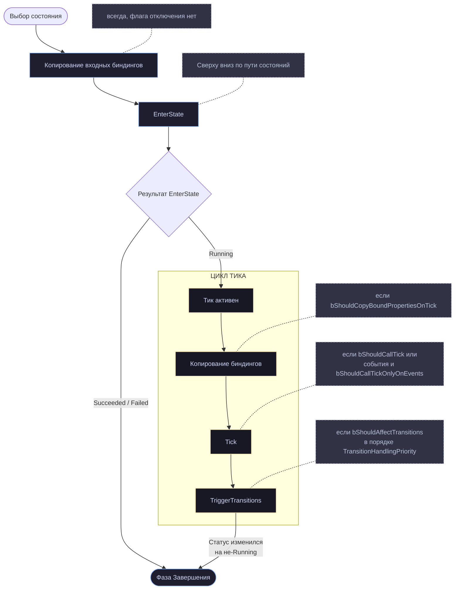

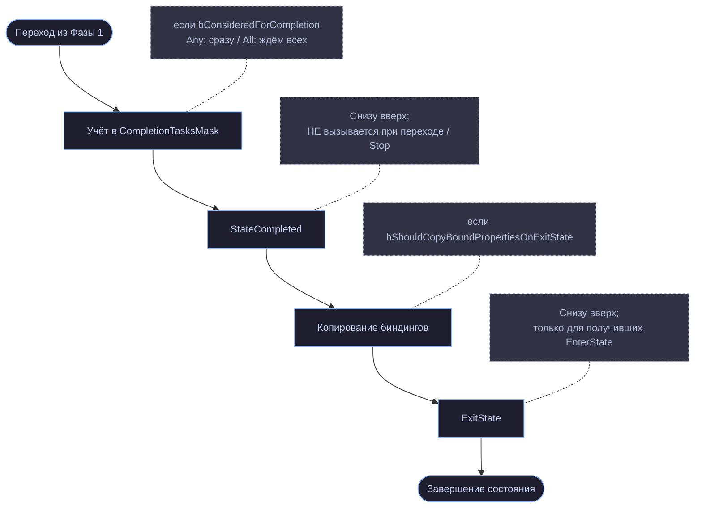

### 8.11. Восемь типичных ошибок

**1. Изменяемое состояние в полях задачи.**

cpp

```cpp
// НЕПРАВИЛЬНО:
struct FMyTask : public FStateTreeTaskCommonBase
{
    mutable float Timer = 0.0f;    // общий для ВСЕХ акторов!
};
```

Компилятор пропустит (методы `const`, поле `mutable`), а сотня NPC будет писать в одну переменную. Всё изменяемое — в instance data.

**2. Очистка ресурсов в `StateCompleted` вместо `ExitState`.**

`StateCompleted` не вызывается при прерывании состояния. Освобождайте в `ExitState`.

**3. Отсутствие проверки в `ExitState`.**

`EnterState` мог упасть до захвата. Всегда проверяйте, что ресурс есть, прежде чем его освобождать.

**4. Ожидание свежих биндингов при выключенном копировании.**

cpp

```cpp
FMyTask()
{
    bShouldCopyBoundPropertiesOnTick = false;
}

EStateTreeRunStatus FMyTask::Tick(FStateTreeExecutionContext& Context, const float DeltaTime) const
{
    const FInstanceDataType& Data = Context.GetInstanceData(*this);
    MoveTo(Data.TargetLocation);   // ← значение с момента EnterState, цель давно ушла
}
```

**5. Хранение указателя на instance data.**

cpp

```cpp
// НЕПРАВИЛЬНО — буфер переедет при смене состояний:
Data.CachedPtr = &Context.GetInstanceData(*this);
```

Для колбэков — только `Context.GetInstanceDataStructRef(*this)` (глава 6).

**6. `DeltaTime` считается временем кадра.**

При scheduled tick это не так. Если нужен именно кадр — берите у мира.

**7. Мгновенная задача с включённым тиком.**

Задача, вся работа которой в `EnterState`, но с `bShouldCallTick = true` по умолчанию, заставляет состояние тикать впустую и мешает дереву спать. Выключайте.

**8. Фоновая задача, завершающая состояние.**

Задача «играть эмбиент» вернула `Succeeded` — и состояние закончилось. Ставьте `bConsideredForCompletion = false`.

### 8.12. Три готовых шаблона

**Мгновенное действие:**

cpp

```cpp
FInstantTask()
{
    bShouldCallTick = false;
    bShouldCallTickOnlyOnEvents = false;
}

EStateTreeRunStatus FInstantTask::EnterState(FStateTreeExecutionContext& Context,
                                             const FStateTreeTransitionResult& Transition) const
{
    DoTheThing(Context.GetInstanceData(*this));
    return EStateTreeRunStatus::Succeeded;
}
```

**Длящееся действие с ресурсом:**

cpp

```cpp
FDurationTask()
{
    bShouldCallTick = true;
    bShouldCopyBoundPropertiesOnTick = false;
    bShouldCopyBoundPropertiesOnExitState = false;
    bShouldStateChangeOnReselect = true;    // перезапускать при переактивации
}

EStateTreeRunStatus FDurationTask::EnterState(FStateTreeExecutionContext& Context,
                                              const FStateTreeTransitionResult& Transition) const
{
    FInstanceDataType& Data = Context.GetInstanceData(*this);
    Data.Elapsed = 0.0f;
    Data.Montage = PlayMontage(Data.Anim);
    return Data.Montage ? EStateTreeRunStatus::Running : EStateTreeRunStatus::Failed;
}

EStateTreeRunStatus FDurationTask::Tick(FStateTreeExecutionContext& Context, const float DeltaTime) const
{
    FInstanceDataType& Data = Context.GetInstanceData(*this);
    Data.Elapsed += DeltaTime;
    return Data.Elapsed >= Data.Duration ? EStateTreeRunStatus::Succeeded : EStateTreeRunStatus::Running;
}

void FDurationTask::ExitState(FStateTreeExecutionContext& Context,
                              const FStateTreeTransitionResult& Transition) const
{
    FInstanceDataType& Data = Context.GetInstanceData(*this);
    if (Data.Montage) { StopMontage(Data.Montage); Data.Montage = nullptr; }
}
```

**Фоновое удержание ресурса (на родительском состоянии):**

cpp

```cpp
FHoldResourceTask()
{
    bShouldCallTick = false;
    bShouldStateChangeOnReselect = false;    // не перезахватывать при смене детей
#if WITH_EDITORONLY_DATA
    bConsideredForCompletion = false;        // не завершать состояние
    bCanEditConsideredForCompletion = false;
#endif
}
```

---

## Глава 9. Условия и логические выражения

Условие — это функция, возвращающая `bool`. Казалось бы, простейший из четырёх видов узлов. Но именно с условиями связаны два самых неочевидных механизма StateTree: разделяемая instance data и построение логических выражений через два маленьких поля.

### 9.1. `TestCondition` и где условия применяются

cpp

```cpp
USTRUCT(meta = (Hidden))
struct FStateTreeConditionBase : public FStateTreeNodeBase
{
    GENERATED_BODY()

    /** @return True if the condition passes. */
    virtual bool TestCondition(FStateTreeExecutionContext& Context) const { return false; }
```

Значение по умолчанию — `false`. Не переопределили — условие всегда проваливается. Разумный выбор: молчаливое «всегда true» приводило бы к состояниям, в которые входят всегда, и искать причину было бы тяжело.

Условия используются в четырёх местах:

| Место                     | Поле в скомпилированных данных                     | Когда проверяется                 |
| ------------------------- | -------------------------------------------------- | --------------------------------- |
| Условия входа в состояние | `FCompactStateTreeState::EnterConditionsBegin/Num` | фаза `EnterConditions` при выборе |
| Условия перехода          | `FCompactStateTransition::ConditionsBegin/Num`     | фаза `TransitionConditions`       |
| Внутри property-функций   | через биндинги                                     | при вычислении биндинга           |
| Considerations (косвенно) | `UtilityConsiderationsBegin/Num`                   | фаза `EvaluateUtility`            |

Обратите внимание: контекст передаётся **неконстантный** (`FStateTreeExecutionContext&`). Это не разрешение что-то менять — это следствие того, что доступ к данным через контекст технически требует неконстантных операций. Менять ничего нельзя, и сейчас мы разберём почему.

### 9.2. Разделяемые данные — главное ограничение условий

Комментарии в `FStateTreeConditionBase` повторяют одно и то же предупреждение трижды, у каждого из трёх методов жизненного цикла:

> _«Note: The condition instance data is shared between all the uses a State Tree asset. You should not modify the instance data in this callback.»_

Мы уже разобрали механику в главах 3, 4 и 6, соберём её здесь целиком:

1. `FStateTreeNodeBase::InstanceTemplateIndex` для условия указывает в `UStateTree::SharedInstanceData`, а не в `DefaultInstanceData` (глава 7).
2. `SharedInstanceData` — это **живая память**, а не шаблон. Она не копируется на экземпляр (глава 4).
3. Доступ к ней идёт через `UStateTree::GetSharedInstanceData()`, который возвращает **per-thread копию** под RW-локом (глава 4).

Итого: instance data условия — одна на все экземпляры дерева внутри потока. Сто NPC с одним деревом видят одну и ту же память.

Почему так сделано: условия вычисляются часто и живут мгновение. Заводить на каждое условие каждого NPC отдельный блок памяти — расточительно, если условие всё равно только читает входные значения и возвращает ответ.

**Что это значит для вас практически:**

cpp

```cpp
// НЕПРАВИЛЬНО:
bool FMyCondition::TestCondition(FStateTreeExecutionContext& Context) const
{
    FInstanceDataType& Data = Context.GetInstanceData(*this);
    Data.CallCount++;                    // ← пишем в общую память
    return Data.CallCount > 5;           // ← и результат зависит от других акторов
}

// ПРАВИЛЬНО:
bool FMyCondition::TestCondition(FStateTreeExecutionContext& Context) const
{
    const FInstanceDataType& Data = Context.GetInstanceData(*this);   // const!
    return Data.Left < Data.Right;
}
```

Берите ссылку **константной** — компилятор поможет не ошибиться.

Единственное исключение: непосредственно перед `TestCondition` в instance data копируются входные биндинги — то есть `Left`, `Right` и прочие входы заполняются актуальными значениями для текущего вычисления. Это делает движок, и в пределах одного вычисления данные корректны.

### 9.3. Evaluation scope — приватные данные для условий

В `FCompactStateTreeState` и `FCompactStateTransition` есть поля, о которых мы упоминали вскользь:

cpp

```cpp
UE::StateTree::InstanceData::FEvaluationScopeMemoryRequirement EnterConditionEvaluationScopeMemoryRequirement;
UE::StateTree::InstanceData::FEvaluationScopeMemoryRequirement ConditionEvaluationScopeMemoryRequirement;
```

cpp

```cpp
namespace UE::StateTree::InstanceData
{
    /** The memory requirement for the container allocation. */
    struct FEvaluationScopeMemoryRequirement
    {
        int32 Size = 0;
        int32 Alignment = 0;
        int32 NumberOfElements = 0;
        bool HasMemory() const { return Size > 0; }
    };
}
```

Плюс два источника данных из `EStateTreeDataSourceType` (глава 3):

cpp

```cpp
EvaluationScopeInstanceData,
EvaluationScopeInstanceDataObject,
```

Плюс контейнер в ассете: `UStateTree::DefaultEvaluationScopeInstanceData`.

Это **альтернативный механизм хранения данных для условий**: вместо разделяемой памяти данные создаются на стеке (точнее, в заранее просчитанном буфере) на время одного вычисления и уничтожаются. Компилятор считает, сколько памяти нужно в худшем случае для набора условий состояния или перехода, — отсюда `Size`/`Alignment`/`NumberOfElements`.

Комментарий к `DefaultEvaluationScopeInstanceData` в `UStateTree`:

cpp

```cpp
/** Default node instance data for evaluation scope (e.g. conditions, considerations, functions) */
```

То есть механизм применяется к условиям, considerations и property-функциям — ко всему, что вычисляется «на месте».

Оговорка: точные правила выбора между shared и evaluation scope (что решает компилятор, можно ли повлиять из кода узла) в заголовках не описаны — это в компиляторе, которого у нас нет. Из структуры данных ясно, что механизм существует, где хранятся шаблоны и как считается память. Если вам нужны приватные данные в условии, начните с проверки в своей версии движка, попадает ли ваш тип в evaluation scope.

Практическая рекомендация остаётся прежней и безопасной для любой версии: **пишите условия без состояния**. Условие получает входы через биндинги и возвращает ответ.

### 9.4. Неожиданное: у условий есть жизненный цикл

cpp

```cpp
virtual void EnterState(FStateTreeExecutionContext& Context, const FStateTreeTransitionResult& Transition) const {}
virtual void ExitState(FStateTreeExecutionContext& Context, const FStateTreeTransitionResult& Transition) const {}
virtual void StateCompleted(FStateTreeExecutionContext& Context, const EStateTreeRunStatus CompletionStatus,
                            const FStateTreeActiveStates& CompletedActiveStates) const {}

/** If set to true, EnterState, ExitState, and StateCompleted are called on the condition. */
uint8 bHasShouldCallStateChangeEvents : 1 = false;

/**
 * If set to true, the condition will receive EnterState/ExitState even if the state was previously active.
 * Default value is true.
 */
uint8 bShouldStateChangeOnReselect : 1 = true;
```

Условие может получать те же уведомления жизненного цикла, что и задача. По умолчанию выключено (`bHasShouldCallStateChangeEvents = false`), включается в конструкторе.

Соответствующий кэш-флаг в состоянии мы видели в главе 3:

cpp

```cpp
uint8 bHasStateChangeConditions : 1;    // есть условия с bHasShouldCallStateChangeEvents
```

**Зачем это нужно, если условию нельзя хранить состояние?**

Потому что не всякий побочный эффект — это состояние. Основной сценарий — **подписка на внешние источники**. Условие «дверь открыта» может подписаться на делегат двери при входе в состояние и отписаться при выходе, чтобы вместо опроса каждый тик реагировать на изменение:

cpp

```cpp
struct FDoorOpenCondition : public FStateTreeConditionCommonBase
{
    GENERATED_BODY()

    FDoorOpenCondition()
    {
        bHasShouldCallStateChangeEvents = true;
        bShouldStateChangeOnReselect = false;   // при переактивации не переподписываться
    }

    virtual void EnterState(FStateTreeExecutionContext& Context,
                            const FStateTreeTransitionResult& Transition) const override;
    virtual void ExitState(FStateTreeExecutionContext& Context,
                           const FStateTreeTransitionResult& Transition) const override;
    virtual bool TestCondition(FStateTreeExecutionContext& Context) const override;
};
```

При этом подписка **не может** храниться в instance data условия (она общая). Хранить её надо там, где она принадлежит — в самом объекте двери, в подсистеме, или через `Context.BindDelegate()` (глава 15), который сам управляет временем жизни подписки по `FrameID`/`StateID`.

Это тонкий инструмент. Если вы не уверены, что он вам нужен, — он вам не нужен. Стандартные условия в `StateTreeCommonConditions.h` его не используют вовсе.

### 9.5. Логические выражения: два поля вместо дерева

cpp

```cpp
UPROPERTY() EStateTreeExpressionOperand Operand = EStateTreeExpressionOperand::And;
UPROPERTY() int8 DeltaIndent = 0;
```

Вот как StateTree выражает произвольные логические формулы, не строя дерево выражений: **плоским списком условий, у каждого из которых есть операнд и изменение отступа**.

cpp

```cpp
UENUM()
enum class EStateTreeExpressionOperand : uint8
{
    /** Copy result */
    Copy UMETA(Hidden),

    /** Combine results with AND for Condition, Min(a, b) for Consideration */
    And,

    /** Combine results with OR for Condition, Max(a, b) for Consideration */
    Or,

    /** Combine results with (a * b) for Consideration, not applicable for Condition */
    Multiply,
};
```

Одно перечисление обслуживает и условия, и considerations, с разной семантикой:

|Операнд|Условие (bool)|Consideration (float)|
|---|---|---|
|`Copy`|результат первого элемента|то же|
|`And`|`a && b`|`Min(a, b)`|
|`Or`|`a \| b`|`Max(a, b)`|
|`Multiply`|**не применимо**|`a * b`|

`Copy` помечен `UMETA(Hidden)` — он не выбирается пользователем, а автоматически ставится первому элементу списка (сочетать не с чем).

#### Как работает `DeltaIndent`

`DeltaIndent` — это **изменение уровня вложенности скобок**, задаваемое условием:

- `+1` — открыть скобку перед этим условием;
- `-1` — закрыть скобку после него;
- `0` — остаться на текущем уровне.

Пример. Формула:

```
A && (B || C) && D
```

Список условий:

|#|Условие|Operand|DeltaIndent|
|---|---|---|---|
|0|A|`Copy`|0|
|1|B|`And`|**+1**|
|2|C|`Or`|**−1**|
|3|D|`And`|0|

Условие B открывает скобку (`+1`), C её закрывает (`−1`). Между ними действует `Or`, а вся группа присоединяется к A по `And` (операнд первого элемента группы).

Более сложный пример:

```
(A || B) && (C || (D && E))
```

|#|Условие|Operand|DeltaIndent|
|---|---|---|---|
|0|A|`Copy`|+1|
|1|B|`Or`|−1|
|2|C|`And`|+1|
|3|D|`Or`|+1|
|4|E|`And`|−2|

Обратите внимание на `−2` у последнего: закрываются сразу две скобки. Отсюда и тип `int8`, а не `bool` — значение может быть больше единицы по модулю.

#### Лимит вложенности

Из главы 3:

cpp

```cpp
inline constexpr int32 MaxExpressionIndent = 4;
```

Четыре уровня скобок. Реализация (в `.cpp`) — стековая машина с массивом промежуточных результатов фиксированного размера; отсюда и константа.

На практике это не ограничение, а подсказка: формула с пятью уровнями вложенности нечитаема. Разбейте её на несколько состояний или вынесите часть в отдельное условие.

#### Ленивое вычисление

В заголовках это не оговорено (реализация в `.cpp`), но структура данных допускает короткое замыкание: при `And`, если левая часть уже `false`, правую можно не вычислять. Проектируйте условия так, чтобы это было безопасно: **не полагайтесь на то, что ваше условие будет вызвано**. Побочные эффекты в `TestCondition` — плохая идея не только из-за shared data, но и потому, что вызова может не быть.

### 9.6. `EvaluationMode` — отладочное закорачивание

cpp

```cpp
UPROPERTY()
EStateTreeConditionEvaluationMode EvaluationMode = EStateTreeConditionEvaluationMode::Evaluated;
```

cpp

```cpp
enum class EStateTreeConditionEvaluationMode : uint8
{
    /** Condition is evaluated normally. */
    Evaluated,
    /** Condition is not evaluated and is considered as passing. */
    ForcedTrue,
    /** Condition is not evaluated and is considered as failing. */
    ForcedFalse,
};
```

Настраивается в редакторе, работает и в рантайме (это `UPROPERTY`, попадает в скомпилированные данные). Инструмент отладки: «допустим, эта проверка проходит — что дальше?». Не удаляя условие и не теряя его настройки.

Важно: **`ForcedTrue`/`ForcedFalse` попадают в собранную игру**, если вы забыли их вернуть. Проверяйте перед релизом.

### 9.7. `StateTreeCommonConditions.h` — шесть встроенных условий

Теперь разберём файл целиком. Он небольшой и очень показательный: это эталонные реализации, на которые стоит равняться.

#### Общий шаблон

Все шесть условий следуют одному образцу:

cpp

```cpp
// 1. Instance data — отдельная структура
USTRUCT()
struct FStateTreeCompareIntConditionInstanceData
{
    GENERATED_BODY()

    UPROPERTY(EditAnywhere, Category = "Input")
    int32 Left = 0;

    UPROPERTY(EditAnywhere, Category = "Parameter")
    int32 Right = 0;
};
UE_STATETREE_ZEROED_TRIVIALLY_COPIED_NO_DESTRUCTOR_INSTANCEDATA(FStateTreeCompareIntConditionInstanceData);

// 2. Само условие
USTRUCT(DisplayName = "Integer Compare")
struct FStateTreeCompareIntCondition : public FStateTreeConditionCommonBase
{
    GENERATED_BODY()

    using FInstanceDataType = FStateTreeCompareIntConditionInstanceData;

    virtual const UStruct* GetInstanceDataType() const override { return FInstanceDataType::StaticStruct(); }
    UE_API virtual bool TestCondition(FStateTreeExecutionContext& Context) const override;
#if WITH_EDITOR
    UE_API virtual FText GetDescription(...) const override;
#endif

    UPROPERTY(EditAnywhere, Category = "Parameter")
    bool bInvert = false;

    UE::StateTree::EComparisonOperator Operator = UE::StateTree::EComparisonOperator::Equal;
};
```

Пять приёмов, которые стоит скопировать:

1. **`Left` — категория `Input`, `Right` — категория `Parameter`.** Левый операнд предполагается забинденным (это значение из мира), правый — заданным вручную (это порог сравнения). Мы разбирали `EStateTreePropertyUsage` в главе 3; здесь видно применение.
2. **`bInvert` — поле узла, не instance data.** Инверсия — это конфигурация условия, она не меняется в рантайме и не биндится. Экономия памяти на каждом экземпляре.
3. **`Operator` — тоже поле узла.** По той же причине.
4. **`DisplayName` в `USTRUCT`** — понятное имя в редакторе («Integer Compare» вместо `FStateTreeCompareIntCondition`).
5. **Макрос instance data** — и здесь можно проверить понимание из главы 2: у `FStateTreeCompareIntConditionInstanceData` все поля инициализированы нулём, поэтому `ZEROED`. У `FStateTreeRandomConditionInstanceData` поле `Threshold = 0.5f` — и там уже `CONSTRUCTED`. Авторы движка последовательны; будьте последовательны и вы.

#### Два конструктора: обычный и «инвертирующий»

cpp

```cpp
FStateTreeCompareIntCondition() = default;

explicit FStateTreeCompareIntCondition(const UE::StateTree::EComparisonOperator InOperator,
                                       const EStateTreeCompare InInverts = EStateTreeCompare::Default)
    : bInvert(InInverts == EStateTreeCompare::Invert)
    , Operator(InOperator)
{}
```

Где `EStateTreeCompare` — крошечное перечисление из `StateTreeConditionBase.h`:

cpp

```cpp
enum class EStateTreeCompare : uint8
{
    Default,
    Invert,
};
```

Зачем отдельный тип вместо `bool`? Читаемость на месте вызова. Сравните:

cpp

```cpp
FStateTreeCompareIntCondition(EComparisonOperator::Less, true);                    // true — это что?
FStateTreeCompareIntCondition(EComparisonOperator::Less, EStateTreeCompare::Invert); // понятно
```

Приём «именованный bool» — хорошая практика в целом, не только в StateTree.

Конструкторы с параметрами нужны для создания условий **из кода** (тесты, процедурная генерация деревьев), а не из редактора.

#### Миграция `EGenericAICheck` → `EComparisonOperator`

В четырёх из шести условий есть парные объявления:

cpp

```cpp
UE_DEPRECATED(5.8, "Use EComparisonOperator instead.")
UE_API explicit FStateTreeCompareIntCondition(const EGenericAICheck InOperator,
                                              const EStateTreeCompare InInverts = EStateTreeCompare::Default);

UE_DEPRECATED_FORGAME(5.8, "The Operator type changed from EGenericAICheck to EComparisonOperator.")
UPROPERTY(EditAnywhere, Category = "Parameter", meta = (InvalidEnumValues = "IsTrue"))
UE::StateTree::EComparisonOperator Operator = UE::StateTree::EComparisonOperator::Equal;
```

Три детали.

**`UE_DEPRECATED_FORGAME` вместо `UE_DEPRECATED`.** Разница: обычный вариант выдаёт предупреждение всем, `_FORGAME` — только игровому коду, но не самому движку. Применяется, когда движок ещё внутренне использует поле, но игровой код уже должен переходить. Здесь: поле `Operator` осталось, но **сменило тип**, и код, присваивавший ему `EGenericAICheck`, сломается.

**`meta = (InvalidEnumValues = "IsTrue")`.** В `EComparisonOperator` (глава 3) шесть значений: `Less`, `LessOrEqual`, `Equal`, `NotEqual`, `GreaterOrEqual`, `Greater`. Значения `IsTrue` там нет — оно было в старом `EGenericAICheck`. Метадата убирает его из выпадающего списка на случай, если старые данные его содержат.

**Смысл миграции — отвязка от AIModule.** Заголовок начинается с:

cpp

```cpp
#if UE_ENABLE_INCLUDE_ORDER_DEPRECATED_IN_5_8
#include "AITypes.h"
#endif
```

`EGenericAICheck` живёт в `AITypes.h`, то есть базовые условия сравнения чисел тянули за собой зависимость от AI-модуля. Теперь `EComparisonOperator` объявлен в `StateTreeTypes.h`, и StateTree стал ещё чуть менее «про AI». Инклюд `AITypes.h` оставлен под макросом обратной совместимости порядка включений.

#### Шесть условий

|Условие|`DisplayName`|Instance data|Особенности|
|---|---|---|---|
|`FStateTreeCompareIntCondition`|Integer Compare|`int32 Left`, `int32 Right`|`Operator`, `bInvert`|
|`FStateTreeCompareFloatCondition`|Float Compare|`double Left`, `double Right`|то же; **`double`, не `float`**|
|`FStateTreeCompareBoolCondition`|Bool Compare|`bool bLeft`, `bool bRight`|только `bInvert`, оператора нет|
|`FStateTreeCompareEnumCondition`|Enum Compare|`FStateTreeAnyEnum Left/Right`|`OnBindingChanged`|
|`FStateTreeCompareDistanceCondition`|Distance Compare|`FVector Source/Target`, `double Distance`|категория `"Condition"` вместо `"Parameter"`|
|`FStateTreeRandomCondition`|Random|`float Threshold` (0..1)|`CONSTRUCTED`-макрос|

Наблюдения:

**`double`, а не `float`** в сравнении чисел с плавающей точкой и в дистанции. UE5 перешёл на double-точность для координат; условия следуют этому. Ваши биндинги к `float`-свойствам будут расширяться автоматически.

**У `FStateTreeCompareBoolCondition` нет оператора** — для булевых значений «равно» единственная осмысленная операция, а «не равно» даёт `bInvert`.

**У `FStateTreeCompareDistanceCondition` категория `"Condition"`** для `bInvert` и `Operator`, тогда как у остальных — `"Parameter"`. Мелкая непоследовательность в самом движке; на функциональность не влияет (`Condition` не входит в `EStateTreePropertyUsage`, значит трактуется как обычная категория), но показывает, что и в эталонном коде есть шероховатости.

**`FStateTreeRandomCondition` с ограничениями в метадате:**

cpp

```cpp
UPROPERTY(EditAnywhere, Category = "Parameter",
          meta = (ClampMin = "0.0", ClampMax = "1.0", UIMin = "0.0", UIMax = "1.0"))
float Threshold = 0.5f;
```

`ClampMin/Max` ограничивают значение жёстко (нельзя ввести вручную), `UIMin/Max` — диапазон слайдера. Обе пары обычно ставят вместе.

Условие использует `FRandomStream` из `FStateTreeExecutionState` (глава 5) — значит результат воспроизводим при заданном seed, что важно для тестов и реплеев.

#### `FStateTreeAnyEnum` и `OnBindingChanged`

Единственное условие с редакторским хуком:

cpp

```cpp
USTRUCT()
struct FStateTreeCompareEnumConditionInstanceData
{
    GENERATED_BODY()

    UPROPERTY(EditAnywhere, Category = "Input", meta=(AllowAnyBinding))
    FStateTreeAnyEnum Left;

    UPROPERTY(EditAnywhere, Category = "Parameter")
    FStateTreeAnyEnum Right;
};
UE_STATETREE_CONSTRUCTED_TRIVIALLY_COPIED_NO_DESTRUCTOR_INSTANCEDATA(FStateTreeCompareEnumConditionInstanceData);
```

cpp

```cpp
#if WITH_EDITOR
UE_API virtual void OnBindingChanged(const FGuid& ID, FStateTreeDataView InstanceData,
    const FPropertyBindingPath& SourcePath, const FPropertyBindingPath& TargetPath,
    const IStateTreeBindingLookup& BindingLookup) override;
#endif
```

Задача: сравнить два значения enum'а, тип которого заранее неизвестен. `FStateTreeAnyEnum` (из `StateTreeAnyEnum.h`, не в нашем пакете) — контейнер «любое enum-значение», хранящий и тип, и значение.

`meta=(AllowAnyBinding)` на `Left` разрешает привязку к свойству любого типа — иначе система биндингов потребовала бы точного совпадения.

`OnBindingChanged` (глава 7) реагирует: когда пользователь привязал `Left` к конкретному enum'у, условие подхватывает его тип и настраивает `Right`, чтобы в выпадающем списке были значения того же типа. Без этого можно было бы сравнивать значения разных enum'ов — бессмысленно и незаметно.

Это лучший пример в исходниках того, зачем `OnBindingChanged` существует. Если в вашем узле тип одного свойства зависит от биндинга другого — вам сюда.

### 9.8. Шаблон своего условия

cpp

```cpp
USTRUCT()
struct FMyLineOfSightConditionInstanceData
{
    GENERATED_BODY()

    /** Забинденный наблюдатель. */
    UPROPERTY(EditAnywhere, Category = "Input")
    TObjectPtr<AActor> Observer = nullptr;

    /** Забинденная цель. */
    UPROPERTY(EditAnywhere, Category = "Input")
    TObjectPtr<AActor> Target = nullptr;

    /** Максимальная дистанция проверки. */
    UPROPERTY(EditAnywhere, Category = "Parameter", meta = (ClampMin = "0.0", Units = "cm"))
    double MaxDistance = 5000.0;
};
// TObjectPtr → макрос НЕ ставим

USTRUCT(DisplayName = "Has Line Of Sight", meta = (Category = "Perception"))
struct FMyLineOfSightCondition : public FStateTreeConditionCommonBase
{
    GENERATED_BODY()

    using FInstanceDataType = FMyLineOfSightConditionInstanceData;

    FMyLineOfSightCondition() = default;
    explicit FMyLineOfSightCondition(const EStateTreeCompare InInverts)
        : bInvert(InInverts == EStateTreeCompare::Invert)
    {}

    virtual const UStruct* GetInstanceDataType() const override
    { return FInstanceDataType::StaticStruct(); }

    virtual bool Link(FStateTreeLinker& Linker) override
    {
        Linker.LinkExternalData(WorldHandle);
        return true;
    }

    virtual bool TestCondition(FStateTreeExecutionContext& Context) const override
    {
        const FInstanceDataType& Data = Context.GetInstanceData(*this);   // ← const
        const UWorld& World = Context.GetExternalData(WorldHandle);

        bool bResult = false;
        if (Data.Observer && Data.Target)
        {
            const FVector From = Data.Observer->GetActorLocation();
            const FVector To = Data.Target->GetActorLocation();

            if (FVector::DistSquared(From, To) <= FMath::Square(Data.MaxDistance))
            {
                FHitResult Hit;
                bResult = !World.LineTraceSingleByChannel(Hit, From, To, ECC_Visibility);
            }
        }
        return bResult ^ bInvert;
    }

#if WITH_EDITOR
    virtual FText GetDescription(const FGuid& ID, FStateTreeDataView InstanceDataView,
                                 const IStateTreeBindingLookup& BindingLookup,
                                 EStateTreeNodeFormatting Formatting = EStateTreeNodeFormatting::Text) const override
    {
        const bool bRich = (Formatting == EStateTreeNodeFormatting::RichText);
        const FPropertyBindingPath TargetPath(ID, GET_MEMBER_NAME_CHECKED(FInstanceDataType, Target));
        const FText TargetText = BindingLookup.GetBindingSourceDisplayName(TargetPath, Formatting);

        return FText::Format(
            bRich ? NSLOCTEXT("MyModule", "LosRich",  "{0}<s>видит</> {1}")
                  : NSLOCTEXT("MyModule", "LosPlain", "{0}видит {1}"),
            bInvert ? NSLOCTEXT("MyModule", "Not", "не ") : FText::GetEmpty(),
            TargetText);
    }
#endif

    UPROPERTY(EditAnywhere, Category = "Parameter")
    bool bInvert = false;

    TStateTreeExternalDataHandle<UWorld> WorldHandle;
};
```

Обратите внимание на `bResult ^ bInvert` — идиома применения инверсии через XOR, компактнее, чем ветвление.

### 9.9. Про Considerations — что известно из имеющихся файлов

Базового класса considerations в нашем пакете нет, поэтому — только то, что достоверно следует из других файлов:

- В `EStateTreeBindableStructSource` есть значение `Consideration` — они участвуют в биндингах наравне с задачами и условиями.
- В `FCompactStateTreeState` есть `UtilityConsiderationsBegin/Num` и `float Weight` — они привязаны к состоянию и имеют вес.
- В `EStateTreeUpdatePhase` есть `EvaluateUtility` — отдельная фаза вычисления.
- В `EStateTreeExpressionOperand` семантика для considerations: `And` = `Min`, `Or` = `Max`, `Multiply` = произведение. То есть они комбинируются в выражения **так же, как условия**, но арифметически.
- В `UStateTreeSchema` есть `AllowUtilityConsiderations()` — схема может их запретить.
- Работают только при `SelectionBehavior` из utility-семейства (`IsSelectionBehaviorUsingUtility`, глава 3).
- Их данные — в `SharedInstanceData` / evaluation scope, вместе с условиями.

Из этого складывается модель: consideration возвращает число, набор considerations состояния комбинируется по тем же правилам вложенности, результат нормализуется и умножается на `Weight`, а родитель выбирает ребёнка с максимальным значением или случайно с вероятностью, пропорциональной значению.

Точный контракт базового класса (имя метода, диапазон возвращаемого значения, правила нормализации) я сознательно не реконструирую — загрузите `StateTreeConsiderationBase.h` из своей версии движка, и мы разберём его отдельно.

### 9.10. Выводы

1. **Условие не имеет приватного состояния.** Instance data разделяется между всеми экземплярами. Берите её `const`.
2. **Не рассчитывайте, что условие будет вызвано** — короткое замыкание в выражении может его пропустить. Никаких побочных эффектов.
3. **Категории `Input`/`Parameter`** — не косметика: они определяют, требует ли компилятор биндинг.
4. **Конфигурация — в полях узла** (`bInvert`, `Operator`), данные — в instance data. Экономит память на каждом экземпляре.
5. **Выражения строятся через `Operand` + `DeltaIndent`**, глубина до четырёх уровней. Больше — признак того, что логику пора разбить.
6. **`EvaluationMode` — отладочный инструмент**, попадающий в релиз. Проверяйте перед сборкой.
7. **`bHasShouldCallStateChangeEvents`** — редкая возможность подписаться/отписаться, а не хранить состояние.
8. **`OnBindingChanged`** — когда тип одного свойства зависит от биндинга другого (эталон: `FStateTreeCompareEnumCondition`).

---

## Глава 10. Оценщики: `FStateTreeEvaluatorBase`

Самый маленький базовый класс во всём StateTree — шестьдесят одна строка вместе с лицензией и инклюдами. Но роль у него отдельная, и путаница «evaluator или глобальная задача?» — один из частых вопросов новичков.

Комментарий задаёт назначение точно:

> _«Base struct of StateTree Evaluators. Evaluators calculate and expose data to be used for decision making in a StateTree.»_

Два глагола: **вычисляют** и **публикуют**. Evaluator ничего не делает с миром — он готовит данные, на основании которых принимают решения условия, переходы и задачи.

### 10.1. Весь интерфейс

cpp

```cpp
USTRUCT(meta = (Hidden))
struct FStateTreeEvaluatorBase : public FStateTreeNodeBase
{
    GENERATED_BODY()

    /** Called when StateTree is started. */
    virtual void TreeStart(FStateTreeExecutionContext& Context) const {}

    /** Called when StateTree is stopped. */
    virtual void TreeStop(FStateTreeExecutionContext& Context) const {}

    /**
     * Called each frame to update the evaluator.
     * @param DeltaTime Time since last StateTree tick, or 0 if called during preselection.
     */
    virtual void Tick(FStateTreeExecutionContext& Context, const float DeltaTime) const {}

#if WITH_GAMEPLAY_DEBUGGER
    UE_API virtual FString GetDebugInfo(const FStateTreeReadOnlyExecutionContext& Context) const;

    UE_DEPRECATED(5.8, "Use the version with the FStateTreeReadOnlyExecutionContext.")
    virtual void AppendDebugInfoString(FString& DebugString, const FStateTreeExecutionContext& Context) const final
    {
    }
#endif
};

USTRUCT(Meta=(Hidden))
struct FStateTreeEvaluatorCommonBase : public FStateTreeEvaluatorBase
{
    GENERATED_BODY()
};
```

Три метода, ни один ничего не возвращает. Это принципиально: evaluator не может завершить состояние, не может запросить переход возвратом значения, не влияет на управление потоком. Он только считает.

(Через контекст он технически может вызвать `RequestTransition` — но это выход за рамки его роли; для такого поведения есть глобальные задачи.)

Пара `Base` / `CommonBase` — та же, что у задач и условий (глава 8): наследуйтесь от `FStateTreeEvaluatorCommonBase`, чтобы узел был виден в обычных схемах.

### 10.2. Evaluators глобальны

Это ключевое свойство, и оно не всегда было таким. В истории версий из главы 4 есть запись:

cpp

```cpp
// Added GlobalEvaluators
GlobalEvaluators,
```

Раньше evaluators привязывались к состояниям — как задачи. Теперь они живут на уровне дерева, в начале массива `Nodes`:

cpp

```cpp
const uint16 GetGlobalEvaluatorsBegin() const { return EvaluatorsBegin; }
const uint16 GetGlobalEvaluatorsNum() const { return EvaluatorsNum; }
```

Практические следствия:

- Evaluator **работает всё время**, пока дерево запущено, независимо от активного пути состояний.
- Его данные доступны для биндингов **из любого места** дерева.
- Его instance data живёт в `GlobalInstanceData` (источник `EStateTreeDataSourceType::GlobalInstanceData`), а не в `ActiveInstanceData`.
- Он тикает **до** задач состояний (фаза `TickingGlobalTasks` предшествует `TickingTasks`, глава 5).

Последнее важно: к моменту, когда задачи и условия начнут работать, данные evaluator'ов уже обновлены в этом кадре.

### 10.3. Жизненный цикл

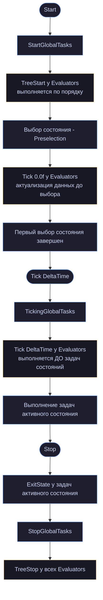
#### Тонкость с `DeltaTime == 0`

Комментарий к `Tick` говорит: _«Time since last StateTree tick, or 0 if called during preselection»_.

«Preselection» — это ситуация, когда движку нужны свежие данные evaluator'ов **до** обычного тика: например, при выборе состояния, где условия входа завязаны на публикуемые evaluator'ом значения. Тогда `Tick` вызывается вне обычного цикла, с нулевым временем.

Отсюда обязательное правило:

cpp

```cpp
void FMyEvaluator::Tick(FStateTreeExecutionContext& Context, const float DeltaTime) const
{
    FInstanceDataType& Data = Context.GetInstanceData(*this);

    // НЕПРАВИЛЬНО: при DeltaTime == 0 таймер не идёт, а вызов "съедается"
    Data.Timer += DeltaTime;
    if (Data.Timer >= Data.Interval)
    {
        Data.Timer = 0.0f;
        Recalculate(Data);
    }

    // Дополнительно: вызов с нулём может прийти несколько раз за кадр
}
```

Вычисление в evaluator'е должно быть **идемпотентным**: повторный вызов с тем же состоянием мира даёт тот же результат, и лишний вызов ничего не ломает. Если вам нужен throttling по времени, опирайтесь на абсолютное время мира, а не на накопление `DeltaTime`:

cpp

```cpp
void FMyEvaluator::Tick(FStateTreeExecutionContext& Context, const float DeltaTime) const
{
    FInstanceDataType& Data = Context.GetInstanceData(*this);
    const UWorld& World = Context.GetExternalData(WorldHandle);
    const double Now = World.GetTimeSeconds();

    if (Now - Data.LastUpdateTime >= Data.UpdateInterval)
    {
        Data.LastUpdateTime = Now;
        Data.Result = DoExpensiveQuery();
    }
    // Data.Result всегда актуален настолько, насколько позволяет интервал
}
```

### 10.4. Evaluator или глобальная задача?

Оба живут глобально, оба тикают в одной фазе, оба имеют instance data в `GlobalInstanceData`. Разница — в контракте.

| **Параметр**               | **Evaluator (Оценщик)**                                         | **Задача (Task)**                                                                                                                         |
| -------------------------- | --------------------------------------------------------------- | ----------------------------------------------------------------------------------------------------------------------------------------- |
| **Глобальность**           | Глобальный компонент                                            | Задача конкретного состояния                                                                                                              |
| **Базовый C++ класс**      | `FStateTreeEvaluatorBase`                                       | `FStateTreeTaskBase`                                                                                                                      |
| **Ключевые методы**        | `TreeStart`<br><br>  <br><br>`Tick`<br><br>  <br><br>`TreeStop` | `EnterState`<br><br>  <br><br>`Tick`<br><br>  <br><br>`ExitState`<br><br>  <br><br>`StateCompleted`<br><br>  <br><br>`TriggerTransitions` |
| **Может завершить дерево** | **Нет**                                                         | **Да** (через `CompletionTasksMask`)                                                                                                      |
| **Влияет на переходы**     | **Нет**                                                         | **Да** (флаг `bShouldAffectTransitions`)                                                                                                  |
| **Флаги поведения**        | Нет (минимальный overhead)                                      | **9 флагов** управления тиком и биндингами                                                                                                |
| **Отключаемость тика**     | **Нет** (тикер вызывается всегда)                               | **Да** (флаг `bShouldCallTick`)                                                                                                           |
| **Основная роль**          | Считать/подготавливать контекст и публиковать данные            | Выполнять логику (действовать) и управлять графом                                                                                         |

Два практических критерия выбора:

**1. Есть ли у узла результат «успех/провал»?** Если да — задача. Evaluator не умеет завершаться.

**2. Меняет ли узел мир?** Если да — задача. Evaluator должен быть наблюдателем.

Примеры:

```
Evaluator:  «где ближайший враг»              → публикует TObjectPtr<AActor>
Evaluator:  «сколько союзников рядом»          → публикует int32
Evaluator:  «текущий уровень угрозы»           → публикует float

Глоб.задача: «удерживать резервацию слота»      → захват в EnterState, освобождение в ExitState
Глоб.задача: «следить за здоровьем и паниковать» → TriggerTransitions
Глоб.задача: «проигрывать фоновую музыку»       → действие с побочным эффектом
```

Важное ограничение, которое часто становится решающим: **у evaluator'а нельзя отключить тик**. Нет флага `bShouldCallTick`. Значит evaluator в дереве — это гарантированный вызов каждый кадр (или каждый scheduled-тик).

Отсюда следствие для производительности: `bHasGlobalTickTasks` и родственные флаги в `UStateTree` (глава 4) относятся к глобальным **задачам**. Evaluator'ы тикают всегда, и они мешают дереву спать. Если у вас толпа из тысячи агентов, каждый лишний evaluator — это тысяча вызовов на кадр.

### 10.5. Как данные evaluator'а попадают в дерево

Механизм — обычные биндинги, но с одной особенностью: `EStateTreeBindableStructSource::Evaluator` (глава 11) означает, что instance data evaluator'а видна как источник для всего дерева.

Публикация делается через категорию свойства:

cpp

```cpp
USTRUCT()
struct FNearestEnemyEvaluatorInstanceData
{
    GENERATED_BODY()

    /** Радиус поиска — настраивается. */
    UPROPERTY(EditAnywhere, Category = "Parameter", meta = (ClampMin = "0.0", Units = "cm"))
    double SearchRadius = 3000.0;

    /** Результат — читают другие узлы. */
    UPROPERTY(VisibleAnywhere, Category = "Output")
    TObjectPtr<AActor> NearestEnemy = nullptr;

    /** Результат. */
    UPROPERTY(VisibleAnywhere, Category = "Output")
    double DistanceToEnemy = 0.0;

    /** Результат. */
    UPROPERTY(VisibleAnywhere, Category = "Output")
    bool bHasEnemy = false;
};
```

`Category = "Output"` → `EStateTreePropertyUsage::Output` (глава 3) → свойство доступно как источник биндинга, но не как цель. `VisibleAnywhere` вместо `EditAnywhere` — значение не редактируется вручную, только вычисляется.

Дальше в редакторе условие входа в состояние `Combat` биндит свой `Left` к `NearestEnemyEvaluator.bHasEnemy`, и переход работает.

Важная деталь про порядок: evaluator'ы тикают **до** всего остального, поэтому данные гарантированно свежие для условий и задач в том же кадре. Но между собой evaluator'ы тикают по порядку объявления — если один зависит от другого, следите за порядком в редакторе.

### 10.6. Отладочный вывод и приём с `final`

cpp

```cpp
#if WITH_GAMEPLAY_DEBUGGER
UE_API virtual FString GetDebugInfo(const FStateTreeReadOnlyExecutionContext& Context) const;

UE_DEPRECATED(5.8, "Use the version with the FStateTreeReadOnlyExecutionContext.")
virtual void AppendDebugInfoString(FString& DebugString, const FStateTreeExecutionContext& Context) const final
{
}
#endif
```

Мы уже дважды встречали этот приём (главы 7 и 8), но здесь он показателен вдвойне, потому что изменилось **всё**: имя метода, тип параметра, способ возврата.

Старое: `AppendDebugInfoString(FString& Out, FStateTreeExecutionContext&)` — накапливал в переданную строку, принимал изменяемый контекст.  
Новое: `GetDebugInfo(const FStateTreeReadOnlyExecutionContext&)` — возвращает строку, принимает read-only контекст.

Оба изменения осмысленны: возврат вместо накопления чище, а read-only контекст **типом гарантирует**, что отладочный вывод ничего не сломает. Отладка не должна менять поведение — классическое требование, здесь оно обеспечено системой типов.

Если бы старый метод просто удалили, ваш `override` перестал бы компилироваться — понятно. Если бы оставили без `final` — компилировался бы и молча не вызывался. `final` даёт третий, правильный вариант: понятная ошибка компиляции с текстом deprecation-сообщения.

### 10.7. Практические паттерны

#### Кеширование дорогого запроса

Самое частое применение. Дорогая операция (поиск по сфере, запрос к системе восприятия, трассировка) выполняется один раз за кадр в evaluator'е, а не по разу в каждом условии, которое хочет знать результат.

cpp

```cpp
void FNearestEnemyEvaluator::Tick(FStateTreeExecutionContext& Context, const float DeltaTime) const
{
    FInstanceDataType& Data = Context.GetInstanceData(*this);
    const UWorld& World = Context.GetExternalData(WorldHandle);

    const double Now = World.GetTimeSeconds();
    if (Now - Data.LastQueryTime < Data.QueryInterval)
    {
        return;                                   // результат прошлого запроса ещё годен
    }
    Data.LastQueryTime = Now;

    // ...дорогой поиск, результат в Data.NearestEnemy / DistanceToEnemy / bHasEnemy
}
```

Пять условий, читающих `bHasEnemy`, стоят пять чтений поля вместо пяти поисков по сфере.

#### Публикация внешних данных в биндинги

Проблема, которую это решает: биндинги в редакторе видят **контекстные данные схемы**, но не видят **external data**, запрошенную узлами через `Link()` (глава 5). Если вам нужно забиндить свойство подсистемы в редакторе, прямого пути нет.

Evaluator — мост:

cpp

```cpp
struct FGameStateEvaluator : public FStateTreeEvaluatorCommonBase
{
    GENERATED_BODY()

    using FInstanceDataType = FGameStateEvaluatorInstanceData;

    virtual bool Link(FStateTreeLinker& Linker) override
    {
        Linker.LinkExternalData(GameStateSubsystemHandle);
        return true;
    }

    virtual void Tick(FStateTreeExecutionContext& Context, const float DeltaTime) const override
    {
        FInstanceDataType& Data = Context.GetInstanceData(*this);
        const UMyGameStateSubsystem& Subsystem = Context.GetExternalData(GameStateSubsystemHandle);

        Data.bIsNightTime = Subsystem.IsNight();        // ← теперь это видно биндингам
        Data.CurrentWave = Subsystem.GetWaveNumber();
    }

    TStateTreeExternalDataHandle<UMyGameStateSubsystem> GameStateSubsystemHandle;
};
```

Одно значение копируется раз в кадр, зато весь дизайнерский контент может на него ссылаться.

#### Инициализация в `TreeStart`

cpp

```cpp
void FMyEvaluator::TreeStart(FStateTreeExecutionContext& Context) const
{
    FInstanceDataType& Data = Context.GetInstanceData(*this);
    Data.StartTime = Context.GetExternalData(WorldHandle).GetTimeSeconds();
    Data.bInitialized = true;
}

void FMyEvaluator::TreeStop(FStateTreeExecutionContext& Context) const
{
    FInstanceDataType& Data = Context.GetInstanceData(*this);
    // отписки, освобождение — симметрично TreeStart
}
```

`TreeStart`/`TreeStop` — единственная пара «конструктор/деструктор» на уровне всего дерева. Полезна для регистрации в подсистемах: «этот агент участвует в общем расчёте».

### 10.8. Три ошибки с evaluator'ами

**1. Действие вместо наблюдения.**

cpp

```cpp
// НЕПРАВИЛЬНО:
void FMoveEvaluator::Tick(FStateTreeExecutionContext& Context, const float DeltaTime) const
{
    // evaluator двигает актора — это работа задачи
}
```

Evaluator тикает всегда, независимо от активного состояния. Действие в нём будет выполняться и тогда, когда логически не должно.

**2. Накопление по `DeltaTime`.**

Из-за вызовов с `DeltaTime == 0` при preselection накопление ломается. Используйте абсолютное время.

**3. Evaluator ради одного состояния.**

Если данные нужны только внутри `Combat`, evaluator будет считать их и во время `Patrol`, и во время `Idle`. Выгоднее задача в самом состоянии `Combat` — она хотя бы отключается вместе с ним.

Ориентир: **evaluator оправдан, когда его результат нужен как минимум двум разным частям дерева или когда он нужен для условий входа** (то есть до того, как состояние стало активным, — задача там ещё не работает).

### 10.9. Полный пример

cpp

```cpp
USTRUCT()
struct FThreatLevelEvaluatorInstanceData
{
    GENERATED_BODY()

    /** Кто оценивает. Биндится к контекстному актору. */
    UPROPERTY(EditAnywhere, Category = "Input")
    TObjectPtr<AActor> Self = nullptr;

    /** Радиус учёта врагов. */
    UPROPERTY(EditAnywhere, Category = "Parameter", meta = (ClampMin = "0.0", Units = "cm"))
    double Radius = 2000.0;

    /** Как часто пересчитывать, секунды. */
    UPROPERTY(EditAnywhere, Category = "Parameter", meta = (ClampMin = "0.0", Units = "s"))
    double UpdateInterval = 0.25;

    /** Нормализованный уровень угрозы 0..1. */
    UPROPERTY(VisibleAnywhere, Category = "Output")
    float ThreatLevel = 0.0f;

    /** Количество врагов в радиусе. */
    UPROPERTY(VisibleAnywhere, Category = "Output")
    int32 EnemyCount = 0;

    /** Внутреннее: время последнего пересчёта. */
    double LastUpdateTime = -BIG_NUMBER;
};
// TObjectPtr внутри — макрос instance data НЕ ставим

USTRUCT(DisplayName = "Evaluate Threat Level", meta = (Category = "Perception"))
struct FThreatLevelEvaluator : public FStateTreeEvaluatorCommonBase
{
    GENERATED_BODY()

    using FInstanceDataType = FThreatLevelEvaluatorInstanceData;

    virtual const UStruct* GetInstanceDataType() const override
    { return FInstanceDataType::StaticStruct(); }

    virtual bool Link(FStateTreeLinker& Linker) override
    {
        Linker.LinkExternalData(WorldHandle);
        return true;
    }

    virtual void TreeStart(FStateTreeExecutionContext& Context) const override
    {
        FInstanceDataType& Data = Context.GetInstanceData(*this);
        Data.LastUpdateTime = -BIG_NUMBER;      // форсируем расчёт в первом же тике
        Data.ThreatLevel = 0.0f;
        Data.EnemyCount = 0;
    }

    virtual void Tick(FStateTreeExecutionContext& Context, const float DeltaTime) const override
    {
        FInstanceDataType& Data = Context.GetInstanceData(*this);
        const UWorld& World = Context.GetExternalData(WorldHandle);

        if (!Data.Self)
        {
            return;
        }

        const double Now = World.GetTimeSeconds();
        if (Now - Data.LastUpdateTime < Data.UpdateInterval)
        {
            return;                              // троттлинг по абсолютному времени
        }
        Data.LastUpdateTime = Now;

        Data.EnemyCount = CountEnemiesAround(Data.Self, Data.Radius);
        Data.ThreatLevel = FMath::Clamp(Data.EnemyCount / 5.0f, 0.0f, 1.0f);

        SET_NODE_CUSTOM_TRACE_TEXT(Context, Override, TEXT("Угроза %.2f (%d врагов)"),
                                   Data.ThreatLevel, Data.EnemyCount);
    }

#if WITH_GAMEPLAY_DEBUGGER
    virtual FString GetDebugInfo(const FStateTreeReadOnlyExecutionContext& Context) const override
    {
        const FInstanceDataType& Data = Context.GetInstanceData(*this);
        return FString::Printf(TEXT("Threat %.2f, enemies %d"), Data.ThreatLevel, Data.EnemyCount);
    }
#endif

    TStateTreeExternalDataHandle<UWorld> WorldHandle;
};
```

В дереве: условие входа в `Combat` биндится к `ThreatLevel > 0.5`, consideration состояния `Retreat` — к `ThreatLevel` напрямую, а задача внутри `Combat` читает `EnemyCount`, чтобы выбрать тактику. Один расчёт четыре раза в секунду обслуживает всё дерево.

### 10.10. Выводы

1. **Evaluator считает и публикует, не действует.** Три метода, ни один не возвращает значения — это не случайность.
2. **Глобален и тикает всегда**, пока дерево запущено. Тик отключить нельзя.
3. **`DeltaTime` может быть нулём** при preselection. Логика должна быть идемпотентной; троттлинг — по абсолютному времени.
4. **Тикает до задач состояний** — данные свежие для всех, кто их читает в этом кадре.
5. **Публикация — через категорию `"Output"`** и `VisibleAnywhere`.
6. **Мост между external data и биндингами** — одно из главных практических применений.
7. **Выбор «evaluator или глобальная задача»**: есть результат «успех/провал» или побочный эффект → задача.
8. **Каждый evaluator — это гарантированный вызов на каждом тике каждого экземпляра.** На толпе считайте их поштучно.

---

## Глава 11. Система биндингов

Это ответ на вопрос, который висел с главы 1: как данные попадают в узел, если узел константен, лежит в общем массиве и не имеет доступа ни к чему, кроме своей instance data.

Ответ: **их туда копируют**. Заранее, по заранее просчитанному плану, перед вызовом.

### 11.1. Почему копирование, а не указатели

Альтернатива очевидна: пусть узел хранит указатель на чужое свойство и читает по нему. Почему так не сделано?

**Время жизни.** Источник может исчезнуть — состояние деактивировалось, актор уничтожен, буфер instance data переехал при `Append`/`ShrinkTo` (глава 6). Указатель станет висячим, и обнаружится это в момент разыменования.

**Раскладка памяти.** Instance data лежит в `FInstancedStructContainer`, который меняет размер при каждой смене состояний. Любой указатель внутрь него живёт до следующего перехода.

**Пакетность.** Копирование десяти свойств одним проходом по подготовленному списку дешевле, чем десять разыменований в разных местах кода с непредсказуемыми промахами кэша.

**Потокобезопасность.** Копия принадлежит узлу; читая её, вы не гонитесь с чужой записью.

Цена — значения могут быть на кадр устаревшими, и есть флаги, чтобы этой ценой управлять (глава 8). Для случаев, где копия неприемлема, существуют `FStateTreeStructRef` (глава 3) и `FStateTreePropertyRef` (глава 12).

### 11.2. Место в общем фреймворке

Файл начинается с инклюдов, которые многое говорят:

cpp

```cpp
#include "PropertyBindingBindableStructDescriptor.h"
#include "PropertyBindingPath.h"
#include "PropertyBindingBinding.h"
#include "PropertyBindingBindingCollection.h"
```

В UE 5.7 систему биндингов вынесли из StateTree в общий модуль `PropertyBindingUtils`, чтобы её могли использовать другие подсистемы (Smart Objects, гейплейные фреймворки). StateTree теперь — один из клиентов.

Отсюда структура наследования:

|Общий фреймворк|Специализация StateTree|
|---|---|
|`FPropertyBindingBindableStructDescriptor`|`FStateTreeBindableStructDesc`|
|`FPropertyBindingBinding`|`FStateTreePropertyPathBinding`|
|`FPropertyBindingBindingCollection`|`FStateTreePropertyBindings`|
|`FPropertyBindingPath`|(используется как есть)|
|`FPropertyBindingCopyInfo`|(используется как есть)|
|`FPropertyBindingPathIndirection`|(используется как есть)|
|`FPropertyBindingIndex16`|(используется как есть)|

Что добавляет StateTree в каждом случае — **`FStateTreeDataHandle`**. Общий фреймворк не знает про кадры, состояния и источники данных StateTree; специализация добавляет адресацию.

Практическое следствие: если в вашей версии линкер ругается на `FPropertyBinding*` — добавьте `"PropertyBindingUtils"` в зависимости модуля (глава 2).

### 11.3. Двенадцать источников биндинга

cpp

```cpp
UENUM()
enum class EStateTreeBindableStructSource : uint8
{
    Context,          // контекстный объект StateTree
    Parameter,        // параметр дерева
    Evaluator,        // evaluator
    GlobalTask,       // глобальная задача
    StateParameter,   // параметр состояния
    Task,             // задача состояния
    Condition,        // условие
    Consideration,    // utility consideration
    TransitionEvent,  // событие, вызвавшее переход
    StateEvent,       // событие, использованное при выборе состояния
    PropertyFunction, // property-функция
    Transition,       // переход
};
```

Не путайте с `EStateTreeDataSourceType` (глава 3), где девятнадцать значений. Разница в уровне:

- **`EStateTreeDataSourceType`** — «в каком буфере лежит память» (рантайм, адресация).
- **`EStateTreeBindableStructSource`** — «чем это является с точки зрения дизайнера» (редактор, UI).

Одному источнику биндинга может соответствовать несколько источников данных: задача — это `ActiveInstanceData` или `ActiveInstanceDataObject`, в зависимости от того, структура у неё или объект.

Обратите внимание на `TransitionEvent` и `StateEvent` — **payload события можно биндить**. Это версия `AddedBindingToEvents` из истории (глава 4). Практически: переход по событию `Damage` с payload'ом `FDamageInfo`, и задача в целевом состоянии читает `DamageAmount` прямо из события.

Рядом объявлена служебная функция:

cpp

```cpp
namespace UE::StateTree
{
    /** Can that binding type accept a task instance data for a source. */
    [[nodiscard]] UE_API bool AcceptTaskInstanceData(EStateTreeBindableStructSource Target);
}
```

Не всякая цель может читать instance data задачи. Условие входа в состояние не может биндиться к задаче того же состояния — задача ещё не существует в момент проверки условия. Реализация в `.cpp`, но смысл ограничения понятен из порядка исполнения.

### 11.4. Дескриптор источника

cpp

```cpp
USTRUCT()
struct FStateTreeBindableStructDesc : public FPropertyBindingBindableStructDescriptor
{
    GENERATED_BODY()

#if WITH_EDITORONLY_DATA
    FStateTreeBindableStructDesc(const FString& InStatePath, const FName InName, const UStruct* InStruct,
                                 const FStateTreeDataHandle InDataHandle,
                                 const EStateTreeBindableStructSource InDataSource, const FGuid InGuid)
        : FPropertyBindingBindableStructDescriptor(InName, InStruct, InGuid)
        , DataHandle(InDataHandle)
        , DataSource(InDataSource)
        , StatePath(InStatePath)
    {
    }

    virtual FString GetSection() const override { return StatePath; }
#endif

    virtual FString ToString() const override;

    /** Runtime data the struct represents. */
    UPROPERTY() FStateTreeDataHandle DataHandle = FStateTreeDataHandle::Invalid;

    /** Type of the source. */
    UPROPERTY() EStateTreeBindableStructSource DataSource = EStateTreeBindableStructSource::Context;

#if WITH_EDITORONLY_DATA
    /** In Editor path to State containing the data. */
    UPROPERTY(Transient) FString StatePath;
#endif
};
```

Три добавления к базовому дескриптору: рантайм-адрес (`DataHandle`), тип источника (`DataSource`) и редакторский путь к состоянию (`StatePath`).

`GetSection()` возвращающий `StatePath` — это то, что группирует выпадающий список биндингов в редакторе по состояниям. Когда вы открываете список источников и видите заголовки «Root», «Root/Combat», «Root/Combat/Melee» — это работа `GetSection`.

`StatePath` помечен `Transient`: путь восстанавливается при загрузке редакторских данных, а не сериализуется (состояния можно переименовать).

### 11.5. Само правило биндинга

cpp

```cpp
USTRUCT()
struct FStateTreePropertyPathBinding : public FPropertyBindingBinding
{
    GENERATED_BODY()

    FStateTreePropertyPathBinding(const FPropertyBindingPath& InSourcePath,
                                  const FPropertyBindingPath& InTargetPath,
                                  const bool bInIsOutputBinding);

    FStateTreePropertyPathBinding(const FStateTreeDataHandle InSourceDataHandle,
                                  const FPropertyBindingPath& InSourcePath,
                                  const FPropertyBindingPath& InTargetPath,
                                  const bool bInIsOutputBinding);

#if WITH_EDITOR
    FStateTreePropertyPathBinding(FConstStructView InFunctionNodeStruct,
                                  const FPropertyBindingPath& InSourcePath,
                                  const FPropertyBindingPath& InTargetPath);
#endif

    void SetSourceDataHandle(const FStateTreeDataHandle NewSourceDataHandle);
    FStateTreeDataHandle GetSourceDataHandle() const;

    void SetIsOutputBinding(const bool bInIsOutputBinding);
    bool IsOutputBinding() const;

    void SetCompletionBinding(const UE::StateTree::ETaskCompletionCondition Condition);
    TOptional<UE::StateTree::ETaskCompletionCondition> GetCompletionBinding() const;
    bool IsTaskCompletionBinding() const;

protected:
    virtual FConstStructView GetSourceDataHandleStruct() const override
    {
        return FConstStructView::Make(SourceDataHandle);
    }

private:
    /** Describes how to get the source data pointer for the binding. */
    UPROPERTY() FStateTreeDataHandle SourceDataHandle = FStateTreeDataHandle::Invalid;

    /** Whether this binding is reversed(i.e., copying from target to source). */
    UPROPERTY() bool bIsOutputBinding = false;

    /**
     * Whether this is a task completion binding.
     * The SourcePath.StructID is set to the task node ID (template)
     * The SourcePath.Segments is empty.
     */
    UPROPERTY() TOptional<UE::StateTree::ETaskCompletionCondition> TaskCompletionCondition;
};
```

Три поля сверх базового класса, и каждое — отдельный механизм.

(Мелкое наблюдение: между конструкторами в файле стоит строка `UE_API PRAGMA_ENABLE_DEPRECATION_WARNINGS` — макрос `UE_API` там явно лишний и выглядит как артефакт. На семантику не влияет; упоминаю, чтобы вы не искали в этом смысла.)

#### `bIsOutputBinding` — биндинги двунаправленны

Комментарий: _«Whether this binding is reversed (i.e., copying from target to source)»_.

Это версия `5.7`, и она меняет модель. Раньше биндинг всегда означал «взять у источника, положить в цель». Теперь есть обратное направление: узел **пишет** в чужое свойство.

Отсюда два поля в `FStateTreeNodeBase` (глава 7):

cpp

```cpp
UPROPERTY() FStateTreeIndex16 BindingsBatch;        // входные
UPROPERTY() FStateTreeIndex16 OutputBindingsBatch;  // выходные
```

И два метода в асинхронном контексте (глава 16):

cpp

```cpp
bool CopyInputBindings() const;   // источники → instance data узла
bool CopyOutputBindings() const;  // instance data узла → цели
```

Комментарии оттуда описывают тайминг точно:

> _«Propagates data FROM bound sources INTO the node's instance data (similar to what happens before Tick in normal execution).»_
> 
> _«Propagates data FROM the node's instance data BACK to bound targets (similar to what happens after Tick in normal execution).»_

Входные — **до** `Tick`, выходные — **после**. Логично: сначала узел получает актуальные данные, потом работает, потом публикует результат.

И важное ограничение оттуда же:

> _«Output binding batches never contain property functions, so this call is always async-safe.»_

Выходные батчи гарантированно не содержат property-функций. Значит их можно исполнять асинхронно, без полноценного контекста.

#### `TaskCompletionCondition` — биндинг на факт завершения

cpp

```cpp
/**
 * Whether this is a task completion binding.
 * The SourcePath.StructID is set to the task node ID (template)
 * The SourcePath.Segments is empty.
 */
UPROPERTY() TOptional<UE::StateTree::ETaskCompletionCondition> TaskCompletionCondition;
```

Необычная конструкция: биндинг, у которого **пустой путь свойства**. `StructID` указывает на задачу, а сегментов пути нет вовсе.

Смысл: источник — не значение свойства, а сам факт «задача завершилась таким-то образом». Тип `UE::StateTree::ETaskCompletionCondition` живёт в `StateTreeTasksStatus.h` (не в нашем пакете), но связка прослеживается по всему коду:

- `FStateTreeTaskBase::bHasTaskCompletionDelegateDispatcher` (глава 8);
- `UStateTree::TaskCompletionDispatchers` (глава 4);
- триггер перехода `EStateTreeTransitionTrigger::OnDelegate` (глава 3);
- `FStateTreeDelegateActiveListeners` (глава 5).

Практический сценарий: переход должен сработать, когда конкретная задача завершилась успехом — не любая, не «состояние завершилось», а именно эта. Разберём механизм целиком в главе 15.

`TOptional` вместо флага — потому что «это не completion-биндинг» и «это completion-биндинг с условием X» — разные вещи, и `IsTaskCompletionBinding()` проверяет именно наличие значения.

#### Устаревшие конструкторы

cpp

```cpp
UE_DEPRECATED(5.7, "Use the version with bInIsOutputBinding instead.")
FStateTreePropertyPathBinding(const FPropertyBindingPath& InSourcePath, const FPropertyBindingPath& InTargetPath)
    : FStateTreePropertyPathBinding(InSourcePath, InTargetPath, false)
{
}
```

Делегируют новой версии с `false` — то есть старое поведение «только входные биндинги» сохраняется по умолчанию.

#### Редакторский конструктор с функцией

cpp

```cpp
#if WITH_EDITOR
FStateTreePropertyPathBinding(FConstStructView InFunctionNodeStruct,
                              const FPropertyBindingPath& InSourcePath,
                              const FPropertyBindingPath& InTargetPath);
#endif
```

Первый параметр — **структура узла-функции**. Это property functions: биндинг не просто копирует значение, а пропускает его через вычисление. «Взять `Health`, разделить на `MaxHealth`, положить в `Ratio`» — одним биндингом, без промежуточного узла в дереве.

Property-функции — это узлы (наследники `FStateTreeNodeBase`), исполняемые в момент вычисления батча. Отсюда:

- их данные лежат в `SharedInstanceData` или evaluation scope (глава 9);
- в `UStateTree` есть `PropertyFunctionEvaluationScopeMemoryRequirements` (глава 4);
- асинхронный контекст их не поддерживает: _«Batches that include property functions cannot be evaluated without a full FStateTreeExecutionContext»_.

### 11.6. Как это исполняется: батчи

Соберём картину целиком.

**В редакторе** вы перетаскиваете свойство. Создаётся `FStateTreePropertyPathBinding` с путями источника и цели по GUID'ам.

**При компиляции** `FStateTreePropertyBindingCompiler` (объявлен как `friend`, реализация в редакторном модуле):

1. Разрешает GUID'ы в `FStateTreeDataHandle` через карты из главы 3.
2. Группирует биндинги одной цели в **батч** — непрерывный диапазон.
3. Записывает индекс батча в `FStateTreeNodeBase::BindingsBatch` или `OutputBindingsBatch`.
4. Для каждого биндинга готовит `FPropertyBindingCopyInfo` — план копирования (смещения, тип операции).

**В рантайме** перед вызовом узла движок берёт `BindingsBatch`, проходит по диапазону и выполняет копирования. Никакого разбора путей, никакой рефлексии по именам — только заранее вычисленные смещения.

```
Компиляция:
  "Task[3].Target" ← "Evaluator[0].NearestEnemy"
  "Task[3].Radius" ← "Parameters.CombatRadius"
                            ↓
  Batch #7: [ Copy{src=GlobalInstance[0]+offset(NearestEnemy), dst=Active[3]+offset(Target), type=Object},
              Copy{src=GlobalParam+offset(CombatRadius),       dst=Active[3]+offset(Radius), type=Float} ]
                            ↓
  Node[3].BindingsBatch = 7

Рантайм, перед Tick задачи #3:
  для каждого Copy в Batch #7: разрешить адреса через базы кадра, скопировать
```

Вот почему флаги из главы 8 (`bShouldCopyBoundPropertiesOnTick`) экономят реально: они пропускают весь проход по батчу.

### 11.7. Ссылки на свойства: `FStateTreePropertyRefPath` и `FStateTreePropertyAccess`

Две структуры обслуживают `FStateTreePropertyRef` (глава 12) — механизм доступа **без копирования**.

cpp

```cpp
USTRUCT()
struct FStateTreePropertyRefPath
{
    GENERATED_BODY()

    FStateTreePropertyRefPath(FStateTreeDataHandle InSourceDataHandle, const FPropertyBindingPath& InSourcePath);

    const FPropertyBindingPath& GetSourcePath() const;
    FPropertyBindingPath& GetMutableSourcePath();
    void SetSourceDataHandle(const FStateTreeDataHandle NewSourceDataHandle);
    FStateTreeDataHandle GetSourceDataHandle() const;

private:
    UPROPERTY() FPropertyBindingPath SourcePropertyPath;
    UPROPERTY() FStateTreeDataHandle SourceDataHandle = FStateTreeDataHandle::Invalid;
};

USTRUCT()
struct FStateTreePropertyAccess
{
    GENERATED_BODY()

    /** Source property access. */
    UPROPERTY() FPropertyBindingPropertyIndirection SourceIndirection;

    /** Cached pointer to the leaf property of the access. */
    const FProperty* SourceLeafProperty = nullptr;

    /** Type of the source data, used for validation. */
    UPROPERTY(Transient) TObjectPtr<const UStruct> SourceStructType = nullptr;

    /** Describes how to get the source data pointer. */
    UPROPERTY() FStateTreeDataHandle SourceDataHandle = FStateTreeDataHandle::Invalid;
};
```

Разница: `RefPath` — редакторское описание («на какое свойство ссылаемся»), `PropertyAccess` — скомпилированный доступ («как быстро получить адрес»). `SourceIndirection` хранит цепочку смещений, `SourceLeafProperty` — указатель на `FProperty` для валидации типа.

Получение указателя:

cpp

```cpp
template <class T>
T* FStateTreePropertyBindings::GetMutablePropertyPtr(FStateTreeDataView SourceView,
                                                     const FStateTreePropertyAccess& PropertyAccess) const
{
    check(SourceView.GetStruct() == PropertyAccess.SourceStructType);

    if (!UE::StateTree::PropertyRefHelpers::Validator<std::remove_cv_t<T>>::IsValid(*PropertyAccess.SourceLeafProperty))
    {
        return nullptr;
    }

    return reinterpret_cast<T*>(Super::GetAddress(SourceView, PropertyAccess.SourceIndirection,
                                                  PropertyAccess.SourceLeafProperty));
}
```

Две проверки: `check` на совпадение типа контейнера (жёсткая, падает) и `Validator<T>::IsValid` на совместимость типа свойства (мягкая, возвращает `nullptr`). Механика `Validator` — в `StateTreePropertyRefHelpers.h`, разберём в главе 12.

### 11.8. `FStateTreePropertyBindings` — рантайм-коллекция

cpp

```cpp
USTRUCT()
struct FStateTreePropertyBindings : public FPropertyBindingBindingCollection
{
    GENERATED_BODY()

    FStateTreePropertyBindings();

    virtual void OnReset() override;

    /** @return Referenced property access for provided PropertyRef. */
    const FStateTreePropertyAccess* GetPropertyAccess(const FStateTreePropertyRef& Reference) const;

    template<class T>
    T* GetMutablePropertyPtr(FStateTreeDataView SourceView, const FStateTreePropertyAccess& PropertyAccess) const;

private:
    UPROPERTY() TArray<FStateTreeBindableStructDesc> SourceStructs;
    UPROPERTY() TArray<FStateTreePropertyPathBinding> PropertyPathBindings;
    UPROPERTY() TArray<FStateTreePropertyRefPath> PropertyReferencePaths;
    UPROPERTY() TArray<FStateTreePropertyAccess> PropertyAccesses;

    friend FStateTreePropertyBindingCompiler;
    friend UStateTree;
};
```

Четыре массива — вся система биндингов дерева: возможные источники, правила копирования, пути ссылок, скомпилированные доступы.

`friend` только у компилятора и самого `UStateTree`. Ваш код сюда не пишет.

#### Переопределения базового класса

Это чистая механика адаптера, но список полезен для понимания того, что фреймворк требует от клиента:

cpp

```cpp
//~ Begin FPropertyBindingBindingCollection overrides
virtual int32 GetNumBindableStructDescriptors() const override;
virtual const FPropertyBindingBindableStructDescriptor* GetBindableStructDescriptorFromHandle(FConstStructView InSourceHandleView) const override;
virtual void VisitSourceStructDescriptorInternal(TFunctionRef<EVisitResult(const FPropertyBindingBindableStructDescriptor&)>) const override;
[[nodiscard]] virtual bool ResolveBindingCopyInfo(const FPropertyBindingBinding& InResolvedBinding,
                                                  const FPropertyBindingPathIndirection& InBindingSourceLeafIndirection,
                                                  const FPropertyBindingPathIndirection& InBindingTargetLeafIndirection,
                                                  FPropertyBindingCopyInfo& OutCopyInfo) override;
protected:
[[nodiscard]] virtual bool OnResolvingPaths() override;
virtual int32 GetNumBindings() const override;
virtual void ForEachBinding(TFunctionRef<void(const FPropertyBindingBinding&)>) const override;
virtual void ForEachBinding(const FPropertyBindingIndex16 InBegin, const FPropertyBindingIndex16 InEnd,
                            const TFunctionRef<void(const FPropertyBindingBinding&, const int32)>) const override;
virtual void ForEachMutableBinding(TFunctionRef<void(FPropertyBindingBinding&)>) override;
virtual void VisitBindings(TFunctionRef<EVisitResult(const FPropertyBindingBinding&)>) const override;
virtual void VisitBindings(const FPropertyBindingIndex16 InBegin, const FPropertyBindingIndex16 InEnd,
                           TFunctionRef<EVisitResult(const FPropertyBindingBinding&, const int32)>) const override;
virtual void VisitMutableBindings(TFunctionRef<EVisitResult(FPropertyBindingBinding&)>) override;

#if WITH_EDITOR
virtual FPropertyBindingBinding* AddBindingInternal(const FPropertyBindingPath& InSourcePath, const FPropertyBindingPath& InTargetPath) override;
virtual void RemoveBindingsInternal(TFunctionRef<bool(FPropertyBindingBinding&)> InPredicate) override;
virtual bool HasBindingInternal(TFunctionRef<bool(const FPropertyBindingBinding&)> InPredicate) const override;
virtual const FPropertyBindingBinding* FindBindingInternal(TFunctionRef<bool(const FPropertyBindingBinding&)> InPredicate) const override;
#endif
```

Два наблюдения:

**`ForEach` и `Visit` — не дубликаты.** `ForEach` проходит всё, `Visit` возвращает `EVisitResult` и может прерваться досрочно. Обход с диапазоном (`InBegin`, `InEnd`) — это и есть исполнение **батча**.

**`ResolveBindingCopyInfo`** — центральный метод компиляции биндинга. Получает биндинг и разрешённые индирекции источника и цели, возвращает `FPropertyBindingCopyInfo` — тот самый план копирования. Здесь решается, можно ли скопировать `int32` в `float`, объект в интерфейс, и какой тип копирования применить.

**`OnResolvingPaths`** — вызывается при загрузке ассета, превращает пути в индирекции. Часть `UStateTree::Link()` (глава 4) и `PatchBindings()`.

### 11.9. `IStateTreeBindingLookup`

cpp

```cpp
struct IStateTreeBindingLookup
{
    virtual ~IStateTreeBindingLookup() = default;

    /** @return Source path for given target path, or null if binding does not exists. */
    virtual const FPropertyBindingPath* GetPropertyBindingSource(const FPropertyBindingPath& InTargetPath) const = 0;

    /** @return Display name given property path. */
    virtual FText GetPropertyPathDisplayName(const FPropertyBindingPath& InPath,
                                             EStateTreeNodeFormatting Formatting = Text) const = 0;

    /** @return Leaf property based on property path. */
    virtual const FProperty* GetPropertyPathLeafProperty(const FPropertyBindingPath& InPath) const = 0;

    /** @return Display name of binding source, or empty if binding does not exists. */
    virtual FText GetBindingSourceDisplayName(const FPropertyBindingPath& InTargetPath,
                                              EStateTreeNodeFormatting Formatting = Text) const = 0;
};
```

С комментарием: _«Helper interface to reason about bound properties. The implementation is in the editor plugin.»_

Это то, что вы получаете в `GetDescription()` и `OnBindingChanged()` (глава 7). Заметьте: интерфейс объявлен **вне** `#if WITH_EDITOR` — потому что сигнатуры методов узла его упоминают. Реализация только в редакторе.

Практическая идиома, которую мы уже применяли:

cpp

```cpp
const FPropertyBindingPath TargetPath(ID, GET_MEMBER_NAME_CHECKED(FInstanceDataType, Target));
FText Text = BindingLookup.GetBindingSourceDisplayName(TargetPath, Formatting);
if (Text.IsEmpty())
{
    // не забиндено — показываем само значение
}
```

`GetPropertyPathLeafProperty` полезен, когда нужно узнать **тип** источника — например, чтобы подстроить UI (как в `FStateTreeCompareEnumCondition`).

### 11.10. Хелперы

cpp

```cpp
namespace UE::StateTree
{
    /** @return desc and path as a display string. */
    extern STATETREEMODULE_API FString GetDescAndPathAsString(const FStateTreeBindableStructDesc& Desc,
                                                              const FPropertyBindingPath& Path);

#if WITH_EDITOR
    /**
     * Returns property usage based on the Category metadata of given property.
     * @return found usage type, or EStateTreePropertyUsage::Invalid if not found.
     */
    STATETREEMODULE_API EStateTreePropertyUsage GetUsageFromMetaData(const FProperty* Property);

    /** @return struct's property which is the only one marked as Output. Returns null otherwise. */
    STATETREEMODULE_API const FProperty* GetStructSingleOutputProperty(const UStruct& InStruct);
#endif
}
```

**`GetUsageFromMetaData`** — вот где категория превращается в семантику. Мы говорили про это с главы 3; здесь функция, которая это делает:

```
Category = "Input"     → EStateTreePropertyUsage::Input
Category = "Parameter" → EStateTreePropertyUsage::Parameter
Category = "Output"    → EStateTreePropertyUsage::Output
Category = "Context"   → EStateTreePropertyUsage::Context
что-то другое          → EStateTreePropertyUsage::Invalid
```

**`GetStructSingleOutputProperty`** — механизм «умного» биндинга. Если структура имеет ровно одно свойство с `Category = "Output"`, редактор позволяет биндиться к структуре целиком, автоматически подставляя это свойство.

Практическое применение: ваш evaluator с единственным выходом `bResult` можно биндить как «`MyEvaluator`» вместо «`MyEvaluator.bResult`». Стоит этим пользоваться — сокращает пути и делает дерево читаемее. Если выходов два и больше, механизм не работает (возвращается `nullptr`), и придётся указывать свойство явно.

### 11.11. Устаревший путь и `PostSerialize`

cpp

```cpp
USTRUCT()
struct UE_DEPRECATED(all, "Use FPropertyBindingPath instead.") FStateTreeEditorPropertyPath
{
    GENERATED_BODY()

#if WITH_EDITORONLY_DATA
    UPROPERTY() FGuid StructID;
    UPROPERTY() TArray<FString> Path;
    bool IsValid() const { return StructID.IsValid(); }
#endif
};
```

Помечен `UE_DEPRECATED(all, ...)` — то есть устарел во всех версиях, не с конкретной. Оставлен только для миграции: в `FStateTreePropertyPathBinding` есть поля `SourcePath_DEPRECATED` и `TargetPath_DEPRECATED` этого типа, и `PostSerialize` конвертирует их в новый формат при загрузке старых ассетов.

cpp

```cpp
#if WITH_EDITORONLY_DATA
template<>
struct TStructOpsTypeTraits<FStateTreePropertyPathBinding> : public TStructOpsTypeTraitsBase2<FStateTreePropertyPathBinding>
{
    enum { WithPostSerialize = true, };
};
#endif
```

Обратите внимание, что старый путь хранил сегменты как `TArray<FString>` — то есть **разбор путей по строкам при каждом использовании**. Новый `FPropertyBindingPath` хранит структурированные сегменты. Это одна из причин, почему биндинги стали быстрее.

### 11.12. Что можно и чего нельзя биндить

Из совокупности того, что мы разобрали:

**Можно:**

|Источник|Пример|
|---|---|
|контекстные данные схемы|актор-владелец и его свойства|
|параметры дерева|глобальные настройки из `FStateTreeReference`|
|параметры состояния|значения, заданные при входе в состояние|
|выходы evaluator'ов|результаты вычислений|
|выходы задач|результат работы задачи|
|payload события|данные из `FStateTreeEvent::Payload`|
|результат property-функции|вычисление на лету|

**Нельзя:**

- **External data** (`Link()`) — их нет в редакторе. Обход: evaluator-мост (глава 10).
- **Instance data условий как цель из состояния** — ограничение `AcceptTaskInstanceData`.
- **Задачу из условия входа того же состояния** — задача ещё не создана.
- **Приватные поля узла** (`bInvert`, `Operator`) — они не instance data.

**Требования к свойству:**

- `UPROPERTY` (без рефлексии биндинг невозможен);
- категория, задающая usage (`Input`/`Parameter`/`Output`);
- `Input` **обязан** быть забинден — компилятор проверит;
- `Output` нельзя использовать как цель.

### 11.13. Производительность: что вы контролируете

Стоимость биндингов складывается из трёх частей, и на все три вы влияете.

**1. Количество биндингов на узел.** Каждый — отдельное копирование. Пять забинденных свойств дороже одного. Если задаче нужен объект целиком — биндите объект, а не пять его полей.

**2. Частота копирования.** Флаги из главы 8:

cpp

```cpp
FMyTask()
{
    bShouldCopyBoundPropertiesOnTick = false;        // не копировать каждый тик
    bShouldCopyBoundPropertiesOnExitState = false;   // не копировать на выходе
}
```

Копирование перед `EnterState` отключить нельзя — оно всегда.

Важное следствие из главы 8, которое стоит повторить: **`bShouldCallTick = false` тоже отключает копирование** («Not ticking implies no property copy»). Это и выигрыш, и ловушка.

**3. Тип копирования.** Копирование `int32` — это пересылка четырёх байт. Копирование `FString` — аллокация. `TArray` — аллокация и поэлементное копирование. Если вам нужен доступ к большой структуре, используйте `FStateTreeStructRef` (глава 3) или `FStateTreePropertyRef` (глава 12) — они не копируют.

Отдельно про параметры состояния:

cpp

```cpp
uint8 bCopyParameterBindingsOnTick : 1 = false;   // FCompactStateTreeState
```

По умолчанию параметры состояния копируются только на входе и выходе. Включайте копирование на тике только если параметр действительно меняется во время жизни состояния.

### 11.14. Диагностика: «почему в задаче не то значение»

Чек-лист, покрывающий большинство случаев:

|Симптом|Проверьте|
|---|---|
|Значение всегда нулевое/дефолтное|биндинг вообще создан? Свойство имеет `UPROPERTY` и категорию?|
|Значение с прошлого кадра|`bShouldCopyBoundPropertiesOnTick` — не выключен ли|
|Значение не обновляется вовсе|`bShouldCallTick` — если `false`, копирования нет|
|Значение свежее в `EnterState`, потом застывает|то же самое, `bShouldCopyBoundPropertiesOnTick`|
|Параметр состояния не меняется|`bCopyParameterBindingsOnTick` на состоянии|
|Компилятор требует биндинг|категория `"Input"` — либо биндите, либо смените на `"Parameter"`|
|Нельзя выбрать источник в списке|это external data (недоступна) или запрещено `AcceptTaskInstanceData`|
|Данные evaluator'а устарели|порядок evaluator'ов между собой|

### 11.15. Выводы

1. **Биндинг — это копирование по заранее просчитанному плану**, а не ссылка. Отсюда все свойства и ограничения системы.
2. **Батчи привязаны к узлу** через `BindingsBatch`/`OutputBindingsBatch` и исполняются целиком.
3. **Направлений два**: входные копируются до `Tick`, выходные — после.
4. **Категория `UPROPERTY` определяет роль свойства**: `Input` требует биндинга, `Output` только читается.
5. **Не тикает — не копирует.** Самая частая причина «устаревших» значений.
6. **External data не биндится**; мост — evaluator (глава 10).
7. **Payload события — полноценный источник** биндинга.
8. **Property-функции** позволяют вычислять на лету, но делают батч непригодным для асинхронного исполнения.
9. **`GetStructSingleOutputProperty`**: одно `Output`-свойство в структуре → можно биндить структуру целиком. Пользуйтесь, это делает деревья чище.

---

## Глава 12. `FStateTreePropertyRef` — доступ без копирования

Предыдущая глава закончилась на том, что биндинг — это копирование. Здесь разберём механизм, который его обходит: узел получает **указатель на чужое свойство** и работает с ним напрямую.

Комментарий в исходнике сразу даёт правило выбора, и его стоит прочитать до всего остального:

> _«PropertyRef is recommended to be used to avoid copying large struct. Otherwise, Output Binding offers a simpler workflow and designers can author the write-back inside Editor.»_

То есть: **PropertyRef — для больших структур. Для всего остального лучше выходной биндинг.** Авторы движка сами рекомендуют более простой путь. Держите это в голове, читая главу: механизм мощный, но нишевый.

### 12.1. Устройство: один индекс

cpp

```cpp
USTRUCT()
struct FStateTreePropertyRef
{
    GENERATED_BODY()

    FStateTreePropertyRef() = default;

    template <class T> T* GetMutablePtr(const FStateTreeExecutionContext& Context) const;
    template <class... T> TTuple<T*...> GetMutablePtrTuple(const FStateTreeExecutionContext& Context) const;

    /** Used internally. @return index to referenced property access */
    FStateTreeIndex16 GetRefAccessIndex() const { return RefAccessIndex; }

private:
    UPROPERTY()
    FStateTreeIndex16 RefAccessIndex;

    friend FStateTreePropertyBindingCompiler;
};
```

Внутри — **два байта**. Индекс в массиве `FStateTreePropertyBindings::PropertyAccesses` (глава 11).

Всё содержательное лежит там:

cpp

```cpp
USTRUCT()
struct FStateTreePropertyAccess
{
    UPROPERTY() FPropertyBindingPropertyIndirection SourceIndirection;  // цепочка смещений
    const FProperty* SourceLeafProperty = nullptr;                       // для валидации типа
    UPROPERTY(Transient) TObjectPtr<const UStruct> SourceStructType;     // тип контейнера
    UPROPERTY() FStateTreeDataHandle SourceDataHandle = Invalid;         // где искать контейнер
};
```

Разделение продумано: сам `PropertyRef` крошечный и лежит в instance data узла (которая копируется на каждый экземпляр), а тяжёлое описание доступа — в ассете, один экземпляр на всех.

`friend FStateTreePropertyBindingCompiler` — заполняет `RefAccessIndex` только компилятор.

### 12.2. Метаспецификаторы

Тип ссылки задаётся метадатой. Полный список из комментария:

|Спецификатор|Назначение|
|---|---|
|`RefType = "<типы>"`|список типов через запятую, на которые можно ссылаться|
|`IsRefToArray`|ссылка на `TArray<RefType>`|
|`CanRefToArray`|ссылка может быть на `RefType` **или** на `TArray<RefType>`|
|`Optional`|ссылку можно не привязывать; иначе компилятор выдаст ошибку|

Поддерживаемые типы: _«bool, byte, int32, int64, float, double, Name, String, Text, UObject pointers, and structs»_. Структуры и объекты — **полным путём**.

Примеры из исходника:

cpp

```cpp
// Ссылка на float
UPROPERTY(EditAnywhere, meta = (RefType = "float"))
FStateTreePropertyRef RefToFloat;

// Ссылка на структуру — полный путь обязателен
UPROPERTY(EditAnywhere, meta = (RefType = "/Script/ModuleName.TestStructBase"))
FStateTreePropertyRef RefToTest;

// Ссылка на массив структур
UPROPERTY(EditAnywhere, meta = (RefType = "/Script/ModuleName.TestStructBase", IsRefToArray))
FStateTreePropertyRef RefToArrayOfTests;

// Несколько допустимых типов, каждый может быть и массивом
UPROPERTY(EditAnywhere, meta = (RefType = "/Script/CoreUObject.Vector, /Script/Engine.Actor", CanRefToArray))
FStateTreePropertyRef RefToLocationLikeTypes;
```

Обратите внимание на разницу `IsRefToArray` и `CanRefToArray`: первый **требует** массив, второй **допускает** и то, и другое. Во втором случае вы не знаете заранее, что привязал дизайнер, — отсюда механизм кортежей, к которому мы сейчас перейдём.

**`Optional` важнее, чем кажется.** По умолчанию непривязанная ссылка — ошибка компиляции ассета. Это хорошо: молчаливый `nullptr` в рантайме хуже, чем красная ошибка в редакторе. Ставьте `Optional` только когда ссылка действительно необязательна.

### 12.3. `TStateTreePropertyRef<T>` — типобезопасная обёртка

cpp

```cpp
/**
 * TStateTreePropertyRef is a type-safe FStateTreePropertyRef wrapper against a single given type.
 * @note When used as a property, this automatically defines PropertyRef property meta-data.
 */
template <class TRef>
struct TStateTreePropertyRef
{
    TRef* GetMutablePtr(const FStateTreeExecutionContext& Context) const;
    TTuple<TRef*, TArray<TRef>*> GetMutablePtrTuple(const FStateTreeExecutionContext& Context) const;
    FStateTreePropertyRef GetInternalPropertyRef() const;

private:
    FStateTreePropertyRef PropertyRef;
};
```

Ключевое из комментария: _«When used as a property, this automatically defines PropertyRef property meta-data»_ — метадата `RefType` генерируется из шаблонного параметра. Писать её руками не нужно:

cpp

```cpp
// Вместо meta = (RefType = "float"):
UPROPERTY(EditAnywhere)
TStateTreePropertyRef<float> RefToFloat;

// Вместо meta = (RefType = "/Script/ModuleName.TestStructBase"):
UPROPERTY(EditAnywhere)
TStateTreePropertyRef<FTestStructBase> RefToTest;

// Вместо meta = (RefType = "...", IsRefToArray):
UPROPERTY(EditAnywhere)
TStateTreePropertyRef<TArray<FTestStructBase>> RefToArrayOfTests;

// CanRefToArray всё же указывается вручную:
UPROPERTY(EditAnywhere, meta = (CanRefToArray))
TStateTreePropertyRef<FTestStructBase> RefToSingleOrArrayOfTests;
```

**Используйте шаблонную версию.** Она даёт типобезопасность на этапе компиляции C++, избавляет от строковых путей (в которых легко ошибиться, и ошибка обнаружится только в редакторе) и делает код читаемым.

Нешаблонная `FStateTreePropertyRef` нужна в двух случаях: когда допустимо несколько разных типов (`RefType = "A, B"`) и когда вы пишете обобщённый код.

### 12.4. Получение указателя

cpp

```cpp
template <class T>
T* GetMutablePtr(const FStateTreeExecutionContext& Context) const
{
    const FStateTreeExecutionFrame* CurrentlyProcessedFrame = Context.GetCurrentlyProcessedFrame();
    check(CurrentlyProcessedFrame);

    return UE::StateTree::PropertyRefHelpers::GetMutablePtrToProperty<T>(
        *this,
        Context.GetMutableInstanceData()->GetMutableStorage(),
        Context.GetCurrentlyProcessedTemporaryStorage().Get(),
        *CurrentlyProcessedFrame);
}
```

`check(CurrentlyProcessedFrame)` — ссылка разрешается только внутри обработки узла. Кадр нужен, чтобы применить индексные базы (глава 5): `FStateTreeDataHandle` в `PropertyAccess` относителен кадру.

Использование:

cpp

```cpp
EStateTreeRunStatus FMyTask::Tick(FStateTreeExecutionContext& Context, const float DeltaTime) const
{
    const FInstanceDataType& Data = Context.GetInstanceData(*this);

    if (FMyBigStruct* Target = Data.BigStructRef.GetMutablePtr(Context))
    {
        Target->UpdateInPlace(DeltaTime);      // пишем прямо в источник, без копий
    }
    else
    {
        return EStateTreeRunStatus::Failed;    // ссылка не разрешилась
    }

    return EStateTreeRunStatus::Running;
}
```

**Всегда проверяйте на `nullptr`.** Ссылка может не разрешиться: состояние-владелец деактивировалось, тип не совпал, ссылка помечена `Optional` и не привязана.

### 12.5. Кортежи: когда тип заранее неизвестен

cpp

```cpp
template <class... T>
TTuple<T*...> GetMutablePtrTuple(const FStateTreeExecutionContext& Context) const;
```

Возвращает кортеж указателей — по одному на каждый запрошенный тип. Ненулевым будет **ровно один**, соответствующий фактическому типу привязанного свойства.

Для шаблонной версии есть готовая специализация под `CanRefToArray`:

cpp

```cpp
/** @return a tuple of pointer to the property of the type or array of type, nullptr otherwise. */
TTuple<TRef*, TArray<TRef>*> GetMutablePtrTuple(const FStateTreeExecutionContext& Context) const
{
    return PropertyRef.GetMutablePtrTuple<TRef, TArray<TRef>>(Context);
}
```

Применение:

cpp

```cpp
UPROPERTY(EditAnywhere, meta = (CanRefToArray))
TStateTreePropertyRef<FVector> LocationRef;
```

cpp

```cpp
auto [Single, Array] = Data.LocationRef.GetMutablePtrTuple(Context);

if (Single)
{
    ProcessLocation(*Single);
}
else if (Array)
{
    for (FVector& Location : *Array)
    {
        ProcessLocation(Location);
    }
}
```

Это позволяет написать одну задачу, работающую и с одной точкой, и со списком точек, — а дизайнер сам решает, что привязать.

Для нешаблонной версии с несколькими `RefType` кортеж перечисляет все допустимые типы:

cpp

```cpp
UPROPERTY(EditAnywhere, meta = (RefType = "/Script/CoreUObject.Vector, /Script/Engine.Actor"))
FStateTreePropertyRef TargetRef;
```

cpp

```cpp
auto [AsVector, AsActor] = Data.TargetRef.GetMutablePtrTuple<FVector, AActor*>(Context);
```

### 12.6. Как разрешается ссылка

Внутренняя кухня — в `PropertyRefHelpers`:

cpp

```cpp
namespace UE::StateTree::PropertyRefHelpers
{
    namespace Private
    {
        struct FResolvePropertyReferenceIndirectionsResult
        {
            FStateTreeDataView SourceView;
            const FStateTreePropertyAccess* PropertyAccess = nullptr;
            const FStateTreePropertyBindings* PropertyBindings = nullptr;
        };

        UE_API TOptional<FResolvePropertyReferenceIndirectionsResult> ResolvePropertyReferenceIndirections(
            const FStateTreePropertyRef& InPropertyRef,
            FStateTreeInstanceStorage& InInstanceDataStorage,
            const ExecutionContext::ITemporaryStorage* InTemporaryStorage,
            const FStateTreeExecutionFrame& InExecutionFrame);
    }

    template <class T>
    T* GetMutablePtrToProperty(const FStateTreePropertyRef& InPropertyRef,
                               FStateTreeInstanceStorage& InInstanceDataStorage,
                               const ExecutionContext::ITemporaryStorage* InTemporaryStorage,
                               const FStateTreeExecutionFrame& InExecutionFrame,
                               const FProperty** OutSourceProperty = nullptr)
    {
        if (TOptional<FResolvePropertyReferenceIndirectionsResult> OptionalResult =
                ResolvePropertyReferenceIndirections(InPropertyRef, InInstanceDataStorage, InTemporaryStorage, InExecutionFrame))
        {
            const FResolvePropertyReferenceIndirectionsResult& Result = OptionalResult.GetValue();
            check(Result.PropertyAccess && Result.PropertyBindings);

            if (OutSourceProperty)
            {
                *OutSourceProperty = Result.PropertyAccess->SourceLeafProperty;
            }

            return Result.PropertyBindings->GetMutablePropertyPtr<T>(Result.SourceView, *Result.PropertyAccess);
        }

        return nullptr;
    }
}
```

Цепочка целиком:

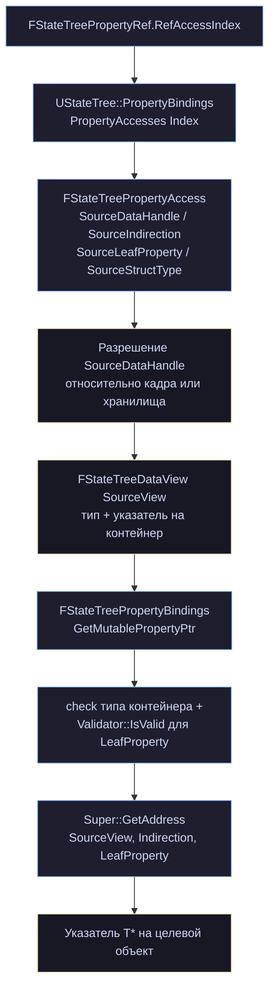

Две проверки на последнем шаге (глава 11) стоит различать:

cpp

```cpp
check(SourceView.GetStruct() == PropertyAccess.SourceStructType);   // ← падает

if (!UE::StateTree::PropertyRefHelpers::Validator<std::remove_cv_t<T>>::IsValid(*PropertyAccess.SourceLeafProperty))
{
    return nullptr;                                                  // ← мягко
}
```

Несовпадение **контейнера** — программная ошибка, `check`. Несовпадение **типа свойства** — возможная конфигурация, `nullptr`. Именно поэтому кортежи работают: запрос неверного типа просто даёт `nullptr` вместо падения.

Параметр `ITemporaryStorage` (появился в 5.8, заменив `ParentFrame`) — то самое временное хранилище из главы 6. Ссылка может указывать на данные, которые ещё не переехали в основной буфер, — например, при выборе состояния.

Устаревшие перегрузки с `ParentExecutionFrame` делегируют новым с `nullptr` вместо временного хранилища:

cpp

```cpp
UE_DEPRECATED(5.8, "Use the version with TemporaryStorage instead of ParentFrame")
T* GetMutablePtrToProperty(..., const FStateTreeExecutionFrame* ParentExecutionFrame, ...)
{
    constexpr ExecutionContext::ITemporaryStorage* TemporaryStorage = nullptr;
    return GetMutablePtrToProperty<T>(PropertyRef, InstanceDataStorage, TemporaryStorage, ExecutionFrame, OutSourceProperty);
}
```

### 12.7. Асинхронный доступ

cpp

```cpp
template<class T, bool bWithWriteAccess>
std::conditional_t<bWithWriteAccess, T*, const T*>
GetPtrFromStrongExecutionContext(const TStateTreeStrongExecutionContext<bWithWriteAccess>& Context)
{
    UE::StateTree::Async::FActivePathInfo ActivePath = Context.GetActivePathInfo();
    if (ActivePath.IsValid())
    {
        return UE::StateTree::PropertyRefHelpers::GetMutablePtrToProperty<T>(
            *this, *Context.Storage, Context.TemporaryStorage.Get(), *ActivePath.Frame);
    }
    return nullptr;
}
```

Работает с `TStateTreeStrongExecutionContext` (глава 16). Два наблюдения:

**Константность выводится из типа контекста.** `std::conditional_t<bWithWriteAccess, T*, const T*>` — read-only контекст даёт `const T*`. Нарушить это невозможно: не соглашение, а система типов.

**Валидность проверяется через `GetActivePathInfo()`.** Кадр и состояние всё ещё активны? Если нет — `nullptr`. Именно поэтому в `StateTreeAsyncExecutionContext.h` объявлено `friend struct FStateTreePropertyRef` — ссылке нужен доступ к приватным `Storage` и `TemporaryStorage` контекста.

### 12.8. Миграция со `StructRef`

cpp

```cpp
bool SerializeFromMismatchedTag(const FPropertyTag& Tag, FStructuredArchive::FSlot Slot)
{
    static const FName StateTreeStructRefName("StateTreeStructRef");
    if (Tag.GetType().IsStruct(StateTreeStructRefName))
    {
        // Serialize the data, but we don't have anything to do with it.
        // StructRef and PropertyRef are used for input and existing bindings will set them if needed.
        FStateTreeStructRef TempStructRef;
        FStateTreeStructRef::StaticStruct()->SerializeItem(Slot, &TempStructRef, nullptr);
        return true;
    }
    return false;
}
```

Механизм совместимости: старый ассет, где на месте `FStateTreePropertyRef` лежал `FStateTreeStructRef` (глава 3), загрузится без ошибки. Данные читаются и выбрасываются — как объясняет комментарий, оба типа заполняются биндингами при исполнении, так что сохранённое значение не нужно.

Полезный приём в целом: `WithStructuredSerializeFromMismatchedTag` позволяет менять тип `UPROPERTY` без потери загружаемости старых ассетов.

### 12.9. Устаревший `FStateTreePropertyRefExternalHandle`

cpp

```cpp
struct UE_DEPRECATED(5.8, "PropertyRefExternalHandle is deprecated. Use PropertyRef with ExecutionContext/StrongExecutionContext instead, which is a general async pattern for data access using Frame/StateID.")
FStateTreePropertyRefExternalHandle
{
    FStateTreePropertyRefExternalHandle(FStateTreePropertyRef InPropertyRef, FStateTreeExecutionContext& InContext)
        : WeakInstanceStorage(InContext.GetMutableInstanceData()->GetWeakMutableStorage())
        , WeakStateTree(InContext.GetCurrentlyProcessedFrame()->StateTree)
        , RootState(InContext.GetCurrentlyProcessedFrame()->RootState)
        , PropertyRef(InPropertyRef)
    {
    }
    // ...
};
```

Задача была та же — сохранить ссылку для использования вне обработки узла. Почему заменили, видно из полей: кадр идентифицировался парой (`StateTree`, `RootState`), то есть **структурно**, а не по активации. Это та же проблема, из-за которой в 5.6 появились `FActiveFrameID`/`FActiveStateID` (глава 5): вышли из состояния, вернулись — структурно кадр тот же, фактически другой.

Новый путь (`TStateTreeStrongExecutionContext` + `GetPtrFromStrongExecutionContext`) идентифицирует по ID активации и потому корректен.

Обратите внимание на приём в шаблонной версии:

cpp

```cpp
private:
    using FStateTreePropertyRefExternalHandle::GetMutablePtr;
    using FStateTreePropertyRefExternalHandle::GetMutablePtrTuple;
```

`using` в приватной секции **скрывает** унаследованные шаблонные методы, оставляя только типизированные. Способ сузить интерфейс наследника — полезно знать.

### 12.10. Blueprint-вариант

cpp

```cpp
UENUM()
enum class EStateTreePropertyRefType : uint8
{
    None, Bool, Byte, Int32, Int64, Float, Double,
    Name, String, Text, Enum, Struct, Object, SoftObject, Class, SoftClass,
};

/**
 * FStateTreeBlueprintPropertyRef is a PropertyRef intended to be used in State Tree Blueprint nodes
 * like tasks, conditions or evaluators, but also as a StateTree parameter.
 */
USTRUCT(BlueprintType, DisplayName = "State Tree Property Ref")
struct FStateTreeBlueprintPropertyRef : public FStateTreePropertyRef
{
    GENERATED_BODY()

    EStateTreePropertyRefType GetRefType() const { return RefType; }
    bool IsRefToArray() const { return bIsRefToArray; }
    UObject* GetTypeObject() const { return TypeObject; }
    bool IsOptional() const { return bIsOptional; }

private:
    UPROPERTY(EditAnywhere, Category = "InternalType")
    EStateTreePropertyRefType RefType = EStateTreePropertyRefType::None;

    UPROPERTY(EditAnywhere, Category = "InternalType")
    uint8 bIsRefToArray : 1 = false;

    UPROPERTY(EditAnywhere, Category = "Parameter")
    uint8 bIsOptional : 1 = false;

    /** Specifies the type of property to reference together with RefType, used for Enums, Structs, Objects and Classes. */
    UPROPERTY(EditAnywhere, Category= "InternalType")
    TObjectPtr<UObject> TypeObject = nullptr;

    friend class FStateTreeBlueprintPropertyRefDetails;
};
```

Разница принципиальная: в C++ тип задаётся **метадатой на этапе компиляции**, в Blueprint его выбирает пользователь **в редакторе**. Поэтому то, что в C++ было метаданными, здесь стало полями.

Пара `RefType` + `TypeObject`: перечисление задаёт категорию (структура, объект, enum, класс), а `TypeObject` — конкретный тип. `EStateTreePropertyRefType::Struct` + `TypeObject = FVector::StaticStruct()` = ссылка на `FVector`.

Заметьте, что здесь есть и `SoftObject`/`SoftClass`, которых нет в списке поддерживаемых типов для C++-версии в комментарии. Blueprint-вариант покрывает чуть больше.

`BlueprintType` и `DisplayName = "State Tree Property Ref"` — структура доступна как тип переменной в Blueprint, в том числе как параметр дерева.

### 12.11. Когда что использовать: таблица решений

Три механизма доступа к чужим данным. Выбор:

| **Задача**                                         | **Механизм**                                                               | **Почему именно этот подход**                                       |
| -------------------------------------------------- | -------------------------------------------------------------------------- | ------------------------------------------------------------------- |
| **Прочитать число, строку, указатель**             | Входной биндинг (Input Binding)                                            | Просто, дешево, визуальная связь прямо в редакторе                  |
| **Записать результат наружу**                      | Выходной биндинг (Output Binding)                                          | Рекомендация Epic Games: designer-friendly обратная запись в Editor |
| **Читать/писать большую структуру на месте**       | `FStateTreePropertyRef`                                                    | Исключает дорогостоящее помять-копирование структуры                |
| **Читать большую структуру целиком**               | `FStateTreeStructRef`                                                      | Проще в настройке, чем `PropertyRef`, если тип структуры фиксирован |
| **Изменять элементы массива на месте**             | `FStateTreePropertyRef`<br>+ `IsRefToArray`                                | Стандартный биндинг скопировал бы весь массив целиком               |
| **Работать и с одиночным значением, и с массивом** | `FStateTreePropertyRef`<br>+ `CanRefToArray`                               | Поддерживает гибкие варианты доступа (кортеж / tuple)               |
| **Доступ из другого потока**                       | `TStateTreeStrongExecutionContext`<br>+ `GetPtrFromStrongExecutionContext` | Гарантирует проверку живости активации дерева при multithreading    |

`StructRef` проще: он заполняется системой копирования (`Set(FStructView)`), и в момент использования уже содержит указатель. `PropertyRef` разрешается на месте — гибче, но требует контекста и проверки.

### 12.12. Практический пример

Задача, накапливающая урон в общей структуре, не копируя её:

cpp

```cpp
USTRUCT()
struct FCombatStatistics
{
    GENERATED_BODY()

    UPROPERTY() float TotalDamageDealt = 0.0f;
    UPROPERTY() float TotalDamageTaken = 0.0f;
    UPROPERTY() int32 KillCount = 0;
    UPROPERTY() TArray<FDamageEvent> RecentEvents;   // может быть большим
};

USTRUCT()
struct FRecordDamageTaskInstanceData
{
    GENERATED_BODY()

    /** Ссылка на статистику — без копирования. */
    UPROPERTY(EditAnywhere, Category = "Input")
    TStateTreePropertyRef<FCombatStatistics> Stats;

    /** Урон за этот удар — обычный биндинг, число копировать дёшево. */
    UPROPERTY(EditAnywhere, Category = "Input")
    float DamageAmount = 0.0f;
};

USTRUCT(DisplayName = "Record Damage")
struct FRecordDamageTask : public FStateTreeTaskCommonBase
{
    GENERATED_BODY()

    using FInstanceDataType = FRecordDamageTaskInstanceData;

    FRecordDamageTask()
    {
        bShouldCallTick = false;      // работа целиком в EnterState
    }

    virtual const UStruct* GetInstanceDataType() const override
    { return FInstanceDataType::StaticStruct(); }

    virtual EStateTreeRunStatus EnterState(FStateTreeExecutionContext& Context,
                                           const FStateTreeTransitionResult& Transition) const override
    {
        const FInstanceDataType& Data = Context.GetInstanceData(*this);

        FCombatStatistics* Stats = Data.Stats.GetMutablePtr(Context);
        if (!Stats)
        {
            return EStateTreeRunStatus::Failed;      // ссылка не разрешилась
        }

        Stats->TotalDamageDealt += Data.DamageAmount;
        Stats->RecentEvents.Emplace(/* ... */);       // пишем в исходный массив

        return EStateTreeRunStatus::Succeeded;
    }
};
```

Без `PropertyRef` пришлось бы либо копировать всю структуру со всем массивом туда и обратно, либо заводить отдельную подсистему для статистики.

### 12.13. Ловушки

**1. Отсутствие проверки на `nullptr`.**

cpp

```cpp
// НЕПРАВИЛЬНО:
Data.StatsRef.GetMutablePtr(Context)->KillCount++;   // падение, если не разрешилось
```

Ссылка не разрешается чаще, чем кажется: во время выбора состояния, при деактивации источника, при несовпадении типа.

**2. Сохранение указателя между вызовами.**

cpp

```cpp
// НЕПРАВИЛЬНО:
Data.CachedStats = Data.StatsRef.GetMutablePtr(Context);   // умрёт при смене состояний
```

Указатель валиден только в пределах текущего вызова. Разрешайте заново каждый раз — это дёшево (несколько сложений, без разбора путей).

**3. Использование вне обработки узла.**

cpp

```cpp
check(CurrentlyProcessedFrame);
```

`GetMutablePtr(Context)` внутри лямбды таймера упадёт: контекст уже не обрабатывает ваш узел. Для отложенного доступа — `TStateTreeStrongExecutionContext` (глава 16).

**4. `PropertyRef` там, где хватило бы биндинга.**

cpp

```cpp
// Избыточно:
UPROPERTY(EditAnywhere, Category = "Input")
TStateTreePropertyRef<float> HealthRef;

// Достаточно:
UPROPERTY(EditAnywhere, Category = "Input")
float Health = 0.0f;
```

Для `float` копирование — это четыре байта. `PropertyRef` добавляет разрешение адреса, проверку типа и обязательную проверку на `nullptr` в вашем коде. Помните рекомендацию из комментария: PropertyRef — для больших структур.

**5. Забытый `Optional`.**

Если ссылка действительно необязательна, но `Optional` не указан, компилятор ассета выдаст ошибку и дизайнер не сможет собрать дерево. И наоборот: лишний `Optional` превращает ошибку компиляции в рантайм-`nullptr`.

### 12.14. Выводы

1. **`FStateTreePropertyRef` — два байта**, всё содержательное в `FStateTreePropertyAccess` внутри ассета.
2. **Используйте `TStateTreePropertyRef<T>`** — метадата генерируется автоматически, типобезопасность на этапе компиляции.
3. **Рекомендация авторов: PropertyRef для больших структур, для остального — выходной биндинг.**
4. **Всегда проверяйте `nullptr`**, никогда не кешируйте указатель.
5. **Разрешается только внутри обработки узла**; для отложенного доступа — сильный асинхронный контекст.
6. **`CanRefToArray` + кортеж** — одна задача работает и с элементом, и с массивом.
7. **`Optional` управляет строгостью компиляции** ассета: без него непривязанная ссылка — ошибка.
8. **Blueprint-вариант** хранит тип в полях, а не в метадате, потому что тип выбирается пользователем.

---

## Глава 13. Внешние данные и `FStateTreeLinker`

Последняя глава части IV. Мы разобрали, как данные попадают в узел изнутри дерева (биндинги, PropertyRef). Осталось третье направление: как узел получает доступ к тому, что **вообще не принадлежит дереву** — подсистемам, компонентам, миру.

Механизм называется external data, и он устроен принципиально иначе, чем биндинги: без копирования, без редактора, по типу, а не по имени.

### 13.1. Три способа получить данные снаружи

Соберём картину, потому что путаница здесь частая:

| **Параметр**          | **Контекстные данные**                                                  | **Внешние данные**                                                       | **Биндинги**         |
| --------------------- | ----------------------------------------------------------------------- | ------------------------------------------------------------------------ | -------------------- |
| **Кто объявляет**     | Схема                                           (`GetContextDataDescs`) | Узел (`Link()`)                                                          | Дизайнер в редакторе |
| **Кто предоставляет** | Владелец (`SetContextDataByName`)                                       | Владелец                                         (`CollectExternalData`) | Само дерево          |
| **Адресация**         | По имени                                                                | По типу                                                                  | По пути свойства     |
| **Видно в редакторе** | Да                                                                      | Нет                                                                      | Да                   |
| **Копирование**       | Нет (вид на память)                                                     | Нет (вид на память)                                                      | Да                   |
| **Хранится в**        | `UStateTree:: ContextDataDescs`                                         | `UStateTree:: ExternalDataDescs` (Transient)                             | `PropertyBindings`   |

Ключевое различие, которое определяет выбор: **контекстные данные видны биндингам, внешние — нет**. Если дизайнер должен иметь возможность привязаться к данным — это контекстные данные схемы. Если данные нужны только вашему C++-коду — внешние.

### 13.2. Объявление требования

Всё начинается с поля в узле:

cpp

```cpp
struct FMyTask : public FStateTreeTaskCommonBase
{
    // ...
    TStateTreeExternalDataHandle<UWorld> WorldHandle;
    TStateTreeExternalDataHandle<UMyGameSubsystem> SubsystemHandle;
    TStateTreeExternalDataHandle<UNavigationSystemV1, EStateTreeExternalDataRequirement::Optional> NavHandle;
};
```

Напомню устройство из главы 5:

cpp

```cpp
template<typename T, EStateTreeExternalDataRequirement Req = EStateTreeExternalDataRequirement::Required>
struct TStateTreeExternalDataHandle : FStateTreeExternalDataHandle
{
    typedef T DataType;
    static constexpr EStateTreeExternalDataRequirement DataRequirement = Req;
};
```

Шаблонная часть не добавляет данных — только информацию для компилятора C++. В рантайме это `FStateTreeIndex16` внутри `FStateTreeDataHandle`.

Обратите внимание: поле **не** `UPROPERTY`. Оно не сериализуется, а заполняется линкером при каждой загрузке.

### 13.3. `FStateTreeLinker` — три перегрузки и SFINAE

cpp

```cpp
struct FStateTreeLinker
{
    UE_API explicit FStateTreeLinker(TNotNull<const UStateTree*> InStateTree);

    UE_DEPRECATED(5.7, "Use the constructor with the StateTree pointer.")
    explicit FStateTreeLinker(const UStateTreeSchema* InSchema) : Schema(InSchema) {}

    EStateTreeLinkerStatus GetStatus() const { return Status; }
    const UStateTree* GetStateTree() const { return StateTree.Get(); }

    template <typename T>
    typename TEnableIf<TIsDerivedFrom<typename T::DataType, UObject>::IsDerived, void>::Type
    LinkExternalData(T& Handle)
    {
        LinkExternalData(Handle, T::DataType::StaticClass(), T::DataRequirement);
    }

    template <typename T>
    typename TEnableIf<!TIsDerivedFrom<typename T::DataType, UObject>::IsDerived
                       && !TIsIInterface<typename T::DataType>::Value, void>::Type
    LinkExternalData(T& Handle)
    {
        LinkExternalData(Handle, T::DataType::StaticStruct(), T::DataRequirement);
    }

    template <typename T>
    typename TEnableIf<TIsIInterface<typename T::DataType>::Value, void>::Type
    LinkExternalData(T& Handle)
    {
        LinkExternalData(Handle, T::DataType::UClassType::StaticClass(), T::DataRequirement);
    }

    UE_API void LinkExternalData(FStateTreeExternalDataHandle& Handle, const UStruct* Struct,
                                 const EStateTreeExternalDataRequirement Requirement);

    const TArrayView<const FStateTreeExternalDataDesc> GetExternalDataDescs() const { return ExternalDataDescs; }

protected:
    TStrongObjectPtr<const UStateTree> StateTree;
    TStrongObjectPtr<const UStateTreeSchema> Schema;
    EStateTreeLinkerStatus Status = EStateTreeLinkerStatus::Succeeded;
    TArray<FStateTreeExternalDataDesc> ExternalDataDescs;
};
```

Три шаблонные перегрузки с одинаковой сигнатурой различаются только условиями `TEnableIf` — классический SFINAE. Компилятор выбирает подходящую по типу `T::DataType`:

|Условие|Тип|Что берётся|
|---|---|---|
|`TIsDerivedFrom<DataType, UObject>`|`UObject`-наследник|`DataType::StaticClass()`|
|не `UObject` и не интерфейс|`USTRUCT`|`DataType::StaticStruct()`|
|`TIsIInterface<DataType>`|`IInterface`|`DataType::UClassType::StaticClass()`|

Условия взаимоисключающи — ровно одна перегрузка подходит для каждого типа. Если не подходит ни одна (например, вы указали `int32`), вы получите ошибку компиляции «no matching function», что и требуется.

Третий вариант — самый интересный. `IMyInterface::UClassType` — это `UMyInterface`, генерируемый макросом `UINTERFACE`. То есть в дескриптор записывается класс интерфейса, а проверка совместимости идёт через `ImplementsInterface` (глава 5):

cpp

```cpp
bool FStateTreeExternalDataDesc::IsCompatibleWith(const FStateTreeDataView& DataView) const
{
    if (DataView.GetStruct()->IsChildOf(Struct))
    {
        return true;
    }
    if (const UClass* DataDescClass = Cast<UClass>(Struct))
    {
        if (const UClass* DataViewClass = Cast<UClass>(DataView.GetStruct()))
        {
            return DataViewClass->ImplementsInterface(DataDescClass);
        }
    }
    return false;
}
```

**Это мощный приём для развязки.** Ваша задача требует `IAbilityProvider`, а не конкретный `UMyAbilityComponent` — и та же задача работает с любым классом, реализующим интерфейс. В коде это выглядит так:

cpp

```cpp
TStateTreeExternalDataHandle<IAbilityProvider> AbilityProviderHandle;

// в Link():
Linker.LinkExternalData(AbilityProviderHandle);

// в рантайме:
IAbilityProvider& Provider = Context.GetExternalData(AbilityProviderHandle);
```

#### Нешаблонная перегрузка

cpp

```cpp
/**
 * Links reference to an external Object or Struct.
 * This function should only be used when TStateTreeExternalDataHandle<> cannot be used, i.e. the Struct is based on some data.
 */
void LinkExternalData(FStateTreeExternalDataHandle& Handle, const UStruct* Struct,
                      const EStateTreeExternalDataRequirement Requirement);
```

Комментарий честно предупреждает: используйте только если шаблонная версия не подходит — а именно когда тип определяется данными, а не кодом. Например, узел, чей тип внешних данных зависит от настроенного в редакторе класса:

cpp

```cpp
bool FMyDynamicTask::Link(FStateTreeLinker& Linker)
{
    if (RequiredComponentClass)
    {
        Linker.LinkExternalData(ComponentHandle, RequiredComponentClass,
                                EStateTreeExternalDataRequirement::Required);
    }
    return true;
}
```

### 13.4. Статус линковки

cpp

```cpp
UENUM()
enum class EStateTreeLinkerStatus : uint8
{
    Succeeded,
    Failed,
};

EStateTreeLinkerStatus GetStatus() const { return Status; }
```

Поле `Status` изменяется внутри `LinkExternalData` (реализация в `.cpp`). Провал происходит, когда схема не разрешает запрошенный тип:

cpp

```cpp
// UStateTreeSchema:
/** @return True if specified struct/class is supported as external data */
virtual bool IsExternalItemAllowed(const UStruct& InStruct) const { return false; }
```

Значение по умолчанию — `false`. Базовая схема **не разрешает ничего**. Это важно понимать: если вы пишете свою схему и забыли реализовать `IsExternalItemAllowed`, ни один узел с внешними данными не слинкуется.

Как `UStateTreeComponentSchema` это решает — увидим в главе 18.

#### Два хранилища указателей

cpp

```cpp
protected:
    TStrongObjectPtr<const UStateTree> StateTree;
    TStrongObjectPtr<const UStateTreeSchema> Schema;
```

`TStrongObjectPtr`, а не сырые указатели: линковка может происходить в момент, когда GC активен, и удержание ссылок обязательно. Схема хранится отдельно, потому что старый (устаревший в 5.7) конструктор принимал только её:

cpp

```cpp
UE_DEPRECATED(5.7, "Use the constructor with the StateTree pointer.")
explicit FStateTreeLinker(const UStateTreeSchema* InSchema) : Schema(InSchema) {}
```

Переход на конструктор с деревом дал линкеру доступ ко всему ассету, а не только к схеме — например, для более информативных сообщений об ошибках.

### 13.5. Жизненный цикл линковки

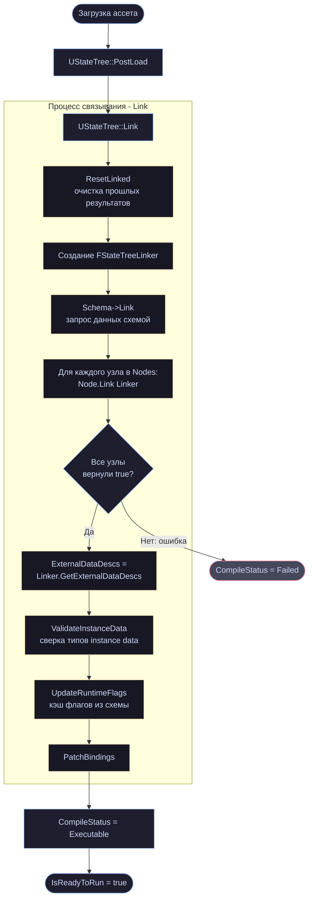

Заметьте, что схема тоже участвует:

cpp

```cpp
// UStateTreeSchema:
/** Resolves schema references to other StateTree data. */
virtual bool Link(FStateTreeLinker& Linker) { return true; }
```

Схема может объявить собственные внешние данные — например, если она предоставляет узлам общий сервис.

**Порядок обхода узлов определяет индексы.** Дескрипторы складываются в `ExternalDataDescs` по мере запросов, и `Handle` получает индекс в этом массиве. Отсюда правило: **не рассчитывайте на конкретные значения индексов** и не сохраняйте их — при изменении дерева они поменяются.

### 13.6. `Required` против `Optional`

cpp

```cpp
enum class EStateTreeExternalDataRequirement : uint8
{
    Required,   // StateTree cannot be executed if the data is not present.
    Optional,   // Data is optional for StateTree execution.
};
```

Разница проявляется в двух местах.

**При запуске дерева.** Если `Required`-данные не предоставлены владельцем, дерево не запустится. Это проверка в `FStateTreeExecutionContext::AreExternalDataViewsValid()`.

**При обращении.** Из главы 2, в `FStateTreeExecutionContext`:

cpp

```cpp
template <typename T>
typename T::DataType& GetExternalData(const T& Handle) const
{
    static_assert(T::DataRequirement == EStateTreeExternalDataRequirement::Required,
                  "Use GetExternalDataPtr() for optional external data.");
    // ...
}
```

Это `static_assert`, а не рантайм-проверка: попытка вызвать `GetExternalData()` для `Optional`-хендла **не скомпилируется**. Для необязательных данных есть отдельный метод, возвращающий указатель:

cpp

```cpp
TStateTreeExternalDataHandle<UNavigationSystemV1, EStateTreeExternalDataRequirement::Optional> NavHandle;

// ...
if (UNavigationSystemV1* NavSys = Context.GetExternalDataPtr(NavHandle))
{
    // навигация доступна
}
else
{
    // работаем без неё
}
```

Правило выбора: **`Required` по умолчанию**. Ошибка «дерево не запустилось, потому что нет подсистемы» лучше, чем «дерево запустилось и молча ничего не делает». `Optional` — только когда у вас действительно есть осмысленный запасной путь.

### 13.7. Сторона владельца: `CollectExternalData`

Дескрипторы объявлены — кто-то должен их заполнить. Это делает владелец дерева через колбэк:

cpp

```cpp
DECLARE_DELEGATE_RetVal_FourParams(bool, FOnCollectStateTreeExternalData,
    const FStateTreeExecutionContext& /*Context*/,
    const UStateTree* /*StateTree*/,
    TArrayView<const FStateTreeExternalDataDesc> /*Descs*/,
    TArrayView<FStateTreeDataView> /*OutDataViews*/);
```

Типовая реализация:

cpp

```cpp
bool UMyOwner::CollectExternalData(const FStateTreeExecutionContext& Context,
                                   const UStateTree* StateTree,
                                   TArrayView<const FStateTreeExternalDataDesc> Descs,
                                   TArrayView<FStateTreeDataView> OutDataViews) const
{
    check(Descs.Num() == OutDataViews.Num());

    AActor* Owner = GetOwner();
    UWorld* World = GetWorld();

    for (int32 Index = 0; Index < Descs.Num(); ++Index)
    {
        const FStateTreeExternalDataDesc& Desc = Descs[Index];
        if (!Desc.Struct)
        {
            continue;
        }

        if (Desc.Struct->IsChildOf(UWorldSubsystem::StaticClass()))
        {
            UWorldSubsystem* Subsystem = World->GetSubsystemBase(
                Cast<UClass>(const_cast<UStruct*>(Desc.Struct.Get())));
            OutDataViews[Index] = FStateTreeDataView(Subsystem);
        }
        else if (Desc.Struct->IsChildOf(UActorComponent::StaticClass()))
        {
            UActorComponent* Component = Owner->FindComponentByClass(
                Cast<UClass>(const_cast<UStruct*>(Desc.Struct.Get())));
            OutDataViews[Index] = FStateTreeDataView(Component);
        }
        else if (Desc.Struct->IsChildOf(AActor::StaticClass()))
        {
            OutDataViews[Index] = FStateTreeDataView(Owner);
        }
        else if (Desc.Struct == UWorld::StaticClass())
        {
            OutDataViews[Index] = FStateTreeDataView(World);
        }
    }

    return true;
}
```

Именно такой диспетчер по типу реализован в `UStateTreeComponentSchema::CollectExternalData` (глава 18).

Три важных момента.

**1. Индексы соответствуют.** `Descs[i]` и `OutDataViews[i]` — одна и та же запись. Не переупорядочивайте.

**2. Незаполненные записи допустимы** для `Optional`-требований. Для `Required` пустой вид означает провал запуска.

**3. Вызывается по разу на каждое дерево.** Из комментария к `SetCollectExternalDataCallback` в `FStateTreeExecutionContext`:

> _«The callback can be called multiple times, once for each StateTree asset used by the execution context, including linked assets.»_

Связанный ассет (`LinkedAsset`) — это новый кадр со своим набором внешних данных, поэтому колбэк вызовется снова, уже с другим `StateTree`. Отсюда два следствия для вашей реализации:

- **не делайте там тяжёлой работы** — она повторится;
- **используйте параметр `StateTree`**, если поведение зависит от того, какое именно дерево запрашивает данные.

Интерфейсы обрабатывать не сложнее — просто проверяйте `ImplementsInterface`:

cpp

```cpp
if (const UClass* AsClass = Cast<UClass>(Desc.Struct.Get()))
{
    if (AsClass->HasAnyClassFlags(CLASS_Interface))
    {
        if (Owner->GetClass()->ImplementsInterface(AsClass))
        {
            OutDataViews[Index] = FStateTreeDataView(Owner);
        }
        continue;
    }
}
```

### 13.8. Адресация по типу и её последствие

Комментарий к `FStateTreeExternalDataDesc::Name` (глава 5) содержит формулировку, которую нужно проговорить отдельно:

> _«External data linked explicitly by the nodes (i.e. LinkExternalData) are identified only by their type since they are used for unique instance of a given type.»_

**Один тип — один экземпляр.** Если две ваши задачи запросят `UMySubsystem`, они получат один и тот же объект. Если вам нужны два разных объекта одного класса — механизм не подходит.

Обходные пути:

|Ситуация|Решение|
|---|---|
|Нужны два компонента одного класса|биндинг через контекстные данные схемы; или один external data и поиск нужного внутри|
|Нужен объект, зависящий от настройки узла|биндинг с категорией `Input`|
|Нужен объект, выбираемый в рантайме|биндинг, либо evaluator-мост (глава 10)|

### 13.9. Почему внешние данные не видны биндингам

Это спрашивают часто, поэтому соберём причину полностью.

`ExternalDataDescs` помечен `UPROPERTY(Transient)` (глава 4) — он **не сериализуется** и пересобирается при каждой загрузке ассета из вызовов `Link()`.

Редактор биндингов работает с редакторскими данными, где скомпилированного дерева ещё нет и `Link()` не выполнялся. Список внешних данных на этом этапе неизвестен в принципе.

Контекстные данные, наоборот, объявляет схема — статически, через `GetContextDataDescs()`, ещё до всякой компиляции. Поэтому они доступны редактору.

**Обход — evaluator-мост** (глава 10):

cpp

```cpp
struct FSubsystemBridgeEvaluator : public FStateTreeEvaluatorCommonBase
{
    GENERATED_BODY()

    using FInstanceDataType = FSubsystemBridgeInstanceData;

    virtual bool Link(FStateTreeLinker& Linker) override
    {
        Linker.LinkExternalData(SubsystemHandle);       // недоступно биндингам
        return true;
    }

    virtual void Tick(FStateTreeExecutionContext& Context, const float DeltaTime) const override
    {
        FInstanceDataType& Data = Context.GetInstanceData(*this);
        const UMyGameSubsystem& Subsystem = Context.GetExternalData(SubsystemHandle);

        Data.CurrentWave = Subsystem.GetWaveNumber();   // ← а это уже доступно
        Data.bIsBossActive = Subsystem.IsBossActive();
    }

    TStateTreeExternalDataHandle<UMyGameSubsystem> SubsystemHandle;
};
```

Стоимость — одно копирование значений в кадр; выгода — весь дизайнерский контент может ссылаться на состояние подсистемы.

### 13.10. Паттерны

#### Мир и подсистемы

cpp

```cpp
TStateTreeExternalDataHandle<UWorld> WorldHandle;
TStateTreeExternalDataHandle<UNavigationSystemV1> NavSystemHandle;
TStateTreeExternalDataHandle<UMyWorldSubsystem> MySubsystemHandle;

bool FMyTask::Link(FStateTreeLinker& Linker)
{
    Linker.LinkExternalData(WorldHandle);
    Linker.LinkExternalData(NavSystemHandle);
    Linker.LinkExternalData(MySubsystemHandle);
    return true;
}
```

Самый частый случай. Заметьте: **не вызывайте `GetWorld()` через владельца контекста** — берите мир как внешние данные. Тогда узел не зависит от того, кто его владелец, и работает одинаково в компоненте, в Mass и в тестах.

#### Компонент владельца

cpp

```cpp
TStateTreeExternalDataHandle<UCharacterMovementComponent> MovementHandle;
```

Владелец найдёт компонент на своём акторе. Задача при этом ничего не знает про актора.

#### Интерфейс вместо класса

cpp

```cpp
TStateTreeExternalDataHandle<IStateTreeSchemaProvider> SchemaProviderHandle;
```

Кстати, `IStateTreeSchemaProvider` — реальный интерфейс из движка, который реализует `UStateTreeComponent`:

cpp

```cpp
class UStateTreeComponent : public UBrainComponent, public IGameplayTaskOwnerInterface, public IStateTreeSchemaProvider
```

#### Опциональная зависимость

cpp

```cpp
TStateTreeExternalDataHandle<UMyDebugSubsystem, EStateTreeExternalDataRequirement::Optional> DebugHandle;

// ...
if (const UMyDebugSubsystem* Debug = Context.GetExternalDataPtr(DebugHandle))
{
    Debug->DrawSomething();
}
```

Идеальный случай для `Optional`: отладочная подсистема отсутствует в шиппинге, и дерево должно работать без неё.

#### Условная линковка

cpp

```cpp
bool FMyTask::Link(FStateTreeLinker& Linker)
{
    Linker.LinkExternalData(WorldHandle);

    if (bUseNavigation)                     // поле узла, настраивается в редакторе
    {
        Linker.LinkExternalData(NavHandle);
    }
    return true;
}
```

Работает, потому что `Link()` вызывается после загрузки, когда поля узла уже заполнены из ассета. Хендл, для которого не вызвали `LinkExternalData`, останется невалидным — проверяйте `IsValid()` перед использованием.

#### Провал линковки как контракт

cpp

```cpp
bool FMyStrictTask::Link(FStateTreeLinker& Linker)
{
    if (!RequiredAsset)
    {
        UE_LOG(LogStateTree, Error, TEXT("%s: RequiredAsset не задан"), *Name.ToString());
        return false;                       // дерево не запустится
    }
    Linker.LinkExternalData(WorldHandle);
    return true;
}
```

`[[nodiscard]]` на `Link()` (глава 7) не даст случайно проигнорировать результат в вызывающем коде. Используйте возврат `false` для инвариантов, которые нельзя проверить компилятором ассета.

### 13.11. Диагностика

|Симптом|Причина|
|---|---|
|Дерево не запускается, в логе про external data|`Required`-данные не предоставлены в `CollectExternalData`|
|`Link()` не вызывается|узел не попал в скомпилированный ассет — перекомпилируйте|
|Хендл невалиден в рантайме|забыли `LinkExternalData` в `Link()`, или условная ветка не сработала|
|`GetExternalData` не компилируется|хендл помечен `Optional` — используйте `GetExternalDataPtr`|
|Схема не пропускает тип|`IsExternalItemAllowed` возвращает `false` для вашего типа|
|Данные приходят от «не того» объекта|адресация по типу — два запроса одного типа дают один объект|
|`CollectExternalData` вызывается дважды|связанный ассет создал новый кадр — это нормально|
|Не могу забиндить подсистему в редакторе|внешние данные не видны биндингам — нужен evaluator-мост|

### 13.12. Полный пример

Соберём обе стороны механизма.

**Узел:**

cpp

```cpp
USTRUCT()
struct FFindCoverTaskInstanceData
{
    GENERATED_BODY()

    UPROPERTY(EditAnywhere, Category = "Input")
    TObjectPtr<AActor> ThreatActor = nullptr;

    UPROPERTY(EditAnywhere, Category = "Parameter", meta = (ClampMin = "0.0", Units = "cm"))
    double SearchRadius = 2000.0;

    UPROPERTY(VisibleAnywhere, Category = "Output")
    FVector CoverLocation = FVector::ZeroVector;

    UPROPERTY(VisibleAnywhere, Category = "Output")
    bool bFoundCover = false;
};

USTRUCT(DisplayName = "Find Cover", meta = (Category = "Tactics"))
struct FFindCoverTask : public FStateTreeTaskCommonBase
{
    GENERATED_BODY()

    using FInstanceDataType = FFindCoverTaskInstanceData;

    FFindCoverTask()
    {
        bShouldCallTick = false;              // поиск один раз при входе
    }

    virtual const UStruct* GetInstanceDataType() const override
    { return FInstanceDataType::StaticStruct(); }

    virtual bool Link(FStateTreeLinker& Linker) override
    {
        Linker.LinkExternalData(WorldHandle);
        Linker.LinkExternalData(CoverSystemHandle);
        Linker.LinkExternalData(NavSystemHandle);      // опциональная
        return true;
    }

    virtual EStateTreeRunStatus EnterState(FStateTreeExecutionContext& Context,
                                           const FStateTreeTransitionResult& Transition) const override
    {
        FInstanceDataType& Data = Context.GetInstanceData(*this);

        const UWorld& World = Context.GetExternalData(WorldHandle);
        const UCoverSystem& CoverSystem = Context.GetExternalData(CoverSystemHandle);

        Data.bFoundCover = false;

        if (!Data.ThreatActor)
        {
            return EStateTreeRunStatus::Failed;
        }

        const FVector SelfLocation = /* ... */;
        Data.bFoundCover = CoverSystem.FindBestCover(
            SelfLocation, Data.ThreatActor->GetActorLocation(), Data.SearchRadius, Data.CoverLocation);

        // Опциональная навигация — уточняем точку, если система доступна
        if (Data.bFoundCover)
        {
            if (const UNavigationSystemV1* NavSys = Context.GetExternalDataPtr(NavSystemHandle))
            {
                FNavLocation Projected;
                if (NavSys->ProjectPointToNavigation(Data.CoverLocation, Projected))
                {
                    Data.CoverLocation = Projected.Location;
                }
            }
        }

        return Data.bFoundCover ? EStateTreeRunStatus::Succeeded : EStateTreeRunStatus::Failed;
    }

    TStateTreeExternalDataHandle<UWorld> WorldHandle;
    TStateTreeExternalDataHandle<UCoverSystem> CoverSystemHandle;
    TStateTreeExternalDataHandle<UNavigationSystemV1,
                                 EStateTreeExternalDataRequirement::Optional> NavSystemHandle;
};
```

Обратите внимание, что `CoverLocation` и `bFoundCover` — категория `"Output"`. Задача поиска ничего не двигает; результат читает следующая задача через биндинг. Разделение ответственности: одна задача ищет, другая идёт.

### 13.13. Выводы

1. **Внешние данные адресуются по типу**, объявляются узлом в `Link()`, предоставляются владельцем в `CollectExternalData`.
2. **Три перегрузки `LinkExternalData`** различаются через SFINAE: `UObject`, `USTRUCT`, `IInterface`. Интерфейсы — лучший способ развязать узел от конкретного класса.
3. **`Required` по умолчанию.** Дерево не запустится без обязательных данных — это правильное поведение.
4. **`GetExternalData` для `Required`, `GetExternalDataPtr` для `Optional`** — контролируется `static_assert`.
5. **Один тип — один экземпляр.** Для нескольких объектов одного класса используйте биндинги.
6. **Внешние данные не видны в редакторе биндингов**, потому что `ExternalDataDescs` — `Transient` и заполняется линковкой. Мост — evaluator.
7. **Схема должна разрешить тип** через `IsExternalItemAllowed` — базовая реализация не разрешает ничего.
8. **`CollectExternalData` вызывается по разу на дерево**, включая связанные ассеты. Не делайте там тяжёлой работы.
9. **Берите `UWorld` как внешние данные**, а не через владельца — узел останется независимым от контекста запуска.

---

## Глава 14. `FStateTreeExecutionContext`

Самый большой файл пакета — 1817 строк. Это машина исполнения: всё, что происходит с деревом, происходит здесь.

Глава длинная, поэтому начнём с карты. Файл содержит четыре типа:

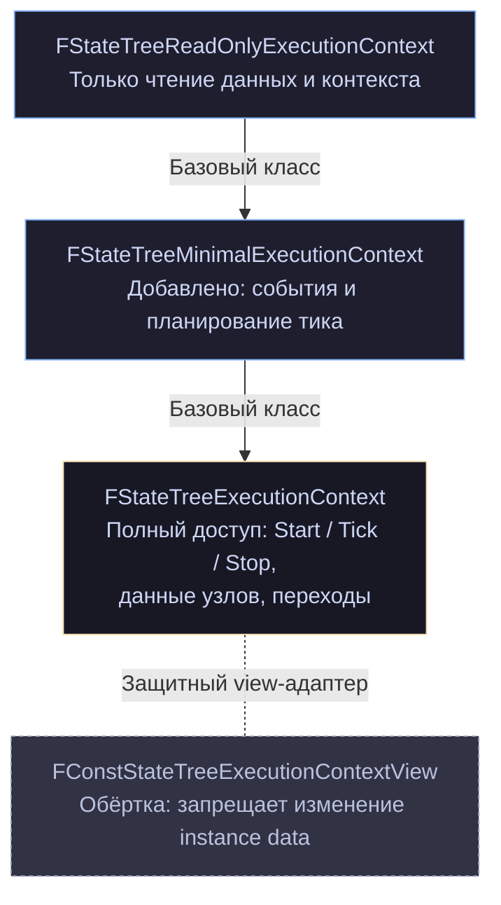

И два вспомогательных namespace'а с функциями преобразования статусов.

### 14.1. Зачем три уровня

Причина сформулирована в комментарии к минимальному контексту:

> _«A regular execution context requires the context data and external data to be valid to execute all possible operations. The minimal execution context doesn't requires those data but supports only a subset of operations.»_

Полный контекст требует **полной обвязки**: схема должна поставить контекстные данные, владелец — внешние. Это дорого и не всегда возможно.

Но многие операции этого не требуют:

- «отправить событие в дерево» — нужна только очередь событий;
- «узнать имя активного состояния» — только instance data;
- «попросить дерево проснуться» — только execution state.

Отсюда градация:

|Контекст|Что нужно|Что умеет|
|---|---|---|
|`ReadOnly`|владелец, ассет, storage|читать состояние, отладочный вывод|
|`Minimal`|то же|+ события, scheduled tick|
|полный|+ context data + external data|всё|

Практический пример из `UStateTreeComponent`: `SendStateTreeEvent` может работать через минимальный контекст, без сбора внешних данных. Это дешевле и не требует, чтобы все зависимости были доступны в момент отправки.

### 14.2. `FStateTreeReadOnlyExecutionContext`

cpp

```cpp
/**
 * Read-only execution context to interact with the state tree instance data. Only const and read accesses are available.
 * Multiple FStateTreeReadOnlyExecutionContext can coexist on different threads as long no other
 * (minimal, weak, regular) execution context exists.
 * The user is responsible for preventing invalid multi-threaded access.
 */
struct FStateTreeReadOnlyExecutionContext
{
    explicit FStateTreeReadOnlyExecutionContext(TNotNull<UObject*> Owner, TNotNull<const UStateTree*> StateTree,
                                                FStateTreeInstanceData& InInstanceData);
    explicit FStateTreeReadOnlyExecutionContext(TNotNull<UObject*> Owner, TNotNull<const UStateTree*> StateTree,
                                                FStateTreeInstanceStorage& Storage);
    virtual ~FStateTreeReadOnlyExecutionContext();

private:
    FStateTreeReadOnlyExecutionContext(const FStateTreeReadOnlyExecutionContext&) = delete;
    FStateTreeReadOnlyExecutionContext& operator=(const FStateTreeReadOnlyExecutionContext&) = delete;
```

**Копирование запрещено** на всех трёх уровнях. Контекст — временный объект на стеке, копировать его бессмысленно и опасно.

Комментарий про многопоточность повторяет MRSW-контракт из главы 6: несколько read-only контекстов на разных потоках сосуществуют, если больше никаких контекстов нет. Проверяется детектором доступа, но соблюдать обязаны вы.

#### API

cpp

```cpp
bool IsValid() const { return RootStateTree.IsReadyToRun(); }
TNotNull<UObject*> GetOwner() const;
UWorld* GetWorld() const;                      // Owner.GetWorld()
TNotNull<const UStateTree*> GetStateTree() const;
const FCompactStateTreeState* GetStateFromHandle(FStateTreeStateHandle) const;

bool HasEventToProcess(const FGameplayTag Tag) const;

FStateTreeScheduledTick GetNextScheduledTick() const;
EStateTreeRunStatus GetStateTreeRunStatus() const;
EStateTreeRunStatus GetLastTickStatus() const;
TConstArrayView<FStateTreeExecutionFrame> GetActiveFrames() const;
FString GetActiveStateName() const;
TArray<FName> GetActiveStateNames() const;
```

`IsValid()` — просто прокси к `IsReadyToRun()` с уточняющим комментарием: _«Indicates if the instance is valid and would be able to run the instance of the associated StateTree asset with a regular execution context»_.

`HasEventToProcess` реализован инлайном и показателен:

cpp

```cpp
bool HasEventToProcess(const FGameplayTag Tag) const
{
    return Storage.GetEventQueue().GetEventsView().ContainsByPredicate([Tag](const FStateTreeSharedEvent& Event)
        {
            check(Event.IsValid());
            return Event->Tag.MatchesTag(Tag);
        });
}
```

`MatchesTag` — **иерархическое** сравнение. Запрос `Damage` найдёт событие `Damage.Fire`. Это не равенство.

#### Отладка

cpp

```cpp
#if WITH_GAMEPLAY_DEBUGGER
FString GetDebugInfoString() const;
#endif

#if WITH_STATETREE_DEBUG
int32 GetStateChangeCount() const;
void DebugPrintInternalLayout();
#endif

#if WITH_STATETREE_TRACE
FStateTreeInstanceDebugId GetInstanceDebugId() const;
FString GetInstanceDebugDescription() const;
void SetOuterTraceId(const uint64 Id) const;
uint64 GetOuterTraceId() const;
void SetNodeCustomDebugTraceData(UE::StateTreeTrace::FNodeCustomDebugData&& DebugData) const;
UE::StateTreeTrace::FNodeCustomDebugData StealNodeCustomDebugTraceData() const;
#else
void SetOuterTraceId(const uint64 Id) const {}
uint64 GetOuterTraceId() const { return 0; }
#endif
```

`SetNodeCustomDebugTraceData` — то, что вызывает макрос `SET_NODE_CUSTOM_TRACE_TEXT` (глава 7). Внутри — защита от неправильного использования:

cpp

```cpp
ensureMsgf(!NodeCustomDebugTraceData.IsSet(),
    TEXT("CustomData is not expected to be already set."
         " This might indicate nested calls to SetNodeCustomDebugTraceData without calls to a trace macro"));
```

Пара `Set`/`Steal` — данные ставятся узлом и забираются трейс-макросом. Если поставили дважды — сработает `ensure`.

`SetOuterTraceId`/`GetOuterTraceId` существуют **в обеих ветках** препроцессора: в сборках без трейсинга это пустые заглушки. Приём, позволяющий вызывающему коду не оборачивать вызовы в `#if`.

#### Поля

cpp

```cpp
protected:
    FString GetInstanceDescriptionInternal() const;

    UObject& Owner;
    const UStateTree& RootStateTree;
    FStateTreeInstanceStorage& Storage;
```

**Три ссылки, ни одной копии.** Контекст ничем не владеет — он только связывает. Отсюда требование к времени жизни: владелец и instance data должны пережить контекст.

`RootStateTree` названо именно так, потому что при связанных ассетах кадры используют другие деревья — а это корневое.

### 14.3. `FStateTreeMinimalExecutionContext`

cpp

```cpp
struct FStateTreeMinimalExecutionContext : public FStateTreeReadOnlyExecutionContext
{
    /**
     * Adds a scheduled tick request.
     * The result of GetNextScheduledTick is affected by the request.
     * This allows a specific task to control when the tree ticks.
     * @note A request with a higher priority will supersede all other requests.
     * ex: Task A request a custom time of 1FPS and Task B request a custom time of 2FPS. Both tasks will tick at 1FPS.
     */
    UE::StateTree::FScheduledTickHandle AddScheduledTickRequest(FStateTreeScheduledTick ScheduledTick);
    void UpdateScheduledTickRequest(UE::StateTree::FScheduledTickHandle Handle, FStateTreeScheduledTick ScheduledTick);
    void RemoveScheduledTickRequest(UE::StateTree::FScheduledTickHandle Handle);

    /** Sends event for the StateTree. */
    void SendEvent(const FGameplayTag Tag, const FConstStructView Payload = FConstStructView(), const FName Origin = FName());

protected:
    FStateTreeExecutionExtension* GetMutableExecutionExtension() const;
    void ScheduleNextTick(UE::StateTree::ETickReason Reason = UE::StateTree::ETickReason::None);

protected:
    /** The context is processing the tree. We do not need to inform the owner that something changed. */
    bool bAllowedToScheduleNextTick = true;
};
```

Четыре публичных метода — всё, что можно сделать без контекстных данных.

`ScheduleNextTick` с флагом `bAllowedToScheduleNextTick` — механизм подавления. Комментарий объясняет: _«The context is processing the tree. We do not need to inform the owner that something changed»_. Пока идёт тик, нет смысла дёргать владельца на каждое изменение — расписание пересчитывается один раз в конце.

`GetMutableExecutionExtension` с честным предупреждением: _«The user is responsible for validity of the result, re-call the getter when needed»_. Расширение может исчезнуть при сбросе instance data; кешировать указатель нельзя.

Устаревшие конструкторы с обычными ссылками заменены на `TNotNull<>` — типовая чистка 5.6.

### 14.4. Конструирование полного контекста

cpp

```cpp
FStateTreeExecutionContext(UObject& InOwner, const UStateTree& InStateTree, FStateTreeInstanceData& InInstanceData,
                           const FOnCollectStateTreeExternalData& CollectExternalDataCallback = {},
                           const EStateTreeRecordTransitions RecordTransitions = EStateTreeRecordTransitions::No);

FStateTreeExecutionContext(TNotNull<UObject*> Owner, TNotNull<const UStateTree*> StateTree, FStateTreeInstanceData& InInstanceData,
                           const FOnCollectStateTreeExternalData& CollectExternalDataCallback = {},
                           const EStateTreeRecordTransitions RecordTransitions = EStateTreeRecordTransitions::No);

/** Construct an execution context from a parent context and another tree. Useful to run a subtree from the parent context with the same schema. */
FStateTreeExecutionContext(const FStateTreeExecutionContext& InContextToCopy, const UStateTree& InStateTree, FStateTreeInstanceData& InInstanceData);
FStateTreeExecutionContext(const FStateTreeExecutionContext& InContextToCopy, TNotNull<const UStateTree*> StateTree, FStateTreeInstanceData& InInstanceData);
```

Третий и четвёртый — «производный контекст». Берётся существующий контекст, но подставляется **другое дерево и другая instance data**. Комментарий: _«Useful to run a subtree from the parent context with the same schema»_.

Практический сценарий: ваша задача хочет запустить вложенное дерево со своей instance data, но с теми же контекстными данными и тем же колбэком внешних данных. Не нужно заново всё настраивать.

### 14.5. Настройка перед запуском

cpp

```cpp
void SetCollectExternalDataCallback(const FOnCollectStateTreeExternalData& Callback);

void SetLinkedStateTreeOverrides(FStateTreeReferenceOverrides InLinkedStateTreeOverrides);
const FStateTreeReference* GetLinkedStateTreeOverrideForTag(const FGameplayTag StateTag) const;

void SetContextData(const FStateTreeExternalDataHandle Handle, FStateTreeDataView DataView);
bool SetContextDataByName(const FName Name, FStateTreeDataView DataView);
FStateTreeDataView GetContextDataByName(const FName Name) const;
TConstArrayView<FStateTreeExternalDataDesc> GetContextDataDescs() const;
bool AreContextDataViewsValid() const;
```

`SetContextData` реализован инлайном и показывает адресацию:

cpp

```cpp
void SetContextData(const FStateTreeExternalDataHandle Handle, FStateTreeDataView DataView)
{
    check(Handle.IsValid());
    check(Handle.DataHandle.GetSource() == EStateTreeDataSourceType::ContextData);
    ContextAndExternalDataViews[Handle.DataHandle.GetIndex()] = DataView;
}
```

Обратите внимание: **без базы кадра**. Контекстные данные лежат в начале общего массива и одинаковы для всех кадров, в отличие от внешних данных, где база нужна.

`AreContextDataViewsValid()` — обязательная проверка перед `Start()`/`Tick()`, как показано в примере из главы 2.

#### Внешние глобальные параметры

cpp

```cpp
/** Structure to-be-populated and set for any StateTree using any EStateTreeDataSourceType::ExternalGlobalParameterData bindings */
struct FExternalGlobalParameters
{
    /* Add memory mapping, this expects InParameterMemory to resolve correctly for the SourceLeafProperty and SourceIndirection */
    bool Add(const FPropertyBindingCopyInfo& Copy, uint8* InParameterMemory);
    uint8* Find(const FPropertyBindingCopyInfo& Copy) const;
    void Reset();
private:
    TMap<uint32, uint8*> Mappings;
};
void SetExternalGlobalParameters(const FExternalGlobalParameters* Parameters);
```

Это реализация `EStateTreeParameterDataType::ExternalGlobalParameterData` из главы 3: параметры дерева живут не в instance data, а в чужой памяти, которую предоставляет владелец. Карта `uint32 → uint8*` сопоставляет копирование с адресом назначения.

Применение — Mass и подобные системы, где параметры уже лежат во фрагменте, и копировать их в дерево не хочется.

### 14.6. `FStartParameters`

cpp

```cpp
struct FStartParameters
{
    /** Optional override of global parameters initial values. */
    FConstStructView InitialGlobalParameters;

    /** Optional extension for the execution context. */
    TInstancedStruct<FStateTreeExecutionExtension> ExecutionExtension;

    /** Optional event queue from another instance data. Marks the event queue not owned. */
    const TSharedPtr<FStateTreeEventQueue> SharedEventQueue;

    /** Optional override of initial seed for RandomStream. By default FPlatformTime::Cycles() will be used. */
    TOptional<int32> RandomSeed;

    struct FStateToSelectOverrideArgs
    {
        FGameplayTag StateTag;
        UStateTree::EStateGameplayTagQueryMethod TagQueryMethod = UStateTree::EStateGameplayTagQueryMethod::MatchesExact;
    };

    /** Optional override of initial state to select. By default, root state will be selected. */
    TOptional<FStateToSelectOverrideArgs> SelectStateOverrideArgs;
};
```

Пять параметров запуска — это ровно те рычаги, которыми вы управляете стартом дерева.

**`InitialGlobalParameters`** — третий уровень переопределения параметров (ассет → reference → старт, глава 4).

**`ExecutionExtension`** — то, через что владелец узнаёт о необходимости проснуться. `FStateTreeComponentExecutionExtension` из `StateTreeComponent.h` — ровно это (глава 17).

**`SharedEventQueue`** — общая очередь событий с другим экземпляром (глава 6).

**`RandomSeed`** — по умолчанию `FPlatformTime::Cycles()`, то есть недетерминированно. **Для тестов и реплеев задавайте явно.**

**`SelectStateOverrideArgs`** — запуск не с корня, а с состояния по тегу. Ограниченная замена сохранению состояния дерева: instance data не сериализуется (глава 6), но вы можете сохранить тег активного состояния и восстановить приблизительную позицию.

### 14.7. `Start`, `Stop`, `Tick`

cpp

```cpp
EStateTreeRunStatus Start();
EStateTreeRunStatus Start(FConstStructView InitialGlobalParameters);
EStateTreeRunStatus Start(FStartParameters Parameter);

EStateTreeRunStatus Stop(const EStateTreeRunStatus CompletionStatus = EStateTreeRunStatus::Stopped);

EStateTreeRunStatus Tick(const float DeltaTime);
EStateTreeRunStatus TickUpdateTasks(const float DeltaTime);
EStateTreeRunStatus TickTriggerTransitions();
```

`Stop` принимает статус завершения — с уточнением: _«can be CompletionStatus, or earlier status if the tree is not running»_. Остановить уже остановленное дерево не изменит его статус.

#### Раздельный тик — недооценённая возможность

cpp

```cpp
/**
 * Tick the state tree logic partially, updates the tasks.
 * For full update TickTriggerTransitions() should be called after.
 */
EStateTreeRunStatus TickUpdateTasks(const float DeltaTime);

/**
 * Tick the state tree logic partially, triggers the transitions.
 * For full update TickUpdateTasks() should be called before.
 */
EStateTreeRunStatus TickTriggerTransitions();
```

`Tick()` = `TickUpdateTasks()` + `TickTriggerTransitions()`. Разделение позволяет вставить свою логику между фазами или разнести их по разным точкам кадра.

Основной потребитель — батчевые системы вроде Mass: сначала все агенты обновляют задачи (параллельно), потом все обрабатывают переходы. Это лучше для кэша и позволяет обработать взаимодействия между агентами между фазами.

Внутренне это отражено в приватных методах:

cpp

```cpp
EStateTreeRunStatus TickPrelude();
EStateTreeRunStatus TickPostlude();
void TickUpdateTasksInternal(float DeltaTime);
void TickTriggerTransitionsInternal();
```

`Prelude`/`Postlude` — общая обвязка, выполняемая в обоих вариантах.

### 14.8. API для узлов

Это то, чем вы пользуетесь ежедневно.

#### Instance data

cpp

```cpp
template <typename T>
T* GetInstanceDataPtr(const FStateTreeNodeBase& Node) const
{
    check(CurrentNodeDataHandle == Node.InstanceDataHandle);
    return CurrentNodeInstanceData.template GetMutablePtr<T>();
}

template <typename T>
T& GetInstanceData(const FStateTreeNodeBase& Node) const
{
    check(CurrentNodeDataHandle == Node.InstanceDataHandle);
    return CurrentNodeInstanceData.template GetMutable<T>();
}

/** Infers the instance data type from the node's FInstanceDataType. */
template <typename T>
typename T::FInstanceDataType& GetInstanceData(const T& Node) const
{
    static_assert(TIsDerivedFrom<T, FStateTreeNodeBase>::IsDerived, "Expecting Node to derive from FStateTreeNodeBase.");
    check(CurrentNodeDataHandle == Node.InstanceDataHandle);
    return CurrentNodeInstanceData.template GetMutable<typename T::FInstanceDataType>();
}
```

Три варианта. Третий — тот, которым пользуетесь вы (`Context.GetInstanceData(*this)`): тип выводится из `FInstanceDataType` узла.

Ключевая проверка во всех трёх:

cpp

```cpp
check(CurrentNodeDataHandle == Node.InstanceDataHandle);
```

Контекст помнит, какой узел обрабатывает **сейчас**, и сверяет. Как он это помнит — разберём ниже, в разделе про скоупы.

#### Execution runtime data

cpp

```cpp
template <typename T> T* GetExecutionRuntimeDataPtr(const FStateTreeNodeBase& Node) const;
template <typename T> T& GetExecutionRuntimeData(const FStateTreeNodeBase& Node) const;
template <typename T> typename T::FExecutionRuntimeDataType& GetExecutionRuntimeData(const T& Node) const;
```

Симметрично, но с дополнительным условием в `check`:

cpp

```cpp
check(CurrentNodeDataHandle == Node.InstanceDataHandle && Node.InstanceDataHandle.IsValid());
```

Требуется **валидный** хендл. Узел без instance data не может иметь и execution runtime data.

#### Ссылка для лямбд

cpp

```cpp
template <typename T>
TStateTreeInstanceDataStructRef<typename T::FInstanceDataType> GetInstanceDataStructRef(const T& Node) const
{
    static_assert(TIsDerivedFrom<T, FStateTreeNodeBase>::IsDerived, "Expecting Node to derive from FStateTreeNodeBase.");
    check(CurrentlyProcessedFrame);
    return TStateTreeInstanceDataStructRef<typename T::FInstanceDataType>(InstanceData, *CurrentlyProcessedFrame, Node.InstanceDataHandle);
}
```

Разбор — глава 6. Здесь важно: `check(CurrentlyProcessedFrame)`, то есть создать ссылку можно только внутри обработки узла (использовать — где угодно).

#### Внешние данные

cpp

```cpp
template <typename T>
typename T::DataType& GetExternalData(const T Handle) const
{
    check(Handle.IsValid());
    check(Handle.DataHandle.GetSource() == EStateTreeDataSourceType::ExternalData);
    check(CurrentlyProcessedFrame);
    check(CurrentlyProcessedFrame->StateTree->ExternalDataDescs[Handle.DataHandle.GetIndex()].Requirement
          != EStateTreeExternalDataRequirement::Optional); // Optionals should query pointer instead.
    return ContextAndExternalDataViews[CurrentlyProcessedFrame->ExternalDataBaseIndex.Get() + Handle.DataHandle.GetIndex()]
        .template GetMutable<typename T::DataType>();
}

template <typename T>
typename T::DataType* GetExternalDataPtr(const T Handle) const;

FStateTreeDataView GetExternalDataView(const FStateTreeExternalDataHandle Handle);
```

Четыре `check` в `GetExternalData`. Последний — проверка требования: `Optional`-данные надо запрашивать через `GetExternalDataPtr`. (В главе 13 я упоминал `static_assert` на `DataRequirement`; в этой версии проверка сделана рантайм-`check`'ом по дескриптору — результат тот же, но ошибка проявится при первом вызове, а не при компиляции.)

Обратите внимание на разрешение адреса — здесь оно видно целиком:

```
ContextAndExternalDataViews[ CurrentlyProcessedFrame->ExternalDataBaseIndex + Handle.Index ]
```

База кадра плюс индекс хендла. Ровно то, что мы разбирали в главе 5.

#### Информация о текущей обработке

cpp

```cpp
FStateTreeIndex16 GetCurrentlyProcessedNodeIndex() const;
FStateTreeDataHandle GetCurrentlyProcessedNodeInstanceData() const;
FStateTreeStateHandle GetCurrentlyProcessedState() const;
const FStateTreeExecutionFrame* GetCurrentlyProcessedFrame() const;
const FStateTreeExecutionFrame* GetCurrentlyProcessedParentFrame() const;
TSharedPtr<UE::StateTree::ExecutionContext::ITemporaryStorage> GetCurrentlyProcessedTemporaryStorage() const;
```

Полезно для отладки и продвинутых сценариев. `GetCurrentlyProcessedState()` даёт handle состояния, в котором работает узел — то же, что `Transition.CurrentState` в `EnterState`, но доступно и в `Tick`.

### 14.9. Управление потоком исполнения

#### Переходы

cpp

```cpp
/**
 * If called during transition processing (e.g. from FStateTreeTaskBase::TriggerTransitions()) the transition
 * is attempted to be activate immediately (it can fail e.g. because of preconditions on a target state).
 * If called outside the transition handling, the request is buffered and handled at the beginning of next transition processing.
 */
void RequestTransition(const FStateTreeTransitionRequest& Request);
void RequestTransition(FStateTreeStateHandle TargetState,
                       EStateTreeTransitionPriority Priority = EStateTreeTransitionPriority::Normal,
                       EStateTreeSelectionFallback Fallback = EStateTreeSelectionFallback::None);
```

Двойное поведение — «немедленно» или «буферизованно» — реализовано через флаг:

cpp

```cpp
/** True if transitions are allowed to be requested directly instead of buffering. */
bool bAllowDirectTransitions = false;

struct FAllowDirectTransitionsScope
{
    FAllowDirectTransitionsScope(FStateTreeExecutionContext& InContext) : Context(InContext)
    {
        bSavedAllowDirectTransitions = Context.bAllowDirectTransitions;
        Context.bAllowDirectTransitions = true;
    }
    ~FAllowDirectTransitionsScope()
    {
        Context.bAllowDirectTransitions = bSavedAllowDirectTransitions;
    }
private:
    FStateTreeExecutionContext& Context;
    bool bSavedAllowDirectTransitions = false;
};
```

Движок оборачивает фазу обработки переходов этим скоупом. Внутри — `RequestTransition` применяется сразу; снаружи — попадает в `FStateTreeInstanceStorage::TransitionRequests`.

Вот почему вызов из `TriggerTransitions()` работает мгновенно, а из `Tick()` — со следующей фазы.

#### Завершение задачи

cpp

```cpp
/**
 * Finishes a task. This fails if the Task is not currently the processed node.
 * ie. Must be called from inside a FStateTreeTaskBase EnterState, ExitState, StateCompleted, Tick, TriggerTransitions.
 * If called during tick processing, then the state completes immediately.
 * If called outside of the tick processing, then the request is buffered and handled on the next tick.
 */
void FinishTask(const FStateTreeTaskBase& Task, EStateTreeFinishTaskType FinishType);
```

Альтернатива возврату статуса из `Tick()`. Полезно, когда задача узнаёт о завершении не в момент тика — например, в колбэке, вызванном изнутри `Tick`.

Ограничение жёсткое: только для **текущего обрабатываемого узла**. Для асинхронного завершения — `FStateTreeWeakExecutionContext::FinishTask` (глава 16).

#### События

cpp

```cpp
// из Minimal:
void SendEvent(const FGameplayTag Tag, const FConstStructView Payload = FConstStructView(), const FName Origin = FName());

// полный контекст:
const FStateTreeEventQueue& GetEventQueue() const;
FStateTreeEventQueue& GetMutableEventQueue() const;

template<typename TFunc>
typename TEnableIf<TIsInvocable<TFunc, FStateTreeSharedEvent>::Value, void>::Type ForEachEvent(TFunc&& Function) const;

template<typename TFunc>
typename TEnableIf<TIsInvocable<TFunc, FStateTreeEvent>::Value, void>::Type ForEachEvent(TFunc&& Function) const;

TArrayView<FStateTreeSharedEvent> GetMutableEventsToProcessView();
TConstArrayView<FStateTreeSharedEvent> GetEventsToProcessView() const;
void ConsumeEvent(const FStateTreeSharedEvent& Event);
```

Две перегрузки `ForEachEvent` различаются через SFINAE по типу параметра лямбды. Комментарий ко второй: _«Less preferable than FStateTreeSharedEvent version»_ — потому что она разыменовывает shared-указатель.

cpp

```cpp
Context.ForEachEvent([](const FStateTreeSharedEvent& Event)
{
    if (Event->Tag.MatchesTag(MyTag))
    {
        return EStateTreeLoopEvents::Consume;    // обработали, убрать из очереди
    }
    return EStateTreeLoopEvents::Next;
});
```

#### Делегаты

cpp

```cpp
void BroadcastDelegate(const FStateTreeDelegateDispatcher& Dispatcher);
void BindDelegate(const FStateTreeDelegateListener& Listener, FSimpleDelegate Delegate);
void UnbindDelegate(const FStateTreeDelegateListener& Listener);
```

Плюс устаревшие `AddDelegateListener`/`RemoveDelegateListener` (5.6). Подробно — глава 15.

#### Асинхронный контекст

cpp

```cpp
FStateTreeWeakExecutionContext MakeWeakExecutionContext() const;
```

Единственная точка входа в асинхронный доступ. Глава 16.

### 14.10. Как контекст знает, что он обрабатывает

Проверки вида `check(CurrentNodeDataHandle == Node.InstanceDataHandle)` работают благодаря пяти RAII-скоупам. Это архитектурный приём, который стоит разобрать.

Контекст хранит «текущий контекст обработки» в полях:

cpp

```cpp
const FStateTreeExecutionFrame* CurrentlyProcessedParentFrame = nullptr;
const FStateTreeExecutionFrame* CurrentlyProcessedFrame = nullptr;
FStateTreeInstanceStorage* CurrentlyProcessedSharedInstanceStorage = nullptr;
FStateTreeStateHandle CurrentlyProcessedState;
const FStateTreeEvent* CurrentlyProcessedTransitionEvent = nullptr;
FSelectStateResult* CurrentlyProcessedStateSelectionResult = nullptr;
TSharedPtr<FSelectStateResult> CurrentlyProcessedTemporaryStorage;

const FStateTreeNodeBase* CurrentNode = nullptr;
int32 CurrentNodeIndex = FStateTreeIndex16::InvalidValue;
FStateTreeDataHandle CurrentNodeDataHandle;
FStateTreeDataView CurrentNodeInstanceData;
```

И пять скоупов, каждый сохраняет старое значение и восстанавливает в деструкторе:

cpp

```cpp
struct FCurrentlyProcessedFrameScope           // кадр + родительский кадр + shared storage
struct FCurrentlyProcessedStateScope           // состояние
struct FCurrentlyProcessedTransitionEventScope // событие перехода
struct FAllowDirectTransitionsScope            // режим переходов
struct FNodeInstanceDataScope                  // узел + его данные
```

Простейший из них целиком:

cpp

```cpp
struct FCurrentlyProcessedStateScope
{
    FCurrentlyProcessedStateScope(FStateTreeExecutionContext& InContext, const FStateTreeStateHandle State)
        : Context(InContext)
    {
        SavedState = Context.CurrentlyProcessedState;
        Context.CurrentlyProcessedState = State;
    }
    ~FCurrentlyProcessedStateScope()
    {
        Context.CurrentlyProcessedState = SavedState;
    }
private:
    FStateTreeExecutionContext& Context;
    FStateTreeStateHandle SavedState = FStateTreeStateHandle::Invalid;
};
```

Сохранение старого значения (а не сброс в `Invalid`) — потому что скоупы **вложены**: кадр → состояние → узел, и при связанных ассетах кадры вложены друг в друга.

Исключение — скоуп события:

cpp

```cpp
FCurrentlyProcessedTransitionEventScope(FStateTreeExecutionContext& InContext, const FStateTreeEvent* Event)
    : Context(InContext)
{
    check(Context.CurrentlyProcessedTransitionEvent == nullptr);   // ← вложенность запрещена
    Context.CurrentlyProcessedTransitionEvent = Event;
}
~FCurrentlyProcessedTransitionEventScope()
{
    Context.CurrentlyProcessedTransitionEvent = nullptr;
}
```

Здесь `check` вместо сохранения: два события одновременно обрабатываться не могут.

Комментарий к полям узла содержит признание:

cpp

```cpp
/** Currently processed nodes instance data. Ideally we would pass these to the nodes directly,
 *  but do not want to change the API currently. */
```

Честно: правильнее было бы передавать данные узлу параметром, но это сломало бы сигнатуры всех существующих узлов. Компромисс — состояние в контексте плюс `check` от неправильного использования.

**Практический вывод для вас:** если вы получили `check` на `CurrentNodeDataHandle`, значит вы обращаетесь к данным узла вне его обработки. Типично: из лямбды, из таймера, из чужого метода. Решение — `GetInstanceDataStructRef` или асинхронный контекст.

### 14.11. Паттерн `OnActiveInstances` / `WithValidation`

Просматривая защищённую часть, вы заметите систематическое дублирование:

cpp

```cpp
void TickGlobalEvaluatorsForFrameOnActiveInstances(...);
void TickGlobalEvaluatorsForFrameWithValidation(...);

EStateTreeRunStatus StartGlobalsForFrameOnActiveInstances(...);
EStateTreeRunStatus StartGlobalsForFrameWithValidation(...);

void StopGlobalsForFrameOnActiveInstances(...);
void StopGlobalsForFrameWithValidation(...);

bool TestAllConditionsOnActiveInstances(...);
bool TestAllConditionsWithValidation(...);

void EvaluatePropertyFunctionsOnActiveInstances(...);
void EvaluatePropertyFunctionsWithValidation(...);

bool CopyBatchOnActiveInstances(...);
bool CopyBatchWithValidation(...);
```

Комментарии объясняют разницу:

> _«Should be used only on active node instances, assumes valid data handles and does not consider temporary node instances.»_
> 
> _«This version validates the data handles and looks up temporary instances.»_

Это **оптимизация горячего пути**. Обычный тик работает с активными состояниями, где все адреса гарантированно валидны — проверки не нужны. Фаза выбора состояния работает с данными, которые могут быть временными (глава 6) или отсутствовать — там нужна валидация.

Реализованы через шаблонный параметр:

cpp

```cpp
private:
    template<bool bOnActiveInstances>
    void TickGlobalEvaluatorsForFrameInternal(float DeltaTime, const FStateTreeExecutionFrame* ParentFrame,
                                              const FStateTreeExecutionFrame& Frame);
```

Одна реализация, две инстанциации, ветвление снимается на этапе компиляции. Приём, который стоит взять на вооружение: когда «безопасная» и «быстрая» версии отличаются проверками, шаблонный `bool` даёт обе без дублирования кода.

### 14.12. Выбор состояния

Самая объёмная часть внутренней механики.

#### Результат выбора

cpp

```cpp
struct FSelectStateResult : public UE::StateTree::ExecutionContext::ITemporaryStorage
{
    /** The active states selected. They are in order from the root to the leaf. */
    TArray<UE::StateTree::FActiveState> SelectedStates;

    /** The selected frame ID. The frame can be in the current active list or in the TemporaryFrames list. */
    TArray<UE::StateTree::FActiveFrameID, TInlineAllocator<4>> SelectedFrames;

    /**
     * New execution frame created during the state selection.
     * The active state list is empty and will be filled during EnterState()
     */
    TArray<FStateTreeExecutionFrame, TInlineAllocator<2>> TemporaryFrames;

    /** Events used during the state selection. */
    TArray<FSelectionEventWithID, TInlineAllocator<2>> SelectionEvents;

    /** The requested target of the selection. */
    UE::StateTree::FActiveState TargetState;

    FStateTreeExecutionFrame& MakeAndAddTemporaryFrame(...);
    FStateTreeExecutionFrame& MakeAndAddTemporaryFrameWithNewRoot(...);
    FStateTreeExecutionFrame* FindTemporaryFrame(UE::StateTree::FActiveFrameID FrameID);

    //~ITemporaryStorage
    virtual FFrameAndParent GetExecutionFrame(UE::StateTree::FActiveFrameID ID) override;
    virtual UE::StateTree::FActiveState GetStateHandle(UE::StateTree::FActiveStateID ID) const override;
    virtual TConstArrayView<FStateTreeExecutionFrame> GetTemporaryFrames() const override;
};
```

Ключевое наблюдение: **`FSelectStateResult` реализует `ITemporaryStorage`** — тот самый интерфейс, который мы видели в главах 6, 12 и 16. Замыкается круг: временное хранилище во время выбора состояния — это и есть результат выбора.

`TInlineAllocator` везде: выбор состояния происходит часто, и аллокации в нём нежелательны.

#### Аргументы и режимы

cpp

```cpp
enum class ESelectStateBehavior : uint8
{
    /** From a state transition. Normal rules apply. */
    StateTransition,
    /**
     * From a force transition.
     * The state's selection behavior and condition will not be respected.
     * The target is the final state.
     */
    Forced,
};

struct FSelectStateArguments
{
    TArrayView<const UE::StateTree::FActiveState> ActiveStates;
    UE::StateTree::FActiveState SourceState;
    UE::StateTree::ExecutionContext::FStateHandleContext TargetState;
    FStateTreeSharedEvent TransitionEvent;
    EStateTreeSelectionFallback Fallback = EStateTreeSelectionFallback::None;
    ESelectStateBehavior Behavior = ESelectStateBehavior::StateTransition;
    EStateTreeStateSelectionRules SelectionRules = EStateTreeStateSelectionRules::None;
};

bool SelectState(const FSelectStateArguments& SelectStateArgs, const TSharedRef<FSelectStateResult>& OutSelectionResult);
```

`Forced` — режим для репликации: условия и поведение выбора игнорируются, цель применяется как есть. Именно это делает `ForceTransition`.

#### Семейство методов выбора

cpp

```cpp
bool SelectStateInternal(...);
TOptional<bool> SelectStateFromSourceInternal(...);
bool SelectStateInternal_Linked(...);
bool SelectStateInternal_LinkedAsset(...);
bool SelectStateInternal_TrySelectChildrenInOrder(...);
bool SelectStateInternal_TrySelectChildrenAtRandom(...);
bool SelectStateInternal_TrySelectChildrenWithHighestUtility(...);
bool SelectStateInternal_TrySelectChildrenAtRandomWeightedByUtility(...);
bool SelectStateInternal_TryFollowTransitions(...);
```

Прямое соответствие `EStateTreeStateSelectionBehavior` из главы 3 — по методу на каждое поведение, плюс два для связанных состояний и ассетов.

`TOptional<bool>` у `SelectStateFromSourceInternal` — трёхзначная логика: успех, неудача, «не применимо, продолжай дальше».

Комментарий к `SelectState`: _«Starting at the specified state, walking towards the leaf states»_ — спуск от цели к листу, как мы описывали в главе 1.

#### Устаревший `FStateSelectionResult`

cpp

```cpp
struct UE_DEPRECATED(5.7, "The selection result changed to include the state ID and frame ID")
FStateSelectionResult
{
    /** Max number of execution frames handled during state selection. */
    static constexpr int32 MaxExecutionFrames = 8;
    // ...
    TArray<FStateTreeExecutionFrame, TFixedAllocator<MaxExecutionFrames>> SelectedFrames;
};
```

Историческая деталь, но полезная: **было ограничение в 8 кадров** (`TFixedAllocator`). В новой версии — `TInlineAllocator<4>`, то есть первые четыре без аллокации, дальше — с аллокацией, но без жёсткого предела.

Ограничение на глубину активного пути (`FStateTreeActiveStates::MaxStates = 8`, глава 5) осталось. Ограничение на количество вложенных связанных ассетов — снято.

### 14.13. Принудительный переход и запись

cpp

```cpp
/**
 * Forces transition to a state. It will skip all conditions.
 * Primarily used for replication purposes so that a client state tree stays in sync with its server counterpart.
 * It has to be a running instance. It will not work if you didn't call Start or if the execution previously failed.
 */
EStateTreeRunStatus ForceTransition(const FRecordedStateTreeTransitionResult& Transition);

TConstArrayView<FRecordedStateTreeTransitionResult> GetRecordedTransitions() const;

protected:
    FRecordedStateTreeTransitionResult MakeRecordedTransitionResult(const TSharedRef<FSelectStateResult>& Args,
                                                                    const FStateTreeTransitionResult& Transition) const;
```

Пара «записать на сервере — воспроизвести на клиенте», о которой шла речь в главе 5. Теперь виден полный контур:

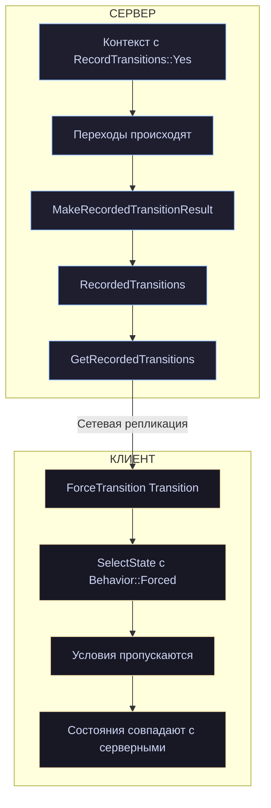

Два ограничения из комментария: экземпляр должен быть **запущен**, и не должен быть в состоянии сбоя.

### 14.14. Отладка и логирование

cpp

```cpp
protected:
    FString GetStateStatusString(const FStateTreeExecutionState& ExecState) const;
    FString GetSafeStateName(const FStateTreeExecutionFrame& CurrentFrame, const FStateTreeStateHandle State) const;
    FString GetSafeStateName(const UStateTree* StateTree, const FStateTreeStateHandle State) const;
    FString DebugGetStatePath(TConstArrayView<FStateTreeExecutionFrame> ActiveFrames,
                              const FStateTreeExecutionFrame* CurrentFrame = nullptr,
                              const int32 ActiveStateIndex = INDEX_NONE) const;
    FString DebugGetEventsAsString() const;
```

«Safe» в названии означает устойчивость к невалидным handle'ам — вернётся описание вместо падения. Используйте их в своих логах вместо ручного форматирования.

Упоминание в комментариях `STATETREE_LOG` и `STATETREE_CLOG` — макросы логирования StateTree (объявлены в `StateTreeTypes.h`/`StateTreeExecutionTypes.h` области видимости), которые автоматически подставляют описание экземпляра как префикс.

cpp

```cpp
UE_DEPRECATED(5.6, "Use FStateTreeExecutionExtension::GetInstanceDescription instead")
virtual FString GetInstanceDescription() const final;
```

Опять приём с `final` (главы 7, 8, 10). Описание экземпляра переехало в расширение — теперь владелец решает, как называть свои экземпляры в логах.

### 14.15. `FConstStateTreeExecutionContextView`

cpp

```cpp
/**
 * The const version of a StateTree Execution Context that prevents using the FStateTreeInstanceData with non-const member function.
 */
struct FConstStateTreeExecutionContextView
{
    FConstStateTreeExecutionContextView(UObject& InOwner, const UStateTree& InStateTree, const FStateTreeInstanceData& InInstanceData)
        : ExecutionContext(InOwner, InStateTree, const_cast<FStateTreeInstanceData&>(InInstanceData))
    {}

    operator const FStateTreeExecutionContext& () { return ExecutionContext; }
    const FStateTreeExecutionContext& Get() const { return ExecutionContext; }

private:
    FStateTreeExecutionContext ExecutionContext;
};
```

Честный `const_cast`, обёрнутый так, чтобы наружу торчал только `const`-интерфейс. Нужно потому, что `FStateTreeExecutionContext` конструктивно требует неконстантную instance data (он умеет писать), но вызывающий может гарантировать, что писать не будет.

Приём допустимый, но не образцовый — не копируйте его бездумно. В новом коде предпочтительнее `FStateTreeReadOnlyExecutionContext`, у которого константность обеспечена типом.

### 14.16. Полная картина исполнения

Соберём всё. Это реконструкция по сигнатурам, фазам и комментариям — точная последовательность в `.cpp`, но каркас надёжен.

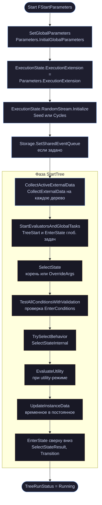

### 14.17. Практические выводы

1. **Контекст — временный объект на стеке.** Копирование запрещено конструктивно; хранить нельзя.
2. **Выбирайте минимальный достаточный уровень.** Для отправки события хватает `FStateTreeMinimalExecutionContext` — он не требует контекстных и внешних данных.
3. **`AreContextDataViewsValid()` перед каждым `Start`/`Tick`** — стандартная последовательность из документирующего комментария.
4. **`RequestTransition` из `TriggerTransitions()` применяется сразу**, из `Tick()` — со следующей фазы. Это `bAllowDirectTransitions`.
5. **`check` на `CurrentNodeDataHandle`** означает обращение к данным вне обработки узла. Решение — `GetInstanceDataStructRef` или асинхронный контекст.
6. **`TickUpdateTasks` + `TickTriggerTransitions`** дают контроль над расписанием — используйте в батчевых системах.
7. **`FStartParameters::RandomSeed`** задавайте явно для тестов и реплеев.
8. **`SelectStateOverrideArgs`** — способ стартовать не с корня, частичная замена сохранению состояния.
9. **`ForceTransition` + `EStateTreeRecordTransitions::Yes`** — контур сетевой синхронизации.
10. **Используйте `GetSafeStateName` и `DebugGetStatePath`** в своих логах: они устойчивы к невалидным данным.

---

## Глава 15. События и делегаты

Два механизма реактивности в StateTree. Событие — это широковещательное сообщение с полезной нагрузкой, живущее одну фазу обработки. Делегат — именованный канал «источник → подписчик», работающий мгновенно.

Их путают, поэтому начнём с различий, а потом разберём каждый.

| **Параметр**                 | **Событие (Event)**       | **Делегат (Delegate)**           |
| ---------------------------- | ------------------------- | -------------------------------- |
| **Идентификация**            | `FGameplayTag`            | Диспетчер, связанный в редакторе |
| **Полезная нагрузка**        | `FInstancedStruct`        | Нет                              |
| **Адресация**                | Широковещательно          | Точечно (диспетчер → слушатель)  |
| **Время жизни**              | Одна фаза переходов       | Подписка на время активации      |
| **Биндинг payload**          | Да                        | Нет                              |
| **Триггер перехода**         | `OnEvent`                 | `OnDelegate`                     |
| **Пробуждает спящее дерево** | Да (`ETickReason::Event`) | Да (`ETickReason::Delegate`)     |
| **Откуда отправить**         | Извне и изнутри           | Изнутри дерева                   |

### 15.1. `FStateTreeEvent`

cpp

```cpp
USTRUCT(BlueprintType)
struct FStateTreeEvent
{
    GENERATED_BODY()

    FStateTreeEvent() = default;
    explicit FStateTreeEvent(const FGameplayTag InTag);
    explicit FStateTreeEvent(const FGameplayTag InTag, const FConstStructView InPayload, const FName InOrigin);

    friend inline uint32 GetTypeHash(const FStateTreeEvent& Event)
    {
        uint32 Hash = GetTypeHash(Event.Tag);
        if (Event.Payload.IsValid())
        {
            Hash = HashCombineFast(Hash, Event.Payload.GetScriptStruct()->GetStructTypeHash(Event.Payload.GetMemory()));
        }
        return Hash;
    }

    /** Tag describing the event */
    UPROPERTY(EditAnywhere, BlueprintReadWrite, Category = "Default", meta=(Categories="StateTreeEvent"))
    FGameplayTag Tag;

    /** Optional payload for the event. */
    UPROPERTY(EditAnywhere, BlueprintReadWrite, Category = "Default")
    FInstancedStruct Payload;

    /** Optional info to describe who sent the event. */
    UPROPERTY(EditAnywhere, BlueprintReadWrite, Category = "Default")
    FName Origin;

private:
    uint8 bIsPendingForNextTransitionProcessing : 1 = false;

    friend struct FStateTreeEventQueue;
};
```

Три поля наружу и один приватный флаг.

**`meta=(Categories="StateTreeEvent")`** на теге — фильтр в редакторе: выпадающий список покажет только теги из ветки `StateTreeEvent`. Заводите свои события как `StateTreeEvent.Combat.Damage`, `StateTreeEvent.Interaction.Started` — тогда они будут аккуратно сгруппированы и не смешаются с прочими тегами проекта.

**`Payload` — `FInstancedStruct`**, то есть произвольная `USTRUCT` с полной рефлексией. Именно поэтому payload можно биндить (`EStateTreeBindableStructSource::TransitionEvent` / `StateEvent`, глава 11).

**`Origin`** — необязательное «кто отправил». Не используется движком, чисто для вашей диагностики и фильтрации.

`GetTypeHash` учитывает и тег, и содержимое payload через `GetStructTypeHash`. Это то, что позволяет `FStateTreeTransitionDelayedState::CapturedEventHash` (глава 5) сравнивать события без разыменования.

### 15.2. `FStateTreeSharedEvent`

cpp

```cpp
USTRUCT()
struct FStateTreeSharedEvent
{
    GENERATED_BODY()

    explicit FStateTreeSharedEvent(const FGameplayTag InTag, const FConstStructView InPayload, const FName InOrigin)
        : Event(MakeShared<FStateTreeEvent>(InTag, InPayload, InOrigin)) {}
    explicit FStateTreeSharedEvent(const FStateTreeEvent& InEvent)
        : Event(MakeShared<FStateTreeEvent>(InEvent)) {}

    void AddStructReferencedObjects(FReferenceCollector& Collector);

    const FStateTreeEvent* Get() const;
    FStateTreeEvent* GetMutable();
    const FStateTreeEvent* operator->() const;
    FStateTreeEvent* operator->();
    const FStateTreeEvent& operator*();
    FStateTreeEvent& operator*() const;
    bool IsValid() const;
    bool operator==(const FStateTreeSharedEvent& Other) const { return Event == Other.Event; }

protected:
    TSharedPtr<FStateTreeEvent> Event;
};
```

Обёртка в `TSharedPtr`. Зачем: событие может одновременно находиться в очереди, быть захваченным отложенным переходом (`CapturedEvent`), участвовать в выборе состояния (`FSelectionEventWithID`) и быть привязанным к биндингу. Копировать payload на каждое использование — расточительно.

Два наблюдения о качестве кода:

cpp

```cpp
const FStateTreeEvent& operator*();          // неконстантный метод → const ссылка
FStateTreeEvent& operator*() const;          // const метод → неконстантная ссылка
```

Константность перепутана местами. Работает (это `TSharedPtr`, константность не пробрасывается), но выглядит как опечатка. Не удивляйтесь.

cpp

```cpp
bool operator==(const FStateTreeSharedEvent& Other) const { return Event == Other.Event; }
```

Сравнение — **по указателю**, а не по содержимому. Два события с одинаковым тегом и payload не равны, если это разные объекты. Это правильно для `ConsumeEvent`, которому нужно найти конкретный экземпляр.

`AddStructReferencedObjects` и трейт `WithAddStructReferencedObjects` — payload может содержать ссылки на `UObject`, их надо видеть сборщику мусора.

### 15.3. Очередь событий

cpp

```cpp
USTRUCT()
struct FStateTreeEventQueue
{
    GENERATED_BODY()

    /** Maximum number of events that can be buffered. */
    static constexpr int32 MaxActiveEvents = 64;

    TConstArrayView<FStateTreeSharedEvent> GetEventsView() const;
    TArrayView<FStateTreeSharedEvent> GetMutableEventsView();
    void Reset();
    bool HasEvents() const;

    bool SendEvent(const UObject* Owner, const FGameplayTag& Tag,
                   const FConstStructView Payload = FConstStructView(), const FName Origin = FName());

    bool ConsumeEvent(const FStateTreeSharedEvent& Event);

    void ClearEventsForCurrentTransitionProcessingPhase();

    template<typename TFunc>
    void ForEachEvent(TFunc&& Function)
    {
        for (TArray<FStateTreeSharedEvent>::TIterator It(SharedEvents); It; ++It)
        {
            const EStateTreeLoopEvents Result = Function(*It);
            if (Result == EStateTreeLoopEvents::Break) { break; }
            if (Result == EStateTreeLoopEvents::Consume) { It.RemoveCurrent(); }
        }
    }

protected:
    TArray<FStateTreeSharedEvent>& GetEventsArray() { return SharedEvents; };

    UPROPERTY()
    TArray<FStateTreeSharedEvent> SharedEvents;

    uint8 bNewlyAddedEventsShouldBePendingForNextTransitionProcessing : 1 = false;

    friend UE::StateTree::Event::FEventsPendingForNextTransitionProcessingScope;
};
```

#### Лимит в 64 события

cpp

```cpp
static constexpr int32 MaxActiveEvents = 64;
```

`SendEvent` возвращает `bool` — при переполнении вернёт `false`. Параметр `Owner` нужен именно для этого: _«Optional pointer to an owner UObject that is used for logging errors»_.

Шестьдесят четыре события в буфере — это много для нормальной работы. Если вы упираетесь в лимит, скорее всего происходит одно из двух:

- дерево не тикает (события копятся, никто их не разбирает);
- вы отправляете события в цикле по кадру.

Второе особенно коварно: событие в StateTree — это сигнал, а не поток данных. Для «текущего значения чего-либо» используйте биндинги, не события.

#### Флаг управления итерацией

cpp

```cpp
UENUM()
enum class EStateTreeLoopEvents : uint8
{
    /** Continues to next event. */
    Next,
    /** Stops the event handling loop. */
    Break,
    /** Consumes and removes the current event. */
    Consume,
};
```

`ForEachEvent` реализован через `TIterator` с `RemoveCurrent()` — безопасное удаление во время обхода.

cpp

```cpp
Context.ForEachEvent([this, &Context](const FStateTreeSharedEvent& Event)
{
    if (Event->Tag.MatchesTag(MyDamageTag))
    {
        if (const FDamageInfo* Info = Event->Payload.GetPtr<FDamageInfo>())
        {
            ProcessDamage(*Info);
        }
        return EStateTreeLoopEvents::Consume;   // обработали — убираем
    }
    return EStateTreeLoopEvents::Next;
});
```

**`Consume` — важное решение.** Событие, которое вы поглотили, не увидят другие узлы и переходы. Используйте, когда обработка эксклюзивна; иначе возвращайте `Next`.

### 15.4. Жизненный цикл события

Это ключевой момент главы, и он объясняется комментарием к скоупу:

cpp

```cpp
namespace UE::StateTree::Event
{
    /**
    * State Tree Events are cleared at end of each transition processing phase. (Inside TriggerTransitions()).
    * When in scope, events sent will live through the current phase and cleared on the next transition processing phase.
    * Used internally by TriggerTransitions and ParallelTree.
    */
    struct FEventsPendingForNextTransitionProcessingScope
    {
        explicit FEventsPendingForNextTransitionProcessingScope(TNotNull<FStateTreeEventQueue*> EventQueue);
        ~FEventsPendingForNextTransitionProcessingScope();

        TNotNull<FStateTreeEventQueue*> ScopedEventQueue;
        uint8 bSavedIsPendingForNextTransitionProcessingScope : 1 = false;
    };
}
```

**События очищаются в конце каждой фазы обработки переходов.** Не в конце кадра, не по таймауту — в конце `TriggerTransitions()`.

Проблема, которую решает скоуп: что делать с событием, отправленным **во время** обработки переходов? Если его очистить вместе со всеми, его никто не увидит — фаза уже идёт, и переходы, которые могли бы на него отреагировать, возможно, уже проверены.

Решение — пометить такое событие «отложенным на следующую фазу»:

cpp

```cpp
// FStateTreeEvent:
uint8 bIsPendingForNextTransitionProcessing : 1 = false;

// FStateTreeEventQueue:
uint8 bNewlyAddedEventsShouldBePendingForNextTransitionProcessing : 1 = false;
```

И очистка учитывает флаг:

cpp

```cpp
/**
 * Clear all events in the queue that are not marked pending for next transition processing phase,
 * And unmarks events that are pending for next transition processing since we are advancing to the next.
 */
void ClearEventsForCurrentTransitionProcessingPhase();
```

Два действия за один вызов: непомеченные удалить, помеченные — размаркировать (они станут обычными и будут обработаны в наступающей фазе).

Комментарий указывает второго потребителя: **ParallelTree**. Параллельные деревья работают в рамках одной фазы, и события между ними должны корректно переживать границу.

**Практический вывод:** событие, отправленное из `Tick()` задачи, будет обработано в фазе переходов **этого же кадра**. Событие, отправленное из `TriggerTransitions()` или из обработчика перехода, — в **следующей** фазе.

### 15.5. Куда события попадают

Три места назначения:

**1. Переходы с триггером `OnEvent`.** В `FCompactStateTransition` есть `FCompactEventDesc RequiredEvent` (глава 3). Матчинг по тегу (`MatchesTag`, иерархически) и/или по типу payload.

**2. Условия входа в состояние.** `FCompactStateTreeState::RequiredEventToEnter` — состояние может требовать события для активации. Плюс `bConsumeEventOnSelect` (по умолчанию `true`): выбор состояния «съедает» событие.

**3. Пробуждение задач.** `bShouldCallTickOnlyOnEvents` (глава 8) — задача тикает только при наличии событий.

Плюс косвенно — payload доступен биндингам через `EStateTreeBindableStructSource::TransitionEvent` и `StateEvent`.

#### Захват события отложенным переходом

Из главы 5:

cpp

```cpp
struct FStateTreeTransitionDelayedState
{
    UE::StateTree::FActiveStateID StateID;
    UPROPERTY() FStateTreeSharedEvent CapturedEvent;    // ← событие сохранено
    UPROPERTY() float TimeLeft = 0.0f;
    UPROPERTY() uint32 CapturedEventHash = 0u;
    UPROPERTY() FStateTreeIndex16 TransitionIndex = Invalid;
};
```

События живут одну фазу, а задержка перехода может быть секундами. Поэтому событие **захватывается** — `TSharedPtr` удерживает его живым, пока переход ждёт. Биндинги на payload будут работать и через две секунды.

### 15.6. Разделяемая очередь

cpp

```cpp
// FStateTreeInstanceStorage:
const TSharedRef<FStateTreeEventQueue>& GetSharedMutableEventQueue();
bool IsOwningEventQueue() const;
void SetSharedEventQueue(const TSharedRef<FStateTreeEventQueue>& InSharedEventQueue);
```

Плюс `FStartParameters::SharedEventQueue` (глава 14).

Сценарий: на акторе два дерева — боевое и социальное. Событие «получил урон» должны увидеть оба. Без разделения очереди пришлось бы отправлять дважды.

cpp

```cpp
// Первое дерево запускается обычно.
CombatContext.Start();

// Второе — с очередью первого.
FStateTreeExecutionContext::FStartParameters Params;
Params.SharedEventQueue = CombatInstanceData.GetSharedMutableEventQueue();
SocialContext.Start(Params);
```

Учтите последствие: `Consume` в одном дереве уберёт событие и для второго. Разделяемая очередь — это буквально одна очередь.

### 15.7. Делегаты

Здесь честная оговорка: `StateTreeDelegate.h` в наш пакет не входит, поэтому `FStateTreeDelegateDispatcher` и `FStateTreeDelegateListener` я описываю по их использованию в остальных файлах. Структура механизма из этого читается однозначно, но точные поля и методы этих двух типов уточните в своей версии.

#### Три уровня

**Уровень 1. Немедленные колбэки** — `FStateTreeDelegateActiveListeners` (глава 5):

cpp

```cpp
struct FStateTreeDelegateActiveListeners
{
    void Add(const FStateTreeDelegateListener& Listener, FSimpleDelegate Delegate,
             UE::StateTree::FActiveFrameID FrameID, UE::StateTree::FActiveStateID StateID,
             FStateTreeIndex16 OwningNodeIndex);
    void Remove(const FStateTreeDelegateListener& Listener);
    void RemoveAll(UE::StateTree::FActiveFrameID FrameID);
    void RemoveAll(UE::StateTree::FActiveStateID StateID);
    void BroadcastDelegate(const FStateTreeDelegateDispatcher& Dispatcher, const FStateTreeExecutionState& Exec);
};
```

**Уровень 2. Флаги для переходов** — в `FStateTreeInstanceStorage` (глава 6):

cpp

```cpp
void MarkDelegateAsBroadcasted(const FStateTreeDelegateDispatcher& Dispatcher);
bool IsDelegateBroadcasted(const FStateTreeDelegateDispatcher& Dispatcher) const;
TArray<FStateTreeDelegateDispatcher> StealBroadcastedDelegates();
bool HasBroadcastedDelegates() const;
void ResetBroadcastedDelegates();
```

**Уровень 3. Триггер перехода** — `EStateTreeTransitionTrigger::OnDelegate` (0x10) и `FCompactStateTransition::RequiredDelegateDispatcher`.

Один вызов `BroadcastDelegate` делает обе вещи, что и зафиксировано в комментарии:

> _«Broadcasts the delegate. It executes bound delegates immediately and triggers bound transitions (when transitions are evaluated).»_

Немедленно — лямбды. При обработке переходов — переходы `OnDelegate`.

#### API контекста

cpp

```cpp
void BroadcastDelegate(const FStateTreeDelegateDispatcher& Dispatcher);
void BindDelegate(const FStateTreeDelegateListener& Listener, FSimpleDelegate Delegate);
void UnbindDelegate(const FStateTreeDelegateListener& Listener);
```

Контракт `BindDelegate` из комментария в асинхронном контексте:

> _«If the listener was previously registered, then unregister it first before registering it again with the new delegate callback. The listener is bound to a dispatcher in the editor.»_

Два факта: повторная привязка **заменяет** предыдущую (не накапливает), и **связь диспетчера со слушателем настраивается в редакторе**, а не в коде.

Это ключ к пониманию модели. Ваш код не знает, кто кого слушает:

- задача-источник объявляет **диспетчер** и вызывает `BroadcastDelegate`;
- задача-получатель объявляет **слушателя** и подписывается через `BindDelegate`;
- дизайнер в редакторе **соединяет** их.

Как биндинги свойств, только для сигналов.

#### Автоматическая отписка

cpp

```cpp
void RemoveAll(UE::StateTree::FActiveFrameID FrameID);
void RemoveAll(UE::StateTree::FActiveStateID StateID);
```

И в контексте:

cpp

```cpp
protected:
    void RemoveAllDelegateListeners();
```

Каждый слушатель помнит `FrameID`, `StateID` и `OwningNodeIndex`. При выходе из состояния все его подписки снимаются автоматически.

**Это снимает целый класс ошибок.** Вам не нужно помнить об отписке в `ExitState` — движок сделает это. (Отписываться вручную всё же можно и нужно, если подписка должна жить короче состояния.)

#### Безопасность во время рассылки

cpp

```cpp
private:
    void RemoveUnbounds();

    TArray<FActiveListener> Listeners;
    uint32 BroadcastingLockCount : 31 = 0;
    uint32 bContainsUnboundListeners : 1 = false;
```

Механику мы разбирали в главе 5. Причина, по которой она нужна именно здесь: делегат приводит к переходу, переход — к выходу из состояния, выход — к отписке. Всё внутри рассылки. Без защиты массив менялся бы под итератором.

Оба `Add` и `Remove` документированы как _«Safe to be called during broadcasting»_.

### 15.8. Завершение задач через делегаты

Третий, самый специфичный механизм. Собираем его из фрагментов, разбросанных по файлам.

**В `UStateTree`:**

cpp

```cpp
UPROPERTY() TArray<UE::StateTree::FTaskCompletionDispatcher> TaskCompletionDispatchers;
TConstArrayView<UE::StateTree::FTaskCompletionDispatcher> GetTaskCompletionDispatchers() const;
```

**В `FStateTreeTaskBase`:**

cpp

```cpp
/** True if the node is bound to a task completion delegate listener. */
UPROPERTY() uint8 bHasTaskCompletionDelegateDispatcher : 1;
```

**В `FStateTreePropertyPathBinding`:**

cpp

```cpp
void SetCompletionBinding(const UE::StateTree::ETaskCompletionCondition Condition);
TOptional<UE::StateTree::ETaskCompletionCondition> GetCompletionBinding() const;
bool IsTaskCompletionBinding() const;

/**
 * Whether this is a task completion binding.
 * The SourcePath.StructID is set to the task node ID (template)
 * The SourcePath.Segments is empty.
 */
UPROPERTY() TOptional<UE::StateTree::ETaskCompletionCondition> TaskCompletionCondition;
```

**В `FStateTreeExecutionContext`:**

cpp

```cpp
namespace UE::StateTree::ExecutionContext
{
    using FTaskCompletionDelegateDispatcherContainer = TArray<FStateTreeDelegateDispatcher, TInlineAllocator<3>>;

    /** Find the dispatcher for a task completion if one matches the task node and condition. */
    FTaskCompletionDelegateDispatcherContainer GetTaskCompletionDispatcher(
        TNotNull<const UStateTree*> StateTree, int32 NodeIndex, UE::StateTree::ETaskCompletionStatus TaskStatus);
}

// приватный метод контекста:
void BroadcastTaskCompletionDispatchers(TNotNull<const UStateTree*> StateTree, int32 NodeIndex,
                                        UE::StateTree::ETaskCompletionStatus TaskStatus);
```

Складывается картина:

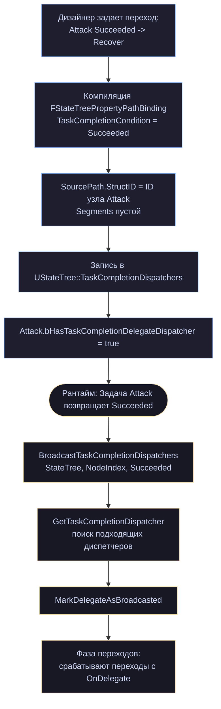

Зачем это нужно, если есть `OnStateCompleted`? Потому что `OnStateCompleted` реагирует на завершение **состояния**, а здесь — на завершение **конкретной задачи**.

Состояние с тремя задачами и `CompletionTasksControl = All` завершится, когда отчитаются все три. А переход по завершению первой из них можно сделать только этим механизмом.

Пять функций преобразования статусов в том же namespace обслуживают эту машинерию:

cpp

```cpp
EStateTreeRunStatus GetPriorityRunStatus(EStateTreeRunStatus A, EStateTreeRunStatus B);
UE::StateTree::ETaskCompletionStatus CastToTaskStatus(EStateTreeFinishTaskType FinishTask);
EStateTreeRunStatus CastToRunStatus(EStateTreeFinishTaskType FinishTask);
UE::StateTree::ETaskCompletionStatus CastToTaskStatus(EStateTreeRunStatus InStatus);
EStateTreeRunStatus CastToRunStatus(UE::StateTree::ETaskCompletionStatus InStatus);
```

`GetPriorityRunStatus` — «какой из двух статусов главнее». Нужна, когда несколько задач отчитались разными статусами и надо вывести итог состояния.

### 15.9. Что выбрать

**Биндинг** — когда нужно **текущее значение**.

```
«здоровье игрока», «позиция цели», «количество врагов»
```

Дёшево, декларативно, не требует реакции.

**Событие** — когда нужно сообщить о **факте с данными**, и получатель заранее неизвестен.

```
«получен урон 25 от огня», «квест завершён», «начато взаимодействие»
```

Работает извне дерева, широковещательно, поддерживает payload и биндинг на него.

**Делегат** — когда нужна **точечная связь внутри дерева**, настраиваемая дизайнером.

```
«эта задача закончила подготовку → та задача начинает»
«эта задача завершилась успехом → переход»
```

Без payload, но с автоматическим управлением временем жизни подписки.

Практический ориентир: **если сигнал приходит извне дерева — это событие**. Извне вы не имеете доступа к диспетчерам, только к `SendEvent`.

### 15.10. Паттерны

#### Событие с payload и биндингом

cpp

```cpp
USTRUCT(BlueprintType)
struct FDamageEventPayload
{
    GENERATED_BODY()

    UPROPERTY(EditAnywhere, BlueprintReadWrite, Category = "Damage")
    float Amount = 0.0f;

    UPROPERTY(EditAnywhere, BlueprintReadWrite, Category = "Damage")
    TObjectPtr<AActor> Instigator = nullptr;

    UPROPERTY(EditAnywhere, BlueprintReadWrite, Category = "Damage")
    FGameplayTag DamageType;
};
```

Отправка снаружи:

cpp

```cpp
void AMyCharacter::HandleDamage(float Amount, AActor* Instigator)
{
    if (UStateTreeComponent* ST = FindComponentByClass<UStateTreeComponent>())
    {
        FDamageEventPayload Payload;
        Payload.Amount = Amount;
        Payload.Instigator = Instigator;

        ST->SendStateTreeEvent(
            FGameplayTag::RequestGameplayTag(TEXT("StateTreeEvent.Combat.Damaged")),
            FConstStructView::Make(Payload));
    }
}
```

В дереве: переход `OnEvent` с тегом `StateTreeEvent.Combat.Damaged` → состояние `React`. Задача внутри `React` биндит своё свойство `Instigator` к payload события. Ни строчки клея.

#### Обработка событий в задаче

cpp

```cpp
FMyReactiveTask()
{
    bShouldCallTick = false;
    bShouldCallTickOnlyOnEvents = true;      // тикаем только при событиях
}

EStateTreeRunStatus FMyReactiveTask::Tick(FStateTreeExecutionContext& Context, const float DeltaTime) const
{
    FInstanceDataType& Data = Context.GetInstanceData(*this);

    Context.ForEachEvent([&Data, this](const FStateTreeSharedEvent& Event)
    {
        if (!Event->Tag.MatchesTag(InterestingTag))
        {
            return EStateTreeLoopEvents::Next;
        }
        if (const FDamageEventPayload* Payload = Event->Payload.GetPtr<FDamageEventPayload>())
        {
            Data.AccumulatedDamage += Payload->Amount;
        }
        return EStateTreeLoopEvents::Next;    // не поглощаем — пусть увидят другие
    });

    return EStateTreeRunStatus::Running;
}
```

Эта комбинация флагов — то, что позволяет дереву спать между событиями (глава 17).

#### Подписка на внешний делегат из задачи

cpp

```cpp
EStateTreeRunStatus FWatchDoorTask::EnterState(FStateTreeExecutionContext& Context,
                                               const FStateTreeTransitionResult& Transition) const
{
    FInstanceDataType& Data = Context.GetInstanceData(*this);
    if (!Data.Door)
    {
        return EStateTreeRunStatus::Failed;
    }

    Data.DelegateHandle = Data.Door->OnDoorOpened.AddLambda(
        [WeakContext = Context.MakeWeakExecutionContext()]()
        {
            WeakContext.SendEvent(FGameplayTag::RequestGameplayTag(TEXT("StateTreeEvent.Door.Opened")));
        });

    return EStateTreeRunStatus::Running;
}

void FWatchDoorTask::ExitState(FStateTreeExecutionContext& Context,
                               const FStateTreeTransitionResult& Transition) const
{
    FInstanceDataType& Data = Context.GetInstanceData(*this);
    if (Data.Door && Data.DelegateHandle.IsValid())
    {
        Data.Door->OnDoorOpened.Remove(Data.DelegateHandle);
        Data.DelegateHandle.Reset();
    }
}
```

Обратите внимание на захват: `MakeWeakExecutionContext()`, а не `this` и не `&Context`. Контекст умрёт сразу после `EnterState`; слабый контекст переживёт (глава 16).

Здесь мы конвертируем **внешний** делегат UE во **внутреннее** событие StateTree — типичный мост. Внешние делегаты и делегаты StateTree — разные системы.

#### Отправка события из другого потока

cpp

```cpp
AsyncTask(ENamedThreads::AnyBackgroundThreadNormalTask,
    [WeakContext = Context.MakeWeakExecutionContext(), MyTag]()
    {
        // ...долгая работа...
        WeakContext.SendEvent(MyTag);
    });
```

`FStateTreeWeakExecutionContext::SendEvent` проверяет валидность и молча возвращает `false`, если экземпляр умер.

### 15.11. Ловушки

**1. События как поток данных.**

cpp

```cpp
// НЕПРАВИЛЬНО — переполнит очередь за секунду:
void Tick(float DeltaTime)
{
    Component->SendStateTreeEvent(PositionUpdatedTag, MakePayload(GetActorLocation()));
}
```

Для текущих значений — биндинги. События — для дискретных фактов.

**2. Ожидание, что событие доживёт до следующего кадра.**

Событие живёт одну фазу обработки переходов. Если ваша задача не тикает или дерево спит, событие может быть очищено раньше, чем вы его увидите. Для «запомнить факт» используйте instance data или execution runtime data.

**3. `Consume` там, где не надо.**

Поглощённое событие не увидят другие узлы и переходы. Если ваша обработка не эксклюзивна — возвращайте `Next`.

**4. Тег без иерархии.**

`MatchesTag` иерархичен: переход на `StateTreeEvent.Combat` поймает и `StateTreeEvent.Combat.Damaged`, и `StateTreeEvent.Combat.Healed`. Это удобно, но требует дисциплины в проектировании тегов.

**5. Захват `this` или `&Context` в лямбде.**

Классическая ошибка. Узел константен и общий, контекст временный. Захватывайте `MakeWeakExecutionContext()` или `GetInstanceDataStructRef(*this)`.

**6. Ручная отписка от делегатов StateTree.**

Здесь наоборот — **не надо**: `RemoveAll(StateID)` снимет подписки при выходе из состояния автоматически. Ручная отписка нужна только для внешних делегатов UE.

### 15.12. Выводы

1. **Событие — тег плюс типизированный payload**, живёт одну фазу обработки переходов, адресуется широковещательно.
2. **`MaxActiveEvents = 64`.** Переполнение → `SendEvent` вернёт `false` и залогирует. Событие — сигнал, не поток.
3. **`FEventsPendingForNextTransitionProcessingScope`** гарантирует, что событие, отправленное во время фазы переходов, доживёт до следующей.
4. **Payload биндится** — источники `TransitionEvent` и `StateEvent`.
5. **Отложенный переход захватывает событие**, payload останется доступен.
6. **`bConsumeEventOnSelect`** (по умолчанию `true`): выбор состояния съедает событие.
7. **Делегат — точечная связь внутри дерева**, соединяемая дизайнером в редакторе, без payload.
8. **Подписки на делегаты StateTree снимаются автоматически** при выходе из кадра или состояния.
9. **Task completion dispatchers** позволяют переходу реагировать на завершение конкретной задачи, а не всего состояния.
10. **Извне дерева доступны только события.** Делегаты — внутренний механизм.

---

## Глава 16. Асинхронность

Задача запустила загрузку ассета, HTTP-запрос, вычисление в фоновом потоке. Через две секунды приходит результат — и его надо доставить обратно в дерево. Но контекст исполнения давно уничтожен, состояние могло смениться, актор мог быть удалён.

Эта глава — про то, как StateTree решает эту задачу.

Предупреждение из исходника стоит прочитать до всего остального:

> _«You are responsible for making it thread-safe if needed.»_

Оно повторяется дважды — у слабого и у сильного контекста. StateTree даёт вам **проверку живости**, а не потокобезопасность. Разницу разберём в конце главы.

### 16.1. Два типа и их роли

cpp

```cpp
FStateTreeWeakExecutionContext              сохраняемый, слабые ссылки, простые операции
    │  MakeStrongExecutionContext()
    ▼
TStateTreeStrongExecutionContext<true>      = FStateTreeStrongExecutionContext
TStateTreeStrongExecutionContext<false>     = FStateTreeStrongReadOnlyExecutionContext
                                            пинит объекты, даёт доступ к данным узла
```

Слабый контекст — это то, что вы **храните** (в лямбде, в поле, в очереди). Сильный — то, что вы **создаёте на месте** из слабого, когда нужно поработать.

Канонический пример из комментария к слабому контексту:

cpp

```cpp
ThreadSafeAsyncCallback.AddLambda(
    [MyTag, WeakContext = Context.MakeWeakExecutionContext()]()
    {
        if (WeakContext.SendEvent(MyTag))
        {
            // ...
        }
    });
```

И к сильному:

cpp

```cpp
ThreadSafeAsyncCallback.AddLambda(
    [MyTag, WeakContext = Context.MakeWeakExecutionContext()]()
    {
        TStateTreeStrongExecutionContext<true> StrongContext = WeakContext.CreateStrongContext();
        if (StrongContext.SendEvent())
        {
            // ...
        }
    });
```

(В комментарии упоминается `CreateStrongContext()`, а фактические методы называются `MakeStrongExecutionContext()` / `MakeStrongReadOnlyExecutionContext()` — комментарий отстал от кода. Мы это уже видели в главе 2: сверяйтесь с объявлениями, не с примерами в комментариях.)

### 16.2. `FStateTreeWeakExecutionContext`

cpp

```cpp
struct FStateTreeWeakExecutionContext
{
    template<bool bRequireWriteAccess>
    friend struct TStateTreeStrongExecutionContext;

public:
    FStateTreeWeakExecutionContext() = default;
    explicit FStateTreeWeakExecutionContext(const FStateTreeExecutionContext& Context);

    TStrongObjectPtr<UObject> GetOwner() const { return Owner.Pin(); }
    TStrongObjectPtr<const UStateTree> GetStateTree() const { return StateTree.Pin(); }

    [[nodiscard]] FStateTreeStrongReadOnlyExecutionContext MakeStrongReadOnlyExecutionContext() const;
    [[nodiscard]] FStateTreeStrongExecutionContext MakeStrongExecutionContext() const;

    bool SendEvent(const FGameplayTag Tag, const FConstStructView Payload = FConstStructView(),
                   const FName Origin = FName()) const;
    bool RequestTransition(FStateTreeStateHandle TargetState,
                           EStateTreeTransitionPriority Priority = EStateTreeTransitionPriority::Normal,
                           EStateTreeSelectionFallback Fallback = EStateTreeSelectionFallback::None) const;
    bool BroadcastDelegate(const FStateTreeDelegateDispatcher& Dispatcher) const;
    bool BindDelegate(const FStateTreeDelegateListener& Listener, FSimpleDelegate Delegate) const;
    bool UnbindDelegate(const FStateTreeDelegateListener& Listener) const;
    bool FinishTask(EStateTreeFinishTaskType FinishType) const;
    bool UpdateScheduledTickRequest(UE::StateTree::FScheduledTickHandle Handle, FStateTreeScheduledTick ScheduledTick) const;

private:
    TWeakObjectPtr<UObject> Owner;
    TWeakObjectPtr<const UStateTree> StateTree;
    TWeakPtr<FStateTreeInstanceStorage> Storage;
    TWeakPtr<UE::StateTree::ExecutionContext::ITemporaryStorage> TemporaryStorage;

    UE::StateTree::FActiveFrameID FrameID;
    UE::StateTree::FActiveStateID StateID;
    FStateTreeIndex16 NodeIndex;
};
```

Семь полей, и все они — либо слабые ссылки, либо идентификаторы. **Ничего не удерживается от уничтожения.**

#### Что хранится и зачем

Четыре слабые ссылки образуют цепочку валидности: владелец, ассет, хранилище instance data, временное хранилище (глава 6). Любая из них может умереть, и тогда контекст невалиден.

Три идентификатора — самое интересное:

cpp

```cpp
UE::StateTree::FActiveFrameID FrameID;
UE::StateTree::FActiveStateID StateID;
FStateTreeIndex16 NodeIndex;
```

Это **не handle'ы**, а ID конкретных активаций (глава 5). Разница критична: handle `Combat` тот же самый и в первый заход, и во второй, а `FActiveStateID` — разный.

Именно поэтому в 5.6 переделали весь этот механизм. Старая версия (`FStateTreePropertyRefExternalHandle` из главы 12) идентифицировала кадр парой (`StateTree`, `RootState`) — структурно. Колбэк, взятый в первой активации, срабатывал во второй и работал с чужими данными. Идентификация по активации это исключает.

#### Все методы возвращают `bool`

Единообразный контракт: `false` означает «не получилось», без разбирательств почему. Из комментариев:

> _«@return false if the context is not valid or the event could not be sent.»_
> 
> _«@return false if the context is not valid or doesn't have a valid frame anymore or the request failed.»_

Никаких исключений, никаких `ensure` — асинхронный колбэк, приходящий к мёртвому дереву, это нормальная ситуация, а не ошибка.

cpp

```cpp
bool bSent = WeakContext.SendEvent(MyTag);
if (!bSent)
{
    // дерево остановлено, актор уничтожен, или очередь переполнена — всё это нормально
}
```

#### `FinishTask` — как он знает, какую задачу завершать

cpp

```cpp
/**
 * Finishes a task.
 * If called during tick processing, then the state completes immediately.
 * If called outside of the tick processing, then the request is buffered and handled on the next tick.
 */
bool FinishTask(EStateTreeFinishTaskType FinishType) const;
```

Параметра «какая задача» нет. Ответ — в поле `NodeIndex`: слабый контекст создаётся **изнутри обработки конкретного узла** и запоминает его.

Отсюда важное правило: **создавайте слабый контекст в том узле, для которого он нужен**. Слабый контекст, созданный в задаче A, завершит задачу A, даже если вы используете его в коде, логически относящемся к B.

Устаревшая версия с явным указанием задачи показывает, как было раньше:

cpp

```cpp
PRAGMA_DISABLE_DEPRECATION_WARNINGS
    UE_DEPRECATED(5.6, "Use the version without FStateTreeWeakTaskRef.")
    bool FinishTask(const FStateTreeWeakTaskRef& Task, EStateTreeFinishTaskType FinishType) const;
PRAGMA_ENABLE_DEPRECATION_WARNINGS
```

`FStateTreeWeakTaskRef` полностью убран — его роль взяли `FrameID` + `StateID` + `NodeIndex`.

#### Двойное поведение

То же, что и у синхронного `RequestTransition` (глава 14): внутри обработки — сразу, снаружи — буферизованно. Асинхронный вызов почти всегда попадает во второй случай, то есть эффект вы увидите на следующем тике дерева.

Есть нюанс, о котором стоит помнить: если дерево спит (глава 17), «следующий тик» может не наступить сам. Но `SendEvent` и `RequestTransition` порождают причины пробуждения (`ETickReason::Event`, `ETickReason::TransitionRequest`), так что дерево проснётся.

### 16.3. `TStateTreeStrongExecutionContext`

cpp

```cpp
/**
 * Execution context to interact with the state tree instance data asynchronously.
 * It should only be allocated on the stack.
 * You are responsible for making it thread-safe if needed.
 */
template<bool bWithWriteAccess>
struct TStateTreeStrongExecutionContext
{
    TStateTreeStrongExecutionContext() = default;
    explicit TStateTreeStrongExecutionContext(const FStateTreeWeakExecutionContext& WeakContext);
    ~TStateTreeStrongExecutionContext();

    TStateTreeStrongExecutionContext(const TStateTreeStrongExecutionContext& Other) = delete;
    TStateTreeStrongExecutionContext& operator=(const TStateTreeStrongExecutionContext& Other) = delete;

    // ...

private:
    TStrongObjectPtr<UObject> Owner;
    TStrongObjectPtr<const UStateTree> StateTree;
    TSharedPtr<FStateTreeInstanceStorage> Storage;
    TSharedPtr<UE::StateTree::ExecutionContext::ITemporaryStorage> TemporaryStorage;

    UE::StateTree::FActiveFrameID FrameID;
    UE::StateTree::FActiveStateID StateID;
    FStateTreeIndex16 NodeIndex;
    uint8 bAccessAcquired : 1 = false;

    friend struct FStateTreePropertyRef;
};

using FStateTreeStrongExecutionContext = TStateTreeStrongExecutionContext<true>;
using FStateTreeStrongReadOnlyExecutionContext = TStateTreeStrongExecutionContext<false>;
```

Те же поля, но слабые ссылки стали сильными: `TStrongObjectPtr` и `TSharedPtr`. Конструктор пинит всё, деструктор отпускает.

**Только на стеке**, копирование удалено. Это RAII-объект: время жизни = время удержания.

#### Флаг `bAccessAcquired`

cpp

```cpp
uint8 bAccessAcquired : 1 = false;
```

Это захват доступа через методы из главы 6:

cpp

```cpp
void AcquireReadAccess();
void ReleaseReadAccess();
void AcquireWriteAccess();
void ReleaseWriteAccess();
```

Конструктор захватывает доступ соответствующего типа (чтение при `bWithWriteAccess == false`, запись при `true`), деструктор освобождает. Флаг нужен потому, что захват может не удаться — если ссылки уже мертвы, захватывать нечего.

Напомню: это **детектор**, а не лок. Он ловит нарушения MRSW-контракта в отладочных сборках. Никакой блокировки не происходит.

#### `requires` вместо `enable_if`

cpp

```cpp
bool SendEvent(...) const requires bWithWriteAccess;
bool RequestTransition(...) const requires bWithWriteAccess;
bool BroadcastDelegate(...) const requires bWithWriteAccess;
bool BindDelegate(...) const requires bWithWriteAccess;
bool UnbindDelegate(...) const requires bWithWriteAccess;
bool FinishTask(...) const requires bWithWriteAccess;
bool UpdateScheduledTickRequest(...) const requires bWithWriteAccess;
bool CopyInputBindings() const requires bWithWriteAccess;
bool CopyOutputBindings() const requires bWithWriteAccess;
```

C++20 concepts. Методы, изменяющие состояние, **не существуют** в read-only версии — не «есть, но падают», а буквально отсутствуют. Попытка вызвать даст ошибку компиляции.

Приятная деталь для читателя кода: `requires bWithWriteAccess` в конце сигнатуры сразу говорит «это изменяющая операция». Список выше — исчерпывающий перечень того, что меняет состояние дерева.

Доступные в обеих версиях:

cpp

```cpp
TStrongObjectPtr<UObject> GetOwner() const;
TStrongObjectPtr<const UStateTree> GetStateTree() const;
TSharedPtr<const FStateTreeInstanceStorage> GetStorage() const;
TSharedPtr<const UE::StateTree::ExecutionContext::ITemporaryStorage> GetTemporaryStorage() const;
UE::StateTree::Async::FActivePathInfo GetActivePathInfo() const;
bool IsValid() const;
template<typename T> ... GetInstanceDataPtr() const&;
template<typename T> ... GetExecutionRuntimeDataPtr() const&;
```

Обратите внимание: геттеры хранилищ возвращают **константные** указатели даже в mutable-версии. Прямой доступ к storage не даётся никому — только через методы.

#### Константность результата выводится из типа

cpp

```cpp
template<typename T>
std::conditional_t<bWithWriteAccess, T*, const T*> GetInstanceDataPtr() const&
{
    FStateTreeDataView DataView = GetInstanceDataPtrInternal();
    if (DataView.IsValid() && ensure(DataView.GetStruct() == T::StaticStruct()))
    {
        return static_cast<T*>(DataView.GetMutableMemory());
    }
    return nullptr;
}

template<typename T>
std::conditional_t<bWithWriteAccess, T*, const T*> GetInstanceDataPtr() const&& = delete;
```

Два момента.

**`std::conditional_t`** — read-only контекст даёт `const T*`. Обойти невозможно.

**`const&&` = delete** — с объяснением в комментарии:

> _«Only callable on lvalue because it would have lost the access track.»_

Это запрет на такое:

cpp

```cpp
// НЕ СКОМПИЛИРУЕТСЯ:
FMyData* Data = WeakContext.MakeStrongExecutionContext().GetInstanceDataPtr<FMyData>();
```

Здесь временный сильный контекст уничтожается в конце выражения — вместе с ним освобождается доступ и отпускаются пины. Указатель остаётся, но защищать его больше нечему.

Квалификатор `&&` на перегрузке ловит вызов на rvalue и удаляет её. Правильно:

cpp

```cpp
FStateTreeStrongExecutionContext StrongContext = WeakContext.MakeStrongExecutionContext();
if (FMyData* Data = StrongContext.GetInstanceDataPtr<FMyData>())
{
    // StrongContext жив, доступ удерживается
}
```

Приём стоит запомнить: **`= delete` на `&&`-перегрузке** — способ на уровне типов запретить использование результата от временного объекта. Применимо в любом RAII-коде.

Проверка типа через `ensure` (мягкая, вернёт `nullptr`), а не `check` — асинхронный код не должен падать из-за рассинхрона.

### 16.4. Проверка живости

cpp

```cpp
namespace UE::StateTree::Async
{
    struct FActivePathInfo
    {
        bool IsValid() const { return Frame != nullptr; }
        const FStateTreeNodeBase& GetNode() const;

        FStateTreeExecutionFrame* Frame = nullptr;
        FStateTreeExecutionFrame* ParentFrame = nullptr;
        FStateTreeStateHandle StateHandle;
        FStateTreeIndex16 NodeIndex;
    };
}
```

cpp

```cpp
/**
 * Checks if the context is valid.
 * Validity: Pinned Members are valid AND (WeakContext is created outside the ExecContext loop OR the recorded frame and state are still active)
 */
bool IsValid() const
{
    // skipped checking Pinned members, because the expression will be false if those members are not valid in ctor anyway.
    return IsValidInstanceStorage() && (!FrameID.IsValid() || GetActivePathInfo().IsValid());
}

private:
    bool IsValidInstanceStorage() const
    {
        return Owner && StateTree && Storage;
    }
```

Формула валидности читается так: **объекты живы И (контекст не привязан к кадру ИЛИ кадр со состоянием всё ещё активны)**.

Второе условие — с двумя ветками. `!FrameID.IsValid()` означает, что слабый контекст был создан **вне** обработки узла (например, владельцем напрямую) — тогда привязки к состоянию нет и проверять нечего. Если же контекст создан внутри узла, `FrameID` валиден, и требуется, чтобы активация была жива.

`GetActivePathInfo()` ищет кадр по `FrameID` в `FStateTreeExecutionState::ActiveFrames` (метод `FindActiveFrame`, глава 5). Не нашёл — вернёт невалидную структуру.

`ParentFrame` в `FActivePathInfo` нужен для связанных ассетов: часть данных кадра живёт в родительском (глава 5).

### 16.5. Копирование биндингов вручную

cpp

```cpp
/**
 * Copies the input bindings for the recorded node.
 * Propagates data FROM bound sources INTO the node's instance data (similar to what happens before Tick in normal execution).
 * Binding sources requiring context or external data are not available in async context and are skipped (and returns false).
 * Batches that include property functions cannot be evaluated without a full FStateTreeExecutionContext.
 * @return true if all bindings are copied.
 */
bool CopyInputBindings() const requires bWithWriteAccess;

/**
 * Copies the output bindings for the recorded node.
 * Propagates data FROM the node's instance data BACK to bound targets (similar to what happens after Tick in normal execution).
 * Output binding batches never contain property functions, so this call is always async-safe.
 * Binding targets requiring context or external data are skipped.
 * @return true if all bindings are copied.
 */
bool CopyOutputBindings() const requires bWithWriteAccess;
```

Два метода дают из асинхронного кода то, что обычно делает движок вокруг `Tick` (глава 11).

**Ограничения серьёзные, и они перечислены прямо:**

1. **Контекстные и внешние данные пропускаются.** Их нет в instance storage — они живут в `ContextAndExternalDataViews` полноценного контекста, которого здесь нет. Мы разбирали это в главе 6 через `DoesRequireExecutionContext`.
2. **Property-функции для входных биндингов не работают.** Функция — это узел, для его исполнения нужен полноценный контекст.
3. **Выходные биндинги async-safe всегда** — они по построению не содержат функций.

Возврат `false` означает «скопировано не всё». Разбираться, что именно пропущено, вы не сможете — только знать, что не полностью.

Практический вывод: **если ваш узел собирается работать асинхронно, не биндите его входы к контекстным или внешним данным**. Забиндите к выходу evaluator'а (глава 10) — тот лежит в `GlobalInstanceData` и доступен асинхронно.

Приватный помощник, который это реализует:

cpp

```cpp
bool CopyBindingBatchForAsync(const FStateTreeExecutionFrame* CurrentFrame, const FStateTreeDataView TargetView,
                              const FStateTreeIndex16 BindingsBatch) const requires bWithWriteAccess;
```

### 16.6. Пробуждение дерева из другого потока

cpp

```cpp
static void ScheduleNextTick(TNotNull<UObject*> Owner, TNotNull<const UStateTree*> RootStateTree,
                             FStateTreeInstanceStorage& Storage,
                             UE::StateTree::ETickReason Reason) requires bWithWriteAccess;
```

Приватный статический метод. Вызывается изнутри `SendEvent`, `RequestTransition`, `FinishTask` — то есть каждая изменяющая операция сообщает владельцу, что дерево пора разбудить.

Отсюда важная гарантия: **отправив событие из фонового потока, вы не обязаны отдельно будить дерево**. Оно проснётся.

Обратная сторона — `ScheduleNextTick` в конечном счёте вызывает `FStateTreeExecutionExtension::ScheduleNextTick` владельца (глава 17). У `UStateTreeComponent` это:

cpp

```cpp
virtual void ScheduleNextTick(const FContextParameters& Context, const FNextTickArguments& Args) override;
```

...который трогает компонент и его тик-функцию. **Компоненты UE не потокобезопасны.** Если вы вызываете `SendEvent` из фонового потока, вы косвенно дёргаете `SetComponentTickEnabled` не из игрового потока.

Это тот случай, когда предупреждение «You are responsible for making it thread-safe» перестаёт быть формальностью. Для компонентного владельца безопаснее переправить вызов в игровой поток:

cpp

```cpp
AsyncTask(ENamedThreads::GameThread, [WeakContext = MoveTemp(WeakContext), Tag]()
{
    WeakContext.SendEvent(Tag);
});
```

### 16.7. `FStateTreePropertyRef` в асинхронном контексте

cpp

```cpp
friend struct FStateTreePropertyRef;
```

Дружба нужна для доступа к приватным `Storage` и `TemporaryStorage`:

cpp

```cpp
template<class T, bool bWithWriteAccess>
std::conditional_t<bWithWriteAccess, T*, const T*>
FStateTreePropertyRef::GetPtrFromStrongExecutionContext(const TStateTreeStrongExecutionContext<bWithWriteAccess>& Context)
{
    UE::StateTree::Async::FActivePathInfo ActivePath = Context.GetActivePathInfo();
    if (ActivePath.IsValid())
    {
        return UE::StateTree::PropertyRefHelpers::GetMutablePtrToProperty<T>(
            *this, *Context.Storage, Context.TemporaryStorage.Get(), *ActivePath.Frame);
    }
    return nullptr;
}
```

Разбор — глава 12. Здесь отмечу симметрию: константность результата так же выводится из `bWithWriteAccess`.

### 16.8. Что StateTree гарантирует, а что нет

Соберём честную картину.

**Гарантирует:**

|Гарантия|Механизм|
|---|---|
|Объекты не исчезнут во время работы|`TStrongObjectPtr`/`TSharedPtr` в сильном контексте|
|Не попадёте в чужую активацию состояния|`FActiveFrameID` / `FActiveStateID`|
|Не запишете через read-only контекст|`requires bWithWriteAccess`|
|Не используете данные от временного контекста|`= delete` на `&&`-перегрузке|
|Дерево проснётся после вашей операции|`ScheduleNextTick` внутри изменяющих методов|
|Нарушения MRSW будут замечены|детектор доступа (не в Shipping)|

**Не гарантирует:**

|Не гарантируется|Что делать|
|---|---|
|Атомарность операций|сериализуйте доступ сами|
|Безопасность одновременной записи из двух потоков|MRSW: один писатель|
|Потокобезопасность владельца (компонента, актора)|направляйте вызовы в игровой поток|
|Что операция вообще выполнится|проверяйте возвращаемый `bool`|
|Доступность контекстных и внешних данных|не полагайтесь на них в async-путях|

Ключевая формулировка: детектор доступа — **не примитив синхронизации**. Он говорит «вы нарушили контракт», а не предотвращает нарушение. И только в отладочных сборках.

### 16.9. Паттерны

#### Отложенный колбэк с проверкой

cpp

```cpp
EStateTreeRunStatus FAsyncLoadTask::EnterState(FStateTreeExecutionContext& Context,
                                               const FStateTreeTransitionResult& Transition) const
{
    FInstanceDataType& Data = Context.GetInstanceData(*this);

    FStreamableManager& Streamable = UAssetManager::GetStreamableManager();
    Data.Handle = Streamable.RequestAsyncLoad(Data.AssetToLoad.ToSoftObjectPath(),
        FStreamableDelegate::CreateLambda([WeakContext = Context.MakeWeakExecutionContext()]()
        {
            // Колбэк придёт в игровом потоке — здесь безопасно.
            WeakContext.FinishTask(EStateTreeFinishTaskType::Succeeded);
        }));

    return EStateTreeRunStatus::Running;
}

void FAsyncLoadTask::ExitState(FStateTreeExecutionContext& Context,
                               const FStateTreeTransitionResult& Transition) const
{
    FInstanceDataType& Data = Context.GetInstanceData(*this);
    if (Data.Handle.IsValid())
    {
        Data.Handle->CancelHandle();
        Data.Handle.Reset();
    }
}
```

Обратите внимание: `ExitState` отменяет загрузку. Слабый контекст защитит от использования мёртвой активации, но зачем тратить ресурсы на загрузку, результат которой уже не нужен.

#### Запись результата в instance data

cpp

```cpp
EStateTreeRunStatus FBackgroundComputeTask::EnterState(FStateTreeExecutionContext& Context,
                                                       const FStateTreeTransitionResult& Transition) const
{
    FInstanceDataType& Data = Context.GetInstanceData(*this);
    Data.bDone = false;

    AsyncTask(ENamedThreads::AnyBackgroundThreadNormalTask,
        [WeakContext = Context.MakeWeakExecutionContext(), Input = Data.Input]()
        {
            const float Result = ExpensiveCompute(Input);       // фоновый поток, дерева не касаемся

            AsyncTask(ENamedThreads::GameThread, [WeakContext, Result]()
            {
                FStateTreeStrongExecutionContext Strong = WeakContext.MakeStrongExecutionContext();
                if (FInstanceDataType* Data = Strong.GetInstanceDataPtr<FInstanceDataType>())
                {
                    Data->Result = Result;
                    Data->bDone = true;
                    Strong.CopyOutputBindings();                 // опубликовать результат
                    Strong.FinishTask(EStateTreeFinishTaskType::Succeeded);
                }
            });
        });

    return EStateTreeRunStatus::Running;
}
```

Двухступенчатая схема: тяжёлое вычисление в фоне, работа с деревом — в игровом потоке. Это самый безопасный паттерн, и в большинстве случаев именно его и надо применять.

Входные данные (`Input`) захватываются **по значению** до ухода в поток. Не читайте instance data из фонового потока, если можете скопировать нужное заранее.

#### Сильный контекст vs прямые методы слабого

cpp

```cpp
// Одна операция — достаточно слабого:
WeakContext.SendEvent(MyTag);

// Несколько операций или доступ к данным — нужен сильный:
FStateTreeStrongExecutionContext Strong = WeakContext.MakeStrongExecutionContext();
if (Strong.IsValid())
{
    if (FInstanceDataType* Data = Strong.GetInstanceDataPtr<FInstanceDataType>())
    {
        Data->Progress = 1.0f;
    }
    Strong.CopyOutputBindings();
    Strong.SendEvent(DoneTag);
}
```

Разница не только в удобстве: слабый контекст пинит объекты **на каждый вызов** и отпускает. Сильный удерживает один раз на всё время жизни. Для серии операций это и быстрее, и безопаснее — состояние не может измениться между вызовами.

#### Read-only для диагностики

cpp

```cpp
void FMyDebugWidget::UpdateFromStateTree(const FStateTreeWeakExecutionContext& WeakContext)
{
    FStateTreeStrongReadOnlyExecutionContext Strong = WeakContext.MakeStrongReadOnlyExecutionContext();
    if (const FInstanceDataType* Data = Strong.GetInstanceDataPtr<FInstanceDataType>())
    {
        DisplayProgress(Data->Progress);
    }
    // Strong.SendEvent(...) — не скомпилируется, и это правильно
}
```

Для чтения всегда берите read-only версию. Тип гарантирует, что вы ничего не сломаете, и позволяет нескольким читателям сосуществовать по MRSW-контракту.

### 16.10. Ловушки

**1. Захват `this` или `&Context` в лямбде.**

cpp

```cpp
// НЕПРАВИЛЬНО:
SomeDelegate.AddLambda([this, &Context]() { /* ... */ });
```

`this` — общий константный узел (не «ваш» экземпляр), `Context` умрёт в конце вызова. Захватывайте `MakeWeakExecutionContext()`.

**2. Использование данных от временного сильного контекста.**

cpp

```cpp
// НЕ СКОМПИЛИРУЕТСЯ (и хорошо):
auto* Data = WeakContext.MakeStrongExecutionContext().GetInstanceDataPtr<FMyData>();
```

**3. Игнорирование возвращаемого `bool`.**

cpp

```cpp
// Плохо: не узнаете, что операция не прошла
WeakContext.SendEvent(MyTag);

// Лучше:
if (!WeakContext.SendEvent(MyTag))
{
    // дерево остановлено — возможно, нужно отменить свою работу
}
```

**4. Работа с деревом из произвольного потока при компонентном владельце.**

`ScheduleNextTick` дойдёт до `UStateTreeComponent`, который не потокобезопасен. Переправляйте в игровой поток.

**5. Хранение сильного контекста.**

Он RAII и держит пины. Хранение в поле = удержание актора и instance data от уничтожения на неопределённый срок. Храните слабый, создавайте сильный на месте.

**6. Ожидание, что `CopyInputBindings` скопирует всё.**

Контекстные и внешние данные, а также property-функции будут пропущены. Проверяйте возврат и проектируйте асинхронные узлы так, чтобы их входы были доступны асинхронно.

**7. Слабый контекст, созданный не в том узле.**

`FinishTask` завершит тот узел, в котором контекст создан. Создавайте его там, где он будет использоваться логически.

### 16.11. Выводы

1. **Слабый контекст храните, сильный создавайте на месте.** Слабый — семь слабых ссылок и ID; сильный — RAII с пинами и захватом доступа.
2. **Идентификация по активации** (`FActiveFrameID`/`FActiveStateID`), а не по структуре. Это то, ради чего механизм переделали в 5.6.
3. **Все методы возвращают `bool`.** Провал — нормальная ситуация, проверяйте.
4. **`requires bWithWriteAccess`** делит API на чтение и запись на уровне типов.
5. **`= delete` на `&&`-перегрузке** запрещает брать данные у временного контекста.
6. **Изменяющие операции сами будят дерево** через `ScheduleNextTick`.
7. **`CopyInputBindings` не увидит контекстные и внешние данные**; выходные биндинги async-safe всегда.
8. **Потокобезопасность — на вас.** Детектор доступа только ловит нарушения MRSW и только в отладке.
9. **Самый безопасный паттерн**: тяжёлая работа в фоне, взаимодействие с деревом — в игровом потоке.

---

## Глава 17. Scheduled tick: как дерево спит

Тысяча NPC, у каждого State Tree. Каждый кадр — тысяча вызовов `Tick`, обход активных состояний, копирование биндингов, проверка переходов. При 60 кадрах в секунду это шестьдесят тысяч обновлений логики в секунду, из которых подавляющее большинство ничего не меняет: NPC стоит на посту и ждёт.

Scheduled tick — механизм, позволяющий дереву сказать: «мне нечего делать, разбудите меня через две секунды» или «не будите вообще, пока не придёт событие».

Это самая практически ценная глава для тех, у кого в игре толпа.

### 17.1. Модель

Дерево не управляет своим тиком напрямую — оно **сообщает владельцу**, когда его надо разбудить. Владелец решает, как это реализовать: отключить тик компонента, поставить таймер, исключить агента из процессора.

Контур целиком:

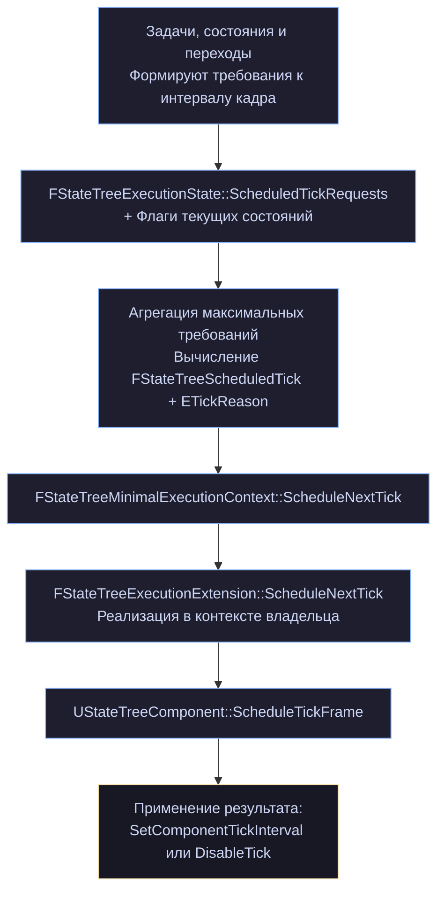

### 17.2. Четыре режима

Напомню из главы 5:

cpp

```cpp
static FStateTreeScheduledTick MakeSleep();
static FStateTreeScheduledTick MakeEveryFrames(UE::StateTree::ETickReason Reason = None);
static FStateTreeScheduledTick MakeNextFrame(UE::StateTree::ETickReason Reason = None);
static FStateTreeScheduledTick MakeCustomTickRate(float DeltaTime, UE::StateTree::ETickReason Reason = None);

bool ShouldSleep() const;
bool ShouldTickEveryFrames() const;
bool ShouldTickOnceNextFrame() const;
bool HasCustomTickRate() const;
float GetTickRate() const;
UE::StateTree::ETickReason GetReason() const;
```

Всё кодируется одним `float NextDeltaTime` плюс причина. Конструктор приватный — только через фабрики.

Практический смысл каждого:

|Режим|Когда возникает|
|---|---|
|`Sleep`|нечего делать; проснёмся по событию, делегату или запросу перехода|
|`EveryFrames`|есть тикающая задача или переход `OnTick`|
|`NextFrame`|одноразовая необходимость: отложенная обработка, завершение состояния|
|`CustomTickRate`|у состояния задан `CustomTickRate` или задача запросила частоту|

`MakeNextFrame` — тонкий случай. Он не означает «тикать каждый кадр»: это разовое пробуждение. После него расписание пересчитается заново.

### 17.3. Агрегация: побеждает самый требовательный

cpp

```cpp
// FStateTreeExecutionState
bool HasScheduledTickRequests() const;
FStateTreeScheduledTick GetScheduledTickRequest() const;   // "best/smallest" из всех
UE::StateTree::FScheduledTickHandle AddScheduledTickRequest(FStateTreeScheduledTick);
bool UpdateScheduledTickRequest(UE::StateTree::FScheduledTickHandle, FStateTreeScheduledTick);
bool RemoveScheduledTickRequest(UE::StateTree::FScheduledTickHandle);

private:
    void CacheScheduledTickRequest();

    struct FScheduledTickRequest
    {
        UE::StateTree::FScheduledTickHandle Handle;
        FStateTreeScheduledTick ScheduledTick;
    };
    TArray<FScheduledTickRequest> ScheduledTickRequests;
    FStateTreeScheduledTick CachedScheduledTickRequest;   // валиден, только если список не пуст
```

Правило из комментария к `AddScheduledTickRequest`:

> _«A request with a higher priority will supersede all other requests. ex: Task A request a custom time of 1FPS and Task B request a custom time of 2FPS. Both tasks will tick at 1FPS.»_

Формулировка сбивает с толку (в примере 1FPS «выигрывает» у 2FPS, хотя реже), поэтому по-простому: **итоговая частота — это максимум требований**. Порядок «требовательности»:

```
EveryFrames  >  CustomTickRate(малый интервал)  >  CustomTickRate(большой интервал)  >  Sleep
```

Одна задача, требующая `EveryFrames`, лишает сна всё дерево. Это единственно безопасное поведение — нельзя проспать чужую потребность.

`CachedScheduledTickRequest` пересчитывается в `CacheScheduledTickRequest()` при каждом изменении списка, чтобы `GetScheduledTickRequest()` был дешёвым: он вызывается в конце каждого тика.

### 17.4. Три источника требований

#### Источник 1: кэш-флаги состояний

Из главы 3:

cpp

```cpp
uint8 bCachedRequestTick : 1;                // задачи требуют тика каждый кадр
uint8 bCachedRequestTickOnlyOnEvents : 1;

bool DoesRequestTickTasks(bool bHasEvent) const
{
    return bCachedRequestTick || (bHasEvent && bCachedRequestTickOnlyOnEvents);
}
```

И симметрично в `UStateTree` для глобального уровня:

cpp

```cpp
bool DoesRequestTickGlobalTasks(bool bHasEvents) const
{
    return bCachedRequestGlobalTick || (bHasEvents && bCachedRequestGlobalTickOnlyOnEvents);
}
```

Обратите внимание: флаги называются `bCachedRequest...`, а не `bHas...`. Разница ровно в этом — `bHasTickTasks` означает «есть тикающие задачи», `bCachedRequestTick` означает «есть задачи, требующие пробуждения дерева». Разделяет их флаг задачи:

cpp

```cpp
/**
 * If set to true, the task is considered for scheduled tick. It will use these flags:
 * bShouldCallTick, bShouldCallTickOnlyOnEvents, and bShouldAffectTransitions.
 * It doesn't affect how the task ticks.
 */
uint8 bConsideredForScheduling : 1;    // по умолчанию true
```

Задача с `bConsideredForScheduling = false` будет тикать, когда дерево проснётся, но сама будить его не станет.

#### Источник 2: `CustomTickRate` состояния

cpp

```cpp
/** Custom tick rate of the state. In seconds. If set the state cannot sleep. */
float CustomTickRate = 0.f;
uint8 bHasCustomTickRate : 1 = false;
```

**«If set the state cannot sleep»** — категорично. Состояние с заданной частотой тикает с ней и не даёт дереву уснуть, пока активно.

Это удобный дизайнерский рычаг: «это состояние обновляй четыре раза в секунду, точность не нужна».

#### Источник 3: явные запросы задач

cpp

```cpp
// FStateTreeMinimalExecutionContext
UE::StateTree::FScheduledTickHandle AddScheduledTickRequest(FStateTreeScheduledTick ScheduledTick);
void UpdateScheduledTickRequest(UE::StateTree::FScheduledTickHandle Handle, FStateTreeScheduledTick ScheduledTick);
void RemoveScheduledTickRequest(UE::StateTree::FScheduledTickHandle Handle);
```

Программный контроль. Разберём с примером ниже.

### 17.5. `ETickReason`: кто мешает спать

Полный список из главы 5, теперь с диагностической точки зрения:

|Причина|Что означает|Что с этим делать|
|---|---|---|
|`None`|причина не указана|—|
|`ScheduledTickRequest`|активен явный запрос задачи|найти задачу, проверить, снимает ли она запрос в `ExitState`|
|`Forced`|схема не поддерживает планирование|`IsScheduledTickAllowed()` возвращает `false`|
|`StateCustomTickRate`|у состояния задан `CustomTickRate`|убрать, если точность не нужна|
|`TaskTicking`|задача с `bShouldCallTick` и `bConsideredForScheduling`|`bShouldCallTick = false` или `bConsideredForScheduling = false`|
|`TransitionTicking`|есть переход с триггером `OnTick`|заменить на `OnEvent` или `OnDelegate`|
|`TransitionRequest`|был `RequestTransition`|временно, разрешится на следующем тике|
|`Event`|событие нужно очистить|временно|
|`CompletedState`|состояние завершилось асинхронно|временно|
|`DelayedTransition`|висит отложенный переход|пока не истечёт задержка|
|`Delegate`|был broadcast, есть переход `OnDelegate`|временно|

Разделите их мысленно на две группы:

- **Постоянные**: `Forced`, `StateCustomTickRate`, `TaskTicking`, `TransitionTicking`, `ScheduledTickRequest`. Это то, что нужно устранять при оптимизации.
- **Временные**: `TransitionRequest`, `Event`, `CompletedState`, `DelayedTransition`, `Delegate`. Разрешатся сами.

Заметьте `Event` в списке: **отправка события в спящее дерево его разбудит**, даже если на событие никто не реагирует. Событие должно быть очищено, а для этого нужен тик.

`GetNextScheduledTick()` в read-only контексте возвращает текущее расписание с причиной — это ваш инструмент диагностики:

cpp

```cpp
const FStateTreeScheduledTick Next = ReadOnlyContext.GetNextScheduledTick();
UE_LOG(LogStateTree, Log, TEXT("Sleep=%d, Rate=%.2f, Reason=%s"),
    Next.ShouldSleep(), Next.GetTickRate(), *UEnum::GetValueAsString(Next.GetReason()));
```

### 17.6. `FStateTreeExecutionExtension`

Честная оговорка: `StateTreeExecutionExtension.h` в наш пакет не входит. Контракт восстанавливается по использованию.

Из `FStateTreeExecutionState`:

cpp

```cpp
UPROPERTY(Transient)
TInstancedStruct<FStateTreeExecutionExtension> ExecutionExtension;
```

Из `FStateTreeMinimalExecutionContext`:

cpp

```cpp
FStateTreeExecutionExtension* GetMutableExecutionExtension() const;
void ScheduleNextTick(UE::StateTree::ETickReason Reason = UE::StateTree::ETickReason::None);
```

Из `StateTreeComponent.h` — реализация, показывающая сигнатуру:

cpp

```cpp
USTRUCT()
struct FStateTreeComponentExecutionExtension : public FStateTreeExecutionExtension
{
    GENERATED_BODY()

public:
    virtual void ScheduleNextTick(const FContextParameters& Context, const FNextTickArguments& Args) override;

    UPROPERTY()
    TObjectPtr<UStateTreeComponent> Component;
};
```

Из deprecation-сообщения в `FStateTreeExecutionContext`:

cpp

```cpp
UE_DEPRECATED(5.6, "Use FStateTreeExecutionExtension::GetInstanceDescription instead")
virtual FString GetInstanceDescription() const final;
```

Складывается: расширение — это `USTRUCT`, наследуемый от `FStateTreeExecutionExtension`, с как минимум двумя виртуальными методами — `ScheduleNextTick` (владелец узнаёт, когда будить) и `GetInstanceDescription` (как называть экземпляр в логах). Вложенные типы `FContextParameters` и `FNextTickArguments` объявлены в базовом классе.

Расширение задаётся при старте:

cpp

```cpp
FStateTreeExecutionContext::FStartParameters Params;
Params.ExecutionExtension = TInstancedStruct<FStateTreeExecutionExtension>::Make<FMyExtension>();
Context.Start(Params);
```

`TInstancedStruct` — потому что тип расширения выбирает владелец в рантайме.

Обратите внимание на предупреждение к геттеру:

cpp

```cpp
/**
 * Get ExecutionExtension from InstanceStorage for less indirections
 * The user is responsible for validity of the result, re-call the getter when needed
 * @return ExecutionExtension from InstanceStorage. could be null if Extension hasn't been set or Instance Storage has been reset.
 */
FStateTreeExecutionExtension* GetMutableExecutionExtension() const;
```

Указатель кешировать нельзя — instance data может быть сброшена.

### 17.7. Реализация в `UStateTreeComponent`

cpp

```cpp
protected:
    void StartTree();
    void ScheduleTickFrame(const FStateTreeScheduledTick& NextTick);
    void ConditionalEnableTick();
    void DisableTick();

private:
    FStateTreeExecutionContext* CurrentlyRunningExecContext = nullptr;

    friend FStateTreeComponentExecutionExtension;
```

Четыре метода и одно приватное поле — вот вся реализация со стороны компонента (тела в `.cpp`, но назначение однозначно).

`ScheduleTickFrame(const FStateTreeScheduledTick&)` — то, что вызывает расширение. Разбирает режим и настраивает тик компонента:

```
ShouldSleep()          → DisableTick()
ShouldTickEveryFrames()→ ConditionalEnableTick(), интервал 0
HasCustomTickRate()    → ConditionalEnableTick(), SetComponentTickInterval(GetTickRate())
ShouldTickOnceNextFrame() → ConditionalEnableTick() на один кадр
```

`ConditionalEnableTick` — «условно», потому что компонент может быть на паузе (`bIsPaused`) или логика остановлена (`bIsRunning`). Включать тик в этих случаях не нужно.

`CurrentlyRunningExecContext` — указатель на контекст, работающий прямо сейчас. Нужен как раз расширению (оно объявлено `friend`): если `ScheduleNextTick` вызывается **изнутри** тика, менять настройки компонента прямо сейчас нельзя — тик ещё идёт. Расширение видит, что контекст активен, и откладывает применение.

Это тот же принцип, что и `bAllowedToScheduleNextTick` в минимальном контексте:

cpp

```cpp
/** The context is processing the tree. We do not need to inform the owner that something changed. */
bool bAllowedToScheduleNextTick = true;
```

Пока идёт тик, расписание не пересчитывается на каждое изменение — только один раз в конце.

### 17.8. Разрешение: три уровня

Механизм можно запретить, и он запрещён по умолчанию на уровне базовой схемы.

**Уровень 1. Схема:**

cpp

```cpp
// UStateTreeSchema
/** @return True if the execution context can sleep or the next tick delayed. */
virtual bool IsScheduledTickAllowed() const { return false; }
```

Базовая схема — `false`. Если вы пишете свою схему и хотите сон, реализуйте этот метод.

**Уровень 2. Кэш в ассете** (глава 4):

cpp

```cpp
uint8 bScheduledTickAllowed : 1;    // заполняется в UpdateRuntimeFlags() при линковке
bool IsScheduledTickAllowed() const;
```

**Уровень 3. Настройка компонентной схемы:**

cpp

```cpp
UENUM()
enum class EStateTreeComponentSchemaScheduledTickPolicy : uint8
{
    Default,
    Allowed,
    Denied,
};

/**
 * Indicates if the execution can sleep and the tick delayed.
 * The default value set by the cvar StateTree.Component.DefaultScheduledTickAllowed
 */
UPROPERTY(EditAnywhere, Category="Defaults")
EStateTreeComponentSchemaScheduledTickPolicy ScheduledTickPolicy = EStateTreeComponentSchemaScheduledTickPolicy::Default;

protected:
    virtual bool IsScheduledTickAllowed() const override;
```

Трёхзначная политика: явно разрешить, явно запретить, или взять из cvar `StateTree.Component.DefaultScheduledTickAllowed`.

Cvar существует, потому что включение сна меняет поведение существующих проектов. Команда может включить его глобально и, если что-то сломалось, точечно поставить `Denied` на проблемных схемах.

**Проверьте значение cvar в своём проекте перед оптимизацией.** Если оно `false`, все ваши усилия по устранению `TaskTicking` ничего не дадут — вы получите `ETickReason::Forced`.

### 17.9. Явный запрос из задачи

Полный пример: задача, которой нужен тик раз в полсекунды, но только пока она чего-то ждёт.

cpp

```cpp
USTRUCT()
struct FPatrolWaitTaskInstanceData
{
    GENERATED_BODY()

    UPROPERTY(EditAnywhere, Category = "Parameter", meta = (ClampMin = "0.0", Units = "s"))
    float WaitDuration = 5.0f;

    /** Как часто проверять условия выхода. */
    UPROPERTY(EditAnywhere, Category = "Parameter", meta = (ClampMin = "0.01", Units = "s"))
    float CheckInterval = 0.5f;

    float Elapsed = 0.0f;

    /** Хендл запроса — обязательно храним, чтобы снять. */
    UE::StateTree::FScheduledTickHandle TickHandle;
};

USTRUCT(DisplayName = "Patrol Wait")
struct FPatrolWaitTask : public FStateTreeTaskCommonBase
{
    GENERATED_BODY()

    using FInstanceDataType = FPatrolWaitTaskInstanceData;

    FPatrolWaitTask()
    {
        bShouldCallTick = true;
        bConsideredForScheduling = false;    // ← сами управляем расписанием
        bShouldCopyBoundPropertiesOnTick = false;
    }

    virtual const UStruct* GetInstanceDataType() const override
    { return FInstanceDataType::StaticStruct(); }

    virtual EStateTreeRunStatus EnterState(FStateTreeExecutionContext& Context,
                                           const FStateTreeTransitionResult& Transition) const override
    {
        FInstanceDataType& Data = Context.GetInstanceData(*this);
        Data.Elapsed = 0.0f;

        Data.TickHandle = Context.AddScheduledTickRequest(
            FStateTreeScheduledTick::MakeCustomTickRate(Data.CheckInterval,
                                                        UE::StateTree::ETickReason::ScheduledTickRequest));

        return EStateTreeRunStatus::Running;
    }

    virtual EStateTreeRunStatus Tick(FStateTreeExecutionContext& Context, const float DeltaTime) const override
    {
        FInstanceDataType& Data = Context.GetInstanceData(*this);
        Data.Elapsed += DeltaTime;          // DeltaTime ≈ CheckInterval, не время кадра

        return Data.Elapsed >= Data.WaitDuration
            ? EStateTreeRunStatus::Succeeded
            : EStateTreeRunStatus::Running;
    }

    virtual void ExitState(FStateTreeExecutionContext& Context,
                           const FStateTreeTransitionResult& Transition) const override
    {
        FInstanceDataType& Data = Context.GetInstanceData(*this);
        if (Data.TickHandle.IsValid())
        {
            Context.RemoveScheduledTickRequest(Data.TickHandle);    // ← обязательно
            Data.TickHandle = {};
        }
    }
};
```

Три обязательных элемента:

1. **`bConsideredForScheduling = false`** — иначе задача и так будет требовать тик каждый кадр, и ваш запрос ничего не изменит.
2. **Хендл в instance data** — без него запрос не снять.
3. **`RemoveScheduledTickRequest` в `ExitState`** — иначе запрос переживёт состояние, и дерево будет тикать вечно. Это самая частая ошибка в этом механизме.

Заметьте, что `DeltaTime` в `Tick` теперь примерно равен `CheckInterval`, а не времени кадра. Накопление работает корректно.

#### Динамическое изменение частоты

cpp

```cpp
EStateTreeRunStatus FAdaptiveTask::Tick(FStateTreeExecutionContext& Context, const float DeltaTime) const
{
    FInstanceDataType& Data = Context.GetInstanceData(*this);

    const bool bTargetNear = /* ... */;
    const float DesiredRate = bTargetNear ? 0.0f : 1.0f;    // 0 = каждый кадр

    if (!FMath::IsNearlyEqual(Data.CurrentRate, DesiredRate))
    {
        Data.CurrentRate = DesiredRate;
        Context.UpdateScheduledTickRequest(Data.TickHandle,
            DesiredRate > 0.0f
                ? FStateTreeScheduledTick::MakeCustomTickRate(DesiredRate)
                : FStateTreeScheduledTick::MakeEveryFrames());
    }

    return EStateTreeRunStatus::Running;
}
```

Классический LOD логики: враг далеко — думаем раз в секунду, приблизился — каждый кадр.

#### Обновление из другого потока

cpp

```cpp
// FStateTreeWeakExecutionContext / TStateTreeStrongExecutionContext:
bool UpdateScheduledTickRequest(UE::StateTree::FScheduledTickHandle Handle, FStateTreeScheduledTick ScheduledTick) const;
```

Единственная операция расписания, доступная асинхронно (`Add` и `Remove` — нет). Логично: создание и удаление меняют структуру списка, обновление — только значение.

### 17.10. Методика: довести дерево до сна

Пошагово.

**Шаг 0. Проверьте, разрешён ли механизм.**

```
StateTree.Component.DefaultScheduledTickAllowed
```

Или явно поставьте `ScheduledTickPolicy = Allowed` в схеме своего ассета. Если получаете `ETickReason::Forced` — вы здесь.

**Шаг 1. Замерьте текущее состояние.**

cpp

```cpp
const FStateTreeScheduledTick Tick = ReadOnlyContext.GetNextScheduledTick();
if (!Tick.ShouldSleep())
{
    UE_LOG(LogStateTree, Log, TEXT("%s не спит: %s (rate %.3f)"),
        *GetNameSafe(GetOwner()),
        *UEnum::GetValueAsString(Tick.GetReason()),
        Tick.GetTickRate());
}
```

**Шаг 2. Устраните `TaskTicking`.**

Пройдите по задачам «спокойных» состояний. Для каждой спросите: нужен ли ей тик вообще?

cpp

```cpp
// Работа целиком в EnterState:
bShouldCallTick = false;

// Реагирует только на события:
bShouldCallTick = false;
bShouldCallTickOnlyOnEvents = true;

// Тикает, но время не критично:
bConsideredForScheduling = false;
```

Помните побочный эффект (глава 8): не тикает — не копирует биндинги. Если задаче нужны свежие значения, придётся оставить тик.

**Шаг 3. Устраните `TransitionTicking`.**

Переход с триггером `OnTick` проверяется каждый тик и не даёт спать. Замените:

```
OnTick + условие «здоровье < 30%»
    ↓
OnEvent(HealthLow)   — здоровье отправляет событие при пересечении порога
```

Это перенос работы из опроса в уведомление — общий приём, а здесь ещё и напрямую влияющий на производительность.

**Шаг 4. Проверьте `CustomTickRate`.**

Состояния с заданной частотой не спят. Иногда это нужно; часто выставлено «на всякий случай». Уберите, где не нужно.

**Шаг 5. Проверьте evaluator'ы.**

Здесь плохая новость: **у evaluator'а нельзя отключить тик** (глава 10). Нет флага `bShouldCallTick`. Каждый evaluator в дереве — гарантированный вызов на каждом тике.

Если дерево должно спать, evaluator'ы должны быть либо очень дешёвыми, либо превращены в задачи глобального уровня (у которых флаги есть), либо убраны совсем.

**Шаг 6. Проверьте отложенные переходы.**

`DelayedTransition` держит дерево бодрствующим на всё время задержки. Это по определению — переход должен сработать вовремя. Но задержка в 30 секунд означает 30 секунд тиков.

**Шаг 7. Замерьте снова.**

Целевое состояние: `ShouldSleep() == true` для NPC в покое, и переход в бодрствование только по событиям.

### 17.11. Ловушки

**1. Забытый `RemoveScheduledTickRequest`.**

Самая частая. Запрос переживает состояние, дерево не спит никогда, причина — `ScheduledTickRequest`, найти виновника трудно. Всегда снимайте в `ExitState`.

**2. Запрос без `bConsideredForScheduling = false`.**

Задача одновременно требует тика по флагам и запрашивает свою частоту. Побеждает более требовательное — то есть флаги, и ваш запрос бесполезен.

**3. Ожидание, что `DeltaTime` — время кадра.**

При `CustomTickRate` в `Tick` придёт интервал планирования. Для реального времени кадра берите `World->GetDeltaSeconds()`.

**4. Один жадный узел.**

Итог — максимум требований. Одна задача с `bShouldCallTick = true` в родительском состоянии не даёт спать всему поддереву. Проверяйте родителей, а не только листья.

**5. События как способ разбудить.**

Работает, но помните: любое событие будит дерево, даже то, на которое никто не подписан (`ETickReason::Event` — «событие нужно очистить»). Не отправляйте события «на всякий случай» в спящее дерево.

**6. Асинхронный `AddScheduledTickRequest`.**

Его нет в асинхронном API — только `UpdateScheduledTickRequest`. Создавайте запрос синхронно, в `EnterState`.

**7. Сон при компонентном владельце и фоновые потоки.**

Пробуждение проходит через `UStateTreeComponent`, который не потокобезопасен (глава 16). Если события приходят из фонового потока, направляйте их в игровой.

### 17.12. Что реально даёт этот механизм

Оценка порядков, чтобы понимать масштаб выигрыша.

Дерево патрульного NPC: три состояния в активном пути, две задачи, четыре биндинга. Один тик — это обход кадров и состояний, проверка флагов, копирование четырёх свойств через рефлексию, проверка переходов. Единицы микросекунд.

Тысяча NPC × 60 кадров = 60 000 тиков в секунду. Даже по 2 мкс это 120 мс процессорного времени в секунду — заметная доля кадрового бюджета, потраченная на NPC, которые стоят на месте.

С полноценным сном: те же NPC тикают только при событиях — заметили игрока, услышали звук, получили приказ. Скажем, пять пробуждений в секунду на всю толпу. Разница — три порядка.

Реалистичный промежуточный результат: часть NPC спит, часть тикает раз в полсекунды, часть — каждый кадр (те, кто в бою). Именно к такому распределению и стоит стремиться, а не к «все спят».

### 17.13. Выводы

1. **Дерево не управляет тиком — оно сообщает владельцу**, когда его будить, через `FStateTreeExecutionExtension`.
2. **Итоговое расписание — максимум требований.** Один жадный участник лишает сна всё дерево.
3. **Механизм по умолчанию запрещён** на уровне базовой схемы; у компонентной схемы управляется политикой и cvar. Проверьте это первым делом.
4. **Три источника требований**: кэш-флаги состояний, `CustomTickRate`, явные запросы задач.
5. **`ETickReason` — точный диагноз.** Пять причин постоянные (устранять), пять временные (пройдут сами).
6. **`bConsideredForScheduling = false`** отделяет «задача тикает» от «задача требует тика».
7. **Явный запрос обязательно снимается в `ExitState`** — иначе он переживёт состояние.
8. **Evaluator'ы всегда тикают**, отключить нельзя. Для спящих деревьев это главное ограничение.
9. **Замена `OnTick`-переходов на `OnEvent`** — самый результативный приём после отключения тика задач.
10. **Асинхронно доступно только `UpdateScheduledTickRequest`.**

---

## Глава 18. Схемы

Схема — это контракт между деревом и тем, что его запускает. Она отвечает на четыре вопроса:

1. **Какие узлы** можно класть в дерево?
2. **Какие данные** обязан предоставить владелец?
3. **Какие возможности** редактора доступны?
4. **По каким правилам** работает выбор состояний?

Комментарий в исходнике подчёркивает ещё одну функцию — фильтрацию ассетов:

> _«Each StateTree asset saves the schema class name in asset data tags, which can be used to limit which StatTree assets can be selected per use case»_

cpp

```cpp
UPROPERTY(EditDefaultsOnly, Category = AI, meta=(RequiredAssetDataTags="Schema=StateTreeSchema_SupaDupa"))
UStateTree* StateTree;
```

Именно поэтому в слот `UStateTreeComponent` нельзя положить дерево, собранное для Mass — и наоборот. Проверка происходит **без загрузки ассета**, по тегу в реестре (глава 4, `GetAssetRegistryTags`).

### 18.1. `UStateTreeSchema` целиком

cpp

```cpp
UCLASS(MinimalAPI, Abstract)
class UStateTreeSchema : public UObject
{
    GENERATED_BODY()

public:
    /** @return True if specified struct is supported */
    virtual bool IsStructAllowed(const UScriptStruct* InScriptStruct) const { return false; }

    /** @return True if specified class is supported */
    virtual bool IsClassAllowed(const UClass* InScriptStruct) const { return false; }

    /** @return True if specified struct/class is supported as external data */
    virtual bool IsExternalItemAllowed(const UStruct& InStruct) const { return false; }

    /** @return True if the execution context can sleep or the next tick delayed. */
    virtual bool IsScheduledTickAllowed() const { return false; }

    /** @return True if the state selection behavior is supported. */
    virtual bool IsStateSelectionAllowed(EStateTreeStateSelectionBehavior InBehavior) const { return true; }

    /** @return True if the state type is supported. */
    virtual bool IsStateTypeAllowed(EStateTreeStateType InStateType) const { return true; }

    /** @return True if the class is a StateTree item Blueprint base class. */
    static bool IsChildOfBlueprintBase(const UClass* InClass);

    /** @return List of context objects (UObjects or UScriptStructs) enforced by the schema. */
    virtual TConstArrayView<FStateTreeExternalDataDesc> GetContextDataDescs() const { return {}; }

    /** @return the global parameter type used by the schema. */
    virtual EStateTreeParameterDataType GetGlobalParameterDataType() const;

    /** @return the selection rules used by the schema. */
    virtual EStateTreeStateSelectionRules GetStateSelectionRules() const;

    /** Resolves schema references to other StateTree data. */
    virtual bool Link(FStateTreeLinker& Linker) { return true; }

#if WITH_EDITOR
    virtual bool AllowEnterConditions() const { return true; }
    virtual bool AllowUtilityConsiderations() const { return true; }
    virtual bool AllowEvaluators() const { return true; }
    virtual bool AllowMultipleTasks() const { return true; }
    virtual bool AllowGlobalParameters() const { return true; }
    virtual bool AllowTasksCompletion() const { return true; }
    virtual bool AllowQueuedCompilation() const { return true; }
#endif
};
```

Пятнадцать виртуальных методов. Обратите внимание на асимметрию значений по умолчанию:

**Запрещающие по умолчанию** (`false`): `IsStructAllowed`, `IsClassAllowed`, `IsExternalItemAllowed`, `IsScheduledTickAllowed`.

**Разрешающие по умолчанию** (`true`): всё остальное.

Логика простая. Первые четыре решают вопросы безопасности — «что можно засунуть в дерево» и «может ли оно спать». По умолчанию ничего нельзя: голая схема не пропустит ни одного узла. Остальные — вопросы удобства, и по умолчанию всё разрешено.

`UCLASS(Abstract)` — базовую схему нельзя выбрать при создании ассета.

### 18.2. Что решает каждый метод

#### `IsStructAllowed` / `IsClassAllowed`

Фильтр списка узлов в редакторе. Первый — для `USTRUCT`-узлов (обычные C++ задачи, условия, evaluator'ы), второй — для `UCLASS` (Blueprint-узлы).

Помощник:

cpp

```cpp
/**
 * Helper function to check if a class is any of the Blueprint extendable item classes (Eval, Task, Condition).
 * Can be used to quickly accept all of those classes in IsClassAllowed().
 */
static bool IsChildOfBlueprintBase(const UClass* InClass);
```

Типичная реализация `IsClassAllowed` в одну строку:

cpp

```cpp
bool UMySchema::IsClassAllowed(const UClass* InClass) const
{
    return IsChildOfBlueprintBase(InClass);
}
```

#### `IsExternalItemAllowed`

Фильтр внешних данных (глава 13). Возвращает `false` — и линковка узла, запросившего этот тип, провалится. Дерево не запустится.

**Это самая частая причина «моя схема не работает»**: реализовали `IsStructAllowed`, забыли `IsExternalItemAllowed`, узлы с `Link()` не проходят.

#### `IsScheduledTickAllowed`

Разрешение на сон (глава 17). По умолчанию `false` — то есть **новая схема не умеет спать**, пока вы явно не разрешите.

#### `IsStateSelectionAllowed` / `IsStateTypeAllowed`

Фильтр поведений выбора (глава 3) и типов состояний. По умолчанию разрешено всё.

Зачем ограничивать: например, схема для простого автомата может запретить `LinkedAsset` (вложенные деревья не поддерживаются вашей интеграцией) или utility-варианты выбора (considerations не нужны).

#### `GetContextDataDescs`

Список данных, которые владелец **обязан** предоставить. Это то, что видно в редакторе биндингов и заполняется через `SetContextDataByName`.

cpp

```cpp
virtual TConstArrayView<FStateTreeExternalDataDesc> GetContextDataDescs() const { return {}; }
```

Возвращает `TConstArrayView` — значит массив должен где-то жить. У компонентной схемы это `UPROPERTY`-поле, что даёт бонус: дескрипторы сериализуются вместе со схемой.

#### `GetGlobalParameterDataType`

cpp

```cpp
virtual EStateTreeParameterDataType GetGlobalParameterDataType() const;
```

Где живут глобальные параметры (глава 3): внутри instance data (`GlobalParameterData`) или во внешней памяти владельца (`ExternalGlobalParameterData`). Второе — для Mass и подобных систем, где параметры уже лежат во фрагменте.

Заметьте: метод не inline, реализация в `.cpp` — то есть у него есть непустое значение по умолчанию (почти наверняка `GlobalParameterData`).

#### `GetStateSelectionRules`

cpp

```cpp
virtual EStateTreeStateSelectionRules GetStateSelectionRules() const;
```

Мощнейший из методов — он управляет **семантикой переходов** всего дерева (глава 3):

cpp

```cpp
enum class EStateTreeStateSelectionRules : uint32
{
    None = 0,   // правила UE 5.6
    CompletedTransitionStatesCreateNewStates = 1 << 0,
    CompletedStateBeforeTransitionSourceFailsTransition = 1 << 1,
    ReselectedStateCreatesNewStates = 1 << 2,
    Default = CompletedTransitionStatesCreateNewStates | CompletedStateBeforeTransitionSourceFailsTransition,
};
```

Тоже не inline — значение по умолчанию в `.cpp`, предположительно `Default`.

Практическое применение: при переносе проекта с UE 5.6 вы можете вернуть `None`, чтобы сохранить старое поведение переходов, и мигрировать постепенно.

#### `Link`

Схема может запросить собственные внешние данные — например, если предоставляет узлам общий сервис.

#### Редакторские `Allow*`

Семь флагов, отключающих возможности редактора:

|Метод|Что отключает|
|---|---|
|`AllowEnterConditions`|условия входа в состояния|
|`AllowUtilityConsiderations`|utility-оценки|
|`AllowEvaluators`|evaluator'ы|
|`AllowMultipleTasks`|больше одной задачи на состояние|
|`AllowGlobalParameters`|глобальные параметры дерева|
|`AllowTasksCompletion`|настройку завершения (иначе всегда `Any`)|
|`AllowQueuedCompilation`|постановку компиляции в очередь|

`AllowMultipleTasks() == false` — интересный случай: схема, где состояние = одно действие. Упрощает и дерево, и его отладку.

Комментарий к `AllowTasksCompletion`: _«If not allowed, "any" will be used»_ — то есть `CompletionTasksControl` фиксируется в `Any` (глава 3).

### 18.3. `UStateTreeComponentSchema` — эталон

cpp

```cpp
UCLASS(MinimalAPI, BlueprintType, EditInlineNew, CollapseCategories,
       meta = (DisplayName = "StateTree Component", CommonSchema))
class UStateTreeComponentSchema : public UStateTreeSchema
{
    GENERATED_BODY()

public:
    UStateTreeComponentSchema();

    UClass* GetContextActorClass() const { return ContextActorClass; };

    static bool SetContextRequirements(UBrainComponent& BrainComponent, FStateTreeExecutionContext& Context,
                                       bool bLogErrors = false);
    static bool CollectExternalData(const FStateTreeExecutionContext& Context, const UStateTree* StateTree,
                                    TArrayView<const FStateTreeExternalDataDesc> Descs,
                                    TArrayView<FStateTreeDataView> OutDataViews);

protected:
    virtual bool IsStructAllowed(const UScriptStruct* InScriptStruct) const override;
    virtual bool IsClassAllowed(const UClass* InScriptStruct) const override;
    virtual bool IsExternalItemAllowed(const UStruct& InStruct) const override;
    virtual bool IsScheduledTickAllowed() const override;
    virtual void SetContextData(FContextDataSetter& ContextDataSetter, bool bLogErrors) const;
    virtual TConstArrayView<FStateTreeExternalDataDesc> GetContextDataDescs() const override;
    virtual void PostLoad() override;

#if WITH_EDITOR
    virtual void PostEditChangeChainProperty(FPropertyChangedChainEvent& PropertyChangedEvent) override;
#endif

    const FStateTreeExternalDataDesc& GetContextActorDataDesc() const { return ContextDataDescs[0]; }
    FStateTreeExternalDataDesc& GetContextActorDataDesc() { return ContextDataDescs[0]; }

    UPROPERTY(EditAnywhere, Category="Defaults", NoClear)
    TSubclassOf<AActor> ContextActorClass;

    UPROPERTY(EditAnywhere, Category="Defaults")
    EStateTreeComponentSchemaScheduledTickPolicy ScheduledTickPolicy = Default;

    UPROPERTY()
    TArray<FStateTreeExternalDataDesc> ContextDataDescs;
};
```

Разберём по частям.

#### Метадата класса

cpp

```cpp
meta = (DisplayName = "StateTree Component", CommonSchema)
```

`DisplayName` — то, что видно в диалоге создания ассета. `CommonSchema` — пометка «часто используемая», влияет на сортировку в списке.

`EditInlineNew` и `CollapseCategories` — схема редактируется прямо в панели ассета, без создания отдельного объекта.

#### Контекстный актор

cpp

```cpp
/** Actor class the StateTree is expected to run on. Allows to bind to specific Actor class' properties. */
UPROPERTY(EditAnywhere, Category="Defaults", NoClear)
TSubclassOf<AActor> ContextActorClass;
```

`NoClear` — нельзя сбросить в `null`. Контекстный актор обязателен.

Эта настройка — то, что делает биндинги полезными. Поставили `AMyNPCCharacter` — и в редакторе видны все его свойства как источники. Оставили `AActor` — только общие.

Дескриптор актора хранится **первым элементом** массива:

cpp

```cpp
const FStateTreeExternalDataDesc& GetContextActorDataDesc() const { return ContextDataDescs[0]; }
```

Прямая индексация без проверок — гарантия конструктора, который создаёт как минимум один элемент.

#### Миграция дескрипторов

cpp

```cpp
#if WITH_EDITORONLY_DATA
UE_DEPRECATED(5.4, "ContextActorDataDesc is being replaced with ContextDataDescs. Call GetContextActorDataDesc to access the equivalent.")
UPROPERTY()
FStateTreeExternalDataDesc ContextActorDataDesc_DEPRECATED;
#endif

UPROPERTY()
TArray<FStateTreeExternalDataDesc> ContextDataDescs;
```

Было одно поле — стал массив. Наследники схемы могут добавлять свои контекстные данные (например, AI-схема добавляет `AAIController`).

`PostLoad()` переносит старое значение в `ContextDataDescs[0]`.

#### `PostEditChangeChainProperty`

cpp

```cpp
#if WITH_EDITOR
virtual void PostEditChangeChainProperty(FPropertyChangedChainEvent& PropertyChangedEvent) override;
#endif
```

Реагирует на смену `ContextActorClass`: дескриптор актора должен обновить свой `Struct`, иначе биндинги будут указывать на старый класс.

Если вы пишете свою схему с настраиваемыми типами контекстных данных — этот хук вам понадобится.

### 18.4. `FContextDataSetter` — почему не просто сеттер

cpp

```cpp
/** Helper class to set the context data on the ExecutionContext */
struct FContextDataSetter
{
public:
    FContextDataSetter(TNotNull<const UBrainComponent*> BrainComponent, FStateTreeExecutionContext& Context);

    TNotNull<const UBrainComponent*> GetComponent() const { return BrainComponent; }
    TNotNull<const UStateTree*> GetStateTree() const;
    TNotNull<const UStateTreeComponentSchema*> GetSchema() const;

    bool SetContextDataByName(FName Name, FStateTreeDataView DataView);

private:
    TNotNull<const UBrainComponent*> BrainComponent;
    FStateTreeExecutionContext& ExecutionContext;
};

virtual void SetContextData(FContextDataSetter& ContextDataSetter, bool bLogErrors) const;
```

Обёртка вместо прямого доступа к контексту. Зачем — становится понятно, если посмотреть, что она даёт наследнику:

- **компонент** (чтобы найти актора, контроллер, другие компоненты);
- **дерево** (чтобы посмотреть, какие данные нужны именно ему);
- **схему** (чтобы прочитать `ContextActorClass`);
- **сеттер по имени** (единственная разрешённая операция над контекстом).

Наследник не может сделать с контекстом ничего лишнего — только установить контекстные данные. Это сужение интерфейса: производная схема не сломает исполнение случайным вызовом.

Реализация наследника выглядит так:

cpp

```cpp
void UMyAISchema::SetContextData(FContextDataSetter& Setter, bool bLogErrors) const
{
    Super::SetContextData(Setter, bLogErrors);      // актор ставит базовая схема

    const UBrainComponent* Brain = Setter.GetComponent();
    if (AAIController* Controller = Cast<AAIController>(Brain->GetOwner()))
    {
        Setter.SetContextDataByName(TEXT("AIController"), FStateTreeDataView(Controller));
    }
}
```

### 18.5. Две статические точки входа

cpp

```cpp
static bool SetContextRequirements(UBrainComponent& BrainComponent, FStateTreeExecutionContext& Context,
                                   bool bLogErrors = false);
static bool CollectExternalData(const FStateTreeExecutionContext& Context, const UStateTree* StateTree,
                                TArrayView<const FStateTreeExternalDataDesc> Descs,
                                TArrayView<FStateTreeDataView> OutDataViews);
```

**Статические**, потому что вызываются владельцем, у которого есть контекст и компонент, но не обязательно удобный доступ к экземпляру схемы. Внутри они достают схему из дерева и вызывают виртуальный `SetContextData`.

`bLogErrors` — контроль шумности. При обычном запуске ошибки логируются; при проверочных вызовах (валидация ассета, редактор) — нет.

`CollectExternalData` — реализация диспетчера по типу, который мы разбирали в главе 13: подсистемы, компоненты, актор, мир.

Компонент подключает обе:

cpp

```cpp
// UStateTreeComponent
virtual bool SetContextRequirements(FStateTreeExecutionContext& Context, bool bLogErrors = false);
virtual bool CollectExternalData(const FStateTreeExecutionContext& Context, const UStateTree* StateTree,
                                 TArrayView<const FStateTreeExternalDataDesc> Descs,
                                 TArrayView<FStateTreeDataView> OutDataViews) const;
```

Они виртуальные — наследник компонента может подменить поведение, не трогая схему.

### 18.6. Разделение ответственности: схема vs владелец

Тонкий момент, который стоит проговорить.

**Схема** — это описание контракта. Она знает, _какие_ данные нужны и _как_ их назвать. Она — часть ассета, сериализуется, редактируется.

**Владелец** — это исполнитель. Он знает, _откуда_ взять данные в конкретной ситуации.

Компонентная схема нарушает это разделение сознательно: её статические методы содержат реализацию поиска данных. Причина прагматичная — почти все владельцы компонентного дерева ищут данные одинаково, и дублировать это в каждом владельце бессмысленно.

Для своей схемы решайте по ситуации. Если ваша схема работает с одним типом владельца — можно смешать. Если владельцев несколько (компонент, подсистема, тест) — держите схему декларативной, а поиск данных оставьте владельцу.

### 18.7. Своя схема с нуля

Разберём полный пример: схема для системы диалогов, где дерево управляет разговором NPC.

cpp

```cpp
#pragma once

#include "StateTreeSchema.h"
#include "StateTreeExecutionTypes.h"
#include "MyDialogueSchema.generated.h"

class UMyDialogueComponent;
class UMyDialogueSubsystem;
struct FStateTreeExecutionContext;

/** Базовые классы узлов, специфичных для диалогов. */
USTRUCT(meta = (Hidden))
struct FMyDialogueTaskBase : public FStateTreeTaskBase
{
    GENERATED_BODY()
};

USTRUCT(meta = (Hidden))
struct FMyDialogueConditionBase : public FStateTreeConditionBase
{
    GENERATED_BODY()
};

UCLASS(BlueprintType, EditInlineNew, CollapseCategories, meta = (DisplayName = "Dialogue"))
class MYMODULE_API UMyDialogueSchema : public UStateTreeSchema
{
    GENERATED_BODY()

public:
    UMyDialogueSchema();

    /** Точка входа для владельца. */
    static bool SetContextRequirements(UMyDialogueComponent& Component, FStateTreeExecutionContext& Context,
                                       bool bLogErrors = false);
    static bool CollectExternalData(const FStateTreeExecutionContext& Context, const UStateTree* StateTree,
                                    TArrayView<const FStateTreeExternalDataDesc> Descs,
                                    TArrayView<FStateTreeDataView> OutDataViews);

    UClass* GetSpeakerClass() const { return SpeakerClass; }

protected:
    virtual bool IsStructAllowed(const UScriptStruct* InScriptStruct) const override;
    virtual bool IsClassAllowed(const UClass* InClass) const override;
    virtual bool IsExternalItemAllowed(const UStruct& InStruct) const override;
    virtual bool IsScheduledTickAllowed() const override;
    virtual bool IsStateTypeAllowed(EStateTreeStateType InStateType) const override;
    virtual TConstArrayView<FStateTreeExternalDataDesc> GetContextDataDescs() const override;

#if WITH_EDITOR
    virtual bool AllowUtilityConsiderations() const override { return false; }
    virtual bool AllowMultipleTasks() const override { return false; }
    virtual void PostEditChangeChainProperty(FPropertyChangedChainEvent& PropertyChangedEvent) override;
#endif

    /** Класс говорящего — определяет, к чему можно биндиться. */
    UPROPERTY(EditAnywhere, Category = "Defaults", NoClear)
    TSubclassOf<AActor> SpeakerClass;

    UPROPERTY()
    TArray<FStateTreeExternalDataDesc> ContextDataDescs;
};
```

Реализация:

cpp

```cpp
#include "MyDialogueSchema.h"
#include "StateTreeExecutionContext.h"
#include "GameFramework/Actor.h"

namespace UE::MyDialogue::Names
{
    const FName Speaker(TEXT("Speaker"));
    const FName Listener(TEXT("Listener"));
}

UMyDialogueSchema::UMyDialogueSchema()
    : SpeakerClass(AActor::StaticClass())
{
    // Два контекстных объекта. Порядок фиксирован — на него можно опираться.
    ContextDataDescs.Emplace(UE::MyDialogue::Names::Speaker, AActor::StaticClass(),
                             FGuid(0x1A2B3C4D, 0x5E6F7081, 0x92A3B4C5, 0xD6E7F809));
    ContextDataDescs.Emplace(UE::MyDialogue::Names::Listener, AActor::StaticClass(),
                             FGuid(0x0F1E2D3C, 0x4B5A6978, 0x87960A1B, 0x2C3D4E5F));
}

bool UMyDialogueSchema::IsStructAllowed(const UScriptStruct* InScriptStruct) const
{
    return InScriptStruct->IsChildOf(FStateTreeConditionCommonBase::StaticStruct())
        || InScriptStruct->IsChildOf(FStateTreeEvaluatorCommonBase::StaticStruct())
        || InScriptStruct->IsChildOf(FStateTreeTaskCommonBase::StaticStruct())
        || InScriptStruct->IsChildOf(FMyDialogueTaskBase::StaticStruct())
        || InScriptStruct->IsChildOf(FMyDialogueConditionBase::StaticStruct());
}

bool UMyDialogueSchema::IsClassAllowed(const UClass* InClass) const
{
    return IsChildOfBlueprintBase(InClass);
}

bool UMyDialogueSchema::IsExternalItemAllowed(const UStruct& InStruct) const
{
    return InStruct.IsChildOf(UMyDialogueSubsystem::StaticClass())
        || InStruct.IsChildOf(UWorld::StaticClass());
    // Намеренно узкий список: диалоговые узлы не должны лазить куда попало.
}

bool UMyDialogueSchema::IsScheduledTickAllowed() const
{
    return true;    // диалоги ждут ввода игрока — сон полезен
}

bool UMyDialogueSchema::IsStateTypeAllowed(EStateTreeStateType InStateType) const
{
    // Связанные ассеты в диалогах не поддерживаем.
    return InStateType != EStateTreeStateType::LinkedAsset;
}

TConstArrayView<FStateTreeExternalDataDesc> UMyDialogueSchema::GetContextDataDescs() const
{
    return ContextDataDescs;
}

bool UMyDialogueSchema::SetContextRequirements(UMyDialogueComponent& Component,
                                               FStateTreeExecutionContext& Context, bool bLogErrors)
{
    if (!Context.IsValid())
    {
        return false;
    }

    Context.SetContextDataByName(UE::MyDialogue::Names::Speaker,
                                 FStateTreeDataView(Component.GetSpeaker()));
    Context.SetContextDataByName(UE::MyDialogue::Names::Listener,
                                 FStateTreeDataView(Component.GetListener()));

    Context.SetCollectExternalDataCallback(
        FOnCollectStateTreeExternalData::CreateStatic(&UMyDialogueSchema::CollectExternalData));

    const bool bValid = Context.AreContextDataViewsValid();
    UE_CLOG(!bValid && bLogErrors, LogStateTree, Error,
            TEXT("%s: не заданы обязательные контекстные данные диалога."), *GetNameSafe(&Component));
    return bValid;
}

bool UMyDialogueSchema::CollectExternalData(const FStateTreeExecutionContext& Context, const UStateTree* StateTree,
                                            TArrayView<const FStateTreeExternalDataDesc> Descs,
                                            TArrayView<FStateTreeDataView> OutDataViews)
{
    UWorld* World = Context.GetWorld();
    if (!World)
    {
        return false;
    }

    for (int32 Index = 0; Index < Descs.Num(); ++Index)
    {
        const FStateTreeExternalDataDesc& Desc = Descs[Index];
        if (!Desc.Struct)
        {
            continue;
        }

        if (Desc.Struct == UWorld::StaticClass())
        {
            OutDataViews[Index] = FStateTreeDataView(World);
        }
        else if (Desc.Struct->IsChildOf(UMyDialogueSubsystem::StaticClass()))
        {
            OutDataViews[Index] = FStateTreeDataView(World->GetSubsystem<UMyDialogueSubsystem>());
        }
    }
    return true;
}

#if WITH_EDITOR
void UMyDialogueSchema::PostEditChangeChainProperty(FPropertyChangedChainEvent& PropertyChangedEvent)
{
    Super::PostEditChangeChainProperty(PropertyChangedEvent);

    if (PropertyChangedEvent.GetPropertyName()
        == GET_MEMBER_NAME_CHECKED(UMyDialogueSchema, SpeakerClass))
    {
        // Обновляем тип в дескрипторе, иначе биндинги укажут на старый класс.
        ContextDataDescs[0].Struct = SpeakerClass.Get();
    }
}
#endif
```

Замечание про GUID'ы в конструкторе: дескрипторы контекстных данных имеют стабильные идентификаторы, по которым биндинги их находят. Генерируйте их один раз и **не меняйте** — иначе все биндинги в существующих ассетах потеряют источник. (Точная сигнатура конструктора `FStateTreeExternalDataDesc` с GUID у нас в файле не приведена — там объявлены только поля; уточните её в своей версии.)

### 18.8. Какие решения вы принимаете

Собирая схему, вы отвечаете на вопросы. Вот их список с последствиями каждого ответа.

|Вопрос|Метод|Последствие ошибки|
|---|---|---|
|Какие C++-узлы разрешены?|`IsStructAllowed`|узлы не видны в редакторе|
|Разрешены ли Blueprint-узлы?|`IsClassAllowed`|BP-узлы не видны|
|Какие внешние данные разрешены?|`IsExternalItemAllowed`|**дерево не запускается**|
|Может ли дерево спать?|`IsScheduledTickAllowed`|тик каждый кадр, `ETickReason::Forced`|
|Какие данные обязан дать владелец?|`GetContextDataDescs`|нечего биндить|
|Разрешены ли связанные ассеты?|`IsStateTypeAllowed`|дизайнер построит то, что вы не поддержите|
|Нужны ли utility-выборы?|`IsStateSelectionAllowed`, `AllowUtilityConsiderations`|лишняя сложность в UI|
|Где живут глобальные параметры?|`GetGlobalParameterDataType`|лишнее копирование|
|Какая семантика переходов?|`GetStateSelectionRules`|тонкие баги при миграции версий|

**Начинайте с ограничений.** Схема, разрешающая всё, — плохая схема: дизайнер построит дерево, использующее возможности, которые ваша интеграция не поддерживает, и вы узнаете об этом на этапе тестирования.

Открывать возможности по мере надобности легко. Закрывать после того, как контент уже написан, — больно.

### 18.9. Наследование схем

Компонентная схема спроектирована под наследование — на этом построена AI-схема движка (`UStateTreeAIComponentSchema`, не в нашем пакете, но её существование следует из архитектуры).

Расширение выглядит так:

cpp

```cpp
UCLASS(BlueprintType, EditInlineNew, CollapseCategories, meta = (DisplayName = "StateTree AI Component"))
class UMyAISchema : public UStateTreeComponentSchema
{
    GENERATED_BODY()

public:
    UMyAISchema()
    {
        // Добавляем свой контекстный объект к унаследованным.
        ContextDataDescs.Emplace(TEXT("AIController"), AAIController::StaticClass(), FGuid(/* ... */));
    }

protected:
    virtual void SetContextData(FContextDataSetter& Setter, bool bLogErrors) const override
    {
        Super::SetContextData(Setter, bLogErrors);      // актор ставит база

        if (AAIController* Controller = Cast<AAIController>(Setter.GetComponent()->GetOwner()))
        {
            Setter.SetContextDataByName(TEXT("AIController"), FStateTreeDataView(Controller));
        }
    }

    virtual bool IsStructAllowed(const UScriptStruct* InScriptStruct) const override
    {
        return Super::IsStructAllowed(InScriptStruct)
            || InScriptStruct->IsChildOf(FMyAITaskBase::StaticStruct());
    }

    virtual bool IsExternalItemAllowed(const UStruct& InStruct) const override
    {
        return Super::IsExternalItemAllowed(InStruct)
            || InStruct.IsChildOf(UNavigationSystemV1::StaticClass());
    }
};
```

Два правила при наследовании:

1. **Вызывайте `Super`** во всех `Is*Allowed` — иначе потеряете базовые разрешения.
2. **Добавляйте в `ContextDataDescs`**, не пересоздавайте массив — `GetContextActorDataDesc()` рассчитывает на индекс 0.

Ассеты, созданные с базовой схемой, **не** подойдут к слоту, требующему производную, и наоборот. Проверка идёт по имени класса в теге ассета; наследование там не учитывается. Помните об этом, вводя новую схему в существующий проект.

### 18.10. Диагностика

|Симптом|Причина|
|---|---|
|Мой узел не виден в списке|`IsStructAllowed`/`IsClassAllowed` не пропускает; либо наследование не от `*CommonBase`|
|Дерево не запускается, в логе про external data|`IsExternalItemAllowed` вернул `false` для типа, который запросил узел|
|Нечего выбрать в биндингах|`GetContextDataDescs` пуст или возвращает временный массив|
|Дерево тикает каждый кадр несмотря на оптимизацию|`IsScheduledTickAllowed() == false`|
|Не могу выбрать ассет в слоте|схема ассета не совпадает с требуемой (проверка по имени класса)|
|Биндинги указывают на старый класс актора|забыли `PostEditChangeChainProperty` при смене `ContextActorClass`|
|Переходы ведут себя не как раньше|`GetStateSelectionRules` изменился между версиями|
|`GetContextDataDescs` возвращает мусор|массив-локальная переменная; `TConstArrayView` не владеет данными|

Последний пункт стоит подчеркнуть:

cpp

```cpp
// НЕПРАВИЛЬНО — вид на уничтоженный массив:
TConstArrayView<FStateTreeExternalDataDesc> UMySchema::GetContextDataDescs() const
{
    TArray<FStateTreeExternalDataDesc> Descs;
    Descs.Emplace(/* ... */);
    return Descs;
}

// ПРАВИЛЬНО — вид на поле:
TConstArrayView<FStateTreeExternalDataDesc> UMySchema::GetContextDataDescs() const
{
    return ContextDataDescs;
}
```

### 18.11. Выводы

1. **Схема — контракт**: какие узлы, какие данные, какие возможности, какие правила.
2. **Четыре метода запрещают по умолчанию** (`IsStructAllowed`, `IsClassAllowed`, `IsExternalItemAllowed`, `IsScheduledTickAllowed`) — остальные разрешают.
3. **`IsExternalItemAllowed` — самая частая забытая реализация.** Её отсутствие ломает запуск, а не редактор.
4. **`IsScheduledTickAllowed` по умолчанию `false`** — новая схема не умеет спать.
5. **`GetContextDataDescs` должен возвращать вид на поле**, не на локальный массив.
6. **`ContextActorClass` определяет, что видно в биндингах** — задавайте конкретный класс.
7. **`GetStateSelectionRules` управляет семантикой переходов** всего дерева — рычаг для миграции версий.
8. **Начинайте с ограничений**, открывайте по мере необходимости.
9. **При наследовании вызывайте `Super`** во всех `Is*Allowed` и добавляйте в конец `ContextDataDescs`.
10. **Смена схемы делает существующие ассеты несовместимыми** — проверка по имени класса, без учёта наследования.

---

## Глава 19. `UStateTreeComponent`

Двести строк заголовка — и это единственный класс во всей книге, который вы будете класть на актора руками. Всё остальное работает под ним.

cpp

```cpp
UCLASS(MinimalAPI, Blueprintable, ClassGroup = AI, HideCategories = (Activation, Collision),
       meta = (BlueprintSpawnableComponent))
class UStateTreeComponent : public UBrainComponent,
                            public IGameplayTaskOwnerInterface,
                            public IStateTreeSchemaProvider
{
```

Три родителя. Разберём, что даёт каждый.

### 19.1. Почему `UBrainComponent`

`UBrainComponent` — базовый класс «мозга» из AIModule, от которого наследуются `UBehaviorTreeComponent` и другие системы принятия решений. Он даёт три вещи.

**Единый интерфейс управления.** `AAIController` умеет работать с любым `UBrainComponent`: `GetBrainComponent()`, `StartLogic()`, `StopLogic()`. State Tree подключается к существующей AI-инфраструктуре без переходников.

**Готовый жизненный цикл.** Виртуальные методы старта, остановки, паузы уже объявлены — остаётся реализовать.

**Интеграция с отладкой.** Gameplay Debugger знает про `UBrainComponent` и показывает `GetDebugInfoString()`.

Цена — зависимость от AIModule даже для неигровых деревьев. Дерево, управляющее дверью или квестом, всё равно тянет за собой AI-модуль. Это осознанный компромисс: `UStateTreeComponent` живёт в `GameplayStateTreeModule` и позиционируется как **компонент для акторов**, а не как универсальный владелец. Для неигровых сценариев пишите своего владельца (глава 2).

Метадата класса:

- `Blueprintable` — можно наследовать в Blueprint;
- `ClassGroup = AI` — группировка в списке компонентов;
- `HideCategories = (Activation, Collision)` — прячет неприменимые категории;
- `BlueprintSpawnableComponent` — можно добавить в Blueprint-акторе.

### 19.2. Жизненный цикл

cpp

```cpp
//~ BEGIN UActorComponent overrides
virtual void InitializeComponent() override;
virtual void UninitializeComponent() override;
virtual void BeginPlay() override;
virtual void EndPlay(const EEndPlayReason::Type EndPlayReason) override;
virtual void TickComponent(float DeltaTime, enum ELevelTick TickType, FActorComponentTickFunction* ThisTickFunction) override;
//~ END UActorComponent overrides
```

Пять точек, и порядок между ними важен:

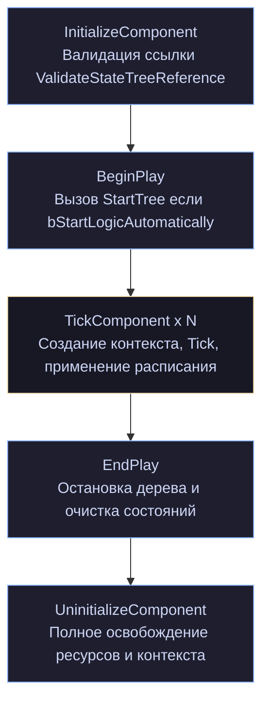

`InitializeComponent` вызывается **до** `BeginPlay` — это правильное место для проверок, потому что провал здесь можно обработать до того, как логика начнёт работать.

cpp

```cpp
/**
 * Called during initialize, will validate the state tree reference and create a context from the state tree to check its validity
 * Override this function for custom state tree validation.
 * Note: Override without calling super if the state tree reference is dynamically set after initialization
 */
virtual void ValidateStateTreeReference();

/** @return a value if the state tree reference can be used by the component or the error why it's not a valid reference. */
virtual TValueOrError<void, FString> HasValidStateTreeReference() const;
```

`TValueOrError<void, FString>` — либо «всё хорошо» (без значения), либо строка с описанием проблемы. Аккуратный способ вернуть диагностику без исключений.

Примечание в комментарии важное: _«Override without calling super if the state tree reference is dynamically set after initialization»_. Если вы подставляете дерево в рантайме, валидация на инициализации бессмысленна — переопределяйте без вызова базовой.

### 19.3. Управляющие методы `UBrainComponent`

cpp

```cpp
//~ BEGIN UBrainComponent overrides
virtual void StartLogic() override;
virtual void RestartLogic() override;
virtual void StopLogic(const FString& Reason) override;
virtual void Cleanup() override;
virtual void PauseLogic(const FString& Reason) override;
virtual EAILogicResuming::Type ResumeLogic(const FString& Reason) override;
virtual bool IsRunning() const override;
virtual bool IsPaused() const override;
//~ END UBrainComponent overrides
```

Восемь методов, и семантика каждого стоит уточнения (тела в `.cpp`, но роли однозначны из контракта `UBrainComponent` и полей компонента).

|Метод|Что делает|Состояние после|
|---|---|---|
|`StartLogic()`|запускает дерево с нуля|`bIsRunning = true`|
|`RestartLogic()`|останавливает и запускает заново|`bIsRunning = true`, состояние сброшено|
|`StopLogic(Reason)`|останавливает, `Reason` идёт в лог|`bIsRunning = false`|
|`Cleanup()`|освобождает ресурсы|не запущено|
|`PauseLogic(Reason)`|приостанавливает тик|`bIsPaused = true`, `bIsRunning` не меняется|
|`ResumeLogic(Reason)`|возобновляет|`bIsPaused = false`|

Два флага, хранящие это состояние:

cpp

```cpp
/** if set, execution has started and has not stopped yet. */
uint8 bIsRunning : 1;

/** if set, execution has been requested to stop ticking. */
uint8 bIsPaused : 1;
```

**Пауза и остановка — принципиально разные вещи.** Из комментария: пауза — «попросили не тикать». Дерево остаётся запущенным, активные состояния сохраняются, задачи не получают `ExitState`. Остановка — полное завершение с `ExitState` и `TreeStop`.

`ResumeLogic` возвращает `EAILogicResuming::Type` — перечисление из AIModule со значениями вроде `Continue` / `RestartedInstead`. Возобновление не всегда возможно; если состояние устарело, реализация может перезапустить логику.

Полезная деталь про `StopLogic`: остановка изнутри тика откладывается (`FStateTreeExecutionState::RequestedStop`, глава 5). Вызвав `StopLogic` из задачи, вы не прервёте текущий тик.

### 19.4. Тик и расписание

cpp

```cpp
protected:
    void StartTree();
    void ScheduleTickFrame(const FStateTreeScheduledTick& NextTick);
    void ConditionalEnableTick();
    void DisableTick();

private:
    FStateTreeExecutionContext* CurrentlyRunningExecContext = nullptr;

    friend FStateTreeComponentExecutionExtension;
```

Механику мы разобрали в главе 17. Здесь добавлю практическое.

`CurrentlyRunningExecContext` — сырой указатель на контекст, живущий на стеке `TickComponent`. Он существует ровно для того, чтобы расширение могло понять: «я вызван изнутри тика, менять настройки компонента прямо сейчас нельзя».

cpp

```cpp
USTRUCT()
struct FStateTreeComponentExecutionExtension : public FStateTreeExecutionExtension
{
    GENERATED_BODY()

public:
    virtual void ScheduleNextTick(const FContextParameters& Context, const FNextTickArguments& Args) override;

    UPROPERTY()
    TObjectPtr<UStateTreeComponent> Component;
};
```

Расширение хранит `TObjectPtr` на компонент — сильную ссылку. Оно живёт в instance data, которая живёт в компоненте: технически циклическая ссылка, но безопасная, потому что instance data помечена `Transient` и не сериализуется.

**Практический вывод:** если вы наследуете `UStateTreeComponent` и переопределяете тик, помните про `ConditionalEnableTick`/`DisableTick`. Прямой вызов `SetComponentTickEnabled` разойдётся с логикой планирования.

### 19.5. Данные компонента

cpp

```cpp
protected:
#if WITH_EDITORONLY_DATA
    UE_DEPRECATED(5.1, "This property has been deprecated. Use StateTreeReference instead.")
    UPROPERTY()
    TObjectPtr<UStateTree> StateTree_DEPRECATED;
#endif

    /** State Tree asset to run on the component. */
    UPROPERTY(EditAnywhere, Category = AI, DisplayName = "State Tree",
              meta=(Schema="/Script/GameplayStateTreeModule.StateTreeComponentSchema", SchemaCanBeOverriden))
    FStateTreeReference StateTreeRef;

    /**
     * Overrides for linked State Trees. This table is used to override State Tree references on linked states.
     * If a linked state's tag is exact match of the tag specified on the table, the reference from the table is used instead.
     */
    UPROPERTY(EditAnywhere, Category = AI, meta=(Schema="/Script/GameplayStateTreeModule.StateTreeComponentSchema"))
    FStateTreeReferenceOverrides LinkedStateTreeOverrides;

    UPROPERTY(Transient)
    FStateTreeInstanceData InstanceData;

    /** If true, the StateTree logic is started on begin play. Otherwise, StartLogic() needs to be called. */
    UPROPERTY(EditAnywhere, Category = AI)
    bool bStartLogicAutomatically = true;
```

#### `FStateTreeReference` вместо `UStateTree*`

Замена в 5.1 была не косметической. `FStateTreeReference` (из `StateTreeReference.h`, не в нашем пакете) — это **ассет плюс переопределения параметров**. Один и тот же ассет на разных акторах с разными настройками.

Три уровня параметров, о которых шла речь в главе 4:

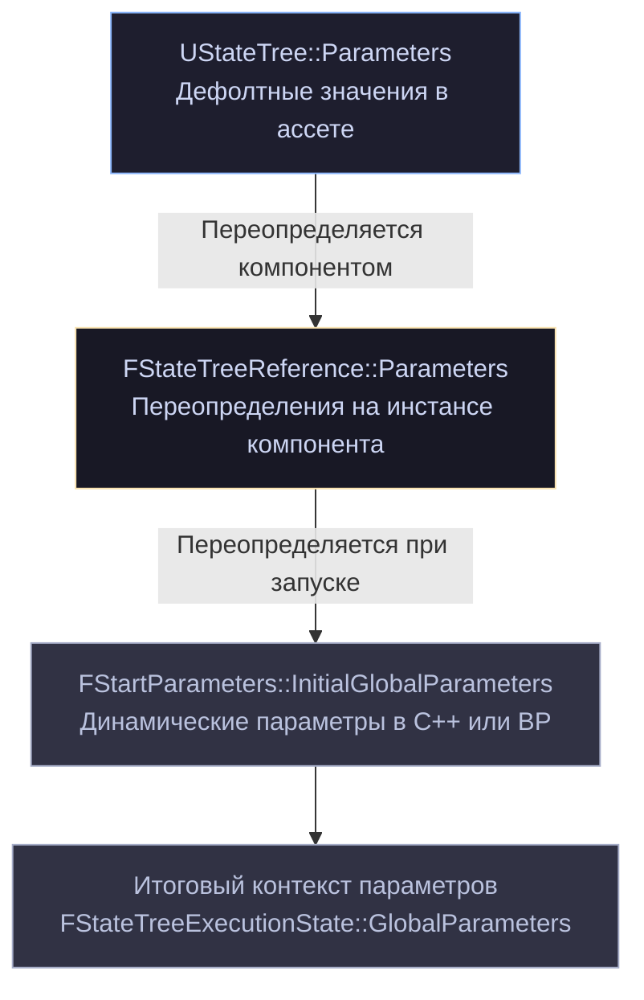

#### Метадата фильтрации

cpp

```cpp
meta=(Schema="/Script/GameplayStateTreeModule.StateTreeComponentSchema", SchemaCanBeOverriden)
```

Первое — фильтр списка ассетов (глава 18). Второе — `SchemaCanBeOverriden`, и это интереснее.

Флаг связан с `IStateTreeSchemaProvider`:

cpp

```cpp
//~ BEGIN IStateTreeSchemaProvider
virtual TSubclassOf<UStateTreeSchema> GetSchema() const override;
//~ END
```

Компонент **сам сообщает**, какую схему он ожидает. Наследник может вернуть свою:

cpp

```cpp
TSubclassOf<UStateTreeSchema> UMyAIComponent::GetSchema() const
{
    return UMyAISchema::StaticClass();
}
```

И тогда в слоте будут доступны ассеты вашей схемы, а не базовой. Метадата задаёт значение по умолчанию, `SchemaCanBeOverriden` разрешает его подменить.

Это ответ на вопрос из главы 18 «как ввести производную схему, не ломая слот»: наследуете компонент, переопределяете `GetSchema()`.

#### `InstanceData` — `Transient`

cpp

```cpp
UPROPERTY(Transient)
FStateTreeInstanceData InstanceData;
```

Ровно то, о чём предупреждает глава 6: instance data **не сохраняется**. `Transient` здесь не оптимизация, а констатация — сериализация всё равно не поддерживается.

`UPROPERTY` обязательно — иначе `UObject`-ы внутри instance data будут собраны сборщиком мусора.

### 19.6. Blueprint API

cpp

```cpp
UFUNCTION(BlueprintCallable, Category = "Gameplay|StateTree")
void SetStateTree(UStateTree* StateTree);

UFUNCTION(BlueprintCallable, Category = "Gameplay|StateTree")
void SetStateTreeReference(FStateTreeReference StateTreeReference);

void SetLinkedStateTreeOverrides(FStateTreeReferenceOverrides Overrides);

UFUNCTION(BlueprintCallable, Category = "Gameplay|StateTree")
void AddLinkedStateTreeOverrides(const FGameplayTag StateTag, FStateTreeReference StateTreeReference);

UFUNCTION(BlueprintCallable, Category = "Gameplay|StateTree")
void RemoveLinkedStateTreeOverrides(const FGameplayTag StateTag);

UFUNCTION(BlueprintCallable, Category = "Gameplay|StateTree")
void SetStartLogicAutomatically(const bool bInStartLogicAutomatically);

UFUNCTION(BlueprintCallable, Category = "Gameplay|StateTree")
void SendStateTreeEvent(const FStateTreeEvent& Event);

void SendStateTreeEvent(const FGameplayTag Tag, const FConstStructView Payload = FConstStructView(),
                        const FName Origin = FName());

UFUNCTION(BlueprintPure, Category = "Gameplay|StateTree")
EStateTreeRunStatus GetStateTreeRunStatus() const;

UPROPERTY(BlueprintAssignable, Category = "Gameplay|StateTree")
FStateTreeRunStatusChanged OnStateTreeRunStatusChanged;
```

#### Ограничение на смену дерева

cpp

```cpp
/**
 * Sets a new state tree.
 * The state tree won't be set if the logic is running.
 */
void SetStateTree(UStateTree* StateTree);
```

**Нельзя подменить дерево на лету.** Причина в главе 6: instance data разложена под конкретное дерево — размеры блоков, индексные базы, типы. Подмена сделала бы все адреса невалидными.

Правильная последовательность:

cpp

```cpp
Component->StopLogic(TEXT("Смена поведения"));
Component->SetStateTree(NewTree);
Component->StartLogic();
```

Дерево запустится с корня, накопленное состояние потеряно. Если нужна преемственность — сохраните нужное сами и восстановите через `FStartParameters` (что требует своего владельца, компонент такого API не даёт).

#### Переопределения связанных деревьев

cpp

```cpp
/**
 * Set the linked state tree overrides.
 * The overrides won't be set if they do not use the StateTreeComponentSchema schema.
 */
void SetLinkedStateTreeOverrides(FStateTreeReferenceOverrides Overrides);

/**
 * Add a linked state tree override.
 * The override won't be set if it doesn't use the StateTreeComponentSchema schema.
 */
void AddLinkedStateTreeOverrides(const FGameplayTag StateTag, FStateTreeReference StateTreeReference);

void RemoveLinkedStateTreeOverrides(const FGameplayTag StateTag);
```

Механизм: состояние типа `LinkedAsset` ссылается на другое дерево. Если у состояния есть тег, и в таблице переопределений найден **точно такой же** тег — используется дерево из таблицы.

Комментарий к полю уточняет: _«If a linked state's tag is exact match of the tag specified on the table»_. **Точное совпадение**, не иерархическое. `Combat.Melee` в таблице не подменит состояние с тегом `Combat`.

Практическое применение — вариативность поведения без дублирования деревьев:

cpp

```cpp
// Базовое дерево имеет состояние с тегом StateTreeState.Combat, ссылающееся на общее боевое дерево.
// Для босса подменяем его на специальное:
Component->AddLinkedStateTreeOverrides(
    FGameplayTag::RequestGameplayTag(TEXT("StateTreeState.Combat")),
    FStateTreeReference(BossCombatTree));
```

Проверка схемы упоминается в обоих комментариях: подменить можно только совместимым деревом. Это `HasCompatibleContextData` из главы 4 плюс проверка класса схемы.

Обратите внимание: `SetLinkedStateTreeOverrides` **не** `UFUNCTION` — `FStateTreeReferenceOverrides` не экспонирован в Blueprint целиком. Оттуда доступны только `Add`/`Remove` по одному.

#### Уведомление о статусе

cpp

```cpp
DECLARE_DYNAMIC_MULTICAST_DELEGATE_OneParam(FStateTreeRunStatusChanged, EStateTreeRunStatus, StateTreeRunStatus);

UPROPERTY(BlueprintAssignable, Category = "Gameplay|StateTree")
FStateTreeRunStatusChanged OnStateTreeRunStatusChanged;
```

Динамический мультикаст — подписка из Blueprint. Приходит новый `EStateTreeRunStatus`.

Практическая ценность: реакция на завершение дерева без опроса.

cpp

```cpp
// В Blueprint или C++:
Component->OnStateTreeRunStatusChanged.AddDynamic(this, &AMyActor::HandleStateTreeFinished);

void AMyActor::HandleStateTreeFinished(EStateTreeRunStatus Status)
{
    if (Status == EStateTreeRunStatus::Failed)
    {
        // логика провалилась — переключиться на резервное поведение
    }
}
```

Напомню разницу из главы 5: `Failed` — логика пришла к провалу, `Stopped` — нас выключили извне. Реакция должна быть разной.

#### Две перегрузки `SendStateTreeEvent`

cpp

```cpp
UFUNCTION(BlueprintCallable, ...)
void SendStateTreeEvent(const FStateTreeEvent& Event);          // для Blueprint

void SendStateTreeEvent(const FGameplayTag Tag, const FConstStructView Payload = FConstStructView(),
                        const FName Origin = FName());          // для C++
```

Вторая удобнее в C++: не нужно конструировать `FStateTreeEvent`, а `FConstStructView` не копирует payload лишний раз.

cpp

```cpp
FDamageEventPayload Payload{ 25.0f, Instigator };
Component->SendStateTreeEvent(DamageTag, FConstStructView::Make(Payload));
```

### 19.7. `IGameplayTaskOwnerInterface`

cpp

```cpp
//~ BEGIN IGameplayTaskOwnerInterface
virtual UGameplayTasksComponent* GetGameplayTasksComponent(const UGameplayTask& Task) const override;
virtual AActor* GetGameplayTaskOwner(const UGameplayTask* Task) const override;
virtual AActor* GetGameplayTaskAvatar(const UGameplayTask* Task) const override;
virtual uint8 GetGameplayTaskDefaultPriority() const override;
virtual void OnGameplayTaskInitialized(UGameplayTask& Task) override;
//~ END IGameplayTaskOwnerInterface
```

Интеграция с системой Gameplay Tasks — механизмом асинхронных действий из AIModule (перемещение, поворот, ожидание). Реализация интерфейса позволяет узлам State Tree запускать gameplay-задачи от имени компонента.

Различие `Owner` и `Avatar` стоит помнить: владелец — тот, кто управляет задачей (контроллер), аватар — тот, над кем она выполняется (пешка). Для AI это обычно разные акторы.

Если ваши узлы не используют Gameplay Tasks, этот интерфейс вас не касается — он реализован «на всякий случай», для совместимости с существующими AI-задачами.

### 19.8. Отладка

cpp

```cpp
#if WITH_GAMEPLAY_DEBUGGER
virtual FString GetDebugInfoString() const override;

/**
 * @return the list of active states.
 * If the StateTree has linked asset StateTree, then more than one state can have the same name.
 * Only used for debugging purposes.
 */
TArray<FName> GetActiveStateNames() const;
#endif
```

`GetDebugInfoString()` — переопределение `UBrainComponent`. Именно это вы видите в Gameplay Debugger по клавише `'` на категории AI.

Предупреждение к `GetActiveStateNames`: при связанных ассетах имена могут повторяться, потому что состояния из разных деревьев. Для однозначной идентификации используйте `FStateTreeExecutionState::GetActiveStatePath()` (глава 5), который учитывает кадры.

Оба метода — только под `WITH_GAMEPLAY_DEBUGGER`, в шиппинге их нет.

### 19.9. Наследование компонента

Что имеет смысл переопределять:

cpp

```cpp
UCLASS()
class UMyStateTreeComponent : public UStateTreeComponent
{
    GENERATED_BODY()

public:
    /** 1. Своя схема — меняет фильтр ассетов в слоте. */
    virtual TSubclassOf<UStateTreeSchema> GetSchema() const override
    {
        return UMyGameSchema::StaticClass();
    }

protected:
    /** 2. Дополнительные контекстные данные. */
    virtual bool SetContextRequirements(FStateTreeExecutionContext& Context, bool bLogErrors = false) override
    {
        if (!Super::SetContextRequirements(Context, bLogErrors))
        {
            return false;
        }
        Context.SetContextDataByName(TEXT("Squad"), FStateTreeDataView(GetSquad()));
        return Context.AreContextDataViewsValid();
    }

    /** 3. Дополнительные внешние данные. */
    virtual bool CollectExternalData(const FStateTreeExecutionContext& Context, const UStateTree* StateTree,
                                     TArrayView<const FStateTreeExternalDataDesc> Descs,
                                     TArrayView<FStateTreeDataView> OutDataViews) const override
    {
        if (!Super::CollectExternalData(Context, StateTree, Descs, OutDataViews))
        {
            return false;
        }
        for (int32 Index = 0; Index < Descs.Num(); ++Index)
        {
            if (Descs[Index].Struct == UMySquadSubsystem::StaticClass() && !OutDataViews[Index].IsValid())
            {
                OutDataViews[Index] = FStateTreeDataView(GetWorld()->GetSubsystem<UMySquadSubsystem>());
            }
        }
        return true;
    }

    /** 4. Своя валидация. */
    virtual TValueOrError<void, FString> HasValidStateTreeReference() const override
    {
        TValueOrError<void, FString> Base = Super::HasValidStateTreeReference();
        if (Base.HasError())
        {
            return Base;
        }
        if (!GetSquad())
        {
            return MakeError(TEXT("Компонент требует принадлежности к отряду."));
        }
        return MakeValue();
    }
};
```

Обратите внимание на `!OutDataViews[Index].IsValid()` в третьем пункте: базовая реализация могла уже заполнить запись, перезаписывать не нужно.

Оба метода объявлены `virtual` в базовом компоненте именно для этого:

cpp

```cpp
virtual bool SetContextRequirements(FStateTreeExecutionContext& Context, bool bLogErrors = false);
virtual bool CollectExternalData(const FStateTreeExecutionContext& Context, const UStateTree* StateTree,
                                 TArrayView<const FStateTreeExternalDataDesc> Descs,
                                 TArrayView<FStateTreeDataView> OutDataViews) const;
```

### 19.10. Компонент или свой владелец?

Компонент удобен, но не универсален. Ориентиры:

**Компонент подходит:**

- логика привязана к актору;
- нужна интеграция с AI-контроллером;
- достаточно одного дерева на актора;
- устраивает жизненный цикл `BeginPlay`/`EndPlay`.

**Пишите своего владельца:**

- владелец — не актор (подсистема, `UObject`, структура данных);
- нужно несколько деревьев с общей очередью событий (глава 15);
- нужен контроль над `FStartParameters` (seed, стартовое состояние, внешние параметры);
- нужен раздельный тик (`TickUpdateTasks` / `TickTriggerTransitions`, глава 14);
- не хотите зависимость от AIModule;
- батчевая обработка многих экземпляров.

Каркас своего владельца мы разобрали в главе 2, а всё, что нужно для его написания, — в главах 13, 14 и 18.

### 19.11. Диагностика

|Симптом|Причина|
|---|---|
|Дерево не запускается на `BeginPlay`|`bStartLogicAutomatically = false`, или ассет не скомпилирован, или валидация не прошла|
|`SetStateTree` не срабатывает|логика запущена — сначала `StopLogic()`|
|Не могу выбрать ассет в слоте|схема ассета не совпадает с той, что вернул `GetSchema()`|
|Дерево тикает каждый кадр|`ScheduledTickPolicy = Denied` или cvar выключен (глава 17)|
|Переопределение связанного дерева не работает|тег не совпадает **точно**; или схема несовместима|
|После паузы состояние сбросилось|вероятно, `ResumeLogic` вернул `RestartedInstead`|
|Объекты в instance data исчезают|`InstanceData` не помечена `UPROPERTY` в вашем наследнике|
|Компонент тикает, но дерево не обновляется|`bIsPaused == true`|
|Внешние данные не находятся|ваш `CollectExternalData` не вызывает `Super`|

### 19.12. Полный пример использования

cpp

```cpp
UCLASS()
class AMyNPC : public ACharacter
{
    GENERATED_BODY()

public:
    AMyNPC()
    {
        StateTreeComponent = CreateDefaultSubobject<UStateTreeComponent>(TEXT("StateTree"));
        StateTreeComponent->SetStartLogicAutomatically(false);   // запустим сами
    }

protected:
    virtual void BeginPlay() override
    {
        Super::BeginPlay();

        StateTreeComponent->OnStateTreeRunStatusChanged.AddDynamic(this, &AMyNPC::HandleRunStatusChanged);

        // Босс получает специальное боевое дерево вместо общего.
        if (bIsBoss && BossCombatTree)
        {
            StateTreeComponent->AddLinkedStateTreeOverrides(
                FGameplayTag::RequestGameplayTag(TEXT("StateTreeState.Combat")),
                FStateTreeReference(BossCombatTree));
        }

        StateTreeComponent->StartLogic();
    }

    virtual void EndPlay(const EEndPlayReason::Type Reason) override
    {
        StateTreeComponent->OnStateTreeRunStatusChanged.RemoveDynamic(this, &AMyNPC::HandleRunStatusChanged);
        Super::EndPlay(Reason);
    }

    UFUNCTION()
    void HandleRunStatusChanged(EStateTreeRunStatus Status)
    {
        if (Status == EStateTreeRunStatus::Failed)
        {
            UE_LOG(LogTemp, Warning, TEXT("%s: логика провалилась, переходим на резервную."), *GetName());
            StateTreeComponent->SetStateTree(FallbackTree);
            StateTreeComponent->StartLogic();
        }
    }

public:
    void TakeDamageEvent(float Amount, AActor* Instigator)
    {
        FDamageEventPayload Payload;
        Payload.Amount = Amount;
        Payload.Instigator = Instigator;

        StateTreeComponent->SendStateTreeEvent(
            FGameplayTag::RequestGameplayTag(TEXT("StateTreeEvent.Combat.Damaged")),
            FConstStructView::Make(Payload));
    }

protected:
    UPROPERTY(VisibleAnywhere, Category = AI)
    TObjectPtr<UStateTreeComponent> StateTreeComponent;

    UPROPERTY(EditDefaultsOnly, Category = AI)
    TObjectPtr<UStateTree> BossCombatTree;

    UPROPERTY(EditDefaultsOnly, Category = AI)
    TObjectPtr<UStateTree> FallbackTree;

    UPROPERTY(EditDefaultsOnly, Category = AI)
    bool bIsBoss = false;
};
```

Обратите внимание: `SetStateTree` в `HandleRunStatusChanged` работает, потому что дерево уже остановлено (статус `Failed` означает завершение).

### 19.13. Выводes

1. **`UBrainComponent` даёт интеграцию с AI-инфраструктурой** ценой зависимости от AIModule.
2. **Пауза ≠ остановка.** Пауза сохраняет активные состояния, остановка вызывает `ExitState`.
3. **`SetStateTree` не работает на запущенной логике** — instance data разложена под конкретное дерево.
4. **`GetSchema()` через `IStateTreeSchemaProvider`** — способ подставить свою схему в наследнике.
5. **`FStateTreeReference` вместо `UStateTree*`** даёт переопределение параметров на каждом акторе.
6. **Переопределения связанных деревьев ищутся по точному совпадению тега.**
7. **`InstanceData` — `Transient`**, состояние дерева не сохраняется.
8. **`OnStateTreeRunStatusChanged`** — реакция на завершение без опроса; различайте `Failed` и `Stopped`.
9. **Для расширения переопределяйте `GetSchema`, `SetContextRequirements`, `CollectExternalData`, `HasValidStateTreeReference`** — все виртуальные, все с вызовом `Super`.
10. **Компонент — не единственный владелец.** Для неигровых сценариев, батчей и точного контроля пишите своего.

---

## Глава 20. Составные деревья

Одно дерево на все случаи жизни не работает: оно разрастается, дублирует ветки и становится нечитаемым. StateTree даёт четыре механизма композиции, и они решают разные задачи.

|Механизм|Область|Создаёт кадр|Переопределяется в рантайме|
|---|---|---|---|
|`Subtree` + `Linked`|внутри одного ассета|нет|нет|
|`LinkedAsset`|между ассетами|**да**|да, по тегу|
|Параллельные деревья|несколько деревьев на владельце|да|—|
|Общая очередь событий|связь между экземплярами|—|—|

Оговорка по источникам: `StateTreeReference.h` в наш пакет не входит, поэтому `FStateTreeReference` и `FStateTreeReferenceOverrides` я описываю по их использованию в `StateTreeComponent.h` и `StateTreeExecutionContext.h`. Механика читается однозначно, точные сигнатуры уточните в своей версии.

### 20.1. Subtree и Linked: переиспользование внутри ассета

Из `EStateTreeStateType` (глава 3):

cpp

```cpp
enum class EStateTreeStateType : uint8
{
    State,        // задачи + возможные дети
    Group,        // только дети
    Linked,       // ссылка на другое состояние в этом же дереве
    LinkedAsset,  // ссылка на корень другого ассета
    Subtree,      // поддерево, на которое можно ссылаться
};
```

Пара работает так: помечаете ветку как `Subtree`, а из других мест ссылаетесь на неё состояниями типа `Linked`.

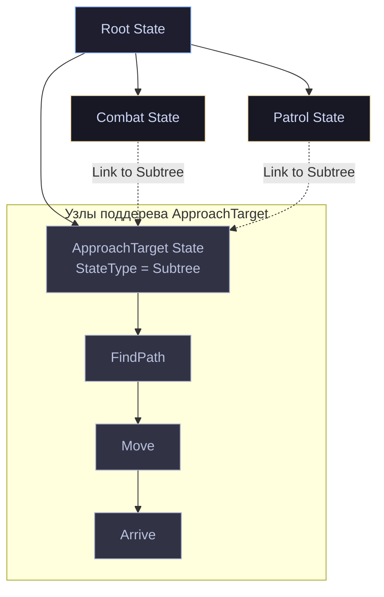

Поле в скомпилированном состоянии:

cpp

```cpp
UPROPERTY() FStateTreeStateHandle LinkedState = FStateTreeStateHandle::Invalid;
```

Обычный handle — то есть индекс в том же массиве `States`. Никаких кадров, никакой дополнительной машинерии: выбор состояния просто перепрыгивает по индексу.

**Стоимость нулевая.** Это чистая экономия на дублировании в редакторе.

Параметры передаются через `FCompactStateTreeParameters` состояния (глава 3): `Linked`-состояние задаёт значения, `Subtree` их читает. Так один и тот же subtree ведёт себя по-разному в разных местах.

Ограничение — всё в пределах одного ассета. Переиспользовать между ассетами так нельзя.

### 20.2. `LinkedAsset` и кадры исполнения

Здесь начинается настоящая механика.

cpp

```cpp
UPROPERTY() TObjectPtr<UStateTree> LinkedAsset = nullptr;
uint8 bCanOverrideLinkedAssetAtRuntime : 1 = true;
```

Состояние типа `LinkedAsset` ссылается на **другой ассет**. Вход в него создаёт новый `FStateTreeExecutionFrame` (глава 5).

Почему кадр необходим: у другого ассета свои массивы состояний и узлов, свои индексные базы instance data, свой набор внешних данных, свои глобальные задачи и evaluator'ы. Одним набором баз это не описать.

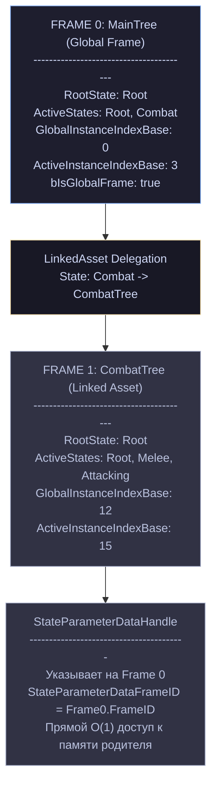

Обратите внимание на два ограничения, которые теперь складываются:

- **8 состояний на кадр** (`FStateTreeActiveStates::MaxStates`);
- кадров может быть много, но в старой версии их было ограничено восемью (`FStateSelectionResult::MaxExecutionFrames = 8` с `TFixedAllocator`), а в новой — `TInlineAllocator<4>` без жёсткого предела.

То есть **глубина активного пути считается по кадрам отдельно**. Три связанных ассета по 6 уровней каждый — это нормально, а один ассет с 9 уровнями — нет.

### 20.3. Что происходит при входе в связанный ассет

Собираем из методов `FStateTreeExecutionContext` (глава 14):

cpp

```cpp
bool SelectStateInternal_LinkedAsset(
    const FSelectStateArguments& Args,
    const FSelectStateInternalArguments& InternalArgs,
    const TSharedRef<FSelectStateResult>& OutSelectionResult,
    TNotNull<const UStateTree*> NextStateTree,
    const FCompactStateTreeState& NextState,
    const UStateTree* NextLinkedStateAsset,
    bool bShouldCreateNewState);
```

Последовательность:

**1. Определяется целевой ассет.** С учётом переопределений:

cpp

```cpp
const FStateTreeReference* GetLinkedStateTreeOverrideForTag(const FGameplayTag StateTag) const;
```

Если у состояния есть тег и он **точно** совпадает с тегом в таблице переопределений — берётся дерево оттуда, иначе `LinkedAsset` из ассета.

**2. Создаётся временный кадр:**

cpp

```cpp
FStateTreeExecutionFrame& MakeAndAddTemporaryFrame(UE::StateTree::FActiveFrameID FrameID,
                                                   const UE::StateTree::FExecutionFrameHandle& FrameHandle,
                                                   bool bIsGlobalFrame);
```

Временный — потому что выбор состояния может не удаться, и кадр придётся выбросить. Комментарий: _«The active state list is empty and will be filled during EnterState()»_.

**3. Собираются внешние данные нового дерева:**

cpp

```cpp
FStateTreeIndex16 CollectExternalData(const UStateTree* StateTree);
```

Вот откуда предупреждение из главы 13: _«the collect external data might get called multiple times, once for each asset»_. Каждый связанный ассет запрашивает свои данные.

Есть кэш, чтобы не собирать повторно:

cpp

```cpp
struct FCollectedExternalDataCache
{
    const UStateTree* StateTree = nullptr;
    FStateTreeIndex16 BaseIndex;
};
TArray<FCollectedExternalDataCache> CollectedExternalCache;
```

**4. Запускаются глобальные задачи и evaluator'ы нового дерева** — временно, для проверки:

cpp

```cpp
EStateTreeRunStatus StartTemporaryEvaluatorsAndGlobalTasks(const FStateTreeExecutionFrame* CurrentParentFrame,
                                                           FStateTreeExecutionFrame& CurrentFrame);
void StopTemporaryEvaluatorsAndGlobalTasks(const FStateTreeExecutionFrame* CurrentParentFrame,
                                           FStateTreeExecutionFrame& CurrentFrame, EStateTreeRunStatus StartResult);
```

Именно ради этого в `EStateTreeUpdatePhase` есть отдельные значения (глава 5):

cpp

```cpp
StartGlobalTasksForSelection,   // "Start Global Tasks & Evaluators for selection"
StopGlobalTasksForSelection,
```

Логика: условия входа в состояния связанного дерева могут зависеть от его evaluator'ов. Чтобы их проверить, evaluator'ы надо запустить. Если выбор провалится — остановить обратно.

**5. Выбор продолжается внутри нового дерева**, от его корня.

**6. При успехе временный кадр становится активным**, временные данные переезжают в основной буфер (`UpdateInstanceData`, глава 14).

**Практический вывод:** вход в связанный ассет — **дорогая операция**. Сбор внешних данных, запуск глобальных узлов, возможный откат. Не делайте связанными ассетами то, что меняется каждую секунду.

### 20.4. Параметры между уровнями

Самая тонкая часть механизма. Из `FStateTreeExecutionFrame` (глава 5):

cpp

```cpp
/**
 * Handle to the root state parameter data.
 * Exists in parent frame if this frame is entered by a linked state,
 * Otherwise it exists in the current frame.
 */
UPROPERTY() FStateTreeDataHandle StateParameterDataHandle;

/**
 * Handle to the global parameter data,
 * Exists in parent frame if it is a state parameter.
 * Exists in root frame if it is the root global parameter.
 */
UPROPERTY() FStateTreeDataHandle GlobalParameterDataHandle;

UE::StateTree::FActiveFrameID GlobalInstanceDataFrameID;
UE::StateTree::FActiveFrameID GlobalParameterDataFrameID;
UE::StateTree::FActiveFrameID StateParameterDataFrameID;
```

Три `...FrameID` отвечают на вопрос: **в каком кадре физически лежат данные, к которым у меня есть handle**.

Модель передачи параметров:

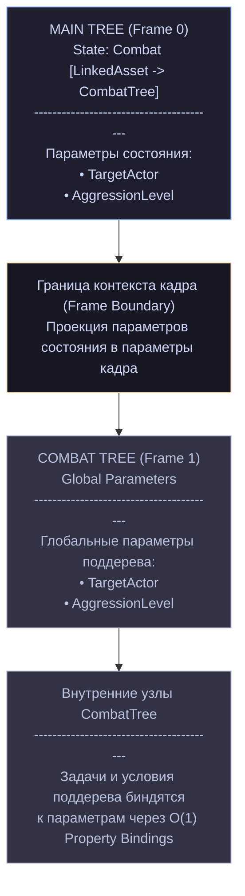

То есть **параметры состояния-ссылки становятся глобальными параметрами связанного дерева**. Это и есть интерфейс между уровнями.

Handle указывает в родительский кадр, поэтому нужен `StateParameterDataFrameID` — знать, в какой именно.

Практическое следствие: **связанное дерево не знает, кто его запустил**. Оно видит только свои глобальные параметры. Это правильная изоляция — то же дерево можно запустить из другого места или напрямую.

Проектируйте параметры связанных деревьев как публичный API: минимальный, стабильный, самодостаточный.

### 20.5. `FStateTreeReference` и переопределения

Из `StateTreeComponent.h`:

cpp

```cpp
UPROPERTY(EditAnywhere, Category = AI, DisplayName = "State Tree",
          meta=(Schema="/Script/GameplayStateTreeModule.StateTreeComponentSchema", SchemaCanBeOverriden))
FStateTreeReference StateTreeRef;

UPROPERTY(EditAnywhere, Category = AI, meta=(Schema="/Script/GameplayStateTreeModule.StateTreeComponentSchema"))
FStateTreeReferenceOverrides LinkedStateTreeOverrides;
```

Из `StateTreeExecutionContext.h`:

cpp

```cpp
void SetLinkedStateTreeOverrides(FStateTreeReferenceOverrides InLinkedStateTreeOverrides);
const FStateTreeReference* GetLinkedStateTreeOverrideForTag(const FGameplayTag StateTag) const;

protected:
    FStateTreeReferenceOverrides LinkedAssetStateTreeOverrides;
```

Складывается модель:

**`FStateTreeReference`** = ассет + переопределённые значения его параметров. Это не просто указатель — это «ассет, настроенный под конкретное использование».

**`FStateTreeReferenceOverrides`** = таблица `тег → FStateTreeReference`. При входе в `LinkedAsset`-состояние с тегом ищется совпадение.

Ключевая деталь из комментария к компоненту:

> _«If a linked state's tag is exact match of the tag specified on the table, the reference from the table is used instead.»_

**Точное совпадение**, не иерархическое. `Combat` в таблице не подменит состояние с тегом `Combat.Melee`.

Флаг на стороне состояния:

cpp

```cpp
uint8 bCanOverrideLinkedAssetAtRuntime : 1 = true;
```

Дизайнер может запретить подмену конкретного состояния. Полезно, когда логика зависит от того, что там именно это дерево.

#### Применение

cpp

```cpp
// Общий шаблон поведения с точками расширения:
//   Root
//   ├── Idle
//   ├── Combat   [LinkedAsset → GenericCombat]   tag: StateTreeState.Combat
//   └── Flee     [LinkedAsset → GenericFlee]     tag: StateTreeState.Flee

// Босс переопределяет бой:
Component->AddLinkedStateTreeOverrides(
    FGameplayTag::RequestGameplayTag(TEXT("StateTreeState.Combat")),
    FStateTreeReference(BossCombatTree));

// Трус переопределяет бегство:
Component->AddLinkedStateTreeOverrides(
    FGameplayTag::RequestGameplayTag(TEXT("StateTreeState.Flee")),
    FStateTreeReference(PanicFleeTree));
```

Один каркасный ассет, десятки вариантов поведения. Это основной практический сценарий, ради которого механизм существует.

Переопределения задаются **до запуска**. Смена на лету потребовала бы перестройки кадров — API этого не предполагает.

### 20.6. Проверка совместимости

Из `UStateTree` (глава 4):

cpp

```cpp
bool HasCompatibleContextData(const UStateTree& Other) const;
bool HasCompatibleContextData(TNotNull<const UStateTree*> Other) const;
```

Из комментариев к компоненту:

> _«The overrides won't be set if they do not use the StateTreeComponentSchema schema.»_

Две проверки при подмене:

1. **Схема** — класс схемы должен совпадать (или быть допустимым).
2. **Контекстные данные** — набор дескрипторов должен быть совместим.

Причина второй понятна из механики: контекстные данные предоставляет владелец один раз, по именам из схемы. Если связанное дерево ждёт данные, которых владелец не даёт, оно не запустится.

Отсюда правило проектирования: **связанные деревья должны использовать ту же схему, что и родительское**. Иначе композиция не соберётся.

### 20.7. Параллельные деревья

Здесь честно: отдельного заголовка про параллельные деревья в пакете нет. Есть два следа.

**След первый** — в `StateTreeEvents.h`:

cpp

```cpp
/**
* State Tree Events are cleared at end of each transition processing phase. (Inside TriggerTransitions()).
* When in scope, events sent will live through the current phase and cleared on the next transition processing phase.
* Used internally by TriggerTransitions and ParallelTree.
*/
struct FEventsPendingForNextTransitionProcessingScope
```

Упоминание `ParallelTree` как одного из двух потребителей скоупа.

**След второй** — механизм разделяемой очереди событий (глава 6):

cpp

```cpp
const TSharedRef<FStateTreeEventQueue>& GetSharedMutableEventQueue();
bool IsOwningEventQueue() const;
void SetSharedEventQueue(const TSharedRef<FStateTreeEventQueue>& InSharedEventQueue);
```

И параметр запуска:

cpp

```cpp
/** Optional event queue from another instance data. Marks the event queue not owned. */
const TSharedPtr<FStateTreeEventQueue> SharedEventQueue;
```

Из этого складывается: параллельные деревья — это несколько экземпляров, работающих одновременно и **разделяющих очередь событий**, чтобы видеть одни и те же сигналы. Скоуп нужен потому, что они обрабатывают переходы в рамках общей фазы, и событие, отправленное одним, должно дожить до обработки другим.

Что можно сделать своими силами прямо сейчас:

cpp

```cpp
// Первое дерево — обычно.
FStateTreeExecutionContext CombatContext(*this, *CombatTree, CombatInstanceData);
if (SetContextRequirements(CombatContext))
{
    CombatContext.Start();
}

// Второе — с очередью первого.
FStateTreeExecutionContext::FStartParameters Params;
Params.SharedEventQueue = CombatInstanceData.GetSharedMutableEventQueue();

FStateTreeExecutionContext SocialContext(*this, *SocialTree, SocialInstanceData);
if (SetContextRequirements(SocialContext))
{
    SocialContext.Start(Params);
}

// Тик обоих в своём порядке.
```

Учтите: `Consume` в одном дереве уберёт событие и для второго. Разделяемая очередь — буквально одна очередь.

Полноценная поддержка параллельных деревьев как отдельного типа состояния (если она есть в вашей версии) живёт вне нашего пакета — ищите `StateTreeParallel*` или соответствующий тип задачи.

### 20.8. Стоимость композиции

Соберём цену каждого механизма.

**Subtree + Linked** — бесплатно. Прыжок по индексу, всё в одном кадре, одна instance data.

**LinkedAsset:**

|Что|Стоимость|
|---|---|
|Кадр в `ActiveFrames`|память + проход при каждом тике|
|Сбор внешних данных|вызов `CollectExternalData` (кэшируется)|
|Запуск глобальных задач для проверки|вызовы `TreeStart`/`EnterState`, возможен откат|
|Отдельная instance data|блок в `InstanceStructs`|
|Разрешение параметров|ссылки в родительский кадр|

Это цена **входа**. Пока состояние активно, дополнительных расходов почти нет — кадры обходятся так же, как состояния.

**Параллельные деревья** — полная стоимость второго дерева: своя instance data, свои тики, свои переходы.

Практический ориентир по частоте:

```
Subtree/Linked     — сколько угодно
LinkedAsset        — переключения раз в секунды, не в кадры
Параллельные       — постоянно работающие независимые аспекты поведения
```

### 20.9. Когда какой механизм

**Subtree + Linked** — когда логика повторяется **внутри одного поведения**.

```
«подойти к цели» используется и в бою, и в патруле, и в диалоге
```

**LinkedAsset** — когда нужны **точки расширения** или ассет слишком большой.

```
каркас поведения + сменные модули боя/бегства/работы
общая библиотека поведений, переиспользуемая разными типами NPC
```

**Параллельные деревья** — когда аспекты поведения **независимы и одновременны**.

```
основное поведение + эмоциональное состояние
навигация + управление оружием
```

**Ничего из перечисленного** — когда достаточно состояний с условиями входа. Композиция добавляет уровень косвенности; не платите за неё без нужды.

### 20.10. Границы: когда остановиться

Несколько ориентиров, за которыми композиция начинает вредить.

**Больше трёх уровней вложенности связанных ассетов.** Отладка превращается в раскопки: активный путь распечатывается через `GetActiveStatePath()`, но понять, откуда пришёл параметр, становится трудно.

**Связанный ассет ради одного состояния.** Накладные расходы входа не окупаются. Сделайте subtree.

**Параметры связанного дерева разрослись.** Если вы передаёте вниз десяток значений, скорее всего граница проведена неправильно — деревья слишком связаны.

**Переопределения по тегам используются везде.** Если каждое второе состояние переопределяемо, вы построили систему конфигурации поверх State Tree. Возможно, задачу лучше решить параметрами дерева.

**Общий признак перебора:** чтобы понять, что делает NPC, приходится открыть больше двух ассетов.

### 20.11. Диагностика

|Симптом|Причина|
|---|---|
|Связанный ассет не подставляется|тег не совпадает **точно**; `bCanOverrideLinkedAssetAtRuntime = false`; схемы несовместимы|
|Дерево не запускается после добавления `LinkedAsset`|связанное дерево требует внешние данные, которых владелец не даёт|
|`CollectExternalData` вызывается несколько раз|нормально: по разу на ассет|
|Параметры не доходят до связанного дерева|они передаются как **глобальные параметры** связанного, а не как параметры состояния|
|`MaxStates` исчерпан|считайте вложенность **внутри кадра**, не суммарно|
|Переход в связанное дерево тормозит|вход в кадр дорог: сбор данных + запуск глобальных узлов|
|Имена активных состояний дублируются|состояния из разных деревьев; используйте `GetActiveStatePath()`|
|Событие видит одно дерево, но не другое|разные очереди; нужен `SetSharedEventQueue`|
|Событие «пропало» у второго дерева|первое сделало `Consume`|

### 20.12. Практический пример: библиотека поведений

Разложим типовую архитектуру для проекта с разнородными NPC.

**Уровень 1. Каркас** (`NPCBehaviorFramework`, схема `StateTreeComponent`):

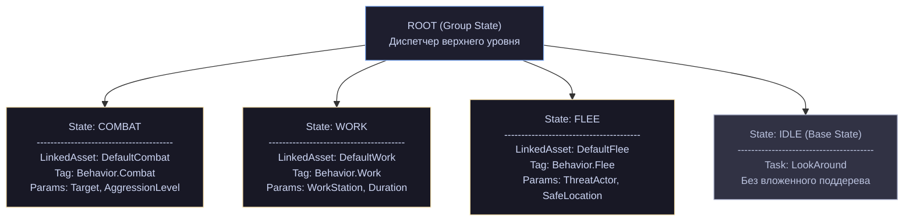

**Уровень 2. Реализации** — отдельные ассеты той же схемы, каждый со своими глобальными параметрами, совпадающими с параметрами состояния-ссылки.

**Уровень 3. Настройка на акторе:**

cpp

```cpp
void AMyNPC::ConfigureBehavior()
{
    if (bIsBoss)
    {
        StateTreeComponent->AddLinkedStateTreeOverrides(
            FGameplayTag::RequestGameplayTag(TEXT("Behavior.Combat")),
            FStateTreeReference(BossCombatTree));
    }
    if (bIsCoward)
    {
        StateTreeComponent->AddLinkedStateTreeOverrides(
            FGameplayTag::RequestGameplayTag(TEXT("Behavior.Flee")),
            FStateTreeReference(PanicFleeTree));
    }
}
```

Что это даёт: каркас один и правится в одном месте; реализации независимы и тестируются отдельно; вариации задаются данными, а не новыми ассетами; дизайнер добавляет новый тип NPC, не трогая C++.

Что важно соблюсти: **параметры состояний-ссылок — это контракт**. Меняя их, вы ломаете все реализации. Проектируйте их как публичный интерфейс и меняйте редко.

### 20.13. Выводы

1. **Subtree + Linked — бесплатное переиспользование внутри ассета.** Начинайте с него.
2. **`LinkedAsset` создаёт кадр исполнения** со своими индексными базами, внешними данными и глобальными узлами.
3. **Вход в связанный ассет дорог**: сбор данных, запуск глобальных узлов, возможный откат. Не для частых переключений.
4. **Параметры состояния-ссылки становятся глобальными параметрами связанного дерева** — это интерфейс между уровнями.
5. **Связанное дерево не знает своего вызывающего** — правильная изоляция.
6. **Переопределения ищутся по точному совпадению тега**, задаются до запуска, проверяются на совместимость схемы и контекстных данных.
7. **`bCanOverrideLinkedAssetAtRuntime`** позволяет запретить подмену конкретного состояния.
8. **`MaxStates = 8` считается внутри кадра**, не суммарно по дереву.
9. **Разделяемая очередь событий** связывает независимые экземпляры; `Consume` действует на всех.
10. **Признак перебора с композицией**: чтобы понять поведение NPC, нужно открыть больше двух ассетов.

---

## Глава 21. Отладка и производительность

Всё, что относится к диагностике, разбросано по книге кусками. Эта глава собирает инструменты в одном месте и добавляет методику: с чего начинать, когда что-то работает не так.

### 21.1. Карта отладочных средств

Начнём с того, что вообще есть и в каких сборках доступно.

|Инструмент|Макрос|Что даёт|
|---|---|---|
|`LogStateTree`|всегда|категория логов|
|`GetDebugInfoString()`|`WITH_GAMEPLAY_DEBUGGER`|оверлей на экране|
|`FStateTreeNodeBase::GetDebugInfo`|`WITH_GAMEPLAY_DEBUGGER`|вывод узла в оверлее|
|`SET_NODE_CUSTOM_TRACE_TEXT`|`WITH_STATETREE_TRACE`|текст узла в трейсе|
|`FStateTreeInstanceDebugId`|`WITH_STATETREE_TRACE`|идентификация экземпляра|
|`DebugInternalLayoutAsString()`|`WITH_EDITOR \| WITH_STATETREE_DEBUG`|вся раскладка ассета|
|`DebugPrintInternalLayout()`|`WITH_STATETREE_DEBUG`|то же из контекста|
|`GetStateChangeCount()`|`WITH_STATETREE_DEBUG`|счётчик смен состояний|
|Валидация GC|`WITH_STATETREE_DEBUG`|проверка ссылок до/после сборки|
|`CalculateEstimatedMemoryUsage()`|`WITH_EDITOR`|расход памяти по состояниям|
|`GetEstimatedMemoryUsage()`|всегда|расход на живом экземпляре|
|`GetNextScheduledTick()`|всегда|почему дерево не спит|
|`GetActiveStateNames()` / `GetActiveStatePath()`|всегда|текущий путь|

Определение главного макроса (глава 3):

cpp

```cpp
#ifndef WITH_STATETREE_DEBUG
#define WITH_STATETREE_DEBUG (!(UE_BUILD_SHIPPING || UE_BUILD_SHIPPING_WITH_EDITOR || UE_BUILD_TEST) && 1)
#endif
```

Включён везде, кроме Shipping и Test. Это ваш основной рабочий режим в Development-сборке.

### 21.2. Логирование

cpp

```cpp
STATETREEMODULE_API DECLARE_LOG_CATEGORY_EXTERN(LogStateTree, Warning, All);
```

По умолчанию — уровень `Warning`. Включайте подробность консольной командой:

```
Log LogStateTree Verbose
Log LogStateTree VeryVerbose
```

В `.ini`:

ini

```ini
[Core.Log]
LogStateTree=Verbose
```

Что писать в свои логи — используйте готовые помощники контекста (глава 14), они устойчивы к невалидным данным:

cpp

```cpp
protected:
    FString GetStateStatusString(const FStateTreeExecutionState& ExecState) const;
    FString GetSafeStateName(const FStateTreeExecutionFrame& CurrentFrame, const FStateTreeStateHandle State) const;
    FString GetSafeStateName(const UStateTree* StateTree, const FStateTreeStateHandle State) const;
    FString DebugGetStatePath(TConstArrayView<FStateTreeExecutionFrame> ActiveFrames, ...) const;
    FString DebugGetEventsAsString() const;
```

Они `protected` — доступны в наследнике контекста. Из узла проще всего:

cpp

```cpp
UE_LOG(LogStateTree, Verbose, TEXT("[%s] %s: %s"),
    *GetNameSafe(Context.GetOwner()),
    *Name.ToString(),                      // имя узла из FStateTreeNodeBase
    *Context.GetActiveStateName());
```

Описание экземпляра для префикса задаёт расширение исполнения:

cpp

```cpp
UE_DEPRECATED(5.6, "Use FStateTreeExecutionExtension::GetInstanceDescription instead")
virtual FString GetInstanceDescription() const final;
```

То есть владелец решает, как называть свои экземпляры в логах — реализуйте `GetInstanceDescription` в своём расширении (глава 17), и все логи StateTree будут содержать осмысленный префикс.

### 21.3. Gameplay Debugger

Клавиша `'` в игре, категория AI. Показывает `UStateTreeComponent::GetDebugInfoString()`.

Ваш вклад — переопределения в узлах:

cpp

```cpp
#if WITH_GAMEPLAY_DEBUGGER
// FStateTreeTaskBase / FStateTreeEvaluatorBase
virtual FString GetDebugInfo(const FStateTreeReadOnlyExecutionContext& Context) const;
#endif
```

Тип контекста — read-only (главы 8, 10): отладочный вывод не может ничего сломать, и это обеспечено системой типов.

cpp

```cpp
#if WITH_GAMEPLAY_DEBUGGER
FString FMyAttackTask::GetDebugInfo(const FStateTreeReadOnlyExecutionContext& Context) const
{
    const FInstanceDataType& Data = Context.GetInstanceData(*this);
    return FString::Printf(TEXT("Цель: %s | заряд %.0f%% | попыток %d"),
        *GetNameSafe(Data.Target),
        100.0f * Data.ChargeProgress,
        Data.AttemptCount);
}
#endif
```

Плюс список активных состояний:

cpp

```cpp
#if WITH_GAMEPLAY_DEBUGGER
/**
 * @return the list of active states.
 * If the StateTree has linked asset StateTree, then more than one state can have the same name.
 * Only used for debugging purposes.
 */
TArray<FName> GetActiveStateNames() const;
#endif
```

Предупреждение из комментария повторю: при связанных ассетах имена дублируются. Для однозначности используйте `FStateTreeExecutionState::GetActiveStatePath()` (глава 5) — он учитывает кадры.

### 21.4. Трейсинг

Второй, более мощный механизм — запись событий исполнения для последующего анализа в StateTree Debugger (отдельное окно редактора).

cpp

```cpp
#if WITH_STATETREE_TRACE
#define SET_NODE_CUSTOM_TRACE_TEXT(Context, MergePolicy, Format, ...)
    if (UE_TRACE_CHANNELEXPR_IS_ENABLED(StateTreeDebugChannel)) 
    { 
        Context.SetNodeCustomDebugTraceData( 
            UE::StateTreeTrace::FNodeCustomDebugData(FString::Printf(Format, ##__VA_ARGS__) 
                , ::UE::StateTreeTrace::FNodeCustomDebugData::EMergePolicy::MergePolicy)); 
    }
#else
#define SET_NODE_CUSTOM_TRACE_TEXT(...)
#endif
```

Двойная защита от расходов (глава 7): без трейсинга макрос исчезает, при включённом сначала проверяется активность канала `StateTreeDebugChannel`.

Применение:

cpp

```cpp
SET_NODE_CUSTOM_TRACE_TEXT(Context, Override, TEXT("dist=%.0f, los=%d"), Distance, bHasLineOfSight ? 1 : 0);
```

#### Идентификация экземпляра

cpp

```cpp
struct FStateTreeInstanceDebugId
{
    uint32 Id = INDEX_NONE;
    uint32 SerialNumber = INDEX_NONE;

    uint64 ToUint64() const { return (static_cast<uint64>(Id) << 32) | static_cast<uint64>(SerialNumber); }
    friend FString LexToString(const FStateTreeInstanceDebugId InstanceDebugId)
    {
        return FString::Printf(TEXT("0x%llx"), InstanceDebugId.ToUint64());
    }
};
```

В трейсах вы видите шестнадцатеричные `0x...` — по ним связываются события одного экземпляра. `SerialNumber` различает переиспользованные слоты: тот же `Id`, другое поколение.

Доступ:

cpp

```cpp
#if WITH_STATETREE_TRACE
FStateTreeInstanceDebugId GetInstanceDebugId() const;
FString GetInstanceDebugDescription() const;
void SetOuterTraceId(const uint64 Id) const;
uint64 GetOuterTraceId() const;
#endif
```

`SetOuterTraceId` — связь с внешним трейсом. Если ваша система пишет свои события в Insights, вы можете сшить их с событиями StateTree общим идентификатором.

#### Проверка версии трейса

Из главы 4:

cpp

```cpp
/** Hash of the editor data from last compile. Also used to detect mismatching events from recorded traces */
UPROPERTY() uint32 LastCompiledEditorDataHash;
```

Записанный трейс привязан к версии дерева. Перекомпилировали ассет — старый трейс не наложится на новый граф, и отладчик об этом сообщит.

### 21.5. Раскладка ассета

cpp

```cpp
#if WITH_EDITOR || WITH_STATETREE_DEBUG
/** @return the internal content of the state tree compiled asset. */
[[nodiscard]] FString DebugInternalLayoutAsString() const;
#endif
```

Инструмент, который делает главы 3 и 4 наглядными. Печатает состояния с диапазонами, узлы, биндинги, размеры.

cpp

```cpp
UE_LOG(LogStateTree, Log, TEXT("%s"), *StateTree->DebugInternalLayoutAsString());
```

Из контекста доступен родственник:

cpp

```cpp
#if WITH_STATETREE_DEBUG
void DebugPrintInternalLayout();
#endif
```

Когда это нужно на практике:

- узел не находит свои данные — посмотрите, какой `InstanceDataHandle` ему присвоен;
- биндинг не работает — посмотрите, попал ли он в батч;
- странное поведение переходов — посмотрите, во что скомпилировались `Next*`-типы;
- вы пишете свой инструмент поверх StateTree и хотите понять формат.

### 21.6. Память

Два инструмента, редакторский и рантаймовый.

#### В редакторе

cpp

```cpp
struct FStateTreeMemoryUsage
{
    FString Name;
    FStateTreeStateHandle Handle;
    int32 NodeCount = 0;
    int32 EstimatedMemoryUsage = 0;
    int32 ChildNodeCount = 0;
    int32 EstimatedChildMemoryUsage = 0;
};

TArray<FStateTreeMemoryUsage> CalculateEstimatedMemoryUsage() const;
```

Разделение «свой» и «дочерний» расход позволяет найти дорогую ветку:

cpp

```cpp
#if WITH_EDITOR
void PrintMemoryReport(const UStateTree* Tree)
{
    TArray<FStateTreeMemoryUsage> Usages = Tree->CalculateEstimatedMemoryUsage();
    Usages.Sort([](const FStateTreeMemoryUsage& A, const FStateTreeMemoryUsage& B)
    {
        return (A.EstimatedMemoryUsage + A.EstimatedChildMemoryUsage)
             > (B.EstimatedMemoryUsage + B.EstimatedChildMemoryUsage);
    });

    for (const FStateTreeMemoryUsage& Usage : Usages)
    {
        UE_LOG(LogStateTree, Log, TEXT("%-30s свои: %5d Б (%2d узлов), дети: %6d Б (%3d узлов)"),
            *Usage.Name, Usage.EstimatedMemoryUsage, Usage.NodeCount,
            Usage.EstimatedChildMemoryUsage, Usage.ChildNodeCount);
    }
}
#endif
```

**Это цена одного экземпляра.** Умножайте на количество NPC: разница между 200 и 2000 байтами при тысяче агентов — это 200 КБ против 2 МБ.

#### В рантайме

cpp

```cpp
// FStateTreeInstanceData
int32 GetEstimatedMemoryUsage() const;
```

Фактический расход живого экземпляра. Полезно сравнить с редакторской оценкой — расхождение может указать на неожиданно большие данные.

#### Что раздувает instance data

Из глав 7 и 8:

|Причина|Что делать|
|---|---|
|Много задач на состояние|разбить по иерархии|
|Большие структуры instance data|вынести в execution runtime data или PropertyRef|
|`TArray`/`FString` в instance data|по возможности избегать; макросы `..._INSTANCEDATA` не применить|
|Execution runtime data у многих узлов|живёт от `Start` до `Stop` — только для действительно долгих данных|
|Глубокая вложенность|каждый уровень активного пути — свой блок данных|

### 21.7. Валидация GC

Механизм из главы 4, под `WITH_STATETREE_DEBUG`:

cpp

```cpp
struct FDebugInstanceData
{
    FWeakObjectPtr Object;
    int32 InstanceDataStructIndex = INDEX_NONE;
    int32 SharedInstanceDataIndex = INDEX_NONE;
    enum class EContainer : uint8 { DefaultInstance, SharedInstance };
    EContainer Container = EContainer::DefaultInstance;
    enum class EObjectType : uint8 { ObjectInstance, Struct };
    EObjectType Type = EObjectType::ObjectInstance;
};
TArray<FDebugInstanceData> GCObjectDatas;

void HandleRuntimeValidationPreGC();
void HandleRuntimeValidationPostGC();
```

Перед сборкой записываются слабые ссылки на все объекты в шаблонах instance data, после — проверяется, что ничего не пропало.

Ловит классическую ошибку: объект удерживается только из instance data, а `AddStructReferencedObjects` не прокинут. Напомню предупреждение из главы 6:

> _«If FStateTreeInstanceData is placed on an struct, you must call AddStructReferencedObjects() manually, as it is not automatically called recursively.»_

Если у вас падения после сборки мусора и в стеке фигурирует instance data — проверьте это в первую очередь.

### 21.8. Производительность: где уходит время

Разложим стоимость одного тика дерева по составляющим.

**1. Обход кадров и состояний.** Дёшево: массивы, индексы, битовые флаги. Кэш-дружественно по построению (глава 3).

**2. Проверка «надо ли тикать».** Один бит:

cpp

```cpp
bool ShouldTickTasks(bool bHasEvent) const
{
    return bHasTickTasks || (bHasEvent && bHasTickTasksOnlyOnEvents);
}
```

Практически бесплатно. Ради этого и заведены кэш-флаги.

**3. Копирование биндингов.** **Основной расход.** Проход по батчу с копированием через рефлексию. Растёт линейно с числом забинденных свойств.

**4. Вызовы `Tick()` узлов.** Виртуальный вызов плюс ваш код. Зависит от вас.

**5. Обработка переходов.** Проход по переходам активных состояний, вычисление условий.

**6. Выбор состояния при переходе.** Самое дорогое, но происходит редко: спуск по дереву, условия, возможно временные данные, `ExitState`/`EnterState`.

#### Порядок оптимизации

**Шаг 1. Сон.** Глава 17 целиком. Спящее дерево стоит ноль — это выигрыш на порядки, ничто другое с ним не сравнится.

**Шаг 2. Отключить тик где можно.**

cpp

```cpp
FMyTask()
{
    bShouldCallTick = false;                       // работа в EnterState
    // или
    bShouldCallTickOnlyOnEvents = true;            // реакция на события
}
```

**Шаг 3. Отключить лишнее копирование.**

cpp

```cpp
bShouldCopyBoundPropertiesOnTick = false;          // значение читается один раз
bShouldCopyBoundPropertiesOnExitState = false;     // на выходе не нужно
```

Помните побочный эффект: не тикает — не копирует.

**Шаг 4. Сократить число биндингов.** Пять забинденных полей объекта дороже, чем один забинденный объект. Биндите крупно.

**Шаг 5. Убрать лишние evaluator'ы.** У них нельзя отключить тик (глава 10). Каждый — гарантированный вызов на каждом тике каждого экземпляра. Если данные нужны одному состоянию — сделайте задачу.

**Шаг 6. Тяжёлые вычисления — реже.** Троттлинг по абсолютному времени внутри evaluator'а или задачи:

cpp

```cpp
const double Now = World.GetTimeSeconds();
if (Now - Data.LastUpdateTime < Data.Interval) { return; }
Data.LastUpdateTime = Now;
```

**Шаг 7. Уменьшить instance data.** Меньше памяти на экземпляр — лучше кэш при обходе толпы.

#### Чего делать не надо

**Не оптимизируйте структуру дерева ради скорости.** Обход состояний дёшев. Плоское дерево из тридцати состояний не быстрее иерархического из тех же тридцати, зато нечитаемо.

**Не бойтесь глубокой иерархии** — до предела в 8 уровней активного пути. Стоимость лишнего уровня — один блок instance data и один проход в цикле.

**Не заменяйте условия кодом в задачах** ради экономии. Условия дешёвые, а читаемость дерева важнее микросекунд.

### 21.9. Профилирование толпы

Методика для сцены с сотнями агентов.

**Шаг 1. Сколько деревьев не спит.**

cpp

```cpp
void ProfileSleepingTrees(UWorld* World)
{
    int32 Total = 0, Sleeping = 0;
    TMap<UE::StateTree::ETickReason, int32> Reasons;

    for (TActorIterator<AActor> It(World); It; ++It)
    {
        UStateTreeComponent* Comp = It->FindComponentByClass<UStateTreeComponent>();
        if (!Comp || !Comp->IsRunning())
        {
            continue;
        }
        ++Total;

        // Нужен доступ к контексту — проще всего сделать это методом-помощником
        // в своём наследнике компонента, где доступны StateTreeRef и InstanceData.
        const FStateTreeScheduledTick Tick = Comp->GetNextScheduledTickForProfiling();
        if (Tick.ShouldSleep())
        {
            ++Sleeping;
        }
        else
        {
            Reasons.FindOrAdd(Tick.GetReason())++;
        }
    }

    UE_LOG(LogStateTree, Log, TEXT("Деревьев: %d, спит: %d (%.0f%%)"),
           Total, Sleeping, 100.0f * Sleeping / FMath::Max(Total, 1));

    for (const TPair<UE::StateTree::ETickReason, int32>& Pair : Reasons)
    {
        UE_LOG(LogStateTree, Log, TEXT("  %s: %d"),
               *UEnum::GetValueAsString(Pair.Key), Pair.Value);
    }
}
```

(Базовый компонент не даёт публичного доступа к контексту; добавьте помощник в наследнике или соберите read-only контекст из `StateTreeRef` и `InstanceData` — оба `protected`.)

Гистограмма причин сразу покажет, что чинить: сотня `TaskTicking` — ищите задачи, сотня `Forced` — включайте scheduled tick в схеме.

**Шаг 2. Unreal Insights.** Канал `StateTreeDebugChannel` даёт события исполнения. Стандартные CPU-профили покажут долю `TickComponent` компонентов.

**Шаг 3. Память.** `CalculateEstimatedMemoryUsage` в редакторе × количество агентов.

**Шаг 4. Целевые ориентиры.** Разумное распределение для толпы в сотни агентов:

```
70–80%  спят (idle, далеко от игрока)
15–25%  тикают с пониженной частотой
 5%     тикают каждый кадр (активные, в бою)
```

Достичь 100% сна нереально и не нужно.

### 21.10. Чек-лист «дерево ведёт себя не так»

Пойдём от общего к частному.

#### Дерево не запускается

|Проверка|Как|
|---|---|
|Ассет скомпилирован?|`IsReadyToRun()`; кнопка Compile|
|Контекстные данные заданы?|`AreContextDataViewsValid()`|
|Внешние данные собраны?|`Required`-данные в `CollectExternalData`|
|Схема пропускает типы?|`IsExternalItemAllowed` (глава 18)|
|Instance data совпадает с ассетом?|перекомпилируйте после изменения C++-узлов|
|`bStartLogicAutomatically`?|или вызовите `StartLogic()` вручную|
|`Link()` вернул `false`?|ваши собственные проверки в узлах|

#### Узел не виден в редакторе

|Проверка|
|---|
|Наследование от `*CommonBase` или схема пропускает вашу базу|
|`IsStructAllowed` / `IsClassAllowed`|
|`meta = (Hidden)` не стоит на самом узле|
|Модуль загружен|

#### Узел не вызывается

|Симптом|Причина|
|---|---|
|`Tick` не вызывается|`bShouldCallTick = false`|
|`TriggerTransitions` не вызывается|`bShouldAffectTransitions = false`|
|`StateCompleted` не вызывается|состояние покинуто переходом, а не завершено (глава 8)|
|`ExitState` не вызывается|`EnterState` не вызывался (глава 5)|
|`override` игнорируется|сигнатура не совпадает с базовой|
|Условие не проверяется|`EvaluationMode` = `ForcedTrue`/`ForcedFalse`; короткое замыкание в выражении|

#### Данные не те

|Симптом|Причина|
|---|---|
|Всегда дефолтные значения|биндинг не создан; нет `UPROPERTY`; нет категории|
|Значения устарели|`bShouldCopyBoundPropertiesOnTick = false`|
|Не обновляются вовсе|`bShouldCallTick = false` → копирования нет|
|Параметры состояния статичны|`bCopyParameterBindingsOnTick = false` (по умолчанию)|
|Крашится в `GetInstanceData`|чужой узел; или `FInstanceDataType` ≠ `GetInstanceDataType()`|
|Дефолты сброшены в 0|`..._ZEROED_...` на структуре с ненулевыми значениями|
|Условие «помнит» чужие данные|instance data условий разделяется (глава 9)|
|`PropertyRef` даёт `nullptr`|источник неактивен; тип не совпал; не помечен `Optional`|

#### Переходы

|Симптом|Причина|
|---|---|
|Переход не срабатывает|условия не проходят; приоритет ниже конкурирующего|
|Срабатывает с задержкой в кадр|`RequestTransition` из `Tick`, а не из `TriggerTransitions`|
|Задачи перезапускаются при переактивации|`bShouldStateChangeOnReselect = true`|
|Не перезапускаются, а должны|тот же флаг, `false`; или `ForceSustained` на переходе|
|Состояние «зависло» завершённым|`GetStateSelectionRules` вернул `None` (правила 5.6)|
|`OnStateCompleted` не ловит успех|это маска `Succeeded\|Failed`; сравнивайте флагами, не `==`|
|Событие не доходит|очередь переполнена (64); или `Consume` в другом узле|

#### Производительность

|Симптом|Проверка|
|---|---|
|Дерево не спит|`GetNextScheduledTick().GetReason()`|
|Спит, но не должно|`Forced` — cvar или политика схемы|
|Тик дорогой|число биндингов; evaluator'ы; ваш код в `Tick`|
|Память растёт|`GetEstimatedMemoryUsage()`; execution runtime data|
|Падения после GC|`AddStructReferencedObjects` при вложении в структуру|

### 21.11. Инструмент, который стоит написать себе

Небольшая консольная команда окупается быстро:

cpp

```cpp
static FAutoConsoleCommandWithWorld GStateTreeReportCmd(
    TEXT("MyGame.StateTree.Report"),
    TEXT("Печатает состояние всех State Tree компонентов в мире."),
    FConsoleCommandWithWorldDelegate::CreateLambda([](UWorld* World)
    {
        for (TActorIterator<AActor> It(World); It; ++It)
        {
            UStateTreeComponent* Comp = It->FindComponentByClass<UStateTreeComponent>();
            if (!Comp)
            {
                continue;
            }

            const EStateTreeRunStatus Status = Comp->GetStateTreeRunStatus();
            UE_LOG(LogStateTree, Log, TEXT("%-24s | %-10s | %s"),
                *It->GetName(),
                *UEnum::GetValueAsString(Status),
#if WITH_GAMEPLAY_DEBUGGER
                *FString::JoinBy(Comp->GetActiveStateNames(), TEXT(" > "),
                                 [](const FName& N) { return N.ToString(); })
#else
                TEXT("(нет данных)")
#endif
            );
        }
    }));

static FAutoConsoleCommandWithWorld GStateTreeSleepCmd(
    TEXT("MyGame.StateTree.SleepReport"),
    TEXT("Гистограмма причин, по которым деревья не спят."),
    FConsoleCommandWithWorldDelegate::CreateStatic(&ProfileSleepingTrees));
```

Две команды: «что сейчас делают все NPC» и «почему они тикают». В отладке толпы это первое, к чему тянешься.

### 21.12. Выводы

1. **`WITH_STATETREE_DEBUG` включён везде, кроме Shipping и Test** — в Development-сборке доступны все проверки.
2. **`Log LogStateTree Verbose`** — первое действие при непонятном поведении.
3. **`DebugInternalLayoutAsString()`** показывает, во что скомпилировалось дерево. Незаменим при проблемах с данными и биндингами.
4. **`GetDebugInfo` принимает read-only контекст** — отладка типом гарантированно ничего не ломает.
5. **`SET_NODE_CUSTOM_TRACE_TEXT` бесплатен** в сборках без трейсинга и при выключенном канале.
6. **`GetNextScheduledTick().GetReason()`** — точный ответ на «почему дерево не спит».
7. **Порядок оптимизации: сон → тик → копирование → биндинги → evaluator'ы.** Сон даёт выигрыш на порядки, остальное — проценты.
8. **Evaluator'ы нельзя отключить** — главное ограничение при оптимизации толпы.
9. **`CalculateEstimatedMemoryUsage` × количество агентов** — реальная цена instance data.
10. **Не оптимизируйте структуру дерева.** Обход дёшев; читаемость важнее.

---

## Глава 22. Практикум и итоги

Последняя глава. Соберём материал в рабочую конструкцию, разберём переход с Behavior Tree, и я оставлю вам сводные таблицы плюс честный список того, что осталось за рамками нашего пакета файлов.

### 22.1. Проект: система поведения NPC

Соберём то, что реально нужно, чтобы завести State Tree в проекте с нуля. Порядок работ имеет значение — он идёт от фундамента к контенту.

#### Шаг 1. Базы узлов

Первое решение: какие узлы будут вашими, а какие общими.

cpp

```cpp
// MyGameStateTreeTypes.h
#pragma once

#include "StateTreeTaskBase.h"
#include "StateTreeConditionBase.h"
#include "StateTreeEvaluatorBase.h"
#include "MyGameStateTreeTypes.generated.h"

/** База для задач, требующих актора-персонажа. */
USTRUCT(meta = (Hidden))
struct FMyGameTaskBase : public FStateTreeTaskBase
{
    GENERATED_BODY()
};

USTRUCT(meta = (Hidden))
struct FMyGameConditionBase : public FStateTreeConditionBase
{
    GENERATED_BODY()
};

USTRUCT(meta = (Hidden))
struct FMyGameEvaluatorBase : public FStateTreeEvaluatorBase
{
    GENERATED_BODY()
};
```

Зачем это нужно (глава 8): наследование от `*CommonBase` делает узел видимым во всех схемах. Своя база позволяет ограничить видимость своей схемой. Специфичные для вашей игры узлы не должны засорять список в чужих деревьях.

#### Шаг 2. Схема

cpp

```cpp
UCLASS(BlueprintType, EditInlineNew, CollapseCategories, meta = (DisplayName = "My Game NPC"))
class MYGAME_API UMyGameNPCSchema : public UStateTreeComponentSchema
{
    GENERATED_BODY()

public:
    UMyGameNPCSchema()
    {
        // Наследуем контекстного актора от базы, добавляем свой.
        ContextDataDescs.Emplace(UE::MyGame::Names::Squad, UMySquadComponent::StaticClass(),
                                 FGuid(0x11223344, 0x55667788, 0x99AABBCC, 0xDDEEFF00));
    }

protected:
    virtual bool IsStructAllowed(const UScriptStruct* InScriptStruct) const override
    {
        return Super::IsStructAllowed(InScriptStruct)
            || InScriptStruct->IsChildOf(FMyGameTaskBase::StaticStruct())
            || InScriptStruct->IsChildOf(FMyGameConditionBase::StaticStruct())
            || InScriptStruct->IsChildOf(FMyGameEvaluatorBase::StaticStruct());
    }

    virtual bool IsExternalItemAllowed(const UStruct& InStruct) const override
    {
        return Super::IsExternalItemAllowed(InStruct)
            || InStruct.IsChildOf(UMyCombatSubsystem::StaticClass())
            || InStruct.IsChildOf(UMyPerceptionSubsystem::StaticClass());
    }

    virtual bool IsScheduledTickAllowed() const override
    {
        return true;    // толпа — сон обязателен
    }

    virtual void SetContextData(FContextDataSetter& Setter, bool bLogErrors) const override
    {
        Super::SetContextData(Setter, bLogErrors);      // актор ставит база

        const UBrainComponent* Brain = Setter.GetComponent();
        if (AActor* Owner = Brain->GetOwner())
        {
            Setter.SetContextDataByName(UE::MyGame::Names::Squad,
                FStateTreeDataView(Owner->FindComponentByClass<UMySquadComponent>()));
        }
    }
};
```

Три вызова `Super` — обязательны (глава 18). `IsScheduledTickAllowed` возвращает `true` явно: база даёт `false` по умолчанию.

#### Шаг 3. Компонент

cpp

```cpp
UCLASS(ClassGroup = AI, meta = (BlueprintSpawnableComponent))
class MYGAME_API UMyGameStateTreeComponent : public UStateTreeComponent
{
    GENERATED_BODY()

public:
    virtual TSubclassOf<UStateTreeSchema> GetSchema() const override
    {
        return UMyGameNPCSchema::StaticClass();
    }

protected:
    virtual bool CollectExternalData(const FStateTreeExecutionContext& Context, const UStateTree* StateTree,
                                     TArrayView<const FStateTreeExternalDataDesc> Descs,
                                     TArrayView<FStateTreeDataView> OutDataViews) const override
    {
        if (!Super::CollectExternalData(Context, StateTree, Descs, OutDataViews))
        {
            return false;
        }

        UWorld* World = GetWorld();
        for (int32 Index = 0; Index < Descs.Num(); ++Index)
        {
            if (OutDataViews[Index].IsValid())
            {
                continue;                       // база уже заполнила
            }
            if (Descs[Index].Struct == UMyCombatSubsystem::StaticClass())
            {
                OutDataViews[Index] = FStateTreeDataView(World->GetSubsystem<UMyCombatSubsystem>());
            }
            else if (Descs[Index].Struct == UMyPerceptionSubsystem::StaticClass())
            {
                OutDataViews[Index] = FStateTreeDataView(World->GetSubsystem<UMyPerceptionSubsystem>());
            }
        }
        return true;
    }
};
```

`GetSchema()` меняет фильтр ассетов в слоте (глава 19). Проверка `OutDataViews[Index].IsValid()` — не перезаписываем то, что заполнила база.

#### Шаг 4. Evaluator-мост

Первый узел, который стоит написать (глава 10): он делает данные подсистем доступными биндингам.

cpp

```cpp
USTRUCT()
struct FMyPerceptionEvaluatorInstanceData
{
    GENERATED_BODY()

    UPROPERTY(EditAnywhere, Category = "Input")
    TObjectPtr<AActor> Self = nullptr;

    UPROPERTY(EditAnywhere, Category = "Parameter", meta = (ClampMin = "0.0", Units = "s"))
    double UpdateInterval = 0.25;

    UPROPERTY(VisibleAnywhere, Category = "Output")
    TObjectPtr<AActor> NearestEnemy = nullptr;

    UPROPERTY(VisibleAnywhere, Category = "Output")
    double DistanceToEnemy = 0.0;

    UPROPERTY(VisibleAnywhere, Category = "Output")
    bool bHasEnemy = false;

    double LastUpdateTime = -BIG_NUMBER;
};

USTRUCT(DisplayName = "Perception", meta = (Category = "MyGame|Perception"))
struct FMyPerceptionEvaluator : public FMyGameEvaluatorBase
{
    GENERATED_BODY()

    using FInstanceDataType = FMyPerceptionEvaluatorInstanceData;

    virtual const UStruct* GetInstanceDataType() const override
    { return FInstanceDataType::StaticStruct(); }

    virtual bool Link(FStateTreeLinker& Linker) override
    {
        Linker.LinkExternalData(WorldHandle);
        Linker.LinkExternalData(PerceptionHandle);
        return true;
    }

    virtual void TreeStart(FStateTreeExecutionContext& Context) const override
    {
        FInstanceDataType& Data = Context.GetInstanceData(*this);
        Data.LastUpdateTime = -BIG_NUMBER;
        Data.bHasEnemy = false;
        Data.NearestEnemy = nullptr;
    }

    virtual void Tick(FStateTreeExecutionContext& Context, const float DeltaTime) const override
    {
        FInstanceDataType& Data = Context.GetInstanceData(*this);
        if (!Data.Self)
        {
            return;
        }

        const UWorld& World = Context.GetExternalData(WorldHandle);
        const double Now = World.GetTimeSeconds();
        if (Now - Data.LastUpdateTime < Data.UpdateInterval)
        {
            return;                              // троттлинг по абсолютному времени
        }
        Data.LastUpdateTime = Now;

        const UMyPerceptionSubsystem& Perception = Context.GetExternalData(PerceptionHandle);
        Data.NearestEnemy = Perception.FindNearestEnemy(Data.Self, Data.DistanceToEnemy);
        Data.bHasEnemy = (Data.NearestEnemy != nullptr);

        SET_NODE_CUSTOM_TRACE_TEXT(Context, Override, TEXT("enemy=%s d=%.0f"),
                                   *GetNameSafe(Data.NearestEnemy), Data.DistanceToEnemy);
    }

#if WITH_GAMEPLAY_DEBUGGER
    virtual FString GetDebugInfo(const FStateTreeReadOnlyExecutionContext& Context) const override
    {
        const FInstanceDataType& Data = Context.GetInstanceData(*this);
        return FString::Printf(TEXT("Враг: %s (%.0f)"), *GetNameSafe(Data.NearestEnemy), Data.DistanceToEnemy);
    }
#endif

    TStateTreeExternalDataHandle<UWorld> WorldHandle;
    TStateTreeExternalDataHandle<UMyPerceptionSubsystem> PerceptionHandle;
};
```

Помните ограничение (глава 10): evaluator тикает всегда, отключить нельзя. Троттлинг по абсолютному времени — обязателен, если работа тяжёлая. И учтите, что evaluator в дереве не даёт ему спать.

#### Шаг 5. Задача с полным набором

cpp

```cpp
USTRUCT()
struct FMyAttackTaskInstanceData
{
    GENERATED_BODY()

    UPROPERTY(EditAnywhere, Category = "Input")
    TObjectPtr<AActor> Target = nullptr;

    UPROPERTY(EditAnywhere, Category = "Parameter", meta = (ClampMin = "0.0", Units = "s"))
    float WindUpTime = 0.5f;

    UPROPERTY(VisibleAnywhere, Category = "Output")
    bool bHitLanded = false;

    float Elapsed = 0.0f;
    UE::StateTree::FScheduledTickHandle TickHandle;
};

USTRUCT()
struct FMyAttackTaskRuntimeData
{
    GENERATED_BODY()

    UPROPERTY() double LastAttackTime = -BIG_NUMBER;
    UPROPERTY() int32 AttackCount = 0;
};

USTRUCT(DisplayName = "Attack", meta = (Category = "MyGame|Combat"))
struct FMyAttackTask : public FMyGameTaskBase
{
    GENERATED_BODY()

    using FInstanceDataType = FMyAttackTaskInstanceData;
    using FExecutionRuntimeDataType = FMyAttackTaskRuntimeData;

    FMyAttackTask()
    {
        bShouldCallTick = true;
        bConsideredForScheduling = false;              // сами управляем расписанием
        bShouldCopyBoundPropertiesOnTick = false;      // Target читаем один раз
        bShouldCopyBoundPropertiesOnExitState = false;
        bShouldStateChangeOnReselect = true;           // действие — перезапускаем
    }

    virtual const UStruct* GetInstanceDataType() const override
    { return FInstanceDataType::StaticStruct(); }

    virtual const UStruct* GetExecutionRuntimeDataType() const override
    { return FExecutionRuntimeDataType::StaticStruct(); }

    virtual bool Link(FStateTreeLinker& Linker) override
    {
        Linker.LinkExternalData(WorldHandle);
        Linker.LinkExternalData(CombatHandle);
        return true;
    }

    virtual EStateTreeRunStatus EnterState(FStateTreeExecutionContext& Context,
                                           const FStateTreeTransitionResult& Transition) const override
    {
        FInstanceDataType& Data = Context.GetInstanceData(*this);
        FExecutionRuntimeDataType& Runtime = Context.GetExecutionRuntimeData(*this);
        const UWorld& World = Context.GetExternalData(WorldHandle);

        const double Now = World.GetTimeSeconds();
        if (Now - Runtime.LastAttackTime < Cooldown)
        {
            return EStateTreeRunStatus::Failed;        // кулдаун
        }
        if (!Data.Target)
        {
            return EStateTreeRunStatus::Failed;
        }

        Data.Elapsed = 0.0f;
        Data.bHitLanded = false;
        Runtime.LastAttackTime = Now;
        Runtime.AttackCount++;

        Data.TickHandle = Context.AddScheduledTickRequest(
            FStateTreeScheduledTick::MakeEveryFrames(UE::StateTree::ETickReason::ScheduledTickRequest));

        return EStateTreeRunStatus::Running;
    }

    virtual EStateTreeRunStatus Tick(FStateTreeExecutionContext& Context, const float DeltaTime) const override
    {
        FInstanceDataType& Data = Context.GetInstanceData(*this);
        Data.Elapsed += DeltaTime;

        if (Data.Elapsed < Data.WindUpTime)
        {
            return EStateTreeRunStatus::Running;
        }

        const UMyCombatSubsystem& Combat = Context.GetExternalData(CombatHandle);
        Data.bHitLanded = Combat.ResolveAttack(Context.GetOwner(), Data.Target);

        return Data.bHitLanded ? EStateTreeRunStatus::Succeeded : EStateTreeRunStatus::Failed;
    }

    virtual void ExitState(FStateTreeExecutionContext& Context,
                           const FStateTreeTransitionResult& Transition) const override
    {
        FInstanceDataType& Data = Context.GetInstanceData(*this);
        if (Data.TickHandle.IsValid())
        {
            Context.RemoveScheduledTickRequest(Data.TickHandle);   // обязательно!
            Data.TickHandle = {};
        }
    }

#if WITH_EDITOR
    virtual FText GetDescription(const FGuid& ID, FStateTreeDataView InstanceDataView,
                                 const IStateTreeBindingLookup& BindingLookup,
                                 EStateTreeNodeFormatting Formatting = EStateTreeNodeFormatting::Text) const override
    {
        const bool bRich = (Formatting == EStateTreeNodeFormatting::RichText);
        const FPropertyBindingPath TargetPath(ID, GET_MEMBER_NAME_CHECKED(FInstanceDataType, Target));
        FText TargetText = BindingLookup.GetBindingSourceDisplayName(TargetPath, Formatting);
        if (TargetText.IsEmpty())
        {
            TargetText = NSLOCTEXT("MyGame", "NoTarget", "?");
        }

        return FText::Format(
            bRich ? NSLOCTEXT("MyGame", "AttackRich",  "<b>Атаковать</> {0}")
                  : NSLOCTEXT("MyGame", "AttackPlain", "Атаковать {0}"),
            TargetText);
    }

    virtual FName GetIconName() const override { return FName("StateTreeEditorStyle|Node.Task"); }
    virtual FColor GetIconColor() const override { return UE::StateTree::Colors::Red; }

    virtual EDataValidationResult Compile(UE::StateTree::ICompileNodeContext& CompileContext) override
    {
        if (!CompileContext.HasBindingForProperty(GET_MEMBER_NAME_CHECKED(FInstanceDataType, Target)))
        {
            CompileContext.AddValidationError(
                NSLOCTEXT("MyGame", "TargetRequired", "Свойство Target должно быть привязано."));
            return EDataValidationResult::Invalid;
        }
        return EDataValidationResult::Valid;
    }
#endif

#if WITH_GAMEPLAY_DEBUGGER
    virtual FString GetDebugInfo(const FStateTreeReadOnlyExecutionContext& Context) const override
    {
        const FInstanceDataType& Data = Context.GetInstanceData(*this);
        return FString::Printf(TEXT("%.2f/%.2f → %s"), Data.Elapsed, Data.WindUpTime, *GetNameSafe(Data.Target));
    }
#endif

    UPROPERTY(EditAnywhere, Category = "Parameter", meta = (ClampMin = "0.0", Units = "s"))
    float Cooldown = 2.0f;

    TStateTreeExternalDataHandle<UWorld> WorldHandle;
    TStateTreeExternalDataHandle<UMyCombatSubsystem> CombatHandle;
};
```

В этом одном узле собрано почти всё, о чём была книга: два вида данных, внешние ресурсы, флаги поведения, управление расписанием, описание для UI, валидация при компиляции, отладочный вывод.

Обратите внимание на `Cooldown` как поле узла, а не instance data: это конфигурация, одинаковая для всех экземпляров дерева (глава 9).

### 22.2. Миграция с Behavior Tree

Прямое соответствие есть не для всего.

#### Что переносится напрямую

|Behavior Tree|State Tree|
|---|---|
|Selector|состояние с `TrySelectChildrenInOrder` + enter conditions на детях|
|Sequence|цепочка состояний с переходами `OnStateSucceeded`|
|Task (BTTaskNode)|`FStateTreeTaskBase`|
|Decorator (условие)|enter condition или условие перехода|
|Service|evaluator (глобальный) или задача на родительском состоянии|
|Blackboard key|параметр дерева / выход evaluator'а / instance data|
|Blackboard decorator|условие с биндингом|
|Simple Parallel|несколько задач в одном состоянии|
|Subtree (BT asset)|`LinkedAsset`|

#### Что требует переосмысления

**Blackboard → биндинги.** Самое серьёзное изменение. В BT есть глобальная доска, куда пишут все и читают все. В StateTree такого нет.

Замены по ситуации:

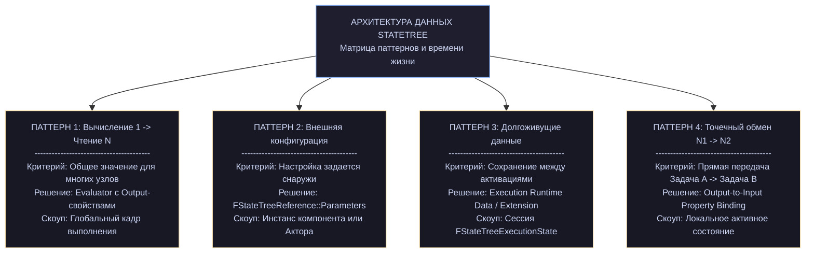

Соблазн сделать «свой blackboard» подсистемой и ходить в неё из всех узлов велик — и это ошибка. Вы потеряете видимость зависимостей в редакторе и вернётесь к тому, от чего StateTree уводит.

**Аборт декоратора → переходы.** В BT декоратор с `Observer Aborts: Self/Lower Priority` прерывает выполнение при изменении условия. В StateTree это переход:

```
BT: Decorator "HasEnemy" с Observer Aborts: Self на ветке Combat
        ↓
ST: переход из Combat: OnTick + условие «не HasEnemy» → Idle
    или лучше: OnEvent(EnemyLost) → Idle
```

Второй вариант предпочтительнее: он не требует тика (глава 17).

**Постоянный обход → активный путь.** В BT дерево пересобирается от корня каждый тик. В StateTree активный путь стабилен, пока не сработает переход. Логика «каждый кадр решаем заново» не переносится напрямую — её надо выразить через переходы.

Практически это означает: **условия входа проверяются только при выборе состояния**, а не каждый кадр. Если условие должно постоянно контролировать состояние, нужен переход, а не только enter condition.

#### Что стало лучше

- **Читаемость.** Активный путь виден и понятен; в BT надо мысленно прогонять обход.
- **Производительность.** Кэш-флаги, плоские массивы, возможность сна (глава 17).
- **Типизированные данные.** Биндинги проверяются компилятором, blackboard — нет.
- **Композиция.** Subtree/LinkedAsset с параметрами удобнее BT-субдеревьев.
- **Не только AI.** Одна технология для NPC, квестов, интерфейсов, механик.

#### Что стало сложнее

- **Порог входа.** Больше концепций: кадры, handle'ы, источники данных, схемы.
- **Отсутствие blackboard.** Требует дисциплины в проектировании потоков данных.
- **Ограничение в 8 состояний** на кадр (в BT глубина не ограничена).
- **Условия не имеют состояния** — instance data разделяется (глава 9).

### 22.3. Сводные шпаргалки

#### Флаги задачи

|Флаг|По умолч.|Ставить `false`/`true`, когда|
|---|---|---|
|`bShouldCallTick`|`true`|вся работа в `EnterState` → `false`|
|`bShouldCallTickOnlyOnEvents`|`false`|реакция только на события → `true` (+ первый в `false`)|
|`bShouldCopyBoundPropertiesOnTick`|`true`|входы читаются один раз → `false`|
|`bShouldCopyBoundPropertiesOnExitState`|`true`|на выходе входы не нужны → `false`|
|`bShouldStateChangeOnReselect`|`true`|удержание ресурса → `false`; действие → `true`|
|`bShouldAffectTransitions`|`false`|задача сама запрашивает переходы → `true`|
|`bConsideredForScheduling`|`true`|тик некритичен по времени → `false`|
|`bConsideredForCompletion`|`true`|фоновая задача → `false`|

#### Куда положить данные

|Что|Куда|
|---|---|
|Настройка узла, одинаковая для всех|поле узла (`UPROPERTY`)|
|Состояние текущей активации|instance data|
|Данные между активациями|execution runtime data|
|Значение из другого узла|входной биндинг|
|Результат для других узлов|выходное свойство (`Output`) + биндинг|
|Большая структура для правки на месте|`FStateTreePropertyRef`|
|Подсистема, мир, компонент|external data через `Link()`|
|Актор-владелец и его свойства|контекстные данные схемы|
|Настройка дерева снаружи|параметры дерева (`FStateTreeReference`)|

#### Категории свойств

|Категория|Смысл|Компилятор|
|---|---|---|
|`"Input"`|значение приходит извне|**требует** биндинг|
|`"Parameter"`|настраивается вручную|биндинг опционален|
|`"Output"`|публикуется наружу|нельзя как цель биндинга|
|`"Context"`|из контекста|заполняется автоматически|

#### Макросы instance data

| Макрос                                                                  | Когда                                                      |
| ----------------------------------------------------------------------- | ---------------------------------------------------------- |
| `UE_STATETREE_ZEROED_TRIVIALLY_COPIED_ NO_DESTRUCTOR_INSTANCEDATA`      | все поля `= 0`                                             |
| `UE_STATETREE_CONSTRUCTED_TRIVIALLY_ COPIED_NO_DESTRUCTOR_INSTANCEDATA` | есть ненулевые дефолты                                     |
| никакого                                                                | есть `FString`, `TArray`, `TObjectPtr`, `FInstancedStruct` |

#### Жёсткие ограничения

|Ограничение|Значение|Где|
|---|---|---|
|Активных состояний в кадре|**8**|`FStateTreeActiveStates::MaxStates`|
|Событий в очереди|**64**|`FStateTreeEventQueue::MaxActiveEvents`|
|Вложенность выражений условий|**4**|`UE::StateTree::MaxExpressionIndent`|
|Задач/условий/переходов на состояние|**255**|`uint8` счётчики|
|Задержка перехода|~655 с, шаг 0.01|`FStateTreeRandomTimeDuration`|
|Состояний в дереве|65531|`FStateTreeStateHandle`|

#### Что делать первым при проблеме

|Проблема|Первое действие|
|---|---|
|Не запускается|`IsReadyToRun()` + перекомпилировать ассет|
|Узел не виден|проверить базу (`*CommonBase`) и `IsStructAllowed`|
|Данные не те|проверить `bShouldCallTick` и `bShouldCopyBoundPropertiesOnTick`|
|Метод не вызывается|сверить сигнатуру с базовым классом|
|Не спит|`GetNextScheduledTick().GetReason()`|
|Непонятное поведение|`Log LogStateTree Verbose`|
|Проблемы с данными/биндингами|`DebugInternalLayoutAsString()`|
|Падение после GC|`AddStructReferencedObjects` при вложении в структуру|

### 22.4. Десять правил

Если бы надо было свести книгу к списку, он был бы такой.

1. **Узел константен и общий.** Всё изменяемое — в instance data. Методы `const` не случайно.
2. **Контекст временный.** Живёт один вызов. Для отложенного доступа — `MakeWeakExecutionContext()` или `GetInstanceDataStructRef()`.
3. **Данные копируются, а не берутся по ссылке.** Отсюда флаги копирования и правило «не тикает — не копирует».
4. **Handle'ы не сохраняются.** Индексы меняются при перекомпиляции. Сохраняйте теги.
5. **Instance data не сериализуется.** Прогресс сохраняйте отдельно.
6. **Схема — контракт.** Начинайте с ограничений, открывайте по необходимости.
7. **Сон важнее всех остальных оптимизаций.** Он даёт порядки, остальное — проценты.
8. **`ExitState` симметричен `EnterState`**, но не безусловен. Проверяйте, что ресурс захвачен.
9. **Условия не имеют состояния.** Их instance data разделяется между всеми.
10. **Сверяйтесь с объявлениями, не с комментариями.** В StateTree комментарии местами отстают на версии.

### 22.5. Что осталось за рамками

Честный список того, чего не было в нашем пакете файлов — чтобы вы знали, куда смотреть дальше.

**Редакторская часть целиком:**

- `UStateTreeEditorData`, `UStateTreeState` — редакторское представление;
- `FStateTreeCompiler`, `FStateTreePropertyBindingCompiler` — компиляция;
- `IStateTreeBindingLookup` — реализация в редакторном плагине;
- редакторские детали узлов (`FStateTreeBlueprintPropertyRefDetails` и подобные).

**Runtime-файлы, на которые мы ссылались:**

- `StateTreeReference.h` — `FStateTreeReference`, `FStateTreeReferenceOverrides`;
- `StateTreeExecutionExtension.h` — базовый класс расширения, `FContextParameters`, `FNextTickArguments`;
- `StateTreeIndexTypes.h` — `FStateTreeIndex16`, `FActiveFrameID`, `FActiveStateID`;
- `StateTreeDelegate.h` — `FStateTreeDelegateDispatcher`, `FStateTreeDelegateListener`;
- `StateTreeTasksStatus.h` — `EStateTreeTaskCompletionType`, `ETaskCompletionCondition`, `FTaskCompletionDispatcher`, `FStateTreeTasksCompletionStatus`;
- `StateTreeConsiderationBase.h` — база utility-оценок;
- `StateTreePropertyRefHelpers.h` — `Validator<T>`;
- `StateTreeExecutionContextTypes.h` — `ITemporaryStorage`, `FStateHandleContext`;
- `StateTreeStatePath.h` — `FActiveStatePath`;
- `StateTreeAnyEnum.h` — `FStateTreeAnyEnum`;
- `StateTreeNodeRef.h`, `StateTreeSchemaProvider.h`.

**Blueprint-обёртки:**

- `StateTreeTaskBlueprintBase.h`, `StateTreeConditionBlueprintBase.h`, `StateTreeEvaluatorBlueprintBase.h` — базы для BP-узлов.

**Интеграции:**

- `UStateTreeAIComponent`, `UStateTreeAIComponentSchema` — AI-вариант;
- Mass-интеграция (`MassStateTreeProcessor`, `FMassStateTreeFragment`);
- Smart Objects, Gameplay Behaviors.

**Инструменты:**

- `Debugger/StateTreeTrace.h` — трейсинг;
- StateTree Debugger — окно редактора.

Если по какой-то из этих тем нужен разбор — загрузите соответствующие файлы, и мы продолжим тем же форматом.

### 22.6. Что читать в исходниках дальше

Практический порядок, если хотите углубляться самостоятельно:

1. **`StateTreeExecutionContext.cpp`** — самое ценное. Все алгоритмы, которые мы реконструировали по сигнатурам: `SelectState`, `TriggerTransitions`, `EnterState`/`ExitState`, порядок фаз.
2. **`StateTreeInstanceData.cpp`** — разрешение `GetDataView` для всех девятнадцати источников.
3. **`StateTreeCompiler.cpp`** (редакторный модуль) — как редакторские данные превращаются в плоские массивы. Отвечает на вопросы «почему индексы такие» и «как считаются маски».
4. **`StateTreePropertyBindings.cpp`** — `ResolveBindingCopyInfo`, типы копирования.
5. **Тесты** — `Source/StateTreeModule/Tests` или аналог в вашей версии. Тесты часто документируют граничные случаи лучше комментариев.

### 22.7. Итог

Двадцать две главы назад мы начали с того, что StateTree — гибрид иерархического автомата и behavior tree. Теперь можно сформулировать точнее.

**StateTree — это система, где логика и данные разделены по слоям, а всё, что можно посчитать заранее, считается на компиляции.**

Из этого выросло всё остальное:

- узлы константны, потому что лежат в общем массиве;
- данные копируются, потому что указатели не переживают перестройку буфера;
- дерево — плоские массивы с диапазонами, потому что так дружелюбнее к кэшу;
- кэш-флаги в состояниях, потому что проверить бит дешевле, чем обойти узлы;
- схемы, потому что контракт должен быть проверяем до запуска;
- сон, потому что большую часть времени большинству агентов нечего делать.

Понимая эти причины, вы будете принимать правильные решения даже там, где эта книга не даёт прямого ответа — а движок меняется, и такие места неизбежно будут.

---

## Глава 23. StateTree + Mass: практический разбор

### 23.0. Оговорка об источниках

Файлов интеграции (`MassStateTreeTypes.h`, `MassStateTreeProcessors.h`, `MassStateTreeSchema.h`, `MassStateTreeFragments.h`, `MassStateTreeExecutionContext.h`) у меня нет — вы их не загружали. Поэтому глава построена так:

- **Что обосновано загруженными файлами** — я показываю конкретные места в исходниках StateTree, спроектированные именно под батчевое исполнение. Их шесть, и они убедительные.
- **Что я строю сам** — рабочий скелет интеграции с разбором каждого решения. Это не копия движкового плагина, а конструкция, показывающая принципы.
- **Что помню про движковый плагин** (`MassAIBehavior`) — помечаю отдельно, имена классов проверяйте в своей версии: интеграция активно менялась.

Такой формат полезнее пересказа по памяти: вы поймёте, **почему** интеграция устроена так, и сможете читать движковую реализацию любой версии.

Вы делали пособие по Mass, поэтому базовые понятия (энтити, фрагменты, трейты, процессоры, shared fragment, сигналы) я не объясняю.

### 23.1. Конфликт двух моделей данных

Mass и StateTree построены на противоположных предпосылках.

**Mass:** данные — плоские массивы фрагментов, разложенные по архетипам и чанкам. Процессор проходит по чанку линейно, всё в кэше, аллокаций нет.

**StateTree:** данные экземпляра — `FStateTreeInstanceStorage`, живущая в куче за `TSharedRef`:

cpp

```cpp
// StateTreeInstanceData.h
protected:
    /** Storage for the actual instance data, always stores FStateTreeInstanceStorage. */
    TSharedRef<FStateTreeInstanceStorage> InstanceStorage = MakeShared<FStateTreeInstanceStorage>();
```

Внутри — `FInstancedStructContainer`, размер которого меняется при каждой смене состояний (`Append`/`ShrinkTo`, глава 6).

То есть **каждая энтити с деревом получает отдельную аллокацию в куче**, и обход тысячи таких энтити — это тысяча прыжков по разным адресам. Ровно то, от чего Mass уводит.

Это фундаментальный компромисс, и его надо принять сознательно: State Tree на энтити стоит дороже, чем фрагмент с парой полей. Выигрыш — в том, что поведение становится дизайнерским контентом, а не кодом процессора.

Практический вывод, который стоит сделать до всякой архитектуры: **StateTree в Mass — для агентов, которых сотни, а не для частиц, которых сотни тысяч**. Толпа горожан, отряды, животные — да. Пули, листва, следы — нет.

### 23.2. Шесть мест, спроектированных под Mass

Теперь докажем, что интеграция не пришита сбоку. В загруженных файлах есть шесть решений, объяснимых только батчевым исполнением.

#### 1. Разделяемый ассет — уже готовая модель

cpp

```cpp
// StateTree.h
UPROPERTY() FInstancedStructContainer Nodes;
UPROPERTY() FStateTreeInstanceData DefaultInstanceData;
```

Один `UStateTree` на все экземпляры, узлы константны, данные копируются из шаблонов (глава 1). В Mass это ложится на **shared fragment**: ассет — общий, инстанс-данные — свои.

#### 2. Per-thread разделяемые данные условий

cpp

```cpp
// StateTree.h
mutable FTransactionallySafeRWLock PerThreadSharedInstanceDataLock;
mutable TArray<TSharedPtr<FStateTreeInstanceData>> PerThreadSharedInstanceData;

TSharedPtr<FStateTreeInstanceData> GetSharedInstanceData() const;
```

Зачем `PerThread`, если дерево на акторе тикает в игровом потоке? **Незачем.** Это существует ровно для параллельных процессоров Mass: несколько потоков одновременно вычисляют условия одного и того же дерева (глава 4).

#### 3. Раздельный тик

cpp

```cpp
// StateTreeExecutionContext.h
/**
 * Tick the state tree logic partially, updates the tasks.
 * For full update TickTriggerTransitions() should be called after.
 */
EStateTreeRunStatus TickUpdateTasks(const float DeltaTime);

/**
 * Tick the state tree logic partially, triggers the transitions.
 * For full update TickUpdateTasks() should be called before.
 */
EStateTreeRunStatus TickTriggerTransitions();
```

Компоненту это не нужно — он вызывает `Tick()`. Разделение нужно тому, кто обрабатывает **много экземпляров**: сначала все задачи (параллельно, кэш-дружественно), потом все переходы. Глава 14.

#### 4. Внешние глобальные параметры

cpp

```cpp
// StateTreeExecutionContext.h
/** Structure to-be-populated and set for any StateTree using any EStateTreeDataSourceType::ExternalGlobalParameterData bindings */
struct FExternalGlobalParameters
{
    bool Add(const FPropertyBindingCopyInfo& Copy, uint8* InParameterMemory);
    uint8* Find(const FPropertyBindingCopyInfo& Copy) const;
    void Reset();
private:
    TMap<uint32, uint8*> Mappings;
};
void SetExternalGlobalParameters(const FExternalGlobalParameters* Parameters);
```

Плюс в схеме:

cpp

```cpp
// StateTreeSchema.h
virtual EStateTreeParameterDataType GetGlobalParameterDataType() const;
```

cpp

```cpp
// StateTreeTypes.h
enum class EStateTreeParameterDataType : uint8
{
    GlobalParameterData,          // внутри instance data
    ExternalGlobalParameterData,  // память поставляет владелец
};
```

**Параметры дерева могут жить в чужой памяти.** Для компонента это бессмысленно. Для Mass — это возможность держать параметры прямо во фрагменте энтити и биндиться к ним без копирования (главы 3, 14).

#### 5. Хук отложенных переходов

cpp

```cpp
// StateTreeExecutionContext.h
/** Callback when delayed transition is triggered. Contexts that are event based can use this to trigger a future event. */
virtual void BeginDelayedTransition(const FStateTreeTransitionDelayedState& DelayedState) {};
```

**«Contexts that are event based»** — прямое указание. Спящее дерево не проснётся само через две секунды; событийный владелец должен запланировать сигнал. Это точка, где Mass-контекст ставит отложенный сигнал.

#### 6. Расширение исполнения

cpp

```cpp
// StateTreeExecutionTypes.h (в FStateTreeExecutionState)
UPROPERTY(Transient)
TInstancedStruct<FStateTreeExecutionExtension> ExecutionExtension;
```

`TInstancedStruct` — тип выбирает владелец. Компонент ставит своё расширение, Mass ставит своё (глава 17).

**Вывод:** StateTree с самого начала проектировался с расчётом на два режима владения — покадровый (компонент) и батчево-событийный (Mass). Половина механизмов, которые в компонентном сценарии выглядят избыточными, существует ради второго.

### 23.3. Архитектура интеграции

Собираем скелет.

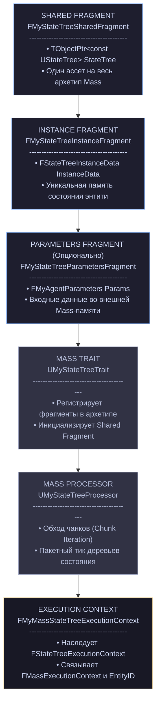

#### Фрагменты

cpp

```cpp
USTRUCT()
struct FMyStateTreeInstanceFragment : public FMassFragment
{
    GENERATED_BODY()

    /** Инстанс-данные дерева. Внутри TSharedRef → одна аллокация на энтити. */
    FStateTreeInstanceData InstanceData;
};

USTRUCT()
struct FMyStateTreeSharedFragment : public FMassSharedFragment
{
    GENERATED_BODY()

    UPROPERTY()
    TObjectPtr<const UStateTree> StateTree = nullptr;
};
```

Обратите внимание на **отсутствие `UPROPERTY` у `InstanceData`**. Это осознанное расхождение с правилом главы 6:

> _«You are supposed to use FStateTreeInstanceData as a property to store the instance data. That ensures that any UObject references will get GC'd correctly.»_

Фрагменты Mass не участвуют в обычной сборке мусора через `UPROPERTY`. Значит **вы обязаны прокинуть сборку ссылок вручную** — либо через `AddStructReferencedObjects` фрагмента, либо через механизм Mass для GC-ссылок в вашей версии:

cpp

```cpp
USTRUCT()
struct FMyStateTreeInstanceFragment : public FMassFragment
{
    GENERATED_BODY()

    FStateTreeInstanceData InstanceData;

    void AddStructReferencedObjects(FReferenceCollector& Collector)
    {
        InstanceData.AddStructReferencedObjects(Collector);
    }
};

template<>
struct TStructOpsTypeTraits<FMyStateTreeInstanceFragment> : public TStructOpsTypeTraitsBase2<FMyStateTreeInstanceFragment>
{
    enum { WithAddStructReferencedObjects = true };
};
```

**Забыть это — значит получить падения после сборки мусора**, если в instance data есть `UObject`-ы (Blueprint-узлы, ссылки на акторов). Валидация из главы 21 (`WITH_STATETREE_DEBUG`) поможет поймать.

#### Трейт

cpp

```cpp
UCLASS(meta = (DisplayName = "My State Tree"))
class UMyStateTreeTrait : public UMassEntityTraitBase
{
    GENERATED_BODY()

protected:
    virtual void BuildTemplate(FMassEntityTemplateBuildContext& BuildContext,
                               const UWorld& World) const override
    {
        BuildContext.AddFragment<FMyStateTreeInstanceFragment>();
        BuildContext.AddFragment<FMyStateTreeParametersFragment>();
        BuildContext.AddTag<FMyStateTreeActivatedTag>();

        // Shared fragment: энтити с одинаковым ассетом делят один фрагмент.
        FMyStateTreeSharedFragment SharedFragment;
        SharedFragment.StateTree = StateTreeRef.GetStateTree();

        const uint32 Hash = PointerHash(SharedFragment.StateTree);
        FSharedStruct Shared = /* GetOrCreateSharedFragmentByHash в вашей версии */;
        BuildContext.AddSharedFragment(Shared);
    }

    UPROPERTY(EditAnywhere, Category = "StateTree",
              meta = (Schema = "/Script/MyGame.MyMassStateTreeSchema"))
    FStateTreeReference StateTreeRef;
};
```

Метадата `Schema` (глава 18) фильтрует список ассетов: в слот попадут только деревья, собранные для Mass. Дерево от `UStateTreeComponent` сюда не положить — и это правильно, оно ждёт актора.

**Ключевое архитектурное решение:** ассет — в shared fragment. Все энтити с одинаковым поведением попадают в один архетип и обрабатываются одним проходом процессора. Это то, ради чего в StateTree ассет изначально сделан разделяемым (глава 1).

### 23.4. Схема для Mass

Схема здесь решает больше, чем в компонентном случае, потому что определяет саму модель данных.

cpp

```cpp
UCLASS(BlueprintType, EditInlineNew, CollapseCategories, meta = (DisplayName = "Mass Agent"))
class UMyMassStateTreeSchema : public UStateTreeSchema
{
    GENERATED_BODY()

public:
    UMyMassStateTreeSchema()
    {
        // Контекстные данные: то, что предоставит процессор по имени.
        ContextDataDescs.Emplace(UE::MyMass::Names::EntityHandle,
                                 FMassEntityHandle::StaticStruct(), FGuid(/*...*/));
        ContextDataDescs.Emplace(UE::MyMass::Names::MassContext,
                                 FMassStateTreeContextData::StaticStruct(), FGuid(/*...*/));
    }

protected:
    virtual bool IsStructAllowed(const UScriptStruct* InScriptStruct) const override
    {
        // Только Mass-совместимые узлы плюс общие условия.
        return InScriptStruct->IsChildOf(FStateTreeConditionCommonBase::StaticStruct())
            || InScriptStruct->IsChildOf(FMassStateTreeTaskBase::StaticStruct())
            || InScriptStruct->IsChildOf(FMassStateTreeEvaluatorBase::StaticStruct());
    }

    virtual bool IsClassAllowed(const UClass* InClass) const override
    {
        return false;    // Blueprint-узлы в Mass не пускаем: UObject на энтити — дорого
    }

    virtual bool IsExternalItemAllowed(const UStruct& InStruct) const override
    {
        // Только подсистемы Mass. Никаких акторов и компонентов.
        return InStruct.IsChildOf(UMassSignalSubsystem::StaticClass())
            || InStruct.IsChildOf(UMassEntitySubsystem::StaticClass())
            || InStruct.IsChildOf(UMyCrowdSubsystem::StaticClass())
            || InStruct.IsChildOf(UWorld::StaticClass());
    }

    virtual bool IsScheduledTickAllowed() const override
    {
        return true;     // обязательно: без сна толпа не окупится
    }

    virtual bool IsStateTypeAllowed(EStateTreeStateType InStateType) const override
    {
        // Связанные ассеты создают кадры и удорожают вход — запрещаем.
        return InStateType != EStateTreeStateType::LinkedAsset;
    }

    virtual EStateTreeParameterDataType GetGlobalParameterDataType() const override
    {
        // Параметры живут во фрагменте, не в instance data.
        return EStateTreeParameterDataType::ExternalGlobalParameterData;
    }

    virtual TConstArrayView<FStateTreeExternalDataDesc> GetContextDataDescs() const override
    {
        return ContextDataDescs;
    }

#if WITH_EDITOR
    virtual bool AllowEvaluators() const override { return false; }
#endif

    UPROPERTY()
    TArray<FStateTreeExternalDataDesc> ContextDataDescs;
};
```

Четыре решения здесь стоят объяснения.

**`IsClassAllowed` возвращает `false`.** Blueprint-узлы — это `UObject` в instance data каждой энтити. Тысяча агентов = тысяча объектов, участвующих в GC. Для Mass это неприемлемо. Узлы только на C++.

**`IsExternalItemAllowed` не пускает акторов и компонентов.** У энтити их может не быть вовсе (Mass-агент без представления). Узел, требующий `AActor`, сломается на первой же безакторной энтити.

**`GetGlobalParameterDataType` → `ExternalGlobalParameterData`.** Вот где пригождается механизм из главы 3. Параметры агента (скорость, радиус восприятия, агрессия) лежат во фрагменте — там же, где их читают другие процессоры. Дерево биндится к ним напрямую, без копирования в instance data.

**`AllowEvaluators() == false`.** Радикально, но обоснованно: evaluator тикает всегда и его нельзя отключить (глава 10). В толпе каждый evaluator — гарантированный вызов на каждого агента. Данные восприятия в Mass должен готовить **отдельный процессор**, записывая результат во фрагмент, а дерево — читать фрагмент биндингом. Так вычисление становится батчевым и параллельным.

Это, пожалуй, главное отличие Mass-дерева от компонентного: **вычисления выносятся из дерева в процессоры**, дерево только принимает решения.

### 23.5. Контекст исполнения

cpp

```cpp
/** Данные, которые процессор передаёт узлам через контекстные данные. */
USTRUCT()
struct FMassStateTreeContextData
{
    GENERATED_BODY()

    FMassEntityHandle Entity;
    FMassExecutionContext* MassContext = nullptr;   // валиден только внутри тика
};

struct FMyMassStateTreeExecutionContext : public FStateTreeExecutionContext
{
    FMyMassStateTreeExecutionContext(UObject& InOwner, const UStateTree& InStateTree,
                                     FStateTreeInstanceData& InInstanceData,
                                     FMassEntityHandle InEntity,
                                     FMassExecutionContext& InMassContext,
                                     UMassSignalSubsystem& InSignals)
        : FStateTreeExecutionContext(InOwner, InStateTree, InInstanceData)
        , Entity(InEntity)
        , MassContext(InMassContext)
        , SignalSubsystem(InSignals)
    {
    }

    FMassEntityHandle GetEntity() const { return Entity; }
    FMassExecutionContext& GetMassContext() const { return MassContext; }

protected:
    /** Отложенный переход: спящее дерево должно быть разбужено сигналом. */
    virtual void BeginDelayedTransition(const FStateTreeTransitionDelayedState& DelayedState) override
    {
        SignalSubsystem.DelaySignalEntity(
            UE::MyMass::Signals::StateTreeDelayedTransition,
            Entity,
            DelayedState.TimeLeft);
    }

private:
    FMassEntityHandle Entity;
    FMassExecutionContext& MassContext;
    UMassSignalSubsystem& SignalSubsystem;
};
```

`BeginDelayedTransition` — тот самый хук, чей комментарий мы разбирали в 23.2. Логика: дерево ставит отложенный переход на две секунды и засыпает. Без сигнала оно бы не проснулось и переход бы не сработал. Контекст ставит отложенный сигнал, который разбудит энтити ровно тогда, когда нужно.

Это **обязательная** часть интеграции. Пропустите её — и отложенные переходы в спящих деревьях будут молча не срабатывать.

### 23.6. Процессор

cpp

```cpp
UCLASS()
class UMyStateTreeProcessor : public UMassProcessor
{
    GENERATED_BODY()

public:
    UMyStateTreeProcessor()
    {
        ExecutionFlags = (int32)EProcessorExecutionFlags::AllNetModes;
        ExecutionOrder.ExecuteInGroup = UE::Mass::ProcessorGroupNames::Behavior;
        bRequiresGameThreadExecution = false;    // см. разбор ниже
    }

protected:
    virtual void ConfigureQueries(const TSharedRef<FMassEntityManager>& Manager) override
    {
        EntityQuery.AddRequirement<FMyStateTreeInstanceFragment>(EMassFragmentAccess::ReadWrite);
        EntityQuery.AddRequirement<FMyStateTreeParametersFragment>(EMassFragmentAccess::ReadWrite);
        EntityQuery.AddConstSharedRequirement<FMyStateTreeSharedFragment>();
        EntityQuery.AddTagRequirement<FMyStateTreeActivatedTag>(EMassFragmentPresence::All);

        EntityQuery.AddSubsystemRequirement<UMassSignalSubsystem>(EMassFragmentAccess::ReadWrite);
        EntityQuery.AddSubsystemRequirement<UMyCrowdSubsystem>(EMassFragmentAccess::ReadOnly);
    }

    virtual void Execute(FMassEntityManager& Manager, FMassExecutionContext& Context) override
    {
        EntityQuery.ForEachEntityChunk(Context,
            [this, &Manager](FMassExecutionContext& Ctx)
        {
            const FMyStateTreeSharedFragment& Shared = Ctx.GetConstSharedFragment<FMyStateTreeSharedFragment>();
            if (!Shared.StateTree || !Shared.StateTree->IsReadyToRun())
            {
                return;
            }

            const TArrayView<FMyStateTreeInstanceFragment> Instances =
                Ctx.GetMutableFragmentView<FMyStateTreeInstanceFragment>();
            const TArrayView<FMyStateTreeParametersFragment> Params =
                Ctx.GetMutableFragmentView<FMyStateTreeParametersFragment>();

            UMassSignalSubsystem& Signals = Ctx.GetMutableSubsystemChecked<UMassSignalSubsystem>();
            const float DeltaTime = Ctx.GetDeltaTimeSeconds();

            // ── Фаза 1: тик задач ──────────────────────────────────
            for (int32 i = 0; i < Ctx.GetNumEntities(); ++i)
            {
                FMyMassStateTreeExecutionContext STContext(
                    *this, *Shared.StateTree, Instances[i].InstanceData,
                    Ctx.GetEntity(i), Ctx, Signals);

                if (!SetContextRequirements(STContext, Ctx, i, Params[i]))
                {
                    continue;
                }
                STContext.TickUpdateTasks(DeltaTime);
            }

            // ── Фаза 2: переходы ───────────────────────────────────
            for (int32 i = 0; i < Ctx.GetNumEntities(); ++i)
            {
                FMyMassStateTreeExecutionContext STContext(
                    *this, *Shared.StateTree, Instances[i].InstanceData,
                    Ctx.GetEntity(i), Ctx, Signals);

                if (!SetContextRequirements(STContext, Ctx, i, Params[i]))
                {
                    continue;
                }
                STContext.TickTriggerTransitions();
            }
        });
    }

    bool SetContextRequirements(FMyMassStateTreeExecutionContext& STContext,
                                FMassExecutionContext& MassContext,
                                int32 EntityIndex,
                                FMyStateTreeParametersFragment& ParamsFragment)
    {
        if (!STContext.IsValid())
        {
            return false;
        }

        // Контекстные данные — по именам из схемы.
        FMassStateTreeContextData ContextData;
        ContextData.Entity = MassContext.GetEntity(EntityIndex);
        ContextData.MassContext = &MassContext;

        STContext.SetContextDataByName(UE::MyMass::Names::EntityHandle,
            FStateTreeDataView(FStructView::Make(ContextData.Entity)));
        STContext.SetContextDataByName(UE::MyMass::Names::MassContext,
            FStateTreeDataView(FStructView::Make(ContextData)));

        // Параметры дерева — прямо во фрагменте, без копирования.
        ExternalParams.Reset();
        // ...заполнение ExternalParams.Add(CopyInfo, (uint8*)&ParamsFragment.Params)...
        STContext.SetExternalGlobalParameters(&ExternalParams);

        STContext.SetCollectExternalDataCallback(
            FOnCollectStateTreeExternalData::CreateUObject(this, &UMyStateTreeProcessor::CollectExternalData));

        return STContext.AreContextDataViewsValid();
    }

    bool CollectExternalData(const FStateTreeExecutionContext& Context, const UStateTree* StateTree,
                             TArrayView<const FStateTreeExternalDataDesc> Descs,
                             TArrayView<FStateTreeDataView> OutDataViews) const
    {
        UWorld* World = GetWorld();
        for (int32 Index = 0; Index < Descs.Num(); ++Index)
        {
            const UStruct* Struct = Descs[Index].Struct;
            if (!Struct) { continue; }

            if (Struct == UWorld::StaticClass())
            {
                OutDataViews[Index] = FStateTreeDataView(World);
            }
            else if (const UClass* AsClass = Cast<UClass>(Struct))
            {
                if (AsClass->IsChildOf(UWorldSubsystem::StaticClass()))
                {
                    OutDataViews[Index] = FStateTreeDataView(World->GetSubsystemBase(const_cast<UClass*>(AsClass)));
                }
            }
        }
        return true;
    }

private:
    FMassEntityQuery EntityQuery;
    FStateTreeExecutionContext::FExternalGlobalParameters ExternalParams;
};
```

Разберём ключевые решения.

**Два прохода вместо одного.** Ровно ради этого существует разделение `TickUpdateTasks` / `TickTriggerTransitions` (глава 14). Выигрыш: в первом проходе все энтити чанка выполняют однотипную работу — лучше для предсказания ветвлений и кэша инструкций. Плюс между фазами можно вставить общую обработку (например, разрешить конфликты между агентами).

**Контекст создаётся на каждую энтити и каждую фазу.** Дорого? Нет: контекст — это несколько ссылок на стеке (глава 14), без аллокаций. Он не хранится, потому что не может: копирование удалено конструктивно.

**Ассет берётся из shared fragment один раз на чанк.** Проверка `IsReadyToRun()` — тоже один раз, а не на каждую энтити.

**`bRequiresGameThreadExecution = false`** — и вот здесь начинается самое ответственное.

### 23.7. Многопоточность: что можно, а что нельзя

Mass-процессоры выполняются параллельно. StateTree это допускает, но с оговорками из главы 6:

cpp

```cpp
/**
 * Used to detect if we are using the instance data on multiple threads in a safe way.
 * The instance data supports multiple reader threads or a single writer thread.
 * The detector supports recursive access.
 */
UE_MT_DECLARE_MRSW_RECURSIVE_ACCESS_DETECTOR(AccessDetector);
```

**Что безопасно:**

|Что|Почему|
|---|---|
|Разные энтити в разных потоках|у каждой своя `FStateTreeInstanceStorage`|
|Чтение общего `UStateTree`|ассет константен во время исполнения|
|Условия одного дерева параллельно|`PerThreadSharedInstanceData` (23.2, пункт 2)|

**Что опасно:**

|Что|Что делать|
|---|---|
|Узел трогает `UObject` не из игрового потока|вынести в процессор игрового потока|
|Узел спавнит/уничтожает энтити|через `FMassCommandBuffer`, не напрямую|
|Узел пишет в общую подсистему|подсистема должна быть потокобезопасной, или `ReadOnly`|
|Одна энтити обрабатывается двумя процессорами|зависимости процессоров|
|Отправка сигнала не из игрового потока|проверьте контракт `UMassSignalSubsystem` в вашей версии|

Правило для авторов узлов: **Mass-задача не имеет права ни на что, кроме своих данных, констант и команд**. Всё, что меняет мир, — через командный буфер:

cpp

```cpp
EStateTreeRunStatus FMassSpawnEffectTask::EnterState(FStateTreeExecutionContext& Context,
                                                     const FStateTreeTransitionResult& Transition) const
{
    const FInstanceDataType& Data = Context.GetInstanceData(*this);
    const FMassStateTreeContextData& MassData =
        Context.GetContextDataByName(UE::MyMass::Names::MassContext).Get<FMassStateTreeContextData>();

    // НЕ спавним напрямую — откладываем в командный буфер.
    MassData.MassContext->Defer().PushCommand<FMassDeferredCreateCommand>(
        [Location = Data.Location](FMassEntityManager& Manager)
        {
            /* ...создание эффекта в безопасный момент... */
        });

    return EStateTreeRunStatus::Succeeded;
}
```

Если хоть один ваш узел не соблюдает это правило — ставьте `bRequiresGameThreadExecution = true` и теряйте параллелизм. Половинчатых вариантов нет.

### 23.8. Сигналы вместо тика: главный выигрыш

Здесь сходятся глава 17 и модель Mass.

В компонентном сценарии сон означает «отключить тик компонента». В Mass — **исключить энтити из запроса процессора**. Механика: тег.

cpp

```cpp
/** Энтити с этим тегом обрабатывается процессором. */
USTRUCT()
struct FMyStateTreeActivatedTag : public FMassTag { GENERATED_BODY() };
```

Расширение исполнения снимает тег при засыпании и возвращает при пробуждении:

cpp

```cpp
USTRUCT()
struct FMyMassStateTreeExecutionExtension : public FStateTreeExecutionExtension
{
    GENERATED_BODY()

    virtual void ScheduleNextTick(const FContextParameters& Context, const FNextTickArguments& Args) override
    {
        if (Args.ScheduledTick.ShouldSleep())
        {
            // Энтити выпадает из запроса процессора — стоит ровно ноль.
            DeferredCommands->PushCommand<FMassCommandRemoveTags<FMyStateTreeActivatedTag>>(Entity);
        }
        else if (Args.ScheduledTick.HasCustomTickRate())
        {
            // Просыпаемся через заданное время сигналом.
            SignalSubsystem->DelaySignalEntity(UE::MyMass::Signals::StateTreeWakeUp,
                                               Entity, Args.ScheduledTick.GetTickRate());
            DeferredCommands->PushCommand<FMassCommandRemoveTags<FMyStateTreeActivatedTag>>(Entity);
        }
        // EveryFrames — тег остаётся, энтити обрабатывается каждый кадр.
    }

    FMassEntityHandle Entity;
    UMassSignalSubsystem* SignalSubsystem = nullptr;
    FMassCommandBuffer* DeferredCommands = nullptr;
};
```

И второй процессор, реагирующий на сигналы (в движке есть базовый класс для сигнальных процессоров — `UMassSignalProcessorBase` или аналог в вашей версии):

cpp

```cpp
UCLASS()
class UMyStateTreeSignalProcessor : public UMassSignalProcessorBase
{
    GENERATED_BODY()

protected:
    virtual void InitializeInternal(UObject& Owner, const TSharedRef<FMassEntityManager>& Manager) override
    {
        Super::InitializeInternal(Owner, Manager);

        SubscribeToSignal(*SignalSubsystem, UE::MyMass::Signals::StateTreeWakeUp);
        SubscribeToSignal(*SignalSubsystem, UE::MyMass::Signals::StateTreeDelayedTransition);
        SubscribeToSignal(*SignalSubsystem, UE::MyMass::Signals::EnemySpotted);
        SubscribeToSignal(*SignalSubsystem, UE::MyMass::Signals::TaskFinished);
    }

    virtual void SignalEntities(FMassEntityManager& Manager, FMassExecutionContext& Context,
                                FMassSignalNameLookup& Signals) override
    {
        // 1. Конвертируем сигнал в событие StateTree.
        // 2. Возвращаем тег → энтити снова попадает в основной процессор.
        for (const FMassEntityHandle Entity : Context.GetEntities())
        {
            // ...SendEvent в очередь дерева этой энтити...
            Context.Defer().PushCommand<FMassCommandAddTags<FMyStateTreeActivatedTag>>(Entity);
        }
    }
};
```

**Вот где интеграция окупается.** Тысяча горожан: девятьсот спят (нет тега, процессор их не видит вовсе), сотня активна. Основной процессор обрабатывает сотню чанк-эффективно. Спящие не стоят **ничего** — не «дешёвую проверку», а буквально ноль, потому что не попадают в запрос.

Сравните с компонентным вариантом: там спящий компонент всё равно существует, его тик-функция зарегистрирована, и отключение стоит вызова `SetComponentTickEnabled`.

Именно поэтому `IsScheduledTickAllowed()` в Mass-схеме — не опция, а обязательное условие осмысленности всей затеи.

### 23.9. Полный пример: толпа горожан

Соберём всё в законченный сценарий.

#### Данные

cpp

```cpp
/** Параметры агента — во фрагменте, дерево биндится к ним напрямую. */
USTRUCT()
struct FMyAgentParameters
{
    GENERATED_BODY()

    UPROPERTY(EditAnywhere, Category = "Parameter") float WalkSpeed = 150.0f;
    UPROPERTY(EditAnywhere, Category = "Parameter") float FleeSpeed = 400.0f;
    UPROPERTY(EditAnywhere, Category = "Parameter") float PanicThreshold = 800.0f;
};

USTRUCT()
struct FMyStateTreeParametersFragment : public FMassFragment
{
    GENERATED_BODY()
    FMyAgentParameters Params;
};

/** Результат работы процессора восприятия — дерево только читает. */
USTRUCT()
struct FMyPerceptionFragment : public FMassFragment
{
    GENERATED_BODY()

    FVector NearestThreatLocation = FVector::ZeroVector;
    float DistanceToThreat = BIG_NUMBER;
    bool bThreatVisible = false;
};
```

Разделение ответственности здесь принципиальное:

```
UMyPerceptionProcessor  →  пишет FMyPerceptionFragment   (батчево, параллельно, каждый кадр)
                                      ↓ биндинг
UMyStateTreeProcessor   →  дерево читает и решает        (только для активных энтити)
                                      ↓
UMyMovementProcessor    →  исполняет FMyMoveTargetFragment (батчево)
```

**Дерево не считает и не двигает — оно решает.** Это и есть правильное разделение в Mass: вычисления и исполнение батчевые, принятие решений — деревом.

#### Дерево

```mermaid
flowchart TD
    ROOT["ROOT (Group State)<br>Selection: TrySelectChildrenInOrder"]

    FLEE["STATE: Flee<br>----------------------------------------<br>Enter Condition:<br>• Perception.bThreatVisible == true<br>• DistanceToThreat &lt; Params.PanicThreshold<br><br>Tasks:<br>• SetMoveTarget (Away from threat, FleeSpeed)<br>• PlayAnimTag (Panic) [bConsideredForCompletion=false]<br><br>Transition: OnTick (!Threat) -&gt; Wander"]

    WANDER["STATE: Wander (Group State)<br>Selection: TrySelectChildrenInOrder<br>----------------------------------------<br>Task: HoldCrowdSlot [bShouldStateChangeOnReselect=false]"]

    PICK_DEST["SUB-STATE: PickDestination<br>----------------------------------------<br>Task: PickRandomPointNearby [bShouldCallTick=false]<br><br>Transition: OnStateSucceeded -&gt; MoveToDestination"]

    MOVE_DEST["SUB-STATE: MoveToDestination<br>----------------------------------------<br>Tasks:<br>• SetMoveTarget (Destination, WalkSpeed)<br>• WaitForArrival (CustomTickRate = 0.25s)<br><br>Transitions:<br>• OnStateSucceeded -&gt; Idle<br>• OnStateFailed -&gt; PickDestination"]

    IDLE["SUB-STATE: Idle<br>----------------------------------------<br>Task: WaitRandom (2 - 6s)<br><br>Transition: OnStateSucceeded -&gt; PickDestination"]

    ROOT --> FLEE
    ROOT --> WANDER
    WANDER --> PICK_DEST
    PICK_DEST --> MOVE_DEST
    MOVE_DEST --> IDLE
    IDLE -.->|Loop Back| PICK_DEST

    classDef rootStyle fill:#1e1e2e,stroke:#89b4fa,stroke-width:1px,color:#cdd6f4
    classDef fleeStyle fill:#181825,stroke:#f9e2af,stroke-width:1px,color:#cdd6f4
    classDef wanderStyle fill:#313244,stroke:#a6adc8,stroke-width:1px,color:#bac2de

    class ROOT rootStyle
    class FLEE fleeStyle
    class WANDER,PICK_DEST,MOVE_DEST,IDLE wanderStyle
```

Обратите внимание на распределение флагов:

- `PickRandomPointNearby` — `bShouldCallTick = false`: работа целиком в `EnterState`.
- `HoldCrowdSlot` — `bShouldStateChangeOnReselect = false`: слот удерживается при смене детей (глава 8).
- `PlayAnimTag` — `bConsideredForCompletion = false`: анимация не завершает состояние.
- `WaitForArrival` — явный `CustomTickRate`: проверять прибытие 60 раз в секунду не нужно.
- `Idle` — задержка через отложенный переход, а не через тик: энтити засыпает полностью.

Именно `Idle` даёт основной выигрыш: горожанин стоит 4 секунды, и всё это время его энтити **не обрабатывается вообще**. Просыпается по отложенному сигналу, поставленному в `BeginDelayedTransition`.

#### Задача

cpp

```cpp
USTRUCT()
struct FMassSetMoveTargetTaskInstanceData
{
    GENERATED_BODY()

    /** Биндится к выходу другой задачи или к фрагменту. */
    UPROPERTY(EditAnywhere, Category = "Input")
    FVector TargetLocation = FVector::ZeroVector;

    /** Биндится к параметрам дерева, которые живут во фрагменте. */
    UPROPERTY(EditAnywhere, Category = "Input")
    float Speed = 150.0f;
};
UE_STATETREE_ZEROED_TRIVIALLY_COPIED_NO_DESTRUCTOR_INSTANCEDATA(FMassSetMoveTargetTaskInstanceData);

USTRUCT(DisplayName = "Set Move Target", meta = (Category = "Mass|Movement"))
struct FMassSetMoveTargetTask : public FMassStateTreeTaskBase
{
    GENERATED_BODY()

    using FInstanceDataType = FMassSetMoveTargetTaskInstanceData;

    FMassSetMoveTargetTask()
    {
        bShouldCallTick = false;                     // ставим цель один раз
        bShouldCopyBoundPropertiesOnExitState = false;
        bShouldStateChangeOnReselect = true;
    }

    virtual const UStruct* GetInstanceDataType() const override
    { return FInstanceDataType::StaticStruct(); }

    virtual EStateTreeRunStatus EnterState(FStateTreeExecutionContext& Context,
                                           const FStateTreeTransitionResult& Transition) const override
    {
        const FInstanceDataType& Data = Context.GetInstanceData(*this);

        const FMassStateTreeContextData& MassData =
            Context.GetContextDataByName(UE::MyMass::Names::MassContext).Get<FMassStateTreeContextData>();

        // Пишем во фрагмент своей энтити — никаких блокировок, данные приватны.
        FMassMoveTargetFragment& MoveTarget =
            MassData.MassContext->GetMutableFragmentView<FMassMoveTargetFragment>()[EntityIndexInChunk];

        MoveTarget.Center = Data.TargetLocation;
        MoveTarget.DesiredSpeed.Set(Data.Speed);

        return EStateTreeRunStatus::Succeeded;       // мгновенная задача
    }
};
```

Здесь видна практическая шероховатость: узлу нужен **индекс энтити в чанке**, чтобы взять свой элемент из `GetMutableFragmentView`. Хранить его надо в контекстных данных вместе с хендлом — в моём `FMassStateTreeContextData` его не хватает, и это ровно то место, где движковая реализация делает так же (передаёт индекс или сразу нужные view).

Это типичная точка проектирования вашей интеграции: **как узел добирается до своих фрагментов**. Варианты:

|Подход|Плюсы|Минусы|
|---|---|---|
|Индекс в контекстных данных + `GetMutableFragmentView`|быстро, батчево|узел знает про Mass-механику|
|Хендл энтити + `EntityManager.GetFragmentDataChecked`|просто|медленно: поиск по хендлу|
|Фрагменты как контекстные данные схемы|биндинги работают в редакторе|нужно объявить каждый тип фрагмента|

Третий вариант — самый «в духе StateTree»: объявляете фрагменты контекстными данными схемы, процессор подставляет `FStateTreeDataView` на конкретный элемент чанка, и узел работает через биндинги вообще без знания о Mass. Дороже в настройке, зато дизайнер видит фрагменты в редакторе биндингов.

### 23.10. Что даёт движок сам

По памяти (проверяйте в своей версии — интеграция менялась в 5.3–5.6):

Плагин **`MassAIBehavior`** содержит:

- `FMassStateTreeInstanceFragment` — фрагмент с `FStateTreeInstanceData`;
- `FMassStateTreeSharedFragment` — shared fragment с ассетом;
- `UMassStateTreeProcessor` — основной процессор;
- `UMassStateTreeSchema` — схема;
- `FMassStateTreeExecutionContext` — контекст с доступом к энтити;
- `FMassStateTreeTaskBase`, `FMassStateTreeEvaluatorBase` — базы узлов;
- `UMassStateTreeTrait` — трейт;
- набор готовых задач (`FMassMoveToTask`, `FMassWaitTask` и подобные);
- сигналы в `UE::Mass::Signals` (`StateTreeActivate`, `NewStateTreeTaskRequired` и другие).

Стоит ли использовать движковую реализацию или писать свою — зависит от того, насколько ваши агенты похожи на «AI-агента с навигацией». Если похожи — берите готовое. Если у вас своя модель (экономика, симуляция, не-AI), своя интеграция даст меньше лишнего.

В любом случае: прочитав эту главу, вы сможете читать плагин осмысленно — все конструкции там будут узнаваемы.

### 23.11. Подводные камни

**1. Аллокация на энтити.** `FStateTreeInstanceData` — `TSharedRef`. Тысяча агентов = тысяча аллокаций плюс тысяча блоков `FInstancedStructContainer`, растущих при смене состояний. Замеряйте через `GetEstimatedMemoryUsage()` (глава 21) и держите instance data узлов минимальной.

**2. GC-ссылки во фрагменте.** `UPROPERTY` на фрагменте не даёт того же, что на классе. Прокидывайте `AddStructReferencedObjects` вручную.

**3. Отложенные переходы без сигнала.** Не реализовали `BeginDelayedTransition` — переходы с задержкой в спящих деревьях не сработают. Молча.

**4. Evaluator в Mass-дереве.** Тикает всегда, отключить нельзя, не даёт спать. В толпе — недопустимо. Запретите их схемой или используйте очень осознанно.

**5. Blueprint-узлы.** `UObject` на каждой энтити. Запрещайте через `IsClassAllowed`.

**6. Узел, трогающий актора.** У Mass-энтити может не быть представления. Схема не должна пускать акторов во внешние данные.

**7. Один тег на все деревья.** Если у вас несколько типов Mass-деревьев с разными процессорами, тег активации должен быть свой у каждого — иначе процессоры будут подхватывать чужих энтити.

**8. Параллелизм без дисциплины.** Один узел, спавнящий актора напрямую, обнуляет весь выигрыш от `bRequiresGameThreadExecution = false`. Ревьюйте узлы на это отдельно.

**9. `LinkedAsset` в толпе.** Вход в связанный ассет дорог (глава 20): сбор внешних данных, запуск глобальных узлов. На тысяче агентов это заметно. Запретите через `IsStateTypeAllowed`.

### 23.12. Выводы

1. **Mass и StateTree конфликтуют по модели данных**, и это цена, которую платят сознательно: поведение становится контентом.
2. **Половина «избыточных» механизмов StateTree существует ради Mass**: per-thread shared data, раздельный тик, внешние глобальные параметры, `BeginDelayedTransition`, расширение исполнения.
3. **Ассет — в shared fragment**, instance data — во фрагменте энтити. Ассет разделяем по построению (глава 1).
4. **Параметры дерева живут во фрагменте** через `ExternalGlobalParameterData` — без копирования.
5. **Вычисления выносятся в процессоры**, дерево только принимает решения. Evaluator'ы в толпе — плохая идея.
6. **Сон реализуется тегом**: спящая энтити не попадает в запрос и стоит ровно ноль. Это главный выигрыш интеграции.
7. **Пробуждение — сигналами**, включая отложенные переходы через `BeginDelayedTransition`.
8. **Схема запрещает больше, чем разрешает**: без Blueprint-узлов, без акторов, без связанных ассетов, с обязательным scheduled tick.
9. **Узлы работают только со своими данными и командным буфером** — иначе теряется параллелизм.
10. **Ключевое решение вашей интеграции** — как узел добирается до фрагментов. Через контекстные данные схемы это чище всего, зато дороже в настройке.